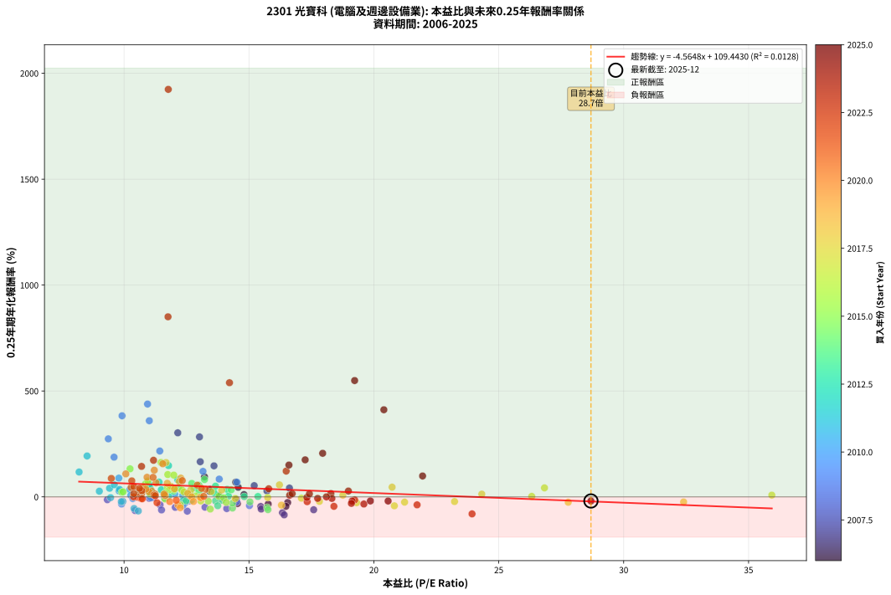
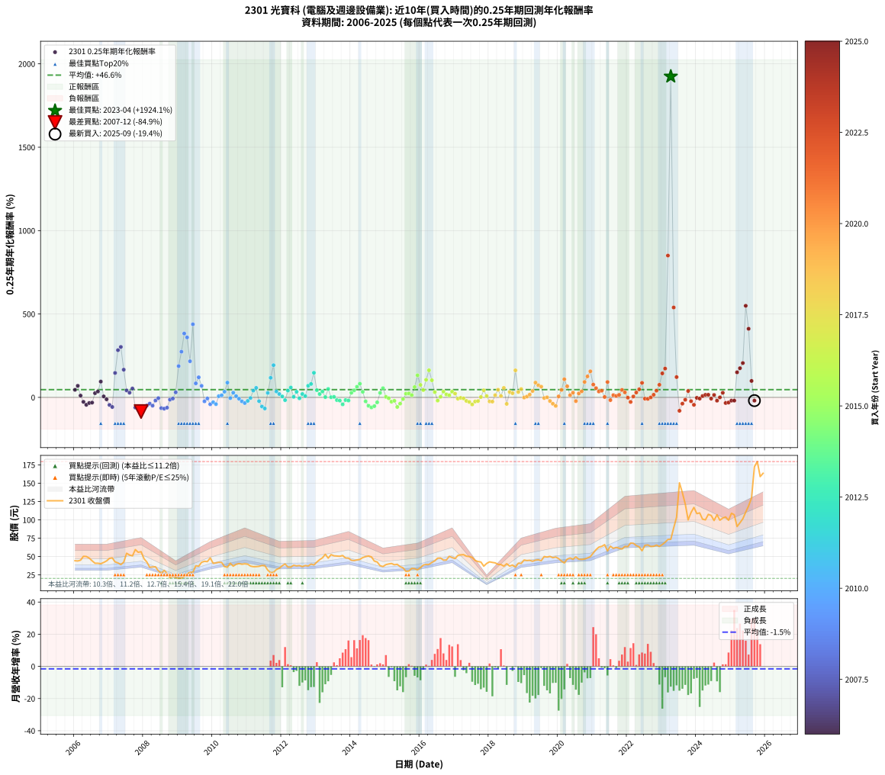

# 2301 光寶科 - 本益比與未來報酬率分析

!!! info "報告資訊"
    - **股票代號**: 2301
    - **公司名稱**: 光寶科
    - **產業別**: 電腦及週邊設備業
    - **分析期間**: 2006-2025 (237 個數據點)
    - **資料來源**: Type 12 (ShowMonthlyK_ChartFlow) 月收盤價與本益比
    - **報酬率口徑**: 含現金股利 (簡化: 年度合計，假設每年7/1入帳)
    - **報告生成時間**: 2026-01-09 20:29:59 CST

## 📈 視覺化圖表

### 圖表1: 本益比 vs 未來報酬率關係

*圖表1：2301 光寶科 本益比與0.25年期未來報酬率關係 (2006-2025)*

### 圖表2: 歷年買入時點的0.25年期實際報酬率

*圖表2：2301 光寶科 歷年買入時點的0.25年期實際報酬率 (2006-2025)*

## 📍 買點訊號說明

本報告提供兩種買點提示訊號（顯示於圖表2的股價子圖中）：

### ▲ 小綠色三角形（回測驗證）
- **計算方式**: 使用全部歷史資料計算本益比第25百分位數
- **用途**: 事後驗證，顯示歷史上哪些時點確實為低估區
- **限制**: 當下無法判斷，僅供回測參考
- **特性**: 後見之明（Look-Ahead Bias）

### ▲ 小橘色三角形（即時訊號）
- **計算方式**: 使用截至當月的過去5年資料計算本益比第25百分位數
- **用途**: 實際投資決策，當時即可判斷
- **優勢**: 可操作性強，符合實務需求
- **特性**: 無後見之明，滾動窗口計算

!!! tip "如何使用兩種訊號"
    - **綠色▲** 幫助理解歷史估值機會，驗證策略有效性
    - **橘色▲** 可作為實際買進參考，但仍需搭配基本面分析
    - 兩種訊號重疊時，表示即時判斷與事後驗證一致，信心度較高
    - 僅有綠色▲時，表示當時無法判斷（需要未來資料才能確認）
    - 僅有橘色▲時，表示即時判斷為買點，但事後可能不是最佳時機

## 📊 估值分析摘要

| 指標 | 數值 |
|:---:|:---:|
| **目前本益比** (2025-09) | **28.69 倍** |
| **歷史平均本益比** | 13.77 倍 |
| **估值水準** | 🔴 相對高估 |
| **預期0.25年年化報酬率** | **-21.52%** |
| **歷史平均報酬率** | +46.58% |
| **相關係數 (R²)** | 0.0128 |
| **趨勢線斜率** | -4.5648 |

!!! abstract "核心洞察"
    目前本益比顯著高於歷史平均，預期未來報酬率可能較低

    根據歷史數據回測，2301 光寶科 在目前本益比 **28.7倍** 的估值水準下，
    預期未來0.25年年化報酬率約為 **-21.5%**。

    **重要提醒**: 本分析基於歷史數據統計，實際報酬率會受到公司基本面變化、產業趨勢、
    總體經濟環境等多重因素影響。R² = 0.01 表示本益比可解釋約 1.3% 的報酬率變異。

## 📈 歷史估值統計

### 最佳買點 (最高報酬率)

| 項目 | 數值 |
|:---:|:---:|
| 起始時間 | 2023-04 |
| 當時本益比 | 11.77 倍 |
| 起始價格 | 73.5 元 |
| 0.25年後價格 | 150.5 元 |
| **0.25年年化報酬率** | **+1924.15%** |

### 最差買點 (最低報酬率)

| 項目 | 數值 |
|:---:|:---:|
| 起始時間 | 2007-12 |
| 當時本益比 | 16.41 倍 |
| 起始價格 | 56.6 元 |
| 0.25年後價格 | 35.4 元 |
| **0.25年年化報酬率** | **-84.88%** |

## 🎯 投資啟示

### 本益比與報酬率關係

趨勢線方程式: **y = -4.5648x + 109.4430**

!!! warning "強負相關"
    本益比與未來報酬率呈現強負相關。在高本益比時期買入，未來報酬率顯著較低；
    在低本益比時期買入，未來報酬率顯著較高。**估值紀律至關重要**。

### 估值區間建議

基於歷史數據分析:

- **🟢 低估區** (P/E < 11.0): 預期報酬率較高，可考慮增加持股
- **🟡 合理區** (P/E 11.0-16.5): 預期報酬率符合長期趨勢，正常持有
- **🔴 高估區** (P/E > 16.5): 預期報酬率較低，可考慮減碼或觀望

!!! danger "風險提示"
    - 過去表現不代表未來結果
    - 本分析假設公司基本面無重大結構性變化
    - 產業環境劇變可能使歷史規律失效
    - 應結合公司財報、產業趨勢、總體經濟等多重因素綜合判斷

!!! success "長期投資觀點"
    歷史數據顯示，在合理或低估的估值水準買入並長期持有，
    往往能獲得較佳的投資報酬。**耐心等待好價格**是價值投資的核心原則。

## 📊 數據品質

- **資料來源**: GoodInfo.tw Type 12 (ShowMonthlyK_ChartFlow)
- **資料頻率**: 月度收盤價與本益比
- **回測期間**: 2006-2025
- **數據點數量**: 237 個 (每個點代表一次0.25年期回測)

### 計算方法說明

1. **0.25年期年化報酬率**:
   - 對每個歷史時點，計算其後0.25年的實際投資報酬率
   - 期末價值(不含股利): 期末價格
   - 期末價值(含現金股利): 期末價格 + 持有期間內的現金股利合計 (簡化: 年度合計，假設每年7/1入帳)
   - 公式: 年化報酬率 = [(期末價值/期初價格)^(1/年數) - 1] × 100%

2. **本益比 (P/E Ratio)**:
   - 使用當時的月收盤價與EPS計算
   - 資料來源: Type 12 月度河流圖本益比數據

3. **趨勢線 (Linear Regression)**:
   - 使用最小平方法擬合線性趨勢線
   - R²值衡量本益比對報酬率的解釋能力

---

*本報告由 Stock Analysis System v1.9.0 自動生成*
*數據更新時間: 2026-01-09 20:29:59 CST*

## 📋 月度回測明細表

（每一列對應時間線圖中的一個買入點；可用來對照 SVG 圖上的每個點。）

| 買入月份 | 賣出月份 | 回測期限_年 | 實際持有年數 | 買入本益比_倍 | 買入收盤價_元 | 賣出收盤價_元 | 現金股利合計_元 | 總報酬率_pct | 年化報酬率_pct |
| --- | --- | --- | --- | --- | --- | --- | --- | --- | --- |
| 2006-01 | 2006-05 | 0.25 | 0.329 | 14.57 | 44.30 | 50.10 | 0.00 | +13.09 | +45.43 |
| 2006-02 | 2006-05 | 0.25 | 0.246 | 14.47 | 44.00 | 50.10 | 0.00 | +13.86 | +69.37 |
| 2006-03 | 2006-07 | 0.25 | 0.334 | 14.80 | 45.00 | 44.20 | 2.36 | +3.47 | +10.74 |
| 2006-04 | 2006-07 | 0.25 | 0.249 | 16.55 | 50.30 | 44.20 | 2.36 | -7.44 | -26.66 |
| 2006-05 | 2006-08 | 0.25 | 0.252 | 16.48 | 50.10 | 40.85 | 2.36 | -13.75 | -44.42 |
| 2006-06 | 2006-09 | 0.25 | 0.252 | 15.77 | 47.95 | 40.85 | 2.36 | -9.89 | -33.85 |
| 2006-07 | 2006-10 | 0.25 | 0.252 | 14.54 | 44.20 | 40.20 | 0.00 | -9.05 | -31.38 |
| 2006-08 | 2006-12 | 0.25 | 0.334 | 13.44 | 40.85 | 44.05 | 0.00 | +7.83 | +25.33 |
| 2006-09 | 2006-12 | 0.25 | 0.249 | 13.44 | 40.85 | 44.05 | 0.00 | +7.83 | +35.35 |
| 2006-10 | 2007-01 | 0.25 | 0.252 | 13.22 | 40.20 | 47.55 | 0.00 | +18.28 | +94.77 |
| 2006-11 | 2007-03 | 0.25 | 0.329 | 13.80 | 41.95 | 42.75 | 0.00 | +1.91 | +5.92 |
| 2006-12 | 2007-03 | 0.25 | 0.246 | 14.49 | 44.05 | 42.75 | 0.00 | -2.95 | -11.45 |
| 2007-01 | 2007-05 | 0.25 | 0.329 | 15.47 | 47.55 | 39.00 | 0.00 | -17.98 | -45.30 |
| 2007-02 | 2007-05 | 0.25 | 0.246 | 15.49 | 48.15 | 39.00 | 0.00 | -19.00 | -57.49 |
| 2007-03 | 2007-07 | 0.25 | 0.334 | 13.60 | 42.75 | 54.50 | 3.29 | +35.17 | +146.52 |
| 2007-04 | 2007-07 | 0.25 | 0.249 | 13.02 | 41.35 | 54.50 | 3.29 | +39.75 | +283.16 |
| 2007-05 | 2007-08 | 0.25 | 0.252 | 12.15 | 39.00 | 52.10 | 3.29 | +42.02 | +302.52 |
| 2007-06 | 2007-09 | 0.25 | 0.252 | 13.05 | 42.35 | 50.90 | 3.29 | +27.95 | +166.03 |
| 2007-07 | 2007-10 | 0.25 | 0.252 | 16.62 | 54.50 | 59.50 | 0.00 | +9.17 | +41.69 |
| 2007-08 | 2007-12 | 0.25 | 0.334 | 15.72 | 52.10 | 56.60 | 0.00 | +8.64 | +28.15 |
| 2007-09 | 2007-12 | 0.25 | 0.249 | 15.21 | 50.90 | 56.60 | 0.00 | +11.20 | +53.12 |
| 2007-10 | 2008-01 | 0.25 | 0.252 | 17.59 | 59.50 | 47.00 | 0.00 | -21.01 | -60.79 |
| 2007-11 | 2008-03 | 0.25 | 0.331 | 16.34 | 55.80 | 35.35 | 0.00 | -36.65 | -74.79 |
| 2007-12 | 2008-03 | 0.25 | 0.249 | 16.41 | 56.60 | 35.35 | 0.00 | -37.54 | -84.88 |
| 2008-01 | 2008-05 | 0.25 | 0.331 | 14.11 | 47.00 | 36.00 | 0.00 | -23.40 | -55.28 |
| 2008-02 | 2008-05 | 0.25 | 0.249 | 13.24 | 42.50 | 36.00 | 0.00 | -15.29 | -48.64 |
| 2008-03 | 2008-07 | 0.25 | 0.334 | 11.44 | 35.35 | 27.25 | 2.95 | -14.57 | -37.59 |
| 2008-04 | 2008-07 | 0.25 | 0.249 | 12.05 | 35.80 | 27.25 | 2.95 | -15.64 | -49.48 |
| 2008-05 | 2008-08 | 0.25 | 0.252 | 12.63 | 36.00 | 31.20 | 2.95 | -5.14 | -18.90 |
| 2008-06 | 2008-09 | 0.25 | 0.252 | 11.19 | 30.55 | 27.25 | 2.95 | -1.15 | -4.47 |
| 2008-07 | 2008-10 | 0.25 | 0.252 | 10.44 | 27.25 | 21.00 | 0.00 | -22.94 | -64.45 |
| 2008-08 | 2008-12 | 0.25 | 0.334 | 12.53 | 31.20 | 21.45 | 0.00 | -31.25 | -67.43 |
| 2008-09 | 2008-12 | 0.25 | 0.249 | 11.50 | 27.25 | 21.45 | 0.00 | -21.28 | -61.73 |
| 2008-10 | 2009-01 | 0.25 | 0.252 | 9.33 | 21.00 | 20.25 | 0.00 | -3.57 | -13.44 |
| 2008-11 | 2009-03 | 0.25 | 0.329 | 11.01 | 23.45 | 22.90 | 0.00 | -2.35 | -6.97 |
| 2008-12 | 2009-03 | 0.25 | 0.246 | 10.67 | 21.45 | 22.90 | 0.00 | +6.76 | +30.40 |
| 2009-01 | 2009-05 | 0.25 | 0.329 | 9.60 | 20.25 | 28.65 | 0.00 | +41.48 | +187.54 |
| 2009-02 | 2009-05 | 0.25 | 0.246 | 9.37 | 20.70 | 28.65 | 0.00 | +38.41 | +273.98 |
| 2009-03 | 2009-07 | 0.25 | 0.334 | 9.92 | 22.90 | 37.35 | 1.40 | +69.21 | +382.95 |
| 2009-04 | 2009-07 | 0.25 | 0.249 | 11.01 | 26.50 | 37.35 | 1.40 | +46.23 | +359.59 |
| 2009-05 | 2009-08 | 0.25 | 0.252 | 11.43 | 28.65 | 36.90 | 1.40 | +33.68 | +216.61 |
| 2009-06 | 2009-09 | 0.25 | 0.252 | 10.94 | 28.50 | 42.15 | 1.40 | +52.81 | +438.36 |
| 2009-07 | 2009-10 | 0.25 | 0.252 | 13.81 | 37.35 | 43.55 | 0.00 | +16.60 | +83.99 |
| 2009-08 | 2009-12 | 0.25 | 0.334 | 13.16 | 36.90 | 48.05 | 0.00 | +30.22 | +120.44 |
| 2009-09 | 2009-12 | 0.25 | 0.249 | 14.52 | 42.15 | 48.05 | 0.00 | +14.00 | +69.19 |
| 2009-10 | 2010-01 | 0.25 | 0.252 | 14.51 | 43.55 | 40.70 | 0.00 | -6.54 | -23.56 |
| 2009-11 | 2010-03 | 0.25 | 0.329 | 13.90 | 43.10 | 42.15 | 0.00 | -2.20 | -6.56 |
| 2009-12 | 2010-03 | 0.25 | 0.246 | 15.02 | 48.05 | 42.15 | 0.00 | -12.28 | -41.24 |
| 2010-01 | 2010-05 | 0.25 | 0.329 | 12.44 | 40.70 | 36.35 | 0.00 | -10.69 | -29.11 |
| 2010-02 | 2010-05 | 0.25 | 0.246 | 12.36 | 41.30 | 36.35 | 0.00 | -11.99 | -40.44 |
| 2010-03 | 2010-07 | 0.25 | 0.334 | 12.35 | 42.15 | 40.90 | 2.25 | +2.37 | +7.27 |
| 2010-04 | 2010-07 | 0.25 | 0.249 | 12.03 | 41.90 | 40.90 | 2.25 | +2.98 | +12.52 |
| 2010-05 | 2010-08 | 0.25 | 0.252 | 10.23 | 36.35 | 36.90 | 2.25 | +7.70 | +34.26 |
| 2010-06 | 2010-09 | 0.25 | 0.252 | 9.79 | 35.50 | 39.40 | 2.25 | +17.32 | +88.57 |
| 2010-07 | 2010-10 | 0.25 | 0.252 | 11.07 | 40.90 | 40.45 | 0.00 | -1.10 | -4.30 |
| 2010-08 | 2010-12 | 0.25 | 0.334 | 9.80 | 36.90 | 40.10 | 0.00 | +8.67 | +28.27 |
| 2010-09 | 2010-12 | 0.25 | 0.249 | 10.27 | 39.40 | 40.10 | 0.00 | +1.78 | +7.32 |
| 2010-10 | 2011-01 | 0.25 | 0.252 | 10.35 | 40.45 | 39.60 | 0.00 | -2.10 | -8.09 |
| 2010-11 | 2011-03 | 0.25 | 0.329 | 9.94 | 39.55 | 36.20 | 0.00 | -8.47 | -23.62 |
| 2010-12 | 2011-03 | 0.25 | 0.246 | 9.90 | 40.10 | 36.20 | 0.00 | -9.73 | -33.98 |
| 2011-01 | 2011-05 | 0.25 | 0.329 | 9.95 | 39.60 | 36.65 | 0.00 | -7.45 | -20.99 |
| 2011-02 | 2011-05 | 0.25 | 0.246 | 9.46 | 37.00 | 36.65 | 0.00 | -0.95 | -3.78 |
| 2011-03 | 2011-07 | 0.25 | 0.334 | 9.42 | 36.20 | 37.70 | 2.87 | +12.07 | +40.66 |
| 2011-04 | 2011-07 | 0.25 | 0.249 | 9.61 | 36.25 | 37.70 | 2.87 | +11.92 | +57.13 |
| 2011-05 | 2011-08 | 0.25 | 0.252 | 9.89 | 36.65 | 31.50 | 2.87 | -6.22 | -22.51 |
| 2011-06 | 2011-09 | 0.25 | 0.252 | 10.40 | 37.80 | 28.10 | 2.87 | -18.07 | -54.67 |
| 2011-07 | 2011-10 | 0.25 | 0.252 | 10.57 | 37.70 | 28.60 | 0.00 | -24.14 | -66.60 |
| 2011-08 | 2011-12 | 0.25 | 0.334 | 9.01 | 31.50 | 34.10 | 0.00 | +8.25 | +26.80 |
| 2011-09 | 2011-12 | 0.25 | 0.249 | 8.20 | 28.10 | 34.10 | 0.00 | +21.35 | +117.44 |
| 2011-10 | 2012-01 | 0.25 | 0.252 | 8.52 | 28.60 | 37.50 | 0.00 | +31.12 | +193.19 |
| 2011-11 | 2012-03 | 0.25 | 0.331 | 9.82 | 32.30 | 35.70 | 0.00 | +10.53 | +35.27 |
| 2011-12 | 2012-03 | 0.25 | 0.249 | 10.59 | 34.10 | 35.70 | 0.00 | +4.69 | +20.21 |
| 2012-01 | 2012-05 | 0.25 | 0.331 | 11.63 | 37.50 | 38.20 | 0.00 | +1.87 | +5.74 |
| 2012-02 | 2012-05 | 0.25 | 0.249 | 12.37 | 39.95 | 38.20 | 0.00 | -4.38 | -16.46 |
| 2012-03 | 2012-07 | 0.25 | 0.334 | 11.04 | 35.70 | 37.75 | 2.27 | +12.10 | +40.77 |
| 2012-04 | 2012-07 | 0.25 | 0.249 | 11.01 | 35.65 | 37.75 | 2.27 | +12.26 | +59.06 |
| 2012-05 | 2012-08 | 0.25 | 0.252 | 11.78 | 38.20 | 36.25 | 2.27 | +0.84 | +3.37 |
| 2012-06 | 2012-09 | 0.25 | 0.252 | 11.49 | 37.30 | 37.85 | 2.27 | +7.56 | +33.56 |
| 2012-07 | 2012-10 | 0.25 | 0.252 | 11.62 | 37.75 | 37.20 | 0.00 | -1.46 | -5.66 |
| 2012-08 | 2012-12 | 0.25 | 0.334 | 11.14 | 36.25 | 38.55 | 0.00 | +6.34 | +20.22 |
| 2012-09 | 2012-12 | 0.25 | 0.249 | 11.62 | 37.85 | 38.55 | 0.00 | +1.85 | +7.63 |
| 2012-10 | 2013-01 | 0.25 | 0.252 | 11.40 | 37.20 | 42.50 | 0.00 | +14.25 | +69.69 |
| 2012-11 | 2013-03 | 0.25 | 0.329 | 12.15 | 39.70 | 48.20 | 0.00 | +21.41 | +80.49 |
| 2012-12 | 2013-03 | 0.25 | 0.246 | 11.78 | 38.55 | 48.20 | 0.00 | +25.03 | +147.60 |
| 2013-01 | 2013-05 | 0.25 | 0.329 | 12.81 | 42.50 | 47.85 | 0.00 | +12.59 | +43.46 |
| 2013-02 | 2013-05 | 0.25 | 0.246 | 13.60 | 45.75 | 47.85 | 0.00 | +4.59 | +19.98 |
| 2013-03 | 2013-07 | 0.25 | 0.334 | 14.13 | 48.20 | 51.00 | 2.34 | +10.67 | +35.45 |
| 2013-04 | 2013-07 | 0.25 | 0.249 | 15.36 | 53.10 | 51.00 | 2.34 | +0.45 | +1.83 |
| 2013-05 | 2013-08 | 0.25 | 0.252 | 13.66 | 47.85 | 50.70 | 2.34 | +10.85 | +50.52 |
| 2013-06 | 2013-09 | 0.25 | 0.252 | 14.81 | 52.60 | 50.40 | 2.34 | +0.27 | +1.07 |
| 2013-07 | 2013-10 | 0.25 | 0.252 | 14.18 | 51.00 | 51.40 | 0.00 | +0.78 | +3.15 |
| 2013-08 | 2013-12 | 0.25 | 0.334 | 13.91 | 50.70 | 47.80 | 0.00 | -5.72 | -16.17 |
| 2013-09 | 2013-12 | 0.25 | 0.249 | 13.66 | 50.40 | 47.80 | 0.00 | -5.16 | -19.15 |
| 2013-10 | 2014-01 | 0.25 | 0.252 | 13.75 | 51.40 | 44.85 | 0.00 | -12.74 | -41.79 |
| 2013-11 | 2014-03 | 0.25 | 0.329 | 12.70 | 48.05 | 45.40 | 0.00 | -5.52 | -15.86 |
| 2013-12 | 2014-03 | 0.25 | 0.246 | 12.48 | 47.80 | 45.40 | 0.00 | -5.02 | -18.87 |
| 2014-01 | 2014-05 | 0.25 | 0.329 | 11.98 | 44.85 | 48.60 | 0.00 | +8.36 | +27.69 |
| 2014-02 | 2014-05 | 0.25 | 0.246 | 12.18 | 44.55 | 48.60 | 0.00 | +9.09 | +42.35 |
| 2014-03 | 2014-07 | 0.25 | 0.334 | 12.71 | 45.40 | 50.80 | 2.71 | +17.87 | +63.59 |
| 2014-04 | 2014-07 | 0.25 | 0.249 | 13.22 | 46.10 | 50.80 | 2.71 | +16.08 | +81.92 |
| 2014-05 | 2014-08 | 0.25 | 0.252 | 14.29 | 48.60 | 49.55 | 2.71 | +7.53 | +33.43 |
| 2014-06 | 2014-09 | 0.25 | 0.252 | 15.04 | 49.85 | 43.85 | 2.71 | -6.60 | -23.73 |
| 2014-07 | 2014-10 | 0.25 | 0.252 | 15.73 | 50.80 | 42.60 | 0.00 | -16.14 | -50.29 |
| 2014-08 | 2014-12 | 0.25 | 0.334 | 15.76 | 49.55 | 36.40 | 0.00 | -26.54 | -60.28 |
| 2014-09 | 2014-12 | 0.25 | 0.249 | 14.34 | 43.85 | 36.40 | 0.00 | -16.99 | -52.64 |
| 2014-10 | 2015-01 | 0.25 | 0.252 | 14.34 | 42.60 | 39.00 | 0.00 | -8.45 | -29.57 |
| 2014-11 | 2015-03 | 0.25 | 0.329 | 13.00 | 37.50 | 40.55 | 0.00 | +8.13 | +26.87 |
| 2014-12 | 2015-03 | 0.25 | 0.246 | 13.00 | 36.40 | 40.55 | 0.00 | +11.40 | +54.99 |
| 2015-01 | 2015-05 | 0.25 | 0.329 | 13.80 | 39.00 | 39.40 | 0.00 | +1.03 | +3.15 |
| 2015-02 | 2015-05 | 0.25 | 0.246 | 13.99 | 39.90 | 39.40 | 0.00 | -1.25 | -4.99 |
| 2015-03 | 2015-07 | 0.25 | 0.334 | 14.09 | 40.55 | 34.70 | 1.97 | -9.57 | -26.00 |
| 2015-04 | 2015-07 | 0.25 | 0.249 | 13.37 | 38.80 | 34.70 | 1.97 | -5.49 | -20.28 |
| 2015-05 | 2015-08 | 0.25 | 0.252 | 13.45 | 39.40 | 29.80 | 1.97 | -19.37 | -57.45 |
| 2015-06 | 2015-09 | 0.25 | 0.252 | 12.25 | 36.20 | 30.20 | 1.97 | -11.13 | -37.41 |
| 2015-07 | 2015-10 | 0.25 | 0.252 | 11.64 | 34.70 | 33.80 | 0.00 | -2.59 | -9.91 |
| 2015-08 | 2015-12 | 0.25 | 0.334 | 9.91 | 29.80 | 31.85 | 0.00 | +6.88 | +22.04 |
| 2015-09 | 2015-12 | 0.25 | 0.249 | 9.96 | 30.20 | 31.85 | 0.00 | +5.46 | +23.80 |
| 2015-10 | 2016-01 | 0.25 | 0.252 | 11.05 | 33.80 | 34.90 | 0.00 | +3.25 | +13.56 |
| 2015-11 | 2016-03 | 0.25 | 0.331 | 10.86 | 33.50 | 39.30 | 0.00 | +17.31 | +61.93 |
| 2015-12 | 2016-03 | 0.25 | 0.249 | 10.24 | 31.85 | 39.30 | 0.00 | +23.39 | +132.48 |
| 2016-01 | 2016-05 | 0.25 | 0.331 | 10.95 | 34.90 | 42.00 | 0.00 | +20.34 | +74.89 |
| 2016-02 | 2016-05 | 0.25 | 0.249 | 11.74 | 38.35 | 42.00 | 0.00 | +9.52 | +44.04 |
| 2016-03 | 2016-07 | 0.25 | 0.334 | 11.75 | 39.30 | 47.80 | 2.19 | +27.19 | +105.46 |
| 2016-04 | 2016-07 | 0.25 | 0.249 | 11.48 | 39.30 | 47.80 | 2.19 | +27.19 | +162.58 |
| 2016-05 | 2016-08 | 0.25 | 0.252 | 11.99 | 42.00 | 48.00 | 2.19 | +19.49 | +102.78 |
| 2016-06 | 2016-09 | 0.25 | 0.252 | 12.32 | 44.10 | 45.10 | 2.19 | +7.22 | +31.91 |
| 2016-07 | 2016-10 | 0.25 | 0.252 | 13.07 | 47.80 | 45.30 | 0.00 | -5.23 | -19.21 |
| 2016-08 | 2016-12 | 0.25 | 0.334 | 12.85 | 48.00 | 48.60 | 0.00 | +1.25 | +3.79 |
| 2016-09 | 2016-12 | 0.25 | 0.249 | 11.82 | 45.10 | 48.60 | 0.00 | +7.76 | +34.98 |
| 2016-10 | 2017-01 | 0.25 | 0.252 | 11.64 | 45.30 | 47.20 | 0.00 | +4.19 | +17.72 |
| 2016-11 | 2017-03 | 0.25 | 0.329 | 12.66 | 50.30 | 52.30 | 0.00 | +3.98 | +12.60 |
| 2016-12 | 2017-03 | 0.25 | 0.246 | 12.00 | 48.60 | 52.30 | 0.00 | +7.61 | +34.69 |
| 2017-01 | 2017-05 | 0.25 | 0.329 | 12.40 | 47.20 | 50.50 | 0.00 | +6.99 | +22.84 |
| 2017-02 | 2017-05 | 0.25 | 0.246 | 14.45 | 51.50 | 50.50 | 0.00 | -1.94 | -7.65 |
| 2017-03 | 2017-07 | 0.25 | 0.334 | 15.75 | 52.30 | 48.85 | 2.92 | -1.01 | -3.00 |
| 2017-04 | 2017-07 | 0.25 | 0.249 | 17.10 | 52.60 | 48.85 | 2.92 | -1.58 | -6.18 |
| 2017-05 | 2017-08 | 0.25 | 0.252 | 17.82 | 50.50 | 44.65 | 2.92 | -5.80 | -21.12 |
| 2017-06 | 2017-09 | 0.25 | 0.252 | 19.31 | 50.00 | 43.20 | 2.92 | -7.76 | -27.44 |
| 2017-07 | 2017-10 | 0.25 | 0.252 | 20.82 | 48.85 | 42.55 | 0.00 | -12.90 | -42.20 |
| 2017-08 | 2017-12 | 0.25 | 0.334 | 21.23 | 44.65 | 40.60 | 0.00 | -9.07 | -24.77 |
| 2017-09 | 2017-12 | 0.25 | 0.249 | 23.23 | 43.20 | 40.60 | 0.00 | -6.02 | -22.05 |
| 2017-10 | 2018-01 | 0.25 | 0.252 | 26.32 | 42.55 | 42.80 | 0.00 | +0.59 | +2.35 |
| 2017-11 | 2018-03 | 0.25 | 0.329 | 26.83 | 36.85 | 41.40 | 0.00 | +12.35 | +42.53 |
| 2017-12 | 2018-03 | 0.25 | 0.246 | 35.93 | 40.60 | 41.40 | 0.00 | +1.97 | +8.24 |
| 2018-01 | 2018-05 | 0.25 | 0.329 | 32.40 | 42.80 | 39.10 | 0.00 | -8.64 | -24.06 |
| 2018-02 | 2018-05 | 0.25 | 0.246 | 27.78 | 42.00 | 39.10 | 0.00 | -6.90 | -25.20 |
| 2018-03 | 2018-07 | 0.25 | 0.334 | 24.32 | 41.40 | 40.20 | 2.92 | +4.15 | +12.96 |
| 2018-04 | 2018-07 | 0.25 | 0.249 | 20.73 | 39.25 | 40.20 | 2.92 | +9.86 | +45.85 |
| 2018-05 | 2018-08 | 0.25 | 0.252 | 18.76 | 39.10 | 36.95 | 2.92 | +1.97 | +8.05 |
| 2018-06 | 2018-09 | 0.25 | 0.252 | 16.22 | 36.90 | 38.40 | 2.92 | +11.98 | +56.70 |
| 2018-07 | 2018-10 | 0.25 | 0.252 | 16.30 | 40.20 | 35.50 | 0.00 | -11.69 | -38.96 |
| 2018-08 | 2018-12 | 0.25 | 0.334 | 13.91 | 36.95 | 40.60 | 0.00 | +9.88 | +32.58 |
| 2018-09 | 2018-12 | 0.25 | 0.249 | 13.49 | 38.40 | 40.60 | 0.00 | +5.73 | +25.06 |
| 2018-10 | 2019-01 | 0.25 | 0.252 | 11.68 | 35.50 | 45.25 | 0.00 | +27.46 | +162.07 |
| 2018-11 | 2019-03 | 0.25 | 0.329 | 12.67 | 40.90 | 44.85 | 0.00 | +9.66 | +32.39 |
| 2018-12 | 2019-03 | 0.25 | 0.246 | 11.87 | 40.60 | 44.85 | 0.00 | +10.47 | +49.78 |
| 2019-01 | 2019-05 | 0.25 | 0.329 | 13.04 | 45.25 | 45.10 | 0.00 | -0.33 | -1.01 |
| 2019-02 | 2019-05 | 0.25 | 0.246 | 12.65 | 44.55 | 45.10 | 0.00 | +1.23 | +5.11 |
| 2019-03 | 2019-07 | 0.25 | 0.334 | 12.55 | 44.85 | 44.30 | 2.92 | +5.28 | +16.67 |
| 2019-04 | 2019-07 | 0.25 | 0.249 | 12.02 | 43.55 | 44.30 | 2.92 | +8.43 | +38.37 |
| 2019-05 | 2019-08 | 0.25 | 0.252 | 12.27 | 45.10 | 50.00 | 2.92 | +17.34 | +88.67 |
| 2019-06 | 2019-09 | 0.25 | 0.252 | 12.21 | 45.50 | 49.30 | 2.92 | +14.77 | +72.79 |
| 2019-07 | 2019-10 | 0.25 | 0.252 | 11.73 | 44.30 | 50.20 | 0.00 | +13.32 | +64.28 |
| 2019-08 | 2019-12 | 0.25 | 0.334 | 13.07 | 50.00 | 49.35 | 0.00 | -1.30 | -3.84 |
| 2019-09 | 2019-12 | 0.25 | 0.249 | 12.71 | 49.30 | 49.35 | 0.00 | +0.10 | +0.41 |
| 2019-10 | 2020-01 | 0.25 | 0.252 | 12.78 | 50.20 | 47.20 | 0.00 | -5.98 | -21.70 |
| 2019-11 | 2020-03 | 0.25 | 0.331 | 12.16 | 48.40 | 41.30 | 0.00 | -14.67 | -38.05 |
| 2019-12 | 2020-03 | 0.25 | 0.249 | 12.25 | 49.35 | 41.30 | 0.00 | -16.31 | -51.07 |
| 2020-01 | 2020-05 | 0.25 | 0.331 | 11.64 | 47.20 | 48.10 | 0.00 | +1.91 | +5.87 |
| 2020-02 | 2020-05 | 0.25 | 0.249 | 10.76 | 43.85 | 48.10 | 0.00 | +9.69 | +44.96 |
| 2020-03 | 2020-07 | 0.25 | 0.334 | 10.07 | 41.30 | 49.60 | 3.20 | +27.85 | +108.64 |
| 2020-04 | 2020-07 | 0.25 | 0.249 | 11.28 | 46.50 | 49.60 | 3.20 | +13.55 | +66.53 |
| 2020-05 | 2020-08 | 0.25 | 0.252 | 11.60 | 48.10 | 46.40 | 3.20 | +3.12 | +12.97 |
| 2020-06 | 2020-09 | 0.25 | 0.252 | 11.10 | 46.30 | 46.10 | 3.20 | +6.48 | +28.31 |
| 2020-07 | 2020-10 | 0.25 | 0.252 | 11.83 | 49.60 | 46.55 | 0.00 | -6.15 | -22.27 |
| 2020-08 | 2020-12 | 0.25 | 0.334 | 11.00 | 46.40 | 49.80 | 0.00 | +7.33 | +23.58 |
| 2020-09 | 2020-12 | 0.25 | 0.249 | 10.87 | 46.10 | 49.80 | 0.00 | +8.03 | +36.32 |
| 2020-10 | 2021-01 | 0.25 | 0.252 | 10.92 | 46.55 | 54.90 | 0.00 | +17.94 | +92.52 |
| 2020-11 | 2021-03 | 0.25 | 0.329 | 11.21 | 48.05 | 62.80 | 0.00 | +30.70 | +125.88 |
| 2020-12 | 2021-03 | 0.25 | 0.246 | 11.55 | 49.80 | 62.80 | 0.00 | +26.10 | +156.33 |
| 2021-01 | 2021-05 | 0.25 | 0.329 | 12.33 | 54.90 | 66.20 | 0.00 | +20.58 | +76.77 |
| 2021-02 | 2021-05 | 0.25 | 0.246 | 12.93 | 59.40 | 66.20 | 0.00 | +11.45 | +55.25 |
| 2021-03 | 2021-07 | 0.25 | 0.334 | 13.26 | 62.80 | 64.10 | 5.40 | +10.67 | +35.46 |
| 2021-04 | 2021-07 | 0.25 | 0.249 | 13.10 | 63.90 | 64.10 | 5.40 | +8.76 | +40.10 |
| 2021-05 | 2021-08 | 0.25 | 0.252 | 13.19 | 66.20 | 61.20 | 5.40 | +0.60 | +2.42 |
| 2021-06 | 2021-09 | 0.25 | 0.252 | 11.16 | 57.60 | 62.50 | 5.40 | +17.88 | +92.16 |
| 2021-07 | 2021-10 | 0.25 | 0.252 | 12.09 | 64.10 | 61.30 | 0.00 | -4.37 | -16.25 |
| 2021-08 | 2021-12 | 0.25 | 0.334 | 11.24 | 61.20 | 63.80 | 0.00 | +4.25 | +13.27 |
| 2021-09 | 2021-12 | 0.25 | 0.249 | 11.19 | 62.50 | 63.80 | 0.00 | +2.08 | +8.61 |
| 2021-10 | 2022-01 | 0.25 | 0.252 | 10.70 | 61.30 | 63.50 | 0.00 | +3.59 | +15.03 |
| 2021-11 | 2022-03 | 0.25 | 0.329 | 10.28 | 60.30 | 68.10 | 0.00 | +12.94 | +44.81 |
| 2021-12 | 2022-03 | 0.25 | 0.246 | 10.62 | 63.80 | 68.10 | 0.00 | +6.74 | +30.30 |
| 2022-01 | 2022-05 | 0.25 | 0.329 | 10.54 | 63.50 | 63.20 | 0.00 | -0.47 | -1.43 |
| 2022-02 | 2022-05 | 0.25 | 0.246 | 11.32 | 68.40 | 63.20 | 0.00 | -7.60 | -27.45 |
| 2022-03 | 2022-07 | 0.25 | 0.334 | 11.25 | 68.10 | 65.30 | 4.00 | +1.76 | +5.37 |
| 2022-04 | 2022-07 | 0.25 | 0.249 | 10.71 | 65.00 | 65.30 | 4.00 | +6.62 | +29.32 |
| 2022-05 | 2022-08 | 0.25 | 0.252 | 10.39 | 63.20 | 65.80 | 4.00 | +10.44 | +48.34 |
| 2022-06 | 2022-09 | 0.25 | 0.252 | 9.49 | 57.90 | 63.80 | 4.00 | +17.10 | +87.14 |
| 2022-07 | 2022-10 | 0.25 | 0.252 | 10.68 | 65.30 | 64.00 | 0.00 | -1.99 | -7.67 |
| 2022-08 | 2022-12 | 0.25 | 0.334 | 10.73 | 65.80 | 63.80 | 0.00 | -3.04 | -8.83 |
| 2022-09 | 2022-12 | 0.25 | 0.249 | 10.38 | 63.80 | 63.80 | 0.00 | +0.00 | +0.00 |
| 2022-10 | 2023-01 | 0.25 | 0.252 | 10.39 | 64.00 | 66.40 | 0.00 | +3.75 | +15.74 |
| 2022-11 | 2023-03 | 0.25 | 0.329 | 10.62 | 65.60 | 73.30 | 0.00 | +11.74 | +40.19 |
| 2022-12 | 2023-03 | 0.25 | 0.246 | 10.31 | 63.80 | 73.30 | 0.00 | +14.89 | +75.65 |
| 2023-01 | 2023-05 | 0.25 | 0.329 | 10.70 | 66.40 | 89.00 | 0.00 | +34.04 | +143.91 |
| 2023-02 | 2023-05 | 0.25 | 0.246 | 11.18 | 69.50 | 89.00 | 0.00 | +28.06 | +172.83 |
| 2023-03 | 2023-07 | 0.25 | 0.334 | 11.76 | 73.30 | 150.50 | 5.00 | +112.14 | +850.32 |
| 2023-04 | 2023-07 | 0.25 | 0.249 | 11.77 | 73.50 | 150.50 | 5.00 | +111.56 | +1924.15 |
| 2023-05 | 2023-08 | 0.25 | 0.252 | 14.22 | 89.00 | 137.00 | 5.00 | +59.55 | +539.04 |
| 2023-06 | 2023-09 | 0.25 | 0.252 | 16.49 | 103.50 | 121.50 | 5.00 | +22.22 | +121.82 |
| 2023-07 | 2023-10 | 0.25 | 0.252 | 23.93 | 150.50 | 100.00 | 0.00 | -33.55 | -80.27 |
| 2023-08 | 2023-12 | 0.25 | 0.334 | 21.73 | 137.00 | 117.00 | 0.00 | -14.60 | -37.65 |
| 2023-09 | 2023-12 | 0.25 | 0.249 | 19.23 | 121.50 | 117.00 | 0.00 | -3.70 | -14.06 |
| 2023-10 | 2024-01 | 0.25 | 0.252 | 15.79 | 100.00 | 108.50 | 0.00 | +8.50 | +38.25 |
| 2023-11 | 2024-03 | 0.25 | 0.331 | 17.33 | 110.00 | 101.00 | 0.00 | -8.18 | -22.71 |
| 2023-12 | 2024-03 | 0.25 | 0.249 | 18.40 | 117.00 | 101.00 | 0.00 | -13.68 | -44.58 |
| 2024-01 | 2024-05 | 0.25 | 0.331 | 17.32 | 108.50 | 107.50 | 0.00 | -0.92 | -2.76 |
| 2024-02 | 2024-05 | 0.25 | 0.249 | 17.75 | 109.50 | 107.50 | 0.00 | -1.83 | -7.13 |
| 2024-03 | 2024-07 | 0.25 | 0.334 | 16.63 | 101.00 | 99.10 | 4.51 | +2.58 | +7.93 |
| 2024-04 | 2024-07 | 0.25 | 0.249 | 16.73 | 100.00 | 99.10 | 4.51 | +3.61 | +15.28 |
| 2024-05 | 2024-08 | 0.25 | 0.252 | 18.28 | 107.50 | 107.00 | 4.51 | +3.73 | +15.63 |
| 2024-06 | 2024-09 | 0.25 | 0.252 | 18.32 | 106.00 | 99.50 | 4.51 | -1.88 | -7.26 |
| 2024-07 | 2024-10 | 0.25 | 0.252 | 17.42 | 99.10 | 102.50 | 0.00 | +3.43 | +14.33 |
| 2024-08 | 2024-12 | 0.25 | 0.334 | 19.13 | 107.00 | 99.50 | 0.00 | -7.01 | -19.55 |
| 2024-09 | 2024-12 | 0.25 | 0.249 | 18.10 | 99.50 | 99.50 | 0.00 | +0.00 | +0.00 |
| 2024-10 | 2025-01 | 0.25 | 0.252 | 18.98 | 102.50 | 109.00 | 0.00 | +6.34 | +27.65 |
| 2024-11 | 2025-03 | 0.25 | 0.329 | 19.60 | 104.00 | 90.90 | 0.00 | -12.60 | -33.62 |
| 2024-12 | 2025-03 | 0.25 | 0.246 | 19.10 | 99.50 | 90.90 | 0.00 | -8.64 | -30.71 |
| 2025-01 | 2025-05 | 0.25 | 0.329 | 20.57 | 109.00 | 101.50 | 0.00 | -6.88 | -19.51 |
| 2025-02 | 2025-05 | 0.25 | 0.246 | 19.86 | 107.00 | 101.50 | 0.00 | -5.14 | -19.28 |
| 2025-03 | 2025-07 | 0.25 | 0.334 | 16.60 | 90.90 | 119.00 | 4.51 | +35.87 | +150.36 |
| 2025-04 | 2025-07 | 0.25 | 0.249 | 17.25 | 96.00 | 119.00 | 4.51 | +28.65 | +174.91 |
| 2025-05 | 2025-08 | 0.25 | 0.252 | 17.95 | 101.50 | 130.00 | 4.51 | +32.52 | +205.82 |
| 2025-06 | 2025-09 | 0.25 | 0.252 | 19.23 | 110.50 | 172.50 | 4.51 | +60.19 | +549.23 |
| 2025-07 | 2025-10 | 0.25 | 0.252 | 20.40 | 119.00 | 179.50 | 0.00 | +50.84 | +411.37 |
| 2025-08 | 2025-12 | 0.25 | 0.334 | 21.95 | 130.00 | 163.50 | 0.00 | +25.77 | +98.66 |
| 2025-09 | 2025-12 | 0.25 | 0.249 | 28.69 | 172.50 | 163.50 | 0.00 | -5.22 | -19.35 |
