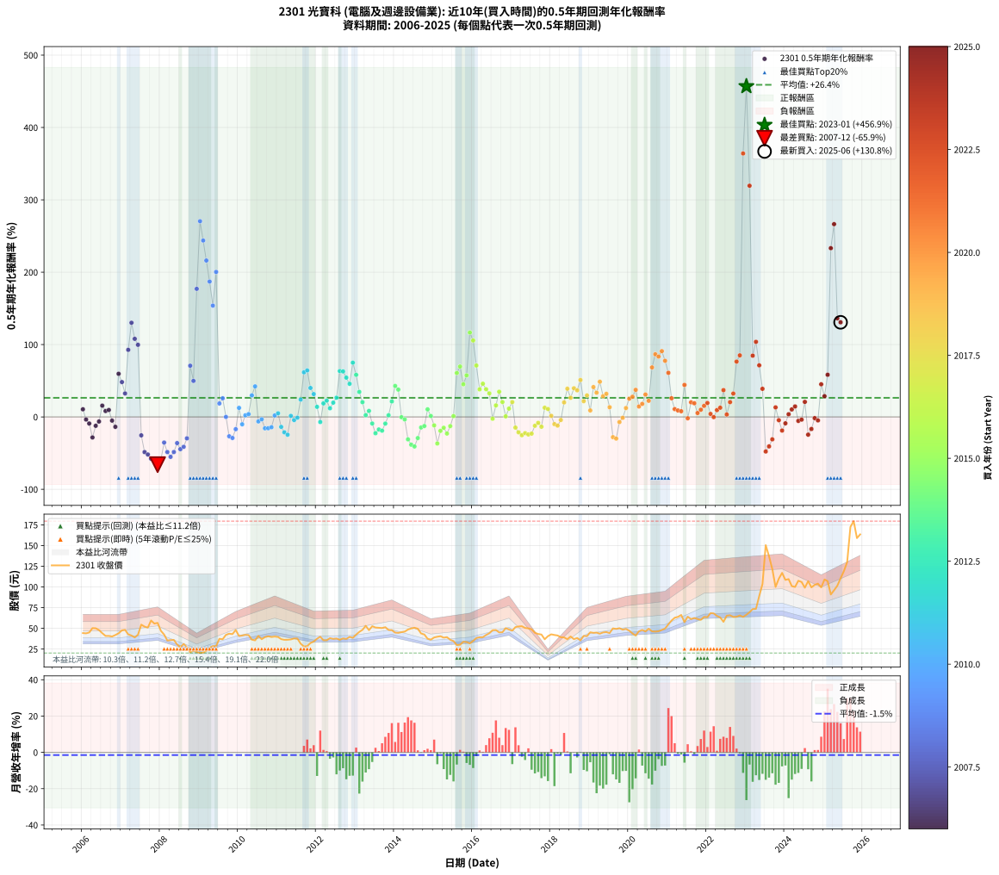

# 2301 光寶科 - 本益比與未來報酬率分析

!!! info "報告資訊"
    - **股票代號**: 2301
    - **公司名稱**: 光寶科
    - **產業別**: 電腦及週邊設備業
    - **分析期間**: 2005-2025 (235 個數據點)
    - **資料來源**: Type 12 (ShowMonthlyK_ChartFlow) 月收盤價與本益比
    - **報酬率口徑**: 含現金股利 (簡化: 年度合計，假設每年7/1入帳)
    - **報告生成時間**: 2025-12-23 11:50:55 CST

## 📈 視覺化圖表

### 圖表1: 本益比 vs 未來報酬率關係

*圖表1：2301 光寶科 本益比與0.5年期未來報酬率關係 (2005-2025)*

### 圖表2: 歷年買入時點的0.5年期實際報酬率

*圖表2：2301 光寶科 歷年買入時點的0.5年期實際報酬率 (2005-2025)*

## 📍 買點訊號說明

本報告提供兩種買點提示訊號（顯示於圖表2的股價子圖中）：

### ▲ 小綠色三角形（回測驗證）
- **計算方式**: 使用全部歷史資料計算本益比第25百分位數
- **用途**: 事後驗證，顯示歷史上哪些時點確實為低估區
- **限制**: 當下無法判斷，僅供回測參考
- **特性**: 後見之明（Look-Ahead Bias）

### ▲ 小橘色三角形（即時訊號）
- **計算方式**: 使用截至當月的過去5年資料計算本益比第25百分位數
- **用途**: 實際投資決策，當時即可判斷
- **優勢**: 可操作性強，符合實務需求
- **特性**: 無後見之明，滾動窗口計算

!!! tip "如何使用兩種訊號"
    - **綠色▲** 幫助理解歷史估值機會，驗證策略有效性
    - **橘色▲** 可作為實際買進參考，但仍需搭配基本面分析
    - 兩種訊號重疊時，表示即時判斷與事後驗證一致，信心度較高
    - 僅有綠色▲時，表示當時無法判斷（需要未來資料才能確認）
    - 僅有橘色▲時，表示即時判斷為買點，但事後可能不是最佳時機

## 📊 估值分析摘要

| 指標 | 數值 |
|:---:|:---:|
| **目前本益比** (2025-06) | **19.23 倍** |
| **歷史平均本益比** | 13.60 倍 |
| **估值水準** | 🔴 相對高估 |
| **預期0.5年年化報酬率** | **+2.74%** |
| **歷史平均報酬率** | +26.25% |
| **相關係數 (R²)** | 0.0565 |
| **趨勢線斜率** | -4.1801 |

!!! abstract "核心洞察"
    目前本益比顯著高於歷史平均，預期未來報酬率可能較低

    根據歷史數據回測，2301 光寶科 在目前本益比 **19.2倍** 的估值水準下，
    預期未來0.5年年化報酬率約為 **+2.7%**。

    **重要提醒**: 本分析基於歷史數據統計，實際報酬率會受到公司基本面變化、產業趨勢、
    總體經濟環境等多重因素影響。R² = 0.06 表示本益比可解釋約 5.7% 的報酬率變異。

## 📈 歷史估值統計

### 最佳買點 (最高報酬率)

| 項目 | 數值 |
|:---:|:---:|
| 起始時間 | 2023-01 |
| 當時本益比 | 10.70 倍 |
| 起始價格 | 66.4 元 |
| 0.5年後價格 | 150.5 元 |
| **0.5年年化報酬率** | **+456.88%** |

### 最差買點 (最低報酬率)

| 項目 | 數值 |
|:---:|:---:|
| 起始時間 | 2007-12 |
| 當時本益比 | 16.41 倍 |
| 起始價格 | 56.6 元 |
| 0.5年後價格 | 27.2 元 |
| **0.5年年化報酬率** | **-65.94%** |

## 🎯 投資啟示

### 本益比與報酬率關係

趨勢線方程式: **y = -4.1801x + 83.1220**

!!! warning "強負相關"
    本益比與未來報酬率呈現強負相關。在高本益比時期買入，未來報酬率顯著較低；
    在低本益比時期買入，未來報酬率顯著較高。**估值紀律至關重要**。

### 估值區間建議

基於歷史數據分析:

- **🟢 低估區** (P/E < 10.9): 預期報酬率較高，可考慮增加持股
- **🟡 合理區** (P/E 10.9-16.3): 預期報酬率符合長期趨勢，正常持有
- **🔴 高估區** (P/E > 16.3): 預期報酬率較低，可考慮減碼或觀望

!!! danger "風險提示"
    - 過去表現不代表未來結果
    - 本分析假設公司基本面無重大結構性變化
    - 產業環境劇變可能使歷史規律失效
    - 應結合公司財報、產業趨勢、總體經濟等多重因素綜合判斷

!!! success "長期投資觀點"
    歷史數據顯示，在合理或低估的估值水準買入並長期持有，
    往往能獲得較佳的投資報酬。**耐心等待好價格**是價值投資的核心原則。

## 📊 數據品質

- **資料來源**: GoodInfo.tw Type 12 (ShowMonthlyK_ChartFlow)
- **資料頻率**: 月度收盤價與本益比
- **回測期間**: 2005-2025
- **數據點數量**: 235 個 (每個點代表一次0.5年期回測)

### 計算方法說明

1. **0.5年期年化報酬率**:
   - 對每個歷史時點，計算其後0.5年的實際投資報酬率
   - 期末價值(不含股利): 期末價格
   - 期末價值(含現金股利): 期末價格 + 持有期間內的現金股利合計 (簡化: 年度合計，假設每年7/1入帳)
   - 公式: 年化報酬率 = [(期末價值/期初價格)^(1/年數) - 1] × 100%

2. **本益比 (P/E Ratio)**:
   - 使用當時的月收盤價與EPS計算
   - 資料來源: Type 12 月度河流圖本益比數據

3. **趨勢線 (Linear Regression)**:
   - 使用最小平方法擬合線性趨勢線
   - R²值衡量本益比對報酬率的解釋能力

---

*本報告由 Stock Analysis System v1.9.0 自動生成*
*數據更新時間: 2025-12-23 11:50:55 CST*

## 📋 月度回測明細表

（每一列對應時間線圖中的一個買入點；可用來對照 SVG 圖上的每個點。）

| 買入月份 | 賣出月份 | 回測期限_年 | 實際持有年數 | 買入本益比_倍 | 買入收盤價_元 | 賣出收盤價_元 | 現金股利合計_元 | 總報酬率_pct | 年化報酬率_pct |
| --- | --- | --- | --- | --- | --- | --- | --- | --- | --- |
| 2005-12 | 2006-07 | 0.5 | 0.580 | 13.16 | 44.75 | 44.20 | 2.36 | +4.04 | +7.07 |
| 2006-01 | 2006-07 | 0.5 | 0.496 | 13.15 | 44.30 | 44.20 | 2.36 | +5.10 | +10.56 |
| 2006-02 | 2006-08 | 0.5 | 0.498 | 13.17 | 44.00 | 40.85 | 2.36 | -1.80 | -3.57 |
| 2006-03 | 2006-10 | 0.5 | 0.586 | 13.60 | 45.00 | 40.20 | 2.36 | -5.42 | -9.08 |
| 2006-04 | 2006-10 | 0.5 | 0.501 | 15.34 | 50.30 | 40.20 | 2.36 | -15.39 | -28.36 |
| 2006-05 | 2006-12 | 0.5 | 0.586 | 15.42 | 50.10 | 44.05 | 2.36 | -7.37 | -12.24 |
| 2006-06 | 2006-12 | 0.5 | 0.501 | 14.89 | 47.95 | 44.05 | 2.36 | -3.21 | -6.31 |
| 2006-07 | 2007-01 | 0.5 | 0.504 | 13.86 | 44.20 | 47.55 | 0.00 | +7.58 | +15.61 |
| 2006-08 | 2007-03 | 0.5 | 0.580 | 12.93 | 40.85 | 42.75 | 0.00 | +4.65 | +8.15 |
| 2006-09 | 2007-03 | 0.5 | 0.496 | 13.05 | 40.85 | 42.75 | 0.00 | +4.65 | +9.61 |
| 2006-10 | 2007-05 | 0.5 | 0.580 | 12.97 | 40.20 | 39.00 | 0.00 | -2.99 | -5.09 |
| 2006-11 | 2007-05 | 0.5 | 0.496 | 13.66 | 41.95 | 39.00 | 0.00 | -7.03 | -13.68 |
| 2006-12 | 2007-07 | 0.5 | 0.580 | 14.49 | 44.05 | 54.50 | 3.29 | +31.18 | +59.62 |
| 2007-01 | 2007-07 | 0.5 | 0.496 | 15.47 | 47.55 | 54.50 | 3.29 | +21.53 | +48.21 |
| 2007-02 | 2007-08 | 0.5 | 0.498 | 15.49 | 48.15 | 52.10 | 3.29 | +15.03 | +32.44 |
| 2007-03 | 2007-10 | 0.5 | 0.586 | 13.60 | 42.75 | 59.50 | 3.29 | +46.87 | +92.71 |
| 2007-04 | 2007-10 | 0.5 | 0.501 | 13.02 | 41.35 | 59.50 | 3.29 | +51.84 | +130.16 |
| 2007-05 | 2007-12 | 0.5 | 0.586 | 12.15 | 39.00 | 56.60 | 3.29 | +53.55 | +107.92 |
| 2007-06 | 2007-12 | 0.5 | 0.501 | 13.05 | 42.35 | 56.60 | 3.29 | +41.41 | +99.68 |
| 2007-07 | 2008-01 | 0.5 | 0.504 | 16.62 | 54.50 | 47.00 | 0.00 | -13.76 | -25.46 |
| 2007-08 | 2008-03 | 0.5 | 0.583 | 15.72 | 52.10 | 35.35 | 0.00 | -32.15 | -48.58 |
| 2007-09 | 2008-03 | 0.5 | 0.498 | 15.21 | 50.90 | 35.35 | 0.00 | -30.55 | -51.89 |
| 2007-10 | 2008-05 | 0.5 | 0.583 | 17.59 | 59.50 | 36.00 | 0.00 | -39.50 | -57.75 |
| 2007-11 | 2008-05 | 0.5 | 0.498 | 16.34 | 55.80 | 36.00 | 0.00 | -35.48 | -58.50 |
| 2007-12 | 2008-07 | 0.5 | 0.583 | 16.41 | 56.60 | 27.25 | 2.95 | -46.64 | -65.94 |
| 2008-01 | 2008-07 | 0.5 | 0.498 | 14.11 | 47.00 | 27.25 | 2.95 | -35.74 | -58.84 |
| 2008-02 | 2008-08 | 0.5 | 0.501 | 13.24 | 42.50 | 31.20 | 2.95 | -19.65 | -35.38 |
| 2008-03 | 2008-10 | 0.5 | 0.586 | 11.44 | 35.35 | 21.00 | 2.95 | -32.25 | -48.55 |
| 2008-04 | 2008-10 | 0.5 | 0.501 | 12.05 | 35.80 | 21.00 | 2.95 | -33.10 | -55.17 |
| 2008-05 | 2008-12 | 0.5 | 0.586 | 12.63 | 36.00 | 21.45 | 2.95 | -32.22 | -48.51 |
| 2008-06 | 2008-12 | 0.5 | 0.501 | 11.19 | 30.55 | 21.45 | 2.95 | -20.13 | -36.15 |
| 2008-07 | 2009-01 | 0.5 | 0.504 | 10.44 | 27.25 | 20.25 | 0.00 | -25.69 | -44.53 |
| 2008-08 | 2009-03 | 0.5 | 0.580 | 12.53 | 31.20 | 22.90 | 0.00 | -26.60 | -41.31 |
| 2008-09 | 2009-03 | 0.5 | 0.496 | 11.50 | 27.25 | 22.90 | 0.00 | -15.96 | -29.60 |
| 2008-10 | 2009-05 | 0.5 | 0.580 | 9.33 | 21.00 | 28.65 | 0.00 | +36.43 | +70.78 |
| 2008-11 | 2009-05 | 0.5 | 0.496 | 11.01 | 23.45 | 28.65 | 0.00 | +22.17 | +49.80 |
| 2008-12 | 2009-07 | 0.5 | 0.580 | 10.67 | 21.45 | 37.35 | 1.40 | +80.65 | +177.02 |
| 2009-01 | 2009-07 | 0.5 | 0.496 | 9.60 | 20.25 | 37.35 | 1.40 | +91.36 | +270.47 |
| 2009-02 | 2009-08 | 0.5 | 0.498 | 9.37 | 20.70 | 36.90 | 1.40 | +85.02 | +243.79 |
| 2009-03 | 2009-10 | 0.5 | 0.586 | 9.92 | 22.90 | 43.55 | 1.40 | +96.29 | +216.16 |
| 2009-04 | 2009-10 | 0.5 | 0.501 | 11.01 | 26.50 | 43.55 | 1.40 | +69.62 | +187.10 |
| 2009-05 | 2009-12 | 0.5 | 0.586 | 11.43 | 28.65 | 48.05 | 1.40 | +72.60 | +153.85 |
| 2009-06 | 2009-12 | 0.5 | 0.501 | 10.94 | 28.50 | 48.05 | 1.40 | +73.51 | +200.37 |
| 2009-07 | 2010-01 | 0.5 | 0.504 | 13.81 | 37.35 | 40.70 | 0.00 | +8.97 | +18.59 |
| 2009-08 | 2010-03 | 0.5 | 0.580 | 13.16 | 36.90 | 42.15 | 0.00 | +14.23 | +25.76 |
| 2009-09 | 2010-03 | 0.5 | 0.496 | 14.52 | 42.15 | 42.15 | 0.00 | +0.00 | +0.00 |
| 2009-10 | 2010-05 | 0.5 | 0.580 | 14.51 | 43.55 | 36.35 | 0.00 | -16.53 | -26.75 |
| 2009-11 | 2010-05 | 0.5 | 0.496 | 13.90 | 43.10 | 36.35 | 0.00 | -15.66 | -29.09 |
| 2009-12 | 2010-07 | 0.5 | 0.580 | 15.02 | 48.05 | 40.90 | 2.25 | -10.20 | -16.92 |
| 2010-01 | 2010-07 | 0.5 | 0.496 | 12.44 | 40.70 | 40.90 | 2.25 | +6.02 | +12.52 |
| 2010-02 | 2010-08 | 0.5 | 0.498 | 12.36 | 41.30 | 36.90 | 2.25 | -5.21 | -10.17 |
| 2010-03 | 2010-10 | 0.5 | 0.586 | 12.35 | 42.15 | 40.45 | 2.25 | +1.30 | +2.24 |
| 2010-04 | 2010-10 | 0.5 | 0.501 | 12.03 | 41.90 | 40.45 | 2.25 | +1.91 | +3.85 |
| 2010-05 | 2010-12 | 0.5 | 0.586 | 10.23 | 36.35 | 40.10 | 2.25 | +16.51 | +29.79 |
| 2010-06 | 2010-12 | 0.5 | 0.501 | 9.79 | 35.50 | 40.10 | 2.25 | +19.30 | +42.21 |
| 2010-07 | 2011-01 | 0.5 | 0.504 | 11.07 | 40.90 | 39.60 | 0.00 | -3.18 | -6.21 |
| 2010-08 | 2011-03 | 0.5 | 0.580 | 9.80 | 36.90 | 36.20 | 0.00 | -1.90 | -3.25 |
| 2010-09 | 2011-03 | 0.5 | 0.496 | 10.27 | 39.40 | 36.20 | 0.00 | -8.12 | -15.71 |
| 2010-10 | 2011-05 | 0.5 | 0.580 | 10.35 | 40.45 | 36.65 | 0.00 | -9.39 | -15.63 |
| 2010-11 | 2011-05 | 0.5 | 0.496 | 9.94 | 39.55 | 36.65 | 0.00 | -7.33 | -14.24 |
| 2010-12 | 2011-07 | 0.5 | 0.580 | 9.90 | 40.10 | 37.70 | 2.87 | +1.17 | +2.03 |
| 2011-01 | 2011-07 | 0.5 | 0.496 | 9.95 | 39.60 | 37.70 | 2.87 | +2.45 | +5.00 |
| 2011-02 | 2011-08 | 0.5 | 0.498 | 9.46 | 37.00 | 31.50 | 2.87 | -7.11 | -13.75 |
| 2011-03 | 2011-10 | 0.5 | 0.586 | 9.42 | 36.20 | 28.60 | 2.87 | -13.07 | -21.26 |
| 2011-04 | 2011-10 | 0.5 | 0.501 | 9.61 | 36.25 | 28.60 | 2.87 | -13.19 | -24.59 |
| 2011-05 | 2011-12 | 0.5 | 0.586 | 9.89 | 36.65 | 34.10 | 2.87 | +0.87 | +1.49 |
| 2011-06 | 2011-12 | 0.5 | 0.501 | 10.40 | 37.80 | 34.10 | 2.87 | -2.20 | -4.33 |
| 2011-07 | 2012-01 | 0.5 | 0.504 | 10.57 | 37.70 | 37.50 | 0.00 | -0.53 | -1.05 |
| 2011-08 | 2012-03 | 0.5 | 0.583 | 9.01 | 31.50 | 35.70 | 0.00 | +13.33 | +23.94 |
| 2011-09 | 2012-03 | 0.5 | 0.498 | 8.20 | 28.10 | 35.70 | 0.00 | +27.05 | +61.67 |
| 2011-10 | 2012-05 | 0.5 | 0.583 | 8.52 | 28.60 | 38.20 | 0.00 | +33.57 | +64.26 |
| 2011-11 | 2012-05 | 0.5 | 0.498 | 9.82 | 32.30 | 38.20 | 0.00 | +18.27 | +40.03 |
| 2011-12 | 2012-07 | 0.5 | 0.583 | 10.59 | 34.10 | 37.75 | 2.27 | +17.36 | +31.59 |
| 2012-01 | 2012-07 | 0.5 | 0.498 | 11.63 | 37.50 | 37.75 | 2.27 | +6.72 | +13.94 |
| 2012-02 | 2012-08 | 0.5 | 0.501 | 12.37 | 39.95 | 36.25 | 2.27 | -3.58 | -7.02 |
| 2012-03 | 2012-10 | 0.5 | 0.586 | 11.04 | 35.70 | 37.20 | 2.27 | +10.56 | +18.69 |
| 2012-04 | 2012-10 | 0.5 | 0.501 | 11.01 | 35.65 | 37.20 | 2.27 | +10.72 | +22.53 |
| 2012-05 | 2012-12 | 0.5 | 0.586 | 11.78 | 38.20 | 38.55 | 2.27 | +6.86 | +11.99 |
| 2012-06 | 2012-12 | 0.5 | 0.501 | 11.49 | 37.30 | 38.55 | 2.27 | +9.44 | +19.72 |
| 2012-07 | 2013-01 | 0.5 | 0.504 | 11.62 | 37.75 | 42.50 | 0.00 | +12.58 | +26.52 |
| 2012-08 | 2013-03 | 0.5 | 0.580 | 11.14 | 36.25 | 48.20 | 0.00 | +32.97 | +63.38 |
| 2012-09 | 2013-03 | 0.5 | 0.496 | 11.62 | 37.85 | 48.20 | 0.00 | +27.34 | +62.87 |
| 2012-10 | 2013-05 | 0.5 | 0.580 | 11.40 | 37.20 | 47.85 | 0.00 | +28.63 | +54.30 |
| 2012-11 | 2013-05 | 0.5 | 0.496 | 12.15 | 39.70 | 47.85 | 0.00 | +20.53 | +45.76 |
| 2012-12 | 2013-07 | 0.5 | 0.580 | 11.78 | 38.55 | 51.00 | 2.34 | +38.37 | +74.98 |
| 2013-01 | 2013-07 | 0.5 | 0.496 | 12.81 | 42.50 | 51.00 | 2.34 | +25.51 | +58.17 |
| 2013-02 | 2013-08 | 0.5 | 0.498 | 13.60 | 45.75 | 50.70 | 2.34 | +15.94 | +34.55 |
| 2013-03 | 2013-10 | 0.5 | 0.586 | 14.13 | 48.20 | 51.40 | 2.34 | +11.50 | +20.41 |
| 2013-04 | 2013-10 | 0.5 | 0.501 | 15.36 | 53.10 | 51.40 | 2.34 | +1.21 | +2.42 |
| 2013-05 | 2013-12 | 0.5 | 0.586 | 13.66 | 47.85 | 47.80 | 2.34 | +4.79 | +8.31 |
| 2013-06 | 2013-12 | 0.5 | 0.501 | 14.81 | 52.60 | 47.80 | 2.34 | -4.67 | -9.11 |
| 2013-07 | 2014-01 | 0.5 | 0.504 | 14.18 | 51.00 | 44.85 | 0.00 | -12.06 | -22.51 |
| 2013-08 | 2014-03 | 0.5 | 0.580 | 13.91 | 50.70 | 45.40 | 0.00 | -10.45 | -17.32 |
| 2013-09 | 2014-03 | 0.5 | 0.496 | 13.66 | 50.40 | 45.40 | 0.00 | -9.92 | -19.01 |
| 2013-10 | 2014-05 | 0.5 | 0.580 | 13.75 | 51.40 | 48.60 | 0.00 | -5.45 | -9.20 |
| 2013-11 | 2014-05 | 0.5 | 0.496 | 12.70 | 48.05 | 48.60 | 0.00 | +1.14 | +2.32 |
| 2013-12 | 2014-07 | 0.5 | 0.580 | 12.48 | 47.80 | 50.80 | 2.71 | +11.95 | +21.47 |
| 2014-01 | 2014-07 | 0.5 | 0.496 | 11.98 | 44.85 | 50.80 | 2.71 | +19.31 | +42.81 |
| 2014-02 | 2014-08 | 0.5 | 0.498 | 12.18 | 44.55 | 49.55 | 2.71 | +17.31 | +37.77 |
| 2014-03 | 2014-10 | 0.5 | 0.586 | 12.71 | 45.40 | 42.60 | 2.71 | -0.19 | -0.33 |
| 2014-04 | 2014-10 | 0.5 | 0.501 | 13.22 | 46.10 | 42.60 | 2.71 | -1.71 | -3.38 |
| 2014-05 | 2014-12 | 0.5 | 0.586 | 14.29 | 48.60 | 36.40 | 2.71 | -19.52 | -30.98 |
| 2014-06 | 2014-12 | 0.5 | 0.501 | 15.04 | 49.85 | 36.40 | 2.71 | -21.54 | -38.38 |
| 2014-07 | 2015-01 | 0.5 | 0.504 | 15.73 | 50.80 | 39.00 | 0.00 | -23.23 | -40.83 |
| 2014-08 | 2015-03 | 0.5 | 0.580 | 15.76 | 49.55 | 40.55 | 0.00 | -18.16 | -29.20 |
| 2014-09 | 2015-03 | 0.5 | 0.496 | 14.34 | 43.85 | 40.55 | 0.00 | -7.53 | -14.61 |
| 2014-10 | 2015-05 | 0.5 | 0.580 | 14.34 | 42.60 | 39.40 | 0.00 | -7.51 | -12.59 |
| 2014-11 | 2015-05 | 0.5 | 0.496 | 13.00 | 37.50 | 39.40 | 0.00 | +5.07 | +10.49 |
| 2014-12 | 2015-07 | 0.5 | 0.580 | 13.00 | 36.40 | 34.70 | 1.97 | +0.74 | +1.28 |
| 2015-01 | 2015-07 | 0.5 | 0.496 | 13.80 | 39.00 | 34.70 | 1.97 | -5.97 | -11.69 |
| 2015-02 | 2015-08 | 0.5 | 0.498 | 13.99 | 39.90 | 29.80 | 1.97 | -20.38 | -36.70 |
| 2015-03 | 2015-10 | 0.5 | 0.586 | 14.09 | 40.55 | 33.80 | 1.97 | -11.79 | -19.27 |
| 2015-04 | 2015-10 | 0.5 | 0.501 | 13.37 | 38.80 | 33.80 | 1.97 | -7.81 | -14.98 |
| 2015-05 | 2015-12 | 0.5 | 0.586 | 13.45 | 39.40 | 31.85 | 1.97 | -14.16 | -22.94 |
| 2015-06 | 2015-12 | 0.5 | 0.501 | 12.25 | 36.20 | 31.85 | 1.97 | -6.57 | -12.69 |
| 2015-07 | 2016-01 | 0.5 | 0.504 | 11.64 | 34.70 | 34.90 | 0.00 | +0.58 | +1.15 |
| 2015-08 | 2016-03 | 0.5 | 0.583 | 9.91 | 29.80 | 39.30 | 0.00 | +31.88 | +60.72 |
| 2015-09 | 2016-03 | 0.5 | 0.498 | 9.96 | 30.20 | 39.30 | 0.00 | +30.13 | +69.65 |
| 2015-10 | 2016-05 | 0.5 | 0.583 | 11.05 | 33.80 | 42.00 | 0.00 | +24.26 | +45.13 |
| 2015-11 | 2016-05 | 0.5 | 0.498 | 10.86 | 33.50 | 42.00 | 0.00 | +25.37 | +57.43 |
| 2015-12 | 2016-07 | 0.5 | 0.583 | 10.24 | 31.85 | 47.80 | 2.19 | +56.94 | +116.60 |
| 2016-01 | 2016-07 | 0.5 | 0.498 | 10.95 | 34.90 | 47.80 | 2.19 | +43.23 | +105.64 |
| 2016-02 | 2016-08 | 0.5 | 0.501 | 11.74 | 38.35 | 48.00 | 2.19 | +30.86 | +71.06 |
| 2016-03 | 2016-10 | 0.5 | 0.586 | 11.75 | 39.30 | 45.30 | 2.19 | +20.83 | +38.12 |
| 2016-04 | 2016-10 | 0.5 | 0.501 | 11.48 | 39.30 | 45.30 | 2.19 | +20.83 | +45.88 |
| 2016-05 | 2016-12 | 0.5 | 0.586 | 11.99 | 42.00 | 48.60 | 2.19 | +20.92 | +38.29 |
| 2016-06 | 2016-12 | 0.5 | 0.501 | 12.32 | 44.10 | 48.60 | 2.19 | +15.16 | +32.54 |
| 2016-07 | 2017-01 | 0.5 | 0.504 | 13.07 | 47.80 | 47.20 | 0.00 | -1.26 | -2.48 |
| 2016-08 | 2017-03 | 0.5 | 0.580 | 12.85 | 48.00 | 52.30 | 0.00 | +8.96 | +15.93 |
| 2016-09 | 2017-03 | 0.5 | 0.496 | 11.82 | 45.10 | 52.30 | 0.00 | +15.96 | +34.84 |
| 2016-10 | 2017-05 | 0.5 | 0.580 | 11.64 | 45.30 | 50.50 | 0.00 | +11.48 | +20.59 |
| 2016-11 | 2017-05 | 0.5 | 0.496 | 12.66 | 50.30 | 50.50 | 0.00 | +0.40 | +0.80 |
| 2016-12 | 2017-07 | 0.5 | 0.580 | 12.00 | 48.60 | 48.85 | 2.92 | +6.52 | +11.50 |
| 2017-01 | 2017-07 | 0.5 | 0.496 | 12.40 | 47.20 | 48.85 | 2.92 | +9.68 | +20.50 |
| 2017-02 | 2017-08 | 0.5 | 0.498 | 14.45 | 51.50 | 44.65 | 2.92 | -7.63 | -14.73 |
| 2017-03 | 2017-10 | 0.5 | 0.586 | 15.75 | 52.30 | 42.55 | 2.92 | -13.06 | -21.25 |
| 2017-04 | 2017-10 | 0.5 | 0.501 | 17.10 | 52.60 | 42.55 | 2.92 | -13.56 | -25.23 |
| 2017-05 | 2017-12 | 0.5 | 0.586 | 17.82 | 50.50 | 40.60 | 2.92 | -13.82 | -22.42 |
| 2017-06 | 2017-12 | 0.5 | 0.501 | 19.31 | 50.00 | 40.60 | 2.92 | -12.96 | -24.20 |
| 2017-07 | 2018-01 | 0.5 | 0.504 | 20.82 | 48.85 | 42.80 | 0.00 | -12.38 | -23.08 |
| 2017-08 | 2018-03 | 0.5 | 0.580 | 21.23 | 44.65 | 41.40 | 0.00 | -7.28 | -12.21 |
| 2017-09 | 2018-03 | 0.5 | 0.496 | 23.23 | 43.20 | 41.40 | 0.00 | -4.17 | -8.23 |
| 2017-10 | 2018-05 | 0.5 | 0.580 | 26.32 | 42.55 | 39.10 | 0.00 | -8.11 | -13.56 |
| 2017-11 | 2018-05 | 0.5 | 0.496 | 26.83 | 36.85 | 39.10 | 0.00 | +6.11 | +12.70 |
| 2017-12 | 2018-07 | 0.5 | 0.580 | 35.93 | 40.60 | 40.20 | 2.92 | +6.21 | +10.93 |
| 2018-01 | 2018-07 | 0.5 | 0.496 | 32.40 | 42.80 | 40.20 | 2.92 | +0.75 | +1.51 |
| 2018-02 | 2018-08 | 0.5 | 0.498 | 27.78 | 42.00 | 36.95 | 2.92 | -5.07 | -9.92 |
| 2018-03 | 2018-10 | 0.5 | 0.586 | 24.32 | 41.40 | 35.50 | 2.92 | -7.20 | -11.97 |
| 2018-04 | 2018-10 | 0.5 | 0.501 | 20.73 | 39.25 | 35.50 | 2.92 | -2.11 | -4.18 |
| 2018-05 | 2018-12 | 0.5 | 0.586 | 18.76 | 39.10 | 40.60 | 2.92 | +11.30 | +20.06 |
| 2018-06 | 2018-12 | 0.5 | 0.501 | 16.22 | 36.90 | 40.60 | 2.92 | +17.94 | +39.01 |
| 2018-07 | 2019-01 | 0.5 | 0.504 | 16.30 | 40.20 | 45.25 | 0.00 | +12.56 | +26.48 |
| 2018-08 | 2019-03 | 0.5 | 0.580 | 13.91 | 36.95 | 44.85 | 0.00 | +21.38 | +39.63 |
| 2018-09 | 2019-03 | 0.5 | 0.496 | 13.49 | 38.40 | 44.85 | 0.00 | +16.80 | +36.80 |
| 2018-10 | 2019-05 | 0.5 | 0.580 | 11.68 | 35.50 | 45.10 | 0.00 | +27.04 | +51.04 |
| 2018-11 | 2019-05 | 0.5 | 0.496 | 12.67 | 40.90 | 45.10 | 0.00 | +10.27 | +21.81 |
| 2018-12 | 2019-07 | 0.5 | 0.580 | 11.87 | 40.60 | 44.30 | 2.92 | +16.31 | +29.72 |
| 2019-01 | 2019-07 | 0.5 | 0.496 | 13.04 | 45.25 | 44.30 | 2.92 | +4.35 | +8.98 |
| 2019-02 | 2019-08 | 0.5 | 0.498 | 12.65 | 44.55 | 50.00 | 2.92 | +18.79 | +41.27 |
| 2019-03 | 2019-10 | 0.5 | 0.586 | 12.55 | 44.85 | 50.20 | 2.92 | +18.44 | +33.49 |
| 2019-04 | 2019-10 | 0.5 | 0.501 | 12.02 | 43.55 | 50.20 | 2.92 | +21.97 | +48.66 |
| 2019-05 | 2019-12 | 0.5 | 0.586 | 12.27 | 45.10 | 49.35 | 2.92 | +15.90 | +28.64 |
| 2019-06 | 2019-12 | 0.5 | 0.501 | 12.21 | 45.50 | 49.35 | 2.92 | +14.88 | +31.90 |
| 2019-07 | 2020-01 | 0.5 | 0.504 | 11.73 | 44.30 | 47.20 | 0.00 | +6.55 | +13.41 |
| 2019-08 | 2020-03 | 0.5 | 0.583 | 13.07 | 50.00 | 41.30 | 0.00 | -17.40 | -27.95 |
| 2019-09 | 2020-03 | 0.5 | 0.498 | 12.71 | 49.30 | 41.30 | 0.00 | -16.23 | -29.91 |
| 2019-10 | 2020-05 | 0.5 | 0.583 | 12.78 | 50.20 | 48.10 | 0.00 | -4.18 | -7.07 |
| 2019-11 | 2020-05 | 0.5 | 0.498 | 12.16 | 48.40 | 48.10 | 0.00 | -0.62 | -1.24 |
| 2019-12 | 2020-07 | 0.5 | 0.583 | 12.25 | 49.35 | 49.60 | 3.20 | +6.99 | +12.29 |
| 2020-01 | 2020-07 | 0.5 | 0.498 | 11.64 | 47.20 | 49.60 | 3.20 | +11.86 | +25.23 |
| 2020-02 | 2020-08 | 0.5 | 0.501 | 10.76 | 43.85 | 46.40 | 3.20 | +13.11 | +27.88 |
| 2020-03 | 2020-10 | 0.5 | 0.586 | 10.07 | 41.30 | 46.55 | 3.20 | +20.46 | +37.40 |
| 2020-04 | 2020-10 | 0.5 | 0.501 | 11.28 | 46.50 | 46.55 | 3.20 | +6.99 | +14.44 |
| 2020-05 | 2020-12 | 0.5 | 0.586 | 11.60 | 48.10 | 49.80 | 3.20 | +10.19 | +18.01 |
| 2020-06 | 2020-12 | 0.5 | 0.501 | 11.10 | 46.30 | 49.80 | 3.20 | +14.47 | +30.96 |
| 2020-07 | 2021-01 | 0.5 | 0.504 | 11.83 | 49.60 | 54.90 | 0.00 | +10.69 | +22.33 |
| 2020-08 | 2021-03 | 0.5 | 0.580 | 11.00 | 46.40 | 62.80 | 0.00 | +35.34 | +68.44 |
| 2020-09 | 2021-03 | 0.5 | 0.496 | 10.87 | 46.10 | 62.80 | 0.00 | +36.23 | +86.61 |
| 2020-10 | 2021-05 | 0.5 | 0.580 | 10.92 | 46.55 | 66.20 | 0.00 | +42.21 | +83.44 |
| 2020-11 | 2021-05 | 0.5 | 0.496 | 11.21 | 48.05 | 66.20 | 0.00 | +37.77 | +90.91 |
| 2020-12 | 2021-07 | 0.5 | 0.580 | 11.55 | 49.80 | 64.10 | 5.40 | +39.56 | +77.58 |
| 2021-01 | 2021-07 | 0.5 | 0.496 | 12.33 | 54.90 | 64.10 | 5.40 | +26.59 | +60.94 |
| 2021-02 | 2021-08 | 0.5 | 0.498 | 12.93 | 59.40 | 61.20 | 5.40 | +12.12 | +25.81 |
| 2021-03 | 2021-10 | 0.5 | 0.586 | 13.26 | 62.80 | 61.30 | 5.40 | +6.21 | +10.83 |
| 2021-04 | 2021-10 | 0.5 | 0.501 | 13.10 | 63.90 | 61.30 | 5.40 | +4.38 | +8.94 |
| 2021-05 | 2021-12 | 0.5 | 0.586 | 13.19 | 66.20 | 63.80 | 5.40 | +4.53 | +7.86 |
| 2021-06 | 2021-12 | 0.5 | 0.501 | 11.16 | 57.60 | 63.80 | 5.40 | +20.14 | +44.23 |
| 2021-07 | 2022-01 | 0.5 | 0.504 | 12.09 | 64.10 | 63.50 | 0.00 | -0.94 | -1.85 |
| 2021-08 | 2022-03 | 0.5 | 0.580 | 11.24 | 61.20 | 68.10 | 0.00 | +11.27 | +20.21 |
| 2021-09 | 2022-03 | 0.5 | 0.496 | 11.19 | 62.50 | 68.10 | 0.00 | +8.96 | +18.91 |
| 2021-10 | 2022-05 | 0.5 | 0.580 | 10.70 | 61.30 | 63.20 | 0.00 | +3.10 | +5.40 |
| 2021-11 | 2022-05 | 0.5 | 0.496 | 10.28 | 60.30 | 63.20 | 0.00 | +4.81 | +9.94 |
| 2021-12 | 2022-07 | 0.5 | 0.580 | 10.62 | 63.80 | 65.30 | 4.00 | +8.62 | +15.31 |
| 2022-01 | 2022-07 | 0.5 | 0.496 | 10.54 | 63.50 | 65.30 | 4.00 | +9.13 | +19.29 |
| 2022-02 | 2022-08 | 0.5 | 0.498 | 11.32 | 68.40 | 65.80 | 4.00 | +2.05 | +4.15 |
| 2022-03 | 2022-10 | 0.5 | 0.586 | 11.25 | 68.10 | 64.00 | 4.00 | -0.15 | -0.25 |
| 2022-04 | 2022-10 | 0.5 | 0.501 | 10.71 | 65.00 | 64.00 | 4.00 | +4.62 | +9.42 |
| 2022-05 | 2022-12 | 0.5 | 0.586 | 10.39 | 63.20 | 63.80 | 4.00 | +7.28 | +12.74 |
| 2022-06 | 2022-12 | 0.5 | 0.501 | 9.49 | 57.90 | 63.80 | 4.00 | +17.10 | +37.03 |
| 2022-07 | 2023-01 | 0.5 | 0.504 | 10.68 | 65.30 | 66.40 | 0.00 | +1.68 | +3.37 |
| 2022-08 | 2023-03 | 0.5 | 0.580 | 10.73 | 65.80 | 73.30 | 0.00 | +11.40 | +20.44 |
| 2022-09 | 2023-03 | 0.5 | 0.496 | 10.38 | 63.80 | 73.30 | 0.00 | +14.89 | +32.33 |
| 2022-10 | 2023-05 | 0.5 | 0.580 | 10.39 | 64.00 | 89.00 | 0.00 | +39.06 | +76.50 |
| 2022-11 | 2023-05 | 0.5 | 0.496 | 10.62 | 65.60 | 89.00 | 0.00 | +35.67 | +85.08 |
| 2022-12 | 2023-07 | 0.5 | 0.580 | 10.31 | 63.80 | 150.50 | 5.00 | +143.73 | +364.09 |
| 2023-01 | 2023-07 | 0.5 | 0.496 | 10.70 | 66.40 | 150.50 | 5.00 | +134.19 | +456.88 |
| 2023-02 | 2023-08 | 0.5 | 0.498 | 11.18 | 69.50 | 137.00 | 5.00 | +104.32 | +319.51 |
| 2023-03 | 2023-10 | 0.5 | 0.586 | 11.76 | 73.30 | 100.00 | 5.00 | +43.25 | +84.67 |
| 2023-04 | 2023-10 | 0.5 | 0.501 | 11.77 | 73.50 | 100.00 | 5.00 | +42.86 | +103.78 |
| 2023-05 | 2023-12 | 0.5 | 0.586 | 14.22 | 89.00 | 117.00 | 5.00 | +37.08 | +71.31 |
| 2023-06 | 2023-12 | 0.5 | 0.501 | 16.49 | 103.50 | 117.00 | 5.00 | +17.87 | +38.85 |
| 2023-07 | 2024-01 | 0.5 | 0.504 | 23.93 | 150.50 | 108.50 | 0.00 | -27.91 | -47.77 |
| 2023-08 | 2024-03 | 0.5 | 0.583 | 21.73 | 137.00 | 101.00 | 0.00 | -26.28 | -40.71 |
| 2023-09 | 2024-03 | 0.5 | 0.498 | 19.23 | 121.50 | 101.00 | 0.00 | -16.87 | -30.99 |
| 2023-10 | 2024-05 | 0.5 | 0.583 | 15.79 | 100.00 | 107.50 | 0.00 | +7.50 | +13.20 |
| 2023-11 | 2024-05 | 0.5 | 0.498 | 17.33 | 110.00 | 107.50 | 0.00 | -2.27 | -4.51 |
| 2023-12 | 2024-07 | 0.5 | 0.583 | 18.40 | 117.00 | 99.10 | 4.51 | -11.45 | -18.82 |
| 2024-01 | 2024-07 | 0.5 | 0.498 | 17.32 | 108.50 | 99.10 | 4.51 | -4.51 | -8.85 |
| 2024-02 | 2024-08 | 0.5 | 0.501 | 17.75 | 109.50 | 107.00 | 4.51 | +1.83 | +3.69 |
| 2024-03 | 2024-10 | 0.5 | 0.586 | 16.63 | 101.00 | 102.50 | 4.51 | +5.95 | +10.36 |
| 2024-04 | 2024-10 | 0.5 | 0.501 | 16.73 | 100.00 | 102.50 | 4.51 | +7.01 | +14.47 |
| 2024-05 | 2024-12 | 0.5 | 0.586 | 18.28 | 107.50 | 99.50 | 4.51 | -3.25 | -5.48 |
| 2024-06 | 2024-12 | 0.5 | 0.501 | 18.32 | 106.00 | 99.50 | 4.51 | -1.88 | -3.72 |
| 2024-07 | 2025-01 | 0.5 | 0.504 | 17.42 | 99.10 | 109.00 | 0.00 | +9.99 | +20.81 |
| 2024-08 | 2025-03 | 0.5 | 0.580 | 19.13 | 107.00 | 90.90 | 0.00 | -15.05 | -24.49 |
| 2024-09 | 2025-03 | 0.5 | 0.496 | 18.10 | 99.50 | 90.90 | 0.00 | -8.64 | -16.67 |
| 2024-10 | 2025-05 | 0.5 | 0.580 | 18.98 | 102.50 | 101.50 | 0.00 | -0.98 | -1.67 |
| 2024-11 | 2025-05 | 0.5 | 0.496 | 19.60 | 104.00 | 101.50 | 0.00 | -2.40 | -4.79 |
| 2024-12 | 2025-07 | 0.5 | 0.580 | 19.10 | 99.50 | 119.00 | 4.51 | +24.13 | +45.12 |
| 2025-01 | 2025-07 | 0.5 | 0.496 | 20.57 | 109.00 | 119.00 | 4.51 | +13.31 | +28.68 |
| 2025-02 | 2025-08 | 0.5 | 0.498 | 19.86 | 107.00 | 130.00 | 4.51 | +25.71 | +58.27 |
| 2025-03 | 2025-10 | 0.5 | 0.586 | 16.60 | 90.90 | 179.50 | 4.51 | +102.43 | +233.22 |
| 2025-04 | 2025-10 | 0.5 | 0.501 | 17.25 | 96.00 | 179.50 | 4.51 | +91.67 | +266.41 |
| 2025-05 | 2025-12 | 0.5 | 0.586 | 17.95 | 101.50 | 160.00 | 4.51 | +62.08 | +128.00 |
| 2025-06 | 2025-12 | 0.5 | 0.501 | 19.23 | 110.50 | 160.00 | 4.51 | +48.88 | +121.28 |
