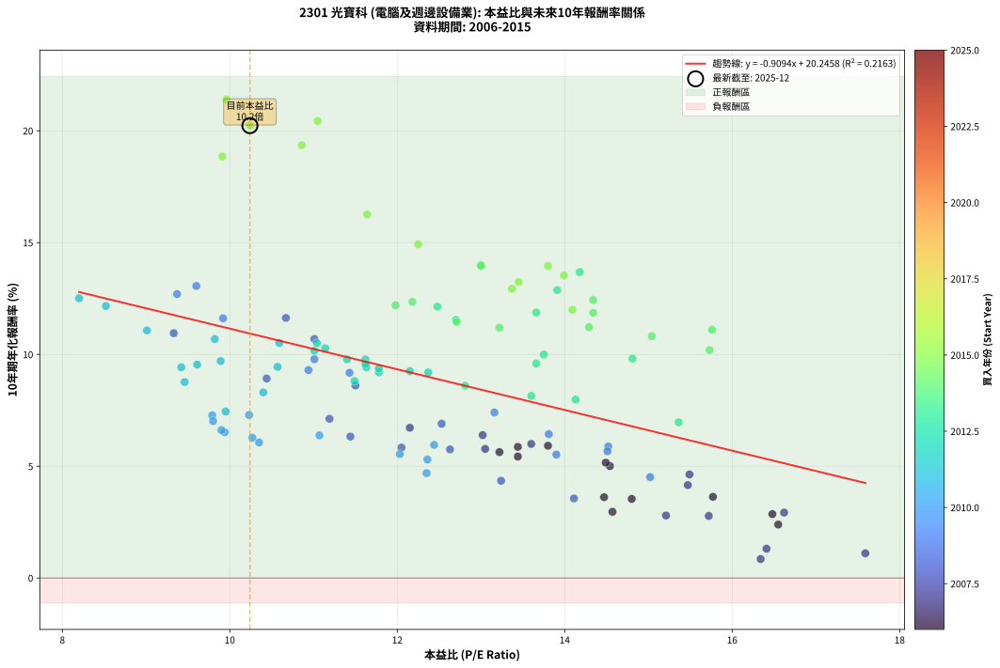
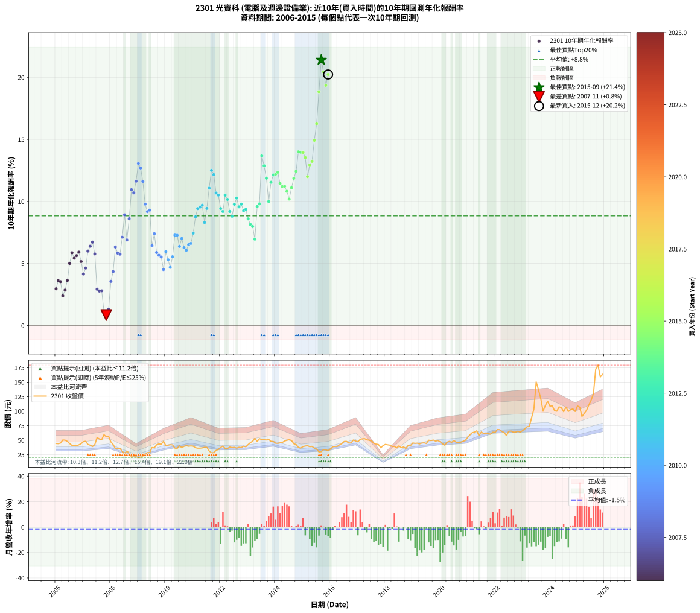

# 2301 光寶科 - 本益比與未來報酬率分析

!!! info "報告資訊"
    - **股票代號**: 2301
    - **公司名稱**: 光寶科
    - **產業別**: 電腦及週邊設備業
    - **分析期間**: 2006-2015 (120 個數據點)
    - **資料來源**: Type 12 (ShowMonthlyK_ChartFlow) 月收盤價與本益比
    - **報酬率口徑**: 含現金股利 (簡化: 年度合計，假設每年7/1入帳)
    - **報告生成時間**: 2026-01-10 20:29:03 CST

## 📈 視覺化圖表

### 圖表1: 本益比 vs 未來報酬率關係

*圖表1：2301 光寶科 本益比與10年期未來報酬率關係 (2006-2015)*

### 圖表2: 歷年買入時點的10年期實際報酬率

*圖表2：2301 光寶科 歷年買入時點的10年期實際報酬率 (2006-2015)*

## 📍 買點訊號說明

本報告提供兩種買點提示訊號（顯示於圖表2的股價子圖中）：

### ▲ 小綠色三角形（回測驗證）
- **計算方式**: 使用全部歷史資料計算本益比第25百分位數
- **用途**: 事後驗證，顯示歷史上哪些時點確實為低估區
- **限制**: 當下無法判斷，僅供回測參考
- **特性**: 後見之明（Look-Ahead Bias）

### ▲ 小橘色三角形（即時訊號）
- **計算方式**: 使用截至當月的過去5年資料計算本益比第25百分位數
- **用途**: 實際投資決策，當時即可判斷
- **優勢**: 可操作性強，符合實務需求
- **特性**: 無後見之明，滾動窗口計算

!!! tip "如何使用兩種訊號"
    - **綠色▲** 幫助理解歷史估值機會，驗證策略有效性
    - **橘色▲** 可作為實際買進參考，但仍需搭配基本面分析
    - 兩種訊號重疊時，表示即時判斷與事後驗證一致，信心度較高
    - 僅有綠色▲時，表示當時無法判斷（需要未來資料才能確認）
    - 僅有橘色▲時，表示即時判斷為買點，但事後可能不是最佳時機

## 📊 估值分析摘要

| 指標 | 數值 |
|:---:|:---:|
| **目前本益比** (2015-12) | **10.24 倍** |
| **歷史平均本益比** | 12.53 倍 |
| **估值水準** | 🟡 合理範圍 |
| **預期10年年化報酬率** | **+10.93%** |
| **歷史平均報酬率** | +8.85% |
| **相關係數 (R²)** | 0.2163 |
| **趨勢線斜率** | -0.9094 |

!!! abstract "核心洞察"
    目前本益比接近歷史平均，預期報酬率符合長期趨勢

    根據歷史數據回測，2301 光寶科 在目前本益比 **10.2倍** 的估值水準下，
    預期未來10年年化報酬率約為 **+10.9%**。

    **重要提醒**: 本分析基於歷史數據統計，實際報酬率會受到公司基本面變化、產業趨勢、
    總體經濟環境等多重因素影響。R² = 0.22 表示本益比可解釋約 21.6% 的報酬率變異。

## 📈 歷史估值統計

### 最佳買點 (最高報酬率)

| 項目 | 數值 |
|:---:|:---:|
| 起始時間 | 2015-09 |
| 當時本益比 | 9.96 倍 |
| 起始價格 | 30.2 元 |
| 10年後價格 | 172.5 元 |
| **10年年化報酬率** | **+21.40%** |

### 最差買點 (最低報酬率)

| 項目 | 數值 |
|:---:|:---:|
| 起始時間 | 2007-11 |
| 當時本益比 | 16.34 倍 |
| 起始價格 | 55.8 元 |
| 10年後價格 | 36.9 元 |
| **10年年化報酬率** | **+0.85%** |

## 🎯 投資啟示

### 本益比與報酬率關係

趨勢線方程式: **y = -0.9094x + 20.2458**

!!! warning "強負相關"
    本益比與未來報酬率呈現強負相關。在高本益比時期買入，未來報酬率顯著較低；
    在低本益比時期買入，未來報酬率顯著較高。**估值紀律至關重要**。

### 估值區間建議

基於歷史數據分析:

- **🟢 低估區** (P/E < 10.0): 預期報酬率較高，可考慮增加持股
- **🟡 合理區** (P/E 10.0-15.0): 預期報酬率符合長期趨勢，正常持有
- **🔴 高估區** (P/E > 15.0): 預期報酬率較低，可考慮減碼或觀望

!!! danger "風險提示"
    - 過去表現不代表未來結果
    - 本分析假設公司基本面無重大結構性變化
    - 產業環境劇變可能使歷史規律失效
    - 應結合公司財報、產業趨勢、總體經濟等多重因素綜合判斷

!!! success "長期投資觀點"
    歷史數據顯示，在合理或低估的估值水準買入並長期持有，
    往往能獲得較佳的投資報酬。**耐心等待好價格**是價值投資的核心原則。

## 📊 數據品質

- **資料來源**: GoodInfo.tw Type 12 (ShowMonthlyK_ChartFlow)
- **資料頻率**: 月度收盤價與本益比
- **回測期間**: 2006-2015
- **數據點數量**: 120 個 (每個點代表一次10年期回測)

### 計算方法說明

1. **10年期年化報酬率**:
   - 對每個歷史時點，計算其後10年的實際投資報酬率
   - 期末價值(不含股利): 期末價格
   - 期末價值(含現金股利): 期末價格 + 持有期間內的現金股利合計 (簡化: 年度合計，假設每年7/1入帳)
   - 公式: 年化報酬率 = [(期末價值/期初價格)^(1/年數) - 1] × 100%

2. **本益比 (P/E Ratio)**:
   - 使用當時的月收盤價與EPS計算
   - 資料來源: Type 12 月度河流圖本益比數據

3. **趨勢線 (Linear Regression)**:
   - 使用最小平方法擬合線性趨勢線
   - R²值衡量本益比對報酬率的解釋能力

---

*本報告由 Stock Analysis System v1.9.0 自動生成*
*數據更新時間: 2026-01-10 20:29:03 CST*

## 📋 月度回測明細表

（每一列對應時間線圖中的一個買入點；可用來對照 SVG 圖上的每個點。）

| 買入月份 | 賣出月份 | 回測期限_年 | 實際持有年數 | 買入本益比_倍 | 買入收盤價_元 | 賣出收盤價_元 | 現金股利合計_元 | 總報酬率_pct | 年化報酬率_pct |
| --- | --- | --- | --- | --- | --- | --- | --- | --- | --- |
| 2006-01 | 2016-01 | 10 | 9.999 | 14.57 | 44.30 | 34.90 | 24.41 | +33.88 | +2.96 |
| 2006-02 | 2016-02 | 10 | 9.999 | 14.47 | 44.00 | 38.35 | 24.41 | +42.63 | +3.62 |
| 2006-03 | 2016-03 | 10 | 10.001 | 14.80 | 45.00 | 39.30 | 24.41 | +41.58 | +3.54 |
| 2006-04 | 2016-04 | 10 | 10.001 | 16.55 | 50.30 | 39.30 | 24.41 | +26.66 | +2.39 |
| 2006-05 | 2016-05 | 10 | 10.001 | 16.48 | 50.10 | 42.00 | 24.41 | +32.55 | +2.86 |
| 2006-06 | 2016-06 | 10 | 10.001 | 15.77 | 47.95 | 44.10 | 24.41 | +42.88 | +3.63 |
| 2006-07 | 2016-07 | 10 | 10.001 | 14.54 | 44.20 | 47.80 | 24.23 | +62.98 | +5.00 |
| 2006-08 | 2016-08 | 10 | 10.001 | 13.44 | 40.85 | 48.00 | 24.23 | +76.83 | +5.86 |
| 2006-09 | 2016-09 | 10 | 10.001 | 13.44 | 40.85 | 45.10 | 24.23 | +69.73 | +5.43 |
| 2006-10 | 2016-10 | 10 | 10.001 | 13.22 | 40.20 | 45.30 | 24.23 | +72.97 | +5.63 |
| 2006-11 | 2016-11 | 10 | 10.001 | 13.80 | 41.95 | 50.30 | 24.23 | +77.68 | +5.92 |
| 2006-12 | 2016-12 | 10 | 10.001 | 14.49 | 44.05 | 48.60 | 24.23 | +65.35 | +5.16 |
| 2007-01 | 2017-01 | 10 | 10.001 | 15.47 | 47.55 | 47.20 | 24.23 | +50.23 | +4.15 |
| 2007-02 | 2017-02 | 10 | 10.001 | 15.49 | 48.15 | 51.50 | 24.23 | +57.29 | +4.63 |
| 2007-03 | 2017-03 | 10 | 10.001 | 13.60 | 42.75 | 52.30 | 24.23 | +79.03 | +6.00 |
| 2007-04 | 2017-04 | 10 | 10.001 | 13.02 | 41.35 | 52.60 | 24.23 | +85.82 | +6.39 |
| 2007-05 | 2017-05 | 10 | 10.001 | 12.15 | 39.00 | 50.50 | 24.23 | +91.63 | +6.72 |
| 2007-06 | 2017-06 | 10 | 10.001 | 13.05 | 42.35 | 50.00 | 24.23 | +75.29 | +5.77 |
| 2007-07 | 2017-07 | 10 | 10.001 | 16.62 | 54.50 | 48.85 | 23.87 | +33.43 | +2.93 |
| 2007-08 | 2017-08 | 10 | 10.001 | 15.72 | 52.10 | 44.65 | 23.87 | +31.51 | +2.78 |
| 2007-09 | 2017-09 | 10 | 10.001 | 15.21 | 50.90 | 43.20 | 23.87 | +31.77 | +2.80 |
| 2007-10 | 2017-10 | 10 | 10.001 | 17.59 | 59.50 | 42.55 | 23.87 | +11.63 | +1.11 |
| 2007-11 | 2017-11 | 10 | 10.001 | 16.34 | 55.80 | 36.85 | 23.87 | +8.82 | +0.85 |
| 2007-12 | 2017-12 | 10 | 10.001 | 16.41 | 56.60 | 40.60 | 23.87 | +13.90 | +1.31 |
| 2008-01 | 2018-01 | 10 | 10.001 | 14.11 | 47.00 | 42.80 | 23.87 | +41.85 | +3.56 |
| 2008-02 | 2018-03 | 10 | 10.081 | 13.24 | 42.50 | 41.40 | 23.87 | +53.57 | +4.35 |
| 2008-03 | 2018-03 | 10 | 9.999 | 11.44 | 35.35 | 41.40 | 23.87 | +84.64 | +6.33 |
| 2008-04 | 2018-04 | 10 | 9.999 | 12.05 | 35.80 | 39.25 | 23.87 | +76.31 | +5.84 |
| 2008-05 | 2018-05 | 10 | 9.999 | 12.63 | 36.00 | 39.10 | 23.87 | +74.91 | +5.75 |
| 2008-06 | 2018-06 | 10 | 9.999 | 11.19 | 30.55 | 36.90 | 23.87 | +98.92 | +7.12 |
| 2008-07 | 2018-07 | 10 | 9.999 | 10.44 | 27.25 | 40.20 | 23.84 | +135.01 | +8.92 |
| 2008-08 | 2018-08 | 10 | 9.999 | 12.53 | 31.20 | 36.95 | 23.84 | +94.84 | +6.90 |
| 2008-09 | 2018-09 | 10 | 9.999 | 11.50 | 27.25 | 38.40 | 23.84 | +128.40 | +8.61 |
| 2008-10 | 2018-10 | 10 | 9.999 | 9.33 | 21.00 | 35.50 | 23.84 | +182.57 | +10.95 |
| 2008-11 | 2018-11 | 10 | 9.999 | 11.01 | 23.45 | 40.90 | 23.84 | +176.07 | +10.69 |
| 2008-12 | 2018-12 | 10 | 9.999 | 10.67 | 21.45 | 40.60 | 23.84 | +200.41 | +11.63 |
| 2009-01 | 2019-01 | 10 | 9.999 | 9.60 | 20.25 | 45.25 | 23.84 | +241.18 | +13.06 |
| 2009-02 | 2019-02 | 10 | 9.999 | 9.37 | 20.70 | 44.55 | 23.84 | +230.38 | +12.70 |
| 2009-03 | 2019-03 | 10 | 9.999 | 9.92 | 22.90 | 44.85 | 23.84 | +199.95 | +11.61 |
| 2009-04 | 2019-04 | 10 | 9.999 | 11.01 | 26.50 | 43.55 | 23.84 | +154.30 | +9.78 |
| 2009-05 | 2019-05 | 10 | 9.999 | 11.43 | 28.65 | 45.10 | 23.84 | +140.62 | +9.18 |
| 2009-06 | 2019-06 | 10 | 9.999 | 10.94 | 28.50 | 45.50 | 23.84 | +143.29 | +9.30 |
| 2009-07 | 2019-07 | 10 | 9.999 | 13.81 | 37.35 | 44.30 | 25.36 | +86.50 | +6.43 |
| 2009-08 | 2019-08 | 10 | 9.999 | 13.16 | 36.90 | 50.00 | 25.36 | +104.22 | +7.40 |
| 2009-09 | 2019-09 | 10 | 9.999 | 14.52 | 42.15 | 49.30 | 25.36 | +77.13 | +5.88 |
| 2009-10 | 2019-10 | 10 | 9.999 | 14.51 | 43.55 | 50.20 | 25.36 | +73.50 | +5.67 |
| 2009-11 | 2019-11 | 10 | 9.999 | 13.90 | 43.10 | 48.40 | 25.36 | +71.13 | +5.52 |
| 2009-12 | 2019-12 | 10 | 9.999 | 15.02 | 48.05 | 49.35 | 25.36 | +55.48 | +4.51 |
| 2010-01 | 2020-01 | 10 | 9.999 | 12.44 | 40.70 | 47.20 | 25.36 | +78.28 | +5.95 |
| 2010-02 | 2020-02 | 10 | 9.999 | 12.36 | 41.30 | 43.85 | 25.36 | +67.58 | +5.30 |
| 2010-03 | 2020-03 | 10 | 10.001 | 12.35 | 42.15 | 41.30 | 25.36 | +58.15 | +4.69 |
| 2010-04 | 2020-04 | 10 | 10.001 | 12.03 | 41.90 | 46.50 | 25.36 | +71.50 | +5.54 |
| 2010-05 | 2020-05 | 10 | 10.001 | 10.23 | 36.35 | 48.10 | 25.36 | +102.09 | +7.29 |
| 2010-06 | 2020-06 | 10 | 10.001 | 9.79 | 35.50 | 46.30 | 25.36 | +101.86 | +7.28 |
| 2010-07 | 2020-07 | 10 | 10.001 | 11.07 | 40.90 | 49.60 | 26.31 | +85.60 | +6.38 |
| 2010-08 | 2020-08 | 10 | 10.001 | 9.80 | 36.90 | 46.40 | 26.31 | +97.04 | +7.02 |
| 2010-09 | 2020-09 | 10 | 10.001 | 10.27 | 39.40 | 46.10 | 26.31 | +83.78 | +6.27 |
| 2010-10 | 2020-10 | 10 | 10.001 | 10.35 | 40.45 | 46.55 | 26.31 | +80.12 | +6.06 |
| 2010-11 | 2020-11 | 10 | 10.001 | 9.94 | 39.55 | 48.05 | 26.31 | +88.01 | +6.52 |
| 2010-12 | 2020-12 | 10 | 10.001 | 9.90 | 40.10 | 49.80 | 26.31 | +89.80 | +6.62 |
| 2011-01 | 2021-01 | 10 | 10.001 | 9.95 | 39.60 | 54.90 | 26.31 | +105.07 | +7.45 |
| 2011-02 | 2021-02 | 10 | 10.001 | 9.46 | 37.00 | 59.40 | 26.31 | +131.65 | +8.76 |
| 2011-03 | 2021-03 | 10 | 10.001 | 9.42 | 36.20 | 62.80 | 26.31 | +146.16 | +9.42 |
| 2011-04 | 2021-04 | 10 | 10.001 | 9.61 | 36.25 | 63.90 | 26.31 | +148.85 | +9.54 |
| 2011-05 | 2021-05 | 10 | 10.001 | 9.89 | 36.65 | 66.20 | 26.31 | +152.41 | +9.70 |
| 2011-06 | 2021-06 | 10 | 10.001 | 10.40 | 37.80 | 57.60 | 26.31 | +121.98 | +8.30 |
| 2011-07 | 2021-07 | 10 | 10.001 | 10.57 | 37.70 | 64.10 | 28.84 | +146.52 | +9.44 |
| 2011-08 | 2021-08 | 10 | 10.001 | 9.01 | 31.50 | 61.20 | 28.84 | +185.84 | +11.07 |
| 2011-09 | 2021-09 | 10 | 10.001 | 8.20 | 28.10 | 62.50 | 28.84 | +225.05 | +12.51 |
| 2011-10 | 2021-10 | 10 | 10.001 | 8.52 | 28.60 | 61.30 | 28.84 | +215.17 | +12.16 |
| 2011-11 | 2021-11 | 10 | 10.001 | 9.82 | 32.30 | 60.30 | 28.84 | +175.97 | +10.68 |
| 2011-12 | 2021-12 | 10 | 10.001 | 10.59 | 34.10 | 63.80 | 28.84 | +171.67 | +10.51 |
| 2012-01 | 2022-01 | 10 | 10.001 | 11.63 | 37.50 | 63.50 | 28.84 | +146.24 | +9.43 |
| 2012-02 | 2022-03 | 10 | 10.081 | 12.37 | 39.95 | 68.10 | 28.84 | +142.65 | +9.19 |
| 2012-03 | 2022-03 | 10 | 9.999 | 11.04 | 35.70 | 68.10 | 28.84 | +171.54 | +10.51 |
| 2012-04 | 2022-04 | 10 | 9.999 | 11.01 | 35.65 | 65.00 | 28.84 | +163.22 | +10.16 |
| 2012-05 | 2022-05 | 10 | 9.999 | 11.78 | 38.20 | 63.20 | 28.84 | +140.94 | +9.19 |
| 2012-06 | 2022-06 | 10 | 9.999 | 11.49 | 37.30 | 57.90 | 28.84 | +132.54 | +8.81 |
| 2012-07 | 2022-07 | 10 | 9.999 | 11.62 | 37.75 | 65.30 | 30.57 | +153.96 | +9.77 |
| 2012-08 | 2022-08 | 10 | 9.999 | 11.14 | 36.25 | 65.80 | 30.57 | +165.85 | +10.27 |
| 2012-09 | 2022-09 | 10 | 9.999 | 11.62 | 37.85 | 63.80 | 30.57 | +149.32 | +9.57 |
| 2012-10 | 2022-10 | 10 | 9.999 | 11.40 | 37.20 | 64.00 | 30.57 | +154.22 | +9.78 |
| 2012-11 | 2022-11 | 10 | 9.999 | 12.15 | 39.70 | 65.60 | 30.57 | +142.24 | +9.25 |
| 2012-12 | 2022-12 | 10 | 9.999 | 11.78 | 38.55 | 63.80 | 30.57 | +144.80 | +9.37 |
| 2013-01 | 2023-01 | 10 | 9.999 | 12.81 | 42.50 | 66.40 | 30.57 | +128.16 | +8.60 |
| 2013-02 | 2023-02 | 10 | 9.999 | 13.60 | 45.75 | 69.50 | 30.57 | +118.73 | +8.14 |
| 2013-03 | 2023-03 | 10 | 9.999 | 14.13 | 48.20 | 73.30 | 30.57 | +115.50 | +7.98 |
| 2013-04 | 2023-04 | 10 | 9.999 | 15.36 | 53.10 | 73.50 | 30.57 | +95.99 | +6.96 |
| 2013-05 | 2023-05 | 10 | 9.999 | 13.66 | 47.85 | 89.00 | 30.57 | +149.88 | +9.59 |
| 2013-06 | 2023-06 | 10 | 9.999 | 14.81 | 52.60 | 103.50 | 30.57 | +154.88 | +9.81 |
| 2013-07 | 2023-07 | 10 | 9.999 | 14.18 | 51.00 | 150.50 | 33.23 | +260.25 | +13.68 |
| 2013-08 | 2023-08 | 10 | 9.999 | 13.91 | 50.70 | 137.00 | 33.23 | +235.76 | +12.88 |
| 2013-09 | 2023-09 | 10 | 9.999 | 13.66 | 50.40 | 121.50 | 33.23 | +207.00 | +11.87 |
| 2013-10 | 2023-10 | 10 | 9.999 | 13.75 | 51.40 | 100.00 | 33.23 | +159.20 | +9.99 |
| 2013-11 | 2023-11 | 10 | 9.999 | 12.70 | 48.05 | 110.00 | 33.23 | +198.08 | +11.54 |
| 2013-12 | 2023-12 | 10 | 9.999 | 12.48 | 47.80 | 117.00 | 33.23 | +214.28 | +12.13 |
| 2014-01 | 2024-01 | 10 | 9.999 | 11.98 | 44.85 | 108.50 | 33.23 | +216.00 | +12.20 |
| 2014-02 | 2024-02 | 10 | 9.999 | 12.18 | 44.55 | 109.50 | 33.23 | +220.38 | +12.35 |
| 2014-03 | 2024-03 | 10 | 10.001 | 12.71 | 45.40 | 101.00 | 33.23 | +195.66 | +11.45 |
| 2014-04 | 2024-04 | 10 | 10.001 | 13.22 | 46.10 | 100.00 | 33.23 | +189.00 | +11.19 |
| 2014-05 | 2024-05 | 10 | 10.001 | 14.29 | 48.60 | 107.50 | 33.23 | +189.56 | +11.22 |
| 2014-06 | 2024-06 | 10 | 10.001 | 15.04 | 49.85 | 106.00 | 33.23 | +179.29 | +10.82 |
| 2014-07 | 2024-07 | 10 | 10.001 | 15.73 | 50.80 | 99.10 | 35.02 | +164.02 | +10.19 |
| 2014-08 | 2024-08 | 10 | 10.001 | 15.76 | 49.55 | 107.00 | 35.02 | +186.62 | +11.10 |
| 2014-09 | 2024-09 | 10 | 10.001 | 14.34 | 43.85 | 99.50 | 35.02 | +206.78 | +11.86 |
| 2014-10 | 2024-10 | 10 | 10.001 | 14.34 | 42.60 | 102.50 | 35.02 | +222.82 | +12.43 |
| 2014-11 | 2024-11 | 10 | 10.001 | 13.00 | 37.50 | 104.00 | 35.02 | +270.73 | +14.00 |
| 2014-12 | 2024-12 | 10 | 10.001 | 13.00 | 36.40 | 99.50 | 35.02 | +269.57 | +13.96 |
| 2015-01 | 2025-01 | 10 | 10.001 | 13.80 | 39.00 | 109.00 | 35.02 | +269.29 | +13.95 |
| 2015-02 | 2025-02 | 10 | 10.001 | 13.99 | 39.90 | 107.00 | 35.02 | +255.94 | +13.54 |
| 2015-03 | 2025-03 | 10 | 10.001 | 14.09 | 40.55 | 90.90 | 35.02 | +210.54 | +12.00 |
| 2015-04 | 2025-04 | 10 | 10.001 | 13.37 | 38.80 | 96.00 | 35.02 | +237.69 | +12.94 |
| 2015-05 | 2025-05 | 10 | 10.001 | 13.45 | 39.40 | 101.50 | 35.02 | +246.50 | +13.23 |
| 2015-06 | 2025-06 | 10 | 10.001 | 12.25 | 36.20 | 110.50 | 35.02 | +301.99 | +14.92 |
| 2015-07 | 2025-07 | 10 | 10.001 | 11.64 | 34.70 | 119.00 | 37.56 | +351.18 | +16.26 |
| 2015-08 | 2025-08 | 10 | 10.001 | 9.91 | 29.80 | 130.00 | 37.56 | +462.28 | +18.85 |
| 2015-09 | 2025-09 | 10 | 10.001 | 9.96 | 30.20 | 172.50 | 37.56 | +595.56 | +21.40 |
| 2015-10 | 2025-10 | 10 | 10.001 | 11.05 | 33.80 | 179.50 | 37.56 | +542.19 | +20.44 |
| 2015-11 | 2025-11 | 10 | 10.001 | 10.86 | 33.50 | 159.00 | 37.56 | +486.74 | +19.35 |
| 2015-12 | 2025-12 | 10 | 10.001 | 10.24 | 31.85 | 163.50 | 37.56 | +531.27 | +20.23 |
