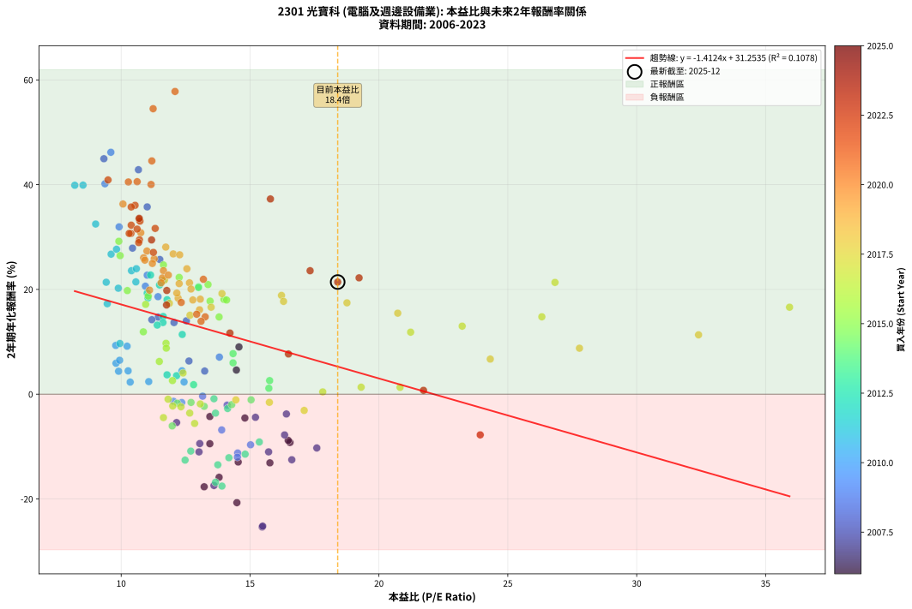
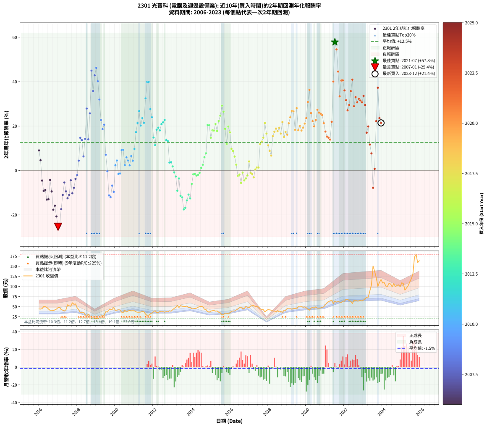

# 2301 光寶科 - 本益比與未來報酬率分析

!!! info "報告資訊"
    - **股票代號**: 2301
    - **公司名稱**: 光寶科
    - **產業別**: 電腦及週邊設備業
    - **分析期間**: 2006-2023 (216 個數據點)
    - **資料來源**: Type 12 (ShowMonthlyK_ChartFlow) 月收盤價與本益比
    - **報酬率口徑**: 含現金股利 (簡化: 年度合計，假設每年7/1入帳)
    - **報告生成時間**: 2026-01-04 08:46:42 CST

## 📈 視覺化圖表

### 圖表1: 本益比 vs 未來報酬率關係

*圖表1：2301 光寶科 本益比與2年期未來報酬率關係 (2006-2023)*

### 圖表2: 歷年買入時點的2年期實際報酬率

*圖表2：2301 光寶科 歷年買入時點的2年期實際報酬率 (2006-2023)*

## 📍 買點訊號說明

本報告提供兩種買點提示訊號（顯示於圖表2的股價子圖中）：

### ▲ 小綠色三角形（回測驗證）
- **計算方式**: 使用全部歷史資料計算本益比第25百分位數
- **用途**: 事後驗證，顯示歷史上哪些時點確實為低估區
- **限制**: 當下無法判斷，僅供回測參考
- **特性**: 後見之明（Look-Ahead Bias）

### ▲ 小橘色三角形（即時訊號）
- **計算方式**: 使用截至當月的過去5年資料計算本益比第25百分位數
- **用途**: 實際投資決策，當時即可判斷
- **優勢**: 可操作性強，符合實務需求
- **特性**: 無後見之明，滾動窗口計算

!!! tip "如何使用兩種訊號"
    - **綠色▲** 幫助理解歷史估值機會，驗證策略有效性
    - **橘色▲** 可作為實際買進參考，但仍需搭配基本面分析
    - 兩種訊號重疊時，表示即時判斷與事後驗證一致，信心度較高
    - 僅有綠色▲時，表示當時無法判斷（需要未來資料才能確認）
    - 僅有橘色▲時，表示即時判斷為買點，但事後可能不是最佳時機

## 📊 估值分析摘要

| 指標 | 數值 |
|:---:|:---:|
| **目前本益比** (2023-12) | **18.40 倍** |
| **歷史平均本益比** | 13.26 倍 |
| **估值水準** | 🔴 相對高估 |
| **預期2年年化報酬率** | **+5.27%** |
| **歷史平均報酬率** | +12.53% |
| **相關係數 (R²)** | 0.1078 |
| **趨勢線斜率** | -1.4124 |

!!! abstract "核心洞察"
    目前本益比顯著高於歷史平均，預期未來報酬率可能較低

    根據歷史數據回測，2301 光寶科 在目前本益比 **18.4倍** 的估值水準下，
    預期未來2年年化報酬率約為 **+5.3%**。

    **重要提醒**: 本分析基於歷史數據統計，實際報酬率會受到公司基本面變化、產業趨勢、
    總體經濟環境等多重因素影響。R² = 0.11 表示本益比可解釋約 10.8% 的報酬率變異。

## 📈 歷史估值統計

### 最佳買點 (最高報酬率)

| 項目 | 數值 |
|:---:|:---:|
| 起始時間 | 2021-07 |
| 當時本益比 | 12.09 倍 |
| 起始價格 | 64.1 元 |
| 2年後價格 | 150.5 元 |
| **2年年化報酬率** | **+57.79%** |

### 最差買點 (最低報酬率)

| 項目 | 數值 |
|:---:|:---:|
| 起始時間 | 2007-01 |
| 當時本益比 | 15.47 倍 |
| 起始價格 | 47.5 元 |
| 2年後價格 | 20.2 元 |
| **2年年化報酬率** | **-25.35%** |

## 🎯 投資啟示

### 本益比與報酬率關係

趨勢線方程式: **y = -1.4124x + 31.2535**

!!! warning "強負相關"
    本益比與未來報酬率呈現強負相關。在高本益比時期買入，未來報酬率顯著較低；
    在低本益比時期買入，未來報酬率顯著較高。**估值紀律至關重要**。

### 估值區間建議

基於歷史數據分析:

- **🟢 低估區** (P/E < 10.6): 預期報酬率較高，可考慮增加持股
- **🟡 合理區** (P/E 10.6-15.9): 預期報酬率符合長期趨勢，正常持有
- **🔴 高估區** (P/E > 15.9): 預期報酬率較低，可考慮減碼或觀望

!!! danger "風險提示"
    - 過去表現不代表未來結果
    - 本分析假設公司基本面無重大結構性變化
    - 產業環境劇變可能使歷史規律失效
    - 應結合公司財報、產業趨勢、總體經濟等多重因素綜合判斷

!!! success "長期投資觀點"
    歷史數據顯示，在合理或低估的估值水準買入並長期持有，
    往往能獲得較佳的投資報酬。**耐心等待好價格**是價值投資的核心原則。

## 📊 數據品質

- **資料來源**: GoodInfo.tw Type 12 (ShowMonthlyK_ChartFlow)
- **資料頻率**: 月度收盤價與本益比
- **回測期間**: 2006-2023
- **數據點數量**: 216 個 (每個點代表一次2年期回測)

### 計算方法說明

1. **2年期年化報酬率**:
   - 對每個歷史時點，計算其後2年的實際投資報酬率
   - 期末價值(不含股利): 期末價格
   - 期末價值(含現金股利): 期末價格 + 持有期間內的現金股利合計 (簡化: 年度合計，假設每年7/1入帳)
   - 公式: 年化報酬率 = [(期末價值/期初價格)^(1/年數) - 1] × 100%

2. **本益比 (P/E Ratio)**:
   - 使用當時的月收盤價與EPS計算
   - 資料來源: Type 12 月度河流圖本益比數據

3. **趨勢線 (Linear Regression)**:
   - 使用最小平方法擬合線性趨勢線
   - R²值衡量本益比對報酬率的解釋能力

---

*本報告由 Stock Analysis System v1.9.0 自動生成*
*數據更新時間: 2026-01-04 08:46:42 CST*

## 📋 月度回測明細表

（每一列對應時間線圖中的一個買入點；可用來對照 SVG 圖上的每個點。）

| 買入月份 | 賣出月份 | 回測期限_年 | 實際持有年數 | 買入本益比_倍 | 買入收盤價_元 | 賣出收盤價_元 | 現金股利合計_元 | 總報酬率_pct | 年化報酬率_pct |
| --- | --- | --- | --- | --- | --- | --- | --- | --- | --- |
| 2006-01 | 2008-01 | 2 | 1.999 | 14.57 | 44.30 | 47.00 | 5.65 | +18.84 | +9.02 |
| 2006-02 | 2008-02 | 2 | 1.999 | 14.47 | 44.00 | 42.50 | 5.65 | +9.42 | +4.61 |
| 2006-03 | 2008-03 | 2 | 2.001 | 14.80 | 45.00 | 35.35 | 5.65 | -8.90 | -4.55 |
| 2006-04 | 2008-04 | 2 | 2.001 | 16.55 | 50.30 | 35.80 | 5.65 | -17.60 | -9.22 |
| 2006-05 | 2008-05 | 2 | 2.001 | 16.48 | 50.10 | 36.00 | 5.65 | -16.87 | -8.82 |
| 2006-06 | 2008-06 | 2 | 2.001 | 15.77 | 47.95 | 30.55 | 5.65 | -24.51 | -13.11 |
| 2006-07 | 2008-07 | 2 | 2.001 | 14.54 | 44.20 | 27.25 | 6.24 | -24.24 | -12.95 |
| 2006-08 | 2008-08 | 2 | 2.001 | 13.44 | 40.85 | 31.20 | 6.24 | -8.36 | -4.27 |
| 2006-09 | 2008-09 | 2 | 2.001 | 13.44 | 40.85 | 27.25 | 6.24 | -18.03 | -9.45 |
| 2006-10 | 2008-10 | 2 | 2.001 | 13.22 | 40.20 | 21.00 | 6.24 | -32.25 | -17.68 |
| 2006-11 | 2008-11 | 2 | 2.001 | 13.80 | 41.95 | 23.45 | 6.24 | -29.23 | -15.87 |
| 2006-12 | 2008-12 | 2 | 2.001 | 14.49 | 44.05 | 21.45 | 6.24 | -37.15 | -20.71 |
| 2007-01 | 2009-01 | 2 | 2.001 | 15.47 | 47.55 | 20.25 | 6.24 | -44.30 | -25.35 |
| 2007-02 | 2009-02 | 2 | 2.001 | 15.49 | 48.15 | 20.70 | 6.24 | -44.06 | -25.19 |
| 2007-03 | 2009-03 | 2 | 2.001 | 13.60 | 42.75 | 22.90 | 6.24 | -31.85 | -17.43 |
| 2007-04 | 2009-04 | 2 | 2.001 | 13.02 | 41.35 | 26.50 | 6.24 | -20.83 | -11.02 |
| 2007-05 | 2009-05 | 2 | 2.001 | 12.15 | 39.00 | 28.65 | 6.24 | -10.55 | -5.42 |
| 2007-06 | 2009-06 | 2 | 2.001 | 13.05 | 42.35 | 28.50 | 6.24 | -17.98 | -9.43 |
| 2007-07 | 2009-07 | 2 | 2.001 | 16.62 | 54.50 | 37.35 | 4.35 | -23.49 | -12.52 |
| 2007-08 | 2009-08 | 2 | 2.001 | 15.72 | 52.10 | 36.90 | 4.35 | -20.83 | -11.01 |
| 2007-09 | 2009-09 | 2 | 2.001 | 15.21 | 50.90 | 42.15 | 4.35 | -8.64 | -4.42 |
| 2007-10 | 2009-10 | 2 | 2.001 | 17.59 | 59.50 | 43.55 | 4.35 | -19.50 | -10.27 |
| 2007-11 | 2009-11 | 2 | 2.001 | 16.34 | 55.80 | 43.10 | 4.35 | -14.96 | -7.78 |
| 2007-12 | 2009-12 | 2 | 2.001 | 16.41 | 56.60 | 48.05 | 4.35 | -7.42 | -3.78 |
| 2008-01 | 2010-01 | 2 | 2.001 | 14.11 | 47.00 | 40.70 | 4.35 | -4.15 | -2.10 |
| 2008-02 | 2010-03 | 2 | 2.081 | 13.24 | 42.50 | 42.15 | 4.35 | +9.41 | +4.42 |
| 2008-03 | 2010-03 | 2 | 1.999 | 11.44 | 35.35 | 42.15 | 4.35 | +31.54 | +14.70 |
| 2008-04 | 2010-04 | 2 | 1.999 | 12.05 | 35.80 | 41.90 | 4.35 | +29.19 | +13.67 |
| 2008-05 | 2010-05 | 2 | 1.999 | 12.63 | 36.00 | 36.35 | 4.35 | +13.06 | +6.33 |
| 2008-06 | 2010-06 | 2 | 1.999 | 11.19 | 30.55 | 35.50 | 4.35 | +30.44 | +14.22 |
| 2008-07 | 2010-07 | 2 | 1.999 | 10.44 | 27.25 | 40.90 | 3.65 | +63.49 | +27.88 |
| 2008-08 | 2010-08 | 2 | 1.999 | 12.53 | 31.20 | 36.90 | 3.65 | +29.97 | +14.01 |
| 2008-09 | 2010-09 | 2 | 1.999 | 11.50 | 27.25 | 39.40 | 3.65 | +57.98 | +25.71 |
| 2008-10 | 2010-10 | 2 | 1.999 | 9.33 | 21.00 | 40.45 | 3.65 | +110.00 | +44.95 |
| 2008-11 | 2010-11 | 2 | 1.999 | 11.01 | 23.45 | 39.55 | 3.65 | +84.22 | +35.76 |
| 2008-12 | 2010-12 | 2 | 1.999 | 10.67 | 21.45 | 40.10 | 3.65 | +103.96 | +42.85 |
| 2009-01 | 2011-01 | 2 | 1.999 | 9.60 | 20.25 | 39.60 | 3.65 | +113.58 | +46.18 |
| 2009-02 | 2011-02 | 2 | 1.999 | 9.37 | 20.70 | 37.00 | 3.65 | +96.38 | +40.17 |
| 2009-03 | 2011-03 | 2 | 1.999 | 9.92 | 22.90 | 36.20 | 3.65 | +74.02 | +31.94 |
| 2009-04 | 2011-04 | 2 | 1.999 | 11.01 | 26.50 | 36.25 | 3.65 | +50.57 | +22.72 |
| 2009-05 | 2011-05 | 2 | 1.999 | 11.43 | 28.65 | 36.65 | 3.65 | +40.66 | +18.62 |
| 2009-06 | 2011-06 | 2 | 1.999 | 10.94 | 28.50 | 37.80 | 3.65 | +45.44 | +20.61 |
| 2009-07 | 2011-07 | 2 | 1.999 | 13.81 | 37.35 | 37.70 | 5.12 | +14.65 | +7.08 |
| 2009-08 | 2011-08 | 2 | 1.999 | 13.16 | 36.90 | 31.50 | 5.12 | -0.76 | -0.38 |
| 2009-09 | 2011-09 | 2 | 1.999 | 14.52 | 42.15 | 28.10 | 5.12 | -21.19 | -11.23 |
| 2009-10 | 2011-10 | 2 | 1.999 | 14.51 | 43.55 | 28.60 | 5.12 | -22.57 | -12.01 |
| 2009-11 | 2011-11 | 2 | 1.999 | 13.90 | 43.10 | 32.30 | 5.12 | -13.18 | -6.83 |
| 2009-12 | 2011-12 | 2 | 1.999 | 15.02 | 48.05 | 34.10 | 5.12 | -18.38 | -9.66 |
| 2010-01 | 2012-01 | 2 | 1.999 | 12.44 | 40.70 | 37.50 | 5.12 | +4.72 | +2.33 |
| 2010-02 | 2012-02 | 2 | 1.999 | 12.36 | 41.30 | 39.95 | 5.12 | +9.13 | +4.47 |
| 2010-03 | 2012-03 | 2 | 2.001 | 12.35 | 42.15 | 35.70 | 5.12 | -3.16 | -1.59 |
| 2010-04 | 2012-04 | 2 | 2.001 | 12.03 | 41.90 | 35.65 | 5.12 | -2.70 | -1.36 |
| 2010-05 | 2012-05 | 2 | 2.001 | 10.23 | 36.35 | 38.20 | 5.12 | +19.17 | +9.16 |
| 2010-06 | 2012-06 | 2 | 2.001 | 9.79 | 35.50 | 37.30 | 5.12 | +19.49 | +9.31 |
| 2010-07 | 2012-07 | 2 | 2.001 | 11.07 | 40.90 | 37.75 | 5.14 | +4.87 | +2.40 |
| 2010-08 | 2012-08 | 2 | 2.001 | 9.80 | 36.90 | 36.25 | 5.14 | +12.17 | +5.91 |
| 2010-09 | 2012-09 | 2 | 2.001 | 10.27 | 39.40 | 37.85 | 5.14 | +9.11 | +4.45 |
| 2010-10 | 2012-10 | 2 | 2.001 | 10.35 | 40.45 | 37.20 | 5.14 | +4.67 | +2.31 |
| 2010-11 | 2012-11 | 2 | 2.001 | 9.94 | 39.55 | 39.70 | 5.14 | +13.38 | +6.47 |
| 2010-12 | 2012-12 | 2 | 2.001 | 9.90 | 40.10 | 38.55 | 5.14 | +8.95 | +4.38 |
| 2011-01 | 2013-01 | 2 | 2.001 | 9.95 | 39.60 | 42.50 | 5.14 | +20.30 | +9.68 |
| 2011-02 | 2013-02 | 2 | 2.001 | 9.46 | 37.00 | 45.75 | 5.14 | +37.54 | +17.26 |
| 2011-03 | 2013-03 | 2 | 2.001 | 9.42 | 36.20 | 48.20 | 5.14 | +47.35 | +21.37 |
| 2011-04 | 2013-04 | 2 | 2.001 | 9.61 | 36.25 | 53.10 | 5.14 | +60.66 | +26.73 |
| 2011-05 | 2013-05 | 2 | 2.001 | 9.89 | 36.65 | 47.85 | 5.14 | +44.58 | +20.23 |
| 2011-06 | 2013-06 | 2 | 2.001 | 10.40 | 37.80 | 52.60 | 5.14 | +52.75 | +23.57 |
| 2011-07 | 2013-07 | 2 | 2.001 | 10.57 | 37.70 | 51.00 | 4.61 | +47.51 | +21.44 |
| 2011-08 | 2013-08 | 2 | 2.001 | 9.01 | 31.50 | 50.70 | 4.61 | +75.59 | +32.49 |
| 2011-09 | 2013-09 | 2 | 2.001 | 8.20 | 28.10 | 50.40 | 4.61 | +95.77 | +39.89 |
| 2011-10 | 2013-10 | 2 | 2.001 | 8.52 | 28.60 | 51.40 | 4.61 | +95.84 | +39.91 |
| 2011-11 | 2013-11 | 2 | 2.001 | 9.82 | 32.30 | 48.05 | 4.61 | +63.04 | +27.66 |
| 2011-12 | 2013-12 | 2 | 2.001 | 10.59 | 34.10 | 47.80 | 4.61 | +53.70 | +23.96 |
| 2012-01 | 2014-01 | 2 | 2.001 | 11.63 | 37.50 | 44.85 | 4.61 | +31.90 | +14.84 |
| 2012-02 | 2014-03 | 2 | 2.081 | 12.37 | 39.95 | 45.40 | 4.61 | +25.18 | +11.40 |
| 2012-03 | 2014-03 | 2 | 1.999 | 11.04 | 35.70 | 45.40 | 4.61 | +40.09 | +18.37 |
| 2012-04 | 2014-04 | 2 | 1.999 | 11.01 | 35.65 | 46.10 | 4.61 | +42.25 | +19.28 |
| 2012-05 | 2014-05 | 2 | 1.999 | 11.78 | 38.20 | 48.60 | 4.61 | +39.30 | +18.04 |
| 2012-06 | 2014-06 | 2 | 1.999 | 11.49 | 37.30 | 49.85 | 4.61 | +46.01 | +20.85 |
| 2012-07 | 2014-07 | 2 | 1.999 | 11.62 | 37.75 | 50.80 | 5.05 | +47.95 | +21.65 |
| 2012-08 | 2014-08 | 2 | 1.999 | 11.14 | 36.25 | 49.55 | 5.05 | +50.63 | +22.75 |
| 2012-09 | 2014-09 | 2 | 1.999 | 11.62 | 37.85 | 43.85 | 5.05 | +29.20 | +13.68 |
| 2012-10 | 2014-10 | 2 | 1.999 | 11.40 | 37.20 | 42.60 | 5.05 | +28.10 | +13.19 |
| 2012-11 | 2014-11 | 2 | 1.999 | 12.15 | 39.70 | 37.50 | 5.05 | +7.19 | +3.53 |
| 2012-12 | 2014-12 | 2 | 1.999 | 11.78 | 38.55 | 36.40 | 5.05 | +7.53 | +3.70 |
| 2013-01 | 2015-01 | 2 | 1.999 | 12.81 | 42.50 | 39.00 | 5.05 | +3.65 | +1.81 |
| 2013-02 | 2015-02 | 2 | 1.999 | 13.60 | 45.75 | 39.90 | 5.05 | -1.74 | -0.88 |
| 2013-03 | 2015-03 | 2 | 1.999 | 14.13 | 48.20 | 40.55 | 5.05 | -5.39 | -2.73 |
| 2013-04 | 2015-04 | 2 | 1.999 | 15.36 | 53.10 | 38.80 | 5.05 | -17.41 | -9.13 |
| 2013-05 | 2015-05 | 2 | 1.999 | 13.66 | 47.85 | 39.40 | 5.05 | -7.10 | -3.62 |
| 2013-06 | 2015-06 | 2 | 1.999 | 14.81 | 52.60 | 36.20 | 5.05 | -21.57 | -11.45 |
| 2013-07 | 2015-07 | 2 | 1.999 | 14.18 | 51.00 | 34.70 | 4.68 | -22.78 | -12.13 |
| 2013-08 | 2015-08 | 2 | 1.999 | 13.91 | 50.70 | 29.80 | 4.68 | -31.99 | -17.54 |
| 2013-09 | 2015-09 | 2 | 1.999 | 13.66 | 50.40 | 30.20 | 4.68 | -30.79 | -16.82 |
| 2013-10 | 2015-10 | 2 | 1.999 | 13.75 | 51.40 | 33.80 | 4.68 | -25.13 | -13.48 |
| 2013-11 | 2015-11 | 2 | 1.999 | 12.70 | 48.05 | 33.50 | 4.68 | -20.54 | -10.86 |
| 2013-12 | 2015-12 | 2 | 1.999 | 12.48 | 47.80 | 31.85 | 4.68 | -23.57 | -12.59 |
| 2014-01 | 2016-01 | 2 | 1.999 | 11.98 | 44.85 | 34.90 | 4.68 | -11.75 | -6.06 |
| 2014-02 | 2016-02 | 2 | 1.999 | 12.18 | 44.55 | 38.35 | 4.68 | -3.41 | -1.72 |
| 2014-03 | 2016-03 | 2 | 2.001 | 12.71 | 45.40 | 39.30 | 4.68 | -3.12 | -1.57 |
| 2014-04 | 2016-04 | 2 | 2.001 | 13.22 | 46.10 | 39.30 | 4.68 | -4.59 | -2.32 |
| 2014-05 | 2016-05 | 2 | 2.001 | 14.29 | 48.60 | 42.00 | 4.68 | -3.95 | -1.99 |
| 2014-06 | 2016-06 | 2 | 2.001 | 15.04 | 49.85 | 44.10 | 4.68 | -2.14 | -1.08 |
| 2014-07 | 2016-07 | 2 | 2.001 | 15.73 | 50.80 | 47.80 | 4.16 | +2.28 | +1.13 |
| 2014-08 | 2016-08 | 2 | 2.001 | 15.76 | 49.55 | 48.00 | 4.16 | +5.26 | +2.59 |
| 2014-09 | 2016-09 | 2 | 2.001 | 14.34 | 43.85 | 45.10 | 4.16 | +12.33 | +5.98 |
| 2014-10 | 2016-10 | 2 | 2.001 | 14.34 | 42.60 | 45.30 | 4.16 | +16.09 | +7.74 |
| 2014-11 | 2016-11 | 2 | 2.001 | 13.00 | 37.50 | 50.30 | 4.16 | +45.22 | +20.49 |
| 2014-12 | 2016-12 | 2 | 2.001 | 13.00 | 36.40 | 48.60 | 4.16 | +44.93 | +20.37 |
| 2015-01 | 2017-01 | 2 | 2.001 | 13.80 | 39.00 | 47.20 | 4.16 | +31.68 | +14.74 |
| 2015-02 | 2017-02 | 2 | 2.001 | 13.99 | 39.90 | 51.50 | 4.16 | +39.49 | +18.09 |
| 2015-03 | 2017-03 | 2 | 2.001 | 14.09 | 40.55 | 52.30 | 4.16 | +39.23 | +17.98 |
| 2015-04 | 2017-04 | 2 | 2.001 | 13.37 | 38.80 | 52.60 | 4.16 | +46.28 | +20.93 |
| 2015-05 | 2017-05 | 2 | 2.001 | 13.45 | 39.40 | 50.50 | 4.16 | +38.72 | +17.77 |
| 2015-06 | 2017-06 | 2 | 2.001 | 12.25 | 36.20 | 50.00 | 4.16 | +49.60 | +22.30 |
| 2015-07 | 2017-07 | 2 | 2.001 | 11.64 | 34.70 | 48.85 | 5.11 | +55.49 | +24.68 |
| 2015-08 | 2017-08 | 2 | 2.001 | 9.91 | 29.80 | 44.65 | 5.11 | +66.97 | +29.19 |
| 2015-09 | 2017-09 | 2 | 2.001 | 9.96 | 30.20 | 43.20 | 5.11 | +59.95 | +26.45 |
| 2015-10 | 2017-10 | 2 | 2.001 | 11.05 | 33.80 | 42.55 | 5.11 | +40.99 | +18.73 |
| 2015-11 | 2017-11 | 2 | 2.001 | 10.86 | 33.50 | 36.85 | 5.11 | +25.24 | +11.90 |
| 2015-12 | 2017-12 | 2 | 2.001 | 10.24 | 31.85 | 40.60 | 5.11 | +43.50 | +19.78 |
| 2016-01 | 2018-01 | 2 | 2.001 | 10.95 | 34.90 | 42.80 | 5.11 | +37.27 | +17.15 |
| 2016-02 | 2018-03 | 2 | 2.081 | 11.74 | 38.35 | 41.40 | 5.11 | +21.27 | +9.71 |
| 2016-03 | 2018-03 | 2 | 1.999 | 11.75 | 39.30 | 41.40 | 5.11 | +18.34 | +8.79 |
| 2016-04 | 2018-04 | 2 | 1.999 | 11.48 | 39.30 | 39.25 | 5.11 | +12.87 | +6.24 |
| 2016-05 | 2018-05 | 2 | 1.999 | 11.99 | 42.00 | 39.10 | 5.11 | +5.25 | +2.59 |
| 2016-06 | 2018-06 | 2 | 1.999 | 12.32 | 44.10 | 36.90 | 5.11 | -4.75 | -2.40 |
| 2016-07 | 2018-07 | 2 | 1.999 | 13.07 | 47.80 | 40.20 | 5.84 | -3.68 | -1.86 |
| 2016-08 | 2018-08 | 2 | 1.999 | 12.85 | 48.00 | 36.95 | 5.84 | -10.85 | -5.59 |
| 2016-09 | 2018-09 | 2 | 1.999 | 11.82 | 45.10 | 38.40 | 5.84 | -1.91 | -0.96 |
| 2016-10 | 2018-10 | 2 | 1.999 | 11.64 | 45.30 | 35.50 | 5.84 | -8.74 | -4.47 |
| 2016-11 | 2018-11 | 2 | 1.999 | 12.66 | 50.30 | 40.90 | 5.84 | -7.08 | -3.61 |
| 2016-12 | 2018-12 | 2 | 1.999 | 12.00 | 48.60 | 40.60 | 5.84 | -4.44 | -2.25 |
| 2017-01 | 2019-01 | 2 | 1.999 | 12.40 | 47.20 | 45.25 | 5.84 | +8.24 | +4.04 |
| 2017-02 | 2019-02 | 2 | 1.999 | 14.45 | 51.50 | 44.55 | 5.84 | -2.16 | -1.08 |
| 2017-03 | 2019-03 | 2 | 1.999 | 15.75 | 52.30 | 44.85 | 5.84 | -3.08 | -1.55 |
| 2017-04 | 2019-04 | 2 | 1.999 | 17.10 | 52.60 | 43.55 | 5.84 | -6.10 | -3.10 |
| 2017-05 | 2019-05 | 2 | 1.999 | 17.82 | 50.50 | 45.10 | 5.84 | +0.87 | +0.43 |
| 2017-06 | 2019-06 | 2 | 1.999 | 19.31 | 50.00 | 45.50 | 5.84 | +2.68 | +1.33 |
| 2017-07 | 2019-07 | 2 | 1.999 | 20.82 | 48.85 | 44.30 | 5.84 | +2.64 | +1.31 |
| 2017-08 | 2019-08 | 2 | 1.999 | 21.23 | 44.65 | 50.00 | 5.84 | +25.06 | +11.84 |
| 2017-09 | 2019-09 | 2 | 1.999 | 23.23 | 43.20 | 49.30 | 5.84 | +27.64 | +12.99 |
| 2017-10 | 2019-10 | 2 | 1.999 | 26.32 | 42.55 | 50.20 | 5.84 | +31.70 | +14.77 |
| 2017-11 | 2019-11 | 2 | 1.999 | 26.83 | 36.85 | 48.40 | 5.84 | +47.19 | +21.34 |
| 2017-12 | 2019-12 | 2 | 1.999 | 35.93 | 40.60 | 49.35 | 5.84 | +35.94 | +16.60 |
| 2018-01 | 2020-01 | 2 | 1.999 | 32.40 | 42.80 | 47.20 | 5.84 | +23.93 | +11.33 |
| 2018-02 | 2020-02 | 2 | 1.999 | 27.78 | 42.00 | 43.85 | 5.84 | +18.31 | +8.78 |
| 2018-03 | 2020-03 | 2 | 2.001 | 24.32 | 41.40 | 41.30 | 5.84 | +13.86 | +6.70 |
| 2018-04 | 2020-04 | 2 | 2.001 | 20.73 | 39.25 | 46.50 | 5.84 | +33.35 | +15.47 |
| 2018-05 | 2020-05 | 2 | 2.001 | 18.76 | 39.10 | 48.10 | 5.84 | +37.95 | +17.44 |
| 2018-06 | 2020-06 | 2 | 2.001 | 16.22 | 36.90 | 46.30 | 5.84 | +41.30 | +18.86 |
| 2018-07 | 2020-07 | 2 | 2.001 | 16.30 | 40.20 | 49.60 | 6.12 | +38.61 | +17.72 |
| 2018-08 | 2020-08 | 2 | 2.001 | 13.91 | 36.95 | 46.40 | 6.12 | +42.14 | +19.21 |
| 2018-09 | 2020-09 | 2 | 2.001 | 13.49 | 38.40 | 46.10 | 6.12 | +35.99 | +16.60 |
| 2018-10 | 2020-10 | 2 | 2.001 | 11.68 | 35.50 | 46.55 | 6.12 | +48.37 | +21.79 |
| 2018-11 | 2020-11 | 2 | 2.001 | 12.67 | 40.90 | 48.05 | 6.12 | +32.44 | +15.07 |
| 2018-12 | 2020-12 | 2 | 2.001 | 11.87 | 40.60 | 49.80 | 6.12 | +37.73 | +17.35 |
| 2019-01 | 2021-01 | 2 | 2.001 | 13.04 | 45.25 | 54.90 | 6.12 | +34.85 | +16.11 |
| 2019-02 | 2021-02 | 2 | 2.001 | 12.65 | 44.55 | 59.40 | 6.12 | +47.07 | +21.26 |
| 2019-03 | 2021-03 | 2 | 2.001 | 12.55 | 44.85 | 62.80 | 6.12 | +53.67 | +23.94 |
| 2019-04 | 2021-04 | 2 | 2.001 | 12.02 | 43.55 | 63.90 | 6.12 | +60.78 | +26.78 |
| 2019-05 | 2021-05 | 2 | 2.001 | 12.27 | 45.10 | 66.20 | 6.12 | +60.35 | +26.61 |
| 2019-06 | 2021-06 | 2 | 2.001 | 12.21 | 45.50 | 57.60 | 6.12 | +40.04 | +18.33 |
| 2019-07 | 2021-07 | 2 | 2.001 | 11.73 | 44.30 | 64.10 | 8.60 | +64.11 | +28.08 |
| 2019-08 | 2021-08 | 2 | 2.001 | 13.07 | 50.00 | 61.20 | 8.60 | +39.60 | +18.14 |
| 2019-09 | 2021-09 | 2 | 2.001 | 12.71 | 49.30 | 62.50 | 8.60 | +44.22 | +20.08 |
| 2019-10 | 2021-10 | 2 | 2.001 | 12.78 | 50.20 | 61.30 | 8.60 | +39.24 | +17.99 |
| 2019-11 | 2021-11 | 2 | 2.001 | 12.16 | 48.40 | 60.30 | 8.60 | +42.36 | +19.30 |
| 2019-12 | 2021-12 | 2 | 2.001 | 12.25 | 49.35 | 63.80 | 8.60 | +46.71 | +21.11 |
| 2020-01 | 2022-01 | 2 | 2.001 | 11.64 | 47.20 | 63.50 | 8.60 | +52.75 | +23.58 |
| 2020-02 | 2022-03 | 2 | 2.081 | 10.76 | 43.85 | 68.10 | 8.60 | +74.91 | +30.83 |
| 2020-03 | 2022-03 | 2 | 1.999 | 10.07 | 41.30 | 68.10 | 8.60 | +85.71 | +36.31 |
| 2020-04 | 2022-04 | 2 | 1.999 | 11.28 | 46.50 | 65.00 | 8.60 | +58.28 | +25.83 |
| 2020-05 | 2022-05 | 2 | 1.999 | 11.60 | 48.10 | 63.20 | 8.60 | +49.27 | +22.19 |
| 2020-06 | 2022-06 | 2 | 1.999 | 11.10 | 46.30 | 57.90 | 8.60 | +43.63 | +19.86 |
| 2020-07 | 2022-07 | 2 | 1.999 | 11.83 | 49.60 | 65.30 | 9.40 | +50.60 | +22.74 |
| 2020-08 | 2022-08 | 2 | 1.999 | 11.00 | 46.40 | 65.80 | 9.40 | +62.07 | +27.33 |
| 2020-09 | 2022-09 | 2 | 1.999 | 10.87 | 46.10 | 63.80 | 9.40 | +58.79 | +26.03 |
| 2020-10 | 2022-10 | 2 | 1.999 | 10.92 | 46.55 | 64.00 | 9.40 | +57.68 | +25.59 |
| 2020-11 | 2022-11 | 2 | 1.999 | 11.21 | 48.05 | 65.60 | 9.40 | +56.09 | +24.95 |
| 2020-12 | 2022-12 | 2 | 1.999 | 11.55 | 49.80 | 63.80 | 9.40 | +46.99 | +21.25 |
| 2021-01 | 2023-01 | 2 | 1.999 | 12.33 | 54.90 | 66.40 | 9.40 | +38.07 | +17.52 |
| 2021-02 | 2023-02 | 2 | 1.999 | 12.93 | 59.40 | 69.50 | 9.40 | +32.83 | +15.26 |
| 2021-03 | 2023-03 | 2 | 1.999 | 13.26 | 62.80 | 73.30 | 9.40 | +31.69 | +14.77 |
| 2021-04 | 2023-04 | 2 | 1.999 | 13.10 | 63.90 | 73.50 | 9.40 | +29.73 | +13.91 |
| 2021-05 | 2023-05 | 2 | 1.999 | 13.19 | 66.20 | 89.00 | 9.40 | +48.64 | +21.93 |
| 2021-06 | 2023-06 | 2 | 1.999 | 11.16 | 57.60 | 103.50 | 9.40 | +96.01 | +40.03 |
| 2021-07 | 2023-07 | 2 | 1.999 | 12.09 | 64.10 | 150.50 | 9.00 | +148.83 | +57.79 |
| 2021-08 | 2023-08 | 2 | 1.999 | 11.24 | 61.20 | 137.00 | 9.00 | +138.56 | +54.50 |
| 2021-09 | 2023-09 | 2 | 1.999 | 11.19 | 62.50 | 121.50 | 9.00 | +108.80 | +44.54 |
| 2021-10 | 2023-10 | 2 | 1.999 | 10.70 | 61.30 | 100.00 | 9.00 | +77.81 | +33.37 |
| 2021-11 | 2023-11 | 2 | 1.999 | 10.28 | 60.30 | 110.00 | 9.00 | +97.35 | +40.51 |
| 2021-12 | 2023-12 | 2 | 1.999 | 10.62 | 63.80 | 117.00 | 9.00 | +97.49 | +40.56 |
| 2022-01 | 2024-01 | 2 | 1.999 | 10.54 | 63.50 | 108.50 | 9.00 | +85.04 | +36.06 |
| 2022-02 | 2024-02 | 2 | 1.999 | 11.32 | 68.40 | 109.50 | 9.00 | +73.25 | +31.65 |
| 2022-03 | 2024-03 | 2 | 2.001 | 11.25 | 68.10 | 101.00 | 9.00 | +61.53 | +27.07 |
| 2022-04 | 2024-04 | 2 | 2.001 | 10.71 | 65.00 | 100.00 | 9.00 | +67.69 | +29.47 |
| 2022-05 | 2024-05 | 2 | 2.001 | 10.39 | 63.20 | 107.50 | 9.00 | +84.34 | +35.74 |
| 2022-06 | 2024-06 | 2 | 2.001 | 9.49 | 57.90 | 106.00 | 9.00 | +98.62 | +40.90 |
| 2022-07 | 2024-07 | 2 | 2.001 | 10.68 | 65.30 | 99.10 | 9.51 | +66.32 | +28.94 |
| 2022-08 | 2024-08 | 2 | 2.001 | 10.73 | 65.80 | 107.00 | 9.51 | +77.06 | +33.04 |
| 2022-09 | 2024-09 | 2 | 2.001 | 10.38 | 63.80 | 99.50 | 9.51 | +70.86 | +30.69 |
| 2022-10 | 2024-10 | 2 | 2.001 | 10.39 | 64.00 | 102.50 | 9.51 | +75.01 | +32.27 |
| 2022-11 | 2024-11 | 2 | 2.001 | 10.62 | 65.60 | 104.00 | 9.51 | +73.03 | +31.52 |
| 2022-12 | 2024-12 | 2 | 2.001 | 10.31 | 63.80 | 99.50 | 9.51 | +70.86 | +30.69 |
| 2023-01 | 2025-01 | 2 | 2.001 | 10.70 | 66.40 | 109.00 | 9.51 | +78.47 | +33.57 |
| 2023-02 | 2025-02 | 2 | 2.001 | 11.18 | 69.50 | 107.00 | 9.51 | +67.63 | +29.45 |
| 2023-03 | 2025-03 | 2 | 2.001 | 11.76 | 73.30 | 90.90 | 9.51 | +36.98 | +17.03 |
| 2023-04 | 2025-04 | 2 | 2.001 | 11.77 | 73.50 | 96.00 | 9.51 | +43.55 | +19.80 |
| 2023-05 | 2025-05 | 2 | 2.001 | 14.22 | 89.00 | 101.50 | 9.51 | +24.73 | +11.67 |
| 2023-06 | 2025-06 | 2 | 2.001 | 16.49 | 103.50 | 110.50 | 9.51 | +15.95 | +7.67 |
| 2023-07 | 2025-07 | 2 | 2.001 | 23.93 | 150.50 | 119.00 | 9.01 | -14.94 | -7.77 |
| 2023-08 | 2025-08 | 2 | 2.001 | 21.73 | 137.00 | 130.00 | 9.01 | +1.47 | +0.73 |
| 2023-09 | 2025-09 | 2 | 2.001 | 19.23 | 121.50 | 172.50 | 9.01 | +49.39 | +22.21 |
| 2023-10 | 2025-10 | 2 | 2.001 | 15.79 | 100.00 | 179.50 | 9.01 | +88.51 | +37.27 |
| 2023-11 | 2025-11 | 2 | 2.001 | 17.33 | 110.00 | 159.00 | 9.01 | +52.74 | +23.57 |
| 2023-12 | 2025-12 | 2 | 2.001 | 18.40 | 117.00 | 163.50 | 9.01 | +47.45 | +21.41 |
