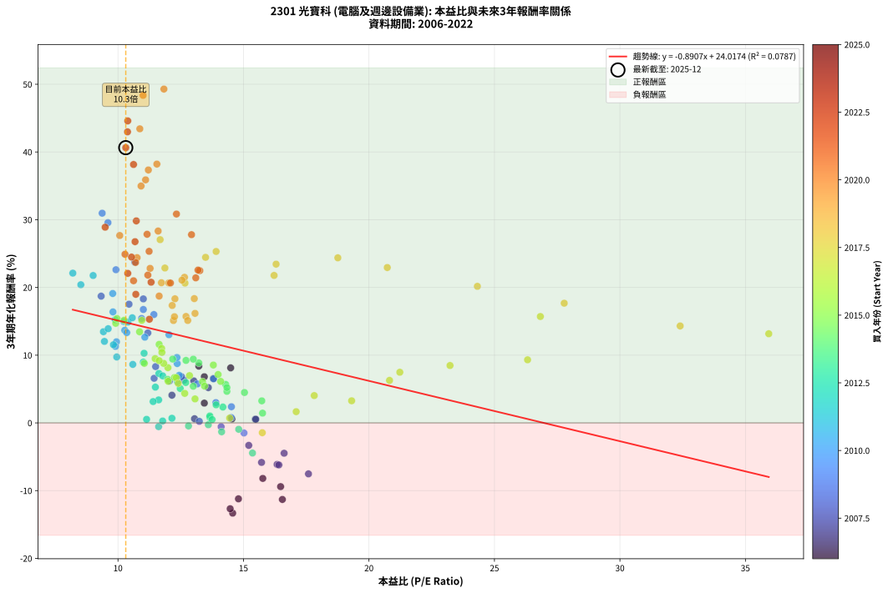
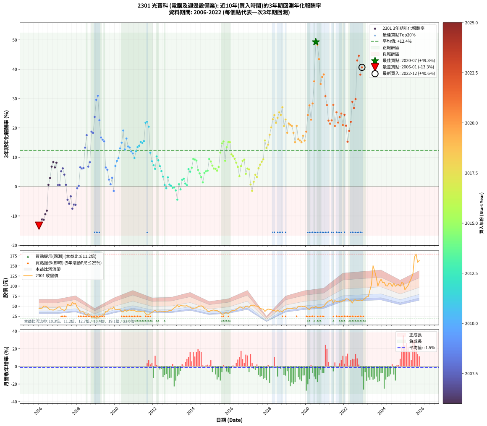

# 2301 光寶科 - 本益比與未來報酬率分析

!!! info "報告資訊"
    - **股票代號**: 2301
    - **公司名稱**: 光寶科
    - **產業別**: 電腦及週邊設備業
    - **分析期間**: 2006-2022 (204 個數據點)
    - **資料來源**: Type 12 (ShowMonthlyK_ChartFlow) 月收盤價與本益比
    - **報酬率口徑**: 含現金股利 (簡化: 年度合計，假設每年7/1入帳)
    - **報告生成時間**: 2026-01-06 18:21:30 CST

## 📈 視覺化圖表

### 圖表1: 本益比 vs 未來報酬率關係

*圖表1：2301 光寶科 本益比與3年期未來報酬率關係 (2006-2022)*

### 圖表2: 歷年買入時點的3年期實際報酬率

*圖表2：2301 光寶科 歷年買入時點的3年期實際報酬率 (2006-2022)*

## 📍 買點訊號說明

本報告提供兩種買點提示訊號（顯示於圖表2的股價子圖中）：

### ▲ 小綠色三角形（回測驗證）
- **計算方式**: 使用全部歷史資料計算本益比第25百分位數
- **用途**: 事後驗證，顯示歷史上哪些時點確實為低估區
- **限制**: 當下無法判斷，僅供回測參考
- **特性**: 後見之明（Look-Ahead Bias）

### ▲ 小橘色三角形（即時訊號）
- **計算方式**: 使用截至當月的過去5年資料計算本益比第25百分位數
- **用途**: 實際投資決策，當時即可判斷
- **優勢**: 可操作性強，符合實務需求
- **特性**: 無後見之明，滾動窗口計算

!!! tip "如何使用兩種訊號"
    - **綠色▲** 幫助理解歷史估值機會，驗證策略有效性
    - **橘色▲** 可作為實際買進參考，但仍需搭配基本面分析
    - 兩種訊號重疊時，表示即時判斷與事後驗證一致，信心度較高
    - 僅有綠色▲時，表示當時無法判斷（需要未來資料才能確認）
    - 僅有橘色▲時，表示即時判斷為買點，但事後可能不是最佳時機

## 📊 估值分析摘要

| 指標 | 數值 |
|:---:|:---:|
| **目前本益比** (2022-12) | **10.31 倍** |
| **歷史平均本益比** | 13.10 倍 |
| **估值水準** | 🟢 相對低估 |
| **預期3年年化報酬率** | **+14.83%** |
| **歷史平均報酬率** | +12.35% |
| **相關係數 (R²)** | 0.0787 |
| **趨勢線斜率** | -0.8907 |

!!! abstract "核心洞察"
    目前本益比顯著低於歷史平均，預期未來報酬率可能較高

    根據歷史數據回測，2301 光寶科 在目前本益比 **10.3倍** 的估值水準下，
    預期未來3年年化報酬率約為 **+14.8%**。

    **重要提醒**: 本分析基於歷史數據統計，實際報酬率會受到公司基本面變化、產業趨勢、
    總體經濟環境等多重因素影響。R² = 0.08 表示本益比可解釋約 7.9% 的報酬率變異。

## 📈 歷史估值統計

### 最佳買點 (最高報酬率)

| 項目 | 數值 |
|:---:|:---:|
| 起始時間 | 2020-07 |
| 當時本益比 | 11.83 倍 |
| 起始價格 | 49.6 元 |
| 3年後價格 | 150.5 元 |
| **3年年化報酬率** | **+49.29%** |

### 最差買點 (最低報酬率)

| 項目 | 數值 |
|:---:|:---:|
| 起始時間 | 2006-01 |
| 當時本益比 | 14.57 倍 |
| 起始價格 | 44.3 元 |
| 3年後價格 | 20.2 元 |
| **3年年化報酬率** | **-13.32%** |

## 🎯 投資啟示

### 本益比與報酬率關係

趨勢線方程式: **y = -0.8907x + 24.0174**

!!! warning "強負相關"
    本益比與未來報酬率呈現強負相關。在高本益比時期買入，未來報酬率顯著較低；
    在低本益比時期買入，未來報酬率顯著較高。**估值紀律至關重要**。

### 估值區間建議

基於歷史數據分析:

- **🟢 低估區** (P/E < 10.5): 預期報酬率較高，可考慮增加持股
- **🟡 合理區** (P/E 10.5-15.7): 預期報酬率符合長期趨勢，正常持有
- **🔴 高估區** (P/E > 15.7): 預期報酬率較低，可考慮減碼或觀望

!!! danger "風險提示"
    - 過去表現不代表未來結果
    - 本分析假設公司基本面無重大結構性變化
    - 產業環境劇變可能使歷史規律失效
    - 應結合公司財報、產業趨勢、總體經濟等多重因素綜合判斷

!!! success "長期投資觀點"
    歷史數據顯示，在合理或低估的估值水準買入並長期持有，
    往往能獲得較佳的投資報酬。**耐心等待好價格**是價值投資的核心原則。

## 📊 數據品質

- **資料來源**: GoodInfo.tw Type 12 (ShowMonthlyK_ChartFlow)
- **資料頻率**: 月度收盤價與本益比
- **回測期間**: 2006-2022
- **數據點數量**: 204 個 (每個點代表一次3年期回測)

### 計算方法說明

1. **3年期年化報酬率**:
   - 對每個歷史時點，計算其後3年的實際投資報酬率
   - 期末價值(不含股利): 期末價格
   - 期末價值(含現金股利): 期末價格 + 持有期間內的現金股利合計 (簡化: 年度合計，假設每年7/1入帳)
   - 公式: 年化報酬率 = [(期末價值/期初價格)^(1/年數) - 1] × 100%

2. **本益比 (P/E Ratio)**:
   - 使用當時的月收盤價與EPS計算
   - 資料來源: Type 12 月度河流圖本益比數據

3. **趨勢線 (Linear Regression)**:
   - 使用最小平方法擬合線性趨勢線
   - R²值衡量本益比對報酬率的解釋能力

---

*本報告由 Stock Analysis System v1.9.0 自動生成*
*數據更新時間: 2026-01-06 18:21:30 CST*

## 📋 月度回測明細表

（每一列對應時間線圖中的一個買入點；可用來對照 SVG 圖上的每個點。）

| 買入月份 | 賣出月份 | 回測期限_年 | 實際持有年數 | 買入本益比_倍 | 買入收盤價_元 | 賣出收盤價_元 | 現金股利合計_元 | 總報酬率_pct | 年化報酬率_pct |
| --- | --- | --- | --- | --- | --- | --- | --- | --- | --- |
| 2006-01 | 2009-01 | 3 | 3.001 | 14.57 | 44.30 | 20.25 | 8.60 | -34.88 | -13.32 |
| 2006-02 | 2009-02 | 3 | 3.001 | 14.47 | 44.00 | 20.70 | 8.60 | -33.42 | -12.68 |
| 2006-03 | 2009-03 | 3 | 3.001 | 14.80 | 45.00 | 22.90 | 8.60 | -30.01 | -11.21 |
| 2006-04 | 2009-04 | 3 | 3.001 | 16.55 | 50.30 | 26.50 | 8.60 | -30.23 | -11.30 |
| 2006-05 | 2009-05 | 3 | 3.001 | 16.48 | 50.10 | 28.65 | 8.60 | -25.66 | -9.41 |
| 2006-06 | 2009-06 | 3 | 3.001 | 15.77 | 47.95 | 28.50 | 8.60 | -22.64 | -8.20 |
| 2006-07 | 2009-07 | 3 | 3.001 | 14.54 | 44.20 | 37.35 | 7.64 | +1.78 | +0.59 |
| 2006-08 | 2009-08 | 3 | 3.001 | 13.44 | 40.85 | 36.90 | 7.64 | +9.02 | +2.92 |
| 2006-09 | 2009-09 | 3 | 3.001 | 13.44 | 40.85 | 42.15 | 7.64 | +21.88 | +6.81 |
| 2006-10 | 2009-10 | 3 | 3.001 | 13.22 | 40.20 | 43.55 | 7.64 | +27.33 | +8.38 |
| 2006-11 | 2009-11 | 3 | 3.001 | 13.80 | 41.95 | 43.10 | 7.64 | +20.94 | +6.54 |
| 2006-12 | 2009-12 | 3 | 3.001 | 14.49 | 44.05 | 48.05 | 7.64 | +26.42 | +8.12 |
| 2007-01 | 2010-01 | 3 | 3.001 | 15.47 | 47.55 | 40.70 | 7.64 | +1.65 | +0.55 |
| 2007-02 | 2010-02 | 3 | 3.001 | 15.49 | 48.15 | 41.30 | 7.64 | +1.63 | +0.54 |
| 2007-03 | 2010-03 | 3 | 3.001 | 13.60 | 42.75 | 42.15 | 7.64 | +16.46 | +5.21 |
| 2007-04 | 2010-04 | 3 | 3.001 | 13.02 | 41.35 | 41.90 | 7.64 | +19.80 | +6.20 |
| 2007-05 | 2010-05 | 3 | 3.001 | 12.15 | 39.00 | 36.35 | 7.64 | +12.78 | +4.09 |
| 2007-06 | 2010-06 | 3 | 3.001 | 13.05 | 42.35 | 35.50 | 7.64 | +1.86 | +0.61 |
| 2007-07 | 2010-07 | 3 | 3.001 | 16.62 | 54.50 | 40.90 | 6.60 | -12.84 | -4.48 |
| 2007-08 | 2010-08 | 3 | 3.001 | 15.72 | 52.10 | 36.90 | 6.60 | -16.51 | -5.83 |
| 2007-09 | 2010-09 | 3 | 3.001 | 15.21 | 50.90 | 39.40 | 6.60 | -9.63 | -3.32 |
| 2007-10 | 2010-10 | 3 | 3.001 | 17.59 | 59.50 | 40.45 | 6.60 | -20.92 | -7.53 |
| 2007-11 | 2010-11 | 3 | 3.001 | 16.34 | 55.80 | 39.55 | 6.60 | -17.29 | -6.13 |
| 2007-12 | 2010-12 | 3 | 3.001 | 16.41 | 56.60 | 40.10 | 6.60 | -17.49 | -6.21 |
| 2008-01 | 2011-01 | 3 | 3.001 | 14.11 | 47.00 | 39.60 | 6.60 | -1.70 | -0.57 |
| 2008-02 | 2011-03 | 3 | 3.080 | 13.24 | 42.50 | 36.20 | 6.60 | +0.71 | +0.23 |
| 2008-03 | 2011-03 | 3 | 2.998 | 11.44 | 35.35 | 36.20 | 6.60 | +21.07 | +6.59 |
| 2008-04 | 2011-04 | 3 | 2.998 | 12.05 | 35.80 | 36.25 | 6.60 | +19.69 | +6.18 |
| 2008-05 | 2011-05 | 3 | 2.998 | 12.63 | 36.00 | 36.65 | 6.60 | +20.14 | +6.31 |
| 2008-06 | 2011-06 | 3 | 2.998 | 11.19 | 30.55 | 37.80 | 6.60 | +45.34 | +13.28 |
| 2008-07 | 2011-07 | 3 | 2.998 | 10.44 | 27.25 | 37.70 | 6.52 | +62.28 | +17.53 |
| 2008-08 | 2011-08 | 3 | 2.998 | 12.53 | 31.20 | 31.50 | 6.52 | +21.86 | +6.82 |
| 2008-09 | 2011-09 | 3 | 2.998 | 11.50 | 27.25 | 28.10 | 6.52 | +27.05 | +8.31 |
| 2008-10 | 2011-10 | 3 | 2.998 | 9.33 | 21.00 | 28.60 | 6.52 | +67.24 | +18.71 |
| 2008-11 | 2011-11 | 3 | 2.998 | 11.01 | 23.45 | 32.30 | 6.52 | +65.54 | +18.31 |
| 2008-12 | 2011-12 | 3 | 2.998 | 10.67 | 21.45 | 34.10 | 6.52 | +89.37 | +23.74 |
| 2009-01 | 2012-01 | 3 | 2.998 | 9.60 | 20.25 | 37.50 | 6.52 | +117.38 | +29.56 |
| 2009-02 | 2012-02 | 3 | 2.998 | 9.37 | 20.70 | 39.95 | 6.52 | +124.49 | +30.96 |
| 2009-03 | 2012-03 | 3 | 3.001 | 9.92 | 22.90 | 35.70 | 6.52 | +84.37 | +22.61 |
| 2009-04 | 2012-04 | 3 | 3.001 | 11.01 | 26.50 | 35.65 | 6.52 | +59.13 | +16.74 |
| 2009-05 | 2012-05 | 3 | 3.001 | 11.43 | 28.65 | 38.20 | 6.52 | +56.09 | +16.00 |
| 2009-06 | 2012-06 | 3 | 3.001 | 10.94 | 28.50 | 37.30 | 6.52 | +53.75 | +15.41 |
| 2009-07 | 2012-07 | 3 | 3.001 | 13.81 | 37.35 | 37.75 | 7.39 | +20.86 | +6.52 |
| 2009-08 | 2012-08 | 3 | 3.001 | 13.16 | 36.90 | 36.25 | 7.39 | +18.27 | +5.75 |
| 2009-09 | 2012-09 | 3 | 3.001 | 14.52 | 42.15 | 37.85 | 7.39 | +7.33 | +2.39 |
| 2009-10 | 2012-10 | 3 | 3.001 | 14.51 | 43.55 | 37.20 | 7.39 | +2.39 | +0.79 |
| 2009-11 | 2012-11 | 3 | 3.001 | 13.90 | 43.10 | 39.70 | 7.39 | +9.26 | +2.99 |
| 2009-12 | 2012-12 | 3 | 3.001 | 15.02 | 48.05 | 38.55 | 7.39 | -4.39 | -1.49 |
| 2010-01 | 2013-01 | 3 | 3.001 | 12.44 | 40.70 | 42.50 | 7.39 | +22.58 | +7.02 |
| 2010-02 | 2013-02 | 3 | 3.001 | 12.36 | 41.30 | 45.75 | 7.39 | +28.67 | +8.76 |
| 2010-03 | 2013-03 | 3 | 3.001 | 12.35 | 42.15 | 48.20 | 7.39 | +31.89 | +9.66 |
| 2010-04 | 2013-04 | 3 | 3.001 | 12.03 | 41.90 | 53.10 | 7.39 | +44.37 | +13.02 |
| 2010-05 | 2013-05 | 3 | 3.001 | 10.23 | 36.35 | 47.85 | 7.39 | +51.97 | +14.97 |
| 2010-06 | 2013-06 | 3 | 3.001 | 9.79 | 35.50 | 52.60 | 7.39 | +68.99 | +19.11 |
| 2010-07 | 2013-07 | 3 | 3.001 | 11.07 | 40.90 | 51.00 | 7.48 | +42.99 | +12.66 |
| 2010-08 | 2013-08 | 3 | 3.001 | 9.80 | 36.90 | 50.70 | 7.48 | +57.67 | +16.39 |
| 2010-09 | 2013-09 | 3 | 3.001 | 10.27 | 39.40 | 50.40 | 7.48 | +46.91 | +13.68 |
| 2010-10 | 2013-10 | 3 | 3.001 | 10.35 | 40.45 | 51.40 | 7.48 | +45.56 | +13.33 |
| 2010-11 | 2013-11 | 3 | 3.001 | 9.94 | 39.55 | 48.05 | 7.48 | +40.41 | +11.97 |
| 2010-12 | 2013-12 | 3 | 3.001 | 9.90 | 40.10 | 47.80 | 7.48 | +37.86 | +11.29 |
| 2011-01 | 2014-01 | 3 | 3.001 | 9.95 | 39.60 | 44.85 | 7.48 | +32.15 | +9.74 |
| 2011-02 | 2014-02 | 3 | 3.001 | 9.46 | 37.00 | 44.55 | 7.48 | +40.62 | +12.03 |
| 2011-03 | 2014-03 | 3 | 3.001 | 9.42 | 36.20 | 45.40 | 7.48 | +46.08 | +13.46 |
| 2011-04 | 2014-04 | 3 | 3.001 | 9.61 | 36.25 | 46.10 | 7.48 | +47.81 | +13.91 |
| 2011-05 | 2014-05 | 3 | 3.001 | 9.89 | 36.65 | 48.60 | 7.48 | +53.02 | +15.23 |
| 2011-06 | 2014-06 | 3 | 3.001 | 10.40 | 37.80 | 49.85 | 7.48 | +51.67 | +14.89 |
| 2011-07 | 2014-07 | 3 | 3.001 | 10.57 | 37.70 | 50.80 | 7.32 | +54.17 | +15.52 |
| 2011-08 | 2014-08 | 3 | 3.001 | 9.01 | 31.50 | 49.55 | 7.32 | +80.55 | +21.76 |
| 2011-09 | 2014-09 | 3 | 3.001 | 8.20 | 28.10 | 43.85 | 7.32 | +82.11 | +22.11 |
| 2011-10 | 2014-10 | 3 | 3.001 | 8.52 | 28.60 | 42.60 | 7.32 | +74.56 | +20.40 |
| 2011-11 | 2014-11 | 3 | 3.001 | 9.82 | 32.30 | 37.50 | 7.32 | +38.77 | +11.54 |
| 2011-12 | 2014-12 | 3 | 3.001 | 10.59 | 34.10 | 36.40 | 7.32 | +28.22 | +8.64 |
| 2012-01 | 2015-01 | 3 | 3.001 | 11.63 | 37.50 | 39.00 | 7.32 | +23.53 | +7.30 |
| 2012-02 | 2015-03 | 3 | 3.080 | 12.37 | 39.95 | 40.55 | 7.32 | +19.83 | +6.05 |
| 2012-03 | 2015-03 | 3 | 2.998 | 11.04 | 35.70 | 40.55 | 7.32 | +34.10 | +10.28 |
| 2012-04 | 2015-04 | 3 | 2.998 | 11.01 | 35.65 | 38.80 | 7.32 | +29.38 | +8.97 |
| 2012-05 | 2015-05 | 3 | 2.998 | 11.78 | 38.20 | 39.40 | 7.32 | +22.31 | +6.95 |
| 2012-06 | 2015-06 | 3 | 2.998 | 11.49 | 37.30 | 36.20 | 7.32 | +16.68 | +5.28 |
| 2012-07 | 2015-07 | 3 | 2.998 | 11.62 | 37.75 | 34.70 | 7.02 | +10.52 | +3.39 |
| 2012-08 | 2015-08 | 3 | 2.998 | 11.14 | 36.25 | 29.80 | 7.02 | +1.58 | +0.52 |
| 2012-09 | 2015-09 | 3 | 2.998 | 11.62 | 37.85 | 30.20 | 7.02 | -1.66 | -0.56 |
| 2012-10 | 2015-10 | 3 | 2.998 | 11.40 | 37.20 | 33.80 | 7.02 | +9.74 | +3.15 |
| 2012-11 | 2015-11 | 3 | 2.998 | 12.15 | 39.70 | 33.50 | 7.02 | +2.07 | +0.69 |
| 2012-12 | 2015-12 | 3 | 2.998 | 11.78 | 38.55 | 31.85 | 7.02 | +0.84 | +0.28 |
| 2013-01 | 2016-01 | 3 | 2.998 | 12.81 | 42.50 | 34.90 | 7.02 | -1.36 | -0.45 |
| 2013-02 | 2016-02 | 3 | 2.998 | 13.60 | 45.75 | 38.35 | 7.02 | -0.82 | -0.28 |
| 2013-03 | 2016-03 | 3 | 3.001 | 14.13 | 48.20 | 39.30 | 7.02 | -3.89 | -1.31 |
| 2013-04 | 2016-04 | 3 | 3.001 | 15.36 | 53.10 | 39.30 | 7.02 | -12.76 | -4.45 |
| 2013-05 | 2016-05 | 3 | 3.001 | 13.66 | 47.85 | 42.00 | 7.02 | +2.45 | +0.81 |
| 2013-06 | 2016-06 | 3 | 3.001 | 14.81 | 52.60 | 44.10 | 7.02 | -2.81 | -0.94 |
| 2013-07 | 2016-07 | 3 | 3.001 | 14.18 | 51.00 | 47.80 | 6.87 | +7.19 | +2.34 |
| 2013-08 | 2016-08 | 3 | 3.001 | 13.91 | 50.70 | 48.00 | 6.87 | +8.22 | +2.67 |
| 2013-09 | 2016-09 | 3 | 3.001 | 13.66 | 50.40 | 45.10 | 6.87 | +3.11 | +1.03 |
| 2013-10 | 2016-10 | 3 | 3.001 | 13.75 | 51.40 | 45.30 | 6.87 | +1.49 | +0.50 |
| 2013-11 | 2016-11 | 3 | 3.001 | 12.70 | 48.05 | 50.30 | 6.87 | +18.98 | +5.96 |
| 2013-12 | 2016-12 | 3 | 3.001 | 12.48 | 47.80 | 48.60 | 6.87 | +16.04 | +5.08 |
| 2014-01 | 2017-01 | 3 | 3.001 | 11.98 | 44.85 | 47.20 | 6.87 | +20.55 | +6.43 |
| 2014-02 | 2017-02 | 3 | 3.001 | 12.18 | 44.55 | 51.50 | 6.87 | +31.02 | +9.42 |
| 2014-03 | 2017-03 | 3 | 3.001 | 12.71 | 45.40 | 52.30 | 6.87 | +30.33 | +9.23 |
| 2014-04 | 2017-04 | 3 | 3.001 | 13.22 | 46.10 | 52.60 | 6.87 | +29.00 | +8.86 |
| 2014-05 | 2017-05 | 3 | 3.001 | 14.29 | 48.60 | 50.50 | 6.87 | +18.04 | +5.68 |
| 2014-06 | 2017-06 | 3 | 3.001 | 15.04 | 49.85 | 50.00 | 6.87 | +14.08 | +4.49 |
| 2014-07 | 2017-07 | 3 | 3.001 | 15.73 | 50.80 | 48.85 | 7.08 | +10.09 | +3.26 |
| 2014-08 | 2017-08 | 3 | 3.001 | 15.76 | 49.55 | 44.65 | 7.08 | +4.39 | +1.44 |
| 2014-09 | 2017-09 | 3 | 3.001 | 14.34 | 43.85 | 43.20 | 7.08 | +14.65 | +4.66 |
| 2014-10 | 2017-10 | 3 | 3.001 | 14.34 | 42.60 | 42.55 | 7.08 | +16.49 | +5.22 |
| 2014-11 | 2017-11 | 3 | 3.001 | 13.00 | 37.50 | 36.85 | 7.08 | +17.14 | +5.41 |
| 2014-12 | 2017-12 | 3 | 3.001 | 13.00 | 36.40 | 40.60 | 7.08 | +30.98 | +9.41 |
| 2015-01 | 2018-01 | 3 | 3.001 | 13.80 | 39.00 | 42.80 | 7.08 | +27.89 | +8.54 |
| 2015-02 | 2018-02 | 3 | 3.001 | 13.99 | 39.90 | 42.00 | 7.08 | +23.00 | +7.14 |
| 2015-03 | 2018-03 | 3 | 3.001 | 14.09 | 40.55 | 41.40 | 7.08 | +19.55 | +6.13 |
| 2015-04 | 2018-04 | 3 | 3.001 | 13.37 | 38.80 | 39.25 | 7.08 | +19.40 | +6.09 |
| 2015-05 | 2018-05 | 3 | 3.001 | 13.45 | 39.40 | 39.10 | 7.08 | +17.20 | +5.43 |
| 2015-06 | 2018-06 | 3 | 3.001 | 12.25 | 36.20 | 36.90 | 7.08 | +21.48 | +6.70 |
| 2015-07 | 2018-07 | 3 | 3.001 | 11.64 | 34.70 | 40.20 | 8.03 | +38.98 | +11.59 |
| 2015-08 | 2018-08 | 3 | 3.001 | 9.91 | 29.80 | 36.95 | 8.03 | +50.93 | +14.70 |
| 2015-09 | 2018-09 | 3 | 3.001 | 9.96 | 30.20 | 38.40 | 8.03 | +53.73 | +15.41 |
| 2015-10 | 2018-10 | 3 | 3.001 | 11.05 | 33.80 | 35.50 | 8.03 | +28.78 | +8.79 |
| 2015-11 | 2018-11 | 3 | 3.001 | 10.86 | 33.50 | 40.90 | 8.03 | +46.05 | +13.45 |
| 2015-12 | 2018-12 | 3 | 3.001 | 10.24 | 31.85 | 40.60 | 8.03 | +52.67 | +15.14 |
| 2016-01 | 2019-01 | 3 | 3.001 | 10.95 | 34.90 | 45.25 | 8.03 | +52.65 | +15.14 |
| 2016-02 | 2019-03 | 3 | 3.080 | 11.74 | 38.35 | 44.85 | 8.03 | +37.88 | +10.99 |
| 2016-03 | 2019-03 | 3 | 2.998 | 11.75 | 39.30 | 44.85 | 8.03 | +34.54 | +10.40 |
| 2016-04 | 2019-04 | 3 | 2.998 | 11.48 | 39.30 | 43.55 | 8.03 | +31.24 | +9.49 |
| 2016-05 | 2019-05 | 3 | 2.998 | 11.99 | 42.00 | 45.10 | 8.03 | +26.49 | +8.15 |
| 2016-06 | 2019-06 | 3 | 2.998 | 12.32 | 44.10 | 45.50 | 8.03 | +21.37 | +6.67 |
| 2016-07 | 2019-07 | 3 | 2.998 | 13.07 | 47.80 | 44.30 | 8.76 | +11.00 | +3.54 |
| 2016-08 | 2019-08 | 3 | 2.998 | 12.85 | 48.00 | 50.00 | 8.76 | +22.42 | +6.98 |
| 2016-09 | 2019-09 | 3 | 2.998 | 11.82 | 45.10 | 49.30 | 8.76 | +28.74 | +8.79 |
| 2016-10 | 2019-10 | 3 | 2.998 | 11.64 | 45.30 | 50.20 | 8.76 | +30.15 | +9.19 |
| 2016-11 | 2019-11 | 3 | 2.998 | 12.66 | 50.30 | 48.40 | 8.76 | +13.64 | +4.36 |
| 2016-12 | 2019-12 | 3 | 2.998 | 12.00 | 48.60 | 49.35 | 8.76 | +19.57 | +6.14 |
| 2017-01 | 2020-01 | 3 | 2.998 | 12.40 | 47.20 | 47.20 | 8.76 | +18.56 | +5.84 |
| 2017-02 | 2020-02 | 3 | 2.998 | 14.45 | 51.50 | 43.85 | 8.76 | +2.16 | +0.71 |
| 2017-03 | 2020-03 | 3 | 3.001 | 15.75 | 52.30 | 41.30 | 8.76 | -4.28 | -1.45 |
| 2017-04 | 2020-04 | 3 | 3.001 | 17.10 | 52.60 | 46.50 | 8.76 | +5.06 | +1.66 |
| 2017-05 | 2020-05 | 3 | 3.001 | 17.82 | 50.50 | 48.10 | 8.76 | +12.59 | +4.03 |
| 2017-06 | 2020-06 | 3 | 3.001 | 19.31 | 50.00 | 46.30 | 8.76 | +10.12 | +3.26 |
| 2017-07 | 2020-07 | 3 | 3.001 | 20.82 | 48.85 | 49.60 | 9.04 | +20.04 | +6.28 |
| 2017-08 | 2020-08 | 3 | 3.001 | 21.23 | 44.65 | 46.40 | 9.04 | +24.17 | +7.48 |
| 2017-09 | 2020-09 | 3 | 3.001 | 23.23 | 43.20 | 46.10 | 9.04 | +27.64 | +8.47 |
| 2017-10 | 2020-10 | 3 | 3.001 | 26.32 | 42.55 | 46.55 | 9.04 | +30.65 | +9.32 |
| 2017-11 | 2020-11 | 3 | 3.001 | 26.83 | 36.85 | 48.05 | 9.04 | +54.93 | +15.71 |
| 2017-12 | 2020-12 | 3 | 3.001 | 35.93 | 40.60 | 49.80 | 9.04 | +44.93 | +13.16 |
| 2018-01 | 2021-01 | 3 | 3.001 | 32.40 | 42.80 | 54.90 | 9.04 | +49.39 | +14.31 |
| 2018-02 | 2021-02 | 3 | 3.001 | 27.78 | 42.00 | 59.40 | 9.04 | +62.95 | +17.67 |
| 2018-03 | 2021-03 | 3 | 3.001 | 24.32 | 41.40 | 62.80 | 9.04 | +73.53 | +20.16 |
| 2018-04 | 2021-04 | 3 | 3.001 | 20.73 | 39.25 | 63.90 | 9.04 | +85.83 | +22.94 |
| 2018-05 | 2021-05 | 3 | 3.001 | 18.76 | 39.10 | 66.20 | 9.04 | +92.43 | +24.38 |
| 2018-06 | 2021-06 | 3 | 3.001 | 16.22 | 36.90 | 57.60 | 9.04 | +80.60 | +21.77 |
| 2018-07 | 2021-07 | 3 | 3.001 | 16.30 | 40.20 | 64.10 | 11.52 | +88.11 | +23.44 |
| 2018-08 | 2021-08 | 3 | 3.001 | 13.91 | 36.95 | 61.20 | 11.52 | +96.81 | +25.31 |
| 2018-09 | 2021-09 | 3 | 3.001 | 13.49 | 38.40 | 62.50 | 11.52 | +92.76 | +24.45 |
| 2018-10 | 2021-10 | 3 | 3.001 | 11.68 | 35.50 | 61.30 | 11.52 | +105.13 | +27.05 |
| 2018-11 | 2021-11 | 3 | 3.001 | 12.67 | 40.90 | 60.30 | 11.52 | +75.60 | +20.64 |
| 2018-12 | 2021-12 | 3 | 3.001 | 11.87 | 40.60 | 63.80 | 11.52 | +85.52 | +22.87 |
| 2019-01 | 2022-01 | 3 | 3.001 | 13.04 | 45.25 | 63.50 | 11.52 | +65.79 | +18.35 |
| 2019-02 | 2022-02 | 3 | 3.001 | 12.65 | 44.55 | 68.40 | 11.52 | +79.39 | +21.50 |
| 2019-03 | 2022-03 | 3 | 3.001 | 12.55 | 44.85 | 68.10 | 11.52 | +77.53 | +21.08 |
| 2019-04 | 2022-04 | 3 | 3.001 | 12.02 | 43.55 | 65.00 | 11.52 | +75.71 | +20.66 |
| 2019-05 | 2022-05 | 3 | 3.001 | 12.27 | 45.10 | 63.20 | 11.52 | +65.68 | +18.32 |
| 2019-06 | 2022-06 | 3 | 3.001 | 12.21 | 45.50 | 57.90 | 11.52 | +52.57 | +15.12 |
| 2019-07 | 2022-07 | 3 | 3.001 | 11.73 | 44.30 | 65.30 | 12.60 | +75.85 | +20.70 |
| 2019-08 | 2022-08 | 3 | 3.001 | 13.07 | 50.00 | 65.80 | 12.60 | +56.80 | +16.17 |
| 2019-09 | 2022-09 | 3 | 3.001 | 12.71 | 49.30 | 63.80 | 12.60 | +54.97 | +15.72 |
| 2019-10 | 2022-10 | 3 | 3.001 | 12.78 | 50.20 | 64.00 | 12.60 | +52.59 | +15.12 |
| 2019-11 | 2022-11 | 3 | 3.001 | 12.16 | 48.40 | 65.60 | 12.60 | +61.57 | +17.34 |
| 2019-12 | 2022-12 | 3 | 3.001 | 12.25 | 49.35 | 63.80 | 12.60 | +54.81 | +15.68 |
| 2020-01 | 2023-01 | 3 | 3.001 | 11.64 | 47.20 | 66.40 | 12.60 | +67.37 | +18.73 |
| 2020-02 | 2023-03 | 3 | 3.080 | 10.76 | 43.85 | 73.30 | 12.60 | +95.90 | +24.40 |
| 2020-03 | 2023-03 | 3 | 2.998 | 10.07 | 41.30 | 73.30 | 12.60 | +107.99 | +27.67 |
| 2020-04 | 2023-04 | 3 | 2.998 | 11.28 | 46.50 | 73.50 | 12.60 | +85.16 | +22.81 |
| 2020-05 | 2023-05 | 3 | 2.998 | 11.60 | 48.10 | 89.00 | 12.60 | +111.23 | +28.33 |
| 2020-06 | 2023-06 | 3 | 2.998 | 11.10 | 46.30 | 103.50 | 12.60 | +150.76 | +35.89 |
| 2020-07 | 2023-07 | 3 | 2.998 | 11.83 | 49.60 | 150.50 | 14.40 | +232.46 | +49.29 |
| 2020-08 | 2023-08 | 3 | 2.998 | 11.00 | 46.40 | 137.00 | 14.40 | +226.29 | +48.36 |
| 2020-09 | 2023-09 | 3 | 2.998 | 10.87 | 46.10 | 121.50 | 14.40 | +194.79 | +43.42 |
| 2020-10 | 2023-10 | 3 | 2.998 | 10.92 | 46.55 | 100.00 | 14.40 | +145.76 | +34.98 |
| 2020-11 | 2023-11 | 3 | 2.998 | 11.21 | 48.05 | 110.00 | 14.40 | +158.90 | +37.34 |
| 2020-12 | 2023-12 | 3 | 2.998 | 11.55 | 49.80 | 117.00 | 14.40 | +163.86 | +38.21 |
| 2021-01 | 2024-01 | 3 | 2.998 | 12.33 | 54.90 | 108.50 | 14.40 | +123.86 | +30.84 |
| 2021-02 | 2024-02 | 3 | 2.998 | 12.93 | 59.40 | 109.50 | 14.40 | +108.59 | +27.79 |
| 2021-03 | 2024-03 | 3 | 3.001 | 13.26 | 62.80 | 101.00 | 14.40 | +83.76 | +22.48 |
| 2021-04 | 2024-04 | 3 | 3.001 | 13.10 | 63.90 | 100.00 | 14.40 | +79.03 | +21.42 |
| 2021-05 | 2024-05 | 3 | 3.001 | 13.19 | 66.20 | 107.50 | 14.40 | +84.14 | +22.56 |
| 2021-06 | 2024-06 | 3 | 3.001 | 11.16 | 57.60 | 106.00 | 14.40 | +109.03 | +27.85 |
| 2021-07 | 2024-07 | 3 | 3.001 | 12.09 | 64.10 | 99.10 | 13.51 | +75.67 | +20.66 |
| 2021-08 | 2024-08 | 3 | 3.001 | 11.24 | 61.20 | 107.00 | 13.51 | +96.91 | +25.33 |
| 2021-09 | 2024-09 | 3 | 3.001 | 11.19 | 62.50 | 99.50 | 13.51 | +80.81 | +21.82 |
| 2021-10 | 2024-10 | 3 | 3.001 | 10.70 | 61.30 | 102.50 | 13.51 | +89.24 | +23.69 |
| 2021-11 | 2024-11 | 3 | 3.001 | 10.28 | 60.30 | 104.00 | 13.51 | +94.87 | +24.90 |
| 2021-12 | 2024-12 | 3 | 3.001 | 10.62 | 63.80 | 99.50 | 13.51 | +77.13 | +20.99 |
| 2022-01 | 2025-01 | 3 | 3.001 | 10.54 | 63.50 | 109.00 | 13.51 | +92.92 | +24.48 |
| 2022-02 | 2025-02 | 3 | 3.001 | 11.32 | 68.40 | 107.00 | 13.51 | +76.18 | +20.77 |
| 2022-03 | 2025-03 | 3 | 3.001 | 11.25 | 68.10 | 90.90 | 13.51 | +53.31 | +15.30 |
| 2022-04 | 2025-04 | 3 | 3.001 | 10.71 | 65.00 | 96.00 | 13.51 | +68.47 | +18.98 |
| 2022-05 | 2025-05 | 3 | 3.001 | 10.39 | 63.20 | 101.50 | 13.51 | +81.97 | +22.08 |
| 2022-06 | 2025-06 | 3 | 3.001 | 9.49 | 57.90 | 110.50 | 13.51 | +114.17 | +28.89 |
| 2022-07 | 2025-07 | 3 | 3.001 | 10.68 | 65.30 | 119.00 | 14.01 | +103.70 | +26.76 |
| 2022-08 | 2025-08 | 3 | 3.001 | 10.73 | 65.80 | 130.00 | 14.01 | +118.86 | +29.83 |
| 2022-09 | 2025-09 | 3 | 3.001 | 10.38 | 63.80 | 172.50 | 14.01 | +192.34 | +42.98 |
| 2022-10 | 2025-10 | 3 | 3.001 | 10.39 | 64.00 | 179.50 | 14.01 | +202.36 | +44.59 |
| 2022-11 | 2025-11 | 3 | 3.001 | 10.62 | 65.60 | 159.00 | 14.01 | +163.74 | +38.15 |
| 2022-12 | 2025-12 | 3 | 3.001 | 10.31 | 63.80 | 163.50 | 14.01 | +178.23 | +40.64 |
