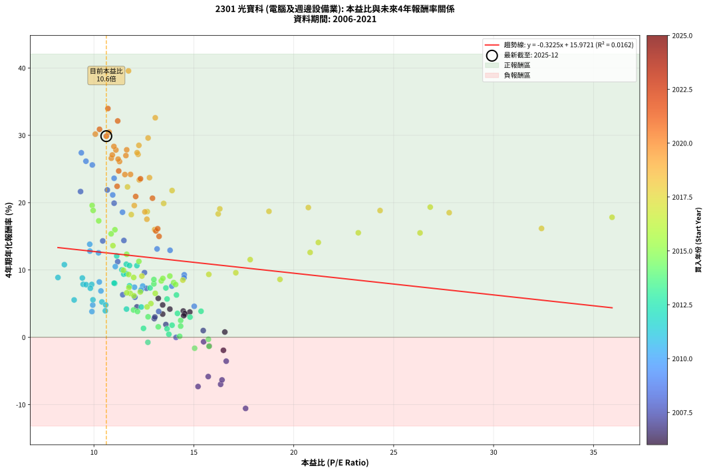
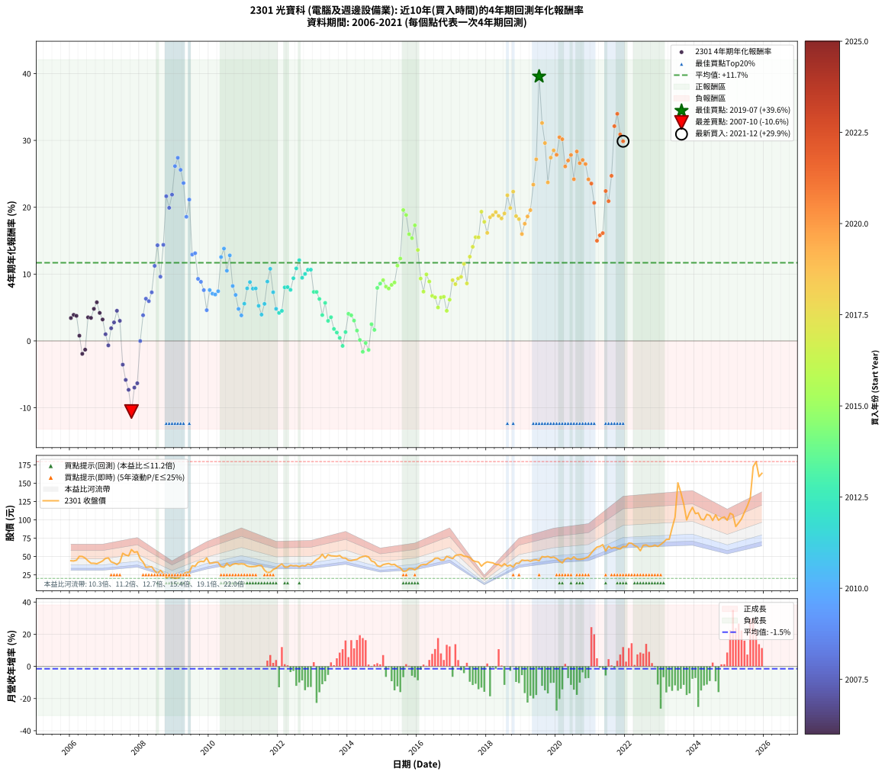

# 2301 光寶科 - 本益比與未來報酬率分析

!!! info "報告資訊"
    - **股票代號**: 2301
    - **公司名稱**: 光寶科
    - **產業別**: 電腦及週邊設備業
    - **分析期間**: 2006-2021 (192 個數據點)
    - **資料來源**: Type 12 (ShowMonthlyK_ChartFlow) 月收盤價與本益比
    - **報酬率口徑**: 含現金股利 (簡化: 年度合計，假設每年7/1入帳)
    - **報告生成時間**: 2026-01-04 08:16:04 CST

## 📈 視覺化圖表

### 圖表1: 本益比 vs 未來報酬率關係

*圖表1：2301 光寶科 本益比與4年期未來報酬率關係 (2006-2021)*

### 圖表2: 歷年買入時點的4年期實際報酬率

*圖表2：2301 光寶科 歷年買入時點的4年期實際報酬率 (2006-2021)*

## 📍 買點訊號說明

本報告提供兩種買點提示訊號（顯示於圖表2的股價子圖中）：

### ▲ 小綠色三角形（回測驗證）
- **計算方式**: 使用全部歷史資料計算本益比第25百分位數
- **用途**: 事後驗證，顯示歷史上哪些時點確實為低估區
- **限制**: 當下無法判斷，僅供回測參考
- **特性**: 後見之明（Look-Ahead Bias）

### ▲ 小橘色三角形（即時訊號）
- **計算方式**: 使用截至當月的過去5年資料計算本益比第25百分位數
- **用途**: 實際投資決策，當時即可判斷
- **優勢**: 可操作性強，符合實務需求
- **特性**: 無後見之明，滾動窗口計算

!!! tip "如何使用兩種訊號"
    - **綠色▲** 幫助理解歷史估值機會，驗證策略有效性
    - **橘色▲** 可作為實際買進參考，但仍需搭配基本面分析
    - 兩種訊號重疊時，表示即時判斷與事後驗證一致，信心度較高
    - 僅有綠色▲時，表示當時無法判斷（需要未來資料才能確認）
    - 僅有橘色▲時，表示即時判斷為買點，但事後可能不是最佳時機

## 📊 估值分析摘要

| 指標 | 數值 |
|:---:|:---:|
| **目前本益比** (2021-12) | **10.62 倍** |
| **歷史平均本益比** | 13.25 倍 |
| **估值水準** | 🟡 合理範圍 |
| **預期4年年化報酬率** | **+12.55%** |
| **歷史平均報酬率** | +11.70% |
| **相關係數 (R²)** | 0.0162 |
| **趨勢線斜率** | -0.3225 |

!!! abstract "核心洞察"
    目前本益比接近歷史平均，預期報酬率符合長期趨勢

    根據歷史數據回測，2301 光寶科 在目前本益比 **10.6倍** 的估值水準下，
    預期未來4年年化報酬率約為 **+12.5%**。

    **重要提醒**: 本分析基於歷史數據統計，實際報酬率會受到公司基本面變化、產業趨勢、
    總體經濟環境等多重因素影響。R² = 0.02 表示本益比可解釋約 1.6% 的報酬率變異。

## 📈 歷史估值統計

### 最佳買點 (最高報酬率)

| 項目 | 數值 |
|:---:|:---:|
| 起始時間 | 2019-07 |
| 當時本益比 | 11.73 倍 |
| 起始價格 | 44.3 元 |
| 4年後價格 | 150.5 元 |
| **4年年化報酬率** | **+39.57%** |

### 最差買點 (最低報酬率)

| 項目 | 數值 |
|:---:|:---:|
| 起始時間 | 2007-10 |
| 當時本益比 | 17.59 倍 |
| 起始價格 | 59.5 元 |
| 4年後價格 | 28.6 元 |
| **4年年化報酬率** | **-10.56%** |

## 🎯 投資啟示

### 本益比與報酬率關係

趨勢線方程式: **y = -0.3225x + 15.9721**

!!! note "負相關"
    本益比與未來報酬率呈現負相關。較低的本益比通常帶來較高的未來報酬率，
    但相關性不算非常強。**估值仍是重要參考指標之一**。

### 估值區間建議

基於歷史數據分析:

- **🟢 低估區** (P/E < 10.6): 預期報酬率較高，可考慮增加持股
- **🟡 合理區** (P/E 10.6-15.9): 預期報酬率符合長期趨勢，正常持有
- **🔴 高估區** (P/E > 15.9): 預期報酬率較低，可考慮減碼或觀望

!!! danger "風險提示"
    - 過去表現不代表未來結果
    - 本分析假設公司基本面無重大結構性變化
    - 產業環境劇變可能使歷史規律失效
    - 應結合公司財報、產業趨勢、總體經濟等多重因素綜合判斷

!!! success "長期投資觀點"
    歷史數據顯示，在合理或低估的估值水準買入並長期持有，
    往往能獲得較佳的投資報酬。**耐心等待好價格**是價值投資的核心原則。

## 📊 數據品質

- **資料來源**: GoodInfo.tw Type 12 (ShowMonthlyK_ChartFlow)
- **資料頻率**: 月度收盤價與本益比
- **回測期間**: 2006-2021
- **數據點數量**: 192 個 (每個點代表一次4年期回測)

### 計算方法說明

1. **4年期年化報酬率**:
   - 對每個歷史時點，計算其後4年的實際投資報酬率
   - 期末價值(不含股利): 期末價格
   - 期末價值(含現金股利): 期末價格 + 持有期間內的現金股利合計 (簡化: 年度合計，假設每年7/1入帳)
   - 公式: 年化報酬率 = [(期末價值/期初價格)^(1/年數) - 1] × 100%

2. **本益比 (P/E Ratio)**:
   - 使用當時的月收盤價與EPS計算
   - 資料來源: Type 12 月度河流圖本益比數據

3. **趨勢線 (Linear Regression)**:
   - 使用最小平方法擬合線性趨勢線
   - R²值衡量本益比對報酬率的解釋能力

---

*本報告由 Stock Analysis System v1.9.0 自動生成*
*數據更新時間: 2026-01-04 08:16:04 CST*

## 📋 月度回測明細表

（每一列對應時間線圖中的一個買入點；可用來對照 SVG 圖上的每個點。）

| 買入月份 | 賣出月份 | 回測期限_年 | 實際持有年數 | 買入本益比_倍 | 買入收盤價_元 | 賣出收盤價_元 | 現金股利合計_元 | 總報酬率_pct | 年化報酬率_pct |
| --- | --- | --- | --- | --- | --- | --- | --- | --- | --- |
| 2006-01 | 2010-01 | 4 | 4.000 | 14.57 | 44.30 | 40.70 | 10.00 | +14.44 | +3.43 |
| 2006-02 | 2010-02 | 4 | 4.000 | 14.47 | 44.00 | 41.30 | 10.00 | +16.58 | +3.91 |
| 2006-03 | 2010-03 | 4 | 4.000 | 14.80 | 45.00 | 42.15 | 10.00 | +15.88 | +3.75 |
| 2006-04 | 2010-04 | 4 | 4.000 | 16.55 | 50.30 | 41.90 | 10.00 | +3.17 | +0.78 |
| 2006-05 | 2010-05 | 4 | 4.000 | 16.48 | 50.10 | 36.35 | 10.00 | -7.49 | -1.93 |
| 2006-06 | 2010-06 | 4 | 4.000 | 15.77 | 47.95 | 35.50 | 10.00 | -5.12 | -1.30 |
| 2006-07 | 2010-07 | 4 | 4.000 | 14.54 | 44.20 | 40.90 | 9.89 | +14.90 | +3.53 |
| 2006-08 | 2010-08 | 4 | 4.000 | 13.44 | 40.85 | 36.90 | 9.89 | +14.53 | +3.45 |
| 2006-09 | 2010-09 | 4 | 4.000 | 13.44 | 40.85 | 39.40 | 9.89 | +20.65 | +4.81 |
| 2006-10 | 2010-10 | 4 | 4.000 | 13.22 | 40.20 | 40.45 | 9.89 | +25.21 | +5.78 |
| 2006-11 | 2010-11 | 4 | 4.000 | 13.80 | 41.95 | 39.55 | 9.89 | +17.85 | +4.19 |
| 2006-12 | 2010-12 | 4 | 4.000 | 14.49 | 44.05 | 40.10 | 9.89 | +13.48 | +3.21 |
| 2007-01 | 2011-01 | 4 | 4.000 | 15.47 | 47.55 | 39.60 | 9.89 | +4.07 | +1.00 |
| 2007-02 | 2011-02 | 4 | 4.000 | 15.49 | 48.15 | 37.00 | 9.89 | -2.63 | -0.66 |
| 2007-03 | 2011-03 | 4 | 4.000 | 13.60 | 42.75 | 36.20 | 9.89 | +7.80 | +1.90 |
| 2007-04 | 2011-04 | 4 | 4.000 | 13.02 | 41.35 | 36.25 | 9.89 | +11.57 | +2.78 |
| 2007-05 | 2011-05 | 4 | 4.000 | 12.15 | 39.00 | 36.65 | 9.89 | +19.32 | +4.52 |
| 2007-06 | 2011-06 | 4 | 4.000 | 13.05 | 42.35 | 37.80 | 9.89 | +12.60 | +3.01 |
| 2007-07 | 2011-07 | 4 | 4.000 | 16.62 | 54.50 | 37.70 | 9.47 | -13.45 | -3.55 |
| 2007-08 | 2011-08 | 4 | 4.000 | 15.72 | 52.10 | 31.50 | 9.47 | -21.36 | -5.83 |
| 2007-09 | 2011-09 | 4 | 4.000 | 15.21 | 50.90 | 28.10 | 9.47 | -26.19 | -7.31 |
| 2007-10 | 2011-10 | 4 | 4.000 | 17.59 | 59.50 | 28.60 | 9.47 | -36.02 | -10.56 |
| 2007-11 | 2011-11 | 4 | 4.000 | 16.34 | 55.80 | 32.30 | 9.47 | -25.14 | -6.98 |
| 2007-12 | 2011-12 | 4 | 4.000 | 16.41 | 56.60 | 34.10 | 9.47 | -23.02 | -6.33 |
| 2008-01 | 2012-01 | 4 | 4.000 | 14.11 | 47.00 | 37.50 | 9.47 | -0.06 | -0.02 |
| 2008-02 | 2012-02 | 4 | 4.000 | 13.24 | 42.50 | 39.95 | 9.47 | +16.28 | +3.84 |
| 2008-03 | 2012-03 | 4 | 4.000 | 11.44 | 35.35 | 35.70 | 9.47 | +27.78 | +6.32 |
| 2008-04 | 2012-04 | 4 | 4.000 | 12.05 | 35.80 | 35.65 | 9.47 | +26.03 | +5.96 |
| 2008-05 | 2012-05 | 4 | 4.000 | 12.63 | 36.00 | 38.20 | 9.47 | +32.42 | +7.27 |
| 2008-06 | 2012-06 | 4 | 4.000 | 11.19 | 30.55 | 37.30 | 9.47 | +53.09 | +11.23 |
| 2008-07 | 2012-07 | 4 | 4.000 | 10.44 | 27.25 | 37.75 | 8.79 | +70.79 | +14.32 |
| 2008-08 | 2012-08 | 4 | 4.000 | 12.53 | 31.20 | 36.25 | 8.79 | +44.36 | +9.61 |
| 2008-09 | 2012-09 | 4 | 4.000 | 11.50 | 27.25 | 37.85 | 8.79 | +71.16 | +14.38 |
| 2008-10 | 2012-10 | 4 | 4.000 | 9.33 | 21.00 | 37.20 | 8.79 | +119.00 | +21.65 |
| 2008-11 | 2012-11 | 4 | 4.000 | 11.01 | 23.45 | 39.70 | 8.79 | +106.78 | +19.92 |
| 2008-12 | 2012-12 | 4 | 4.000 | 10.67 | 21.45 | 38.55 | 8.79 | +120.70 | +21.88 |
| 2009-01 | 2013-01 | 4 | 4.000 | 9.60 | 20.25 | 42.50 | 8.79 | +153.28 | +26.15 |
| 2009-02 | 2013-02 | 4 | 4.000 | 9.37 | 20.70 | 45.75 | 8.79 | +163.48 | +27.40 |
| 2009-03 | 2013-03 | 4 | 4.000 | 9.92 | 22.90 | 48.20 | 8.79 | +148.86 | +25.60 |
| 2009-04 | 2013-04 | 4 | 4.000 | 11.01 | 26.50 | 53.10 | 8.79 | +133.55 | +23.62 |
| 2009-05 | 2013-05 | 4 | 4.000 | 11.43 | 28.65 | 47.85 | 8.79 | +97.70 | +18.58 |
| 2009-06 | 2013-06 | 4 | 4.000 | 10.94 | 28.50 | 52.60 | 8.79 | +115.40 | +21.15 |
| 2009-07 | 2013-07 | 4 | 4.000 | 13.81 | 37.35 | 51.00 | 9.73 | +62.60 | +12.92 |
| 2009-08 | 2013-08 | 4 | 4.000 | 13.16 | 36.90 | 50.70 | 9.73 | +63.77 | +13.12 |
| 2009-09 | 2013-09 | 4 | 4.000 | 14.52 | 42.15 | 50.40 | 9.73 | +42.66 | +9.29 |
| 2009-10 | 2013-10 | 4 | 4.000 | 14.51 | 43.55 | 51.40 | 9.73 | +40.37 | +8.85 |
| 2009-11 | 2013-11 | 4 | 4.000 | 13.90 | 43.10 | 48.05 | 9.73 | +34.06 | +7.60 |
| 2009-12 | 2013-12 | 4 | 4.000 | 15.02 | 48.05 | 47.80 | 9.73 | +19.73 | +4.60 |
| 2010-01 | 2014-01 | 4 | 4.000 | 12.44 | 40.70 | 44.85 | 9.73 | +34.11 | +7.61 |
| 2010-02 | 2014-02 | 4 | 4.000 | 12.36 | 41.30 | 44.55 | 9.73 | +31.43 | +7.07 |
| 2010-03 | 2014-03 | 4 | 4.000 | 12.35 | 42.15 | 45.40 | 9.73 | +30.80 | +6.94 |
| 2010-04 | 2014-04 | 4 | 4.000 | 12.03 | 41.90 | 46.10 | 9.73 | +33.25 | +7.44 |
| 2010-05 | 2014-05 | 4 | 4.000 | 10.23 | 36.35 | 48.60 | 9.73 | +60.47 | +12.55 |
| 2010-06 | 2014-06 | 4 | 4.000 | 9.79 | 35.50 | 49.85 | 9.73 | +67.83 | +13.82 |
| 2010-07 | 2014-07 | 4 | 4.000 | 11.07 | 40.90 | 50.80 | 10.19 | +49.13 | +10.51 |
| 2010-08 | 2014-08 | 4 | 4.000 | 9.80 | 36.90 | 49.55 | 10.19 | +61.91 | +12.80 |
| 2010-09 | 2014-09 | 4 | 4.000 | 10.27 | 39.40 | 43.85 | 10.19 | +37.16 | +8.22 |
| 2010-10 | 2014-10 | 4 | 4.000 | 10.35 | 40.45 | 42.60 | 10.19 | +30.51 | +6.88 |
| 2010-11 | 2014-11 | 4 | 4.000 | 9.94 | 39.55 | 37.50 | 10.19 | +20.59 | +4.79 |
| 2010-12 | 2014-12 | 4 | 4.000 | 9.90 | 40.10 | 36.40 | 10.19 | +16.19 | +3.82 |
| 2011-01 | 2015-01 | 4 | 4.000 | 9.95 | 39.60 | 39.00 | 10.19 | +24.22 | +5.57 |
| 2011-02 | 2015-02 | 4 | 4.000 | 9.46 | 37.00 | 39.90 | 10.19 | +35.39 | +7.87 |
| 2011-03 | 2015-03 | 4 | 4.000 | 9.42 | 36.20 | 40.55 | 10.19 | +40.17 | +8.81 |
| 2011-04 | 2015-04 | 4 | 4.000 | 9.61 | 36.25 | 38.80 | 10.19 | +35.15 | +7.82 |
| 2011-05 | 2015-05 | 4 | 4.000 | 9.89 | 36.65 | 39.40 | 10.19 | +35.32 | +7.85 |
| 2011-06 | 2015-06 | 4 | 4.000 | 10.40 | 37.80 | 36.20 | 10.19 | +22.73 | +5.25 |
| 2011-07 | 2015-07 | 4 | 4.000 | 10.57 | 37.70 | 34.70 | 9.29 | +16.69 | +3.93 |
| 2011-08 | 2015-08 | 4 | 4.000 | 9.01 | 31.50 | 29.80 | 9.29 | +24.10 | +5.55 |
| 2011-09 | 2015-09 | 4 | 4.000 | 8.20 | 28.10 | 30.20 | 9.29 | +40.54 | +8.88 |
| 2011-10 | 2015-10 | 4 | 4.000 | 8.52 | 28.60 | 33.80 | 9.29 | +50.67 | +10.79 |
| 2011-11 | 2015-11 | 4 | 4.000 | 9.82 | 32.30 | 33.50 | 9.29 | +32.49 | +7.29 |
| 2011-12 | 2015-12 | 4 | 4.000 | 10.59 | 34.10 | 31.85 | 9.29 | +20.65 | +4.81 |
| 2012-01 | 2016-01 | 4 | 4.000 | 11.63 | 37.50 | 34.90 | 9.29 | +17.85 | +4.19 |
| 2012-02 | 2016-02 | 4 | 4.000 | 12.37 | 39.95 | 38.35 | 9.29 | +19.26 | +4.50 |
| 2012-03 | 2016-03 | 4 | 4.000 | 11.04 | 35.70 | 39.30 | 9.29 | +36.11 | +8.01 |
| 2012-04 | 2016-04 | 4 | 4.000 | 11.01 | 35.65 | 39.30 | 9.29 | +36.31 | +8.05 |
| 2012-05 | 2016-05 | 4 | 4.000 | 11.78 | 38.20 | 42.00 | 9.29 | +34.27 | +7.65 |
| 2012-06 | 2016-06 | 4 | 4.000 | 11.49 | 37.30 | 44.10 | 9.29 | +43.14 | +9.38 |
| 2012-07 | 2016-07 | 4 | 4.000 | 11.62 | 37.75 | 47.80 | 9.21 | +51.02 | +10.86 |
| 2012-08 | 2016-08 | 4 | 4.000 | 11.14 | 36.25 | 48.00 | 9.21 | +57.82 | +12.08 |
| 2012-09 | 2016-09 | 4 | 4.000 | 11.62 | 37.85 | 45.10 | 9.21 | +43.48 | +9.45 |
| 2012-10 | 2016-10 | 4 | 4.000 | 11.40 | 37.20 | 45.30 | 9.21 | +46.53 | +10.02 |
| 2012-11 | 2016-11 | 4 | 4.000 | 12.15 | 39.70 | 50.30 | 9.21 | +49.90 | +10.65 |
| 2012-12 | 2016-12 | 4 | 4.000 | 11.78 | 38.55 | 48.60 | 9.21 | +49.96 | +10.66 |
| 2013-01 | 2017-01 | 4 | 4.000 | 12.81 | 42.50 | 47.20 | 9.21 | +32.73 | +7.33 |
| 2013-02 | 2017-02 | 4 | 4.000 | 13.60 | 45.75 | 51.50 | 9.21 | +32.70 | +7.33 |
| 2013-03 | 2017-03 | 4 | 4.000 | 14.13 | 48.20 | 52.30 | 9.21 | +27.61 | +6.29 |
| 2013-04 | 2017-04 | 4 | 4.000 | 15.36 | 53.10 | 52.60 | 9.21 | +16.40 | +3.87 |
| 2013-05 | 2017-05 | 4 | 4.000 | 13.66 | 47.85 | 50.50 | 9.21 | +24.78 | +5.69 |
| 2013-06 | 2017-06 | 4 | 4.000 | 14.81 | 52.60 | 50.00 | 9.21 | +12.56 | +3.00 |
| 2013-07 | 2017-07 | 4 | 4.000 | 14.18 | 51.00 | 48.85 | 9.79 | +14.98 | +3.55 |
| 2013-08 | 2017-08 | 4 | 4.000 | 13.91 | 50.70 | 44.65 | 9.79 | +7.37 | +1.79 |
| 2013-09 | 2017-09 | 4 | 4.000 | 13.66 | 50.40 | 43.20 | 9.79 | +5.13 | +1.26 |
| 2013-10 | 2017-10 | 4 | 4.000 | 13.75 | 51.40 | 42.55 | 9.79 | +1.82 | +0.45 |
| 2013-11 | 2017-11 | 4 | 4.000 | 12.70 | 48.05 | 36.85 | 9.79 | -2.94 | -0.74 |
| 2013-12 | 2017-12 | 4 | 4.000 | 12.48 | 47.80 | 40.60 | 9.79 | +5.41 | +1.33 |
| 2014-01 | 2018-01 | 4 | 4.000 | 11.98 | 44.85 | 42.80 | 9.79 | +17.25 | +4.06 |
| 2014-02 | 2018-02 | 4 | 4.000 | 12.18 | 44.55 | 42.00 | 9.79 | +16.25 | +3.84 |
| 2014-03 | 2018-03 | 4 | 4.000 | 12.71 | 45.40 | 41.40 | 9.79 | +12.75 | +3.05 |
| 2014-04 | 2018-04 | 4 | 4.000 | 13.22 | 46.10 | 39.25 | 9.79 | +6.37 | +1.56 |
| 2014-05 | 2018-05 | 4 | 4.000 | 14.29 | 48.60 | 39.10 | 9.79 | +0.59 | +0.15 |
| 2014-06 | 2018-06 | 4 | 4.000 | 15.04 | 49.85 | 36.90 | 9.79 | -6.34 | -1.62 |
| 2014-07 | 2018-07 | 4 | 4.000 | 15.73 | 50.80 | 40.20 | 10.00 | -1.19 | -0.30 |
| 2014-08 | 2018-08 | 4 | 4.000 | 15.76 | 49.55 | 36.95 | 10.00 | -5.26 | -1.34 |
| 2014-09 | 2018-09 | 4 | 4.000 | 14.34 | 43.85 | 38.40 | 10.00 | +10.37 | +2.50 |
| 2014-10 | 2018-10 | 4 | 4.000 | 14.34 | 42.60 | 35.50 | 10.00 | +6.80 | +1.66 |
| 2014-11 | 2018-11 | 4 | 4.000 | 13.00 | 37.50 | 40.90 | 10.00 | +35.72 | +7.94 |
| 2014-12 | 2018-12 | 4 | 4.000 | 13.00 | 36.40 | 40.60 | 10.00 | +39.00 | +8.58 |
| 2015-01 | 2019-01 | 4 | 4.000 | 13.80 | 39.00 | 45.25 | 10.00 | +41.66 | +9.10 |
| 2015-02 | 2019-02 | 4 | 4.000 | 13.99 | 39.90 | 44.55 | 10.00 | +36.71 | +8.13 |
| 2015-03 | 2019-03 | 4 | 4.000 | 14.09 | 40.55 | 44.85 | 10.00 | +35.26 | +7.84 |
| 2015-04 | 2019-04 | 4 | 4.000 | 13.37 | 38.80 | 43.55 | 10.00 | +38.01 | +8.39 |
| 2015-05 | 2019-05 | 4 | 4.000 | 13.45 | 39.40 | 45.10 | 10.00 | +39.84 | +8.74 |
| 2015-06 | 2019-06 | 4 | 4.000 | 12.25 | 36.20 | 45.50 | 10.00 | +53.30 | +11.27 |
| 2015-07 | 2019-07 | 4 | 4.000 | 11.64 | 34.70 | 44.30 | 10.95 | +59.21 | +12.33 |
| 2015-08 | 2019-08 | 4 | 4.000 | 9.91 | 29.80 | 50.00 | 10.95 | +104.52 | +19.59 |
| 2015-09 | 2019-09 | 4 | 4.000 | 9.96 | 30.20 | 49.30 | 10.95 | +99.49 | +18.84 |
| 2015-10 | 2019-10 | 4 | 4.000 | 11.05 | 33.80 | 50.20 | 10.95 | +80.91 | +15.97 |
| 2015-11 | 2019-11 | 4 | 4.000 | 10.86 | 33.50 | 48.40 | 10.95 | +77.15 | +15.37 |
| 2015-12 | 2019-12 | 4 | 4.000 | 10.24 | 31.85 | 49.35 | 10.95 | +89.31 | +17.30 |
| 2016-01 | 2020-01 | 4 | 4.000 | 10.95 | 34.90 | 47.20 | 10.95 | +66.61 | +13.61 |
| 2016-02 | 2020-02 | 4 | 4.000 | 11.74 | 38.35 | 43.85 | 10.95 | +42.88 | +9.33 |
| 2016-03 | 2020-03 | 4 | 4.000 | 11.75 | 39.30 | 41.30 | 10.95 | +32.94 | +7.38 |
| 2016-04 | 2020-04 | 4 | 4.000 | 11.48 | 39.30 | 46.50 | 10.95 | +46.17 | +9.96 |
| 2016-05 | 2020-05 | 4 | 4.000 | 11.99 | 42.00 | 48.10 | 10.95 | +40.59 | +8.89 |
| 2016-06 | 2020-06 | 4 | 4.000 | 12.32 | 44.10 | 46.30 | 10.95 | +29.81 | +6.74 |
| 2016-07 | 2020-07 | 4 | 4.000 | 13.07 | 47.80 | 49.60 | 11.96 | +28.79 | +6.53 |
| 2016-08 | 2020-08 | 4 | 4.000 | 12.85 | 48.00 | 46.40 | 11.96 | +21.58 | +5.01 |
| 2016-09 | 2020-09 | 4 | 4.000 | 11.82 | 45.10 | 46.10 | 11.96 | +28.74 | +6.52 |
| 2016-10 | 2020-10 | 4 | 4.000 | 11.64 | 45.30 | 46.55 | 11.96 | +29.16 | +6.61 |
| 2016-11 | 2020-11 | 4 | 4.000 | 12.66 | 50.30 | 48.05 | 11.96 | +19.30 | +4.51 |
| 2016-12 | 2020-12 | 4 | 4.000 | 12.00 | 48.60 | 49.80 | 11.96 | +27.08 | +6.17 |
| 2017-01 | 2021-01 | 4 | 4.000 | 12.40 | 47.20 | 54.90 | 11.96 | +41.65 | +9.10 |
| 2017-02 | 2021-02 | 4 | 4.000 | 14.45 | 51.50 | 59.40 | 11.96 | +38.56 | +8.50 |
| 2017-03 | 2021-03 | 4 | 4.000 | 15.75 | 52.30 | 62.80 | 11.96 | +42.94 | +9.34 |
| 2017-04 | 2021-04 | 4 | 4.000 | 17.10 | 52.60 | 63.90 | 11.96 | +44.22 | +9.59 |
| 2017-05 | 2021-05 | 4 | 4.000 | 17.82 | 50.50 | 66.20 | 11.96 | +54.77 | +11.54 |
| 2017-06 | 2021-06 | 4 | 4.000 | 19.31 | 50.00 | 57.60 | 11.96 | +39.12 | +8.60 |
| 2017-07 | 2021-07 | 4 | 4.000 | 20.82 | 48.85 | 64.10 | 14.44 | +60.78 | +12.60 |
| 2017-08 | 2021-08 | 4 | 4.000 | 21.23 | 44.65 | 61.20 | 14.44 | +69.41 | +14.09 |
| 2017-09 | 2021-09 | 4 | 4.000 | 23.23 | 43.20 | 62.50 | 14.44 | +78.10 | +15.52 |
| 2017-10 | 2021-10 | 4 | 4.000 | 26.32 | 42.55 | 61.30 | 14.44 | +78.00 | +15.51 |
| 2017-11 | 2021-11 | 4 | 4.000 | 26.83 | 36.85 | 60.30 | 14.44 | +102.82 | +19.34 |
| 2017-12 | 2021-12 | 4 | 4.000 | 35.93 | 40.60 | 63.80 | 14.44 | +92.71 | +17.82 |
| 2018-01 | 2022-01 | 4 | 4.000 | 32.40 | 42.80 | 63.50 | 14.44 | +82.10 | +16.17 |
| 2018-02 | 2022-02 | 4 | 4.000 | 27.78 | 42.00 | 68.40 | 14.44 | +97.24 | +18.51 |
| 2018-03 | 2022-03 | 4 | 4.000 | 24.32 | 41.40 | 68.10 | 14.44 | +99.37 | +18.83 |
| 2018-04 | 2022-04 | 4 | 4.000 | 20.73 | 39.25 | 65.00 | 14.44 | +102.39 | +19.28 |
| 2018-05 | 2022-05 | 4 | 4.000 | 18.76 | 39.10 | 63.20 | 14.44 | +98.57 | +18.71 |
| 2018-06 | 2022-06 | 4 | 4.000 | 16.22 | 36.90 | 57.90 | 14.44 | +96.04 | +18.33 |
| 2018-07 | 2022-07 | 4 | 4.000 | 16.30 | 40.20 | 65.30 | 15.52 | +101.04 | +19.08 |
| 2018-08 | 2022-08 | 4 | 4.000 | 13.91 | 36.95 | 65.80 | 15.52 | +120.08 | +21.80 |
| 2018-09 | 2022-09 | 4 | 4.000 | 13.49 | 38.40 | 63.80 | 15.52 | +106.56 | +19.88 |
| 2018-10 | 2022-10 | 4 | 4.000 | 11.68 | 35.50 | 64.00 | 15.52 | +124.00 | +22.34 |
| 2018-11 | 2022-11 | 4 | 4.000 | 12.67 | 40.90 | 65.60 | 15.52 | +98.34 | +18.67 |
| 2018-12 | 2022-12 | 4 | 4.000 | 11.87 | 40.60 | 63.80 | 15.52 | +95.37 | +18.23 |
| 2019-01 | 2023-01 | 4 | 4.000 | 13.04 | 45.25 | 66.40 | 15.52 | +81.04 | +16.00 |
| 2019-02 | 2023-02 | 4 | 4.000 | 12.65 | 44.55 | 69.50 | 15.52 | +90.84 | +17.54 |
| 2019-03 | 2023-03 | 4 | 4.000 | 12.55 | 44.85 | 73.30 | 15.52 | +98.04 | +18.63 |
| 2019-04 | 2023-04 | 4 | 4.000 | 12.02 | 43.55 | 73.50 | 15.52 | +104.41 | +19.57 |
| 2019-05 | 2023-05 | 4 | 4.000 | 12.27 | 45.10 | 89.00 | 15.52 | +131.75 | +23.38 |
| 2019-06 | 2023-06 | 4 | 4.000 | 12.21 | 45.50 | 103.50 | 15.52 | +161.58 | +27.18 |
| 2019-07 | 2023-07 | 4 | 4.000 | 11.73 | 44.30 | 150.50 | 17.60 | +279.46 | +39.57 |
| 2019-08 | 2023-08 | 4 | 4.000 | 13.07 | 50.00 | 137.00 | 17.60 | +209.20 | +32.60 |
| 2019-09 | 2023-09 | 4 | 4.000 | 12.71 | 49.30 | 121.50 | 17.60 | +182.15 | +29.60 |
| 2019-10 | 2023-10 | 4 | 4.000 | 12.78 | 50.20 | 100.00 | 17.60 | +134.26 | +23.72 |
| 2019-11 | 2023-11 | 4 | 4.000 | 12.16 | 48.40 | 110.00 | 17.60 | +163.64 | +27.42 |
| 2019-12 | 2023-12 | 4 | 4.000 | 12.25 | 49.35 | 117.00 | 17.60 | +172.75 | +28.51 |
| 2020-01 | 2024-01 | 4 | 4.000 | 11.64 | 47.20 | 108.50 | 17.60 | +167.16 | +27.85 |
| 2020-02 | 2024-02 | 4 | 4.000 | 10.76 | 43.85 | 109.50 | 17.60 | +189.85 | +30.48 |
| 2020-03 | 2024-03 | 4 | 4.000 | 10.07 | 41.30 | 101.00 | 17.60 | +187.17 | +30.18 |
| 2020-04 | 2024-04 | 4 | 4.000 | 11.28 | 46.50 | 100.00 | 17.60 | +152.90 | +26.11 |
| 2020-05 | 2024-05 | 4 | 4.000 | 11.60 | 48.10 | 107.50 | 17.60 | +160.08 | +26.99 |
| 2020-06 | 2024-06 | 4 | 4.000 | 11.10 | 46.30 | 106.00 | 17.60 | +166.95 | +27.82 |
| 2020-07 | 2024-07 | 4 | 4.000 | 11.83 | 49.60 | 99.10 | 18.91 | +137.92 | +24.20 |
| 2020-08 | 2024-08 | 4 | 4.000 | 11.00 | 46.40 | 107.00 | 18.91 | +171.35 | +28.35 |
| 2020-09 | 2024-09 | 4 | 4.000 | 10.87 | 46.10 | 99.50 | 18.91 | +156.85 | +26.60 |
| 2020-10 | 2024-10 | 4 | 4.000 | 10.92 | 46.55 | 102.50 | 18.91 | +160.81 | +27.08 |
| 2020-11 | 2024-11 | 4 | 4.000 | 11.21 | 48.05 | 104.00 | 18.91 | +155.79 | +26.46 |
| 2020-12 | 2024-12 | 4 | 4.000 | 11.55 | 49.80 | 99.50 | 18.91 | +137.76 | +24.18 |
| 2021-01 | 2025-01 | 4 | 4.000 | 12.33 | 54.90 | 109.00 | 18.91 | +132.98 | +23.55 |
| 2021-02 | 2025-02 | 4 | 4.000 | 12.93 | 59.40 | 107.00 | 18.91 | +111.96 | +20.66 |
| 2021-03 | 2025-03 | 4 | 4.000 | 13.26 | 62.80 | 90.90 | 18.91 | +74.85 | +14.99 |
| 2021-04 | 2025-04 | 4 | 4.000 | 13.10 | 63.90 | 96.00 | 18.91 | +79.82 | +15.80 |
| 2021-05 | 2025-05 | 4 | 4.000 | 13.19 | 66.20 | 101.50 | 18.91 | +81.88 | +16.13 |
| 2021-06 | 2025-06 | 4 | 4.000 | 11.16 | 57.60 | 110.50 | 18.91 | +124.66 | +22.43 |
| 2021-07 | 2025-07 | 4 | 4.000 | 12.09 | 64.10 | 119.00 | 18.01 | +113.75 | +20.91 |
| 2021-08 | 2025-08 | 4 | 4.000 | 11.24 | 61.20 | 130.00 | 18.01 | +141.85 | +24.71 |
| 2021-09 | 2025-09 | 4 | 4.000 | 11.19 | 62.50 | 172.50 | 18.01 | +204.82 | +32.13 |
| 2021-10 | 2025-10 | 4 | 4.000 | 10.70 | 61.30 | 179.50 | 18.01 | +222.21 | +33.98 |
| 2021-11 | 2025-11 | 4 | 4.000 | 10.28 | 60.30 | 159.00 | 18.01 | +193.55 | +30.89 |
| 2021-12 | 2025-12 | 4 | 4.000 | 10.62 | 63.80 | 163.50 | 18.01 | +184.50 | +29.87 |
