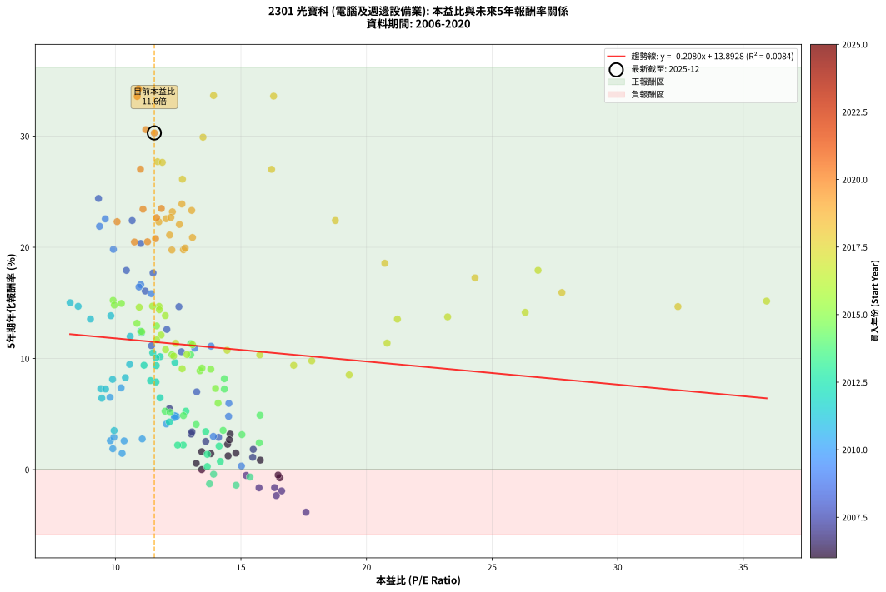
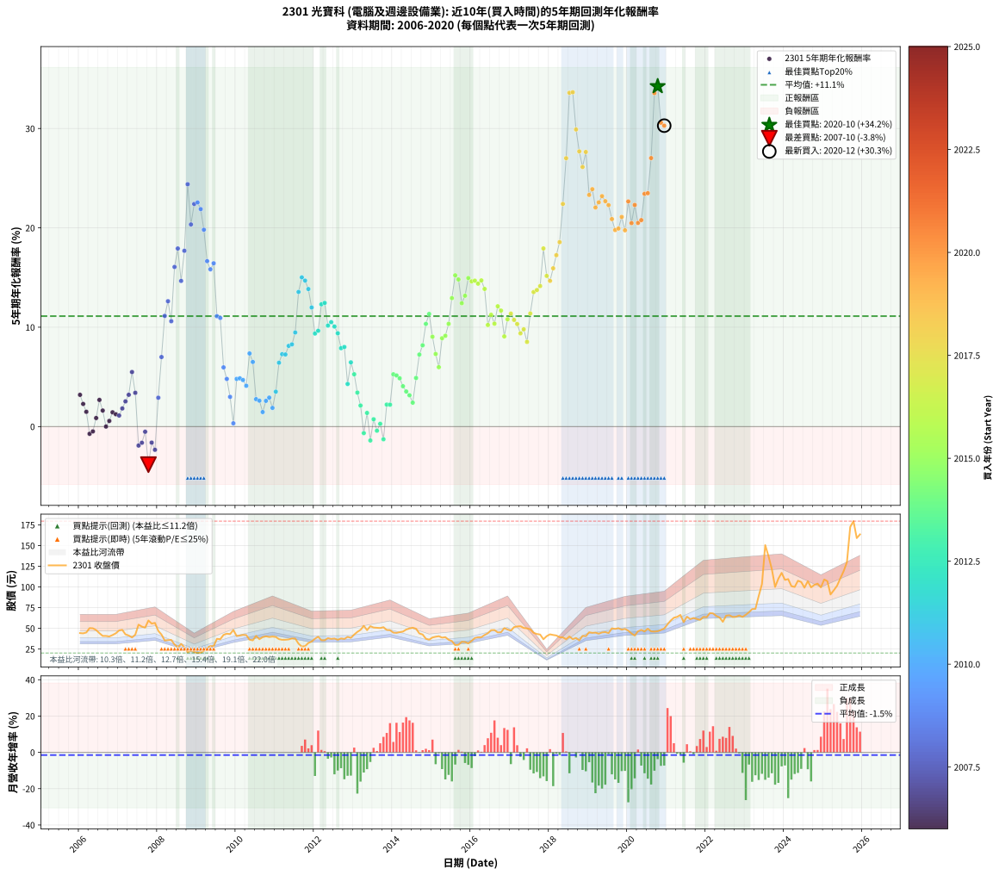

# 2301 光寶科 - 本益比與未來報酬率分析

!!! info "報告資訊"
    - **股票代號**: 2301
    - **公司名稱**: 光寶科
    - **產業別**: 電腦及週邊設備業
    - **分析期間**: 2006-2020 (180 個數據點)
    - **資料來源**: Type 12 (ShowMonthlyK_ChartFlow) 月收盤價與本益比
    - **報酬率口徑**: 含現金股利 (簡化: 年度合計，假設每年7/1入帳)
    - **報告生成時間**: 2026-01-11 20:31:10 CST

## 📈 視覺化圖表

### 圖表1: 本益比 vs 未來報酬率關係

*圖表1：2301 光寶科 本益比與5年期未來報酬率關係 (2006-2020)*

### 圖表2: 歷年買入時點的5年期實際報酬率

*圖表2：2301 光寶科 歷年買入時點的5年期實際報酬率 (2006-2020)*

## 📍 買點訊號說明

本報告提供兩種買點提示訊號（顯示於圖表2的股價子圖中）：

### ▲ 小綠色三角形（回測驗證）
- **計算方式**: 使用全部歷史資料計算本益比第25百分位數
- **用途**: 事後驗證，顯示歷史上哪些時點確實為低估區
- **限制**: 當下無法判斷，僅供回測參考
- **特性**: 後見之明（Look-Ahead Bias）

### ▲ 小橘色三角形（即時訊號）
- **計算方式**: 使用截至當月的過去5年資料計算本益比第25百分位數
- **用途**: 實際投資決策，當時即可判斷
- **優勢**: 可操作性強，符合實務需求
- **特性**: 無後見之明，滾動窗口計算

!!! tip "如何使用兩種訊號"
    - **綠色▲** 幫助理解歷史估值機會，驗證策略有效性
    - **橘色▲** 可作為實際買進參考，但仍需搭配基本面分析
    - 兩種訊號重疊時，表示即時判斷與事後驗證一致，信心度較高
    - 僅有綠色▲時，表示當時無法判斷（需要未來資料才能確認）
    - 僅有橘色▲時，表示即時判斷為買點，但事後可能不是最佳時機

## 📊 估值分析摘要

| 指標 | 數值 |
|:---:|:---:|
| **目前本益比** (2020-12) | **11.55 倍** |
| **歷史平均本益比** | 13.35 倍 |
| **估值水準** | 🟡 合理範圍 |
| **預期5年年化報酬率** | **+11.49%** |
| **歷史平均報酬率** | +11.12% |
| **相關係數 (R²)** | 0.0084 |
| **趨勢線斜率** | -0.2080 |

!!! abstract "核心洞察"
    目前本益比接近歷史平均，預期報酬率符合長期趨勢

    根據歷史數據回測，2301 光寶科 在目前本益比 **11.6倍** 的估值水準下，
    預期未來5年年化報酬率約為 **+11.5%**。

    **重要提醒**: 本分析基於歷史數據統計，實際報酬率會受到公司基本面變化、產業趨勢、
    總體經濟環境等多重因素影響。R² = 0.01 表示本益比可解釋約 0.8% 的報酬率變異。

## 📈 歷史估值統計

### 最佳買點 (最高報酬率)

| 項目 | 數值 |
|:---:|:---:|
| 起始時間 | 2020-10 |
| 當時本益比 | 10.92 倍 |
| 起始價格 | 46.5 元 |
| 5年後價格 | 179.5 元 |
| **5年年化報酬率** | **+34.24%** |

### 最差買點 (最低報酬率)

| 項目 | 數值 |
|:---:|:---:|
| 起始時間 | 2007-10 |
| 當時本益比 | 17.59 倍 |
| 起始價格 | 59.5 元 |
| 5年後價格 | 37.2 元 |
| **5年年化報酬率** | **-3.83%** |

## 🎯 投資啟示

### 本益比與報酬率關係

趨勢線方程式: **y = -0.2080x + 13.8928**

!!! note "負相關"
    本益比與未來報酬率呈現負相關。較低的本益比通常帶來較高的未來報酬率，
    但相關性不算非常強。**估值仍是重要參考指標之一**。

### 估值區間建議

基於歷史數據分析:

- **🟢 低估區** (P/E < 10.7): 預期報酬率較高，可考慮增加持股
- **🟡 合理區** (P/E 10.7-16.0): 預期報酬率符合長期趨勢，正常持有
- **🔴 高估區** (P/E > 16.0): 預期報酬率較低，可考慮減碼或觀望

!!! danger "風險提示"
    - 過去表現不代表未來結果
    - 本分析假設公司基本面無重大結構性變化
    - 產業環境劇變可能使歷史規律失效
    - 應結合公司財報、產業趨勢、總體經濟等多重因素綜合判斷

!!! success "長期投資觀點"
    歷史數據顯示，在合理或低估的估值水準買入並長期持有，
    往往能獲得較佳的投資報酬。**耐心等待好價格**是價值投資的核心原則。

## 📊 數據品質

- **資料來源**: GoodInfo.tw Type 12 (ShowMonthlyK_ChartFlow)
- **資料頻率**: 月度收盤價與本益比
- **回測期間**: 2006-2020
- **數據點數量**: 180 個 (每個點代表一次5年期回測)

### 計算方法說明

1. **5年期年化報酬率**:
   - 對每個歷史時點，計算其後5年的實際投資報酬率
   - 期末價值(不含股利): 期末價格
   - 期末價值(含現金股利): 期末價格 + 持有期間內的現金股利合計 (簡化: 年度合計，假設每年7/1入帳)
   - 公式: 年化報酬率 = [(期末價值/期初價格)^(1/年數) - 1] × 100%

2. **本益比 (P/E Ratio)**:
   - 使用當時的月收盤價與EPS計算
   - 資料來源: Type 12 月度河流圖本益比數據

3. **趨勢線 (Linear Regression)**:
   - 使用最小平方法擬合線性趨勢線
   - R²值衡量本益比對報酬率的解釋能力

---

*本報告由 Stock Analysis System v1.9.0 自動生成*
*數據更新時間: 2026-01-11 20:31:10 CST*

## 📋 月度回測明細表

（每一列對應時間線圖中的一個買入點；可用來對照 SVG 圖上的每個點。）

| 買入月份 | 賣出月份 | 回測期限_年 | 實際持有年數 | 買入本益比_倍 | 買入收盤價_元 | 賣出收盤價_元 | 現金股利合計_元 | 總報酬率_pct | 年化報酬率_pct |
| --- | --- | --- | --- | --- | --- | --- | --- | --- | --- |
| 2006-01 | 2011-01 | 5 | 4.999 | 14.57 | 44.30 | 39.60 | 12.25 | +17.03 | +3.20 |
| 2006-02 | 2011-02 | 5 | 4.999 | 14.47 | 44.00 | 37.00 | 12.25 | +11.92 | +2.28 |
| 2006-03 | 2011-03 | 5 | 4.999 | 14.80 | 45.00 | 36.20 | 12.25 | +7.66 | +1.49 |
| 2006-04 | 2011-04 | 5 | 4.999 | 16.55 | 50.30 | 36.25 | 12.25 | -3.59 | -0.73 |
| 2006-05 | 2011-05 | 5 | 4.999 | 16.48 | 50.10 | 36.65 | 12.25 | -2.40 | -0.49 |
| 2006-06 | 2011-06 | 5 | 4.999 | 15.77 | 47.95 | 37.80 | 12.25 | +4.37 | +0.86 |
| 2006-07 | 2011-07 | 5 | 4.999 | 14.54 | 44.20 | 37.70 | 12.76 | +14.15 | +2.68 |
| 2006-08 | 2011-08 | 5 | 4.999 | 13.44 | 40.85 | 31.50 | 12.76 | +8.34 | +1.61 |
| 2006-09 | 2011-09 | 5 | 4.999 | 13.44 | 40.85 | 28.10 | 12.76 | +0.01 | +0.00 |
| 2006-10 | 2011-10 | 5 | 4.999 | 13.22 | 40.20 | 28.60 | 12.76 | +2.88 | +0.57 |
| 2006-11 | 2011-11 | 5 | 4.999 | 13.80 | 41.95 | 32.30 | 12.76 | +7.40 | +1.44 |
| 2006-12 | 2011-12 | 5 | 4.999 | 14.49 | 44.05 | 34.10 | 12.76 | +6.37 | +1.24 |
| 2007-01 | 2012-01 | 5 | 4.999 | 15.47 | 47.55 | 37.50 | 12.76 | +5.69 | +1.11 |
| 2007-02 | 2012-02 | 5 | 4.999 | 15.49 | 48.15 | 39.95 | 12.76 | +9.46 | +1.82 |
| 2007-03 | 2012-03 | 5 | 5.002 | 13.60 | 42.75 | 35.70 | 12.76 | +13.35 | +2.54 |
| 2007-04 | 2012-04 | 5 | 5.002 | 13.02 | 41.35 | 35.65 | 12.76 | +17.06 | +3.20 |
| 2007-05 | 2012-05 | 5 | 5.002 | 12.15 | 39.00 | 38.20 | 12.76 | +30.66 | +5.49 |
| 2007-06 | 2012-06 | 5 | 5.002 | 13.05 | 42.35 | 37.30 | 12.76 | +18.20 | +3.40 |
| 2007-07 | 2012-07 | 5 | 5.002 | 16.62 | 54.50 | 37.75 | 11.74 | -9.19 | -1.91 |
| 2007-08 | 2012-08 | 5 | 5.002 | 15.72 | 52.10 | 36.25 | 11.74 | -7.89 | -1.63 |
| 2007-09 | 2012-09 | 5 | 5.002 | 15.21 | 50.90 | 37.85 | 11.74 | -2.57 | -0.52 |
| 2007-10 | 2012-10 | 5 | 5.002 | 17.59 | 59.50 | 37.20 | 11.74 | -17.75 | -3.83 |
| 2007-11 | 2012-11 | 5 | 5.002 | 16.34 | 55.80 | 39.70 | 11.74 | -7.81 | -1.61 |
| 2007-12 | 2012-12 | 5 | 5.002 | 16.41 | 56.60 | 38.55 | 11.74 | -11.15 | -2.34 |
| 2008-01 | 2013-01 | 5 | 5.002 | 14.11 | 47.00 | 42.50 | 11.74 | +15.40 | +2.91 |
| 2008-02 | 2013-03 | 5 | 5.081 | 13.24 | 42.50 | 48.20 | 11.74 | +41.04 | +7.00 |
| 2008-03 | 2013-03 | 5 | 4.999 | 11.44 | 35.35 | 48.20 | 11.74 | +69.56 | +11.14 |
| 2008-04 | 2013-04 | 5 | 4.999 | 12.05 | 35.80 | 53.10 | 11.74 | +81.12 | +12.62 |
| 2008-05 | 2013-05 | 5 | 4.999 | 12.63 | 36.00 | 47.85 | 11.74 | +65.53 | +10.61 |
| 2008-06 | 2013-06 | 5 | 4.999 | 11.19 | 30.55 | 52.60 | 11.74 | +110.61 | +16.07 |
| 2008-07 | 2013-07 | 5 | 4.999 | 10.44 | 27.25 | 51.00 | 11.13 | +128.00 | +17.92 |
| 2008-08 | 2013-08 | 5 | 4.999 | 12.53 | 31.20 | 50.70 | 11.13 | +98.18 | +14.66 |
| 2008-09 | 2013-09 | 5 | 4.999 | 11.50 | 27.25 | 50.40 | 11.13 | +125.80 | +17.69 |
| 2008-10 | 2013-10 | 5 | 4.999 | 9.33 | 21.00 | 51.40 | 11.13 | +197.77 | +24.39 |
| 2008-11 | 2013-11 | 5 | 4.999 | 11.01 | 23.45 | 48.05 | 11.13 | +152.37 | +20.34 |
| 2008-12 | 2013-12 | 5 | 4.999 | 10.67 | 21.45 | 47.80 | 11.13 | +174.74 | +22.40 |
| 2009-01 | 2014-01 | 5 | 4.999 | 9.60 | 20.25 | 44.85 | 11.13 | +176.45 | +22.56 |
| 2009-02 | 2014-02 | 5 | 4.999 | 9.37 | 20.70 | 44.55 | 11.13 | +168.99 | +21.89 |
| 2009-03 | 2014-03 | 5 | 4.999 | 9.92 | 22.90 | 45.40 | 11.13 | +146.86 | +19.81 |
| 2009-04 | 2014-04 | 5 | 4.999 | 11.01 | 26.50 | 46.10 | 11.13 | +115.97 | +16.65 |
| 2009-05 | 2014-05 | 5 | 4.999 | 11.43 | 28.65 | 48.60 | 11.13 | +108.49 | +15.83 |
| 2009-06 | 2014-06 | 5 | 4.999 | 10.94 | 28.50 | 49.85 | 11.13 | +113.97 | +16.43 |
| 2009-07 | 2014-07 | 5 | 4.999 | 13.81 | 37.35 | 50.80 | 12.44 | +69.33 | +11.11 |
| 2009-08 | 2014-08 | 5 | 4.999 | 13.16 | 36.90 | 49.55 | 12.44 | +68.00 | +10.94 |
| 2009-09 | 2014-09 | 5 | 4.999 | 14.52 | 42.15 | 43.85 | 12.44 | +33.55 | +5.96 |
| 2009-10 | 2014-10 | 5 | 4.999 | 14.51 | 43.55 | 42.60 | 12.44 | +26.39 | +4.80 |
| 2009-11 | 2014-11 | 5 | 4.999 | 13.90 | 43.10 | 37.50 | 12.44 | +15.88 | +2.99 |
| 2009-12 | 2014-12 | 5 | 4.999 | 15.02 | 48.05 | 36.40 | 12.44 | +1.65 | +0.33 |
| 2010-01 | 2015-01 | 5 | 4.999 | 12.44 | 40.70 | 39.00 | 12.44 | +26.40 | +4.80 |
| 2010-02 | 2015-02 | 5 | 4.999 | 12.36 | 41.30 | 39.90 | 12.44 | +26.74 | +4.85 |
| 2010-03 | 2015-03 | 5 | 4.999 | 12.35 | 42.15 | 40.55 | 12.44 | +25.72 | +4.69 |
| 2010-04 | 2015-04 | 5 | 4.999 | 12.03 | 41.90 | 38.80 | 12.44 | +22.30 | +4.11 |
| 2010-05 | 2015-05 | 5 | 4.999 | 10.23 | 36.35 | 39.40 | 12.44 | +42.62 | +7.36 |
| 2010-06 | 2015-06 | 5 | 4.999 | 9.79 | 35.50 | 36.20 | 12.44 | +37.02 | +6.50 |
| 2010-07 | 2015-07 | 5 | 4.999 | 11.07 | 40.90 | 34.70 | 12.16 | +14.58 | +2.76 |
| 2010-08 | 2015-08 | 5 | 4.999 | 9.80 | 36.90 | 29.80 | 12.16 | +13.72 | +2.61 |
| 2010-09 | 2015-09 | 5 | 4.999 | 10.27 | 39.40 | 30.20 | 12.16 | +7.52 | +1.46 |
| 2010-10 | 2015-10 | 5 | 4.999 | 10.35 | 40.45 | 33.80 | 12.16 | +13.63 | +2.59 |
| 2010-11 | 2015-11 | 5 | 4.999 | 9.94 | 39.55 | 33.50 | 12.16 | +15.46 | +2.92 |
| 2010-12 | 2015-12 | 5 | 4.999 | 9.90 | 40.10 | 31.85 | 12.16 | +9.76 | +1.88 |
| 2011-01 | 2016-01 | 5 | 4.999 | 9.95 | 39.60 | 34.90 | 12.16 | +18.85 | +3.51 |
| 2011-02 | 2016-02 | 5 | 4.999 | 9.46 | 37.00 | 38.35 | 12.16 | +36.52 | +6.43 |
| 2011-03 | 2016-03 | 5 | 5.002 | 9.42 | 36.20 | 39.30 | 12.16 | +42.16 | +7.29 |
| 2011-04 | 2016-04 | 5 | 5.002 | 9.61 | 36.25 | 39.30 | 12.16 | +41.97 | +7.26 |
| 2011-05 | 2016-05 | 5 | 5.002 | 9.89 | 36.65 | 42.00 | 12.16 | +47.78 | +8.12 |
| 2011-06 | 2016-06 | 5 | 5.002 | 10.40 | 37.80 | 44.10 | 12.16 | +48.84 | +8.28 |
| 2011-07 | 2016-07 | 5 | 5.002 | 10.57 | 37.70 | 47.80 | 11.48 | +57.24 | +9.47 |
| 2011-08 | 2016-08 | 5 | 5.002 | 9.01 | 31.50 | 48.00 | 11.48 | +88.82 | +13.55 |
| 2011-09 | 2016-09 | 5 | 5.002 | 8.20 | 28.10 | 45.10 | 11.48 | +101.35 | +15.02 |
| 2011-10 | 2016-10 | 5 | 5.002 | 8.52 | 28.60 | 45.30 | 11.48 | +98.53 | +14.69 |
| 2011-11 | 2016-11 | 5 | 5.002 | 9.82 | 32.30 | 50.30 | 11.48 | +91.27 | +13.84 |
| 2011-12 | 2016-12 | 5 | 5.002 | 10.59 | 34.10 | 48.60 | 11.48 | +76.18 | +11.99 |
| 2012-01 | 2017-01 | 5 | 5.002 | 11.63 | 37.50 | 47.20 | 11.48 | +56.48 | +9.36 |
| 2012-02 | 2017-03 | 5 | 5.081 | 12.37 | 39.95 | 52.30 | 11.48 | +59.65 | +9.64 |
| 2012-03 | 2017-03 | 5 | 4.999 | 11.04 | 35.70 | 52.30 | 11.48 | +78.65 | +12.31 |
| 2012-04 | 2017-04 | 5 | 4.999 | 11.01 | 35.65 | 52.60 | 11.48 | +79.74 | +12.44 |
| 2012-05 | 2017-05 | 5 | 4.999 | 11.78 | 38.20 | 50.50 | 11.48 | +62.25 | +10.16 |
| 2012-06 | 2017-06 | 5 | 4.999 | 11.49 | 37.30 | 50.00 | 11.48 | +64.82 | +10.51 |
| 2012-07 | 2017-07 | 5 | 4.999 | 11.62 | 37.75 | 48.85 | 12.13 | +61.53 | +10.07 |
| 2012-08 | 2017-08 | 5 | 4.999 | 11.14 | 36.25 | 44.65 | 12.13 | +56.63 | +9.39 |
| 2012-09 | 2017-09 | 5 | 4.999 | 11.62 | 37.85 | 43.20 | 12.13 | +46.18 | +7.89 |
| 2012-10 | 2017-10 | 5 | 4.999 | 11.40 | 37.20 | 42.55 | 12.13 | +46.99 | +8.01 |
| 2012-11 | 2017-11 | 5 | 4.999 | 12.15 | 39.70 | 36.85 | 12.13 | +23.37 | +4.29 |
| 2012-12 | 2017-12 | 5 | 4.999 | 11.78 | 38.55 | 40.60 | 12.13 | +36.78 | +6.47 |
| 2013-01 | 2018-01 | 5 | 4.999 | 12.81 | 42.50 | 42.80 | 12.13 | +29.24 | +5.27 |
| 2013-02 | 2018-02 | 5 | 4.999 | 13.60 | 45.75 | 42.00 | 12.13 | +18.31 | +3.42 |
| 2013-03 | 2018-03 | 5 | 4.999 | 14.13 | 48.20 | 41.40 | 12.13 | +11.06 | +2.12 |
| 2013-04 | 2018-04 | 5 | 4.999 | 15.36 | 53.10 | 39.25 | 12.13 | -3.24 | -0.66 |
| 2013-05 | 2018-05 | 5 | 4.999 | 13.66 | 47.85 | 39.10 | 12.13 | +7.06 | +1.37 |
| 2013-06 | 2018-06 | 5 | 4.999 | 14.81 | 52.60 | 36.90 | 12.13 | -6.79 | -1.40 |
| 2013-07 | 2018-07 | 5 | 4.999 | 14.18 | 51.00 | 40.20 | 12.71 | +3.74 | +0.74 |
| 2013-08 | 2018-08 | 5 | 4.999 | 13.91 | 50.70 | 36.95 | 12.71 | -2.06 | -0.41 |
| 2013-09 | 2018-09 | 5 | 4.999 | 13.66 | 50.40 | 38.40 | 12.71 | +1.40 | +0.28 |
| 2013-10 | 2018-10 | 5 | 4.999 | 13.75 | 51.40 | 35.50 | 12.71 | -6.21 | -1.27 |
| 2013-11 | 2018-11 | 5 | 4.999 | 12.70 | 48.05 | 40.90 | 12.71 | +11.57 | +2.21 |
| 2013-12 | 2018-12 | 5 | 4.999 | 12.48 | 47.80 | 40.60 | 12.71 | +11.52 | +2.21 |
| 2014-01 | 2019-01 | 5 | 4.999 | 11.98 | 44.85 | 45.25 | 12.71 | +29.23 | +5.26 |
| 2014-02 | 2019-02 | 5 | 4.999 | 12.18 | 44.55 | 44.55 | 12.71 | +28.53 | +5.15 |
| 2014-03 | 2019-03 | 5 | 4.999 | 12.71 | 45.40 | 44.85 | 12.71 | +26.78 | +4.86 |
| 2014-04 | 2019-04 | 5 | 4.999 | 13.22 | 46.10 | 43.55 | 12.71 | +22.03 | +4.06 |
| 2014-05 | 2019-05 | 5 | 4.999 | 14.29 | 48.60 | 45.10 | 12.71 | +18.95 | +3.53 |
| 2014-06 | 2019-06 | 5 | 4.999 | 15.04 | 49.85 | 45.50 | 12.71 | +16.77 | +3.15 |
| 2014-07 | 2019-07 | 5 | 4.999 | 15.73 | 50.80 | 44.30 | 12.92 | +12.63 | +2.41 |
| 2014-08 | 2019-08 | 5 | 4.999 | 15.76 | 49.55 | 50.00 | 12.92 | +26.97 | +4.89 |
| 2014-09 | 2019-09 | 5 | 4.999 | 14.34 | 43.85 | 49.30 | 12.92 | +41.88 | +7.25 |
| 2014-10 | 2019-10 | 5 | 4.999 | 14.34 | 42.60 | 50.20 | 12.92 | +48.16 | +8.18 |
| 2014-11 | 2019-11 | 5 | 4.999 | 13.00 | 37.50 | 48.40 | 12.92 | +63.51 | +10.34 |
| 2014-12 | 2019-12 | 5 | 4.999 | 13.00 | 36.40 | 49.35 | 12.92 | +71.06 | +11.34 |
| 2015-01 | 2020-01 | 5 | 4.999 | 13.80 | 39.00 | 47.20 | 12.92 | +54.14 | +9.04 |
| 2015-02 | 2020-02 | 5 | 4.999 | 13.99 | 39.90 | 43.85 | 12.92 | +42.27 | +7.31 |
| 2015-03 | 2020-03 | 5 | 5.002 | 14.09 | 40.55 | 41.30 | 12.92 | +33.70 | +5.98 |
| 2015-04 | 2020-04 | 5 | 5.002 | 13.37 | 38.80 | 46.50 | 12.92 | +53.13 | +8.89 |
| 2015-05 | 2020-05 | 5 | 5.002 | 13.45 | 39.40 | 48.10 | 12.92 | +54.86 | +9.14 |
| 2015-06 | 2020-06 | 5 | 5.002 | 12.25 | 36.20 | 46.30 | 12.92 | +63.58 | +10.34 |
| 2015-07 | 2020-07 | 5 | 5.002 | 11.64 | 34.70 | 49.60 | 14.15 | +83.71 | +12.93 |
| 2015-08 | 2020-08 | 5 | 5.002 | 9.91 | 29.80 | 46.40 | 14.15 | +103.17 | +15.23 |
| 2015-09 | 2020-09 | 5 | 5.002 | 9.96 | 30.20 | 46.10 | 14.15 | +99.49 | +14.80 |
| 2015-10 | 2020-10 | 5 | 5.002 | 11.05 | 33.80 | 46.55 | 14.15 | +79.57 | +12.42 |
| 2015-11 | 2020-11 | 5 | 5.002 | 10.86 | 33.50 | 48.05 | 14.15 | +85.66 | +13.17 |
| 2015-12 | 2020-12 | 5 | 5.002 | 10.24 | 31.85 | 49.80 | 14.15 | +100.77 | +14.95 |
| 2016-01 | 2021-01 | 5 | 5.002 | 10.95 | 34.90 | 54.90 | 14.15 | +97.84 | +14.61 |
| 2016-02 | 2021-03 | 5 | 5.081 | 11.74 | 38.35 | 62.80 | 14.15 | +100.64 | +14.69 |
| 2016-03 | 2021-03 | 5 | 4.999 | 11.75 | 39.30 | 62.80 | 14.15 | +95.79 | +14.38 |
| 2016-04 | 2021-04 | 5 | 4.999 | 11.48 | 39.30 | 63.90 | 14.15 | +98.59 | +14.71 |
| 2016-05 | 2021-05 | 5 | 4.999 | 11.99 | 42.00 | 66.20 | 14.15 | +91.30 | +13.85 |
| 2016-06 | 2021-06 | 5 | 4.999 | 12.32 | 44.10 | 57.60 | 14.15 | +62.69 | +10.22 |
| 2016-07 | 2021-07 | 5 | 4.999 | 13.07 | 47.80 | 64.10 | 17.36 | +70.42 | +11.25 |
| 2016-08 | 2021-08 | 5 | 4.999 | 12.85 | 48.00 | 61.20 | 17.36 | +63.67 | +10.36 |
| 2016-09 | 2021-09 | 5 | 4.999 | 11.82 | 45.10 | 62.50 | 17.36 | +77.07 | +12.11 |
| 2016-10 | 2021-10 | 5 | 4.999 | 11.64 | 45.30 | 61.30 | 17.36 | +73.64 | +11.67 |
| 2016-11 | 2021-11 | 5 | 4.999 | 12.66 | 50.30 | 60.30 | 17.36 | +54.39 | +9.08 |
| 2016-12 | 2021-12 | 5 | 4.999 | 12.00 | 48.60 | 63.80 | 17.36 | +67.00 | +10.80 |
| 2017-01 | 2022-01 | 5 | 4.999 | 12.40 | 47.20 | 63.50 | 17.36 | +71.31 | +11.37 |
| 2017-02 | 2022-02 | 5 | 4.999 | 14.45 | 51.50 | 68.40 | 17.36 | +66.52 | +10.74 |
| 2017-03 | 2022-03 | 5 | 4.999 | 15.75 | 52.30 | 68.10 | 17.36 | +63.40 | +10.32 |
| 2017-04 | 2022-04 | 5 | 4.999 | 17.10 | 52.60 | 65.00 | 17.36 | +56.58 | +9.38 |
| 2017-05 | 2022-05 | 5 | 4.999 | 17.82 | 50.50 | 63.20 | 17.36 | +59.52 | +9.79 |
| 2017-06 | 2022-06 | 5 | 4.999 | 19.31 | 50.00 | 57.90 | 17.36 | +50.52 | +8.52 |
| 2017-07 | 2022-07 | 5 | 4.999 | 20.82 | 48.85 | 65.30 | 18.44 | +71.42 | +11.38 |
| 2017-08 | 2022-08 | 5 | 4.999 | 21.23 | 44.65 | 65.80 | 18.44 | +88.67 | +13.54 |
| 2017-09 | 2022-09 | 5 | 4.999 | 23.23 | 43.20 | 63.80 | 18.44 | +90.37 | +13.74 |
| 2017-10 | 2022-10 | 5 | 4.999 | 26.32 | 42.55 | 64.00 | 18.44 | +93.75 | +14.14 |
| 2017-11 | 2022-11 | 5 | 4.999 | 26.83 | 36.85 | 65.60 | 18.44 | +128.06 | +17.93 |
| 2017-12 | 2022-12 | 5 | 4.999 | 35.93 | 40.60 | 63.80 | 18.44 | +102.56 | +15.16 |
| 2018-01 | 2023-01 | 5 | 4.999 | 32.40 | 42.80 | 66.40 | 18.44 | +98.22 | +14.67 |
| 2018-02 | 2023-02 | 5 | 4.999 | 27.78 | 42.00 | 69.50 | 18.44 | +109.38 | +15.93 |
| 2018-03 | 2023-03 | 5 | 4.999 | 24.32 | 41.40 | 73.30 | 18.44 | +121.59 | +17.25 |
| 2018-04 | 2023-04 | 5 | 4.999 | 20.73 | 39.25 | 73.50 | 18.44 | +134.24 | +18.56 |
| 2018-05 | 2023-05 | 5 | 4.999 | 18.76 | 39.10 | 89.00 | 18.44 | +174.78 | +22.41 |
| 2018-06 | 2023-06 | 5 | 4.999 | 16.22 | 36.90 | 103.50 | 18.44 | +230.46 | +27.01 |
| 2018-07 | 2023-07 | 5 | 4.999 | 16.30 | 40.20 | 150.50 | 20.52 | +325.42 | +33.59 |
| 2018-08 | 2023-08 | 5 | 4.999 | 13.91 | 36.95 | 137.00 | 20.52 | +326.31 | +33.65 |
| 2018-09 | 2023-09 | 5 | 4.999 | 13.49 | 38.40 | 121.50 | 20.52 | +269.84 | +29.90 |
| 2018-10 | 2023-10 | 5 | 4.999 | 11.68 | 35.50 | 100.00 | 20.52 | +239.49 | +27.70 |
| 2018-11 | 2023-11 | 5 | 4.999 | 12.67 | 40.90 | 110.00 | 20.52 | +219.12 | +26.13 |
| 2018-12 | 2023-12 | 5 | 4.999 | 11.87 | 40.60 | 117.00 | 20.52 | +238.72 | +27.64 |
| 2019-01 | 2024-01 | 5 | 4.999 | 13.04 | 45.25 | 108.50 | 20.52 | +185.13 | +23.32 |
| 2019-02 | 2024-02 | 5 | 4.999 | 12.65 | 44.55 | 109.50 | 20.52 | +191.85 | +23.89 |
| 2019-03 | 2024-03 | 5 | 5.002 | 12.55 | 44.85 | 101.00 | 20.52 | +170.95 | +22.05 |
| 2019-04 | 2024-04 | 5 | 5.002 | 12.02 | 43.55 | 100.00 | 20.52 | +176.74 | +22.57 |
| 2019-05 | 2024-05 | 5 | 5.002 | 12.27 | 45.10 | 107.50 | 20.52 | +183.86 | +23.19 |
| 2019-06 | 2024-06 | 5 | 5.002 | 12.21 | 45.50 | 106.00 | 20.52 | +178.07 | +22.69 |
| 2019-07 | 2024-07 | 5 | 5.002 | 11.73 | 44.30 | 99.10 | 22.11 | +173.60 | +22.29 |
| 2019-08 | 2024-08 | 5 | 5.002 | 13.07 | 50.00 | 107.00 | 22.11 | +158.21 | +20.88 |
| 2019-09 | 2024-09 | 5 | 5.002 | 12.71 | 49.30 | 99.50 | 22.11 | +146.67 | +19.78 |
| 2019-10 | 2024-10 | 5 | 5.002 | 12.78 | 50.20 | 102.50 | 22.11 | +148.22 | +19.93 |
| 2019-11 | 2024-11 | 5 | 5.002 | 12.16 | 48.40 | 104.00 | 22.11 | +160.55 | +21.10 |
| 2019-12 | 2024-12 | 5 | 5.002 | 12.25 | 49.35 | 99.50 | 22.11 | +146.42 | +19.76 |
| 2020-01 | 2025-01 | 5 | 5.002 | 11.64 | 47.20 | 109.00 | 22.11 | +177.77 | +22.66 |
| 2020-02 | 2025-03 | 5 | 5.081 | 10.76 | 43.85 | 90.90 | 22.11 | +157.71 | +20.48 |
| 2020-03 | 2025-03 | 5 | 4.999 | 10.07 | 41.30 | 90.90 | 22.11 | +173.62 | +22.30 |
| 2020-04 | 2025-04 | 5 | 4.999 | 11.28 | 46.50 | 96.00 | 22.11 | +153.99 | +20.50 |
| 2020-05 | 2025-05 | 5 | 4.999 | 11.60 | 48.10 | 101.50 | 22.11 | +156.98 | +20.78 |
| 2020-06 | 2025-06 | 5 | 4.999 | 11.10 | 46.30 | 110.50 | 22.11 | +186.41 | +23.43 |
| 2020-07 | 2025-07 | 5 | 4.999 | 11.83 | 49.60 | 119.00 | 23.41 | +187.12 | +23.49 |
| 2020-08 | 2025-08 | 5 | 4.999 | 11.00 | 46.40 | 130.00 | 23.41 | +230.63 | +27.02 |
| 2020-09 | 2025-09 | 5 | 4.999 | 10.87 | 46.10 | 172.50 | 23.41 | +324.97 | +33.56 |
| 2020-10 | 2025-10 | 5 | 4.999 | 10.92 | 46.55 | 179.50 | 23.41 | +335.90 | +34.24 |
| 2020-11 | 2025-11 | 5 | 4.999 | 11.21 | 48.05 | 159.00 | 23.41 | +279.63 | +30.58 |
| 2020-12 | 2025-12 | 5 | 4.999 | 11.55 | 49.80 | 163.50 | 23.41 | +275.33 | +30.29 |
