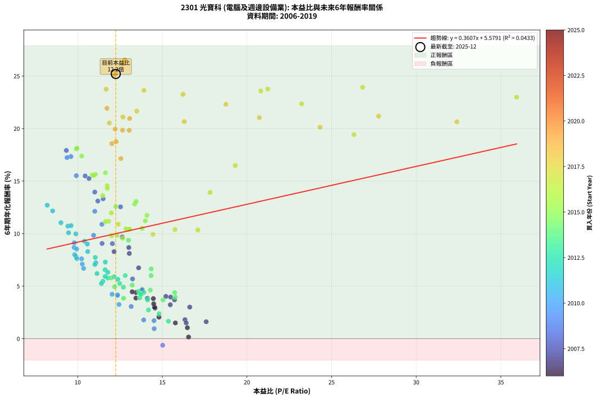
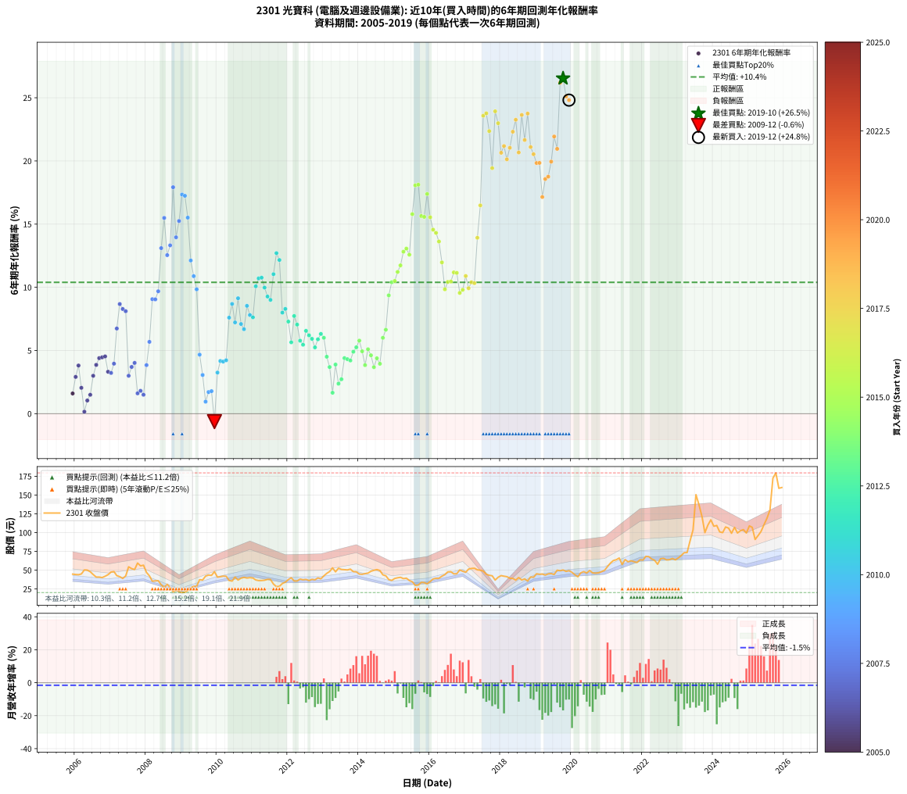

# 2301 光寶科 - 本益比與未來報酬率分析

!!! info "報告資訊"
    - **股票代號**: 2301
    - **公司名稱**: 光寶科
    - **產業別**: 電腦及週邊設備業
    - **分析期間**: 2006-2019 (168 個數據點)
    - **資料來源**: Type 12 (ShowMonthlyK_ChartFlow) 月收盤價與本益比
    - **報酬率口徑**: 含現金股利 (簡化: 年度合計，假設每年7/1入帳)
    - **報告生成時間**: 2026-01-06 22:22:40 CST

## 📈 視覺化圖表

### 圖表1: 本益比 vs 未來報酬率關係

*圖表1：2301 光寶科 本益比與6年期未來報酬率關係 (2006-2019)*

### 圖表2: 歷年買入時點的6年期實際報酬率

*圖表2：2301 光寶科 歷年買入時點的6年期實際報酬率 (2006-2019)*

## 📍 買點訊號說明

本報告提供兩種買點提示訊號（顯示於圖表2的股價子圖中）：

### ▲ 小綠色三角形（回測驗證）
- **計算方式**: 使用全部歷史資料計算本益比第25百分位數
- **用途**: 事後驗證，顯示歷史上哪些時點確實為低估區
- **限制**: 當下無法判斷，僅供回測參考
- **特性**: 後見之明（Look-Ahead Bias）

### ▲ 小橘色三角形（即時訊號）
- **計算方式**: 使用截至當月的過去5年資料計算本益比第25百分位數
- **用途**: 實際投資決策，當時即可判斷
- **優勢**: 可操作性強，符合實務需求
- **特性**: 無後見之明，滾動窗口計算

!!! tip "如何使用兩種訊號"
    - **綠色▲** 幫助理解歷史估值機會，驗證策略有效性
    - **橘色▲** 可作為實際買進參考，但仍需搭配基本面分析
    - 兩種訊號重疊時，表示即時判斷與事後驗證一致，信心度較高
    - 僅有綠色▲時，表示當時無法判斷（需要未來資料才能確認）
    - 僅有橘色▲時，表示即時判斷為買點，但事後可能不是最佳時機

## 📊 估值分析摘要

| 指標 | 數值 |
|:---:|:---:|
| **目前本益比** (2019-12) | **12.25 倍** |
| **歷史平均本益比** | 13.51 倍 |
| **估值水準** | 🟡 合理範圍 |
| **預期6年年化報酬率** | **+10.00%** |
| **歷史平均報酬率** | +10.45% |
| **相關係數 (R²)** | 0.0433 |
| **趨勢線斜率** | 0.3607 |

!!! abstract "核心洞察"
    目前本益比接近歷史平均，預期報酬率符合長期趨勢

    根據歷史數據回測，2301 光寶科 在目前本益比 **12.2倍** 的估值水準下，
    預期未來6年年化報酬率約為 **+10.0%**。

    **重要提醒**: 本分析基於歷史數據統計，實際報酬率會受到公司基本面變化、產業趨勢、
    總體經濟環境等多重因素影響。R² = 0.04 表示本益比可解釋約 4.3% 的報酬率變異。

## 📈 歷史估值統計

### 最佳買點 (最高報酬率)

| 項目 | 數值 |
|:---:|:---:|
| 起始時間 | 2019-10 |
| 當時本益比 | 12.78 倍 |
| 起始價格 | 50.2 元 |
| 6年後價格 | 179.5 元 |
| **6年年化報酬率** | **+26.53%** |

### 最差買點 (最低報酬率)

| 項目 | 數值 |
|:---:|:---:|
| 起始時間 | 2009-12 |
| 當時本益比 | 15.02 倍 |
| 起始價格 | 48.0 元 |
| 6年後價格 | 31.9 元 |
| **6年年化報酬率** | **-0.63%** |

## 🎯 投資啟示

### 本益比與報酬率關係

趨勢線方程式: **y = 0.3607x + 5.5791**

!!! info "弱相關或正相關"
    本益比與未來報酬率相關性較弱。這可能表示該股票的報酬率更多受到
    公司成長性、產業趨勢等因素影響，而非估值水準。**需綜合考量多項指標**。

### 估值區間建議

基於歷史數據分析:

- **🟢 低估區** (P/E < 10.8): 預期報酬率較高，可考慮增加持股
- **🟡 合理區** (P/E 10.8-16.2): 預期報酬率符合長期趨勢，正常持有
- **🔴 高估區** (P/E > 16.2): 預期報酬率較低，可考慮減碼或觀望

!!! danger "風險提示"
    - 過去表現不代表未來結果
    - 本分析假設公司基本面無重大結構性變化
    - 產業環境劇變可能使歷史規律失效
    - 應結合公司財報、產業趨勢、總體經濟等多重因素綜合判斷

!!! success "長期投資觀點"
    歷史數據顯示，在合理或低估的估值水準買入並長期持有，
    往往能獲得較佳的投資報酬。**耐心等待好價格**是價值投資的核心原則。

## 📊 數據品質

- **資料來源**: GoodInfo.tw Type 12 (ShowMonthlyK_ChartFlow)
- **資料頻率**: 月度收盤價與本益比
- **回測期間**: 2006-2019
- **數據點數量**: 168 個 (每個點代表一次6年期回測)

### 計算方法說明

1. **6年期年化報酬率**:
   - 對每個歷史時點，計算其後6年的實際投資報酬率
   - 期末價值(不含股利): 期末價格
   - 期末價值(含現金股利): 期末價格 + 持有期間內的現金股利合計 (簡化: 年度合計，假設每年7/1入帳)
   - 公式: 年化報酬率 = [(期末價值/期初價格)^(1/年數) - 1] × 100%

2. **本益比 (P/E Ratio)**:
   - 使用當時的月收盤價與EPS計算
   - 資料來源: Type 12 月度河流圖本益比數據

3. **趨勢線 (Linear Regression)**:
   - 使用最小平方法擬合線性趨勢線
   - R²值衡量本益比對報酬率的解釋能力

---

*本報告由 Stock Analysis System v1.9.0 自動生成*
*數據更新時間: 2026-01-06 22:22:40 CST*

## 📋 月度回測明細表

（每一列對應時間線圖中的一個買入點；可用來對照 SVG 圖上的每個點。）

| 買入月份 | 賣出月份 | 回測期限_年 | 實際持有年數 | 買入本益比_倍 | 買入收盤價_元 | 賣出收盤價_元 | 現金股利合計_元 | 總報酬率_pct | 年化報酬率_pct |
| --- | --- | --- | --- | --- | --- | --- | --- | --- | --- |
| 2006-01 | 2012-01 | 6 | 5.999 | 14.57 | 44.30 | 37.50 | 15.12 | +18.77 | +2.91 |
| 2006-02 | 2012-02 | 6 | 5.999 | 14.47 | 44.00 | 39.95 | 15.12 | +25.15 | +3.81 |
| 2006-03 | 2012-03 | 6 | 6.001 | 14.80 | 45.00 | 35.70 | 15.12 | +12.92 | +2.05 |
| 2006-04 | 2012-04 | 6 | 6.001 | 16.55 | 50.30 | 35.65 | 15.12 | +0.93 | +0.15 |
| 2006-05 | 2012-05 | 6 | 6.001 | 16.48 | 50.10 | 38.20 | 15.12 | +6.42 | +1.04 |
| 2006-06 | 2012-06 | 6 | 6.001 | 15.77 | 47.95 | 37.30 | 15.12 | +9.31 | +1.49 |
| 2006-07 | 2012-07 | 6 | 6.001 | 14.54 | 44.20 | 37.75 | 15.03 | +19.40 | +3.00 |
| 2006-08 | 2012-08 | 6 | 6.001 | 13.44 | 40.85 | 36.25 | 15.03 | +25.52 | +3.86 |
| 2006-09 | 2012-09 | 6 | 6.001 | 13.44 | 40.85 | 37.85 | 15.03 | +29.44 | +4.39 |
| 2006-10 | 2012-10 | 6 | 6.001 | 13.22 | 40.20 | 37.20 | 15.03 | +29.92 | +4.46 |
| 2006-11 | 2012-11 | 6 | 6.001 | 13.80 | 41.95 | 39.70 | 15.03 | +30.46 | +4.53 |
| 2006-12 | 2012-12 | 6 | 6.001 | 14.49 | 44.05 | 38.55 | 15.03 | +21.63 | +3.32 |
| 2007-01 | 2013-01 | 6 | 6.001 | 15.47 | 47.55 | 42.50 | 15.03 | +20.98 | +3.22 |
| 2007-02 | 2013-02 | 6 | 6.001 | 15.49 | 48.15 | 45.75 | 15.03 | +26.22 | +3.96 |
| 2007-03 | 2013-03 | 6 | 6.001 | 13.60 | 42.75 | 48.20 | 15.03 | +47.90 | +6.74 |
| 2007-04 | 2013-04 | 6 | 6.001 | 13.02 | 41.35 | 53.10 | 15.03 | +64.75 | +8.68 |
| 2007-05 | 2013-05 | 6 | 6.001 | 12.15 | 39.00 | 47.85 | 15.03 | +61.22 | +8.28 |
| 2007-06 | 2013-06 | 6 | 6.001 | 13.05 | 42.35 | 52.60 | 15.03 | +59.68 | +8.11 |
| 2007-07 | 2013-07 | 6 | 6.001 | 16.62 | 54.50 | 51.00 | 14.08 | +19.41 | +3.00 |
| 2007-08 | 2013-08 | 6 | 6.001 | 15.72 | 52.10 | 50.70 | 14.08 | +24.34 | +3.70 |
| 2007-09 | 2013-09 | 6 | 6.001 | 15.21 | 50.90 | 50.40 | 14.08 | +26.68 | +4.02 |
| 2007-10 | 2013-10 | 6 | 6.001 | 17.59 | 59.50 | 51.40 | 14.08 | +10.05 | +1.61 |
| 2007-11 | 2013-11 | 6 | 6.001 | 16.34 | 55.80 | 48.05 | 14.08 | +11.35 | +1.81 |
| 2007-12 | 2013-12 | 6 | 6.001 | 16.41 | 56.60 | 47.80 | 14.08 | +9.33 | +1.50 |
| 2008-01 | 2014-01 | 6 | 6.001 | 14.11 | 47.00 | 44.85 | 14.08 | +25.39 | +3.84 |
| 2008-02 | 2014-03 | 6 | 6.081 | 13.24 | 42.50 | 45.40 | 14.08 | +39.96 | +5.68 |
| 2008-03 | 2014-03 | 6 | 5.999 | 11.44 | 35.35 | 45.40 | 14.08 | +68.26 | +9.06 |
| 2008-04 | 2014-04 | 6 | 5.999 | 12.05 | 35.80 | 46.10 | 14.08 | +68.10 | +9.04 |
| 2008-05 | 2014-05 | 6 | 5.999 | 12.63 | 36.00 | 48.60 | 14.08 | +74.11 | +9.69 |
| 2008-06 | 2014-06 | 6 | 5.999 | 11.19 | 30.55 | 49.85 | 14.08 | +109.27 | +13.10 |
| 2008-07 | 2014-07 | 6 | 5.999 | 10.44 | 27.25 | 50.80 | 13.84 | +137.22 | +15.49 |
| 2008-08 | 2014-08 | 6 | 5.999 | 12.53 | 31.20 | 49.55 | 13.84 | +103.18 | +12.54 |
| 2008-09 | 2014-09 | 6 | 5.999 | 11.50 | 27.25 | 43.85 | 13.84 | +111.72 | +13.32 |
| 2008-10 | 2014-10 | 6 | 5.999 | 9.33 | 21.00 | 42.60 | 13.84 | +168.78 | +17.92 |
| 2008-11 | 2014-11 | 6 | 5.999 | 11.01 | 23.45 | 37.50 | 13.84 | +118.95 | +13.96 |
| 2008-12 | 2014-12 | 6 | 5.999 | 10.67 | 21.45 | 36.40 | 13.84 | +134.23 | +15.25 |
| 2009-01 | 2015-01 | 6 | 5.999 | 9.60 | 20.25 | 39.00 | 13.84 | +160.95 | +17.34 |
| 2009-02 | 2015-02 | 6 | 5.999 | 9.37 | 20.70 | 39.90 | 13.84 | +159.63 | +17.24 |
| 2009-03 | 2015-03 | 6 | 5.999 | 9.92 | 22.90 | 40.55 | 13.84 | +137.52 | +15.51 |
| 2009-04 | 2015-04 | 6 | 5.999 | 11.01 | 26.50 | 38.80 | 13.84 | +98.65 | +12.12 |
| 2009-05 | 2015-05 | 6 | 5.999 | 11.43 | 28.65 | 39.40 | 13.84 | +85.84 | +10.88 |
| 2009-06 | 2015-06 | 6 | 5.999 | 10.94 | 28.50 | 36.20 | 13.84 | +75.59 | +9.84 |
| 2009-07 | 2015-07 | 6 | 5.999 | 13.81 | 37.35 | 34.70 | 14.41 | +31.49 | +4.67 |
| 2009-08 | 2015-08 | 6 | 5.999 | 13.16 | 36.90 | 29.80 | 14.41 | +19.82 | +3.06 |
| 2009-09 | 2015-09 | 6 | 5.999 | 14.52 | 42.15 | 30.20 | 14.41 | +5.84 | +0.95 |
| 2009-10 | 2015-10 | 6 | 5.999 | 14.51 | 43.55 | 33.80 | 14.41 | +10.71 | +1.71 |
| 2009-11 | 2015-11 | 6 | 5.999 | 13.90 | 43.10 | 33.50 | 14.41 | +11.17 | +1.78 |
| 2009-12 | 2015-12 | 6 | 5.999 | 15.02 | 48.05 | 31.85 | 14.41 | -3.72 | -0.63 |
| 2010-01 | 2016-01 | 6 | 5.999 | 12.44 | 40.70 | 34.90 | 14.41 | +21.16 | +3.25 |
| 2010-02 | 2016-02 | 6 | 5.999 | 12.36 | 41.30 | 38.35 | 14.41 | +27.76 | +4.17 |
| 2010-03 | 2016-03 | 6 | 6.001 | 12.35 | 42.15 | 39.30 | 14.41 | +27.43 | +4.12 |
| 2010-04 | 2016-04 | 6 | 6.001 | 12.03 | 41.90 | 39.30 | 14.41 | +28.19 | +4.23 |
| 2010-05 | 2016-05 | 6 | 6.001 | 10.23 | 36.35 | 42.00 | 14.41 | +55.19 | +7.60 |
| 2010-06 | 2016-06 | 6 | 6.001 | 9.79 | 35.50 | 44.10 | 14.41 | +64.83 | +8.68 |
| 2010-07 | 2016-07 | 6 | 6.001 | 11.07 | 40.90 | 47.80 | 14.35 | +51.95 | +7.22 |
| 2010-08 | 2016-08 | 6 | 6.001 | 9.80 | 36.90 | 48.00 | 14.35 | +68.97 | +9.13 |
| 2010-09 | 2016-09 | 6 | 6.001 | 10.27 | 39.40 | 45.10 | 14.35 | +50.89 | +7.09 |
| 2010-10 | 2016-10 | 6 | 6.001 | 10.35 | 40.45 | 45.30 | 14.35 | +47.46 | +6.69 |
| 2010-11 | 2016-11 | 6 | 6.001 | 9.94 | 39.55 | 50.30 | 14.35 | +63.46 | +8.53 |
| 2010-12 | 2016-12 | 6 | 6.001 | 9.90 | 40.10 | 48.60 | 14.35 | +56.98 | +7.80 |
| 2011-01 | 2017-01 | 6 | 6.001 | 9.95 | 39.60 | 47.20 | 14.35 | +55.43 | +7.63 |
| 2011-02 | 2017-02 | 6 | 6.001 | 9.46 | 37.00 | 51.50 | 14.35 | +77.97 | +10.08 |
| 2011-03 | 2017-03 | 6 | 6.001 | 9.42 | 36.20 | 52.30 | 14.35 | +84.11 | +10.71 |
| 2011-04 | 2017-04 | 6 | 6.001 | 9.61 | 36.25 | 52.60 | 14.35 | +84.69 | +10.76 |
| 2011-05 | 2017-05 | 6 | 6.001 | 9.89 | 36.65 | 50.50 | 14.35 | +76.94 | +9.98 |
| 2011-06 | 2017-06 | 6 | 6.001 | 10.40 | 37.80 | 50.00 | 14.35 | +70.24 | +9.27 |
| 2011-07 | 2017-07 | 6 | 6.001 | 10.57 | 37.70 | 48.85 | 14.40 | +67.77 | +9.00 |
| 2011-08 | 2017-08 | 6 | 6.001 | 9.01 | 31.50 | 44.65 | 14.40 | +87.46 | +11.04 |
| 2011-09 | 2017-09 | 6 | 6.001 | 8.20 | 28.10 | 43.20 | 14.40 | +104.98 | +12.70 |
| 2011-10 | 2017-10 | 6 | 6.001 | 8.52 | 28.60 | 42.55 | 14.40 | +99.12 | +12.16 |
| 2011-11 | 2017-11 | 6 | 6.001 | 9.82 | 32.30 | 36.85 | 14.40 | +58.67 | +8.00 |
| 2011-12 | 2017-12 | 6 | 6.001 | 10.59 | 34.10 | 40.60 | 14.40 | +61.29 | +8.29 |
| 2012-01 | 2018-01 | 6 | 6.001 | 11.63 | 37.50 | 42.80 | 14.40 | +52.53 | +7.29 |
| 2012-02 | 2018-03 | 6 | 6.081 | 12.37 | 39.95 | 41.40 | 14.40 | +39.67 | +5.65 |
| 2012-03 | 2018-03 | 6 | 5.999 | 11.04 | 35.70 | 41.40 | 14.40 | +56.30 | +7.73 |
| 2012-04 | 2018-04 | 6 | 5.999 | 11.01 | 35.65 | 39.25 | 14.40 | +50.49 | +7.05 |
| 2012-05 | 2018-05 | 6 | 5.999 | 11.78 | 38.20 | 39.10 | 14.40 | +40.05 | +5.78 |
| 2012-06 | 2018-06 | 6 | 5.999 | 11.49 | 37.30 | 36.90 | 14.40 | +37.53 | +5.46 |
| 2012-07 | 2018-07 | 6 | 5.999 | 11.62 | 37.75 | 40.20 | 15.05 | +46.35 | +6.56 |
| 2012-08 | 2018-08 | 6 | 5.999 | 11.14 | 36.25 | 36.95 | 15.05 | +43.45 | +6.20 |
| 2012-09 | 2018-09 | 6 | 5.999 | 11.62 | 37.85 | 38.40 | 15.05 | +41.21 | +5.92 |
| 2012-10 | 2018-10 | 6 | 5.999 | 11.40 | 37.20 | 35.50 | 15.05 | +35.88 | +5.24 |
| 2012-11 | 2018-11 | 6 | 5.999 | 12.15 | 39.70 | 40.90 | 15.05 | +40.93 | +5.89 |
| 2012-12 | 2018-12 | 6 | 5.999 | 11.78 | 38.55 | 40.60 | 15.05 | +44.36 | +6.31 |
| 2013-01 | 2019-01 | 6 | 5.999 | 12.81 | 42.50 | 45.25 | 15.05 | +41.88 | +6.00 |
| 2013-02 | 2019-02 | 6 | 5.999 | 13.60 | 45.75 | 44.55 | 15.05 | +30.27 | +4.51 |
| 2013-03 | 2019-03 | 6 | 5.999 | 14.13 | 48.20 | 44.85 | 15.05 | +24.27 | +3.69 |
| 2013-04 | 2019-04 | 6 | 5.999 | 15.36 | 53.10 | 43.55 | 15.05 | +10.36 | +1.66 |
| 2013-05 | 2019-05 | 6 | 5.999 | 13.66 | 47.85 | 45.10 | 15.05 | +25.70 | +3.89 |
| 2013-06 | 2019-06 | 6 | 5.999 | 14.81 | 52.60 | 45.50 | 15.05 | +15.11 | +2.37 |
| 2013-07 | 2019-07 | 6 | 5.999 | 14.18 | 51.00 | 44.30 | 15.63 | +17.51 | +2.73 |
| 2013-08 | 2019-08 | 6 | 5.999 | 13.91 | 50.70 | 50.00 | 15.63 | +29.44 | +4.40 |
| 2013-09 | 2019-09 | 6 | 5.999 | 13.66 | 50.40 | 49.30 | 15.63 | +28.83 | +4.31 |
| 2013-10 | 2019-10 | 6 | 5.999 | 13.75 | 51.40 | 50.20 | 15.63 | +28.07 | +4.21 |
| 2013-11 | 2019-11 | 6 | 5.999 | 12.70 | 48.05 | 48.40 | 15.63 | +33.25 | +4.90 |
| 2013-12 | 2019-12 | 6 | 5.999 | 12.48 | 47.80 | 49.35 | 15.63 | +35.94 | +5.25 |
| 2014-01 | 2020-01 | 6 | 5.999 | 11.98 | 44.85 | 47.20 | 15.63 | +40.08 | +5.78 |
| 2014-02 | 2020-02 | 6 | 5.999 | 12.18 | 44.55 | 43.85 | 15.63 | +33.51 | +4.94 |
| 2014-03 | 2020-03 | 6 | 6.001 | 12.71 | 45.40 | 41.30 | 15.63 | +25.39 | +3.84 |
| 2014-04 | 2020-04 | 6 | 6.001 | 13.22 | 46.10 | 46.50 | 15.63 | +34.77 | +5.10 |
| 2014-05 | 2020-05 | 6 | 6.001 | 14.29 | 48.60 | 48.10 | 15.63 | +31.13 | +4.62 |
| 2014-06 | 2020-06 | 6 | 6.001 | 15.04 | 49.85 | 46.30 | 15.63 | +24.23 | +3.68 |
| 2014-07 | 2020-07 | 6 | 6.001 | 15.73 | 50.80 | 49.60 | 16.12 | +29.36 | +4.38 |
| 2014-08 | 2020-08 | 6 | 6.001 | 15.76 | 49.55 | 46.40 | 16.12 | +26.17 | +3.95 |
| 2014-09 | 2020-09 | 6 | 6.001 | 14.34 | 43.85 | 46.10 | 16.12 | +41.88 | +6.00 |
| 2014-10 | 2020-10 | 6 | 6.001 | 14.34 | 42.60 | 46.55 | 16.12 | +47.10 | +6.64 |
| 2014-11 | 2020-11 | 6 | 6.001 | 13.00 | 37.50 | 48.05 | 16.12 | +71.11 | +9.36 |
| 2014-12 | 2020-12 | 6 | 6.001 | 13.00 | 36.40 | 49.80 | 16.12 | +81.09 | +10.40 |
| 2015-01 | 2021-01 | 6 | 6.001 | 13.80 | 39.00 | 54.90 | 16.12 | +82.09 | +10.50 |
| 2015-02 | 2021-02 | 6 | 6.001 | 13.99 | 39.90 | 59.40 | 16.12 | +89.26 | +11.22 |
| 2015-03 | 2021-03 | 6 | 6.001 | 14.09 | 40.55 | 62.80 | 16.12 | +94.61 | +11.73 |
| 2015-04 | 2021-04 | 6 | 6.001 | 13.37 | 38.80 | 63.90 | 16.12 | +106.23 | +12.82 |
| 2015-05 | 2021-05 | 6 | 6.001 | 13.45 | 39.40 | 66.20 | 16.12 | +108.92 | +13.06 |
| 2015-06 | 2021-06 | 6 | 6.001 | 12.25 | 36.20 | 57.60 | 16.12 | +103.64 | +12.58 |
| 2015-07 | 2021-07 | 6 | 6.001 | 11.64 | 34.70 | 64.10 | 19.55 | +141.05 | +15.79 |
| 2015-08 | 2021-08 | 6 | 6.001 | 9.91 | 29.80 | 61.20 | 19.55 | +170.96 | +18.07 |
| 2015-09 | 2021-09 | 6 | 6.001 | 9.96 | 30.20 | 62.50 | 19.55 | +171.68 | +18.12 |
| 2015-10 | 2021-10 | 6 | 6.001 | 11.05 | 33.80 | 61.30 | 19.55 | +139.19 | +15.64 |
| 2015-11 | 2021-11 | 6 | 6.001 | 10.86 | 33.50 | 60.30 | 19.55 | +138.35 | +15.57 |
| 2015-12 | 2021-12 | 6 | 6.001 | 10.24 | 31.85 | 63.80 | 19.55 | +161.68 | +17.39 |
| 2016-01 | 2022-01 | 6 | 6.001 | 10.95 | 34.90 | 63.50 | 19.55 | +137.95 | +15.54 |
| 2016-02 | 2022-03 | 6 | 6.081 | 11.74 | 38.35 | 68.10 | 19.55 | +128.54 | +14.56 |
| 2016-03 | 2022-03 | 6 | 5.999 | 11.75 | 39.30 | 68.10 | 19.55 | +123.02 | +14.31 |
| 2016-04 | 2022-04 | 6 | 5.999 | 11.48 | 39.30 | 65.00 | 19.55 | +115.13 | +13.62 |
| 2016-05 | 2022-05 | 6 | 5.999 | 11.99 | 42.00 | 63.20 | 19.55 | +97.01 | +11.97 |
| 2016-06 | 2022-06 | 6 | 5.999 | 12.32 | 44.10 | 57.90 | 19.55 | +75.61 | +9.84 |
| 2016-07 | 2022-07 | 6 | 5.999 | 13.07 | 47.80 | 65.30 | 21.36 | +81.30 | +10.43 |
| 2016-08 | 2022-08 | 6 | 5.999 | 12.85 | 48.00 | 65.80 | 21.36 | +81.58 | +10.46 |
| 2016-09 | 2022-09 | 6 | 5.999 | 11.82 | 45.10 | 63.80 | 21.36 | +88.82 | +11.18 |
| 2016-10 | 2022-10 | 6 | 5.999 | 11.64 | 45.30 | 64.00 | 21.36 | +88.43 | +11.14 |
| 2016-11 | 2022-11 | 6 | 5.999 | 12.66 | 50.30 | 65.60 | 21.36 | +72.88 | +9.56 |
| 2016-12 | 2022-12 | 6 | 5.999 | 12.00 | 48.60 | 63.80 | 21.36 | +75.23 | +9.80 |
| 2017-01 | 2023-01 | 6 | 5.999 | 12.40 | 47.20 | 66.40 | 21.36 | +85.93 | +10.89 |
| 2017-02 | 2023-02 | 6 | 5.999 | 14.45 | 51.50 | 69.50 | 21.36 | +76.43 | +9.93 |
| 2017-03 | 2023-03 | 6 | 5.999 | 15.75 | 52.30 | 73.30 | 21.36 | +80.99 | +10.40 |
| 2017-04 | 2023-04 | 6 | 5.999 | 17.10 | 52.60 | 73.50 | 21.36 | +80.34 | +10.33 |
| 2017-05 | 2023-05 | 6 | 5.999 | 17.82 | 50.50 | 89.00 | 21.36 | +118.53 | +13.92 |
| 2017-06 | 2023-06 | 6 | 5.999 | 19.31 | 50.00 | 103.50 | 21.36 | +149.72 | +16.48 |
| 2017-07 | 2023-07 | 6 | 5.999 | 20.82 | 48.85 | 150.50 | 23.44 | +256.07 | +23.58 |
| 2017-08 | 2023-08 | 6 | 5.999 | 21.23 | 44.65 | 137.00 | 23.44 | +259.33 | +23.77 |
| 2017-09 | 2023-09 | 6 | 5.999 | 23.23 | 43.20 | 121.50 | 23.44 | +235.51 | +22.36 |
| 2017-10 | 2023-10 | 6 | 5.999 | 26.32 | 42.55 | 100.00 | 23.44 | +190.11 | +19.43 |
| 2017-11 | 2023-11 | 6 | 5.999 | 26.83 | 36.85 | 110.00 | 23.44 | +262.12 | +23.93 |
| 2017-12 | 2023-12 | 6 | 5.999 | 35.93 | 40.60 | 117.00 | 23.44 | +245.91 | +22.98 |
| 2018-01 | 2024-01 | 6 | 5.999 | 32.40 | 42.80 | 108.50 | 23.44 | +208.27 | +20.64 |
| 2018-02 | 2024-02 | 6 | 5.999 | 27.78 | 42.00 | 109.50 | 23.44 | +216.52 | +21.18 |
| 2018-03 | 2024-03 | 6 | 6.001 | 24.32 | 41.40 | 101.00 | 23.44 | +200.58 | +20.13 |
| 2018-04 | 2024-04 | 6 | 6.001 | 20.73 | 39.25 | 100.00 | 23.44 | +214.50 | +21.04 |
| 2018-05 | 2024-05 | 6 | 6.001 | 18.76 | 39.10 | 107.50 | 23.44 | +234.88 | +22.31 |
| 2018-06 | 2024-06 | 6 | 6.001 | 16.22 | 36.90 | 106.00 | 23.44 | +250.79 | +23.26 |
| 2018-07 | 2024-07 | 6 | 6.001 | 16.30 | 40.20 | 99.10 | 25.03 | +208.77 | +20.67 |
| 2018-08 | 2024-08 | 6 | 6.001 | 13.91 | 36.95 | 107.00 | 25.03 | +257.31 | +23.64 |
| 2018-09 | 2024-09 | 6 | 6.001 | 13.49 | 38.40 | 99.50 | 25.03 | +224.29 | +21.66 |
| 2018-10 | 2024-10 | 6 | 6.001 | 11.68 | 35.50 | 102.50 | 25.03 | +259.23 | +23.75 |
| 2018-11 | 2024-11 | 6 | 6.001 | 12.67 | 40.90 | 104.00 | 25.03 | +215.47 | +21.10 |
| 2018-12 | 2024-12 | 6 | 6.001 | 11.87 | 40.60 | 99.50 | 25.03 | +206.71 | +20.53 |
| 2019-01 | 2025-01 | 6 | 6.001 | 13.04 | 45.25 | 109.00 | 25.03 | +196.19 | +19.83 |
| 2019-02 | 2025-02 | 6 | 6.001 | 12.65 | 44.55 | 107.00 | 25.03 | +196.35 | +19.84 |
| 2019-03 | 2025-03 | 6 | 6.001 | 12.55 | 44.85 | 90.90 | 25.03 | +158.47 | +17.14 |
| 2019-04 | 2025-04 | 6 | 6.001 | 12.02 | 43.55 | 96.00 | 25.03 | +177.90 | +18.57 |
| 2019-05 | 2025-05 | 6 | 6.001 | 12.27 | 45.10 | 101.50 | 25.03 | +180.55 | +18.75 |
| 2019-06 | 2025-06 | 6 | 6.001 | 12.21 | 45.50 | 110.50 | 25.03 | +197.86 | +19.95 |
| 2019-07 | 2025-07 | 6 | 6.001 | 11.73 | 44.30 | 119.00 | 26.61 | +228.70 | +21.93 |
| 2019-08 | 2025-08 | 6 | 6.001 | 13.07 | 50.00 | 130.00 | 26.61 | +213.23 | +20.96 |
| 2019-09 | 2025-09 | 6 | 6.001 | 12.71 | 49.30 | 172.50 | 26.61 | +303.88 | +26.19 |
| 2019-10 | 2025-10 | 6 | 6.001 | 12.78 | 50.20 | 179.50 | 26.61 | +310.58 | +26.53 |
| 2019-11 | 2025-11 | 6 | 6.001 | 12.16 | 48.40 | 159.00 | 26.61 | +283.50 | +25.10 |
| 2019-12 | 2025-12 | 6 | 6.001 | 12.25 | 49.35 | 163.50 | 26.61 | +285.23 | +25.20 |
