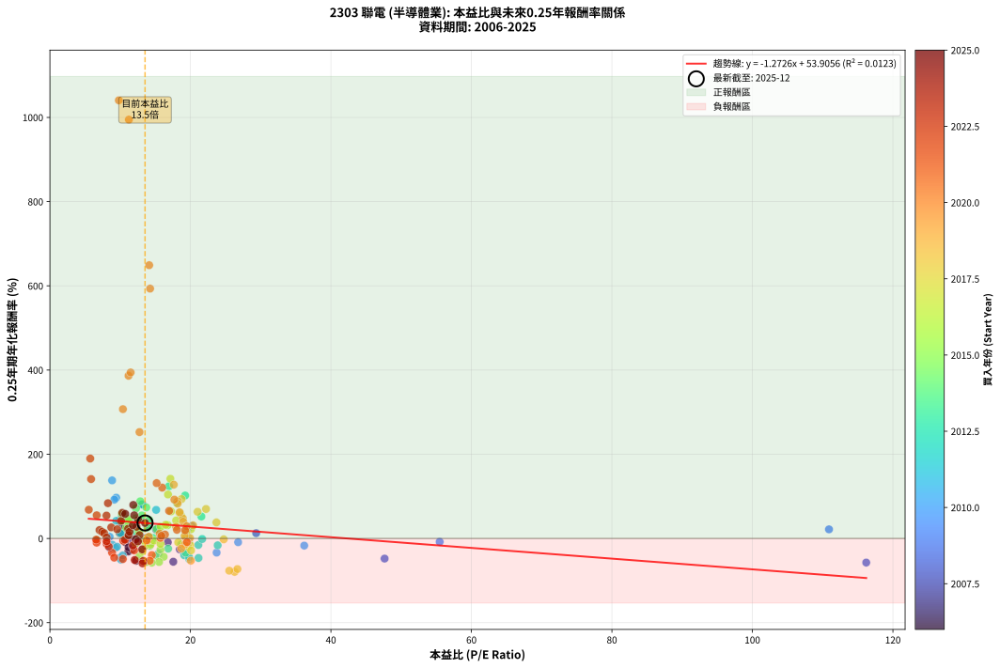
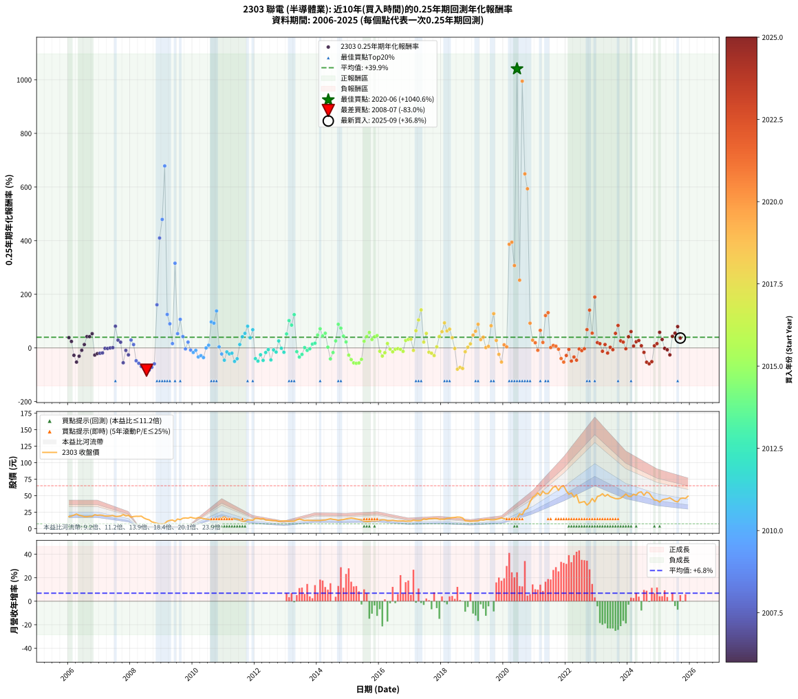

# 2303 聯電 - 本益比與未來報酬率分析

!!! info "報告資訊"
    - **股票代號**: 2303
    - **公司名稱**: 聯電
    - **產業別**: 半導體業
    - **分析期間**: 2006-2025 (237 個數據點)
    - **資料來源**: Type 12 (ShowMonthlyK_ChartFlow) 月收盤價與本益比
    - **報酬率口徑**: 含現金股利 (簡化: 年度合計，假設每年7/1入帳)
    - **報告生成時間**: 2026-01-13 13:10:28 CST

## 📈 視覺化圖表

### 圖表1: 本益比 vs 未來報酬率關係

*圖表1：2303 聯電 本益比與0.25年期未來報酬率關係 (2006-2025)*

### 圖表2: 歷年買入時點的0.25年期實際報酬率

*圖表2：2303 聯電 歷年買入時點的0.25年期實際報酬率 (2006-2025)*

## 📍 買點訊號說明

本報告提供兩種買點提示訊號（顯示於圖表2的股價子圖中）：

### ▲ 小綠色三角形（回測驗證）
- **計算方式**: 使用全部歷史資料計算本益比第25百分位數
- **用途**: 事後驗證，顯示歷史上哪些時點確實為低估區
- **限制**: 當下無法判斷，僅供回測參考
- **特性**: 後見之明（Look-Ahead Bias）

### ▲ 小橘色三角形（即時訊號）
- **計算方式**: 使用截至當月的過去5年資料計算本益比第25百分位數
- **用途**: 實際投資決策，當時即可判斷
- **優勢**: 可操作性強，符合實務需求
- **特性**: 無後見之明，滾動窗口計算

!!! tip "如何使用兩種訊號"
    - **綠色▲** 幫助理解歷史估值機會，驗證策略有效性
    - **橘色▲** 可作為實際買進參考，但仍需搭配基本面分析
    - 兩種訊號重疊時，表示即時判斷與事後驗證一致，信心度較高
    - 僅有綠色▲時，表示當時無法判斷（需要未來資料才能確認）
    - 僅有橘色▲時，表示即時判斷為買點，但事後可能不是最佳時機

## 📊 估值分析摘要

| 指標 | 數值 |
|:---:|:---:|
| **目前本益比** (2025-09) | **13.54 倍** |
| **歷史平均本益比** | 15.73 倍 |
| **估值水準** | 🟡 合理範圍 |
| **預期0.25年年化報酬率** | **+36.68%** |
| **歷史平均報酬率** | +39.88% |
| **相關係數 (R²)** | 0.0123 |
| **趨勢線斜率** | -1.2726 |

!!! abstract "核心洞察"
    目前本益比接近歷史平均，預期報酬率符合長期趨勢

    根據歷史數據回測，2303 聯電 在目前本益比 **13.5倍** 的估值水準下，
    預期未來0.25年年化報酬率約為 **+36.7%**。

    **重要提醒**: 本分析基於歷史數據統計，實際報酬率會受到公司基本面變化、產業趨勢、
    總體經濟環境等多重因素影響。R² = 0.01 表示本益比可解釋約 1.2% 的報酬率變異。

## 📈 歷史估值統計

### 最佳買點 (最高報酬率)

| 項目 | 數值 |
|:---:|:---:|
| 起始時間 | 2020-06 |
| 當時本益比 | 9.81 倍 |
| 起始價格 | 15.9 元 |
| 0.25年後價格 | 28.6 元 |
| **0.25年年化報酬率** | **+1040.57%** |

### 最差買點 (最低報酬率)

| 項目 | 數值 |
|:---:|:---:|
| 起始時間 | 2008-07 |
| 當時本益比 | nan 倍 |
| 起始價格 | 14.3 元 |
| 0.25年後價格 | 9.2 元 |
| **0.25年年化報酬率** | **-83.01%** |

## 🎯 投資啟示

### 本益比與報酬率關係

趨勢線方程式: **y = -1.2726x + 53.9056**

!!! warning "強負相關"
    本益比與未來報酬率呈現強負相關。在高本益比時期買入，未來報酬率顯著較低；
    在低本益比時期買入，未來報酬率顯著較高。**估值紀律至關重要**。

### 估值區間建議

基於歷史數據分析:

- **🟢 低估區** (P/E < 12.6): 預期報酬率較高，可考慮增加持股
- **🟡 合理區** (P/E 12.6-18.9): 預期報酬率符合長期趨勢，正常持有
- **🔴 高估區** (P/E > 18.9): 預期報酬率較低，可考慮減碼或觀望

!!! danger "風險提示"
    - 過去表現不代表未來結果
    - 本分析假設公司基本面無重大結構性變化
    - 產業環境劇變可能使歷史規律失效
    - 應結合公司財報、產業趨勢、總體經濟等多重因素綜合判斷

!!! success "長期投資觀點"
    歷史數據顯示，在合理或低估的估值水準買入並長期持有，
    往往能獲得較佳的投資報酬。**耐心等待好價格**是價值投資的核心原則。

## 📊 數據品質

- **資料來源**: GoodInfo.tw Type 12 (ShowMonthlyK_ChartFlow)
- **資料頻率**: 月度收盤價與本益比
- **回測期間**: 2006-2025
- **數據點數量**: 237 個 (每個點代表一次0.25年期回測)

### 計算方法說明

1. **0.25年期年化報酬率**:
   - 對每個歷史時點，計算其後0.25年的實際投資報酬率
   - 期末價值(不含股利): 期末價格
   - 期末價值(含現金股利): 期末價格 + 持有期間內的現金股利合計 (簡化: 年度合計，假設每年7/1入帳)
   - 公式: 年化報酬率 = [(期末價值/期初價格)^(1/年數) - 1] × 100%

2. **本益比 (P/E Ratio)**:
   - 使用當時的月收盤價與EPS計算
   - 資料來源: Type 12 月度河流圖本益比數據

3. **趨勢線 (Linear Regression)**:
   - 使用最小平方法擬合線性趨勢線
   - R²值衡量本益比對報酬率的解釋能力

---

*本報告由 Stock Analysis System v1.9.0 自動生成*
*數據更新時間: 2026-01-13 13:10:28 CST*

## 📋 月度回測明細表

（每一列對應時間線圖中的一個買入點；可用來對照 SVG 圖上的每個點。）

| 買入月份 | 賣出月份 | 回測期限_年 | 實際持有年數 | 買入本益比_倍 | 買入收盤價_元 | 賣出收盤價_元 | 現金股利合計_元 | 總報酬率_pct | 年化報酬率_pct |
| --- | --- | --- | --- | --- | --- | --- | --- | --- | --- |
| 2006-01 | 2006-05 | 0.25 | 0.329 | 10.03 | 18.15 | 20.20 | 0.00 | +11.29 | +38.50 |
| 2006-02 | 2006-05 | 0.25 | 0.246 | 10.58 | 19.15 | 20.20 | 0.00 | +5.48 | +24.19 |
| 2006-03 | 2006-07 | 0.25 | 0.334 | 11.33 | 20.50 | 18.00 | 0.41 | -10.20 | -27.54 |
| 2006-04 | 2006-07 | 0.25 | 0.249 | 12.27 | 22.20 | 18.00 | 0.41 | -17.08 | -52.84 |
| 2006-05 | 2006-08 | 0.25 | 0.252 | 11.16 | 20.20 | 18.00 | 0.41 | -8.87 | -30.83 |
| 2006-06 | 2006-09 | 0.25 | 0.252 | 10.72 | 19.40 | 18.55 | 0.41 | -2.27 | -8.72 |
| 2006-07 | 2006-10 | 0.25 | 0.252 | 9.94 | 18.00 | 18.55 | 0.00 | +3.06 | +12.69 |
| 2006-08 | 2006-12 | 0.25 | 0.334 | 9.94 | 18.00 | 20.25 | 0.00 | +12.50 | +42.28 |
| 2006-09 | 2006-12 | 0.25 | 0.249 | 10.25 | 18.55 | 20.25 | 0.00 | +9.16 | +42.18 |
| 2006-10 | 2007-01 | 0.25 | 0.252 | 10.25 | 18.55 | 20.65 | 0.00 | +11.32 | +53.08 |
| 2006-11 | 2007-03 | 0.25 | 0.329 | 11.69 | 21.15 | 19.10 | 0.00 | -9.69 | -26.68 |
| 2006-12 | 2007-03 | 0.25 | 0.246 | 11.19 | 20.25 | 19.10 | 0.00 | -5.68 | -21.12 |
| 2007-01 | 2007-05 | 0.25 | 0.329 | 11.80 | 20.65 | 19.20 | 0.00 | -7.02 | -19.88 |
| 2007-02 | 2007-05 | 0.25 | 0.246 | 11.95 | 20.20 | 19.20 | 0.00 | -4.95 | -18.62 |
| 2007-03 | 2007-07 | 0.25 | 0.334 | 11.72 | 19.10 | 18.30 | 0.70 | -0.52 | -1.56 |
| 2007-04 | 2007-07 | 0.25 | 0.249 | 12.17 | 19.10 | 18.30 | 0.70 | -0.52 | -2.08 |
| 2007-05 | 2007-08 | 0.25 | 0.252 | 12.72 | 19.20 | 18.50 | 0.70 | +0.00 | +0.00 |
| 2007-06 | 2007-09 | 0.25 | 0.252 | 13.69 | 19.85 | 19.20 | 0.70 | +0.25 | +1.00 |
| 2007-07 | 2007-10 | 0.25 | 0.252 | 13.17 | 18.30 | 21.25 | 0.00 | +16.12 | +81.01 |
| 2007-08 | 2007-12 | 0.25 | 0.334 | 13.91 | 18.50 | 20.15 | 0.00 | +8.92 | +29.15 |
| 2007-09 | 2007-12 | 0.25 | 0.249 | 15.12 | 19.20 | 20.15 | 0.00 | +4.95 | +21.39 |
| 2007-10 | 2008-01 | 0.25 | 0.252 | 17.56 | 21.25 | 17.35 | 0.00 | -18.35 | -55.29 |
| 2007-11 | 2008-03 | 0.25 | 0.331 | 16.78 | 19.30 | 18.70 | 0.00 | -3.11 | -9.09 |
| 2007-12 | 2008-03 | 0.25 | 0.249 | 18.49 | 20.15 | 18.70 | 0.00 | -7.20 | -25.90 |
| 2008-01 | 2008-05 | 0.25 | 0.331 | 20.23 | 17.35 | 18.90 | 0.00 | +8.93 | +29.47 |
| 2008-02 | 2008-05 | 0.25 | 0.249 | 29.36 | 18.35 | 18.90 | 0.00 | +3.00 | +12.58 |
| 2008-03 | 2008-07 | 0.25 | 0.334 | 47.64 | 18.70 | 14.30 | 0.75 | -19.52 | -47.80 |
| 2008-04 | 2008-07 | 0.25 | 0.249 | 116.20 | 18.60 | 14.30 | 0.75 | -19.09 | -57.26 |
| 2008-05 | 2008-08 | 0.25 | 0.252 |  | 18.90 | 13.30 | 0.75 | -25.66 | -69.19 |
| 2008-06 | 2008-09 | 0.25 | 0.252 |  | 16.10 | 10.25 | 0.75 | -31.68 | -77.96 |
| 2008-07 | 2008-10 | 0.25 | 0.252 |  | 14.30 | 9.15 | 0.00 | -36.01 | -83.01 |
| 2008-08 | 2008-12 | 0.25 | 0.334 |  | 13.30 | 7.43 | 0.00 | -44.14 | -82.50 |
| 2008-09 | 2008-12 | 0.25 | 0.249 |  | 10.25 | 7.43 | 0.00 | -27.51 | -72.51 |
| 2008-10 | 2009-01 | 0.25 | 0.252 |  | 9.15 | 7.30 | 0.00 | -20.22 | -59.21 |
| 2008-11 | 2009-03 | 0.25 | 0.329 |  | 8.10 | 11.10 | 0.00 | +37.04 | +160.92 |
| 2008-12 | 2009-03 | 0.25 | 0.246 |  | 7.43 | 11.10 | 0.00 | +49.39 | +409.92 |
| 2009-01 | 2009-05 | 0.25 | 0.329 |  | 7.30 | 13.00 | 0.00 | +78.08 | +479.20 |
| 2009-02 | 2009-05 | 0.25 | 0.246 |  | 7.84 | 13.00 | 0.00 | +65.82 | +678.61 |
| 2009-03 | 2009-07 | 0.25 | 0.334 |  | 11.10 | 14.55 | 0.00 | +31.08 | +124.85 |
| 2009-04 | 2009-07 | 0.25 | 0.249 |  | 12.40 | 14.55 | 0.00 | +17.34 | +89.98 |
| 2009-05 | 2009-08 | 0.25 | 0.252 |  | 13.00 | 13.50 | 0.00 | +3.85 | +16.16 |
| 2009-06 | 2009-09 | 0.25 | 0.252 |  | 11.00 | 15.75 | 0.00 | +43.18 | +315.81 |
| 2009-07 | 2009-10 | 0.25 | 0.252 |  | 14.55 | 16.20 | 0.00 | +11.34 | +53.18 |
| 2009-08 | 2009-12 | 0.25 | 0.334 |  | 13.50 | 17.20 | 0.00 | +27.41 | +106.51 |
| 2009-09 | 2009-12 | 0.25 | 0.249 |  | 15.75 | 17.20 | 0.00 | +9.21 | +42.40 |
| 2009-10 | 2010-01 | 0.25 | 0.252 |  | 16.20 | 16.05 | 0.00 | -0.93 | -3.63 |
| 2009-11 | 2010-03 | 0.25 | 0.329 | 110.90 | 15.80 | 16.85 | 0.00 | +6.65 | +21.63 |
| 2009-12 | 2010-03 | 0.25 | 0.246 | 55.48 | 17.20 | 16.85 | 0.00 | -2.03 | -8.00 |
| 2010-01 | 2010-05 | 0.25 | 0.329 | 36.20 | 16.05 | 15.10 | 0.00 | -5.92 | -16.95 |
| 2010-02 | 2010-05 | 0.25 | 0.246 | 26.79 | 15.45 | 15.10 | 0.00 | -2.27 | -8.88 |
| 2010-03 | 2010-07 | 0.25 | 0.334 | 23.73 | 16.85 | 14.20 | 0.50 | -12.76 | -33.55 |
| 2010-04 | 2010-07 | 0.25 | 0.249 | 18.97 | 16.00 | 14.20 | 0.50 | -8.13 | -28.83 |
| 2010-05 | 2010-08 | 0.25 | 0.252 | 15.46 | 15.10 | 13.00 | 0.50 | -10.60 | -35.90 |
| 2010-06 | 2010-09 | 0.25 | 0.252 | 12.93 | 14.35 | 13.85 | 0.50 | +0.00 | +0.00 |
| 2010-07 | 2010-10 | 0.25 | 0.252 | 11.42 | 14.20 | 14.55 | 0.00 | +2.46 | +10.15 |
| 2010-08 | 2010-12 | 0.25 | 0.334 | 9.44 | 13.00 | 16.30 | 0.00 | +25.38 | +96.85 |
| 2010-09 | 2010-12 | 0.25 | 0.249 | 9.17 | 13.85 | 16.30 | 0.00 | +17.69 | +92.28 |
| 2010-10 | 2011-01 | 0.25 | 0.252 | 8.85 | 14.55 | 18.10 | 0.00 | +24.40 | +137.92 |
| 2010-11 | 2011-03 | 0.25 | 0.329 | 8.50 | 15.10 | 15.30 | 0.00 | +1.32 | +4.09 |
| 2010-12 | 2011-03 | 0.25 | 0.246 | 8.53 | 16.30 | 15.30 | 0.00 | -6.13 | -22.66 |
| 2011-01 | 2011-05 | 0.25 | 0.329 | 9.94 | 18.10 | 14.80 | 0.00 | -18.23 | -45.81 |
| 2011-02 | 2011-05 | 0.25 | 0.246 | 8.89 | 15.40 | 14.80 | 0.00 | -3.90 | -14.89 |
| 2011-03 | 2011-07 | 0.25 | 0.334 | 9.32 | 15.30 | 12.95 | 1.11 | -8.09 | -22.32 |
| 2011-04 | 2011-07 | 0.25 | 0.249 | 9.56 | 14.85 | 12.95 | 1.11 | -5.31 | -19.66 |
| 2011-05 | 2011-08 | 0.25 | 0.252 | 10.11 | 14.80 | 11.30 | 1.11 | -16.14 | -50.27 |
| 2011-06 | 2011-09 | 0.25 | 0.252 | 10.36 | 14.25 | 11.40 | 1.11 | -12.20 | -40.33 |
| 2011-07 | 2011-10 | 0.25 | 0.252 | 10.07 | 12.95 | 13.35 | 0.00 | +3.09 | +12.84 |
| 2011-08 | 2011-12 | 0.25 | 0.334 | 9.44 | 11.30 | 12.70 | 0.00 | +12.39 | +41.86 |
| 2011-09 | 2011-12 | 0.25 | 0.249 | 10.29 | 11.40 | 12.70 | 0.00 | +11.40 | +54.26 |
| 2011-10 | 2012-01 | 0.25 | 0.252 | 13.11 | 13.35 | 15.50 | 0.00 | +16.10 | +80.91 |
| 2011-11 | 2012-03 | 0.25 | 0.331 | 13.99 | 13.00 | 14.45 | 0.00 | +11.15 | +37.60 |
| 2011-12 | 2012-03 | 0.25 | 0.249 | 15.12 | 12.70 | 14.45 | 0.00 | +13.78 | +67.89 |
| 2012-01 | 2012-05 | 0.25 | 0.331 | 19.12 | 15.50 | 13.10 | 0.00 | -15.48 | -39.82 |
| 2012-02 | 2012-05 | 0.25 | 0.249 | 19.83 | 15.50 | 13.10 | 0.00 | -15.48 | -49.10 |
| 2012-03 | 2012-07 | 0.25 | 0.334 | 19.20 | 14.45 | 12.60 | 0.50 | -9.34 | -25.45 |
| 2012-04 | 2012-07 | 0.25 | 0.249 | 21.15 | 15.30 | 12.60 | 0.50 | -14.38 | -46.37 |
| 2012-05 | 2012-08 | 0.25 | 0.252 | 18.87 | 13.10 | 12.00 | 0.50 | -4.58 | -16.98 |
| 2012-06 | 2012-09 | 0.25 | 0.252 | 19.40 | 12.90 | 12.20 | 0.50 | -1.55 | -6.01 |
| 2012-07 | 2012-10 | 0.25 | 0.252 | 19.82 | 12.60 | 10.85 | 0.00 | -13.89 | -44.77 |
| 2012-08 | 2012-12 | 0.25 | 0.334 | 19.78 | 12.00 | 11.70 | 0.00 | -2.50 | -7.30 |
| 2012-09 | 2012-12 | 0.25 | 0.249 | 21.13 | 12.20 | 11.70 | 0.00 | -4.10 | -15.46 |
| 2012-10 | 2013-01 | 0.25 | 0.252 | 19.79 | 10.85 | 11.50 | 0.00 | +5.99 | +25.98 |
| 2012-11 | 2013-03 | 0.25 | 0.329 | 21.67 | 11.25 | 11.20 | 0.00 | -0.44 | -1.35 |
| 2012-12 | 2013-03 | 0.25 | 0.246 | 23.88 | 11.70 | 11.20 | 0.00 | -4.27 | -16.24 |
| 2013-01 | 2013-05 | 0.25 | 0.329 | 21.56 | 11.50 | 13.20 | 0.00 | +14.78 | +52.14 |
| 2013-02 | 2013-05 | 0.25 | 0.246 | 19.25 | 11.10 | 13.20 | 0.00 | +18.92 | +102.02 |
| 2013-03 | 2013-07 | 0.25 | 0.334 | 18.06 | 11.20 | 13.35 | 0.41 | +22.82 | +85.04 |
| 2013-04 | 2013-07 | 0.25 | 0.249 | 16.96 | 11.25 | 13.35 | 0.41 | +22.28 | +124.16 |
| 2013-05 | 2013-08 | 0.25 | 0.252 | 18.68 | 13.20 | 12.30 | 0.41 | -3.74 | -14.05 |
| 2013-06 | 2013-09 | 0.25 | 0.252 | 19.33 | 14.50 | 12.65 | 0.41 | -9.96 | -34.06 |
| 2013-07 | 2013-10 | 0.25 | 0.252 | 16.83 | 13.35 | 12.45 | 0.00 | -6.74 | -24.20 |
| 2013-08 | 2013-12 | 0.25 | 0.334 | 14.70 | 12.30 | 12.35 | 0.00 | +0.41 | +1.22 |
| 2013-09 | 2013-12 | 0.25 | 0.249 | 14.38 | 12.65 | 12.35 | 0.00 | -2.37 | -9.18 |
| 2013-10 | 2014-01 | 0.25 | 0.252 | 13.48 | 12.45 | 12.35 | 0.00 | -0.80 | -3.15 |
| 2013-11 | 2014-03 | 0.25 | 0.329 | 12.72 | 12.30 | 12.85 | 0.00 | +4.47 | +14.24 |
| 2013-12 | 2014-03 | 0.25 | 0.246 | 12.23 | 12.35 | 12.85 | 0.00 | +4.05 | +17.48 |
| 2014-01 | 2014-05 | 0.25 | 0.329 | 12.27 | 12.35 | 14.05 | 0.00 | +13.77 | +48.07 |
| 2014-02 | 2014-05 | 0.25 | 0.246 | 12.26 | 12.30 | 14.05 | 0.00 | +14.23 | +71.58 |
| 2014-03 | 2014-07 | 0.25 | 0.334 | 12.85 | 12.85 | 14.05 | 0.50 | +13.23 | +45.06 |
| 2014-04 | 2014-07 | 0.25 | 0.249 | 13.09 | 13.05 | 14.05 | 0.50 | +11.49 | +54.76 |
| 2014-05 | 2014-08 | 0.25 | 0.252 | 14.14 | 14.05 | 13.65 | 0.50 | +0.71 | +2.86 |
| 2014-06 | 2014-09 | 0.25 | 0.252 | 15.10 | 14.95 | 12.60 | 0.50 | -12.37 | -40.81 |
| 2014-07 | 2014-10 | 0.25 | 0.252 | 14.24 | 14.05 | 13.40 | 0.00 | -4.63 | -17.14 |
| 2014-08 | 2014-12 | 0.25 | 0.334 | 13.88 | 13.65 | 14.75 | 0.00 | +8.06 | +26.12 |
| 2014-09 | 2014-12 | 0.25 | 0.249 | 12.86 | 12.60 | 14.75 | 0.00 | +17.06 | +88.20 |
| 2014-10 | 2015-01 | 0.25 | 0.252 | 13.72 | 13.40 | 15.40 | 0.00 | +14.93 | +73.72 |
| 2014-11 | 2015-03 | 0.25 | 0.329 | 14.13 | 13.75 | 15.50 | 0.00 | +12.73 | +44.00 |
| 2014-12 | 2015-03 | 0.25 | 0.246 | 15.21 | 14.75 | 15.50 | 0.00 | +5.08 | +22.30 |
| 2015-01 | 2015-05 | 0.25 | 0.329 | 15.73 | 15.40 | 13.90 | 0.00 | -9.74 | -26.80 |
| 2015-02 | 2015-05 | 0.25 | 0.246 | 16.19 | 16.00 | 13.90 | 0.00 | -13.12 | -43.50 |
| 2015-03 | 2015-07 | 0.25 | 0.334 | 15.54 | 15.50 | 11.25 | 0.55 | -23.87 | -55.80 |
| 2015-04 | 2015-07 | 0.25 | 0.249 | 14.50 | 14.60 | 11.25 | 0.55 | -19.18 | -57.46 |
| 2015-05 | 2015-08 | 0.25 | 0.252 | 13.68 | 13.90 | 10.75 | 0.55 | -18.71 | -56.05 |
| 2015-06 | 2015-09 | 0.25 | 0.252 | 12.73 | 13.05 | 10.80 | 0.55 | -13.03 | -42.54 |
| 2015-07 | 2015-10 | 0.25 | 0.252 | 10.88 | 11.25 | 11.90 | 0.00 | +5.78 | +24.98 |
| 2015-08 | 2015-12 | 0.25 | 0.334 | 10.30 | 10.75 | 12.10 | 0.00 | +12.56 | +42.50 |
| 2015-09 | 2015-12 | 0.25 | 0.249 | 10.26 | 10.80 | 12.10 | 0.00 | +12.04 | +57.81 |
| 2015-10 | 2016-01 | 0.25 | 0.252 | 11.21 | 11.90 | 12.75 | 0.00 | +7.14 | +31.51 |
| 2015-11 | 2016-03 | 0.25 | 0.331 | 11.07 | 11.85 | 13.30 | 0.00 | +12.24 | +41.69 |
| 2015-12 | 2016-03 | 0.25 | 0.249 | 11.20 | 12.10 | 13.30 | 0.00 | +9.92 | +46.16 |
| 2016-01 | 2016-05 | 0.25 | 0.331 | 12.18 | 12.75 | 12.20 | 0.00 | -4.31 | -12.46 |
| 2016-02 | 2016-05 | 0.25 | 0.249 | 13.17 | 13.35 | 12.20 | 0.00 | -8.61 | -30.34 |
| 2016-03 | 2016-07 | 0.25 | 0.334 | 13.57 | 13.30 | 11.90 | 0.56 | -6.28 | -17.64 |
| 2016-04 | 2016-07 | 0.25 | 0.249 | 12.68 | 12.00 | 11.90 | 0.56 | +3.87 | +16.49 |
| 2016-05 | 2016-08 | 0.25 | 0.252 | 13.36 | 12.20 | 11.50 | 0.56 | -1.11 | -4.32 |
| 2016-06 | 2016-09 | 0.25 | 0.252 | 14.32 | 12.60 | 11.55 | 0.56 | -3.85 | -14.43 |
| 2016-07 | 2016-10 | 0.25 | 0.252 | 14.06 | 11.90 | 11.75 | 0.00 | -1.26 | -4.91 |
| 2016-08 | 2016-12 | 0.25 | 0.334 | 14.14 | 11.50 | 11.40 | 0.00 | -0.87 | -2.58 |
| 2016-09 | 2016-12 | 0.25 | 0.249 | 14.81 | 11.55 | 11.40 | 0.00 | -1.30 | -5.11 |
| 2016-10 | 2017-01 | 0.25 | 0.252 | 15.74 | 11.75 | 11.35 | 0.00 | -3.40 | -12.85 |
| 2016-11 | 2017-03 | 0.25 | 0.329 | 15.77 | 11.25 | 12.20 | 0.00 | +8.44 | +27.99 |
| 2016-12 | 2017-03 | 0.25 | 0.246 | 16.76 | 11.40 | 12.20 | 0.00 | +7.02 | +31.69 |
| 2017-01 | 2017-05 | 0.25 | 0.329 | 16.47 | 11.35 | 12.45 | 0.00 | +9.69 | +32.52 |
| 2017-02 | 2017-05 | 0.25 | 0.246 | 18.26 | 12.75 | 12.45 | 0.00 | -2.35 | -9.21 |
| 2017-03 | 2017-07 | 0.25 | 0.334 | 17.24 | 12.20 | 13.90 | 0.50 | +18.03 | +64.27 |
| 2017-04 | 2017-07 | 0.25 | 0.249 | 16.81 | 12.05 | 13.90 | 0.50 | +19.50 | +104.44 |
| 2017-05 | 2017-08 | 0.25 | 0.252 | 17.15 | 12.45 | 15.05 | 0.50 | +24.90 | +141.75 |
| 2017-06 | 2017-09 | 0.25 | 0.252 | 20.07 | 14.75 | 15.00 | 0.50 | +5.08 | +21.76 |
| 2017-07 | 2017-10 | 0.25 | 0.252 | 18.68 | 13.90 | 15.50 | 0.00 | +11.51 | +54.12 |
| 2017-08 | 2017-12 | 0.25 | 0.334 | 19.98 | 15.05 | 14.20 | 0.00 | -5.65 | -15.97 |
| 2017-09 | 2017-12 | 0.25 | 0.249 | 19.67 | 15.00 | 14.20 | 0.00 | -5.33 | -19.75 |
| 2017-10 | 2018-01 | 0.25 | 0.252 | 20.09 | 15.50 | 14.25 | 0.00 | -8.06 | -28.38 |
| 2017-11 | 2018-03 | 0.25 | 0.329 | 19.59 | 15.30 | 15.50 | 0.00 | +1.31 | +4.03 |
| 2017-12 | 2018-03 | 0.25 | 0.246 | 17.97 | 14.20 | 15.50 | 0.00 | +9.15 | +42.69 |
| 2018-01 | 2018-05 | 0.25 | 0.329 | 18.45 | 14.25 | 16.65 | 0.00 | +16.84 | +60.60 |
| 2018-02 | 2018-05 | 0.25 | 0.246 | 18.74 | 14.15 | 16.65 | 0.00 | +17.67 | +93.53 |
| 2018-03 | 2018-07 | 0.25 | 0.334 | 21.02 | 15.50 | 17.55 | 0.71 | +17.82 | +63.38 |
| 2018-04 | 2018-07 | 0.25 | 0.249 | 22.22 | 16.00 | 17.55 | 0.71 | +14.14 | +70.02 |
| 2018-05 | 2018-08 | 0.25 | 0.252 | 23.70 | 16.65 | 17.35 | 0.71 | +8.48 | +38.15 |
| 2018-06 | 2018-09 | 0.25 | 0.252 | 24.74 | 16.95 | 16.15 | 0.71 | -0.52 | -2.05 |
| 2018-07 | 2018-10 | 0.25 | 0.252 | 26.29 | 17.55 | 11.80 | 0.00 | -32.76 | -79.32 |
| 2018-08 | 2018-12 | 0.25 | 0.334 | 26.69 | 17.35 | 11.25 | 0.00 | -35.16 | -72.67 |
| 2018-09 | 2018-12 | 0.25 | 0.249 | 25.53 | 16.15 | 11.25 | 0.00 | -30.34 | -76.57 |
| 2018-10 | 2019-01 | 0.25 | 0.252 | 19.19 | 11.80 | 11.35 | 0.00 | -3.81 | -14.30 |
| 2018-11 | 2019-03 | 0.25 | 0.329 | 19.33 | 11.55 | 11.65 | 0.00 | +0.87 | +2.66 |
| 2018-12 | 2019-03 | 0.25 | 0.246 | 19.40 | 11.25 | 11.65 | 0.00 | +3.56 | +15.23 |
| 2019-01 | 2019-05 | 0.25 | 0.329 | 18.92 | 11.35 | 12.90 | 0.00 | +13.66 | +47.64 |
| 2019-02 | 2019-05 | 0.25 | 0.246 | 18.47 | 11.45 | 12.90 | 0.00 | +12.66 | +62.24 |
| 2019-03 | 2019-07 | 0.25 | 0.334 | 18.20 | 11.65 | 13.80 | 0.59 | +23.52 | +88.21 |
| 2019-04 | 2019-07 | 0.25 | 0.249 | 20.38 | 13.45 | 13.80 | 0.59 | +6.99 | +31.15 |
| 2019-05 | 2019-08 | 0.25 | 0.252 | 18.97 | 12.90 | 13.45 | 0.59 | +8.84 | +39.96 |
| 2019-06 | 2019-09 | 0.25 | 0.252 | 19.93 | 13.95 | 13.40 | 0.59 | +0.29 | +1.14 |
| 2019-07 | 2019-10 | 0.25 | 0.252 | 19.17 | 13.80 | 14.00 | 0.00 | +1.45 | +5.88 |
| 2019-08 | 2019-12 | 0.25 | 0.334 | 18.18 | 13.45 | 16.45 | 0.00 | +22.30 | +82.72 |
| 2019-09 | 2019-12 | 0.25 | 0.249 | 17.63 | 13.40 | 16.45 | 0.00 | +22.76 | +127.75 |
| 2019-10 | 2020-01 | 0.25 | 0.252 | 17.95 | 14.00 | 14.90 | 0.00 | +6.43 | +28.06 |
| 2019-11 | 2020-03 | 0.25 | 0.331 | 18.69 | 14.95 | 13.65 | 0.00 | -8.70 | -24.01 |
| 2019-12 | 2020-03 | 0.25 | 0.249 | 20.06 | 16.45 | 13.65 | 0.00 | -17.02 | -52.71 |
| 2020-01 | 2020-05 | 0.25 | 0.331 | 15.63 | 14.90 | 15.45 | 0.00 | +3.69 | +11.56 |
| 2020-02 | 2020-05 | 0.25 | 0.249 | 14.08 | 15.30 | 15.45 | 0.00 | +0.98 | +3.99 |
| 2020-03 | 2020-07 | 0.25 | 0.334 | 11.19 | 13.65 | 22.35 | 0.80 | +69.63 | +386.48 |
| 2020-04 | 2020-07 | 0.25 | 0.249 | 11.49 | 15.55 | 22.35 | 0.80 | +48.90 | +394.26 |
| 2020-05 | 2020-08 | 0.25 | 0.252 | 10.39 | 15.45 | 21.20 | 0.80 | +42.42 | +307.10 |
| 2020-06 | 2020-09 | 0.25 | 0.252 | 9.81 | 15.90 | 28.55 | 0.80 | +84.62 | +1040.57 |
| 2020-07 | 2020-10 | 0.25 | 0.252 | 12.75 | 22.35 | 30.70 | 0.00 | +37.36 | +252.63 |
| 2020-08 | 2020-12 | 0.25 | 0.334 | 11.24 | 21.20 | 47.15 | 0.00 | +122.41 | +994.72 |
| 2020-09 | 2020-12 | 0.25 | 0.249 | 14.13 | 28.55 | 47.15 | 0.00 | +65.15 | +649.02 |
| 2020-10 | 2021-01 | 0.25 | 0.252 | 14.26 | 30.70 | 50.00 | 0.00 | +62.87 | +593.42 |
| 2020-11 | 2021-03 | 0.25 | 0.329 | 17.71 | 40.50 | 50.20 | 0.00 | +23.95 | +92.23 |
| 2020-12 | 2021-03 | 0.25 | 0.246 | 19.48 | 47.15 | 50.20 | 0.00 | +6.47 | +28.97 |
| 2021-01 | 2021-05 | 0.25 | 0.329 | 19.24 | 50.00 | 53.00 | 0.00 | +6.00 | +19.41 |
| 2021-02 | 2021-05 | 0.25 | 0.246 | 19.51 | 54.20 | 53.00 | 0.00 | -2.21 | -8.69 |
| 2021-03 | 2021-07 | 0.25 | 0.334 | 16.97 | 50.20 | 57.80 | 1.60 | +18.33 | +65.50 |
| 2021-04 | 2021-07 | 0.25 | 0.249 | 18.08 | 56.70 | 57.80 | 1.60 | +4.76 | +20.53 |
| 2021-05 | 2021-08 | 0.25 | 0.252 | 15.98 | 53.00 | 63.10 | 1.60 | +22.08 | +120.76 |
| 2021-06 | 2021-09 | 0.25 | 0.252 | 15.19 | 53.10 | 64.00 | 1.60 | +23.54 | +131.47 |
| 2021-07 | 2021-10 | 0.25 | 0.252 | 15.73 | 57.80 | 58.00 | 0.00 | +0.35 | +1.38 |
| 2021-08 | 2021-12 | 0.25 | 0.334 | 16.38 | 63.10 | 65.00 | 0.00 | +3.01 | +9.29 |
| 2021-09 | 2021-12 | 0.25 | 0.249 | 15.87 | 64.00 | 65.00 | 0.00 | +1.56 | +6.42 |
| 2021-10 | 2022-01 | 0.25 | 0.252 | 13.77 | 58.00 | 57.30 | 0.00 | -1.21 | -4.71 |
| 2021-11 | 2022-03 | 0.25 | 0.329 | 14.51 | 63.70 | 54.00 | 0.00 | -15.23 | -39.52 |
| 2021-12 | 2022-03 | 0.25 | 0.246 | 14.22 | 65.00 | 54.00 | 0.00 | -16.92 | -52.88 |
| 2022-01 | 2022-05 | 0.25 | 0.329 | 11.99 | 57.30 | 51.40 | 0.00 | -10.30 | -28.16 |
| 2022-02 | 2022-05 | 0.25 | 0.246 | 10.44 | 52.10 | 51.40 | 0.00 | -1.34 | -5.34 |
| 2022-03 | 2022-07 | 0.25 | 0.334 | 10.38 | 54.00 | 40.15 | 3.00 | -20.09 | -48.91 |
| 2022-04 | 2022-07 | 0.25 | 0.249 | 8.84 | 47.80 | 40.15 | 3.00 | -9.73 | -33.69 |
| 2022-05 | 2022-08 | 0.25 | 0.252 | 9.15 | 51.40 | 41.10 | 3.00 | -14.20 | -45.56 |
| 2022-06 | 2022-09 | 0.25 | 0.252 | 6.72 | 39.15 | 35.75 | 3.00 | -1.02 | -4.00 |
| 2022-07 | 2022-10 | 0.25 | 0.252 | 6.65 | 40.15 | 39.10 | 0.00 | -2.62 | -9.99 |
| 2022-08 | 2022-12 | 0.25 | 0.334 | 6.58 | 41.10 | 40.70 | 0.00 | -0.97 | -2.89 |
| 2022-09 | 2022-12 | 0.25 | 0.249 | 5.53 | 35.75 | 40.70 | 0.00 | +13.85 | +68.29 |
| 2022-10 | 2023-01 | 0.25 | 0.252 | 5.86 | 39.10 | 48.80 | 0.00 | +24.81 | +141.04 |
| 2022-11 | 2023-03 | 0.25 | 0.329 | 6.66 | 45.80 | 52.90 | 0.00 | +15.50 | +55.06 |
| 2022-12 | 2023-03 | 0.25 | 0.246 | 5.74 | 40.70 | 52.90 | 0.00 | +29.98 | +189.79 |
| 2023-01 | 2023-05 | 0.25 | 0.329 | 7.06 | 48.80 | 51.80 | 0.00 | +6.15 | +19.91 |
| 2023-02 | 2023-05 | 0.25 | 0.246 | 7.42 | 49.95 | 51.80 | 0.00 | +3.70 | +15.90 |
| 2023-03 | 2023-07 | 0.25 | 0.334 | 8.08 | 52.90 | 47.00 | 3.60 | -4.35 | -12.46 |
| 2023-04 | 2023-07 | 0.25 | 0.249 | 7.71 | 49.10 | 47.00 | 3.60 | +3.05 | +12.84 |
| 2023-05 | 2023-08 | 0.25 | 0.252 | 8.37 | 51.80 | 45.50 | 3.60 | -5.21 | -19.15 |
| 2023-06 | 2023-09 | 0.25 | 0.252 | 8.07 | 48.50 | 45.20 | 3.60 | +0.62 | +2.48 |
| 2023-07 | 2023-10 | 0.25 | 0.252 | 8.06 | 47.00 | 46.20 | 0.00 | -1.70 | -6.59 |
| 2023-08 | 2023-12 | 0.25 | 0.334 | 8.05 | 45.50 | 52.60 | 0.00 | +15.60 | +54.36 |
| 2023-09 | 2023-12 | 0.25 | 0.249 | 8.26 | 45.20 | 52.60 | 0.00 | +16.37 | +83.78 |
| 2023-10 | 2024-01 | 0.25 | 0.252 | 8.73 | 46.20 | 49.00 | 0.00 | +6.06 | +26.31 |
| 2023-11 | 2024-03 | 0.25 | 0.331 | 9.57 | 48.90 | 52.20 | 0.00 | +6.75 | +21.79 |
| 2023-12 | 2024-03 | 0.25 | 0.249 | 10.67 | 52.60 | 52.20 | 0.00 | -0.76 | -3.02 |
| 2024-01 | 2024-05 | 0.25 | 0.331 | 10.13 | 49.00 | 55.00 | 0.00 | +12.24 | +41.72 |
| 2024-02 | 2024-05 | 0.25 | 0.249 | 10.30 | 48.85 | 55.00 | 0.00 | +12.59 | +60.95 |
| 2024-03 | 2024-07 | 0.25 | 0.334 | 11.23 | 52.20 | 50.40 | 3.00 | +2.30 | +7.04 |
| 2024-04 | 2024-07 | 0.25 | 0.249 | 11.13 | 50.70 | 50.40 | 3.00 | +5.33 | +23.15 |
| 2024-05 | 2024-08 | 0.25 | 0.252 | 12.33 | 55.00 | 55.50 | 3.00 | +6.36 | +27.75 |
| 2024-06 | 2024-09 | 0.25 | 0.252 | 12.76 | 55.70 | 53.80 | 3.00 | +1.97 | +8.07 |
| 2024-07 | 2024-10 | 0.25 | 0.252 | 11.80 | 50.40 | 48.15 | 0.00 | -4.46 | -16.58 |
| 2024-08 | 2024-12 | 0.25 | 0.334 | 13.29 | 55.50 | 43.05 | 0.00 | -22.43 | -53.26 |
| 2024-09 | 2024-12 | 0.25 | 0.249 | 13.18 | 53.80 | 43.05 | 0.00 | -19.98 | -59.13 |
| 2024-10 | 2025-01 | 0.25 | 0.252 | 12.07 | 48.15 | 40.20 | 0.00 | -16.51 | -51.15 |
| 2024-11 | 2025-03 | 0.25 | 0.329 | 11.18 | 43.55 | 44.65 | 0.00 | +2.53 | +7.89 |
| 2024-12 | 2025-03 | 0.25 | 0.246 | 11.33 | 43.05 | 44.65 | 0.00 | +3.72 | +15.96 |
| 2025-01 | 2025-05 | 0.25 | 0.329 | 10.72 | 40.20 | 46.75 | 0.00 | +16.29 | +58.32 |
| 2025-02 | 2025-05 | 0.25 | 0.246 | 11.80 | 43.70 | 46.75 | 0.00 | +6.98 | +31.50 |
| 2025-03 | 2025-07 | 0.25 | 0.334 | 12.22 | 44.65 | 41.55 | 2.85 | -0.56 | -1.67 |
| 2025-04 | 2025-07 | 0.25 | 0.249 | 12.53 | 45.20 | 41.55 | 2.85 | -1.77 | -6.92 |
| 2025-05 | 2025-08 | 0.25 | 0.252 | 13.14 | 46.75 | 40.50 | 2.85 | -7.27 | -25.90 |
| 2025-06 | 2025-09 | 0.25 | 0.252 | 12.59 | 44.20 | 45.55 | 2.85 | +9.50 | +43.39 |
| 2025-07 | 2025-10 | 0.25 | 0.252 | 12.00 | 41.55 | 46.40 | 0.00 | +11.67 | +55.01 |
| 2025-08 | 2025-12 | 0.25 | 0.334 | 11.87 | 40.50 | 49.25 | 0.00 | +21.60 | +79.61 |
| 2025-09 | 2025-12 | 0.25 | 0.249 | 13.54 | 45.55 | 49.25 | 0.00 | +8.12 | +36.82 |
