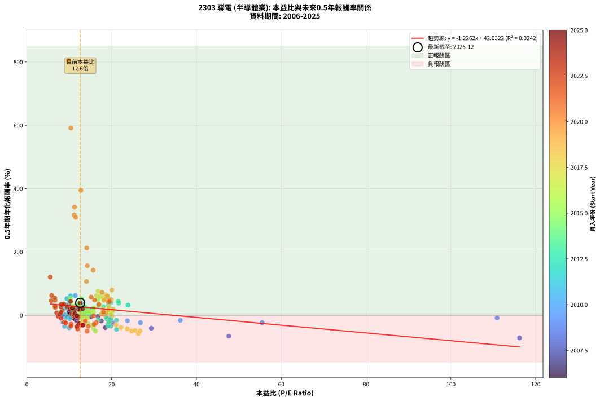

# 2303 聯電 - 本益比與未來報酬率分析

!!! info "報告資訊"
    - **股票代號**: 2303
    - **公司名稱**: 聯電
    - **產業別**: 半導體業
    - **分析期間**: 2006-2025 (234 個數據點)
    - **資料來源**: Type 12 (ShowMonthlyK_ChartFlow) 月收盤價與本益比
    - **報酬率口徑**: 含現金股利 (簡化: 年度合計，假設每年7/1入帳)
    - **報告生成時間**: 2026-01-09 20:30:47 CST

## 📈 視覺化圖表

### 圖表1: 本益比 vs 未來報酬率關係

*圖表1：2303 聯電 本益比與0.5年期未來報酬率關係 (2006-2025)*

### 圖表2: 歷年買入時點的0.5年期實際報酬率

*圖表2：2303 聯電 歷年買入時點的0.5年期實際報酬率 (2006-2025)*

## 📍 買點訊號說明

本報告提供兩種買點提示訊號（顯示於圖表2的股價子圖中）：

### ▲ 小綠色三角形（回測驗證）
- **計算方式**: 使用全部歷史資料計算本益比第25百分位數
- **用途**: 事後驗證，顯示歷史上哪些時點確實為低估區
- **限制**: 當下無法判斷，僅供回測參考
- **特性**: 後見之明（Look-Ahead Bias）

### ▲ 小橘色三角形（即時訊號）
- **計算方式**: 使用截至當月的過去5年資料計算本益比第25百分位數
- **用途**: 實際投資決策，當時即可判斷
- **優勢**: 可操作性強，符合實務需求
- **特性**: 無後見之明，滾動窗口計算

!!! tip "如何使用兩種訊號"
    - **綠色▲** 幫助理解歷史估值機會，驗證策略有效性
    - **橘色▲** 可作為實際買進參考，但仍需搭配基本面分析
    - 兩種訊號重疊時，表示即時判斷與事後驗證一致，信心度較高
    - 僅有綠色▲時，表示當時無法判斷（需要未來資料才能確認）
    - 僅有橘色▲時，表示即時判斷為買點，但事後可能不是最佳時機

## 📊 估值分析摘要

| 指標 | 數值 |
|:---:|:---:|
| **目前本益比** (2025-06) | **12.59 倍** |
| **歷史平均本益比** | 15.78 倍 |
| **估值水準** | 🟢 相對低估 |
| **預期0.5年年化報酬率** | **+26.59%** |
| **歷史平均報酬率** | +25.92% |
| **相關係數 (R²)** | 0.0242 |
| **趨勢線斜率** | -1.2262 |

!!! abstract "核心洞察"
    目前本益比顯著低於歷史平均，預期未來報酬率可能較高

    根據歷史數據回測，2303 聯電 在目前本益比 **12.6倍** 的估值水準下，
    預期未來0.5年年化報酬率約為 **+26.6%**。

    **重要提醒**: 本分析基於歷史數據統計，實際報酬率會受到公司基本面變化、產業趨勢、
    總體經濟環境等多重因素影響。R² = 0.02 表示本益比可解釋約 2.4% 的報酬率變異。

## 📈 歷史估值統計

### 最佳買點 (最高報酬率)

| 項目 | 數值 |
|:---:|:---:|
| 起始時間 | 2020-06 |
| 當時本益比 | 9.81 倍 |
| 起始價格 | 15.9 元 |
| 0.5年後價格 | 47.1 元 |
| **0.5年年化報酬率** | **+805.50%** |

### 最差買點 (最低報酬率)

| 項目 | 數值 |
|:---:|:---:|
| 起始時間 | 2008-05 |
| 當時本益比 | nan 倍 |
| 起始價格 | 18.9 元 |
| 0.5年後價格 | 7.4 元 |
| **0.5年年化報酬率** | **-76.05%** |

## 🎯 投資啟示

### 本益比與報酬率關係

趨勢線方程式: **y = -1.2262x + 42.0322**

!!! warning "強負相關"
    本益比與未來報酬率呈現強負相關。在高本益比時期買入，未來報酬率顯著較低；
    在低本益比時期買入，未來報酬率顯著較高。**估值紀律至關重要**。

### 估值區間建議

基於歷史數據分析:

- **🟢 低估區** (P/E < 12.6): 預期報酬率較高，可考慮增加持股
- **🟡 合理區** (P/E 12.6-18.9): 預期報酬率符合長期趨勢，正常持有
- **🔴 高估區** (P/E > 18.9): 預期報酬率較低，可考慮減碼或觀望

!!! danger "風險提示"
    - 過去表現不代表未來結果
    - 本分析假設公司基本面無重大結構性變化
    - 產業環境劇變可能使歷史規律失效
    - 應結合公司財報、產業趨勢、總體經濟等多重因素綜合判斷

!!! success "長期投資觀點"
    歷史數據顯示，在合理或低估的估值水準買入並長期持有，
    往往能獲得較佳的投資報酬。**耐心等待好價格**是價值投資的核心原則。

## 📊 數據品質

- **資料來源**: GoodInfo.tw Type 12 (ShowMonthlyK_ChartFlow)
- **資料頻率**: 月度收盤價與本益比
- **回測期間**: 2006-2025
- **數據點數量**: 234 個 (每個點代表一次0.5年期回測)

### 計算方法說明

1. **0.5年期年化報酬率**:
   - 對每個歷史時點，計算其後0.5年的實際投資報酬率
   - 期末價值(不含股利): 期末價格
   - 期末價值(含現金股利): 期末價格 + 持有期間內的現金股利合計 (簡化: 年度合計，假設每年7/1入帳)
   - 公式: 年化報酬率 = [(期末價值/期初價格)^(1/年數) - 1] × 100%

2. **本益比 (P/E Ratio)**:
   - 使用當時的月收盤價與EPS計算
   - 資料來源: Type 12 月度河流圖本益比數據

3. **趨勢線 (Linear Regression)**:
   - 使用最小平方法擬合線性趨勢線
   - R²值衡量本益比對報酬率的解釋能力

---

*本報告由 Stock Analysis System v1.9.0 自動生成*
*數據更新時間: 2026-01-09 20:30:47 CST*

## 📋 月度回測明細表

（每一列對應時間線圖中的一個買入點；可用來對照 SVG 圖上的每個點。）

| 買入月份 | 賣出月份 | 回測期限_年 | 實際持有年數 | 買入本益比_倍 | 買入收盤價_元 | 賣出收盤價_元 | 現金股利合計_元 | 總報酬率_pct | 年化報酬率_pct |
| --- | --- | --- | --- | --- | --- | --- | --- | --- | --- |
| 2006-01 | 2006-07 | 0.5 | 0.496 | 10.03 | 18.15 | 18.00 | 0.41 | +1.43 | +2.90 |
| 2006-02 | 2006-08 | 0.5 | 0.498 | 10.58 | 19.15 | 18.00 | 0.41 | -3.87 | -7.61 |
| 2006-03 | 2006-10 | 0.5 | 0.586 | 11.33 | 20.50 | 18.55 | 0.41 | -7.52 | -12.49 |
| 2006-04 | 2006-10 | 0.5 | 0.501 | 12.27 | 22.20 | 18.55 | 0.41 | -14.60 | -27.02 |
| 2006-05 | 2006-12 | 0.5 | 0.586 | 11.16 | 20.20 | 20.25 | 0.41 | +2.27 | +3.91 |
| 2006-06 | 2006-12 | 0.5 | 0.501 | 10.72 | 19.40 | 20.25 | 0.41 | +6.49 | +13.37 |
| 2006-07 | 2007-01 | 0.5 | 0.504 | 9.94 | 18.00 | 20.65 | 0.00 | +14.72 | +31.34 |
| 2006-08 | 2007-03 | 0.5 | 0.580 | 9.94 | 18.00 | 19.10 | 0.00 | +6.11 | +10.76 |
| 2006-09 | 2007-03 | 0.5 | 0.496 | 10.25 | 18.55 | 19.10 | 0.00 | +2.96 | +6.07 |
| 2006-10 | 2007-05 | 0.5 | 0.580 | 10.25 | 18.55 | 19.20 | 0.00 | +3.50 | +6.11 |
| 2006-11 | 2007-05 | 0.5 | 0.496 | 11.69 | 21.15 | 19.20 | 0.00 | -9.22 | -17.73 |
| 2006-12 | 2007-07 | 0.5 | 0.580 | 11.19 | 20.25 | 18.30 | 0.70 | -6.17 | -10.40 |
| 2007-01 | 2007-07 | 0.5 | 0.496 | 11.80 | 20.65 | 18.30 | 0.70 | -7.99 | -15.47 |
| 2007-02 | 2007-08 | 0.5 | 0.498 | 11.95 | 20.20 | 18.50 | 0.70 | -4.95 | -9.69 |
| 2007-03 | 2007-10 | 0.5 | 0.586 | 11.72 | 19.10 | 21.25 | 0.70 | +14.92 | +26.79 |
| 2007-04 | 2007-10 | 0.5 | 0.501 | 12.17 | 19.10 | 21.25 | 0.70 | +14.92 | +31.99 |
| 2007-05 | 2007-12 | 0.5 | 0.586 | 12.72 | 19.20 | 20.15 | 0.70 | +8.59 | +15.11 |
| 2007-06 | 2007-12 | 0.5 | 0.501 | 13.69 | 19.85 | 20.15 | 0.70 | +5.04 | +10.31 |
| 2007-07 | 2008-01 | 0.5 | 0.504 | 13.17 | 18.30 | 17.35 | 0.00 | -5.19 | -10.04 |
| 2007-08 | 2008-03 | 0.5 | 0.583 | 13.91 | 18.50 | 18.70 | 0.00 | +1.08 | +1.86 |
| 2007-09 | 2008-03 | 0.5 | 0.498 | 15.12 | 19.20 | 18.70 | 0.00 | -2.60 | -5.16 |
| 2007-10 | 2008-05 | 0.5 | 0.583 | 17.56 | 21.25 | 18.90 | 0.00 | -11.06 | -18.21 |
| 2007-11 | 2008-05 | 0.5 | 0.498 | 16.78 | 19.30 | 18.90 | 0.00 | -2.07 | -4.12 |
| 2007-12 | 2008-07 | 0.5 | 0.583 | 18.49 | 20.15 | 14.30 | 0.75 | -25.31 | -39.37 |
| 2008-01 | 2008-07 | 0.5 | 0.498 | 20.23 | 17.35 | 14.30 | 0.75 | -13.26 | -24.83 |
| 2008-02 | 2008-08 | 0.5 | 0.501 | 29.36 | 18.35 | 13.30 | 0.75 | -23.43 | -41.31 |
| 2008-03 | 2008-10 | 0.5 | 0.586 | 47.64 | 18.70 | 9.15 | 0.75 | -47.06 | -66.23 |
| 2008-04 | 2008-10 | 0.5 | 0.501 | 116.20 | 18.60 | 9.15 | 0.75 | -46.77 | -71.60 |
| 2008-05 | 2008-12 | 0.5 | 0.586 |  | 18.90 | 7.43 | 0.75 | -56.72 | -76.05 |
| 2008-06 | 2008-12 | 0.5 | 0.501 |  | 16.10 | 7.43 | 0.75 | -49.19 | -74.11 |
| 2008-07 | 2009-01 | 0.5 | 0.504 |  | 14.30 | 7.30 | 0.00 | -48.95 | -73.68 |
| 2008-08 | 2009-03 | 0.5 | 0.580 |  | 13.30 | 11.10 | 0.00 | -16.54 | -26.77 |
| 2008-09 | 2009-03 | 0.5 | 0.496 |  | 10.25 | 11.10 | 0.00 | +8.29 | +17.44 |
| 2008-10 | 2009-05 | 0.5 | 0.580 |  | 9.15 | 13.00 | 0.00 | +42.08 | +83.14 |
| 2008-11 | 2009-05 | 0.5 | 0.496 |  | 8.10 | 13.00 | 0.00 | +60.49 | +159.78 |
| 2008-12 | 2009-07 | 0.5 | 0.580 |  | 7.43 | 14.55 | 0.00 | +95.83 | +218.32 |
| 2009-01 | 2009-07 | 0.5 | 0.496 |  | 7.30 | 14.55 | 0.00 | +99.32 | +302.22 |
| 2009-02 | 2009-08 | 0.5 | 0.498 |  | 7.84 | 13.50 | 0.00 | +72.19 | +197.62 |
| 2009-03 | 2009-10 | 0.5 | 0.586 |  | 11.10 | 16.20 | 0.00 | +45.95 | +90.65 |
| 2009-04 | 2009-10 | 0.5 | 0.501 |  | 12.40 | 16.20 | 0.00 | +30.65 | +70.49 |
| 2009-05 | 2009-12 | 0.5 | 0.586 |  | 13.00 | 17.20 | 0.00 | +32.31 | +61.26 |
| 2009-06 | 2009-12 | 0.5 | 0.501 |  | 11.00 | 17.20 | 0.00 | +56.36 | +144.05 |
| 2009-07 | 2010-01 | 0.5 | 0.504 |  | 14.55 | 16.05 | 0.00 | +10.31 | +21.50 |
| 2009-08 | 2010-03 | 0.5 | 0.580 |  | 13.50 | 16.85 | 0.00 | +24.81 | +46.51 |
| 2009-09 | 2010-03 | 0.5 | 0.496 |  | 15.75 | 16.85 | 0.00 | +6.98 | +14.59 |
| 2009-10 | 2010-05 | 0.5 | 0.580 |  | 16.20 | 15.10 | 0.00 | -6.79 | -11.41 |
| 2009-11 | 2010-05 | 0.5 | 0.496 | 110.90 | 15.80 | 15.10 | 0.00 | -4.43 | -8.74 |
| 2009-12 | 2010-07 | 0.5 | 0.580 | 55.48 | 17.20 | 14.20 | 0.50 | -14.53 | -23.71 |
| 2010-01 | 2010-07 | 0.5 | 0.496 | 36.20 | 16.05 | 14.20 | 0.50 | -8.41 | -16.25 |
| 2010-02 | 2010-08 | 0.5 | 0.498 | 26.79 | 15.45 | 13.00 | 0.50 | -12.62 | -23.72 |
| 2010-03 | 2010-10 | 0.5 | 0.586 | 23.73 | 16.85 | 14.55 | 0.50 | -10.68 | -17.54 |
| 2010-04 | 2010-10 | 0.5 | 0.501 | 18.97 | 16.00 | 14.55 | 0.50 | -5.94 | -11.50 |
| 2010-05 | 2010-12 | 0.5 | 0.586 | 15.46 | 15.10 | 16.30 | 0.50 | +11.26 | +19.97 |
| 2010-06 | 2010-12 | 0.5 | 0.501 | 12.93 | 14.35 | 16.30 | 0.50 | +17.07 | +36.97 |
| 2010-07 | 2011-01 | 0.5 | 0.504 | 11.42 | 14.20 | 18.10 | 0.00 | +27.46 | +61.88 |
| 2010-08 | 2011-03 | 0.5 | 0.580 | 9.44 | 13.00 | 15.30 | 0.00 | +17.69 | +32.40 |
| 2010-09 | 2011-03 | 0.5 | 0.496 | 9.17 | 13.85 | 15.30 | 0.00 | +10.47 | +22.25 |
| 2010-10 | 2011-05 | 0.5 | 0.580 | 8.85 | 14.55 | 14.80 | 0.00 | +1.72 | +2.98 |
| 2010-11 | 2011-05 | 0.5 | 0.496 | 8.50 | 15.10 | 14.80 | 0.00 | -1.99 | -3.97 |
| 2010-12 | 2011-07 | 0.5 | 0.580 | 8.53 | 16.30 | 12.95 | 1.11 | -13.73 | -22.47 |
| 2011-01 | 2011-07 | 0.5 | 0.496 | 9.94 | 18.10 | 12.95 | 1.11 | -22.31 | -39.91 |
| 2011-02 | 2011-08 | 0.5 | 0.498 | 8.89 | 15.40 | 11.30 | 1.11 | -19.40 | -35.14 |
| 2011-03 | 2011-10 | 0.5 | 0.586 | 9.32 | 15.30 | 13.35 | 1.11 | -5.48 | -9.17 |
| 2011-04 | 2011-10 | 0.5 | 0.501 | 9.56 | 14.85 | 13.35 | 1.11 | -2.61 | -5.15 |
| 2011-05 | 2011-12 | 0.5 | 0.586 | 10.11 | 14.80 | 12.70 | 1.11 | -6.68 | -11.12 |
| 2011-06 | 2011-12 | 0.5 | 0.501 | 10.36 | 14.25 | 12.70 | 1.11 | -3.07 | -6.04 |
| 2011-07 | 2012-01 | 0.5 | 0.504 | 10.07 | 12.95 | 15.50 | 0.00 | +19.69 | +42.88 |
| 2011-08 | 2012-03 | 0.5 | 0.583 | 9.44 | 11.30 | 14.45 | 0.00 | +27.88 | +52.45 |
| 2011-09 | 2012-03 | 0.5 | 0.498 | 10.29 | 11.40 | 14.45 | 0.00 | +26.75 | +60.93 |
| 2011-10 | 2012-05 | 0.5 | 0.583 | 13.11 | 13.35 | 13.10 | 0.00 | -1.87 | -3.19 |
| 2011-11 | 2012-05 | 0.5 | 0.498 | 13.99 | 13.00 | 13.10 | 0.00 | +0.77 | +1.55 |
| 2011-12 | 2012-07 | 0.5 | 0.583 | 15.12 | 12.70 | 12.60 | 0.50 | +3.15 | +5.46 |
| 2012-01 | 2012-07 | 0.5 | 0.498 | 19.12 | 15.50 | 12.60 | 0.50 | -15.48 | -28.65 |
| 2012-02 | 2012-08 | 0.5 | 0.501 | 19.83 | 15.50 | 12.00 | 0.50 | -19.35 | -34.91 |
| 2012-03 | 2012-10 | 0.5 | 0.586 | 19.20 | 14.45 | 10.85 | 0.50 | -21.45 | -33.78 |
| 2012-04 | 2012-10 | 0.5 | 0.501 | 21.15 | 15.30 | 10.85 | 0.50 | -25.82 | -44.90 |
| 2012-05 | 2012-12 | 0.5 | 0.586 | 18.87 | 13.10 | 11.70 | 0.50 | -6.87 | -11.44 |
| 2012-06 | 2012-12 | 0.5 | 0.501 | 19.40 | 12.90 | 11.70 | 0.50 | -5.43 | -10.54 |
| 2012-07 | 2013-01 | 0.5 | 0.504 | 19.82 | 12.60 | 11.50 | 0.00 | -8.73 | -16.58 |
| 2012-08 | 2013-03 | 0.5 | 0.580 | 19.78 | 12.00 | 11.20 | 0.00 | -6.67 | -11.21 |
| 2012-09 | 2013-03 | 0.5 | 0.496 | 21.13 | 12.20 | 11.20 | 0.00 | -8.20 | -15.85 |
| 2012-10 | 2013-05 | 0.5 | 0.580 | 19.79 | 10.85 | 13.20 | 0.00 | +21.66 | +40.18 |
| 2012-11 | 2013-05 | 0.5 | 0.496 | 21.67 | 11.25 | 13.20 | 0.00 | +17.33 | +38.07 |
| 2012-12 | 2013-07 | 0.5 | 0.580 | 23.88 | 11.70 | 13.35 | 0.41 | +17.57 | +32.17 |
| 2013-01 | 2013-07 | 0.5 | 0.496 | 21.56 | 11.50 | 13.35 | 0.41 | +19.62 | +43.54 |
| 2013-02 | 2013-08 | 0.5 | 0.498 | 19.25 | 11.10 | 12.30 | 0.41 | +14.47 | +31.15 |
| 2013-03 | 2013-10 | 0.5 | 0.586 | 18.06 | 11.20 | 12.45 | 0.41 | +14.79 | +26.54 |
| 2013-04 | 2013-10 | 0.5 | 0.501 | 16.96 | 11.25 | 12.45 | 0.41 | +14.28 | +30.52 |
| 2013-05 | 2013-12 | 0.5 | 0.586 | 18.68 | 13.20 | 12.35 | 0.41 | -3.36 | -5.67 |
| 2013-06 | 2013-12 | 0.5 | 0.501 | 19.33 | 14.50 | 12.35 | 0.41 | -12.03 | -22.57 |
| 2013-07 | 2014-01 | 0.5 | 0.504 | 16.83 | 13.35 | 12.35 | 0.00 | -7.49 | -14.32 |
| 2013-08 | 2014-03 | 0.5 | 0.580 | 14.70 | 12.30 | 12.85 | 0.00 | +4.47 | +7.83 |
| 2013-09 | 2014-03 | 0.5 | 0.496 | 14.38 | 12.65 | 12.85 | 0.00 | +1.58 | +3.22 |
| 2013-10 | 2014-05 | 0.5 | 0.580 | 13.48 | 12.45 | 14.05 | 0.00 | +12.85 | +23.16 |
| 2013-11 | 2014-05 | 0.5 | 0.496 | 12.72 | 12.30 | 14.05 | 0.00 | +14.23 | +30.79 |
| 2013-12 | 2014-07 | 0.5 | 0.580 | 12.23 | 12.35 | 14.05 | 0.50 | +17.81 | +32.64 |
| 2014-01 | 2014-07 | 0.5 | 0.496 | 12.27 | 12.35 | 14.05 | 0.50 | +17.81 | +39.21 |
| 2014-02 | 2014-08 | 0.5 | 0.498 | 12.26 | 12.30 | 13.65 | 0.50 | +15.04 | +32.47 |
| 2014-03 | 2014-10 | 0.5 | 0.586 | 12.85 | 12.85 | 13.40 | 0.50 | +8.17 | +14.35 |
| 2014-04 | 2014-10 | 0.5 | 0.501 | 13.09 | 13.05 | 13.40 | 0.50 | +6.51 | +13.42 |
| 2014-05 | 2014-12 | 0.5 | 0.586 | 14.14 | 14.05 | 14.75 | 0.50 | +8.54 | +15.01 |
| 2014-06 | 2014-12 | 0.5 | 0.501 | 15.10 | 14.95 | 14.75 | 0.50 | +2.01 | +4.05 |
| 2014-07 | 2015-01 | 0.5 | 0.504 | 14.24 | 14.05 | 15.40 | 0.00 | +9.61 | +19.98 |
| 2014-08 | 2015-03 | 0.5 | 0.580 | 13.88 | 13.65 | 15.50 | 0.00 | +13.55 | +24.48 |
| 2014-09 | 2015-03 | 0.5 | 0.496 | 12.86 | 12.60 | 15.50 | 0.00 | +23.02 | +51.89 |
| 2014-10 | 2015-05 | 0.5 | 0.580 | 13.72 | 13.40 | 13.90 | 0.00 | +3.73 | +6.52 |
| 2014-11 | 2015-05 | 0.5 | 0.496 | 14.13 | 13.75 | 13.90 | 0.00 | +1.09 | +2.21 |
| 2014-12 | 2015-07 | 0.5 | 0.580 | 15.21 | 14.75 | 11.25 | 0.55 | -20.00 | -31.92 |
| 2015-01 | 2015-07 | 0.5 | 0.496 | 15.73 | 15.40 | 11.25 | 0.55 | -23.38 | -41.57 |
| 2015-02 | 2015-08 | 0.5 | 0.498 | 16.19 | 16.00 | 10.75 | 0.55 | -29.37 | -50.24 |
| 2015-03 | 2015-10 | 0.5 | 0.586 | 15.54 | 15.50 | 11.90 | 0.55 | -19.68 | -31.20 |
| 2015-04 | 2015-10 | 0.5 | 0.501 | 14.50 | 14.60 | 11.90 | 0.55 | -14.73 | -27.24 |
| 2015-05 | 2015-12 | 0.5 | 0.586 | 13.68 | 13.90 | 12.10 | 0.55 | -8.99 | -14.86 |
| 2015-06 | 2015-12 | 0.5 | 0.501 | 12.73 | 13.05 | 12.10 | 0.55 | -3.07 | -6.02 |
| 2015-07 | 2016-01 | 0.5 | 0.504 | 10.88 | 11.25 | 12.75 | 0.00 | +13.33 | +28.20 |
| 2015-08 | 2016-03 | 0.5 | 0.583 | 10.30 | 10.75 | 13.30 | 0.00 | +23.72 | +44.05 |
| 2015-09 | 2016-03 | 0.5 | 0.498 | 10.26 | 10.80 | 13.30 | 0.00 | +23.15 | +51.87 |
| 2015-10 | 2016-05 | 0.5 | 0.583 | 11.21 | 11.90 | 12.20 | 0.00 | +2.52 | +4.36 |
| 2015-11 | 2016-05 | 0.5 | 0.498 | 11.07 | 11.85 | 12.20 | 0.00 | +2.95 | +6.02 |
| 2015-12 | 2016-07 | 0.5 | 0.583 | 11.20 | 12.10 | 11.90 | 0.56 | +3.02 | +5.23 |
| 2016-01 | 2016-07 | 0.5 | 0.498 | 12.18 | 12.75 | 11.90 | 0.56 | -2.24 | -4.44 |
| 2016-02 | 2016-08 | 0.5 | 0.501 | 13.17 | 13.35 | 11.50 | 0.56 | -9.63 | -18.29 |
| 2016-03 | 2016-10 | 0.5 | 0.586 | 13.57 | 13.30 | 11.75 | 0.56 | -7.41 | -12.31 |
| 2016-04 | 2016-10 | 0.5 | 0.501 | 12.68 | 12.00 | 11.75 | 0.56 | +2.62 | +5.31 |
| 2016-05 | 2016-12 | 0.5 | 0.586 | 13.36 | 12.20 | 11.40 | 0.56 | -1.93 | -3.27 |
| 2016-06 | 2016-12 | 0.5 | 0.501 | 14.32 | 12.60 | 11.40 | 0.56 | -5.04 | -9.81 |
| 2016-07 | 2017-01 | 0.5 | 0.504 | 14.06 | 11.90 | 11.35 | 0.00 | -4.62 | -8.97 |
| 2016-08 | 2017-03 | 0.5 | 0.580 | 14.14 | 11.50 | 12.20 | 0.00 | +6.09 | +10.72 |
| 2016-09 | 2017-03 | 0.5 | 0.496 | 14.81 | 11.55 | 12.20 | 0.00 | +5.63 | +11.68 |
| 2016-10 | 2017-05 | 0.5 | 0.580 | 15.74 | 11.75 | 12.45 | 0.00 | +5.96 | +10.48 |
| 2016-11 | 2017-05 | 0.5 | 0.496 | 15.77 | 11.25 | 12.45 | 0.00 | +10.67 | +22.69 |
| 2016-12 | 2017-07 | 0.5 | 0.580 | 16.76 | 11.40 | 13.90 | 0.50 | +26.32 | +49.55 |
| 2017-01 | 2017-07 | 0.5 | 0.496 | 16.47 | 11.35 | 13.90 | 0.50 | +26.87 | +61.66 |
| 2017-02 | 2017-08 | 0.5 | 0.498 | 18.26 | 12.75 | 15.05 | 0.50 | +21.96 | +48.95 |
| 2017-03 | 2017-10 | 0.5 | 0.586 | 17.24 | 12.20 | 15.50 | 0.50 | +31.15 | +58.85 |
| 2017-04 | 2017-10 | 0.5 | 0.501 | 16.81 | 12.05 | 15.50 | 0.50 | +32.78 | +76.10 |
| 2017-05 | 2017-12 | 0.5 | 0.586 | 17.15 | 12.45 | 14.20 | 0.50 | +18.07 | +32.78 |
| 2017-06 | 2017-12 | 0.5 | 0.501 | 20.07 | 14.75 | 14.20 | 0.50 | -0.34 | -0.68 |
| 2017-07 | 2018-01 | 0.5 | 0.504 | 18.68 | 13.90 | 14.25 | 0.00 | +2.52 | +5.06 |
| 2017-08 | 2018-03 | 0.5 | 0.580 | 19.98 | 15.05 | 15.50 | 0.00 | +2.99 | +5.21 |
| 2017-09 | 2018-03 | 0.5 | 0.496 | 19.67 | 15.00 | 15.50 | 0.00 | +3.33 | +6.84 |
| 2017-10 | 2018-05 | 0.5 | 0.580 | 20.09 | 15.50 | 16.65 | 0.00 | +7.42 | +13.12 |
| 2017-11 | 2018-05 | 0.5 | 0.496 | 19.59 | 15.30 | 16.65 | 0.00 | +8.82 | +18.61 |
| 2017-12 | 2018-07 | 0.5 | 0.580 | 17.97 | 14.20 | 17.55 | 0.71 | +28.61 | +54.26 |
| 2018-01 | 2018-07 | 0.5 | 0.496 | 18.45 | 14.25 | 17.55 | 0.71 | +28.15 | +64.97 |
| 2018-02 | 2018-08 | 0.5 | 0.498 | 18.74 | 14.15 | 17.35 | 0.71 | +27.65 | +63.21 |
| 2018-03 | 2018-10 | 0.5 | 0.586 | 21.02 | 15.50 | 11.80 | 0.71 | -19.28 | -30.62 |
| 2018-04 | 2018-10 | 0.5 | 0.501 | 22.22 | 16.00 | 11.80 | 0.71 | -21.80 | -38.79 |
| 2018-05 | 2018-12 | 0.5 | 0.586 | 23.70 | 16.65 | 11.25 | 0.71 | -28.16 | -43.13 |
| 2018-06 | 2018-12 | 0.5 | 0.501 | 24.74 | 16.95 | 11.25 | 0.71 | -29.43 | -50.12 |
| 2018-07 | 2019-01 | 0.5 | 0.504 | 26.29 | 17.55 | 11.35 | 0.00 | -35.33 | -57.90 |
| 2018-08 | 2019-03 | 0.5 | 0.580 | 26.69 | 17.35 | 11.65 | 0.00 | -32.85 | -49.65 |
| 2018-09 | 2019-03 | 0.5 | 0.496 | 25.53 | 16.15 | 11.65 | 0.00 | -27.86 | -48.27 |
| 2018-10 | 2019-05 | 0.5 | 0.580 | 19.19 | 11.80 | 12.90 | 0.00 | +9.32 | +16.60 |
| 2018-11 | 2019-05 | 0.5 | 0.496 | 19.33 | 11.55 | 12.90 | 0.00 | +11.69 | +24.99 |
| 2018-12 | 2019-07 | 0.5 | 0.580 | 19.40 | 11.25 | 13.80 | 0.59 | +27.91 | +52.82 |
| 2019-01 | 2019-07 | 0.5 | 0.496 | 18.92 | 11.35 | 13.80 | 0.59 | +26.78 | +61.43 |
| 2019-02 | 2019-08 | 0.5 | 0.498 | 18.47 | 11.45 | 13.45 | 0.59 | +22.62 | +50.57 |
| 2019-03 | 2019-10 | 0.5 | 0.586 | 18.20 | 11.65 | 14.00 | 0.59 | +25.24 | +46.83 |
| 2019-04 | 2019-10 | 0.5 | 0.501 | 20.38 | 13.45 | 14.00 | 0.59 | +8.48 | +17.63 |
| 2019-05 | 2019-12 | 0.5 | 0.586 | 18.97 | 12.90 | 16.45 | 0.59 | +32.09 | +60.81 |
| 2019-06 | 2019-12 | 0.5 | 0.501 | 19.93 | 13.95 | 16.45 | 0.59 | +22.15 | +49.09 |
| 2019-07 | 2020-01 | 0.5 | 0.504 | 19.17 | 13.80 | 14.90 | 0.00 | +7.97 | +16.44 |
| 2019-08 | 2020-03 | 0.5 | 0.583 | 18.18 | 13.45 | 13.65 | 0.00 | +1.49 | +2.56 |
| 2019-09 | 2020-03 | 0.5 | 0.498 | 17.63 | 13.40 | 13.65 | 0.00 | +1.87 | +3.78 |
| 2019-10 | 2020-05 | 0.5 | 0.583 | 17.95 | 14.00 | 15.45 | 0.00 | +10.36 | +18.41 |
| 2019-11 | 2020-05 | 0.5 | 0.498 | 18.69 | 14.95 | 15.45 | 0.00 | +3.34 | +6.82 |
| 2019-12 | 2020-07 | 0.5 | 0.583 | 20.06 | 16.45 | 22.35 | 0.80 | +40.75 | +79.71 |
| 2020-01 | 2020-07 | 0.5 | 0.498 | 15.63 | 14.90 | 22.35 | 0.80 | +55.40 | +142.21 |
| 2020-02 | 2020-08 | 0.5 | 0.501 | 14.08 | 15.30 | 21.20 | 0.80 | +43.82 | +106.53 |
| 2020-03 | 2020-10 | 0.5 | 0.586 | 11.19 | 13.65 | 30.70 | 0.80 | +130.80 | +316.83 |
| 2020-04 | 2020-10 | 0.5 | 0.501 | 11.49 | 15.55 | 30.70 | 0.80 | +102.60 | +309.27 |
| 2020-05 | 2020-12 | 0.5 | 0.586 | 10.39 | 15.45 | 47.15 | 0.80 | +210.38 | +591.13 |
| 2020-06 | 2020-12 | 0.5 | 0.501 | 9.81 | 15.90 | 47.15 | 0.80 | +201.60 | +805.50 |
| 2020-07 | 2021-01 | 0.5 | 0.504 | 12.75 | 22.35 | 50.00 | 0.00 | +123.71 | +394.49 |
| 2020-08 | 2021-03 | 0.5 | 0.580 | 11.24 | 21.20 | 50.20 | 0.00 | +136.79 | +341.56 |
| 2020-09 | 2021-03 | 0.5 | 0.496 | 14.13 | 28.55 | 50.20 | 0.00 | +75.83 | +212.32 |
| 2020-10 | 2021-05 | 0.5 | 0.580 | 14.26 | 30.70 | 53.00 | 0.00 | +72.64 | +156.19 |
| 2020-11 | 2021-05 | 0.5 | 0.496 | 17.71 | 40.50 | 53.00 | 0.00 | +30.86 | +72.08 |
| 2020-12 | 2021-07 | 0.5 | 0.580 | 19.48 | 47.15 | 57.80 | 1.60 | +25.98 | +48.87 |
| 2021-01 | 2021-07 | 0.5 | 0.496 | 19.24 | 50.00 | 57.80 | 1.60 | +18.80 | +41.57 |
| 2021-02 | 2021-08 | 0.5 | 0.498 | 19.51 | 54.20 | 63.10 | 1.60 | +19.37 | +42.67 |
| 2021-03 | 2021-10 | 0.5 | 0.586 | 16.97 | 50.20 | 58.00 | 1.60 | +18.73 | +34.04 |
| 2021-04 | 2021-10 | 0.5 | 0.501 | 18.08 | 56.70 | 58.00 | 1.60 | +5.11 | +10.47 |
| 2021-05 | 2021-12 | 0.5 | 0.586 | 15.98 | 53.00 | 65.00 | 1.60 | +25.66 | +47.68 |
| 2021-06 | 2021-12 | 0.5 | 0.501 | 15.19 | 53.10 | 65.00 | 1.60 | +25.42 | +57.17 |
| 2021-07 | 2022-01 | 0.5 | 0.504 | 15.73 | 57.80 | 57.30 | 0.00 | -0.87 | -1.71 |
| 2021-08 | 2022-03 | 0.5 | 0.580 | 16.38 | 63.10 | 54.00 | 0.00 | -14.42 | -23.53 |
| 2021-09 | 2022-03 | 0.5 | 0.496 | 15.87 | 64.00 | 54.00 | 0.00 | -15.62 | -29.03 |
| 2021-10 | 2022-05 | 0.5 | 0.580 | 13.77 | 58.00 | 51.40 | 0.00 | -11.38 | -18.79 |
| 2021-11 | 2022-05 | 0.5 | 0.496 | 14.51 | 63.70 | 51.40 | 0.00 | -19.31 | -35.14 |
| 2021-12 | 2022-07 | 0.5 | 0.580 | 14.22 | 65.00 | 40.15 | 3.00 | -33.62 | -50.63 |
| 2022-01 | 2022-07 | 0.5 | 0.496 | 11.99 | 57.30 | 40.15 | 3.00 | -24.69 | -43.58 |
| 2022-02 | 2022-08 | 0.5 | 0.498 | 10.44 | 52.10 | 41.10 | 3.00 | -15.36 | -28.43 |
| 2022-03 | 2022-10 | 0.5 | 0.586 | 10.38 | 54.00 | 39.10 | 3.00 | -22.04 | -34.62 |
| 2022-04 | 2022-10 | 0.5 | 0.501 | 8.84 | 47.80 | 39.10 | 3.00 | -11.92 | -22.39 |
| 2022-05 | 2022-12 | 0.5 | 0.586 | 9.15 | 51.40 | 40.70 | 3.00 | -14.98 | -24.19 |
| 2022-06 | 2022-12 | 0.5 | 0.501 | 6.72 | 39.15 | 40.70 | 3.00 | +11.62 | +24.54 |
| 2022-07 | 2023-01 | 0.5 | 0.504 | 6.65 | 40.15 | 48.80 | 0.00 | +21.54 | +47.30 |
| 2022-08 | 2023-03 | 0.5 | 0.580 | 6.58 | 41.10 | 52.90 | 0.00 | +28.71 | +54.47 |
| 2022-09 | 2023-03 | 0.5 | 0.496 | 5.53 | 35.75 | 52.90 | 0.00 | +47.97 | +120.50 |
| 2022-10 | 2023-05 | 0.5 | 0.580 | 5.86 | 39.10 | 51.80 | 0.00 | +32.48 | +62.35 |
| 2022-11 | 2023-05 | 0.5 | 0.496 | 6.66 | 45.80 | 51.80 | 0.00 | +13.10 | +28.20 |
| 2022-12 | 2023-07 | 0.5 | 0.580 | 5.74 | 40.70 | 47.00 | 3.60 | +24.32 | +45.52 |
| 2023-01 | 2023-07 | 0.5 | 0.496 | 7.06 | 48.80 | 47.00 | 3.60 | +3.69 | +7.58 |
| 2023-02 | 2023-08 | 0.5 | 0.498 | 7.42 | 49.95 | 45.50 | 3.60 | -1.70 | -3.39 |
| 2023-03 | 2023-10 | 0.5 | 0.586 | 8.08 | 52.90 | 46.20 | 3.60 | -5.86 | -9.79 |
| 2023-04 | 2023-10 | 0.5 | 0.501 | 7.71 | 49.10 | 46.20 | 3.60 | +1.43 | +2.87 |
| 2023-05 | 2023-12 | 0.5 | 0.586 | 8.37 | 51.80 | 52.60 | 3.60 | +8.49 | +14.93 |
| 2023-06 | 2023-12 | 0.5 | 0.501 | 8.07 | 48.50 | 52.60 | 3.60 | +15.88 | +34.19 |
| 2023-07 | 2024-01 | 0.5 | 0.504 | 8.06 | 47.00 | 49.00 | 0.00 | +4.26 | +8.62 |
| 2023-08 | 2024-03 | 0.5 | 0.583 | 8.05 | 45.50 | 52.20 | 0.00 | +14.73 | +26.56 |
| 2023-09 | 2024-03 | 0.5 | 0.498 | 8.26 | 45.20 | 52.20 | 0.00 | +15.49 | +33.50 |
| 2023-10 | 2024-05 | 0.5 | 0.583 | 8.73 | 46.20 | 55.00 | 0.00 | +19.05 | +34.85 |
| 2023-11 | 2024-05 | 0.5 | 0.498 | 9.57 | 48.90 | 55.00 | 0.00 | +12.47 | +26.61 |
| 2023-12 | 2024-07 | 0.5 | 0.583 | 10.67 | 52.60 | 50.40 | 3.00 | +1.52 | +2.62 |
| 2024-01 | 2024-07 | 0.5 | 0.498 | 10.13 | 49.00 | 50.40 | 3.00 | +8.98 | +18.84 |
| 2024-02 | 2024-08 | 0.5 | 0.501 | 10.30 | 48.85 | 55.50 | 3.00 | +19.75 | +43.31 |
| 2024-03 | 2024-10 | 0.5 | 0.586 | 11.23 | 52.20 | 48.15 | 3.00 | -2.01 | -3.41 |
| 2024-04 | 2024-10 | 0.5 | 0.501 | 11.13 | 50.70 | 48.15 | 3.00 | +0.89 | +1.78 |
| 2024-05 | 2024-12 | 0.5 | 0.586 | 12.33 | 55.00 | 43.05 | 3.00 | -16.27 | -26.15 |
| 2024-06 | 2024-12 | 0.5 | 0.501 | 12.76 | 55.70 | 43.05 | 3.00 | -17.32 | -31.60 |
| 2024-07 | 2025-01 | 0.5 | 0.504 | 11.80 | 50.40 | 40.20 | 0.00 | -20.24 | -36.17 |
| 2024-08 | 2025-03 | 0.5 | 0.580 | 13.29 | 55.50 | 44.65 | 0.00 | -19.55 | -31.26 |
| 2024-09 | 2025-03 | 0.5 | 0.496 | 13.18 | 53.80 | 44.65 | 0.00 | -17.01 | -31.35 |
| 2024-10 | 2025-05 | 0.5 | 0.580 | 12.07 | 48.15 | 46.75 | 0.00 | -2.91 | -4.96 |
| 2024-11 | 2025-05 | 0.5 | 0.496 | 11.18 | 43.55 | 46.75 | 0.00 | +7.35 | +15.38 |
| 2024-12 | 2025-07 | 0.5 | 0.580 | 11.33 | 43.05 | 41.55 | 2.85 | +3.14 | +5.46 |
| 2025-01 | 2025-07 | 0.5 | 0.496 | 10.72 | 40.20 | 41.55 | 2.85 | +10.45 | +22.20 |
| 2025-02 | 2025-08 | 0.5 | 0.498 | 11.80 | 43.70 | 40.50 | 2.85 | -0.80 | -1.60 |
| 2025-03 | 2025-10 | 0.5 | 0.586 | 12.22 | 44.65 | 46.40 | 2.85 | +10.30 | +18.22 |
| 2025-04 | 2025-10 | 0.5 | 0.501 | 12.53 | 45.20 | 46.40 | 2.85 | +8.96 | +18.68 |
| 2025-05 | 2025-12 | 0.5 | 0.586 | 13.14 | 46.75 | 49.25 | 2.85 | +11.44 | +20.31 |
| 2025-06 | 2025-12 | 0.5 | 0.501 | 12.59 | 44.20 | 49.25 | 2.85 | +17.87 | +38.85 |
