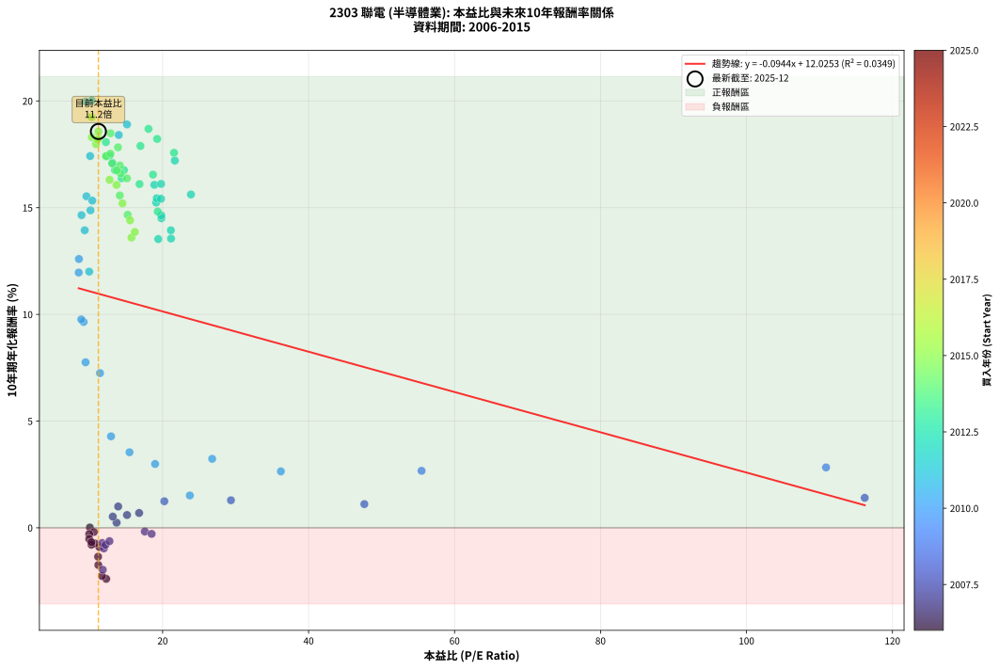
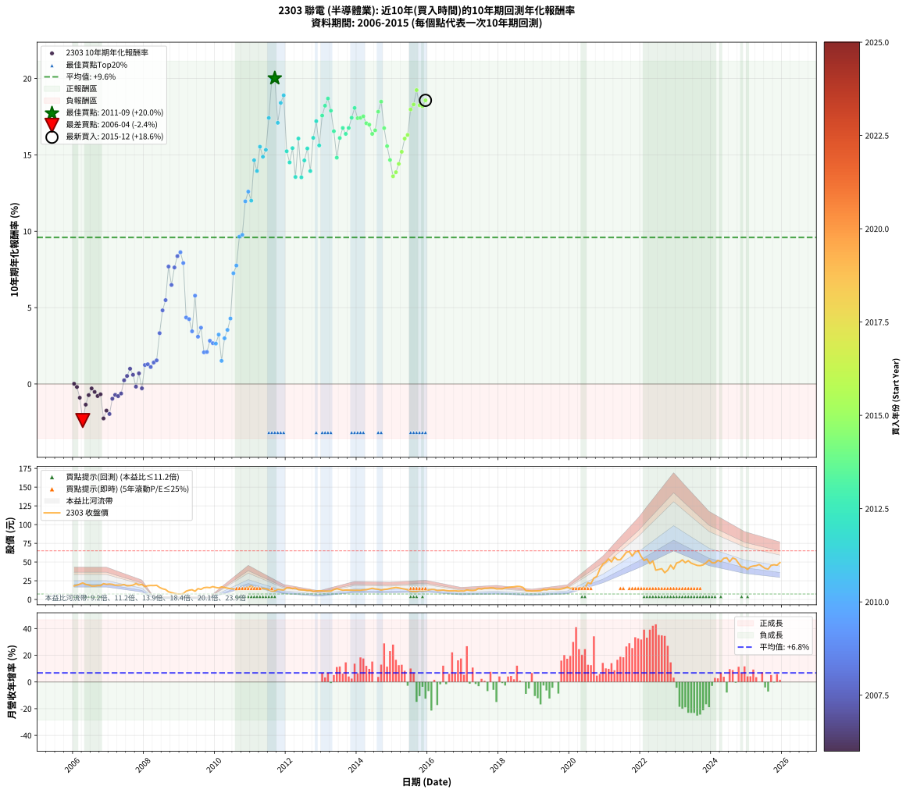

# 2303 聯電 - 本益比與未來報酬率分析

!!! info "報告資訊"
    - **股票代號**: 2303
    - **公司名稱**: 聯電
    - **產業別**: 半導體業
    - **分析期間**: 2006-2015 (120 個數據點)
    - **資料來源**: Type 12 (ShowMonthlyK_ChartFlow) 月收盤價與本益比
    - **報酬率口徑**: 含現金股利 (簡化: 年度合計，假設每年7/1入帳)
    - **報告生成時間**: 2026-01-10 20:29:46 CST

## 📈 視覺化圖表

### 圖表1: 本益比 vs 未來報酬率關係

*圖表1：2303 聯電 本益比與10年期未來報酬率關係 (2006-2015)*

### 圖表2: 歷年買入時點的10年期實際報酬率

*圖表2：2303 聯電 歷年買入時點的10年期實際報酬率 (2006-2015)*

## 📍 買點訊號說明

本報告提供兩種買點提示訊號（顯示於圖表2的股價子圖中）：

### ▲ 小綠色三角形（回測驗證）
- **計算方式**: 使用全部歷史資料計算本益比第25百分位數
- **用途**: 事後驗證，顯示歷史上哪些時點確實為低估區
- **限制**: 當下無法判斷，僅供回測參考
- **特性**: 後見之明（Look-Ahead Bias）

### ▲ 小橘色三角形（即時訊號）
- **計算方式**: 使用截至當月的過去5年資料計算本益比第25百分位數
- **用途**: 實際投資決策，當時即可判斷
- **優勢**: 可操作性強，符合實務需求
- **特性**: 無後見之明，滾動窗口計算

!!! tip "如何使用兩種訊號"
    - **綠色▲** 幫助理解歷史估值機會，驗證策略有效性
    - **橘色▲** 可作為實際買進參考，但仍需搭配基本面分析
    - 兩種訊號重疊時，表示即時判斷與事後驗證一致，信心度較高
    - 僅有綠色▲時，表示當時無法判斷（需要未來資料才能確認）
    - 僅有橘色▲時，表示即時判斷為買點，但事後可能不是最佳時機

## 📊 估值分析摘要

| 指標 | 數值 |
|:---:|:---:|
| **目前本益比** (2015-12) | **11.20 倍** |
| **歷史平均本益比** | 17.23 倍 |
| **估值水準** | 🟢 相對低估 |
| **預期10年年化報酬率** | **+10.97%** |
| **歷史平均報酬率** | +9.60% |
| **相關係數 (R²)** | 0.0349 |
| **趨勢線斜率** | -0.0944 |

!!! abstract "核心洞察"
    目前本益比顯著低於歷史平均，預期未來報酬率可能較高

    根據歷史數據回測，2303 聯電 在目前本益比 **11.2倍** 的估值水準下，
    預期未來10年年化報酬率約為 **+11.0%**。

    **重要提醒**: 本分析基於歷史數據統計，實際報酬率會受到公司基本面變化、產業趨勢、
    總體經濟環境等多重因素影響。R² = 0.03 表示本益比可解釋約 3.5% 的報酬率變異。

## 📈 歷史估值統計

### 最佳買點 (最高報酬率)

| 項目 | 數值 |
|:---:|:---:|
| 起始時間 | 2011-09 |
| 當時本益比 | 10.29 倍 |
| 起始價格 | 11.4 元 |
| 10年後價格 | 64.0 元 |
| **10年年化報酬率** | **+20.02%** |

### 最差買點 (最低報酬率)

| 項目 | 數值 |
|:---:|:---:|
| 起始時間 | 2006-04 |
| 當時本益比 | 12.27 倍 |
| 起始價格 | 22.2 元 |
| 10年後價格 | 12.0 元 |
| **10年年化報酬率** | **-2.39%** |

## 🎯 投資啟示

### 本益比與報酬率關係

趨勢線方程式: **y = -0.0944x + 12.0253**

!!! note "負相關"
    本益比與未來報酬率呈現負相關。較低的本益比通常帶來較高的未來報酬率，
    但相關性不算非常強。**估值仍是重要參考指標之一**。

### 估值區間建議

基於歷史數據分析:

- **🟢 低估區** (P/E < 13.8): 預期報酬率較高，可考慮增加持股
- **🟡 合理區** (P/E 13.8-20.7): 預期報酬率符合長期趨勢，正常持有
- **🔴 高估區** (P/E > 20.7): 預期報酬率較低，可考慮減碼或觀望

!!! danger "風險提示"
    - 過去表現不代表未來結果
    - 本分析假設公司基本面無重大結構性變化
    - 產業環境劇變可能使歷史規律失效
    - 應結合公司財報、產業趨勢、總體經濟等多重因素綜合判斷

!!! success "長期投資觀點"
    歷史數據顯示，在合理或低估的估值水準買入並長期持有，
    往往能獲得較佳的投資報酬。**耐心等待好價格**是價值投資的核心原則。

## 📊 數據品質

- **資料來源**: GoodInfo.tw Type 12 (ShowMonthlyK_ChartFlow)
- **資料頻率**: 月度收盤價與本益比
- **回測期間**: 2006-2015
- **數據點數量**: 120 個 (每個點代表一次10年期回測)

### 計算方法說明

1. **10年期年化報酬率**:
   - 對每個歷史時點，計算其後10年的實際投資報酬率
   - 期末價值(不含股利): 期末價格
   - 期末價值(含現金股利): 期末價格 + 持有期間內的現金股利合計 (簡化: 年度合計，假設每年7/1入帳)
   - 公式: 年化報酬率 = [(期末價值/期初價格)^(1/年數) - 1] × 100%

2. **本益比 (P/E Ratio)**:
   - 使用當時的月收盤價與EPS計算
   - 資料來源: Type 12 月度河流圖本益比數據

3. **趨勢線 (Linear Regression)**:
   - 使用最小平方法擬合線性趨勢線
   - R²值衡量本益比對報酬率的解釋能力

---

*本報告由 Stock Analysis System v1.9.0 自動生成*
*數據更新時間: 2026-01-10 20:29:46 CST*

## 📋 月度回測明細表

（每一列對應時間線圖中的一個買入點；可用來對照 SVG 圖上的每個點。）

| 買入月份 | 賣出月份 | 回測期限_年 | 實際持有年數 | 買入本益比_倍 | 買入收盤價_元 | 賣出收盤價_元 | 現金股利合計_元 | 總報酬率_pct | 年化報酬率_pct |
| --- | --- | --- | --- | --- | --- | --- | --- | --- | --- |
| 2006-01 | 2016-01 | 10 | 9.999 | 10.03 | 18.15 | 12.75 | 5.43 | +0.15 | +0.01 |
| 2006-02 | 2016-02 | 10 | 9.999 | 10.58 | 19.15 | 13.35 | 5.43 | -1.95 | -0.20 |
| 2006-03 | 2016-03 | 10 | 10.001 | 11.33 | 20.50 | 13.30 | 5.43 | -8.65 | -0.90 |
| 2006-04 | 2016-04 | 10 | 10.001 | 12.27 | 22.20 | 12.00 | 5.43 | -21.50 | -2.39 |
| 2006-05 | 2016-05 | 10 | 10.001 | 11.16 | 20.20 | 12.20 | 5.43 | -12.74 | -1.35 |
| 2006-06 | 2016-06 | 10 | 10.001 | 10.72 | 19.40 | 12.60 | 5.43 | -7.08 | -0.73 |
| 2006-07 | 2016-07 | 10 | 10.001 | 9.94 | 18.00 | 11.90 | 5.58 | -2.87 | -0.29 |
| 2006-08 | 2016-08 | 10 | 10.001 | 9.94 | 18.00 | 11.50 | 5.58 | -5.09 | -0.52 |
| 2006-09 | 2016-09 | 10 | 10.001 | 10.25 | 18.55 | 11.55 | 5.58 | -7.64 | -0.79 |
| 2006-10 | 2016-10 | 10 | 10.001 | 10.25 | 18.55 | 11.75 | 5.58 | -6.56 | -0.68 |
| 2006-11 | 2016-11 | 10 | 10.001 | 11.69 | 21.15 | 11.25 | 5.58 | -20.41 | -2.26 |
| 2006-12 | 2016-12 | 10 | 10.001 | 11.19 | 20.25 | 11.40 | 5.58 | -16.13 | -1.74 |
| 2007-01 | 2017-01 | 10 | 10.001 | 11.80 | 20.65 | 11.35 | 5.58 | -18.00 | -1.96 |
| 2007-02 | 2017-02 | 10 | 10.001 | 11.95 | 20.20 | 12.75 | 5.58 | -9.24 | -0.96 |
| 2007-03 | 2017-03 | 10 | 10.001 | 11.72 | 19.10 | 12.20 | 5.58 | -6.90 | -0.71 |
| 2007-04 | 2017-04 | 10 | 10.001 | 12.17 | 19.10 | 12.05 | 5.58 | -7.68 | -0.80 |
| 2007-05 | 2017-05 | 10 | 10.001 | 12.72 | 19.20 | 12.45 | 5.58 | -6.08 | -0.63 |
| 2007-06 | 2017-06 | 10 | 10.001 | 13.69 | 19.85 | 14.75 | 5.58 | +2.43 | +0.24 |
| 2007-07 | 2017-07 | 10 | 10.001 | 13.17 | 18.30 | 13.90 | 5.38 | +5.37 | +0.52 |
| 2007-08 | 2017-08 | 10 | 10.001 | 13.91 | 18.50 | 15.05 | 5.38 | +10.45 | +1.00 |
| 2007-09 | 2017-09 | 10 | 10.001 | 15.12 | 19.20 | 15.00 | 5.38 | +6.16 | +0.60 |
| 2007-10 | 2017-10 | 10 | 10.001 | 17.56 | 21.25 | 15.50 | 5.38 | -1.73 | -0.17 |
| 2007-11 | 2017-11 | 10 | 10.001 | 16.78 | 19.30 | 15.30 | 5.38 | +7.17 | +0.69 |
| 2007-12 | 2017-12 | 10 | 10.001 | 18.49 | 20.15 | 14.20 | 5.38 | -2.81 | -0.28 |
| 2008-01 | 2018-01 | 10 | 10.001 | 20.23 | 17.35 | 14.25 | 5.38 | +13.16 | +1.24 |
| 2008-02 | 2018-03 | 10 | 10.081 | 29.36 | 18.35 | 15.50 | 5.38 | +13.80 | +1.29 |
| 2008-03 | 2018-03 | 10 | 9.999 | 47.64 | 18.70 | 15.50 | 5.38 | +11.67 | +1.11 |
| 2008-04 | 2018-04 | 10 | 9.999 | 116.20 | 18.60 | 16.00 | 5.38 | +14.96 | +1.40 |
| 2008-05 | 2018-05 | 10 | 9.999 |  | 18.90 | 16.65 | 5.38 | +16.58 | +1.55 |
| 2008-06 | 2018-06 | 10 | 9.999 |  | 16.10 | 16.95 | 5.38 | +38.71 | +3.33 |
| 2008-07 | 2018-07 | 10 | 9.999 |  | 14.30 | 17.55 | 5.34 | +60.10 | +4.82 |
| 2008-08 | 2018-08 | 10 | 9.999 |  | 13.30 | 17.35 | 5.34 | +70.64 | +5.49 |
| 2008-09 | 2018-09 | 10 | 9.999 |  | 10.25 | 16.15 | 5.34 | +109.71 | +7.69 |
| 2008-10 | 2018-10 | 10 | 9.999 |  | 9.15 | 11.80 | 5.34 | +87.38 | +6.48 |
| 2008-11 | 2018-11 | 10 | 9.999 |  | 8.10 | 11.55 | 5.34 | +108.58 | +7.63 |
| 2008-12 | 2018-12 | 10 | 9.999 |  | 7.43 | 11.25 | 5.34 | +123.35 | +8.37 |
| 2009-01 | 2019-01 | 10 | 9.999 |  | 7.30 | 11.35 | 5.34 | +128.70 | +8.63 |
| 2009-02 | 2019-02 | 10 | 9.999 |  | 7.84 | 11.45 | 5.34 | +114.22 | +7.92 |
| 2009-03 | 2019-03 | 10 | 9.999 |  | 11.10 | 11.65 | 5.34 | +53.11 | +4.35 |
| 2009-04 | 2019-04 | 10 | 9.999 |  | 12.40 | 13.45 | 5.34 | +51.57 | +4.25 |
| 2009-05 | 2019-05 | 10 | 9.999 |  | 13.00 | 12.90 | 5.34 | +40.35 | +3.45 |
| 2009-06 | 2019-06 | 10 | 9.999 |  | 11.00 | 13.95 | 5.34 | +75.41 | +5.78 |
| 2009-07 | 2019-07 | 10 | 9.999 |  | 14.55 | 13.80 | 5.94 | +35.64 | +3.10 |
| 2009-08 | 2019-08 | 10 | 9.999 |  | 13.50 | 13.45 | 5.94 | +43.59 | +3.68 |
| 2009-09 | 2019-09 | 10 | 9.999 |  | 15.75 | 13.40 | 5.94 | +22.76 | +2.07 |
| 2009-10 | 2019-10 | 10 | 9.999 |  | 16.20 | 14.00 | 5.94 | +23.06 | +2.10 |
| 2009-11 | 2019-11 | 10 | 9.999 | 110.90 | 15.80 | 14.95 | 5.94 | +32.18 | +2.83 |
| 2009-12 | 2019-12 | 10 | 9.999 | 55.48 | 17.20 | 16.45 | 5.94 | +30.15 | +2.67 |
| 2010-01 | 2020-01 | 10 | 9.999 | 36.20 | 16.05 | 14.90 | 5.94 | +29.81 | +2.64 |
| 2010-02 | 2020-02 | 10 | 9.999 | 26.79 | 15.45 | 15.30 | 5.94 | +37.44 | +3.23 |
| 2010-03 | 2020-03 | 10 | 10.001 | 23.73 | 16.85 | 13.65 | 5.94 | +16.23 | +1.52 |
| 2010-04 | 2020-04 | 10 | 10.001 | 18.97 | 16.00 | 15.55 | 5.94 | +34.28 | +2.99 |
| 2010-05 | 2020-05 | 10 | 10.001 | 15.46 | 15.10 | 15.45 | 5.94 | +41.62 | +3.54 |
| 2010-06 | 2020-06 | 10 | 10.001 | 12.93 | 14.35 | 15.90 | 5.94 | +52.16 | +4.29 |
| 2010-07 | 2020-07 | 10 | 10.001 | 11.42 | 14.20 | 22.35 | 6.24 | +101.33 | +7.25 |
| 2010-08 | 2020-08 | 10 | 10.001 | 9.44 | 13.00 | 21.20 | 6.24 | +111.07 | +7.76 |
| 2010-09 | 2020-09 | 10 | 10.001 | 9.17 | 13.85 | 28.55 | 6.24 | +151.18 | +9.65 |
| 2010-10 | 2020-10 | 10 | 10.001 | 8.85 | 14.55 | 30.70 | 6.24 | +153.88 | +9.76 |
| 2010-11 | 2020-11 | 10 | 10.001 | 8.50 | 15.10 | 40.50 | 6.24 | +209.53 | +11.96 |
| 2010-12 | 2020-12 | 10 | 10.001 | 8.53 | 16.30 | 47.15 | 6.24 | +227.54 | +12.60 |
| 2011-01 | 2021-01 | 10 | 10.001 | 9.94 | 18.10 | 50.00 | 6.24 | +210.71 | +12.00 |
| 2011-02 | 2021-02 | 10 | 10.001 | 8.89 | 15.40 | 54.20 | 6.24 | +292.46 | +14.65 |
| 2011-03 | 2021-03 | 10 | 10.001 | 9.32 | 15.30 | 50.20 | 6.24 | +268.88 | +13.94 |
| 2011-04 | 2021-04 | 10 | 10.001 | 9.56 | 14.85 | 56.70 | 6.24 | +323.83 | +15.53 |
| 2011-05 | 2021-05 | 10 | 10.001 | 10.11 | 14.80 | 53.00 | 6.24 | +300.26 | +14.88 |
| 2011-06 | 2021-06 | 10 | 10.001 | 10.36 | 14.25 | 53.10 | 6.24 | +316.41 | +15.33 |
| 2011-07 | 2021-07 | 10 | 10.001 | 10.07 | 12.95 | 57.80 | 6.73 | +398.28 | +17.42 |
| 2011-08 | 2021-08 | 10 | 10.001 | 9.44 | 11.30 | 63.10 | 6.73 | +517.94 | +19.97 |
| 2011-09 | 2021-09 | 10 | 10.001 | 10.29 | 11.40 | 64.00 | 6.73 | +520.41 | +20.02 |
| 2011-10 | 2021-10 | 10 | 10.001 | 13.11 | 13.35 | 58.00 | 6.73 | +384.85 | +17.10 |
| 2011-11 | 2021-11 | 10 | 10.001 | 13.99 | 13.00 | 63.70 | 6.73 | +441.75 | +18.40 |
| 2011-12 | 2021-12 | 10 | 10.001 | 15.12 | 12.70 | 65.00 | 6.73 | +464.78 | +18.90 |
| 2012-01 | 2022-01 | 10 | 10.001 | 19.12 | 15.50 | 57.30 | 6.73 | +313.08 | +15.24 |
| 2012-02 | 2022-03 | 10 | 10.081 | 19.83 | 15.50 | 54.00 | 6.73 | +291.79 | +14.51 |
| 2012-03 | 2022-03 | 10 | 9.999 | 19.20 | 14.45 | 54.00 | 6.73 | +320.26 | +15.44 |
| 2012-04 | 2022-04 | 10 | 9.999 | 21.15 | 15.30 | 47.80 | 6.73 | +256.39 | +13.55 |
| 2012-05 | 2022-05 | 10 | 9.999 | 18.87 | 13.10 | 51.40 | 6.73 | +343.72 | +16.07 |
| 2012-06 | 2022-06 | 10 | 9.999 | 19.40 | 12.90 | 39.15 | 6.73 | +255.64 | +13.53 |
| 2012-07 | 2022-07 | 10 | 9.999 | 19.82 | 12.60 | 40.15 | 9.23 | +291.88 | +14.64 |
| 2012-08 | 2022-08 | 10 | 9.999 | 19.78 | 12.00 | 41.10 | 9.23 | +319.39 | +15.42 |
| 2012-09 | 2022-09 | 10 | 9.999 | 21.13 | 12.20 | 35.75 | 9.23 | +268.66 | +13.94 |
| 2012-10 | 2022-10 | 10 | 9.999 | 19.79 | 10.85 | 39.10 | 9.23 | +345.41 | +16.11 |
| 2012-11 | 2022-11 | 10 | 9.999 | 21.67 | 11.25 | 45.80 | 9.23 | +389.13 | +17.21 |
| 2012-12 | 2022-12 | 10 | 9.999 | 23.88 | 11.70 | 40.70 | 9.23 | +326.73 | +15.62 |
| 2013-01 | 2023-01 | 10 | 9.999 | 21.56 | 11.50 | 48.80 | 9.23 | +404.58 | +17.57 |
| 2013-02 | 2023-02 | 10 | 9.999 | 19.25 | 11.10 | 49.95 | 9.23 | +433.13 | +18.22 |
| 2013-03 | 2023-03 | 10 | 9.999 | 18.06 | 11.20 | 52.90 | 9.23 | +454.71 | +18.69 |
| 2013-04 | 2023-04 | 10 | 9.999 | 16.96 | 11.25 | 49.10 | 9.23 | +418.46 | +17.89 |
| 2013-05 | 2023-05 | 10 | 9.999 | 18.68 | 13.20 | 51.80 | 9.23 | +362.33 | +16.55 |
| 2013-06 | 2023-06 | 10 | 9.999 | 19.33 | 14.50 | 48.50 | 9.23 | +298.12 | +14.82 |
| 2013-07 | 2023-07 | 10 | 9.999 | 16.83 | 13.35 | 47.00 | 12.42 | +345.10 | +16.11 |
| 2013-08 | 2023-08 | 10 | 9.999 | 14.70 | 12.30 | 45.50 | 12.42 | +370.90 | +16.76 |
| 2013-09 | 2023-09 | 10 | 9.999 | 14.38 | 12.65 | 45.20 | 12.42 | +355.50 | +16.37 |
| 2013-10 | 2023-10 | 10 | 9.999 | 13.48 | 12.45 | 46.20 | 12.42 | +370.85 | +16.76 |
| 2013-11 | 2023-11 | 10 | 9.999 | 12.72 | 12.30 | 48.90 | 12.42 | +398.54 | +17.43 |
| 2013-12 | 2023-12 | 10 | 9.999 | 12.23 | 12.35 | 52.60 | 12.42 | +426.49 | +18.07 |
| 2014-01 | 2024-01 | 10 | 9.999 | 12.27 | 12.35 | 49.00 | 12.42 | +397.34 | +17.40 |
| 2014-02 | 2024-02 | 10 | 9.999 | 12.26 | 12.30 | 48.85 | 12.42 | +398.14 | +17.42 |
| 2014-03 | 2024-03 | 10 | 10.001 | 12.85 | 12.85 | 52.20 | 12.42 | +402.89 | +17.53 |
| 2014-04 | 2024-04 | 10 | 10.001 | 13.09 | 13.05 | 50.70 | 12.42 | +383.69 | +17.07 |
| 2014-05 | 2024-05 | 10 | 10.001 | 14.14 | 14.05 | 55.00 | 12.42 | +379.86 | +16.98 |
| 2014-06 | 2024-06 | 10 | 10.001 | 15.10 | 14.95 | 55.70 | 12.42 | +355.66 | +16.37 |
| 2014-07 | 2024-07 | 10 | 10.001 | 14.24 | 14.05 | 50.40 | 14.92 | +364.92 | +16.61 |
| 2014-08 | 2024-08 | 10 | 10.001 | 13.88 | 13.65 | 55.50 | 14.92 | +415.90 | +17.83 |
| 2014-09 | 2024-09 | 10 | 10.001 | 12.86 | 12.60 | 53.80 | 14.92 | +445.40 | +18.48 |
| 2014-10 | 2024-10 | 10 | 10.001 | 13.72 | 13.40 | 48.15 | 14.92 | +370.68 | +16.75 |
| 2014-11 | 2024-11 | 10 | 10.001 | 14.13 | 13.75 | 43.55 | 14.92 | +325.24 | +15.57 |
| 2014-12 | 2024-12 | 10 | 10.001 | 15.21 | 14.75 | 43.05 | 14.92 | +293.02 | +14.67 |
| 2015-01 | 2025-01 | 10 | 10.001 | 15.73 | 15.40 | 40.20 | 14.92 | +257.93 | +13.60 |
| 2015-02 | 2025-02 | 10 | 10.001 | 16.19 | 16.00 | 43.70 | 14.92 | +266.38 | +13.86 |
| 2015-03 | 2025-03 | 10 | 10.001 | 15.54 | 15.50 | 44.65 | 14.92 | +284.33 | +14.41 |
| 2015-04 | 2025-04 | 10 | 10.001 | 14.50 | 14.60 | 45.20 | 14.92 | +311.79 | +15.20 |
| 2015-05 | 2025-05 | 10 | 10.001 | 13.68 | 13.90 | 46.75 | 14.92 | +343.68 | +16.06 |
| 2015-06 | 2025-06 | 10 | 10.001 | 12.73 | 13.05 | 44.20 | 14.92 | +353.03 | +16.31 |
| 2015-07 | 2025-07 | 10 | 10.001 | 10.88 | 11.25 | 41.55 | 17.22 | +422.41 | +17.98 |
| 2015-08 | 2025-08 | 10 | 10.001 | 10.30 | 10.75 | 40.50 | 17.22 | +436.94 | +18.30 |
| 2015-09 | 2025-09 | 10 | 10.001 | 10.26 | 10.80 | 45.55 | 17.22 | +481.21 | +19.24 |
| 2015-10 | 2025-10 | 10 | 10.001 | 11.21 | 11.90 | 46.40 | 17.22 | +434.63 | +18.25 |
| 2015-11 | 2025-11 | 10 | 10.001 | 11.07 | 11.85 | 45.80 | 17.22 | +431.82 | +18.19 |
| 2015-12 | 2025-12 | 10 | 10.001 | 11.20 | 12.10 | 49.25 | 17.22 | +449.35 | +18.57 |
