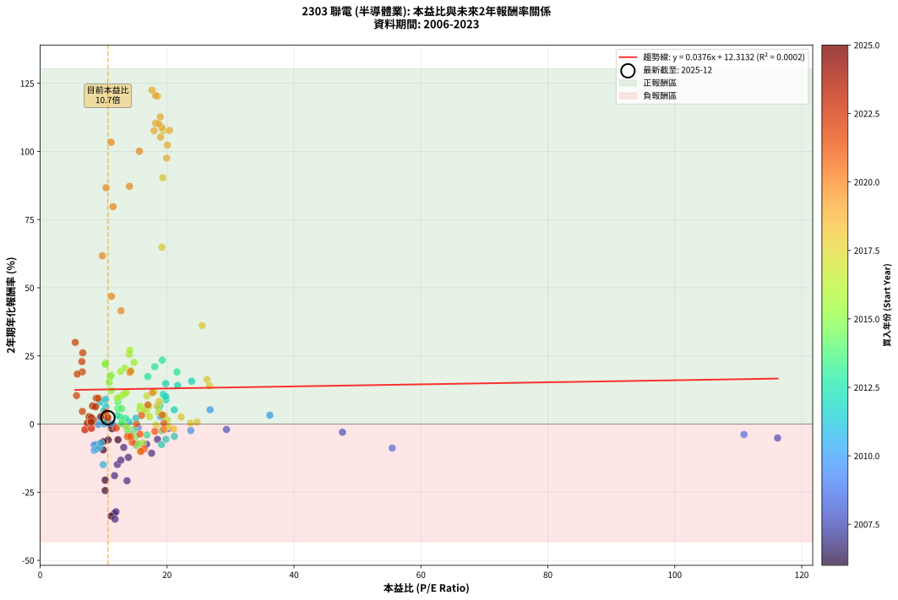
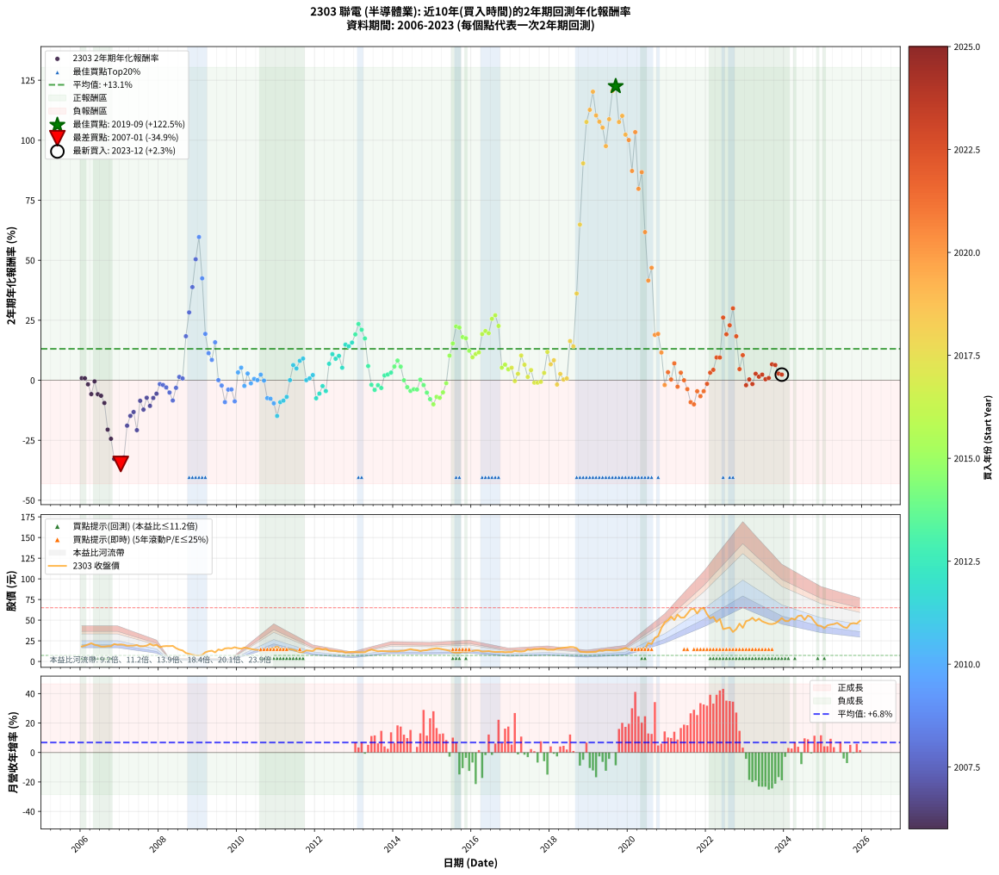

# 2303 聯電 - 本益比與未來報酬率分析

!!! info "報告資訊"
    - **股票代號**: 2303
    - **公司名稱**: 聯電
    - **產業別**: 半導體業
    - **分析期間**: 2006-2023 (216 個數據點)
    - **資料來源**: Type 12 (ShowMonthlyK_ChartFlow) 月收盤價與本益比
    - **報酬率口徑**: 含現金股利 (簡化: 年度合計，假設每年7/1入帳)
    - **報告生成時間**: 2026-01-11 18:22:34 CST

## 📈 視覺化圖表

### 圖表1: 本益比 vs 未來報酬率關係

*圖表1：2303 聯電 本益比與2年期未來報酬率關係 (2006-2023)*

### 圖表2: 歷年買入時點的2年期實際報酬率

*圖表2：2303 聯電 歷年買入時點的2年期實際報酬率 (2006-2023)*

## 📍 買點訊號說明

本報告提供兩種買點提示訊號（顯示於圖表2的股價子圖中）：

### ▲ 小綠色三角形（回測驗證）
- **計算方式**: 使用全部歷史資料計算本益比第25百分位數
- **用途**: 事後驗證，顯示歷史上哪些時點確實為低估區
- **限制**: 當下無法判斷，僅供回測參考
- **特性**: 後見之明（Look-Ahead Bias）

### ▲ 小橘色三角形（即時訊號）
- **計算方式**: 使用截至當月的過去5年資料計算本益比第25百分位數
- **用途**: 實際投資決策，當時即可判斷
- **優勢**: 可操作性強，符合實務需求
- **特性**: 無後見之明，滾動窗口計算

!!! tip "如何使用兩種訊號"
    - **綠色▲** 幫助理解歷史估值機會，驗證策略有效性
    - **橘色▲** 可作為實際買進參考，但仍需搭配基本面分析
    - 兩種訊號重疊時，表示即時判斷與事後驗證一致，信心度較高
    - 僅有綠色▲時，表示當時無法判斷（需要未來資料才能確認）
    - 僅有橘色▲時，表示即時判斷為買點，但事後可能不是最佳時機

## 📊 估值分析摘要

| 指標 | 數值 |
|:---:|:---:|
| **目前本益比** (2023-12) | **10.67 倍** |
| **歷史平均本益比** | 16.13 倍 |
| **估值水準** | 🟢 相對低估 |
| **預期2年年化報酬率** | **+12.71%** |
| **歷史平均報酬率** | +13.09% |
| **相關係數 (R²)** | 0.0002 |
| **趨勢線斜率** | 0.0376 |

!!! abstract "核心洞察"
    目前本益比顯著低於歷史平均，預期未來報酬率可能較高

    根據歷史數據回測，2303 聯電 在目前本益比 **10.7倍** 的估值水準下，
    預期未來2年年化報酬率約為 **+12.7%**。

    **重要提醒**: 本分析基於歷史數據統計，實際報酬率會受到公司基本面變化、產業趨勢、
    總體經濟環境等多重因素影響。R² = 0.00 表示本益比可解釋約 0.0% 的報酬率變異。

## 📈 歷史估值統計

### 最佳買點 (最高報酬率)

| 項目 | 數值 |
|:---:|:---:|
| 起始時間 | 2019-09 |
| 當時本益比 | 17.63 倍 |
| 起始價格 | 13.4 元 |
| 2年後價格 | 64.0 元 |
| **2年年化報酬率** | **+122.49%** |

### 最差買點 (最低報酬率)

| 項目 | 數值 |
|:---:|:---:|
| 起始時間 | 2007-01 |
| 當時本益比 | 11.80 倍 |
| 起始價格 | 20.6 元 |
| 2年後價格 | 7.3 元 |
| **2年年化報酬率** | **-34.89%** |

## 🎯 投資啟示

### 本益比與報酬率關係

趨勢線方程式: **y = 0.0376x + 12.3132**

!!! info "弱相關或正相關"
    本益比與未來報酬率相關性較弱。這可能表示該股票的報酬率更多受到
    公司成長性、產業趨勢等因素影響，而非估值水準。**需綜合考量多項指標**。

### 估值區間建議

基於歷史數據分析:

- **🟢 低估區** (P/E < 12.9): 預期報酬率較高，可考慮增加持股
- **🟡 合理區** (P/E 12.9-19.4): 預期報酬率符合長期趨勢，正常持有
- **🔴 高估區** (P/E > 19.4): 預期報酬率較低，可考慮減碼或觀望

!!! danger "風險提示"
    - 過去表現不代表未來結果
    - 本分析假設公司基本面無重大結構性變化
    - 產業環境劇變可能使歷史規律失效
    - 應結合公司財報、產業趨勢、總體經濟等多重因素綜合判斷

!!! success "長期投資觀點"
    歷史數據顯示，在合理或低估的估值水準買入並長期持有，
    往往能獲得較佳的投資報酬。**耐心等待好價格**是價值投資的核心原則。

## 📊 數據品質

- **資料來源**: GoodInfo.tw Type 12 (ShowMonthlyK_ChartFlow)
- **資料頻率**: 月度收盤價與本益比
- **回測期間**: 2006-2023
- **數據點數量**: 216 個 (每個點代表一次2年期回測)

### 計算方法說明

1. **2年期年化報酬率**:
   - 對每個歷史時點，計算其後2年的實際投資報酬率
   - 期末價值(不含股利): 期末價格
   - 期末價值(含現金股利): 期末價格 + 持有期間內的現金股利合計 (簡化: 年度合計，假設每年7/1入帳)
   - 公式: 年化報酬率 = [(期末價值/期初價格)^(1/年數) - 1] × 100%

2. **本益比 (P/E Ratio)**:
   - 使用當時的月收盤價與EPS計算
   - 資料來源: Type 12 月度河流圖本益比數據

3. **趨勢線 (Linear Regression)**:
   - 使用最小平方法擬合線性趨勢線
   - R²值衡量本益比對報酬率的解釋能力

---

*本報告由 Stock Analysis System v1.9.0 自動生成*
*數據更新時間: 2026-01-11 18:22:34 CST*

## 📋 月度回測明細表

（每一列對應時間線圖中的一個買入點；可用來對照 SVG 圖上的每個點。）

| 買入月份 | 賣出月份 | 回測期限_年 | 實際持有年數 | 買入本益比_倍 | 買入收盤價_元 | 賣出收盤價_元 | 現金股利合計_元 | 總報酬率_pct | 年化報酬率_pct |
| --- | --- | --- | --- | --- | --- | --- | --- | --- | --- |
| 2006-01 | 2008-01 | 2 | 1.999 | 10.03 | 18.15 | 17.35 | 1.11 | +1.70 | +0.85 |
| 2006-02 | 2008-02 | 2 | 1.999 | 10.58 | 19.15 | 18.35 | 1.11 | +1.61 | +0.80 |
| 2006-03 | 2008-03 | 2 | 2.001 | 11.33 | 20.50 | 18.70 | 1.11 | -3.37 | -1.70 |
| 2006-04 | 2008-04 | 2 | 2.001 | 12.27 | 22.20 | 18.60 | 1.11 | -11.22 | -5.77 |
| 2006-05 | 2008-05 | 2 | 2.001 | 11.16 | 20.20 | 18.90 | 1.11 | -0.95 | -0.47 |
| 2006-06 | 2008-06 | 2 | 2.001 | 10.72 | 19.40 | 16.10 | 1.11 | -11.29 | -5.81 |
| 2006-07 | 2008-07 | 2 | 2.001 | 9.94 | 18.00 | 14.30 | 1.45 | -12.50 | -6.45 |
| 2006-08 | 2008-08 | 2 | 2.001 | 9.94 | 18.00 | 13.30 | 1.45 | -18.06 | -9.47 |
| 2006-09 | 2008-09 | 2 | 2.001 | 10.25 | 18.55 | 10.25 | 1.45 | -36.93 | -20.57 |
| 2006-10 | 2008-10 | 2 | 2.001 | 10.25 | 18.55 | 9.15 | 1.45 | -42.86 | -24.39 |
| 2006-11 | 2008-11 | 2 | 2.001 | 11.69 | 21.15 | 8.10 | 1.45 | -54.85 | -32.79 |
| 2006-12 | 2008-12 | 2 | 2.001 | 11.19 | 20.25 | 7.43 | 1.45 | -56.15 | -33.76 |
| 2007-01 | 2009-01 | 2 | 2.001 | 11.80 | 20.65 | 7.30 | 1.45 | -57.63 | -34.89 |
| 2007-02 | 2009-02 | 2 | 2.001 | 11.95 | 20.20 | 7.84 | 1.45 | -54.01 | -32.17 |
| 2007-03 | 2009-03 | 2 | 2.001 | 11.72 | 19.10 | 11.10 | 1.45 | -34.29 | -18.93 |
| 2007-04 | 2009-04 | 2 | 2.001 | 12.17 | 19.10 | 12.40 | 1.45 | -27.49 | -14.84 |
| 2007-05 | 2009-05 | 2 | 2.001 | 12.72 | 19.20 | 13.00 | 1.45 | -24.74 | -13.24 |
| 2007-06 | 2009-06 | 2 | 2.001 | 13.69 | 19.85 | 11.00 | 1.45 | -37.28 | -20.79 |
| 2007-07 | 2009-07 | 2 | 2.001 | 13.17 | 18.30 | 14.55 | 0.75 | -16.39 | -8.56 |
| 2007-08 | 2009-08 | 2 | 2.001 | 13.91 | 18.50 | 13.50 | 0.75 | -22.97 | -12.23 |
| 2007-09 | 2009-09 | 2 | 2.001 | 15.12 | 19.20 | 15.75 | 0.75 | -14.06 | -7.29 |
| 2007-10 | 2009-10 | 2 | 2.001 | 17.56 | 21.25 | 16.20 | 0.75 | -20.24 | -10.68 |
| 2007-11 | 2009-11 | 2 | 2.001 | 16.78 | 19.30 | 15.80 | 0.75 | -14.25 | -7.39 |
| 2007-12 | 2009-12 | 2 | 2.001 | 18.49 | 20.15 | 17.20 | 0.75 | -10.92 | -5.61 |
| 2008-01 | 2010-01 | 2 | 2.001 | 20.23 | 17.35 | 16.05 | 0.75 | -3.17 | -1.60 |
| 2008-02 | 2010-03 | 2 | 2.081 | 29.36 | 18.35 | 16.85 | 0.75 | -4.09 | -1.99 |
| 2008-03 | 2010-03 | 2 | 1.999 | 47.64 | 18.70 | 16.85 | 0.75 | -5.88 | -2.99 |
| 2008-04 | 2010-04 | 2 | 1.999 | 116.20 | 18.60 | 16.00 | 0.75 | -9.95 | -5.11 |
| 2008-05 | 2010-05 | 2 | 1.999 |  | 18.90 | 15.10 | 0.75 | -16.14 | -8.43 |
| 2008-06 | 2010-06 | 2 | 1.999 |  | 16.10 | 14.35 | 0.75 | -6.21 | -3.16 |
| 2008-07 | 2010-07 | 2 | 1.999 |  | 14.30 | 14.20 | 0.50 | +2.80 | +1.39 |
| 2008-08 | 2010-08 | 2 | 1.999 |  | 13.30 | 13.00 | 0.50 | +1.50 | +0.75 |
| 2008-09 | 2010-09 | 2 | 1.999 |  | 10.25 | 13.85 | 0.50 | +40.00 | +18.34 |
| 2008-10 | 2010-10 | 2 | 1.999 |  | 9.15 | 14.55 | 0.50 | +64.48 | +28.27 |
| 2008-11 | 2010-11 | 2 | 1.999 |  | 8.10 | 15.10 | 0.50 | +92.59 | +38.81 |
| 2008-12 | 2010-12 | 2 | 1.999 |  | 7.43 | 16.30 | 0.50 | +126.11 | +50.41 |
| 2009-01 | 2011-01 | 2 | 1.999 |  | 7.30 | 18.10 | 0.50 | +154.79 | +59.67 |
| 2009-02 | 2011-02 | 2 | 1.999 |  | 7.84 | 15.40 | 0.50 | +102.81 | +42.44 |
| 2009-03 | 2011-03 | 2 | 1.999 |  | 11.10 | 15.30 | 0.50 | +42.34 | +19.32 |
| 2009-04 | 2011-04 | 2 | 1.999 |  | 12.40 | 14.85 | 0.50 | +23.79 | +11.27 |
| 2009-05 | 2011-05 | 2 | 1.999 |  | 13.00 | 14.80 | 0.50 | +17.69 | +8.49 |
| 2009-06 | 2011-06 | 2 | 1.999 |  | 11.00 | 14.25 | 0.50 | +34.09 | +15.81 |
| 2009-07 | 2011-07 | 2 | 1.999 |  | 14.55 | 12.95 | 1.61 | +0.08 | +0.04 |
| 2009-08 | 2011-08 | 2 | 1.999 |  | 13.50 | 11.30 | 1.61 | -4.36 | -2.20 |
| 2009-09 | 2011-09 | 2 | 1.999 |  | 15.75 | 11.40 | 1.61 | -17.38 | -9.11 |
| 2009-10 | 2011-10 | 2 | 1.999 |  | 16.20 | 13.35 | 1.61 | -7.64 | -3.90 |
| 2009-11 | 2011-11 | 2 | 1.999 | 110.90 | 15.80 | 13.00 | 1.61 | -7.52 | -3.84 |
| 2009-12 | 2011-12 | 2 | 1.999 | 55.48 | 17.20 | 12.70 | 1.61 | -16.79 | -8.79 |
| 2010-01 | 2012-01 | 2 | 1.999 | 36.20 | 16.05 | 15.50 | 1.61 | +6.62 | +3.26 |
| 2010-02 | 2012-02 | 2 | 1.999 | 26.79 | 15.45 | 15.50 | 1.61 | +10.76 | +5.24 |
| 2010-03 | 2012-03 | 2 | 2.001 | 23.73 | 16.85 | 14.45 | 1.61 | -4.68 | -2.36 |
| 2010-04 | 2012-04 | 2 | 2.001 | 18.97 | 16.00 | 15.30 | 1.61 | +5.70 | +2.81 |
| 2010-05 | 2012-05 | 2 | 2.001 | 15.46 | 15.10 | 13.10 | 1.61 | -2.57 | -1.29 |
| 2010-06 | 2012-06 | 2 | 2.001 | 12.93 | 14.35 | 12.90 | 1.61 | +1.13 | +0.56 |
| 2010-07 | 2012-07 | 2 | 2.001 | 11.42 | 14.20 | 12.60 | 1.61 | +0.08 | +0.04 |
| 2010-08 | 2012-08 | 2 | 2.001 | 9.44 | 13.00 | 12.00 | 1.61 | +4.71 | +2.33 |
| 2010-09 | 2012-09 | 2 | 2.001 | 9.17 | 13.85 | 12.20 | 1.61 | -0.27 | -0.14 |
| 2010-10 | 2012-10 | 2 | 2.001 | 8.85 | 14.55 | 10.85 | 1.61 | -14.35 | -7.45 |
| 2010-11 | 2012-11 | 2 | 2.001 | 8.50 | 15.10 | 11.25 | 1.61 | -14.82 | -7.70 |
| 2010-12 | 2012-12 | 2 | 2.001 | 8.53 | 16.30 | 11.70 | 1.61 | -18.33 | -9.62 |
| 2011-01 | 2013-01 | 2 | 2.001 | 9.94 | 18.10 | 11.50 | 1.61 | -27.56 | -14.88 |
| 2011-02 | 2013-02 | 2 | 2.001 | 8.89 | 15.40 | 11.10 | 1.61 | -17.45 | -9.14 |
| 2011-03 | 2013-03 | 2 | 2.001 | 9.32 | 15.30 | 11.20 | 1.61 | -16.26 | -8.49 |
| 2011-04 | 2013-04 | 2 | 2.001 | 9.56 | 14.85 | 11.25 | 1.61 | -13.39 | -6.93 |
| 2011-05 | 2013-05 | 2 | 2.001 | 10.11 | 14.80 | 13.20 | 1.61 | +0.08 | +0.04 |
| 2011-06 | 2013-06 | 2 | 2.001 | 10.36 | 14.25 | 14.50 | 1.61 | +13.07 | +6.33 |
| 2011-07 | 2013-07 | 2 | 2.001 | 10.07 | 12.95 | 13.35 | 0.91 | +10.08 | +4.92 |
| 2011-08 | 2013-08 | 2 | 2.001 | 9.44 | 11.30 | 12.30 | 0.91 | +16.87 | +8.10 |
| 2011-09 | 2013-09 | 2 | 2.001 | 10.29 | 11.40 | 12.65 | 0.91 | +18.91 | +9.04 |
| 2011-10 | 2013-10 | 2 | 2.001 | 13.11 | 13.35 | 12.45 | 0.91 | +0.04 | +0.02 |
| 2011-11 | 2013-11 | 2 | 2.001 | 13.99 | 13.00 | 12.30 | 0.91 | +1.58 | +0.79 |
| 2011-12 | 2013-12 | 2 | 2.001 | 15.12 | 12.70 | 12.35 | 0.91 | +4.38 | +2.16 |
| 2012-01 | 2014-01 | 2 | 2.001 | 19.12 | 15.50 | 12.35 | 0.91 | -14.48 | -7.52 |
| 2012-02 | 2014-03 | 2 | 2.081 | 19.83 | 15.50 | 12.85 | 0.91 | -11.25 | -5.58 |
| 2012-03 | 2014-03 | 2 | 1.999 | 19.20 | 14.45 | 12.85 | 0.91 | -4.80 | -2.43 |
| 2012-04 | 2014-04 | 2 | 1.999 | 21.15 | 15.30 | 13.05 | 0.91 | -8.78 | -4.50 |
| 2012-05 | 2014-05 | 2 | 1.999 | 18.87 | 13.10 | 14.05 | 0.91 | +14.17 | +6.85 |
| 2012-06 | 2014-06 | 2 | 1.999 | 19.40 | 12.90 | 14.95 | 0.91 | +22.91 | +10.87 |
| 2012-07 | 2014-07 | 2 | 1.999 | 19.82 | 12.60 | 14.05 | 0.91 | +18.70 | +8.96 |
| 2012-08 | 2014-08 | 2 | 1.999 | 19.78 | 12.00 | 13.65 | 0.91 | +21.30 | +10.14 |
| 2012-09 | 2014-09 | 2 | 1.999 | 21.13 | 12.20 | 12.60 | 0.91 | +10.70 | +5.22 |
| 2012-10 | 2014-10 | 2 | 1.999 | 19.79 | 10.85 | 13.40 | 0.91 | +31.85 | +14.84 |
| 2012-11 | 2014-11 | 2 | 1.999 | 21.67 | 11.25 | 13.75 | 0.91 | +30.28 | +14.15 |
| 2012-12 | 2014-12 | 2 | 1.999 | 23.88 | 11.70 | 14.75 | 0.91 | +33.81 | +15.69 |
| 2013-01 | 2015-01 | 2 | 1.999 | 21.56 | 11.50 | 15.40 | 0.91 | +41.79 | +19.09 |
| 2013-02 | 2015-02 | 2 | 1.999 | 19.25 | 11.10 | 16.00 | 0.91 | +52.31 | +23.43 |
| 2013-03 | 2015-03 | 2 | 1.999 | 18.06 | 11.20 | 15.50 | 0.91 | +46.48 | +21.05 |
| 2013-04 | 2015-04 | 2 | 1.999 | 16.96 | 11.25 | 14.60 | 0.91 | +37.83 | +17.41 |
| 2013-05 | 2015-05 | 2 | 1.999 | 18.68 | 13.20 | 13.90 | 0.91 | +12.17 | +5.91 |
| 2013-06 | 2015-06 | 2 | 1.999 | 19.33 | 14.50 | 13.05 | 0.91 | -3.75 | -1.90 |
| 2013-07 | 2015-07 | 2 | 1.999 | 16.83 | 13.35 | 11.25 | 1.05 | -7.87 | -4.02 |
| 2013-08 | 2015-08 | 2 | 1.999 | 14.70 | 12.30 | 10.75 | 1.05 | -4.07 | -2.05 |
| 2013-09 | 2015-09 | 2 | 1.999 | 14.38 | 12.65 | 10.80 | 1.05 | -6.32 | -3.22 |
| 2013-10 | 2015-10 | 2 | 1.999 | 13.48 | 12.45 | 11.90 | 1.05 | +4.02 | +1.99 |
| 2013-11 | 2015-11 | 2 | 1.999 | 12.72 | 12.30 | 11.85 | 1.05 | +4.88 | +2.41 |
| 2013-12 | 2015-12 | 2 | 1.999 | 12.23 | 12.35 | 12.10 | 1.05 | +6.48 | +3.19 |
| 2014-01 | 2016-01 | 2 | 1.999 | 12.27 | 12.35 | 12.75 | 1.05 | +11.74 | +5.71 |
| 2014-02 | 2016-02 | 2 | 1.999 | 12.26 | 12.30 | 13.35 | 1.05 | +17.07 | +8.21 |
| 2014-03 | 2016-03 | 2 | 2.001 | 12.85 | 12.85 | 13.30 | 1.05 | +11.67 | +5.67 |
| 2014-04 | 2016-04 | 2 | 2.001 | 13.09 | 13.05 | 12.00 | 1.05 | +0.00 | +0.00 |
| 2014-05 | 2016-05 | 2 | 2.001 | 14.14 | 14.05 | 12.20 | 1.05 | -5.69 | -2.89 |
| 2014-06 | 2016-06 | 2 | 2.001 | 15.10 | 14.95 | 12.60 | 1.05 | -8.70 | -4.44 |
| 2014-07 | 2016-07 | 2 | 2.001 | 14.24 | 14.05 | 11.90 | 1.11 | -7.37 | -3.75 |
| 2014-08 | 2016-08 | 2 | 2.001 | 13.88 | 13.65 | 11.50 | 1.11 | -7.58 | -3.86 |
| 2014-09 | 2016-09 | 2 | 2.001 | 12.86 | 12.60 | 11.55 | 1.11 | +0.52 | +0.26 |
| 2014-10 | 2016-10 | 2 | 2.001 | 13.72 | 13.40 | 11.75 | 1.11 | -3.99 | -2.02 |
| 2014-11 | 2016-11 | 2 | 2.001 | 14.13 | 13.75 | 11.25 | 1.11 | -10.07 | -5.17 |
| 2014-12 | 2016-12 | 2 | 2.001 | 15.21 | 14.75 | 11.40 | 1.11 | -15.15 | -7.88 |
| 2015-01 | 2017-01 | 2 | 2.001 | 15.73 | 15.40 | 11.35 | 1.11 | -19.06 | -10.03 |
| 2015-02 | 2017-02 | 2 | 2.001 | 16.19 | 16.00 | 12.75 | 1.11 | -13.34 | -6.91 |
| 2015-03 | 2017-03 | 2 | 2.001 | 15.54 | 15.50 | 12.20 | 1.11 | -14.10 | -7.31 |
| 2015-04 | 2017-04 | 2 | 2.001 | 14.50 | 14.60 | 12.05 | 1.11 | -9.83 | -5.04 |
| 2015-05 | 2017-05 | 2 | 2.001 | 13.68 | 13.90 | 12.45 | 1.11 | -2.41 | -1.21 |
| 2015-06 | 2017-06 | 2 | 2.001 | 12.73 | 13.05 | 14.75 | 1.11 | +21.57 | +10.25 |
| 2015-07 | 2017-07 | 2 | 2.001 | 10.88 | 11.25 | 13.90 | 1.06 | +33.02 | +15.32 |
| 2015-08 | 2017-08 | 2 | 2.001 | 10.30 | 10.75 | 15.05 | 1.06 | +49.91 | +22.42 |
| 2015-09 | 2017-09 | 2 | 2.001 | 10.26 | 10.80 | 15.00 | 1.06 | +48.75 | +21.95 |
| 2015-10 | 2017-10 | 2 | 2.001 | 11.21 | 11.90 | 15.50 | 1.06 | +39.20 | +17.97 |
| 2015-11 | 2017-11 | 2 | 2.001 | 11.07 | 11.85 | 15.30 | 1.06 | +38.10 | +17.50 |
| 2015-12 | 2017-12 | 2 | 2.001 | 11.20 | 12.10 | 14.20 | 1.06 | +26.16 | +12.31 |
| 2016-01 | 2018-01 | 2 | 2.001 | 12.18 | 12.75 | 14.25 | 1.06 | +20.12 | +9.59 |
| 2016-02 | 2018-03 | 2 | 2.081 | 13.17 | 13.35 | 15.50 | 1.06 | +24.08 | +10.93 |
| 2016-03 | 2018-03 | 2 | 1.999 | 13.57 | 13.30 | 15.50 | 1.06 | +24.55 | +11.61 |
| 2016-04 | 2018-04 | 2 | 1.999 | 12.68 | 12.00 | 16.00 | 1.06 | +42.21 | +19.27 |
| 2016-05 | 2018-05 | 2 | 1.999 | 13.36 | 12.20 | 16.65 | 1.06 | +45.20 | +20.52 |
| 2016-06 | 2018-06 | 2 | 1.999 | 14.32 | 12.60 | 16.95 | 1.06 | +42.98 | +19.59 |
| 2016-07 | 2018-07 | 2 | 1.999 | 14.06 | 11.90 | 17.55 | 1.21 | +57.66 | +25.58 |
| 2016-08 | 2018-08 | 2 | 1.999 | 14.14 | 11.50 | 17.35 | 1.21 | +61.41 | +27.07 |
| 2016-09 | 2018-09 | 2 | 1.999 | 14.81 | 11.55 | 16.15 | 1.21 | +50.32 | +22.62 |
| 2016-10 | 2018-10 | 2 | 1.999 | 15.74 | 11.75 | 11.80 | 1.21 | +10.74 | +5.24 |
| 2016-11 | 2018-11 | 2 | 1.999 | 15.77 | 11.25 | 11.55 | 1.21 | +13.44 | +6.51 |
| 2016-12 | 2018-12 | 2 | 1.999 | 16.76 | 11.40 | 11.25 | 1.21 | +9.32 | +4.56 |
| 2017-01 | 2019-01 | 2 | 1.999 | 16.47 | 11.35 | 11.35 | 1.21 | +10.68 | +5.21 |
| 2017-02 | 2019-02 | 2 | 1.999 | 18.26 | 12.75 | 11.45 | 1.21 | -0.69 | -0.35 |
| 2017-03 | 2019-03 | 2 | 1.999 | 17.24 | 12.20 | 11.65 | 1.21 | +5.43 | +2.68 |
| 2017-04 | 2019-04 | 2 | 1.999 | 16.81 | 12.05 | 13.45 | 1.21 | +21.68 | +10.31 |
| 2017-05 | 2019-05 | 2 | 1.999 | 17.15 | 12.45 | 12.90 | 1.21 | +13.35 | +6.47 |
| 2017-06 | 2019-06 | 2 | 1.999 | 20.07 | 14.75 | 13.95 | 1.21 | +2.79 | +1.39 |
| 2017-07 | 2019-07 | 2 | 1.999 | 18.68 | 13.90 | 13.80 | 1.30 | +8.65 | +4.24 |
| 2017-08 | 2019-08 | 2 | 1.999 | 19.98 | 15.05 | 13.45 | 1.30 | -1.98 | -1.00 |
| 2017-09 | 2019-09 | 2 | 1.999 | 19.67 | 15.00 | 13.40 | 1.30 | -1.99 | -1.00 |
| 2017-10 | 2019-10 | 2 | 1.999 | 20.09 | 15.50 | 14.00 | 1.30 | -1.28 | -0.64 |
| 2017-11 | 2019-11 | 2 | 1.999 | 19.59 | 15.30 | 14.95 | 1.30 | +6.22 | +3.07 |
| 2017-12 | 2019-12 | 2 | 1.999 | 17.97 | 14.20 | 16.45 | 1.30 | +25.01 | +11.82 |
| 2018-01 | 2020-01 | 2 | 1.999 | 18.45 | 14.25 | 14.90 | 1.30 | +13.70 | +6.63 |
| 2018-02 | 2020-02 | 2 | 1.999 | 18.74 | 14.15 | 15.30 | 1.30 | +17.33 | +8.32 |
| 2018-03 | 2020-03 | 2 | 2.001 | 21.02 | 15.50 | 13.65 | 1.30 | -3.54 | -1.78 |
| 2018-04 | 2020-04 | 2 | 2.001 | 22.22 | 16.00 | 15.55 | 1.30 | +5.33 | +2.63 |
| 2018-05 | 2020-05 | 2 | 2.001 | 23.70 | 16.65 | 15.45 | 1.30 | +0.61 | +0.31 |
| 2018-06 | 2020-06 | 2 | 2.001 | 24.74 | 16.95 | 15.90 | 1.30 | +1.49 | +0.74 |
| 2018-07 | 2020-07 | 2 | 2.001 | 26.29 | 17.55 | 22.35 | 1.39 | +35.29 | +16.30 |
| 2018-08 | 2020-08 | 2 | 2.001 | 26.69 | 17.35 | 21.20 | 1.39 | +30.22 | +14.11 |
| 2018-09 | 2020-09 | 2 | 2.001 | 25.53 | 16.15 | 28.55 | 1.39 | +85.41 | +36.14 |
| 2018-10 | 2020-10 | 2 | 2.001 | 19.19 | 11.80 | 30.70 | 1.39 | +171.98 | +64.86 |
| 2018-11 | 2020-11 | 2 | 2.001 | 19.33 | 11.55 | 40.50 | 1.39 | +262.72 | +90.37 |
| 2018-12 | 2020-12 | 2 | 2.001 | 19.40 | 11.25 | 47.15 | 1.39 | +331.50 | +107.62 |
| 2019-01 | 2021-01 | 2 | 2.001 | 18.92 | 11.35 | 50.00 | 1.39 | +352.81 | +112.68 |
| 2019-02 | 2021-02 | 2 | 2.001 | 18.47 | 11.45 | 54.20 | 1.39 | +385.54 | +120.23 |
| 2019-03 | 2021-03 | 2 | 2.001 | 18.20 | 11.65 | 50.20 | 1.39 | +342.87 | +110.34 |
| 2019-04 | 2021-04 | 2 | 2.001 | 20.38 | 13.45 | 56.70 | 1.39 | +331.93 | +107.72 |
| 2019-05 | 2021-05 | 2 | 2.001 | 18.97 | 12.90 | 53.00 | 1.39 | +321.66 | +105.24 |
| 2019-06 | 2021-06 | 2 | 2.001 | 19.93 | 13.95 | 53.10 | 1.39 | +290.64 | +97.55 |
| 2019-07 | 2021-07 | 2 | 2.001 | 19.17 | 13.80 | 57.80 | 2.40 | +336.26 | +108.76 |
| 2019-08 | 2021-08 | 2 | 2.001 | 18.18 | 13.45 | 63.10 | 2.40 | +387.02 | +120.57 |
| 2019-09 | 2021-09 | 2 | 2.001 | 17.63 | 13.40 | 64.00 | 2.40 | +395.55 | +122.49 |
| 2019-10 | 2021-10 | 2 | 2.001 | 17.95 | 14.00 | 58.00 | 2.40 | +331.46 | +107.61 |
| 2019-11 | 2021-11 | 2 | 2.001 | 18.69 | 14.95 | 63.70 | 2.40 | +342.17 | +110.17 |
| 2019-12 | 2021-12 | 2 | 2.001 | 20.06 | 16.45 | 65.00 | 2.40 | +309.75 | +102.33 |
| 2020-01 | 2022-01 | 2 | 2.001 | 15.63 | 14.90 | 57.30 | 2.40 | +300.70 | +100.08 |
| 2020-02 | 2022-03 | 2 | 2.081 | 14.08 | 15.30 | 54.00 | 2.40 | +268.65 | +87.20 |
| 2020-03 | 2022-03 | 2 | 1.999 | 11.19 | 13.65 | 54.00 | 2.40 | +313.22 | +103.38 |
| 2020-04 | 2022-04 | 2 | 1.999 | 11.49 | 15.55 | 47.80 | 2.40 | +222.86 | +79.75 |
| 2020-05 | 2022-05 | 2 | 1.999 | 10.39 | 15.45 | 51.40 | 2.40 | +248.25 | +86.69 |
| 2020-06 | 2022-06 | 2 | 1.999 | 9.81 | 15.90 | 39.15 | 2.40 | +161.35 | +61.72 |
| 2020-07 | 2022-07 | 2 | 1.999 | 12.75 | 22.35 | 40.15 | 4.60 | +100.22 | +41.53 |
| 2020-08 | 2022-08 | 2 | 1.999 | 11.24 | 21.20 | 41.10 | 4.60 | +115.57 | +46.86 |
| 2020-09 | 2022-09 | 2 | 1.999 | 14.13 | 28.55 | 35.75 | 4.60 | +41.33 | +18.90 |
| 2020-10 | 2022-10 | 2 | 1.999 | 14.26 | 30.70 | 39.10 | 4.60 | +42.35 | +19.32 |
| 2020-11 | 2022-11 | 2 | 1.999 | 17.71 | 40.50 | 45.80 | 4.60 | +24.44 | +11.56 |
| 2020-12 | 2022-12 | 2 | 1.999 | 19.48 | 47.15 | 40.70 | 4.60 | -3.92 | -1.98 |
| 2021-01 | 2023-01 | 2 | 1.999 | 19.24 | 50.00 | 48.80 | 4.60 | +6.80 | +3.35 |
| 2021-02 | 2023-02 | 2 | 1.999 | 19.51 | 54.20 | 49.95 | 4.60 | +0.65 | +0.32 |
| 2021-03 | 2023-03 | 2 | 1.999 | 16.97 | 50.20 | 52.90 | 4.60 | +14.54 | +7.03 |
| 2021-04 | 2023-04 | 2 | 1.999 | 18.08 | 56.70 | 49.10 | 4.60 | -5.29 | -2.68 |
| 2021-05 | 2023-05 | 2 | 1.999 | 15.98 | 53.00 | 51.80 | 4.60 | +6.42 | +3.16 |
| 2021-06 | 2023-06 | 2 | 1.999 | 15.19 | 53.10 | 48.50 | 4.60 | +0.00 | +0.00 |
| 2021-07 | 2023-07 | 2 | 1.999 | 15.73 | 57.80 | 47.00 | 6.60 | -7.27 | -3.70 |
| 2021-08 | 2023-08 | 2 | 1.999 | 16.38 | 63.10 | 45.50 | 6.60 | -17.43 | -9.14 |
| 2021-09 | 2023-09 | 2 | 1.999 | 15.87 | 64.00 | 45.20 | 6.60 | -19.06 | -10.04 |
| 2021-10 | 2023-10 | 2 | 1.999 | 13.77 | 58.00 | 46.20 | 6.60 | -8.97 | -4.59 |
| 2021-11 | 2023-11 | 2 | 1.999 | 14.51 | 63.70 | 48.90 | 6.60 | -12.87 | -6.66 |
| 2021-12 | 2023-12 | 2 | 1.999 | 14.22 | 65.00 | 52.60 | 6.60 | -8.92 | -4.57 |
| 2022-01 | 2024-01 | 2 | 1.999 | 11.99 | 57.30 | 49.00 | 6.60 | -2.97 | -1.50 |
| 2022-02 | 2024-02 | 2 | 1.999 | 10.44 | 52.10 | 48.85 | 6.60 | +6.43 | +3.17 |
| 2022-03 | 2024-03 | 2 | 2.001 | 10.38 | 54.00 | 52.20 | 6.60 | +8.89 | +4.35 |
| 2022-04 | 2024-04 | 2 | 2.001 | 8.84 | 47.80 | 50.70 | 6.60 | +19.87 | +9.48 |
| 2022-05 | 2024-05 | 2 | 2.001 | 9.15 | 51.40 | 55.00 | 6.60 | +19.84 | +9.47 |
| 2022-06 | 2024-06 | 2 | 2.001 | 6.72 | 39.15 | 55.70 | 6.60 | +59.13 | +26.13 |
| 2022-07 | 2024-07 | 2 | 2.001 | 6.65 | 40.15 | 50.40 | 6.60 | +41.97 | +19.14 |
| 2022-08 | 2024-08 | 2 | 2.001 | 6.58 | 41.10 | 55.50 | 6.60 | +51.09 | +22.90 |
| 2022-09 | 2024-09 | 2 | 2.001 | 5.53 | 35.75 | 53.80 | 6.60 | +68.95 | +29.96 |
| 2022-10 | 2024-10 | 2 | 2.001 | 5.86 | 39.10 | 48.15 | 6.60 | +40.03 | +18.32 |
| 2022-11 | 2024-11 | 2 | 2.001 | 6.66 | 45.80 | 43.55 | 6.60 | +9.50 | +4.64 |
| 2022-12 | 2024-12 | 2 | 2.001 | 5.74 | 40.70 | 43.05 | 6.60 | +21.99 | +10.44 |
| 2023-01 | 2025-01 | 2 | 2.001 | 7.06 | 48.80 | 40.20 | 6.60 | -4.10 | -2.07 |
| 2023-02 | 2025-02 | 2 | 2.001 | 7.42 | 49.95 | 43.70 | 6.60 | +0.70 | +0.35 |
| 2023-03 | 2025-03 | 2 | 2.001 | 8.08 | 52.90 | 44.65 | 6.60 | -3.12 | -1.57 |
| 2023-04 | 2025-04 | 2 | 2.001 | 7.71 | 49.10 | 45.20 | 6.60 | +5.50 | +2.71 |
| 2023-05 | 2025-05 | 2 | 2.001 | 8.37 | 51.80 | 46.75 | 6.60 | +2.99 | +1.48 |
| 2023-06 | 2025-06 | 2 | 2.001 | 8.07 | 48.50 | 44.20 | 6.60 | +4.74 | +2.34 |
| 2023-07 | 2025-07 | 2 | 2.001 | 8.06 | 47.00 | 41.55 | 5.85 | +0.85 | +0.42 |
| 2023-08 | 2025-08 | 2 | 2.001 | 8.05 | 45.50 | 40.50 | 5.85 | +1.87 | +0.93 |
| 2023-09 | 2025-09 | 2 | 2.001 | 8.26 | 45.20 | 45.55 | 5.85 | +13.72 | +6.63 |
| 2023-10 | 2025-10 | 2 | 2.001 | 8.73 | 46.20 | 46.40 | 5.85 | +13.10 | +6.34 |
| 2023-11 | 2025-11 | 2 | 2.001 | 9.57 | 48.90 | 45.80 | 5.85 | +5.62 | +2.77 |
| 2023-12 | 2025-12 | 2 | 2.001 | 10.67 | 52.60 | 49.25 | 5.85 | +4.75 | +2.35 |
