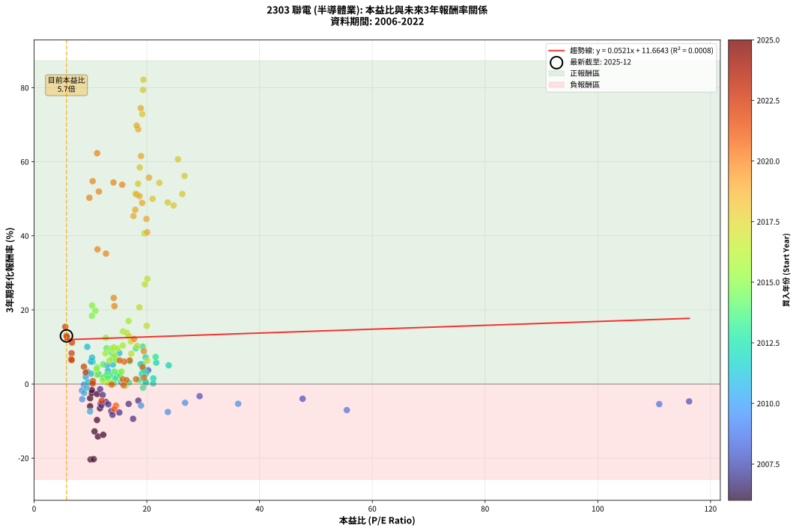
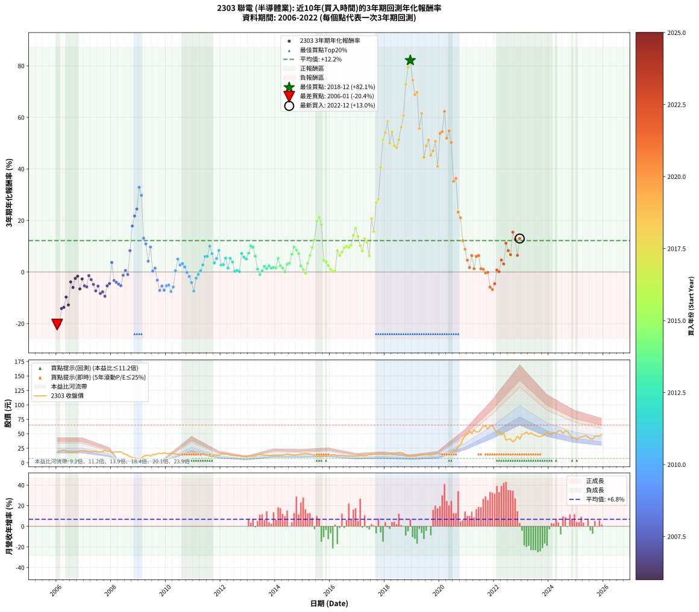

# 2303 聯電 - 本益比與未來報酬率分析

!!! info "報告資訊"
    - **股票代號**: 2303
    - **公司名稱**: 聯電
    - **產業別**: 半導體業
    - **分析期間**: 2006-2022 (204 個數據點)
    - **資料來源**: Type 12 (ShowMonthlyK_ChartFlow) 月收盤價與本益比
    - **報酬率口徑**: 含現金股利 (簡化: 年度合計，假設每年7/1入帳)
    - **報告生成時間**: 2026-01-09 20:30:59 CST

## 📈 視覺化圖表

### 圖表1: 本益比 vs 未來報酬率關係

*圖表1：2303 聯電 本益比與3年期未來報酬率關係 (2006-2022)*

### 圖表2: 歷年買入時點的3年期實際報酬率

*圖表2：2303 聯電 歷年買入時點的3年期實際報酬率 (2006-2022)*

## 📍 買點訊號說明

本報告提供兩種買點提示訊號（顯示於圖表2的股價子圖中）：

### ▲ 小綠色三角形（回測驗證）
- **計算方式**: 使用全部歷史資料計算本益比第25百分位數
- **用途**: 事後驗證，顯示歷史上哪些時點確實為低估區
- **限制**: 當下無法判斷，僅供回測參考
- **特性**: 後見之明（Look-Ahead Bias）

### ▲ 小橘色三角形（即時訊號）
- **計算方式**: 使用截至當月的過去5年資料計算本益比第25百分位數
- **用途**: 實際投資決策，當時即可判斷
- **優勢**: 可操作性強，符合實務需求
- **特性**: 無後見之明，滾動窗口計算

!!! tip "如何使用兩種訊號"
    - **綠色▲** 幫助理解歷史估值機會，驗證策略有效性
    - **橘色▲** 可作為實際買進參考，但仍需搭配基本面分析
    - 兩種訊號重疊時，表示即時判斷與事後驗證一致，信心度較高
    - 僅有綠色▲時，表示當時無法判斷（需要未來資料才能確認）
    - 僅有橘色▲時，表示即時判斷為買點，但事後可能不是最佳時機

## 📊 估值分析摘要

| 指標 | 數值 |
|:---:|:---:|
| **目前本益比** (2022-12) | **5.74 倍** |
| **歷史平均本益比** | 16.63 倍 |
| **估值水準** | 🟢 相對低估 |
| **預期3年年化報酬率** | **+11.96%** |
| **歷史平均報酬率** | +12.20% |
| **相關係數 (R²)** | 0.0008 |
| **趨勢線斜率** | 0.0521 |

!!! abstract "核心洞察"
    目前本益比顯著低於歷史平均，預期未來報酬率可能較高

    根據歷史數據回測，2303 聯電 在目前本益比 **5.7倍** 的估值水準下，
    預期未來3年年化報酬率約為 **+12.0%**。

    **重要提醒**: 本分析基於歷史數據統計，實際報酬率會受到公司基本面變化、產業趨勢、
    總體經濟環境等多重因素影響。R² = 0.00 表示本益比可解釋約 0.1% 的報酬率變異。

## 📈 歷史估值統計

### 最佳買點 (最高報酬率)

| 項目 | 數值 |
|:---:|:---:|
| 起始時間 | 2018-12 |
| 當時本益比 | 19.40 倍 |
| 起始價格 | 11.2 元 |
| 3年後價格 | 65.0 元 |
| **3年年化報酬率** | **+82.13%** |

### 最差買點 (最低報酬率)

| 項目 | 數值 |
|:---:|:---:|
| 起始時間 | 2006-01 |
| 當時本益比 | 10.03 倍 |
| 起始價格 | 18.1 元 |
| 3年後價格 | 7.3 元 |
| **3年年化報酬率** | **-20.38%** |

## 🎯 投資啟示

### 本益比與報酬率關係

趨勢線方程式: **y = 0.0521x + 11.6643**

!!! info "弱相關或正相關"
    本益比與未來報酬率相關性較弱。這可能表示該股票的報酬率更多受到
    公司成長性、產業趨勢等因素影響，而非估值水準。**需綜合考量多項指標**。

### 估值區間建議

基於歷史數據分析:

- **🟢 低估區** (P/E < 13.3): 預期報酬率較高，可考慮增加持股
- **🟡 合理區** (P/E 13.3-20.0): 預期報酬率符合長期趨勢，正常持有
- **🔴 高估區** (P/E > 20.0): 預期報酬率較低，可考慮減碼或觀望

!!! danger "風險提示"
    - 過去表現不代表未來結果
    - 本分析假設公司基本面無重大結構性變化
    - 產業環境劇變可能使歷史規律失效
    - 應結合公司財報、產業趨勢、總體經濟等多重因素綜合判斷

!!! success "長期投資觀點"
    歷史數據顯示，在合理或低估的估值水準買入並長期持有，
    往往能獲得較佳的投資報酬。**耐心等待好價格**是價值投資的核心原則。

## 📊 數據品質

- **資料來源**: GoodInfo.tw Type 12 (ShowMonthlyK_ChartFlow)
- **資料頻率**: 月度收盤價與本益比
- **回測期間**: 2006-2022
- **數據點數量**: 204 個 (每個點代表一次3年期回測)

### 計算方法說明

1. **3年期年化報酬率**:
   - 對每個歷史時點，計算其後3年的實際投資報酬率
   - 期末價值(不含股利): 期末價格
   - 期末價值(含現金股利): 期末價格 + 持有期間內的現金股利合計 (簡化: 年度合計，假設每年7/1入帳)
   - 公式: 年化報酬率 = [(期末價值/期初價格)^(1/年數) - 1] × 100%

2. **本益比 (P/E Ratio)**:
   - 使用當時的月收盤價與EPS計算
   - 資料來源: Type 12 月度河流圖本益比數據

3. **趨勢線 (Linear Regression)**:
   - 使用最小平方法擬合線性趨勢線
   - R²值衡量本益比對報酬率的解釋能力

---

*本報告由 Stock Analysis System v1.9.0 自動生成*
*數據更新時間: 2026-01-09 20:30:59 CST*

## 📋 月度回測明細表

（每一列對應時間線圖中的一個買入點；可用來對照 SVG 圖上的每個點。）

| 買入月份 | 賣出月份 | 回測期限_年 | 實際持有年數 | 買入本益比_倍 | 買入收盤價_元 | 賣出收盤價_元 | 現金股利合計_元 | 總報酬率_pct | 年化報酬率_pct |
| --- | --- | --- | --- | --- | --- | --- | --- | --- | --- |
| 2006-01 | 2009-01 | 3 | 3.001 | 10.03 | 18.15 | 7.30 | 1.86 | -49.54 | -20.38 |
| 2006-02 | 2009-02 | 3 | 3.001 | 10.58 | 19.15 | 7.84 | 1.86 | -49.35 | -20.28 |
| 2006-03 | 2009-03 | 3 | 3.001 | 11.33 | 20.50 | 11.10 | 1.86 | -36.79 | -14.17 |
| 2006-04 | 2009-04 | 3 | 3.001 | 12.27 | 22.20 | 12.40 | 1.86 | -35.77 | -13.72 |
| 2006-05 | 2009-05 | 3 | 3.001 | 11.16 | 20.20 | 13.00 | 1.86 | -26.44 | -9.73 |
| 2006-06 | 2009-06 | 3 | 3.001 | 10.72 | 19.40 | 11.00 | 1.86 | -33.72 | -12.81 |
| 2006-07 | 2009-07 | 3 | 3.001 | 9.94 | 18.00 | 14.55 | 1.45 | -11.11 | -3.85 |
| 2006-08 | 2009-08 | 3 | 3.001 | 9.94 | 18.00 | 13.50 | 1.45 | -16.94 | -6.00 |
| 2006-09 | 2009-09 | 3 | 3.001 | 10.25 | 18.55 | 15.75 | 1.45 | -7.28 | -2.49 |
| 2006-10 | 2009-10 | 3 | 3.001 | 10.25 | 18.55 | 16.20 | 1.45 | -4.85 | -1.64 |
| 2006-11 | 2009-11 | 3 | 3.001 | 11.69 | 21.15 | 15.80 | 1.45 | -18.44 | -6.57 |
| 2006-12 | 2009-12 | 3 | 3.001 | 11.19 | 20.25 | 17.20 | 1.45 | -7.90 | -2.71 |
| 2007-01 | 2010-01 | 3 | 3.001 | 11.80 | 20.65 | 16.05 | 1.45 | -15.25 | -5.37 |
| 2007-02 | 2010-02 | 3 | 3.001 | 11.95 | 20.20 | 15.45 | 1.45 | -16.34 | -5.77 |
| 2007-03 | 2010-03 | 3 | 3.001 | 11.72 | 19.10 | 16.85 | 1.45 | -4.19 | -1.42 |
| 2007-04 | 2010-04 | 3 | 3.001 | 12.17 | 19.10 | 16.00 | 1.45 | -8.64 | -2.97 |
| 2007-05 | 2010-05 | 3 | 3.001 | 12.72 | 19.20 | 15.10 | 1.45 | -13.80 | -4.83 |
| 2007-06 | 2010-06 | 3 | 3.001 | 13.69 | 19.85 | 14.35 | 1.45 | -20.40 | -7.32 |
| 2007-07 | 2010-07 | 3 | 3.001 | 13.17 | 18.30 | 14.20 | 1.25 | -15.57 | -5.49 |
| 2007-08 | 2010-08 | 3 | 3.001 | 13.91 | 18.50 | 13.00 | 1.25 | -22.97 | -8.33 |
| 2007-09 | 2010-09 | 3 | 3.001 | 15.12 | 19.20 | 13.85 | 1.25 | -21.35 | -7.69 |
| 2007-10 | 2010-10 | 3 | 3.001 | 17.56 | 21.25 | 14.55 | 1.25 | -25.65 | -9.40 |
| 2007-11 | 2010-11 | 3 | 3.001 | 16.78 | 19.30 | 15.10 | 1.25 | -15.28 | -5.38 |
| 2007-12 | 2010-12 | 3 | 3.001 | 18.49 | 20.15 | 16.30 | 1.25 | -12.90 | -4.50 |
| 2008-01 | 2011-01 | 3 | 3.001 | 20.23 | 17.35 | 18.10 | 1.25 | +11.53 | +3.70 |
| 2008-02 | 2011-03 | 3 | 3.080 | 29.36 | 18.35 | 15.30 | 1.25 | -9.81 | -3.30 |
| 2008-03 | 2011-03 | 3 | 2.998 | 47.64 | 18.70 | 15.30 | 1.25 | -11.50 | -3.99 |
| 2008-04 | 2011-04 | 3 | 2.998 | 116.20 | 18.60 | 14.85 | 1.25 | -13.44 | -4.70 |
| 2008-05 | 2011-05 | 3 | 2.998 |  | 18.90 | 14.80 | 1.25 | -15.08 | -5.31 |
| 2008-06 | 2011-06 | 3 | 2.998 |  | 16.10 | 14.25 | 1.25 | -3.73 | -1.26 |
| 2008-07 | 2011-07 | 3 | 2.998 |  | 14.30 | 12.95 | 1.61 | +1.83 | +0.61 |
| 2008-08 | 2011-08 | 3 | 2.998 |  | 13.30 | 11.30 | 1.61 | -2.92 | -0.98 |
| 2008-09 | 2011-09 | 3 | 2.998 |  | 10.25 | 11.40 | 1.61 | +26.95 | +8.28 |
| 2008-10 | 2011-10 | 3 | 2.998 |  | 9.15 | 13.35 | 1.61 | +63.52 | +17.83 |
| 2008-11 | 2011-11 | 3 | 2.998 |  | 8.10 | 13.00 | 1.61 | +80.40 | +21.75 |
| 2008-12 | 2011-12 | 3 | 2.998 |  | 7.43 | 12.70 | 1.61 | +92.62 | +24.44 |
| 2009-01 | 2012-01 | 3 | 2.998 |  | 7.30 | 15.50 | 1.61 | +134.41 | +32.86 |
| 2009-02 | 2012-02 | 3 | 2.998 |  | 7.84 | 15.50 | 1.61 | +118.27 | +29.74 |
| 2009-03 | 2012-03 | 3 | 3.001 |  | 11.10 | 14.45 | 1.61 | +44.70 | +13.10 |
| 2009-04 | 2012-04 | 3 | 3.001 |  | 12.40 | 15.30 | 1.61 | +36.39 | +10.90 |
| 2009-05 | 2012-05 | 3 | 3.001 |  | 13.00 | 13.10 | 1.61 | +13.17 | +4.21 |
| 2009-06 | 2012-06 | 3 | 3.001 |  | 11.00 | 12.90 | 1.61 | +31.93 | +9.67 |
| 2009-07 | 2012-07 | 3 | 3.001 |  | 14.55 | 12.60 | 2.11 | +1.11 | +0.37 |
| 2009-08 | 2012-08 | 3 | 3.001 |  | 13.50 | 12.00 | 2.11 | +4.53 | +1.49 |
| 2009-09 | 2012-09 | 3 | 3.001 |  | 15.75 | 12.20 | 2.11 | -9.13 | -3.14 |
| 2009-10 | 2012-10 | 3 | 3.001 |  | 16.20 | 10.85 | 2.11 | -19.99 | -7.16 |
| 2009-11 | 2012-11 | 3 | 3.001 | 110.90 | 15.80 | 11.25 | 2.11 | -15.43 | -5.43 |
| 2009-12 | 2012-12 | 3 | 3.001 | 55.48 | 17.20 | 11.70 | 2.11 | -19.70 | -7.05 |
| 2010-01 | 2013-01 | 3 | 3.001 | 36.20 | 16.05 | 11.50 | 2.11 | -15.19 | -5.34 |
| 2010-02 | 2013-02 | 3 | 3.001 | 26.79 | 15.45 | 11.10 | 2.11 | -14.49 | -5.08 |
| 2010-03 | 2013-03 | 3 | 3.001 | 23.73 | 16.85 | 11.20 | 2.11 | -21.00 | -7.55 |
| 2010-04 | 2013-04 | 3 | 3.001 | 18.97 | 16.00 | 11.25 | 2.11 | -16.49 | -5.83 |
| 2010-05 | 2013-05 | 3 | 3.001 | 15.46 | 15.10 | 13.20 | 2.11 | +1.40 | +0.47 |
| 2010-06 | 2013-06 | 3 | 3.001 | 12.93 | 14.35 | 14.50 | 2.11 | +15.76 | +5.00 |
| 2010-07 | 2013-07 | 3 | 3.001 | 11.42 | 14.20 | 13.35 | 2.02 | +8.23 | +2.67 |
| 2010-08 | 2013-08 | 3 | 3.001 | 9.44 | 13.00 | 12.30 | 2.02 | +10.14 | +3.27 |
| 2010-09 | 2013-09 | 3 | 3.001 | 9.17 | 13.85 | 12.65 | 2.02 | +5.91 | +1.93 |
| 2010-10 | 2013-10 | 3 | 3.001 | 8.85 | 14.55 | 12.45 | 2.02 | -0.56 | -0.19 |
| 2010-11 | 2013-11 | 3 | 3.001 | 8.50 | 15.10 | 12.30 | 2.02 | -5.18 | -1.76 |
| 2010-12 | 2013-12 | 3 | 3.001 | 8.53 | 16.30 | 12.35 | 2.02 | -11.85 | -4.12 |
| 2011-01 | 2014-01 | 3 | 3.001 | 9.94 | 18.10 | 12.35 | 2.02 | -20.62 | -7.41 |
| 2011-02 | 2014-02 | 3 | 3.001 | 8.89 | 15.40 | 12.30 | 2.02 | -7.03 | -2.40 |
| 2011-03 | 2014-03 | 3 | 3.001 | 9.32 | 15.30 | 12.85 | 2.02 | -2.82 | -0.95 |
| 2011-04 | 2014-04 | 3 | 3.001 | 9.56 | 14.85 | 13.05 | 2.02 | +1.47 | +0.49 |
| 2011-05 | 2014-05 | 3 | 3.001 | 10.11 | 14.80 | 14.05 | 2.02 | +8.57 | +2.78 |
| 2011-06 | 2014-06 | 3 | 3.001 | 10.36 | 14.25 | 14.95 | 2.02 | +19.07 | +5.99 |
| 2011-07 | 2014-07 | 3 | 3.001 | 10.07 | 12.95 | 14.05 | 1.41 | +19.35 | +6.07 |
| 2011-08 | 2014-08 | 3 | 3.001 | 9.44 | 11.30 | 13.65 | 1.41 | +33.24 | +10.04 |
| 2011-09 | 2014-09 | 3 | 3.001 | 10.29 | 11.40 | 12.60 | 1.41 | +22.86 | +7.10 |
| 2011-10 | 2014-10 | 3 | 3.001 | 13.11 | 13.35 | 13.40 | 1.41 | +10.91 | +3.51 |
| 2011-11 | 2014-11 | 3 | 3.001 | 13.99 | 13.00 | 13.75 | 1.41 | +16.58 | +5.25 |
| 2011-12 | 2014-12 | 3 | 3.001 | 15.12 | 12.70 | 14.75 | 1.41 | +27.21 | +8.35 |
| 2012-01 | 2015-01 | 3 | 3.001 | 19.12 | 15.50 | 15.40 | 1.41 | +8.43 | +2.73 |
| 2012-02 | 2015-03 | 3 | 3.080 | 19.83 | 15.50 | 15.50 | 1.41 | +9.07 | +2.86 |
| 2012-03 | 2015-03 | 3 | 2.998 | 19.20 | 14.45 | 15.50 | 1.41 | +17.00 | +5.38 |
| 2012-04 | 2015-04 | 3 | 2.998 | 21.15 | 15.30 | 14.60 | 1.41 | +4.61 | +1.52 |
| 2012-05 | 2015-05 | 3 | 2.998 | 18.87 | 13.10 | 13.90 | 1.41 | +16.84 | +5.33 |
| 2012-06 | 2015-06 | 3 | 2.998 | 19.40 | 12.90 | 13.05 | 1.41 | +12.06 | +3.87 |
| 2012-07 | 2015-07 | 3 | 2.998 | 19.82 | 12.60 | 11.25 | 1.46 | +0.84 | +0.28 |
| 2012-08 | 2015-08 | 3 | 2.998 | 19.78 | 12.00 | 10.75 | 1.46 | +1.72 | +0.57 |
| 2012-09 | 2015-09 | 3 | 2.998 | 21.13 | 12.20 | 10.80 | 1.46 | +0.46 | +0.15 |
| 2012-10 | 2015-10 | 3 | 2.998 | 19.79 | 10.85 | 11.90 | 1.46 | +23.10 | +7.18 |
| 2012-11 | 2015-11 | 3 | 2.998 | 21.67 | 11.25 | 11.85 | 1.46 | +18.28 | +5.76 |
| 2012-12 | 2015-12 | 3 | 2.998 | 23.88 | 11.70 | 12.10 | 1.46 | +15.86 | +5.03 |
| 2013-01 | 2016-01 | 3 | 2.998 | 21.56 | 11.50 | 12.75 | 1.46 | +23.53 | +7.30 |
| 2013-02 | 2016-02 | 3 | 2.998 | 19.25 | 11.10 | 13.35 | 1.46 | +33.39 | +10.09 |
| 2013-03 | 2016-03 | 3 | 3.001 | 18.06 | 11.20 | 13.30 | 1.46 | +31.75 | +9.62 |
| 2013-04 | 2016-04 | 3 | 3.001 | 16.96 | 11.25 | 12.00 | 1.46 | +19.61 | +6.15 |
| 2013-05 | 2016-05 | 3 | 3.001 | 18.68 | 13.20 | 12.20 | 1.46 | +3.45 | +1.14 |
| 2013-06 | 2016-06 | 3 | 3.001 | 19.33 | 14.50 | 12.60 | 1.46 | -3.06 | -1.03 |
| 2013-07 | 2016-07 | 3 | 3.001 | 16.83 | 13.35 | 11.90 | 1.61 | +1.24 | +0.41 |
| 2013-08 | 2016-08 | 3 | 3.001 | 14.70 | 12.30 | 11.50 | 1.61 | +6.63 | +2.16 |
| 2013-09 | 2016-09 | 3 | 3.001 | 14.38 | 12.65 | 11.55 | 1.61 | +4.07 | +1.34 |
| 2013-10 | 2016-10 | 3 | 3.001 | 13.48 | 12.45 | 11.75 | 1.61 | +7.35 | +2.39 |
| 2013-11 | 2016-11 | 3 | 3.001 | 12.72 | 12.30 | 11.25 | 1.61 | +4.59 | +1.51 |
| 2013-12 | 2016-12 | 3 | 3.001 | 12.23 | 12.35 | 11.40 | 1.61 | +5.38 | +1.76 |
| 2014-01 | 2017-01 | 3 | 3.001 | 12.27 | 12.35 | 11.35 | 1.61 | +4.98 | +1.63 |
| 2014-02 | 2017-02 | 3 | 3.001 | 12.26 | 12.30 | 12.75 | 1.61 | +16.79 | +5.31 |
| 2014-03 | 2017-03 | 3 | 3.001 | 12.85 | 12.85 | 12.20 | 1.61 | +7.51 | +2.44 |
| 2014-04 | 2017-04 | 3 | 3.001 | 13.09 | 13.05 | 12.05 | 1.61 | +4.71 | +1.55 |
| 2014-05 | 2017-05 | 3 | 3.001 | 14.14 | 14.05 | 12.45 | 1.61 | +0.11 | +0.04 |
| 2014-06 | 2017-06 | 3 | 3.001 | 15.10 | 14.95 | 14.75 | 1.61 | +9.46 | +3.06 |
| 2014-07 | 2017-07 | 3 | 3.001 | 14.24 | 14.05 | 13.90 | 1.61 | +10.43 | +3.36 |
| 2014-08 | 2017-08 | 3 | 3.001 | 13.88 | 13.65 | 15.05 | 1.61 | +22.09 | +6.88 |
| 2014-09 | 2017-09 | 3 | 3.001 | 12.86 | 12.60 | 15.00 | 1.61 | +31.87 | +9.66 |
| 2014-10 | 2017-10 | 3 | 3.001 | 13.72 | 13.40 | 15.50 | 1.61 | +27.72 | +8.50 |
| 2014-11 | 2017-11 | 3 | 3.001 | 14.13 | 13.75 | 15.30 | 1.61 | +23.02 | +7.15 |
| 2014-12 | 2017-12 | 3 | 3.001 | 15.21 | 14.75 | 14.20 | 1.61 | +7.22 | +2.35 |
| 2015-01 | 2018-01 | 3 | 3.001 | 15.73 | 15.40 | 14.25 | 1.61 | +3.02 | +1.00 |
| 2015-02 | 2018-02 | 3 | 3.001 | 16.19 | 16.00 | 14.15 | 1.61 | -1.47 | -0.49 |
| 2015-03 | 2018-03 | 3 | 3.001 | 15.54 | 15.50 | 15.50 | 1.61 | +10.42 | +3.36 |
| 2015-04 | 2018-04 | 3 | 3.001 | 14.50 | 14.60 | 16.00 | 1.61 | +20.65 | +6.46 |
| 2015-05 | 2018-05 | 3 | 3.001 | 13.68 | 13.90 | 16.65 | 1.61 | +31.40 | +9.53 |
| 2015-06 | 2018-06 | 3 | 3.001 | 12.73 | 13.05 | 16.95 | 1.61 | +42.26 | +12.46 |
| 2015-07 | 2018-07 | 3 | 3.001 | 10.88 | 11.25 | 17.55 | 1.78 | +71.80 | +19.76 |
| 2015-08 | 2018-08 | 3 | 3.001 | 10.30 | 10.75 | 17.35 | 1.78 | +77.93 | +21.17 |
| 2015-09 | 2018-09 | 3 | 3.001 | 10.26 | 10.80 | 16.15 | 1.78 | +65.99 | +18.40 |
| 2015-10 | 2018-10 | 3 | 3.001 | 11.21 | 11.90 | 11.80 | 1.78 | +14.09 | +4.49 |
| 2015-11 | 2018-11 | 3 | 3.001 | 11.07 | 11.85 | 11.55 | 1.78 | +12.46 | +3.99 |
| 2015-12 | 2018-12 | 3 | 3.001 | 11.20 | 12.10 | 11.25 | 1.78 | +7.66 | +2.49 |
| 2016-01 | 2019-01 | 3 | 3.001 | 12.18 | 12.75 | 11.35 | 1.78 | +2.96 | +0.98 |
| 2016-02 | 2019-03 | 3 | 3.080 | 13.17 | 13.35 | 11.65 | 1.78 | +0.58 | +0.19 |
| 2016-03 | 2019-03 | 3 | 2.998 | 13.57 | 13.30 | 11.65 | 1.78 | +0.95 | +0.32 |
| 2016-04 | 2019-04 | 3 | 2.998 | 12.68 | 12.00 | 13.45 | 1.78 | +26.89 | +8.27 |
| 2016-05 | 2019-05 | 3 | 2.998 | 13.36 | 12.20 | 12.90 | 1.78 | +20.30 | +6.36 |
| 2016-06 | 2019-06 | 3 | 2.998 | 14.32 | 12.60 | 13.95 | 1.78 | +24.82 | +7.67 |
| 2016-07 | 2019-07 | 3 | 2.998 | 14.06 | 11.90 | 13.80 | 1.80 | +31.11 | +9.46 |
| 2016-08 | 2019-08 | 3 | 2.998 | 14.14 | 11.50 | 13.45 | 1.80 | +32.63 | +9.88 |
| 2016-09 | 2019-09 | 3 | 2.998 | 14.81 | 11.55 | 13.40 | 1.80 | +31.62 | +9.60 |
| 2016-10 | 2019-10 | 3 | 2.998 | 15.74 | 11.75 | 14.00 | 1.80 | +34.49 | +10.39 |
| 2016-11 | 2019-11 | 3 | 2.998 | 15.77 | 11.25 | 14.95 | 1.80 | +48.91 | +14.20 |
| 2016-12 | 2019-12 | 3 | 2.998 | 16.76 | 11.40 | 16.45 | 1.80 | +60.11 | +17.00 |
| 2017-01 | 2020-01 | 3 | 2.998 | 16.47 | 11.35 | 14.90 | 1.80 | +47.15 | +13.75 |
| 2017-02 | 2020-02 | 3 | 2.998 | 18.26 | 12.75 | 15.30 | 1.80 | +34.13 | +10.29 |
| 2017-03 | 2020-03 | 3 | 3.001 | 17.24 | 12.20 | 13.65 | 1.80 | +26.66 | +8.19 |
| 2017-04 | 2020-04 | 3 | 3.001 | 16.81 | 12.05 | 15.55 | 1.80 | +44.00 | +12.92 |
| 2017-05 | 2020-05 | 3 | 3.001 | 17.15 | 12.45 | 15.45 | 1.80 | +38.57 | +11.48 |
| 2017-06 | 2020-06 | 3 | 3.001 | 20.07 | 14.75 | 15.90 | 1.80 | +20.01 | +6.27 |
| 2017-07 | 2020-07 | 3 | 3.001 | 18.68 | 13.90 | 22.35 | 2.11 | +75.94 | +20.72 |
| 2017-08 | 2020-08 | 3 | 3.001 | 19.98 | 15.05 | 21.20 | 2.11 | +54.86 | +15.69 |
| 2017-09 | 2020-09 | 3 | 3.001 | 19.67 | 15.00 | 28.55 | 2.11 | +104.37 | +26.90 |
| 2017-10 | 2020-10 | 3 | 3.001 | 20.09 | 15.50 | 30.70 | 2.11 | +111.65 | +28.39 |
| 2017-11 | 2020-11 | 3 | 3.001 | 19.59 | 15.30 | 40.50 | 2.11 | +178.47 | +40.68 |
| 2017-12 | 2020-12 | 3 | 3.001 | 17.97 | 14.20 | 47.15 | 2.11 | +246.87 | +51.36 |
| 2018-01 | 2021-01 | 3 | 3.001 | 18.45 | 14.25 | 50.00 | 2.11 | +265.66 | +54.05 |
| 2018-02 | 2021-02 | 3 | 3.001 | 18.74 | 14.15 | 54.20 | 2.11 | +297.92 | +58.45 |
| 2018-03 | 2021-03 | 3 | 3.001 | 21.02 | 15.50 | 50.20 | 2.11 | +237.46 | +49.98 |
| 2018-04 | 2021-04 | 3 | 3.001 | 22.22 | 16.00 | 56.70 | 2.11 | +267.54 | +54.31 |
| 2018-05 | 2021-05 | 3 | 3.001 | 23.70 | 16.65 | 53.00 | 2.11 | +230.97 | +49.01 |
| 2018-06 | 2021-06 | 3 | 3.001 | 24.74 | 16.95 | 53.10 | 2.11 | +225.70 | +48.22 |
| 2018-07 | 2021-07 | 3 | 3.001 | 26.29 | 17.55 | 57.80 | 2.99 | +246.40 | +51.29 |
| 2018-08 | 2021-08 | 3 | 3.001 | 26.69 | 17.35 | 63.10 | 2.99 | +280.95 | +56.16 |
| 2018-09 | 2021-09 | 3 | 3.001 | 25.53 | 16.15 | 64.00 | 2.99 | +314.82 | +60.66 |
| 2018-10 | 2021-10 | 3 | 3.001 | 19.19 | 11.80 | 58.00 | 2.99 | +416.90 | +72.88 |
| 2018-11 | 2021-11 | 3 | 3.001 | 19.33 | 11.55 | 63.70 | 2.99 | +477.44 | +79.38 |
| 2018-12 | 2021-12 | 3 | 3.001 | 19.40 | 11.25 | 65.00 | 2.99 | +504.39 | +82.13 |
| 2019-01 | 2022-01 | 3 | 3.001 | 18.92 | 11.35 | 57.30 | 2.99 | +431.22 | +74.46 |
| 2019-02 | 2022-02 | 3 | 3.001 | 18.47 | 11.45 | 52.10 | 2.99 | +381.17 | +68.80 |
| 2019-03 | 2022-03 | 3 | 3.001 | 18.20 | 11.65 | 54.00 | 2.99 | +389.22 | +69.74 |
| 2019-04 | 2022-04 | 3 | 3.001 | 20.38 | 13.45 | 47.80 | 2.99 | +277.65 | +55.71 |
| 2019-05 | 2022-05 | 3 | 3.001 | 18.97 | 12.90 | 51.40 | 2.99 | +321.66 | +61.54 |
| 2019-06 | 2022-06 | 3 | 3.001 | 19.93 | 13.95 | 39.15 | 2.99 | +202.11 | +44.55 |
| 2019-07 | 2022-07 | 3 | 3.001 | 19.17 | 13.80 | 40.15 | 5.40 | +230.10 | +48.88 |
| 2019-08 | 2022-08 | 3 | 3.001 | 18.18 | 13.45 | 41.10 | 5.40 | +245.75 | +51.20 |
| 2019-09 | 2022-09 | 3 | 3.001 | 17.63 | 13.40 | 35.75 | 5.40 | +207.12 | +45.34 |
| 2019-10 | 2022-10 | 3 | 3.001 | 17.95 | 14.00 | 39.10 | 5.40 | +217.89 | +47.02 |
| 2019-11 | 2022-11 | 3 | 3.001 | 18.69 | 14.95 | 45.80 | 5.40 | +242.50 | +50.72 |
| 2019-12 | 2022-12 | 3 | 3.001 | 20.06 | 16.45 | 40.70 | 5.40 | +180.27 | +40.98 |
| 2020-01 | 2023-01 | 3 | 3.001 | 15.63 | 14.90 | 48.80 | 5.40 | +263.79 | +53.78 |
| 2020-02 | 2023-03 | 3 | 3.080 | 14.08 | 15.30 | 52.90 | 5.40 | +281.07 | +54.40 |
| 2020-03 | 2023-03 | 3 | 2.998 | 11.19 | 13.65 | 52.90 | 5.40 | +327.14 | +62.31 |
| 2020-04 | 2023-04 | 3 | 2.998 | 11.49 | 15.55 | 49.10 | 5.40 | +250.51 | +51.95 |
| 2020-05 | 2023-05 | 3 | 2.998 | 10.39 | 15.45 | 51.80 | 5.40 | +270.25 | +54.75 |
| 2020-06 | 2023-06 | 3 | 2.998 | 9.81 | 15.90 | 48.50 | 5.40 | +239.02 | +50.27 |
| 2020-07 | 2023-07 | 3 | 2.998 | 12.75 | 22.35 | 47.00 | 8.20 | +146.98 | +35.20 |
| 2020-08 | 2023-08 | 3 | 2.998 | 11.24 | 21.20 | 45.50 | 8.20 | +153.30 | +36.34 |
| 2020-09 | 2023-09 | 3 | 2.998 | 14.13 | 28.55 | 45.20 | 8.20 | +87.04 | +23.23 |
| 2020-10 | 2023-10 | 3 | 2.998 | 14.26 | 30.70 | 46.20 | 8.20 | +77.20 | +21.03 |
| 2020-11 | 2023-11 | 3 | 2.998 | 17.71 | 40.50 | 48.90 | 8.20 | +40.99 | +12.14 |
| 2020-12 | 2023-12 | 3 | 2.998 | 19.48 | 47.15 | 52.60 | 8.20 | +28.95 | +8.85 |
| 2021-01 | 2024-01 | 3 | 2.998 | 19.24 | 50.00 | 49.00 | 8.20 | +14.40 | +4.59 |
| 2021-02 | 2024-02 | 3 | 2.998 | 19.51 | 54.20 | 48.85 | 8.20 | +5.26 | +1.72 |
| 2021-03 | 2024-03 | 3 | 3.001 | 16.97 | 50.20 | 52.20 | 8.20 | +20.32 | +6.36 |
| 2021-04 | 2024-04 | 3 | 3.001 | 18.08 | 56.70 | 50.70 | 8.20 | +3.88 | +1.28 |
| 2021-05 | 2024-05 | 3 | 3.001 | 15.98 | 53.00 | 55.00 | 8.20 | +19.25 | +6.04 |
| 2021-06 | 2024-06 | 3 | 3.001 | 15.19 | 53.10 | 55.70 | 8.20 | +20.34 | +6.36 |
| 2021-07 | 2024-07 | 3 | 3.001 | 15.73 | 57.80 | 50.40 | 9.60 | +3.81 | +1.25 |
| 2021-08 | 2024-08 | 3 | 3.001 | 16.38 | 63.10 | 55.50 | 9.60 | +3.17 | +1.05 |
| 2021-09 | 2024-09 | 3 | 3.001 | 15.87 | 64.00 | 53.80 | 9.60 | -0.94 | -0.31 |
| 2021-10 | 2024-10 | 3 | 3.001 | 13.77 | 58.00 | 48.15 | 9.60 | -0.43 | -0.14 |
| 2021-11 | 2024-11 | 3 | 3.001 | 14.51 | 63.70 | 43.55 | 9.60 | -16.56 | -5.86 |
| 2021-12 | 2024-12 | 3 | 3.001 | 14.22 | 65.00 | 43.05 | 9.60 | -19.00 | -6.78 |
| 2022-01 | 2025-01 | 3 | 3.001 | 11.99 | 57.30 | 40.20 | 9.60 | -13.09 | -4.57 |
| 2022-02 | 2025-02 | 3 | 3.001 | 10.44 | 52.10 | 43.70 | 9.60 | +2.30 | +0.76 |
| 2022-03 | 2025-03 | 3 | 3.001 | 10.38 | 54.00 | 44.65 | 9.60 | +0.46 | +0.15 |
| 2022-04 | 2025-04 | 3 | 3.001 | 8.84 | 47.80 | 45.20 | 9.60 | +14.64 | +4.66 |
| 2022-05 | 2025-05 | 3 | 3.001 | 9.15 | 51.40 | 46.75 | 9.60 | +9.63 | +3.11 |
| 2022-06 | 2025-06 | 3 | 3.001 | 6.72 | 39.15 | 44.20 | 9.60 | +37.42 | +11.17 |
| 2022-07 | 2025-07 | 3 | 3.001 | 6.65 | 40.15 | 41.55 | 9.45 | +27.02 | +8.30 |
| 2022-08 | 2025-08 | 3 | 3.001 | 6.58 | 41.10 | 40.50 | 9.45 | +21.53 | +6.71 |
| 2022-09 | 2025-09 | 3 | 3.001 | 5.53 | 35.75 | 45.55 | 9.45 | +53.85 | +15.44 |
| 2022-10 | 2025-10 | 3 | 3.001 | 5.86 | 39.10 | 46.40 | 9.45 | +42.84 | +12.62 |
| 2022-11 | 2025-11 | 3 | 3.001 | 6.66 | 45.80 | 45.80 | 9.45 | +20.63 | +6.45 |
| 2022-12 | 2025-12 | 3 | 3.001 | 5.74 | 40.70 | 49.25 | 9.45 | +44.23 | +12.98 |
