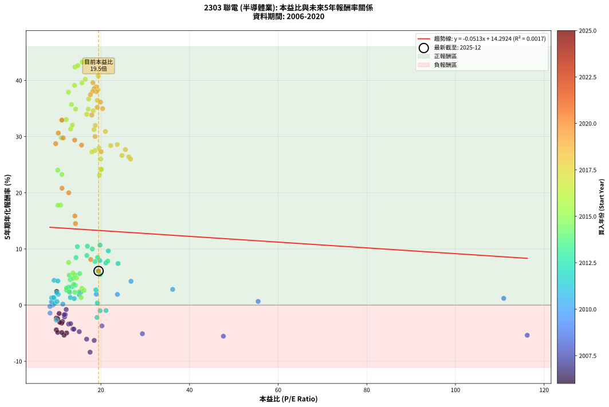
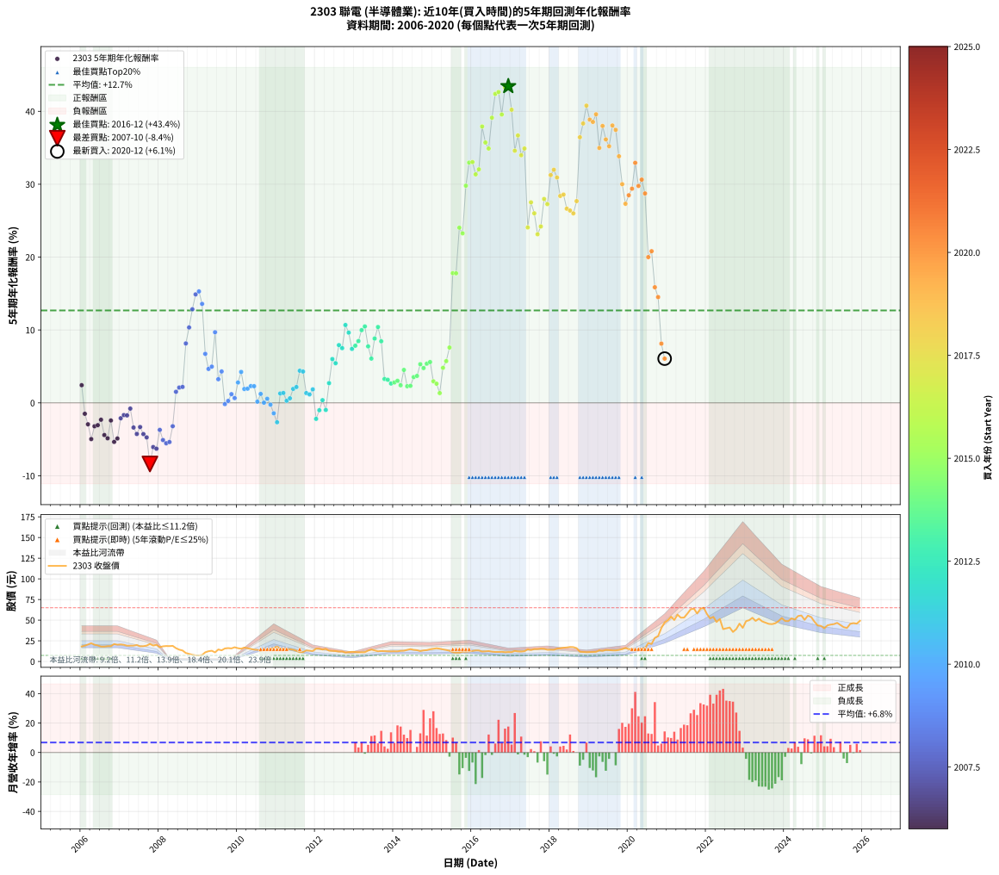

# 2303 聯電 - 本益比與未來報酬率分析

!!! info "報告資訊"
    - **股票代號**: 2303
    - **公司名稱**: 聯電
    - **產業別**: 半導體業
    - **分析期間**: 2006-2020 (180 個數據點)
    - **資料來源**: Type 12 (ShowMonthlyK_ChartFlow) 月收盤價與本益比
    - **報酬率口徑**: 含現金股利 (簡化: 年度合計，假設每年7/1入帳)
    - **報告生成時間**: 2026-01-06 22:23:19 CST

## 📈 視覺化圖表

### 圖表1: 本益比 vs 未來報酬率關係

*圖表1：2303 聯電 本益比與5年期未來報酬率關係 (2006-2020)*

### 圖表2: 歷年買入時點的5年期實際報酬率

*圖表2：2303 聯電 歷年買入時點的5年期實際報酬率 (2006-2020)*

## 📍 買點訊號說明

本報告提供兩種買點提示訊號（顯示於圖表2的股價子圖中）：

### ▲ 小綠色三角形（回測驗證）
- **計算方式**: 使用全部歷史資料計算本益比第25百分位數
- **用途**: 事後驗證，顯示歷史上哪些時點確實為低估區
- **限制**: 當下無法判斷，僅供回測參考
- **特性**: 後見之明（Look-Ahead Bias）

### ▲ 小橘色三角形（即時訊號）
- **計算方式**: 使用截至當月的過去5年資料計算本益比第25百分位數
- **用途**: 實際投資決策，當時即可判斷
- **優勢**: 可操作性強，符合實務需求
- **特性**: 無後見之明，滾動窗口計算

!!! tip "如何使用兩種訊號"
    - **綠色▲** 幫助理解歷史估值機會，驗證策略有效性
    - **橘色▲** 可作為實際買進參考，但仍需搭配基本面分析
    - 兩種訊號重疊時，表示即時判斷與事後驗證一致，信心度較高
    - 僅有綠色▲時，表示當時無法判斷（需要未來資料才能確認）
    - 僅有橘色▲時，表示即時判斷為買點，但事後可能不是最佳時機

## 📊 估值分析摘要

| 指標 | 數值 |
|:---:|:---:|
| **目前本益比** (2020-12) | **19.48 倍** |
| **歷史平均本益比** | 17.31 倍 |
| **估值水準** | 🟡 合理範圍 |
| **預期5年年化報酬率** | **+13.29%** |
| **歷史平均報酬率** | +12.68% |
| **相關係數 (R²)** | 0.0017 |
| **趨勢線斜率** | -0.0513 |

!!! abstract "核心洞察"
    目前本益比接近歷史平均，預期報酬率符合長期趨勢

    根據歷史數據回測，2303 聯電 在目前本益比 **19.5倍** 的估值水準下，
    預期未來5年年化報酬率約為 **+13.3%**。

    **重要提醒**: 本分析基於歷史數據統計，實際報酬率會受到公司基本面變化、產業趨勢、
    總體經濟環境等多重因素影響。R² = 0.00 表示本益比可解釋約 0.2% 的報酬率變異。

## 📈 歷史估值統計

### 最佳買點 (最高報酬率)

| 項目 | 數值 |
|:---:|:---:|
| 起始時間 | 2016-12 |
| 當時本益比 | 16.76 倍 |
| 起始價格 | 11.4 元 |
| 5年後價格 | 65.0 元 |
| **5年年化報酬率** | **+43.44%** |

### 最差買點 (最低報酬率)

| 項目 | 數值 |
|:---:|:---:|
| 起始時間 | 2007-10 |
| 當時本益比 | 17.56 倍 |
| 起始價格 | 21.2 元 |
| 5年後價格 | 10.8 元 |
| **5年年化報酬率** | **-8.39%** |

## 🎯 投資啟示

### 本益比與報酬率關係

趨勢線方程式: **y = -0.0513x + 14.2924**

!!! note "負相關"
    本益比與未來報酬率呈現負相關。較低的本益比通常帶來較高的未來報酬率，
    但相關性不算非常強。**估值仍是重要參考指標之一**。

### 估值區間建議

基於歷史數據分析:

- **🟢 低估區** (P/E < 13.8): 預期報酬率較高，可考慮增加持股
- **🟡 合理區** (P/E 13.8-20.8): 預期報酬率符合長期趨勢，正常持有
- **🔴 高估區** (P/E > 20.8): 預期報酬率較低，可考慮減碼或觀望

!!! danger "風險提示"
    - 過去表現不代表未來結果
    - 本分析假設公司基本面無重大結構性變化
    - 產業環境劇變可能使歷史規律失效
    - 應結合公司財報、產業趨勢、總體經濟等多重因素綜合判斷

!!! success "長期投資觀點"
    歷史數據顯示，在合理或低估的估值水準買入並長期持有，
    往往能獲得較佳的投資報酬。**耐心等待好價格**是價值投資的核心原則。

## 📊 數據品質

- **資料來源**: GoodInfo.tw Type 12 (ShowMonthlyK_ChartFlow)
- **資料頻率**: 月度收盤價與本益比
- **回測期間**: 2006-2020
- **數據點數量**: 180 個 (每個點代表一次5年期回測)

### 計算方法說明

1. **5年期年化報酬率**:
   - 對每個歷史時點，計算其後5年的實際投資報酬率
   - 期末價值(不含股利): 期末價格
   - 期末價值(含現金股利): 期末價格 + 持有期間內的現金股利合計 (簡化: 年度合計，假設每年7/1入帳)
   - 公式: 年化報酬率 = [(期末價值/期初價格)^(1/年數) - 1] × 100%

2. **本益比 (P/E Ratio)**:
   - 使用當時的月收盤價與EPS計算
   - 資料來源: Type 12 月度河流圖本益比數據

3. **趨勢線 (Linear Regression)**:
   - 使用最小平方法擬合線性趨勢線
   - R²值衡量本益比對報酬率的解釋能力

---

*本報告由 Stock Analysis System v1.9.0 自動生成*
*數據更新時間: 2026-01-06 22:23:19 CST*

## 📋 月度回測明細表

（每一列對應時間線圖中的一個買入點；可用來對照 SVG 圖上的每個點。）

| 買入月份 | 賣出月份 | 回測期限_年 | 實際持有年數 | 買入本益比_倍 | 買入收盤價_元 | 賣出收盤價_元 | 現金股利合計_元 | 總報酬率_pct | 年化報酬率_pct |
| --- | --- | --- | --- | --- | --- | --- | --- | --- | --- |
| 2006-01 | 2011-01 | 5 | 4.999 | 10.03 | 18.15 | 18.10 | 2.36 | +12.72 | +2.42 |
| 2006-02 | 2011-02 | 5 | 4.999 | 10.58 | 19.15 | 15.40 | 2.36 | -7.26 | -1.50 |
| 2006-03 | 2011-03 | 5 | 4.999 | 11.33 | 20.50 | 15.30 | 2.36 | -13.86 | -2.94 |
| 2006-04 | 2011-04 | 5 | 4.999 | 12.27 | 22.20 | 14.85 | 2.36 | -22.48 | -4.97 |
| 2006-05 | 2011-05 | 5 | 4.999 | 11.16 | 20.20 | 14.80 | 2.36 | -15.05 | -3.21 |
| 2006-06 | 2011-06 | 5 | 4.999 | 10.72 | 19.40 | 14.25 | 2.36 | -14.39 | -3.06 |
| 2006-07 | 2011-07 | 5 | 4.999 | 9.94 | 18.00 | 12.95 | 3.06 | -11.04 | -2.31 |
| 2006-08 | 2011-08 | 5 | 4.999 | 9.94 | 18.00 | 11.30 | 3.06 | -20.21 | -4.42 |
| 2006-09 | 2011-09 | 5 | 4.999 | 10.25 | 18.55 | 11.40 | 3.06 | -22.04 | -4.86 |
| 2006-10 | 2011-10 | 5 | 4.999 | 10.25 | 18.55 | 13.35 | 3.06 | -11.53 | -2.42 |
| 2006-11 | 2011-11 | 5 | 4.999 | 11.69 | 21.15 | 13.00 | 3.06 | -24.06 | -5.36 |
| 2006-12 | 2011-12 | 5 | 4.999 | 11.19 | 20.25 | 12.70 | 3.06 | -22.16 | -4.89 |
| 2007-01 | 2012-01 | 5 | 4.999 | 11.80 | 20.65 | 15.50 | 3.06 | -10.11 | -2.11 |
| 2007-02 | 2012-02 | 5 | 4.999 | 11.95 | 20.20 | 15.50 | 3.06 | -8.11 | -1.68 |
| 2007-03 | 2012-03 | 5 | 5.002 | 11.72 | 19.10 | 14.45 | 3.06 | -8.31 | -1.72 |
| 2007-04 | 2012-04 | 5 | 5.002 | 12.17 | 19.10 | 15.30 | 3.06 | -3.86 | -0.78 |
| 2007-05 | 2012-05 | 5 | 5.002 | 12.72 | 19.20 | 13.10 | 3.06 | -15.82 | -3.38 |
| 2007-06 | 2012-06 | 5 | 5.002 | 13.69 | 19.85 | 12.90 | 3.06 | -19.59 | -4.26 |
| 2007-07 | 2012-07 | 5 | 5.002 | 13.17 | 18.30 | 12.60 | 2.86 | -15.51 | -3.31 |
| 2007-08 | 2012-08 | 5 | 5.002 | 13.91 | 18.50 | 12.00 | 2.86 | -19.66 | -4.28 |
| 2007-09 | 2012-09 | 5 | 5.002 | 15.12 | 19.20 | 12.20 | 2.86 | -21.55 | -4.74 |
| 2007-10 | 2012-10 | 5 | 5.002 | 17.56 | 21.25 | 10.85 | 2.86 | -35.47 | -8.39 |
| 2007-11 | 2012-11 | 5 | 5.002 | 16.78 | 19.30 | 11.25 | 2.86 | -26.88 | -6.07 |
| 2007-12 | 2012-12 | 5 | 5.002 | 18.49 | 20.15 | 11.70 | 2.86 | -27.73 | -6.29 |
| 2008-01 | 2013-01 | 5 | 5.002 | 20.23 | 17.35 | 11.50 | 2.86 | -17.22 | -3.71 |
| 2008-02 | 2013-03 | 5 | 5.081 | 29.36 | 18.35 | 11.20 | 2.86 | -23.37 | -5.10 |
| 2008-03 | 2013-03 | 5 | 4.999 | 47.64 | 18.70 | 11.20 | 2.86 | -24.80 | -5.54 |
| 2008-04 | 2013-04 | 5 | 4.999 | 116.20 | 18.60 | 11.25 | 2.86 | -24.13 | -5.37 |
| 2008-05 | 2013-05 | 5 | 4.999 |  | 18.90 | 13.20 | 2.86 | -15.02 | -3.20 |
| 2008-06 | 2013-06 | 5 | 4.999 |  | 16.10 | 14.50 | 2.86 | +7.84 | +1.52 |
| 2008-07 | 2013-07 | 5 | 4.999 |  | 14.30 | 13.35 | 2.52 | +10.97 | +2.10 |
| 2008-08 | 2013-08 | 5 | 4.999 |  | 13.30 | 12.30 | 2.52 | +11.41 | +2.19 |
| 2008-09 | 2013-09 | 5 | 4.999 |  | 10.25 | 12.65 | 2.52 | +47.98 | +8.15 |
| 2008-10 | 2013-10 | 5 | 4.999 |  | 9.15 | 12.45 | 2.52 | +63.58 | +10.35 |
| 2008-11 | 2013-11 | 5 | 4.999 |  | 8.10 | 12.30 | 2.52 | +82.94 | +12.84 |
| 2008-12 | 2013-12 | 5 | 4.999 |  | 7.43 | 12.35 | 2.52 | +100.11 | +14.88 |
| 2009-01 | 2014-01 | 5 | 4.999 |  | 7.30 | 12.35 | 2.52 | +103.67 | +15.29 |
| 2009-02 | 2014-02 | 5 | 4.999 |  | 7.84 | 12.30 | 2.52 | +89.01 | +13.58 |
| 2009-03 | 2014-03 | 5 | 4.999 |  | 11.10 | 12.85 | 2.52 | +38.45 | +6.72 |
| 2009-04 | 2014-04 | 5 | 4.999 |  | 12.40 | 13.05 | 2.52 | +25.55 | +4.66 |
| 2009-05 | 2014-05 | 5 | 4.999 |  | 13.00 | 14.05 | 2.52 | +27.45 | +4.97 |
| 2009-06 | 2014-06 | 5 | 4.999 |  | 11.00 | 14.95 | 2.52 | +58.80 | +9.69 |
| 2009-07 | 2014-07 | 5 | 4.999 |  | 14.55 | 14.05 | 3.02 | +17.31 | +3.24 |
| 2009-08 | 2014-08 | 5 | 4.999 |  | 13.50 | 13.65 | 3.02 | +23.47 | +4.31 |
| 2009-09 | 2014-09 | 5 | 4.999 |  | 15.75 | 12.60 | 3.02 | -0.84 | -0.17 |
| 2009-10 | 2014-10 | 5 | 4.999 |  | 16.20 | 13.40 | 3.02 | +1.35 | +0.27 |
| 2009-11 | 2014-11 | 5 | 4.999 | 110.90 | 15.80 | 13.75 | 3.02 | +6.13 | +1.20 |
| 2009-12 | 2014-12 | 5 | 4.999 | 55.48 | 17.20 | 14.75 | 3.02 | +3.30 | +0.65 |
| 2010-01 | 2015-01 | 5 | 4.999 | 36.20 | 16.05 | 15.40 | 3.02 | +14.75 | +2.79 |
| 2010-02 | 2015-02 | 5 | 4.999 | 26.79 | 15.45 | 16.00 | 3.02 | +23.09 | +4.24 |
| 2010-03 | 2015-03 | 5 | 4.999 | 23.73 | 16.85 | 15.50 | 3.02 | +9.90 | +1.91 |
| 2010-04 | 2015-04 | 5 | 4.999 | 18.97 | 16.00 | 14.60 | 3.02 | +10.11 | +1.95 |
| 2010-05 | 2015-05 | 5 | 4.999 | 15.46 | 15.10 | 13.90 | 3.02 | +12.04 | +2.30 |
| 2010-06 | 2015-06 | 5 | 4.999 | 12.93 | 14.35 | 13.05 | 3.02 | +11.97 | +2.29 |
| 2010-07 | 2015-07 | 5 | 4.999 | 11.42 | 14.20 | 11.25 | 3.07 | +0.83 | +0.17 |
| 2010-08 | 2015-08 | 5 | 4.999 | 9.44 | 13.00 | 10.75 | 3.07 | +6.29 | +1.23 |
| 2010-09 | 2015-09 | 5 | 4.999 | 9.17 | 13.85 | 10.80 | 3.07 | +0.13 | +0.03 |
| 2010-10 | 2015-10 | 5 | 4.999 | 8.85 | 14.55 | 11.90 | 3.07 | +2.87 | +0.57 |
| 2010-11 | 2015-11 | 5 | 4.999 | 8.50 | 15.10 | 11.85 | 3.07 | -1.21 | -0.24 |
| 2010-12 | 2015-12 | 5 | 4.999 | 8.53 | 16.30 | 12.10 | 3.07 | -6.94 | -1.43 |
| 2011-01 | 2016-01 | 5 | 4.999 | 9.94 | 18.10 | 12.75 | 3.07 | -12.61 | -2.66 |
| 2011-02 | 2016-02 | 5 | 4.999 | 8.89 | 15.40 | 13.35 | 3.07 | +6.61 | +1.29 |
| 2011-03 | 2016-03 | 5 | 5.002 | 9.32 | 15.30 | 13.30 | 3.07 | +6.98 | +1.36 |
| 2011-04 | 2016-04 | 5 | 5.002 | 9.56 | 14.85 | 12.00 | 3.07 | +1.47 | +0.29 |
| 2011-05 | 2016-05 | 5 | 5.002 | 10.11 | 14.80 | 12.20 | 3.07 | +3.16 | +0.62 |
| 2011-06 | 2016-06 | 5 | 5.002 | 10.36 | 14.25 | 12.60 | 3.07 | +9.95 | +1.91 |
| 2011-07 | 2016-07 | 5 | 5.002 | 10.07 | 12.95 | 11.90 | 2.52 | +11.36 | +2.17 |
| 2011-08 | 2016-08 | 5 | 5.002 | 9.44 | 11.30 | 11.50 | 2.52 | +24.08 | +4.41 |
| 2011-09 | 2016-09 | 5 | 5.002 | 10.29 | 11.40 | 11.55 | 2.52 | +23.43 | +4.30 |
| 2011-10 | 2016-10 | 5 | 5.002 | 13.11 | 13.35 | 11.75 | 2.52 | +6.90 | +1.34 |
| 2011-11 | 2016-11 | 5 | 5.002 | 13.99 | 13.00 | 11.25 | 2.52 | +5.93 | +1.16 |
| 2011-12 | 2016-12 | 5 | 5.002 | 15.12 | 12.70 | 11.40 | 2.52 | +9.61 | +1.85 |
| 2012-01 | 2017-01 | 5 | 5.002 | 19.12 | 15.50 | 11.35 | 2.52 | -10.51 | -2.20 |
| 2012-02 | 2017-03 | 5 | 5.081 | 19.83 | 15.50 | 12.20 | 2.52 | -5.03 | -1.01 |
| 2012-03 | 2017-03 | 5 | 4.999 | 19.20 | 14.45 | 12.20 | 2.52 | +1.88 | +0.37 |
| 2012-04 | 2017-04 | 5 | 4.999 | 21.15 | 15.30 | 12.05 | 2.52 | -4.76 | -0.97 |
| 2012-05 | 2017-05 | 5 | 4.999 | 18.87 | 13.10 | 12.45 | 2.52 | +14.28 | +2.71 |
| 2012-06 | 2017-06 | 5 | 4.999 | 19.40 | 12.90 | 14.75 | 2.52 | +33.88 | +6.01 |
| 2012-07 | 2017-07 | 5 | 4.999 | 19.82 | 12.60 | 13.90 | 2.52 | +30.33 | +5.44 |
| 2012-08 | 2017-08 | 5 | 4.999 | 19.78 | 12.00 | 15.05 | 2.52 | +46.43 | +7.93 |
| 2012-09 | 2017-09 | 5 | 4.999 | 21.13 | 12.20 | 15.00 | 2.52 | +43.61 | +7.51 |
| 2012-10 | 2017-10 | 5 | 4.999 | 19.79 | 10.85 | 15.50 | 2.52 | +66.09 | +10.68 |
| 2012-11 | 2017-11 | 5 | 4.999 | 21.67 | 11.25 | 15.30 | 2.52 | +58.41 | +9.64 |
| 2012-12 | 2017-12 | 5 | 4.999 | 23.88 | 11.70 | 14.20 | 2.52 | +42.91 | +7.40 |
| 2013-01 | 2018-01 | 5 | 4.999 | 21.56 | 11.50 | 14.25 | 2.52 | +45.83 | +7.84 |
| 2013-02 | 2018-02 | 5 | 4.999 | 19.25 | 11.10 | 14.15 | 2.52 | +50.19 | +8.48 |
| 2013-03 | 2018-03 | 5 | 4.999 | 18.06 | 11.20 | 15.50 | 2.52 | +60.90 | +9.98 |
| 2013-04 | 2018-04 | 5 | 4.999 | 16.96 | 11.25 | 16.00 | 2.52 | +64.63 | +10.49 |
| 2013-05 | 2018-05 | 5 | 4.999 | 18.68 | 13.20 | 16.65 | 2.52 | +45.23 | +7.75 |
| 2013-06 | 2018-06 | 5 | 4.999 | 19.33 | 14.50 | 16.95 | 2.52 | +34.28 | +6.07 |
| 2013-07 | 2018-07 | 5 | 4.999 | 16.83 | 13.35 | 17.55 | 2.83 | +52.64 | +8.83 |
| 2013-08 | 2018-08 | 5 | 4.999 | 14.70 | 12.30 | 17.35 | 2.83 | +64.04 | +10.41 |
| 2013-09 | 2018-09 | 5 | 4.999 | 14.38 | 12.65 | 16.15 | 2.83 | +50.02 | +8.45 |
| 2013-10 | 2018-10 | 5 | 4.999 | 13.48 | 12.45 | 11.80 | 2.83 | +17.49 | +3.28 |
| 2013-11 | 2018-11 | 5 | 4.999 | 12.72 | 12.30 | 11.55 | 2.83 | +16.89 | +3.17 |
| 2013-12 | 2018-12 | 5 | 4.999 | 12.23 | 12.35 | 11.25 | 2.83 | +13.98 | +2.65 |
| 2014-01 | 2019-01 | 5 | 4.999 | 12.27 | 12.35 | 11.35 | 2.83 | +14.79 | +2.80 |
| 2014-02 | 2019-02 | 5 | 4.999 | 12.26 | 12.30 | 11.45 | 2.83 | +16.07 | +3.03 |
| 2014-03 | 2019-03 | 5 | 4.999 | 12.85 | 12.85 | 11.65 | 2.83 | +12.66 | +2.41 |
| 2014-04 | 2019-04 | 5 | 4.999 | 13.09 | 13.05 | 13.45 | 2.83 | +24.73 | +4.52 |
| 2014-05 | 2019-05 | 5 | 4.999 | 14.14 | 14.05 | 12.90 | 2.83 | +11.94 | +2.28 |
| 2014-06 | 2019-06 | 5 | 4.999 | 15.10 | 14.95 | 13.95 | 2.83 | +12.22 | +2.33 |
| 2014-07 | 2019-07 | 5 | 4.999 | 14.24 | 14.05 | 13.80 | 2.92 | +18.98 | +3.54 |
| 2014-08 | 2019-08 | 5 | 4.999 | 13.88 | 13.65 | 13.45 | 2.92 | +19.90 | +3.70 |
| 2014-09 | 2019-09 | 5 | 4.999 | 12.86 | 12.60 | 13.40 | 2.92 | +29.50 | +5.31 |
| 2014-10 | 2019-10 | 5 | 4.999 | 13.72 | 13.40 | 14.00 | 2.92 | +26.25 | +4.77 |
| 2014-11 | 2019-11 | 5 | 4.999 | 14.13 | 13.75 | 14.95 | 2.92 | +29.94 | +5.38 |
| 2014-12 | 2019-12 | 5 | 4.999 | 15.21 | 14.75 | 16.45 | 2.92 | +31.30 | +5.60 |
| 2015-01 | 2020-01 | 5 | 4.999 | 15.73 | 15.40 | 14.90 | 2.92 | +15.69 | +2.96 |
| 2015-02 | 2020-02 | 5 | 4.999 | 16.19 | 16.00 | 15.30 | 2.92 | +13.86 | +2.63 |
| 2015-03 | 2020-03 | 5 | 5.002 | 15.54 | 15.50 | 13.65 | 2.92 | +6.88 | +1.34 |
| 2015-04 | 2020-04 | 5 | 5.002 | 14.50 | 14.60 | 15.55 | 2.92 | +26.49 | +4.81 |
| 2015-05 | 2020-05 | 5 | 5.002 | 13.68 | 13.90 | 15.45 | 2.92 | +32.14 | +5.73 |
| 2015-06 | 2020-06 | 5 | 5.002 | 12.73 | 13.05 | 15.90 | 2.92 | +44.19 | +7.59 |
| 2015-07 | 2020-07 | 5 | 5.002 | 10.88 | 11.25 | 22.35 | 3.17 | +126.85 | +17.79 |
| 2015-08 | 2020-08 | 5 | 5.002 | 10.30 | 10.75 | 21.20 | 3.17 | +126.71 | +17.78 |
| 2015-09 | 2020-09 | 5 | 5.002 | 10.26 | 10.80 | 28.55 | 3.17 | +193.71 | +24.04 |
| 2015-10 | 2020-10 | 5 | 5.002 | 11.21 | 11.90 | 30.70 | 3.17 | +184.63 | +23.26 |
| 2015-11 | 2020-11 | 5 | 5.002 | 11.07 | 11.85 | 40.50 | 3.17 | +268.53 | +29.79 |
| 2015-12 | 2020-12 | 5 | 5.002 | 11.20 | 12.10 | 47.15 | 3.17 | +315.88 | +32.97 |
| 2016-01 | 2021-01 | 5 | 5.002 | 12.18 | 12.75 | 50.00 | 3.17 | +317.03 | +33.04 |
| 2016-02 | 2021-03 | 5 | 5.081 | 13.17 | 13.35 | 50.20 | 3.17 | +299.78 | +31.35 |
| 2016-03 | 2021-03 | 5 | 4.999 | 13.57 | 13.30 | 50.20 | 3.17 | +301.29 | +32.04 |
| 2016-04 | 2021-04 | 5 | 4.999 | 12.68 | 12.00 | 56.70 | 3.17 | +398.93 | +37.92 |
| 2016-05 | 2021-05 | 5 | 4.999 | 13.36 | 12.20 | 53.00 | 3.17 | +360.42 | +35.72 |
| 2016-06 | 2021-06 | 5 | 4.999 | 14.32 | 12.60 | 53.10 | 3.17 | +346.60 | +34.90 |
| 2016-07 | 2021-07 | 5 | 4.999 | 14.06 | 11.90 | 57.80 | 4.21 | +421.06 | +39.12 |
| 2016-08 | 2021-08 | 5 | 4.999 | 14.14 | 11.50 | 63.10 | 4.21 | +485.27 | +42.39 |
| 2016-09 | 2021-09 | 5 | 4.999 | 14.81 | 11.55 | 64.00 | 4.21 | +490.53 | +42.65 |
| 2016-10 | 2021-10 | 5 | 4.999 | 15.74 | 11.75 | 58.00 | 4.21 | +429.41 | +39.57 |
| 2016-11 | 2021-11 | 5 | 4.999 | 15.77 | 11.25 | 63.70 | 4.21 | +503.61 | +43.28 |
| 2016-12 | 2021-12 | 5 | 4.999 | 16.76 | 11.40 | 65.00 | 4.21 | +507.07 | +43.44 |
| 2017-01 | 2022-01 | 5 | 4.999 | 16.47 | 11.35 | 57.30 | 4.21 | +441.90 | +40.22 |
| 2017-02 | 2022-02 | 5 | 4.999 | 18.26 | 12.75 | 52.10 | 4.21 | +341.62 | +34.59 |
| 2017-03 | 2022-03 | 5 | 4.999 | 17.24 | 12.20 | 54.00 | 4.21 | +377.10 | +36.69 |
| 2017-04 | 2022-04 | 5 | 4.999 | 16.81 | 12.05 | 47.80 | 4.21 | +331.59 | +33.98 |
| 2017-05 | 2022-05 | 5 | 4.999 | 17.15 | 12.45 | 51.40 | 4.21 | +346.63 | +34.90 |
| 2017-06 | 2022-06 | 5 | 4.999 | 20.07 | 14.75 | 39.15 | 4.21 | +193.94 | +24.07 |
| 2017-07 | 2022-07 | 5 | 4.999 | 18.68 | 13.90 | 40.15 | 6.71 | +237.09 | +27.52 |
| 2017-08 | 2022-08 | 5 | 4.999 | 19.98 | 15.05 | 41.10 | 6.71 | +217.65 | +26.01 |
| 2017-09 | 2022-09 | 5 | 4.999 | 19.67 | 15.00 | 35.75 | 6.71 | +183.04 | +23.14 |
| 2017-10 | 2022-10 | 5 | 4.999 | 20.09 | 15.50 | 39.10 | 6.71 | +195.52 | +24.20 |
| 2017-11 | 2022-11 | 5 | 4.999 | 19.59 | 15.30 | 45.80 | 6.71 | +243.18 | +27.97 |
| 2017-12 | 2022-12 | 5 | 4.999 | 17.97 | 14.20 | 40.70 | 6.71 | +233.85 | +27.27 |
| 2018-01 | 2023-01 | 5 | 4.999 | 18.45 | 14.25 | 48.80 | 6.71 | +289.52 | +31.26 |
| 2018-02 | 2023-02 | 5 | 4.999 | 18.74 | 14.15 | 49.95 | 6.71 | +300.40 | +31.98 |
| 2018-03 | 2023-03 | 5 | 4.999 | 21.02 | 15.50 | 52.90 | 6.71 | +284.55 | +30.92 |
| 2018-04 | 2023-04 | 5 | 4.999 | 22.22 | 16.00 | 49.10 | 6.71 | +248.79 | +28.39 |
| 2018-05 | 2023-05 | 5 | 4.999 | 23.70 | 16.65 | 51.80 | 6.71 | +251.39 | +28.58 |
| 2018-06 | 2023-06 | 5 | 4.999 | 24.74 | 16.95 | 48.50 | 6.71 | +225.70 | +26.64 |
| 2018-07 | 2023-07 | 5 | 4.999 | 26.29 | 17.55 | 47.00 | 9.59 | +222.47 | +26.39 |
| 2018-08 | 2023-08 | 5 | 4.999 | 26.69 | 17.35 | 45.50 | 9.59 | +217.54 | +26.00 |
| 2018-09 | 2023-09 | 5 | 4.999 | 25.53 | 16.15 | 45.20 | 9.59 | +239.28 | +27.68 |
| 2018-10 | 2023-10 | 5 | 4.999 | 19.19 | 11.80 | 46.20 | 9.59 | +372.83 | +36.45 |
| 2018-11 | 2023-11 | 5 | 4.999 | 19.33 | 11.55 | 48.90 | 9.59 | +406.44 | +38.33 |
| 2018-12 | 2023-12 | 5 | 4.999 | 19.40 | 11.25 | 52.60 | 9.59 | +452.84 | +40.78 |
| 2019-01 | 2024-01 | 5 | 4.999 | 18.92 | 11.35 | 49.00 | 9.59 | +416.25 | +38.86 |
| 2019-02 | 2024-02 | 5 | 4.999 | 18.47 | 11.45 | 48.85 | 9.59 | +410.43 | +38.55 |
| 2019-03 | 2024-03 | 5 | 5.002 | 18.20 | 11.65 | 52.20 | 9.59 | +430.42 | +39.59 |
| 2019-04 | 2024-04 | 5 | 5.002 | 20.38 | 13.45 | 50.70 | 9.59 | +348.28 | +34.98 |
| 2019-05 | 2024-05 | 5 | 5.002 | 18.97 | 12.90 | 55.00 | 9.59 | +400.73 | +37.99 |
| 2019-06 | 2024-06 | 5 | 5.002 | 19.93 | 13.95 | 55.70 | 9.59 | +368.06 | +36.15 |
| 2019-07 | 2024-07 | 5 | 5.002 | 19.17 | 13.80 | 50.40 | 12.00 | +352.20 | +35.21 |
| 2019-08 | 2024-08 | 5 | 5.002 | 18.18 | 13.45 | 55.50 | 12.00 | +401.89 | +38.06 |
| 2019-09 | 2024-09 | 5 | 5.002 | 17.63 | 13.40 | 53.80 | 12.00 | +391.07 | +37.46 |
| 2019-10 | 2024-10 | 5 | 5.002 | 17.95 | 14.00 | 48.15 | 12.00 | +329.67 | +33.84 |
| 2019-11 | 2024-11 | 5 | 5.002 | 18.69 | 14.95 | 43.55 | 12.00 | +271.60 | +30.01 |
| 2019-12 | 2024-12 | 5 | 5.002 | 20.06 | 16.45 | 43.05 | 12.00 | +234.67 | +27.32 |
| 2020-01 | 2025-01 | 5 | 5.002 | 15.63 | 14.90 | 40.20 | 12.00 | +250.36 | +28.49 |
| 2020-02 | 2025-03 | 5 | 5.081 | 14.08 | 15.30 | 44.65 | 12.00 | +270.29 | +29.39 |
| 2020-03 | 2025-03 | 5 | 4.999 | 11.19 | 13.65 | 44.65 | 12.00 | +315.05 | +32.93 |
| 2020-04 | 2025-04 | 5 | 4.999 | 11.49 | 15.55 | 45.20 | 12.00 | +267.87 | +29.76 |
| 2020-05 | 2025-05 | 5 | 4.999 | 10.39 | 15.45 | 46.75 | 12.00 | +280.28 | +30.63 |
| 2020-06 | 2025-06 | 5 | 4.999 | 9.81 | 15.90 | 44.20 | 12.00 | +253.48 | +28.73 |
| 2020-07 | 2025-07 | 5 | 4.999 | 12.75 | 22.35 | 41.55 | 14.05 | +148.77 | +20.00 |
| 2020-08 | 2025-08 | 5 | 4.999 | 11.24 | 21.20 | 40.50 | 14.05 | +157.31 | +20.81 |
| 2020-09 | 2025-09 | 5 | 4.999 | 14.13 | 28.55 | 45.55 | 14.05 | +108.76 | +15.86 |
| 2020-10 | 2025-10 | 5 | 4.999 | 14.26 | 30.70 | 46.40 | 14.05 | +96.91 | +14.51 |
| 2020-11 | 2025-11 | 5 | 4.999 | 17.71 | 40.50 | 45.80 | 14.05 | +47.78 | +8.13 |
| 2020-12 | 2025-12 | 5 | 4.999 | 19.48 | 47.15 | 49.25 | 14.05 | +34.25 | +6.07 |
