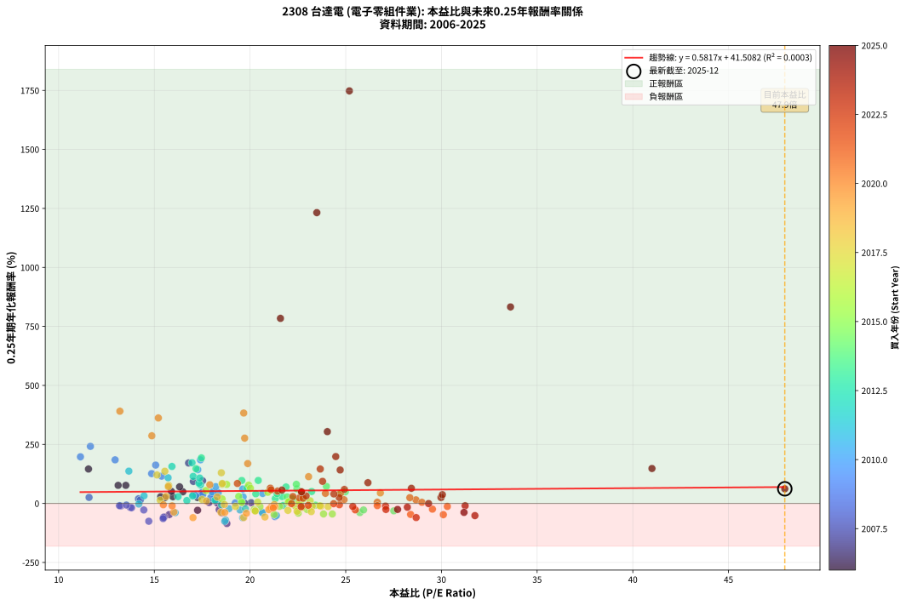
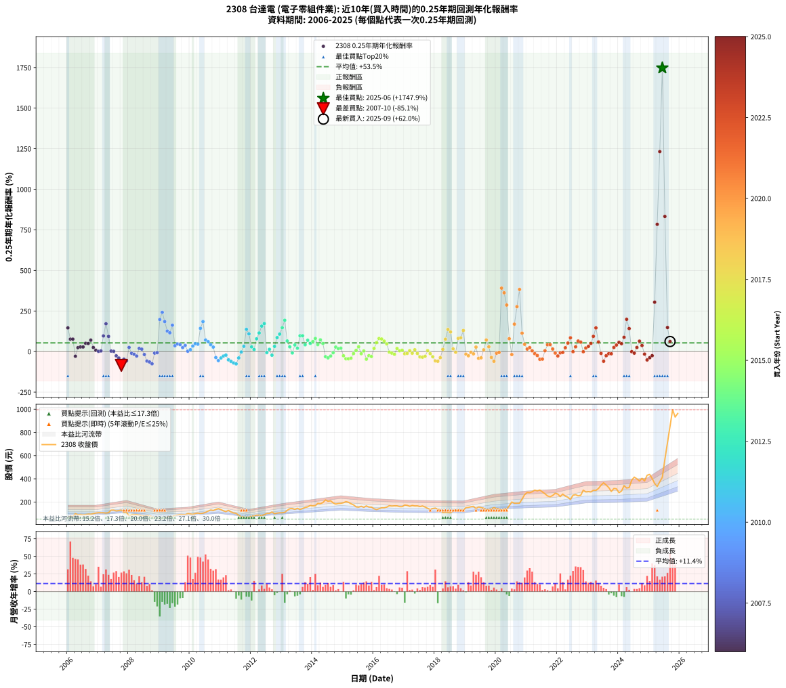

# 2308 台達電 - 本益比與未來報酬率分析

!!! info "報告資訊"
    - **股票代號**: 2308
    - **公司名稱**: 台達電
    - **產業別**: 電子零組件業
    - **分析期間**: 2006-2025 (237 個數據點)
    - **資料來源**: Type 12 (ShowMonthlyK_ChartFlow) 月收盤價與本益比
    - **報酬率口徑**: 含現金股利 (簡化: 年度合計，假設每年7/1入帳)
    - **報告生成時間**: 2026-01-06 00:25:31 CST

## 📈 視覺化圖表

### 圖表1: 本益比 vs 未來報酬率關係

*圖表1：2308 台達電 本益比與0.25年期未來報酬率關係 (2006-2025)*

### 圖表2: 歷年買入時點的0.25年期實際報酬率

*圖表2：2308 台達電 歷年買入時點的0.25年期實際報酬率 (2006-2025)*

## 📍 買點訊號說明

本報告提供兩種買點提示訊號（顯示於圖表2的股價子圖中）：

### ▲ 小綠色三角形（回測驗證）
- **計算方式**: 使用全部歷史資料計算本益比第25百分位數
- **用途**: 事後驗證，顯示歷史上哪些時點確實為低估區
- **限制**: 當下無法判斷，僅供回測參考
- **特性**: 後見之明（Look-Ahead Bias）

### ▲ 小橘色三角形（即時訊號）
- **計算方式**: 使用截至當月的過去5年資料計算本益比第25百分位數
- **用途**: 實際投資決策，當時即可判斷
- **優勢**: 可操作性強，符合實務需求
- **特性**: 無後見之明，滾動窗口計算

!!! tip "如何使用兩種訊號"
    - **綠色▲** 幫助理解歷史估值機會，驗證策略有效性
    - **橘色▲** 可作為實際買進參考，但仍需搭配基本面分析
    - 兩種訊號重疊時，表示即時判斷與事後驗證一致，信心度較高
    - 僅有綠色▲時，表示當時無法判斷（需要未來資料才能確認）
    - 僅有橘色▲時，表示即時判斷為買點，但事後可能不是最佳時機

## 📊 估值分析摘要

| 指標 | 數值 |
|:---:|:---:|
| **目前本益比** (2025-09) | **47.94 倍** |
| **歷史平均本益比** | 20.56 倍 |
| **估值水準** | 🔴 相對高估 |
| **預期0.25年年化報酬率** | **+69.39%** |
| **歷史平均報酬率** | +53.47% |
| **相關係數 (R²)** | 0.0003 |
| **趨勢線斜率** | 0.5817 |

!!! abstract "核心洞察"
    目前本益比顯著高於歷史平均，預期未來報酬率可能較低

    根據歷史數據回測，2308 台達電 在目前本益比 **47.9倍** 的估值水準下，
    預期未來0.25年年化報酬率約為 **+69.4%**。

    **重要提醒**: 本分析基於歷史數據統計，實際報酬率會受到公司基本面變化、產業趨勢、
    總體經濟環境等多重因素影響。R² = 0.00 表示本益比可解釋約 0.0% 的報酬率變異。

## 📈 歷史估值統計

### 最佳買點 (最高報酬率)

| 項目 | 數值 |
|:---:|:---:|
| 起始時間 | 2025-06 |
| 當時本益比 | 25.19 倍 |
| 起始價格 | 413.0 元 |
| 0.25年後價格 | 854.0 元 |
| **0.25年年化報酬率** | **+1747.89%** |

### 最差買點 (最低報酬率)

| 項目 | 數值 |
|:---:|:---:|
| 起始時間 | 2007-10 |
| 當時本益比 | 18.79 倍 |
| 起始價格 | 130.0 元 |
| 0.25年後價格 | 80.5 元 |
| **0.25年年化報酬率** | **-85.08%** |

## 🎯 投資啟示

### 本益比與報酬率關係

趨勢線方程式: **y = 0.5817x + 41.5082**

!!! info "弱相關或正相關"
    本益比與未來報酬率相關性較弱。這可能表示該股票的報酬率更多受到
    公司成長性、產業趨勢等因素影響，而非估值水準。**需綜合考量多項指標**。

### 估值區間建議

基於歷史數據分析:

- **🟢 低估區** (P/E < 16.5): 預期報酬率較高，可考慮增加持股
- **🟡 合理區** (P/E 16.5-24.7): 預期報酬率符合長期趨勢，正常持有
- **🔴 高估區** (P/E > 24.7): 預期報酬率較低，可考慮減碼或觀望

!!! danger "風險提示"
    - 過去表現不代表未來結果
    - 本分析假設公司基本面無重大結構性變化
    - 產業環境劇變可能使歷史規律失效
    - 應結合公司財報、產業趨勢、總體經濟等多重因素綜合判斷

!!! success "長期投資觀點"
    歷史數據顯示，在合理或低估的估值水準買入並長期持有，
    往往能獲得較佳的投資報酬。**耐心等待好價格**是價值投資的核心原則。

## 📊 數據品質

- **資料來源**: GoodInfo.tw Type 12 (ShowMonthlyK_ChartFlow)
- **資料頻率**: 月度收盤價與本益比
- **回測期間**: 2006-2025
- **數據點數量**: 237 個 (每個點代表一次0.25年期回測)

### 計算方法說明

1. **0.25年期年化報酬率**:
   - 對每個歷史時點，計算其後0.25年的實際投資報酬率
   - 期末價值(不含股利): 期末價格
   - 期末價值(含現金股利): 期末價格 + 持有期間內的現金股利合計 (簡化: 年度合計，假設每年7/1入帳)
   - 公式: 年化報酬率 = [(期末價值/期初價格)^(1/年數) - 1] × 100%

2. **本益比 (P/E Ratio)**:
   - 使用當時的月收盤價與EPS計算
   - 資料來源: Type 12 月度河流圖本益比數據

3. **趨勢線 (Linear Regression)**:
   - 使用最小平方法擬合線性趨勢線
   - R²值衡量本益比對報酬率的解釋能力

---

*本報告由 Stock Analysis System v1.9.0 自動生成*
*數據更新時間: 2026-01-06 00:25:31 CST*

## 📋 月度回測明細表

（每一列對應時間線圖中的一個買入點；可用來對照 SVG 圖上的每個點。）

| 買入月份 | 賣出月份 | 回測期限_年 | 實際持有年數 | 買入本益比_倍 | 買入收盤價_元 | 賣出收盤價_元 | 現金股利合計_元 | 總報酬率_pct | 年化報酬率_pct |
| --- | --- | --- | --- | --- | --- | --- | --- | --- | --- |
| 2006-01 | 2006-05 | 0.25 | 0.329 | 11.56 | 66.60 | 89.50 | 0.00 | +34.38 | +145.85 |
| 2006-02 | 2006-05 | 0.25 | 0.246 | 13.51 | 77.80 | 89.50 | 0.00 | +15.04 | +76.57 |
| 2006-03 | 2006-07 | 0.25 | 0.334 | 13.11 | 75.50 | 88.30 | 3.00 | +20.93 | +76.63 |
| 2006-04 | 2006-07 | 0.25 | 0.249 | 17.26 | 99.40 | 88.30 | 3.00 | -8.15 | -28.91 |
| 2006-05 | 2006-08 | 0.25 | 0.252 | 15.54 | 89.50 | 91.50 | 3.00 | +5.59 | +24.09 |
| 2006-06 | 2006-09 | 0.25 | 0.252 | 15.97 | 92.00 | 95.00 | 3.00 | +6.52 | +28.51 |
| 2006-07 | 2006-10 | 0.25 | 0.252 | 15.33 | 88.30 | 94.00 | 0.00 | +6.46 | +28.19 |
| 2006-08 | 2006-12 | 0.25 | 0.334 | 15.89 | 91.50 | 105.00 | 0.00 | +14.75 | +50.99 |
| 2006-09 | 2006-12 | 0.25 | 0.249 | 16.49 | 95.00 | 105.00 | 0.00 | +10.53 | +49.44 |
| 2006-10 | 2007-01 | 0.25 | 0.252 | 16.32 | 94.00 | 107.50 | 0.00 | +14.36 | +70.36 |
| 2006-11 | 2007-03 | 0.25 | 0.329 | 17.26 | 99.40 | 107.00 | 0.00 | +7.65 | +25.14 |
| 2006-12 | 2007-03 | 0.25 | 0.246 | 18.23 | 105.00 | 107.00 | 0.00 | +1.90 | +7.96 |
| 2007-01 | 2007-05 | 0.25 | 0.329 | 18.30 | 107.50 | 108.00 | 0.00 | +0.47 | +1.42 |
| 2007-02 | 2007-05 | 0.25 | 0.246 | 17.86 | 107.00 | 108.00 | 0.00 | +0.93 | +3.85 |
| 2007-03 | 2007-07 | 0.25 | 0.334 | 17.52 | 107.00 | 129.50 | 4.50 | +25.23 | +96.14 |
| 2007-04 | 2007-07 | 0.25 | 0.249 | 16.79 | 104.50 | 129.50 | 4.50 | +28.23 | +171.29 |
| 2007-05 | 2007-08 | 0.25 | 0.252 | 17.04 | 108.00 | 123.00 | 4.50 | +18.06 | +93.28 |
| 2007-06 | 2007-09 | 0.25 | 0.252 | 20.06 | 129.50 | 126.00 | 4.50 | +0.77 | +3.10 |
| 2007-07 | 2007-10 | 0.25 | 0.252 | 19.71 | 129.50 | 130.00 | 0.00 | +0.39 | +1.54 |
| 2007-08 | 2007-12 | 0.25 | 0.334 | 18.39 | 123.00 | 111.00 | 0.00 | -9.76 | -26.46 |
| 2007-09 | 2007-12 | 0.25 | 0.249 | 18.52 | 126.00 | 111.00 | 0.00 | -11.90 | -39.88 |
| 2007-10 | 2008-01 | 0.25 | 0.252 | 18.79 | 130.00 | 80.50 | 0.00 | -38.08 | -85.08 |
| 2007-11 | 2008-03 | 0.25 | 0.331 | 15.78 | 111.00 | 89.80 | 0.00 | -19.10 | -47.26 |
| 2007-12 | 2008-03 | 0.25 | 0.249 | 15.52 | 111.00 | 89.80 | 0.00 | -19.10 | -57.29 |
| 2008-01 | 2008-05 | 0.25 | 0.331 | 11.59 | 80.50 | 86.80 | 0.00 | +7.83 | +25.54 |
| 2008-02 | 2008-05 | 0.25 | 0.249 | 13.25 | 89.30 | 86.80 | 0.00 | -2.80 | -10.77 |
| 2008-03 | 2008-07 | 0.25 | 0.334 | 13.74 | 89.80 | 78.90 | 5.50 | -6.01 | -16.95 |
| 2008-04 | 2008-07 | 0.25 | 0.249 | 14.45 | 91.50 | 78.90 | 5.50 | -7.76 | -27.69 |
| 2008-05 | 2008-08 | 0.25 | 0.252 | 14.17 | 86.80 | 85.30 | 5.50 | +4.61 | +19.59 |
| 2008-06 | 2008-09 | 0.25 | 0.252 | 14.27 | 84.50 | 82.00 | 5.50 | +3.55 | +14.86 |
| 2008-07 | 2008-10 | 0.25 | 0.252 | 13.81 | 78.90 | 75.00 | 0.00 | -4.94 | -18.23 |
| 2008-08 | 2008-12 | 0.25 | 0.334 | 15.48 | 85.30 | 63.50 | 0.00 | -25.56 | -58.67 |
| 2008-09 | 2008-12 | 0.25 | 0.249 | 15.46 | 82.00 | 63.50 | 0.00 | -22.56 | -64.16 |
| 2008-10 | 2009-01 | 0.25 | 0.252 | 14.71 | 75.00 | 52.70 | 0.00 | -29.73 | -75.36 |
| 2008-11 | 2009-03 | 0.25 | 0.329 | 13.18 | 64.50 | 62.40 | 0.00 | -3.26 | -9.58 |
| 2008-12 | 2009-03 | 0.25 | 0.246 | 13.54 | 63.50 | 62.40 | 0.00 | -1.73 | -6.85 |
| 2009-01 | 2009-05 | 0.25 | 0.329 | 11.14 | 52.70 | 75.40 | 0.00 | +43.07 | +197.50 |
| 2009-02 | 2009-05 | 0.25 | 0.246 | 11.66 | 55.70 | 75.40 | 0.00 | +35.37 | +241.77 |
| 2009-03 | 2009-07 | 0.25 | 0.334 | 12.95 | 62.40 | 85.00 | 3.50 | +41.83 | +184.67 |
| 2009-04 | 2009-07 | 0.25 | 0.249 | 14.86 | 72.20 | 85.00 | 3.50 | +22.58 | +126.38 |
| 2009-05 | 2009-08 | 0.25 | 0.252 | 15.38 | 75.40 | 88.00 | 3.50 | +21.35 | +115.62 |
| 2009-06 | 2009-09 | 0.25 | 0.252 | 15.07 | 74.50 | 91.50 | 3.50 | +27.52 | +162.49 |
| 2009-07 | 2009-10 | 0.25 | 0.252 | 17.04 | 85.00 | 91.80 | 0.00 | +8.00 | +35.74 |
| 2009-08 | 2009-12 | 0.25 | 0.334 | 17.50 | 88.00 | 100.00 | 0.00 | +13.64 | +46.63 |
| 2009-09 | 2009-12 | 0.25 | 0.249 | 18.04 | 91.50 | 100.00 | 0.00 | +9.29 | +42.84 |
| 2009-10 | 2010-01 | 0.25 | 0.252 | 17.95 | 91.80 | 97.00 | 0.00 | +5.66 | +24.45 |
| 2009-11 | 2010-03 | 0.25 | 0.329 | 17.53 | 90.40 | 100.50 | 0.00 | +11.17 | +38.04 |
| 2009-12 | 2010-03 | 0.25 | 0.246 | 19.23 | 100.00 | 100.50 | 0.00 | +0.50 | +2.04 |
| 2010-01 | 2010-05 | 0.25 | 0.329 | 18.22 | 97.00 | 100.50 | 0.00 | +3.61 | +11.39 |
| 2010-02 | 2010-05 | 0.25 | 0.246 | 17.16 | 93.50 | 100.50 | 0.00 | +7.49 | +34.04 |
| 2010-03 | 2010-07 | 0.25 | 0.334 | 18.03 | 100.50 | 110.50 | 4.20 | +14.13 | +48.53 |
| 2010-04 | 2010-07 | 0.25 | 0.249 | 18.34 | 104.50 | 110.50 | 4.20 | +9.76 | +45.32 |
| 2010-05 | 2010-08 | 0.25 | 0.252 | 17.27 | 100.50 | 121.50 | 4.20 | +25.07 | +143.09 |
| 2010-06 | 2010-09 | 0.25 | 0.252 | 17.41 | 103.50 | 130.50 | 4.20 | +30.14 | +184.63 |
| 2010-07 | 2010-10 | 0.25 | 0.252 | 18.21 | 110.50 | 126.50 | 0.00 | +14.48 | +71.06 |
| 2010-08 | 2010-12 | 0.25 | 0.334 | 19.62 | 121.50 | 142.50 | 0.00 | +17.28 | +61.17 |
| 2010-09 | 2010-12 | 0.25 | 0.249 | 20.66 | 130.50 | 142.50 | 0.00 | +9.20 | +42.34 |
| 2010-10 | 2011-01 | 0.25 | 0.252 | 19.64 | 126.50 | 134.50 | 0.00 | +6.32 | +27.56 |
| 2010-11 | 2011-03 | 0.25 | 0.329 | 20.64 | 135.50 | 116.50 | 0.00 | -14.02 | -36.86 |
| 2010-12 | 2011-03 | 0.25 | 0.246 | 21.30 | 142.50 | 116.50 | 0.00 | -18.25 | -55.85 |
| 2011-01 | 2011-05 | 0.25 | 0.329 | 20.65 | 134.50 | 114.00 | 0.00 | -15.24 | -39.55 |
| 2011-02 | 2011-05 | 0.25 | 0.246 | 19.48 | 123.50 | 114.00 | 0.00 | -7.69 | -27.74 |
| 2011-03 | 2011-07 | 0.25 | 0.334 | 18.90 | 116.50 | 102.00 | 5.20 | -7.99 | -22.06 |
| 2011-04 | 2011-07 | 0.25 | 0.249 | 21.38 | 128.00 | 102.00 | 5.20 | -16.25 | -50.93 |
| 2011-05 | 2011-08 | 0.25 | 0.252 | 19.62 | 114.00 | 85.00 | 5.20 | -20.88 | -60.54 |
| 2011-06 | 2011-09 | 0.25 | 0.252 | 18.72 | 105.50 | 72.50 | 5.20 | -26.36 | -70.32 |
| 2011-07 | 2011-10 | 0.25 | 0.252 | 18.68 | 102.00 | 71.30 | 0.00 | -30.10 | -75.87 |
| 2011-08 | 2011-12 | 0.25 | 0.334 | 16.09 | 85.00 | 72.00 | 0.00 | -15.29 | -39.16 |
| 2011-09 | 2011-12 | 0.25 | 0.249 | 14.19 | 72.50 | 72.00 | 0.00 | -0.69 | -2.74 |
| 2011-10 | 2012-01 | 0.25 | 0.252 | 14.46 | 71.30 | 76.50 | 0.00 | +7.29 | +32.24 |
| 2011-11 | 2012-03 | 0.25 | 0.331 | 13.67 | 65.00 | 86.50 | 0.00 | +33.08 | +136.93 |
| 2011-12 | 2012-03 | 0.25 | 0.249 | 15.72 | 72.00 | 86.50 | 0.00 | +20.14 | +108.85 |
| 2012-01 | 2012-05 | 0.25 | 0.331 | 16.24 | 76.50 | 83.20 | 0.00 | +8.76 | +28.84 |
| 2012-02 | 2012-05 | 0.25 | 0.249 | 16.70 | 80.80 | 83.20 | 0.00 | +2.97 | +12.47 |
| 2012-03 | 2012-07 | 0.25 | 0.334 | 17.41 | 86.50 | 101.50 | 3.49 | +21.38 | +78.62 |
| 2012-04 | 2012-07 | 0.25 | 0.249 | 17.03 | 86.80 | 101.50 | 3.49 | +20.96 | +114.64 |
| 2012-05 | 2012-08 | 0.25 | 0.252 | 15.92 | 83.20 | 102.00 | 3.49 | +26.80 | +156.65 |
| 2012-06 | 2012-09 | 0.25 | 0.252 | 16.97 | 90.90 | 113.50 | 3.49 | +28.71 | +172.35 |
| 2012-07 | 2012-10 | 0.25 | 0.252 | 18.51 | 101.50 | 99.80 | 0.00 | -1.67 | -6.49 |
| 2012-08 | 2012-12 | 0.25 | 0.334 | 18.17 | 102.00 | 106.50 | 0.00 | +4.41 | +13.80 |
| 2012-09 | 2012-12 | 0.25 | 0.249 | 19.76 | 113.50 | 106.50 | 0.00 | -6.17 | -22.55 |
| 2012-10 | 2013-01 | 0.25 | 0.252 | 17.00 | 99.80 | 107.00 | 0.00 | +7.21 | +31.86 |
| 2012-11 | 2013-03 | 0.25 | 0.329 | 17.33 | 104.00 | 127.50 | 0.00 | +22.60 | +85.91 |
| 2012-12 | 2013-03 | 0.25 | 0.246 | 17.37 | 106.50 | 127.50 | 0.00 | +19.72 | +107.59 |
| 2013-01 | 2013-05 | 0.25 | 0.329 | 17.18 | 107.00 | 144.00 | 0.00 | +34.58 | +146.93 |
| 2013-02 | 2013-05 | 0.25 | 0.246 | 17.46 | 110.50 | 144.00 | 0.00 | +30.32 | +192.89 |
| 2013-03 | 2013-07 | 0.25 | 0.334 | 19.84 | 127.50 | 145.50 | 5.29 | +18.27 | +65.25 |
| 2013-04 | 2013-07 | 0.25 | 0.249 | 21.68 | 141.50 | 145.50 | 5.29 | +6.57 | +29.08 |
| 2013-05 | 2013-08 | 0.25 | 0.252 | 21.73 | 144.00 | 135.50 | 5.29 | -2.23 | -8.56 |
| 2013-06 | 2013-09 | 0.25 | 0.252 | 20.30 | 136.50 | 143.50 | 5.29 | +9.00 | +40.82 |
| 2013-07 | 2013-10 | 0.25 | 0.252 | 21.32 | 145.50 | 152.50 | 0.00 | +4.81 | +20.51 |
| 2013-08 | 2013-12 | 0.25 | 0.334 | 19.57 | 135.50 | 170.00 | 0.00 | +25.46 | +97.21 |
| 2013-09 | 2013-12 | 0.25 | 0.249 | 20.43 | 143.50 | 170.00 | 0.00 | +18.47 | +97.42 |
| 2013-10 | 2014-01 | 0.25 | 0.252 | 21.41 | 152.50 | 166.50 | 0.00 | +9.18 | +41.72 |
| 2013-11 | 2014-03 | 0.25 | 0.329 | 21.88 | 158.00 | 188.00 | 0.00 | +18.99 | +69.75 |
| 2013-12 | 2014-03 | 0.25 | 0.246 | 23.22 | 170.00 | 188.00 | 0.00 | +10.59 | +50.45 |
| 2014-01 | 2014-05 | 0.25 | 0.329 | 22.45 | 166.50 | 195.00 | 0.00 | +17.12 | +61.76 |
| 2014-02 | 2014-05 | 0.25 | 0.246 | 22.42 | 168.50 | 195.00 | 0.00 | +15.73 | +80.90 |
| 2014-03 | 2014-07 | 0.25 | 0.334 | 24.70 | 188.00 | 206.00 | 5.80 | +12.66 | +42.88 |
| 2014-04 | 2014-07 | 0.25 | 0.249 | 23.99 | 185.00 | 206.00 | 5.80 | +14.49 | +72.12 |
| 2014-05 | 2014-08 | 0.25 | 0.252 | 24.98 | 195.00 | 210.00 | 5.80 | +10.67 | +49.54 |
| 2014-06 | 2014-09 | 0.25 | 0.252 | 27.51 | 217.50 | 192.00 | 5.80 | -9.06 | -31.40 |
| 2014-07 | 2014-10 | 0.25 | 0.252 | 25.74 | 206.00 | 182.00 | 0.00 | -11.65 | -38.85 |
| 2014-08 | 2014-12 | 0.25 | 0.334 | 25.93 | 210.00 | 188.50 | 0.00 | -10.24 | -27.63 |
| 2014-09 | 2014-12 | 0.25 | 0.249 | 23.42 | 192.00 | 188.50 | 0.00 | -1.82 | -7.12 |
| 2014-10 | 2015-01 | 0.25 | 0.252 | 21.94 | 182.00 | 193.50 | 0.00 | +6.32 | +27.54 |
| 2014-11 | 2015-03 | 0.25 | 0.329 | 22.28 | 187.00 | 197.50 | 0.00 | +5.61 | +18.09 |
| 2014-12 | 2015-03 | 0.25 | 0.246 | 22.20 | 188.50 | 197.50 | 0.00 | +4.77 | +20.84 |
| 2015-01 | 2015-05 | 0.25 | 0.329 | 22.98 | 193.50 | 175.50 | 0.00 | -9.30 | -25.71 |
| 2015-02 | 2015-05 | 0.25 | 0.246 | 24.30 | 203.00 | 175.50 | 0.00 | -13.55 | -44.61 |
| 2015-03 | 2015-07 | 0.25 | 0.334 | 23.84 | 197.50 | 155.50 | 6.70 | -17.87 | -44.54 |
| 2015-04 | 2015-07 | 0.25 | 0.249 | 22.52 | 185.00 | 155.50 | 6.70 | -12.32 | -41.02 |
| 2015-05 | 2015-08 | 0.25 | 0.252 | 21.54 | 175.50 | 163.00 | 6.70 | -3.30 | -12.49 |
| 2015-06 | 2015-09 | 0.25 | 0.252 | 19.55 | 158.00 | 154.00 | 6.70 | +1.71 | +6.96 |
| 2015-07 | 2015-10 | 0.25 | 0.252 | 19.41 | 155.50 | 166.00 | 0.00 | +6.75 | +29.62 |
| 2015-08 | 2015-12 | 0.25 | 0.334 | 20.52 | 163.00 | 155.50 | 0.00 | -4.60 | -13.15 |
| 2015-09 | 2015-12 | 0.25 | 0.249 | 19.56 | 154.00 | 155.50 | 0.00 | +0.97 | +3.97 |
| 2015-10 | 2016-01 | 0.25 | 0.252 | 21.26 | 166.00 | 141.50 | 0.00 | -14.76 | -46.95 |
| 2015-11 | 2016-03 | 0.25 | 0.331 | 20.22 | 156.50 | 142.00 | 0.00 | -9.27 | -25.43 |
| 2015-12 | 2016-03 | 0.25 | 0.249 | 20.27 | 155.50 | 142.00 | 0.00 | -8.68 | -30.55 |
| 2016-01 | 2016-05 | 0.25 | 0.331 | 18.54 | 141.50 | 150.00 | 0.00 | +6.01 | +19.25 |
| 2016-02 | 2016-05 | 0.25 | 0.249 | 17.70 | 134.50 | 150.00 | 0.00 | +11.52 | +54.93 |
| 2016-03 | 2016-07 | 0.25 | 0.334 | 18.78 | 142.00 | 168.00 | 5.00 | +21.83 | +80.61 |
| 2016-04 | 2016-07 | 0.25 | 0.249 | 19.93 | 150.00 | 168.00 | 5.00 | +15.33 | +77.28 |
| 2016-05 | 2016-08 | 0.25 | 0.252 | 20.02 | 150.00 | 165.00 | 5.00 | +13.33 | +64.36 |
| 2016-06 | 2016-09 | 0.25 | 0.252 | 20.93 | 156.00 | 167.00 | 5.00 | +10.26 | +47.35 |
| 2016-07 | 2016-10 | 0.25 | 0.252 | 22.64 | 168.00 | 166.50 | 0.00 | -0.89 | -3.50 |
| 2016-08 | 2016-12 | 0.25 | 0.334 | 22.35 | 165.00 | 159.50 | 0.00 | -3.33 | -9.65 |
| 2016-09 | 2016-12 | 0.25 | 0.249 | 22.73 | 167.00 | 159.50 | 0.00 | -4.49 | -16.84 |
| 2016-10 | 2017-01 | 0.25 | 0.252 | 22.77 | 166.50 | 174.00 | 0.00 | +4.50 | +19.12 |
| 2016-11 | 2017-03 | 0.25 | 0.329 | 21.99 | 160.00 | 162.50 | 0.00 | +1.56 | +4.83 |
| 2016-12 | 2017-03 | 0.25 | 0.246 | 22.03 | 159.50 | 162.50 | 0.00 | +1.88 | +7.86 |
| 2017-01 | 2017-05 | 0.25 | 0.329 | 24.08 | 174.00 | 166.00 | 0.00 | -4.60 | -13.35 |
| 2017-02 | 2017-05 | 0.25 | 0.246 | 23.71 | 171.00 | 166.00 | 0.00 | -2.92 | -11.35 |
| 2017-03 | 2017-07 | 0.25 | 0.334 | 22.57 | 162.50 | 160.50 | 5.00 | +1.85 | +5.63 |
| 2017-04 | 2017-07 | 0.25 | 0.249 | 23.65 | 170.00 | 160.50 | 5.00 | -2.65 | -10.21 |
| 2017-05 | 2017-08 | 0.25 | 0.252 | 23.14 | 166.00 | 165.50 | 5.00 | +2.71 | +11.20 |
| 2017-06 | 2017-09 | 0.25 | 0.252 | 23.25 | 166.50 | 156.50 | 5.00 | -3.00 | -11.40 |
| 2017-07 | 2017-10 | 0.25 | 0.252 | 22.46 | 160.50 | 145.00 | 0.00 | -9.66 | -33.18 |
| 2017-08 | 2017-12 | 0.25 | 0.334 | 23.20 | 165.50 | 143.50 | 0.00 | -13.29 | -34.76 |
| 2017-09 | 2017-12 | 0.25 | 0.249 | 21.98 | 156.50 | 143.50 | 0.00 | -8.31 | -29.40 |
| 2017-10 | 2018-01 | 0.25 | 0.252 | 20.40 | 145.00 | 147.00 | 0.00 | +1.38 | +5.59 |
| 2017-11 | 2018-03 | 0.25 | 0.329 | 19.24 | 136.50 | 130.50 | 0.00 | -4.40 | -12.79 |
| 2017-12 | 2018-03 | 0.25 | 0.246 | 20.27 | 143.50 | 130.50 | 0.00 | -9.06 | -31.98 |
| 2018-01 | 2018-05 | 0.25 | 0.329 | 20.78 | 147.00 | 111.00 | 0.00 | -24.49 | -57.47 |
| 2018-02 | 2018-05 | 0.25 | 0.246 | 19.67 | 139.00 | 111.00 | 0.00 | -20.14 | -59.86 |
| 2018-03 | 2018-07 | 0.25 | 0.334 | 18.48 | 130.50 | 106.50 | 5.00 | -14.56 | -37.57 |
| 2018-04 | 2018-07 | 0.25 | 0.249 | 15.31 | 108.00 | 106.50 | 5.00 | +3.24 | +13.66 |
| 2018-05 | 2018-08 | 0.25 | 0.252 | 15.75 | 111.00 | 123.00 | 5.00 | +15.32 | +76.08 |
| 2018-06 | 2018-09 | 0.25 | 0.252 | 15.55 | 109.50 | 131.00 | 5.00 | +24.20 | +136.42 |
| 2018-07 | 2018-10 | 0.25 | 0.252 | 15.14 | 106.50 | 130.00 | 0.00 | +22.07 | +120.69 |
| 2018-08 | 2018-12 | 0.25 | 0.334 | 17.50 | 123.00 | 129.50 | 0.00 | +5.28 | +16.67 |
| 2018-09 | 2018-12 | 0.25 | 0.249 | 18.66 | 131.00 | 129.50 | 0.00 | -1.15 | -4.52 |
| 2018-10 | 2019-01 | 0.25 | 0.252 | 18.54 | 130.00 | 151.00 | 0.00 | +16.15 | +81.21 |
| 2018-11 | 2019-03 | 0.25 | 0.329 | 18.55 | 130.00 | 159.00 | 0.00 | +22.31 | +84.58 |
| 2018-12 | 2019-03 | 0.25 | 0.246 | 18.50 | 129.50 | 159.00 | 0.00 | +22.78 | +129.99 |
| 2019-01 | 2019-05 | 0.25 | 0.329 | 21.09 | 151.00 | 142.50 | 0.00 | -5.63 | -16.17 |
| 2019-02 | 2019-05 | 0.25 | 0.246 | 20.98 | 153.50 | 142.50 | 0.00 | -7.17 | -26.05 |
| 2019-03 | 2019-07 | 0.25 | 0.334 | 21.27 | 159.00 | 151.50 | 5.00 | -1.57 | -4.63 |
| 2019-04 | 2019-07 | 0.25 | 0.249 | 21.29 | 162.50 | 151.50 | 5.00 | -3.69 | -14.02 |
| 2019-05 | 2019-08 | 0.25 | 0.252 | 18.29 | 142.50 | 146.50 | 5.00 | +6.32 | +27.53 |
| 2019-06 | 2019-09 | 0.25 | 0.252 | 19.81 | 157.50 | 132.50 | 5.00 | -12.70 | -41.68 |
| 2019-07 | 2019-10 | 0.25 | 0.252 | 18.68 | 151.50 | 134.00 | 0.00 | -11.55 | -38.57 |
| 2019-08 | 2019-12 | 0.25 | 0.334 | 17.72 | 146.50 | 151.50 | 0.00 | +3.41 | +10.57 |
| 2019-09 | 2019-12 | 0.25 | 0.249 | 15.73 | 132.50 | 151.50 | 0.00 | +14.34 | +71.23 |
| 2019-10 | 2020-01 | 0.25 | 0.252 | 15.61 | 134.00 | 143.00 | 0.00 | +6.72 | +29.44 |
| 2019-11 | 2020-03 | 0.25 | 0.331 | 16.02 | 140.00 | 120.50 | 0.00 | -13.93 | -36.41 |
| 2019-12 | 2020-03 | 0.25 | 0.249 | 17.02 | 151.50 | 120.50 | 0.00 | -20.46 | -60.10 |
| 2020-01 | 2020-05 | 0.25 | 0.331 | 15.93 | 143.00 | 138.00 | 0.00 | -3.50 | -10.19 |
| 2020-02 | 2020-05 | 0.25 | 0.249 | 15.47 | 140.00 | 138.00 | 0.00 | -1.43 | -5.61 |
| 2020-03 | 2020-07 | 0.25 | 0.334 | 13.20 | 120.50 | 200.00 | 5.00 | +70.12 | +390.77 |
| 2020-04 | 2020-07 | 0.25 | 0.249 | 15.21 | 140.00 | 200.00 | 5.00 | +46.43 | +362.15 |
| 2020-05 | 2020-08 | 0.25 | 0.252 | 14.87 | 138.00 | 189.00 | 5.00 | +40.58 | +286.61 |
| 2020-06 | 2020-09 | 0.25 | 0.252 | 17.90 | 167.50 | 189.00 | 5.00 | +15.82 | +79.16 |
| 2020-07 | 2020-10 | 0.25 | 0.252 | 21.21 | 200.00 | 190.00 | 0.00 | -5.00 | -18.42 |
| 2020-08 | 2020-12 | 0.25 | 0.334 | 19.88 | 189.00 | 263.00 | 0.00 | +39.15 | +168.91 |
| 2020-09 | 2020-12 | 0.25 | 0.249 | 19.72 | 189.00 | 263.00 | 0.00 | +39.15 | +276.66 |
| 2020-10 | 2021-01 | 0.25 | 0.252 | 19.67 | 190.00 | 282.50 | 0.00 | +48.68 | +382.96 |
| 2020-11 | 2021-03 | 0.25 | 0.329 | 23.06 | 224.50 | 288.00 | 0.00 | +28.29 | +113.43 |
| 2020-12 | 2021-03 | 0.25 | 0.246 | 26.81 | 263.00 | 288.00 | 0.00 | +9.51 | +44.56 |
| 2021-01 | 2021-05 | 0.25 | 0.329 | 28.67 | 282.50 | 296.00 | 0.00 | +4.78 | +15.27 |
| 2021-02 | 2021-05 | 0.25 | 0.246 | 28.35 | 280.50 | 296.00 | 0.00 | +5.53 | +24.39 |
| 2021-03 | 2021-07 | 0.25 | 0.334 | 28.98 | 288.00 | 287.00 | 5.50 | +1.56 | +4.75 |
| 2021-04 | 2021-07 | 0.25 | 0.249 | 30.31 | 302.50 | 287.00 | 5.50 | -3.31 | -12.62 |
| 2021-05 | 2021-08 | 0.25 | 0.252 | 29.53 | 296.00 | 270.50 | 5.50 | -6.76 | -24.25 |
| 2021-06 | 2021-09 | 0.25 | 0.252 | 30.10 | 303.00 | 252.00 | 5.50 | -15.02 | -47.59 |
| 2021-07 | 2021-10 | 0.25 | 0.252 | 28.39 | 287.00 | 245.00 | 0.00 | -14.63 | -46.64 |
| 2021-08 | 2021-12 | 0.25 | 0.334 | 26.65 | 270.50 | 275.00 | 0.00 | +1.66 | +5.06 |
| 2021-09 | 2021-12 | 0.25 | 0.249 | 24.72 | 252.00 | 275.00 | 0.00 | +9.13 | +41.99 |
| 2021-10 | 2022-01 | 0.25 | 0.252 | 23.94 | 245.00 | 268.00 | 0.00 | +9.39 | +42.79 |
| 2021-11 | 2022-03 | 0.25 | 0.329 | 24.91 | 256.00 | 268.50 | 0.00 | +4.88 | +15.62 |
| 2021-12 | 2022-03 | 0.25 | 0.246 | 26.65 | 275.00 | 268.50 | 0.00 | -2.36 | -9.25 |
| 2022-01 | 2022-05 | 0.25 | 0.329 | 25.50 | 268.00 | 241.50 | 0.00 | -9.89 | -27.16 |
| 2022-02 | 2022-05 | 0.25 | 0.246 | 23.04 | 246.50 | 241.50 | 0.00 | -2.03 | -7.98 |
| 2022-03 | 2022-07 | 0.25 | 0.334 | 24.67 | 268.50 | 258.00 | 5.50 | -1.86 | -5.47 |
| 2022-04 | 2022-07 | 0.25 | 0.249 | 22.58 | 250.00 | 258.00 | 5.50 | +5.40 | +23.50 |
| 2022-05 | 2022-08 | 0.25 | 0.252 | 21.44 | 241.50 | 263.00 | 5.50 | +11.18 | +52.31 |
| 2022-06 | 2022-09 | 0.25 | 0.252 | 19.34 | 221.50 | 253.00 | 5.50 | +16.70 | +84.65 |
| 2022-07 | 2022-10 | 0.25 | 0.252 | 22.17 | 258.00 | 257.50 | 0.00 | -0.19 | -0.77 |
| 2022-08 | 2022-12 | 0.25 | 0.334 | 22.24 | 263.00 | 286.50 | 0.00 | +8.94 | +29.20 |
| 2022-09 | 2022-12 | 0.25 | 0.249 | 21.06 | 253.00 | 286.50 | 0.00 | +13.24 | +64.72 |
| 2022-10 | 2023-01 | 0.25 | 0.252 | 21.10 | 257.50 | 289.00 | 0.00 | +12.23 | +58.12 |
| 2022-11 | 2023-03 | 0.25 | 0.329 | 24.37 | 302.00 | 301.00 | 0.00 | -0.33 | -1.00 |
| 2022-12 | 2023-03 | 0.25 | 0.246 | 22.77 | 286.50 | 301.00 | 0.00 | +5.06 | +22.19 |
| 2023-01 | 2023-05 | 0.25 | 0.329 | 22.93 | 289.00 | 316.50 | 0.00 | +9.52 | +31.87 |
| 2023-02 | 2023-05 | 0.25 | 0.246 | 22.69 | 286.50 | 316.50 | 0.00 | +10.47 | +49.80 |
| 2023-03 | 2023-07 | 0.25 | 0.334 | 23.79 | 301.00 | 365.50 | 9.84 | +24.70 | +93.64 |
| 2023-04 | 2023-07 | 0.25 | 0.249 | 23.67 | 300.00 | 365.50 | 9.84 | +25.11 | +145.78 |
| 2023-05 | 2023-08 | 0.25 | 0.252 | 24.93 | 316.50 | 346.00 | 9.84 | +12.43 | +59.22 |
| 2023-06 | 2023-09 | 0.25 | 0.252 | 27.08 | 344.50 | 324.50 | 9.84 | -2.95 | -11.21 |
| 2023-07 | 2023-10 | 0.25 | 0.252 | 28.68 | 365.50 | 290.50 | 0.00 | -20.52 | -59.82 |
| 2023-08 | 2023-12 | 0.25 | 0.334 | 27.10 | 346.00 | 313.50 | 0.00 | -9.39 | -25.57 |
| 2023-09 | 2023-12 | 0.25 | 0.249 | 25.37 | 324.50 | 313.50 | 0.00 | -3.39 | -12.93 |
| 2023-10 | 2024-01 | 0.25 | 0.252 | 22.67 | 290.50 | 280.00 | 0.00 | -3.61 | -13.60 |
| 2023-11 | 2024-03 | 0.25 | 0.331 | 24.66 | 316.50 | 341.00 | 0.00 | +7.74 | +25.24 |
| 2023-12 | 2024-03 | 0.25 | 0.249 | 24.38 | 313.50 | 341.00 | 0.00 | +8.77 | +40.14 |
| 2024-01 | 2024-05 | 0.25 | 0.331 | 21.67 | 280.00 | 325.00 | 0.00 | +16.07 | +56.81 |
| 2024-02 | 2024-05 | 0.25 | 0.249 | 22.69 | 294.50 | 325.00 | 0.00 | +10.36 | +48.52 |
| 2024-03 | 2024-07 | 0.25 | 0.334 | 26.16 | 341.00 | 414.50 | 6.43 | +23.44 | +87.85 |
| 2024-04 | 2024-07 | 0.25 | 0.249 | 24.48 | 320.50 | 414.50 | 6.43 | +31.34 | +198.64 |
| 2024-05 | 2024-08 | 0.25 | 0.252 | 24.71 | 325.00 | 399.50 | 6.43 | +24.90 | +141.76 |
| 2024-06 | 2024-09 | 0.25 | 0.252 | 29.33 | 387.50 | 380.50 | 6.43 | -0.15 | -0.58 |
| 2024-07 | 2024-10 | 0.25 | 0.252 | 31.24 | 414.50 | 404.00 | 0.00 | -2.53 | -9.68 |
| 2024-08 | 2024-12 | 0.25 | 0.334 | 29.98 | 399.50 | 430.50 | 0.00 | +7.76 | +25.07 |
| 2024-09 | 2024-12 | 0.25 | 0.249 | 28.43 | 380.50 | 430.50 | 0.00 | +13.14 | +64.14 |
| 2024-10 | 2025-01 | 0.25 | 0.252 | 30.05 | 404.00 | 437.50 | 0.00 | +8.29 | +37.20 |
| 2024-11 | 2025-03 | 0.25 | 0.329 | 28.22 | 381.00 | 360.00 | 0.00 | -5.51 | -15.85 |
| 2024-12 | 2025-03 | 0.25 | 0.246 | 31.75 | 430.50 | 360.00 | 0.00 | -16.38 | -51.61 |
| 2025-01 | 2025-05 | 0.25 | 0.329 | 31.18 | 437.50 | 374.00 | 0.00 | -14.51 | -37.96 |
| 2025-02 | 2025-05 | 0.25 | 0.246 | 27.71 | 402.00 | 374.00 | 0.00 | -6.97 | -25.40 |
| 2025-03 | 2025-07 | 0.25 | 0.334 | 24.04 | 360.00 | 567.00 | 7.00 | +59.44 | +304.19 |
| 2025-04 | 2025-07 | 0.25 | 0.249 | 21.59 | 333.50 | 567.00 | 7.00 | +72.11 | +784.10 |
| 2025-05 | 2025-08 | 0.25 | 0.252 | 23.49 | 374.00 | 711.00 | 7.00 | +91.98 | +1232.12 |
| 2025-06 | 2025-09 | 0.25 | 0.252 | 25.19 | 413.00 | 854.00 | 7.00 | +108.47 | +1747.89 |
| 2025-07 | 2025-10 | 0.25 | 0.252 | 33.61 | 567.00 | 995.00 | 0.00 | +75.49 | +832.52 |
| 2025-08 | 2025-12 | 0.25 | 0.334 | 41.00 | 711.00 | 963.00 | 0.00 | +35.44 | +148.00 |
| 2025-09 | 2025-12 | 0.25 | 0.249 | 47.94 | 854.00 | 963.00 | 0.00 | +12.76 | +61.95 |
