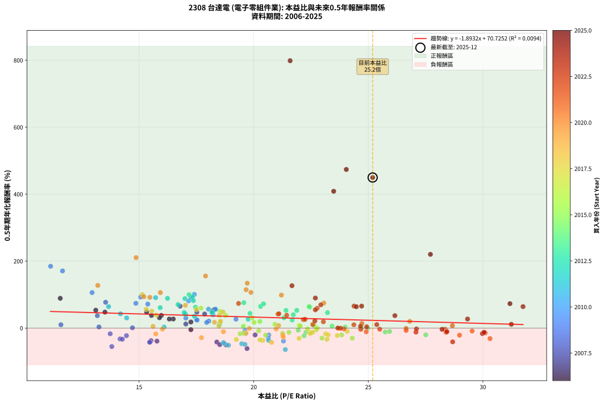
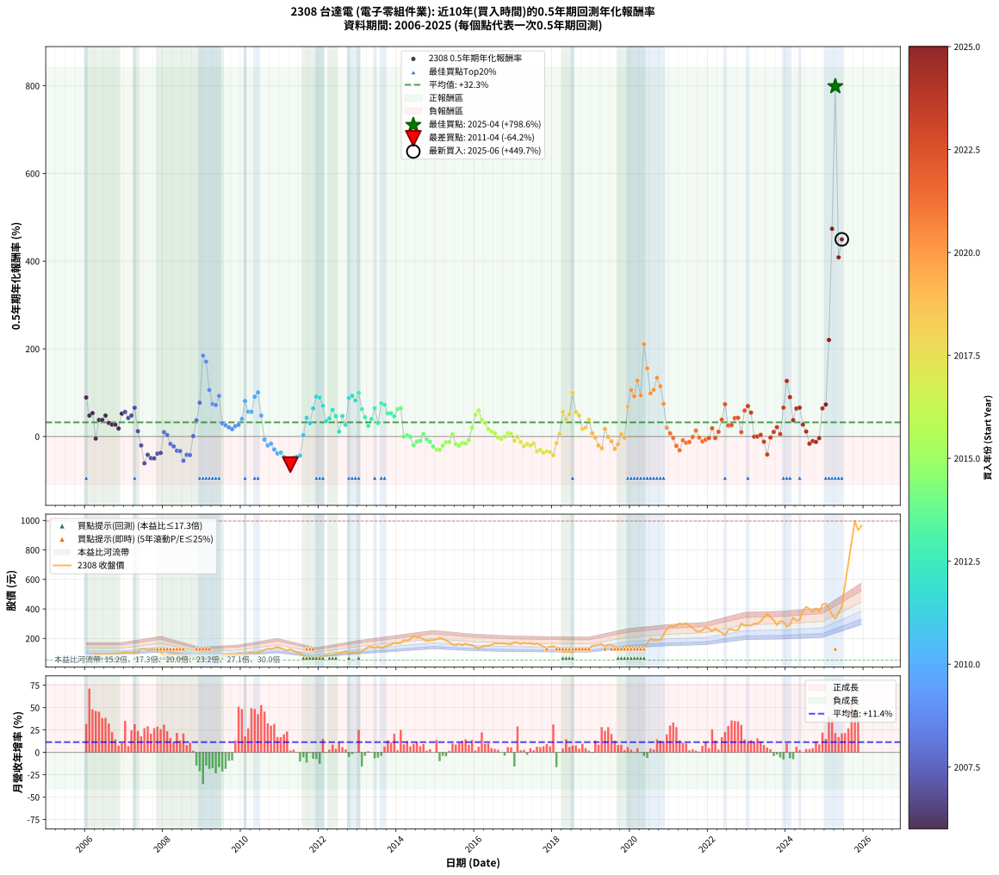

# 2308 台達電 - 本益比與未來報酬率分析

!!! info "報告資訊"
    - **股票代號**: 2308
    - **公司名稱**: 台達電
    - **產業別**: 電子零組件業
    - **分析期間**: 2005-2025 (235 個數據點)
    - **資料來源**: Type 12 (ShowMonthlyK_ChartFlow) 月收盤價與本益比
    - **報酬率口徑**: 含現金股利 (簡化: 年度合計，假設每年7/1入帳)
    - **報告生成時間**: 2025-12-23 11:52:24 CST

## 📈 視覺化圖表

### 圖表1: 本益比 vs 未來報酬率關係

*圖表1：2308 台達電 本益比與0.5年期未來報酬率關係 (2005-2025)*

### 圖表2: 歷年買入時點的0.5年期實際報酬率

*圖表2：2308 台達電 歷年買入時點的0.5年期實際報酬率 (2005-2025)*

## 📍 買點訊號說明

本報告提供兩種買點提示訊號（顯示於圖表2的股價子圖中）：

### ▲ 小綠色三角形（回測驗證）
- **計算方式**: 使用全部歷史資料計算本益比第25百分位數
- **用途**: 事後驗證，顯示歷史上哪些時點確實為低估區
- **限制**: 當下無法判斷，僅供回測參考
- **特性**: 後見之明（Look-Ahead Bias）

### ▲ 小橘色三角形（即時訊號）
- **計算方式**: 使用截至當月的過去5年資料計算本益比第25百分位數
- **用途**: 實際投資決策，當時即可判斷
- **優勢**: 可操作性強，符合實務需求
- **特性**: 無後見之明，滾動窗口計算

!!! tip "如何使用兩種訊號"
    - **綠色▲** 幫助理解歷史估值機會，驗證策略有效性
    - **橘色▲** 可作為實際買進參考，但仍需搭配基本面分析
    - 兩種訊號重疊時，表示即時判斷與事後驗證一致，信心度較高
    - 僅有綠色▲時，表示當時無法判斷（需要未來資料才能確認）
    - 僅有橘色▲時，表示即時判斷為買點，但事後可能不是最佳時機

## 📊 估值分析摘要

| 指標 | 數值 |
|:---:|:---:|
| **目前本益比** (2025-06) | **25.19 倍** |
| **歷史平均本益比** | 20.39 倍 |
| **估值水準** | 🔴 相對高估 |
| **預期0.5年年化報酬率** | **+23.50%** |
| **歷史平均報酬率** | +32.67% |
| **相關係數 (R²)** | 0.0089 |
| **趨勢線斜率** | -1.9105 |

!!! abstract "核心洞察"
    目前本益比顯著高於歷史平均，預期未來報酬率可能較低

    根據歷史數據回測，2308 台達電 在目前本益比 **25.2倍** 的估值水準下，
    預期未來0.5年年化報酬率約為 **+23.5%**。

    **重要提醒**: 本分析基於歷史數據統計，實際報酬率會受到公司基本面變化、產業趨勢、
    總體經濟環境等多重因素影響。R² = 0.01 表示本益比可解釋約 0.9% 的報酬率變異。

## 📈 歷史估值統計

### 最佳買點 (最高報酬率)

| 項目 | 數值 |
|:---:|:---:|
| 起始時間 | 2025-04 |
| 當時本益比 | 21.59 倍 |
| 起始價格 | 333.5 元 |
| 0.5年後價格 | 995.0 元 |
| **0.5年年化報酬率** | **+798.64%** |

### 最差買點 (最低報酬率)

| 項目 | 數值 |
|:---:|:---:|
| 起始時間 | 2011-04 |
| 當時本益比 | 21.38 倍 |
| 起始價格 | 128.0 元 |
| 0.5年後價格 | 71.3 元 |
| **0.5年年化報酬率** | **-64.21%** |

## 🎯 投資啟示

### 本益比與報酬率關係

趨勢線方程式: **y = -1.9105x + 71.6276**

!!! warning "強負相關"
    本益比與未來報酬率呈現強負相關。在高本益比時期買入，未來報酬率顯著較低；
    在低本益比時期買入，未來報酬率顯著較高。**估值紀律至關重要**。

### 估值區間建議

基於歷史數據分析:

- **🟢 低估區** (P/E < 16.3): 預期報酬率較高，可考慮增加持股
- **🟡 合理區** (P/E 16.3-24.5): 預期報酬率符合長期趨勢，正常持有
- **🔴 高估區** (P/E > 24.5): 預期報酬率較低，可考慮減碼或觀望

!!! danger "風險提示"
    - 過去表現不代表未來結果
    - 本分析假設公司基本面無重大結構性變化
    - 產業環境劇變可能使歷史規律失效
    - 應結合公司財報、產業趨勢、總體經濟等多重因素綜合判斷

!!! success "長期投資觀點"
    歷史數據顯示，在合理或低估的估值水準買入並長期持有，
    往往能獲得較佳的投資報酬。**耐心等待好價格**是價值投資的核心原則。

## 📊 數據品質

- **資料來源**: GoodInfo.tw Type 12 (ShowMonthlyK_ChartFlow)
- **資料頻率**: 月度收盤價與本益比
- **回測期間**: 2005-2025
- **數據點數量**: 235 個 (每個點代表一次0.5年期回測)

### 計算方法說明

1. **0.5年期年化報酬率**:
   - 對每個歷史時點，計算其後0.5年的實際投資報酬率
   - 期末價值(不含股利): 期末價格
   - 期末價值(含現金股利): 期末價格 + 持有期間內的現金股利合計 (簡化: 年度合計，假設每年7/1入帳)
   - 公式: 年化報酬率 = [(期末價值/期初價格)^(1/年數) - 1] × 100%

2. **本益比 (P/E Ratio)**:
   - 使用當時的月收盤價與EPS計算
   - 資料來源: Type 12 月度河流圖本益比數據

3. **趨勢線 (Linear Regression)**:
   - 使用最小平方法擬合線性趨勢線
   - R²值衡量本益比對報酬率的解釋能力

---

*本報告由 Stock Analysis System v1.9.0 自動生成*
*數據更新時間: 2025-12-23 11:52:24 CST*

## 📋 月度回測明細表

（每一列對應時間線圖中的一個買入點；可用來對照 SVG 圖上的每個點。）

| 買入月份 | 賣出月份 | 回測期限_年 | 實際持有年數 | 買入本益比_倍 | 買入收盤價_元 | 賣出收盤價_元 | 現金股利合計_元 | 總報酬率_pct | 年化報酬率_pct |
| --- | --- | --- | --- | --- | --- | --- | --- | --- | --- |
| 2005-12 | 2006-07 | 0.5 | 0.580 | 15.80 | 67.30 | 88.30 | 3.00 | +35.66 | +69.12 |
| 2006-01 | 2006-07 | 0.5 | 0.496 | 15.19 | 66.60 | 88.30 | 3.00 | +37.09 | +89.00 |
| 2006-02 | 2006-08 | 0.5 | 0.498 | 17.25 | 77.80 | 91.50 | 3.00 | +21.47 | +47.74 |
| 2006-03 | 2006-10 | 0.5 | 0.586 | 16.29 | 75.50 | 94.00 | 3.00 | +28.48 | +53.37 |
| 2006-04 | 2006-10 | 0.5 | 0.501 | 20.88 | 99.40 | 94.00 | 3.00 | -2.41 | -4.76 |
| 2006-05 | 2006-12 | 0.5 | 0.586 | 18.32 | 89.50 | 105.00 | 3.00 | +20.67 | +37.81 |
| 2006-06 | 2006-12 | 0.5 | 0.501 | 18.36 | 92.00 | 105.00 | 3.00 | +17.39 | +37.72 |
| 2006-07 | 2007-01 | 0.5 | 0.504 | 17.20 | 88.30 | 107.50 | 0.00 | +21.74 | +47.78 |
| 2006-08 | 2007-03 | 0.5 | 0.580 | 17.40 | 91.50 | 107.00 | 0.00 | +16.94 | +30.95 |
| 2006-09 | 2007-03 | 0.5 | 0.496 | 17.64 | 95.00 | 107.00 | 0.00 | +12.63 | +27.13 |
| 2006-10 | 2007-05 | 0.5 | 0.580 | 17.06 | 94.00 | 108.00 | 0.00 | +14.89 | +27.02 |
| 2006-11 | 2007-05 | 0.5 | 0.496 | 17.64 | 99.40 | 108.00 | 0.00 | +8.65 | +18.23 |
| 2006-12 | 2007-07 | 0.5 | 0.580 | 18.23 | 105.00 | 129.50 | 4.50 | +27.62 | +52.22 |
| 2007-01 | 2007-07 | 0.5 | 0.496 | 18.30 | 107.50 | 129.50 | 4.50 | +24.65 | +56.00 |
| 2007-02 | 2007-08 | 0.5 | 0.498 | 17.86 | 107.00 | 123.00 | 4.50 | +19.16 | +42.16 |
| 2007-03 | 2007-10 | 0.5 | 0.586 | 17.52 | 107.00 | 130.00 | 4.50 | +25.70 | +47.76 |
| 2007-04 | 2007-10 | 0.5 | 0.501 | 16.79 | 104.50 | 130.00 | 4.50 | +28.71 | +65.49 |
| 2007-05 | 2007-12 | 0.5 | 0.586 | 17.04 | 108.00 | 111.00 | 4.50 | +6.94 | +12.14 |
| 2007-06 | 2007-12 | 0.5 | 0.501 | 20.06 | 129.50 | 111.00 | 4.50 | -10.81 | -20.42 |
| 2007-07 | 2008-01 | 0.5 | 0.504 | 19.71 | 129.50 | 80.50 | 0.00 | -37.84 | -61.08 |
| 2007-08 | 2008-03 | 0.5 | 0.583 | 18.39 | 123.00 | 89.80 | 0.00 | -26.99 | -41.69 |
| 2007-09 | 2008-03 | 0.5 | 0.498 | 18.52 | 126.00 | 89.80 | 0.00 | -28.73 | -49.32 |
| 2007-10 | 2008-05 | 0.5 | 0.583 | 18.79 | 130.00 | 86.80 | 0.00 | -33.23 | -49.98 |
| 2007-11 | 2008-05 | 0.5 | 0.498 | 15.78 | 111.00 | 86.80 | 0.00 | -21.80 | -38.95 |
| 2007-12 | 2008-07 | 0.5 | 0.583 | 15.52 | 111.00 | 78.90 | 5.50 | -23.96 | -37.49 |
| 2008-01 | 2008-07 | 0.5 | 0.498 | 11.59 | 80.50 | 78.90 | 5.50 | +4.84 | +9.96 |
| 2008-02 | 2008-08 | 0.5 | 0.501 | 13.25 | 89.30 | 85.30 | 5.50 | +1.68 | +3.38 |
| 2008-03 | 2008-10 | 0.5 | 0.586 | 13.74 | 89.80 | 75.00 | 5.50 | -10.36 | -17.02 |
| 2008-04 | 2008-10 | 0.5 | 0.501 | 14.45 | 91.50 | 75.00 | 5.50 | -12.02 | -22.56 |
| 2008-05 | 2008-12 | 0.5 | 0.586 | 14.17 | 86.80 | 63.50 | 5.50 | -20.51 | -32.41 |
| 2008-06 | 2008-12 | 0.5 | 0.501 | 14.27 | 84.50 | 63.50 | 5.50 | -18.34 | -33.27 |
| 2008-07 | 2009-01 | 0.5 | 0.504 | 13.81 | 78.90 | 52.70 | 0.00 | -33.21 | -55.12 |
| 2008-08 | 2009-03 | 0.5 | 0.580 | 15.48 | 85.30 | 62.40 | 0.00 | -26.85 | -41.64 |
| 2008-09 | 2009-03 | 0.5 | 0.496 | 15.46 | 82.00 | 62.40 | 0.00 | -23.90 | -42.37 |
| 2008-10 | 2009-05 | 0.5 | 0.580 | 14.71 | 75.00 | 75.40 | 0.00 | +0.53 | +0.92 |
| 2008-11 | 2009-05 | 0.5 | 0.496 | 13.18 | 64.50 | 75.40 | 0.00 | +16.90 | +37.04 |
| 2008-12 | 2009-07 | 0.5 | 0.580 | 13.54 | 63.50 | 85.00 | 3.50 | +39.37 | +77.17 |
| 2009-01 | 2009-07 | 0.5 | 0.496 | 11.14 | 52.70 | 85.00 | 3.50 | +67.93 | +184.65 |
| 2009-02 | 2009-08 | 0.5 | 0.498 | 11.66 | 55.70 | 88.00 | 3.50 | +64.27 | +170.78 |
| 2009-03 | 2009-10 | 0.5 | 0.586 | 12.95 | 62.40 | 91.80 | 3.50 | +52.72 | +106.01 |
| 2009-04 | 2009-10 | 0.5 | 0.501 | 14.86 | 72.20 | 91.80 | 3.50 | +31.99 | +74.03 |
| 2009-05 | 2009-12 | 0.5 | 0.586 | 15.38 | 75.40 | 100.00 | 3.50 | +37.27 | +71.71 |
| 2009-06 | 2009-12 | 0.5 | 0.501 | 15.07 | 74.50 | 100.00 | 3.50 | +38.93 | +92.74 |
| 2009-07 | 2010-01 | 0.5 | 0.504 | 17.04 | 85.00 | 97.00 | 0.00 | +14.12 | +29.97 |
| 2009-08 | 2010-03 | 0.5 | 0.580 | 17.50 | 88.00 | 100.50 | 0.00 | +14.20 | +25.71 |
| 2009-09 | 2010-03 | 0.5 | 0.496 | 18.04 | 91.50 | 100.50 | 0.00 | +9.84 | +20.84 |
| 2009-10 | 2010-05 | 0.5 | 0.580 | 17.95 | 91.80 | 100.50 | 0.00 | +9.48 | +16.88 |
| 2009-11 | 2010-05 | 0.5 | 0.496 | 17.53 | 90.40 | 100.50 | 0.00 | +11.17 | +23.83 |
| 2009-12 | 2010-07 | 0.5 | 0.580 | 19.23 | 100.00 | 110.50 | 4.20 | +14.70 | +26.65 |
| 2010-01 | 2010-07 | 0.5 | 0.496 | 18.22 | 97.00 | 110.50 | 4.20 | +18.25 | +40.24 |
| 2010-02 | 2010-08 | 0.5 | 0.498 | 17.16 | 93.50 | 121.50 | 4.20 | +34.44 | +81.10 |
| 2010-03 | 2010-10 | 0.5 | 0.586 | 18.03 | 100.50 | 126.50 | 4.20 | +30.05 | +56.59 |
| 2010-04 | 2010-10 | 0.5 | 0.501 | 18.34 | 104.50 | 126.50 | 4.20 | +25.07 | +56.28 |
| 2010-05 | 2010-12 | 0.5 | 0.586 | 17.27 | 100.50 | 142.50 | 4.20 | +45.97 | +90.70 |
| 2010-06 | 2010-12 | 0.5 | 0.501 | 17.41 | 103.50 | 142.50 | 4.20 | +41.74 | +100.61 |
| 2010-07 | 2011-01 | 0.5 | 0.504 | 18.21 | 110.50 | 134.50 | 0.00 | +21.72 | +47.72 |
| 2010-08 | 2011-03 | 0.5 | 0.580 | 19.62 | 121.50 | 116.50 | 0.00 | -4.12 | -6.98 |
| 2010-09 | 2011-03 | 0.5 | 0.496 | 20.66 | 130.50 | 116.50 | 0.00 | -10.73 | -20.47 |
| 2010-10 | 2011-05 | 0.5 | 0.580 | 19.64 | 126.50 | 114.00 | 0.00 | -9.88 | -16.41 |
| 2010-11 | 2011-05 | 0.5 | 0.496 | 20.64 | 135.50 | 114.00 | 0.00 | -15.87 | -29.44 |
| 2010-12 | 2011-07 | 0.5 | 0.580 | 21.30 | 142.50 | 102.00 | 5.20 | -24.78 | -38.77 |
| 2011-01 | 2011-07 | 0.5 | 0.496 | 20.65 | 134.50 | 102.00 | 5.20 | -20.30 | -36.74 |
| 2011-02 | 2011-08 | 0.5 | 0.498 | 19.48 | 123.50 | 85.00 | 5.20 | -26.97 | -46.78 |
| 2011-03 | 2011-10 | 0.5 | 0.586 | 18.90 | 116.50 | 71.30 | 5.20 | -34.34 | -51.23 |
| 2011-04 | 2011-10 | 0.5 | 0.501 | 21.38 | 128.00 | 71.30 | 5.20 | -40.24 | -64.21 |
| 2011-05 | 2011-12 | 0.5 | 0.586 | 19.62 | 114.00 | 72.00 | 5.20 | -32.29 | -48.59 |
| 2011-06 | 2011-12 | 0.5 | 0.501 | 18.72 | 105.50 | 72.00 | 5.20 | -26.83 | -46.39 |
| 2011-07 | 2012-01 | 0.5 | 0.504 | 18.68 | 102.00 | 76.50 | 0.00 | -25.00 | -43.51 |
| 2011-08 | 2012-03 | 0.5 | 0.583 | 16.09 | 85.00 | 86.50 | 0.00 | +1.76 | +3.05 |
| 2011-09 | 2012-03 | 0.5 | 0.498 | 14.19 | 72.50 | 86.50 | 0.00 | +19.31 | +42.52 |
| 2011-10 | 2012-05 | 0.5 | 0.583 | 14.46 | 71.30 | 83.20 | 0.00 | +16.69 | +30.30 |
| 2011-11 | 2012-05 | 0.5 | 0.498 | 13.67 | 65.00 | 83.20 | 0.00 | +28.00 | +64.12 |
| 2011-12 | 2012-07 | 0.5 | 0.583 | 15.72 | 72.00 | 101.50 | 3.49 | +45.82 | +90.96 |
| 2012-01 | 2012-07 | 0.5 | 0.498 | 16.24 | 76.50 | 101.50 | 3.49 | +37.25 | +88.78 |
| 2012-02 | 2012-08 | 0.5 | 0.501 | 16.70 | 80.80 | 102.00 | 3.49 | +30.56 | +70.28 |
| 2012-03 | 2012-10 | 0.5 | 0.586 | 17.41 | 86.50 | 99.80 | 3.49 | +19.42 | +35.37 |
| 2012-04 | 2012-10 | 0.5 | 0.501 | 17.03 | 86.80 | 99.80 | 3.49 | +19.00 | +41.51 |
| 2012-05 | 2012-12 | 0.5 | 0.586 | 15.92 | 83.20 | 106.50 | 3.49 | +32.20 | +61.04 |
| 2012-06 | 2012-12 | 0.5 | 0.501 | 16.97 | 90.90 | 106.50 | 3.49 | +21.01 | +46.31 |
| 2012-07 | 2013-01 | 0.5 | 0.504 | 18.51 | 101.50 | 107.00 | 0.00 | +5.42 | +11.04 |
| 2012-08 | 2013-03 | 0.5 | 0.580 | 18.17 | 102.00 | 127.50 | 0.00 | +25.00 | +46.88 |
| 2012-09 | 2013-03 | 0.5 | 0.496 | 19.76 | 113.50 | 127.50 | 0.00 | +12.33 | +26.45 |
| 2012-10 | 2013-05 | 0.5 | 0.580 | 17.00 | 99.80 | 144.00 | 0.00 | +44.29 | +88.08 |
| 2012-11 | 2013-05 | 0.5 | 0.496 | 17.33 | 104.00 | 144.00 | 0.00 | +38.46 | +92.84 |
| 2012-12 | 2013-07 | 0.5 | 0.580 | 17.37 | 106.50 | 145.50 | 5.29 | +41.59 | +82.05 |
| 2013-01 | 2013-07 | 0.5 | 0.496 | 17.18 | 107.00 | 145.50 | 5.29 | +40.93 | +99.83 |
| 2013-02 | 2013-08 | 0.5 | 0.498 | 17.46 | 110.50 | 135.50 | 5.29 | +27.41 | +62.61 |
| 2013-03 | 2013-10 | 0.5 | 0.586 | 19.84 | 127.50 | 152.50 | 5.29 | +23.76 | +43.88 |
| 2013-04 | 2013-10 | 0.5 | 0.501 | 21.68 | 141.50 | 152.50 | 5.29 | +11.51 | +24.30 |
| 2013-05 | 2013-12 | 0.5 | 0.586 | 21.73 | 144.00 | 170.00 | 5.29 | +21.73 | +39.88 |
| 2013-06 | 2013-12 | 0.5 | 0.501 | 20.30 | 136.50 | 170.00 | 5.29 | +28.42 | +64.74 |
| 2013-07 | 2014-01 | 0.5 | 0.504 | 21.32 | 145.50 | 166.50 | 0.00 | +14.43 | +30.69 |
| 2013-08 | 2014-03 | 0.5 | 0.580 | 19.57 | 135.50 | 188.00 | 0.00 | +38.75 | +75.80 |
| 2013-09 | 2014-03 | 0.5 | 0.496 | 20.43 | 143.50 | 188.00 | 0.00 | +31.01 | +72.47 |
| 2013-10 | 2014-05 | 0.5 | 0.580 | 21.41 | 152.50 | 195.00 | 0.00 | +27.87 | +52.74 |
| 2013-11 | 2014-05 | 0.5 | 0.496 | 21.88 | 158.00 | 195.00 | 0.00 | +23.42 | +52.90 |
| 2013-12 | 2014-07 | 0.5 | 0.580 | 23.22 | 170.00 | 206.00 | 5.80 | +24.59 | +46.05 |
| 2014-01 | 2014-07 | 0.5 | 0.496 | 22.45 | 166.50 | 206.00 | 5.80 | +27.21 | +62.52 |
| 2014-02 | 2014-08 | 0.5 | 0.498 | 22.42 | 168.50 | 210.00 | 5.80 | +28.07 | +64.30 |
| 2014-03 | 2014-10 | 0.5 | 0.586 | 24.70 | 188.00 | 182.00 | 5.80 | -0.11 | -0.18 |
| 2014-04 | 2014-10 | 0.5 | 0.501 | 23.99 | 185.00 | 182.00 | 5.80 | +1.51 | +3.04 |
| 2014-05 | 2014-12 | 0.5 | 0.586 | 24.98 | 195.00 | 188.50 | 5.80 | -0.36 | -0.61 |
| 2014-06 | 2014-12 | 0.5 | 0.501 | 27.51 | 217.50 | 188.50 | 5.80 | -10.67 | -20.16 |
| 2014-07 | 2015-01 | 0.5 | 0.504 | 25.74 | 206.00 | 193.50 | 0.00 | -6.07 | -11.69 |
| 2014-08 | 2015-03 | 0.5 | 0.580 | 25.93 | 210.00 | 197.50 | 0.00 | -5.95 | -10.03 |
| 2014-09 | 2015-03 | 0.5 | 0.496 | 23.42 | 192.00 | 197.50 | 0.00 | +2.86 | +5.86 |
| 2014-10 | 2015-05 | 0.5 | 0.580 | 21.94 | 182.00 | 175.50 | 0.00 | -3.57 | -6.07 |
| 2014-11 | 2015-05 | 0.5 | 0.496 | 22.28 | 187.00 | 175.50 | 0.00 | -6.15 | -12.02 |
| 2014-12 | 2015-07 | 0.5 | 0.580 | 22.20 | 188.50 | 155.50 | 6.70 | -13.95 | -22.81 |
| 2015-01 | 2015-07 | 0.5 | 0.496 | 22.98 | 193.50 | 155.50 | 6.70 | -16.18 | -29.96 |
| 2015-02 | 2015-08 | 0.5 | 0.498 | 24.30 | 203.00 | 163.00 | 6.70 | -16.40 | -30.20 |
| 2015-03 | 2015-10 | 0.5 | 0.586 | 23.84 | 197.50 | 166.00 | 6.70 | -12.56 | -20.47 |
| 2015-04 | 2015-10 | 0.5 | 0.501 | 22.52 | 185.00 | 166.00 | 6.70 | -6.65 | -12.83 |
| 2015-05 | 2015-12 | 0.5 | 0.586 | 21.54 | 175.50 | 155.50 | 6.70 | -7.58 | -12.59 |
| 2015-06 | 2015-12 | 0.5 | 0.501 | 19.55 | 158.00 | 155.50 | 6.70 | +2.66 | +5.38 |
| 2015-07 | 2016-01 | 0.5 | 0.504 | 19.41 | 155.50 | 141.50 | 0.00 | -9.00 | -17.08 |
| 2015-08 | 2016-03 | 0.5 | 0.583 | 20.52 | 163.00 | 142.00 | 0.00 | -12.88 | -21.06 |
| 2015-09 | 2016-03 | 0.5 | 0.498 | 19.56 | 154.00 | 142.00 | 0.00 | -7.79 | -15.02 |
| 2015-10 | 2016-05 | 0.5 | 0.583 | 21.26 | 166.00 | 150.00 | 0.00 | -9.64 | -15.95 |
| 2015-11 | 2016-05 | 0.5 | 0.498 | 20.22 | 156.50 | 150.00 | 0.00 | -4.15 | -8.16 |
| 2015-12 | 2016-07 | 0.5 | 0.583 | 20.27 | 155.50 | 168.00 | 5.00 | +11.25 | +20.07 |
| 2016-01 | 2016-07 | 0.5 | 0.498 | 18.54 | 141.50 | 168.00 | 5.00 | +22.26 | +49.69 |
| 2016-02 | 2016-08 | 0.5 | 0.501 | 17.70 | 134.50 | 165.00 | 5.00 | +26.39 | +59.60 |
| 2016-03 | 2016-10 | 0.5 | 0.586 | 18.78 | 142.00 | 166.50 | 5.00 | +20.77 | +38.01 |
| 2016-04 | 2016-10 | 0.5 | 0.501 | 19.93 | 150.00 | 166.50 | 5.00 | +14.33 | +30.65 |
| 2016-05 | 2016-12 | 0.5 | 0.586 | 20.02 | 150.00 | 159.50 | 5.00 | +9.67 | +17.06 |
| 2016-06 | 2016-12 | 0.5 | 0.501 | 20.93 | 156.00 | 159.50 | 5.00 | +5.45 | +11.17 |
| 2016-07 | 2017-01 | 0.5 | 0.504 | 22.64 | 168.00 | 174.00 | 0.00 | +3.57 | +7.21 |
| 2016-08 | 2017-03 | 0.5 | 0.580 | 22.35 | 165.00 | 162.50 | 0.00 | -1.52 | -2.60 |
| 2016-09 | 2017-03 | 0.5 | 0.496 | 22.73 | 167.00 | 162.50 | 0.00 | -2.69 | -5.36 |
| 2016-10 | 2017-05 | 0.5 | 0.580 | 22.77 | 166.50 | 166.00 | 0.00 | -0.30 | -0.52 |
| 2016-11 | 2017-05 | 0.5 | 0.496 | 21.99 | 160.00 | 166.00 | 0.00 | +3.75 | +7.71 |
| 2016-12 | 2017-07 | 0.5 | 0.580 | 22.03 | 159.50 | 160.50 | 5.00 | +3.76 | +6.57 |
| 2017-01 | 2017-07 | 0.5 | 0.496 | 24.08 | 174.00 | 160.50 | 5.00 | -4.89 | -9.61 |
| 2017-02 | 2017-08 | 0.5 | 0.498 | 23.71 | 171.00 | 165.50 | 5.00 | -0.29 | -0.59 |
| 2017-03 | 2017-10 | 0.5 | 0.586 | 22.57 | 162.50 | 145.00 | 5.00 | -7.69 | -12.77 |
| 2017-04 | 2017-10 | 0.5 | 0.501 | 23.65 | 170.00 | 145.00 | 5.00 | -11.76 | -22.11 |
| 2017-05 | 2017-12 | 0.5 | 0.586 | 23.14 | 166.00 | 143.50 | 5.00 | -10.54 | -17.32 |
| 2017-06 | 2017-12 | 0.5 | 0.501 | 23.25 | 166.50 | 143.50 | 5.00 | -10.81 | -20.42 |
| 2017-07 | 2018-01 | 0.5 | 0.504 | 22.46 | 160.50 | 147.00 | 0.00 | -8.41 | -16.00 |
| 2017-08 | 2018-03 | 0.5 | 0.580 | 23.20 | 165.50 | 130.50 | 0.00 | -21.15 | -33.59 |
| 2017-09 | 2018-03 | 0.5 | 0.496 | 21.98 | 156.50 | 130.50 | 0.00 | -16.61 | -30.69 |
| 2017-10 | 2018-05 | 0.5 | 0.580 | 20.40 | 145.00 | 111.00 | 0.00 | -23.45 | -36.89 |
| 2017-11 | 2018-05 | 0.5 | 0.496 | 19.24 | 136.50 | 111.00 | 0.00 | -18.68 | -34.12 |
| 2017-12 | 2018-07 | 0.5 | 0.580 | 20.27 | 143.50 | 106.50 | 5.00 | -22.30 | -35.25 |
| 2018-01 | 2018-07 | 0.5 | 0.496 | 20.78 | 147.00 | 106.50 | 5.00 | -24.15 | -42.75 |
| 2018-02 | 2018-08 | 0.5 | 0.498 | 19.67 | 139.00 | 123.00 | 5.00 | -7.91 | -15.25 |
| 2018-03 | 2018-10 | 0.5 | 0.586 | 18.48 | 130.50 | 130.00 | 5.00 | +3.45 | +5.96 |
| 2018-04 | 2018-10 | 0.5 | 0.501 | 15.31 | 108.00 | 130.00 | 5.00 | +25.00 | +56.11 |
| 2018-05 | 2018-12 | 0.5 | 0.586 | 15.75 | 111.00 | 129.50 | 5.00 | +21.17 | +38.79 |
| 2018-06 | 2018-12 | 0.5 | 0.501 | 15.55 | 109.50 | 129.50 | 5.00 | +22.83 | +50.75 |
| 2018-07 | 2019-01 | 0.5 | 0.504 | 15.14 | 106.50 | 151.00 | 0.00 | +41.78 | +99.98 |
| 2018-08 | 2019-03 | 0.5 | 0.580 | 17.50 | 123.00 | 159.00 | 0.00 | +29.27 | +55.63 |
| 2018-09 | 2019-03 | 0.5 | 0.496 | 18.66 | 131.00 | 159.00 | 0.00 | +21.37 | +47.83 |
| 2018-10 | 2019-05 | 0.5 | 0.580 | 18.54 | 130.00 | 142.50 | 0.00 | +9.62 | +17.14 |
| 2018-11 | 2019-05 | 0.5 | 0.496 | 18.55 | 130.00 | 142.50 | 0.00 | +9.62 | +20.35 |
| 2018-12 | 2019-07 | 0.5 | 0.580 | 18.50 | 129.50 | 151.50 | 5.00 | +20.85 | +38.58 |
| 2019-01 | 2019-07 | 0.5 | 0.496 | 21.09 | 151.00 | 151.50 | 5.00 | +3.64 | +7.49 |
| 2019-02 | 2019-08 | 0.5 | 0.498 | 20.98 | 153.50 | 146.50 | 5.00 | -1.30 | -2.60 |
| 2019-03 | 2019-10 | 0.5 | 0.586 | 21.27 | 159.00 | 134.00 | 5.00 | -12.58 | -20.50 |
| 2019-04 | 2019-10 | 0.5 | 0.501 | 21.29 | 162.50 | 134.00 | 5.00 | -14.46 | -26.78 |
| 2019-05 | 2019-12 | 0.5 | 0.586 | 18.29 | 142.50 | 151.50 | 5.00 | +9.82 | +17.35 |
| 2019-06 | 2019-12 | 0.5 | 0.501 | 19.81 | 157.50 | 151.50 | 5.00 | -0.63 | -1.26 |
| 2019-07 | 2020-01 | 0.5 | 0.504 | 18.68 | 151.50 | 143.00 | 0.00 | -5.61 | -10.83 |
| 2019-08 | 2020-03 | 0.5 | 0.583 | 17.72 | 146.50 | 120.50 | 0.00 | -17.75 | -28.47 |
| 2019-09 | 2020-03 | 0.5 | 0.498 | 15.73 | 132.50 | 120.50 | 0.00 | -9.06 | -17.35 |
| 2019-10 | 2020-05 | 0.5 | 0.583 | 15.61 | 134.00 | 138.00 | 0.00 | +2.99 | +5.17 |
| 2019-11 | 2020-05 | 0.5 | 0.498 | 16.02 | 140.00 | 138.00 | 0.00 | -1.43 | -2.85 |
| 2019-12 | 2020-07 | 0.5 | 0.583 | 17.02 | 151.50 | 200.00 | 5.00 | +35.31 | +67.97 |
| 2020-01 | 2020-07 | 0.5 | 0.498 | 15.93 | 143.00 | 200.00 | 5.00 | +43.36 | +106.02 |
| 2020-02 | 2020-08 | 0.5 | 0.501 | 15.47 | 140.00 | 189.00 | 5.00 | +38.57 | +91.76 |
| 2020-03 | 2020-10 | 0.5 | 0.586 | 13.20 | 120.50 | 190.00 | 5.00 | +61.83 | +127.40 |
| 2020-04 | 2020-10 | 0.5 | 0.501 | 15.21 | 140.00 | 190.00 | 5.00 | +39.29 | +93.74 |
| 2020-05 | 2020-12 | 0.5 | 0.586 | 14.87 | 138.00 | 263.00 | 5.00 | +94.20 | +210.45 |
| 2020-06 | 2020-12 | 0.5 | 0.501 | 17.90 | 167.50 | 263.00 | 5.00 | +60.00 | +155.51 |
| 2020-07 | 2021-01 | 0.5 | 0.504 | 21.21 | 200.00 | 282.50 | 0.00 | +41.25 | +98.49 |
| 2020-08 | 2021-03 | 0.5 | 0.580 | 19.88 | 189.00 | 288.00 | 0.00 | +52.38 | +106.62 |
| 2020-09 | 2021-03 | 0.5 | 0.496 | 19.72 | 189.00 | 288.00 | 0.00 | +52.38 | +133.96 |
| 2020-10 | 2021-05 | 0.5 | 0.580 | 19.67 | 190.00 | 296.00 | 0.00 | +55.79 | +114.64 |
| 2020-11 | 2021-05 | 0.5 | 0.496 | 23.06 | 224.50 | 296.00 | 0.00 | +31.85 | +74.71 |
| 2020-12 | 2021-07 | 0.5 | 0.580 | 26.81 | 263.00 | 287.00 | 5.50 | +11.22 | +20.10 |
| 2021-01 | 2021-07 | 0.5 | 0.496 | 28.67 | 282.50 | 287.00 | 5.50 | +3.54 | +7.27 |
| 2021-02 | 2021-08 | 0.5 | 0.498 | 28.35 | 280.50 | 270.50 | 5.50 | -1.60 | -3.19 |
| 2021-03 | 2021-10 | 0.5 | 0.586 | 28.98 | 288.00 | 245.00 | 5.50 | -13.02 | -21.19 |
| 2021-04 | 2021-10 | 0.5 | 0.501 | 30.31 | 302.50 | 245.00 | 5.50 | -17.19 | -31.37 |
| 2021-05 | 2021-12 | 0.5 | 0.586 | 29.53 | 296.00 | 275.00 | 5.50 | -5.24 | -8.77 |
| 2021-06 | 2021-12 | 0.5 | 0.501 | 30.10 | 303.00 | 275.00 | 5.50 | -7.43 | -14.27 |
| 2021-07 | 2022-01 | 0.5 | 0.504 | 28.39 | 287.00 | 268.00 | 0.00 | -6.62 | -12.71 |
| 2021-08 | 2022-03 | 0.5 | 0.580 | 26.65 | 270.50 | 268.50 | 0.00 | -0.74 | -1.27 |
| 2021-09 | 2022-03 | 0.5 | 0.496 | 24.72 | 252.00 | 268.50 | 0.00 | +6.55 | +13.65 |
| 2021-10 | 2022-05 | 0.5 | 0.580 | 23.94 | 245.00 | 241.50 | 0.00 | -1.43 | -2.45 |
| 2021-11 | 2022-05 | 0.5 | 0.496 | 24.91 | 256.00 | 241.50 | 0.00 | -5.66 | -11.10 |
| 2021-12 | 2022-07 | 0.5 | 0.580 | 26.65 | 275.00 | 258.00 | 5.50 | -4.18 | -7.10 |
| 2022-01 | 2022-07 | 0.5 | 0.496 | 25.50 | 268.00 | 258.00 | 5.50 | -1.68 | -3.36 |
| 2022-02 | 2022-08 | 0.5 | 0.498 | 23.04 | 246.50 | 263.00 | 5.50 | +8.92 | +18.72 |
| 2022-03 | 2022-10 | 0.5 | 0.586 | 24.67 | 268.50 | 257.50 | 5.50 | -2.05 | -3.47 |
| 2022-04 | 2022-10 | 0.5 | 0.501 | 22.58 | 250.00 | 257.50 | 5.50 | +5.20 | +10.65 |
| 2022-05 | 2022-12 | 0.5 | 0.586 | 21.44 | 241.50 | 286.50 | 5.50 | +20.91 | +38.28 |
| 2022-06 | 2022-12 | 0.5 | 0.501 | 19.34 | 221.50 | 286.50 | 5.50 | +31.83 | +73.59 |
| 2022-07 | 2023-01 | 0.5 | 0.504 | 22.17 | 258.00 | 289.00 | 0.00 | +12.02 | +25.26 |
| 2022-08 | 2023-03 | 0.5 | 0.580 | 22.24 | 263.00 | 301.00 | 0.00 | +14.45 | +26.18 |
| 2022-09 | 2023-03 | 0.5 | 0.496 | 21.06 | 253.00 | 301.00 | 0.00 | +18.97 | +41.99 |
| 2022-10 | 2023-05 | 0.5 | 0.580 | 21.10 | 257.50 | 316.50 | 0.00 | +22.91 | +42.68 |
| 2022-11 | 2023-05 | 0.5 | 0.496 | 24.37 | 302.00 | 316.50 | 0.00 | +4.80 | +9.93 |
| 2022-12 | 2023-07 | 0.5 | 0.580 | 22.77 | 286.50 | 365.50 | 9.84 | +31.01 | +59.26 |
| 2023-01 | 2023-07 | 0.5 | 0.496 | 22.93 | 289.00 | 365.50 | 9.84 | +29.88 | +69.47 |
| 2023-02 | 2023-08 | 0.5 | 0.498 | 22.69 | 286.50 | 346.00 | 9.84 | +24.20 | +54.49 |
| 2023-03 | 2023-10 | 0.5 | 0.586 | 23.79 | 301.00 | 290.50 | 9.84 | -0.22 | -0.37 |
| 2023-04 | 2023-10 | 0.5 | 0.501 | 23.67 | 300.00 | 290.50 | 9.84 | +0.11 | +0.23 |
| 2023-05 | 2023-12 | 0.5 | 0.586 | 24.93 | 316.50 | 313.50 | 9.84 | +2.16 | +3.72 |
| 2023-06 | 2023-12 | 0.5 | 0.501 | 27.08 | 344.50 | 313.50 | 9.84 | -6.14 | -11.88 |
| 2023-07 | 2024-01 | 0.5 | 0.504 | 28.68 | 365.50 | 280.00 | 0.00 | -23.39 | -41.08 |
| 2023-08 | 2024-03 | 0.5 | 0.583 | 27.10 | 346.00 | 341.00 | 0.00 | -1.45 | -2.47 |
| 2023-09 | 2024-03 | 0.5 | 0.498 | 25.37 | 324.50 | 341.00 | 0.00 | +5.08 | +10.47 |
| 2023-10 | 2024-05 | 0.5 | 0.583 | 22.67 | 290.50 | 325.00 | 0.00 | +11.88 | +21.22 |
| 2023-11 | 2024-05 | 0.5 | 0.498 | 24.66 | 316.50 | 325.00 | 0.00 | +2.69 | +5.46 |
| 2023-12 | 2024-07 | 0.5 | 0.583 | 24.38 | 313.50 | 414.50 | 6.43 | +34.27 | +65.75 |
| 2024-01 | 2024-07 | 0.5 | 0.498 | 21.67 | 280.00 | 414.50 | 6.43 | +50.33 | +126.63 |
| 2024-02 | 2024-08 | 0.5 | 0.501 | 22.69 | 294.50 | 399.50 | 6.43 | +37.84 | +89.74 |
| 2024-03 | 2024-10 | 0.5 | 0.586 | 26.16 | 341.00 | 404.00 | 6.43 | +20.36 | +37.20 |
| 2024-04 | 2024-10 | 0.5 | 0.501 | 24.48 | 320.50 | 404.00 | 6.43 | +28.06 | +63.83 |
| 2024-05 | 2024-12 | 0.5 | 0.586 | 24.71 | 325.00 | 430.50 | 6.43 | +34.44 | +65.72 |
| 2024-06 | 2024-12 | 0.5 | 0.501 | 29.33 | 387.50 | 430.50 | 6.43 | +12.76 | +27.08 |
| 2024-07 | 2025-01 | 0.5 | 0.504 | 31.24 | 414.50 | 437.50 | 0.00 | +5.55 | +11.32 |
| 2024-08 | 2025-03 | 0.5 | 0.580 | 29.98 | 399.50 | 360.00 | 0.00 | -9.89 | -16.42 |
| 2024-09 | 2025-03 | 0.5 | 0.496 | 28.43 | 380.50 | 360.00 | 0.00 | -5.39 | -10.57 |
| 2024-10 | 2025-05 | 0.5 | 0.580 | 30.05 | 404.00 | 374.00 | 0.00 | -7.43 | -12.45 |
| 2024-11 | 2025-05 | 0.5 | 0.496 | 28.22 | 381.00 | 374.00 | 0.00 | -1.84 | -3.67 |
| 2024-12 | 2025-07 | 0.5 | 0.580 | 31.75 | 430.50 | 567.00 | 7.00 | +33.33 | +64.16 |
| 2025-01 | 2025-07 | 0.5 | 0.496 | 31.18 | 437.50 | 567.00 | 7.00 | +31.20 | +72.98 |
| 2025-02 | 2025-08 | 0.5 | 0.498 | 27.71 | 402.00 | 711.00 | 7.00 | +78.61 | +220.28 |
| 2025-03 | 2025-10 | 0.5 | 0.586 | 24.04 | 360.00 | 995.00 | 7.00 | +178.33 | +473.82 |
| 2025-04 | 2025-10 | 0.5 | 0.501 | 21.59 | 333.50 | 995.00 | 7.00 | +200.45 | +798.64 |
| 2025-05 | 2025-12 | 0.5 | 0.586 | 23.49 | 374.00 | 989.00 | 7.00 | +166.31 | +432.16 |
| 2025-06 | 2025-12 | 0.5 | 0.501 | 25.19 | 413.00 | 989.00 | 7.00 | +141.16 | +479.50 |
