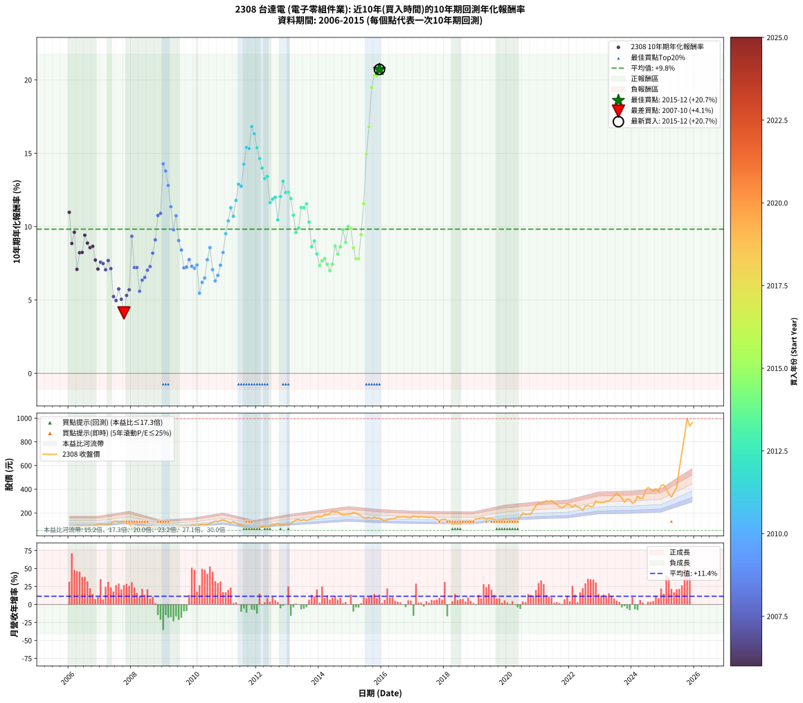

# 2308 台達電 - 本益比與未來報酬率分析

!!! info "報告資訊"
    - **股票代號**: 2308
    - **公司名稱**: 台達電
    - **產業別**: 電子零組件業
    - **分析期間**: 2006-2015 (120 個數據點)
    - **資料來源**: Type 12 (ShowMonthlyK_ChartFlow) 月收盤價與本益比
    - **報酬率口徑**: 含現金股利 (簡化: 年度合計，假設每年7/1入帳)
    - **報告生成時間**: 2026-01-10 20:30:31 CST

## 📈 視覺化圖表

### 圖表1: 本益比 vs 未來報酬率關係

*圖表1：2308 台達電 本益比與10年期未來報酬率關係 (2006-2015)*

### 圖表2: 歷年買入時點的10年期實際報酬率

*圖表2：2308 台達電 歷年買入時點的10年期實際報酬率 (2006-2015)*

## 📍 買點訊號說明

本報告提供兩種買點提示訊號（顯示於圖表2的股價子圖中）：

### ▲ 小綠色三角形（回測驗證）
- **計算方式**: 使用全部歷史資料計算本益比第25百分位數
- **用途**: 事後驗證，顯示歷史上哪些時點確實為低估區
- **限制**: 當下無法判斷，僅供回測參考
- **特性**: 後見之明（Look-Ahead Bias）

### ▲ 小橘色三角形（即時訊號）
- **計算方式**: 使用截至當月的過去5年資料計算本益比第25百分位數
- **用途**: 實際投資決策，當時即可判斷
- **優勢**: 可操作性強，符合實務需求
- **特性**: 無後見之明，滾動窗口計算

!!! tip "如何使用兩種訊號"
    - **綠色▲** 幫助理解歷史估值機會，驗證策略有效性
    - **橘色▲** 可作為實際買進參考，但仍需搭配基本面分析
    - 兩種訊號重疊時，表示即時判斷與事後驗證一致，信心度較高
    - 僅有綠色▲時，表示當時無法判斷（需要未來資料才能確認）
    - 僅有橘色▲時，表示即時判斷為買點，但事後可能不是最佳時機

## 📊 估值分析摘要

| 指標 | 數值 |
|:---:|:---:|
| **目前本益比** (2015-12) | **20.27 倍** |
| **歷史平均本益比** | 18.27 倍 |
| **估值水準** | 🟡 合理範圍 |
| **預期10年年化報酬率** | **+9.59%** |
| **歷史平均報酬率** | +9.83% |
| **相關係數 (R²)** | 0.0138 |
| **趨勢線斜率** | -0.1190 |

!!! abstract "核心洞察"
    目前本益比接近歷史平均，預期報酬率符合長期趨勢

    根據歷史數據回測，2308 台達電 在目前本益比 **20.3倍** 的估值水準下，
    預期未來10年年化報酬率約為 **+9.6%**。

    **重要提醒**: 本分析基於歷史數據統計，實際報酬率會受到公司基本面變化、產業趨勢、
    總體經濟環境等多重因素影響。R² = 0.01 表示本益比可解釋約 1.4% 的報酬率變異。

## 📈 歷史估值統計

### 最佳買點 (最高報酬率)

| 項目 | 數值 |
|:---:|:---:|
| 起始時間 | 2015-12 |
| 當時本益比 | 20.27 倍 |
| 起始價格 | 155.5 元 |
| 10年後價格 | 963.0 元 |
| **10年年化報酬率** | **+20.72%** |

### 最差買點 (最低報酬率)

| 項目 | 數值 |
|:---:|:---:|
| 起始時間 | 2007-10 |
| 當時本益比 | 18.79 倍 |
| 起始價格 | 130.0 元 |
| 10年後價格 | 145.0 元 |
| **10年年化報酬率** | **+4.12%** |

## 🎯 投資啟示

### 本益比與報酬率關係

趨勢線方程式: **y = -0.1190x + 11.9998**

!!! note "負相關"
    本益比與未來報酬率呈現負相關。較低的本益比通常帶來較高的未來報酬率，
    但相關性不算非常強。**估值仍是重要參考指標之一**。

### 估值區間建議

基於歷史數據分析:

- **🟢 低估區** (P/E < 14.6): 預期報酬率較高，可考慮增加持股
- **🟡 合理區** (P/E 14.6-21.9): 預期報酬率符合長期趨勢，正常持有
- **🔴 高估區** (P/E > 21.9): 預期報酬率較低，可考慮減碼或觀望

!!! danger "風險提示"
    - 過去表現不代表未來結果
    - 本分析假設公司基本面無重大結構性變化
    - 產業環境劇變可能使歷史規律失效
    - 應結合公司財報、產業趨勢、總體經濟等多重因素綜合判斷

!!! success "長期投資觀點"
    歷史數據顯示，在合理或低估的估值水準買入並長期持有，
    往往能獲得較佳的投資報酬。**耐心等待好價格**是價值投資的核心原則。

## 📊 數據品質

- **資料來源**: GoodInfo.tw Type 12 (ShowMonthlyK_ChartFlow)
- **資料頻率**: 月度收盤價與本益比
- **回測期間**: 2006-2015
- **數據點數量**: 120 個 (每個點代表一次10年期回測)

### 計算方法說明

1. **10年期年化報酬率**:
   - 對每個歷史時點，計算其後10年的實際投資報酬率
   - 期末價值(不含股利): 期末價格
   - 期末價值(含現金股利): 期末價格 + 持有期間內的現金股利合計 (簡化: 年度合計，假設每年7/1入帳)
   - 公式: 年化報酬率 = [(期末價值/期初價格)^(1/年數) - 1] × 100%

2. **本益比 (P/E Ratio)**:
   - 使用當時的月收盤價與EPS計算
   - 資料來源: Type 12 月度河流圖本益比數據

3. **趨勢線 (Linear Regression)**:
   - 使用最小平方法擬合線性趨勢線
   - R²值衡量本益比對報酬率的解釋能力

---

*本報告由 Stock Analysis System v1.9.0 自動生成*
*數據更新時間: 2026-01-10 20:30:31 CST*

## 📋 月度回測明細表

（每一列對應時間線圖中的一個買入點；可用來對照 SVG 圖上的每個點。）

| 買入月份 | 賣出月份 | 回測期限_年 | 實際持有年數 | 買入本益比_倍 | 買入收盤價_元 | 賣出收盤價_元 | 現金股利合計_元 | 總報酬率_pct | 年化報酬率_pct |
| --- | --- | --- | --- | --- | --- | --- | --- | --- | --- |
| 2006-01 | 2016-01 | 10 | 9.999 | 11.56 | 66.60 | 141.50 | 47.18 | +183.30 | +10.98 |
| 2006-02 | 2016-02 | 10 | 9.999 | 13.51 | 77.80 | 134.50 | 47.18 | +133.52 | +8.85 |
| 2006-03 | 2016-03 | 10 | 10.001 | 13.11 | 75.50 | 142.00 | 47.18 | +150.57 | +9.62 |
| 2006-04 | 2016-04 | 10 | 10.001 | 17.26 | 99.40 | 150.00 | 47.18 | +98.37 | +7.09 |
| 2006-05 | 2016-05 | 10 | 10.001 | 15.54 | 89.50 | 150.00 | 47.18 | +120.31 | +8.22 |
| 2006-06 | 2016-06 | 10 | 10.001 | 15.97 | 92.00 | 156.00 | 47.18 | +120.85 | +8.24 |
| 2006-07 | 2016-07 | 10 | 10.001 | 15.33 | 88.30 | 168.00 | 49.18 | +145.96 | +9.42 |
| 2006-08 | 2016-08 | 10 | 10.001 | 15.89 | 91.50 | 165.00 | 49.18 | +134.08 | +8.88 |
| 2006-09 | 2016-09 | 10 | 10.001 | 16.49 | 95.00 | 167.00 | 49.18 | +127.56 | +8.57 |
| 2006-10 | 2016-10 | 10 | 10.001 | 16.32 | 94.00 | 166.50 | 49.18 | +129.45 | +8.66 |
| 2006-11 | 2016-11 | 10 | 10.001 | 17.26 | 99.40 | 160.00 | 49.18 | +110.44 | +7.72 |
| 2006-12 | 2016-12 | 10 | 10.001 | 18.23 | 105.00 | 159.50 | 49.18 | +98.74 | +7.11 |
| 2007-01 | 2017-01 | 10 | 10.001 | 18.30 | 107.50 | 174.00 | 49.18 | +107.61 | +7.58 |
| 2007-02 | 2017-02 | 10 | 10.001 | 17.86 | 107.00 | 171.00 | 49.18 | +105.77 | +7.48 |
| 2007-03 | 2017-03 | 10 | 10.001 | 17.52 | 107.00 | 162.50 | 49.18 | +97.83 | +7.06 |
| 2007-04 | 2017-04 | 10 | 10.001 | 16.79 | 104.50 | 170.00 | 49.18 | +109.74 | +7.69 |
| 2007-05 | 2017-05 | 10 | 10.001 | 17.04 | 108.00 | 166.00 | 49.18 | +99.24 | +7.14 |
| 2007-06 | 2017-06 | 10 | 10.001 | 20.06 | 129.50 | 166.50 | 49.18 | +66.55 | +5.23 |
| 2007-07 | 2017-07 | 10 | 10.001 | 19.71 | 129.50 | 160.50 | 49.68 | +62.30 | +4.96 |
| 2007-08 | 2017-08 | 10 | 10.001 | 18.39 | 123.00 | 165.50 | 49.68 | +74.94 | +5.75 |
| 2007-09 | 2017-09 | 10 | 10.001 | 18.52 | 126.00 | 156.50 | 49.68 | +63.63 | +5.05 |
| 2007-10 | 2017-10 | 10 | 10.001 | 18.79 | 130.00 | 145.00 | 49.68 | +49.75 | +4.12 |
| 2007-11 | 2017-11 | 10 | 10.001 | 15.78 | 111.00 | 136.50 | 49.68 | +67.73 | +5.31 |
| 2007-12 | 2017-12 | 10 | 10.001 | 15.52 | 111.00 | 143.50 | 49.68 | +74.04 | +5.70 |
| 2008-01 | 2018-01 | 10 | 10.001 | 11.59 | 80.50 | 147.00 | 49.68 | +144.32 | +9.34 |
| 2008-02 | 2018-03 | 10 | 10.081 | 13.25 | 89.30 | 130.50 | 49.68 | +101.77 | +7.21 |
| 2008-03 | 2018-03 | 10 | 9.999 | 13.74 | 89.80 | 130.50 | 49.68 | +100.64 | +7.21 |
| 2008-04 | 2018-04 | 10 | 9.999 | 14.45 | 91.50 | 108.00 | 49.68 | +72.33 | +5.59 |
| 2008-05 | 2018-05 | 10 | 9.999 | 14.17 | 86.80 | 111.00 | 49.68 | +85.11 | +6.35 |
| 2008-06 | 2018-06 | 10 | 9.999 | 14.27 | 84.50 | 109.50 | 49.68 | +88.38 | +6.54 |
| 2008-07 | 2018-07 | 10 | 9.999 | 13.81 | 78.90 | 106.50 | 49.18 | +97.31 | +7.03 |
| 2008-08 | 2018-08 | 10 | 9.999 | 15.48 | 85.30 | 123.00 | 49.18 | +101.85 | +7.28 |
| 2008-09 | 2018-09 | 10 | 9.999 | 15.46 | 82.00 | 131.00 | 49.18 | +119.73 | +8.19 |
| 2008-10 | 2018-10 | 10 | 9.999 | 14.71 | 75.00 | 130.00 | 49.18 | +138.91 | +9.10 |
| 2008-11 | 2018-11 | 10 | 9.999 | 13.18 | 64.50 | 130.00 | 49.18 | +177.80 | +10.76 |
| 2008-12 | 2018-12 | 10 | 9.999 | 13.54 | 63.50 | 129.50 | 49.18 | +181.38 | +10.90 |
| 2009-01 | 2019-01 | 10 | 9.999 | 11.14 | 52.70 | 151.00 | 49.18 | +279.85 | +14.28 |
| 2009-02 | 2019-02 | 10 | 9.999 | 11.66 | 55.70 | 153.50 | 49.18 | +263.88 | +13.79 |
| 2009-03 | 2019-03 | 10 | 9.999 | 12.95 | 62.40 | 159.00 | 49.18 | +233.62 | +12.81 |
| 2009-04 | 2019-04 | 10 | 9.999 | 14.86 | 72.20 | 162.50 | 49.18 | +193.18 | +11.36 |
| 2009-05 | 2019-05 | 10 | 9.999 | 15.38 | 75.40 | 142.50 | 49.18 | +154.22 | +9.78 |
| 2009-06 | 2019-06 | 10 | 9.999 | 15.07 | 74.50 | 157.50 | 49.18 | +177.42 | +10.74 |
| 2009-07 | 2019-07 | 10 | 9.999 | 17.04 | 85.00 | 151.50 | 50.68 | +137.86 | +9.05 |
| 2009-08 | 2019-08 | 10 | 9.999 | 17.50 | 88.00 | 146.50 | 50.68 | +124.07 | +8.40 |
| 2009-09 | 2019-09 | 10 | 9.999 | 18.04 | 91.50 | 132.50 | 50.68 | +100.20 | +7.19 |
| 2009-10 | 2019-10 | 10 | 9.999 | 17.95 | 91.80 | 134.00 | 50.68 | +101.18 | +7.24 |
| 2009-11 | 2019-11 | 10 | 9.999 | 17.53 | 90.40 | 140.00 | 50.68 | +110.93 | +7.75 |
| 2009-12 | 2019-12 | 10 | 9.999 | 19.23 | 100.00 | 151.50 | 50.68 | +102.18 | +7.29 |
| 2010-01 | 2020-01 | 10 | 9.999 | 18.22 | 97.00 | 143.00 | 50.68 | +99.67 | +7.16 |
| 2010-02 | 2020-02 | 10 | 9.999 | 17.16 | 93.50 | 140.00 | 50.68 | +103.93 | +7.39 |
| 2010-03 | 2020-03 | 10 | 10.001 | 18.03 | 100.50 | 120.50 | 50.68 | +70.33 | +5.47 |
| 2010-04 | 2020-04 | 10 | 10.001 | 18.34 | 104.50 | 140.00 | 50.68 | +82.47 | +6.20 |
| 2010-05 | 2020-05 | 10 | 10.001 | 17.27 | 100.50 | 138.00 | 50.68 | +87.74 | +6.50 |
| 2010-06 | 2020-06 | 10 | 10.001 | 17.41 | 103.50 | 167.50 | 50.68 | +110.80 | +7.74 |
| 2010-07 | 2020-07 | 10 | 10.001 | 18.21 | 110.50 | 200.00 | 51.48 | +127.58 | +8.57 |
| 2010-08 | 2020-08 | 10 | 10.001 | 19.62 | 121.50 | 189.00 | 51.48 | +97.93 | +7.06 |
| 2010-09 | 2020-09 | 10 | 10.001 | 20.66 | 130.50 | 189.00 | 51.48 | +84.28 | +6.30 |
| 2010-10 | 2020-10 | 10 | 10.001 | 19.64 | 126.50 | 190.00 | 51.48 | +90.89 | +6.68 |
| 2010-11 | 2020-11 | 10 | 10.001 | 20.64 | 135.50 | 224.50 | 51.48 | +103.68 | +7.37 |
| 2010-12 | 2020-12 | 10 | 10.001 | 21.30 | 142.50 | 263.00 | 51.48 | +120.69 | +8.24 |
| 2011-01 | 2021-01 | 10 | 10.001 | 20.65 | 134.50 | 282.50 | 51.48 | +148.31 | +9.52 |
| 2011-02 | 2021-02 | 10 | 10.001 | 19.48 | 123.50 | 280.50 | 51.48 | +168.81 | +10.39 |
| 2011-03 | 2021-03 | 10 | 10.001 | 18.90 | 116.50 | 288.00 | 51.48 | +191.40 | +11.29 |
| 2011-04 | 2021-04 | 10 | 10.001 | 21.38 | 128.00 | 302.50 | 51.48 | +176.55 | +10.71 |
| 2011-05 | 2021-05 | 10 | 10.001 | 19.62 | 114.00 | 296.00 | 51.48 | +204.81 | +11.79 |
| 2011-06 | 2021-06 | 10 | 10.001 | 18.72 | 105.50 | 303.00 | 51.48 | +236.00 | +12.88 |
| 2011-07 | 2021-07 | 10 | 10.001 | 18.68 | 102.00 | 287.00 | 51.78 | +232.14 | +12.75 |
| 2011-08 | 2021-08 | 10 | 10.001 | 16.09 | 85.00 | 270.50 | 51.78 | +279.16 | +14.25 |
| 2011-09 | 2021-09 | 10 | 10.001 | 14.19 | 72.50 | 252.00 | 51.78 | +319.01 | +15.40 |
| 2011-10 | 2021-10 | 10 | 10.001 | 14.46 | 71.30 | 245.00 | 51.78 | +316.25 | +15.33 |
| 2011-11 | 2021-11 | 10 | 10.001 | 13.67 | 65.00 | 256.00 | 51.78 | +373.52 | +16.82 |
| 2011-12 | 2021-12 | 10 | 10.001 | 15.72 | 72.00 | 275.00 | 51.78 | +353.87 | +16.33 |
| 2012-01 | 2022-01 | 10 | 10.001 | 16.24 | 76.50 | 268.00 | 51.78 | +318.02 | +15.37 |
| 2012-02 | 2022-03 | 10 | 10.081 | 16.70 | 80.80 | 268.50 | 51.78 | +296.39 | +14.64 |
| 2012-03 | 2022-03 | 10 | 9.999 | 17.41 | 86.50 | 268.50 | 51.78 | +270.27 | +13.99 |
| 2012-04 | 2022-04 | 10 | 9.999 | 17.03 | 86.80 | 250.00 | 51.78 | +247.68 | +13.27 |
| 2012-05 | 2022-05 | 10 | 9.999 | 15.92 | 83.20 | 241.50 | 51.78 | +252.51 | +13.43 |
| 2012-06 | 2022-06 | 10 | 9.999 | 16.97 | 90.90 | 221.50 | 51.78 | +200.64 | +11.64 |
| 2012-07 | 2022-07 | 10 | 9.999 | 18.51 | 101.50 | 258.00 | 53.79 | +207.18 | +11.88 |
| 2012-08 | 2022-08 | 10 | 9.999 | 18.17 | 102.00 | 263.00 | 53.79 | +210.58 | +12.00 |
| 2012-09 | 2022-09 | 10 | 9.999 | 19.76 | 113.50 | 253.00 | 53.79 | +170.30 | +10.46 |
| 2012-10 | 2022-10 | 10 | 9.999 | 17.00 | 99.80 | 257.50 | 53.79 | +211.91 | +12.05 |
| 2012-11 | 2022-11 | 10 | 9.999 | 17.33 | 104.00 | 302.00 | 53.79 | +242.11 | +13.09 |
| 2012-12 | 2022-12 | 10 | 9.999 | 17.37 | 106.50 | 286.50 | 53.79 | +219.52 | +12.32 |
| 2013-01 | 2023-01 | 10 | 9.999 | 17.18 | 107.00 | 289.00 | 53.79 | +220.37 | +12.35 |
| 2013-02 | 2023-02 | 10 | 9.999 | 17.46 | 110.50 | 286.50 | 53.79 | +207.96 | +11.91 |
| 2013-03 | 2023-03 | 10 | 9.999 | 19.84 | 127.50 | 301.00 | 53.79 | +178.27 | +10.78 |
| 2013-04 | 2023-04 | 10 | 9.999 | 21.68 | 141.50 | 300.00 | 53.79 | +150.03 | +9.60 |
| 2013-05 | 2023-05 | 10 | 9.999 | 21.73 | 144.00 | 316.50 | 53.79 | +157.15 | +9.91 |
| 2013-06 | 2023-06 | 10 | 9.999 | 20.30 | 136.50 | 344.50 | 53.79 | +191.79 | +11.30 |
| 2013-07 | 2023-07 | 10 | 9.999 | 21.32 | 145.50 | 365.50 | 58.34 | +191.30 | +11.29 |
| 2013-08 | 2023-08 | 10 | 9.999 | 19.57 | 135.50 | 346.00 | 58.34 | +198.41 | +11.55 |
| 2013-09 | 2023-09 | 10 | 9.999 | 20.43 | 143.50 | 324.50 | 58.34 | +166.79 | +10.31 |
| 2013-10 | 2023-10 | 10 | 9.999 | 21.41 | 152.50 | 290.50 | 58.34 | +128.75 | +8.63 |
| 2013-11 | 2023-11 | 10 | 9.999 | 21.88 | 158.00 | 316.50 | 58.34 | +137.24 | +9.02 |
| 2013-12 | 2023-12 | 10 | 9.999 | 23.22 | 170.00 | 313.50 | 58.34 | +118.73 | +8.14 |
| 2014-01 | 2024-01 | 10 | 9.999 | 22.45 | 166.50 | 280.00 | 58.34 | +103.21 | +7.35 |
| 2014-02 | 2024-02 | 10 | 9.999 | 22.42 | 168.50 | 294.50 | 58.34 | +109.40 | +7.67 |
| 2014-03 | 2024-03 | 10 | 10.001 | 24.70 | 188.00 | 341.00 | 58.34 | +112.41 | +7.82 |
| 2014-04 | 2024-04 | 10 | 10.001 | 23.99 | 185.00 | 320.50 | 58.34 | +104.78 | +7.43 |
| 2014-05 | 2024-05 | 10 | 10.001 | 24.98 | 195.00 | 325.00 | 58.34 | +96.58 | +6.99 |
| 2014-06 | 2024-06 | 10 | 10.001 | 27.51 | 217.50 | 387.50 | 58.34 | +104.98 | +7.44 |
| 2014-07 | 2024-07 | 10 | 10.001 | 25.74 | 206.00 | 414.50 | 58.97 | +129.84 | +8.68 |
| 2014-08 | 2024-08 | 10 | 10.001 | 25.93 | 210.00 | 399.50 | 58.97 | +118.32 | +8.12 |
| 2014-09 | 2024-09 | 10 | 10.001 | 23.42 | 192.00 | 380.50 | 58.97 | +128.89 | +8.63 |
| 2014-10 | 2024-10 | 10 | 10.001 | 21.94 | 182.00 | 404.00 | 58.97 | +154.38 | +9.78 |
| 2014-11 | 2024-11 | 10 | 10.001 | 22.28 | 187.00 | 381.00 | 58.97 | +135.28 | +8.93 |
| 2014-12 | 2024-12 | 10 | 10.001 | 22.20 | 188.50 | 430.50 | 58.97 | +159.67 | +10.01 |
| 2015-01 | 2025-01 | 10 | 10.001 | 22.98 | 193.50 | 437.50 | 58.97 | +156.57 | +9.88 |
| 2015-02 | 2025-02 | 10 | 10.001 | 24.30 | 203.00 | 402.00 | 58.97 | +127.08 | +8.55 |
| 2015-03 | 2025-03 | 10 | 10.001 | 23.84 | 197.50 | 360.00 | 58.97 | +112.14 | +7.81 |
| 2015-04 | 2025-04 | 10 | 10.001 | 22.52 | 185.00 | 333.50 | 58.97 | +112.15 | +7.81 |
| 2015-05 | 2025-05 | 10 | 10.001 | 21.54 | 175.50 | 374.00 | 58.97 | +146.71 | +9.45 |
| 2015-06 | 2025-06 | 10 | 10.001 | 19.55 | 158.00 | 413.00 | 58.97 | +198.72 | +11.56 |
| 2015-07 | 2025-07 | 10 | 10.001 | 19.41 | 155.50 | 567.00 | 59.27 | +302.75 | +14.95 |
| 2015-08 | 2025-08 | 10 | 10.001 | 20.52 | 163.00 | 711.00 | 59.27 | +372.56 | +16.80 |
| 2015-09 | 2025-09 | 10 | 10.001 | 19.56 | 154.00 | 854.00 | 59.27 | +493.03 | +19.48 |
| 2015-10 | 2025-10 | 10 | 10.001 | 21.26 | 166.00 | 995.00 | 59.27 | +535.10 | +20.30 |
| 2015-11 | 2025-11 | 10 | 10.001 | 20.22 | 156.50 | 932.00 | 59.27 | +533.40 | +20.27 |
| 2015-12 | 2025-12 | 10 | 10.001 | 20.27 | 155.50 | 963.00 | 59.27 | +557.41 | +20.72 |
