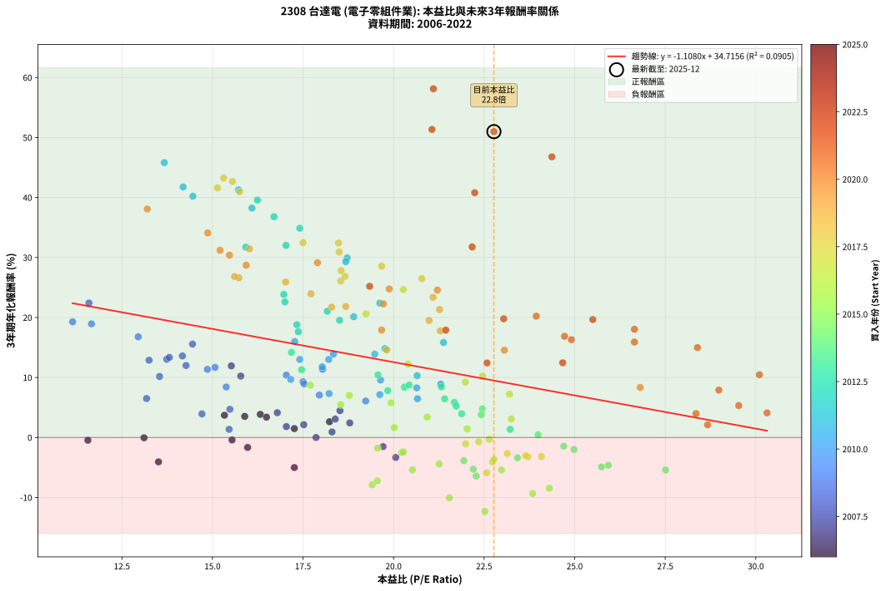
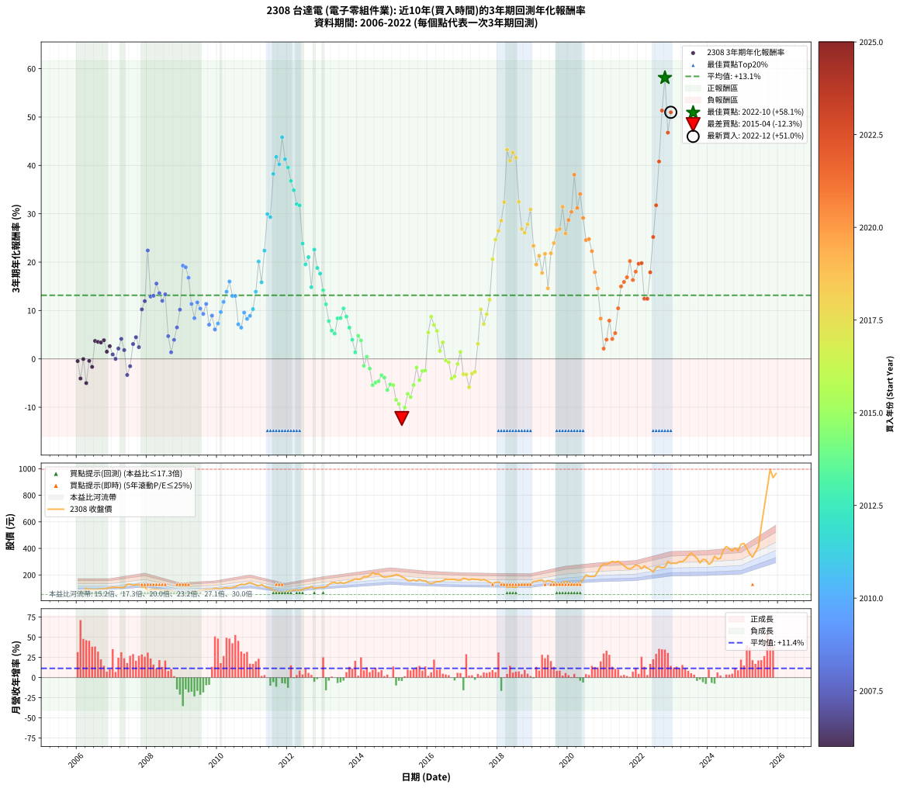

# 2308 台達電 - 本益比與未來報酬率分析

!!! info "報告資訊"
    - **股票代號**: 2308
    - **公司名稱**: 台達電
    - **產業別**: 電子零組件業
    - **分析期間**: 2006-2022 (204 個數據點)
    - **資料來源**: Type 12 (ShowMonthlyK_ChartFlow) 月收盤價與本益比
    - **報酬率口徑**: 含現金股利 (簡化: 年度合計，假設每年7/1入帳)
    - **報告生成時間**: 2026-01-09 20:31:43 CST

## 📈 視覺化圖表

### 圖表1: 本益比 vs 未來報酬率關係

*圖表1：2308 台達電 本益比與3年期未來報酬率關係 (2006-2022)*

### 圖表2: 歷年買入時點的3年期實際報酬率

*圖表2：2308 台達電 歷年買入時點的3年期實際報酬率 (2006-2022)*

## 📍 買點訊號說明

本報告提供兩種買點提示訊號（顯示於圖表2的股價子圖中）：

### ▲ 小綠色三角形（回測驗證）
- **計算方式**: 使用全部歷史資料計算本益比第25百分位數
- **用途**: 事後驗證，顯示歷史上哪些時點確實為低估區
- **限制**: 當下無法判斷，僅供回測參考
- **特性**: 後見之明（Look-Ahead Bias）

### ▲ 小橘色三角形（即時訊號）
- **計算方式**: 使用截至當月的過去5年資料計算本益比第25百分位數
- **用途**: 實際投資決策，當時即可判斷
- **優勢**: 可操作性強，符合實務需求
- **特性**: 無後見之明，滾動窗口計算

!!! tip "如何使用兩種訊號"
    - **綠色▲** 幫助理解歷史估值機會，驗證策略有效性
    - **橘色▲** 可作為實際買進參考，但仍需搭配基本面分析
    - 兩種訊號重疊時，表示即時判斷與事後驗證一致，信心度較高
    - 僅有綠色▲時，表示當時無法判斷（需要未來資料才能確認）
    - 僅有橘色▲時，表示即時判斷為買點，但事後可能不是最佳時機

## 📊 估值分析摘要

| 指標 | 數值 |
|:---:|:---:|
| **目前本益比** (2022-12) | **22.77 倍** |
| **歷史平均本益比** | 19.47 倍 |
| **估值水準** | 🟡 合理範圍 |
| **預期3年年化報酬率** | **+9.49%** |
| **歷史平均報酬率** | +13.15% |
| **相關係數 (R²)** | 0.0905 |
| **趨勢線斜率** | -1.1080 |

!!! abstract "核心洞察"
    目前本益比接近歷史平均，預期報酬率符合長期趨勢

    根據歷史數據回測，2308 台達電 在目前本益比 **22.8倍** 的估值水準下，
    預期未來3年年化報酬率約為 **+9.5%**。

    **重要提醒**: 本分析基於歷史數據統計，實際報酬率會受到公司基本面變化、產業趨勢、
    總體經濟環境等多重因素影響。R² = 0.09 表示本益比可解釋約 9.1% 的報酬率變異。

## 📈 歷史估值統計

### 最佳買點 (最高報酬率)

| 項目 | 數值 |
|:---:|:---:|
| 起始時間 | 2022-10 |
| 當時本益比 | 21.10 倍 |
| 起始價格 | 257.5 元 |
| 3年後價格 | 995.0 元 |
| **3年年化報酬率** | **+58.12%** |

### 最差買點 (最低報酬率)

| 項目 | 數值 |
|:---:|:---:|
| 起始時間 | 2015-04 |
| 當時本益比 | 22.52 倍 |
| 起始價格 | 185.0 元 |
| 3年後價格 | 108.0 元 |
| **3年年化報酬率** | **-12.32%** |

## 🎯 投資啟示

### 本益比與報酬率關係

趨勢線方程式: **y = -1.1080x + 34.7156**

!!! warning "強負相關"
    本益比與未來報酬率呈現強負相關。在高本益比時期買入，未來報酬率顯著較低；
    在低本益比時期買入，未來報酬率顯著較高。**估值紀律至關重要**。

### 估值區間建議

基於歷史數據分析:

- **🟢 低估區** (P/E < 15.6): 預期報酬率較高，可考慮增加持股
- **🟡 合理區** (P/E 15.6-23.4): 預期報酬率符合長期趨勢，正常持有
- **🔴 高估區** (P/E > 23.4): 預期報酬率較低，可考慮減碼或觀望

!!! danger "風險提示"
    - 過去表現不代表未來結果
    - 本分析假設公司基本面無重大結構性變化
    - 產業環境劇變可能使歷史規律失效
    - 應結合公司財報、產業趨勢、總體經濟等多重因素綜合判斷

!!! success "長期投資觀點"
    歷史數據顯示，在合理或低估的估值水準買入並長期持有，
    往往能獲得較佳的投資報酬。**耐心等待好價格**是價值投資的核心原則。

## 📊 數據品質

- **資料來源**: GoodInfo.tw Type 12 (ShowMonthlyK_ChartFlow)
- **資料頻率**: 月度收盤價與本益比
- **回測期間**: 2006-2022
- **數據點數量**: 204 個 (每個點代表一次3年期回測)

### 計算方法說明

1. **3年期年化報酬率**:
   - 對每個歷史時點，計算其後3年的實際投資報酬率
   - 期末價值(不含股利): 期末價格
   - 期末價值(含現金股利): 期末價格 + 持有期間內的現金股利合計 (簡化: 年度合計，假設每年7/1入帳)
   - 公式: 年化報酬率 = [(期末價值/期初價格)^(1/年數) - 1] × 100%

2. **本益比 (P/E Ratio)**:
   - 使用當時的月收盤價與EPS計算
   - 資料來源: Type 12 月度河流圖本益比數據

3. **趨勢線 (Linear Regression)**:
   - 使用最小平方法擬合線性趨勢線
   - R²值衡量本益比對報酬率的解釋能力

---

*本報告由 Stock Analysis System v1.9.0 自動生成*
*數據更新時間: 2026-01-09 20:31:43 CST*

## 📋 月度回測明細表

（每一列對應時間線圖中的一個買入點；可用來對照 SVG 圖上的每個點。）

| 買入月份 | 賣出月份 | 回測期限_年 | 實際持有年數 | 買入本益比_倍 | 買入收盤價_元 | 賣出收盤價_元 | 現金股利合計_元 | 總報酬率_pct | 年化報酬率_pct |
| --- | --- | --- | --- | --- | --- | --- | --- | --- | --- |
| 2006-01 | 2009-01 | 3 | 3.001 | 11.56 | 66.60 | 52.70 | 13.00 | -1.35 | -0.45 |
| 2006-02 | 2009-02 | 3 | 3.001 | 13.51 | 77.80 | 55.70 | 13.00 | -11.70 | -4.06 |
| 2006-03 | 2009-03 | 3 | 3.001 | 13.11 | 75.50 | 62.40 | 13.00 | -0.13 | -0.04 |
| 2006-04 | 2009-04 | 3 | 3.001 | 17.26 | 99.40 | 72.20 | 13.00 | -14.29 | -5.01 |
| 2006-05 | 2009-05 | 3 | 3.001 | 15.54 | 89.50 | 75.40 | 13.00 | -1.23 | -0.41 |
| 2006-06 | 2009-06 | 3 | 3.001 | 15.97 | 92.00 | 74.50 | 13.00 | -4.89 | -1.66 |
| 2006-07 | 2009-07 | 3 | 3.001 | 15.33 | 88.30 | 85.00 | 13.50 | +11.55 | +3.71 |
| 2006-08 | 2009-08 | 3 | 3.001 | 15.89 | 91.50 | 88.00 | 13.50 | +10.93 | +3.52 |
| 2006-09 | 2009-09 | 3 | 3.001 | 16.49 | 95.00 | 91.50 | 13.50 | +10.53 | +3.39 |
| 2006-10 | 2009-10 | 3 | 3.001 | 16.32 | 94.00 | 91.80 | 13.50 | +12.02 | +3.86 |
| 2006-11 | 2009-11 | 3 | 3.001 | 17.26 | 99.40 | 90.40 | 13.50 | +4.53 | +1.49 |
| 2006-12 | 2009-12 | 3 | 3.001 | 18.23 | 105.00 | 100.00 | 13.50 | +8.10 | +2.63 |
| 2007-01 | 2010-01 | 3 | 3.001 | 18.30 | 107.50 | 97.00 | 13.50 | +2.79 | +0.92 |
| 2007-02 | 2010-02 | 3 | 3.001 | 17.86 | 107.00 | 93.50 | 13.50 | +0.00 | +0.00 |
| 2007-03 | 2010-03 | 3 | 3.001 | 17.52 | 107.00 | 100.50 | 13.50 | +6.54 | +2.13 |
| 2007-04 | 2010-04 | 3 | 3.001 | 16.79 | 104.50 | 104.50 | 13.50 | +12.92 | +4.13 |
| 2007-05 | 2010-05 | 3 | 3.001 | 17.04 | 108.00 | 100.50 | 13.50 | +5.56 | +1.82 |
| 2007-06 | 2010-06 | 3 | 3.001 | 20.06 | 129.50 | 103.50 | 13.50 | -9.65 | -3.33 |
| 2007-07 | 2010-07 | 3 | 3.001 | 19.71 | 129.50 | 110.50 | 13.20 | -4.48 | -1.52 |
| 2007-08 | 2010-08 | 3 | 3.001 | 18.39 | 123.00 | 121.50 | 13.20 | +9.51 | +3.07 |
| 2007-09 | 2010-09 | 3 | 3.001 | 18.52 | 126.00 | 130.50 | 13.20 | +14.05 | +4.48 |
| 2007-10 | 2010-10 | 3 | 3.001 | 18.79 | 130.00 | 126.50 | 13.20 | +7.46 | +2.43 |
| 2007-11 | 2010-11 | 3 | 3.001 | 15.78 | 111.00 | 135.50 | 13.20 | +33.96 | +10.23 |
| 2007-12 | 2010-12 | 3 | 3.001 | 15.52 | 111.00 | 142.50 | 13.20 | +40.27 | +11.94 |
| 2008-01 | 2011-01 | 3 | 3.001 | 11.59 | 80.50 | 134.50 | 13.20 | +83.48 | +22.42 |
| 2008-02 | 2011-03 | 3 | 3.080 | 13.25 | 89.30 | 116.50 | 13.20 | +45.24 | +12.88 |
| 2008-03 | 2011-03 | 3 | 2.998 | 13.74 | 89.80 | 116.50 | 13.20 | +44.43 | +13.05 |
| 2008-04 | 2011-04 | 3 | 2.998 | 14.45 | 91.50 | 128.00 | 13.20 | +54.32 | +15.57 |
| 2008-05 | 2011-05 | 3 | 2.998 | 14.17 | 86.80 | 114.00 | 13.20 | +46.54 | +13.59 |
| 2008-06 | 2011-06 | 3 | 2.998 | 14.27 | 84.50 | 105.50 | 13.20 | +40.47 | +12.00 |
| 2008-07 | 2011-07 | 3 | 2.998 | 13.81 | 78.90 | 102.00 | 12.89 | +45.62 | +13.36 |
| 2008-08 | 2011-08 | 3 | 2.998 | 15.48 | 85.30 | 85.00 | 12.89 | +14.76 | +4.70 |
| 2008-09 | 2011-09 | 3 | 2.998 | 15.46 | 82.00 | 72.50 | 12.89 | +4.14 | +1.36 |
| 2008-10 | 2011-10 | 3 | 2.998 | 14.71 | 75.00 | 71.30 | 12.89 | +12.26 | +3.93 |
| 2008-11 | 2011-11 | 3 | 2.998 | 13.18 | 64.50 | 65.00 | 12.89 | +20.77 | +6.50 |
| 2008-12 | 2011-12 | 3 | 2.998 | 13.54 | 63.50 | 72.00 | 12.89 | +33.69 | +10.17 |
| 2009-01 | 2012-01 | 3 | 2.998 | 11.14 | 52.70 | 76.50 | 12.89 | +69.63 | +19.28 |
| 2009-02 | 2012-02 | 3 | 2.998 | 11.66 | 55.70 | 80.80 | 12.89 | +68.21 | +18.94 |
| 2009-03 | 2012-03 | 3 | 3.001 | 12.95 | 62.40 | 86.50 | 12.89 | +59.29 | +16.78 |
| 2009-04 | 2012-04 | 3 | 3.001 | 14.86 | 72.20 | 86.80 | 12.89 | +38.08 | +11.35 |
| 2009-05 | 2012-05 | 3 | 3.001 | 15.38 | 75.40 | 83.20 | 12.89 | +27.45 | +8.42 |
| 2009-06 | 2012-06 | 3 | 3.001 | 15.07 | 74.50 | 90.90 | 12.89 | +39.32 | +11.68 |
| 2009-07 | 2012-07 | 3 | 3.001 | 17.04 | 85.00 | 101.50 | 12.89 | +34.57 | +10.40 |
| 2009-08 | 2012-08 | 3 | 3.001 | 17.50 | 88.00 | 102.00 | 12.89 | +30.55 | +9.29 |
| 2009-09 | 2012-09 | 3 | 3.001 | 18.04 | 91.50 | 113.50 | 12.89 | +38.13 | +11.37 |
| 2009-10 | 2012-10 | 3 | 3.001 | 17.95 | 91.80 | 99.80 | 12.89 | +22.75 | +7.07 |
| 2009-11 | 2012-11 | 3 | 3.001 | 17.53 | 90.40 | 104.00 | 12.89 | +29.30 | +8.94 |
| 2009-12 | 2012-12 | 3 | 3.001 | 19.23 | 100.00 | 106.50 | 12.89 | +19.39 | +6.08 |
| 2010-01 | 2013-01 | 3 | 3.001 | 18.22 | 97.00 | 107.00 | 12.89 | +23.60 | +7.32 |
| 2010-02 | 2013-02 | 3 | 3.001 | 17.16 | 93.50 | 110.50 | 12.89 | +31.97 | +9.68 |
| 2010-03 | 2013-03 | 3 | 3.001 | 18.03 | 100.50 | 127.50 | 12.89 | +39.69 | +11.78 |
| 2010-04 | 2013-04 | 3 | 3.001 | 18.34 | 104.50 | 141.50 | 12.89 | +47.74 | +13.89 |
| 2010-05 | 2013-05 | 3 | 3.001 | 17.27 | 100.50 | 144.00 | 12.89 | +56.11 | +16.00 |
| 2010-06 | 2013-06 | 3 | 3.001 | 17.41 | 103.50 | 136.50 | 12.89 | +44.34 | +13.01 |
| 2010-07 | 2013-07 | 3 | 3.001 | 18.21 | 110.50 | 145.50 | 13.98 | +44.33 | +13.01 |
| 2010-08 | 2013-08 | 3 | 3.001 | 19.62 | 121.50 | 135.50 | 13.98 | +23.03 | +7.15 |
| 2010-09 | 2013-09 | 3 | 3.001 | 20.66 | 130.50 | 143.50 | 13.98 | +20.67 | +6.46 |
| 2010-10 | 2013-10 | 3 | 3.001 | 19.64 | 126.50 | 152.50 | 13.98 | +31.60 | +9.58 |
| 2010-11 | 2013-11 | 3 | 3.001 | 20.64 | 135.50 | 158.00 | 13.98 | +26.92 | +8.27 |
| 2010-12 | 2013-12 | 3 | 3.001 | 21.30 | 142.50 | 170.00 | 13.98 | +29.11 | +8.89 |
| 2011-01 | 2014-01 | 3 | 3.001 | 20.65 | 134.50 | 166.50 | 13.98 | +34.19 | +10.30 |
| 2011-02 | 2014-02 | 3 | 3.001 | 19.48 | 123.50 | 168.50 | 13.98 | +47.76 | +13.89 |
| 2011-03 | 2014-03 | 3 | 3.001 | 18.90 | 116.50 | 188.00 | 13.98 | +73.37 | +20.13 |
| 2011-04 | 2014-04 | 3 | 3.001 | 21.38 | 128.00 | 185.00 | 13.98 | +55.45 | +15.84 |
| 2011-05 | 2014-05 | 3 | 3.001 | 19.62 | 114.00 | 195.00 | 13.98 | +83.32 | +22.38 |
| 2011-06 | 2014-06 | 3 | 3.001 | 18.72 | 105.50 | 217.50 | 13.98 | +119.41 | +29.94 |
| 2011-07 | 2014-07 | 3 | 3.001 | 18.68 | 102.00 | 206.00 | 14.59 | +116.26 | +29.31 |
| 2011-08 | 2014-08 | 3 | 3.001 | 16.09 | 85.00 | 210.00 | 14.59 | +164.22 | +38.24 |
| 2011-09 | 2014-09 | 3 | 3.001 | 14.19 | 72.50 | 192.00 | 14.59 | +184.94 | +41.76 |
| 2011-10 | 2014-10 | 3 | 3.001 | 14.46 | 71.30 | 182.00 | 14.59 | +175.72 | +40.21 |
| 2011-11 | 2014-11 | 3 | 3.001 | 13.67 | 65.00 | 187.00 | 14.59 | +210.13 | +45.82 |
| 2011-12 | 2014-12 | 3 | 3.001 | 15.72 | 72.00 | 188.50 | 14.59 | +182.06 | +41.28 |
| 2012-01 | 2015-01 | 3 | 3.001 | 16.24 | 76.50 | 193.50 | 14.59 | +172.01 | +39.58 |
| 2012-02 | 2015-03 | 3 | 3.080 | 16.70 | 80.80 | 197.50 | 14.59 | +162.48 | +36.79 |
| 2012-03 | 2015-03 | 3 | 2.998 | 17.41 | 86.50 | 197.50 | 14.59 | +145.18 | +34.87 |
| 2012-04 | 2015-04 | 3 | 2.998 | 17.03 | 86.80 | 185.00 | 14.59 | +129.94 | +32.01 |
| 2012-05 | 2015-05 | 3 | 2.998 | 15.92 | 83.20 | 175.50 | 14.59 | +128.47 | +31.73 |
| 2012-06 | 2015-06 | 3 | 2.998 | 16.97 | 90.90 | 158.00 | 14.59 | +89.86 | +23.84 |
| 2012-07 | 2015-07 | 3 | 2.998 | 18.51 | 101.50 | 155.50 | 17.79 | +70.73 | +19.53 |
| 2012-08 | 2015-08 | 3 | 2.998 | 18.17 | 102.00 | 163.00 | 17.79 | +77.25 | +21.04 |
| 2012-09 | 2015-09 | 3 | 2.998 | 19.76 | 113.50 | 154.00 | 17.79 | +51.36 | +14.83 |
| 2012-10 | 2015-10 | 3 | 2.998 | 17.00 | 99.80 | 166.00 | 17.79 | +84.16 | +22.59 |
| 2012-11 | 2015-11 | 3 | 2.998 | 17.33 | 104.00 | 156.50 | 17.79 | +67.59 | +18.80 |
| 2012-12 | 2015-12 | 3 | 2.998 | 17.37 | 106.50 | 155.50 | 17.79 | +62.71 | +17.63 |
| 2013-01 | 2016-01 | 3 | 2.998 | 17.18 | 107.00 | 141.50 | 17.79 | +48.87 | +14.19 |
| 2013-02 | 2016-02 | 3 | 2.998 | 17.46 | 110.50 | 134.50 | 17.79 | +37.82 | +11.29 |
| 2013-03 | 2016-03 | 3 | 3.001 | 19.84 | 127.50 | 142.00 | 17.79 | +25.33 | +7.81 |
| 2013-04 | 2016-04 | 3 | 3.001 | 21.68 | 141.50 | 150.00 | 17.79 | +18.58 | +5.84 |
| 2013-05 | 2016-05 | 3 | 3.001 | 21.73 | 144.00 | 150.00 | 17.79 | +16.52 | +5.23 |
| 2013-06 | 2016-06 | 3 | 3.001 | 20.30 | 136.50 | 156.00 | 17.79 | +27.32 | +8.38 |
| 2013-07 | 2016-07 | 3 | 3.001 | 21.32 | 145.50 | 168.00 | 17.50 | +27.49 | +8.43 |
| 2013-08 | 2016-08 | 3 | 3.001 | 19.57 | 135.50 | 165.00 | 17.50 | +34.69 | +10.43 |
| 2013-09 | 2016-09 | 3 | 3.001 | 20.43 | 143.50 | 167.00 | 17.50 | +28.57 | +8.74 |
| 2013-10 | 2016-10 | 3 | 3.001 | 21.41 | 152.50 | 166.50 | 17.50 | +20.66 | +6.46 |
| 2013-11 | 2016-11 | 3 | 3.001 | 21.88 | 158.00 | 160.00 | 17.50 | +12.34 | +3.95 |
| 2013-12 | 2016-12 | 3 | 3.001 | 23.22 | 170.00 | 159.50 | 17.50 | +4.12 | +1.35 |
| 2014-01 | 2017-01 | 3 | 3.001 | 22.45 | 166.50 | 174.00 | 17.50 | +15.02 | +4.77 |
| 2014-02 | 2017-02 | 3 | 3.001 | 22.42 | 168.50 | 171.00 | 17.50 | +11.87 | +3.81 |
| 2014-03 | 2017-03 | 3 | 3.001 | 24.70 | 188.00 | 162.50 | 17.50 | -4.26 | -1.44 |
| 2014-04 | 2017-04 | 3 | 3.001 | 23.99 | 185.00 | 170.00 | 17.50 | +1.35 | +0.45 |
| 2014-05 | 2017-05 | 3 | 3.001 | 24.98 | 195.00 | 166.00 | 17.50 | -5.90 | -2.01 |
| 2014-06 | 2017-06 | 3 | 3.001 | 27.51 | 217.50 | 166.50 | 17.50 | -15.40 | -5.42 |
| 2014-07 | 2017-07 | 3 | 3.001 | 25.74 | 206.00 | 160.50 | 16.70 | -13.98 | -4.89 |
| 2014-08 | 2017-08 | 3 | 3.001 | 25.93 | 210.00 | 165.50 | 16.70 | -13.24 | -4.62 |
| 2014-09 | 2017-09 | 3 | 3.001 | 23.42 | 192.00 | 156.50 | 16.70 | -9.79 | -3.38 |
| 2014-10 | 2017-10 | 3 | 3.001 | 21.94 | 182.00 | 145.00 | 16.70 | -11.15 | -3.86 |
| 2014-11 | 2017-11 | 3 | 3.001 | 22.28 | 187.00 | 136.50 | 16.70 | -18.07 | -6.43 |
| 2014-12 | 2017-12 | 3 | 3.001 | 22.20 | 188.50 | 143.50 | 16.70 | -15.01 | -5.28 |
| 2015-01 | 2018-01 | 3 | 3.001 | 22.98 | 193.50 | 147.00 | 16.70 | -15.40 | -5.42 |
| 2015-02 | 2018-02 | 3 | 3.001 | 24.30 | 203.00 | 139.00 | 16.70 | -23.30 | -8.46 |
| 2015-03 | 2018-03 | 3 | 3.001 | 23.84 | 197.50 | 130.50 | 16.70 | -25.47 | -9.33 |
| 2015-04 | 2018-04 | 3 | 3.001 | 22.52 | 185.00 | 108.00 | 16.70 | -32.59 | -12.32 |
| 2015-05 | 2018-05 | 3 | 3.001 | 21.54 | 175.50 | 111.00 | 16.70 | -27.24 | -10.05 |
| 2015-06 | 2018-06 | 3 | 3.001 | 19.55 | 158.00 | 109.50 | 16.70 | -20.13 | -7.22 |
| 2015-07 | 2018-07 | 3 | 3.001 | 19.41 | 155.50 | 106.50 | 15.00 | -21.86 | -7.89 |
| 2015-08 | 2018-08 | 3 | 3.001 | 20.52 | 163.00 | 123.00 | 15.00 | -15.34 | -5.40 |
| 2015-09 | 2018-09 | 3 | 3.001 | 19.56 | 154.00 | 131.00 | 15.00 | -5.19 | -1.76 |
| 2015-10 | 2018-10 | 3 | 3.001 | 21.26 | 166.00 | 130.00 | 15.00 | -12.65 | -4.41 |
| 2015-11 | 2018-11 | 3 | 3.001 | 20.22 | 156.50 | 130.00 | 15.00 | -7.35 | -2.51 |
| 2015-12 | 2018-12 | 3 | 3.001 | 20.27 | 155.50 | 129.50 | 15.00 | -7.07 | -2.42 |
| 2016-01 | 2019-01 | 3 | 3.001 | 18.54 | 141.50 | 151.00 | 15.00 | +17.31 | +5.47 |
| 2016-02 | 2019-03 | 3 | 3.080 | 17.70 | 134.50 | 159.00 | 15.00 | +29.37 | +8.72 |
| 2016-03 | 2019-03 | 3 | 2.998 | 18.78 | 142.00 | 159.00 | 15.00 | +22.54 | +7.01 |
| 2016-04 | 2019-04 | 3 | 2.998 | 19.93 | 150.00 | 162.50 | 15.00 | +18.33 | +5.78 |
| 2016-05 | 2019-05 | 3 | 2.998 | 20.02 | 150.00 | 142.50 | 15.00 | +5.00 | +1.64 |
| 2016-06 | 2019-06 | 3 | 2.998 | 20.93 | 156.00 | 157.50 | 15.00 | +10.58 | +3.41 |
| 2016-07 | 2019-07 | 3 | 2.998 | 22.64 | 168.00 | 151.50 | 15.00 | -0.89 | -0.30 |
| 2016-08 | 2019-08 | 3 | 2.998 | 22.35 | 165.00 | 146.50 | 15.00 | -2.12 | -0.71 |
| 2016-09 | 2019-09 | 3 | 2.998 | 22.73 | 167.00 | 132.50 | 15.00 | -11.68 | -4.06 |
| 2016-10 | 2019-10 | 3 | 2.998 | 22.77 | 166.50 | 134.00 | 15.00 | -10.51 | -3.64 |
| 2016-11 | 2019-11 | 3 | 2.998 | 21.99 | 160.00 | 140.00 | 15.00 | -3.12 | -1.05 |
| 2016-12 | 2019-12 | 3 | 2.998 | 22.03 | 159.50 | 151.50 | 15.00 | +4.39 | +1.44 |
| 2017-01 | 2020-01 | 3 | 2.998 | 24.08 | 174.00 | 143.00 | 15.00 | -9.20 | -3.17 |
| 2017-02 | 2020-02 | 3 | 2.998 | 23.71 | 171.00 | 140.00 | 15.00 | -9.36 | -3.22 |
| 2017-03 | 2020-03 | 3 | 3.001 | 22.57 | 162.50 | 120.50 | 15.00 | -16.62 | -5.88 |
| 2017-04 | 2020-04 | 3 | 3.001 | 23.65 | 170.00 | 140.00 | 15.00 | -8.82 | -3.03 |
| 2017-05 | 2020-05 | 3 | 3.001 | 23.14 | 166.00 | 138.00 | 15.00 | -7.83 | -2.68 |
| 2017-06 | 2020-06 | 3 | 3.001 | 23.25 | 166.50 | 167.50 | 15.00 | +9.61 | +3.11 |
| 2017-07 | 2020-07 | 3 | 3.001 | 22.46 | 160.50 | 200.00 | 15.00 | +33.96 | +10.23 |
| 2017-08 | 2020-08 | 3 | 3.001 | 23.20 | 165.50 | 189.00 | 15.00 | +23.26 | +7.22 |
| 2017-09 | 2020-09 | 3 | 3.001 | 21.98 | 156.50 | 189.00 | 15.00 | +30.35 | +9.24 |
| 2017-10 | 2020-10 | 3 | 3.001 | 20.40 | 145.00 | 190.00 | 15.00 | +41.38 | +12.23 |
| 2017-11 | 2020-11 | 3 | 3.001 | 19.24 | 136.50 | 224.50 | 15.00 | +75.46 | +20.61 |
| 2017-12 | 2020-12 | 3 | 3.001 | 20.27 | 143.50 | 263.00 | 15.00 | +93.73 | +24.65 |
| 2018-01 | 2021-01 | 3 | 3.001 | 20.78 | 147.00 | 282.50 | 15.00 | +102.38 | +26.48 |
| 2018-02 | 2021-02 | 3 | 3.001 | 19.67 | 139.00 | 280.50 | 15.00 | +112.59 | +28.57 |
| 2018-03 | 2021-03 | 3 | 3.001 | 18.48 | 130.50 | 288.00 | 15.00 | +132.18 | +32.41 |
| 2018-04 | 2021-04 | 3 | 3.001 | 15.31 | 108.00 | 302.50 | 15.00 | +193.98 | +43.24 |
| 2018-05 | 2021-05 | 3 | 3.001 | 15.75 | 111.00 | 296.00 | 15.00 | +180.18 | +40.97 |
| 2018-06 | 2021-06 | 3 | 3.001 | 15.55 | 109.50 | 303.00 | 15.00 | +190.41 | +42.66 |
| 2018-07 | 2021-07 | 3 | 3.001 | 15.14 | 106.50 | 287.00 | 15.50 | +184.04 | +41.61 |
| 2018-08 | 2021-08 | 3 | 3.001 | 17.50 | 123.00 | 270.50 | 15.50 | +132.52 | +32.47 |
| 2018-09 | 2021-09 | 3 | 3.001 | 18.66 | 131.00 | 252.00 | 15.50 | +104.20 | +26.86 |
| 2018-10 | 2021-10 | 3 | 3.001 | 18.54 | 130.00 | 245.00 | 15.50 | +100.38 | +26.07 |
| 2018-11 | 2021-11 | 3 | 3.001 | 18.55 | 130.00 | 256.00 | 15.50 | +108.85 | +27.82 |
| 2018-12 | 2021-12 | 3 | 3.001 | 18.50 | 129.50 | 275.00 | 15.50 | +124.32 | +30.90 |
| 2019-01 | 2022-01 | 3 | 3.001 | 21.09 | 151.00 | 268.00 | 15.50 | +87.75 | +23.36 |
| 2019-02 | 2022-02 | 3 | 3.001 | 20.98 | 153.50 | 246.50 | 15.50 | +70.68 | +19.50 |
| 2019-03 | 2022-03 | 3 | 3.001 | 21.27 | 159.00 | 268.50 | 15.50 | +78.62 | +21.33 |
| 2019-04 | 2022-04 | 3 | 3.001 | 21.29 | 162.50 | 250.00 | 15.50 | +63.38 | +17.78 |
| 2019-05 | 2022-05 | 3 | 3.001 | 18.29 | 142.50 | 241.50 | 15.50 | +80.35 | +21.72 |
| 2019-06 | 2022-06 | 3 | 3.001 | 19.81 | 157.50 | 221.50 | 15.50 | +50.48 | +14.59 |
| 2019-07 | 2022-07 | 3 | 3.001 | 18.68 | 151.50 | 258.00 | 16.00 | +80.86 | +21.83 |
| 2019-08 | 2022-08 | 3 | 3.001 | 17.72 | 146.50 | 263.00 | 16.00 | +90.44 | +23.95 |
| 2019-09 | 2022-09 | 3 | 3.001 | 15.73 | 132.50 | 253.00 | 16.00 | +103.02 | +26.62 |
| 2019-10 | 2022-10 | 3 | 3.001 | 15.61 | 134.00 | 257.50 | 16.00 | +104.10 | +26.84 |
| 2019-11 | 2022-11 | 3 | 3.001 | 16.02 | 140.00 | 302.00 | 16.00 | +127.14 | +31.44 |
| 2019-12 | 2022-12 | 3 | 3.001 | 17.02 | 151.50 | 286.50 | 16.00 | +99.67 | +25.92 |
| 2020-01 | 2023-01 | 3 | 3.001 | 15.93 | 143.00 | 289.00 | 16.00 | +113.29 | +28.72 |
| 2020-02 | 2023-03 | 3 | 3.080 | 15.47 | 140.00 | 301.00 | 16.00 | +126.43 | +30.39 |
| 2020-03 | 2023-03 | 3 | 2.998 | 13.20 | 120.50 | 301.00 | 16.00 | +163.07 | +38.08 |
| 2020-04 | 2023-04 | 3 | 2.998 | 15.21 | 140.00 | 300.00 | 16.00 | +125.71 | +31.20 |
| 2020-05 | 2023-05 | 3 | 2.998 | 14.87 | 138.00 | 316.50 | 16.00 | +140.94 | +34.09 |
| 2020-06 | 2023-06 | 3 | 2.998 | 17.90 | 167.50 | 344.50 | 16.00 | +115.22 | +29.13 |
| 2020-07 | 2023-07 | 3 | 2.998 | 21.21 | 200.00 | 365.50 | 20.84 | +93.17 | +24.56 |
| 2020-08 | 2023-08 | 3 | 2.998 | 19.88 | 189.00 | 346.00 | 20.84 | +94.10 | +24.76 |
| 2020-09 | 2023-09 | 3 | 2.998 | 19.72 | 189.00 | 324.50 | 20.84 | +82.72 | +22.27 |
| 2020-10 | 2023-10 | 3 | 2.998 | 19.67 | 190.00 | 290.50 | 20.84 | +63.86 | +17.91 |
| 2020-11 | 2023-11 | 3 | 2.998 | 23.06 | 224.50 | 316.50 | 20.84 | +50.26 | +14.55 |
| 2020-12 | 2023-12 | 3 | 2.998 | 26.81 | 263.00 | 313.50 | 20.84 | +27.13 | +8.33 |
| 2021-01 | 2024-01 | 3 | 2.998 | 28.67 | 282.50 | 280.00 | 20.84 | +6.49 | +2.12 |
| 2021-02 | 2024-02 | 3 | 2.998 | 28.35 | 280.50 | 294.50 | 20.84 | +12.42 | +3.98 |
| 2021-03 | 2024-03 | 3 | 3.001 | 28.98 | 288.00 | 341.00 | 20.84 | +25.64 | +7.90 |
| 2021-04 | 2024-04 | 3 | 3.001 | 30.31 | 302.50 | 320.50 | 20.84 | +12.84 | +4.11 |
| 2021-05 | 2024-05 | 3 | 3.001 | 29.53 | 296.00 | 325.00 | 20.84 | +16.84 | +5.32 |
| 2021-06 | 2024-06 | 3 | 3.001 | 30.10 | 303.00 | 387.50 | 20.84 | +34.77 | +10.45 |
| 2021-07 | 2024-07 | 3 | 3.001 | 28.39 | 287.00 | 414.50 | 21.77 | +52.01 | +14.98 |
| 2021-08 | 2024-08 | 3 | 3.001 | 26.65 | 270.50 | 399.50 | 21.77 | +55.74 | +15.91 |
| 2021-09 | 2024-09 | 3 | 3.001 | 24.72 | 252.00 | 380.50 | 21.77 | +59.63 | +16.87 |
| 2021-10 | 2024-10 | 3 | 3.001 | 23.94 | 245.00 | 404.00 | 21.77 | +73.78 | +20.22 |
| 2021-11 | 2024-11 | 3 | 3.001 | 24.91 | 256.00 | 381.00 | 21.77 | +57.33 | +16.30 |
| 2021-12 | 2024-12 | 3 | 3.001 | 26.65 | 275.00 | 430.50 | 21.77 | +64.46 | +18.03 |
| 2022-01 | 2025-01 | 3 | 3.001 | 25.50 | 268.00 | 437.50 | 21.77 | +71.37 | +19.66 |
| 2022-02 | 2025-02 | 3 | 3.001 | 23.04 | 246.50 | 402.00 | 21.77 | +71.91 | +19.79 |
| 2022-03 | 2025-03 | 3 | 3.001 | 24.67 | 268.50 | 360.00 | 21.77 | +42.19 | +12.45 |
| 2022-04 | 2025-04 | 3 | 3.001 | 22.58 | 250.00 | 333.50 | 21.77 | +42.11 | +12.42 |
| 2022-05 | 2025-05 | 3 | 3.001 | 21.44 | 241.50 | 374.00 | 21.77 | +63.88 | +17.89 |
| 2022-06 | 2025-06 | 3 | 3.001 | 19.34 | 221.50 | 413.00 | 21.77 | +96.28 | +25.20 |
| 2022-07 | 2025-07 | 3 | 3.001 | 22.17 | 258.00 | 567.00 | 23.27 | +128.79 | +31.76 |
| 2022-08 | 2025-08 | 3 | 3.001 | 22.24 | 263.00 | 711.00 | 23.27 | +179.19 | +40.80 |
| 2022-09 | 2025-09 | 3 | 3.001 | 21.06 | 253.00 | 854.00 | 23.27 | +246.75 | +51.34 |
| 2022-10 | 2025-10 | 3 | 3.001 | 21.10 | 257.50 | 995.00 | 23.27 | +295.44 | +58.12 |
| 2022-11 | 2025-11 | 3 | 3.001 | 24.37 | 302.00 | 932.00 | 23.27 | +216.31 | +46.78 |
| 2022-12 | 2025-12 | 3 | 3.001 | 22.77 | 286.50 | 963.00 | 23.27 | +244.25 | +50.98 |
