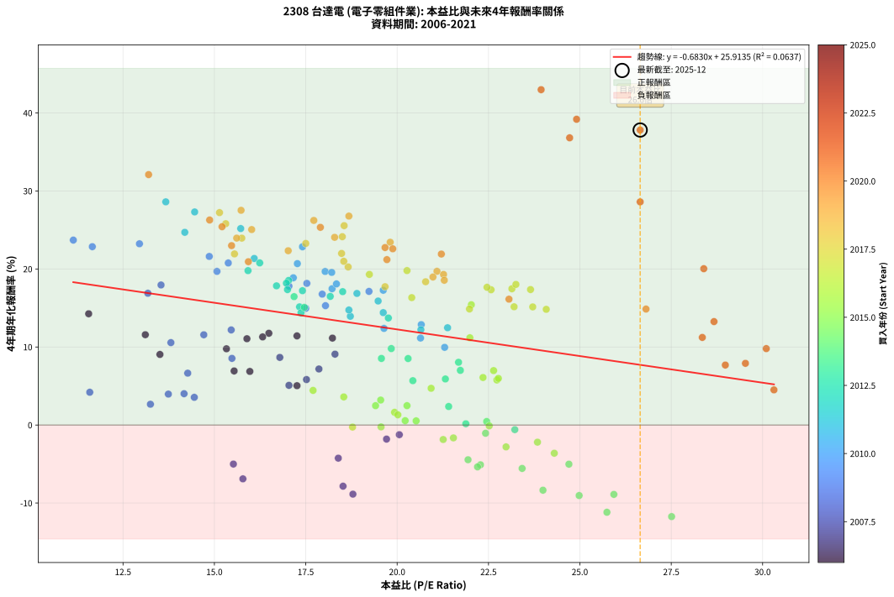
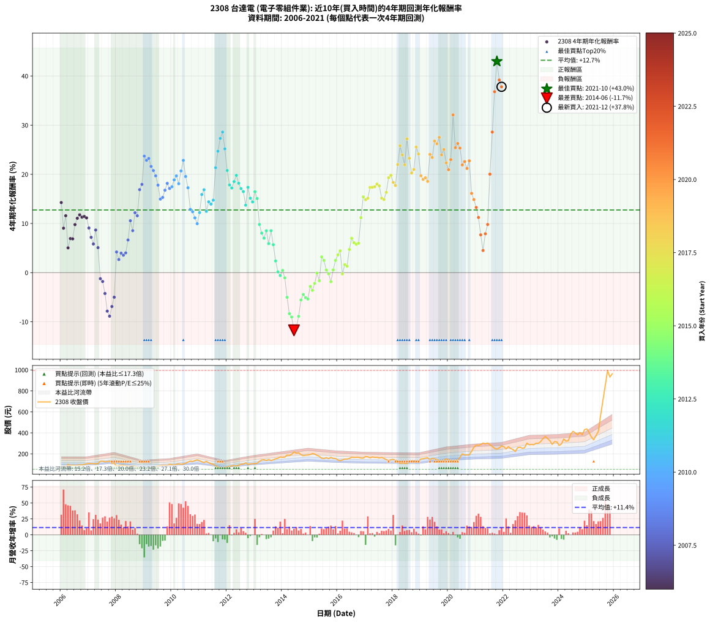

# 2308 台達電 - 本益比與未來報酬率分析

!!! info "報告資訊"
    - **股票代號**: 2308
    - **公司名稱**: 台達電
    - **產業別**: 電子零組件業
    - **分析期間**: 2006-2021 (192 個數據點)
    - **資料來源**: Type 12 (ShowMonthlyK_ChartFlow) 月收盤價與本益比
    - **報酬率口徑**: 含現金股利 (簡化: 年度合計，假設每年7/1入帳)
    - **報告生成時間**: 2026-01-07 18:24:11 CST

## 📈 視覺化圖表

### 圖表1: 本益比 vs 未來報酬率關係

*圖表1：2308 台達電 本益比與4年期未來報酬率關係 (2006-2021)*

### 圖表2: 歷年買入時點的4年期實際報酬率

*圖表2：2308 台達電 歷年買入時點的4年期實際報酬率 (2006-2021)*

## 📍 買點訊號說明

本報告提供兩種買點提示訊號（顯示於圖表2的股價子圖中）：

### ▲ 小綠色三角形（回測驗證）
- **計算方式**: 使用全部歷史資料計算本益比第25百分位數
- **用途**: 事後驗證，顯示歷史上哪些時點確實為低估區
- **限制**: 當下無法判斷，僅供回測參考
- **特性**: 後見之明（Look-Ahead Bias）

### ▲ 小橘色三角形（即時訊號）
- **計算方式**: 使用截至當月的過去5年資料計算本益比第25百分位數
- **用途**: 實際投資決策，當時即可判斷
- **優勢**: 可操作性強，符合實務需求
- **特性**: 無後見之明，滾動窗口計算

!!! tip "如何使用兩種訊號"
    - **綠色▲** 幫助理解歷史估值機會，驗證策略有效性
    - **橘色▲** 可作為實際買進參考，但仍需搭配基本面分析
    - 兩種訊號重疊時，表示即時判斷與事後驗證一致，信心度較高
    - 僅有綠色▲時，表示當時無法判斷（需要未來資料才能確認）
    - 僅有橘色▲時，表示即時判斷為買點，但事後可能不是最佳時機

## 📊 估值分析摘要

| 指標 | 數值 |
|:---:|:---:|
| **目前本益比** (2021-12) | **26.65 倍** |
| **歷史平均本益比** | 19.28 倍 |
| **估值水準** | 🔴 相對高估 |
| **預期4年年化報酬率** | **+7.71%** |
| **歷史平均報酬率** | +12.75% |
| **相關係數 (R²)** | 0.0637 |
| **趨勢線斜率** | -0.6830 |

!!! abstract "核心洞察"
    目前本益比顯著高於歷史平均，預期未來報酬率可能較低

    根據歷史數據回測，2308 台達電 在目前本益比 **26.6倍** 的估值水準下，
    預期未來4年年化報酬率約為 **+7.7%**。

    **重要提醒**: 本分析基於歷史數據統計，實際報酬率會受到公司基本面變化、產業趨勢、
    總體經濟環境等多重因素影響。R² = 0.06 表示本益比可解釋約 6.4% 的報酬率變異。

## 📈 歷史估值統計

### 最佳買點 (最高報酬率)

| 項目 | 數值 |
|:---:|:---:|
| 起始時間 | 2021-10 |
| 當時本益比 | 23.94 倍 |
| 起始價格 | 245.0 元 |
| 4年後價格 | 995.0 元 |
| **4年年化報酬率** | **+42.97%** |

### 最差買點 (最低報酬率)

| 項目 | 數值 |
|:---:|:---:|
| 起始時間 | 2014-06 |
| 當時本益比 | 27.51 倍 |
| 起始價格 | 217.5 元 |
| 4年後價格 | 109.5 元 |
| **4年年化報酬率** | **-11.74%** |

## 🎯 投資啟示

### 本益比與報酬率關係

趨勢線方程式: **y = -0.6830x + 25.9135**

!!! warning "強負相關"
    本益比與未來報酬率呈現強負相關。在高本益比時期買入，未來報酬率顯著較低；
    在低本益比時期買入，未來報酬率顯著較高。**估值紀律至關重要**。

### 估值區間建議

基於歷史數據分析:

- **🟢 低估區** (P/E < 15.4): 預期報酬率較高，可考慮增加持股
- **🟡 合理區** (P/E 15.4-23.1): 預期報酬率符合長期趨勢，正常持有
- **🔴 高估區** (P/E > 23.1): 預期報酬率較低，可考慮減碼或觀望

!!! danger "風險提示"
    - 過去表現不代表未來結果
    - 本分析假設公司基本面無重大結構性變化
    - 產業環境劇變可能使歷史規律失效
    - 應結合公司財報、產業趨勢、總體經濟等多重因素綜合判斷

!!! success "長期投資觀點"
    歷史數據顯示，在合理或低估的估值水準買入並長期持有，
    往往能獲得較佳的投資報酬。**耐心等待好價格**是價值投資的核心原則。

## 📊 數據品質

- **資料來源**: GoodInfo.tw Type 12 (ShowMonthlyK_ChartFlow)
- **資料頻率**: 月度收盤價與本益比
- **回測期間**: 2006-2021
- **數據點數量**: 192 個 (每個點代表一次4年期回測)

### 計算方法說明

1. **4年期年化報酬率**:
   - 對每個歷史時點，計算其後4年的實際投資報酬率
   - 期末價值(不含股利): 期末價格
   - 期末價值(含現金股利): 期末價格 + 持有期間內的現金股利合計 (簡化: 年度合計，假設每年7/1入帳)
   - 公式: 年化報酬率 = [(期末價值/期初價格)^(1/年數) - 1] × 100%

2. **本益比 (P/E Ratio)**:
   - 使用當時的月收盤價與EPS計算
   - 資料來源: Type 12 月度河流圖本益比數據

3. **趨勢線 (Linear Regression)**:
   - 使用最小平方法擬合線性趨勢線
   - R²值衡量本益比對報酬率的解釋能力

---

*本報告由 Stock Analysis System v1.9.0 自動生成*
*數據更新時間: 2026-01-07 18:24:11 CST*

## 📋 月度回測明細表

（每一列對應時間線圖中的一個買入點；可用來對照 SVG 圖上的每個點。）

| 買入月份 | 賣出月份 | 回測期限_年 | 實際持有年數 | 買入本益比_倍 | 買入收盤價_元 | 賣出收盤價_元 | 現金股利合計_元 | 總報酬率_pct | 年化報酬率_pct |
| --- | --- | --- | --- | --- | --- | --- | --- | --- | --- |
| 2006-01 | 2010-01 | 4 | 4.000 | 11.56 | 66.60 | 97.00 | 16.50 | +70.42 | +14.26 |
| 2006-02 | 2010-02 | 4 | 4.000 | 13.51 | 77.80 | 93.50 | 16.50 | +41.39 | +9.04 |
| 2006-03 | 2010-03 | 4 | 4.000 | 13.11 | 75.50 | 100.50 | 16.50 | +54.97 | +11.57 |
| 2006-04 | 2010-04 | 4 | 4.000 | 17.26 | 99.40 | 104.50 | 16.50 | +21.73 | +5.04 |
| 2006-05 | 2010-05 | 4 | 4.000 | 15.54 | 89.50 | 100.50 | 16.50 | +30.73 | +6.93 |
| 2006-06 | 2010-06 | 4 | 4.000 | 15.97 | 92.00 | 103.50 | 16.50 | +30.43 | +6.87 |
| 2006-07 | 2010-07 | 4 | 4.000 | 15.33 | 88.30 | 110.50 | 17.70 | +45.19 | +9.77 |
| 2006-08 | 2010-08 | 4 | 4.000 | 15.89 | 91.50 | 121.50 | 17.70 | +52.13 | +11.06 |
| 2006-09 | 2010-09 | 4 | 4.000 | 16.49 | 95.00 | 130.50 | 17.70 | +56.00 | +11.76 |
| 2006-10 | 2010-10 | 4 | 4.000 | 16.32 | 94.00 | 126.50 | 17.70 | +53.40 | +11.29 |
| 2006-11 | 2010-11 | 4 | 4.000 | 17.26 | 99.40 | 135.50 | 17.70 | +54.12 | +11.42 |
| 2006-12 | 2010-12 | 4 | 4.000 | 18.23 | 105.00 | 142.50 | 17.70 | +52.57 | +11.14 |
| 2007-01 | 2011-01 | 4 | 4.000 | 18.30 | 107.50 | 134.50 | 17.70 | +41.58 | +9.08 |
| 2007-02 | 2011-02 | 4 | 4.000 | 17.86 | 107.00 | 123.50 | 17.70 | +31.96 | +7.18 |
| 2007-03 | 2011-03 | 4 | 4.000 | 17.52 | 107.00 | 116.50 | 17.70 | +25.42 | +5.83 |
| 2007-04 | 2011-04 | 4 | 4.000 | 16.79 | 104.50 | 128.00 | 17.70 | +39.42 | +8.66 |
| 2007-05 | 2011-05 | 4 | 4.000 | 17.04 | 108.00 | 114.00 | 17.70 | +21.94 | +5.08 |
| 2007-06 | 2011-06 | 4 | 4.000 | 20.06 | 129.50 | 105.50 | 17.70 | -4.87 | -1.24 |
| 2007-07 | 2011-07 | 4 | 4.000 | 19.71 | 129.50 | 102.00 | 18.39 | -7.03 | -1.81 |
| 2007-08 | 2011-08 | 4 | 4.000 | 18.39 | 123.00 | 85.00 | 18.39 | -15.94 | -4.25 |
| 2007-09 | 2011-09 | 4 | 4.000 | 18.52 | 126.00 | 72.50 | 18.39 | -27.86 | -7.84 |
| 2007-10 | 2011-10 | 4 | 4.000 | 18.79 | 130.00 | 71.30 | 18.39 | -31.00 | -8.86 |
| 2007-11 | 2011-11 | 4 | 4.000 | 15.78 | 111.00 | 65.00 | 18.39 | -24.87 | -6.90 |
| 2007-12 | 2011-12 | 4 | 4.000 | 15.52 | 111.00 | 72.00 | 18.39 | -18.56 | -5.00 |
| 2008-01 | 2012-01 | 4 | 4.000 | 11.59 | 80.50 | 76.50 | 18.39 | +17.88 | +4.20 |
| 2008-02 | 2012-02 | 4 | 4.000 | 13.25 | 89.30 | 80.80 | 18.39 | +11.08 | +2.66 |
| 2008-03 | 2012-03 | 4 | 4.000 | 13.74 | 89.80 | 86.50 | 18.39 | +16.81 | +3.96 |
| 2008-04 | 2012-04 | 4 | 4.000 | 14.45 | 91.50 | 86.80 | 18.39 | +14.97 | +3.55 |
| 2008-05 | 2012-05 | 4 | 4.000 | 14.17 | 86.80 | 83.20 | 18.39 | +17.04 | +4.01 |
| 2008-06 | 2012-06 | 4 | 4.000 | 14.27 | 84.50 | 90.90 | 18.39 | +29.34 | +6.64 |
| 2008-07 | 2012-07 | 4 | 4.000 | 13.81 | 78.90 | 101.50 | 16.39 | +49.41 | +10.56 |
| 2008-08 | 2012-08 | 4 | 4.000 | 15.48 | 85.30 | 102.00 | 16.39 | +38.79 | +8.54 |
| 2008-09 | 2012-09 | 4 | 4.000 | 15.46 | 82.00 | 113.50 | 16.39 | +58.40 | +12.19 |
| 2008-10 | 2012-10 | 4 | 4.000 | 14.71 | 75.00 | 99.80 | 16.39 | +54.92 | +11.56 |
| 2008-11 | 2012-11 | 4 | 4.000 | 13.18 | 64.50 | 104.00 | 16.39 | +86.65 | +16.88 |
| 2008-12 | 2012-12 | 4 | 4.000 | 13.54 | 63.50 | 106.50 | 16.39 | +93.52 | +17.95 |
| 2009-01 | 2013-01 | 4 | 4.000 | 11.14 | 52.70 | 107.00 | 16.39 | +134.13 | +23.70 |
| 2009-02 | 2013-02 | 4 | 4.000 | 11.66 | 55.70 | 110.50 | 16.39 | +127.81 | +22.85 |
| 2009-03 | 2013-03 | 4 | 4.000 | 12.95 | 62.40 | 127.50 | 16.39 | +130.59 | +23.23 |
| 2009-04 | 2013-04 | 4 | 4.000 | 14.86 | 72.20 | 141.50 | 16.39 | +118.68 | +21.61 |
| 2009-05 | 2013-05 | 4 | 4.000 | 15.38 | 75.40 | 144.00 | 16.39 | +112.72 | +20.77 |
| 2009-06 | 2013-06 | 4 | 4.000 | 15.07 | 74.50 | 136.50 | 16.39 | +105.22 | +19.69 |
| 2009-07 | 2013-07 | 4 | 4.000 | 17.04 | 85.00 | 145.50 | 18.18 | +92.56 | +17.80 |
| 2009-08 | 2013-08 | 4 | 4.000 | 17.50 | 88.00 | 135.50 | 18.18 | +74.64 | +14.96 |
| 2009-09 | 2013-09 | 4 | 4.000 | 18.04 | 91.50 | 143.50 | 18.18 | +76.70 | +15.29 |
| 2009-10 | 2013-10 | 4 | 4.000 | 17.95 | 91.80 | 152.50 | 18.18 | +85.92 | +16.77 |
| 2009-11 | 2013-11 | 4 | 4.000 | 17.53 | 90.40 | 158.00 | 18.18 | +94.89 | +18.15 |
| 2009-12 | 2013-12 | 4 | 4.000 | 19.23 | 100.00 | 170.00 | 18.18 | +88.18 | +17.12 |
| 2010-01 | 2014-01 | 4 | 4.000 | 18.22 | 97.00 | 166.50 | 18.18 | +90.39 | +17.47 |
| 2010-02 | 2014-02 | 4 | 4.000 | 17.16 | 93.50 | 168.50 | 18.18 | +99.66 | +18.87 |
| 2010-03 | 2014-03 | 4 | 4.000 | 18.03 | 100.50 | 188.00 | 18.18 | +105.15 | +19.68 |
| 2010-04 | 2014-04 | 4 | 4.000 | 18.34 | 104.50 | 185.00 | 18.18 | +94.43 | +18.08 |
| 2010-05 | 2014-05 | 4 | 4.000 | 17.27 | 100.50 | 195.00 | 18.18 | +112.12 | +20.68 |
| 2010-06 | 2014-06 | 4 | 4.000 | 17.41 | 103.50 | 217.50 | 18.18 | +127.71 | +22.84 |
| 2010-07 | 2014-07 | 4 | 4.000 | 18.21 | 110.50 | 206.00 | 19.78 | +104.33 | +19.56 |
| 2010-08 | 2014-08 | 4 | 4.000 | 19.62 | 121.50 | 210.00 | 19.78 | +89.12 | +17.27 |
| 2010-09 | 2014-09 | 4 | 4.000 | 20.66 | 130.50 | 192.00 | 19.78 | +62.28 | +12.87 |
| 2010-10 | 2014-10 | 4 | 4.000 | 19.64 | 126.50 | 182.00 | 19.78 | +59.51 | +12.38 |
| 2010-11 | 2014-11 | 4 | 4.000 | 20.64 | 135.50 | 187.00 | 19.78 | +52.61 | +11.15 |
| 2010-12 | 2014-12 | 4 | 4.000 | 21.30 | 142.50 | 188.50 | 19.78 | +46.16 | +9.95 |
| 2011-01 | 2015-01 | 4 | 4.000 | 20.65 | 134.50 | 193.50 | 19.78 | +58.57 | +12.22 |
| 2011-02 | 2015-02 | 4 | 4.000 | 19.48 | 123.50 | 203.00 | 19.78 | +80.39 | +15.89 |
| 2011-03 | 2015-03 | 4 | 4.000 | 18.90 | 116.50 | 197.50 | 19.78 | +86.51 | +16.86 |
| 2011-04 | 2015-04 | 4 | 4.000 | 21.38 | 128.00 | 185.00 | 19.78 | +59.98 | +12.47 |
| 2011-05 | 2015-05 | 4 | 4.000 | 19.62 | 114.00 | 175.50 | 19.78 | +71.30 | +14.40 |
| 2011-06 | 2015-06 | 4 | 4.000 | 18.72 | 105.50 | 158.00 | 19.78 | +68.51 | +13.94 |
| 2011-07 | 2015-07 | 4 | 4.000 | 18.68 | 102.00 | 155.50 | 21.29 | +73.32 | +14.74 |
| 2011-08 | 2015-08 | 4 | 4.000 | 16.09 | 85.00 | 163.00 | 21.29 | +116.81 | +21.34 |
| 2011-09 | 2015-09 | 4 | 4.000 | 14.19 | 72.50 | 154.00 | 21.29 | +141.77 | +24.70 |
| 2011-10 | 2015-10 | 4 | 4.000 | 14.46 | 71.30 | 166.00 | 21.29 | +162.67 | +27.31 |
| 2011-11 | 2015-11 | 4 | 4.000 | 13.67 | 65.00 | 156.50 | 21.29 | +173.52 | +28.60 |
| 2011-12 | 2015-12 | 4 | 4.000 | 15.72 | 72.00 | 155.50 | 21.29 | +145.53 | +25.18 |
| 2012-01 | 2016-01 | 4 | 4.000 | 16.24 | 76.50 | 141.50 | 21.29 | +112.79 | +20.78 |
| 2012-02 | 2016-02 | 4 | 4.000 | 16.70 | 80.80 | 134.50 | 21.29 | +92.80 | +17.84 |
| 2012-03 | 2016-03 | 4 | 4.000 | 17.41 | 86.50 | 142.00 | 21.29 | +88.77 | +17.21 |
| 2012-04 | 2016-04 | 4 | 4.000 | 17.03 | 86.80 | 150.00 | 21.29 | +97.33 | +18.52 |
| 2012-05 | 2016-05 | 4 | 4.000 | 15.92 | 83.20 | 150.00 | 21.29 | +105.87 | +19.78 |
| 2012-06 | 2016-06 | 4 | 4.000 | 16.97 | 90.90 | 156.00 | 21.29 | +95.03 | +18.18 |
| 2012-07 | 2016-07 | 4 | 4.000 | 18.51 | 101.50 | 168.00 | 22.79 | +87.97 | +17.09 |
| 2012-08 | 2016-08 | 4 | 4.000 | 18.17 | 102.00 | 165.00 | 22.79 | +84.11 | +16.48 |
| 2012-09 | 2016-09 | 4 | 4.000 | 19.76 | 113.50 | 167.00 | 22.79 | +67.22 | +13.72 |
| 2012-10 | 2016-10 | 4 | 4.000 | 17.00 | 99.80 | 166.50 | 22.79 | +89.67 | +17.35 |
| 2012-11 | 2016-11 | 4 | 4.000 | 17.33 | 104.00 | 160.00 | 22.79 | +75.76 | +15.14 |
| 2012-12 | 2016-12 | 4 | 4.000 | 17.37 | 106.50 | 159.50 | 22.79 | +71.17 | +14.38 |
| 2013-01 | 2017-01 | 4 | 4.000 | 17.18 | 107.00 | 174.00 | 22.79 | +83.92 | +16.45 |
| 2013-02 | 2017-02 | 4 | 4.000 | 17.46 | 110.50 | 171.00 | 22.79 | +75.38 | +15.08 |
| 2013-03 | 2017-03 | 4 | 4.000 | 19.84 | 127.50 | 162.50 | 22.79 | +45.33 | +9.80 |
| 2013-04 | 2017-04 | 4 | 4.000 | 21.68 | 141.50 | 170.00 | 22.79 | +36.25 | +8.04 |
| 2013-05 | 2017-05 | 4 | 4.000 | 21.73 | 144.00 | 166.00 | 22.79 | +31.10 | +7.01 |
| 2013-06 | 2017-06 | 4 | 4.000 | 20.30 | 136.50 | 166.50 | 22.79 | +38.67 | +8.52 |
| 2013-07 | 2017-07 | 4 | 4.000 | 21.32 | 145.50 | 160.50 | 22.50 | +25.77 | +5.90 |
| 2013-08 | 2017-08 | 4 | 4.000 | 19.57 | 135.50 | 165.50 | 22.50 | +38.75 | +8.53 |
| 2013-09 | 2017-09 | 4 | 4.000 | 20.43 | 143.50 | 156.50 | 22.50 | +24.74 | +5.68 |
| 2013-10 | 2017-10 | 4 | 4.000 | 21.41 | 152.50 | 145.00 | 22.50 | +9.84 | +2.37 |
| 2013-11 | 2017-11 | 4 | 4.000 | 21.88 | 158.00 | 136.50 | 22.50 | +0.63 | +0.16 |
| 2013-12 | 2017-12 | 4 | 4.000 | 23.22 | 170.00 | 143.50 | 22.50 | -2.35 | -0.59 |
| 2014-01 | 2018-01 | 4 | 4.000 | 22.45 | 166.50 | 147.00 | 22.50 | +1.80 | +0.45 |
| 2014-02 | 2018-02 | 4 | 4.000 | 22.42 | 168.50 | 139.00 | 22.50 | -4.15 | -1.06 |
| 2014-03 | 2018-03 | 4 | 4.000 | 24.70 | 188.00 | 130.50 | 22.50 | -18.62 | -5.02 |
| 2014-04 | 2018-04 | 4 | 4.000 | 23.99 | 185.00 | 108.00 | 22.50 | -29.46 | -8.35 |
| 2014-05 | 2018-05 | 4 | 4.000 | 24.98 | 195.00 | 111.00 | 22.50 | -31.54 | -9.04 |
| 2014-06 | 2018-06 | 4 | 4.000 | 27.51 | 217.50 | 109.50 | 22.50 | -39.31 | -11.74 |
| 2014-07 | 2018-07 | 4 | 4.000 | 25.74 | 206.00 | 106.50 | 21.70 | -37.77 | -11.18 |
| 2014-08 | 2018-08 | 4 | 4.000 | 25.93 | 210.00 | 123.00 | 21.70 | -31.10 | -8.89 |
| 2014-09 | 2018-09 | 4 | 4.000 | 23.42 | 192.00 | 131.00 | 21.70 | -20.47 | -5.56 |
| 2014-10 | 2018-10 | 4 | 4.000 | 21.94 | 182.00 | 130.00 | 21.70 | -16.65 | -4.45 |
| 2014-11 | 2018-11 | 4 | 4.000 | 22.28 | 187.00 | 130.00 | 21.70 | -18.88 | -5.10 |
| 2014-12 | 2018-12 | 4 | 4.000 | 22.20 | 188.50 | 129.50 | 21.70 | -19.79 | -5.36 |
| 2015-01 | 2019-01 | 4 | 4.000 | 22.98 | 193.50 | 151.00 | 21.70 | -10.75 | -2.80 |
| 2015-02 | 2019-02 | 4 | 4.000 | 24.30 | 203.00 | 153.50 | 21.70 | -13.69 | -3.61 |
| 2015-03 | 2019-03 | 4 | 4.000 | 23.84 | 197.50 | 159.00 | 21.70 | -8.51 | -2.20 |
| 2015-04 | 2019-04 | 4 | 4.000 | 22.52 | 185.00 | 162.50 | 21.70 | -0.43 | -0.11 |
| 2015-05 | 2019-05 | 4 | 4.000 | 21.54 | 175.50 | 142.50 | 21.70 | -6.44 | -1.65 |
| 2015-06 | 2019-06 | 4 | 4.000 | 19.55 | 158.00 | 157.50 | 21.70 | +13.42 | +3.20 |
| 2015-07 | 2019-07 | 4 | 4.000 | 19.41 | 155.50 | 151.50 | 20.00 | +10.29 | +2.48 |
| 2015-08 | 2019-08 | 4 | 4.000 | 20.52 | 163.00 | 146.50 | 20.00 | +2.15 | +0.53 |
| 2015-09 | 2019-09 | 4 | 4.000 | 19.56 | 154.00 | 132.50 | 20.00 | -0.97 | -0.24 |
| 2015-10 | 2019-10 | 4 | 4.000 | 21.26 | 166.00 | 134.00 | 20.00 | -7.23 | -1.86 |
| 2015-11 | 2019-11 | 4 | 4.000 | 20.22 | 156.50 | 140.00 | 20.00 | +2.24 | +0.55 |
| 2015-12 | 2019-12 | 4 | 4.000 | 20.27 | 155.50 | 151.50 | 20.00 | +10.29 | +2.48 |
| 2016-01 | 2020-01 | 4 | 4.000 | 18.54 | 141.50 | 143.00 | 20.00 | +15.19 | +3.60 |
| 2016-02 | 2020-02 | 4 | 4.000 | 17.70 | 134.50 | 140.00 | 20.00 | +18.96 | +4.44 |
| 2016-03 | 2020-03 | 4 | 4.000 | 18.78 | 142.00 | 120.50 | 20.00 | -1.06 | -0.27 |
| 2016-04 | 2020-04 | 4 | 4.000 | 19.93 | 150.00 | 140.00 | 20.00 | +6.67 | +1.63 |
| 2016-05 | 2020-05 | 4 | 4.000 | 20.02 | 150.00 | 138.00 | 20.00 | +5.33 | +1.31 |
| 2016-06 | 2020-06 | 4 | 4.000 | 20.93 | 156.00 | 167.50 | 20.00 | +20.19 | +4.71 |
| 2016-07 | 2020-07 | 4 | 4.000 | 22.64 | 168.00 | 200.00 | 20.00 | +30.95 | +6.97 |
| 2016-08 | 2020-08 | 4 | 4.000 | 22.35 | 165.00 | 189.00 | 20.00 | +26.67 | +6.09 |
| 2016-09 | 2020-09 | 4 | 4.000 | 22.73 | 167.00 | 189.00 | 20.00 | +25.15 | +5.77 |
| 2016-10 | 2020-10 | 4 | 4.000 | 22.77 | 166.50 | 190.00 | 20.00 | +26.13 | +5.97 |
| 2016-11 | 2020-11 | 4 | 4.000 | 21.99 | 160.00 | 224.50 | 20.00 | +52.81 | +11.18 |
| 2016-12 | 2020-12 | 4 | 4.000 | 22.03 | 159.50 | 263.00 | 20.00 | +77.43 | +15.41 |
| 2017-01 | 2021-01 | 4 | 4.000 | 24.08 | 174.00 | 282.50 | 20.00 | +73.85 | +14.83 |
| 2017-02 | 2021-02 | 4 | 4.000 | 23.71 | 171.00 | 280.50 | 20.00 | +75.73 | +15.14 |
| 2017-03 | 2021-03 | 4 | 4.000 | 22.57 | 162.50 | 288.00 | 20.00 | +89.54 | +17.33 |
| 2017-04 | 2021-04 | 4 | 4.000 | 23.65 | 170.00 | 302.50 | 20.00 | +89.71 | +17.36 |
| 2017-05 | 2021-05 | 4 | 4.000 | 23.14 | 166.00 | 296.00 | 20.00 | +90.36 | +17.46 |
| 2017-06 | 2021-06 | 4 | 4.000 | 23.25 | 166.50 | 303.00 | 20.00 | +93.99 | +18.02 |
| 2017-07 | 2021-07 | 4 | 4.000 | 22.46 | 160.50 | 287.00 | 20.50 | +91.59 | +17.65 |
| 2017-08 | 2021-08 | 4 | 4.000 | 23.20 | 165.50 | 270.50 | 20.50 | +75.83 | +15.15 |
| 2017-09 | 2021-09 | 4 | 4.000 | 21.98 | 156.50 | 252.00 | 20.50 | +74.12 | +14.87 |
| 2017-10 | 2021-10 | 4 | 4.000 | 20.40 | 145.00 | 245.00 | 20.50 | +83.10 | +16.33 |
| 2017-11 | 2021-11 | 4 | 4.000 | 19.24 | 136.50 | 256.00 | 20.50 | +102.56 | +19.30 |
| 2017-12 | 2021-12 | 4 | 4.000 | 20.27 | 143.50 | 275.00 | 20.50 | +105.92 | +19.79 |
| 2018-01 | 2022-01 | 4 | 4.000 | 20.78 | 147.00 | 268.00 | 20.50 | +96.26 | +18.36 |
| 2018-02 | 2022-02 | 4 | 4.000 | 19.67 | 139.00 | 246.50 | 20.50 | +92.09 | +17.73 |
| 2018-03 | 2022-03 | 4 | 4.000 | 18.48 | 130.50 | 268.50 | 20.50 | +121.46 | +21.99 |
| 2018-04 | 2022-04 | 4 | 4.000 | 15.31 | 108.00 | 250.00 | 20.50 | +150.46 | +25.80 |
| 2018-05 | 2022-05 | 4 | 4.000 | 15.75 | 111.00 | 241.50 | 20.50 | +136.04 | +23.95 |
| 2018-06 | 2022-06 | 4 | 4.000 | 15.55 | 109.50 | 221.50 | 20.50 | +121.00 | +21.93 |
| 2018-07 | 2022-07 | 4 | 4.000 | 15.14 | 106.50 | 258.00 | 21.00 | +161.97 | +27.22 |
| 2018-08 | 2022-08 | 4 | 4.000 | 17.50 | 123.00 | 263.00 | 21.00 | +130.89 | +23.27 |
| 2018-09 | 2022-09 | 4 | 4.000 | 18.66 | 131.00 | 253.00 | 21.00 | +109.16 | +20.26 |
| 2018-10 | 2022-10 | 4 | 4.000 | 18.54 | 130.00 | 257.50 | 21.00 | +114.23 | +20.98 |
| 2018-11 | 2022-11 | 4 | 4.000 | 18.55 | 130.00 | 302.00 | 21.00 | +148.46 | +25.55 |
| 2018-12 | 2022-12 | 4 | 4.000 | 18.50 | 129.50 | 286.50 | 21.00 | +137.45 | +24.13 |
| 2019-01 | 2023-01 | 4 | 4.000 | 21.09 | 151.00 | 289.00 | 21.00 | +105.30 | +19.70 |
| 2019-02 | 2023-02 | 4 | 4.000 | 20.98 | 153.50 | 286.50 | 21.00 | +100.33 | +18.97 |
| 2019-03 | 2023-03 | 4 | 4.000 | 21.27 | 159.00 | 301.00 | 21.00 | +102.52 | +19.29 |
| 2019-04 | 2023-04 | 4 | 4.000 | 21.29 | 162.50 | 300.00 | 21.00 | +97.54 | +18.55 |
| 2019-05 | 2023-05 | 4 | 4.000 | 18.29 | 142.50 | 316.50 | 21.00 | +136.84 | +24.06 |
| 2019-06 | 2023-06 | 4 | 4.000 | 19.81 | 157.50 | 344.50 | 21.00 | +132.06 | +23.42 |
| 2019-07 | 2023-07 | 4 | 4.000 | 18.68 | 151.50 | 365.50 | 25.84 | +158.31 | +26.78 |
| 2019-08 | 2023-08 | 4 | 4.000 | 17.72 | 146.50 | 346.00 | 25.84 | +153.82 | +26.22 |
| 2019-09 | 2023-09 | 4 | 4.000 | 15.73 | 132.50 | 324.50 | 25.84 | +164.41 | +27.52 |
| 2019-10 | 2023-10 | 4 | 4.000 | 15.61 | 134.00 | 290.50 | 25.84 | +136.07 | +23.95 |
| 2019-11 | 2023-11 | 4 | 4.000 | 16.02 | 140.00 | 316.50 | 25.84 | +144.53 | +25.05 |
| 2019-12 | 2023-12 | 4 | 4.000 | 17.02 | 151.50 | 313.50 | 25.84 | +123.99 | +22.34 |
| 2020-01 | 2024-01 | 4 | 4.000 | 15.93 | 143.00 | 280.00 | 25.84 | +113.87 | +20.93 |
| 2020-02 | 2024-02 | 4 | 4.000 | 15.47 | 140.00 | 294.50 | 25.84 | +128.81 | +22.99 |
| 2020-03 | 2024-03 | 4 | 4.000 | 13.20 | 120.50 | 341.00 | 25.84 | +204.43 | +32.09 |
| 2020-04 | 2024-04 | 4 | 4.000 | 15.21 | 140.00 | 320.50 | 25.84 | +147.39 | +25.41 |
| 2020-05 | 2024-05 | 4 | 4.000 | 14.87 | 138.00 | 325.00 | 25.84 | +154.23 | +26.27 |
| 2020-06 | 2024-06 | 4 | 4.000 | 17.90 | 167.50 | 387.50 | 25.84 | +146.77 | +25.34 |
| 2020-07 | 2024-07 | 4 | 4.000 | 21.21 | 200.00 | 414.50 | 27.27 | +120.88 | +21.91 |
| 2020-08 | 2024-08 | 4 | 4.000 | 19.88 | 189.00 | 399.50 | 27.27 | +125.80 | +22.58 |
| 2020-09 | 2024-09 | 4 | 4.000 | 19.72 | 189.00 | 380.50 | 27.27 | +115.75 | +21.20 |
| 2020-10 | 2024-10 | 4 | 4.000 | 19.67 | 190.00 | 404.00 | 27.27 | +126.98 | +22.74 |
| 2020-11 | 2024-11 | 4 | 4.000 | 23.06 | 224.50 | 381.00 | 27.27 | +81.86 | +16.13 |
| 2020-12 | 2024-12 | 4 | 4.000 | 26.81 | 263.00 | 430.50 | 27.27 | +74.06 | +14.86 |
| 2021-01 | 2025-01 | 4 | 4.000 | 28.67 | 282.50 | 437.50 | 27.27 | +64.52 | +13.25 |
| 2021-02 | 2025-02 | 4 | 4.000 | 28.35 | 280.50 | 402.00 | 27.27 | +53.04 | +11.22 |
| 2021-03 | 2025-03 | 4 | 4.000 | 28.98 | 288.00 | 360.00 | 27.27 | +34.47 | +7.69 |
| 2021-04 | 2025-04 | 4 | 4.000 | 30.31 | 302.50 | 333.50 | 27.27 | +19.26 | +4.50 |
| 2021-05 | 2025-05 | 4 | 4.000 | 29.53 | 296.00 | 374.00 | 27.27 | +35.56 | +7.90 |
| 2021-06 | 2025-06 | 4 | 4.000 | 30.10 | 303.00 | 413.00 | 27.27 | +45.30 | +9.79 |
| 2021-07 | 2025-07 | 4 | 4.000 | 28.39 | 287.00 | 567.00 | 28.77 | +107.59 | +20.03 |
| 2021-08 | 2025-08 | 4 | 4.000 | 26.65 | 270.50 | 711.00 | 28.77 | +173.48 | +28.60 |
| 2021-09 | 2025-09 | 4 | 4.000 | 24.72 | 252.00 | 854.00 | 28.77 | +250.31 | +36.81 |
| 2021-10 | 2025-10 | 4 | 4.000 | 23.94 | 245.00 | 995.00 | 28.77 | +317.87 | +42.97 |
| 2021-11 | 2025-11 | 4 | 4.000 | 24.91 | 256.00 | 932.00 | 28.77 | +275.30 | +39.19 |
| 2021-12 | 2025-12 | 4 | 4.000 | 26.65 | 275.00 | 963.00 | 28.77 | +260.64 | +37.81 |
