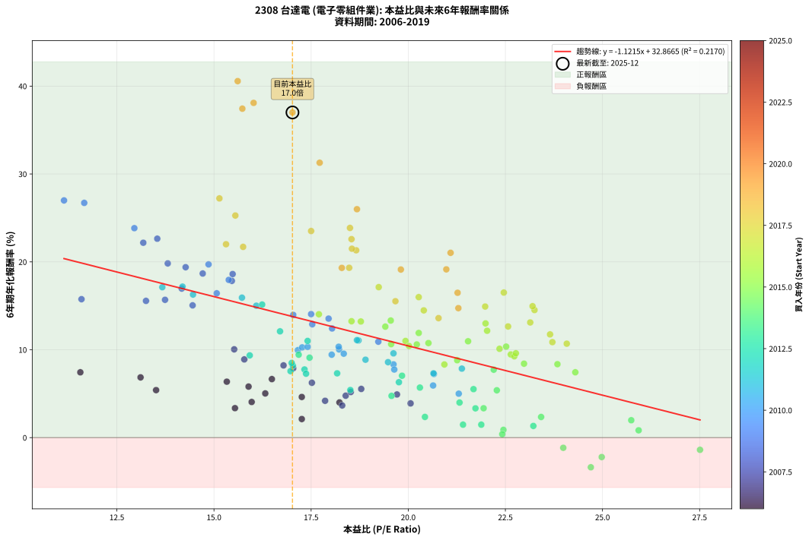
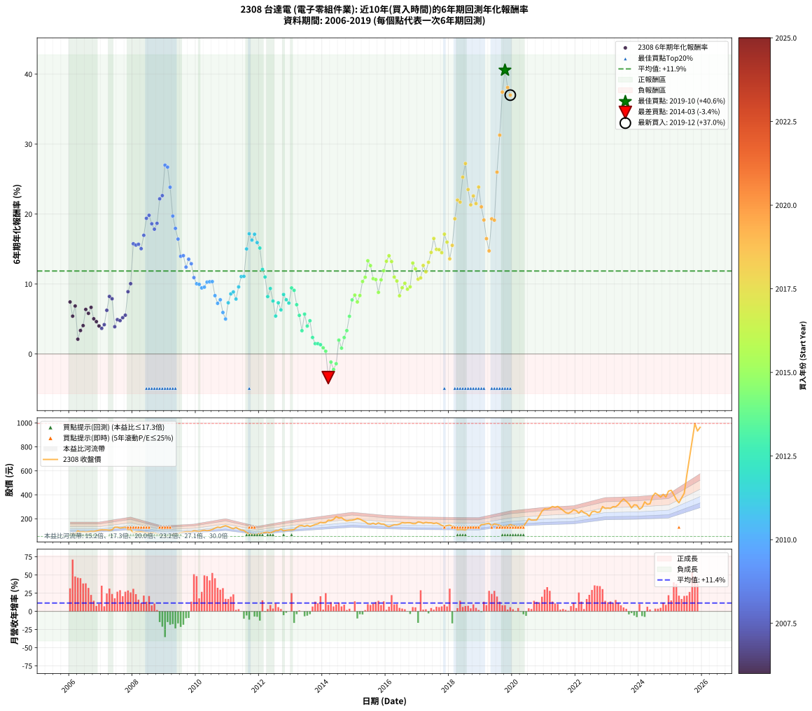

# 2308 台達電 - 本益比與未來報酬率分析

!!! info "報告資訊"
    - **股票代號**: 2308
    - **公司名稱**: 台達電
    - **產業別**: 電子零組件業
    - **分析期間**: 2006-2019 (168 個數據點)
    - **資料來源**: Type 12 (ShowMonthlyK_ChartFlow) 月收盤價與本益比
    - **報酬率口徑**: 含現金股利 (簡化: 年度合計，假設每年7/1入帳)
    - **報告生成時間**: 2026-01-10 20:30:23 CST

## 📈 視覺化圖表

### 圖表1: 本益比 vs 未來報酬率關係

*圖表1：2308 台達電 本益比與6年期未來報酬率關係 (2006-2019)*

### 圖表2: 歷年買入時點的6年期實際報酬率

*圖表2：2308 台達電 歷年買入時點的6年期實際報酬率 (2006-2019)*

## 📍 買點訊號說明

本報告提供兩種買點提示訊號（顯示於圖表2的股價子圖中）：

### ▲ 小綠色三角形（回測驗證）
- **計算方式**: 使用全部歷史資料計算本益比第25百分位數
- **用途**: 事後驗證，顯示歷史上哪些時點確實為低估區
- **限制**: 當下無法判斷，僅供回測參考
- **特性**: 後見之明（Look-Ahead Bias）

### ▲ 小橘色三角形（即時訊號）
- **計算方式**: 使用截至當月的過去5年資料計算本益比第25百分位數
- **用途**: 實際投資決策，當時即可判斷
- **優勢**: 可操作性強，符合實務需求
- **特性**: 無後見之明，滾動窗口計算

!!! tip "如何使用兩種訊號"
    - **綠色▲** 幫助理解歷史估值機會，驗證策略有效性
    - **橘色▲** 可作為實際買進參考，但仍需搭配基本面分析
    - 兩種訊號重疊時，表示即時判斷與事後驗證一致，信心度較高
    - 僅有綠色▲時，表示當時無法判斷（需要未來資料才能確認）
    - 僅有橘色▲時，表示即時判斷為買點，但事後可能不是最佳時機

## 📊 估值分析摘要

| 指標 | 數值 |
|:---:|:---:|
| **目前本益比** (2019-12) | **17.02 倍** |
| **歷史平均本益比** | 18.73 倍 |
| **估值水準** | 🟡 合理範圍 |
| **預期6年年化報酬率** | **+13.78%** |
| **歷史平均報酬率** | +11.86% |
| **相關係數 (R²)** | 0.2170 |
| **趨勢線斜率** | -1.1215 |

!!! abstract "核心洞察"
    目前本益比接近歷史平均，預期報酬率符合長期趨勢

    根據歷史數據回測，2308 台達電 在目前本益比 **17.0倍** 的估值水準下，
    預期未來6年年化報酬率約為 **+13.8%**。

    **重要提醒**: 本分析基於歷史數據統計，實際報酬率會受到公司基本面變化、產業趨勢、
    總體經濟環境等多重因素影響。R² = 0.22 表示本益比可解釋約 21.7% 的報酬率變異。

## 📈 歷史估值統計

### 最佳買點 (最高報酬率)

| 項目 | 數值 |
|:---:|:---:|
| 起始時間 | 2019-10 |
| 當時本益比 | 15.61 倍 |
| 起始價格 | 134.0 元 |
| 6年後價格 | 995.0 元 |
| **6年年化報酬率** | **+40.57%** |

### 最差買點 (最低報酬率)

| 項目 | 數值 |
|:---:|:---:|
| 起始時間 | 2014-03 |
| 當時本益比 | 24.70 倍 |
| 起始價格 | 188.0 元 |
| 6年後價格 | 120.5 元 |
| **6年年化報酬率** | **-3.37%** |

## 🎯 投資啟示

### 本益比與報酬率關係

趨勢線方程式: **y = -1.1215x + 32.8665**

!!! warning "強負相關"
    本益比與未來報酬率呈現強負相關。在高本益比時期買入，未來報酬率顯著較低；
    在低本益比時期買入，未來報酬率顯著較高。**估值紀律至關重要**。

### 估值區間建議

基於歷史數據分析:

- **🟢 低估區** (P/E < 15.0): 預期報酬率較高，可考慮增加持股
- **🟡 合理區** (P/E 15.0-22.5): 預期報酬率符合長期趨勢，正常持有
- **🔴 高估區** (P/E > 22.5): 預期報酬率較低，可考慮減碼或觀望

!!! danger "風險提示"
    - 過去表現不代表未來結果
    - 本分析假設公司基本面無重大結構性變化
    - 產業環境劇變可能使歷史規律失效
    - 應結合公司財報、產業趨勢、總體經濟等多重因素綜合判斷

!!! success "長期投資觀點"
    歷史數據顯示，在合理或低估的估值水準買入並長期持有，
    往往能獲得較佳的投資報酬。**耐心等待好價格**是價值投資的核心原則。

## 📊 數據品質

- **資料來源**: GoodInfo.tw Type 12 (ShowMonthlyK_ChartFlow)
- **資料頻率**: 月度收盤價與本益比
- **回測期間**: 2006-2019
- **數據點數量**: 168 個 (每個點代表一次6年期回測)

### 計算方法說明

1. **6年期年化報酬率**:
   - 對每個歷史時點，計算其後6年的實際投資報酬率
   - 期末價值(不含股利): 期末價格
   - 期末價值(含現金股利): 期末價格 + 持有期間內的現金股利合計 (簡化: 年度合計，假設每年7/1入帳)
   - 公式: 年化報酬率 = [(期末價值/期初價格)^(1/年數) - 1] × 100%

2. **本益比 (P/E Ratio)**:
   - 使用當時的月收盤價與EPS計算
   - 資料來源: Type 12 月度河流圖本益比數據

3. **趨勢線 (Linear Regression)**:
   - 使用最小平方法擬合線性趨勢線
   - R²值衡量本益比對報酬率的解釋能力

---

*本報告由 Stock Analysis System v1.9.0 自動生成*
*數據更新時間: 2026-01-10 20:30:23 CST*

## 📋 月度回測明細表

（每一列對應時間線圖中的一個買入點；可用來對照 SVG 圖上的每個點。）

| 買入月份 | 賣出月份 | 回測期限_年 | 實際持有年數 | 買入本益比_倍 | 買入收盤價_元 | 賣出收盤價_元 | 現金股利合計_元 | 總報酬率_pct | 年化報酬率_pct |
| --- | --- | --- | --- | --- | --- | --- | --- | --- | --- |
| 2006-01 | 2012-01 | 6 | 5.999 | 11.56 | 66.60 | 76.50 | 25.89 | +53.74 | +7.43 |
| 2006-02 | 2012-02 | 6 | 5.999 | 13.51 | 77.80 | 80.80 | 25.89 | +37.14 | +5.41 |
| 2006-03 | 2012-03 | 6 | 6.001 | 13.11 | 75.50 | 86.50 | 25.89 | +48.87 | +6.85 |
| 2006-04 | 2012-04 | 6 | 6.001 | 17.26 | 99.40 | 86.80 | 25.89 | +13.37 | +2.11 |
| 2006-05 | 2012-05 | 6 | 6.001 | 15.54 | 89.50 | 83.20 | 25.89 | +21.89 | +3.35 |
| 2006-06 | 2012-06 | 6 | 6.001 | 15.97 | 92.00 | 90.90 | 25.89 | +26.95 | +4.06 |
| 2006-07 | 2012-07 | 6 | 6.001 | 15.33 | 88.30 | 101.50 | 26.39 | +44.83 | +6.37 |
| 2006-08 | 2012-08 | 6 | 6.001 | 15.89 | 91.50 | 102.00 | 26.39 | +40.31 | +5.81 |
| 2006-09 | 2012-09 | 6 | 6.001 | 16.49 | 95.00 | 113.50 | 26.39 | +47.25 | +6.66 |
| 2006-10 | 2012-10 | 6 | 6.001 | 16.32 | 94.00 | 99.80 | 26.39 | +34.24 | +5.03 |
| 2006-11 | 2012-11 | 6 | 6.001 | 17.26 | 99.40 | 104.00 | 26.39 | +31.18 | +4.63 |
| 2006-12 | 2012-12 | 6 | 6.001 | 18.23 | 105.00 | 106.50 | 26.39 | +26.56 | +4.00 |
| 2007-01 | 2013-01 | 6 | 6.001 | 18.30 | 107.50 | 107.00 | 26.39 | +24.08 | +3.66 |
| 2007-02 | 2013-02 | 6 | 6.001 | 17.86 | 107.00 | 110.50 | 26.39 | +27.93 | +4.19 |
| 2007-03 | 2013-03 | 6 | 6.001 | 17.52 | 107.00 | 127.50 | 26.39 | +43.82 | +6.24 |
| 2007-04 | 2013-04 | 6 | 6.001 | 16.79 | 104.50 | 141.50 | 26.39 | +60.66 | +8.22 |
| 2007-05 | 2013-05 | 6 | 6.001 | 17.04 | 108.00 | 144.00 | 26.39 | +57.77 | +7.89 |
| 2007-06 | 2013-06 | 6 | 6.001 | 20.06 | 129.50 | 136.50 | 26.39 | +25.78 | +3.90 |
| 2007-07 | 2013-07 | 6 | 6.001 | 19.71 | 129.50 | 145.50 | 27.18 | +33.34 | +4.91 |
| 2007-08 | 2013-08 | 6 | 6.001 | 18.39 | 123.00 | 135.50 | 27.18 | +32.26 | +4.77 |
| 2007-09 | 2013-09 | 6 | 6.001 | 18.52 | 126.00 | 143.50 | 27.18 | +35.46 | +5.19 |
| 2007-10 | 2013-10 | 6 | 6.001 | 18.79 | 130.00 | 152.50 | 27.18 | +38.21 | +5.54 |
| 2007-11 | 2013-11 | 6 | 6.001 | 15.78 | 111.00 | 158.00 | 27.18 | +66.83 | +8.90 |
| 2007-12 | 2013-12 | 6 | 6.001 | 15.52 | 111.00 | 170.00 | 27.18 | +77.64 | +10.05 |
| 2008-01 | 2014-01 | 6 | 6.001 | 11.59 | 80.50 | 166.50 | 27.18 | +140.60 | +15.75 |
| 2008-02 | 2014-03 | 6 | 6.081 | 13.25 | 89.30 | 188.00 | 27.18 | +140.96 | +15.56 |
| 2008-03 | 2014-03 | 6 | 5.999 | 13.74 | 89.80 | 188.00 | 27.18 | +139.62 | +15.68 |
| 2008-04 | 2014-04 | 6 | 5.999 | 14.45 | 91.50 | 185.00 | 27.18 | +131.89 | +15.05 |
| 2008-05 | 2014-05 | 6 | 5.999 | 14.17 | 86.80 | 195.00 | 27.18 | +155.97 | +16.96 |
| 2008-06 | 2014-06 | 6 | 5.999 | 14.27 | 84.50 | 217.50 | 27.18 | +189.56 | +19.39 |
| 2008-07 | 2014-07 | 6 | 5.999 | 13.81 | 78.90 | 206.00 | 27.48 | +195.92 | +19.82 |
| 2008-08 | 2014-08 | 6 | 5.999 | 15.48 | 85.30 | 210.00 | 27.48 | +178.40 | +18.61 |
| 2008-09 | 2014-09 | 6 | 5.999 | 15.46 | 82.00 | 192.00 | 27.48 | +167.66 | +17.84 |
| 2008-10 | 2014-10 | 6 | 5.999 | 14.71 | 75.00 | 182.00 | 27.48 | +179.31 | +18.68 |
| 2008-11 | 2014-11 | 6 | 5.999 | 13.18 | 64.50 | 187.00 | 27.48 | +232.53 | +22.18 |
| 2008-12 | 2014-12 | 6 | 5.999 | 13.54 | 63.50 | 188.50 | 27.48 | +240.12 | +22.64 |
| 2009-01 | 2015-01 | 6 | 5.999 | 11.14 | 52.70 | 193.50 | 27.48 | +319.31 | +26.99 |
| 2009-02 | 2015-02 | 6 | 5.999 | 11.66 | 55.70 | 203.00 | 27.48 | +313.79 | +26.71 |
| 2009-03 | 2015-03 | 6 | 5.999 | 12.95 | 62.40 | 197.50 | 27.48 | +260.54 | +23.84 |
| 2009-04 | 2015-04 | 6 | 5.999 | 14.86 | 72.20 | 185.00 | 27.48 | +194.29 | +19.71 |
| 2009-05 | 2015-05 | 6 | 5.999 | 15.38 | 75.40 | 175.50 | 27.48 | +169.20 | +17.95 |
| 2009-06 | 2015-06 | 6 | 5.999 | 15.07 | 74.50 | 158.00 | 27.48 | +148.97 | +16.42 |
| 2009-07 | 2015-07 | 6 | 5.999 | 17.04 | 85.00 | 155.50 | 30.68 | +119.03 | +13.96 |
| 2009-08 | 2015-08 | 6 | 5.999 | 17.50 | 88.00 | 163.00 | 30.68 | +120.09 | +14.05 |
| 2009-09 | 2015-09 | 6 | 5.999 | 18.04 | 91.50 | 154.00 | 30.68 | +101.83 | +12.42 |
| 2009-10 | 2015-10 | 6 | 5.999 | 17.95 | 91.80 | 166.00 | 30.68 | +114.25 | +13.54 |
| 2009-11 | 2015-11 | 6 | 5.999 | 17.53 | 90.40 | 156.50 | 30.68 | +107.06 | +12.90 |
| 2009-12 | 2015-12 | 6 | 5.999 | 19.23 | 100.00 | 155.50 | 30.68 | +86.18 | +10.92 |
| 2010-01 | 2016-01 | 6 | 5.999 | 18.22 | 97.00 | 141.50 | 30.68 | +77.50 | +10.04 |
| 2010-02 | 2016-02 | 6 | 5.999 | 17.16 | 93.50 | 134.50 | 30.68 | +76.66 | +9.95 |
| 2010-03 | 2016-03 | 6 | 6.001 | 18.03 | 100.50 | 142.00 | 30.68 | +71.82 | +9.44 |
| 2010-04 | 2016-04 | 6 | 6.001 | 18.34 | 104.50 | 150.00 | 30.68 | +72.90 | +9.55 |
| 2010-05 | 2016-05 | 6 | 6.001 | 17.27 | 100.50 | 150.00 | 30.68 | +79.78 | +10.27 |
| 2010-06 | 2016-06 | 6 | 6.001 | 17.41 | 103.50 | 156.00 | 30.68 | +80.37 | +10.33 |
| 2010-07 | 2016-07 | 6 | 6.001 | 18.21 | 110.50 | 168.00 | 31.48 | +80.52 | +10.34 |
| 2010-08 | 2016-08 | 6 | 6.001 | 19.62 | 121.50 | 165.00 | 31.48 | +61.71 | +8.34 |
| 2010-09 | 2016-09 | 6 | 6.001 | 20.66 | 130.50 | 167.00 | 31.48 | +52.09 | +7.24 |
| 2010-10 | 2016-10 | 6 | 6.001 | 19.64 | 126.50 | 166.50 | 31.48 | +56.51 | +7.75 |
| 2010-11 | 2016-11 | 6 | 6.001 | 20.64 | 135.50 | 160.00 | 31.48 | +41.31 | +5.93 |
| 2010-12 | 2016-12 | 6 | 6.001 | 21.30 | 142.50 | 159.50 | 31.48 | +34.02 | +5.00 |
| 2011-01 | 2017-01 | 6 | 6.001 | 20.65 | 134.50 | 174.00 | 31.48 | +52.77 | +7.32 |
| 2011-02 | 2017-02 | 6 | 6.001 | 19.48 | 123.50 | 171.00 | 31.48 | +63.95 | +8.59 |
| 2011-03 | 2017-03 | 6 | 6.001 | 18.90 | 116.50 | 162.50 | 31.48 | +66.51 | +8.87 |
| 2011-04 | 2017-04 | 6 | 6.001 | 21.38 | 128.00 | 170.00 | 31.48 | +57.41 | +7.85 |
| 2011-05 | 2017-05 | 6 | 6.001 | 19.62 | 114.00 | 166.00 | 31.48 | +73.23 | +9.59 |
| 2011-06 | 2017-06 | 6 | 6.001 | 18.72 | 105.50 | 166.50 | 31.48 | +87.66 | +11.06 |
| 2011-07 | 2017-07 | 6 | 6.001 | 18.68 | 102.00 | 160.50 | 31.29 | +88.02 | +11.09 |
| 2011-08 | 2017-08 | 6 | 6.001 | 16.09 | 85.00 | 165.50 | 31.29 | +131.51 | +15.01 |
| 2011-09 | 2017-09 | 6 | 6.001 | 14.19 | 72.50 | 156.50 | 31.29 | +159.01 | +17.18 |
| 2011-10 | 2017-10 | 6 | 6.001 | 14.46 | 71.30 | 145.00 | 31.29 | +147.24 | +16.28 |
| 2011-11 | 2017-11 | 6 | 6.001 | 13.67 | 65.00 | 136.50 | 31.29 | +158.13 | +17.12 |
| 2011-12 | 2017-12 | 6 | 6.001 | 15.72 | 72.00 | 143.50 | 31.29 | +142.76 | +15.93 |
| 2012-01 | 2018-01 | 6 | 6.001 | 16.24 | 76.50 | 147.00 | 31.29 | +133.05 | +15.14 |
| 2012-02 | 2018-03 | 6 | 6.081 | 16.70 | 80.80 | 130.50 | 31.29 | +100.23 | +12.10 |
| 2012-03 | 2018-03 | 6 | 5.999 | 17.41 | 86.50 | 130.50 | 31.29 | +87.03 | +11.00 |
| 2012-04 | 2018-04 | 6 | 5.999 | 17.03 | 86.80 | 108.00 | 31.29 | +60.47 | +8.20 |
| 2012-05 | 2018-05 | 6 | 5.999 | 15.92 | 83.20 | 111.00 | 31.29 | +71.02 | +9.36 |
| 2012-06 | 2018-06 | 6 | 5.999 | 16.97 | 90.90 | 109.50 | 31.29 | +54.88 | +7.57 |
| 2012-07 | 2018-07 | 6 | 5.999 | 18.51 | 101.50 | 106.50 | 32.79 | +37.23 | +5.42 |
| 2012-08 | 2018-08 | 6 | 5.999 | 18.17 | 102.00 | 123.00 | 32.79 | +52.74 | +7.32 |
| 2012-09 | 2018-09 | 6 | 5.999 | 19.76 | 113.50 | 131.00 | 32.79 | +44.31 | +6.31 |
| 2012-10 | 2018-10 | 6 | 5.999 | 17.00 | 99.80 | 130.00 | 32.79 | +63.12 | +8.50 |
| 2012-11 | 2018-11 | 6 | 5.999 | 17.33 | 104.00 | 130.00 | 32.79 | +56.53 | +7.76 |
| 2012-12 | 2018-12 | 6 | 5.999 | 17.37 | 106.50 | 129.50 | 32.79 | +52.39 | +7.27 |
| 2013-01 | 2019-01 | 6 | 5.999 | 17.18 | 107.00 | 151.00 | 32.79 | +71.77 | +9.44 |
| 2013-02 | 2019-02 | 6 | 5.999 | 17.46 | 110.50 | 153.50 | 32.79 | +68.59 | +9.10 |
| 2013-03 | 2019-03 | 6 | 5.999 | 19.84 | 127.50 | 159.00 | 32.79 | +50.42 | +7.04 |
| 2013-04 | 2019-04 | 6 | 5.999 | 21.68 | 141.50 | 162.50 | 32.79 | +38.01 | +5.52 |
| 2013-05 | 2019-05 | 6 | 5.999 | 21.73 | 144.00 | 142.50 | 32.79 | +21.73 | +3.33 |
| 2013-06 | 2019-06 | 6 | 5.999 | 20.30 | 136.50 | 157.50 | 32.79 | +39.41 | +5.69 |
| 2013-07 | 2019-07 | 6 | 5.999 | 21.32 | 145.50 | 151.50 | 32.50 | +26.46 | +3.99 |
| 2013-08 | 2019-08 | 6 | 5.999 | 19.57 | 135.50 | 146.50 | 32.50 | +32.10 | +4.75 |
| 2013-09 | 2019-09 | 6 | 5.999 | 20.43 | 143.50 | 132.50 | 32.50 | +14.98 | +2.35 |
| 2013-10 | 2019-10 | 6 | 5.999 | 21.41 | 152.50 | 134.00 | 32.50 | +9.18 | +1.47 |
| 2013-11 | 2019-11 | 6 | 5.999 | 21.88 | 158.00 | 140.00 | 32.50 | +9.18 | +1.47 |
| 2013-12 | 2019-12 | 6 | 5.999 | 23.22 | 170.00 | 151.50 | 32.50 | +8.24 | +1.33 |
| 2014-01 | 2020-01 | 6 | 5.999 | 22.45 | 166.50 | 143.00 | 32.50 | +5.41 | +0.88 |
| 2014-02 | 2020-02 | 6 | 5.999 | 22.42 | 168.50 | 140.00 | 32.50 | +2.37 | +0.39 |
| 2014-03 | 2020-03 | 6 | 6.001 | 24.70 | 188.00 | 120.50 | 32.50 | -18.62 | -3.37 |
| 2014-04 | 2020-04 | 6 | 6.001 | 23.99 | 185.00 | 140.00 | 32.50 | -6.76 | -1.16 |
| 2014-05 | 2020-05 | 6 | 6.001 | 24.98 | 195.00 | 138.00 | 32.50 | -12.56 | -2.21 |
| 2014-06 | 2020-06 | 6 | 6.001 | 27.51 | 217.50 | 167.50 | 32.50 | -8.05 | -1.39 |
| 2014-07 | 2020-07 | 6 | 6.001 | 25.74 | 206.00 | 200.00 | 31.70 | +12.48 | +1.98 |
| 2014-08 | 2020-08 | 6 | 6.001 | 25.93 | 210.00 | 189.00 | 31.70 | +5.10 | +0.83 |
| 2014-09 | 2020-09 | 6 | 6.001 | 23.42 | 192.00 | 189.00 | 31.70 | +14.95 | +2.35 |
| 2014-10 | 2020-10 | 6 | 6.001 | 21.94 | 182.00 | 190.00 | 31.70 | +21.81 | +3.34 |
| 2014-11 | 2020-11 | 6 | 6.001 | 22.28 | 187.00 | 224.50 | 31.70 | +37.01 | +5.39 |
| 2014-12 | 2020-12 | 6 | 6.001 | 22.20 | 188.50 | 263.00 | 31.70 | +56.34 | +7.73 |
| 2015-01 | 2021-01 | 6 | 6.001 | 22.98 | 193.50 | 282.50 | 31.70 | +62.38 | +8.41 |
| 2015-02 | 2021-02 | 6 | 6.001 | 24.30 | 203.00 | 280.50 | 31.70 | +53.79 | +7.44 |
| 2015-03 | 2021-03 | 6 | 6.001 | 23.84 | 197.50 | 288.00 | 31.70 | +61.87 | +8.36 |
| 2015-04 | 2021-04 | 6 | 6.001 | 22.52 | 185.00 | 302.50 | 31.70 | +80.65 | +10.36 |
| 2015-05 | 2021-05 | 6 | 6.001 | 21.54 | 175.50 | 296.00 | 31.70 | +86.72 | +10.97 |
| 2015-06 | 2021-06 | 6 | 6.001 | 19.55 | 158.00 | 303.00 | 31.70 | +111.84 | +13.32 |
| 2015-07 | 2021-07 | 6 | 6.001 | 19.41 | 155.50 | 287.00 | 30.50 | +104.18 | +12.63 |
| 2015-08 | 2021-08 | 6 | 6.001 | 20.52 | 163.00 | 270.50 | 30.50 | +84.66 | +10.76 |
| 2015-09 | 2021-09 | 6 | 6.001 | 19.56 | 154.00 | 252.00 | 30.50 | +83.44 | +10.64 |
| 2015-10 | 2021-10 | 6 | 6.001 | 21.26 | 166.00 | 245.00 | 30.50 | +65.96 | +8.81 |
| 2015-11 | 2021-11 | 6 | 6.001 | 20.22 | 156.50 | 256.00 | 30.50 | +83.07 | +10.60 |
| 2015-12 | 2021-12 | 6 | 6.001 | 20.27 | 155.50 | 275.00 | 30.50 | +96.46 | +11.91 |
| 2016-01 | 2022-01 | 6 | 6.001 | 18.54 | 141.50 | 268.00 | 30.50 | +110.95 | +13.24 |
| 2016-02 | 2022-03 | 6 | 6.081 | 17.70 | 134.50 | 268.50 | 30.50 | +122.30 | +14.04 |
| 2016-03 | 2022-03 | 6 | 5.999 | 18.78 | 142.00 | 268.50 | 30.50 | +110.56 | +13.22 |
| 2016-04 | 2022-04 | 6 | 5.999 | 19.93 | 150.00 | 250.00 | 30.50 | +87.00 | +11.00 |
| 2016-05 | 2022-05 | 6 | 5.999 | 20.02 | 150.00 | 241.50 | 30.50 | +81.33 | +10.43 |
| 2016-06 | 2022-06 | 6 | 5.999 | 20.93 | 156.00 | 221.50 | 30.50 | +61.54 | +8.32 |
| 2016-07 | 2022-07 | 6 | 5.999 | 22.64 | 168.00 | 258.00 | 31.00 | +72.02 | +9.46 |
| 2016-08 | 2022-08 | 6 | 5.999 | 22.35 | 165.00 | 263.00 | 31.00 | +78.18 | +10.11 |
| 2016-09 | 2022-09 | 6 | 5.999 | 22.73 | 167.00 | 253.00 | 31.00 | +70.06 | +9.26 |
| 2016-10 | 2022-10 | 6 | 5.999 | 22.77 | 166.50 | 257.50 | 31.00 | +73.27 | +9.60 |
| 2016-11 | 2022-11 | 6 | 5.999 | 21.99 | 160.00 | 302.00 | 31.00 | +108.12 | +13.00 |
| 2016-12 | 2022-12 | 6 | 5.999 | 22.03 | 159.50 | 286.50 | 31.00 | +99.06 | +12.16 |
| 2017-01 | 2023-01 | 6 | 5.999 | 24.08 | 174.00 | 289.00 | 31.00 | +83.91 | +10.69 |
| 2017-02 | 2023-02 | 6 | 5.999 | 23.71 | 171.00 | 286.50 | 31.00 | +85.67 | +10.87 |
| 2017-03 | 2023-03 | 6 | 5.999 | 22.57 | 162.50 | 301.00 | 31.00 | +104.31 | +12.65 |
| 2017-04 | 2023-04 | 6 | 5.999 | 23.65 | 170.00 | 300.00 | 31.00 | +94.71 | +11.75 |
| 2017-05 | 2023-05 | 6 | 5.999 | 23.14 | 166.00 | 316.50 | 31.00 | +109.34 | +13.11 |
| 2017-06 | 2023-06 | 6 | 5.999 | 23.25 | 166.50 | 344.50 | 31.00 | +125.53 | +14.52 |
| 2017-07 | 2023-07 | 6 | 5.999 | 22.46 | 160.50 | 365.50 | 35.84 | +150.06 | +16.51 |
| 2017-08 | 2023-08 | 6 | 5.999 | 23.20 | 165.50 | 346.00 | 35.84 | +130.72 | +14.95 |
| 2017-09 | 2023-09 | 6 | 5.999 | 21.98 | 156.50 | 324.50 | 35.84 | +130.25 | +14.92 |
| 2017-10 | 2023-10 | 6 | 5.999 | 20.40 | 145.00 | 290.50 | 35.84 | +125.06 | +14.48 |
| 2017-11 | 2023-11 | 6 | 5.999 | 19.24 | 136.50 | 316.50 | 35.84 | +158.12 | +17.13 |
| 2017-12 | 2023-12 | 6 | 5.999 | 20.27 | 143.50 | 313.50 | 35.84 | +143.44 | +15.99 |
| 2018-01 | 2024-01 | 6 | 5.999 | 20.78 | 147.00 | 280.00 | 35.84 | +114.86 | +13.60 |
| 2018-02 | 2024-02 | 6 | 5.999 | 19.67 | 139.00 | 294.50 | 35.84 | +137.65 | +15.52 |
| 2018-03 | 2024-03 | 6 | 6.001 | 18.48 | 130.50 | 341.00 | 35.84 | +188.77 | +19.33 |
| 2018-04 | 2024-04 | 6 | 6.001 | 15.31 | 108.00 | 320.50 | 35.84 | +229.94 | +22.01 |
| 2018-05 | 2024-05 | 6 | 6.001 | 15.75 | 111.00 | 325.00 | 35.84 | +225.08 | +21.71 |
| 2018-06 | 2024-06 | 6 | 6.001 | 15.55 | 109.50 | 387.50 | 35.84 | +286.61 | +25.27 |
| 2018-07 | 2024-07 | 6 | 6.001 | 15.14 | 106.50 | 414.50 | 37.27 | +324.20 | +27.22 |
| 2018-08 | 2024-08 | 6 | 6.001 | 17.50 | 123.00 | 399.50 | 37.27 | +255.10 | +23.51 |
| 2018-09 | 2024-09 | 6 | 6.001 | 18.66 | 131.00 | 380.50 | 37.27 | +218.91 | +21.32 |
| 2018-10 | 2024-10 | 6 | 6.001 | 18.54 | 130.00 | 404.00 | 37.27 | +239.44 | +22.59 |
| 2018-11 | 2024-11 | 6 | 6.001 | 18.55 | 130.00 | 381.00 | 37.27 | +221.75 | +21.50 |
| 2018-12 | 2024-12 | 6 | 6.001 | 18.50 | 129.50 | 430.50 | 37.27 | +261.21 | +23.86 |
| 2019-01 | 2025-01 | 6 | 6.001 | 21.09 | 151.00 | 437.50 | 37.27 | +214.42 | +21.03 |
| 2019-02 | 2025-02 | 6 | 6.001 | 20.98 | 153.50 | 402.00 | 37.27 | +186.17 | +19.15 |
| 2019-03 | 2025-03 | 6 | 6.001 | 21.27 | 159.00 | 360.00 | 37.27 | +149.86 | +16.48 |
| 2019-04 | 2025-04 | 6 | 6.001 | 21.29 | 162.50 | 333.50 | 37.27 | +128.17 | +14.73 |
| 2019-05 | 2025-05 | 6 | 6.001 | 18.29 | 142.50 | 374.00 | 37.27 | +188.61 | +19.32 |
| 2019-06 | 2025-06 | 6 | 6.001 | 19.81 | 157.50 | 413.00 | 37.27 | +185.89 | +19.13 |
| 2019-07 | 2025-07 | 6 | 6.001 | 18.68 | 151.50 | 567.00 | 39.27 | +300.18 | +25.99 |
| 2019-08 | 2025-08 | 6 | 6.001 | 17.72 | 146.50 | 711.00 | 39.27 | +412.13 | +31.28 |
| 2019-09 | 2025-09 | 6 | 6.001 | 15.73 | 132.50 | 854.00 | 39.27 | +574.17 | +37.43 |
| 2019-10 | 2025-10 | 6 | 6.001 | 15.61 | 134.00 | 995.00 | 39.27 | +671.84 | +40.57 |
| 2019-11 | 2025-11 | 6 | 6.001 | 16.02 | 140.00 | 932.00 | 39.27 | +593.76 | +38.09 |
| 2019-12 | 2025-12 | 6 | 6.001 | 17.02 | 151.50 | 963.00 | 39.27 | +561.56 | +37.00 |
