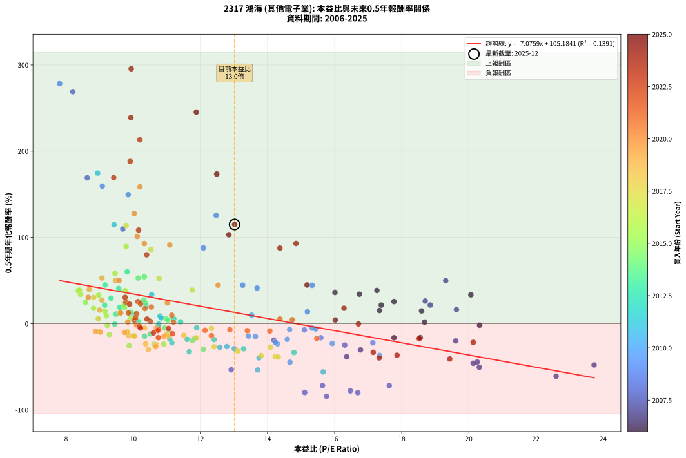
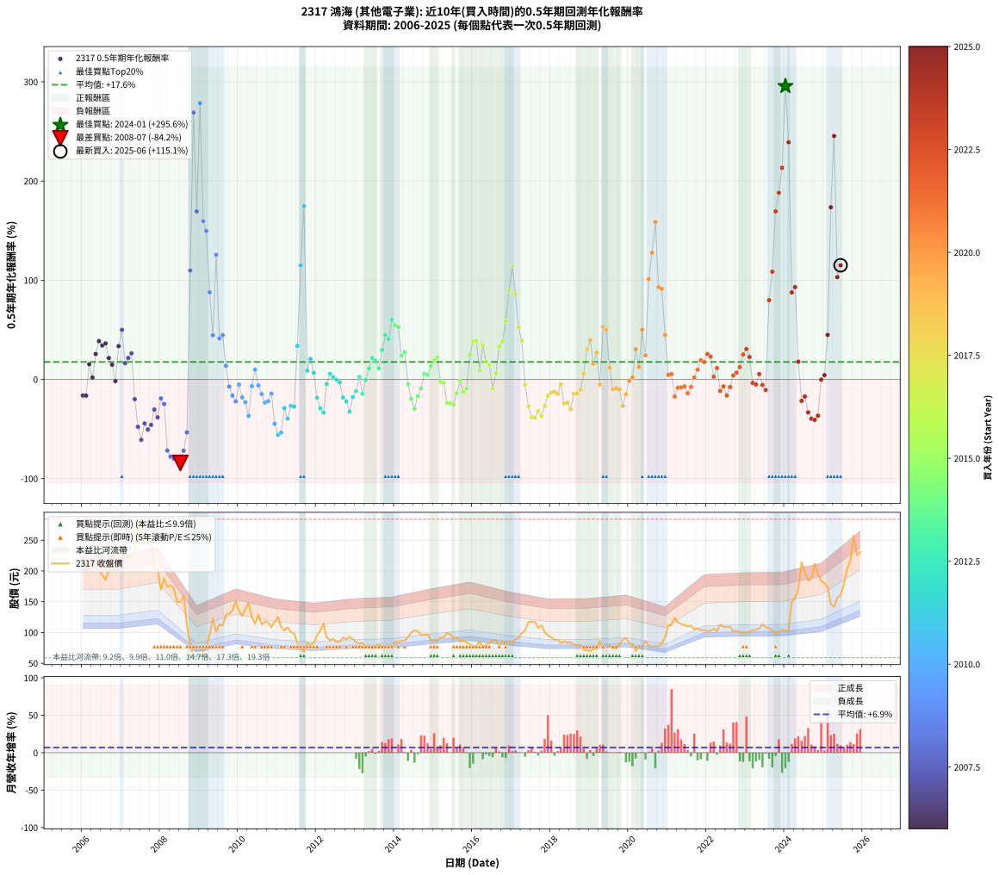

# 2317 鴻海 - 本益比與未來報酬率分析

!!! info "報告資訊"
    - **股票代號**: 2317
    - **公司名稱**: 鴻海
    - **產業別**: 其他電子業
    - **分析期間**: 2006-2025 (234 個數據點)
    - **資料來源**: Type 12 (ShowMonthlyK_ChartFlow) 月收盤價與本益比
    - **報酬率口徑**: 含現金股利 (簡化: 年度合計，假設每年7/1入帳)
    - **報告生成時間**: 2026-01-09 20:32:14 CST

## 📈 視覺化圖表

### 圖表1: 本益比 vs 未來報酬率關係

*圖表1：2317 鴻海 本益比與0.5年期未來報酬率關係 (2006-2025)*

### 圖表2: 歷年買入時點的0.5年期實際報酬率

*圖表2：2317 鴻海 歷年買入時點的0.5年期實際報酬率 (2006-2025)*

## 📍 買點訊號說明

本報告提供兩種買點提示訊號（顯示於圖表2的股價子圖中）：

### ▲ 小綠色三角形（回測驗證）
- **計算方式**: 使用全部歷史資料計算本益比第25百分位數
- **用途**: 事後驗證，顯示歷史上哪些時點確實為低估區
- **限制**: 當下無法判斷，僅供回測參考
- **特性**: 後見之明（Look-Ahead Bias）

### ▲ 小橘色三角形（即時訊號）
- **計算方式**: 使用截至當月的過去5年資料計算本益比第25百分位數
- **用途**: 實際投資決策，當時即可判斷
- **優勢**: 可操作性強，符合實務需求
- **特性**: 無後見之明，滾動窗口計算

!!! tip "如何使用兩種訊號"
    - **綠色▲** 幫助理解歷史估值機會，驗證策略有效性
    - **橘色▲** 可作為實際買進參考，但仍需搭配基本面分析
    - 兩種訊號重疊時，表示即時判斷與事後驗證一致，信心度較高
    - 僅有綠色▲時，表示當時無法判斷（需要未來資料才能確認）
    - 僅有橘色▲時，表示即時判斷為買點，但事後可能不是最佳時機

## 📊 估值分析摘要

| 指標 | 數值 |
|:---:|:---:|
| **目前本益比** (2025-06) | **13.02 倍** |
| **歷史平均本益比** | 12.37 倍 |
| **估值水準** | 🟡 合理範圍 |
| **預期0.5年年化報酬率** | **+13.06%** |
| **歷史平均報酬率** | +17.62% |
| **相關係數 (R²)** | 0.1391 |
| **趨勢線斜率** | -7.0759 |

!!! abstract "核心洞察"
    目前本益比接近歷史平均，預期報酬率符合長期趨勢

    根據歷史數據回測，2317 鴻海 在目前本益比 **13.0倍** 的估值水準下，
    預期未來0.5年年化報酬率約為 **+13.1%**。

    **重要提醒**: 本分析基於歷史數據統計，實際報酬率會受到公司基本面變化、產業趨勢、
    總體經濟環境等多重因素影響。R² = 0.14 表示本益比可解釋約 13.9% 的報酬率變異。

## 📈 歷史估值統計

### 最佳買點 (最高報酬率)

| 項目 | 數值 |
|:---:|:---:|
| 起始時間 | 2024-01 |
| 當時本益比 | 9.94 倍 |
| 起始價格 | 102.5 元 |
| 0.5年後價格 | 198.0 元 |
| **0.5年年化報酬率** | **+295.64%** |

### 最差買點 (最低報酬率)

| 項目 | 數值 |
|:---:|:---:|
| 起始時間 | 2008-07 |
| 當時本益比 | 15.76 倍 |
| 起始價格 | 149.5 元 |
| 0.5年後價格 | 59.0 元 |
| **0.5年年化報酬率** | **-84.21%** |

## 🎯 投資啟示

### 本益比與報酬率關係

趨勢線方程式: **y = -7.0759x + 105.1841**

!!! warning "強負相關"
    本益比與未來報酬率呈現強負相關。在高本益比時期買入，未來報酬率顯著較低；
    在低本益比時期買入，未來報酬率顯著較高。**估值紀律至關重要**。

### 估值區間建議

基於歷史數據分析:

- **🟢 低估區** (P/E < 9.9): 預期報酬率較高，可考慮增加持股
- **🟡 合理區** (P/E 9.9-14.8): 預期報酬率符合長期趨勢，正常持有
- **🔴 高估區** (P/E > 14.8): 預期報酬率較低，可考慮減碼或觀望

!!! danger "風險提示"
    - 過去表現不代表未來結果
    - 本分析假設公司基本面無重大結構性變化
    - 產業環境劇變可能使歷史規律失效
    - 應結合公司財報、產業趨勢、總體經濟等多重因素綜合判斷

!!! success "長期投資觀點"
    歷史數據顯示，在合理或低估的估值水準買入並長期持有，
    往往能獲得較佳的投資報酬。**耐心等待好價格**是價值投資的核心原則。

## 📊 數據品質

- **資料來源**: GoodInfo.tw Type 12 (ShowMonthlyK_ChartFlow)
- **資料頻率**: 月度收盤價與本益比
- **回測期間**: 2006-2025
- **數據點數量**: 234 個 (每個點代表一次0.5年期回測)

### 計算方法說明

1. **0.5年期年化報酬率**:
   - 對每個歷史時點，計算其後0.5年的實際投資報酬率
   - 期末價值(不含股利): 期末價格
   - 期末價值(含現金股利): 期末價格 + 持有期間內的現金股利合計 (簡化: 年度合計，假設每年7/1入帳)
   - 公式: 年化報酬率 = [(期末價值/期初價格)^(1/年數) - 1] × 100%

2. **本益比 (P/E Ratio)**:
   - 使用當時的月收盤價與EPS計算
   - 資料來源: Type 12 月度河流圖本益比數據

3. **趨勢線 (Linear Regression)**:
   - 使用最小平方法擬合線性趨勢線
   - R²值衡量本益比對報酬率的解釋能力

---

*本報告由 Stock Analysis System v1.9.0 自動生成*
*數據更新時間: 2026-01-09 20:32:14 CST*

## 📋 月度回測明細表

（每一列對應時間線圖中的一個買入點；可用來對照 SVG 圖上的每個點。）

| 買入月份 | 賣出月份 | 回測期限_年 | 實際持有年數 | 買入本益比_倍 | 買入收盤價_元 | 賣出收盤價_元 | 現金股利合計_元 | 總報酬率_pct | 年化報酬率_pct |
| --- | --- | --- | --- | --- | --- | --- | --- | --- | --- |
| 2006-01 | 2006-07 | 0.5 | 0.496 | 18.55 | 215.00 | 194.00 | 3.00 | -8.37 | -16.17 |
| 2006-02 | 2006-08 | 0.5 | 0.498 | 17.77 | 206.00 | 185.50 | 3.00 | -8.50 | -16.32 |
| 2006-03 | 2006-10 | 0.5 | 0.586 | 17.34 | 201.00 | 215.50 | 3.00 | +8.71 | +15.31 |
| 2006-04 | 2006-10 | 0.5 | 0.501 | 18.68 | 216.50 | 215.50 | 3.00 | +0.92 | +1.85 |
| 2006-05 | 2006-12 | 0.5 | 0.586 | 17.77 | 206.00 | 232.50 | 3.00 | +14.32 | +25.66 |
| 2006-06 | 2006-12 | 0.5 | 0.501 | 17.26 | 200.00 | 232.50 | 3.00 | +17.75 | +38.56 |
| 2006-07 | 2007-01 | 0.5 | 0.504 | 16.74 | 194.00 | 225.00 | 0.00 | +15.98 | +34.21 |
| 2006-08 | 2007-03 | 0.5 | 0.580 | 16.01 | 185.50 | 222.00 | 0.00 | +19.68 | +36.27 |
| 2006-09 | 2007-03 | 0.5 | 0.496 | 17.39 | 201.50 | 222.00 | 0.00 | +10.17 | +21.59 |
| 2006-10 | 2007-05 | 0.5 | 0.580 | 18.59 | 215.50 | 233.50 | 0.00 | +8.35 | +14.82 |
| 2006-11 | 2007-05 | 0.5 | 0.496 | 20.32 | 235.50 | 233.50 | 0.00 | -0.85 | -1.71 |
| 2006-12 | 2007-07 | 0.5 | 0.580 | 20.06 | 232.50 | 272.00 | 3.00 | +18.28 | +33.54 |
| 2007-01 | 2007-07 | 0.5 | 0.496 | 19.31 | 225.00 | 272.00 | 3.00 | +22.22 | +49.92 |
| 2007-02 | 2007-08 | 0.5 | 0.498 | 19.63 | 230.00 | 245.00 | 3.00 | +7.83 | +16.32 |
| 2007-03 | 2007-10 | 0.5 | 0.586 | 18.85 | 222.00 | 246.00 | 3.00 | +12.16 | +21.64 |
| 2007-04 | 2007-10 | 0.5 | 0.501 | 18.70 | 221.50 | 246.00 | 3.00 | +12.42 | +26.31 |
| 2007-05 | 2007-12 | 0.5 | 0.586 | 19.61 | 233.50 | 202.00 | 3.00 | -12.21 | -19.92 |
| 2007-06 | 2007-12 | 0.5 | 0.501 | 23.73 | 284.00 | 202.00 | 3.00 | -27.82 | -47.83 |
| 2007-07 | 2008-01 | 0.5 | 0.504 | 22.60 | 272.00 | 169.50 | 0.00 | -37.68 | -60.89 |
| 2007-08 | 2008-03 | 0.5 | 0.583 | 20.25 | 245.00 | 174.00 | 0.00 | -28.98 | -44.39 |
| 2007-09 | 2008-03 | 0.5 | 0.498 | 20.31 | 247.00 | 174.00 | 0.00 | -29.55 | -50.49 |
| 2007-10 | 2008-05 | 0.5 | 0.583 | 20.13 | 246.00 | 172.00 | 0.00 | -30.08 | -45.86 |
| 2007-11 | 2008-05 | 0.5 | 0.498 | 16.77 | 206.00 | 172.00 | 0.00 | -16.50 | -30.37 |
| 2007-12 | 2008-07 | 0.5 | 0.583 | 16.36 | 202.00 | 149.50 | 3.00 | -24.50 | -38.25 |
| 2008-01 | 2008-07 | 0.5 | 0.498 | 14.19 | 169.50 | 149.50 | 3.00 | -10.03 | -19.11 |
| 2008-02 | 2008-08 | 0.5 | 0.501 | 16.30 | 188.00 | 160.00 | 3.00 | -13.30 | -24.78 |
| 2008-03 | 2008-10 | 0.5 | 0.586 | 15.64 | 174.00 | 80.00 | 3.00 | -52.30 | -71.73 |
| 2008-04 | 2008-10 | 0.5 | 0.501 | 16.47 | 176.50 | 80.00 | 3.00 | -52.97 | -77.82 |
| 2008-05 | 2008-12 | 0.5 | 0.586 | 16.69 | 172.00 | 64.20 | 3.00 | -60.93 | -79.89 |
| 2008-06 | 2008-12 | 0.5 | 0.501 | 15.11 | 149.50 | 64.20 | 3.00 | -55.05 | -79.73 |
| 2008-07 | 2009-01 | 0.5 | 0.504 | 15.76 | 149.50 | 59.00 | 0.00 | -60.54 | -84.21 |
| 2008-08 | 2009-03 | 0.5 | 0.580 | 17.63 | 160.00 | 76.70 | 0.00 | -52.06 | -71.83 |
| 2008-09 | 2009-03 | 0.5 | 0.496 | 12.92 | 112.00 | 76.70 | 0.00 | -31.52 | -53.42 |
| 2008-10 | 2009-05 | 0.5 | 0.580 | 9.69 | 80.00 | 123.00 | 0.00 | +53.75 | +109.83 |
| 2008-11 | 2009-05 | 0.5 | 0.496 | 8.20 | 64.40 | 123.00 | 0.00 | +90.99 | +269.05 |
| 2008-12 | 2009-07 | 0.5 | 0.580 | 8.63 | 64.20 | 113.00 | 1.10 | +77.73 | +169.33 |
| 2009-01 | 2009-07 | 0.5 | 0.496 | 7.81 | 59.00 | 113.00 | 1.10 | +93.39 | +278.45 |
| 2009-02 | 2009-08 | 0.5 | 0.498 | 9.08 | 69.70 | 111.00 | 1.10 | +60.83 | +159.52 |
| 2009-03 | 2009-10 | 0.5 | 0.586 | 9.85 | 76.70 | 130.00 | 1.10 | +70.93 | +149.66 |
| 2009-04 | 2009-10 | 0.5 | 0.501 | 12.09 | 95.60 | 130.00 | 1.10 | +37.13 | +87.81 |
| 2009-05 | 2009-12 | 0.5 | 0.586 | 15.33 | 123.00 | 151.50 | 1.10 | +24.07 | +44.49 |
| 2009-06 | 2009-12 | 0.5 | 0.501 | 12.47 | 101.50 | 151.50 | 1.10 | +50.34 | +125.66 |
| 2009-07 | 2010-01 | 0.5 | 0.504 | 13.69 | 113.00 | 134.50 | 0.00 | +19.03 | +41.30 |
| 2009-08 | 2010-03 | 0.5 | 0.580 | 13.26 | 111.00 | 137.50 | 0.00 | +23.87 | +44.61 |
| 2009-09 | 2010-03 | 0.5 | 0.496 | 15.19 | 129.00 | 137.50 | 0.00 | +6.59 | +13.74 |
| 2009-10 | 2010-05 | 0.5 | 0.580 | 15.10 | 130.00 | 124.50 | 0.00 | -4.23 | -7.18 |
| 2009-11 | 2010-05 | 0.5 | 0.496 | 15.59 | 136.00 | 124.50 | 0.00 | -8.46 | -16.33 |
| 2009-12 | 2010-07 | 0.5 | 0.580 | 17.14 | 151.50 | 129.00 | 2.00 | -13.53 | -22.16 |
| 2010-01 | 2010-07 | 0.5 | 0.496 | 15.33 | 134.50 | 129.00 | 2.00 | -2.60 | -5.18 |
| 2010-02 | 2010-08 | 0.5 | 0.498 | 14.59 | 127.00 | 113.00 | 2.00 | -9.45 | -18.06 |
| 2010-03 | 2010-10 | 0.5 | 0.586 | 15.93 | 137.50 | 116.00 | 2.00 | -14.18 | -22.97 |
| 2010-04 | 2010-10 | 0.5 | 0.501 | 17.34 | 148.50 | 116.00 | 2.00 | -20.54 | -36.80 |
| 2010-05 | 2010-12 | 0.5 | 0.586 | 14.66 | 124.50 | 117.50 | 2.00 | -4.02 | -6.76 |
| 2010-06 | 2010-12 | 0.5 | 0.501 | 13.53 | 114.00 | 117.50 | 2.00 | +4.82 | +9.86 |
| 2010-07 | 2011-01 | 0.5 | 0.504 | 15.44 | 129.00 | 125.00 | 0.00 | -3.10 | -6.06 |
| 2010-08 | 2011-03 | 0.5 | 0.580 | 13.64 | 113.00 | 103.00 | 0.00 | -8.85 | -14.75 |
| 2010-09 | 2011-03 | 0.5 | 0.496 | 14.30 | 117.50 | 103.00 | 0.00 | -12.34 | -23.34 |
| 2010-10 | 2011-05 | 0.5 | 0.580 | 14.24 | 116.00 | 100.50 | 0.00 | -13.36 | -21.90 |
| 2010-11 | 2011-05 | 0.5 | 0.496 | 13.43 | 108.50 | 100.50 | 0.00 | -7.37 | -14.32 |
| 2010-12 | 2011-07 | 0.5 | 0.580 | 14.67 | 117.50 | 82.30 | 1.00 | -29.11 | -44.71 |
| 2011-01 | 2011-07 | 0.5 | 0.496 | 15.66 | 125.00 | 82.30 | 1.00 | -33.36 | -55.91 |
| 2011-02 | 2011-08 | 0.5 | 0.498 | 13.71 | 109.00 | 73.30 | 1.00 | -31.83 | -53.66 |
| 2011-03 | 2011-10 | 0.5 | 0.586 | 13.01 | 103.00 | 83.30 | 1.00 | -18.16 | -28.96 |
| 2011-04 | 2011-10 | 0.5 | 0.501 | 13.75 | 108.50 | 83.30 | 1.00 | -22.30 | -39.57 |
| 2011-05 | 2011-12 | 0.5 | 0.586 | 12.79 | 100.50 | 82.90 | 1.00 | -16.52 | -26.52 |
| 2011-06 | 2011-12 | 0.5 | 0.501 | 12.58 | 98.50 | 82.90 | 1.00 | -14.82 | -27.40 |
| 2011-07 | 2012-01 | 0.5 | 0.504 | 10.55 | 82.30 | 95.30 | 0.00 | +15.80 | +33.79 |
| 2011-08 | 2012-03 | 0.5 | 0.583 | 9.43 | 73.30 | 114.50 | 0.00 | +56.21 | +114.86 |
| 2011-09 | 2012-03 | 0.5 | 0.498 | 8.94 | 69.20 | 114.50 | 0.00 | +65.46 | +174.73 |
| 2011-10 | 2012-05 | 0.5 | 0.583 | 10.80 | 83.30 | 87.50 | 0.00 | +5.04 | +8.80 |
| 2011-11 | 2012-05 | 0.5 | 0.498 | 10.38 | 79.70 | 87.50 | 0.00 | +9.79 | +20.61 |
| 2011-12 | 2012-07 | 0.5 | 0.583 | 10.84 | 82.90 | 84.60 | 1.50 | +3.86 | +6.71 |
| 2012-01 | 2012-07 | 0.5 | 0.498 | 12.41 | 95.30 | 84.60 | 1.50 | -9.65 | -18.43 |
| 2012-02 | 2012-08 | 0.5 | 0.501 | 13.29 | 102.50 | 84.80 | 1.50 | -15.80 | -29.06 |
| 2012-03 | 2012-10 | 0.5 | 0.586 | 14.79 | 114.50 | 88.70 | 1.50 | -21.22 | -33.45 |
| 2012-04 | 2012-10 | 0.5 | 0.501 | 11.89 | 92.40 | 88.70 | 1.50 | -2.38 | -4.70 |
| 2012-05 | 2012-12 | 0.5 | 0.586 | 11.21 | 87.50 | 88.90 | 1.50 | +3.31 | +5.72 |
| 2012-06 | 2012-12 | 0.5 | 0.501 | 11.41 | 89.40 | 88.90 | 1.50 | +1.12 | +2.24 |
| 2012-07 | 2013-01 | 0.5 | 0.504 | 10.76 | 84.60 | 84.40 | 0.00 | -0.24 | -0.47 |
| 2012-08 | 2013-03 | 0.5 | 0.580 | 10.74 | 84.80 | 83.30 | 0.00 | -1.77 | -3.03 |
| 2012-09 | 2013-03 | 0.5 | 0.496 | 11.61 | 92.00 | 83.30 | 0.00 | -9.46 | -18.16 |
| 2012-10 | 2013-05 | 0.5 | 0.580 | 11.15 | 88.70 | 76.70 | 0.00 | -13.53 | -22.15 |
| 2012-11 | 2013-05 | 0.5 | 0.496 | 11.67 | 93.20 | 76.70 | 0.00 | -17.70 | -32.51 |
| 2012-12 | 2013-07 | 0.5 | 0.580 | 11.09 | 88.90 | 77.80 | 1.50 | -10.80 | -17.87 |
| 2013-01 | 2013-07 | 0.5 | 0.496 | 10.51 | 84.40 | 77.80 | 1.50 | -6.04 | -11.82 |
| 2013-02 | 2013-08 | 0.5 | 0.498 | 10.16 | 81.70 | 81.20 | 1.50 | +1.22 | +2.47 |
| 2013-03 | 2013-10 | 0.5 | 0.586 | 10.34 | 83.30 | 74.50 | 1.50 | -8.76 | -14.49 |
| 2013-04 | 2013-10 | 0.5 | 0.501 | 9.45 | 76.20 | 74.50 | 1.50 | -0.26 | -0.52 |
| 2013-05 | 2013-12 | 0.5 | 0.586 | 9.49 | 76.70 | 80.10 | 1.50 | +6.39 | +11.15 |
| 2013-06 | 2013-12 | 0.5 | 0.501 | 9.15 | 74.00 | 80.10 | 1.50 | +10.27 | +21.55 |
| 2013-07 | 2014-01 | 0.5 | 0.504 | 9.60 | 77.80 | 84.90 | 0.00 | +9.13 | +18.93 |
| 2013-08 | 2014-03 | 0.5 | 0.580 | 10.01 | 81.20 | 86.30 | 0.00 | +6.28 | +11.07 |
| 2013-09 | 2014-03 | 0.5 | 0.496 | 9.34 | 75.90 | 86.30 | 0.00 | +13.70 | +29.58 |
| 2013-10 | 2014-05 | 0.5 | 0.580 | 9.16 | 74.50 | 92.40 | 0.00 | +24.03 | +44.92 |
| 2013-11 | 2014-05 | 0.5 | 0.496 | 9.57 | 78.00 | 92.40 | 0.00 | +18.46 | +40.76 |
| 2013-12 | 2014-07 | 0.5 | 0.580 | 9.82 | 80.10 | 103.50 | 1.80 | +31.46 | +60.20 |
| 2014-01 | 2014-07 | 0.5 | 0.496 | 10.33 | 84.90 | 103.50 | 1.80 | +24.03 | +54.43 |
| 2014-02 | 2014-08 | 0.5 | 0.498 | 10.15 | 84.00 | 102.00 | 1.80 | +23.57 | +52.92 |
| 2014-03 | 2014-10 | 0.5 | 0.586 | 10.36 | 86.30 | 96.00 | 1.80 | +13.33 | +23.80 |
| 2014-04 | 2014-10 | 0.5 | 0.501 | 10.32 | 86.60 | 96.00 | 1.80 | +12.93 | +27.48 |
| 2014-05 | 2014-12 | 0.5 | 0.586 | 10.94 | 92.40 | 87.90 | 1.80 | -2.92 | -4.94 |
| 2014-06 | 2014-12 | 0.5 | 0.501 | 11.76 | 100.00 | 87.90 | 1.80 | -10.30 | -19.50 |
| 2014-07 | 2015-01 | 0.5 | 0.504 | 12.09 | 103.50 | 86.70 | 0.00 | -16.23 | -29.64 |
| 2014-08 | 2015-03 | 0.5 | 0.580 | 11.83 | 102.00 | 91.60 | 0.00 | -10.20 | -16.91 |
| 2014-09 | 2015-03 | 0.5 | 0.496 | 11.06 | 96.00 | 91.60 | 0.00 | -4.58 | -9.03 |
| 2014-10 | 2015-05 | 0.5 | 0.580 | 10.99 | 96.00 | 99.10 | 0.00 | +3.23 | +5.63 |
| 2014-11 | 2015-05 | 0.5 | 0.496 | 11.03 | 97.00 | 99.10 | 0.00 | +2.16 | +4.42 |
| 2014-12 | 2015-07 | 0.5 | 0.580 | 9.93 | 87.90 | 90.70 | 3.80 | +7.51 | +13.28 |
| 2015-01 | 2015-07 | 0.5 | 0.496 | 9.74 | 86.70 | 90.70 | 3.80 | +9.00 | +18.99 |
| 2015-02 | 2015-08 | 0.5 | 0.498 | 9.74 | 87.10 | 92.50 | 3.80 | +10.56 | +22.33 |
| 2015-03 | 2015-10 | 0.5 | 0.586 | 10.19 | 91.60 | 86.60 | 3.80 | -1.31 | -2.23 |
| 2015-04 | 2015-10 | 0.5 | 0.501 | 10.18 | 92.00 | 86.60 | 3.80 | -1.74 | -3.44 |
| 2015-05 | 2015-12 | 0.5 | 0.586 | 10.91 | 99.10 | 80.80 | 3.80 | -14.63 | -23.66 |
| 2015-06 | 2015-12 | 0.5 | 0.501 | 10.62 | 97.00 | 80.80 | 3.80 | -12.78 | -23.89 |
| 2015-07 | 2016-01 | 0.5 | 0.504 | 9.88 | 90.70 | 78.20 | 0.00 | -13.78 | -25.50 |
| 2015-08 | 2016-03 | 0.5 | 0.583 | 10.02 | 92.50 | 84.80 | 0.00 | -8.32 | -13.85 |
| 2015-09 | 2016-03 | 0.5 | 0.498 | 9.23 | 85.60 | 84.80 | 0.00 | -0.93 | -1.87 |
| 2015-10 | 2016-05 | 0.5 | 0.583 | 9.29 | 86.60 | 80.10 | 0.00 | -7.51 | -12.52 |
| 2015-11 | 2016-05 | 0.5 | 0.498 | 8.96 | 84.00 | 80.10 | 0.00 | -4.64 | -9.10 |
| 2015-12 | 2016-07 | 0.5 | 0.583 | 8.58 | 80.80 | 87.90 | 4.00 | +13.74 | +24.70 |
| 2016-01 | 2016-07 | 0.5 | 0.498 | 8.36 | 78.20 | 87.90 | 4.00 | +17.52 | +38.26 |
| 2016-02 | 2016-08 | 0.5 | 0.501 | 8.40 | 78.00 | 88.00 | 4.00 | +17.95 | +39.02 |
| 2016-03 | 2016-10 | 0.5 | 0.586 | 9.20 | 84.80 | 85.30 | 4.00 | +5.31 | +9.23 |
| 2016-04 | 2016-10 | 0.5 | 0.501 | 8.43 | 77.10 | 85.30 | 4.00 | +15.82 | +34.07 |
| 2016-05 | 2016-12 | 0.5 | 0.586 | 8.82 | 80.10 | 84.20 | 4.00 | +10.11 | +17.87 |
| 2016-06 | 2016-12 | 0.5 | 0.501 | 9.16 | 82.50 | 84.20 | 4.00 | +6.91 | +14.26 |
| 2016-07 | 2017-01 | 0.5 | 0.504 | 9.83 | 87.90 | 83.70 | 0.00 | -4.78 | -9.26 |
| 2016-08 | 2017-03 | 0.5 | 0.580 | 9.92 | 88.00 | 91.00 | 0.00 | +3.41 | +5.95 |
| 2016-09 | 2017-03 | 0.5 | 0.496 | 8.97 | 79.00 | 91.00 | 0.00 | +15.19 | +33.02 |
| 2016-10 | 2017-05 | 0.5 | 0.580 | 9.76 | 85.30 | 103.00 | 0.00 | +20.75 | +38.38 |
| 2016-11 | 2017-05 | 0.5 | 0.496 | 9.46 | 82.00 | 103.00 | 0.00 | +25.61 | +58.43 |
| 2016-12 | 2017-07 | 0.5 | 0.580 | 9.79 | 84.20 | 117.50 | 4.50 | +44.89 | +89.44 |
| 2017-01 | 2017-07 | 0.5 | 0.496 | 9.79 | 83.70 | 117.50 | 4.50 | +45.76 | +113.90 |
| 2017-02 | 2017-08 | 0.5 | 0.498 | 10.53 | 89.50 | 117.50 | 4.50 | +36.31 | +86.21 |
| 2017-03 | 2017-10 | 0.5 | 0.586 | 10.77 | 91.00 | 112.00 | 4.50 | +28.02 | +52.44 |
| 2017-04 | 2017-10 | 0.5 | 0.501 | 11.76 | 98.80 | 112.00 | 4.50 | +17.91 | +38.95 |
| 2017-05 | 2017-12 | 0.5 | 0.586 | 12.33 | 103.00 | 95.20 | 4.50 | -3.20 | -5.41 |
| 2017-06 | 2017-12 | 0.5 | 0.501 | 14.09 | 117.00 | 95.20 | 4.50 | -14.79 | -27.34 |
| 2017-07 | 2018-01 | 0.5 | 0.504 | 14.23 | 117.50 | 92.20 | 0.00 | -21.53 | -38.20 |
| 2017-08 | 2018-03 | 0.5 | 0.580 | 14.32 | 117.50 | 88.50 | 0.00 | -24.68 | -38.63 |
| 2017-09 | 2018-03 | 0.5 | 0.496 | 13.12 | 107.00 | 88.50 | 0.00 | -17.29 | -31.82 |
| 2017-10 | 2018-05 | 0.5 | 0.580 | 13.81 | 112.00 | 85.70 | 0.00 | -23.48 | -36.94 |
| 2017-11 | 2018-05 | 0.5 | 0.496 | 12.41 | 100.00 | 85.70 | 0.00 | -14.30 | -26.76 |
| 2017-12 | 2018-07 | 0.5 | 0.580 | 11.89 | 95.20 | 83.80 | 2.00 | -9.87 | -16.40 |
| 2018-01 | 2018-07 | 0.5 | 0.496 | 11.51 | 92.20 | 83.80 | 2.00 | -6.94 | -13.51 |
| 2018-02 | 2018-08 | 0.5 | 0.498 | 10.99 | 88.10 | 80.50 | 2.00 | -6.36 | -12.35 |
| 2018-03 | 2018-10 | 0.5 | 0.586 | 11.04 | 88.50 | 78.80 | 2.00 | -8.70 | -14.39 |
| 2018-04 | 2018-10 | 0.5 | 0.501 | 10.34 | 82.90 | 78.80 | 2.00 | -2.53 | -4.99 |
| 2018-05 | 2018-12 | 0.5 | 0.586 | 10.69 | 85.70 | 70.80 | 2.00 | -15.05 | -24.30 |
| 2018-06 | 2018-12 | 0.5 | 0.501 | 10.37 | 83.20 | 70.80 | 2.00 | -12.50 | -23.40 |
| 2018-07 | 2019-01 | 0.5 | 0.504 | 10.45 | 83.80 | 70.00 | 0.00 | -16.47 | -30.04 |
| 2018-08 | 2019-03 | 0.5 | 0.580 | 10.03 | 80.50 | 73.50 | 0.00 | -8.70 | -14.51 |
| 2018-09 | 2019-03 | 0.5 | 0.496 | 9.87 | 79.20 | 73.50 | 0.00 | -7.20 | -13.99 |
| 2018-10 | 2019-05 | 0.5 | 0.580 | 9.82 | 78.80 | 73.90 | 0.00 | -6.22 | -10.47 |
| 2018-11 | 2019-05 | 0.5 | 0.496 | 8.96 | 71.90 | 73.90 | 0.00 | +2.78 | +5.69 |
| 2018-12 | 2019-07 | 0.5 | 0.580 | 8.82 | 70.80 | 78.60 | 4.00 | +16.67 | +30.42 |
| 2019-01 | 2019-07 | 0.5 | 0.496 | 8.69 | 70.00 | 78.60 | 4.00 | +18.00 | +39.65 |
| 2019-02 | 2019-08 | 0.5 | 0.498 | 9.00 | 72.70 | 74.20 | 4.00 | +7.57 | +15.76 |
| 2019-03 | 2019-10 | 0.5 | 0.586 | 9.07 | 73.50 | 80.60 | 4.00 | +15.10 | +27.13 |
| 2019-04 | 2019-10 | 0.5 | 0.501 | 10.69 | 86.90 | 80.60 | 4.00 | -2.65 | -5.21 |
| 2019-05 | 2019-12 | 0.5 | 0.586 | 9.07 | 73.90 | 90.80 | 4.00 | +28.28 | +52.97 |
| 2019-06 | 2019-12 | 0.5 | 0.501 | 9.47 | 77.40 | 90.80 | 4.00 | +22.48 | +49.89 |
| 2019-07 | 2020-01 | 0.5 | 0.504 | 9.59 | 78.60 | 83.20 | 0.00 | +5.85 | +11.95 |
| 2019-08 | 2020-03 | 0.5 | 0.583 | 9.02 | 74.20 | 69.90 | 0.00 | -5.80 | -9.73 |
| 2019-09 | 2020-03 | 0.5 | 0.498 | 8.88 | 73.20 | 69.90 | 0.00 | -4.51 | -8.84 |
| 2019-10 | 2020-05 | 0.5 | 0.583 | 9.74 | 80.60 | 75.80 | 0.00 | -5.96 | -9.99 |
| 2019-11 | 2020-05 | 0.5 | 0.498 | 10.67 | 88.50 | 75.80 | 0.00 | -14.35 | -26.72 |
| 2019-12 | 2020-07 | 0.5 | 0.583 | 10.91 | 90.80 | 78.40 | 4.20 | -9.03 | -14.98 |
| 2020-01 | 2020-07 | 0.5 | 0.498 | 10.10 | 83.20 | 78.40 | 4.20 | -0.72 | -1.44 |
| 2020-02 | 2020-08 | 0.5 | 0.501 | 9.84 | 80.30 | 76.90 | 4.20 | +1.00 | +2.00 |
| 2020-03 | 2020-10 | 0.5 | 0.586 | 8.66 | 69.90 | 77.50 | 4.20 | +16.88 | +30.50 |
| 2020-04 | 2020-10 | 0.5 | 0.501 | 9.63 | 77.00 | 77.50 | 4.20 | +6.10 | +12.55 |
| 2020-05 | 2020-12 | 0.5 | 0.586 | 9.58 | 75.80 | 92.00 | 4.20 | +26.91 | +50.20 |
| 2020-06 | 2020-12 | 0.5 | 0.501 | 11.02 | 86.30 | 92.00 | 4.20 | +11.47 | +24.20 |
| 2020-07 | 2021-01 | 0.5 | 0.504 | 10.12 | 78.40 | 111.50 | 0.00 | +42.22 | +101.20 |
| 2020-08 | 2021-03 | 0.5 | 0.580 | 10.03 | 76.90 | 124.00 | 0.00 | +61.25 | +127.77 |
| 2020-09 | 2021-03 | 0.5 | 0.496 | 10.20 | 77.40 | 124.00 | 0.00 | +60.21 | +158.84 |
| 2020-10 | 2021-05 | 0.5 | 0.580 | 10.33 | 77.50 | 113.50 | 0.00 | +46.45 | +92.96 |
| 2020-11 | 2021-05 | 0.5 | 0.496 | 11.09 | 82.30 | 113.50 | 0.00 | +37.91 | +91.29 |
| 2020-12 | 2021-07 | 0.5 | 0.580 | 12.53 | 92.00 | 110.00 | 4.00 | +23.91 | +44.69 |
| 2021-01 | 2021-07 | 0.5 | 0.496 | 14.74 | 111.50 | 110.00 | 4.00 | +2.24 | +4.58 |
| 2021-02 | 2021-08 | 0.5 | 0.498 | 14.37 | 112.00 | 111.00 | 4.00 | +2.68 | +5.45 |
| 2021-03 | 2021-10 | 0.5 | 0.586 | 15.47 | 124.00 | 107.00 | 4.00 | -10.48 | -17.22 |
| 2021-04 | 2021-10 | 0.5 | 0.501 | 14.07 | 116.00 | 107.00 | 4.00 | -4.31 | -8.42 |
| 2021-05 | 2021-12 | 0.5 | 0.586 | 13.40 | 113.50 | 104.00 | 4.00 | -4.85 | -8.13 |
| 2021-06 | 2021-12 | 0.5 | 0.501 | 12.88 | 112.00 | 104.00 | 4.00 | -3.57 | -7.00 |
| 2021-07 | 2022-01 | 0.5 | 0.504 | 12.33 | 110.00 | 102.00 | 0.00 | -7.27 | -13.92 |
| 2021-08 | 2022-03 | 0.5 | 0.580 | 12.14 | 111.00 | 106.00 | 0.00 | -4.50 | -7.63 |
| 2021-09 | 2022-03 | 0.5 | 0.496 | 11.20 | 105.00 | 106.00 | 0.00 | +0.95 | +1.93 |
| 2021-10 | 2022-05 | 0.5 | 0.580 | 11.15 | 107.00 | 113.00 | 0.00 | +5.61 | +9.86 |
| 2021-11 | 2022-05 | 0.5 | 0.496 | 10.54 | 103.50 | 113.00 | 0.00 | +9.18 | +19.39 |
| 2021-12 | 2022-07 | 0.5 | 0.580 | 10.35 | 104.00 | 109.00 | 5.20 | +9.81 | +17.49 |
| 2022-01 | 2022-07 | 0.5 | 0.496 | 10.14 | 102.00 | 109.00 | 5.20 | +11.96 | +25.61 |
| 2022-02 | 2022-08 | 0.5 | 0.498 | 10.22 | 103.00 | 109.00 | 5.20 | +10.87 | +23.02 |
| 2022-03 | 2022-10 | 0.5 | 0.586 | 10.51 | 106.00 | 102.50 | 5.20 | +1.60 | +2.75 |
| 2022-04 | 2022-10 | 0.5 | 0.501 | 10.10 | 102.00 | 102.50 | 5.20 | +5.59 | +11.46 |
| 2022-05 | 2022-12 | 0.5 | 0.586 | 11.17 | 113.00 | 99.90 | 5.20 | -6.99 | -11.64 |
| 2022-06 | 2022-12 | 0.5 | 0.501 | 10.76 | 109.00 | 99.90 | 5.20 | -3.58 | -7.01 |
| 2022-07 | 2023-01 | 0.5 | 0.504 | 10.75 | 109.00 | 99.70 | 0.00 | -8.53 | -16.22 |
| 2022-08 | 2023-03 | 0.5 | 0.580 | 10.73 | 109.00 | 104.00 | 0.00 | -4.59 | -7.77 |
| 2022-09 | 2023-03 | 0.5 | 0.496 | 10.03 | 102.00 | 104.00 | 0.00 | +1.96 | +4.00 |
| 2022-10 | 2023-05 | 0.5 | 0.580 | 10.07 | 102.50 | 106.50 | 0.00 | +3.90 | +6.82 |
| 2022-11 | 2023-05 | 0.5 | 0.496 | 9.86 | 100.50 | 106.50 | 0.00 | +5.97 | +12.41 |
| 2022-12 | 2023-07 | 0.5 | 0.580 | 9.78 | 99.90 | 108.50 | 5.30 | +13.91 | +25.16 |
| 2023-01 | 2023-07 | 0.5 | 0.496 | 9.76 | 99.70 | 108.50 | 5.30 | +14.14 | +30.59 |
| 2023-02 | 2023-08 | 0.5 | 0.498 | 9.89 | 101.00 | 106.50 | 5.30 | +10.69 | +22.62 |
| 2023-03 | 2023-10 | 0.5 | 0.586 | 10.18 | 104.00 | 96.50 | 5.30 | -2.12 | -3.58 |
| 2023-04 | 2023-10 | 0.5 | 0.501 | 10.22 | 104.50 | 96.50 | 5.30 | -2.58 | -5.09 |
| 2023-05 | 2023-12 | 0.5 | 0.586 | 10.41 | 106.50 | 104.50 | 5.30 | +3.10 | +5.35 |
| 2023-06 | 2023-12 | 0.5 | 0.501 | 11.05 | 113.00 | 104.50 | 5.30 | -2.83 | -5.57 |
| 2023-07 | 2024-01 | 0.5 | 0.504 | 10.60 | 108.50 | 102.50 | 0.00 | -5.53 | -10.68 |
| 2023-08 | 2024-03 | 0.5 | 0.583 | 10.40 | 106.50 | 150.00 | 0.00 | +40.85 | +79.91 |
| 2023-09 | 2024-03 | 0.5 | 0.498 | 10.16 | 104.00 | 150.00 | 0.00 | +44.23 | +108.55 |
| 2023-10 | 2024-05 | 0.5 | 0.583 | 9.42 | 96.50 | 172.00 | 0.00 | +78.24 | +169.41 |
| 2023-11 | 2024-05 | 0.5 | 0.498 | 9.91 | 101.50 | 172.00 | 0.00 | +69.46 | +188.20 |
| 2023-12 | 2024-07 | 0.5 | 0.583 | 10.20 | 104.50 | 198.00 | 5.40 | +94.64 | +213.31 |
| 2024-01 | 2024-07 | 0.5 | 0.498 | 9.94 | 102.50 | 198.00 | 5.40 | +98.44 | +295.64 |
| 2024-02 | 2024-08 | 0.5 | 0.501 | 9.93 | 103.00 | 184.50 | 5.40 | +84.37 | +239.07 |
| 2024-03 | 2024-10 | 0.5 | 0.586 | 14.37 | 150.00 | 211.50 | 5.40 | +44.60 | +87.66 |
| 2024-04 | 2024-10 | 0.5 | 0.501 | 14.85 | 156.00 | 211.50 | 5.40 | +39.04 | +93.06 |
| 2024-05 | 2024-12 | 0.5 | 0.586 | 16.28 | 172.00 | 184.00 | 5.40 | +10.12 | +17.88 |
| 2024-06 | 2024-12 | 0.5 | 0.501 | 20.13 | 214.00 | 184.00 | 5.40 | -11.50 | -21.63 |
| 2024-07 | 2025-01 | 0.5 | 0.504 | 18.52 | 198.00 | 180.00 | 0.00 | -9.09 | -17.24 |
| 2024-08 | 2025-03 | 0.5 | 0.580 | 17.15 | 184.50 | 146.00 | 0.00 | -20.87 | -33.18 |
| 2024-09 | 2025-03 | 0.5 | 0.496 | 17.33 | 187.50 | 146.00 | 0.00 | -22.13 | -39.64 |
| 2024-10 | 2025-05 | 0.5 | 0.580 | 19.43 | 211.50 | 156.00 | 0.00 | -26.24 | -40.81 |
| 2024-11 | 2025-05 | 0.5 | 0.496 | 17.86 | 195.50 | 156.00 | 0.00 | -20.20 | -36.58 |
| 2024-12 | 2025-07 | 0.5 | 0.580 | 16.71 | 184.00 | 178.00 | 5.80 | -0.11 | -0.19 |
| 2025-01 | 2025-07 | 0.5 | 0.496 | 16.02 | 180.00 | 178.00 | 5.80 | +2.11 | +4.31 |
| 2025-02 | 2025-08 | 0.5 | 0.498 | 15.18 | 174.00 | 203.50 | 5.80 | +20.29 | +44.87 |
| 2025-03 | 2025-10 | 0.5 | 0.586 | 12.49 | 146.00 | 257.50 | 5.80 | +80.34 | +173.59 |
| 2025-04 | 2025-10 | 0.5 | 0.501 | 11.88 | 141.50 | 257.50 | 5.80 | +86.08 | +245.37 |
| 2025-05 | 2025-12 | 0.5 | 0.586 | 12.85 | 156.00 | 230.50 | 5.80 | +51.47 | +103.14 |
| 2025-06 | 2025-12 | 0.5 | 0.501 | 13.02 | 161.00 | 230.50 | 5.80 | +46.77 | +115.08 |
