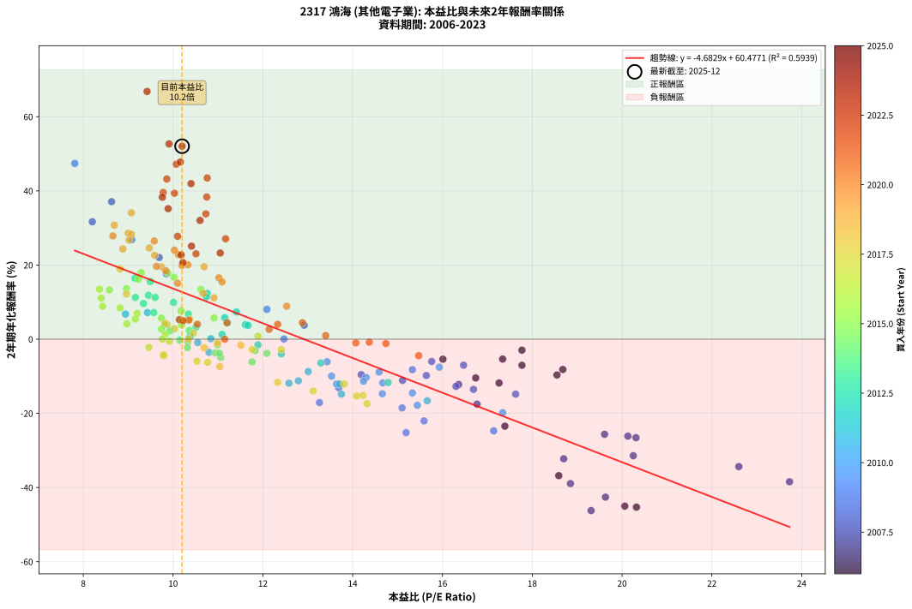
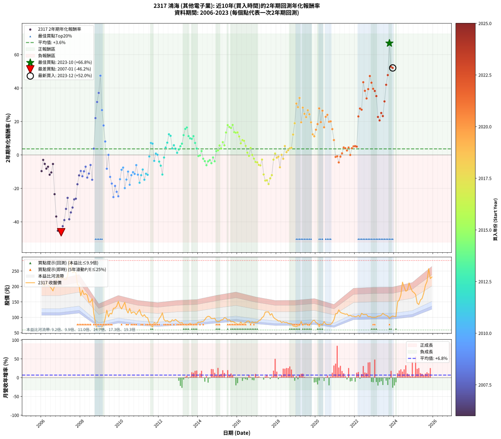

# 2317 鴻海 - 本益比與未來報酬率分析

!!! info "報告資訊"
    - **股票代號**: 2317
    - **公司名稱**: 鴻海
    - **產業別**: 其他電子業
    - **分析期間**: 2005-2023 (217 個數據點)
    - **資料來源**: Type 12 (ShowMonthlyK_ChartFlow) 月收盤價與本益比
    - **報酬率口徑**: 含現金股利 (簡化: 年度合計，假設每年7/1入帳)
    - **報告生成時間**: 2025-12-23 11:53:18 CST

## 📈 視覺化圖表

### 圖表1: 本益比 vs 未來報酬率關係

*圖表1：2317 鴻海 本益比與2年期未來報酬率關係 (2005-2023)*

### 圖表2: 歷年買入時點的2年期實際報酬率

*圖表2：2317 鴻海 歷年買入時點的2年期實際報酬率 (2005-2023)*

## 📍 買點訊號說明

本報告提供兩種買點提示訊號（顯示於圖表2的股價子圖中）：

### ▲ 小綠色三角形（回測驗證）
- **計算方式**: 使用全部歷史資料計算本益比第25百分位數
- **用途**: 事後驗證，顯示歷史上哪些時點確實為低估區
- **限制**: 當下無法判斷，僅供回測參考
- **特性**: 後見之明（Look-Ahead Bias）

### ▲ 小橘色三角形（即時訊號）
- **計算方式**: 使用截至當月的過去5年資料計算本益比第25百分位數
- **用途**: 實際投資決策，當時即可判斷
- **優勢**: 可操作性強，符合實務需求
- **特性**: 無後見之明，滾動窗口計算

!!! tip "如何使用兩種訊號"
    - **綠色▲** 幫助理解歷史估值機會，驗證策略有效性
    - **橘色▲** 可作為實際買進參考，但仍需搭配基本面分析
    - 兩種訊號重疊時，表示即時判斷與事後驗證一致，信心度較高
    - 僅有綠色▲時，表示當時無法判斷（需要未來資料才能確認）
    - 僅有橘色▲時，表示即時判斷為買點，但事後可能不是最佳時機

## 📊 估值分析摘要

| 指標 | 數值 |
|:---:|:---:|
| **目前本益比** (2023-12) | **10.20 倍** |
| **歷史平均本益比** | 12.20 倍 |
| **估值水準** | 🟡 合理範圍 |
| **預期2年年化報酬率** | **+12.56%** |
| **歷史平均報酬率** | +3.64% |
| **相關係數 (R²)** | 0.5722 |
| **趨勢線斜率** | -4.4594 |

!!! abstract "核心洞察"
    目前本益比接近歷史平均，預期報酬率符合長期趨勢

    根據歷史數據回測，2317 鴻海 在目前本益比 **10.2倍** 的估值水準下，
    預期未來2年年化報酬率約為 **+12.6%**。

    **重要提醒**: 本分析基於歷史數據統計，實際報酬率會受到公司基本面變化、產業趨勢、
    總體經濟環境等多重因素影響。R² = 0.57 表示本益比可解釋約 57.2% 的報酬率變異。

## 📈 歷史估值統計

### 最佳買點 (最高報酬率)

| 項目 | 數值 |
|:---:|:---:|
| 起始時間 | 2023-10 |
| 當時本益比 | 9.42 倍 |
| 起始價格 | 96.5 元 |
| 2年後價格 | 257.5 元 |
| **2年年化報酬率** | **+66.81%** |

### 最差買點 (最低報酬率)

| 項目 | 數值 |
|:---:|:---:|
| 起始時間 | 2007-01 |
| 當時本益比 | 19.31 倍 |
| 起始價格 | 225.0 元 |
| 2年後價格 | 59.0 元 |
| **2年年化報酬率** | **-46.23%** |

## 🎯 投資啟示

### 本益比與報酬率關係

趨勢線方程式: **y = -4.4594x + 58.0485**

!!! warning "強負相關"
    本益比與未來報酬率呈現強負相關。在高本益比時期買入，未來報酬率顯著較低；
    在低本益比時期買入，未來報酬率顯著較高。**估值紀律至關重要**。

### 估值區間建議

基於歷史數據分析:

- **🟢 低估區** (P/E < 9.8): 預期報酬率較高，可考慮增加持股
- **🟡 合理區** (P/E 9.8-14.6): 預期報酬率符合長期趨勢，正常持有
- **🔴 高估區** (P/E > 14.6): 預期報酬率較低，可考慮減碼或觀望

!!! danger "風險提示"
    - 過去表現不代表未來結果
    - 本分析假設公司基本面無重大結構性變化
    - 產業環境劇變可能使歷史規律失效
    - 應結合公司財報、產業趨勢、總體經濟等多重因素綜合判斷

!!! success "長期投資觀點"
    歷史數據顯示，在合理或低估的估值水準買入並長期持有，
    往往能獲得較佳的投資報酬。**耐心等待好價格**是價值投資的核心原則。

## 📊 數據品質

- **資料來源**: GoodInfo.tw Type 12 (ShowMonthlyK_ChartFlow)
- **資料頻率**: 月度收盤價與本益比
- **回測期間**: 2005-2023
- **數據點數量**: 217 個 (每個點代表一次2年期回測)

### 計算方法說明

1. **2年期年化報酬率**:
   - 對每個歷史時點，計算其後2年的實際投資報酬率
   - 期末價值(不含股利): 期末價格
   - 期末價值(含現金股利): 期末價格 + 持有期間內的現金股利合計 (簡化: 年度合計，假設每年7/1入帳)
   - 公式: 年化報酬率 = [(期末價值/期初價格)^(1/年數) - 1] × 100%

2. **本益比 (P/E Ratio)**:
   - 使用當時的月收盤價與EPS計算
   - 資料來源: Type 12 月度河流圖本益比數據

3. **趨勢線 (Linear Regression)**:
   - 使用最小平方法擬合線性趨勢線
   - R²值衡量本益比對報酬率的解釋能力

---

*本報告由 Stock Analysis System v1.9.0 自動生成*
*數據更新時間: 2025-12-23 11:53:18 CST*

## 📋 月度回測明細表

（每一列對應時間線圖中的一個買入點；可用來對照 SVG 圖上的每個點。）

| 買入月份 | 賣出月份 | 回測期限_年 | 實際持有年數 | 買入本益比_倍 | 買入收盤價_元 | 賣出收盤價_元 | 現金股利合計_元 | 總報酬率_pct | 年化報酬率_pct |
| --- | --- | --- | --- | --- | --- | --- | --- | --- | --- |
| 2005-12 | 2007-12 | 2 | 1.999 | 16.97 | 180.00 | 202.00 | 6.00 | +15.56 | +7.50 |
| 2006-01 | 2008-01 | 2 | 1.999 | 20.12 | 215.00 | 169.50 | 6.00 | -18.37 | -9.66 |
| 2006-02 | 2008-02 | 2 | 1.999 | 19.13 | 206.00 | 188.00 | 6.00 | -5.83 | -2.96 |
| 2006-03 | 2008-03 | 2 | 2.001 | 18.52 | 201.00 | 174.00 | 6.00 | -10.45 | -5.36 |
| 2006-04 | 2008-04 | 2 | 2.001 | 19.80 | 216.50 | 176.50 | 6.00 | -15.70 | -8.18 |
| 2006-05 | 2008-05 | 2 | 2.001 | 18.70 | 206.00 | 172.00 | 6.00 | -13.59 | -7.04 |
| 2006-06 | 2008-06 | 2 | 2.001 | 18.02 | 200.00 | 149.50 | 6.00 | -22.25 | -11.82 |
| 2006-07 | 2008-07 | 2 | 2.001 | 17.35 | 194.00 | 149.50 | 6.00 | -19.85 | -10.46 |
| 2006-08 | 2008-08 | 2 | 2.001 | 16.47 | 185.50 | 160.00 | 6.00 | -10.51 | -5.40 |
| 2006-09 | 2008-09 | 2 | 2.001 | 17.76 | 201.50 | 112.00 | 6.00 | -41.44 | -23.46 |
| 2006-10 | 2008-10 | 2 | 2.001 | 18.86 | 215.50 | 80.00 | 6.00 | -60.09 | -36.81 |
| 2006-11 | 2008-11 | 2 | 2.001 | 20.46 | 235.50 | 64.40 | 6.00 | -70.11 | -45.30 |
| 2006-12 | 2008-12 | 2 | 2.001 | 20.06 | 232.50 | 64.20 | 6.00 | -69.81 | -45.03 |
| 2007-01 | 2009-01 | 2 | 2.001 | 19.31 | 225.00 | 59.00 | 6.00 | -71.11 | -46.23 |
| 2007-02 | 2009-02 | 2 | 2.001 | 19.63 | 230.00 | 69.70 | 6.00 | -67.09 | -42.61 |
| 2007-03 | 2009-03 | 2 | 2.001 | 18.85 | 222.00 | 76.70 | 6.00 | -62.75 | -38.94 |
| 2007-04 | 2009-04 | 2 | 2.001 | 18.70 | 221.50 | 95.60 | 6.00 | -54.13 | -32.26 |
| 2007-05 | 2009-05 | 2 | 2.001 | 19.61 | 233.50 | 123.00 | 6.00 | -44.75 | -25.66 |
| 2007-06 | 2009-06 | 2 | 2.001 | 23.73 | 284.00 | 101.50 | 6.00 | -62.15 | -38.46 |
| 2007-07 | 2009-07 | 2 | 2.001 | 22.60 | 272.00 | 113.00 | 4.10 | -56.95 | -34.37 |
| 2007-08 | 2009-08 | 2 | 2.001 | 20.25 | 245.00 | 111.00 | 4.10 | -53.02 | -31.44 |
| 2007-09 | 2009-09 | 2 | 2.001 | 20.31 | 247.00 | 129.00 | 4.10 | -46.11 | -26.58 |
| 2007-10 | 2009-10 | 2 | 2.001 | 20.13 | 246.00 | 130.00 | 4.10 | -45.49 | -26.15 |
| 2007-11 | 2009-11 | 2 | 2.001 | 16.77 | 206.00 | 136.00 | 4.10 | -31.99 | -17.52 |
| 2007-12 | 2009-12 | 2 | 2.001 | 16.36 | 202.00 | 151.50 | 4.10 | -22.97 | -12.23 |
| 2008-01 | 2010-01 | 2 | 2.001 | 14.19 | 169.50 | 134.50 | 4.10 | -18.23 | -9.57 |
| 2008-02 | 2010-03 | 2 | 2.081 | 16.30 | 188.00 | 137.50 | 4.10 | -24.68 | -12.73 |
| 2008-03 | 2010-03 | 2 | 1.999 | 15.64 | 174.00 | 137.50 | 4.10 | -18.62 | -9.80 |
| 2008-04 | 2010-04 | 2 | 1.999 | 16.47 | 176.50 | 148.50 | 4.10 | -13.54 | -7.02 |
| 2008-05 | 2010-05 | 2 | 1.999 | 16.69 | 172.00 | 124.50 | 4.10 | -25.23 | -13.54 |
| 2008-06 | 2010-06 | 2 | 1.999 | 15.11 | 149.50 | 114.00 | 4.10 | -21.00 | -11.13 |
| 2008-07 | 2010-07 | 2 | 1.999 | 15.76 | 149.50 | 129.00 | 3.10 | -11.64 | -6.00 |
| 2008-08 | 2010-08 | 2 | 1.999 | 17.63 | 160.00 | 113.00 | 3.10 | -27.44 | -14.83 |
| 2008-09 | 2010-09 | 2 | 1.999 | 12.92 | 112.00 | 117.50 | 3.10 | +7.68 | +3.77 |
| 2008-10 | 2010-10 | 2 | 1.999 | 9.69 | 80.00 | 116.00 | 3.10 | +48.87 | +22.03 |
| 2008-11 | 2010-11 | 2 | 1.999 | 8.20 | 64.40 | 108.50 | 3.10 | +73.29 | +31.67 |
| 2008-12 | 2010-12 | 2 | 1.999 | 8.63 | 64.20 | 117.50 | 3.10 | +87.85 | +37.09 |
| 2009-01 | 2011-01 | 2 | 1.999 | 7.81 | 59.00 | 125.00 | 3.10 | +117.12 | +47.39 |
| 2009-02 | 2011-02 | 2 | 1.999 | 9.08 | 69.70 | 109.00 | 3.10 | +60.83 | +26.84 |
| 2009-03 | 2011-03 | 2 | 1.999 | 9.85 | 76.70 | 103.00 | 3.10 | +38.33 | +17.63 |
| 2009-04 | 2011-04 | 2 | 1.999 | 12.09 | 95.60 | 108.50 | 3.10 | +16.74 | +8.05 |
| 2009-05 | 2011-05 | 2 | 1.999 | 15.33 | 123.00 | 100.50 | 3.10 | -15.77 | -8.23 |
| 2009-06 | 2011-06 | 2 | 1.999 | 12.47 | 101.50 | 98.50 | 3.10 | +0.10 | +0.05 |
| 2009-07 | 2011-07 | 2 | 1.999 | 13.69 | 113.00 | 82.30 | 3.00 | -24.51 | -13.13 |
| 2009-08 | 2011-08 | 2 | 1.999 | 13.26 | 111.00 | 73.30 | 3.00 | -31.26 | -17.10 |
| 2009-09 | 2011-09 | 2 | 1.999 | 15.19 | 129.00 | 69.20 | 3.00 | -44.03 | -25.20 |
| 2009-10 | 2011-10 | 2 | 1.999 | 15.10 | 130.00 | 83.30 | 3.00 | -33.62 | -18.53 |
| 2009-11 | 2011-11 | 2 | 1.999 | 15.59 | 136.00 | 79.70 | 3.00 | -39.19 | -22.03 |
| 2009-12 | 2011-12 | 2 | 1.999 | 17.14 | 151.50 | 82.90 | 3.00 | -43.30 | -24.72 |
| 2010-01 | 2012-01 | 2 | 1.999 | 15.33 | 134.50 | 95.30 | 3.00 | -26.91 | -14.52 |
| 2010-02 | 2012-02 | 2 | 1.999 | 14.59 | 127.00 | 102.50 | 3.00 | -16.93 | -8.86 |
| 2010-03 | 2012-03 | 2 | 2.001 | 15.93 | 137.50 | 114.50 | 3.00 | -14.55 | -7.55 |
| 2010-04 | 2012-04 | 2 | 2.001 | 17.34 | 148.50 | 92.40 | 3.00 | -35.76 | -19.84 |
| 2010-05 | 2012-05 | 2 | 2.001 | 14.66 | 124.50 | 87.50 | 3.00 | -27.31 | -14.73 |
| 2010-06 | 2012-06 | 2 | 2.001 | 13.53 | 114.00 | 89.40 | 3.00 | -18.95 | -9.96 |
| 2010-07 | 2012-07 | 2 | 2.001 | 15.44 | 129.00 | 84.60 | 2.50 | -32.48 | -17.82 |
| 2010-08 | 2012-08 | 2 | 2.001 | 13.64 | 113.00 | 84.80 | 2.50 | -22.74 | -12.10 |
| 2010-09 | 2012-09 | 2 | 2.001 | 14.30 | 117.50 | 92.00 | 2.50 | -19.57 | -10.31 |
| 2010-10 | 2012-10 | 2 | 2.001 | 14.24 | 116.00 | 88.70 | 2.50 | -21.38 | -11.32 |
| 2010-11 | 2012-11 | 2 | 2.001 | 13.43 | 108.50 | 93.20 | 2.50 | -11.80 | -6.08 |
| 2010-12 | 2012-12 | 2 | 2.001 | 14.67 | 117.50 | 88.90 | 2.50 | -22.21 | -11.80 |
| 2011-01 | 2013-01 | 2 | 2.001 | 15.66 | 125.00 | 84.40 | 2.50 | -30.48 | -16.61 |
| 2011-02 | 2013-02 | 2 | 2.001 | 13.71 | 109.00 | 81.70 | 2.50 | -22.75 | -12.10 |
| 2011-03 | 2013-03 | 2 | 2.001 | 13.01 | 103.00 | 83.30 | 2.50 | -16.70 | -8.72 |
| 2011-04 | 2013-04 | 2 | 2.001 | 13.75 | 108.50 | 76.20 | 2.50 | -27.47 | -14.82 |
| 2011-05 | 2013-05 | 2 | 2.001 | 12.79 | 100.50 | 76.70 | 2.50 | -21.19 | -11.22 |
| 2011-06 | 2013-06 | 2 | 2.001 | 12.58 | 98.50 | 74.00 | 2.50 | -22.34 | -11.86 |
| 2011-07 | 2013-07 | 2 | 2.001 | 10.55 | 82.30 | 77.80 | 3.00 | -1.82 | -0.91 |
| 2011-08 | 2013-08 | 2 | 2.001 | 9.43 | 73.30 | 81.20 | 3.00 | +14.87 | +7.17 |
| 2011-09 | 2013-09 | 2 | 2.001 | 8.94 | 69.20 | 75.90 | 3.00 | +14.02 | +6.77 |
| 2011-10 | 2013-10 | 2 | 2.001 | 10.80 | 83.30 | 74.50 | 3.00 | -6.96 | -3.54 |
| 2011-11 | 2013-11 | 2 | 2.001 | 10.38 | 79.70 | 78.00 | 3.00 | +1.63 | +0.81 |
| 2011-12 | 2013-12 | 2 | 2.001 | 10.84 | 82.90 | 80.10 | 3.00 | +0.24 | +0.12 |
| 2012-01 | 2014-01 | 2 | 2.001 | 12.41 | 95.30 | 84.90 | 3.00 | -7.76 | -3.96 |
| 2012-02 | 2014-03 | 2 | 2.081 | 13.29 | 102.50 | 86.30 | 3.00 | -12.88 | -6.41 |
| 2012-03 | 2014-03 | 2 | 1.999 | 14.79 | 114.50 | 86.30 | 3.00 | -22.01 | -11.69 |
| 2012-04 | 2014-04 | 2 | 1.999 | 11.89 | 92.40 | 86.60 | 3.00 | -3.03 | -1.53 |
| 2012-05 | 2014-05 | 2 | 1.999 | 11.21 | 87.50 | 92.40 | 3.00 | +9.03 | +4.42 |
| 2012-06 | 2014-06 | 2 | 1.999 | 11.41 | 89.40 | 100.00 | 3.00 | +15.21 | +7.34 |
| 2012-07 | 2014-07 | 2 | 1.999 | 10.76 | 84.60 | 103.50 | 3.30 | +26.24 | +12.37 |
| 2012-08 | 2014-08 | 2 | 1.999 | 10.74 | 84.80 | 102.00 | 3.30 | +24.17 | +11.44 |
| 2012-09 | 2014-09 | 2 | 1.999 | 11.61 | 92.00 | 96.00 | 3.30 | +7.93 | +3.89 |
| 2012-10 | 2014-10 | 2 | 1.999 | 11.15 | 88.70 | 96.00 | 3.30 | +11.95 | +5.81 |
| 2012-11 | 2014-11 | 2 | 1.999 | 11.67 | 93.20 | 97.00 | 3.30 | +7.62 | +3.74 |
| 2012-12 | 2014-12 | 2 | 1.999 | 11.09 | 88.90 | 87.90 | 3.30 | +2.59 | +1.29 |
| 2013-01 | 2015-01 | 2 | 1.999 | 10.51 | 84.40 | 86.70 | 3.30 | +6.64 | +3.27 |
| 2013-02 | 2015-02 | 2 | 1.999 | 10.16 | 81.70 | 87.10 | 3.30 | +10.65 | +5.19 |
| 2013-03 | 2015-03 | 2 | 1.999 | 10.34 | 83.30 | 91.60 | 3.30 | +13.93 | +6.74 |
| 2013-04 | 2015-04 | 2 | 1.999 | 9.45 | 76.20 | 92.00 | 3.30 | +25.07 | +11.84 |
| 2013-05 | 2015-05 | 2 | 1.999 | 9.49 | 76.70 | 99.10 | 3.30 | +33.51 | +15.56 |
| 2013-06 | 2015-06 | 2 | 1.999 | 9.15 | 74.00 | 97.00 | 3.30 | +35.54 | +16.43 |
| 2013-07 | 2015-07 | 2 | 1.999 | 9.60 | 77.80 | 90.70 | 5.60 | +23.78 | +11.26 |
| 2013-08 | 2015-08 | 2 | 1.999 | 10.01 | 81.20 | 92.50 | 5.60 | +20.81 | +9.92 |
| 2013-09 | 2015-09 | 2 | 1.999 | 9.34 | 75.90 | 85.60 | 5.60 | +20.16 | +9.62 |
| 2013-10 | 2015-10 | 2 | 1.999 | 9.16 | 74.50 | 86.60 | 5.60 | +23.76 | +11.25 |
| 2013-11 | 2015-11 | 2 | 1.999 | 9.57 | 78.00 | 84.00 | 5.60 | +14.87 | +7.18 |
| 2013-12 | 2015-12 | 2 | 1.999 | 9.82 | 80.10 | 80.80 | 5.60 | +7.87 | +3.86 |
| 2014-01 | 2016-01 | 2 | 1.999 | 10.33 | 84.90 | 78.20 | 5.60 | -1.30 | -0.65 |
| 2014-02 | 2016-02 | 2 | 1.999 | 10.15 | 84.00 | 78.00 | 5.60 | -0.48 | -0.24 |
| 2014-03 | 2016-03 | 2 | 2.001 | 10.36 | 86.30 | 84.80 | 5.60 | +4.75 | +2.35 |
| 2014-04 | 2016-04 | 2 | 2.001 | 10.32 | 86.60 | 77.10 | 5.60 | -4.50 | -2.28 |
| 2014-05 | 2016-05 | 2 | 2.001 | 10.94 | 92.40 | 80.10 | 5.60 | -7.25 | -3.69 |
| 2014-06 | 2016-06 | 2 | 2.001 | 11.76 | 100.00 | 82.50 | 5.60 | -11.90 | -6.13 |
| 2014-07 | 2016-07 | 2 | 2.001 | 12.09 | 103.50 | 87.90 | 7.80 | -7.54 | -3.84 |
| 2014-08 | 2016-08 | 2 | 2.001 | 11.83 | 102.00 | 88.00 | 7.80 | -6.08 | -3.08 |
| 2014-09 | 2016-09 | 2 | 2.001 | 11.06 | 96.00 | 79.00 | 7.80 | -9.58 | -4.91 |
| 2014-10 | 2016-10 | 2 | 2.001 | 10.99 | 96.00 | 85.30 | 7.80 | -3.02 | -1.52 |
| 2014-11 | 2016-11 | 2 | 2.001 | 11.03 | 97.00 | 82.00 | 7.80 | -7.42 | -3.78 |
| 2014-12 | 2016-12 | 2 | 2.001 | 9.93 | 87.90 | 84.20 | 7.80 | +4.66 | +2.30 |
| 2015-01 | 2017-01 | 2 | 2.001 | 9.74 | 86.70 | 83.70 | 7.80 | +5.54 | +2.73 |
| 2015-02 | 2017-02 | 2 | 2.001 | 9.74 | 87.10 | 89.50 | 7.80 | +11.71 | +5.69 |
| 2015-03 | 2017-03 | 2 | 2.001 | 10.19 | 91.60 | 91.00 | 7.80 | +7.86 | +3.85 |
| 2015-04 | 2017-04 | 2 | 2.001 | 10.18 | 92.00 | 98.80 | 7.80 | +15.87 | +7.64 |
| 2015-05 | 2017-05 | 2 | 2.001 | 10.91 | 99.10 | 103.00 | 7.80 | +11.81 | +5.73 |
| 2015-06 | 2017-06 | 2 | 2.001 | 10.62 | 97.00 | 117.00 | 7.80 | +28.66 | +13.42 |
| 2015-07 | 2017-07 | 2 | 2.001 | 9.88 | 90.70 | 117.50 | 8.50 | +38.92 | +17.85 |
| 2015-08 | 2017-08 | 2 | 2.001 | 10.02 | 92.50 | 117.50 | 8.50 | +36.22 | +16.70 |
| 2015-09 | 2017-09 | 2 | 2.001 | 9.23 | 85.60 | 107.00 | 8.50 | +34.93 | +16.15 |
| 2015-10 | 2017-10 | 2 | 2.001 | 9.29 | 86.60 | 112.00 | 8.50 | +39.15 | +17.95 |
| 2015-11 | 2017-11 | 2 | 2.001 | 8.96 | 84.00 | 100.00 | 8.50 | +29.17 | +13.64 |
| 2015-12 | 2017-12 | 2 | 2.001 | 8.58 | 80.80 | 95.20 | 8.50 | +28.34 | +13.28 |
| 2016-01 | 2018-01 | 2 | 2.001 | 8.36 | 78.20 | 92.20 | 8.50 | +28.77 | +13.47 |
| 2016-02 | 2018-03 | 2 | 2.081 | 8.40 | 78.00 | 88.50 | 8.50 | +24.36 | +11.05 |
| 2016-03 | 2018-03 | 2 | 1.999 | 9.20 | 84.80 | 88.50 | 8.50 | +14.39 | +6.96 |
| 2016-04 | 2018-04 | 2 | 1.999 | 8.43 | 77.10 | 82.90 | 8.50 | +18.55 | +8.89 |
| 2016-05 | 2018-05 | 2 | 1.999 | 8.82 | 80.10 | 85.70 | 8.50 | +17.60 | +8.45 |
| 2016-06 | 2018-06 | 2 | 1.999 | 9.16 | 82.50 | 83.20 | 8.50 | +11.15 | +5.43 |
| 2016-07 | 2018-07 | 2 | 1.999 | 9.83 | 87.90 | 83.80 | 6.50 | +2.73 | +1.36 |
| 2016-08 | 2018-08 | 2 | 1.999 | 9.92 | 88.00 | 80.50 | 6.50 | -1.14 | -0.57 |
| 2016-09 | 2018-09 | 2 | 1.999 | 8.97 | 79.00 | 79.20 | 6.50 | +8.48 | +4.16 |
| 2016-10 | 2018-10 | 2 | 1.999 | 9.76 | 85.30 | 78.80 | 6.50 | +0.00 | +0.00 |
| 2016-11 | 2018-11 | 2 | 1.999 | 9.46 | 82.00 | 71.90 | 6.50 | -4.39 | -2.22 |
| 2016-12 | 2018-12 | 2 | 1.999 | 9.79 | 84.20 | 70.80 | 6.50 | -8.19 | -4.19 |
| 2017-01 | 2019-01 | 2 | 1.999 | 9.79 | 83.70 | 70.00 | 6.50 | -8.60 | -4.40 |
| 2017-02 | 2019-02 | 2 | 1.999 | 10.53 | 89.50 | 72.70 | 6.50 | -11.51 | -5.93 |
| 2017-03 | 2019-03 | 2 | 1.999 | 10.77 | 91.00 | 73.50 | 6.50 | -12.09 | -6.24 |
| 2017-04 | 2019-04 | 2 | 1.999 | 11.76 | 98.80 | 86.90 | 6.50 | -5.47 | -2.77 |
| 2017-05 | 2019-05 | 2 | 1.999 | 12.33 | 103.00 | 73.90 | 6.50 | -21.94 | -11.66 |
| 2017-06 | 2019-06 | 2 | 1.999 | 14.09 | 117.00 | 77.40 | 6.50 | -28.29 | -15.33 |
| 2017-07 | 2019-07 | 2 | 1.999 | 14.23 | 117.50 | 78.60 | 6.00 | -28.00 | -15.16 |
| 2017-08 | 2019-08 | 2 | 1.999 | 14.32 | 117.50 | 74.20 | 6.00 | -31.74 | -17.39 |
| 2017-09 | 2019-09 | 2 | 1.999 | 13.12 | 107.00 | 73.20 | 6.00 | -25.98 | -13.97 |
| 2017-10 | 2019-10 | 2 | 1.999 | 13.81 | 112.00 | 80.60 | 6.00 | -22.68 | -12.08 |
| 2017-11 | 2019-11 | 2 | 1.999 | 12.41 | 100.00 | 88.50 | 6.00 | -5.50 | -2.79 |
| 2017-12 | 2019-12 | 2 | 1.999 | 11.89 | 95.20 | 90.80 | 6.00 | +1.68 | +0.84 |
| 2018-01 | 2020-01 | 2 | 1.999 | 11.51 | 92.20 | 83.20 | 6.00 | -3.25 | -1.64 |
| 2018-02 | 2020-02 | 2 | 1.999 | 10.99 | 88.10 | 80.30 | 6.00 | -2.04 | -1.03 |
| 2018-03 | 2020-03 | 2 | 2.001 | 11.04 | 88.50 | 69.90 | 6.00 | -14.24 | -7.39 |
| 2018-04 | 2020-04 | 2 | 2.001 | 10.34 | 82.90 | 77.00 | 6.00 | +0.12 | +0.06 |
| 2018-05 | 2020-05 | 2 | 2.001 | 10.69 | 85.70 | 75.80 | 6.00 | -4.55 | -2.30 |
| 2018-06 | 2020-06 | 2 | 2.001 | 10.37 | 83.20 | 86.30 | 6.00 | +10.94 | +5.32 |
| 2018-07 | 2020-07 | 2 | 2.001 | 10.45 | 83.80 | 78.40 | 8.20 | +3.34 | +1.66 |
| 2018-08 | 2020-08 | 2 | 2.001 | 10.03 | 80.50 | 76.90 | 8.20 | +5.71 | +2.82 |
| 2018-09 | 2020-09 | 2 | 2.001 | 9.87 | 79.20 | 77.40 | 8.20 | +8.08 | +3.96 |
| 2018-10 | 2020-10 | 2 | 2.001 | 9.82 | 78.80 | 77.50 | 8.20 | +8.76 | +4.28 |
| 2018-11 | 2020-11 | 2 | 2.001 | 8.96 | 71.90 | 82.30 | 8.20 | +25.87 | +12.18 |
| 2018-12 | 2020-12 | 2 | 2.001 | 8.82 | 70.80 | 92.00 | 8.20 | +41.53 | +18.95 |
| 2019-01 | 2021-01 | 2 | 2.001 | 8.69 | 70.00 | 111.50 | 8.20 | +71.00 | +30.74 |
| 2019-02 | 2021-02 | 2 | 2.001 | 9.00 | 72.70 | 112.00 | 8.20 | +65.34 | +28.56 |
| 2019-03 | 2021-03 | 2 | 2.001 | 9.07 | 73.50 | 124.00 | 8.20 | +79.86 | +34.09 |
| 2019-04 | 2021-04 | 2 | 2.001 | 10.69 | 86.90 | 116.00 | 8.20 | +42.92 | +19.54 |
| 2019-05 | 2021-05 | 2 | 2.001 | 9.07 | 73.90 | 113.50 | 8.20 | +64.68 | +28.31 |
| 2019-06 | 2021-06 | 2 | 2.001 | 9.47 | 77.40 | 112.00 | 8.20 | +55.30 | +24.60 |
| 2019-07 | 2021-07 | 2 | 2.001 | 9.59 | 78.60 | 110.00 | 8.20 | +50.38 | +22.61 |
| 2019-08 | 2021-08 | 2 | 2.001 | 9.02 | 74.20 | 111.00 | 8.20 | +60.65 | +26.73 |
| 2019-09 | 2021-09 | 2 | 2.001 | 8.88 | 73.20 | 105.00 | 8.20 | +54.64 | +24.34 |
| 2019-10 | 2021-10 | 2 | 2.001 | 9.74 | 80.60 | 107.00 | 8.20 | +42.93 | +19.54 |
| 2019-11 | 2021-11 | 2 | 2.001 | 10.67 | 88.50 | 103.50 | 8.20 | +26.21 | +12.34 |
| 2019-12 | 2021-12 | 2 | 2.001 | 10.91 | 90.80 | 104.00 | 8.20 | +23.57 | +11.15 |
| 2020-01 | 2022-01 | 2 | 2.001 | 10.10 | 83.20 | 102.00 | 8.20 | +32.45 | +15.08 |
| 2020-02 | 2022-03 | 2 | 2.081 | 9.84 | 80.30 | 106.00 | 8.20 | +42.22 | +18.44 |
| 2020-03 | 2022-03 | 2 | 1.999 | 8.66 | 69.90 | 106.00 | 8.20 | +63.38 | +27.84 |
| 2020-04 | 2022-04 | 2 | 1.999 | 9.63 | 77.00 | 102.00 | 8.20 | +43.12 | +19.65 |
| 2020-05 | 2022-05 | 2 | 1.999 | 9.58 | 75.80 | 113.00 | 8.20 | +59.89 | +26.47 |
| 2020-06 | 2022-06 | 2 | 1.999 | 11.02 | 86.30 | 109.00 | 8.20 | +35.81 | +16.55 |
| 2020-07 | 2022-07 | 2 | 1.999 | 10.12 | 78.40 | 109.00 | 9.20 | +50.77 | +22.80 |
| 2020-08 | 2022-08 | 2 | 1.999 | 10.03 | 76.90 | 109.00 | 9.20 | +53.71 | +24.00 |
| 2020-09 | 2022-09 | 2 | 1.999 | 10.20 | 77.40 | 102.00 | 9.20 | +43.67 | +19.88 |
| 2020-10 | 2022-10 | 2 | 1.999 | 10.33 | 77.50 | 102.50 | 9.20 | +44.13 | +20.07 |
| 2020-11 | 2022-11 | 2 | 1.999 | 11.09 | 82.30 | 100.50 | 9.20 | +33.29 | +15.46 |
| 2020-12 | 2022-12 | 2 | 1.999 | 12.53 | 92.00 | 99.90 | 9.20 | +18.59 | +8.90 |
| 2021-01 | 2023-01 | 2 | 1.999 | 14.74 | 111.50 | 99.70 | 9.20 | -2.33 | -1.17 |
| 2021-02 | 2023-02 | 2 | 1.999 | 14.37 | 112.00 | 101.00 | 9.20 | -1.61 | -0.81 |
| 2021-03 | 2023-03 | 2 | 1.999 | 15.47 | 124.00 | 104.00 | 9.20 | -8.71 | -4.46 |
| 2021-04 | 2023-04 | 2 | 1.999 | 14.07 | 116.00 | 104.50 | 9.20 | -1.98 | -1.00 |
| 2021-05 | 2023-05 | 2 | 1.999 | 13.40 | 113.50 | 106.50 | 9.20 | +1.94 | +0.97 |
| 2021-06 | 2023-06 | 2 | 1.999 | 12.88 | 112.00 | 113.00 | 9.20 | +9.11 | +4.46 |
| 2021-07 | 2023-07 | 2 | 1.999 | 12.33 | 110.00 | 108.50 | 10.50 | +8.18 | +4.01 |
| 2021-08 | 2023-08 | 2 | 1.999 | 12.14 | 111.00 | 106.50 | 10.50 | +5.41 | +2.67 |
| 2021-09 | 2023-09 | 2 | 1.999 | 11.20 | 105.00 | 104.00 | 10.50 | +9.05 | +4.43 |
| 2021-10 | 2023-10 | 2 | 1.999 | 11.15 | 107.00 | 96.50 | 10.50 | +0.00 | +0.00 |
| 2021-11 | 2023-11 | 2 | 1.999 | 10.54 | 103.50 | 101.50 | 10.50 | +8.21 | +4.03 |
| 2021-12 | 2023-12 | 2 | 1.999 | 10.35 | 104.00 | 104.50 | 10.50 | +10.58 | +5.16 |
| 2022-01 | 2024-01 | 2 | 1.999 | 10.14 | 102.00 | 102.50 | 10.50 | +10.78 | +5.26 |
| 2022-02 | 2024-02 | 2 | 1.999 | 10.22 | 103.00 | 103.00 | 10.50 | +10.19 | +4.98 |
| 2022-03 | 2024-03 | 2 | 2.001 | 10.51 | 106.00 | 150.00 | 10.50 | +51.42 | +23.03 |
| 2022-04 | 2024-04 | 2 | 2.001 | 10.10 | 102.00 | 156.00 | 10.50 | +63.24 | +27.74 |
| 2022-05 | 2024-05 | 2 | 2.001 | 11.17 | 113.00 | 172.00 | 10.50 | +61.50 | +27.06 |
| 2022-06 | 2024-06 | 2 | 2.001 | 10.76 | 109.00 | 214.00 | 10.50 | +105.96 | +43.48 |
| 2022-07 | 2024-07 | 2 | 2.001 | 10.75 | 109.00 | 198.00 | 10.70 | +91.47 | +38.34 |
| 2022-08 | 2024-08 | 2 | 2.001 | 10.73 | 109.00 | 184.50 | 10.70 | +79.08 | +33.80 |
| 2022-09 | 2024-09 | 2 | 2.001 | 10.03 | 102.00 | 187.50 | 10.70 | +94.31 | +39.36 |
| 2022-10 | 2024-10 | 2 | 2.001 | 10.07 | 102.50 | 211.50 | 10.70 | +116.78 | +47.20 |
| 2022-11 | 2024-11 | 2 | 2.001 | 9.86 | 100.50 | 195.50 | 10.70 | +105.17 | +43.20 |
| 2022-12 | 2024-12 | 2 | 2.001 | 9.78 | 99.90 | 184.00 | 10.70 | +94.89 | +39.57 |
| 2023-01 | 2025-01 | 2 | 2.001 | 9.76 | 99.70 | 180.00 | 10.70 | +91.27 | +38.27 |
| 2023-02 | 2025-02 | 2 | 2.001 | 9.89 | 101.00 | 174.00 | 10.70 | +82.87 | +35.20 |
| 2023-03 | 2025-03 | 2 | 2.001 | 10.18 | 104.00 | 146.00 | 10.70 | +50.67 | +22.73 |
| 2023-04 | 2025-04 | 2 | 2.001 | 10.22 | 104.50 | 141.50 | 10.70 | +45.65 | +20.67 |
| 2023-05 | 2025-05 | 2 | 2.001 | 10.41 | 106.50 | 156.00 | 10.70 | +56.53 | +25.09 |
| 2023-06 | 2025-06 | 2 | 2.001 | 11.05 | 113.00 | 161.00 | 10.70 | +51.95 | +23.25 |
| 2023-07 | 2025-07 | 2 | 2.001 | 10.60 | 108.50 | 178.00 | 11.20 | +74.38 | +32.03 |
| 2023-08 | 2025-08 | 2 | 2.001 | 10.40 | 106.50 | 203.50 | 11.20 | +101.60 | +41.95 |
| 2023-09 | 2025-09 | 2 | 2.001 | 10.16 | 104.00 | 216.00 | 11.20 | +118.46 | +47.76 |
| 2023-10 | 2025-10 | 2 | 2.001 | 9.42 | 96.50 | 257.50 | 11.20 | +178.45 | +66.81 |
| 2023-11 | 2025-11 | 2 | 2.001 | 9.91 | 101.50 | 225.50 | 11.20 | +133.20 | +52.67 |
| 2023-12 | 2025-12 | 2 | 2.001 | 10.20 | 104.50 | 222.00 | 11.20 | +123.16 | +49.34 |
