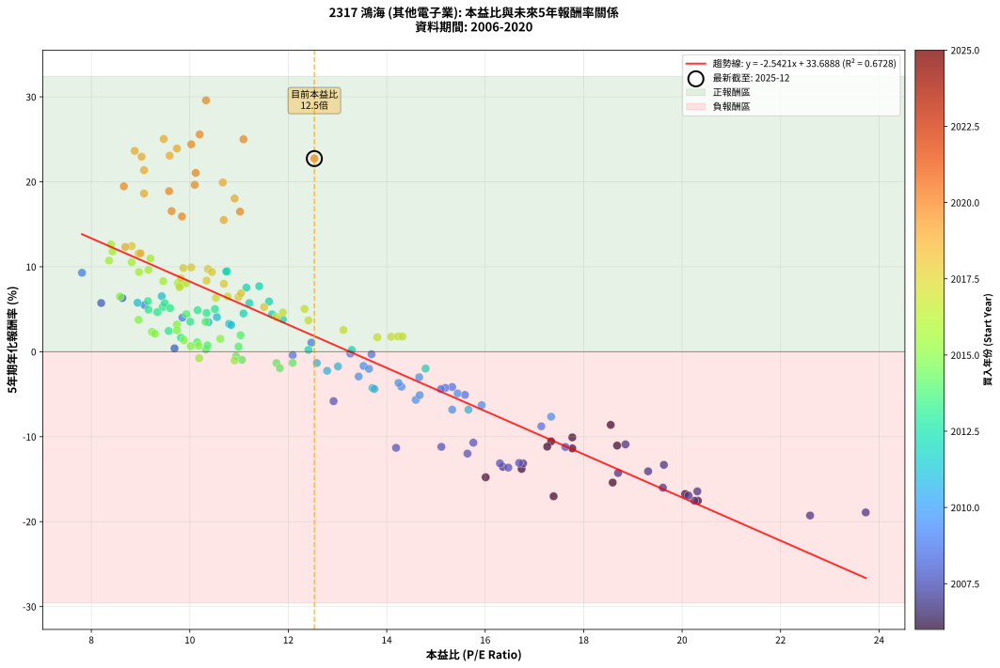
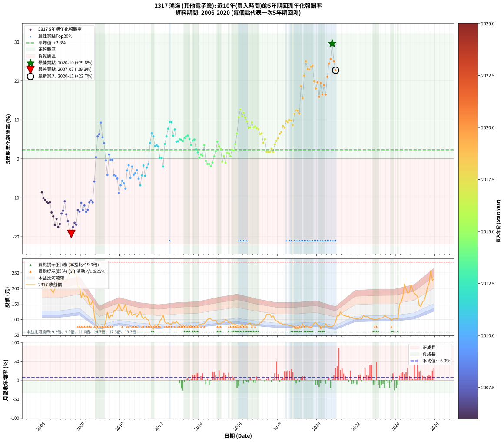

# 2317 鴻海 - 本益比與未來報酬率分析

!!! info "報告資訊"
    - **股票代號**: 2317
    - **公司名稱**: 鴻海
    - **產業別**: 其他電子業
    - **分析期間**: 2006-2020 (180 個數據點)
    - **資料來源**: Type 12 (ShowMonthlyK_ChartFlow) 月收盤價與本益比
    - **報酬率口徑**: 含現金股利 (簡化: 年度合計，假設每年7/1入帳)
    - **報告生成時間**: 2026-01-10 20:31:03 CST

## 📈 視覺化圖表

### 圖表1: 本益比 vs 未來報酬率關係

*圖表1：2317 鴻海 本益比與5年期未來報酬率關係 (2006-2020)*

### 圖表2: 歷年買入時點的5年期實際報酬率

*圖表2：2317 鴻海 歷年買入時點的5年期實際報酬率 (2006-2020)*

## 📍 買點訊號說明

本報告提供兩種買點提示訊號（顯示於圖表2的股價子圖中）：

### ▲ 小綠色三角形（回測驗證）
- **計算方式**: 使用全部歷史資料計算本益比第25百分位數
- **用途**: 事後驗證，顯示歷史上哪些時點確實為低估區
- **限制**: 當下無法判斷，僅供回測參考
- **特性**: 後見之明（Look-Ahead Bias）

### ▲ 小橘色三角形（即時訊號）
- **計算方式**: 使用截至當月的過去5年資料計算本益比第25百分位數
- **用途**: 實際投資決策，當時即可判斷
- **優勢**: 可操作性強，符合實務需求
- **特性**: 無後見之明，滾動窗口計算

!!! tip "如何使用兩種訊號"
    - **綠色▲** 幫助理解歷史估值機會，驗證策略有效性
    - **橘色▲** 可作為實際買進參考，但仍需搭配基本面分析
    - 兩種訊號重疊時，表示即時判斷與事後驗證一致，信心度較高
    - 僅有綠色▲時，表示當時無法判斷（需要未來資料才能確認）
    - 僅有橘色▲時，表示即時判斷為買點，但事後可能不是最佳時機

## 📊 估值分析摘要

| 指標 | 數值 |
|:---:|:---:|
| **目前本益比** (2020-12) | **12.53 倍** |
| **歷史平均本益比** | 12.35 倍 |
| **估值水準** | 🟡 合理範圍 |
| **預期5年年化報酬率** | **+1.84%** |
| **歷史平均報酬率** | +2.30% |
| **相關係數 (R²)** | 0.6728 |
| **趨勢線斜率** | -2.5421 |

!!! abstract "核心洞察"
    目前本益比接近歷史平均，預期報酬率符合長期趨勢

    根據歷史數據回測，2317 鴻海 在目前本益比 **12.5倍** 的估值水準下，
    預期未來5年年化報酬率約為 **+1.8%**。

    **重要提醒**: 本分析基於歷史數據統計，實際報酬率會受到公司基本面變化、產業趨勢、
    總體經濟環境等多重因素影響。R² = 0.67 表示本益比可解釋約 67.3% 的報酬率變異。

## 📈 歷史估值統計

### 最佳買點 (最高報酬率)

| 項目 | 數值 |
|:---:|:---:|
| 起始時間 | 2020-10 |
| 當時本益比 | 10.33 倍 |
| 起始價格 | 77.5 元 |
| 5年後價格 | 257.5 元 |
| **5年年化報酬率** | **+29.59%** |

### 最差買點 (最低報酬率)

| 項目 | 數值 |
|:---:|:---:|
| 起始時間 | 2007-07 |
| 當時本益比 | 22.60 倍 |
| 起始價格 | 272.0 元 |
| 5年後價格 | 84.6 元 |
| **5年年化報酬率** | **-19.28%** |

## 🎯 投資啟示

### 本益比與報酬率關係

趨勢線方程式: **y = -2.5421x + 33.6888**

!!! warning "強負相關"
    本益比與未來報酬率呈現強負相關。在高本益比時期買入，未來報酬率顯著較低；
    在低本益比時期買入，未來報酬率顯著較高。**估值紀律至關重要**。

### 估值區間建議

基於歷史數據分析:

- **🟢 低估區** (P/E < 9.9): 預期報酬率較高，可考慮增加持股
- **🟡 合理區** (P/E 9.9-14.8): 預期報酬率符合長期趨勢，正常持有
- **🔴 高估區** (P/E > 14.8): 預期報酬率較低，可考慮減碼或觀望

!!! danger "風險提示"
    - 過去表現不代表未來結果
    - 本分析假設公司基本面無重大結構性變化
    - 產業環境劇變可能使歷史規律失效
    - 應結合公司財報、產業趨勢、總體經濟等多重因素綜合判斷

!!! success "長期投資觀點"
    歷史數據顯示，在合理或低估的估值水準買入並長期持有，
    往往能獲得較佳的投資報酬。**耐心等待好價格**是價值投資的核心原則。

## 📊 數據品質

- **資料來源**: GoodInfo.tw Type 12 (ShowMonthlyK_ChartFlow)
- **資料頻率**: 月度收盤價與本益比
- **回測期間**: 2006-2020
- **數據點數量**: 180 個 (每個點代表一次5年期回測)

### 計算方法說明

1. **5年期年化報酬率**:
   - 對每個歷史時點，計算其後5年的實際投資報酬率
   - 期末價值(不含股利): 期末價格
   - 期末價值(含現金股利): 期末價格 + 持有期間內的現金股利合計 (簡化: 年度合計，假設每年7/1入帳)
   - 公式: 年化報酬率 = [(期末價值/期初價格)^(1/年數) - 1] × 100%

2. **本益比 (P/E Ratio)**:
   - 使用當時的月收盤價與EPS計算
   - 資料來源: Type 12 月度河流圖本益比數據

3. **趨勢線 (Linear Regression)**:
   - 使用最小平方法擬合線性趨勢線
   - R²值衡量本益比對報酬率的解釋能力

---

*本報告由 Stock Analysis System v1.9.0 自動生成*
*數據更新時間: 2026-01-10 20:31:03 CST*

## 📋 月度回測明細表

（每一列對應時間線圖中的一個買入點；可用來對照 SVG 圖上的每個點。）

| 買入月份 | 賣出月份 | 回測期限_年 | 實際持有年數 | 買入本益比_倍 | 買入收盤價_元 | 賣出收盤價_元 | 現金股利合計_元 | 總報酬率_pct | 年化報酬率_pct |
| --- | --- | --- | --- | --- | --- | --- | --- | --- | --- |
| 2006-01 | 2011-01 | 5 | 4.999 | 18.55 | 215.00 | 125.00 | 12.10 | -36.23 | -8.61 |
| 2006-02 | 2011-02 | 5 | 4.999 | 17.77 | 206.00 | 109.00 | 12.10 | -41.21 | -10.08 |
| 2006-03 | 2011-03 | 5 | 4.999 | 17.34 | 201.00 | 103.00 | 12.10 | -42.74 | -10.55 |
| 2006-04 | 2011-04 | 5 | 4.999 | 18.68 | 216.50 | 108.50 | 12.10 | -44.30 | -11.04 |
| 2006-05 | 2011-05 | 5 | 4.999 | 17.77 | 206.00 | 100.50 | 12.10 | -45.34 | -11.38 |
| 2006-06 | 2011-06 | 5 | 4.999 | 17.26 | 200.00 | 98.50 | 12.10 | -44.70 | -11.17 |
| 2006-07 | 2011-07 | 5 | 4.999 | 16.74 | 194.00 | 82.30 | 10.10 | -52.37 | -13.79 |
| 2006-08 | 2011-08 | 5 | 4.999 | 16.01 | 185.50 | 73.30 | 10.10 | -55.04 | -14.78 |
| 2006-09 | 2011-09 | 5 | 4.999 | 17.39 | 201.50 | 69.20 | 10.10 | -60.65 | -17.02 |
| 2006-10 | 2011-10 | 5 | 4.999 | 18.59 | 215.50 | 83.30 | 10.10 | -56.66 | -15.40 |
| 2006-11 | 2011-11 | 5 | 4.999 | 20.32 | 235.50 | 79.70 | 10.10 | -61.87 | -17.54 |
| 2006-12 | 2011-12 | 5 | 4.999 | 20.06 | 232.50 | 82.90 | 10.10 | -60.00 | -16.75 |
| 2007-01 | 2012-01 | 5 | 4.999 | 19.31 | 225.00 | 95.30 | 10.10 | -53.16 | -14.07 |
| 2007-02 | 2012-02 | 5 | 4.999 | 19.63 | 230.00 | 102.50 | 10.10 | -51.04 | -13.31 |
| 2007-03 | 2012-03 | 5 | 5.002 | 18.85 | 222.00 | 114.50 | 10.10 | -43.87 | -10.90 |
| 2007-04 | 2012-04 | 5 | 5.002 | 18.70 | 221.50 | 92.40 | 10.10 | -53.72 | -14.28 |
| 2007-05 | 2012-05 | 5 | 5.002 | 19.61 | 233.50 | 87.50 | 10.10 | -58.20 | -16.00 |
| 2007-06 | 2012-06 | 5 | 5.002 | 23.73 | 284.00 | 89.40 | 10.10 | -64.96 | -18.92 |
| 2007-07 | 2012-07 | 5 | 5.002 | 22.60 | 272.00 | 84.60 | 8.60 | -65.74 | -19.28 |
| 2007-08 | 2012-08 | 5 | 5.002 | 20.25 | 245.00 | 84.80 | 8.60 | -61.88 | -17.53 |
| 2007-09 | 2012-09 | 5 | 5.002 | 20.31 | 247.00 | 92.00 | 8.60 | -59.27 | -16.44 |
| 2007-10 | 2012-10 | 5 | 5.002 | 20.13 | 246.00 | 88.70 | 8.60 | -60.45 | -16.93 |
| 2007-11 | 2012-11 | 5 | 5.002 | 16.77 | 206.00 | 93.20 | 8.60 | -50.58 | -13.14 |
| 2007-12 | 2012-12 | 5 | 5.002 | 16.36 | 202.00 | 88.90 | 8.60 | -51.73 | -13.55 |
| 2008-01 | 2013-01 | 5 | 5.002 | 14.19 | 169.50 | 84.40 | 8.60 | -45.13 | -11.31 |
| 2008-02 | 2013-03 | 5 | 5.081 | 16.30 | 188.00 | 83.30 | 8.60 | -51.12 | -13.14 |
| 2008-03 | 2013-03 | 5 | 4.999 | 15.64 | 174.00 | 83.30 | 8.60 | -47.18 | -11.99 |
| 2008-04 | 2013-04 | 5 | 4.999 | 16.47 | 176.50 | 76.20 | 8.60 | -51.95 | -13.64 |
| 2008-05 | 2013-05 | 5 | 4.999 | 16.69 | 172.00 | 76.70 | 8.60 | -50.41 | -13.09 |
| 2008-06 | 2013-06 | 5 | 4.999 | 15.11 | 149.50 | 74.00 | 8.60 | -44.75 | -11.19 |
| 2008-07 | 2013-07 | 5 | 4.999 | 15.76 | 149.50 | 77.80 | 7.10 | -43.21 | -10.70 |
| 2008-08 | 2013-08 | 5 | 4.999 | 17.63 | 160.00 | 81.20 | 7.10 | -44.81 | -11.21 |
| 2008-09 | 2013-09 | 5 | 4.999 | 12.92 | 112.00 | 75.90 | 7.10 | -25.89 | -5.82 |
| 2008-10 | 2013-10 | 5 | 4.999 | 9.69 | 80.00 | 74.50 | 7.10 | +2.00 | +0.40 |
| 2008-11 | 2013-11 | 5 | 4.999 | 8.20 | 64.40 | 78.00 | 7.10 | +32.14 | +5.73 |
| 2008-12 | 2013-12 | 5 | 4.999 | 8.63 | 64.20 | 80.10 | 7.10 | +35.83 | +6.32 |
| 2009-01 | 2014-01 | 5 | 4.999 | 7.81 | 59.00 | 84.90 | 7.10 | +55.93 | +9.29 |
| 2009-02 | 2014-02 | 5 | 4.999 | 9.08 | 69.70 | 84.00 | 7.10 | +30.70 | +5.50 |
| 2009-03 | 2014-03 | 5 | 4.999 | 9.85 | 76.70 | 86.30 | 7.10 | +21.77 | +4.02 |
| 2009-04 | 2014-04 | 5 | 4.999 | 12.09 | 95.60 | 86.60 | 7.10 | -1.99 | -0.40 |
| 2009-05 | 2014-05 | 5 | 4.999 | 15.33 | 123.00 | 92.40 | 7.10 | -19.11 | -4.15 |
| 2009-06 | 2014-06 | 5 | 4.999 | 12.47 | 101.50 | 100.00 | 7.10 | +5.52 | +1.08 |
| 2009-07 | 2014-07 | 5 | 4.999 | 13.69 | 113.00 | 103.50 | 7.80 | -1.50 | -0.30 |
| 2009-08 | 2014-08 | 5 | 4.999 | 13.26 | 111.00 | 102.00 | 7.80 | -1.08 | -0.22 |
| 2009-09 | 2014-09 | 5 | 4.999 | 15.19 | 129.00 | 96.00 | 7.80 | -19.53 | -4.25 |
| 2009-10 | 2014-10 | 5 | 4.999 | 15.10 | 130.00 | 96.00 | 7.80 | -20.15 | -4.40 |
| 2009-11 | 2014-11 | 5 | 4.999 | 15.59 | 136.00 | 97.00 | 7.80 | -22.94 | -5.08 |
| 2009-12 | 2014-12 | 5 | 4.999 | 17.14 | 151.50 | 87.90 | 7.80 | -36.83 | -8.78 |
| 2010-01 | 2015-01 | 5 | 4.999 | 15.33 | 134.50 | 86.70 | 7.80 | -29.74 | -6.82 |
| 2010-02 | 2015-02 | 5 | 4.999 | 14.59 | 127.00 | 87.10 | 7.80 | -25.28 | -5.66 |
| 2010-03 | 2015-03 | 5 | 4.999 | 15.93 | 137.50 | 91.60 | 7.80 | -27.71 | -6.28 |
| 2010-04 | 2015-04 | 5 | 4.999 | 17.34 | 148.50 | 92.00 | 7.80 | -32.79 | -7.64 |
| 2010-05 | 2015-05 | 5 | 4.999 | 14.66 | 124.50 | 99.10 | 7.80 | -14.14 | -3.00 |
| 2010-06 | 2015-06 | 5 | 4.999 | 13.53 | 114.00 | 97.00 | 7.80 | -8.07 | -1.67 |
| 2010-07 | 2015-07 | 5 | 4.999 | 15.44 | 129.00 | 90.70 | 9.60 | -22.25 | -4.91 |
| 2010-08 | 2015-08 | 5 | 4.999 | 13.64 | 113.00 | 92.50 | 9.60 | -9.65 | -2.01 |
| 2010-09 | 2015-09 | 5 | 4.999 | 14.30 | 117.50 | 85.60 | 9.60 | -18.98 | -4.12 |
| 2010-10 | 2015-10 | 5 | 4.999 | 14.24 | 116.00 | 86.60 | 9.60 | -17.07 | -3.67 |
| 2010-11 | 2015-11 | 5 | 4.999 | 13.43 | 108.50 | 84.00 | 9.60 | -13.73 | -2.91 |
| 2010-12 | 2015-12 | 5 | 4.999 | 14.67 | 117.50 | 80.80 | 9.60 | -23.06 | -5.11 |
| 2011-01 | 2016-01 | 5 | 4.999 | 15.66 | 125.00 | 78.20 | 9.60 | -29.76 | -6.82 |
| 2011-02 | 2016-02 | 5 | 4.999 | 13.71 | 109.00 | 78.00 | 9.60 | -19.63 | -4.28 |
| 2011-03 | 2016-03 | 5 | 5.002 | 13.01 | 103.00 | 84.80 | 9.60 | -8.35 | -1.73 |
| 2011-04 | 2016-04 | 5 | 5.002 | 13.75 | 108.50 | 77.10 | 9.60 | -20.09 | -4.39 |
| 2011-05 | 2016-05 | 5 | 5.002 | 12.79 | 100.50 | 80.10 | 9.60 | -10.75 | -2.25 |
| 2011-06 | 2016-06 | 5 | 5.002 | 12.58 | 98.50 | 82.50 | 9.60 | -6.50 | -1.33 |
| 2011-07 | 2016-07 | 5 | 5.002 | 10.55 | 82.30 | 87.90 | 12.60 | +22.11 | +4.07 |
| 2011-08 | 2016-08 | 5 | 5.002 | 9.43 | 73.30 | 88.00 | 12.60 | +37.24 | +6.53 |
| 2011-09 | 2016-09 | 5 | 5.002 | 8.94 | 69.20 | 79.00 | 12.60 | +32.37 | +5.77 |
| 2011-10 | 2016-10 | 5 | 5.002 | 10.80 | 83.30 | 85.30 | 12.60 | +17.53 | +3.28 |
| 2011-11 | 2016-11 | 5 | 5.002 | 10.38 | 79.70 | 82.00 | 12.60 | +18.70 | +3.49 |
| 2011-12 | 2016-12 | 5 | 5.002 | 10.84 | 82.90 | 84.20 | 12.60 | +16.77 | +3.15 |
| 2012-01 | 2017-01 | 5 | 5.002 | 12.41 | 95.30 | 83.70 | 12.60 | +1.05 | +0.21 |
| 2012-02 | 2017-03 | 5 | 5.081 | 13.29 | 102.50 | 91.00 | 12.60 | +1.07 | +0.21 |
| 2012-03 | 2017-03 | 5 | 4.999 | 14.79 | 114.50 | 91.00 | 12.60 | -9.52 | -1.98 |
| 2012-04 | 2017-04 | 5 | 4.999 | 11.89 | 92.40 | 98.80 | 12.60 | +20.56 | +3.81 |
| 2012-05 | 2017-05 | 5 | 4.999 | 11.21 | 87.50 | 103.00 | 12.60 | +32.11 | +5.73 |
| 2012-06 | 2017-06 | 5 | 4.999 | 11.41 | 89.40 | 117.00 | 12.60 | +44.97 | +7.71 |
| 2012-07 | 2017-07 | 5 | 4.999 | 10.76 | 84.60 | 117.50 | 15.60 | +57.33 | +9.49 |
| 2012-08 | 2017-08 | 5 | 4.999 | 10.74 | 84.80 | 117.50 | 15.60 | +56.96 | +9.44 |
| 2012-09 | 2017-09 | 5 | 4.999 | 11.61 | 92.00 | 107.00 | 15.60 | +33.26 | +5.91 |
| 2012-10 | 2017-10 | 5 | 4.999 | 11.15 | 88.70 | 112.00 | 15.60 | +43.86 | +7.54 |
| 2012-11 | 2017-11 | 5 | 4.999 | 11.67 | 93.20 | 100.00 | 15.60 | +24.03 | +4.40 |
| 2012-12 | 2017-12 | 5 | 4.999 | 11.09 | 88.90 | 95.20 | 15.60 | +24.63 | +4.50 |
| 2013-01 | 2018-01 | 5 | 4.999 | 10.51 | 84.40 | 92.20 | 15.60 | +27.73 | +5.02 |
| 2013-02 | 2018-02 | 5 | 4.999 | 10.16 | 81.70 | 88.10 | 15.60 | +26.93 | +4.89 |
| 2013-03 | 2018-03 | 5 | 4.999 | 10.34 | 83.30 | 88.50 | 15.60 | +24.97 | +4.56 |
| 2013-04 | 2018-04 | 5 | 4.999 | 9.45 | 76.20 | 82.90 | 15.60 | +29.27 | +5.27 |
| 2013-05 | 2018-05 | 5 | 4.999 | 9.49 | 76.70 | 85.70 | 15.60 | +32.07 | +5.72 |
| 2013-06 | 2018-06 | 5 | 4.999 | 9.15 | 74.00 | 83.20 | 15.60 | +33.51 | +5.95 |
| 2013-07 | 2018-07 | 5 | 4.999 | 9.60 | 77.80 | 83.80 | 16.10 | +28.41 | +5.13 |
| 2013-08 | 2018-08 | 5 | 4.999 | 10.01 | 81.20 | 80.50 | 16.10 | +18.97 | +3.53 |
| 2013-09 | 2018-09 | 5 | 4.999 | 9.34 | 75.90 | 79.20 | 16.10 | +25.56 | +4.66 |
| 2013-10 | 2018-10 | 5 | 4.999 | 9.16 | 74.50 | 78.80 | 16.10 | +27.38 | +4.96 |
| 2013-11 | 2018-11 | 5 | 4.999 | 9.57 | 78.00 | 71.90 | 16.10 | +12.82 | +2.44 |
| 2013-12 | 2018-12 | 5 | 4.999 | 9.82 | 80.10 | 70.80 | 16.10 | +8.49 | +1.64 |
| 2014-01 | 2019-01 | 5 | 4.999 | 10.33 | 84.90 | 70.00 | 16.10 | +1.41 | +0.28 |
| 2014-02 | 2019-02 | 5 | 4.999 | 10.15 | 84.00 | 72.70 | 16.10 | +5.71 | +1.12 |
| 2014-03 | 2019-03 | 5 | 4.999 | 10.36 | 86.30 | 73.50 | 16.10 | +3.82 | +0.75 |
| 2014-04 | 2019-04 | 5 | 4.999 | 10.32 | 86.60 | 86.90 | 16.10 | +18.94 | +3.53 |
| 2014-05 | 2019-05 | 5 | 4.999 | 10.94 | 92.40 | 73.90 | 16.10 | -2.60 | -0.53 |
| 2014-06 | 2019-06 | 5 | 4.999 | 11.76 | 100.00 | 77.40 | 16.10 | -6.50 | -1.34 |
| 2014-07 | 2019-07 | 5 | 4.999 | 12.09 | 103.50 | 78.60 | 18.30 | -6.38 | -1.31 |
| 2014-08 | 2019-08 | 5 | 4.999 | 11.83 | 102.00 | 74.20 | 18.30 | -9.31 | -1.94 |
| 2014-09 | 2019-09 | 5 | 4.999 | 11.06 | 96.00 | 73.20 | 18.30 | -4.69 | -0.96 |
| 2014-10 | 2019-10 | 5 | 4.999 | 10.99 | 96.00 | 80.60 | 18.30 | +3.02 | +0.60 |
| 2014-11 | 2019-11 | 5 | 4.999 | 11.03 | 97.00 | 88.50 | 18.30 | +10.10 | +1.94 |
| 2014-12 | 2019-12 | 5 | 4.999 | 9.93 | 87.90 | 90.80 | 18.30 | +24.12 | +4.42 |
| 2015-01 | 2020-01 | 5 | 4.999 | 9.74 | 86.70 | 83.20 | 18.30 | +17.07 | +3.20 |
| 2015-02 | 2020-02 | 5 | 4.999 | 9.74 | 87.10 | 80.30 | 18.30 | +13.20 | +2.51 |
| 2015-03 | 2020-03 | 5 | 5.002 | 10.19 | 91.60 | 69.90 | 18.30 | -3.71 | -0.75 |
| 2015-04 | 2020-04 | 5 | 5.002 | 10.18 | 92.00 | 77.00 | 18.30 | +3.59 | +0.71 |
| 2015-05 | 2020-05 | 5 | 5.002 | 10.91 | 99.10 | 75.80 | 18.30 | -5.05 | -1.03 |
| 2015-06 | 2020-06 | 5 | 5.002 | 10.62 | 97.00 | 86.30 | 18.30 | +7.84 | +1.52 |
| 2015-07 | 2020-07 | 5 | 5.002 | 9.88 | 90.70 | 78.40 | 18.70 | +7.06 | +1.37 |
| 2015-08 | 2020-08 | 5 | 5.002 | 10.02 | 92.50 | 76.90 | 18.70 | +3.35 | +0.66 |
| 2015-09 | 2020-09 | 5 | 5.002 | 9.23 | 85.60 | 77.40 | 18.70 | +12.27 | +2.34 |
| 2015-10 | 2020-10 | 5 | 5.002 | 9.29 | 86.60 | 77.50 | 18.70 | +11.09 | +2.12 |
| 2015-11 | 2020-11 | 5 | 5.002 | 8.96 | 84.00 | 82.30 | 18.70 | +20.24 | +3.75 |
| 2015-12 | 2020-12 | 5 | 5.002 | 8.58 | 80.80 | 92.00 | 18.70 | +37.00 | +6.50 |
| 2016-01 | 2021-01 | 5 | 5.002 | 8.36 | 78.20 | 111.50 | 18.70 | +66.50 | +10.73 |
| 2016-02 | 2021-03 | 5 | 5.081 | 8.40 | 78.00 | 124.00 | 18.70 | +82.95 | +12.62 |
| 2016-03 | 2021-03 | 5 | 4.999 | 9.20 | 84.80 | 124.00 | 18.70 | +68.28 | +10.97 |
| 2016-04 | 2021-04 | 5 | 4.999 | 8.43 | 77.10 | 116.00 | 18.70 | +74.71 | +11.81 |
| 2016-05 | 2021-05 | 5 | 4.999 | 8.82 | 80.10 | 113.50 | 18.70 | +65.04 | +10.54 |
| 2016-06 | 2021-06 | 5 | 4.999 | 9.16 | 82.50 | 112.00 | 18.70 | +58.42 | +9.64 |
| 2016-07 | 2021-07 | 5 | 4.999 | 9.83 | 87.90 | 110.00 | 18.70 | +46.42 | +7.93 |
| 2016-08 | 2021-08 | 5 | 4.999 | 9.92 | 88.00 | 111.00 | 18.70 | +47.39 | +8.07 |
| 2016-09 | 2021-09 | 5 | 4.999 | 8.97 | 79.00 | 105.00 | 18.70 | +56.58 | +9.38 |
| 2016-10 | 2021-10 | 5 | 4.999 | 9.76 | 85.30 | 107.00 | 18.70 | +47.36 | +8.06 |
| 2016-11 | 2021-11 | 5 | 4.999 | 9.46 | 82.00 | 103.50 | 18.70 | +49.02 | +8.31 |
| 2016-12 | 2021-12 | 5 | 4.999 | 9.79 | 84.20 | 104.00 | 18.70 | +45.72 | +7.82 |
| 2017-01 | 2022-01 | 5 | 4.999 | 9.79 | 83.70 | 102.00 | 18.70 | +44.21 | +7.60 |
| 2017-02 | 2022-02 | 5 | 4.999 | 10.53 | 89.50 | 103.00 | 18.70 | +35.98 | +6.34 |
| 2017-03 | 2022-03 | 5 | 4.999 | 10.77 | 91.00 | 106.00 | 18.70 | +37.03 | +6.50 |
| 2017-04 | 2022-04 | 5 | 4.999 | 11.76 | 98.80 | 102.00 | 18.70 | +22.17 | +4.09 |
| 2017-05 | 2022-05 | 5 | 4.999 | 12.33 | 103.00 | 113.00 | 18.70 | +27.86 | +5.04 |
| 2017-06 | 2022-06 | 5 | 4.999 | 14.09 | 117.00 | 109.00 | 18.70 | +9.15 | +1.77 |
| 2017-07 | 2022-07 | 5 | 4.999 | 14.23 | 117.50 | 109.00 | 19.40 | +9.28 | +1.79 |
| 2017-08 | 2022-08 | 5 | 4.999 | 14.32 | 117.50 | 109.00 | 19.40 | +9.28 | +1.79 |
| 2017-09 | 2022-09 | 5 | 4.999 | 13.12 | 107.00 | 102.00 | 19.40 | +13.46 | +2.56 |
| 2017-10 | 2022-10 | 5 | 4.999 | 13.81 | 112.00 | 102.50 | 19.40 | +8.84 | +1.71 |
| 2017-11 | 2022-11 | 5 | 4.999 | 12.41 | 100.00 | 100.50 | 19.40 | +19.90 | +3.70 |
| 2017-12 | 2022-12 | 5 | 4.999 | 11.89 | 95.20 | 99.90 | 19.40 | +25.32 | +4.62 |
| 2018-01 | 2023-01 | 5 | 4.999 | 11.51 | 92.20 | 99.70 | 19.40 | +29.18 | +5.25 |
| 2018-02 | 2023-02 | 5 | 4.999 | 10.99 | 88.10 | 101.00 | 19.40 | +36.66 | +6.45 |
| 2018-03 | 2023-03 | 5 | 4.999 | 11.04 | 88.50 | 104.00 | 19.40 | +39.44 | +6.88 |
| 2018-04 | 2023-04 | 5 | 4.999 | 10.34 | 82.90 | 104.50 | 19.40 | +49.46 | +8.37 |
| 2018-05 | 2023-05 | 5 | 4.999 | 10.69 | 85.70 | 106.50 | 19.40 | +46.91 | +8.00 |
| 2018-06 | 2023-06 | 5 | 4.999 | 10.37 | 83.20 | 113.00 | 19.40 | +59.13 | +9.74 |
| 2018-07 | 2023-07 | 5 | 4.999 | 10.45 | 83.80 | 108.50 | 22.70 | +56.56 | +9.38 |
| 2018-08 | 2023-08 | 5 | 4.999 | 10.03 | 80.50 | 106.50 | 22.70 | +60.50 | +9.93 |
| 2018-09 | 2023-09 | 5 | 4.999 | 9.87 | 79.20 | 104.00 | 22.70 | +59.97 | +9.85 |
| 2018-10 | 2023-10 | 5 | 4.999 | 9.82 | 78.80 | 96.50 | 22.70 | +51.27 | +8.63 |
| 2018-11 | 2023-11 | 5 | 4.999 | 8.96 | 71.90 | 101.50 | 22.70 | +72.74 | +11.55 |
| 2018-12 | 2023-12 | 5 | 4.999 | 8.82 | 70.80 | 104.50 | 22.70 | +79.66 | +12.43 |
| 2019-01 | 2024-01 | 5 | 4.999 | 8.69 | 70.00 | 102.50 | 22.70 | +78.86 | +12.33 |
| 2019-02 | 2024-02 | 5 | 4.999 | 9.00 | 72.70 | 103.00 | 22.70 | +72.90 | +11.57 |
| 2019-03 | 2024-03 | 5 | 5.002 | 9.07 | 73.50 | 150.00 | 22.70 | +134.97 | +18.62 |
| 2019-04 | 2024-04 | 5 | 5.002 | 10.69 | 86.90 | 156.00 | 22.70 | +105.64 | +15.50 |
| 2019-05 | 2024-05 | 5 | 5.002 | 9.07 | 73.90 | 172.00 | 22.70 | +163.46 | +21.37 |
| 2019-06 | 2024-06 | 5 | 5.002 | 9.47 | 77.40 | 214.00 | 22.70 | +205.81 | +25.04 |
| 2019-07 | 2024-07 | 5 | 5.002 | 9.59 | 78.60 | 198.00 | 24.10 | +182.57 | +23.08 |
| 2019-08 | 2024-08 | 5 | 5.002 | 9.02 | 74.20 | 184.50 | 24.10 | +181.13 | +22.95 |
| 2019-09 | 2024-09 | 5 | 5.002 | 8.88 | 73.20 | 187.50 | 24.10 | +189.07 | +23.64 |
| 2019-10 | 2024-10 | 5 | 5.002 | 9.74 | 80.60 | 211.50 | 24.10 | +192.31 | +23.92 |
| 2019-11 | 2024-11 | 5 | 5.002 | 10.67 | 88.50 | 195.50 | 24.10 | +148.14 | +19.92 |
| 2019-12 | 2024-12 | 5 | 5.002 | 10.91 | 90.80 | 184.00 | 24.10 | +129.19 | +18.03 |
| 2020-01 | 2025-01 | 5 | 5.002 | 10.10 | 83.20 | 180.00 | 24.10 | +145.31 | +19.65 |
| 2020-02 | 2025-03 | 5 | 5.081 | 9.84 | 80.30 | 146.00 | 24.10 | +111.83 | +15.92 |
| 2020-03 | 2025-03 | 5 | 4.999 | 8.66 | 69.90 | 146.00 | 24.10 | +143.35 | +19.47 |
| 2020-04 | 2025-04 | 5 | 4.999 | 9.63 | 77.00 | 141.50 | 24.10 | +115.06 | +16.55 |
| 2020-05 | 2025-05 | 5 | 4.999 | 9.58 | 75.80 | 156.00 | 24.10 | +137.60 | +18.90 |
| 2020-06 | 2025-06 | 5 | 4.999 | 11.02 | 86.30 | 161.00 | 24.10 | +114.48 | +16.49 |
| 2020-07 | 2025-07 | 5 | 4.999 | 10.12 | 78.40 | 178.00 | 25.70 | +159.82 | +21.04 |
| 2020-08 | 2025-08 | 5 | 4.999 | 10.03 | 76.90 | 203.50 | 25.70 | +198.05 | +24.41 |
| 2020-09 | 2025-09 | 5 | 4.999 | 10.20 | 77.40 | 216.00 | 25.70 | +212.27 | +25.58 |
| 2020-10 | 2025-10 | 5 | 4.999 | 10.33 | 77.50 | 257.50 | 25.70 | +265.42 | +29.59 |
| 2020-11 | 2025-11 | 5 | 4.999 | 11.09 | 82.30 | 225.50 | 25.70 | +205.22 | +25.01 |
| 2020-12 | 2025-12 | 5 | 4.999 | 12.53 | 92.00 | 230.50 | 25.70 | +178.48 | +22.74 |
