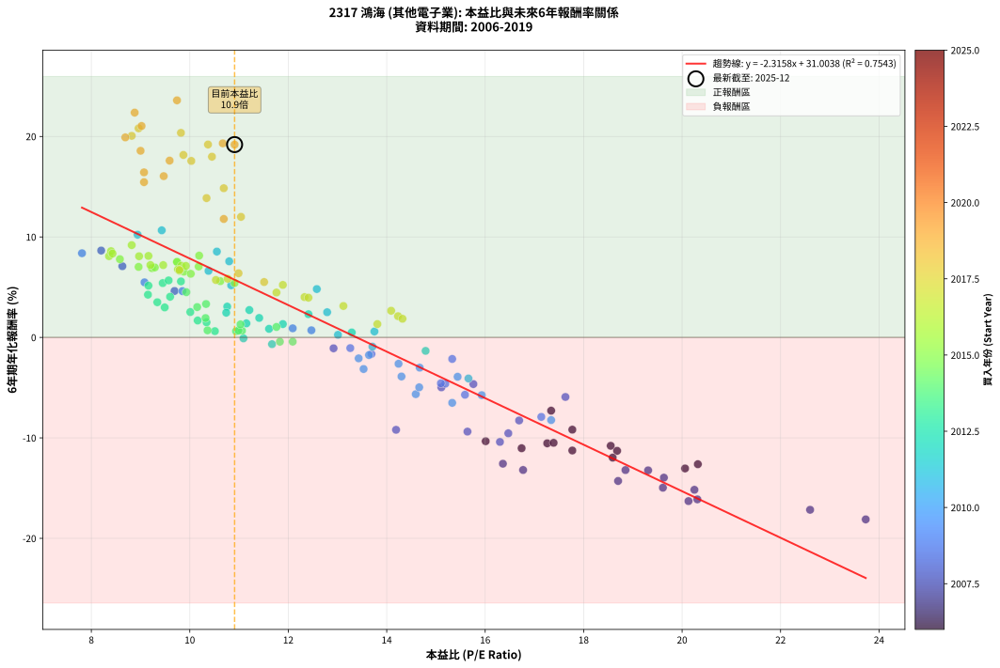
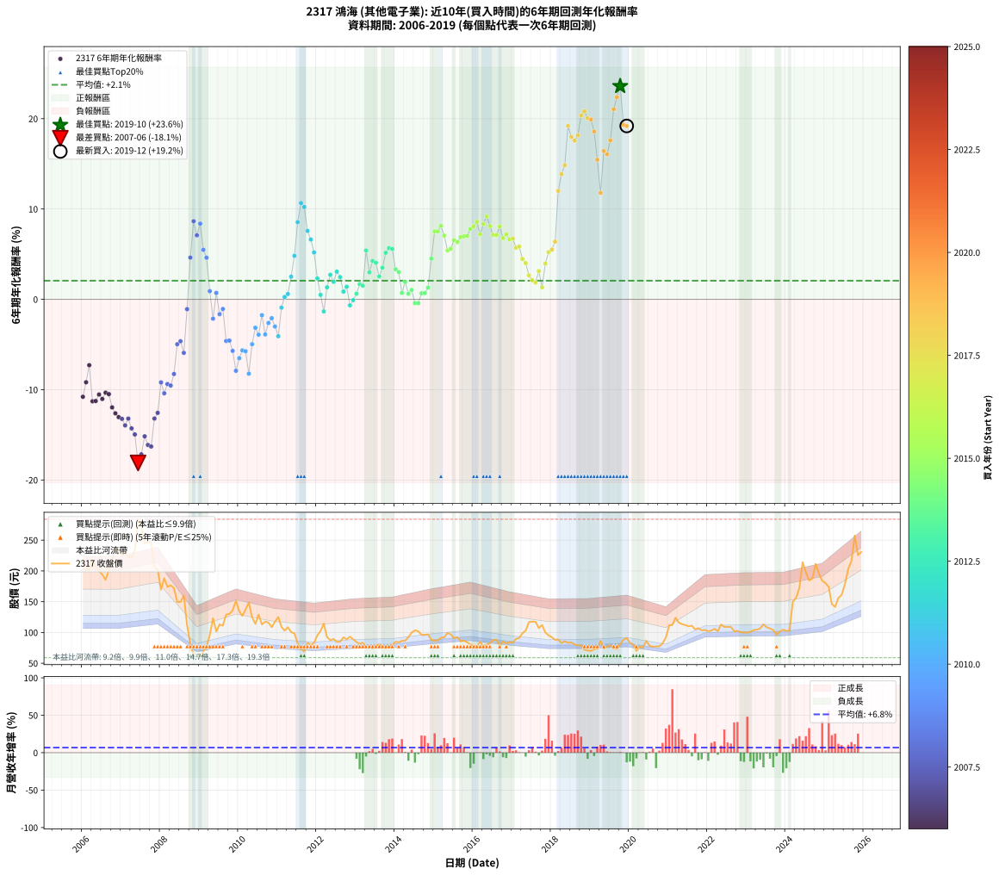

# 2317 鴻海 - 本益比與未來報酬率分析

!!! info "報告資訊"
    - **股票代號**: 2317
    - **公司名稱**: 鴻海
    - **產業別**: 其他電子業
    - **分析期間**: 2006-2019 (168 個數據點)
    - **資料來源**: Type 12 (ShowMonthlyK_ChartFlow) 月收盤價與本益比
    - **報酬率口徑**: 含現金股利 (簡化: 年度合計，假設每年7/1入帳)
    - **報告生成時間**: 2026-01-11 20:33:24 CST

## 📈 視覺化圖表

### 圖表1: 本益比 vs 未來報酬率關係

*圖表1：2317 鴻海 本益比與6年期未來報酬率關係 (2006-2019)*

### 圖表2: 歷年買入時點的6年期實際報酬率

*圖表2：2317 鴻海 歷年買入時點的6年期實際報酬率 (2006-2019)*

## 📍 買點訊號說明

本報告提供兩種買點提示訊號（顯示於圖表2的股價子圖中）：

### ▲ 小綠色三角形（回測驗證）
- **計算方式**: 使用全部歷史資料計算本益比第25百分位數
- **用途**: 事後驗證，顯示歷史上哪些時點確實為低估區
- **限制**: 當下無法判斷，僅供回測參考
- **特性**: 後見之明（Look-Ahead Bias）

### ▲ 小橘色三角形（即時訊號）
- **計算方式**: 使用截至當月的過去5年資料計算本益比第25百分位數
- **用途**: 實際投資決策，當時即可判斷
- **優勢**: 可操作性強，符合實務需求
- **特性**: 無後見之明，滾動窗口計算

!!! tip "如何使用兩種訊號"
    - **綠色▲** 幫助理解歷史估值機會，驗證策略有效性
    - **橘色▲** 可作為實際買進參考，但仍需搭配基本面分析
    - 兩種訊號重疊時，表示即時判斷與事後驗證一致，信心度較高
    - 僅有綠色▲時，表示當時無法判斷（需要未來資料才能確認）
    - 僅有橘色▲時，表示即時判斷為買點，但事後可能不是最佳時機

## 📊 估值分析摘要

| 指標 | 數值 |
|:---:|:---:|
| **目前本益比** (2019-12) | **10.91 倍** |
| **歷史平均本益比** | 12.50 倍 |
| **估值水準** | 🟡 合理範圍 |
| **預期6年年化報酬率** | **+5.74%** |
| **歷史平均報酬率** | +2.06% |
| **相關係數 (R²)** | 0.7543 |
| **趨勢線斜率** | -2.3158 |

!!! abstract "核心洞察"
    目前本益比接近歷史平均，預期報酬率符合長期趨勢

    根據歷史數據回測，2317 鴻海 在目前本益比 **10.9倍** 的估值水準下，
    預期未來6年年化報酬率約為 **+5.7%**。

    **重要提醒**: 本分析基於歷史數據統計，實際報酬率會受到公司基本面變化、產業趨勢、
    總體經濟環境等多重因素影響。R² = 0.75 表示本益比可解釋約 75.4% 的報酬率變異。

## 📈 歷史估值統計

### 最佳買點 (最高報酬率)

| 項目 | 數值 |
|:---:|:---:|
| 起始時間 | 2019-10 |
| 當時本益比 | 9.74 倍 |
| 起始價格 | 80.6 元 |
| 6年後價格 | 257.5 元 |
| **6年年化報酬率** | **+23.60%** |

### 最差買點 (最低報酬率)

| 項目 | 數值 |
|:---:|:---:|
| 起始時間 | 2007-06 |
| 當時本益比 | 23.73 倍 |
| 起始價格 | 284.0 元 |
| 6年後價格 | 74.0 元 |
| **6年年化報酬率** | **-18.11%** |

## 🎯 投資啟示

### 本益比與報酬率關係

趨勢線方程式: **y = -2.3158x + 31.0038**

!!! warning "強負相關"
    本益比與未來報酬率呈現強負相關。在高本益比時期買入，未來報酬率顯著較低；
    在低本益比時期買入，未來報酬率顯著較高。**估值紀律至關重要**。

### 估值區間建議

基於歷史數據分析:

- **🟢 低估區** (P/E < 10.0): 預期報酬率較高，可考慮增加持股
- **🟡 合理區** (P/E 10.0-15.0): 預期報酬率符合長期趨勢，正常持有
- **🔴 高估區** (P/E > 15.0): 預期報酬率較低，可考慮減碼或觀望

!!! danger "風險提示"
    - 過去表現不代表未來結果
    - 本分析假設公司基本面無重大結構性變化
    - 產業環境劇變可能使歷史規律失效
    - 應結合公司財報、產業趨勢、總體經濟等多重因素綜合判斷

!!! success "長期投資觀點"
    歷史數據顯示，在合理或低估的估值水準買入並長期持有，
    往往能獲得較佳的投資報酬。**耐心等待好價格**是價值投資的核心原則。

## 📊 數據品質

- **資料來源**: GoodInfo.tw Type 12 (ShowMonthlyK_ChartFlow)
- **資料頻率**: 月度收盤價與本益比
- **回測期間**: 2006-2019
- **數據點數量**: 168 個 (每個點代表一次6年期回測)

### 計算方法說明

1. **6年期年化報酬率**:
   - 對每個歷史時點，計算其後6年的實際投資報酬率
   - 期末價值(不含股利): 期末價格
   - 期末價值(含現金股利): 期末價格 + 持有期間內的現金股利合計 (簡化: 年度合計，假設每年7/1入帳)
   - 公式: 年化報酬率 = [(期末價值/期初價格)^(1/年數) - 1] × 100%

2. **本益比 (P/E Ratio)**:
   - 使用當時的月收盤價與EPS計算
   - 資料來源: Type 12 月度河流圖本益比數據

3. **趨勢線 (Linear Regression)**:
   - 使用最小平方法擬合線性趨勢線
   - R²值衡量本益比對報酬率的解釋能力

---

*本報告由 Stock Analysis System v1.9.0 自動生成*
*數據更新時間: 2026-01-11 20:33:24 CST*

## 📋 月度回測明細表

（每一列對應時間線圖中的一個買入點；可用來對照 SVG 圖上的每個點。）

| 買入月份 | 賣出月份 | 回測期限_年 | 實際持有年數 | 買入本益比_倍 | 買入收盤價_元 | 賣出收盤價_元 | 現金股利合計_元 | 總報酬率_pct | 年化報酬率_pct |
| --- | --- | --- | --- | --- | --- | --- | --- | --- | --- |
| 2006-01 | 2012-01 | 6 | 5.999 | 18.55 | 215.00 | 95.30 | 13.10 | -49.58 | -10.79 |
| 2006-02 | 2012-02 | 6 | 5.999 | 17.77 | 206.00 | 102.50 | 13.10 | -43.88 | -9.18 |
| 2006-03 | 2012-03 | 6 | 6.001 | 17.34 | 201.00 | 114.50 | 13.10 | -36.52 | -7.29 |
| 2006-04 | 2012-04 | 6 | 6.001 | 18.68 | 216.50 | 92.40 | 13.10 | -51.27 | -11.29 |
| 2006-05 | 2012-05 | 6 | 6.001 | 17.77 | 206.00 | 87.50 | 13.10 | -51.17 | -11.26 |
| 2006-06 | 2012-06 | 6 | 6.001 | 17.26 | 200.00 | 89.40 | 13.10 | -48.75 | -10.54 |
| 2006-07 | 2012-07 | 6 | 6.001 | 16.74 | 194.00 | 84.60 | 11.60 | -50.41 | -11.03 |
| 2006-08 | 2012-08 | 6 | 6.001 | 16.01 | 185.50 | 84.80 | 11.60 | -48.03 | -10.33 |
| 2006-09 | 2012-09 | 6 | 6.001 | 17.39 | 201.50 | 92.00 | 11.60 | -48.59 | -10.49 |
| 2006-10 | 2012-10 | 6 | 6.001 | 18.59 | 215.50 | 88.70 | 11.60 | -53.46 | -11.97 |
| 2006-11 | 2012-11 | 6 | 6.001 | 20.32 | 235.50 | 93.20 | 11.60 | -55.50 | -12.62 |
| 2006-12 | 2012-12 | 6 | 6.001 | 20.06 | 232.50 | 88.90 | 11.60 | -56.77 | -13.04 |
| 2007-01 | 2013-01 | 6 | 6.001 | 19.31 | 225.00 | 84.40 | 11.60 | -57.33 | -13.23 |
| 2007-02 | 2013-02 | 6 | 6.001 | 19.63 | 230.00 | 81.70 | 11.60 | -59.43 | -13.96 |
| 2007-03 | 2013-03 | 6 | 6.001 | 18.85 | 222.00 | 83.30 | 11.60 | -57.25 | -13.20 |
| 2007-04 | 2013-04 | 6 | 6.001 | 18.70 | 221.50 | 76.20 | 11.60 | -60.36 | -14.29 |
| 2007-05 | 2013-05 | 6 | 6.001 | 19.61 | 233.50 | 76.70 | 11.60 | -62.18 | -14.96 |
| 2007-06 | 2013-06 | 6 | 6.001 | 23.73 | 284.00 | 74.00 | 11.60 | -69.86 | -18.11 |
| 2007-07 | 2013-07 | 6 | 6.001 | 22.60 | 272.00 | 77.80 | 10.10 | -67.68 | -17.16 |
| 2007-08 | 2013-08 | 6 | 6.001 | 20.25 | 245.00 | 81.20 | 10.10 | -62.73 | -15.17 |
| 2007-09 | 2013-09 | 6 | 6.001 | 20.31 | 247.00 | 75.90 | 10.10 | -65.18 | -16.12 |
| 2007-10 | 2013-10 | 6 | 6.001 | 20.13 | 246.00 | 74.50 | 10.10 | -65.61 | -16.29 |
| 2007-11 | 2013-11 | 6 | 6.001 | 16.77 | 206.00 | 78.00 | 10.10 | -57.23 | -13.20 |
| 2007-12 | 2013-12 | 6 | 6.001 | 16.36 | 202.00 | 80.10 | 10.10 | -55.35 | -12.57 |
| 2008-01 | 2014-01 | 6 | 6.001 | 14.19 | 169.50 | 84.90 | 10.10 | -43.95 | -9.20 |
| 2008-02 | 2014-03 | 6 | 6.081 | 16.30 | 188.00 | 86.30 | 10.10 | -48.72 | -10.40 |
| 2008-03 | 2014-03 | 6 | 5.999 | 15.64 | 174.00 | 86.30 | 10.10 | -44.60 | -9.38 |
| 2008-04 | 2014-04 | 6 | 5.999 | 16.47 | 176.50 | 86.60 | 10.10 | -45.21 | -9.54 |
| 2008-05 | 2014-05 | 6 | 5.999 | 16.69 | 172.00 | 92.40 | 10.10 | -40.41 | -8.27 |
| 2008-06 | 2014-06 | 6 | 5.999 | 15.11 | 149.50 | 100.00 | 10.10 | -26.35 | -4.97 |
| 2008-07 | 2014-07 | 6 | 5.999 | 15.76 | 149.50 | 103.50 | 8.90 | -24.82 | -4.64 |
| 2008-08 | 2014-08 | 6 | 5.999 | 17.63 | 160.00 | 102.00 | 8.90 | -30.69 | -5.93 |
| 2008-09 | 2014-09 | 6 | 5.999 | 12.92 | 112.00 | 96.00 | 8.90 | -6.34 | -1.09 |
| 2008-10 | 2014-10 | 6 | 5.999 | 9.69 | 80.00 | 96.00 | 8.90 | +31.13 | +4.62 |
| 2008-11 | 2014-11 | 6 | 5.999 | 8.20 | 64.40 | 97.00 | 8.90 | +64.44 | +8.65 |
| 2008-12 | 2014-12 | 6 | 5.999 | 8.63 | 64.20 | 87.90 | 8.90 | +50.78 | +7.09 |
| 2009-01 | 2015-01 | 6 | 5.999 | 7.81 | 59.00 | 86.70 | 8.90 | +62.03 | +8.38 |
| 2009-02 | 2015-02 | 6 | 5.999 | 9.08 | 69.70 | 87.10 | 8.90 | +37.73 | +5.48 |
| 2009-03 | 2015-03 | 6 | 5.999 | 9.85 | 76.70 | 91.60 | 8.90 | +31.03 | +4.61 |
| 2009-04 | 2015-04 | 6 | 5.999 | 12.09 | 95.60 | 92.00 | 8.90 | +5.54 | +0.90 |
| 2009-05 | 2015-05 | 6 | 5.999 | 15.33 | 123.00 | 99.10 | 8.90 | -12.20 | -2.14 |
| 2009-06 | 2015-06 | 6 | 5.999 | 12.47 | 101.50 | 97.00 | 8.90 | +4.33 | +0.71 |
| 2009-07 | 2015-07 | 6 | 5.999 | 13.69 | 113.00 | 90.70 | 11.60 | -9.47 | -1.64 |
| 2009-08 | 2015-08 | 6 | 5.999 | 13.26 | 111.00 | 92.50 | 11.60 | -6.22 | -1.06 |
| 2009-09 | 2015-09 | 6 | 5.999 | 15.19 | 129.00 | 85.60 | 11.60 | -24.65 | -4.61 |
| 2009-10 | 2015-10 | 6 | 5.999 | 15.10 | 130.00 | 86.60 | 11.60 | -24.46 | -4.57 |
| 2009-11 | 2015-11 | 6 | 5.999 | 15.59 | 136.00 | 84.00 | 11.60 | -29.71 | -5.71 |
| 2009-12 | 2015-12 | 6 | 5.999 | 17.14 | 151.50 | 80.80 | 11.60 | -39.01 | -7.91 |
| 2010-01 | 2016-01 | 6 | 5.999 | 15.33 | 134.50 | 78.20 | 11.60 | -33.23 | -6.51 |
| 2010-02 | 2016-02 | 6 | 5.999 | 14.59 | 127.00 | 78.00 | 11.60 | -29.45 | -5.65 |
| 2010-03 | 2016-03 | 6 | 6.001 | 15.93 | 137.50 | 84.80 | 11.60 | -29.89 | -5.75 |
| 2010-04 | 2016-04 | 6 | 6.001 | 17.34 | 148.50 | 77.10 | 11.60 | -40.27 | -8.23 |
| 2010-05 | 2016-05 | 6 | 6.001 | 14.66 | 124.50 | 80.10 | 11.60 | -26.35 | -4.97 |
| 2010-06 | 2016-06 | 6 | 6.001 | 13.53 | 114.00 | 82.50 | 11.60 | -17.46 | -3.15 |
| 2010-07 | 2016-07 | 6 | 6.001 | 15.44 | 129.00 | 87.90 | 13.60 | -21.32 | -3.92 |
| 2010-08 | 2016-08 | 6 | 6.001 | 13.64 | 113.00 | 88.00 | 13.60 | -10.09 | -1.76 |
| 2010-09 | 2016-09 | 6 | 6.001 | 14.30 | 117.50 | 79.00 | 13.60 | -21.19 | -3.89 |
| 2010-10 | 2016-10 | 6 | 6.001 | 14.24 | 116.00 | 85.30 | 13.60 | -14.74 | -2.62 |
| 2010-11 | 2016-11 | 6 | 6.001 | 13.43 | 108.50 | 82.00 | 13.60 | -11.89 | -2.09 |
| 2010-12 | 2016-12 | 6 | 6.001 | 14.67 | 117.50 | 84.20 | 13.60 | -16.77 | -3.01 |
| 2011-01 | 2017-01 | 6 | 6.001 | 15.66 | 125.00 | 83.70 | 13.60 | -22.16 | -4.09 |
| 2011-02 | 2017-02 | 6 | 6.001 | 13.71 | 109.00 | 89.50 | 13.60 | -5.41 | -0.92 |
| 2011-03 | 2017-03 | 6 | 6.001 | 13.01 | 103.00 | 91.00 | 13.60 | +1.55 | +0.26 |
| 2011-04 | 2017-04 | 6 | 6.001 | 13.75 | 108.50 | 98.80 | 13.60 | +3.59 | +0.59 |
| 2011-05 | 2017-05 | 6 | 6.001 | 12.79 | 100.50 | 103.00 | 13.60 | +16.02 | +2.51 |
| 2011-06 | 2017-06 | 6 | 6.001 | 12.58 | 98.50 | 117.00 | 13.60 | +32.59 | +4.81 |
| 2011-07 | 2017-07 | 6 | 6.001 | 10.55 | 82.30 | 117.50 | 17.10 | +63.55 | +8.54 |
| 2011-08 | 2017-08 | 6 | 6.001 | 9.43 | 73.30 | 117.50 | 17.10 | +83.63 | +10.66 |
| 2011-09 | 2017-09 | 6 | 6.001 | 8.94 | 69.20 | 107.00 | 17.10 | +79.34 | +10.22 |
| 2011-10 | 2017-10 | 6 | 6.001 | 10.80 | 83.30 | 112.00 | 17.10 | +54.98 | +7.57 |
| 2011-11 | 2017-11 | 6 | 6.001 | 10.38 | 79.70 | 100.00 | 17.10 | +46.93 | +6.62 |
| 2011-12 | 2017-12 | 6 | 6.001 | 10.84 | 82.90 | 95.20 | 17.10 | +35.46 | +5.19 |
| 2012-01 | 2018-01 | 6 | 6.001 | 12.41 | 95.30 | 92.20 | 17.10 | +14.69 | +2.31 |
| 2012-02 | 2018-03 | 6 | 6.081 | 13.29 | 102.50 | 88.50 | 17.10 | +3.02 | +0.49 |
| 2012-03 | 2018-03 | 6 | 5.999 | 14.79 | 114.50 | 88.50 | 17.10 | -7.77 | -1.34 |
| 2012-04 | 2018-04 | 6 | 5.999 | 11.89 | 92.40 | 82.90 | 17.10 | +8.23 | +1.33 |
| 2012-05 | 2018-05 | 6 | 5.999 | 11.21 | 87.50 | 85.70 | 17.10 | +17.49 | +2.72 |
| 2012-06 | 2018-06 | 6 | 5.999 | 11.41 | 89.40 | 83.20 | 17.10 | +12.19 | +1.94 |
| 2012-07 | 2018-07 | 6 | 5.999 | 10.76 | 84.60 | 83.80 | 17.60 | +19.86 | +3.07 |
| 2012-08 | 2018-08 | 6 | 5.999 | 10.74 | 84.80 | 80.50 | 17.60 | +15.68 | +2.46 |
| 2012-09 | 2018-09 | 6 | 5.999 | 11.61 | 92.00 | 79.20 | 17.60 | +5.22 | +0.85 |
| 2012-10 | 2018-10 | 6 | 5.999 | 11.15 | 88.70 | 78.80 | 17.60 | +8.68 | +1.40 |
| 2012-11 | 2018-11 | 6 | 5.999 | 11.67 | 93.20 | 71.90 | 17.60 | -3.97 | -0.67 |
| 2012-12 | 2018-12 | 6 | 5.999 | 11.09 | 88.90 | 70.80 | 17.60 | -0.56 | -0.09 |
| 2013-01 | 2019-01 | 6 | 5.999 | 10.51 | 84.40 | 70.00 | 17.60 | +3.79 | +0.62 |
| 2013-02 | 2019-02 | 6 | 5.999 | 10.16 | 81.70 | 72.70 | 17.60 | +10.53 | +1.68 |
| 2013-03 | 2019-03 | 6 | 5.999 | 10.34 | 83.30 | 73.50 | 17.60 | +9.36 | +1.50 |
| 2013-04 | 2019-04 | 6 | 5.999 | 9.45 | 76.20 | 86.90 | 17.60 | +37.14 | +5.41 |
| 2013-05 | 2019-05 | 6 | 5.999 | 9.49 | 76.70 | 73.90 | 17.60 | +19.30 | +2.98 |
| 2013-06 | 2019-06 | 6 | 5.999 | 9.15 | 74.00 | 77.40 | 17.60 | +28.38 | +4.25 |
| 2013-07 | 2019-07 | 6 | 5.999 | 9.60 | 77.80 | 78.60 | 20.10 | +26.86 | +4.05 |
| 2013-08 | 2019-08 | 6 | 5.999 | 10.01 | 81.20 | 74.20 | 20.10 | +16.13 | +2.52 |
| 2013-09 | 2019-09 | 6 | 5.999 | 9.34 | 75.90 | 73.20 | 20.10 | +22.92 | +3.50 |
| 2013-10 | 2019-10 | 6 | 5.999 | 9.16 | 74.50 | 80.60 | 20.10 | +35.17 | +5.15 |
| 2013-11 | 2019-11 | 6 | 5.999 | 9.57 | 78.00 | 88.50 | 20.10 | +39.23 | +5.67 |
| 2013-12 | 2019-12 | 6 | 5.999 | 9.82 | 80.10 | 90.80 | 20.10 | +38.45 | +5.57 |
| 2014-01 | 2020-01 | 6 | 5.999 | 10.33 | 84.90 | 83.20 | 20.10 | +21.67 | +3.32 |
| 2014-02 | 2020-02 | 6 | 5.999 | 10.15 | 84.00 | 80.30 | 20.10 | +19.52 | +3.02 |
| 2014-03 | 2020-03 | 6 | 6.001 | 10.36 | 86.30 | 69.90 | 20.10 | +4.29 | +0.70 |
| 2014-04 | 2020-04 | 6 | 6.001 | 10.32 | 86.60 | 77.00 | 20.10 | +12.12 | +1.93 |
| 2014-05 | 2020-05 | 6 | 6.001 | 10.94 | 92.40 | 75.80 | 20.10 | +3.79 | +0.62 |
| 2014-06 | 2020-06 | 6 | 6.001 | 11.76 | 100.00 | 86.30 | 20.10 | +6.40 | +1.04 |
| 2014-07 | 2020-07 | 6 | 6.001 | 12.09 | 103.50 | 78.40 | 22.50 | -2.51 | -0.42 |
| 2014-08 | 2020-08 | 6 | 6.001 | 11.83 | 102.00 | 76.90 | 22.50 | -2.55 | -0.43 |
| 2014-09 | 2020-09 | 6 | 6.001 | 11.06 | 96.00 | 77.40 | 22.50 | +4.06 | +0.67 |
| 2014-10 | 2020-10 | 6 | 6.001 | 10.99 | 96.00 | 77.50 | 22.50 | +4.17 | +0.68 |
| 2014-11 | 2020-11 | 6 | 6.001 | 11.03 | 97.00 | 82.30 | 22.50 | +8.04 | +1.30 |
| 2014-12 | 2020-12 | 6 | 6.001 | 9.93 | 87.90 | 92.00 | 22.50 | +30.26 | +4.50 |
| 2015-01 | 2021-01 | 6 | 6.001 | 9.74 | 86.70 | 111.50 | 22.50 | +54.56 | +7.52 |
| 2015-02 | 2021-02 | 6 | 6.001 | 9.74 | 87.10 | 112.00 | 22.50 | +54.42 | +7.51 |
| 2015-03 | 2021-03 | 6 | 6.001 | 10.19 | 91.60 | 124.00 | 22.50 | +59.93 | +8.14 |
| 2015-04 | 2021-04 | 6 | 6.001 | 10.18 | 92.00 | 116.00 | 22.50 | +50.54 | +7.05 |
| 2015-05 | 2021-05 | 6 | 6.001 | 10.91 | 99.10 | 113.50 | 22.50 | +37.24 | +5.42 |
| 2015-06 | 2021-06 | 6 | 6.001 | 10.62 | 97.00 | 112.00 | 22.50 | +38.66 | +5.60 |
| 2015-07 | 2021-07 | 6 | 6.001 | 9.88 | 90.70 | 110.00 | 22.70 | +46.31 | +6.55 |
| 2015-08 | 2021-08 | 6 | 6.001 | 10.02 | 92.50 | 111.00 | 22.70 | +44.54 | +6.33 |
| 2015-09 | 2021-09 | 6 | 6.001 | 9.23 | 85.60 | 105.00 | 22.70 | +49.18 | +6.89 |
| 2015-10 | 2021-10 | 6 | 6.001 | 9.29 | 86.60 | 107.00 | 22.70 | +49.77 | +6.96 |
| 2015-11 | 2021-11 | 6 | 6.001 | 8.96 | 84.00 | 103.50 | 22.70 | +50.24 | +7.02 |
| 2015-12 | 2021-12 | 6 | 6.001 | 8.58 | 80.80 | 104.00 | 22.70 | +56.81 | +7.78 |
| 2016-01 | 2022-01 | 6 | 6.001 | 8.36 | 78.20 | 102.00 | 22.70 | +59.46 | +8.09 |
| 2016-02 | 2022-03 | 6 | 6.081 | 8.40 | 78.00 | 106.00 | 22.70 | +65.00 | +8.58 |
| 2016-03 | 2022-03 | 6 | 5.999 | 9.20 | 84.80 | 106.00 | 22.70 | +51.77 | +7.20 |
| 2016-04 | 2022-04 | 6 | 5.999 | 8.43 | 77.10 | 102.00 | 22.70 | +61.74 | +8.35 |
| 2016-05 | 2022-05 | 6 | 5.999 | 8.82 | 80.10 | 113.00 | 22.70 | +69.41 | +9.19 |
| 2016-06 | 2022-06 | 6 | 5.999 | 9.16 | 82.50 | 109.00 | 22.70 | +59.64 | +8.11 |
| 2016-07 | 2022-07 | 6 | 5.999 | 9.83 | 87.90 | 109.00 | 23.90 | +51.19 | +7.13 |
| 2016-08 | 2022-08 | 6 | 5.999 | 9.92 | 88.00 | 109.00 | 23.90 | +51.02 | +7.11 |
| 2016-09 | 2022-09 | 6 | 5.999 | 8.97 | 79.00 | 102.00 | 23.90 | +59.37 | +8.08 |
| 2016-10 | 2022-10 | 6 | 5.999 | 9.76 | 85.30 | 102.50 | 23.90 | +48.18 | +6.78 |
| 2016-11 | 2022-11 | 6 | 5.999 | 9.46 | 82.00 | 100.50 | 23.90 | +51.71 | +7.20 |
| 2016-12 | 2022-12 | 6 | 5.999 | 9.79 | 84.20 | 99.90 | 23.90 | +47.03 | +6.64 |
| 2017-01 | 2023-01 | 6 | 5.999 | 9.79 | 83.70 | 99.70 | 23.90 | +47.67 | +6.71 |
| 2017-02 | 2023-02 | 6 | 5.999 | 10.53 | 89.50 | 101.00 | 23.90 | +39.55 | +5.71 |
| 2017-03 | 2023-03 | 6 | 5.999 | 10.77 | 91.00 | 104.00 | 23.90 | +40.55 | +5.84 |
| 2017-04 | 2023-04 | 6 | 5.999 | 11.76 | 98.80 | 104.50 | 23.90 | +29.96 | +4.47 |
| 2017-05 | 2023-05 | 6 | 5.999 | 12.33 | 103.00 | 106.50 | 23.90 | +26.60 | +4.01 |
| 2017-06 | 2023-06 | 6 | 5.999 | 14.09 | 117.00 | 113.00 | 23.90 | +17.01 | +2.65 |
| 2017-07 | 2023-07 | 6 | 5.999 | 14.23 | 117.50 | 108.50 | 24.70 | +13.36 | +2.11 |
| 2017-08 | 2023-08 | 6 | 5.999 | 14.32 | 117.50 | 106.50 | 24.70 | +11.66 | +1.86 |
| 2017-09 | 2023-09 | 6 | 5.999 | 13.12 | 107.00 | 104.00 | 24.70 | +20.28 | +3.13 |
| 2017-10 | 2023-10 | 6 | 5.999 | 13.81 | 112.00 | 96.50 | 24.70 | +8.21 | +1.32 |
| 2017-11 | 2023-11 | 6 | 5.999 | 12.41 | 100.00 | 101.50 | 24.70 | +26.20 | +3.96 |
| 2017-12 | 2023-12 | 6 | 5.999 | 11.89 | 95.20 | 104.50 | 24.70 | +35.71 | +5.22 |
| 2018-01 | 2024-01 | 6 | 5.999 | 11.51 | 92.20 | 102.50 | 24.70 | +37.96 | +5.51 |
| 2018-02 | 2024-02 | 6 | 5.999 | 10.99 | 88.10 | 103.00 | 24.70 | +44.95 | +6.38 |
| 2018-03 | 2024-03 | 6 | 6.001 | 11.04 | 88.50 | 150.00 | 24.70 | +97.40 | +12.00 |
| 2018-04 | 2024-04 | 6 | 6.001 | 10.34 | 82.90 | 156.00 | 24.70 | +117.97 | +13.86 |
| 2018-05 | 2024-05 | 6 | 6.001 | 10.69 | 85.70 | 172.00 | 24.70 | +129.52 | +14.85 |
| 2018-06 | 2024-06 | 6 | 6.001 | 10.37 | 83.20 | 214.00 | 24.70 | +186.90 | +19.20 |
| 2018-07 | 2024-07 | 6 | 6.001 | 10.45 | 83.80 | 198.00 | 28.10 | +169.81 | +17.98 |
| 2018-08 | 2024-08 | 6 | 6.001 | 10.03 | 80.50 | 184.50 | 28.10 | +164.10 | +17.57 |
| 2018-09 | 2024-09 | 6 | 6.001 | 9.87 | 79.20 | 187.50 | 28.10 | +172.22 | +18.16 |
| 2018-10 | 2024-10 | 6 | 6.001 | 9.82 | 78.80 | 211.50 | 28.10 | +204.06 | +20.36 |
| 2018-11 | 2024-11 | 6 | 6.001 | 8.96 | 71.90 | 195.50 | 28.10 | +210.99 | +20.81 |
| 2018-12 | 2024-12 | 6 | 6.001 | 8.82 | 70.80 | 184.00 | 28.10 | +199.58 | +20.06 |
| 2019-01 | 2025-01 | 6 | 6.001 | 8.69 | 70.00 | 180.00 | 28.10 | +197.29 | +19.91 |
| 2019-02 | 2025-02 | 6 | 6.001 | 9.00 | 72.70 | 174.00 | 28.10 | +177.99 | +18.57 |
| 2019-03 | 2025-03 | 6 | 6.001 | 9.07 | 73.50 | 146.00 | 28.10 | +136.87 | +15.45 |
| 2019-04 | 2025-04 | 6 | 6.001 | 10.69 | 86.90 | 141.50 | 28.10 | +95.17 | +11.79 |
| 2019-05 | 2025-05 | 6 | 6.001 | 9.07 | 73.90 | 156.00 | 28.10 | +149.12 | +16.43 |
| 2019-06 | 2025-06 | 6 | 6.001 | 9.47 | 77.40 | 161.00 | 28.10 | +144.32 | +16.05 |
| 2019-07 | 2025-07 | 6 | 6.001 | 9.59 | 78.60 | 178.00 | 29.90 | +164.50 | +17.60 |
| 2019-08 | 2025-08 | 6 | 6.001 | 9.02 | 74.20 | 203.50 | 29.90 | +214.56 | +21.04 |
| 2019-09 | 2025-09 | 6 | 6.001 | 8.88 | 73.20 | 216.00 | 29.90 | +235.93 | +22.37 |
| 2019-10 | 2025-10 | 6 | 6.001 | 9.74 | 80.60 | 257.50 | 29.90 | +256.58 | +23.60 |
| 2019-11 | 2025-11 | 6 | 6.001 | 10.67 | 88.50 | 225.50 | 29.90 | +188.59 | +19.32 |
| 2019-12 | 2025-12 | 6 | 6.001 | 10.91 | 90.80 | 230.50 | 29.90 | +186.78 | +19.19 |
