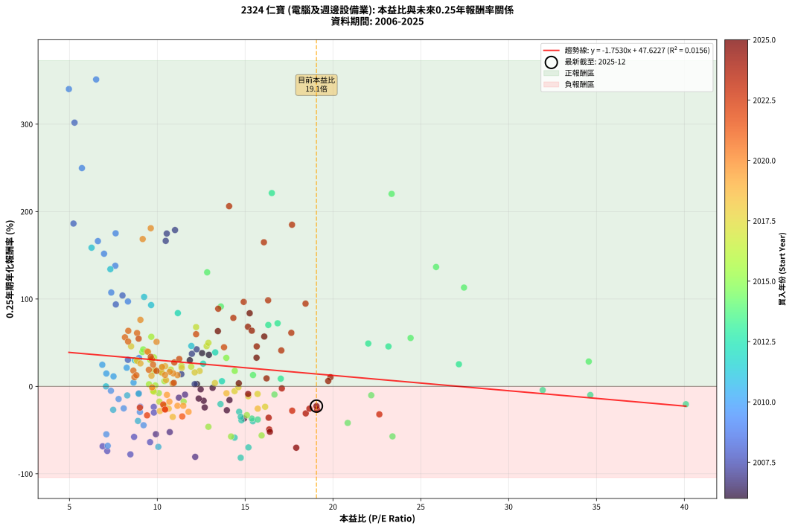
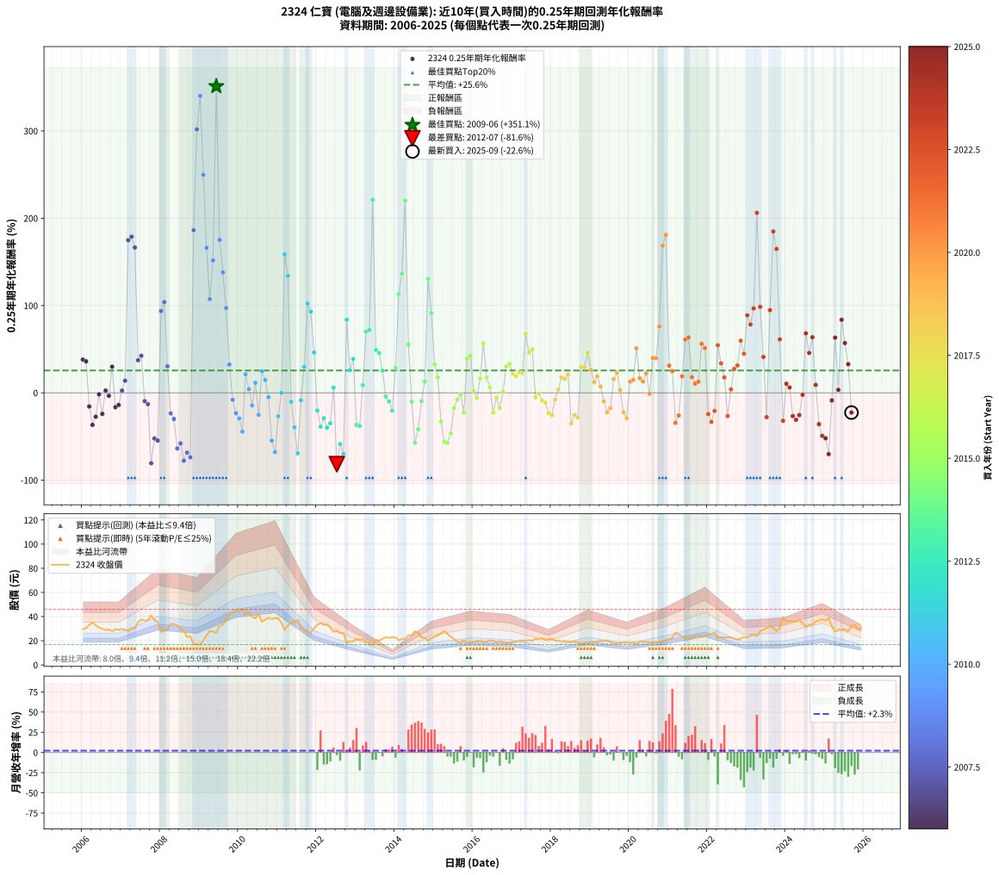

# 2324 仁寶 - 本益比與未來報酬率分析

!!! info "報告資訊"
    - **股票代號**: 2324
    - **公司名稱**: 仁寶
    - **產業別**: 電腦及週邊設備業
    - **分析期間**: 2006-2025 (237 個數據點)
    - **資料來源**: Type 12 (ShowMonthlyK_ChartFlow) 月收盤價與本益比
    - **報酬率口徑**: 含現金股利 (簡化: 年度合計，假設每年7/1入帳)
    - **報告生成時間**: 2026-01-22 22:18:24 CST

## 📈 視覺化圖表

### 圖表1: 本益比 vs 未來報酬率關係

*圖表1：2324 仁寶 本益比與0.25年期未來報酬率關係 (2006-2025)*

### 圖表2: 歷年買入時點的0.25年期實際報酬率

*圖表2：2324 仁寶 歷年買入時點的0.25年期實際報酬率 (2006-2025)*

## 📍 買點訊號說明

本報告提供兩種買點提示訊號（顯示於圖表2的股價子圖中）：

### ▲ 小綠色三角形（回測驗證）
- **計算方式**: 使用全部歷史資料計算本益比第25百分位數
- **用途**: 事後驗證，顯示歷史上哪些時點確實為低估區
- **限制**: 當下無法判斷，僅供回測參考
- **特性**: 後見之明（Look-Ahead Bias）

### ▲ 小橘色三角形（即時訊號）
- **計算方式**: 使用截至當月的過去5年資料計算本益比第25百分位數
- **用途**: 實際投資決策，當時即可判斷
- **優勢**: 可操作性強，符合實務需求
- **特性**: 無後見之明，滾動窗口計算

!!! tip "如何使用兩種訊號"
    - **綠色▲** 幫助理解歷史估值機會，驗證策略有效性
    - **橘色▲** 可作為實際買進參考，但仍需搭配基本面分析
    - 兩種訊號重疊時，表示即時判斷與事後驗證一致，信心度較高
    - 僅有綠色▲時，表示當時無法判斷（需要未來資料才能確認）
    - 僅有橘色▲時，表示即時判斷為買點，但事後可能不是最佳時機

## 📊 估值分析摘要

| 指標 | 數值 |
|:---:|:---:|
| **目前本益比** (2025-09) | **19.06 倍** |
| **歷史平均本益比** | 12.55 倍 |
| **估值水準** | 🔴 相對高估 |
| **預期0.25年年化報酬率** | **+14.21%** |
| **歷史平均報酬率** | +25.62% |
| **相關係數 (R²)** | 0.0156 |
| **趨勢線斜率** | -1.7530 |

!!! abstract "核心洞察"
    目前本益比顯著高於歷史平均，預期未來報酬率可能較低

    根據歷史數據回測，2324 仁寶 在目前本益比 **19.1倍** 的估值水準下，
    預期未來0.25年年化報酬率約為 **+14.2%**。

    **重要提醒**: 本分析基於歷史數據統計，實際報酬率會受到公司基本面變化、產業趨勢、
    總體經濟環境等多重因素影響。R² = 0.02 表示本益比可解釋約 1.6% 的報酬率變異。

## 📈 歷史估值統計

### 最佳買點 (最高報酬率)

| 項目 | 數值 |
|:---:|:---:|
| 起始時間 | 2009-06 |
| 當時本益比 | 6.52 倍 |
| 起始價格 | 26.6 元 |
| 0.25年後價格 | 37.5 元 |
| **0.25年年化報酬率** | **+351.14%** |

### 最差買點 (最低報酬率)

| 項目 | 數值 |
|:---:|:---:|
| 起始時間 | 2012-07 |
| 當時本益比 | 14.75 倍 |
| 起始價格 | 28.2 元 |
| 0.25年後價格 | 18.4 元 |
| **0.25年年化報酬率** | **-81.64%** |

## 🎯 投資啟示

### 本益比與報酬率關係

趨勢線方程式: **y = -1.7530x + 47.6227**

!!! warning "強負相關"
    本益比與未來報酬率呈現強負相關。在高本益比時期買入，未來報酬率顯著較低；
    在低本益比時期買入，未來報酬率顯著較高。**估值紀律至關重要**。

### 估值區間建議

基於歷史數據分析:

- **🟢 低估區** (P/E < 10.0): 預期報酬率較高，可考慮增加持股
- **🟡 合理區** (P/E 10.0-15.1): 預期報酬率符合長期趨勢，正常持有
- **🔴 高估區** (P/E > 15.1): 預期報酬率較低，可考慮減碼或觀望

!!! danger "風險提示"
    - 過去表現不代表未來結果
    - 本分析假設公司基本面無重大結構性變化
    - 產業環境劇變可能使歷史規律失效
    - 應結合公司財報、產業趨勢、總體經濟等多重因素綜合判斷

!!! success "長期投資觀點"
    歷史數據顯示，在合理或低估的估值水準買入並長期持有，
    往往能獲得較佳的投資報酬。**耐心等待好價格**是價值投資的核心原則。

## 📊 數據品質

- **資料來源**: GoodInfo.tw Type 12 (ShowMonthlyK_ChartFlow)
- **資料頻率**: 月度收盤價與本益比
- **回測期間**: 2006-2025
- **數據點數量**: 237 個 (每個點代表一次0.25年期回測)

### 計算方法說明

1. **0.25年期年化報酬率**:
   - 對每個歷史時點，計算其後0.25年的實際投資報酬率
   - 期末價值(不含股利): 期末價格
   - 期末價值(含現金股利): 期末價格 + 持有期間內的現金股利合計 (簡化: 年度合計，假設每年7/1入帳)
   - 公式: 年化報酬率 = [(期末價值/期初價格)^(1/年數) - 1] × 100%

2. **本益比 (P/E Ratio)**:
   - 使用當時的月收盤價與EPS計算
   - 資料來源: Type 12 月度河流圖本益比數據

3. **趨勢線 (Linear Regression)**:
   - 使用最小平方法擬合線性趨勢線
   - R²值衡量本益比對報酬率的解釋能力

---

*本報告由 Stock Analysis System v1.9.0 自動生成*
*數據更新時間: 2026-01-22 22:18:24 CST*

## 📋 月度回測明細表

（每一列對應時間線圖中的一個買入點；可用來對照 SVG 圖上的每個點。）

| 買入月份 | 賣出月份 | 回測期限_年 | 實際持有年數 | 買入本益比_倍 | 買入收盤價_元 | 賣出收盤價_元 | 現金股利合計_元 | 總報酬率_pct | 年化報酬率_pct |
| --- | --- | --- | --- | --- | --- | --- | --- | --- | --- |
| 2006-01 | 2006-05 | 0.25 | 0.329 | 12.55 | 29.50 | 32.80 | 0.00 | +11.19 | +38.09 |
| 2006-02 | 2006-05 | 0.25 | 0.246 | 12.94 | 30.40 | 32.80 | 0.00 | +7.89 | +36.12 |
| 2006-03 | 2006-07 | 0.25 | 0.334 | 14.11 | 33.15 | 29.85 | 1.47 | -5.52 | -15.64 |
| 2006-04 | 2006-07 | 0.25 | 0.249 | 14.94 | 35.10 | 29.85 | 1.47 | -10.77 | -36.71 |
| 2006-05 | 2006-08 | 0.25 | 0.252 | 13.96 | 32.80 | 28.80 | 1.47 | -7.72 | -27.30 |
| 2006-06 | 2006-09 | 0.25 | 0.252 | 13.15 | 30.90 | 29.30 | 1.47 | -0.42 | -1.67 |
| 2006-07 | 2006-10 | 0.25 | 0.252 | 12.70 | 29.85 | 27.85 | 0.00 | -6.70 | -24.07 |
| 2006-08 | 2006-12 | 0.25 | 0.334 | 12.26 | 28.80 | 29.05 | 0.00 | +0.87 | +2.62 |
| 2006-09 | 2006-12 | 0.25 | 0.249 | 12.47 | 29.30 | 29.05 | 0.00 | -0.85 | -3.38 |
| 2006-10 | 2007-01 | 0.25 | 0.252 | 11.85 | 27.85 | 29.75 | 0.00 | +6.82 | +29.95 |
| 2006-11 | 2007-03 | 0.25 | 0.329 | 12.64 | 29.70 | 28.00 | 0.00 | -5.72 | -16.42 |
| 2006-12 | 2007-03 | 0.25 | 0.246 | 12.36 | 29.05 | 28.00 | 0.00 | -3.61 | -13.88 |
| 2007-01 | 2007-05 | 0.25 | 0.329 | 12.13 | 29.75 | 30.00 | 0.00 | +0.84 | +2.58 |
| 2007-02 | 2007-05 | 0.25 | 0.246 | 11.37 | 29.05 | 30.00 | 0.00 | +3.27 | +13.95 |
| 2007-03 | 2007-07 | 0.25 | 0.334 | 10.54 | 28.00 | 37.55 | 1.70 | +40.18 | +174.88 |
| 2007-04 | 2007-07 | 0.25 | 0.249 | 11.01 | 30.40 | 37.55 | 1.70 | +29.11 | +178.86 |
| 2007-05 | 2007-08 | 0.25 | 0.252 | 10.48 | 30.00 | 36.70 | 1.70 | +28.00 | +166.46 |
| 2007-06 | 2007-09 | 0.25 | 0.252 | 11.97 | 35.50 | 36.75 | 1.70 | +8.31 | +37.29 |
| 2007-07 | 2007-10 | 0.25 | 0.252 | 12.24 | 37.55 | 41.05 | 0.00 | +9.32 | +42.45 |
| 2007-08 | 2007-12 | 0.25 | 0.334 | 11.58 | 36.70 | 35.50 | 0.00 | -3.27 | -9.47 |
| 2007-09 | 2007-12 | 0.25 | 0.249 | 11.23 | 36.75 | 35.50 | 0.00 | -3.40 | -12.97 |
| 2007-10 | 2008-01 | 0.25 | 0.252 | 12.16 | 41.05 | 27.15 | 0.00 | -33.86 | -80.63 |
| 2007-11 | 2008-03 | 0.25 | 0.331 | 10.71 | 37.25 | 29.15 | 0.00 | -21.74 | -52.30 |
| 2007-12 | 2008-03 | 0.25 | 0.249 | 9.92 | 35.50 | 29.15 | 0.00 | -17.89 | -54.66 |
| 2008-01 | 2008-05 | 0.25 | 0.331 | 7.64 | 27.15 | 33.80 | 0.00 | +24.49 | +93.74 |
| 2008-02 | 2008-05 | 0.25 | 0.249 | 8.02 | 28.30 | 33.80 | 0.00 | +19.43 | +103.98 |
| 2008-03 | 2008-07 | 0.25 | 0.334 | 8.33 | 29.15 | 29.45 | 2.40 | +9.26 | +30.37 |
| 2008-04 | 2008-07 | 0.25 | 0.249 | 9.80 | 34.05 | 29.45 | 2.40 | -6.46 | -23.52 |
| 2008-05 | 2008-08 | 0.25 | 0.252 | 9.81 | 33.80 | 28.50 | 2.40 | -8.58 | -29.96 |
| 2008-06 | 2008-09 | 0.25 | 0.252 | 9.59 | 32.80 | 23.00 | 2.40 | -22.56 | -63.76 |
| 2008-07 | 2008-10 | 0.25 | 0.252 | 8.68 | 29.45 | 23.70 | 0.00 | -19.52 | -57.78 |
| 2008-08 | 2008-12 | 0.25 | 0.334 | 8.47 | 28.50 | 17.25 | 0.00 | -39.47 | -77.76 |
| 2008-09 | 2008-12 | 0.25 | 0.249 | 6.89 | 23.00 | 17.25 | 0.00 | -25.00 | -68.48 |
| 2008-10 | 2009-01 | 0.25 | 0.252 | 7.15 | 23.70 | 16.90 | 0.00 | -28.69 | -73.88 |
| 2008-11 | 2009-03 | 0.25 | 0.329 | 5.23 | 17.20 | 24.30 | 0.00 | +41.28 | +186.29 |
| 2008-12 | 2009-03 | 0.25 | 0.246 | 5.29 | 17.25 | 24.30 | 0.00 | +40.87 | +301.74 |
| 2009-01 | 2009-05 | 0.25 | 0.329 | 4.97 | 16.90 | 27.50 | 0.00 | +62.72 | +340.14 |
| 2009-02 | 2009-05 | 0.25 | 0.246 | 5.71 | 20.20 | 27.50 | 0.00 | +36.14 | +249.74 |
| 2009-03 | 2009-07 | 0.25 | 0.334 | 6.62 | 24.30 | 32.20 | 1.50 | +38.68 | +166.19 |
| 2009-04 | 2009-07 | 0.25 | 0.249 | 7.38 | 28.10 | 32.20 | 1.50 | +19.93 | +107.39 |
| 2009-05 | 2009-08 | 0.25 | 0.252 | 6.97 | 27.50 | 33.20 | 1.50 | +26.18 | +151.75 |
| 2009-06 | 2009-09 | 0.25 | 0.252 | 6.52 | 26.65 | 37.45 | 1.50 | +46.15 | +351.14 |
| 2009-07 | 2009-10 | 0.25 | 0.252 | 7.63 | 32.20 | 41.55 | 0.00 | +29.04 | +175.14 |
| 2009-08 | 2009-12 | 0.25 | 0.334 | 7.61 | 33.20 | 44.35 | 0.00 | +33.58 | +137.95 |
| 2009-09 | 2009-12 | 0.25 | 0.249 | 8.33 | 37.45 | 44.35 | 0.00 | +18.42 | +97.14 |
| 2009-10 | 2010-01 | 0.25 | 0.252 | 8.96 | 41.55 | 44.60 | 0.00 | +7.34 | +32.48 |
| 2009-11 | 2010-03 | 0.25 | 0.329 | 8.95 | 42.70 | 41.55 | 0.00 | -2.69 | -7.97 |
| 2009-12 | 2010-03 | 0.25 | 0.246 | 9.03 | 44.35 | 41.55 | 0.00 | -6.31 | -23.25 |
| 2010-01 | 2010-05 | 0.25 | 0.329 | 9.01 | 44.60 | 39.80 | 0.00 | -10.76 | -29.29 |
| 2010-02 | 2010-05 | 0.25 | 0.246 | 9.22 | 46.00 | 39.80 | 0.00 | -13.48 | -44.43 |
| 2010-03 | 2010-07 | 0.25 | 0.334 | 8.26 | 41.55 | 41.95 | 2.37 | +6.66 | +21.30 |
| 2010-04 | 2010-07 | 0.25 | 0.249 | 8.65 | 43.85 | 41.95 | 2.37 | +1.07 | +4.35 |
| 2010-05 | 2010-08 | 0.25 | 0.252 | 7.80 | 39.80 | 35.90 | 2.37 | -3.85 | -14.43 |
| 2010-06 | 2010-09 | 0.25 | 0.252 | 7.51 | 38.65 | 37.35 | 2.37 | +2.76 | +11.43 |
| 2010-07 | 2010-10 | 0.25 | 0.252 | 8.09 | 41.95 | 39.00 | 0.00 | -7.03 | -25.14 |
| 2010-08 | 2010-12 | 0.25 | 0.334 | 6.87 | 35.90 | 38.65 | 0.00 | +7.66 | +24.73 |
| 2010-09 | 2010-12 | 0.25 | 0.249 | 7.10 | 37.35 | 38.65 | 0.00 | +3.48 | +14.72 |
| 2010-10 | 2011-01 | 0.25 | 0.252 | 7.36 | 39.00 | 38.50 | 0.00 | -1.28 | -4.99 |
| 2010-11 | 2011-03 | 0.25 | 0.329 | 7.10 | 37.90 | 29.20 | 0.00 | -22.96 | -54.79 |
| 2010-12 | 2011-03 | 0.25 | 0.246 | 7.18 | 38.65 | 29.20 | 0.00 | -24.45 | -67.95 |
| 2011-01 | 2011-05 | 0.25 | 0.329 | 7.49 | 38.50 | 34.75 | 0.00 | -9.74 | -26.80 |
| 2011-02 | 2011-05 | 0.25 | 0.246 | 7.08 | 34.75 | 34.75 | 0.00 | +0.00 | +0.00 |
| 2011-03 | 2011-07 | 0.25 | 0.334 | 6.26 | 29.20 | 37.40 | 2.71 | +37.36 | +158.66 |
| 2011-04 | 2011-07 | 0.25 | 0.249 | 7.33 | 32.45 | 37.40 | 2.71 | +23.60 | +134.08 |
| 2011-05 | 2011-08 | 0.25 | 0.252 | 8.29 | 34.75 | 31.10 | 2.71 | -2.71 | -10.33 |
| 2011-06 | 2011-09 | 0.25 | 0.252 | 8.90 | 35.20 | 28.30 | 2.71 | -11.91 | -39.55 |
| 2011-07 | 2011-10 | 0.25 | 0.252 | 10.06 | 37.40 | 27.80 | 0.00 | -25.67 | -69.20 |
| 2011-08 | 2011-12 | 0.25 | 0.334 | 8.94 | 31.10 | 30.20 | 0.00 | -2.89 | -8.42 |
| 2011-09 | 2011-12 | 0.25 | 0.249 | 8.73 | 28.30 | 30.20 | 0.00 | +6.71 | +29.80 |
| 2011-10 | 2012-01 | 0.25 | 0.252 | 9.25 | 27.80 | 33.20 | 0.00 | +19.42 | +102.33 |
| 2011-11 | 2012-03 | 0.25 | 0.331 | 9.65 | 26.70 | 33.20 | 0.00 | +24.34 | +93.04 |
| 2011-12 | 2012-03 | 0.25 | 0.249 | 11.94 | 30.20 | 33.20 | 0.00 | +9.93 | +46.25 |
| 2012-01 | 2012-05 | 0.25 | 0.331 | 13.60 | 33.20 | 30.80 | 0.00 | -7.23 | -20.27 |
| 2012-02 | 2012-05 | 0.25 | 0.249 | 14.79 | 34.80 | 30.80 | 0.00 | -11.49 | -38.74 |
| 2012-03 | 2012-07 | 0.25 | 0.334 | 14.66 | 33.20 | 28.20 | 1.40 | -10.84 | -29.08 |
| 2012-04 | 2012-07 | 0.25 | 0.249 | 15.44 | 33.60 | 28.20 | 1.40 | -11.90 | -39.88 |
| 2012-05 | 2012-08 | 0.25 | 0.252 | 14.75 | 30.80 | 26.25 | 1.40 | -10.23 | -34.84 |
| 2012-06 | 2012-09 | 0.25 | 0.252 | 13.68 | 27.35 | 26.35 | 1.40 | +1.46 | +5.93 |
| 2012-07 | 2012-10 | 0.25 | 0.252 | 14.75 | 28.20 | 18.40 | 0.00 | -34.75 | -81.64 |
| 2012-08 | 2012-12 | 0.25 | 0.334 | 14.40 | 26.25 | 19.55 | 0.00 | -25.52 | -58.62 |
| 2012-09 | 2012-12 | 0.25 | 0.249 | 15.19 | 26.35 | 19.55 | 0.00 | -25.81 | -69.82 |
| 2012-10 | 2013-01 | 0.25 | 0.252 | 11.17 | 18.40 | 21.45 | 0.00 | +16.58 | +83.84 |
| 2012-11 | 2013-03 | 0.25 | 0.329 | 12.61 | 19.65 | 21.20 | 0.00 | +7.89 | +26.00 |
| 2012-12 | 2013-03 | 0.25 | 0.246 | 13.30 | 19.55 | 21.20 | 0.00 | +8.44 | +38.93 |
| 2013-01 | 2013-05 | 0.25 | 0.329 | 15.38 | 21.45 | 18.45 | 0.00 | -13.99 | -36.78 |
| 2013-02 | 2013-05 | 0.25 | 0.246 | 15.72 | 20.75 | 18.45 | 0.00 | -11.08 | -37.92 |
| 2013-03 | 2013-07 | 0.25 | 0.334 | 17.03 | 21.20 | 20.80 | 1.01 | +2.86 | +8.82 |
| 2013-04 | 2013-07 | 0.25 | 0.249 | 16.32 | 19.10 | 20.80 | 1.01 | +14.17 | +70.23 |
| 2013-05 | 2013-08 | 0.25 | 0.252 | 16.85 | 18.45 | 20.15 | 1.01 | +14.67 | +72.21 |
| 2013-06 | 2013-09 | 0.25 | 0.252 | 16.52 | 16.85 | 21.60 | 1.01 | +34.17 | +221.19 |
| 2013-07 | 2013-10 | 0.25 | 0.252 | 22.01 | 20.80 | 23.00 | 0.00 | +10.58 | +49.06 |
| 2013-08 | 2013-12 | 0.25 | 0.334 | 23.16 | 20.15 | 22.85 | 0.00 | +13.40 | +45.71 |
| 2013-09 | 2013-12 | 0.25 | 0.249 | 27.17 | 21.60 | 22.85 | 0.00 | +5.79 | +25.33 |
| 2013-10 | 2014-01 | 0.25 | 0.252 | 31.94 | 23.00 | 22.75 | 0.00 | -1.09 | -4.25 |
| 2013-11 | 2014-03 | 0.25 | 0.329 | 34.65 | 22.35 | 21.60 | 0.00 | -3.36 | -9.87 |
| 2013-12 | 2014-03 | 0.25 | 0.246 | 40.09 | 22.85 | 21.60 | 0.00 | -5.47 | -20.41 |
| 2014-01 | 2014-05 | 0.25 | 0.329 | 34.56 | 22.75 | 24.70 | 0.00 | +8.57 | +28.44 |
| 2014-02 | 2014-05 | 0.25 | 0.246 | 27.46 | 20.50 | 24.70 | 0.00 | +20.49 | +113.06 |
| 2014-03 | 2014-07 | 0.25 | 0.334 | 25.87 | 21.60 | 27.80 | 1.00 | +33.33 | +136.59 |
| 2014-04 | 2014-07 | 0.25 | 0.249 | 23.34 | 21.55 | 27.80 | 1.00 | +33.64 | +220.22 |
| 2014-05 | 2014-08 | 0.25 | 0.252 | 24.42 | 24.70 | 26.60 | 1.00 | +11.74 | +55.36 |
| 2014-06 | 2014-09 | 0.25 | 0.252 | 22.18 | 24.40 | 22.75 | 1.00 | -2.67 | -10.18 |
| 2014-07 | 2014-10 | 0.25 | 0.252 | 23.39 | 27.80 | 22.45 | 0.00 | -19.24 | -57.20 |
| 2014-08 | 2014-12 | 0.25 | 0.334 | 20.84 | 26.60 | 22.20 | 0.00 | -16.54 | -41.80 |
| 2014-09 | 2014-12 | 0.25 | 0.249 | 16.67 | 22.75 | 22.20 | 0.00 | -2.42 | -9.36 |
| 2014-10 | 2015-01 | 0.25 | 0.252 | 15.45 | 22.45 | 23.15 | 0.00 | +3.12 | +12.96 |
| 2014-11 | 2015-03 | 0.25 | 0.329 | 12.84 | 19.80 | 26.05 | 0.00 | +31.57 | +130.48 |
| 2014-12 | 2015-03 | 0.25 | 0.246 | 13.62 | 22.20 | 26.05 | 0.00 | +17.34 | +91.37 |
| 2015-01 | 2015-05 | 0.25 | 0.329 | 13.93 | 23.15 | 25.40 | 0.00 | +9.72 | +32.62 |
| 2015-02 | 2015-05 | 0.25 | 0.246 | 14.41 | 24.40 | 25.40 | 0.00 | +4.10 | +17.70 |
| 2015-03 | 2015-07 | 0.25 | 0.334 | 15.10 | 26.05 | 21.30 | 1.50 | -12.48 | -32.90 |
| 2015-04 | 2015-07 | 0.25 | 0.249 | 15.94 | 28.00 | 21.30 | 1.50 | -18.57 | -56.16 |
| 2015-05 | 2015-08 | 0.25 | 0.252 | 14.20 | 25.40 | 19.00 | 1.50 | -19.29 | -57.30 |
| 2015-06 | 2015-09 | 0.25 | 0.252 | 12.91 | 23.50 | 18.60 | 1.50 | -14.47 | -46.23 |
| 2015-07 | 2015-10 | 0.25 | 0.252 | 11.50 | 21.30 | 20.30 | 0.00 | -4.69 | -17.38 |
| 2015-08 | 2015-12 | 0.25 | 0.334 | 10.09 | 19.00 | 18.50 | 0.00 | -2.63 | -7.67 |
| 2015-09 | 2015-12 | 0.25 | 0.249 | 9.71 | 18.60 | 18.50 | 0.00 | -0.54 | -2.14 |
| 2015-10 | 2016-01 | 0.25 | 0.252 | 10.43 | 20.30 | 19.05 | 0.00 | -6.16 | -22.30 |
| 2015-11 | 2016-03 | 0.25 | 0.331 | 9.15 | 18.10 | 20.20 | 0.00 | +11.60 | +39.29 |
| 2015-12 | 2016-03 | 0.25 | 0.249 | 9.20 | 18.50 | 20.20 | 0.00 | +9.19 | +42.31 |
| 2016-01 | 2016-05 | 0.25 | 0.331 | 9.53 | 19.05 | 19.20 | 0.00 | +0.79 | +2.40 |
| 2016-02 | 2016-05 | 0.25 | 0.249 | 9.81 | 19.50 | 19.20 | 0.00 | -1.54 | -6.03 |
| 2016-03 | 2016-07 | 0.25 | 0.334 | 10.21 | 20.20 | 20.05 | 1.20 | +5.20 | +16.40 |
| 2016-04 | 2016-07 | 0.25 | 0.249 | 9.66 | 19.00 | 20.05 | 1.20 | +11.85 | +56.74 |
| 2016-05 | 2016-08 | 0.25 | 0.252 | 9.82 | 19.20 | 18.80 | 1.20 | +4.17 | +17.62 |
| 2016-06 | 2016-09 | 0.25 | 0.252 | 10.41 | 20.25 | 19.35 | 1.20 | +1.49 | +6.03 |
| 2016-07 | 2016-10 | 0.25 | 0.252 | 10.37 | 20.05 | 18.80 | 0.00 | -6.23 | -22.55 |
| 2016-08 | 2016-12 | 0.25 | 0.334 | 9.77 | 18.80 | 18.45 | 0.00 | -1.86 | -5.47 |
| 2016-09 | 2016-12 | 0.25 | 0.249 | 10.12 | 19.35 | 18.45 | 0.00 | -4.65 | -17.40 |
| 2016-10 | 2017-01 | 0.25 | 0.252 | 9.89 | 18.80 | 18.85 | 0.00 | +0.27 | +1.06 |
| 2016-11 | 2017-03 | 0.25 | 0.329 | 9.60 | 18.15 | 19.80 | 0.00 | +9.09 | +30.32 |
| 2016-12 | 2017-03 | 0.25 | 0.246 | 9.81 | 18.45 | 19.80 | 0.00 | +7.32 | +33.19 |
| 2017-01 | 2017-05 | 0.25 | 0.329 | 10.28 | 18.85 | 20.10 | 0.00 | +6.63 | +21.58 |
| 2017-02 | 2017-05 | 0.25 | 0.246 | 10.77 | 19.25 | 20.10 | 0.00 | +4.42 | +19.17 |
| 2017-03 | 2017-07 | 0.25 | 0.334 | 11.38 | 19.80 | 20.05 | 1.20 | +7.32 | +23.56 |
| 2017-04 | 2017-07 | 0.25 | 0.249 | 11.93 | 20.20 | 20.05 | 1.20 | +5.20 | +22.56 |
| 2017-05 | 2017-08 | 0.25 | 0.252 | 12.21 | 20.10 | 21.70 | 1.20 | +13.93 | +67.83 |
| 2017-06 | 2017-09 | 0.25 | 0.252 | 12.81 | 20.50 | 21.35 | 1.20 | +10.00 | +45.99 |
| 2017-07 | 2017-10 | 0.25 | 0.252 | 12.91 | 20.05 | 22.20 | 0.00 | +10.72 | +49.84 |
| 2017-08 | 2017-12 | 0.25 | 0.334 | 14.40 | 21.70 | 21.30 | 0.00 | -1.84 | -5.42 |
| 2017-09 | 2017-12 | 0.25 | 0.249 | 14.62 | 21.35 | 21.30 | 0.00 | -0.23 | -0.94 |
| 2017-10 | 2018-01 | 0.25 | 0.252 | 15.71 | 22.20 | 21.70 | 0.00 | -2.25 | -8.65 |
| 2017-11 | 2018-03 | 0.25 | 0.329 | 15.18 | 20.75 | 19.95 | 0.00 | -3.86 | -11.28 |
| 2017-12 | 2018-03 | 0.25 | 0.246 | 16.14 | 21.30 | 19.95 | 0.00 | -6.34 | -23.34 |
| 2018-01 | 2018-05 | 0.25 | 0.329 | 15.72 | 21.70 | 19.70 | 0.00 | -9.22 | -25.50 |
| 2018-02 | 2018-05 | 0.25 | 0.246 | 13.94 | 20.10 | 19.70 | 0.00 | -1.99 | -7.83 |
| 2018-03 | 2018-07 | 0.25 | 0.334 | 13.28 | 19.95 | 19.00 | 1.20 | +1.25 | +3.80 |
| 2018-04 | 2018-07 | 0.25 | 0.249 | 12.41 | 19.40 | 19.00 | 1.20 | +4.12 | +17.61 |
| 2018-05 | 2018-08 | 0.25 | 0.252 | 12.13 | 19.70 | 19.25 | 1.20 | +3.81 | +15.99 |
| 2018-06 | 2018-09 | 0.25 | 0.252 | 11.39 | 19.20 | 18.95 | 1.20 | +4.95 | +21.13 |
| 2018-07 | 2018-10 | 0.25 | 0.252 | 10.88 | 19.00 | 17.05 | 0.00 | -10.26 | -34.94 |
| 2018-08 | 2018-12 | 0.25 | 0.334 | 10.65 | 19.25 | 17.45 | 0.00 | -9.35 | -25.47 |
| 2018-09 | 2018-12 | 0.25 | 0.249 | 10.15 | 18.95 | 17.45 | 0.00 | -7.92 | -28.18 |
| 2018-10 | 2019-01 | 0.25 | 0.252 | 8.84 | 17.05 | 18.20 | 0.00 | +6.74 | +29.58 |
| 2018-11 | 2019-03 | 0.25 | 0.329 | 8.85 | 17.60 | 19.15 | 0.00 | +8.81 | +29.29 |
| 2018-12 | 2019-03 | 0.25 | 0.246 | 8.51 | 17.45 | 19.15 | 0.00 | +9.74 | +45.83 |
| 2019-01 | 2019-05 | 0.25 | 0.329 | 9.04 | 18.20 | 19.65 | 0.00 | +7.97 | +26.28 |
| 2019-02 | 2019-05 | 0.25 | 0.246 | 9.67 | 19.10 | 19.65 | 0.00 | +2.88 | +12.21 |
| 2019-03 | 2019-07 | 0.25 | 0.334 | 9.88 | 19.15 | 19.10 | 1.20 | +6.01 | +19.08 |
| 2019-04 | 2019-07 | 0.25 | 0.249 | 10.50 | 19.95 | 19.10 | 1.20 | +1.75 | +7.23 |
| 2019-05 | 2019-08 | 0.25 | 0.252 | 10.55 | 19.65 | 17.95 | 1.20 | -2.54 | -9.73 |
| 2019-06 | 2019-09 | 0.25 | 0.252 | 11.15 | 20.35 | 17.90 | 1.20 | -6.14 | -22.25 |
| 2019-07 | 2019-10 | 0.25 | 0.252 | 10.69 | 19.10 | 18.20 | 0.00 | -4.71 | -17.44 |
| 2019-08 | 2019-12 | 0.25 | 0.334 | 10.26 | 17.95 | 18.85 | 0.00 | +5.01 | +15.77 |
| 2019-09 | 2019-12 | 0.25 | 0.249 | 10.45 | 17.90 | 18.85 | 0.00 | +5.31 | +23.07 |
| 2019-10 | 2020-01 | 0.25 | 0.252 | 10.87 | 18.20 | 18.35 | 0.00 | +0.82 | +3.31 |
| 2019-11 | 2020-03 | 0.25 | 0.331 | 11.48 | 18.80 | 17.30 | 0.00 | -7.98 | -22.20 |
| 2019-12 | 2020-03 | 0.25 | 0.249 | 11.78 | 18.85 | 17.30 | 0.00 | -8.22 | -29.14 |
| 2020-01 | 2020-05 | 0.25 | 0.331 | 11.15 | 18.35 | 19.10 | 0.00 | +4.09 | +12.85 |
| 2020-02 | 2020-05 | 0.25 | 0.249 | 10.91 | 18.45 | 19.10 | 0.00 | +3.52 | +14.91 |
| 2020-03 | 2020-07 | 0.25 | 0.334 | 9.96 | 17.30 | 18.65 | 1.20 | +14.74 | +50.93 |
| 2020-04 | 2020-07 | 0.25 | 0.249 | 10.71 | 19.10 | 18.65 | 1.20 | +3.93 | +16.72 |
| 2020-05 | 2020-08 | 0.25 | 0.252 | 10.44 | 19.10 | 18.50 | 1.20 | +3.14 | +13.07 |
| 2020-06 | 2020-09 | 0.25 | 0.252 | 10.27 | 19.25 | 19.05 | 1.20 | +5.19 | +22.27 |
| 2020-07 | 2020-10 | 0.25 | 0.252 | 9.71 | 18.65 | 18.60 | 0.00 | -0.27 | -1.06 |
| 2020-08 | 2020-12 | 0.25 | 0.334 | 9.41 | 18.50 | 20.70 | 0.00 | +11.89 | +39.99 |
| 2020-09 | 2020-12 | 0.25 | 0.249 | 9.47 | 19.05 | 20.70 | 0.00 | +8.66 | +39.57 |
| 2020-10 | 2021-01 | 0.25 | 0.252 | 9.04 | 18.60 | 21.45 | 0.00 | +15.32 | +76.12 |
| 2020-11 | 2021-03 | 0.25 | 0.329 | 9.17 | 19.30 | 26.70 | 0.00 | +38.34 | +168.55 |
| 2020-12 | 2021-03 | 0.25 | 0.246 | 9.63 | 20.70 | 26.70 | 0.00 | +28.99 | +180.94 |
| 2021-01 | 2021-05 | 0.25 | 0.329 | 9.69 | 21.45 | 23.45 | 0.00 | +9.32 | +31.17 |
| 2021-02 | 2021-05 | 0.25 | 0.246 | 9.76 | 22.20 | 23.45 | 0.00 | +5.63 | +24.90 |
| 2021-03 | 2021-07 | 0.25 | 0.334 | 11.42 | 26.70 | 21.60 | 1.60 | -13.11 | -34.34 |
| 2021-04 | 2021-07 | 0.25 | 0.249 | 10.42 | 25.00 | 21.60 | 1.60 | -7.20 | -25.91 |
| 2021-05 | 2021-08 | 0.25 | 0.252 | 9.52 | 23.45 | 22.90 | 1.60 | +4.48 | +18.99 |
| 2021-06 | 2021-09 | 0.25 | 0.252 | 8.85 | 22.35 | 23.60 | 1.60 | +12.75 | +61.04 |
| 2021-07 | 2021-10 | 0.25 | 0.252 | 8.35 | 21.60 | 24.45 | 0.00 | +13.19 | +63.57 |
| 2021-08 | 2021-12 | 0.25 | 0.334 | 8.64 | 22.90 | 24.20 | 0.00 | +5.68 | +17.98 |
| 2021-09 | 2021-12 | 0.25 | 0.249 | 8.70 | 23.60 | 24.20 | 0.00 | +2.54 | +10.60 |
| 2021-10 | 2022-01 | 0.25 | 0.252 | 8.81 | 24.45 | 25.20 | 0.00 | +3.07 | +12.74 |
| 2021-11 | 2022-03 | 0.25 | 0.329 | 8.16 | 23.15 | 26.80 | 0.00 | +15.77 | +56.15 |
| 2021-12 | 2022-03 | 0.25 | 0.246 | 8.34 | 24.20 | 26.80 | 0.00 | +10.74 | +51.31 |
| 2022-01 | 2022-05 | 0.25 | 0.329 | 9.01 | 25.20 | 23.00 | 0.00 | -8.73 | -24.27 |
| 2022-02 | 2022-05 | 0.25 | 0.246 | 9.42 | 25.40 | 23.00 | 0.00 | -9.45 | -33.16 |
| 2022-03 | 2022-07 | 0.25 | 0.334 | 10.34 | 26.80 | 22.80 | 2.00 | -7.46 | -20.72 |
| 2022-04 | 2022-07 | 0.25 | 0.249 | 8.94 | 22.25 | 22.80 | 2.00 | +11.46 | +54.57 |
| 2022-05 | 2022-08 | 0.25 | 0.252 | 9.63 | 23.00 | 22.75 | 2.00 | +7.61 | +33.79 |
| 2022-06 | 2022-09 | 0.25 | 0.252 | 9.96 | 22.75 | 21.70 | 2.00 | +4.18 | +17.64 |
| 2022-07 | 2022-10 | 0.25 | 0.252 | 10.45 | 22.80 | 21.10 | 0.00 | -7.46 | -26.48 |
| 2022-08 | 2022-12 | 0.25 | 0.334 | 10.94 | 22.75 | 23.05 | 0.00 | +1.32 | +4.00 |
| 2022-09 | 2022-12 | 0.25 | 0.249 | 10.97 | 21.70 | 23.05 | 0.00 | +6.22 | +27.41 |
| 2022-10 | 2023-01 | 0.25 | 0.252 | 11.25 | 21.10 | 22.60 | 0.00 | +7.11 | +31.34 |
| 2022-11 | 2023-03 | 0.25 | 0.329 | 12.21 | 21.65 | 25.25 | 0.00 | +16.63 | +59.71 |
| 2022-12 | 2023-03 | 0.25 | 0.246 | 13.80 | 23.05 | 25.25 | 0.00 | +9.54 | +44.77 |
| 2023-01 | 2023-05 | 0.25 | 0.329 | 13.47 | 22.60 | 27.85 | 0.00 | +23.23 | +88.85 |
| 2023-02 | 2023-05 | 0.25 | 0.246 | 14.33 | 24.15 | 27.85 | 0.00 | +15.32 | +78.34 |
| 2023-03 | 2023-07 | 0.25 | 0.334 | 14.92 | 25.25 | 30.45 | 1.20 | +25.35 | +96.67 |
| 2023-04 | 2023-07 | 0.25 | 0.249 | 14.09 | 23.95 | 30.45 | 1.20 | +32.15 | +206.15 |
| 2023-05 | 2023-08 | 0.25 | 0.252 | 16.31 | 27.85 | 31.90 | 1.20 | +18.85 | +98.50 |
| 2023-06 | 2023-09 | 0.25 | 0.252 | 17.06 | 29.25 | 30.70 | 1.20 | +9.06 | +41.10 |
| 2023-07 | 2023-10 | 0.25 | 0.252 | 17.68 | 30.45 | 28.05 | 0.00 | -7.88 | -27.81 |
| 2023-08 | 2023-12 | 0.25 | 0.334 | 18.44 | 31.90 | 39.85 | 0.00 | +24.92 | +94.68 |
| 2023-09 | 2023-12 | 0.25 | 0.249 | 17.67 | 30.70 | 39.85 | 0.00 | +29.80 | +184.92 |
| 2023-10 | 2024-01 | 0.25 | 0.252 | 16.07 | 28.05 | 35.85 | 0.00 | +27.81 | +164.87 |
| 2023-11 | 2024-03 | 0.25 | 0.331 | 17.63 | 30.90 | 36.20 | 0.00 | +17.15 | +61.26 |
| 2023-12 | 2024-03 | 0.25 | 0.249 | 22.64 | 39.85 | 36.20 | 0.00 | -9.16 | -31.99 |
| 2024-01 | 2024-05 | 0.25 | 0.331 | 19.86 | 35.85 | 37.05 | 0.00 | +3.35 | +10.45 |
| 2024-02 | 2024-05 | 0.25 | 0.249 | 19.73 | 36.50 | 37.05 | 0.00 | +1.51 | +6.19 |
| 2024-03 | 2024-07 | 0.25 | 0.334 | 19.10 | 36.20 | 31.45 | 1.20 | -9.81 | -26.58 |
| 2024-04 | 2024-07 | 0.25 | 0.249 | 18.45 | 35.80 | 31.45 | 1.20 | -8.80 | -30.90 |
| 2024-05 | 2024-08 | 0.25 | 0.252 | 18.66 | 37.05 | 33.20 | 1.20 | -7.15 | -25.52 |
| 2024-06 | 2024-09 | 0.25 | 0.252 | 17.09 | 34.70 | 33.30 | 1.20 | -0.58 | -2.27 |
| 2024-07 | 2024-10 | 0.25 | 0.252 | 15.16 | 31.45 | 35.85 | 0.00 | +13.99 | +68.18 |
| 2024-08 | 2024-12 | 0.25 | 0.334 | 15.66 | 33.20 | 37.65 | 0.00 | +13.40 | +45.73 |
| 2024-09 | 2024-12 | 0.25 | 0.249 | 15.38 | 33.30 | 37.65 | 0.00 | +13.06 | +63.69 |
| 2024-10 | 2025-01 | 0.25 | 0.252 | 16.22 | 35.85 | 36.65 | 0.00 | +2.23 | +9.16 |
| 2024-11 | 2025-03 | 0.25 | 0.329 | 16.34 | 36.85 | 31.85 | 0.00 | -13.57 | -35.84 |
| 2024-12 | 2025-03 | 0.25 | 0.246 | 16.37 | 37.65 | 31.85 | 0.00 | -15.41 | -49.28 |
| 2025-01 | 2025-05 | 0.25 | 0.329 | 16.41 | 36.65 | 28.80 | 0.00 | -21.42 | -51.99 |
| 2025-02 | 2025-05 | 0.25 | 0.246 | 17.91 | 38.80 | 28.80 | 0.00 | -25.77 | -70.17 |
| 2025-03 | 2025-07 | 0.25 | 0.334 | 15.17 | 31.85 | 29.50 | 1.40 | -2.98 | -8.67 |
| 2025-04 | 2025-07 | 0.25 | 0.249 | 13.45 | 27.35 | 29.50 | 1.40 | +12.98 | +63.20 |
| 2025-05 | 2025-08 | 0.25 | 0.252 | 14.64 | 28.80 | 27.65 | 1.40 | +0.87 | +3.49 |
| 2025-06 | 2025-09 | 0.25 | 0.252 | 15.26 | 29.00 | 32.40 | 1.40 | +16.55 | +83.69 |
| 2025-07 | 2025-10 | 0.25 | 0.252 | 16.09 | 29.50 | 33.05 | 0.00 | +12.03 | +57.01 |
| 2025-08 | 2025-12 | 0.25 | 0.334 | 15.65 | 27.65 | 30.40 | 0.00 | +9.95 | +32.83 |
| 2025-09 | 2025-12 | 0.25 | 0.249 | 19.06 | 32.40 | 30.40 | 0.00 | -6.17 | -22.57 |
