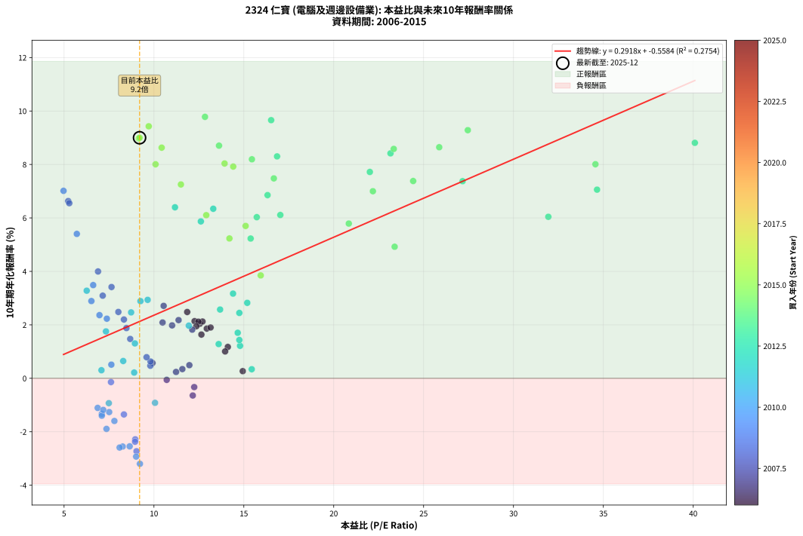
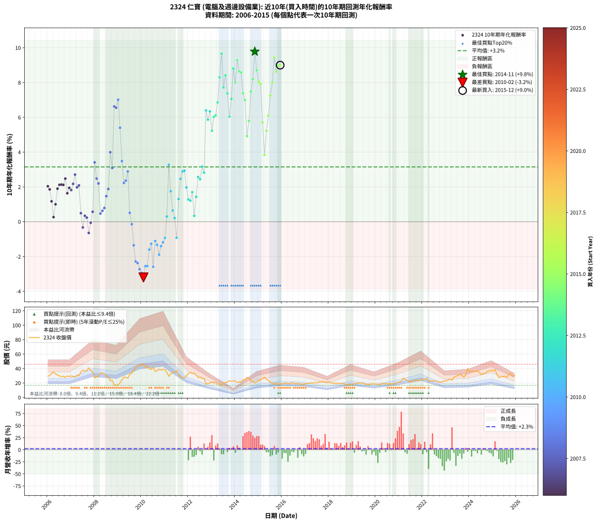

# 2324 仁寶 - 本益比與未來報酬率分析

!!! info "報告資訊"
    - **股票代號**: 2324
    - **公司名稱**: 仁寶
    - **產業別**: 電腦及週邊設備業
    - **分析期間**: 2006-2015 (120 個數據點)
    - **資料來源**: Type 12 (ShowMonthlyK_ChartFlow) 月收盤價與本益比
    - **報酬率口徑**: 含現金股利 (簡化: 年度合計，假設每年7/1入帳)
    - **報告生成時間**: 2026-01-22 22:19:42 CST

## 📈 視覺化圖表

### 圖表1: 本益比 vs 未來報酬率關係

*圖表1：2324 仁寶 本益比與10年期未來報酬率關係 (2006-2015)*

### 圖表2: 歷年買入時點的10年期實際報酬率

*圖表2：2324 仁寶 歷年買入時點的10年期實際報酬率 (2006-2015)*

## 📍 買點訊號說明

本報告提供兩種買點提示訊號（顯示於圖表2的股價子圖中）：

### ▲ 小綠色三角形（回測驗證）
- **計算方式**: 使用全部歷史資料計算本益比第25百分位數
- **用途**: 事後驗證，顯示歷史上哪些時點確實為低估區
- **限制**: 當下無法判斷，僅供回測參考
- **特性**: 後見之明（Look-Ahead Bias）

### ▲ 小橘色三角形（即時訊號）
- **計算方式**: 使用截至當月的過去5年資料計算本益比第25百分位數
- **用途**: 實際投資決策，當時即可判斷
- **優勢**: 可操作性強，符合實務需求
- **特性**: 無後見之明，滾動窗口計算

!!! tip "如何使用兩種訊號"
    - **綠色▲** 幫助理解歷史估值機會，驗證策略有效性
    - **橘色▲** 可作為實際買進參考，但仍需搭配基本面分析
    - 兩種訊號重疊時，表示即時判斷與事後驗證一致，信心度較高
    - 僅有綠色▲時，表示當時無法判斷（需要未來資料才能確認）
    - 僅有橘色▲時，表示即時判斷為買點，但事後可能不是最佳時機

## 📊 估值分析摘要

| 指標 | 數值 |
|:---:|:---:|
| **目前本益比** (2015-12) | **9.20 倍** |
| **歷史平均本益比** | 12.71 倍 |
| **估值水準** | 🟢 相對低估 |
| **預期10年年化報酬率** | **+2.13%** |
| **歷史平均報酬率** | +3.15% |
| **相關係數 (R²)** | 0.2754 |
| **趨勢線斜率** | 0.2918 |

!!! abstract "核心洞察"
    目前本益比顯著低於歷史平均，預期未來報酬率可能較高

    根據歷史數據回測，2324 仁寶 在目前本益比 **9.2倍** 的估值水準下，
    預期未來10年年化報酬率約為 **+2.1%**。

    **重要提醒**: 本分析基於歷史數據統計，實際報酬率會受到公司基本面變化、產業趨勢、
    總體經濟環境等多重因素影響。R² = 0.28 表示本益比可解釋約 27.5% 的報酬率變異。

## 📈 歷史估值統計

### 最佳買點 (最高報酬率)

| 項目 | 數值 |
|:---:|:---:|
| 起始時間 | 2014-11 |
| 當時本益比 | 12.84 倍 |
| 起始價格 | 19.8 元 |
| 10年後價格 | 36.9 元 |
| **10年年化報酬率** | **+9.78%** |

### 最差買點 (最低報酬率)

| 項目 | 數值 |
|:---:|:---:|
| 起始時間 | 2010-02 |
| 當時本益比 | 9.22 倍 |
| 起始價格 | 46.0 元 |
| 10年後價格 | 18.4 元 |
| **10年年化報酬率** | **-3.20%** |

## 🎯 投資啟示

### 本益比與報酬率關係

趨勢線方程式: **y = 0.2918x + -0.5584**

!!! info "弱相關或正相關"
    本益比與未來報酬率相關性較弱。這可能表示該股票的報酬率更多受到
    公司成長性、產業趨勢等因素影響，而非估值水準。**需綜合考量多項指標**。

### 估值區間建議

基於歷史數據分析:

- **🟢 低估區** (P/E < 10.2): 預期報酬率較高，可考慮增加持股
- **🟡 合理區** (P/E 10.2-15.3): 預期報酬率符合長期趨勢，正常持有
- **🔴 高估區** (P/E > 15.3): 預期報酬率較低，可考慮減碼或觀望

!!! danger "風險提示"
    - 過去表現不代表未來結果
    - 本分析假設公司基本面無重大結構性變化
    - 產業環境劇變可能使歷史規律失效
    - 應結合公司財報、產業趨勢、總體經濟等多重因素綜合判斷

!!! success "長期投資觀點"
    歷史數據顯示，在合理或低估的估值水準買入並長期持有，
    往往能獲得較佳的投資報酬。**耐心等待好價格**是價值投資的核心原則。

## 📊 數據品質

- **資料來源**: GoodInfo.tw Type 12 (ShowMonthlyK_ChartFlow)
- **資料頻率**: 月度收盤價與本益比
- **回測期間**: 2006-2015
- **數據點數量**: 120 個 (每個點代表一次10年期回測)

### 計算方法說明

1. **10年期年化報酬率**:
   - 對每個歷史時點，計算其後10年的實際投資報酬率
   - 期末價值(不含股利): 期末價格
   - 期末價值(含現金股利): 期末價格 + 持有期間內的現金股利合計 (簡化: 年度合計，假設每年7/1入帳)
   - 公式: 年化報酬率 = [(期末價值/期初價格)^(1/年數) - 1] × 100%

2. **本益比 (P/E Ratio)**:
   - 使用當時的月收盤價與EPS計算
   - 資料來源: Type 12 月度河流圖本益比數據

3. **趨勢線 (Linear Regression)**:
   - 使用最小平方法擬合線性趨勢線
   - R²值衡量本益比對報酬率的解釋能力

---

*本報告由 Stock Analysis System v1.9.0 自動生成*
*數據更新時間: 2026-01-22 22:19:42 CST*

## 📋 月度回測明細表

（每一列對應時間線圖中的一個買入點；可用來對照 SVG 圖上的每個點。）

| 買入月份 | 賣出月份 | 回測期限_年 | 實際持有年數 | 買入本益比_倍 | 買入收盤價_元 | 賣出收盤價_元 | 現金股利合計_元 | 總報酬率_pct | 年化報酬率_pct |
| --- | --- | --- | --- | --- | --- | --- | --- | --- | --- |
| 2006-01 | 2016-01 | 10 | 9.999 | 12.55 | 29.50 | 19.05 | 17.05 | +22.38 | +2.04 |
| 2006-02 | 2016-02 | 10 | 9.999 | 12.94 | 30.40 | 19.50 | 17.05 | +20.24 | +1.86 |
| 2006-03 | 2016-03 | 10 | 10.001 | 14.11 | 33.15 | 20.20 | 17.05 | +12.37 | +1.17 |
| 2006-04 | 2016-04 | 10 | 10.001 | 14.94 | 35.10 | 19.00 | 17.05 | +2.71 | +0.27 |
| 2006-05 | 2016-05 | 10 | 10.001 | 13.96 | 32.80 | 19.20 | 17.05 | +10.52 | +1.01 |
| 2006-06 | 2016-06 | 10 | 10.001 | 13.15 | 30.90 | 20.25 | 17.05 | +20.72 | +1.90 |
| 2006-07 | 2016-07 | 10 | 10.001 | 12.70 | 29.85 | 20.05 | 16.78 | +23.40 | +2.12 |
| 2006-08 | 2016-08 | 10 | 10.001 | 12.26 | 28.80 | 18.80 | 16.78 | +23.56 | +2.14 |
| 2006-09 | 2016-09 | 10 | 10.001 | 12.47 | 29.30 | 19.35 | 16.78 | +23.32 | +2.12 |
| 2006-10 | 2016-10 | 10 | 10.001 | 11.85 | 27.85 | 18.80 | 16.78 | +27.77 | +2.48 |
| 2006-11 | 2016-11 | 10 | 10.001 | 12.64 | 29.70 | 18.15 | 16.78 | +17.62 | +1.64 |
| 2006-12 | 2016-12 | 10 | 10.001 | 12.36 | 29.05 | 18.45 | 16.78 | +21.29 | +1.95 |
| 2007-01 | 2017-01 | 10 | 10.001 | 12.13 | 29.75 | 18.85 | 16.78 | +19.78 | +1.82 |
| 2007-02 | 2017-02 | 10 | 10.001 | 11.37 | 29.05 | 19.25 | 16.78 | +24.04 | +2.18 |
| 2007-03 | 2017-03 | 10 | 10.001 | 10.54 | 28.00 | 19.80 | 16.78 | +30.66 | +2.71 |
| 2007-04 | 2017-04 | 10 | 10.001 | 11.01 | 30.40 | 20.20 | 16.78 | +21.66 | +1.98 |
| 2007-05 | 2017-05 | 10 | 10.001 | 10.48 | 30.00 | 20.10 | 16.78 | +22.95 | +2.09 |
| 2007-06 | 2017-06 | 10 | 10.001 | 11.97 | 35.50 | 20.50 | 16.78 | +5.03 | +0.49 |
| 2007-07 | 2017-07 | 10 | 10.001 | 12.24 | 37.55 | 20.05 | 16.28 | -3.24 | -0.33 |
| 2007-08 | 2017-08 | 10 | 10.001 | 11.58 | 36.70 | 21.70 | 16.28 | +3.50 | +0.34 |
| 2007-09 | 2017-09 | 10 | 10.001 | 11.23 | 36.75 | 21.35 | 16.28 | +2.41 | +0.24 |
| 2007-10 | 2017-10 | 10 | 10.001 | 12.16 | 41.05 | 22.20 | 16.28 | -6.25 | -0.64 |
| 2007-11 | 2017-11 | 10 | 10.001 | 10.71 | 37.25 | 20.75 | 16.28 | -0.58 | -0.06 |
| 2007-12 | 2017-12 | 10 | 10.001 | 9.92 | 35.50 | 21.30 | 16.28 | +5.87 | +0.57 |
| 2008-01 | 2018-01 | 10 | 10.001 | 7.64 | 27.15 | 21.70 | 16.28 | +39.90 | +3.41 |
| 2008-02 | 2018-03 | 10 | 10.081 | 8.02 | 28.30 | 19.95 | 16.28 | +28.04 | +2.48 |
| 2008-03 | 2018-03 | 10 | 9.999 | 8.33 | 29.15 | 19.95 | 16.28 | +24.30 | +2.20 |
| 2008-04 | 2018-04 | 10 | 9.999 | 9.80 | 34.05 | 19.40 | 16.28 | +4.80 | +0.47 |
| 2008-05 | 2018-05 | 10 | 9.999 | 9.81 | 33.80 | 19.70 | 16.28 | +6.46 | +0.63 |
| 2008-06 | 2018-06 | 10 | 9.999 | 9.59 | 32.80 | 19.20 | 16.28 | +8.18 | +0.79 |
| 2008-07 | 2018-07 | 10 | 9.999 | 8.68 | 29.45 | 19.00 | 15.08 | +15.74 | +1.47 |
| 2008-08 | 2018-08 | 10 | 9.999 | 8.47 | 28.50 | 19.25 | 15.08 | +20.47 | +1.88 |
| 2008-09 | 2018-09 | 10 | 9.999 | 6.89 | 23.00 | 18.95 | 15.08 | +47.97 | +4.00 |
| 2008-10 | 2018-10 | 10 | 9.999 | 7.15 | 23.70 | 17.05 | 15.08 | +35.59 | +3.09 |
| 2008-11 | 2018-11 | 10 | 9.999 | 5.23 | 17.20 | 17.60 | 15.08 | +90.02 | +6.63 |
| 2008-12 | 2018-12 | 10 | 9.999 | 5.29 | 17.25 | 17.45 | 15.08 | +88.60 | +6.55 |
| 2009-01 | 2019-01 | 10 | 9.999 | 4.97 | 16.90 | 18.20 | 15.08 | +96.95 | +7.01 |
| 2009-02 | 2019-02 | 10 | 9.999 | 5.71 | 20.20 | 19.10 | 15.08 | +69.23 | +5.40 |
| 2009-03 | 2019-03 | 10 | 9.999 | 6.62 | 24.30 | 19.15 | 15.08 | +40.88 | +3.49 |
| 2009-04 | 2019-04 | 10 | 9.999 | 7.38 | 28.10 | 19.95 | 15.08 | +24.68 | +2.23 |
| 2009-05 | 2019-05 | 10 | 9.999 | 6.97 | 27.50 | 19.65 | 15.08 | +26.31 | +2.36 |
| 2009-06 | 2019-06 | 10 | 9.999 | 6.52 | 26.65 | 20.35 | 15.08 | +32.96 | +2.89 |
| 2009-07 | 2019-07 | 10 | 9.999 | 7.63 | 32.20 | 19.10 | 14.78 | +5.23 | +0.51 |
| 2009-08 | 2019-08 | 10 | 9.999 | 7.61 | 33.20 | 17.95 | 14.78 | -1.40 | -0.14 |
| 2009-09 | 2019-09 | 10 | 9.999 | 8.33 | 37.45 | 17.90 | 14.78 | -12.73 | -1.35 |
| 2009-10 | 2019-10 | 10 | 9.999 | 8.96 | 41.55 | 18.20 | 14.78 | -20.62 | -2.28 |
| 2009-11 | 2019-11 | 10 | 9.999 | 8.95 | 42.70 | 18.80 | 14.78 | -21.35 | -2.37 |
| 2009-12 | 2019-12 | 10 | 9.999 | 9.03 | 44.35 | 18.85 | 14.78 | -24.16 | -2.73 |
| 2010-01 | 2020-01 | 10 | 9.999 | 9.01 | 44.60 | 18.35 | 14.78 | -25.71 | -2.93 |
| 2010-02 | 2020-02 | 10 | 9.999 | 9.22 | 46.00 | 18.45 | 14.78 | -27.75 | -3.20 |
| 2010-03 | 2020-03 | 10 | 10.001 | 8.26 | 41.55 | 17.30 | 14.78 | -22.78 | -2.55 |
| 2010-04 | 2020-04 | 10 | 10.001 | 8.65 | 43.85 | 19.10 | 14.78 | -22.73 | -2.55 |
| 2010-05 | 2020-05 | 10 | 10.001 | 7.80 | 39.80 | 19.10 | 14.78 | -14.86 | -1.60 |
| 2010-06 | 2020-06 | 10 | 10.001 | 7.51 | 38.65 | 19.25 | 14.78 | -11.94 | -1.26 |
| 2010-07 | 2020-07 | 10 | 10.001 | 8.09 | 41.95 | 18.65 | 13.62 | -23.08 | -2.59 |
| 2010-08 | 2020-08 | 10 | 10.001 | 6.87 | 35.90 | 18.50 | 13.62 | -10.54 | -1.11 |
| 2010-09 | 2020-09 | 10 | 10.001 | 7.10 | 37.35 | 19.05 | 13.62 | -12.54 | -1.33 |
| 2010-10 | 2020-10 | 10 | 10.001 | 7.36 | 39.00 | 18.60 | 13.62 | -17.39 | -1.89 |
| 2010-11 | 2020-11 | 10 | 10.001 | 7.10 | 37.90 | 19.30 | 13.62 | -13.15 | -1.40 |
| 2010-12 | 2020-12 | 10 | 10.001 | 7.18 | 38.65 | 20.70 | 13.62 | -11.21 | -1.18 |
| 2011-01 | 2021-01 | 10 | 10.001 | 7.49 | 38.50 | 21.45 | 13.62 | -8.92 | -0.93 |
| 2011-02 | 2021-02 | 10 | 10.001 | 7.08 | 34.75 | 22.20 | 13.62 | +3.07 | +0.30 |
| 2011-03 | 2021-03 | 10 | 10.001 | 6.26 | 29.20 | 26.70 | 13.62 | +38.07 | +3.28 |
| 2011-04 | 2021-04 | 10 | 10.001 | 7.33 | 32.45 | 25.00 | 13.62 | +19.00 | +1.75 |
| 2011-05 | 2021-05 | 10 | 10.001 | 8.29 | 34.75 | 23.45 | 13.62 | +6.66 | +0.65 |
| 2011-06 | 2021-06 | 10 | 10.001 | 8.90 | 35.20 | 22.35 | 13.62 | +2.18 | +0.22 |
| 2011-07 | 2021-07 | 10 | 10.001 | 10.06 | 37.40 | 21.60 | 12.51 | -8.80 | -0.92 |
| 2011-08 | 2021-08 | 10 | 10.001 | 8.94 | 31.10 | 22.90 | 12.51 | +13.85 | +1.31 |
| 2011-09 | 2021-09 | 10 | 10.001 | 8.73 | 28.30 | 23.60 | 12.51 | +27.59 | +2.47 |
| 2011-10 | 2021-10 | 10 | 10.001 | 9.25 | 27.80 | 24.45 | 12.51 | +32.94 | +2.89 |
| 2011-11 | 2021-11 | 10 | 10.001 | 9.65 | 26.70 | 23.15 | 12.51 | +33.55 | +2.93 |
| 2011-12 | 2021-12 | 10 | 10.001 | 11.94 | 30.20 | 24.20 | 12.51 | +21.55 | +1.97 |
| 2012-01 | 2022-01 | 10 | 10.001 | 13.60 | 33.20 | 25.20 | 12.51 | +13.58 | +1.28 |
| 2012-02 | 2022-03 | 10 | 10.081 | 14.79 | 34.80 | 26.80 | 12.51 | +12.95 | +1.22 |
| 2012-03 | 2022-03 | 10 | 9.999 | 14.66 | 33.20 | 26.80 | 12.51 | +18.39 | +1.70 |
| 2012-04 | 2022-04 | 10 | 9.999 | 15.44 | 33.60 | 22.25 | 12.51 | +3.44 | +0.34 |
| 2012-05 | 2022-05 | 10 | 9.999 | 14.75 | 30.80 | 23.00 | 12.51 | +15.28 | +1.43 |
| 2012-06 | 2022-06 | 10 | 9.999 | 13.68 | 27.35 | 22.75 | 12.51 | +28.91 | +2.57 |
| 2012-07 | 2022-07 | 10 | 9.999 | 14.75 | 28.20 | 22.80 | 13.11 | +27.33 | +2.45 |
| 2012-08 | 2022-08 | 10 | 9.999 | 14.40 | 26.25 | 22.75 | 13.11 | +36.60 | +3.17 |
| 2012-09 | 2022-09 | 10 | 9.999 | 15.19 | 26.35 | 21.70 | 13.11 | +32.09 | +2.82 |
| 2012-10 | 2022-10 | 10 | 9.999 | 11.17 | 18.40 | 21.10 | 13.11 | +85.91 | +6.40 |
| 2012-11 | 2022-11 | 10 | 9.999 | 12.61 | 19.65 | 21.65 | 13.11 | +76.88 | +5.87 |
| 2012-12 | 2022-12 | 10 | 9.999 | 13.30 | 19.55 | 23.05 | 13.11 | +84.95 | +6.34 |
| 2013-01 | 2023-01 | 10 | 9.999 | 15.38 | 21.45 | 22.60 | 13.11 | +66.47 | +5.23 |
| 2013-02 | 2023-02 | 10 | 9.999 | 15.72 | 20.75 | 24.15 | 13.11 | +79.55 | +6.03 |
| 2013-03 | 2023-03 | 10 | 9.999 | 17.03 | 21.20 | 25.25 | 13.11 | +80.93 | +6.11 |
| 2013-04 | 2023-04 | 10 | 9.999 | 16.32 | 19.10 | 23.95 | 13.11 | +94.02 | +6.85 |
| 2013-05 | 2023-05 | 10 | 9.999 | 16.85 | 18.45 | 27.85 | 13.11 | +121.99 | +8.30 |
| 2013-06 | 2023-06 | 10 | 9.999 | 16.52 | 16.85 | 29.25 | 13.11 | +151.38 | +9.66 |
| 2013-07 | 2023-07 | 10 | 9.999 | 22.01 | 20.80 | 30.45 | 13.30 | +110.34 | +7.72 |
| 2013-08 | 2023-08 | 10 | 9.999 | 23.16 | 20.15 | 31.90 | 13.30 | +124.32 | +8.42 |
| 2013-09 | 2023-09 | 10 | 9.999 | 27.17 | 21.60 | 30.70 | 13.30 | +103.70 | +7.38 |
| 2013-10 | 2023-10 | 10 | 9.999 | 31.94 | 23.00 | 28.05 | 13.30 | +79.78 | +6.04 |
| 2013-11 | 2023-11 | 10 | 9.999 | 34.65 | 22.35 | 30.90 | 13.30 | +97.76 | +7.06 |
| 2013-12 | 2023-12 | 10 | 9.999 | 40.09 | 22.85 | 39.85 | 13.30 | +132.60 | +8.81 |
| 2014-01 | 2024-01 | 10 | 9.999 | 34.56 | 22.75 | 35.85 | 13.30 | +116.04 | +8.01 |
| 2014-02 | 2024-02 | 10 | 9.999 | 27.46 | 20.50 | 36.50 | 13.30 | +142.93 | +9.28 |
| 2014-03 | 2024-03 | 10 | 10.001 | 25.87 | 21.60 | 36.20 | 13.30 | +129.17 | +8.65 |
| 2014-04 | 2024-04 | 10 | 10.001 | 23.34 | 21.55 | 35.80 | 13.30 | +127.84 | +8.58 |
| 2014-05 | 2024-05 | 10 | 10.001 | 24.42 | 24.70 | 37.05 | 13.30 | +103.85 | +7.38 |
| 2014-06 | 2024-06 | 10 | 10.001 | 22.18 | 24.40 | 34.70 | 13.30 | +96.72 | +7.00 |
| 2014-07 | 2024-07 | 10 | 10.001 | 23.39 | 27.80 | 31.45 | 13.50 | +61.69 | +4.92 |
| 2014-08 | 2024-08 | 10 | 10.001 | 20.84 | 26.60 | 33.20 | 13.50 | +75.57 | +5.79 |
| 2014-09 | 2024-09 | 10 | 10.001 | 16.67 | 22.75 | 33.30 | 13.50 | +105.72 | +7.48 |
| 2014-10 | 2024-10 | 10 | 10.001 | 15.45 | 22.45 | 35.85 | 13.50 | +119.83 | +8.19 |
| 2014-11 | 2024-11 | 10 | 10.001 | 12.84 | 19.80 | 36.85 | 13.50 | +154.30 | +9.78 |
| 2014-12 | 2024-12 | 10 | 10.001 | 13.62 | 22.20 | 37.65 | 13.50 | +130.41 | +8.70 |
| 2015-01 | 2025-01 | 10 | 10.001 | 13.93 | 23.15 | 36.65 | 13.50 | +116.63 | +8.04 |
| 2015-02 | 2025-02 | 10 | 10.001 | 14.41 | 24.40 | 38.80 | 13.50 | +114.35 | +7.92 |
| 2015-03 | 2025-03 | 10 | 10.001 | 15.10 | 26.05 | 31.85 | 13.50 | +74.09 | +5.70 |
| 2015-04 | 2025-04 | 10 | 10.001 | 15.94 | 28.00 | 27.35 | 13.50 | +45.90 | +3.85 |
| 2015-05 | 2025-05 | 10 | 10.001 | 14.20 | 25.40 | 28.80 | 13.50 | +66.54 | +5.23 |
| 2015-06 | 2025-06 | 10 | 10.001 | 12.91 | 23.50 | 29.00 | 13.50 | +80.86 | +6.10 |
| 2015-07 | 2025-07 | 10 | 10.001 | 11.50 | 21.30 | 29.50 | 13.40 | +101.41 | +7.25 |
| 2015-08 | 2025-08 | 10 | 10.001 | 10.09 | 19.00 | 27.65 | 13.40 | +116.06 | +8.01 |
| 2015-09 | 2025-09 | 10 | 10.001 | 9.71 | 18.60 | 32.40 | 13.40 | +146.24 | +9.43 |
| 2015-10 | 2025-10 | 10 | 10.001 | 10.43 | 20.30 | 33.05 | 13.40 | +128.82 | +8.63 |
| 2015-11 | 2025-11 | 10 | 10.001 | 9.15 | 18.10 | 29.35 | 13.40 | +136.19 | +8.97 |
| 2015-12 | 2025-12 | 10 | 10.001 | 9.20 | 18.50 | 30.40 | 13.40 | +136.76 | +9.00 |
