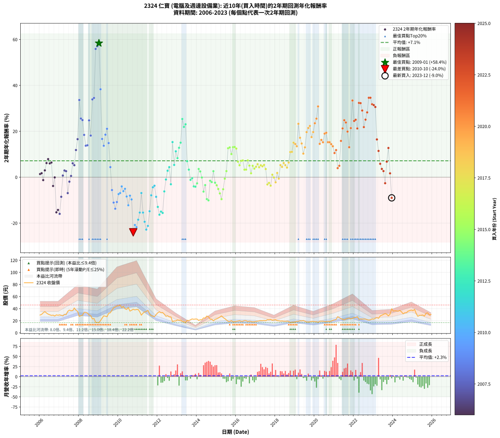

# 2324 仁寶 - 本益比與未來報酬率分析

!!! info "報告資訊"
    - **股票代號**: 2324
    - **公司名稱**: 仁寶
    - **產業別**: 電腦及週邊設備業
    - **分析期間**: 2006-2023 (216 個數據點)
    - **資料來源**: Type 12 (ShowMonthlyK_ChartFlow) 月收盤價與本益比
    - **報酬率口徑**: 含現金股利 (簡化: 年度合計，假設每年7/1入帳)
    - **報告生成時間**: 2026-01-09 20:33:05 CST

## 📈 視覺化圖表

### 圖表1: 本益比 vs 未來報酬率關係

*圖表1：2324 仁寶 本益比與2年期未來報酬率關係 (2006-2023)*

### 圖表2: 歷年買入時點的2年期實際報酬率

*圖表2：2324 仁寶 歷年買入時點的2年期實際報酬率 (2006-2023)*

## 📍 買點訊號說明

本報告提供兩種買點提示訊號（顯示於圖表2的股價子圖中）：

### ▲ 小綠色三角形（回測驗證）
- **計算方式**: 使用全部歷史資料計算本益比第25百分位數
- **用途**: 事後驗證，顯示歷史上哪些時點確實為低估區
- **限制**: 當下無法判斷，僅供回測參考
- **特性**: 後見之明（Look-Ahead Bias）

### ▲ 小橘色三角形（即時訊號）
- **計算方式**: 使用截至當月的過去5年資料計算本益比第25百分位數
- **用途**: 實際投資決策，當時即可判斷
- **優勢**: 可操作性強，符合實務需求
- **特性**: 無後見之明，滾動窗口計算

!!! tip "如何使用兩種訊號"
    - **綠色▲** 幫助理解歷史估值機會，驗證策略有效性
    - **橘色▲** 可作為實際買進參考，但仍需搭配基本面分析
    - 兩種訊號重疊時，表示即時判斷與事後驗證一致，信心度較高
    - 僅有綠色▲時，表示當時無法判斷（需要未來資料才能確認）
    - 僅有橘色▲時，表示即時判斷為買點，但事後可能不是最佳時機

## 📊 估值分析摘要

| 指標 | 數值 |
|:---:|:---:|
| **目前本益比** (2023-12) | **22.64 倍** |
| **歷史平均本益比** | 12.15 倍 |
| **估值水準** | 🔴 相對高估 |
| **預期2年年化報酬率** | **-0.48%** |
| **歷史平均報酬率** | +7.15% |
| **相關係數 (R²)** | 0.0645 |
| **趨勢線斜率** | -0.7269 |

!!! abstract "核心洞察"
    目前本益比顯著高於歷史平均，預期未來報酬率可能較低

    根據歷史數據回測，2324 仁寶 在目前本益比 **22.6倍** 的估值水準下，
    預期未來2年年化報酬率約為 **-0.5%**。

    **重要提醒**: 本分析基於歷史數據統計，實際報酬率會受到公司基本面變化、產業趨勢、
    總體經濟環境等多重因素影響。R² = 0.06 表示本益比可解釋約 6.4% 的報酬率變異。

## 📈 歷史估值統計

### 最佳買點 (最高報酬率)

| 項目 | 數值 |
|:---:|:---:|
| 起始時間 | 2009-01 |
| 當時本益比 | 4.97 倍 |
| 起始價格 | 16.9 元 |
| 2年後價格 | 38.5 元 |
| **2年年化報酬率** | **+58.38%** |

### 最差買點 (最低報酬率)

| 項目 | 數值 |
|:---:|:---:|
| 起始時間 | 2010-10 |
| 當時本益比 | 7.36 倍 |
| 起始價格 | 39.0 元 |
| 2年後價格 | 18.4 元 |
| **2年年化報酬率** | **-24.02%** |

## 🎯 投資啟示

### 本益比與報酬率關係

趨勢線方程式: **y = -0.7269x + 15.9775**

!!! warning "強負相關"
    本益比與未來報酬率呈現強負相關。在高本益比時期買入，未來報酬率顯著較低；
    在低本益比時期買入，未來報酬率顯著較高。**估值紀律至關重要**。

### 估值區間建議

基於歷史數據分析:

- **🟢 低估區** (P/E < 9.7): 預期報酬率較高，可考慮增加持股
- **🟡 合理區** (P/E 9.7-14.6): 預期報酬率符合長期趨勢，正常持有
- **🔴 高估區** (P/E > 14.6): 預期報酬率較低，可考慮減碼或觀望

!!! danger "風險提示"
    - 過去表現不代表未來結果
    - 本分析假設公司基本面無重大結構性變化
    - 產業環境劇變可能使歷史規律失效
    - 應結合公司財報、產業趨勢、總體經濟等多重因素綜合判斷

!!! success "長期投資觀點"
    歷史數據顯示，在合理或低估的估值水準買入並長期持有，
    往往能獲得較佳的投資報酬。**耐心等待好價格**是價值投資的核心原則。

## 📊 數據品質

- **資料來源**: GoodInfo.tw Type 12 (ShowMonthlyK_ChartFlow)
- **資料頻率**: 月度收盤價與本益比
- **回測期間**: 2006-2023
- **數據點數量**: 216 個 (每個點代表一次2年期回測)

### 計算方法說明

1. **2年期年化報酬率**:
   - 對每個歷史時點，計算其後2年的實際投資報酬率
   - 期末價值(不含股利): 期末價格
   - 期末價值(含現金股利): 期末價格 + 持有期間內的現金股利合計 (簡化: 年度合計，假設每年7/1入帳)
   - 公式: 年化報酬率 = [(期末價值/期初價格)^(1/年數) - 1] × 100%

2. **本益比 (P/E Ratio)**:
   - 使用當時的月收盤價與EPS計算
   - 資料來源: Type 12 月度河流圖本益比數據

3. **趨勢線 (Linear Regression)**:
   - 使用最小平方法擬合線性趨勢線
   - R²值衡量本益比對報酬率的解釋能力

---

*本報告由 Stock Analysis System v1.9.0 自動生成*
*數據更新時間: 2026-01-09 20:33:05 CST*

## 📋 月度回測明細表

（每一列對應時間線圖中的一個買入點；可用來對照 SVG 圖上的每個點。）

| 買入月份 | 賣出月份 | 回測期限_年 | 實際持有年數 | 買入本益比_倍 | 買入收盤價_元 | 賣出收盤價_元 | 現金股利合計_元 | 總報酬率_pct | 年化報酬率_pct |
| --- | --- | --- | --- | --- | --- | --- | --- | --- | --- |
| 2006-01 | 2008-01 | 2 | 1.999 | 12.55 | 29.50 | 27.15 | 3.17 | +2.78 | +1.38 |
| 2006-02 | 2008-02 | 2 | 1.999 | 12.94 | 30.40 | 28.30 | 3.17 | +3.52 | +1.74 |
| 2006-03 | 2008-03 | 2 | 2.001 | 14.11 | 33.15 | 29.15 | 3.17 | -2.51 | -1.26 |
| 2006-04 | 2008-04 | 2 | 2.001 | 14.94 | 35.10 | 34.05 | 3.17 | +6.04 | +2.97 |
| 2006-05 | 2008-05 | 2 | 2.001 | 13.96 | 32.80 | 33.80 | 3.17 | +12.71 | +6.16 |
| 2006-06 | 2008-06 | 2 | 2.001 | 13.15 | 30.90 | 32.80 | 3.17 | +16.40 | +7.89 |
| 2006-07 | 2008-07 | 2 | 2.001 | 12.70 | 29.85 | 29.45 | 4.10 | +12.40 | +6.01 |
| 2006-08 | 2008-08 | 2 | 2.001 | 12.26 | 28.80 | 28.50 | 4.10 | +13.19 | +6.39 |
| 2006-09 | 2008-09 | 2 | 2.001 | 12.47 | 29.30 | 23.00 | 4.10 | -7.51 | -3.82 |
| 2006-10 | 2008-10 | 2 | 2.001 | 11.85 | 27.85 | 23.70 | 4.10 | -0.18 | -0.09 |
| 2006-11 | 2008-11 | 2 | 2.001 | 12.64 | 29.70 | 17.20 | 4.10 | -28.28 | -15.30 |
| 2006-12 | 2008-12 | 2 | 2.001 | 12.36 | 29.05 | 17.25 | 4.10 | -26.51 | -14.26 |
| 2007-01 | 2009-01 | 2 | 2.001 | 12.13 | 29.75 | 16.90 | 4.10 | -29.41 | -15.97 |
| 2007-02 | 2009-02 | 2 | 2.001 | 11.37 | 29.05 | 20.20 | 4.10 | -16.35 | -8.53 |
| 2007-03 | 2009-03 | 2 | 2.001 | 10.54 | 28.00 | 24.30 | 4.10 | +1.43 | +0.71 |
| 2007-04 | 2009-04 | 2 | 2.001 | 11.01 | 30.40 | 28.10 | 4.10 | +5.92 | +2.92 |
| 2007-05 | 2009-05 | 2 | 2.001 | 10.48 | 30.00 | 27.50 | 4.10 | +5.33 | +2.63 |
| 2007-06 | 2009-06 | 2 | 2.001 | 11.97 | 35.50 | 26.65 | 4.10 | -13.38 | -6.93 |
| 2007-07 | 2009-07 | 2 | 2.001 | 12.24 | 37.55 | 32.20 | 3.90 | -3.86 | -1.95 |
| 2007-08 | 2009-08 | 2 | 2.001 | 11.58 | 36.70 | 33.20 | 3.90 | +1.09 | +0.54 |
| 2007-09 | 2009-09 | 2 | 2.001 | 11.23 | 36.75 | 37.45 | 3.90 | +12.52 | +6.07 |
| 2007-10 | 2009-10 | 2 | 2.001 | 12.16 | 41.05 | 41.55 | 3.90 | +10.72 | +5.22 |
| 2007-11 | 2009-11 | 2 | 2.001 | 10.71 | 37.25 | 42.70 | 3.90 | +25.10 | +11.84 |
| 2007-12 | 2009-12 | 2 | 2.001 | 9.92 | 35.50 | 44.35 | 3.90 | +35.92 | +16.57 |
| 2008-01 | 2010-01 | 2 | 2.001 | 7.64 | 27.15 | 44.60 | 3.90 | +78.64 | +33.63 |
| 2008-02 | 2010-03 | 2 | 2.081 | 8.02 | 28.30 | 41.55 | 3.90 | +60.60 | +25.57 |
| 2008-03 | 2010-03 | 2 | 1.999 | 8.33 | 29.15 | 41.55 | 3.90 | +55.92 | +24.89 |
| 2008-04 | 2010-04 | 2 | 1.999 | 9.80 | 34.05 | 43.85 | 3.90 | +40.23 | +18.43 |
| 2008-05 | 2010-05 | 2 | 1.999 | 9.81 | 33.80 | 39.80 | 3.90 | +29.29 | +13.72 |
| 2008-06 | 2010-06 | 2 | 1.999 | 9.59 | 32.80 | 38.65 | 3.90 | +29.73 | +13.91 |
| 2008-07 | 2010-07 | 2 | 1.999 | 8.68 | 29.45 | 41.95 | 3.87 | +55.58 | +24.75 |
| 2008-08 | 2010-08 | 2 | 1.999 | 8.47 | 28.50 | 35.90 | 3.87 | +39.54 | +18.14 |
| 2008-09 | 2010-09 | 2 | 1.999 | 6.89 | 23.00 | 37.35 | 3.87 | +79.21 | +33.90 |
| 2008-10 | 2010-10 | 2 | 1.999 | 7.15 | 23.70 | 39.00 | 3.87 | +80.88 | +34.52 |
| 2008-11 | 2010-11 | 2 | 1.999 | 5.23 | 17.20 | 37.90 | 3.87 | +142.84 | +55.88 |
| 2008-12 | 2010-12 | 2 | 1.999 | 5.29 | 17.25 | 38.65 | 3.87 | +146.48 | +57.05 |
| 2009-01 | 2011-01 | 2 | 1.999 | 4.97 | 16.90 | 38.50 | 3.87 | +150.70 | +58.38 |
| 2009-02 | 2011-02 | 2 | 1.999 | 5.71 | 20.20 | 34.75 | 3.87 | +91.18 | +38.30 |
| 2009-03 | 2011-03 | 2 | 1.999 | 6.62 | 24.30 | 29.20 | 3.87 | +36.08 | +16.67 |
| 2009-04 | 2011-04 | 2 | 1.999 | 7.38 | 28.10 | 32.45 | 3.87 | +29.25 | +13.70 |
| 2009-05 | 2011-05 | 2 | 1.999 | 6.97 | 27.50 | 34.75 | 3.87 | +40.43 | +18.52 |
| 2009-06 | 2011-06 | 2 | 1.999 | 6.52 | 26.65 | 35.20 | 3.87 | +46.60 | +21.09 |
| 2009-07 | 2011-07 | 2 | 1.999 | 7.63 | 32.20 | 37.40 | 5.08 | +31.92 | +14.87 |
| 2009-08 | 2011-08 | 2 | 1.999 | 7.61 | 33.20 | 31.10 | 5.08 | +8.97 | +4.39 |
| 2009-09 | 2011-09 | 2 | 1.999 | 8.33 | 37.45 | 28.30 | 5.08 | -10.88 | -5.60 |
| 2009-10 | 2011-10 | 2 | 1.999 | 8.96 | 41.55 | 27.80 | 5.08 | -20.87 | -11.05 |
| 2009-11 | 2011-11 | 2 | 1.999 | 8.95 | 42.70 | 26.70 | 5.08 | -25.58 | -13.74 |
| 2009-12 | 2011-12 | 2 | 1.999 | 9.03 | 44.35 | 30.20 | 5.08 | -20.46 | -10.82 |
| 2010-01 | 2012-01 | 2 | 1.999 | 9.01 | 44.60 | 33.20 | 5.08 | -14.18 | -7.36 |
| 2010-02 | 2012-02 | 2 | 1.999 | 9.22 | 46.00 | 34.80 | 5.08 | -13.31 | -6.90 |
| 2010-03 | 2012-03 | 2 | 2.001 | 8.26 | 41.55 | 33.20 | 5.08 | -7.88 | -4.02 |
| 2010-04 | 2012-04 | 2 | 2.001 | 8.65 | 43.85 | 33.60 | 5.08 | -11.80 | -6.08 |
| 2010-05 | 2012-05 | 2 | 2.001 | 7.80 | 39.80 | 30.80 | 5.08 | -9.86 | -5.05 |
| 2010-06 | 2012-06 | 2 | 2.001 | 7.51 | 38.65 | 27.35 | 5.08 | -16.10 | -8.40 |
| 2010-07 | 2012-07 | 2 | 2.001 | 8.09 | 41.95 | 28.20 | 4.11 | -22.98 | -12.23 |
| 2010-08 | 2012-08 | 2 | 2.001 | 6.87 | 35.90 | 26.25 | 4.11 | -15.43 | -8.04 |
| 2010-09 | 2012-09 | 2 | 2.001 | 7.10 | 37.35 | 26.35 | 4.11 | -18.45 | -9.69 |
| 2010-10 | 2012-10 | 2 | 2.001 | 7.36 | 39.00 | 18.40 | 4.11 | -42.28 | -24.02 |
| 2010-11 | 2012-11 | 2 | 2.001 | 7.10 | 37.90 | 19.65 | 4.11 | -37.31 | -20.81 |
| 2010-12 | 2012-12 | 2 | 2.001 | 7.18 | 38.65 | 19.55 | 4.11 | -38.79 | -21.75 |
| 2011-01 | 2013-01 | 2 | 2.001 | 7.49 | 38.50 | 21.45 | 4.11 | -33.61 | -18.51 |
| 2011-02 | 2013-02 | 2 | 2.001 | 7.08 | 34.75 | 20.75 | 4.11 | -28.46 | -15.41 |
| 2011-03 | 2013-03 | 2 | 2.001 | 6.26 | 29.20 | 21.20 | 4.11 | -13.33 | -6.90 |
| 2011-04 | 2013-04 | 2 | 2.001 | 7.33 | 32.45 | 19.10 | 4.11 | -28.48 | -15.42 |
| 2011-05 | 2013-05 | 2 | 2.001 | 8.29 | 34.75 | 18.45 | 4.11 | -35.08 | -19.42 |
| 2011-06 | 2013-06 | 2 | 2.001 | 8.90 | 35.20 | 16.85 | 4.11 | -40.46 | -22.82 |
| 2011-07 | 2013-07 | 2 | 2.001 | 10.06 | 37.40 | 20.80 | 2.41 | -37.95 | -21.21 |
| 2011-08 | 2013-08 | 2 | 2.001 | 8.94 | 31.10 | 20.15 | 2.41 | -27.47 | -14.83 |
| 2011-09 | 2013-09 | 2 | 2.001 | 8.73 | 28.30 | 21.60 | 2.41 | -15.17 | -7.89 |
| 2011-10 | 2013-10 | 2 | 2.001 | 9.25 | 27.80 | 23.00 | 2.41 | -8.61 | -4.40 |
| 2011-11 | 2013-11 | 2 | 2.001 | 9.65 | 26.70 | 22.35 | 2.41 | -7.28 | -3.70 |
| 2011-12 | 2013-12 | 2 | 2.001 | 11.94 | 30.20 | 22.85 | 2.41 | -16.37 | -8.54 |
| 2012-01 | 2014-01 | 2 | 2.001 | 13.60 | 33.20 | 22.75 | 2.41 | -24.23 | -12.94 |
| 2012-02 | 2014-03 | 2 | 2.081 | 14.79 | 34.80 | 21.60 | 2.41 | -31.01 | -16.34 |
| 2012-03 | 2014-03 | 2 | 1.999 | 14.66 | 33.20 | 21.60 | 2.41 | -27.69 | -14.97 |
| 2012-04 | 2014-04 | 2 | 1.999 | 15.44 | 33.60 | 21.55 | 2.41 | -28.70 | -15.57 |
| 2012-05 | 2014-05 | 2 | 1.999 | 14.75 | 30.80 | 24.70 | 2.41 | -11.99 | -6.19 |
| 2012-06 | 2014-06 | 2 | 1.999 | 13.68 | 27.35 | 24.40 | 2.41 | -1.99 | -1.00 |
| 2012-07 | 2014-07 | 2 | 1.999 | 14.75 | 28.20 | 27.80 | 2.01 | +5.70 | +2.81 |
| 2012-08 | 2014-08 | 2 | 1.999 | 14.40 | 26.25 | 26.60 | 2.01 | +8.98 | +4.39 |
| 2012-09 | 2014-09 | 2 | 1.999 | 15.19 | 26.35 | 22.75 | 2.01 | -6.05 | -3.07 |
| 2012-10 | 2014-10 | 2 | 1.999 | 11.17 | 18.40 | 22.45 | 2.01 | +32.91 | +15.30 |
| 2012-11 | 2014-11 | 2 | 1.999 | 12.61 | 19.65 | 19.80 | 2.01 | +10.97 | +5.35 |
| 2012-12 | 2014-12 | 2 | 1.999 | 13.30 | 19.55 | 22.20 | 2.01 | +23.82 | +11.28 |
| 2013-01 | 2015-01 | 2 | 1.999 | 15.38 | 21.45 | 23.15 | 2.01 | +17.28 | +8.30 |
| 2013-02 | 2015-02 | 2 | 1.999 | 15.72 | 20.75 | 24.40 | 2.01 | +27.26 | +12.82 |
| 2013-03 | 2015-03 | 2 | 1.999 | 17.03 | 21.20 | 26.05 | 2.01 | +32.34 | +15.05 |
| 2013-04 | 2015-04 | 2 | 1.999 | 16.32 | 19.10 | 28.00 | 2.01 | +57.10 | +25.36 |
| 2013-05 | 2015-05 | 2 | 1.999 | 16.85 | 18.45 | 25.40 | 2.01 | +48.54 | +21.89 |
| 2013-06 | 2015-06 | 2 | 1.999 | 16.52 | 16.85 | 23.50 | 2.01 | +51.37 | +23.05 |
| 2013-07 | 2015-07 | 2 | 1.999 | 22.01 | 20.80 | 21.30 | 2.50 | +14.42 | +6.97 |
| 2013-08 | 2015-08 | 2 | 1.999 | 23.16 | 20.15 | 19.00 | 2.50 | +6.69 | +3.30 |
| 2013-09 | 2015-09 | 2 | 1.999 | 27.17 | 21.60 | 18.60 | 2.50 | -2.32 | -1.17 |
| 2013-10 | 2015-10 | 2 | 1.999 | 31.94 | 23.00 | 20.30 | 2.50 | -0.87 | -0.44 |
| 2013-11 | 2015-11 | 2 | 1.999 | 34.65 | 22.35 | 18.10 | 2.50 | -7.83 | -4.00 |
| 2013-12 | 2015-12 | 2 | 1.999 | 40.09 | 22.85 | 18.50 | 2.50 | -8.10 | -4.14 |
| 2014-01 | 2016-01 | 2 | 1.999 | 34.56 | 22.75 | 19.05 | 2.50 | -5.28 | -2.68 |
| 2014-02 | 2016-02 | 2 | 1.999 | 27.46 | 20.50 | 19.50 | 2.50 | +7.31 | +3.59 |
| 2014-03 | 2016-03 | 2 | 2.001 | 25.87 | 21.60 | 20.20 | 2.50 | +5.09 | +2.51 |
| 2014-04 | 2016-04 | 2 | 2.001 | 23.34 | 21.55 | 19.00 | 2.50 | -0.24 | -0.12 |
| 2014-05 | 2016-05 | 2 | 2.001 | 24.42 | 24.70 | 19.20 | 2.50 | -12.15 | -6.27 |
| 2014-06 | 2016-06 | 2 | 2.001 | 22.18 | 24.40 | 20.25 | 2.50 | -6.77 | -3.44 |
| 2014-07 | 2016-07 | 2 | 2.001 | 23.39 | 27.80 | 20.05 | 2.70 | -18.16 | -9.53 |
| 2014-08 | 2016-08 | 2 | 2.001 | 20.84 | 26.60 | 18.80 | 2.70 | -19.17 | -10.09 |
| 2014-09 | 2016-09 | 2 | 2.001 | 16.67 | 22.75 | 19.35 | 2.70 | -3.07 | -1.55 |
| 2014-10 | 2016-10 | 2 | 2.001 | 15.45 | 22.45 | 18.80 | 2.70 | -4.23 | -2.13 |
| 2014-11 | 2016-11 | 2 | 2.001 | 12.84 | 19.80 | 18.15 | 2.70 | +5.31 | +2.62 |
| 2014-12 | 2016-12 | 2 | 2.001 | 13.62 | 22.20 | 18.45 | 2.70 | -4.73 | -2.39 |
| 2015-01 | 2017-01 | 2 | 2.001 | 13.93 | 23.15 | 18.85 | 2.70 | -6.91 | -3.51 |
| 2015-02 | 2017-02 | 2 | 2.001 | 14.41 | 24.40 | 19.25 | 2.70 | -10.04 | -5.15 |
| 2015-03 | 2017-03 | 2 | 2.001 | 15.10 | 26.05 | 19.80 | 2.70 | -13.62 | -7.06 |
| 2015-04 | 2017-04 | 2 | 2.001 | 15.94 | 28.00 | 20.20 | 2.70 | -18.21 | -9.56 |
| 2015-05 | 2017-05 | 2 | 2.001 | 14.20 | 25.40 | 20.10 | 2.70 | -10.23 | -5.25 |
| 2015-06 | 2017-06 | 2 | 2.001 | 12.91 | 23.50 | 20.50 | 2.70 | -1.27 | -0.64 |
| 2015-07 | 2017-07 | 2 | 2.001 | 11.50 | 21.30 | 20.05 | 2.40 | +5.40 | +2.66 |
| 2015-08 | 2017-08 | 2 | 2.001 | 10.09 | 19.00 | 21.70 | 2.40 | +26.85 | +12.62 |
| 2015-09 | 2017-09 | 2 | 2.001 | 9.71 | 18.60 | 21.35 | 2.40 | +27.69 | +12.99 |
| 2015-10 | 2017-10 | 2 | 2.001 | 10.43 | 20.30 | 22.20 | 2.40 | +21.19 | +10.08 |
| 2015-11 | 2017-11 | 2 | 2.001 | 9.15 | 18.10 | 20.75 | 2.40 | +27.91 | +13.09 |
| 2015-12 | 2017-12 | 2 | 2.001 | 9.20 | 18.50 | 21.30 | 2.40 | +28.11 | +13.18 |
| 2016-01 | 2018-01 | 2 | 2.001 | 9.53 | 19.05 | 21.70 | 2.40 | +26.51 | +12.47 |
| 2016-02 | 2018-03 | 2 | 2.081 | 9.81 | 19.50 | 19.95 | 2.40 | +14.62 | +6.78 |
| 2016-03 | 2018-03 | 2 | 1.999 | 10.21 | 20.20 | 19.95 | 2.40 | +10.65 | +5.19 |
| 2016-04 | 2018-04 | 2 | 1.999 | 9.66 | 19.00 | 19.40 | 2.40 | +14.74 | +7.12 |
| 2016-05 | 2018-05 | 2 | 1.999 | 9.82 | 19.20 | 19.70 | 2.40 | +15.11 | +7.29 |
| 2016-06 | 2018-06 | 2 | 1.999 | 10.41 | 20.25 | 19.20 | 2.40 | +6.67 | +3.28 |
| 2016-07 | 2018-07 | 2 | 1.999 | 10.37 | 20.05 | 19.00 | 2.40 | +6.73 | +3.31 |
| 2016-08 | 2018-08 | 2 | 1.999 | 9.77 | 18.80 | 19.25 | 2.40 | +15.16 | +7.32 |
| 2016-09 | 2018-09 | 2 | 1.999 | 10.12 | 19.35 | 18.95 | 2.40 | +10.34 | +5.04 |
| 2016-10 | 2018-10 | 2 | 1.999 | 9.89 | 18.80 | 17.05 | 2.40 | +3.46 | +1.72 |
| 2016-11 | 2018-11 | 2 | 1.999 | 9.60 | 18.15 | 17.60 | 2.40 | +10.19 | +4.98 |
| 2016-12 | 2018-12 | 2 | 1.999 | 9.81 | 18.45 | 17.45 | 2.40 | +7.59 | +3.73 |
| 2017-01 | 2019-01 | 2 | 1.999 | 10.28 | 18.85 | 18.20 | 2.40 | +9.28 | +4.54 |
| 2017-02 | 2019-02 | 2 | 1.999 | 10.77 | 19.25 | 19.10 | 2.40 | +11.69 | +5.69 |
| 2017-03 | 2019-03 | 2 | 1.999 | 11.38 | 19.80 | 19.15 | 2.40 | +8.84 | +4.33 |
| 2017-04 | 2019-04 | 2 | 1.999 | 11.93 | 20.20 | 19.95 | 2.40 | +10.64 | +5.19 |
| 2017-05 | 2019-05 | 2 | 1.999 | 12.21 | 20.10 | 19.65 | 2.40 | +9.70 | +4.74 |
| 2017-06 | 2019-06 | 2 | 1.999 | 12.81 | 20.50 | 20.35 | 2.40 | +10.98 | +5.35 |
| 2017-07 | 2019-07 | 2 | 1.999 | 12.91 | 20.05 | 19.10 | 2.40 | +7.23 | +3.56 |
| 2017-08 | 2019-08 | 2 | 1.999 | 14.40 | 21.70 | 17.95 | 2.40 | -6.22 | -3.16 |
| 2017-09 | 2019-09 | 2 | 1.999 | 14.62 | 21.35 | 17.90 | 2.40 | -4.92 | -2.49 |
| 2017-10 | 2019-10 | 2 | 1.999 | 15.71 | 22.20 | 18.20 | 2.40 | -7.21 | -3.67 |
| 2017-11 | 2019-11 | 2 | 1.999 | 15.18 | 20.75 | 18.80 | 2.40 | +2.17 | +1.08 |
| 2017-12 | 2019-12 | 2 | 1.999 | 16.14 | 21.30 | 18.85 | 2.40 | -0.23 | -0.12 |
| 2018-01 | 2020-01 | 2 | 1.999 | 15.72 | 21.70 | 18.35 | 2.40 | -4.38 | -2.21 |
| 2018-02 | 2020-02 | 2 | 1.999 | 13.94 | 20.10 | 18.45 | 2.40 | +3.73 | +1.85 |
| 2018-03 | 2020-03 | 2 | 2.001 | 13.28 | 19.95 | 17.30 | 2.40 | -1.25 | -0.63 |
| 2018-04 | 2020-04 | 2 | 2.001 | 12.41 | 19.40 | 19.10 | 2.40 | +10.82 | +5.27 |
| 2018-05 | 2020-05 | 2 | 2.001 | 12.13 | 19.70 | 19.10 | 2.40 | +9.14 | +4.47 |
| 2018-06 | 2020-06 | 2 | 2.001 | 11.39 | 19.20 | 19.25 | 2.40 | +12.76 | +6.18 |
| 2018-07 | 2020-07 | 2 | 2.001 | 10.88 | 19.00 | 18.65 | 2.40 | +10.79 | +5.25 |
| 2018-08 | 2020-08 | 2 | 2.001 | 10.65 | 19.25 | 18.50 | 2.40 | +8.57 | +4.19 |
| 2018-09 | 2020-09 | 2 | 2.001 | 10.15 | 18.95 | 19.05 | 2.40 | +13.19 | +6.39 |
| 2018-10 | 2020-10 | 2 | 2.001 | 8.84 | 17.05 | 18.60 | 2.40 | +23.17 | +10.97 |
| 2018-11 | 2020-11 | 2 | 2.001 | 8.85 | 17.60 | 19.30 | 2.40 | +23.30 | +11.03 |
| 2018-12 | 2020-12 | 2 | 2.001 | 8.51 | 17.45 | 20.70 | 2.40 | +32.38 | +15.04 |
| 2019-01 | 2021-01 | 2 | 2.001 | 9.04 | 18.20 | 21.45 | 2.40 | +31.04 | +14.46 |
| 2019-02 | 2021-02 | 2 | 2.001 | 9.67 | 19.10 | 22.20 | 2.40 | +28.80 | +13.48 |
| 2019-03 | 2021-03 | 2 | 2.001 | 9.88 | 19.15 | 26.70 | 2.40 | +51.96 | +23.25 |
| 2019-04 | 2021-04 | 2 | 2.001 | 10.50 | 19.95 | 25.00 | 2.40 | +37.34 | +17.18 |
| 2019-05 | 2021-05 | 2 | 2.001 | 10.55 | 19.65 | 23.45 | 2.40 | +31.55 | +14.69 |
| 2019-06 | 2021-06 | 2 | 2.001 | 11.15 | 20.35 | 22.35 | 2.40 | +21.62 | +10.27 |
| 2019-07 | 2021-07 | 2 | 2.001 | 10.69 | 19.10 | 21.60 | 2.80 | +27.75 | +13.02 |
| 2019-08 | 2021-08 | 2 | 2.001 | 10.26 | 17.95 | 22.90 | 2.80 | +43.18 | +19.64 |
| 2019-09 | 2021-09 | 2 | 2.001 | 10.45 | 17.90 | 23.60 | 2.80 | +47.49 | +21.43 |
| 2019-10 | 2021-10 | 2 | 2.001 | 10.87 | 18.20 | 24.45 | 2.80 | +49.73 | +22.35 |
| 2019-11 | 2021-11 | 2 | 2.001 | 11.48 | 18.80 | 23.15 | 2.80 | +38.03 | +17.47 |
| 2019-12 | 2021-12 | 2 | 2.001 | 11.78 | 18.85 | 24.20 | 2.80 | +43.24 | +19.67 |
| 2020-01 | 2022-01 | 2 | 2.001 | 11.15 | 18.35 | 25.20 | 2.80 | +52.59 | +23.51 |
| 2020-02 | 2022-03 | 2 | 2.081 | 10.91 | 18.45 | 26.80 | 2.80 | +60.43 | +25.51 |
| 2020-03 | 2022-03 | 2 | 1.999 | 9.96 | 17.30 | 26.80 | 2.80 | +71.10 | +30.83 |
| 2020-04 | 2022-04 | 2 | 1.999 | 10.71 | 19.10 | 22.25 | 2.80 | +31.15 | +14.53 |
| 2020-05 | 2022-05 | 2 | 1.999 | 10.44 | 19.10 | 23.00 | 2.80 | +35.08 | +16.24 |
| 2020-06 | 2022-06 | 2 | 1.999 | 10.27 | 19.25 | 22.75 | 2.80 | +32.73 | +15.22 |
| 2020-07 | 2022-07 | 2 | 1.999 | 9.71 | 18.65 | 22.80 | 3.60 | +41.55 | +18.99 |
| 2020-08 | 2022-08 | 2 | 1.999 | 9.41 | 18.50 | 22.75 | 3.60 | +42.43 | +19.36 |
| 2020-09 | 2022-09 | 2 | 1.999 | 9.47 | 19.05 | 21.70 | 3.60 | +32.81 | +15.25 |
| 2020-10 | 2022-10 | 2 | 1.999 | 9.04 | 18.60 | 21.10 | 3.60 | +32.80 | +15.25 |
| 2020-11 | 2022-11 | 2 | 1.999 | 9.17 | 19.30 | 21.65 | 3.60 | +30.83 | +14.39 |
| 2020-12 | 2022-12 | 2 | 1.999 | 9.63 | 20.70 | 23.05 | 3.60 | +28.74 | +13.48 |
| 2021-01 | 2023-01 | 2 | 1.999 | 9.69 | 21.45 | 22.60 | 3.60 | +22.14 | +10.53 |
| 2021-02 | 2023-02 | 2 | 1.999 | 9.76 | 22.20 | 24.15 | 3.60 | +25.00 | +11.81 |
| 2021-03 | 2023-03 | 2 | 1.999 | 11.42 | 26.70 | 25.25 | 3.60 | +8.05 | +3.95 |
| 2021-04 | 2023-04 | 2 | 1.999 | 10.42 | 25.00 | 23.95 | 3.60 | +10.20 | +4.98 |
| 2021-05 | 2023-05 | 2 | 1.999 | 9.52 | 23.45 | 27.85 | 3.60 | +34.12 | +15.82 |
| 2021-06 | 2023-06 | 2 | 1.999 | 8.85 | 22.35 | 29.25 | 3.60 | +46.98 | +21.25 |
| 2021-07 | 2023-07 | 2 | 1.999 | 8.35 | 21.60 | 30.45 | 3.20 | +55.79 | +24.83 |
| 2021-08 | 2023-08 | 2 | 1.999 | 8.64 | 22.90 | 31.90 | 3.20 | +53.28 | +23.82 |
| 2021-09 | 2023-09 | 2 | 1.999 | 8.70 | 23.60 | 30.70 | 3.20 | +43.64 | +19.87 |
| 2021-10 | 2023-10 | 2 | 1.999 | 8.81 | 24.45 | 28.05 | 3.20 | +27.81 | +13.06 |
| 2021-11 | 2023-11 | 2 | 1.999 | 8.16 | 23.15 | 30.90 | 3.20 | +47.30 | +21.38 |
| 2021-12 | 2023-12 | 2 | 1.999 | 8.34 | 24.20 | 39.85 | 3.20 | +77.89 | +33.40 |
| 2022-01 | 2024-01 | 2 | 1.999 | 9.01 | 25.20 | 35.85 | 3.20 | +54.96 | +24.50 |
| 2022-02 | 2024-02 | 2 | 1.999 | 9.42 | 25.40 | 36.50 | 3.20 | +56.30 | +25.04 |
| 2022-03 | 2024-03 | 2 | 2.001 | 10.34 | 26.80 | 36.20 | 3.20 | +47.01 | +21.23 |
| 2022-04 | 2024-04 | 2 | 2.001 | 8.94 | 22.25 | 35.80 | 3.20 | +75.28 | +32.37 |
| 2022-05 | 2024-05 | 2 | 2.001 | 9.63 | 23.00 | 37.05 | 3.20 | +75.00 | +32.26 |
| 2022-06 | 2024-06 | 2 | 2.001 | 9.96 | 22.75 | 34.70 | 3.20 | +66.59 | +29.05 |
| 2022-07 | 2024-07 | 2 | 2.001 | 10.45 | 22.80 | 31.45 | 2.40 | +48.46 | +21.83 |
| 2022-08 | 2024-08 | 2 | 2.001 | 10.94 | 22.75 | 33.20 | 2.40 | +56.48 | +25.07 |
| 2022-09 | 2024-09 | 2 | 2.001 | 10.97 | 21.70 | 33.30 | 2.40 | +64.52 | +28.24 |
| 2022-10 | 2024-10 | 2 | 2.001 | 11.25 | 21.10 | 35.85 | 2.40 | +81.28 | +34.61 |
| 2022-11 | 2024-11 | 2 | 2.001 | 12.21 | 21.65 | 36.85 | 2.40 | +81.29 | +34.62 |
| 2022-12 | 2024-12 | 2 | 2.001 | 13.80 | 23.05 | 37.65 | 2.40 | +73.75 | +31.79 |
| 2023-01 | 2025-01 | 2 | 2.001 | 13.47 | 22.60 | 36.65 | 2.40 | +72.79 | +31.42 |
| 2023-02 | 2025-02 | 2 | 2.001 | 14.33 | 24.15 | 38.80 | 2.40 | +70.60 | +30.59 |
| 2023-03 | 2025-03 | 2 | 2.001 | 14.92 | 25.25 | 31.85 | 2.40 | +35.64 | +16.45 |
| 2023-04 | 2025-04 | 2 | 2.001 | 14.09 | 23.95 | 27.35 | 2.40 | +24.22 | +11.44 |
| 2023-05 | 2025-05 | 2 | 2.001 | 16.31 | 27.85 | 28.80 | 2.40 | +12.03 | +5.84 |
| 2023-06 | 2025-06 | 2 | 2.001 | 17.06 | 29.25 | 29.00 | 2.40 | +7.35 | +3.61 |
| 2023-07 | 2025-07 | 2 | 2.001 | 17.68 | 30.45 | 29.50 | 2.60 | +5.42 | +2.67 |
| 2023-08 | 2025-08 | 2 | 2.001 | 18.44 | 31.90 | 27.65 | 2.60 | -5.17 | -2.62 |
| 2023-09 | 2025-09 | 2 | 2.001 | 17.67 | 30.70 | 32.40 | 2.60 | +14.01 | +6.77 |
| 2023-10 | 2025-10 | 2 | 2.001 | 16.07 | 28.05 | 33.05 | 2.60 | +27.09 | +12.73 |
| 2023-11 | 2025-11 | 2 | 2.001 | 17.63 | 30.90 | 29.35 | 2.60 | +3.40 | +1.68 |
| 2023-12 | 2025-12 | 2 | 2.001 | 22.64 | 39.85 | 30.40 | 2.60 | -17.19 | -8.99 |
