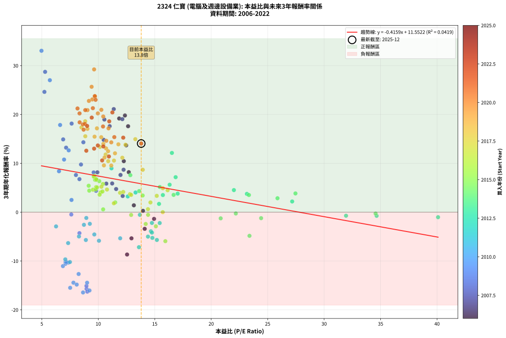
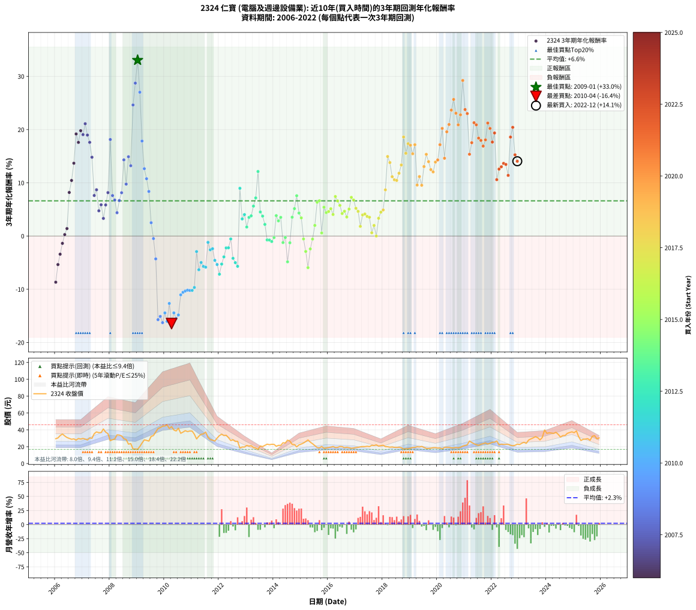

# 2324 仁寶 - 本益比與未來報酬率分析

!!! info "報告資訊"
    - **股票代號**: 2324
    - **公司名稱**: 仁寶
    - **產業別**: 電腦及週邊設備業
    - **分析期間**: 2006-2022 (204 個數據點)
    - **資料來源**: Type 12 (ShowMonthlyK_ChartFlow) 月收盤價與本益比
    - **報酬率口徑**: 含現金股利 (簡化: 年度合計，假設每年7/1入帳)
    - **報告生成時間**: 2026-01-13 00:29:58 CST

## 📈 視覺化圖表

### 圖表1: 本益比 vs 未來報酬率關係

*圖表1：2324 仁寶 本益比與3年期未來報酬率關係 (2006-2022)*

### 圖表2: 歷年買入時點的3年期實際報酬率

*圖表2：2324 仁寶 歷年買入時點的3年期實際報酬率 (2006-2022)*

## 📍 買點訊號說明

本報告提供兩種買點提示訊號（顯示於圖表2的股價子圖中）：

### ▲ 小綠色三角形（回測驗證）
- **計算方式**: 使用全部歷史資料計算本益比第25百分位數
- **用途**: 事後驗證，顯示歷史上哪些時點確實為低估區
- **限制**: 當下無法判斷，僅供回測參考
- **特性**: 後見之明（Look-Ahead Bias）

### ▲ 小橘色三角形（即時訊號）
- **計算方式**: 使用截至當月的過去5年資料計算本益比第25百分位數
- **用途**: 實際投資決策，當時即可判斷
- **優勢**: 可操作性強，符合實務需求
- **特性**: 無後見之明，滾動窗口計算

!!! tip "如何使用兩種訊號"
    - **綠色▲** 幫助理解歷史估值機會，驗證策略有效性
    - **橘色▲** 可作為實際買進參考，但仍需搭配基本面分析
    - 兩種訊號重疊時，表示即時判斷與事後驗證一致，信心度較高
    - 僅有綠色▲時，表示當時無法判斷（需要未來資料才能確認）
    - 僅有橘色▲時，表示即時判斷為買點，但事後可能不是最佳時機

## 📊 估值分析摘要

| 指標 | 數值 |
|:---:|:---:|
| **目前本益比** (2022-12) | **13.80 倍** |
| **歷史平均本益比** | 11.88 倍 |
| **估值水準** | 🟡 合理範圍 |
| **預期3年年化報酬率** | **+5.81%** |
| **歷史平均報酬率** | +6.61% |
| **相關係數 (R²)** | 0.0419 |
| **趨勢線斜率** | -0.4159 |

!!! abstract "核心洞察"
    目前本益比接近歷史平均，預期報酬率符合長期趨勢

    根據歷史數據回測，2324 仁寶 在目前本益比 **13.8倍** 的估值水準下，
    預期未來3年年化報酬率約為 **+5.8%**。

    **重要提醒**: 本分析基於歷史數據統計，實際報酬率會受到公司基本面變化、產業趨勢、
    總體經濟環境等多重因素影響。R² = 0.04 表示本益比可解釋約 4.2% 的報酬率變異。

## 📈 歷史估值統計

### 最佳買點 (最高報酬率)

| 項目 | 數值 |
|:---:|:---:|
| 起始時間 | 2009-01 |
| 當時本益比 | 4.97 倍 |
| 起始價格 | 16.9 元 |
| 3年後價格 | 33.2 元 |
| **3年年化報酬率** | **+33.05%** |

### 最差買點 (最低報酬率)

| 項目 | 數值 |
|:---:|:---:|
| 起始時間 | 2010-04 |
| 當時本益比 | 8.65 倍 |
| 起始價格 | 43.9 元 |
| 3年後價格 | 19.1 元 |
| **3年年化報酬率** | **-16.44%** |

## 🎯 投資啟示

### 本益比與報酬率關係

趨勢線方程式: **y = -0.4159x + 11.5522**

!!! note "負相關"
    本益比與未來報酬率呈現負相關。較低的本益比通常帶來較高的未來報酬率，
    但相關性不算非常強。**估值仍是重要參考指標之一**。

### 估值區間建議

基於歷史數據分析:

- **🟢 低估區** (P/E < 9.5): 預期報酬率較高，可考慮增加持股
- **🟡 合理區** (P/E 9.5-14.3): 預期報酬率符合長期趨勢，正常持有
- **🔴 高估區** (P/E > 14.3): 預期報酬率較低，可考慮減碼或觀望

!!! danger "風險提示"
    - 過去表現不代表未來結果
    - 本分析假設公司基本面無重大結構性變化
    - 產業環境劇變可能使歷史規律失效
    - 應結合公司財報、產業趨勢、總體經濟等多重因素綜合判斷

!!! success "長期投資觀點"
    歷史數據顯示，在合理或低估的估值水準買入並長期持有，
    往往能獲得較佳的投資報酬。**耐心等待好價格**是價值投資的核心原則。

## 📊 數據品質

- **資料來源**: GoodInfo.tw Type 12 (ShowMonthlyK_ChartFlow)
- **資料頻率**: 月度收盤價與本益比
- **回測期間**: 2006-2022
- **數據點數量**: 204 個 (每個點代表一次3年期回測)

### 計算方法說明

1. **3年期年化報酬率**:
   - 對每個歷史時點，計算其後3年的實際投資報酬率
   - 期末價值(不含股利): 期末價格
   - 期末價值(含現金股利): 期末價格 + 持有期間內的現金股利合計 (簡化: 年度合計，假設每年7/1入帳)
   - 公式: 年化報酬率 = [(期末價值/期初價格)^(1/年數) - 1] × 100%

2. **本益比 (P/E Ratio)**:
   - 使用當時的月收盤價與EPS計算
   - 資料來源: Type 12 月度河流圖本益比數據

3. **趨勢線 (Linear Regression)**:
   - 使用最小平方法擬合線性趨勢線
   - R²值衡量本益比對報酬率的解釋能力

---

*本報告由 Stock Analysis System v1.9.0 自動生成*
*數據更新時間: 2026-01-13 00:29:58 CST*

## 📋 月度回測明細表

（每一列對應時間線圖中的一個買入點；可用來對照 SVG 圖上的每個點。）

| 買入月份 | 賣出月份 | 回測期限_年 | 實際持有年數 | 買入本益比_倍 | 買入收盤價_元 | 賣出收盤價_元 | 現金股利合計_元 | 總報酬率_pct | 年化報酬率_pct |
| --- | --- | --- | --- | --- | --- | --- | --- | --- | --- |
| 2006-01 | 2009-01 | 3 | 3.001 | 12.55 | 29.50 | 16.90 | 5.57 | -23.83 | -8.67 |
| 2006-02 | 2009-02 | 3 | 3.001 | 12.94 | 30.40 | 20.20 | 5.57 | -15.23 | -5.36 |
| 2006-03 | 2009-03 | 3 | 3.001 | 14.11 | 33.15 | 24.30 | 5.57 | -9.90 | -3.41 |
| 2006-04 | 2009-04 | 3 | 3.001 | 14.94 | 35.10 | 28.10 | 5.57 | -4.08 | -1.38 |
| 2006-05 | 2009-05 | 3 | 3.001 | 13.96 | 32.80 | 27.50 | 5.57 | +0.82 | +0.27 |
| 2006-06 | 2009-06 | 3 | 3.001 | 13.15 | 30.90 | 26.65 | 5.57 | +4.27 | +1.40 |
| 2006-07 | 2009-07 | 3 | 3.001 | 12.70 | 29.85 | 32.20 | 5.60 | +26.63 | +8.19 |
| 2006-08 | 2009-08 | 3 | 3.001 | 12.26 | 28.80 | 33.20 | 5.60 | +34.72 | +10.44 |
| 2006-09 | 2009-09 | 3 | 3.001 | 12.47 | 29.30 | 37.45 | 5.60 | +46.93 | +13.68 |
| 2006-10 | 2009-10 | 3 | 3.001 | 11.85 | 27.85 | 41.55 | 5.60 | +69.30 | +19.18 |
| 2006-11 | 2009-11 | 3 | 3.001 | 12.64 | 29.70 | 42.70 | 5.60 | +62.63 | +17.59 |
| 2006-12 | 2009-12 | 3 | 3.001 | 12.36 | 29.05 | 44.35 | 5.60 | +71.94 | +19.80 |
| 2007-01 | 2010-01 | 3 | 3.001 | 12.13 | 29.75 | 44.60 | 5.60 | +68.74 | +19.05 |
| 2007-02 | 2010-02 | 3 | 3.001 | 11.37 | 29.05 | 46.00 | 5.60 | +77.62 | +21.10 |
| 2007-03 | 2010-03 | 3 | 3.001 | 10.54 | 28.00 | 41.55 | 5.60 | +68.39 | +18.97 |
| 2007-04 | 2010-04 | 3 | 3.001 | 11.01 | 30.40 | 43.85 | 5.60 | +62.66 | +17.60 |
| 2007-05 | 2010-05 | 3 | 3.001 | 10.48 | 30.00 | 39.80 | 5.60 | +51.33 | +14.81 |
| 2007-06 | 2010-06 | 3 | 3.001 | 11.97 | 35.50 | 38.65 | 5.60 | +24.65 | +7.62 |
| 2007-07 | 2010-07 | 3 | 3.001 | 12.24 | 37.55 | 41.95 | 6.27 | +28.41 | +8.69 |
| 2007-08 | 2010-08 | 3 | 3.001 | 11.58 | 36.70 | 35.90 | 6.27 | +14.90 | +4.74 |
| 2007-09 | 2010-09 | 3 | 3.001 | 11.23 | 36.75 | 37.35 | 6.27 | +18.69 | +5.88 |
| 2007-10 | 2010-10 | 3 | 3.001 | 12.16 | 41.05 | 39.00 | 6.27 | +10.28 | +3.31 |
| 2007-11 | 2010-11 | 3 | 3.001 | 10.71 | 37.25 | 37.90 | 6.27 | +18.57 | +5.84 |
| 2007-12 | 2010-12 | 3 | 3.001 | 9.92 | 35.50 | 38.65 | 6.27 | +26.53 | +8.16 |
| 2008-01 | 2011-01 | 3 | 3.001 | 7.64 | 27.15 | 38.50 | 6.27 | +64.89 | +18.14 |
| 2008-02 | 2011-03 | 3 | 3.080 | 8.02 | 28.30 | 29.20 | 6.27 | +25.33 | +7.61 |
| 2008-03 | 2011-03 | 3 | 2.998 | 8.33 | 29.15 | 29.20 | 6.27 | +21.67 | +6.76 |
| 2008-04 | 2011-04 | 3 | 2.998 | 9.80 | 34.05 | 32.45 | 6.27 | +13.71 | +4.38 |
| 2008-05 | 2011-05 | 3 | 2.998 | 9.81 | 33.80 | 34.75 | 6.27 | +21.36 | +6.67 |
| 2008-06 | 2011-06 | 3 | 2.998 | 9.59 | 32.80 | 35.20 | 6.27 | +26.43 | +8.14 |
| 2008-07 | 2011-07 | 3 | 2.998 | 8.68 | 29.45 | 37.40 | 6.58 | +49.33 | +14.31 |
| 2008-08 | 2011-08 | 3 | 2.998 | 8.47 | 28.50 | 31.10 | 6.58 | +32.20 | +9.76 |
| 2008-09 | 2011-09 | 3 | 2.998 | 6.89 | 23.00 | 28.30 | 6.58 | +51.64 | +14.90 |
| 2008-10 | 2011-10 | 3 | 2.998 | 7.15 | 23.70 | 27.80 | 6.58 | +45.05 | +13.21 |
| 2008-11 | 2011-11 | 3 | 2.998 | 5.23 | 17.20 | 26.70 | 6.58 | +93.47 | +24.62 |
| 2008-12 | 2011-12 | 3 | 2.998 | 5.29 | 17.25 | 30.20 | 6.58 | +113.20 | +28.73 |
| 2009-01 | 2012-01 | 3 | 2.998 | 4.97 | 16.90 | 33.20 | 6.58 | +135.37 | +33.05 |
| 2009-02 | 2012-02 | 3 | 2.998 | 5.71 | 20.20 | 34.80 | 6.58 | +104.84 | +27.02 |
| 2009-03 | 2012-03 | 3 | 3.001 | 6.62 | 24.30 | 33.20 | 6.58 | +63.69 | +17.85 |
| 2009-04 | 2012-04 | 3 | 3.001 | 7.38 | 28.10 | 33.60 | 6.58 | +42.98 | +12.65 |
| 2009-05 | 2012-05 | 3 | 3.001 | 6.97 | 27.50 | 30.80 | 6.58 | +35.92 | +10.77 |
| 2009-06 | 2012-06 | 3 | 3.001 | 6.52 | 26.65 | 27.35 | 6.58 | +27.31 | +8.38 |
| 2009-07 | 2012-07 | 3 | 3.001 | 7.63 | 32.20 | 28.20 | 6.48 | +7.69 | +2.50 |
| 2009-08 | 2012-08 | 3 | 3.001 | 7.61 | 33.20 | 26.25 | 6.48 | -1.42 | -0.48 |
| 2009-09 | 2012-09 | 3 | 3.001 | 8.33 | 37.45 | 26.35 | 6.48 | -12.34 | -4.30 |
| 2009-10 | 2012-10 | 3 | 3.001 | 8.96 | 41.55 | 18.40 | 6.48 | -40.13 | -15.71 |
| 2009-11 | 2012-11 | 3 | 3.001 | 8.95 | 42.70 | 19.65 | 6.48 | -38.81 | -15.10 |
| 2009-12 | 2012-12 | 3 | 3.001 | 9.03 | 44.35 | 19.55 | 6.48 | -41.31 | -16.27 |
| 2010-01 | 2013-01 | 3 | 3.001 | 9.01 | 44.60 | 21.45 | 6.48 | -37.38 | -14.45 |
| 2010-02 | 2013-02 | 3 | 3.001 | 9.22 | 46.00 | 20.75 | 6.48 | -40.81 | -16.04 |
| 2010-03 | 2013-03 | 3 | 3.001 | 8.26 | 41.55 | 21.20 | 6.48 | -33.39 | -12.66 |
| 2010-04 | 2013-04 | 3 | 3.001 | 8.65 | 43.85 | 19.10 | 6.48 | -41.67 | -16.44 |
| 2010-05 | 2013-05 | 3 | 3.001 | 7.80 | 39.80 | 18.45 | 6.48 | -37.37 | -14.44 |
| 2010-06 | 2013-06 | 3 | 3.001 | 7.51 | 38.65 | 16.85 | 6.48 | -39.65 | -15.49 |
| 2010-07 | 2013-07 | 3 | 3.001 | 8.09 | 41.95 | 20.80 | 5.12 | -38.22 | -14.83 |
| 2010-08 | 2013-08 | 3 | 3.001 | 6.87 | 35.90 | 20.15 | 5.12 | -29.62 | -11.05 |
| 2010-09 | 2013-09 | 3 | 3.001 | 7.10 | 37.35 | 21.60 | 5.12 | -28.47 | -10.57 |
| 2010-10 | 2013-10 | 3 | 3.001 | 7.36 | 39.00 | 23.00 | 5.12 | -27.91 | -10.33 |
| 2010-11 | 2013-11 | 3 | 3.001 | 7.10 | 37.90 | 22.35 | 5.12 | -27.53 | -10.18 |
| 2010-12 | 2013-12 | 3 | 3.001 | 7.18 | 38.65 | 22.85 | 5.12 | -27.64 | -10.22 |
| 2011-01 | 2014-01 | 3 | 3.001 | 7.49 | 38.50 | 22.75 | 5.12 | -27.62 | -10.21 |
| 2011-02 | 2014-02 | 3 | 3.001 | 7.08 | 34.75 | 20.50 | 5.12 | -26.28 | -9.66 |
| 2011-03 | 2014-03 | 3 | 3.001 | 6.26 | 29.20 | 21.60 | 5.12 | -8.51 | -2.92 |
| 2011-04 | 2014-04 | 3 | 3.001 | 7.33 | 32.45 | 21.55 | 5.12 | -17.82 | -6.33 |
| 2011-05 | 2014-05 | 3 | 3.001 | 8.29 | 34.75 | 24.70 | 5.12 | -14.20 | -4.98 |
| 2011-06 | 2014-06 | 3 | 3.001 | 8.90 | 35.20 | 24.40 | 5.12 | -16.15 | -5.70 |
| 2011-07 | 2014-07 | 3 | 3.001 | 10.06 | 37.40 | 27.80 | 3.41 | -16.56 | -5.86 |
| 2011-08 | 2014-08 | 3 | 3.001 | 8.94 | 31.10 | 26.60 | 3.41 | -3.52 | -1.19 |
| 2011-09 | 2014-09 | 3 | 3.001 | 8.73 | 28.30 | 22.75 | 3.41 | -7.58 | -2.59 |
| 2011-10 | 2014-10 | 3 | 3.001 | 9.25 | 27.80 | 22.45 | 3.41 | -6.99 | -2.39 |
| 2011-11 | 2014-11 | 3 | 3.001 | 9.65 | 26.70 | 19.80 | 3.41 | -13.09 | -4.57 |
| 2011-12 | 2014-12 | 3 | 3.001 | 11.94 | 30.20 | 22.20 | 3.41 | -15.21 | -5.35 |
| 2012-01 | 2015-01 | 3 | 3.001 | 13.60 | 33.20 | 23.15 | 3.41 | -20.01 | -7.17 |
| 2012-02 | 2015-03 | 3 | 3.080 | 14.79 | 34.80 | 26.05 | 3.41 | -15.36 | -5.27 |
| 2012-03 | 2015-03 | 3 | 2.998 | 14.66 | 33.20 | 26.05 | 3.41 | -11.28 | -3.91 |
| 2012-04 | 2015-04 | 3 | 2.998 | 15.44 | 33.60 | 28.00 | 3.41 | -6.53 | -2.23 |
| 2012-05 | 2015-05 | 3 | 2.998 | 14.75 | 30.80 | 25.40 | 3.41 | -6.47 | -2.21 |
| 2012-06 | 2015-06 | 3 | 2.998 | 13.68 | 27.35 | 23.50 | 3.41 | -1.62 | -0.54 |
| 2012-07 | 2015-07 | 3 | 2.998 | 14.75 | 28.20 | 21.30 | 3.51 | -12.04 | -4.19 |
| 2012-08 | 2015-08 | 3 | 2.998 | 14.40 | 26.25 | 19.00 | 3.51 | -14.26 | -5.00 |
| 2012-09 | 2015-09 | 3 | 2.998 | 15.19 | 26.35 | 18.60 | 3.51 | -16.11 | -5.69 |
| 2012-10 | 2015-10 | 3 | 2.998 | 11.17 | 18.40 | 20.30 | 3.51 | +29.38 | +8.97 |
| 2012-11 | 2015-11 | 3 | 2.998 | 12.61 | 19.65 | 18.10 | 3.51 | +9.95 | +3.22 |
| 2012-12 | 2015-12 | 3 | 2.998 | 13.30 | 19.55 | 18.50 | 3.51 | +12.56 | +4.03 |
| 2013-01 | 2016-01 | 3 | 2.998 | 15.38 | 21.45 | 19.05 | 3.51 | +5.16 | +1.69 |
| 2013-02 | 2016-02 | 3 | 2.998 | 15.72 | 20.75 | 19.50 | 3.51 | +10.87 | +3.50 |
| 2013-03 | 2016-03 | 3 | 3.001 | 17.03 | 21.20 | 20.20 | 3.51 | +11.82 | +3.79 |
| 2013-04 | 2016-04 | 3 | 3.001 | 16.32 | 19.10 | 19.00 | 3.51 | +17.83 | +5.62 |
| 2013-05 | 2016-05 | 3 | 3.001 | 16.85 | 18.45 | 19.20 | 3.51 | +23.07 | +7.16 |
| 2013-06 | 2016-06 | 3 | 3.001 | 16.52 | 16.85 | 20.25 | 3.51 | +40.99 | +12.13 |
| 2013-07 | 2016-07 | 3 | 3.001 | 22.01 | 20.80 | 20.05 | 3.70 | +14.18 | +4.52 |
| 2013-08 | 2016-08 | 3 | 3.001 | 23.16 | 20.15 | 18.80 | 3.70 | +11.66 | +3.74 |
| 2013-09 | 2016-09 | 3 | 3.001 | 27.17 | 21.60 | 19.35 | 3.70 | +6.71 | +2.19 |
| 2013-10 | 2016-10 | 3 | 3.001 | 31.94 | 23.00 | 18.80 | 3.70 | -2.17 | -0.73 |
| 2013-11 | 2016-11 | 3 | 3.001 | 34.65 | 22.35 | 18.15 | 3.70 | -2.24 | -0.75 |
| 2013-12 | 2016-12 | 3 | 3.001 | 40.09 | 22.85 | 18.45 | 3.70 | -3.06 | -1.03 |
| 2014-01 | 2017-01 | 3 | 3.001 | 34.56 | 22.75 | 18.85 | 3.70 | -0.88 | -0.29 |
| 2014-02 | 2017-02 | 3 | 3.001 | 27.46 | 20.50 | 19.25 | 3.70 | +11.95 | +3.83 |
| 2014-03 | 2017-03 | 3 | 3.001 | 25.87 | 21.60 | 19.80 | 3.70 | +8.80 | +2.85 |
| 2014-04 | 2017-04 | 3 | 3.001 | 23.34 | 21.55 | 20.20 | 3.70 | +10.90 | +3.51 |
| 2014-05 | 2017-05 | 3 | 3.001 | 24.42 | 24.70 | 20.10 | 3.70 | -3.64 | -1.23 |
| 2014-06 | 2017-06 | 3 | 3.001 | 22.18 | 24.40 | 20.50 | 3.70 | -0.82 | -0.27 |
| 2014-07 | 2017-07 | 3 | 3.001 | 23.39 | 27.80 | 20.05 | 3.90 | -13.85 | -4.85 |
| 2014-08 | 2017-08 | 3 | 3.001 | 20.84 | 26.60 | 21.70 | 3.90 | -3.76 | -1.27 |
| 2014-09 | 2017-09 | 3 | 3.001 | 16.67 | 22.75 | 21.35 | 3.90 | +10.99 | +3.54 |
| 2014-10 | 2017-10 | 3 | 3.001 | 15.45 | 22.45 | 22.20 | 3.90 | +16.26 | +5.15 |
| 2014-11 | 2017-11 | 3 | 3.001 | 12.84 | 19.80 | 20.75 | 3.90 | +24.50 | +7.58 |
| 2014-12 | 2017-12 | 3 | 3.001 | 13.62 | 22.20 | 21.30 | 3.90 | +13.52 | +4.32 |
| 2015-01 | 2018-01 | 3 | 3.001 | 13.93 | 23.15 | 21.70 | 3.90 | +10.59 | +3.41 |
| 2015-02 | 2018-02 | 3 | 3.001 | 14.41 | 24.40 | 20.10 | 3.90 | -1.64 | -0.55 |
| 2015-03 | 2018-03 | 3 | 3.001 | 15.10 | 26.05 | 19.95 | 3.90 | -8.44 | -2.90 |
| 2015-04 | 2018-04 | 3 | 3.001 | 15.94 | 28.00 | 19.40 | 3.90 | -16.78 | -5.94 |
| 2015-05 | 2018-05 | 3 | 3.001 | 14.20 | 25.40 | 19.70 | 3.90 | -7.08 | -2.42 |
| 2015-06 | 2018-06 | 3 | 3.001 | 12.91 | 23.50 | 19.20 | 3.90 | -1.70 | -0.57 |
| 2015-07 | 2018-07 | 3 | 3.001 | 11.50 | 21.30 | 19.00 | 3.60 | +6.11 | +2.00 |
| 2015-08 | 2018-08 | 3 | 3.001 | 10.09 | 19.00 | 19.25 | 3.60 | +20.27 | +6.34 |
| 2015-09 | 2018-09 | 3 | 3.001 | 9.71 | 18.60 | 18.95 | 3.60 | +21.24 | +6.63 |
| 2015-10 | 2018-10 | 3 | 3.001 | 10.43 | 20.30 | 17.05 | 3.60 | +1.73 | +0.57 |
| 2015-11 | 2018-11 | 3 | 3.001 | 9.15 | 18.10 | 17.60 | 3.60 | +17.13 | +5.41 |
| 2015-12 | 2018-12 | 3 | 3.001 | 9.20 | 18.50 | 17.45 | 3.60 | +13.79 | +4.40 |
| 2016-01 | 2019-01 | 3 | 3.001 | 9.53 | 19.05 | 18.20 | 3.60 | +14.44 | +4.60 |
| 2016-02 | 2019-03 | 3 | 3.080 | 9.81 | 19.50 | 19.15 | 3.60 | +16.67 | +5.13 |
| 2016-03 | 2019-03 | 3 | 2.998 | 10.21 | 20.20 | 19.15 | 3.60 | +12.63 | +4.05 |
| 2016-04 | 2019-04 | 3 | 2.998 | 9.66 | 19.00 | 19.95 | 3.60 | +23.95 | +7.43 |
| 2016-05 | 2019-05 | 3 | 2.998 | 9.82 | 19.20 | 19.65 | 3.60 | +21.10 | +6.59 |
| 2016-06 | 2019-06 | 3 | 2.998 | 10.41 | 20.25 | 20.35 | 3.60 | +18.28 | +5.76 |
| 2016-07 | 2019-07 | 3 | 2.998 | 10.37 | 20.05 | 19.10 | 3.60 | +13.22 | +4.23 |
| 2016-08 | 2019-08 | 3 | 2.998 | 9.77 | 18.80 | 17.95 | 3.60 | +14.63 | +4.66 |
| 2016-09 | 2019-09 | 3 | 2.998 | 10.12 | 19.35 | 17.90 | 3.60 | +11.11 | +3.58 |
| 2016-10 | 2019-10 | 3 | 2.998 | 9.89 | 18.80 | 18.20 | 3.60 | +15.96 | +5.06 |
| 2016-11 | 2019-11 | 3 | 2.998 | 9.60 | 18.15 | 18.80 | 3.60 | +23.42 | +7.27 |
| 2016-12 | 2019-12 | 3 | 2.998 | 9.81 | 18.45 | 18.85 | 3.60 | +21.68 | +6.76 |
| 2017-01 | 2020-01 | 3 | 2.998 | 10.28 | 18.85 | 18.35 | 3.60 | +16.45 | +5.21 |
| 2017-02 | 2020-02 | 3 | 2.998 | 10.77 | 19.25 | 18.45 | 3.60 | +14.55 | +4.63 |
| 2017-03 | 2020-03 | 3 | 3.001 | 11.38 | 19.80 | 17.30 | 3.60 | +5.56 | +1.82 |
| 2017-04 | 2020-04 | 3 | 3.001 | 11.93 | 20.20 | 19.10 | 3.60 | +12.38 | +3.97 |
| 2017-05 | 2020-05 | 3 | 3.001 | 12.21 | 20.10 | 19.10 | 3.60 | +12.94 | +4.14 |
| 2017-06 | 2020-06 | 3 | 3.001 | 12.81 | 20.50 | 19.25 | 3.60 | +11.46 | +3.68 |
| 2017-07 | 2020-07 | 3 | 3.001 | 12.91 | 20.05 | 18.65 | 3.60 | +10.97 | +3.53 |
| 2017-08 | 2020-08 | 3 | 3.001 | 14.40 | 21.70 | 18.50 | 3.60 | +1.84 | +0.61 |
| 2017-09 | 2020-09 | 3 | 3.001 | 14.62 | 21.35 | 19.05 | 3.60 | +6.09 | +1.99 |
| 2017-10 | 2020-10 | 3 | 3.001 | 15.71 | 22.20 | 18.60 | 3.60 | +0.00 | +0.00 |
| 2017-11 | 2020-11 | 3 | 3.001 | 15.18 | 20.75 | 19.30 | 3.60 | +10.36 | +3.34 |
| 2017-12 | 2020-12 | 3 | 3.001 | 16.14 | 21.30 | 20.70 | 3.60 | +14.08 | +4.49 |
| 2018-01 | 2021-01 | 3 | 3.001 | 15.72 | 21.70 | 21.45 | 3.60 | +15.44 | +4.90 |
| 2018-02 | 2021-02 | 3 | 3.001 | 13.94 | 20.10 | 22.20 | 3.60 | +28.36 | +8.68 |
| 2018-03 | 2021-03 | 3 | 3.001 | 13.28 | 19.95 | 26.70 | 3.60 | +51.88 | +14.94 |
| 2018-04 | 2021-04 | 3 | 3.001 | 12.41 | 19.40 | 25.00 | 3.60 | +47.42 | +13.81 |
| 2018-05 | 2021-05 | 3 | 3.001 | 12.13 | 19.70 | 23.45 | 3.60 | +37.31 | +11.14 |
| 2018-06 | 2021-06 | 3 | 3.001 | 11.39 | 19.20 | 22.35 | 3.60 | +35.16 | +10.56 |
| 2018-07 | 2021-07 | 3 | 3.001 | 10.88 | 19.00 | 21.60 | 4.00 | +34.74 | +10.45 |
| 2018-08 | 2021-08 | 3 | 3.001 | 10.65 | 19.25 | 22.90 | 4.00 | +39.74 | +11.80 |
| 2018-09 | 2021-09 | 3 | 3.001 | 10.15 | 18.95 | 23.60 | 4.00 | +45.65 | +13.35 |
| 2018-10 | 2021-10 | 3 | 3.001 | 8.84 | 17.05 | 24.45 | 4.00 | +66.86 | +18.60 |
| 2018-11 | 2021-11 | 3 | 3.001 | 8.85 | 17.60 | 23.15 | 4.00 | +54.26 | +15.54 |
| 2018-12 | 2021-12 | 3 | 3.001 | 8.51 | 17.45 | 24.20 | 4.00 | +61.60 | +17.35 |
| 2019-01 | 2022-01 | 3 | 3.001 | 9.04 | 18.20 | 25.20 | 4.00 | +60.44 | +17.06 |
| 2019-02 | 2022-02 | 3 | 3.001 | 9.67 | 19.10 | 25.40 | 4.00 | +53.93 | +15.46 |
| 2019-03 | 2022-03 | 3 | 3.001 | 9.88 | 19.15 | 26.80 | 4.00 | +60.84 | +17.16 |
| 2019-04 | 2022-04 | 3 | 3.001 | 10.50 | 19.95 | 22.25 | 4.00 | +31.58 | +9.58 |
| 2019-05 | 2022-05 | 3 | 3.001 | 10.55 | 19.65 | 23.00 | 4.00 | +37.40 | +11.17 |
| 2019-06 | 2022-06 | 3 | 3.001 | 11.15 | 20.35 | 22.75 | 4.00 | +31.45 | +9.54 |
| 2019-07 | 2022-07 | 3 | 3.001 | 10.69 | 19.10 | 22.80 | 4.80 | +44.50 | +13.05 |
| 2019-08 | 2022-08 | 3 | 3.001 | 10.26 | 17.95 | 22.75 | 4.80 | +53.48 | +15.35 |
| 2019-09 | 2022-09 | 3 | 3.001 | 10.45 | 17.90 | 21.70 | 4.80 | +48.04 | +13.97 |
| 2019-10 | 2022-10 | 3 | 3.001 | 10.87 | 18.20 | 21.10 | 4.80 | +42.31 | +12.48 |
| 2019-11 | 2022-11 | 3 | 3.001 | 11.48 | 18.80 | 21.65 | 4.80 | +40.69 | +12.05 |
| 2019-12 | 2022-12 | 3 | 3.001 | 11.78 | 18.85 | 23.05 | 4.80 | +47.75 | +13.89 |
| 2020-01 | 2023-01 | 3 | 3.001 | 11.15 | 18.35 | 22.60 | 4.80 | +49.32 | +14.29 |
| 2020-02 | 2023-03 | 3 | 3.080 | 10.91 | 18.45 | 25.25 | 4.80 | +62.87 | +17.16 |
| 2020-03 | 2023-03 | 3 | 2.998 | 9.96 | 17.30 | 25.25 | 4.80 | +73.70 | +20.22 |
| 2020-04 | 2023-04 | 3 | 2.998 | 10.71 | 19.10 | 23.95 | 4.80 | +50.52 | +14.62 |
| 2020-05 | 2023-05 | 3 | 2.998 | 10.44 | 19.10 | 27.85 | 4.80 | +70.94 | +19.58 |
| 2020-06 | 2023-06 | 3 | 2.998 | 10.27 | 19.25 | 29.25 | 4.80 | +76.88 | +20.95 |
| 2020-07 | 2023-07 | 3 | 2.998 | 9.71 | 18.65 | 30.45 | 4.80 | +89.01 | +23.66 |
| 2020-08 | 2023-08 | 3 | 2.998 | 9.41 | 18.50 | 31.90 | 4.80 | +98.38 | +25.67 |
| 2020-09 | 2023-09 | 3 | 2.998 | 9.47 | 19.05 | 30.70 | 4.80 | +86.35 | +23.08 |
| 2020-10 | 2023-10 | 3 | 2.998 | 9.04 | 18.60 | 28.05 | 4.80 | +76.61 | +20.89 |
| 2020-11 | 2023-11 | 3 | 2.998 | 9.17 | 19.30 | 30.90 | 4.80 | +84.97 | +22.77 |
| 2020-12 | 2023-12 | 3 | 2.998 | 9.63 | 20.70 | 39.85 | 4.80 | +115.70 | +29.23 |
| 2021-01 | 2024-01 | 3 | 2.998 | 9.69 | 21.45 | 35.85 | 4.80 | +89.51 | +23.77 |
| 2021-02 | 2024-02 | 3 | 2.998 | 9.76 | 22.20 | 36.50 | 4.80 | +86.04 | +23.01 |
| 2021-03 | 2024-03 | 3 | 3.001 | 11.42 | 26.70 | 36.20 | 4.80 | +53.56 | +15.37 |
| 2021-04 | 2024-04 | 3 | 3.001 | 10.42 | 25.00 | 35.80 | 4.80 | +62.40 | +17.54 |
| 2021-05 | 2024-05 | 3 | 3.001 | 9.52 | 23.45 | 37.05 | 4.80 | +78.46 | +21.29 |
| 2021-06 | 2024-06 | 3 | 3.001 | 8.85 | 22.35 | 34.70 | 4.80 | +76.73 | +20.90 |
| 2021-07 | 2024-07 | 3 | 3.001 | 8.35 | 21.60 | 31.45 | 4.40 | +65.97 | +18.39 |
| 2021-08 | 2024-08 | 3 | 3.001 | 8.64 | 22.90 | 33.20 | 4.40 | +64.19 | +17.97 |
| 2021-09 | 2024-09 | 3 | 3.001 | 8.70 | 23.60 | 33.30 | 4.40 | +59.75 | +16.89 |
| 2021-10 | 2024-10 | 3 | 3.001 | 8.81 | 24.45 | 35.85 | 4.40 | +64.62 | +18.07 |
| 2021-11 | 2024-11 | 3 | 3.001 | 8.16 | 23.15 | 36.85 | 4.40 | +78.19 | +21.23 |
| 2021-12 | 2024-12 | 3 | 3.001 | 8.34 | 24.20 | 37.65 | 4.40 | +73.76 | +20.22 |
| 2022-01 | 2025-01 | 3 | 3.001 | 9.01 | 25.20 | 36.65 | 4.40 | +62.90 | +17.66 |
| 2022-02 | 2025-02 | 3 | 3.001 | 9.42 | 25.40 | 38.80 | 4.40 | +70.08 | +19.36 |
| 2022-03 | 2025-03 | 3 | 3.001 | 10.34 | 26.80 | 31.85 | 4.40 | +35.26 | +10.59 |
| 2022-04 | 2025-04 | 3 | 3.001 | 8.94 | 22.25 | 27.35 | 4.40 | +42.70 | +12.58 |
| 2022-05 | 2025-05 | 3 | 3.001 | 9.63 | 23.00 | 28.80 | 4.40 | +44.35 | +13.01 |
| 2022-06 | 2025-06 | 3 | 3.001 | 9.96 | 22.75 | 29.00 | 4.40 | +46.81 | +13.65 |
| 2022-07 | 2025-07 | 3 | 3.001 | 10.45 | 22.80 | 29.50 | 3.80 | +46.05 | +13.46 |
| 2022-08 | 2025-08 | 3 | 3.001 | 10.94 | 22.75 | 27.65 | 3.80 | +38.24 | +11.40 |
| 2022-09 | 2025-09 | 3 | 3.001 | 10.97 | 21.70 | 32.40 | 3.80 | +66.82 | +18.59 |
| 2022-10 | 2025-10 | 3 | 3.001 | 11.25 | 21.10 | 33.05 | 3.80 | +74.64 | +20.42 |
| 2022-11 | 2025-11 | 3 | 3.001 | 12.21 | 21.65 | 29.35 | 3.80 | +53.12 | +15.26 |
| 2022-12 | 2025-12 | 3 | 3.001 | 13.80 | 23.05 | 30.40 | 3.80 | +48.37 | +14.05 |
