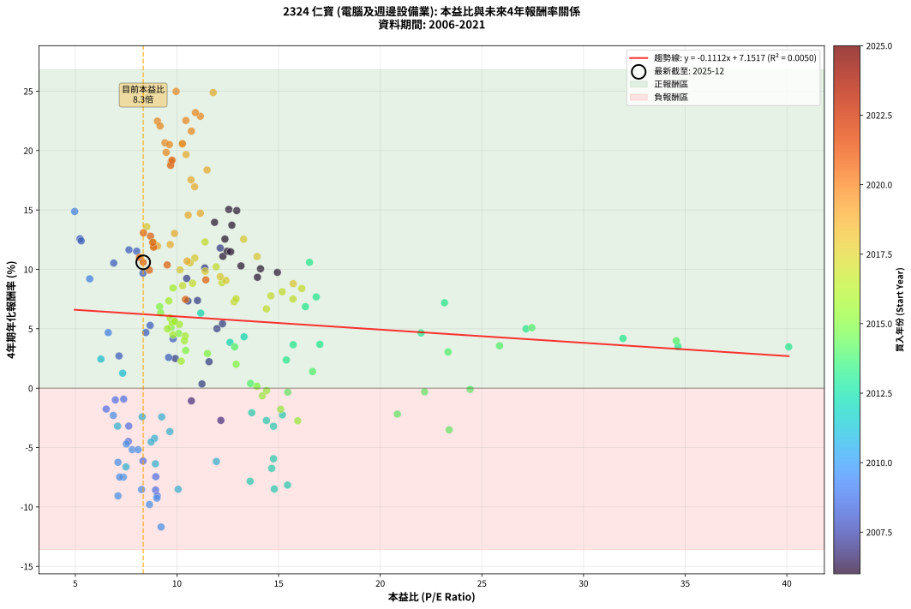
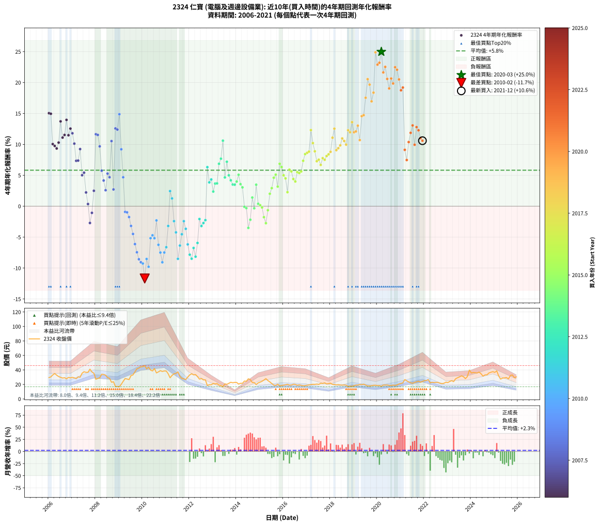

# 2324 仁寶 - 本益比與未來報酬率分析

!!! info "報告資訊"
    - **股票代號**: 2324
    - **公司名稱**: 仁寶
    - **產業別**: 電腦及週邊設備業
    - **分析期間**: 2006-2021 (192 個數據點)
    - **資料來源**: Type 12 (ShowMonthlyK_ChartFlow) 月收盤價與本益比
    - **報酬率口徑**: 含現金股利 (簡化: 年度合計，假設每年7/1入帳)
    - **報告生成時間**: 2026-01-04 08:24:16 CST

## 📈 視覺化圖表

### 圖表1: 本益比 vs 未來報酬率關係

*圖表1：2324 仁寶 本益比與4年期未來報酬率關係 (2006-2021)*

### 圖表2: 歷年買入時點的4年期實際報酬率

*圖表2：2324 仁寶 歷年買入時點的4年期實際報酬率 (2006-2021)*

## 📍 買點訊號說明

本報告提供兩種買點提示訊號（顯示於圖表2的股價子圖中）：

### ▲ 小綠色三角形（回測驗證）
- **計算方式**: 使用全部歷史資料計算本益比第25百分位數
- **用途**: 事後驗證，顯示歷史上哪些時點確實為低估區
- **限制**: 當下無法判斷，僅供回測參考
- **特性**: 後見之明（Look-Ahead Bias）

### ▲ 小橘色三角形（即時訊號）
- **計算方式**: 使用截至當月的過去5年資料計算本益比第25百分位數
- **用途**: 實際投資決策，當時即可判斷
- **優勢**: 可操作性強，符合實務需求
- **特性**: 無後見之明，滾動窗口計算

!!! tip "如何使用兩種訊號"
    - **綠色▲** 幫助理解歷史估值機會，驗證策略有效性
    - **橘色▲** 可作為實際買進參考，但仍需搭配基本面分析
    - 兩種訊號重疊時，表示即時判斷與事後驗證一致，信心度較高
    - 僅有綠色▲時，表示當時無法判斷（需要未來資料才能確認）
    - 僅有橘色▲時，表示即時判斷為買點，但事後可能不是最佳時機

## 📊 估值分析摘要

| 指標 | 數值 |
|:---:|:---:|
| **目前本益比** (2021-12) | **8.34 倍** |
| **歷史平均本益比** | 11.96 倍 |
| **估值水準** | 🟢 相對低估 |
| **預期4年年化報酬率** | **+6.22%** |
| **歷史平均報酬率** | +5.82% |
| **相關係數 (R²)** | 0.0050 |
| **趨勢線斜率** | -0.1112 |

!!! abstract "核心洞察"
    目前本益比顯著低於歷史平均，預期未來報酬率可能較高

    根據歷史數據回測，2324 仁寶 在目前本益比 **8.3倍** 的估值水準下，
    預期未來4年年化報酬率約為 **+6.2%**。

    **重要提醒**: 本分析基於歷史數據統計，實際報酬率會受到公司基本面變化、產業趨勢、
    總體經濟環境等多重因素影響。R² = 0.01 表示本益比可解釋約 0.5% 的報酬率變異。

## 📈 歷史估值統計

### 最佳買點 (最高報酬率)

| 項目 | 數值 |
|:---:|:---:|
| 起始時間 | 2020-03 |
| 當時本益比 | 9.96 倍 |
| 起始價格 | 17.3 元 |
| 4年後價格 | 36.2 元 |
| **4年年化報酬率** | **+24.97%** |

### 最差買點 (最低報酬率)

| 項目 | 數值 |
|:---:|:---:|
| 起始時間 | 2010-02 |
| 當時本益比 | 9.22 倍 |
| 起始價格 | 46.0 元 |
| 4年後價格 | 20.5 元 |
| **4年年化報酬率** | **-11.68%** |

## 🎯 投資啟示

### 本益比與報酬率關係

趨勢線方程式: **y = -0.1112x + 7.1517**

!!! note "負相關"
    本益比與未來報酬率呈現負相關。較低的本益比通常帶來較高的未來報酬率，
    但相關性不算非常強。**估值仍是重要參考指標之一**。

### 估值區間建議

基於歷史數據分析:

- **🟢 低估區** (P/E < 9.6): 預期報酬率較高，可考慮增加持股
- **🟡 合理區** (P/E 9.6-14.4): 預期報酬率符合長期趨勢，正常持有
- **🔴 高估區** (P/E > 14.4): 預期報酬率較低，可考慮減碼或觀望

!!! danger "風險提示"
    - 過去表現不代表未來結果
    - 本分析假設公司基本面無重大結構性變化
    - 產業環境劇變可能使歷史規律失效
    - 應結合公司財報、產業趨勢、總體經濟等多重因素綜合判斷

!!! success "長期投資觀點"
    歷史數據顯示，在合理或低估的估值水準買入並長期持有，
    往往能獲得較佳的投資報酬。**耐心等待好價格**是價值投資的核心原則。

## 📊 數據品質

- **資料來源**: GoodInfo.tw Type 12 (ShowMonthlyK_ChartFlow)
- **資料頻率**: 月度收盤價與本益比
- **回測期間**: 2006-2021
- **數據點數量**: 192 個 (每個點代表一次4年期回測)

### 計算方法說明

1. **4年期年化報酬率**:
   - 對每個歷史時點，計算其後4年的實際投資報酬率
   - 期末價值(不含股利): 期末價格
   - 期末價值(含現金股利): 期末價格 + 持有期間內的現金股利合計 (簡化: 年度合計，假設每年7/1入帳)
   - 公式: 年化報酬率 = [(期末價值/期初價格)^(1/年數) - 1] × 100%

2. **本益比 (P/E Ratio)**:
   - 使用當時的月收盤價與EPS計算
   - 資料來源: Type 12 月度河流圖本益比數據

3. **趨勢線 (Linear Regression)**:
   - 使用最小平方法擬合線性趨勢線
   - R²值衡量本益比對報酬率的解釋能力

---

*本報告由 Stock Analysis System v1.9.0 自動生成*
*數據更新時間: 2026-01-04 08:24:16 CST*

## 📋 月度回測明細表

（每一列對應時間線圖中的一個買入點；可用來對照 SVG 圖上的每個點。）

| 買入月份 | 賣出月份 | 回測期限_年 | 實際持有年數 | 買入本益比_倍 | 買入收盤價_元 | 賣出收盤價_元 | 現金股利合計_元 | 總報酬率_pct | 年化報酬率_pct |
| --- | --- | --- | --- | --- | --- | --- | --- | --- | --- |
| 2006-01 | 2010-01 | 4 | 4.000 | 12.55 | 29.50 | 44.60 | 7.07 | +75.15 | +15.04 |
| 2006-02 | 2010-02 | 4 | 4.000 | 12.94 | 30.40 | 46.00 | 7.07 | +74.57 | +14.95 |
| 2006-03 | 2010-03 | 4 | 4.000 | 14.11 | 33.15 | 41.55 | 7.07 | +46.66 | +10.05 |
| 2006-04 | 2010-04 | 4 | 4.000 | 14.94 | 35.10 | 43.85 | 7.07 | +45.07 | +9.75 |
| 2006-05 | 2010-05 | 4 | 4.000 | 13.96 | 32.80 | 39.80 | 7.07 | +42.89 | +9.33 |
| 2006-06 | 2010-06 | 4 | 4.000 | 13.15 | 30.90 | 38.65 | 7.07 | +47.96 | +10.29 |
| 2006-07 | 2010-07 | 4 | 4.000 | 12.70 | 29.85 | 41.95 | 7.97 | +67.23 | +13.72 |
| 2006-08 | 2010-08 | 4 | 4.000 | 12.26 | 28.80 | 35.90 | 7.97 | +52.32 | +11.09 |
| 2006-09 | 2010-09 | 4 | 4.000 | 12.47 | 29.30 | 37.35 | 7.97 | +54.67 | +11.52 |
| 2006-10 | 2010-10 | 4 | 4.000 | 11.85 | 27.85 | 39.00 | 7.97 | +68.65 | +13.96 |
| 2006-11 | 2010-11 | 4 | 4.000 | 12.64 | 29.70 | 37.90 | 7.97 | +54.44 | +11.48 |
| 2006-12 | 2010-12 | 4 | 4.000 | 12.36 | 29.05 | 38.65 | 7.97 | +60.48 | +12.55 |
| 2007-01 | 2011-01 | 4 | 4.000 | 12.13 | 29.75 | 38.50 | 7.97 | +56.19 | +11.79 |
| 2007-02 | 2011-02 | 4 | 4.000 | 11.37 | 29.05 | 34.75 | 7.97 | +47.05 | +10.12 |
| 2007-03 | 2011-03 | 4 | 4.000 | 10.54 | 28.00 | 29.20 | 7.97 | +32.74 | +7.34 |
| 2007-04 | 2011-04 | 4 | 4.000 | 11.01 | 30.40 | 32.45 | 7.97 | +32.95 | +7.38 |
| 2007-05 | 2011-05 | 4 | 4.000 | 10.48 | 30.00 | 34.75 | 7.97 | +42.39 | +9.24 |
| 2007-06 | 2011-06 | 4 | 4.000 | 11.97 | 35.50 | 35.20 | 7.97 | +21.60 | +5.01 |
| 2007-07 | 2011-07 | 4 | 4.000 | 12.24 | 37.55 | 37.40 | 8.98 | +23.51 | +5.42 |
| 2007-08 | 2011-08 | 4 | 4.000 | 11.58 | 36.70 | 31.10 | 8.98 | +9.20 | +2.23 |
| 2007-09 | 2011-09 | 4 | 4.000 | 11.23 | 36.75 | 28.30 | 8.98 | +1.43 | +0.36 |
| 2007-10 | 2011-10 | 4 | 4.000 | 12.16 | 41.05 | 27.80 | 8.98 | -10.41 | -2.71 |
| 2007-11 | 2011-11 | 4 | 4.000 | 10.71 | 37.25 | 26.70 | 8.98 | -4.22 | -1.07 |
| 2007-12 | 2011-12 | 4 | 4.000 | 9.92 | 35.50 | 30.20 | 8.98 | +10.36 | +2.49 |
| 2008-01 | 2012-01 | 4 | 4.000 | 7.64 | 27.15 | 33.20 | 8.98 | +55.35 | +11.64 |
| 2008-02 | 2012-02 | 4 | 4.000 | 8.02 | 28.30 | 34.80 | 8.98 | +54.69 | +11.52 |
| 2008-03 | 2012-03 | 4 | 4.000 | 8.33 | 29.15 | 33.20 | 8.98 | +44.69 | +9.68 |
| 2008-04 | 2012-04 | 4 | 4.000 | 9.80 | 34.05 | 33.60 | 8.98 | +25.04 | +5.75 |
| 2008-05 | 2012-05 | 4 | 4.000 | 9.81 | 33.80 | 30.80 | 8.98 | +17.68 | +4.15 |
| 2008-06 | 2012-06 | 4 | 4.000 | 9.59 | 32.80 | 27.35 | 8.98 | +10.75 | +2.59 |
| 2008-07 | 2012-07 | 4 | 4.000 | 8.68 | 29.45 | 28.20 | 7.98 | +22.84 | +5.28 |
| 2008-08 | 2012-08 | 4 | 4.000 | 8.47 | 28.50 | 26.25 | 7.98 | +20.09 | +4.68 |
| 2008-09 | 2012-09 | 4 | 4.000 | 6.89 | 23.00 | 26.35 | 7.98 | +49.25 | +10.53 |
| 2008-10 | 2012-10 | 4 | 4.000 | 7.15 | 23.70 | 18.40 | 7.98 | +11.30 | +2.71 |
| 2008-11 | 2012-11 | 4 | 4.000 | 5.23 | 17.20 | 19.65 | 7.98 | +60.62 | +12.58 |
| 2008-12 | 2012-12 | 4 | 4.000 | 5.29 | 17.25 | 19.55 | 7.98 | +59.58 | +12.39 |
| 2009-01 | 2013-01 | 4 | 4.000 | 4.97 | 16.90 | 21.45 | 7.98 | +74.12 | +14.87 |
| 2009-02 | 2013-02 | 4 | 4.000 | 5.71 | 20.20 | 20.75 | 7.98 | +42.21 | +9.20 |
| 2009-03 | 2013-03 | 4 | 4.000 | 6.62 | 24.30 | 21.20 | 7.98 | +20.07 | +4.68 |
| 2009-04 | 2013-04 | 4 | 4.000 | 7.38 | 28.10 | 19.10 | 7.98 | -3.64 | -0.92 |
| 2009-05 | 2013-05 | 4 | 4.000 | 6.97 | 27.50 | 18.45 | 7.98 | -3.90 | -0.99 |
| 2009-06 | 2013-06 | 4 | 4.000 | 6.52 | 26.65 | 16.85 | 7.98 | -6.84 | -1.76 |
| 2009-07 | 2013-07 | 4 | 4.000 | 7.63 | 32.20 | 20.80 | 7.48 | -12.16 | -3.19 |
| 2009-08 | 2013-08 | 4 | 4.000 | 7.61 | 33.20 | 20.15 | 7.48 | -16.77 | -4.48 |
| 2009-09 | 2013-09 | 4 | 4.000 | 8.33 | 37.45 | 21.60 | 7.48 | -22.34 | -6.12 |
| 2009-10 | 2013-10 | 4 | 4.000 | 8.96 | 41.55 | 23.00 | 7.48 | -26.63 | -7.45 |
| 2009-11 | 2013-11 | 4 | 4.000 | 8.95 | 42.70 | 22.35 | 7.48 | -30.13 | -8.57 |
| 2009-12 | 2013-12 | 4 | 4.000 | 9.03 | 44.35 | 22.85 | 7.48 | -31.60 | -9.06 |
| 2010-01 | 2014-01 | 4 | 4.000 | 9.01 | 44.60 | 22.75 | 7.48 | -32.21 | -9.26 |
| 2010-02 | 2014-02 | 4 | 4.000 | 9.22 | 46.00 | 20.50 | 7.48 | -39.17 | -11.68 |
| 2010-03 | 2014-03 | 4 | 4.000 | 8.26 | 41.55 | 21.60 | 7.48 | -30.00 | -8.53 |
| 2010-04 | 2014-04 | 4 | 4.000 | 8.65 | 43.85 | 21.55 | 7.48 | -33.79 | -9.79 |
| 2010-05 | 2014-05 | 4 | 4.000 | 7.80 | 39.80 | 24.70 | 7.48 | -19.14 | -5.17 |
| 2010-06 | 2014-06 | 4 | 4.000 | 7.51 | 38.65 | 24.40 | 7.48 | -17.51 | -4.70 |
| 2010-07 | 2014-07 | 4 | 4.000 | 8.09 | 41.95 | 27.80 | 6.11 | -19.15 | -5.18 |
| 2010-08 | 2014-08 | 4 | 4.000 | 6.87 | 35.90 | 26.60 | 6.11 | -8.87 | -2.30 |
| 2010-09 | 2014-09 | 4 | 4.000 | 7.10 | 37.35 | 22.75 | 6.11 | -22.72 | -6.24 |
| 2010-10 | 2014-10 | 4 | 4.000 | 7.36 | 39.00 | 22.45 | 6.11 | -26.76 | -7.49 |
| 2010-11 | 2014-11 | 4 | 4.000 | 7.10 | 37.90 | 19.80 | 6.11 | -31.62 | -9.07 |
| 2010-12 | 2014-12 | 4 | 4.000 | 7.18 | 38.65 | 22.20 | 6.11 | -26.74 | -7.48 |
| 2011-01 | 2015-01 | 4 | 4.000 | 7.49 | 38.50 | 23.15 | 6.11 | -23.99 | -6.63 |
| 2011-02 | 2015-02 | 4 | 4.000 | 7.08 | 34.75 | 24.40 | 6.11 | -12.19 | -3.20 |
| 2011-03 | 2015-03 | 4 | 4.000 | 6.26 | 29.20 | 26.05 | 6.11 | +10.15 | +2.45 |
| 2011-04 | 2015-04 | 4 | 4.000 | 7.33 | 32.45 | 28.00 | 6.11 | +5.13 | +1.26 |
| 2011-05 | 2015-05 | 4 | 4.000 | 8.29 | 34.75 | 25.40 | 6.11 | -9.31 | -2.41 |
| 2011-06 | 2015-06 | 4 | 4.000 | 8.90 | 35.20 | 23.50 | 6.11 | -15.87 | -4.23 |
| 2011-07 | 2015-07 | 4 | 4.000 | 10.06 | 37.40 | 21.30 | 4.91 | -29.93 | -8.51 |
| 2011-08 | 2015-08 | 4 | 4.000 | 8.94 | 31.10 | 19.00 | 4.91 | -23.13 | -6.37 |
| 2011-09 | 2015-09 | 4 | 4.000 | 8.73 | 28.30 | 18.60 | 4.91 | -16.94 | -4.53 |
| 2011-10 | 2015-10 | 4 | 4.000 | 9.25 | 27.80 | 20.30 | 4.91 | -9.33 | -2.42 |
| 2011-11 | 2015-11 | 4 | 4.000 | 9.65 | 26.70 | 18.10 | 4.91 | -13.84 | -3.65 |
| 2011-12 | 2015-12 | 4 | 4.000 | 11.94 | 30.20 | 18.50 | 4.91 | -22.50 | -6.17 |
| 2012-01 | 2016-01 | 4 | 4.000 | 13.60 | 33.20 | 19.05 | 4.91 | -27.84 | -7.83 |
| 2012-02 | 2016-02 | 4 | 4.000 | 14.79 | 34.80 | 19.50 | 4.91 | -29.87 | -8.49 |
| 2012-03 | 2016-03 | 4 | 4.000 | 14.66 | 33.20 | 20.20 | 4.91 | -24.38 | -6.75 |
| 2012-04 | 2016-04 | 4 | 4.000 | 15.44 | 33.60 | 19.00 | 4.91 | -28.85 | -8.16 |
| 2012-05 | 2016-05 | 4 | 4.000 | 14.75 | 30.80 | 19.20 | 4.91 | -21.73 | -5.94 |
| 2012-06 | 2016-06 | 4 | 4.000 | 13.68 | 27.35 | 20.25 | 4.91 | -8.02 | -2.07 |
| 2012-07 | 2016-07 | 4 | 4.000 | 14.75 | 28.20 | 20.05 | 4.71 | -12.21 | -3.20 |
| 2012-08 | 2016-08 | 4 | 4.000 | 14.40 | 26.25 | 18.80 | 4.71 | -10.45 | -2.72 |
| 2012-09 | 2016-09 | 4 | 4.000 | 15.19 | 26.35 | 19.35 | 4.71 | -8.70 | -2.25 |
| 2012-10 | 2016-10 | 4 | 4.000 | 11.17 | 18.40 | 18.80 | 4.71 | +27.76 | +6.32 |
| 2012-11 | 2016-11 | 4 | 4.000 | 12.61 | 19.65 | 18.15 | 4.71 | +16.32 | +3.85 |
| 2012-12 | 2016-12 | 4 | 4.000 | 13.30 | 19.55 | 18.45 | 4.71 | +18.45 | +4.32 |
| 2013-01 | 2017-01 | 4 | 4.000 | 15.38 | 21.45 | 18.85 | 4.71 | +9.82 | +2.37 |
| 2013-02 | 2017-02 | 4 | 4.000 | 15.72 | 20.75 | 19.25 | 4.71 | +15.46 | +3.66 |
| 2013-03 | 2017-03 | 4 | 4.000 | 17.03 | 21.20 | 19.80 | 4.71 | +15.60 | +3.69 |
| 2013-04 | 2017-04 | 4 | 4.000 | 16.32 | 19.10 | 20.20 | 4.71 | +30.40 | +6.86 |
| 2013-05 | 2017-05 | 4 | 4.000 | 16.85 | 18.45 | 20.10 | 4.71 | +34.46 | +7.68 |
| 2013-06 | 2017-06 | 4 | 4.000 | 16.52 | 16.85 | 20.50 | 4.71 | +49.60 | +10.59 |
| 2013-07 | 2017-07 | 4 | 4.000 | 22.01 | 20.80 | 20.05 | 4.90 | +19.95 | +4.65 |
| 2013-08 | 2017-08 | 4 | 4.000 | 23.16 | 20.15 | 21.70 | 4.90 | +32.01 | +7.19 |
| 2013-09 | 2017-09 | 4 | 4.000 | 27.17 | 21.60 | 21.35 | 4.90 | +21.53 | +5.00 |
| 2013-10 | 2017-10 | 4 | 4.000 | 31.94 | 23.00 | 22.20 | 4.90 | +17.83 | +4.19 |
| 2013-11 | 2017-11 | 4 | 4.000 | 34.65 | 22.35 | 20.75 | 4.90 | +14.77 | +3.50 |
| 2013-12 | 2017-12 | 4 | 4.000 | 40.09 | 22.85 | 21.30 | 4.90 | +14.66 | +3.48 |
| 2014-01 | 2018-01 | 4 | 4.000 | 34.56 | 22.75 | 21.70 | 4.90 | +16.92 | +3.99 |
| 2014-02 | 2018-02 | 4 | 4.000 | 27.46 | 20.50 | 20.10 | 4.90 | +21.95 | +5.09 |
| 2014-03 | 2018-03 | 4 | 4.000 | 25.87 | 21.60 | 19.95 | 4.90 | +15.05 | +3.57 |
| 2014-04 | 2018-04 | 4 | 4.000 | 23.34 | 21.55 | 19.40 | 4.90 | +12.76 | +3.05 |
| 2014-05 | 2018-05 | 4 | 4.000 | 24.42 | 24.70 | 19.70 | 4.90 | -0.40 | -0.10 |
| 2014-06 | 2018-06 | 4 | 4.000 | 22.18 | 24.40 | 19.20 | 4.90 | -1.23 | -0.31 |
| 2014-07 | 2018-07 | 4 | 4.000 | 23.39 | 27.80 | 19.00 | 5.10 | -13.31 | -3.51 |
| 2014-08 | 2018-08 | 4 | 4.000 | 20.84 | 26.60 | 19.25 | 5.10 | -8.45 | -2.18 |
| 2014-09 | 2018-09 | 4 | 4.000 | 16.67 | 22.75 | 18.95 | 5.10 | +5.72 | +1.40 |
| 2014-10 | 2018-10 | 4 | 4.000 | 15.45 | 22.45 | 17.05 | 5.10 | -1.33 | -0.33 |
| 2014-11 | 2018-11 | 4 | 4.000 | 12.84 | 19.80 | 17.60 | 5.10 | +14.65 | +3.48 |
| 2014-12 | 2018-12 | 4 | 4.000 | 13.62 | 22.20 | 17.45 | 5.10 | +1.58 | +0.39 |
| 2015-01 | 2019-01 | 4 | 4.000 | 13.93 | 23.15 | 18.20 | 5.10 | +0.65 | +0.16 |
| 2015-02 | 2019-02 | 4 | 4.000 | 14.41 | 24.40 | 19.10 | 5.10 | -0.82 | -0.20 |
| 2015-03 | 2019-03 | 4 | 4.000 | 15.10 | 26.05 | 19.15 | 5.10 | -6.91 | -1.77 |
| 2015-04 | 2019-04 | 4 | 4.000 | 15.94 | 28.00 | 19.95 | 5.10 | -10.53 | -2.74 |
| 2015-05 | 2019-05 | 4 | 4.000 | 14.20 | 25.40 | 19.65 | 5.10 | -2.56 | -0.64 |
| 2015-06 | 2019-06 | 4 | 4.000 | 12.91 | 23.50 | 20.35 | 5.10 | +8.30 | +2.01 |
| 2015-07 | 2019-07 | 4 | 4.000 | 11.50 | 21.30 | 19.10 | 4.80 | +12.21 | +2.92 |
| 2015-08 | 2019-08 | 4 | 4.000 | 10.09 | 19.00 | 17.95 | 4.80 | +19.74 | +4.61 |
| 2015-09 | 2019-09 | 4 | 4.000 | 9.71 | 18.60 | 17.90 | 4.80 | +22.05 | +5.11 |
| 2015-10 | 2019-10 | 4 | 4.000 | 10.43 | 20.30 | 18.20 | 4.80 | +13.31 | +3.17 |
| 2015-11 | 2019-11 | 4 | 4.000 | 9.15 | 18.10 | 18.80 | 4.80 | +30.39 | +6.86 |
| 2015-12 | 2019-12 | 4 | 4.000 | 9.20 | 18.50 | 18.85 | 4.80 | +27.84 | +6.33 |
| 2016-01 | 2020-01 | 4 | 4.000 | 9.53 | 19.05 | 18.35 | 4.80 | +21.53 | +5.00 |
| 2016-02 | 2020-02 | 4 | 4.000 | 9.81 | 19.50 | 18.45 | 4.80 | +19.24 | +4.50 |
| 2016-03 | 2020-03 | 4 | 4.000 | 10.21 | 20.20 | 17.30 | 4.80 | +9.41 | +2.27 |
| 2016-04 | 2020-04 | 4 | 4.000 | 9.66 | 19.00 | 19.10 | 4.80 | +25.79 | +5.90 |
| 2016-05 | 2020-05 | 4 | 4.000 | 9.82 | 19.20 | 19.10 | 4.80 | +24.48 | +5.63 |
| 2016-06 | 2020-06 | 4 | 4.000 | 10.41 | 20.25 | 19.25 | 4.80 | +18.77 | +4.39 |
| 2016-07 | 2020-07 | 4 | 4.000 | 10.37 | 20.05 | 18.65 | 4.80 | +16.96 | +3.99 |
| 2016-08 | 2020-08 | 4 | 4.000 | 9.77 | 18.80 | 18.50 | 4.80 | +23.94 | +5.51 |
| 2016-09 | 2020-09 | 4 | 4.000 | 10.12 | 19.35 | 19.05 | 4.80 | +23.26 | +5.37 |
| 2016-10 | 2020-10 | 4 | 4.000 | 9.89 | 18.80 | 18.60 | 4.80 | +24.47 | +5.62 |
| 2016-11 | 2020-11 | 4 | 4.000 | 9.60 | 18.15 | 19.30 | 4.80 | +32.78 | +7.35 |
| 2016-12 | 2020-12 | 4 | 4.000 | 9.81 | 18.45 | 20.70 | 4.80 | +38.21 | +8.43 |
| 2017-01 | 2021-01 | 4 | 4.000 | 10.28 | 18.85 | 21.45 | 4.80 | +39.26 | +8.63 |
| 2017-02 | 2021-02 | 4 | 4.000 | 10.77 | 19.25 | 22.20 | 4.80 | +40.26 | +8.83 |
| 2017-03 | 2021-03 | 4 | 4.000 | 11.38 | 19.80 | 26.70 | 4.80 | +59.09 | +12.31 |
| 2017-04 | 2021-04 | 4 | 4.000 | 11.93 | 20.20 | 25.00 | 4.80 | +47.52 | +10.21 |
| 2017-05 | 2021-05 | 4 | 4.000 | 12.21 | 20.10 | 23.45 | 4.80 | +40.55 | +8.88 |
| 2017-06 | 2021-06 | 4 | 4.000 | 12.81 | 20.50 | 22.35 | 4.80 | +32.44 | +7.28 |
| 2017-07 | 2021-07 | 4 | 4.000 | 12.91 | 20.05 | 21.60 | 5.20 | +33.67 | +7.52 |
| 2017-08 | 2021-08 | 4 | 4.000 | 14.40 | 21.70 | 22.90 | 5.20 | +29.49 | +6.67 |
| 2017-09 | 2021-09 | 4 | 4.000 | 14.62 | 21.35 | 23.60 | 5.20 | +34.89 | +7.77 |
| 2017-10 | 2021-10 | 4 | 4.000 | 15.71 | 22.20 | 24.45 | 5.20 | +33.56 | +7.50 |
| 2017-11 | 2021-11 | 4 | 4.000 | 15.18 | 20.75 | 23.15 | 5.20 | +36.63 | +8.11 |
| 2017-12 | 2021-12 | 4 | 4.000 | 16.14 | 21.30 | 24.20 | 5.20 | +38.03 | +8.39 |
| 2018-01 | 2022-01 | 4 | 4.000 | 15.72 | 21.70 | 25.20 | 5.20 | +40.09 | +8.79 |
| 2018-02 | 2022-02 | 4 | 4.000 | 13.94 | 20.10 | 25.40 | 5.20 | +52.24 | +11.08 |
| 2018-03 | 2022-03 | 4 | 4.000 | 13.28 | 19.95 | 26.80 | 5.20 | +60.40 | +12.54 |
| 2018-04 | 2022-04 | 4 | 4.000 | 12.41 | 19.40 | 22.25 | 5.20 | +41.49 | +9.06 |
| 2018-05 | 2022-05 | 4 | 4.000 | 12.13 | 19.70 | 23.00 | 5.20 | +43.15 | +9.38 |
| 2018-06 | 2022-06 | 4 | 4.000 | 11.39 | 19.20 | 22.75 | 5.20 | +45.57 | +9.84 |
| 2018-07 | 2022-07 | 4 | 4.000 | 10.88 | 19.00 | 22.80 | 6.00 | +51.58 | +10.96 |
| 2018-08 | 2022-08 | 4 | 4.000 | 10.65 | 19.25 | 22.75 | 6.00 | +49.35 | +10.55 |
| 2018-09 | 2022-09 | 4 | 4.000 | 10.15 | 18.95 | 21.70 | 6.00 | +46.17 | +9.96 |
| 2018-10 | 2022-10 | 4 | 4.000 | 8.84 | 17.05 | 21.10 | 6.00 | +58.94 | +12.28 |
| 2018-11 | 2022-11 | 4 | 4.000 | 8.85 | 17.60 | 21.65 | 6.00 | +57.10 | +11.96 |
| 2018-12 | 2022-12 | 4 | 4.000 | 8.51 | 17.45 | 23.05 | 6.00 | +66.48 | +13.59 |
| 2019-01 | 2023-01 | 4 | 4.000 | 9.04 | 18.20 | 22.60 | 6.00 | +57.14 | +11.96 |
| 2019-02 | 2023-02 | 4 | 4.000 | 9.67 | 19.10 | 24.15 | 6.00 | +57.85 | +12.09 |
| 2019-03 | 2023-03 | 4 | 4.000 | 9.88 | 19.15 | 25.25 | 6.00 | +63.19 | +13.02 |
| 2019-04 | 2023-04 | 4 | 4.000 | 10.50 | 19.95 | 23.95 | 6.00 | +50.13 | +10.69 |
| 2019-05 | 2023-05 | 4 | 4.000 | 10.55 | 19.65 | 27.85 | 6.00 | +72.26 | +14.56 |
| 2019-06 | 2023-06 | 4 | 4.000 | 11.15 | 20.35 | 29.25 | 6.00 | +73.22 | +14.72 |
| 2019-07 | 2023-07 | 4 | 4.000 | 10.69 | 19.10 | 30.45 | 6.00 | +90.84 | +17.53 |
| 2019-08 | 2023-08 | 4 | 4.000 | 10.26 | 17.95 | 31.90 | 6.00 | +111.14 | +20.54 |
| 2019-09 | 2023-09 | 4 | 4.000 | 10.45 | 17.90 | 30.70 | 6.00 | +105.03 | +19.66 |
| 2019-10 | 2023-10 | 4 | 4.000 | 10.87 | 18.20 | 28.05 | 6.00 | +87.09 | +16.95 |
| 2019-11 | 2023-11 | 4 | 4.000 | 11.48 | 18.80 | 30.90 | 6.00 | +96.28 | +18.36 |
| 2019-12 | 2023-12 | 4 | 4.000 | 11.78 | 18.85 | 39.85 | 6.00 | +143.24 | +24.88 |
| 2020-01 | 2024-01 | 4 | 4.000 | 11.15 | 18.35 | 35.85 | 6.00 | +128.07 | +22.89 |
| 2020-02 | 2024-02 | 4 | 4.000 | 10.91 | 18.45 | 36.50 | 6.00 | +130.35 | +23.20 |
| 2020-03 | 2024-03 | 4 | 4.000 | 9.96 | 17.30 | 36.20 | 6.00 | +143.93 | +24.97 |
| 2020-04 | 2024-04 | 4 | 4.000 | 10.71 | 19.10 | 35.80 | 6.00 | +118.85 | +21.63 |
| 2020-05 | 2024-05 | 4 | 4.000 | 10.44 | 19.10 | 37.05 | 6.00 | +125.39 | +22.53 |
| 2020-06 | 2024-06 | 4 | 4.000 | 10.27 | 19.25 | 34.70 | 6.00 | +111.43 | +20.58 |
| 2020-07 | 2024-07 | 4 | 4.000 | 9.71 | 18.65 | 31.45 | 6.00 | +100.80 | +19.04 |
| 2020-08 | 2024-08 | 4 | 4.000 | 9.41 | 18.50 | 33.20 | 6.00 | +111.89 | +20.65 |
| 2020-09 | 2024-09 | 4 | 4.000 | 9.47 | 19.05 | 33.30 | 6.00 | +106.30 | +19.85 |
| 2020-10 | 2024-10 | 4 | 4.000 | 9.04 | 18.60 | 35.85 | 6.00 | +125.00 | +22.47 |
| 2020-11 | 2024-11 | 4 | 4.000 | 9.17 | 19.30 | 36.85 | 6.00 | +122.02 | +22.07 |
| 2020-12 | 2024-12 | 4 | 4.000 | 9.63 | 20.70 | 37.65 | 6.00 | +110.87 | +20.50 |
| 2021-01 | 2025-01 | 4 | 4.000 | 9.69 | 21.45 | 36.65 | 6.00 | +98.83 | +18.75 |
| 2021-02 | 2025-02 | 4 | 4.000 | 9.76 | 22.20 | 38.80 | 6.00 | +101.80 | +19.19 |
| 2021-03 | 2025-03 | 4 | 4.000 | 11.42 | 26.70 | 31.85 | 6.00 | +41.76 | +9.12 |
| 2021-04 | 2025-04 | 4 | 4.000 | 10.42 | 25.00 | 27.35 | 6.00 | +33.40 | +7.47 |
| 2021-05 | 2025-05 | 4 | 4.000 | 9.52 | 23.45 | 28.80 | 6.00 | +48.40 | +10.37 |
| 2021-06 | 2025-06 | 4 | 4.000 | 8.85 | 22.35 | 29.00 | 6.00 | +56.60 | +11.87 |
| 2021-07 | 2025-07 | 4 | 4.000 | 8.35 | 21.60 | 29.50 | 5.80 | +63.43 | +13.07 |
| 2021-08 | 2025-08 | 4 | 4.000 | 8.64 | 22.90 | 27.65 | 5.80 | +46.07 | +9.94 |
| 2021-09 | 2025-09 | 4 | 4.000 | 8.70 | 23.60 | 32.40 | 5.80 | +61.86 | +12.79 |
| 2021-10 | 2025-10 | 4 | 4.000 | 8.81 | 24.45 | 33.05 | 5.80 | +58.90 | +12.27 |
| 2021-11 | 2025-11 | 4 | 4.000 | 8.16 | 23.15 | 29.35 | 5.80 | +51.84 | +11.01 |
| 2021-12 | 2025-12 | 4 | 4.000 | 8.34 | 24.20 | 30.40 | 5.80 | +49.59 | +10.59 |
