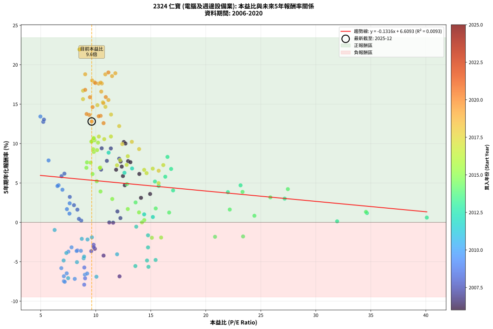
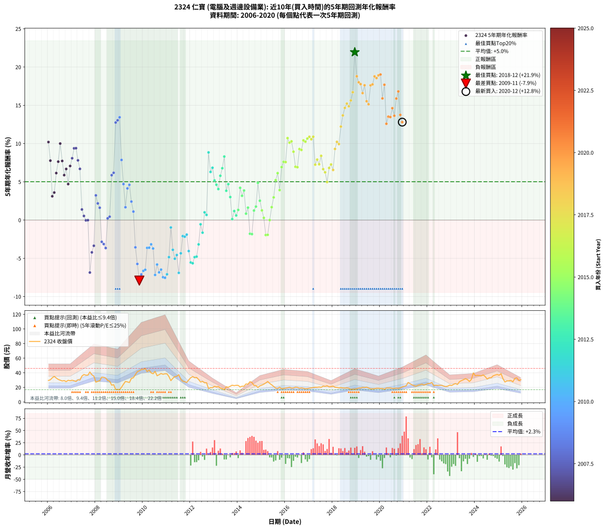

# 2324 仁寶 - 本益比與未來報酬率分析

!!! info "報告資訊"
    - **股票代號**: 2324
    - **公司名稱**: 仁寶
    - **產業別**: 電腦及週邊設備業
    - **分析期間**: 2006-2020 (180 個數據點)
    - **資料來源**: Type 12 (ShowMonthlyK_ChartFlow) 月收盤價與本益比
    - **報酬率口徑**: 含現金股利 (簡化: 年度合計，假設每年7/1入帳)
    - **報告生成時間**: 2026-01-22 22:19:16 CST

## 📈 視覺化圖表

### 圖表1: 本益比 vs 未來報酬率關係

*圖表1：2324 仁寶 本益比與5年期未來報酬率關係 (2006-2020)*

### 圖表2: 歷年買入時點的5年期實際報酬率

*圖表2：2324 仁寶 歷年買入時點的5年期實際報酬率 (2006-2020)*

## 📍 買點訊號說明

本報告提供兩種買點提示訊號（顯示於圖表2的股價子圖中）：

### ▲ 小綠色三角形（回測驗證）
- **計算方式**: 使用全部歷史資料計算本益比第25百分位數
- **用途**: 事後驗證，顯示歷史上哪些時點確實為低估區
- **限制**: 當下無法判斷，僅供回測參考
- **特性**: 後見之明（Look-Ahead Bias）

### ▲ 小橘色三角形（即時訊號）
- **計算方式**: 使用截至當月的過去5年資料計算本益比第25百分位數
- **用途**: 實際投資決策，當時即可判斷
- **優勢**: 可操作性強，符合實務需求
- **特性**: 無後見之明，滾動窗口計算

!!! tip "如何使用兩種訊號"
    - **綠色▲** 幫助理解歷史估值機會，驗證策略有效性
    - **橘色▲** 可作為實際買進參考，但仍需搭配基本面分析
    - 兩種訊號重疊時，表示即時判斷與事後驗證一致，信心度較高
    - 僅有綠色▲時，表示當時無法判斷（需要未來資料才能確認）
    - 僅有橘色▲時，表示即時判斷為買點，但事後可能不是最佳時機

## 📊 估值分析摘要

| 指標 | 數值 |
|:---:|:---:|
| **目前本益比** (2020-12) | **9.63 倍** |
| **歷史平均本益比** | 12.14 倍 |
| **估值水準** | 🟢 相對低估 |
| **預期5年年化報酬率** | **+5.34%** |
| **歷史平均報酬率** | +5.01% |
| **相關係數 (R²)** | 0.0093 |
| **趨勢線斜率** | -0.1316 |

!!! abstract "核心洞察"
    目前本益比顯著低於歷史平均，預期未來報酬率可能較高

    根據歷史數據回測，2324 仁寶 在目前本益比 **9.6倍** 的估值水準下，
    預期未來5年年化報酬率約為 **+5.3%**。

    **重要提醒**: 本分析基於歷史數據統計，實際報酬率會受到公司基本面變化、產業趨勢、
    總體經濟環境等多重因素影響。R² = 0.01 表示本益比可解釋約 0.9% 的報酬率變異。

## 📈 歷史估值統計

### 最佳買點 (最高報酬率)

| 項目 | 數值 |
|:---:|:---:|
| 起始時間 | 2018-12 |
| 當時本益比 | 8.51 倍 |
| 起始價格 | 17.4 元 |
| 5年後價格 | 39.9 元 |
| **5年年化報酬率** | **+21.95%** |

### 最差買點 (最低報酬率)

| 項目 | 數值 |
|:---:|:---:|
| 起始時間 | 2009-11 |
| 當時本益比 | 8.95 倍 |
| 起始價格 | 42.7 元 |
| 5年後價格 | 19.8 元 |
| **5年年化報酬率** | **-7.91%** |

## 🎯 投資啟示

### 本益比與報酬率關係

趨勢線方程式: **y = -0.1316x + 6.6093**

!!! note "負相關"
    本益比與未來報酬率呈現負相關。較低的本益比通常帶來較高的未來報酬率，
    但相關性不算非常強。**估值仍是重要參考指標之一**。

### 估值區間建議

基於歷史數據分析:

- **🟢 低估區** (P/E < 9.7): 預期報酬率較高，可考慮增加持股
- **🟡 合理區** (P/E 9.7-14.6): 預期報酬率符合長期趨勢，正常持有
- **🔴 高估區** (P/E > 14.6): 預期報酬率較低，可考慮減碼或觀望

!!! danger "風險提示"
    - 過去表現不代表未來結果
    - 本分析假設公司基本面無重大結構性變化
    - 產業環境劇變可能使歷史規律失效
    - 應結合公司財報、產業趨勢、總體經濟等多重因素綜合判斷

!!! success "長期投資觀點"
    歷史數據顯示，在合理或低估的估值水準買入並長期持有，
    往往能獲得較佳的投資報酬。**耐心等待好價格**是價值投資的核心原則。

## 📊 數據品質

- **資料來源**: GoodInfo.tw Type 12 (ShowMonthlyK_ChartFlow)
- **資料頻率**: 月度收盤價與本益比
- **回測期間**: 2006-2020
- **數據點數量**: 180 個 (每個點代表一次5年期回測)

### 計算方法說明

1. **5年期年化報酬率**:
   - 對每個歷史時點，計算其後5年的實際投資報酬率
   - 期末價值(不含股利): 期末價格
   - 期末價值(含現金股利): 期末價格 + 持有期間內的現金股利合計 (簡化: 年度合計，假設每年7/1入帳)
   - 公式: 年化報酬率 = [(期末價值/期初價格)^(1/年數) - 1] × 100%

2. **本益比 (P/E Ratio)**:
   - 使用當時的月收盤價與EPS計算
   - 資料來源: Type 12 月度河流圖本益比數據

3. **趨勢線 (Linear Regression)**:
   - 使用最小平方法擬合線性趨勢線
   - R²值衡量本益比對報酬率的解釋能力

---

*本報告由 Stock Analysis System v1.9.0 自動生成*
*數據更新時間: 2026-01-22 22:19:16 CST*

## 📋 月度回測明細表

（每一列對應時間線圖中的一個買入點；可用來對照 SVG 圖上的每個點。）

| 買入月份 | 賣出月份 | 回測期限_年 | 實際持有年數 | 買入本益比_倍 | 買入收盤價_元 | 賣出收盤價_元 | 現金股利合計_元 | 總報酬率_pct | 年化報酬率_pct |
| --- | --- | --- | --- | --- | --- | --- | --- | --- | --- |
| 2006-01 | 2011-01 | 5 | 4.999 | 12.55 | 29.50 | 38.50 | 9.44 | +62.50 | +10.20 |
| 2006-02 | 2011-02 | 5 | 4.999 | 12.94 | 30.40 | 34.75 | 9.44 | +45.35 | +7.77 |
| 2006-03 | 2011-03 | 5 | 4.999 | 14.11 | 33.15 | 29.20 | 9.44 | +16.55 | +3.11 |
| 2006-04 | 2011-04 | 5 | 4.999 | 14.94 | 35.10 | 32.45 | 9.44 | +19.34 | +3.60 |
| 2006-05 | 2011-05 | 5 | 4.999 | 13.96 | 32.80 | 34.75 | 9.44 | +34.72 | +6.14 |
| 2006-06 | 2011-06 | 5 | 4.999 | 13.15 | 30.90 | 35.20 | 9.44 | +44.46 | +7.63 |
| 2006-07 | 2011-07 | 5 | 4.999 | 12.70 | 29.85 | 37.40 | 10.68 | +61.06 | +10.00 |
| 2006-08 | 2011-08 | 5 | 4.999 | 12.26 | 28.80 | 31.10 | 10.68 | +45.06 | +7.72 |
| 2006-09 | 2011-09 | 5 | 4.999 | 12.47 | 29.30 | 28.30 | 10.68 | +33.03 | +5.87 |
| 2006-10 | 2011-10 | 5 | 4.999 | 11.85 | 27.85 | 27.80 | 10.68 | +38.16 | +6.68 |
| 2006-11 | 2011-11 | 5 | 4.999 | 12.64 | 29.70 | 26.70 | 10.68 | +25.85 | +4.71 |
| 2006-12 | 2011-12 | 5 | 4.999 | 12.36 | 29.05 | 30.20 | 10.68 | +40.71 | +7.07 |
| 2007-01 | 2012-01 | 5 | 4.999 | 12.13 | 29.75 | 33.20 | 10.68 | +47.49 | +8.08 |
| 2007-02 | 2012-02 | 5 | 4.999 | 11.37 | 29.05 | 34.80 | 10.68 | +56.55 | +9.38 |
| 2007-03 | 2012-03 | 5 | 5.002 | 10.54 | 28.00 | 33.20 | 10.68 | +56.70 | +9.40 |
| 2007-04 | 2012-04 | 5 | 5.002 | 11.01 | 30.40 | 33.60 | 10.68 | +45.65 | +7.81 |
| 2007-05 | 2012-05 | 5 | 5.002 | 10.48 | 30.00 | 30.80 | 10.68 | +38.26 | +6.69 |
| 2007-06 | 2012-06 | 5 | 5.002 | 11.97 | 35.50 | 27.35 | 10.68 | +7.12 | +1.38 |
| 2007-07 | 2012-07 | 5 | 5.002 | 12.24 | 37.55 | 28.20 | 10.38 | +2.74 | +0.54 |
| 2007-08 | 2012-08 | 5 | 5.002 | 11.58 | 36.70 | 26.25 | 10.38 | -0.20 | -0.04 |
| 2007-09 | 2012-09 | 5 | 5.002 | 11.23 | 36.75 | 26.35 | 10.38 | -0.06 | -0.01 |
| 2007-10 | 2012-10 | 5 | 5.002 | 12.16 | 41.05 | 18.40 | 10.38 | -29.90 | -6.86 |
| 2007-11 | 2012-11 | 5 | 5.002 | 10.71 | 37.25 | 19.65 | 10.38 | -19.39 | -4.22 |
| 2007-12 | 2012-12 | 5 | 5.002 | 9.92 | 35.50 | 19.55 | 10.38 | -15.70 | -3.36 |
| 2008-01 | 2013-01 | 5 | 5.002 | 7.64 | 27.15 | 21.45 | 10.38 | +17.23 | +3.23 |
| 2008-02 | 2013-03 | 5 | 5.081 | 8.02 | 28.30 | 21.20 | 10.38 | +11.58 | +2.18 |
| 2008-03 | 2013-03 | 5 | 4.999 | 8.33 | 29.15 | 21.20 | 10.38 | +8.33 | +1.61 |
| 2008-04 | 2013-04 | 5 | 4.999 | 9.80 | 34.05 | 19.10 | 10.38 | -13.43 | -2.84 |
| 2008-05 | 2013-05 | 5 | 4.999 | 9.81 | 33.80 | 18.45 | 10.38 | -14.71 | -3.13 |
| 2008-06 | 2013-06 | 5 | 4.999 | 9.59 | 32.80 | 16.85 | 10.38 | -16.99 | -3.66 |
| 2008-07 | 2013-07 | 5 | 4.999 | 8.68 | 29.45 | 20.80 | 8.98 | +1.13 | +0.23 |
| 2008-08 | 2013-08 | 5 | 4.999 | 8.47 | 28.50 | 20.15 | 8.98 | +2.22 | +0.44 |
| 2008-09 | 2013-09 | 5 | 4.999 | 6.89 | 23.00 | 21.60 | 8.98 | +32.97 | +5.87 |
| 2008-10 | 2013-10 | 5 | 4.999 | 7.15 | 23.70 | 23.00 | 8.98 | +34.95 | +6.18 |
| 2008-11 | 2013-11 | 5 | 4.999 | 5.23 | 17.20 | 22.35 | 8.98 | +82.17 | +12.75 |
| 2008-12 | 2013-12 | 5 | 4.999 | 5.29 | 17.25 | 22.85 | 8.98 | +84.54 | +13.04 |
| 2009-01 | 2014-01 | 5 | 4.999 | 4.97 | 16.90 | 22.75 | 8.98 | +87.78 | +13.43 |
| 2009-02 | 2014-02 | 5 | 4.999 | 5.71 | 20.20 | 20.50 | 8.98 | +45.96 | +7.86 |
| 2009-03 | 2014-03 | 5 | 4.999 | 6.62 | 24.30 | 21.60 | 8.98 | +25.86 | +4.71 |
| 2009-04 | 2014-04 | 5 | 4.999 | 7.38 | 28.10 | 21.55 | 8.98 | +8.66 | +1.68 |
| 2009-05 | 2014-05 | 5 | 4.999 | 6.97 | 27.50 | 24.70 | 8.98 | +22.49 | +4.14 |
| 2009-06 | 2014-06 | 5 | 4.999 | 6.52 | 26.65 | 24.40 | 8.98 | +25.27 | +4.61 |
| 2009-07 | 2014-07 | 5 | 4.999 | 7.63 | 32.20 | 27.80 | 8.48 | +12.68 | +2.42 |
| 2009-08 | 2014-08 | 5 | 4.999 | 7.61 | 33.20 | 26.60 | 8.48 | +5.67 | +1.11 |
| 2009-09 | 2014-09 | 5 | 4.999 | 8.33 | 37.45 | 22.75 | 8.48 | -16.60 | -3.57 |
| 2009-10 | 2014-10 | 5 | 4.999 | 8.96 | 41.55 | 22.45 | 8.48 | -25.55 | -5.73 |
| 2009-11 | 2014-11 | 5 | 4.999 | 8.95 | 42.70 | 19.80 | 8.48 | -33.76 | -7.91 |
| 2009-12 | 2014-12 | 5 | 4.999 | 9.03 | 44.35 | 22.20 | 8.48 | -30.82 | -7.10 |
| 2010-01 | 2015-01 | 5 | 4.999 | 9.01 | 44.60 | 23.15 | 8.48 | -29.07 | -6.64 |
| 2010-02 | 2015-02 | 5 | 4.999 | 9.22 | 46.00 | 24.40 | 8.48 | -28.52 | -6.49 |
| 2010-03 | 2015-03 | 5 | 4.999 | 8.26 | 41.55 | 26.05 | 8.48 | -16.89 | -3.63 |
| 2010-04 | 2015-04 | 5 | 4.999 | 8.65 | 43.85 | 28.00 | 8.48 | -16.80 | -3.61 |
| 2010-05 | 2015-05 | 5 | 4.999 | 7.80 | 39.80 | 25.40 | 8.48 | -14.87 | -3.17 |
| 2010-06 | 2015-06 | 5 | 4.999 | 7.51 | 38.65 | 23.50 | 8.48 | -17.25 | -3.72 |
| 2010-07 | 2015-07 | 5 | 4.999 | 8.09 | 41.95 | 21.30 | 7.61 | -31.07 | -7.17 |
| 2010-08 | 2015-08 | 5 | 4.999 | 6.87 | 35.90 | 19.00 | 7.61 | -25.86 | -5.81 |
| 2010-09 | 2015-09 | 5 | 4.999 | 7.10 | 37.35 | 18.60 | 7.61 | -29.81 | -6.84 |
| 2010-10 | 2015-10 | 5 | 4.999 | 7.36 | 39.00 | 20.30 | 7.61 | -28.42 | -6.47 |
| 2010-11 | 2015-11 | 5 | 4.999 | 7.10 | 37.90 | 18.10 | 7.61 | -32.15 | -7.47 |
| 2010-12 | 2015-12 | 5 | 4.999 | 7.18 | 38.65 | 18.50 | 7.61 | -32.43 | -7.54 |
| 2011-01 | 2016-01 | 5 | 4.999 | 7.49 | 38.50 | 19.05 | 7.61 | -30.74 | -7.08 |
| 2011-02 | 2016-02 | 5 | 4.999 | 7.08 | 34.75 | 19.50 | 7.61 | -21.97 | -4.84 |
| 2011-03 | 2016-03 | 5 | 5.002 | 6.26 | 29.20 | 20.20 | 7.61 | -4.74 | -0.97 |
| 2011-04 | 2016-04 | 5 | 5.002 | 7.33 | 32.45 | 19.00 | 7.61 | -17.98 | -3.89 |
| 2011-05 | 2016-05 | 5 | 5.002 | 8.29 | 34.75 | 19.20 | 7.61 | -22.83 | -5.05 |
| 2011-06 | 2016-06 | 5 | 5.002 | 8.90 | 35.20 | 20.25 | 7.61 | -20.84 | -4.56 |
| 2011-07 | 2016-07 | 5 | 5.002 | 10.06 | 37.40 | 20.05 | 6.11 | -30.06 | -6.90 |
| 2011-08 | 2016-08 | 5 | 5.002 | 8.94 | 31.10 | 18.80 | 6.11 | -19.91 | -4.34 |
| 2011-09 | 2016-09 | 5 | 5.002 | 8.73 | 28.30 | 19.35 | 6.11 | -10.05 | -2.09 |
| 2011-10 | 2016-10 | 5 | 5.002 | 9.25 | 27.80 | 18.80 | 6.11 | -10.41 | -2.17 |
| 2011-11 | 2016-11 | 5 | 5.002 | 9.65 | 26.70 | 18.15 | 6.11 | -9.15 | -1.90 |
| 2011-12 | 2016-12 | 5 | 5.002 | 11.94 | 30.20 | 18.45 | 6.11 | -18.69 | -4.05 |
| 2012-01 | 2017-01 | 5 | 5.002 | 13.60 | 33.20 | 18.85 | 6.11 | -24.83 | -5.55 |
| 2012-02 | 2017-03 | 5 | 5.081 | 14.79 | 34.80 | 19.80 | 6.11 | -25.55 | -5.64 |
| 2012-03 | 2017-03 | 5 | 4.999 | 14.66 | 33.20 | 19.80 | 6.11 | -21.97 | -4.84 |
| 2012-04 | 2017-04 | 5 | 4.999 | 15.44 | 33.60 | 20.20 | 6.11 | -21.71 | -4.78 |
| 2012-05 | 2017-05 | 5 | 4.999 | 14.75 | 30.80 | 20.10 | 6.11 | -14.91 | -3.18 |
| 2012-06 | 2017-06 | 5 | 4.999 | 13.68 | 27.35 | 20.50 | 6.11 | -2.72 | -0.55 |
| 2012-07 | 2017-07 | 5 | 4.999 | 14.75 | 28.20 | 20.05 | 5.91 | -7.95 | -1.64 |
| 2012-08 | 2017-08 | 5 | 4.999 | 14.40 | 26.25 | 21.70 | 5.91 | +5.17 | +1.01 |
| 2012-09 | 2017-09 | 5 | 4.999 | 15.19 | 26.35 | 21.35 | 5.91 | +3.44 | +0.68 |
| 2012-10 | 2017-10 | 5 | 4.999 | 11.17 | 18.40 | 22.20 | 5.91 | +52.76 | +8.84 |
| 2012-11 | 2017-11 | 5 | 4.999 | 12.61 | 19.65 | 20.75 | 5.91 | +35.66 | +6.29 |
| 2012-12 | 2017-12 | 5 | 4.999 | 13.30 | 19.55 | 21.30 | 5.91 | +39.17 | +6.83 |
| 2013-01 | 2018-01 | 5 | 4.999 | 15.38 | 21.45 | 21.70 | 5.91 | +28.70 | +5.18 |
| 2013-02 | 2018-02 | 5 | 4.999 | 15.72 | 20.75 | 20.10 | 5.91 | +25.33 | +4.62 |
| 2013-03 | 2018-03 | 5 | 4.999 | 17.03 | 21.20 | 19.95 | 5.91 | +21.97 | +4.05 |
| 2013-04 | 2018-04 | 5 | 4.999 | 16.32 | 19.10 | 19.40 | 5.91 | +32.50 | +5.79 |
| 2013-05 | 2018-05 | 5 | 4.999 | 16.85 | 18.45 | 19.70 | 5.91 | +38.79 | +6.78 |
| 2013-06 | 2018-06 | 5 | 4.999 | 16.52 | 16.85 | 19.20 | 5.91 | +49.00 | +8.30 |
| 2013-07 | 2018-07 | 5 | 4.999 | 22.01 | 20.80 | 19.00 | 6.10 | +20.67 | +3.83 |
| 2013-08 | 2018-08 | 5 | 4.999 | 23.16 | 20.15 | 19.25 | 6.10 | +25.81 | +4.70 |
| 2013-09 | 2018-09 | 5 | 4.999 | 27.17 | 21.60 | 18.95 | 6.10 | +15.97 | +3.01 |
| 2013-10 | 2018-10 | 5 | 4.999 | 31.94 | 23.00 | 17.05 | 6.10 | +0.65 | +0.13 |
| 2013-11 | 2018-11 | 5 | 4.999 | 34.65 | 22.35 | 17.60 | 6.10 | +6.04 | +1.18 |
| 2013-12 | 2018-12 | 5 | 4.999 | 40.09 | 22.85 | 17.45 | 6.10 | +3.06 | +0.61 |
| 2014-01 | 2019-01 | 5 | 4.999 | 34.56 | 22.75 | 18.20 | 6.10 | +6.81 | +1.33 |
| 2014-02 | 2019-02 | 5 | 4.999 | 27.46 | 20.50 | 19.10 | 6.10 | +22.93 | +4.22 |
| 2014-03 | 2019-03 | 5 | 4.999 | 25.87 | 21.60 | 19.15 | 6.10 | +16.90 | +3.17 |
| 2014-04 | 2019-04 | 5 | 4.999 | 23.34 | 21.55 | 19.95 | 6.10 | +20.88 | +3.87 |
| 2014-05 | 2019-05 | 5 | 4.999 | 24.42 | 24.70 | 19.65 | 6.10 | +4.25 | +0.84 |
| 2014-06 | 2019-06 | 5 | 4.999 | 22.18 | 24.40 | 20.35 | 6.10 | +8.40 | +1.63 |
| 2014-07 | 2019-07 | 5 | 4.999 | 23.39 | 27.80 | 19.10 | 6.30 | -8.63 | -1.79 |
| 2014-08 | 2019-08 | 5 | 4.999 | 20.84 | 26.60 | 17.95 | 6.30 | -8.83 | -1.83 |
| 2014-09 | 2019-09 | 5 | 4.999 | 16.67 | 22.75 | 17.90 | 6.30 | +6.38 | +1.24 |
| 2014-10 | 2019-10 | 5 | 4.999 | 15.45 | 22.45 | 18.20 | 6.30 | +9.14 | +1.76 |
| 2014-11 | 2019-11 | 5 | 4.999 | 12.84 | 19.80 | 18.80 | 6.30 | +26.77 | +4.86 |
| 2014-12 | 2019-12 | 5 | 4.999 | 13.62 | 22.20 | 18.85 | 6.30 | +13.29 | +2.53 |
| 2015-01 | 2020-01 | 5 | 4.999 | 13.93 | 23.15 | 18.35 | 6.30 | +6.48 | +1.26 |
| 2015-02 | 2020-02 | 5 | 4.999 | 14.41 | 24.40 | 18.45 | 6.30 | +1.44 | +0.29 |
| 2015-03 | 2020-03 | 5 | 5.002 | 15.10 | 26.05 | 17.30 | 6.30 | -9.40 | -1.95 |
| 2015-04 | 2020-04 | 5 | 5.002 | 15.94 | 28.00 | 19.10 | 6.30 | -9.28 | -1.93 |
| 2015-05 | 2020-05 | 5 | 5.002 | 14.20 | 25.40 | 19.10 | 6.30 | +0.00 | +0.00 |
| 2015-06 | 2020-06 | 5 | 5.002 | 12.91 | 23.50 | 19.25 | 6.30 | +8.73 | +1.69 |
| 2015-07 | 2020-07 | 5 | 5.002 | 11.50 | 21.30 | 18.65 | 6.00 | +15.73 | +2.96 |
| 2015-08 | 2020-08 | 5 | 5.002 | 10.09 | 19.00 | 18.50 | 6.00 | +28.95 | +5.21 |
| 2015-09 | 2020-09 | 5 | 5.002 | 9.71 | 18.60 | 19.05 | 6.00 | +34.68 | +6.13 |
| 2015-10 | 2020-10 | 5 | 5.002 | 10.43 | 20.30 | 18.60 | 6.00 | +21.19 | +3.92 |
| 2015-11 | 2020-11 | 5 | 5.002 | 9.15 | 18.10 | 19.30 | 6.00 | +39.78 | +6.93 |
| 2015-12 | 2020-12 | 5 | 5.002 | 9.20 | 18.50 | 20.70 | 6.00 | +44.33 | +7.61 |
| 2016-01 | 2021-01 | 5 | 5.002 | 9.53 | 19.05 | 21.45 | 6.00 | +44.10 | +7.58 |
| 2016-02 | 2021-03 | 5 | 5.081 | 9.81 | 19.50 | 26.70 | 6.00 | +67.70 | +10.71 |
| 2016-03 | 2021-03 | 5 | 4.999 | 10.21 | 20.20 | 26.70 | 6.00 | +61.89 | +10.12 |
| 2016-04 | 2021-04 | 5 | 4.999 | 9.66 | 19.00 | 25.00 | 6.00 | +63.16 | +10.29 |
| 2016-05 | 2021-05 | 5 | 4.999 | 9.82 | 19.20 | 23.45 | 6.00 | +53.39 | +8.93 |
| 2016-06 | 2021-06 | 5 | 4.999 | 10.41 | 20.25 | 22.35 | 6.00 | +40.00 | +6.96 |
| 2016-07 | 2021-07 | 5 | 4.999 | 10.37 | 20.05 | 21.60 | 6.40 | +39.65 | +6.91 |
| 2016-08 | 2021-08 | 5 | 4.999 | 9.77 | 18.80 | 22.90 | 6.40 | +55.85 | +9.28 |
| 2016-09 | 2021-09 | 5 | 4.999 | 10.12 | 19.35 | 23.60 | 6.40 | +55.04 | +9.17 |
| 2016-10 | 2021-10 | 5 | 4.999 | 9.89 | 18.80 | 24.45 | 6.40 | +64.10 | +10.41 |
| 2016-11 | 2021-11 | 5 | 4.999 | 9.60 | 18.15 | 23.15 | 6.40 | +62.81 | +10.24 |
| 2016-12 | 2021-12 | 5 | 4.999 | 9.81 | 18.45 | 24.20 | 6.40 | +65.85 | +10.65 |
| 2017-01 | 2022-01 | 5 | 4.999 | 10.28 | 18.85 | 25.20 | 6.40 | +67.64 | +10.89 |
| 2017-02 | 2022-02 | 5 | 4.999 | 10.77 | 19.25 | 25.40 | 6.40 | +65.19 | +10.56 |
| 2017-03 | 2022-03 | 5 | 4.999 | 11.38 | 19.80 | 26.80 | 6.40 | +67.68 | +10.89 |
| 2017-04 | 2022-04 | 5 | 4.999 | 11.93 | 20.20 | 22.25 | 6.40 | +41.83 | +7.24 |
| 2017-05 | 2022-05 | 5 | 4.999 | 12.21 | 20.10 | 23.00 | 6.40 | +46.27 | +7.90 |
| 2017-06 | 2022-06 | 5 | 4.999 | 12.81 | 20.50 | 22.75 | 6.40 | +42.20 | +7.30 |
| 2017-07 | 2022-07 | 5 | 4.999 | 12.91 | 20.05 | 22.80 | 7.20 | +49.63 | +8.39 |
| 2017-08 | 2022-08 | 5 | 4.999 | 14.40 | 21.70 | 22.75 | 7.20 | +38.02 | +6.66 |
| 2017-09 | 2022-09 | 5 | 4.999 | 14.62 | 21.35 | 21.70 | 7.20 | +35.36 | +6.24 |
| 2017-10 | 2022-10 | 5 | 4.999 | 15.71 | 22.20 | 21.10 | 7.20 | +27.48 | +4.98 |
| 2017-11 | 2022-11 | 5 | 4.999 | 15.18 | 20.75 | 21.65 | 7.20 | +39.04 | +6.81 |
| 2017-12 | 2022-12 | 5 | 4.999 | 16.14 | 21.30 | 23.05 | 7.20 | +42.02 | +7.27 |
| 2018-01 | 2023-01 | 5 | 4.999 | 15.72 | 21.70 | 22.60 | 7.20 | +37.33 | +6.55 |
| 2018-02 | 2023-02 | 5 | 4.999 | 13.94 | 20.10 | 24.15 | 7.20 | +55.97 | +9.30 |
| 2018-03 | 2023-03 | 5 | 4.999 | 13.28 | 19.95 | 25.25 | 7.20 | +62.66 | +10.22 |
| 2018-04 | 2023-04 | 5 | 4.999 | 12.41 | 19.40 | 23.95 | 7.20 | +60.57 | +9.94 |
| 2018-05 | 2023-05 | 5 | 4.999 | 12.13 | 19.70 | 27.85 | 7.20 | +77.92 | +12.22 |
| 2018-06 | 2023-06 | 5 | 4.999 | 11.39 | 19.20 | 29.25 | 7.20 | +89.84 | +13.68 |
| 2018-07 | 2023-07 | 5 | 4.999 | 10.88 | 19.00 | 30.45 | 7.20 | +98.16 | +14.66 |
| 2018-08 | 2023-08 | 5 | 4.999 | 10.65 | 19.25 | 31.90 | 7.20 | +103.12 | +15.23 |
| 2018-09 | 2023-09 | 5 | 4.999 | 10.15 | 18.95 | 30.70 | 7.20 | +100.00 | +14.87 |
| 2018-10 | 2023-10 | 5 | 4.999 | 8.84 | 17.05 | 28.05 | 7.20 | +106.74 | +15.64 |
| 2018-11 | 2023-11 | 5 | 4.999 | 8.85 | 17.60 | 30.90 | 7.20 | +116.48 | +16.71 |
| 2018-12 | 2023-12 | 5 | 4.999 | 8.51 | 17.45 | 39.85 | 7.20 | +169.63 | +21.95 |
| 2019-01 | 2024-01 | 5 | 4.999 | 9.04 | 18.20 | 35.85 | 7.20 | +136.54 | +18.79 |
| 2019-02 | 2024-02 | 5 | 4.999 | 9.67 | 19.10 | 36.50 | 7.20 | +128.80 | +18.00 |
| 2019-03 | 2024-03 | 5 | 5.002 | 9.88 | 19.15 | 36.20 | 7.20 | +126.63 | +17.77 |
| 2019-04 | 2024-04 | 5 | 5.002 | 10.50 | 19.95 | 35.80 | 7.20 | +115.54 | +16.59 |
| 2019-05 | 2024-05 | 5 | 5.002 | 10.55 | 19.65 | 37.05 | 7.20 | +125.19 | +17.62 |
| 2019-06 | 2024-06 | 5 | 5.002 | 11.15 | 20.35 | 34.70 | 7.20 | +105.90 | +15.53 |
| 2019-07 | 2024-07 | 5 | 5.002 | 10.69 | 19.10 | 31.45 | 7.20 | +102.36 | +15.13 |
| 2019-08 | 2024-08 | 5 | 5.002 | 10.26 | 17.95 | 33.20 | 7.20 | +125.07 | +17.61 |
| 2019-09 | 2024-09 | 5 | 5.002 | 10.45 | 17.90 | 33.30 | 7.20 | +126.26 | +17.73 |
| 2019-10 | 2024-10 | 5 | 5.002 | 10.87 | 18.20 | 35.85 | 7.20 | +136.54 | +18.78 |
| 2019-11 | 2024-11 | 5 | 5.002 | 11.48 | 18.80 | 36.85 | 7.20 | +134.31 | +18.56 |
| 2019-12 | 2024-12 | 5 | 5.002 | 11.78 | 18.85 | 37.65 | 7.20 | +137.93 | +18.92 |
| 2020-01 | 2025-01 | 5 | 5.002 | 11.15 | 18.35 | 36.65 | 7.20 | +138.96 | +19.02 |
| 2020-02 | 2025-03 | 5 | 5.081 | 10.91 | 18.45 | 31.85 | 7.20 | +111.65 | +15.90 |
| 2020-03 | 2025-03 | 5 | 4.999 | 9.96 | 17.30 | 31.85 | 7.20 | +125.72 | +17.69 |
| 2020-04 | 2025-04 | 5 | 4.999 | 10.71 | 19.10 | 27.35 | 7.20 | +80.89 | +12.59 |
| 2020-05 | 2025-05 | 5 | 4.999 | 10.44 | 19.10 | 28.80 | 7.20 | +88.48 | +13.52 |
| 2020-06 | 2025-06 | 5 | 4.999 | 10.27 | 19.25 | 29.00 | 7.20 | +88.05 | +13.47 |
| 2020-07 | 2025-07 | 5 | 4.999 | 9.71 | 18.65 | 29.50 | 7.40 | +97.86 | +14.62 |
| 2020-08 | 2025-08 | 5 | 4.999 | 9.41 | 18.50 | 27.65 | 7.40 | +89.46 | +13.63 |
| 2020-09 | 2025-09 | 5 | 4.999 | 9.47 | 19.05 | 32.40 | 7.40 | +108.92 | +15.88 |
| 2020-10 | 2025-10 | 5 | 4.999 | 9.04 | 18.60 | 33.05 | 7.40 | +117.47 | +16.81 |
| 2020-11 | 2025-11 | 5 | 4.999 | 9.17 | 19.30 | 29.35 | 7.40 | +90.41 | +13.75 |
| 2020-12 | 2025-12 | 5 | 4.999 | 9.63 | 20.70 | 30.40 | 7.40 | +82.61 | +12.80 |
