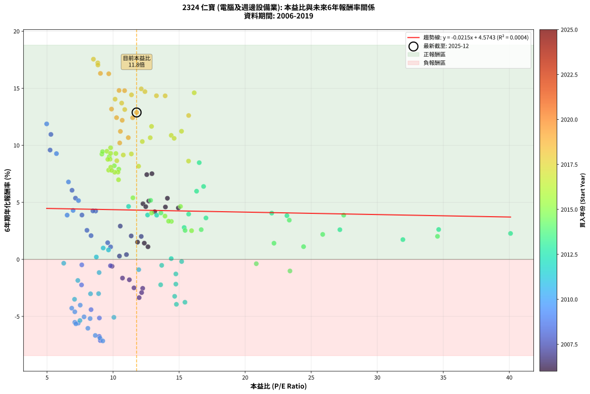
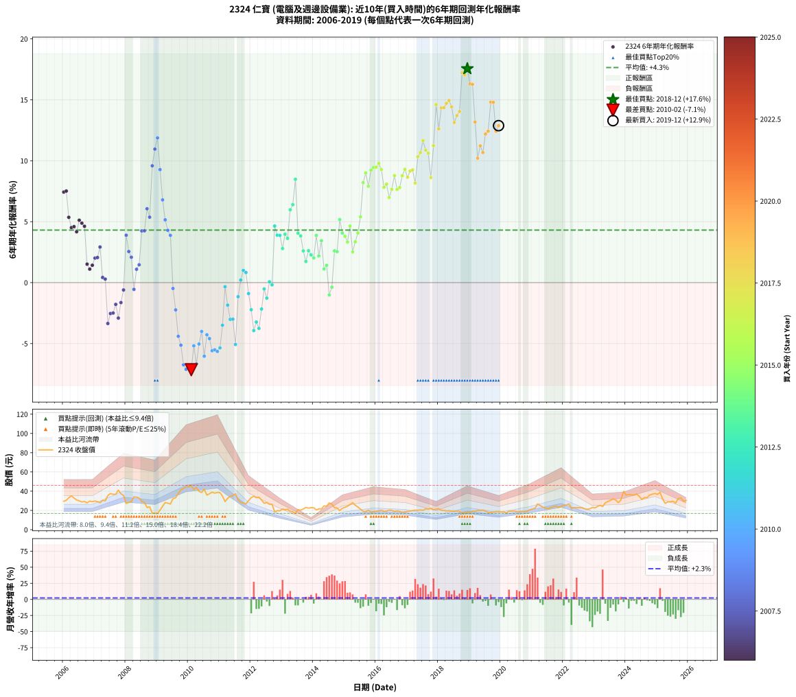

# 2324 仁寶 - 本益比與未來報酬率分析

!!! info "報告資訊"
    - **股票代號**: 2324
    - **公司名稱**: 仁寶
    - **產業別**: 電腦及週邊設備業
    - **分析期間**: 2006-2019 (168 個數據點)
    - **資料來源**: Type 12 (ShowMonthlyK_ChartFlow) 月收盤價與本益比
    - **報酬率口徑**: 含現金股利 (簡化: 年度合計，假設每年7/1入帳)
    - **報告生成時間**: 2026-01-04 08:24:17 CST

## 📈 視覺化圖表

### 圖表1: 本益比 vs 未來報酬率關係

*圖表1：2324 仁寶 本益比與6年期未來報酬率關係 (2006-2019)*

### 圖表2: 歷年買入時點的6年期實際報酬率

*圖表2：2324 仁寶 歷年買入時點的6年期實際報酬率 (2006-2019)*

## 📍 買點訊號說明

本報告提供兩種買點提示訊號（顯示於圖表2的股價子圖中）：

### ▲ 小綠色三角形（回測驗證）
- **計算方式**: 使用全部歷史資料計算本益比第25百分位數
- **用途**: 事後驗證，顯示歷史上哪些時點確實為低估區
- **限制**: 當下無法判斷，僅供回測參考
- **特性**: 後見之明（Look-Ahead Bias）

### ▲ 小橘色三角形（即時訊號）
- **計算方式**: 使用截至當月的過去5年資料計算本益比第25百分位數
- **用途**: 實際投資決策，當時即可判斷
- **優勢**: 可操作性強，符合實務需求
- **特性**: 無後見之明，滾動窗口計算

!!! tip "如何使用兩種訊號"
    - **綠色▲** 幫助理解歷史估值機會，驗證策略有效性
    - **橘色▲** 可作為實際買進參考，但仍需搭配基本面分析
    - 兩種訊號重疊時，表示即時判斷與事後驗證一致，信心度較高
    - 僅有綠色▲時，表示當時無法判斷（需要未來資料才能確認）
    - 僅有橘色▲時，表示即時判斷為買點，但事後可能不是最佳時機

## 📊 估值分析摘要

| 指標 | 數值 |
|:---:|:---:|
| **目前本益比** (2019-12) | **11.78 倍** |
| **歷史平均本益比** | 12.30 倍 |
| **估值水準** | 🟡 合理範圍 |
| **預期6年年化報酬率** | **+4.32%** |
| **歷史平均報酬率** | +4.31% |
| **相關係數 (R²)** | 0.0004 |
| **趨勢線斜率** | -0.0215 |

!!! abstract "核心洞察"
    目前本益比接近歷史平均，預期報酬率符合長期趨勢

    根據歷史數據回測，2324 仁寶 在目前本益比 **11.8倍** 的估值水準下，
    預期未來6年年化報酬率約為 **+4.3%**。

    **重要提醒**: 本分析基於歷史數據統計，實際報酬率會受到公司基本面變化、產業趨勢、
    總體經濟環境等多重因素影響。R² = 0.00 表示本益比可解釋約 0.0% 的報酬率變異。

## 📈 歷史估值統計

### 最佳買點 (最高報酬率)

| 項目 | 數值 |
|:---:|:---:|
| 起始時間 | 2018-12 |
| 當時本益比 | 8.51 倍 |
| 起始價格 | 17.4 元 |
| 6年後價格 | 37.6 元 |
| **6年年化報酬率** | **+17.55%** |

### 最差買點 (最低報酬率)

| 項目 | 數值 |
|:---:|:---:|
| 起始時間 | 2010-02 |
| 當時本益比 | 9.22 倍 |
| 起始價格 | 46.0 元 |
| 6年後價格 | 19.5 元 |
| **6年年化報酬率** | **-7.15%** |

## 🎯 投資啟示

### 本益比與報酬率關係

趨勢線方程式: **y = -0.0215x + 4.5743**

!!! note "負相關"
    本益比與未來報酬率呈現負相關。較低的本益比通常帶來較高的未來報酬率，
    但相關性不算非常強。**估值仍是重要參考指標之一**。

### 估值區間建議

基於歷史數據分析:

- **🟢 低估區** (P/E < 9.8): 預期報酬率較高，可考慮增加持股
- **🟡 合理區** (P/E 9.8-14.8): 預期報酬率符合長期趨勢，正常持有
- **🔴 高估區** (P/E > 14.8): 預期報酬率較低，可考慮減碼或觀望

!!! danger "風險提示"
    - 過去表現不代表未來結果
    - 本分析假設公司基本面無重大結構性變化
    - 產業環境劇變可能使歷史規律失效
    - 應結合公司財報、產業趨勢、總體經濟等多重因素綜合判斷

!!! success "長期投資觀點"
    歷史數據顯示，在合理或低估的估值水準買入並長期持有，
    往往能獲得較佳的投資報酬。**耐心等待好價格**是價值投資的核心原則。

## 📊 數據品質

- **資料來源**: GoodInfo.tw Type 12 (ShowMonthlyK_ChartFlow)
- **資料頻率**: 月度收盤價與本益比
- **回測期間**: 2006-2019
- **數據點數量**: 168 個 (每個點代表一次6年期回測)

### 計算方法說明

1. **6年期年化報酬率**:
   - 對每個歷史時點，計算其後6年的實際投資報酬率
   - 期末價值(不含股利): 期末價格
   - 期末價值(含現金股利): 期末價格 + 持有期間內的現金股利合計 (簡化: 年度合計，假設每年7/1入帳)
   - 公式: 年化報酬率 = [(期末價值/期初價格)^(1/年數) - 1] × 100%

2. **本益比 (P/E Ratio)**:
   - 使用當時的月收盤價與EPS計算
   - 資料來源: Type 12 月度河流圖本益比數據

3. **趨勢線 (Linear Regression)**:
   - 使用最小平方法擬合線性趨勢線
   - R²值衡量本益比對報酬率的解釋能力

---

*本報告由 Stock Analysis System v1.9.0 自動生成*
*數據更新時間: 2026-01-04 08:24:17 CST*

## 📋 月度回測明細表

（每一列對應時間線圖中的一個買入點；可用來對照 SVG 圖上的每個點。）

| 買入月份 | 賣出月份 | 回測期限_年 | 實際持有年數 | 買入本益比_倍 | 買入收盤價_元 | 賣出收盤價_元 | 現金股利合計_元 | 總報酬率_pct | 年化報酬率_pct |
| --- | --- | --- | --- | --- | --- | --- | --- | --- | --- |
| 2006-01 | 2012-01 | 6 | 5.999 | 12.55 | 29.50 | 33.20 | 12.15 | +53.72 | +7.43 |
| 2006-02 | 2012-02 | 6 | 5.999 | 12.94 | 30.40 | 34.80 | 12.15 | +54.43 | +7.51 |
| 2006-03 | 2012-03 | 6 | 6.001 | 14.11 | 33.15 | 33.20 | 12.15 | +36.79 | +5.36 |
| 2006-04 | 2012-04 | 6 | 6.001 | 14.94 | 35.10 | 33.60 | 12.15 | +30.33 | +4.51 |
| 2006-05 | 2012-05 | 6 | 6.001 | 13.96 | 32.80 | 30.80 | 12.15 | +30.93 | +4.59 |
| 2006-06 | 2012-06 | 6 | 6.001 | 13.15 | 30.90 | 27.35 | 12.15 | +27.82 | +4.17 |
| 2006-07 | 2012-07 | 6 | 6.001 | 12.70 | 29.85 | 28.20 | 12.08 | +34.93 | +5.12 |
| 2006-08 | 2012-08 | 6 | 6.001 | 12.26 | 28.80 | 26.25 | 12.08 | +33.08 | +4.88 |
| 2006-09 | 2012-09 | 6 | 6.001 | 12.47 | 29.30 | 26.35 | 12.08 | +31.15 | +4.62 |
| 2006-10 | 2012-10 | 6 | 6.001 | 11.85 | 27.85 | 18.40 | 12.08 | +9.43 | +1.51 |
| 2006-11 | 2012-11 | 6 | 6.001 | 12.64 | 29.70 | 19.65 | 12.08 | +6.82 | +1.11 |
| 2006-12 | 2012-12 | 6 | 6.001 | 12.36 | 29.05 | 19.55 | 12.08 | +8.87 | +1.43 |
| 2007-01 | 2013-01 | 6 | 6.001 | 12.13 | 29.75 | 21.45 | 12.08 | +12.70 | +2.01 |
| 2007-02 | 2013-02 | 6 | 6.001 | 11.37 | 29.05 | 20.75 | 12.08 | +13.00 | +2.06 |
| 2007-03 | 2013-03 | 6 | 6.001 | 10.54 | 28.00 | 21.20 | 12.08 | +18.85 | +2.92 |
| 2007-04 | 2013-04 | 6 | 6.001 | 11.01 | 30.40 | 19.10 | 12.08 | +2.56 | +0.42 |
| 2007-05 | 2013-05 | 6 | 6.001 | 10.48 | 30.00 | 18.45 | 12.08 | +1.76 | +0.29 |
| 2007-06 | 2013-06 | 6 | 6.001 | 11.97 | 35.50 | 16.85 | 12.08 | -18.52 | -3.35 |
| 2007-07 | 2013-07 | 6 | 6.001 | 12.24 | 37.55 | 20.80 | 11.38 | -14.29 | -2.54 |
| 2007-08 | 2013-08 | 6 | 6.001 | 11.58 | 36.70 | 20.15 | 11.38 | -14.08 | -2.50 |
| 2007-09 | 2013-09 | 6 | 6.001 | 11.23 | 36.75 | 21.60 | 11.38 | -10.25 | -1.79 |
| 2007-10 | 2013-10 | 6 | 6.001 | 12.16 | 41.05 | 23.00 | 11.38 | -16.24 | -2.91 |
| 2007-11 | 2013-11 | 6 | 6.001 | 10.71 | 37.25 | 22.35 | 11.38 | -9.44 | -1.64 |
| 2007-12 | 2013-12 | 6 | 6.001 | 9.92 | 35.50 | 22.85 | 11.38 | -3.57 | -0.60 |
| 2008-01 | 2014-01 | 6 | 6.001 | 7.64 | 27.15 | 22.75 | 11.38 | +25.72 | +3.89 |
| 2008-02 | 2014-03 | 6 | 6.081 | 8.02 | 28.30 | 21.60 | 11.38 | +16.55 | +2.55 |
| 2008-03 | 2014-03 | 6 | 5.999 | 8.33 | 29.15 | 21.60 | 11.38 | +13.15 | +2.08 |
| 2008-04 | 2014-04 | 6 | 5.999 | 9.80 | 34.05 | 21.55 | 11.38 | -3.28 | -0.55 |
| 2008-05 | 2014-05 | 6 | 5.999 | 9.81 | 33.80 | 24.70 | 11.38 | +6.76 | +1.10 |
| 2008-06 | 2014-06 | 6 | 5.999 | 9.59 | 32.80 | 24.40 | 11.38 | +9.10 | +1.46 |
| 2008-07 | 2014-07 | 6 | 5.999 | 8.68 | 29.45 | 27.80 | 9.98 | +28.30 | +4.24 |
| 2008-08 | 2014-08 | 6 | 5.999 | 8.47 | 28.50 | 26.60 | 9.98 | +28.36 | +4.25 |
| 2008-09 | 2014-09 | 6 | 5.999 | 6.89 | 23.00 | 22.75 | 9.98 | +42.32 | +6.06 |
| 2008-10 | 2014-10 | 6 | 5.999 | 7.15 | 23.70 | 22.45 | 9.98 | +36.85 | +5.37 |
| 2008-11 | 2014-11 | 6 | 5.999 | 5.23 | 17.20 | 19.80 | 9.98 | +73.16 | +9.58 |
| 2008-12 | 2014-12 | 6 | 5.999 | 5.29 | 17.25 | 22.20 | 9.98 | +86.57 | +10.96 |
| 2009-01 | 2015-01 | 6 | 5.999 | 4.97 | 16.90 | 23.15 | 9.98 | +96.05 | +11.88 |
| 2009-02 | 2015-02 | 6 | 5.999 | 5.71 | 20.20 | 24.40 | 9.98 | +70.21 | +9.27 |
| 2009-03 | 2015-03 | 6 | 5.999 | 6.62 | 24.30 | 26.05 | 9.98 | +48.28 | +6.79 |
| 2009-04 | 2015-04 | 6 | 5.999 | 7.38 | 28.10 | 28.00 | 9.98 | +35.17 | +5.15 |
| 2009-05 | 2015-05 | 6 | 5.999 | 6.97 | 27.50 | 25.40 | 9.98 | +28.67 | +4.29 |
| 2009-06 | 2015-06 | 6 | 5.999 | 6.52 | 26.65 | 23.50 | 9.98 | +25.64 | +3.88 |
| 2009-07 | 2015-07 | 6 | 5.999 | 7.63 | 32.20 | 21.30 | 9.98 | -2.85 | -0.48 |
| 2009-08 | 2015-08 | 6 | 5.999 | 7.61 | 33.20 | 19.00 | 9.98 | -12.70 | -2.24 |
| 2009-09 | 2015-09 | 6 | 5.999 | 8.33 | 37.45 | 18.60 | 9.98 | -23.68 | -4.40 |
| 2009-10 | 2015-10 | 6 | 5.999 | 8.96 | 41.55 | 20.30 | 9.98 | -27.12 | -5.14 |
| 2009-11 | 2015-11 | 6 | 5.999 | 8.95 | 42.70 | 18.10 | 9.98 | -34.23 | -6.75 |
| 2009-12 | 2015-12 | 6 | 5.999 | 9.03 | 44.35 | 18.50 | 9.98 | -35.78 | -7.12 |
| 2010-01 | 2016-01 | 6 | 5.999 | 9.01 | 44.60 | 19.05 | 9.98 | -34.90 | -6.91 |
| 2010-02 | 2016-02 | 6 | 5.999 | 9.22 | 46.00 | 19.50 | 9.98 | -35.91 | -7.15 |
| 2010-03 | 2016-03 | 6 | 6.001 | 8.26 | 41.55 | 20.20 | 9.98 | -27.36 | -5.19 |
| 2010-04 | 2016-04 | 6 | 6.001 | 8.65 | 43.85 | 19.00 | 9.98 | -33.90 | -6.67 |
| 2010-05 | 2016-05 | 6 | 6.001 | 7.80 | 39.80 | 19.20 | 9.98 | -26.68 | -5.04 |
| 2010-06 | 2016-06 | 6 | 6.001 | 7.51 | 38.65 | 20.25 | 9.98 | -21.78 | -4.01 |
| 2010-07 | 2016-07 | 6 | 6.001 | 8.09 | 41.95 | 20.05 | 8.82 | -31.19 | -6.04 |
| 2010-08 | 2016-08 | 6 | 6.001 | 6.87 | 35.90 | 18.80 | 8.82 | -23.08 | -4.28 |
| 2010-09 | 2016-09 | 6 | 6.001 | 7.10 | 37.35 | 19.35 | 8.82 | -24.59 | -4.59 |
| 2010-10 | 2016-10 | 6 | 6.001 | 7.36 | 39.00 | 18.80 | 8.82 | -29.19 | -5.59 |
| 2010-11 | 2016-11 | 6 | 6.001 | 7.10 | 37.90 | 18.15 | 8.82 | -28.85 | -5.51 |
| 2010-12 | 2016-12 | 6 | 6.001 | 7.18 | 38.65 | 18.45 | 8.82 | -29.45 | -5.65 |
| 2011-01 | 2017-01 | 6 | 6.001 | 7.49 | 38.50 | 18.85 | 8.82 | -28.14 | -5.36 |
| 2011-02 | 2017-02 | 6 | 6.001 | 7.08 | 34.75 | 19.25 | 8.82 | -19.23 | -3.50 |
| 2011-03 | 2017-03 | 6 | 6.001 | 6.26 | 29.20 | 19.80 | 8.82 | -2.00 | -0.34 |
| 2011-04 | 2017-04 | 6 | 6.001 | 7.33 | 32.45 | 20.20 | 8.82 | -10.58 | -1.85 |
| 2011-05 | 2017-05 | 6 | 6.001 | 8.29 | 34.75 | 20.10 | 8.82 | -16.79 | -3.02 |
| 2011-06 | 2017-06 | 6 | 6.001 | 8.90 | 35.20 | 20.50 | 8.82 | -16.72 | -3.00 |
| 2011-07 | 2017-07 | 6 | 6.001 | 10.06 | 37.40 | 20.05 | 7.31 | -26.85 | -5.08 |
| 2011-08 | 2017-08 | 6 | 6.001 | 8.94 | 31.10 | 21.70 | 7.31 | -6.73 | -1.15 |
| 2011-09 | 2017-09 | 6 | 6.001 | 8.73 | 28.30 | 21.35 | 7.31 | +1.26 | +0.21 |
| 2011-10 | 2017-10 | 6 | 6.001 | 9.25 | 27.80 | 22.20 | 7.31 | +6.14 | +1.00 |
| 2011-11 | 2017-11 | 6 | 6.001 | 9.65 | 26.70 | 20.75 | 7.31 | +5.08 | +0.83 |
| 2011-12 | 2017-12 | 6 | 6.001 | 11.94 | 30.20 | 21.30 | 7.31 | -5.27 | -0.90 |
| 2012-01 | 2018-01 | 6 | 6.001 | 13.60 | 33.20 | 21.70 | 7.31 | -12.63 | -2.22 |
| 2012-02 | 2018-03 | 6 | 6.081 | 14.79 | 34.80 | 19.95 | 7.31 | -21.68 | -3.94 |
| 2012-03 | 2018-03 | 6 | 5.999 | 14.66 | 33.20 | 19.95 | 7.31 | -17.90 | -3.23 |
| 2012-04 | 2018-04 | 6 | 5.999 | 15.44 | 33.60 | 19.40 | 7.31 | -20.51 | -3.76 |
| 2012-05 | 2018-05 | 6 | 5.999 | 14.75 | 30.80 | 19.70 | 7.31 | -12.31 | -2.17 |
| 2012-06 | 2018-06 | 6 | 5.999 | 13.68 | 27.35 | 19.20 | 7.31 | -3.08 | -0.52 |
| 2012-07 | 2018-07 | 6 | 5.999 | 14.75 | 28.20 | 19.00 | 7.11 | -7.42 | -1.28 |
| 2012-08 | 2018-08 | 6 | 5.999 | 14.40 | 26.25 | 19.25 | 7.11 | +0.41 | +0.07 |
| 2012-09 | 2018-09 | 6 | 5.999 | 15.19 | 26.35 | 18.95 | 7.11 | -1.11 | -0.19 |
| 2012-10 | 2018-10 | 6 | 5.999 | 11.17 | 18.40 | 17.05 | 7.11 | +31.29 | +4.64 |
| 2012-11 | 2018-11 | 6 | 5.999 | 12.61 | 19.65 | 17.60 | 7.11 | +25.74 | +3.89 |
| 2012-12 | 2018-12 | 6 | 5.999 | 13.30 | 19.55 | 17.45 | 7.11 | +25.61 | +3.87 |
| 2013-01 | 2019-01 | 6 | 5.999 | 15.38 | 21.45 | 18.20 | 7.11 | +17.98 | +2.79 |
| 2013-02 | 2019-02 | 6 | 5.999 | 15.72 | 20.75 | 19.10 | 7.11 | +26.30 | +3.97 |
| 2013-03 | 2019-03 | 6 | 5.999 | 17.03 | 21.20 | 19.15 | 7.11 | +23.85 | +3.63 |
| 2013-04 | 2019-04 | 6 | 5.999 | 16.32 | 19.10 | 19.95 | 7.11 | +41.66 | +5.98 |
| 2013-05 | 2019-05 | 6 | 5.999 | 16.85 | 18.45 | 19.65 | 7.11 | +45.02 | +6.39 |
| 2013-06 | 2019-06 | 6 | 5.999 | 16.52 | 16.85 | 20.35 | 7.11 | +62.95 | +8.48 |
| 2013-07 | 2019-07 | 6 | 5.999 | 22.01 | 20.80 | 19.10 | 7.30 | +26.92 | +4.05 |
| 2013-08 | 2019-08 | 6 | 5.999 | 23.16 | 20.15 | 17.95 | 7.30 | +25.31 | +3.83 |
| 2013-09 | 2019-09 | 6 | 5.999 | 27.17 | 21.60 | 17.90 | 7.30 | +16.67 | +2.60 |
| 2013-10 | 2019-10 | 6 | 5.999 | 31.94 | 23.00 | 18.20 | 7.30 | +10.87 | +1.74 |
| 2013-11 | 2019-11 | 6 | 5.999 | 34.65 | 22.35 | 18.80 | 7.30 | +16.78 | +2.62 |
| 2013-12 | 2019-12 | 6 | 5.999 | 40.09 | 22.85 | 18.85 | 7.30 | +14.44 | +2.27 |
| 2014-01 | 2020-01 | 6 | 5.999 | 34.56 | 22.75 | 18.35 | 7.30 | +12.75 | +2.02 |
| 2014-02 | 2020-02 | 6 | 5.999 | 27.46 | 20.50 | 18.45 | 7.30 | +25.61 | +3.87 |
| 2014-03 | 2020-03 | 6 | 6.001 | 25.87 | 21.60 | 17.30 | 7.30 | +13.89 | +2.19 |
| 2014-04 | 2020-04 | 6 | 6.001 | 23.34 | 21.55 | 19.10 | 7.30 | +22.51 | +3.44 |
| 2014-05 | 2020-05 | 6 | 6.001 | 24.42 | 24.70 | 19.10 | 7.30 | +6.88 | +1.12 |
| 2014-06 | 2020-06 | 6 | 6.001 | 22.18 | 24.40 | 19.25 | 7.30 | +8.81 | +1.42 |
| 2014-07 | 2020-07 | 6 | 6.001 | 23.39 | 27.80 | 18.65 | 7.50 | -5.93 | -1.01 |
| 2014-08 | 2020-08 | 6 | 6.001 | 20.84 | 26.60 | 18.50 | 7.50 | -2.25 | -0.38 |
| 2014-09 | 2020-09 | 6 | 6.001 | 16.67 | 22.75 | 19.05 | 7.50 | +16.71 | +2.61 |
| 2014-10 | 2020-10 | 6 | 6.001 | 15.45 | 22.45 | 18.60 | 7.50 | +16.26 | +2.54 |
| 2014-11 | 2020-11 | 6 | 6.001 | 12.84 | 19.80 | 19.30 | 7.50 | +35.36 | +5.17 |
| 2014-12 | 2020-12 | 6 | 6.001 | 13.62 | 22.20 | 20.70 | 7.50 | +27.03 | +4.07 |
| 2015-01 | 2021-01 | 6 | 6.001 | 13.93 | 23.15 | 21.45 | 7.50 | +25.06 | +3.80 |
| 2015-02 | 2021-02 | 6 | 6.001 | 14.41 | 24.40 | 22.20 | 7.50 | +21.73 | +3.33 |
| 2015-03 | 2021-03 | 6 | 6.001 | 15.10 | 26.05 | 26.70 | 7.50 | +31.29 | +4.64 |
| 2015-04 | 2021-04 | 6 | 6.001 | 15.94 | 28.00 | 25.00 | 7.50 | +16.07 | +2.51 |
| 2015-05 | 2021-05 | 6 | 6.001 | 14.20 | 25.40 | 23.45 | 7.50 | +21.85 | +3.35 |
| 2015-06 | 2021-06 | 6 | 6.001 | 12.91 | 23.50 | 22.35 | 7.50 | +27.03 | +4.07 |
| 2015-07 | 2021-07 | 6 | 6.001 | 11.50 | 21.30 | 21.60 | 7.60 | +37.09 | +5.40 |
| 2015-08 | 2021-08 | 6 | 6.001 | 10.09 | 19.00 | 22.90 | 7.60 | +60.53 | +8.21 |
| 2015-09 | 2021-09 | 6 | 6.001 | 9.71 | 18.60 | 23.60 | 7.60 | +67.75 | +9.00 |
| 2015-10 | 2021-10 | 6 | 6.001 | 10.43 | 20.30 | 24.45 | 7.60 | +57.89 | +7.91 |
| 2015-11 | 2021-11 | 6 | 6.001 | 9.15 | 18.10 | 23.15 | 7.60 | +69.90 | +9.23 |
| 2015-12 | 2021-12 | 6 | 6.001 | 9.20 | 18.50 | 24.20 | 7.60 | +71.90 | +9.45 |
| 2016-01 | 2022-01 | 6 | 6.001 | 9.53 | 19.05 | 25.20 | 7.60 | +72.18 | +9.48 |
| 2016-02 | 2022-03 | 6 | 6.081 | 9.81 | 19.50 | 26.80 | 7.60 | +76.42 | +9.79 |
| 2016-03 | 2022-03 | 6 | 5.999 | 10.21 | 20.20 | 26.80 | 7.60 | +70.30 | +9.28 |
| 2016-04 | 2022-04 | 6 | 5.999 | 9.66 | 19.00 | 22.25 | 7.60 | +57.11 | +7.82 |
| 2016-05 | 2022-05 | 6 | 5.999 | 9.82 | 19.20 | 23.00 | 7.60 | +59.38 | +8.08 |
| 2016-06 | 2022-06 | 6 | 5.999 | 10.41 | 20.25 | 22.75 | 7.60 | +49.88 | +6.98 |
| 2016-07 | 2022-07 | 6 | 5.999 | 10.37 | 20.05 | 22.80 | 8.40 | +55.61 | +7.65 |
| 2016-08 | 2022-08 | 6 | 5.999 | 9.77 | 18.80 | 22.75 | 8.40 | +65.69 | +8.78 |
| 2016-09 | 2022-09 | 6 | 5.999 | 10.12 | 19.35 | 21.70 | 8.40 | +55.56 | +7.64 |
| 2016-10 | 2022-10 | 6 | 5.999 | 9.89 | 18.80 | 21.10 | 8.40 | +56.91 | +7.80 |
| 2016-11 | 2022-11 | 6 | 5.999 | 9.60 | 18.15 | 21.65 | 8.40 | +65.56 | +8.77 |
| 2016-12 | 2022-12 | 6 | 5.999 | 9.81 | 18.45 | 23.05 | 8.40 | +70.46 | +9.30 |
| 2017-01 | 2023-01 | 6 | 5.999 | 10.28 | 18.85 | 22.60 | 8.40 | +64.46 | +8.65 |
| 2017-02 | 2023-02 | 6 | 5.999 | 10.77 | 19.25 | 24.15 | 8.40 | +69.09 | +9.15 |
| 2017-03 | 2023-03 | 6 | 5.999 | 11.38 | 19.80 | 25.25 | 8.40 | +69.95 | +9.24 |
| 2017-04 | 2023-04 | 6 | 5.999 | 11.93 | 20.20 | 23.95 | 8.40 | +60.15 | +8.17 |
| 2017-05 | 2023-05 | 6 | 5.999 | 12.21 | 20.10 | 27.85 | 8.40 | +80.35 | +10.33 |
| 2017-06 | 2023-06 | 6 | 5.999 | 12.81 | 20.50 | 29.25 | 8.40 | +83.66 | +10.67 |
| 2017-07 | 2023-07 | 6 | 5.999 | 12.91 | 20.05 | 30.45 | 8.40 | +93.77 | +11.66 |
| 2017-08 | 2023-08 | 6 | 5.999 | 14.40 | 21.70 | 31.90 | 8.40 | +85.71 | +10.87 |
| 2017-09 | 2023-09 | 6 | 5.999 | 14.62 | 21.35 | 30.70 | 8.40 | +83.14 | +10.61 |
| 2017-10 | 2023-10 | 6 | 5.999 | 15.71 | 22.20 | 28.05 | 8.40 | +64.19 | +8.62 |
| 2017-11 | 2023-11 | 6 | 5.999 | 15.18 | 20.75 | 30.90 | 8.40 | +89.40 | +11.23 |
| 2017-12 | 2023-12 | 6 | 5.999 | 16.14 | 21.30 | 39.85 | 8.40 | +126.53 | +14.60 |
| 2018-01 | 2024-01 | 6 | 5.999 | 15.72 | 21.70 | 35.85 | 8.40 | +103.92 | +12.61 |
| 2018-02 | 2024-02 | 6 | 5.999 | 13.94 | 20.10 | 36.50 | 8.40 | +123.38 | +14.34 |
| 2018-03 | 2024-03 | 6 | 6.001 | 13.28 | 19.95 | 36.20 | 8.40 | +123.56 | +14.35 |
| 2018-04 | 2024-04 | 6 | 6.001 | 12.41 | 19.40 | 35.80 | 8.40 | +127.84 | +14.71 |
| 2018-05 | 2024-05 | 6 | 6.001 | 12.13 | 19.70 | 37.05 | 8.40 | +130.71 | +14.95 |
| 2018-06 | 2024-06 | 6 | 6.001 | 11.39 | 19.20 | 34.70 | 8.40 | +124.48 | +14.42 |
| 2018-07 | 2024-07 | 6 | 6.001 | 10.88 | 19.00 | 31.45 | 8.40 | +109.74 | +13.14 |
| 2018-08 | 2024-08 | 6 | 6.001 | 10.65 | 19.25 | 33.20 | 8.40 | +116.10 | +13.70 |
| 2018-09 | 2024-09 | 6 | 6.001 | 10.15 | 18.95 | 33.30 | 8.40 | +120.05 | +14.04 |
| 2018-10 | 2024-10 | 6 | 6.001 | 8.84 | 17.05 | 35.85 | 8.40 | +159.53 | +17.22 |
| 2018-11 | 2024-11 | 6 | 6.001 | 8.85 | 17.60 | 36.85 | 8.40 | +157.10 | +17.04 |
| 2018-12 | 2024-12 | 6 | 6.001 | 8.51 | 17.45 | 37.65 | 8.40 | +163.90 | +17.55 |
| 2019-01 | 2025-01 | 6 | 6.001 | 9.04 | 18.20 | 36.65 | 8.40 | +147.53 | +16.30 |
| 2019-02 | 2025-02 | 6 | 6.001 | 9.67 | 19.10 | 38.80 | 8.40 | +147.12 | +16.27 |
| 2019-03 | 2025-03 | 6 | 6.001 | 9.88 | 19.15 | 31.85 | 8.40 | +110.18 | +13.18 |
| 2019-04 | 2025-04 | 6 | 6.001 | 10.50 | 19.95 | 27.35 | 8.40 | +79.20 | +10.21 |
| 2019-05 | 2025-05 | 6 | 6.001 | 10.55 | 19.65 | 28.80 | 8.40 | +89.31 | +11.22 |
| 2019-06 | 2025-06 | 6 | 6.001 | 11.15 | 20.35 | 29.00 | 8.40 | +83.78 | +10.67 |
| 2019-07 | 2025-07 | 6 | 6.001 | 10.69 | 19.10 | 29.50 | 8.60 | +99.48 | +12.19 |
| 2019-08 | 2025-08 | 6 | 6.001 | 10.26 | 17.95 | 27.65 | 8.60 | +101.95 | +12.42 |
| 2019-09 | 2025-09 | 6 | 6.001 | 10.45 | 17.90 | 32.40 | 8.60 | +129.05 | +14.81 |
| 2019-10 | 2025-10 | 6 | 6.001 | 10.87 | 18.20 | 33.05 | 8.60 | +128.85 | +14.79 |
| 2019-11 | 2025-11 | 6 | 6.001 | 11.48 | 18.80 | 29.35 | 8.60 | +101.86 | +12.42 |
| 2019-12 | 2025-12 | 6 | 6.001 | 11.78 | 18.85 | 30.40 | 8.60 | +106.90 | +12.88 |
