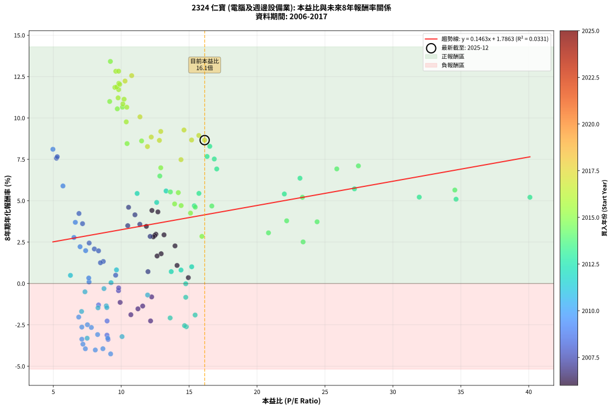
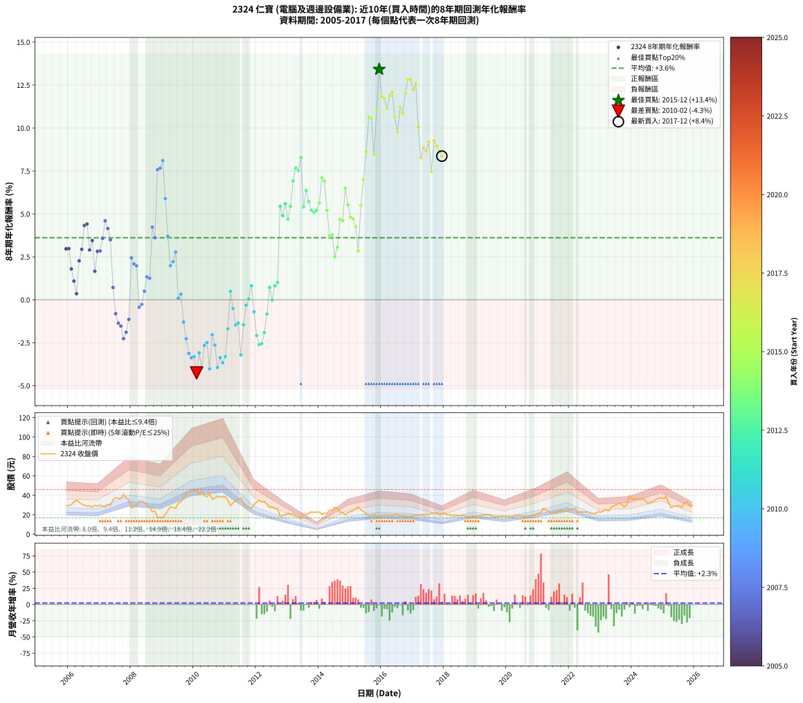

# 2324 仁寶 - 本益比與未來報酬率分析

!!! info "報告資訊"
    - **股票代號**: 2324
    - **公司名稱**: 仁寶
    - **產業別**: 電腦及週邊設備業
    - **分析期間**: 2006-2017 (144 個數據點)
    - **資料來源**: Type 12 (ShowMonthlyK_ChartFlow) 月收盤價與本益比
    - **報酬率口徑**: 含現金股利 (簡化: 年度合計，假設每年7/1入帳)
    - **報告生成時間**: 2026-01-04 08:24:17 CST

## 📈 視覺化圖表

### 圖表1: 本益比 vs 未來報酬率關係

*圖表1：2324 仁寶 本益比與8年期未來報酬率關係 (2006-2017)*

### 圖表2: 歷年買入時點的8年期實際報酬率

*圖表2：2324 仁寶 歷年買入時點的8年期實際報酬率 (2006-2017)*

## 📍 買點訊號說明

本報告提供兩種買點提示訊號（顯示於圖表2的股價子圖中）：

### ▲ 小綠色三角形（回測驗證）
- **計算方式**: 使用全部歷史資料計算本益比第25百分位數
- **用途**: 事後驗證，顯示歷史上哪些時點確實為低估區
- **限制**: 當下無法判斷，僅供回測參考
- **特性**: 後見之明（Look-Ahead Bias）

### ▲ 小橘色三角形（即時訊號）
- **計算方式**: 使用截至當月的過去5年資料計算本益比第25百分位數
- **用途**: 實際投資決策，當時即可判斷
- **優勢**: 可操作性強，符合實務需求
- **特性**: 無後見之明，滾動窗口計算

!!! tip "如何使用兩種訊號"
    - **綠色▲** 幫助理解歷史估值機會，驗證策略有效性
    - **橘色▲** 可作為實際買進參考，但仍需搭配基本面分析
    - 兩種訊號重疊時，表示即時判斷與事後驗證一致，信心度較高
    - 僅有綠色▲時，表示當時無法判斷（需要未來資料才能確認）
    - 僅有橘色▲時，表示即時判斷為買點，但事後可能不是最佳時機

## 📊 估值分析摘要

| 指標 | 數值 |
|:---:|:---:|
| **目前本益比** (2017-12) | **16.14 倍** |
| **歷史平均本益比** | 12.52 倍 |
| **估值水準** | 🔴 相對高估 |
| **預期8年年化報酬率** | **+4.15%** |
| **歷史平均報酬率** | +3.62% |
| **相關係數 (R²)** | 0.0331 |
| **趨勢線斜率** | 0.1463 |

!!! abstract "核心洞察"
    目前本益比顯著高於歷史平均，預期未來報酬率可能較低

    根據歷史數據回測，2324 仁寶 在目前本益比 **16.1倍** 的估值水準下，
    預期未來8年年化報酬率約為 **+4.1%**。

    **重要提醒**: 本分析基於歷史數據統計，實際報酬率會受到公司基本面變化、產業趨勢、
    總體經濟環境等多重因素影響。R² = 0.03 表示本益比可解釋約 3.3% 的報酬率變異。

## 📈 歷史估值統計

### 最佳買點 (最高報酬率)

| 項目 | 數值 |
|:---:|:---:|
| 起始時間 | 2015-12 |
| 當時本益比 | 9.20 倍 |
| 起始價格 | 18.5 元 |
| 8年後價格 | 39.9 元 |
| **8年年化報酬率** | **+13.42%** |

### 最差買點 (最低報酬率)

| 項目 | 數值 |
|:---:|:---:|
| 起始時間 | 2010-02 |
| 當時本益比 | 9.22 倍 |
| 起始價格 | 46.0 元 |
| 8年後價格 | 20.1 元 |
| **8年年化報酬率** | **-4.26%** |

## 🎯 投資啟示

### 本益比與報酬率關係

趨勢線方程式: **y = 0.1463x + 1.7863**

!!! info "弱相關或正相關"
    本益比與未來報酬率相關性較弱。這可能表示該股票的報酬率更多受到
    公司成長性、產業趨勢等因素影響，而非估值水準。**需綜合考量多項指標**。

### 估值區間建議

基於歷史數據分析:

- **🟢 低估區** (P/E < 10.0): 預期報酬率較高，可考慮增加持股
- **🟡 合理區** (P/E 10.0-15.0): 預期報酬率符合長期趨勢，正常持有
- **🔴 高估區** (P/E > 15.0): 預期報酬率較低，可考慮減碼或觀望

!!! danger "風險提示"
    - 過去表現不代表未來結果
    - 本分析假設公司基本面無重大結構性變化
    - 產業環境劇變可能使歷史規律失效
    - 應結合公司財報、產業趨勢、總體經濟等多重因素綜合判斷

!!! success "長期投資觀點"
    歷史數據顯示，在合理或低估的估值水準買入並長期持有，
    往往能獲得較佳的投資報酬。**耐心等待好價格**是價值投資的核心原則。

## 📊 數據品質

- **資料來源**: GoodInfo.tw Type 12 (ShowMonthlyK_ChartFlow)
- **資料頻率**: 月度收盤價與本益比
- **回測期間**: 2006-2017
- **數據點數量**: 144 個 (每個點代表一次8年期回測)

### 計算方法說明

1. **8年期年化報酬率**:
   - 對每個歷史時點，計算其後8年的實際投資報酬率
   - 期末價值(不含股利): 期末價格
   - 期末價值(含現金股利): 期末價格 + 持有期間內的現金股利合計 (簡化: 年度合計，假設每年7/1入帳)
   - 公式: 年化報酬率 = [(期末價值/期初價格)^(1/年數) - 1] × 100%

2. **本益比 (P/E Ratio)**:
   - 使用當時的月收盤價與EPS計算
   - 資料來源: Type 12 月度河流圖本益比數據

3. **趨勢線 (Linear Regression)**:
   - 使用最小平方法擬合線性趨勢線
   - R²值衡量本益比對報酬率的解釋能力

---

*本報告由 Stock Analysis System v1.9.0 自動生成*
*數據更新時間: 2026-01-04 08:24:17 CST*

## 📋 月度回測明細表

（每一列對應時間線圖中的一個買入點；可用來對照 SVG 圖上的每個點。）

| 買入月份 | 賣出月份 | 回測期限_年 | 實際持有年數 | 買入本益比_倍 | 買入收盤價_元 | 賣出收盤價_元 | 現金股利合計_元 | 總報酬率_pct | 年化報酬率_pct |
| --- | --- | --- | --- | --- | --- | --- | --- | --- | --- |
| 2006-01 | 2014-01 | 8 | 8.000 | 12.55 | 29.50 | 22.75 | 14.55 | +26.45 | +2.98 |
| 2006-02 | 2014-02 | 8 | 8.000 | 12.94 | 30.40 | 20.50 | 14.55 | +15.31 | +1.80 |
| 2006-03 | 2014-03 | 8 | 8.000 | 14.11 | 33.15 | 21.60 | 14.55 | +9.06 | +1.09 |
| 2006-04 | 2014-04 | 8 | 8.000 | 14.94 | 35.10 | 21.55 | 14.55 | +2.86 | +0.35 |
| 2006-05 | 2014-05 | 8 | 8.000 | 13.96 | 32.80 | 24.70 | 14.55 | +19.67 | +2.27 |
| 2006-06 | 2014-06 | 8 | 8.000 | 13.15 | 30.90 | 24.40 | 14.55 | +26.06 | +2.94 |
| 2006-07 | 2014-07 | 8 | 8.000 | 12.70 | 29.85 | 27.80 | 14.08 | +40.31 | +4.32 |
| 2006-08 | 2014-08 | 8 | 8.000 | 12.26 | 28.80 | 26.60 | 14.08 | +41.26 | +4.41 |
| 2006-09 | 2014-09 | 8 | 8.000 | 12.47 | 29.30 | 22.75 | 14.08 | +25.71 | +2.90 |
| 2006-10 | 2014-10 | 8 | 8.000 | 11.85 | 27.85 | 22.45 | 14.08 | +31.18 | +3.45 |
| 2006-11 | 2014-11 | 8 | 8.000 | 12.64 | 29.70 | 19.80 | 14.08 | +14.08 | +1.66 |
| 2006-12 | 2014-12 | 8 | 8.000 | 12.36 | 29.05 | 22.20 | 14.08 | +24.90 | +2.82 |
| 2007-01 | 2015-01 | 8 | 8.000 | 12.13 | 29.75 | 23.15 | 14.08 | +25.15 | +2.84 |
| 2007-02 | 2015-02 | 8 | 8.000 | 11.37 | 29.05 | 24.40 | 14.08 | +32.47 | +3.58 |
| 2007-03 | 2015-03 | 8 | 8.000 | 10.54 | 28.00 | 26.05 | 14.08 | +43.33 | +4.60 |
| 2007-04 | 2015-04 | 8 | 8.000 | 11.01 | 30.40 | 28.00 | 14.08 | +38.43 | +4.15 |
| 2007-05 | 2015-05 | 8 | 8.000 | 10.48 | 30.00 | 25.40 | 14.08 | +31.61 | +3.49 |
| 2007-06 | 2015-06 | 8 | 8.000 | 11.97 | 35.50 | 23.50 | 14.08 | +5.87 | +0.72 |
| 2007-07 | 2015-07 | 8 | 8.000 | 12.24 | 37.55 | 21.30 | 13.88 | -6.30 | -0.81 |
| 2007-08 | 2015-08 | 8 | 8.000 | 11.58 | 36.70 | 19.00 | 13.88 | -10.40 | -1.36 |
| 2007-09 | 2015-09 | 8 | 8.000 | 11.23 | 36.75 | 18.60 | 13.88 | -11.61 | -1.53 |
| 2007-10 | 2015-10 | 8 | 8.000 | 12.16 | 41.05 | 20.30 | 13.88 | -16.73 | -2.26 |
| 2007-11 | 2015-11 | 8 | 8.000 | 10.71 | 37.25 | 18.10 | 13.88 | -14.14 | -1.89 |
| 2007-12 | 2015-12 | 8 | 8.000 | 9.92 | 35.50 | 18.50 | 13.88 | -8.78 | -1.14 |
| 2008-01 | 2016-01 | 8 | 8.000 | 7.64 | 27.15 | 19.05 | 13.88 | +21.30 | +2.44 |
| 2008-02 | 2016-02 | 8 | 8.000 | 8.02 | 28.30 | 19.50 | 13.88 | +17.96 | +2.09 |
| 2008-03 | 2016-03 | 8 | 8.000 | 8.33 | 29.15 | 20.20 | 13.88 | +16.92 | +1.97 |
| 2008-04 | 2016-04 | 8 | 8.000 | 9.80 | 34.05 | 19.00 | 13.88 | -3.43 | -0.43 |
| 2008-05 | 2016-05 | 8 | 8.000 | 9.81 | 33.80 | 19.20 | 13.88 | -2.12 | -0.27 |
| 2008-06 | 2016-06 | 8 | 8.000 | 9.59 | 32.80 | 20.25 | 13.88 | +4.06 | +0.50 |
| 2008-07 | 2016-07 | 8 | 8.000 | 8.68 | 29.45 | 20.05 | 12.68 | +11.15 | +1.33 |
| 2008-08 | 2016-08 | 8 | 8.000 | 8.47 | 28.50 | 18.80 | 12.68 | +10.47 | +1.25 |
| 2008-09 | 2016-09 | 8 | 8.000 | 6.89 | 23.00 | 19.35 | 12.68 | +39.28 | +4.23 |
| 2008-10 | 2016-10 | 8 | 8.000 | 7.15 | 23.70 | 18.80 | 12.68 | +32.84 | +3.61 |
| 2008-11 | 2016-11 | 8 | 8.000 | 5.23 | 17.20 | 18.15 | 12.68 | +79.27 | +7.57 |
| 2008-12 | 2016-12 | 8 | 8.000 | 5.29 | 17.25 | 18.45 | 12.68 | +80.49 | +7.66 |
| 2009-01 | 2017-01 | 8 | 8.000 | 4.97 | 16.90 | 18.85 | 12.68 | +86.59 | +8.11 |
| 2009-02 | 2017-02 | 8 | 8.000 | 5.71 | 20.20 | 19.25 | 12.68 | +58.09 | +5.89 |
| 2009-03 | 2017-03 | 8 | 8.000 | 6.62 | 24.30 | 19.80 | 12.68 | +33.68 | +3.70 |
| 2009-04 | 2017-04 | 8 | 8.000 | 7.38 | 28.10 | 20.20 | 12.68 | +17.02 | +1.98 |
| 2009-05 | 2017-05 | 8 | 8.000 | 6.97 | 27.50 | 20.10 | 12.68 | +19.21 | +2.22 |
| 2009-06 | 2017-06 | 8 | 8.000 | 6.52 | 26.65 | 20.50 | 12.68 | +24.52 | +2.78 |
| 2009-07 | 2017-07 | 8 | 8.000 | 7.63 | 32.20 | 20.05 | 12.38 | +0.73 | +0.09 |
| 2009-08 | 2017-08 | 8 | 8.000 | 7.61 | 33.20 | 21.70 | 12.38 | +2.66 | +0.33 |
| 2009-09 | 2017-09 | 8 | 8.000 | 8.33 | 37.45 | 21.35 | 12.38 | -9.92 | -1.30 |
| 2009-10 | 2017-10 | 8 | 8.000 | 8.96 | 41.55 | 22.20 | 12.38 | -16.77 | -2.27 |
| 2009-11 | 2017-11 | 8 | 8.000 | 8.95 | 42.70 | 20.75 | 12.38 | -22.40 | -3.12 |
| 2009-12 | 2017-12 | 8 | 8.000 | 9.03 | 44.35 | 21.30 | 12.38 | -24.05 | -3.38 |
| 2010-01 | 2018-01 | 8 | 8.000 | 9.01 | 44.60 | 21.70 | 12.38 | -23.58 | -3.31 |
| 2010-02 | 2018-02 | 8 | 8.000 | 9.22 | 46.00 | 20.10 | 12.38 | -29.38 | -4.26 |
| 2010-03 | 2018-03 | 8 | 8.000 | 8.26 | 41.55 | 19.95 | 12.38 | -22.18 | -3.09 |
| 2010-04 | 2018-04 | 8 | 8.000 | 8.65 | 43.85 | 19.40 | 12.38 | -27.52 | -3.94 |
| 2010-05 | 2018-05 | 8 | 8.000 | 7.80 | 39.80 | 19.70 | 12.38 | -19.39 | -2.66 |
| 2010-06 | 2018-06 | 8 | 8.000 | 7.51 | 38.65 | 19.20 | 12.38 | -18.28 | -2.49 |
| 2010-07 | 2018-07 | 8 | 8.000 | 8.09 | 41.95 | 19.00 | 11.22 | -27.97 | -4.02 |
| 2010-08 | 2018-08 | 8 | 8.000 | 6.87 | 35.90 | 19.25 | 11.22 | -15.14 | -2.03 |
| 2010-09 | 2018-09 | 8 | 8.000 | 7.10 | 37.35 | 18.95 | 11.22 | -19.23 | -2.63 |
| 2010-10 | 2018-10 | 8 | 8.000 | 7.36 | 39.00 | 17.05 | 11.22 | -27.52 | -3.94 |
| 2010-11 | 2018-11 | 8 | 8.000 | 7.10 | 37.90 | 17.60 | 11.22 | -23.97 | -3.37 |
| 2010-12 | 2018-12 | 8 | 8.000 | 7.18 | 38.65 | 17.45 | 11.22 | -25.83 | -3.67 |
| 2011-01 | 2019-01 | 8 | 8.000 | 7.49 | 38.50 | 18.20 | 11.22 | -23.59 | -3.31 |
| 2011-02 | 2019-02 | 8 | 8.000 | 7.08 | 34.75 | 19.10 | 11.22 | -12.76 | -1.69 |
| 2011-03 | 2019-03 | 8 | 8.000 | 6.26 | 29.20 | 19.15 | 11.22 | +3.99 | +0.49 |
| 2011-04 | 2019-04 | 8 | 8.000 | 7.33 | 32.45 | 19.95 | 11.22 | -3.96 | -0.50 |
| 2011-05 | 2019-05 | 8 | 8.000 | 8.29 | 34.75 | 19.65 | 11.22 | -11.18 | -1.47 |
| 2011-06 | 2019-06 | 8 | 8.000 | 8.90 | 35.20 | 20.35 | 11.22 | -10.32 | -1.35 |
| 2011-07 | 2019-07 | 8 | 8.000 | 10.06 | 37.40 | 19.10 | 9.71 | -22.98 | -3.21 |
| 2011-08 | 2019-08 | 8 | 8.000 | 8.94 | 31.10 | 17.95 | 9.71 | -11.07 | -1.46 |
| 2011-09 | 2019-09 | 8 | 8.000 | 8.73 | 28.30 | 17.90 | 9.71 | -2.45 | -0.31 |
| 2011-10 | 2019-10 | 8 | 8.000 | 9.25 | 27.80 | 18.20 | 9.71 | +0.38 | +0.05 |
| 2011-11 | 2019-11 | 8 | 8.000 | 9.65 | 26.70 | 18.80 | 9.71 | +6.77 | +0.82 |
| 2011-12 | 2019-12 | 8 | 8.000 | 11.94 | 30.20 | 18.85 | 9.71 | -5.44 | -0.70 |
| 2012-01 | 2020-01 | 8 | 8.000 | 13.60 | 33.20 | 18.35 | 9.71 | -15.49 | -2.08 |
| 2012-02 | 2020-02 | 8 | 8.000 | 14.79 | 34.80 | 18.45 | 9.71 | -19.09 | -2.61 |
| 2012-03 | 2020-03 | 8 | 8.000 | 14.66 | 33.20 | 17.30 | 9.71 | -18.65 | -2.55 |
| 2012-04 | 2020-04 | 8 | 8.000 | 15.44 | 33.60 | 19.10 | 9.71 | -14.26 | -1.91 |
| 2012-05 | 2020-05 | 8 | 8.000 | 14.75 | 30.80 | 19.10 | 9.71 | -6.47 | -0.83 |
| 2012-06 | 2020-06 | 8 | 8.000 | 13.68 | 27.35 | 19.25 | 9.71 | +5.88 | +0.72 |
| 2012-07 | 2020-07 | 8 | 8.000 | 14.75 | 28.20 | 18.65 | 9.51 | -0.15 | -0.02 |
| 2012-08 | 2020-08 | 8 | 8.000 | 14.40 | 26.25 | 18.50 | 9.51 | +6.69 | +0.81 |
| 2012-09 | 2020-09 | 8 | 8.000 | 15.19 | 26.35 | 19.05 | 9.51 | +8.38 | +1.01 |
| 2012-10 | 2020-10 | 8 | 8.000 | 11.17 | 18.40 | 18.60 | 9.51 | +52.76 | +5.44 |
| 2012-11 | 2020-11 | 8 | 8.000 | 12.61 | 19.65 | 19.30 | 9.51 | +46.60 | +4.90 |
| 2012-12 | 2020-12 | 8 | 8.000 | 13.30 | 19.55 | 20.70 | 9.51 | +54.51 | +5.59 |
| 2013-01 | 2021-01 | 8 | 8.000 | 15.38 | 21.45 | 21.45 | 9.51 | +44.32 | +4.69 |
| 2013-02 | 2021-02 | 8 | 8.000 | 15.72 | 20.75 | 22.20 | 9.51 | +52.80 | +5.44 |
| 2013-03 | 2021-03 | 8 | 8.000 | 17.03 | 21.20 | 26.70 | 9.51 | +70.79 | +6.92 |
| 2013-04 | 2021-04 | 8 | 8.000 | 16.32 | 19.10 | 25.00 | 9.51 | +80.66 | +7.67 |
| 2013-05 | 2021-05 | 8 | 8.000 | 16.85 | 18.45 | 23.45 | 9.51 | +78.63 | +7.52 |
| 2013-06 | 2021-06 | 8 | 8.000 | 16.52 | 16.85 | 22.35 | 9.51 | +89.06 | +8.29 |
| 2013-07 | 2021-07 | 8 | 8.000 | 22.01 | 20.80 | 21.60 | 10.10 | +52.40 | +5.41 |
| 2013-08 | 2021-08 | 8 | 8.000 | 23.16 | 20.15 | 22.90 | 10.10 | +63.77 | +6.36 |
| 2013-09 | 2021-09 | 8 | 8.000 | 27.17 | 21.60 | 23.60 | 10.10 | +56.02 | +5.72 |
| 2013-10 | 2021-10 | 8 | 8.000 | 31.94 | 23.00 | 24.45 | 10.10 | +50.22 | +5.22 |
| 2013-11 | 2021-11 | 8 | 8.000 | 34.65 | 22.35 | 23.15 | 10.10 | +48.77 | +5.09 |
| 2013-12 | 2021-12 | 8 | 8.000 | 40.09 | 22.85 | 24.20 | 10.10 | +50.11 | +5.21 |
| 2014-01 | 2022-01 | 8 | 8.000 | 34.56 | 22.75 | 25.20 | 10.10 | +55.16 | +5.65 |
| 2014-02 | 2022-02 | 8 | 8.000 | 27.46 | 20.50 | 25.40 | 10.10 | +73.17 | +7.10 |
| 2014-03 | 2022-03 | 8 | 8.000 | 25.87 | 21.60 | 26.80 | 10.10 | +70.83 | +6.92 |
| 2014-04 | 2022-04 | 8 | 8.000 | 23.34 | 21.55 | 22.25 | 10.10 | +50.12 | +5.21 |
| 2014-05 | 2022-05 | 8 | 8.000 | 24.42 | 24.70 | 23.00 | 10.10 | +34.01 | +3.73 |
| 2014-06 | 2022-06 | 8 | 8.000 | 22.18 | 24.40 | 22.75 | 10.10 | +34.63 | +3.79 |
| 2014-07 | 2022-07 | 8 | 8.000 | 23.39 | 27.80 | 22.80 | 11.10 | +21.95 | +2.51 |
| 2014-08 | 2022-08 | 8 | 8.000 | 20.84 | 26.60 | 22.75 | 11.10 | +27.26 | +3.06 |
| 2014-09 | 2022-09 | 8 | 8.000 | 16.67 | 22.75 | 21.70 | 11.10 | +44.18 | +4.68 |
| 2014-10 | 2022-10 | 8 | 8.000 | 15.45 | 22.45 | 21.10 | 11.10 | +43.43 | +4.61 |
| 2014-11 | 2022-11 | 8 | 8.000 | 12.84 | 19.80 | 21.65 | 11.10 | +65.41 | +6.49 |
| 2014-12 | 2022-12 | 8 | 8.000 | 13.62 | 22.20 | 23.05 | 11.10 | +53.83 | +5.53 |
| 2015-01 | 2023-01 | 8 | 8.000 | 13.93 | 23.15 | 22.60 | 11.10 | +45.58 | +4.81 |
| 2015-02 | 2023-02 | 8 | 8.000 | 14.41 | 24.40 | 24.15 | 11.10 | +44.47 | +4.71 |
| 2015-03 | 2023-03 | 8 | 8.000 | 15.10 | 26.05 | 25.25 | 11.10 | +39.54 | +4.25 |
| 2015-04 | 2023-04 | 8 | 8.000 | 15.94 | 28.00 | 23.95 | 11.10 | +25.18 | +2.85 |
| 2015-05 | 2023-05 | 8 | 8.000 | 14.20 | 25.40 | 27.85 | 11.10 | +53.35 | +5.49 |
| 2015-06 | 2023-06 | 8 | 8.000 | 12.91 | 23.50 | 29.25 | 11.10 | +71.71 | +6.99 |
| 2015-07 | 2023-07 | 8 | 8.000 | 11.50 | 21.30 | 30.45 | 10.80 | +93.67 | +8.61 |
| 2015-08 | 2023-08 | 8 | 8.000 | 10.09 | 19.00 | 31.90 | 10.80 | +124.74 | +10.65 |
| 2015-09 | 2023-09 | 8 | 8.000 | 9.71 | 18.60 | 30.70 | 10.80 | +123.12 | +10.55 |
| 2015-10 | 2023-10 | 8 | 8.000 | 10.43 | 20.30 | 28.05 | 10.80 | +91.38 | +8.45 |
| 2015-11 | 2023-11 | 8 | 8.000 | 9.15 | 18.10 | 30.90 | 10.80 | +130.39 | +11.00 |
| 2015-12 | 2023-12 | 8 | 8.000 | 9.20 | 18.50 | 39.85 | 10.80 | +173.79 | +13.42 |
| 2016-01 | 2024-01 | 8 | 8.000 | 9.53 | 19.05 | 35.85 | 10.80 | +144.89 | +11.85 |
| 2016-02 | 2024-02 | 8 | 8.000 | 9.81 | 19.50 | 36.50 | 10.80 | +142.57 | +11.71 |
| 2016-03 | 2024-03 | 8 | 8.000 | 10.21 | 20.20 | 36.20 | 10.80 | +132.68 | +11.13 |
| 2016-04 | 2024-04 | 8 | 8.000 | 9.66 | 19.00 | 35.80 | 10.80 | +145.27 | +11.87 |
| 2016-05 | 2024-05 | 8 | 8.000 | 9.82 | 19.20 | 37.05 | 10.80 | +149.22 | +12.09 |
| 2016-06 | 2024-06 | 8 | 8.000 | 10.41 | 20.25 | 34.70 | 10.80 | +124.70 | +10.65 |
| 2016-07 | 2024-07 | 8 | 8.000 | 10.37 | 20.05 | 31.45 | 10.80 | +110.72 | +9.77 |
| 2016-08 | 2024-08 | 8 | 8.000 | 9.77 | 18.80 | 33.20 | 10.80 | +134.04 | +11.21 |
| 2016-09 | 2024-09 | 8 | 8.000 | 10.12 | 19.35 | 33.30 | 10.80 | +127.91 | +10.85 |
| 2016-10 | 2024-10 | 8 | 8.000 | 9.89 | 18.80 | 35.85 | 10.80 | +148.14 | +12.03 |
| 2016-11 | 2024-11 | 8 | 8.000 | 9.60 | 18.15 | 36.85 | 10.80 | +162.53 | +12.82 |
| 2016-12 | 2024-12 | 8 | 8.000 | 9.81 | 18.45 | 37.65 | 10.80 | +162.60 | +12.83 |
| 2017-01 | 2025-01 | 8 | 8.000 | 10.28 | 18.85 | 36.65 | 10.80 | +151.72 | +12.23 |
| 2017-02 | 2025-02 | 8 | 8.000 | 10.77 | 19.25 | 38.80 | 10.80 | +157.66 | +12.56 |
| 2017-03 | 2025-03 | 8 | 8.000 | 11.38 | 19.80 | 31.85 | 10.80 | +115.40 | +10.07 |
| 2017-04 | 2025-04 | 8 | 8.000 | 11.93 | 20.20 | 27.35 | 10.80 | +88.86 | +8.27 |
| 2017-05 | 2025-05 | 8 | 8.000 | 12.21 | 20.10 | 28.80 | 10.80 | +97.01 | +8.85 |
| 2017-06 | 2025-06 | 8 | 8.000 | 12.81 | 20.50 | 29.00 | 10.80 | +94.15 | +8.65 |
| 2017-07 | 2025-07 | 8 | 8.000 | 12.91 | 20.05 | 29.50 | 11.00 | +102.00 | +9.19 |
| 2017-08 | 2025-08 | 8 | 8.000 | 14.40 | 21.70 | 27.65 | 11.00 | +78.11 | +7.48 |
| 2017-09 | 2025-09 | 8 | 8.000 | 14.62 | 21.35 | 32.40 | 11.00 | +103.28 | +9.27 |
| 2017-10 | 2025-10 | 8 | 8.000 | 15.71 | 22.20 | 33.05 | 11.00 | +98.42 | +8.94 |
| 2017-11 | 2025-11 | 8 | 8.000 | 15.18 | 20.75 | 29.35 | 11.00 | +94.46 | +8.67 |
| 2017-12 | 2025-12 | 8 | 8.000 | 16.14 | 21.30 | 30.40 | 11.00 | +94.37 | +8.66 |
