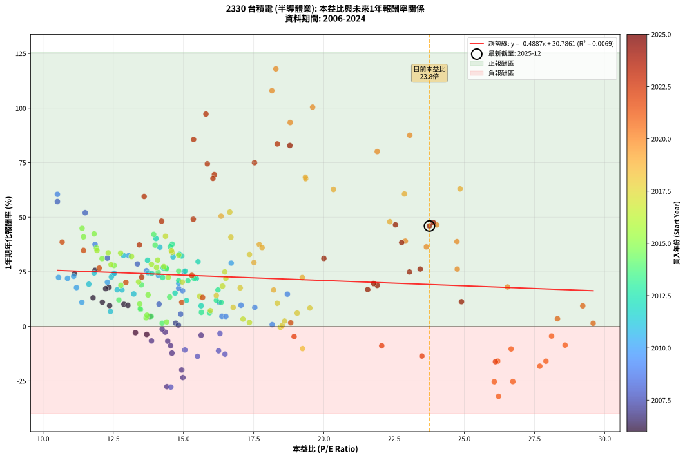
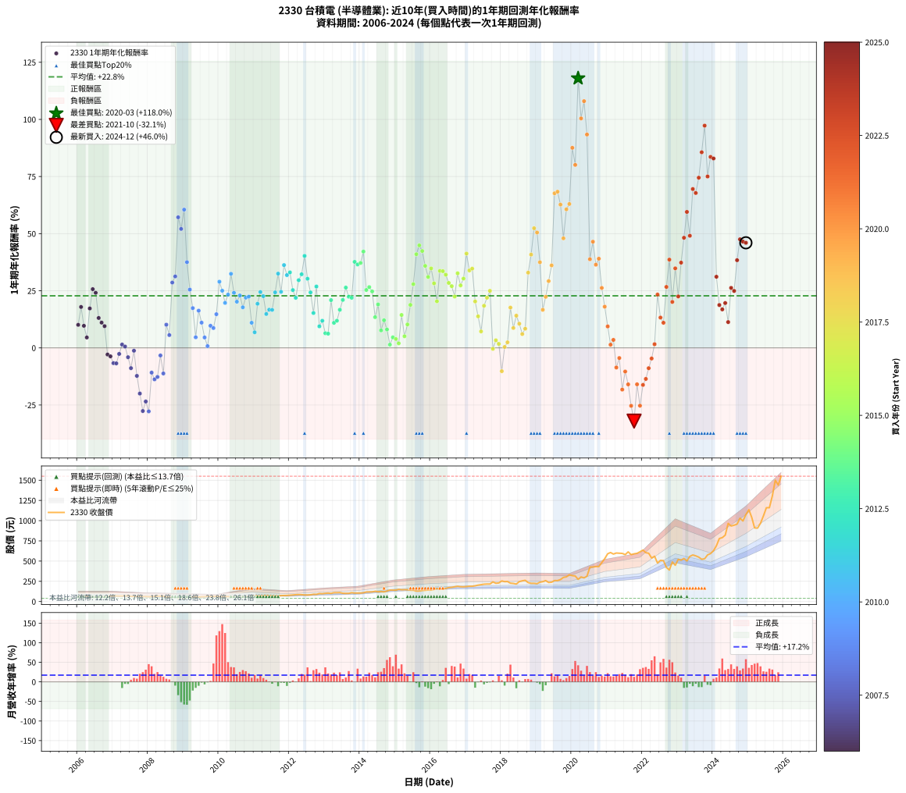

# 2330 台積電 - 本益比與未來報酬率分析

!!! info "報告資訊"
    - **股票代號**: 2330
    - **公司名稱**: 台積電
    - **產業別**: 半導體業
    - **分析期間**: 2006-2024 (228 個數據點)
    - **資料來源**: Type 12 (ShowMonthlyK_ChartFlow) 月收盤價與本益比
    - **報酬率口徑**: 含現金股利 (簡化: 年度合計，假設每年7/1入帳)
    - **報告生成時間**: 2026-01-07 18:26:09 CST

## 📈 視覺化圖表

### 圖表1: 本益比 vs 未來報酬率關係

*圖表1：2330 台積電 本益比與1年期未來報酬率關係 (2006-2024)*

### 圖表2: 歷年買入時點的1年期實際報酬率

*圖表2：2330 台積電 歷年買入時點的1年期實際報酬率 (2006-2024)*

## 📍 買點訊號說明

本報告提供兩種買點提示訊號（顯示於圖表2的股價子圖中）：

### ▲ 小綠色三角形（回測驗證）
- **計算方式**: 使用全部歷史資料計算本益比第25百分位數
- **用途**: 事後驗證，顯示歷史上哪些時點確實為低估區
- **限制**: 當下無法判斷，僅供回測參考
- **特性**: 後見之明（Look-Ahead Bias）

### ▲ 小橘色三角形（即時訊號）
- **計算方式**: 使用截至當月的過去5年資料計算本益比第25百分位數
- **用途**: 實際投資決策，當時即可判斷
- **優勢**: 可操作性強，符合實務需求
- **特性**: 無後見之明，滾動窗口計算

!!! tip "如何使用兩種訊號"
    - **綠色▲** 幫助理解歷史估值機會，驗證策略有效性
    - **橘色▲** 可作為實際買進參考，但仍需搭配基本面分析
    - 兩種訊號重疊時，表示即時判斷與事後驗證一致，信心度較高
    - 僅有綠色▲時，表示當時無法判斷（需要未來資料才能確認）
    - 僅有橘色▲時，表示即時判斷為買點，但事後可能不是最佳時機

## 📊 估值分析摘要

| 指標 | 數值 |
|:---:|:---:|
| **目前本益比** (2024-12) | **23.76 倍** |
| **歷史平均本益比** | 16.36 倍 |
| **估值水準** | 🔴 相對高估 |
| **預期1年年化報酬率** | **+19.17%** |
| **歷史平均報酬率** | +22.79% |
| **相關係數 (R²)** | 0.0069 |
| **趨勢線斜率** | -0.4887 |

!!! abstract "核心洞察"
    目前本益比顯著高於歷史平均，預期未來報酬率可能較低

    根據歷史數據回測，2330 台積電 在目前本益比 **23.8倍** 的估值水準下，
    預期未來1年年化報酬率約為 **+19.2%**。

    **重要提醒**: 本分析基於歷史數據統計，實際報酬率會受到公司基本面變化、產業趨勢、
    總體經濟環境等多重因素影響。R² = 0.01 表示本益比可解釋約 0.7% 的報酬率變異。

## 📈 歷史估值統計

### 最佳買點 (最高報酬率)

| 項目 | 數值 |
|:---:|:---:|
| 起始時間 | 2020-03 |
| 當時本益比 | 18.29 倍 |
| 起始價格 | 274.0 元 |
| 1年後價格 | 587.0 元 |
| **1年年化報酬率** | **+118.00%** |

### 最差買點 (最低報酬率)

| 項目 | 數值 |
|:---:|:---:|
| 起始時間 | 2021-10 |
| 當時本益比 | 26.22 倍 |
| 起始價格 | 590.0 元 |
| 1年後價格 | 390.0 元 |
| **1年年化報酬率** | **-32.05%** |

## 🎯 投資啟示

### 本益比與報酬率關係

趨勢線方程式: **y = -0.4887x + 30.7861**

!!! note "負相關"
    本益比與未來報酬率呈現負相關。較低的本益比通常帶來較高的未來報酬率，
    但相關性不算非常強。**估值仍是重要參考指標之一**。

### 估值區間建議

基於歷史數據分析:

- **🟢 低估區** (P/E < 13.1): 預期報酬率較高，可考慮增加持股
- **🟡 合理區** (P/E 13.1-19.6): 預期報酬率符合長期趨勢，正常持有
- **🔴 高估區** (P/E > 19.6): 預期報酬率較低，可考慮減碼或觀望

!!! danger "風險提示"
    - 過去表現不代表未來結果
    - 本分析假設公司基本面無重大結構性變化
    - 產業環境劇變可能使歷史規律失效
    - 應結合公司財報、產業趨勢、總體經濟等多重因素綜合判斷

!!! success "長期投資觀點"
    歷史數據顯示，在合理或低估的估值水準買入並長期持有，
    往往能獲得較佳的投資報酬。**耐心等待好價格**是價值投資的核心原則。

## 📊 數據品質

- **資料來源**: GoodInfo.tw Type 12 (ShowMonthlyK_ChartFlow)
- **資料頻率**: 月度收盤價與本益比
- **回測期間**: 2006-2024
- **數據點數量**: 228 個 (每個點代表一次1年期回測)

### 計算方法說明

1. **1年期年化報酬率**:
   - 對每個歷史時點，計算其後1年的實際投資報酬率
   - 期末價值(不含股利): 期末價格
   - 期末價值(含現金股利): 期末價格 + 持有期間內的現金股利合計 (簡化: 年度合計，假設每年7/1入帳)
   - 公式: 年化報酬率 = [(期末價值/期初價格)^(1/年數) - 1] × 100%

2. **本益比 (P/E Ratio)**:
   - 使用當時的月收盤價與EPS計算
   - 資料來源: Type 12 月度河流圖本益比數據

3. **趨勢線 (Linear Regression)**:
   - 使用最小平方法擬合線性趨勢線
   - R²值衡量本益比對報酬率的解釋能力

---

*本報告由 Stock Analysis System v1.9.0 自動生成*
*數據更新時間: 2026-01-07 18:26:09 CST*

## 📋 月度回測明細表

（每一列對應時間線圖中的一個買入點；可用來對照 SVG 圖上的每個點。）

| 買入月份 | 賣出月份 | 回測期限_年 | 實際持有年數 | 買入本益比_倍 | 買入收盤價_元 | 賣出收盤價_元 | 現金股利合計_元 | 總報酬率_pct | 年化報酬率_pct |
| --- | --- | --- | --- | --- | --- | --- | --- | --- | --- |
| 2006-01 | 2007-01 | 1 | 0.999 | 12.88 | 63.50 | 67.40 | 2.50 | +10.08 | +10.08 |
| 2006-02 | 2007-02 | 1 | 0.999 | 12.35 | 60.90 | 69.30 | 2.50 | +17.90 | +17.91 |
| 2006-03 | 2007-03 | 1 | 0.999 | 13.02 | 64.20 | 67.90 | 2.50 | +9.66 | +9.66 |
| 2006-04 | 2007-04 | 1 | 0.999 | 13.81 | 68.10 | 68.70 | 2.50 | +4.55 | +4.55 |
| 2006-05 | 2007-05 | 1 | 0.999 | 12.23 | 60.30 | 68.20 | 2.50 | +17.25 | +17.26 |
| 2006-06 | 2007-06 | 1 | 0.999 | 11.85 | 58.40 | 70.90 | 2.50 | +25.68 | +25.70 |
| 2006-07 | 2007-07 | 1 | 0.999 | 11.12 | 54.80 | 65.00 | 3.00 | +24.09 | +24.11 |
| 2006-08 | 2007-08 | 1 | 0.999 | 11.78 | 58.10 | 62.70 | 3.00 | +13.08 | +13.09 |
| 2006-09 | 2007-09 | 1 | 0.999 | 12.11 | 59.70 | 63.30 | 3.00 | +11.06 | +11.06 |
| 2006-10 | 2007-10 | 1 | 0.999 | 12.37 | 61.00 | 63.80 | 3.00 | +9.51 | +9.52 |
| 2006-11 | 2007-11 | 1 | 0.999 | 13.29 | 65.50 | 60.60 | 3.00 | -2.90 | -2.90 |
| 2006-12 | 2007-12 | 1 | 0.999 | 13.69 | 67.50 | 62.00 | 3.00 | -3.70 | -3.71 |
| 2007-01 | 2008-01 | 1 | 0.999 | 13.86 | 67.40 | 59.90 | 3.00 | -6.68 | -6.68 |
| 2007-02 | 2008-02 | 1 | 0.999 | 14.44 | 69.30 | 61.60 | 3.00 | -6.78 | -6.79 |
| 2007-03 | 2008-03 | 1 | 1.002 | 14.35 | 67.90 | 63.10 | 3.00 | -2.65 | -2.65 |
| 2007-04 | 2008-04 | 1 | 1.002 | 14.72 | 68.70 | 66.70 | 3.00 | +1.46 | +1.45 |
| 2007-05 | 2008-05 | 1 | 1.002 | 14.82 | 68.20 | 65.60 | 3.00 | +0.59 | +0.59 |
| 2007-06 | 2008-06 | 1 | 1.002 | 15.63 | 70.90 | 65.00 | 3.00 | -4.09 | -4.08 |
| 2007-07 | 2008-07 | 1 | 1.002 | 14.54 | 65.00 | 56.20 | 3.02 | -8.88 | -8.87 |
| 2007-08 | 2008-08 | 1 | 1.002 | 14.24 | 62.70 | 58.90 | 3.02 | -1.24 | -1.23 |
| 2007-09 | 2008-09 | 1 | 1.002 | 14.59 | 63.30 | 52.50 | 3.02 | -12.28 | -12.26 |
| 2007-10 | 2008-10 | 1 | 1.002 | 14.94 | 63.80 | 48.00 | 3.02 | -20.02 | -19.99 |
| 2007-11 | 2008-11 | 1 | 1.002 | 14.41 | 60.60 | 40.80 | 3.02 | -27.68 | -27.63 |
| 2007-12 | 2008-12 | 1 | 1.002 | 14.98 | 62.00 | 44.40 | 3.02 | -23.51 | -23.47 |
| 2008-01 | 2009-01 | 1 | 1.002 | 14.55 | 59.90 | 40.20 | 3.02 | -27.84 | -27.79 |
| 2008-02 | 2009-03 | 1 | 1.081 | 15.05 | 61.60 | 51.40 | 3.02 | -11.65 | -10.82 |
| 2008-03 | 2009-03 | 1 | 0.999 | 15.50 | 63.10 | 51.40 | 3.02 | -13.75 | -13.76 |
| 2008-04 | 2009-04 | 1 | 0.999 | 16.48 | 66.70 | 55.20 | 3.02 | -12.71 | -12.71 |
| 2008-05 | 2009-05 | 1 | 0.999 | 16.30 | 65.60 | 60.40 | 3.02 | -3.32 | -3.32 |
| 2008-06 | 2009-06 | 1 | 0.999 | 16.25 | 65.00 | 54.70 | 3.02 | -11.19 | -11.20 |
| 2008-07 | 2009-07 | 1 | 0.999 | 14.13 | 56.20 | 58.90 | 3.00 | +10.14 | +10.15 |
| 2008-08 | 2009-08 | 1 | 0.999 | 14.90 | 58.90 | 59.20 | 3.00 | +5.60 | +5.61 |
| 2008-09 | 2009-09 | 1 | 0.999 | 13.36 | 52.50 | 64.50 | 3.00 | +28.57 | +28.59 |
| 2008-10 | 2009-10 | 1 | 0.999 | 12.29 | 48.00 | 60.00 | 3.00 | +31.25 | +31.27 |
| 2008-11 | 2009-11 | 1 | 0.999 | 10.51 | 40.80 | 61.10 | 3.00 | +57.11 | +57.16 |
| 2008-12 | 2009-12 | 1 | 0.999 | 11.50 | 44.40 | 64.50 | 3.00 | +52.03 | +52.07 |
| 2009-01 | 2010-01 | 1 | 0.999 | 10.51 | 40.20 | 61.50 | 3.00 | +60.45 | +60.50 |
| 2009-02 | 2010-02 | 1 | 0.999 | 11.85 | 44.95 | 58.80 | 3.00 | +37.49 | +37.52 |
| 2009-03 | 2010-03 | 1 | 0.999 | 13.68 | 51.40 | 61.50 | 3.00 | +25.49 | +25.51 |
| 2009-04 | 2010-04 | 1 | 0.999 | 14.83 | 55.20 | 61.80 | 3.00 | +17.39 | +17.40 |
| 2009-05 | 2010-05 | 1 | 0.999 | 16.37 | 60.40 | 60.20 | 3.00 | +4.64 | +4.64 |
| 2009-06 | 2010-06 | 1 | 0.999 | 14.97 | 54.70 | 60.60 | 3.00 | +16.27 | +16.28 |
| 2009-07 | 2010-07 | 1 | 0.999 | 16.27 | 58.90 | 62.40 | 3.00 | +11.04 | +11.04 |
| 2009-08 | 2010-08 | 1 | 0.999 | 16.51 | 59.20 | 58.90 | 3.00 | +4.56 | +4.56 |
| 2009-09 | 2010-09 | 1 | 0.999 | 18.16 | 64.50 | 62.00 | 3.00 | +0.78 | +0.78 |
| 2009-10 | 2010-10 | 1 | 0.999 | 17.05 | 60.00 | 62.80 | 3.00 | +9.67 | +9.67 |
| 2009-11 | 2010-11 | 1 | 0.999 | 17.54 | 61.10 | 63.40 | 3.00 | +8.67 | +8.68 |
| 2009-12 | 2010-12 | 1 | 0.999 | 18.70 | 64.50 | 71.00 | 3.00 | +14.73 | +14.74 |
| 2010-01 | 2011-01 | 1 | 0.999 | 16.70 | 61.50 | 76.30 | 3.00 | +28.94 | +28.97 |
| 2010-02 | 2011-02 | 1 | 0.999 | 15.02 | 58.80 | 70.50 | 3.00 | +25.00 | +25.02 |
| 2010-03 | 2011-03 | 1 | 0.999 | 14.83 | 61.50 | 70.60 | 3.00 | +19.67 | +19.69 |
| 2010-04 | 2011-04 | 1 | 0.999 | 14.11 | 61.80 | 73.20 | 3.00 | +23.30 | +23.32 |
| 2010-05 | 2011-05 | 1 | 0.999 | 13.05 | 60.20 | 76.70 | 3.00 | +32.39 | +32.42 |
| 2010-06 | 2011-06 | 1 | 0.999 | 12.51 | 60.60 | 72.20 | 3.00 | +24.09 | +24.11 |
| 2010-07 | 2011-07 | 1 | 0.999 | 12.29 | 62.40 | 72.00 | 3.00 | +20.19 | +20.21 |
| 2010-08 | 2011-08 | 1 | 0.999 | 11.09 | 58.90 | 69.40 | 3.00 | +22.92 | +22.94 |
| 2010-09 | 2011-09 | 1 | 0.999 | 11.19 | 62.00 | 70.00 | 3.00 | +17.74 | +17.76 |
| 2010-10 | 2011-10 | 1 | 0.999 | 10.87 | 62.80 | 73.60 | 3.00 | +21.97 | +21.99 |
| 2010-11 | 2011-11 | 1 | 0.999 | 10.55 | 63.40 | 74.60 | 3.00 | +22.40 | +22.41 |
| 2010-12 | 2011-12 | 1 | 0.999 | 11.38 | 71.00 | 75.80 | 3.00 | +10.99 | +10.99 |
| 2011-01 | 2012-01 | 1 | 0.999 | 12.40 | 76.30 | 78.50 | 3.00 | +6.82 | +6.82 |
| 2011-02 | 2012-02 | 1 | 0.999 | 11.63 | 70.50 | 81.10 | 3.00 | +19.29 | +19.31 |
| 2011-03 | 2012-03 | 1 | 1.002 | 11.82 | 70.60 | 84.90 | 3.00 | +24.50 | +24.45 |
| 2011-04 | 2012-04 | 1 | 1.002 | 12.43 | 73.20 | 86.80 | 3.00 | +22.68 | +22.63 |
| 2011-05 | 2012-05 | 1 | 1.002 | 13.23 | 76.70 | 85.10 | 3.00 | +14.86 | +14.83 |
| 2011-06 | 2012-06 | 1 | 1.002 | 12.64 | 72.20 | 81.30 | 3.00 | +16.76 | +16.72 |
| 2011-07 | 2012-07 | 1 | 1.002 | 12.81 | 72.00 | 81.00 | 3.00 | +16.67 | +16.63 |
| 2011-08 | 2012-08 | 1 | 1.002 | 12.54 | 69.40 | 83.30 | 3.00 | +24.35 | +24.29 |
| 2011-09 | 2012-09 | 1 | 1.002 | 12.86 | 70.00 | 89.80 | 3.00 | +32.57 | +32.49 |
| 2011-10 | 2012-10 | 1 | 1.002 | 13.74 | 73.60 | 88.70 | 3.00 | +24.59 | +24.53 |
| 2011-11 | 2012-11 | 1 | 1.002 | 14.16 | 74.60 | 98.70 | 3.00 | +36.33 | +36.24 |
| 2011-12 | 2012-12 | 1 | 1.002 | 14.63 | 75.80 | 97.00 | 3.00 | +31.92 | +31.85 |
| 2012-01 | 2013-01 | 1 | 1.002 | 14.86 | 78.50 | 101.50 | 3.00 | +33.12 | +33.04 |
| 2012-02 | 2013-03 | 1 | 1.081 | 15.06 | 81.10 | 100.50 | 3.00 | +27.62 | +25.30 |
| 2012-03 | 2013-03 | 1 | 0.999 | 15.46 | 84.90 | 100.50 | 3.00 | +21.91 | +21.92 |
| 2012-04 | 2013-04 | 1 | 0.999 | 15.52 | 86.80 | 109.50 | 3.00 | +29.61 | +29.63 |
| 2012-05 | 2013-05 | 1 | 0.999 | 14.94 | 85.10 | 109.50 | 3.00 | +32.20 | +32.22 |
| 2012-06 | 2013-06 | 1 | 0.999 | 14.02 | 81.30 | 111.00 | 3.00 | +40.22 | +40.25 |
| 2012-07 | 2013-07 | 1 | 0.999 | 13.72 | 81.00 | 102.50 | 3.00 | +30.25 | +30.27 |
| 2012-08 | 2013-08 | 1 | 0.999 | 13.87 | 83.30 | 100.50 | 3.00 | +24.25 | +24.27 |
| 2012-09 | 2013-09 | 1 | 0.999 | 14.70 | 89.80 | 100.50 | 3.00 | +15.26 | +15.27 |
| 2012-10 | 2013-10 | 1 | 0.999 | 14.28 | 88.70 | 109.50 | 3.00 | +26.83 | +26.85 |
| 2012-11 | 2013-11 | 1 | 0.999 | 15.63 | 98.70 | 105.00 | 3.00 | +9.42 | +9.43 |
| 2012-12 | 2013-12 | 1 | 0.999 | 15.11 | 97.00 | 105.50 | 3.00 | +11.86 | +11.86 |
| 2013-01 | 2014-01 | 1 | 0.999 | 15.64 | 101.50 | 105.00 | 3.00 | +6.40 | +6.41 |
| 2013-02 | 2014-02 | 1 | 0.999 | 15.93 | 104.50 | 108.00 | 3.00 | +6.22 | +6.22 |
| 2013-03 | 2014-03 | 1 | 0.999 | 15.16 | 100.50 | 118.50 | 3.00 | +20.90 | +20.91 |
| 2013-04 | 2014-04 | 1 | 0.999 | 16.34 | 109.50 | 118.50 | 3.00 | +10.96 | +10.97 |
| 2013-05 | 2014-05 | 1 | 0.999 | 16.17 | 109.50 | 119.50 | 3.00 | +11.87 | +11.88 |
| 2013-06 | 2014-06 | 1 | 0.999 | 16.23 | 111.00 | 126.50 | 3.00 | +16.67 | +16.68 |
| 2013-07 | 2014-07 | 1 | 0.999 | 14.83 | 102.50 | 121.00 | 3.00 | +20.98 | +20.99 |
| 2013-08 | 2014-08 | 1 | 0.999 | 14.40 | 100.50 | 124.00 | 3.00 | +26.37 | +26.39 |
| 2013-09 | 2014-09 | 1 | 0.999 | 14.26 | 100.50 | 120.00 | 3.00 | +22.39 | +22.40 |
| 2013-10 | 2014-10 | 1 | 0.999 | 15.38 | 109.50 | 130.50 | 3.00 | +21.92 | +21.93 |
| 2013-11 | 2014-11 | 1 | 0.999 | 14.60 | 105.00 | 141.50 | 3.00 | +37.62 | +37.65 |
| 2013-12 | 2014-12 | 1 | 0.999 | 14.53 | 105.50 | 141.00 | 3.00 | +36.49 | +36.52 |
| 2014-01 | 2015-01 | 1 | 0.999 | 13.99 | 105.00 | 141.00 | 3.00 | +37.14 | +37.17 |
| 2014-02 | 2015-02 | 1 | 0.999 | 13.94 | 108.00 | 150.50 | 3.00 | +42.13 | +42.16 |
| 2014-03 | 2015-03 | 1 | 0.999 | 14.83 | 118.50 | 145.50 | 3.00 | +25.32 | +25.34 |
| 2014-04 | 2015-04 | 1 | 0.999 | 14.39 | 118.50 | 147.00 | 3.00 | +26.58 | +26.60 |
| 2014-05 | 2015-05 | 1 | 0.999 | 14.10 | 119.50 | 146.00 | 3.00 | +24.69 | +24.71 |
| 2014-06 | 2015-06 | 1 | 0.999 | 14.51 | 126.50 | 140.50 | 3.00 | +13.44 | +13.45 |
| 2014-07 | 2015-07 | 1 | 0.999 | 13.50 | 121.00 | 139.50 | 4.50 | +19.01 | +19.02 |
| 2014-08 | 2015-08 | 1 | 0.999 | 13.47 | 124.00 | 129.00 | 4.50 | +7.66 | +7.67 |
| 2014-09 | 2015-09 | 1 | 0.999 | 12.70 | 120.00 | 130.00 | 4.50 | +12.08 | +12.09 |
| 2014-10 | 2015-10 | 1 | 0.999 | 13.46 | 130.50 | 136.50 | 4.50 | +8.05 | +8.05 |
| 2014-11 | 2015-11 | 1 | 0.999 | 14.24 | 141.50 | 139.00 | 4.50 | +1.41 | +1.41 |
| 2014-12 | 2015-12 | 1 | 0.999 | 13.85 | 141.00 | 143.00 | 4.50 | +4.61 | +4.61 |
| 2015-01 | 2016-01 | 1 | 0.999 | 13.67 | 141.00 | 142.00 | 4.50 | +3.90 | +3.90 |
| 2015-02 | 2016-02 | 1 | 0.999 | 14.40 | 150.50 | 149.00 | 4.50 | +1.99 | +1.99 |
| 2015-03 | 2016-03 | 1 | 1.002 | 13.74 | 145.50 | 162.00 | 4.50 | +14.43 | +14.40 |
| 2015-04 | 2016-04 | 1 | 1.002 | 13.70 | 147.00 | 150.00 | 4.50 | +5.10 | +5.09 |
| 2015-05 | 2016-05 | 1 | 1.002 | 13.44 | 146.00 | 156.50 | 4.50 | +10.27 | +10.25 |
| 2015-06 | 2016-06 | 1 | 1.002 | 12.77 | 140.50 | 162.50 | 4.50 | +18.86 | +18.82 |
| 2015-07 | 2016-07 | 1 | 1.002 | 12.53 | 139.50 | 172.50 | 6.00 | +27.96 | +27.89 |
| 2015-08 | 2016-08 | 1 | 1.002 | 11.44 | 129.00 | 176.00 | 6.00 | +41.09 | +40.99 |
| 2015-09 | 2016-09 | 1 | 1.002 | 11.39 | 130.00 | 182.50 | 6.00 | +45.00 | +44.89 |
| 2015-10 | 2016-10 | 1 | 1.002 | 11.82 | 136.50 | 188.50 | 6.00 | +42.49 | +42.39 |
| 2015-11 | 2016-11 | 1 | 1.002 | 11.90 | 139.00 | 183.00 | 6.00 | +35.97 | +35.89 |
| 2015-12 | 2016-12 | 1 | 1.002 | 12.10 | 143.00 | 181.50 | 6.00 | +31.12 | +31.05 |
| 2016-01 | 2017-01 | 1 | 1.002 | 11.92 | 142.00 | 185.50 | 6.00 | +34.86 | +34.78 |
| 2016-02 | 2017-03 | 1 | 1.081 | 12.42 | 149.00 | 189.00 | 6.00 | +30.87 | +28.25 |
| 2016-03 | 2017-03 | 1 | 0.999 | 13.40 | 162.00 | 189.00 | 6.00 | +20.37 | +20.39 |
| 2016-04 | 2017-04 | 1 | 0.999 | 12.32 | 150.00 | 194.50 | 6.00 | +33.67 | +33.69 |
| 2016-05 | 2017-05 | 1 | 0.999 | 12.76 | 156.50 | 203.00 | 6.00 | +33.55 | +33.57 |
| 2016-06 | 2017-06 | 1 | 0.999 | 13.15 | 162.50 | 208.50 | 6.00 | +32.00 | +32.03 |
| 2016-07 | 2017-07 | 1 | 0.999 | 13.86 | 172.50 | 214.50 | 7.00 | +28.41 | +28.43 |
| 2016-08 | 2017-08 | 1 | 0.999 | 14.04 | 176.00 | 216.50 | 7.00 | +26.99 | +27.01 |
| 2016-09 | 2017-09 | 1 | 0.999 | 14.46 | 182.50 | 216.50 | 7.00 | +22.47 | +22.48 |
| 2016-10 | 2017-10 | 1 | 0.999 | 14.83 | 188.50 | 243.00 | 7.00 | +32.63 | +32.65 |
| 2016-11 | 2017-11 | 1 | 0.999 | 14.30 | 183.00 | 226.00 | 7.00 | +27.32 | +27.34 |
| 2016-12 | 2017-12 | 1 | 0.999 | 14.08 | 181.50 | 229.50 | 7.00 | +30.30 | +30.33 |
| 2017-01 | 2018-01 | 1 | 0.999 | 14.36 | 185.50 | 255.00 | 7.00 | +41.24 | +41.27 |
| 2017-02 | 2018-02 | 1 | 0.999 | 14.60 | 189.00 | 246.00 | 7.00 | +33.86 | +33.89 |
| 2017-03 | 2018-03 | 1 | 0.999 | 14.57 | 189.00 | 247.50 | 7.00 | +34.66 | +34.68 |
| 2017-04 | 2018-04 | 1 | 0.999 | 14.96 | 194.50 | 227.00 | 7.00 | +20.31 | +20.32 |
| 2017-05 | 2018-05 | 1 | 0.999 | 15.58 | 203.00 | 224.00 | 7.00 | +13.79 | +13.80 |
| 2017-06 | 2018-06 | 1 | 0.999 | 15.96 | 208.50 | 216.50 | 7.00 | +7.19 | +7.20 |
| 2017-07 | 2018-07 | 1 | 0.999 | 16.39 | 214.50 | 246.00 | 8.00 | +18.41 | +18.43 |
| 2017-08 | 2018-08 | 1 | 0.999 | 16.51 | 216.50 | 256.00 | 8.00 | +21.94 | +21.96 |
| 2017-09 | 2018-09 | 1 | 0.999 | 16.47 | 216.50 | 262.50 | 8.00 | +24.94 | +24.96 |
| 2017-10 | 2018-10 | 1 | 0.999 | 18.45 | 243.00 | 234.00 | 8.00 | -0.41 | -0.41 |
| 2017-11 | 2018-11 | 1 | 0.999 | 17.12 | 226.00 | 225.50 | 8.00 | +3.32 | +3.32 |
| 2017-12 | 2018-12 | 1 | 0.999 | 17.35 | 229.50 | 225.50 | 8.00 | +1.74 | +1.74 |
| 2018-01 | 2019-01 | 1 | 0.999 | 19.24 | 255.00 | 221.00 | 8.00 | -10.20 | -10.20 |
| 2018-02 | 2019-02 | 1 | 0.999 | 18.52 | 246.00 | 239.00 | 8.00 | +0.41 | +0.41 |
| 2018-03 | 2019-03 | 1 | 0.999 | 18.60 | 247.50 | 245.50 | 8.00 | +2.42 | +2.43 |
| 2018-04 | 2019-04 | 1 | 0.999 | 17.02 | 227.00 | 259.00 | 8.00 | +17.62 | +17.63 |
| 2018-05 | 2019-05 | 1 | 0.999 | 16.77 | 224.00 | 235.50 | 8.00 | +8.71 | +8.71 |
| 2018-06 | 2019-06 | 1 | 0.999 | 16.17 | 216.50 | 239.00 | 8.00 | +14.09 | +14.10 |
| 2018-07 | 2019-07 | 1 | 0.999 | 18.34 | 246.00 | 259.50 | 12.50 | +10.57 | +10.58 |
| 2018-08 | 2019-08 | 1 | 0.999 | 19.05 | 256.00 | 259.00 | 12.50 | +6.05 | +6.06 |
| 2018-09 | 2019-09 | 1 | 0.999 | 19.50 | 262.50 | 272.00 | 12.50 | +8.38 | +8.39 |
| 2018-10 | 2019-10 | 1 | 0.999 | 17.35 | 234.00 | 298.50 | 12.50 | +32.91 | +32.93 |
| 2018-11 | 2019-11 | 1 | 0.999 | 16.69 | 225.50 | 305.00 | 12.50 | +40.80 | +40.83 |
| 2018-12 | 2019-12 | 1 | 0.999 | 16.65 | 225.50 | 331.00 | 12.50 | +52.33 | +52.37 |
| 2019-01 | 2020-01 | 1 | 0.999 | 16.34 | 221.00 | 320.00 | 12.50 | +50.45 | +50.49 |
| 2019-02 | 2020-02 | 1 | 0.999 | 17.70 | 239.00 | 316.00 | 12.50 | +37.45 | +37.48 |
| 2019-03 | 2020-03 | 1 | 1.002 | 18.21 | 245.50 | 274.00 | 12.50 | +16.70 | +16.66 |
| 2019-04 | 2020-04 | 1 | 1.002 | 19.23 | 259.00 | 304.50 | 12.50 | +22.39 | +22.34 |
| 2019-05 | 2020-05 | 1 | 1.002 | 17.51 | 235.50 | 292.00 | 12.50 | +29.30 | +29.23 |
| 2019-06 | 2020-06 | 1 | 1.002 | 17.80 | 239.00 | 313.00 | 12.50 | +36.19 | +36.11 |
| 2019-07 | 2020-07 | 1 | 1.002 | 19.35 | 259.50 | 425.50 | 10.00 | +67.82 | +67.64 |
| 2019-08 | 2020-08 | 1 | 1.002 | 19.34 | 259.00 | 426.50 | 10.00 | +68.53 | +68.35 |
| 2019-09 | 2020-09 | 1 | 1.002 | 20.34 | 272.00 | 433.00 | 10.00 | +62.87 | +62.70 |
| 2019-10 | 2020-10 | 1 | 1.002 | 22.35 | 298.50 | 432.00 | 10.00 | +48.07 | +47.95 |
| 2019-11 | 2020-11 | 1 | 1.002 | 22.87 | 305.00 | 480.50 | 10.00 | +60.82 | +60.66 |
| 2019-12 | 2020-12 | 1 | 1.002 | 24.85 | 331.00 | 530.00 | 10.00 | +63.14 | +62.98 |
| 2020-01 | 2021-01 | 1 | 1.002 | 23.06 | 320.00 | 591.00 | 10.00 | +87.81 | +87.57 |
| 2020-02 | 2021-03 | 1 | 1.081 | 21.90 | 316.00 | 587.00 | 10.00 | +88.92 | +80.09 |
| 2020-03 | 2021-03 | 1 | 0.999 | 18.29 | 274.00 | 587.00 | 10.00 | +117.88 | +118.00 |
| 2020-04 | 2021-04 | 1 | 0.999 | 19.60 | 304.50 | 600.00 | 10.00 | +100.33 | +100.42 |
| 2020-05 | 2021-05 | 1 | 0.999 | 18.15 | 292.00 | 597.00 | 10.00 | +107.88 | +107.98 |
| 2020-06 | 2021-06 | 1 | 0.999 | 18.80 | 313.00 | 595.00 | 10.00 | +93.29 | +93.38 |
| 2020-07 | 2021-07 | 1 | 0.999 | 24.74 | 425.50 | 580.00 | 10.50 | +38.78 | +38.81 |
| 2020-08 | 2021-08 | 1 | 0.999 | 24.02 | 426.50 | 614.00 | 10.50 | +46.42 | +46.46 |
| 2020-09 | 2021-09 | 1 | 0.999 | 23.65 | 433.00 | 580.00 | 10.50 | +36.37 | +36.40 |
| 2020-10 | 2021-10 | 1 | 0.999 | 22.90 | 432.00 | 590.00 | 10.50 | +39.00 | +39.04 |
| 2020-11 | 2021-11 | 1 | 0.999 | 24.75 | 480.50 | 596.00 | 10.50 | +26.22 | +26.24 |
| 2020-12 | 2021-12 | 1 | 0.999 | 26.54 | 530.00 | 615.00 | 10.50 | +18.02 | +18.03 |
| 2021-01 | 2022-01 | 1 | 0.999 | 29.22 | 591.00 | 636.00 | 10.50 | +9.39 | +9.40 |
| 2021-02 | 2022-02 | 1 | 0.999 | 29.59 | 606.00 | 604.00 | 10.50 | +1.40 | +1.40 |
| 2021-03 | 2022-03 | 1 | 0.999 | 28.32 | 587.00 | 597.00 | 10.50 | +3.49 | +3.49 |
| 2021-04 | 2022-04 | 1 | 0.999 | 28.59 | 600.00 | 538.00 | 10.50 | -8.58 | -8.59 |
| 2021-05 | 2022-05 | 1 | 0.999 | 28.11 | 597.00 | 560.00 | 10.50 | -4.44 | -4.44 |
| 2021-06 | 2022-06 | 1 | 0.999 | 27.69 | 595.00 | 476.00 | 10.50 | -18.24 | -18.25 |
| 2021-07 | 2022-07 | 1 | 0.999 | 26.67 | 580.00 | 509.00 | 11.00 | -10.34 | -10.35 |
| 2021-08 | 2022-08 | 1 | 0.999 | 27.91 | 614.00 | 505.00 | 11.00 | -15.96 | -15.97 |
| 2021-09 | 2022-09 | 1 | 0.999 | 26.07 | 580.00 | 422.00 | 11.00 | -25.34 | -25.36 |
| 2021-10 | 2022-10 | 1 | 0.999 | 26.22 | 590.00 | 390.00 | 11.00 | -32.03 | -32.05 |
| 2021-11 | 2022-11 | 1 | 0.999 | 26.19 | 596.00 | 490.00 | 11.00 | -15.94 | -15.95 |
| 2021-12 | 2022-12 | 1 | 0.999 | 26.73 | 615.00 | 448.50 | 11.00 | -25.28 | -25.30 |
| 2022-01 | 2023-01 | 1 | 0.999 | 26.11 | 636.00 | 522.00 | 11.00 | -16.19 | -16.21 |
| 2022-02 | 2023-02 | 1 | 0.999 | 23.49 | 604.00 | 511.00 | 11.00 | -13.58 | -13.58 |
| 2022-03 | 2023-03 | 1 | 0.999 | 22.06 | 597.00 | 533.00 | 11.00 | -8.88 | -8.88 |
| 2022-04 | 2023-04 | 1 | 0.999 | 18.94 | 538.00 | 502.00 | 11.00 | -4.65 | -4.65 |
| 2022-05 | 2023-05 | 1 | 0.999 | 18.82 | 560.00 | 558.00 | 11.00 | +1.61 | +1.61 |
| 2022-06 | 2023-06 | 1 | 0.999 | 15.30 | 476.00 | 576.00 | 11.00 | +23.32 | +23.34 |
| 2022-07 | 2023-07 | 1 | 0.999 | 15.68 | 509.00 | 565.00 | 11.50 | +13.26 | +13.27 |
| 2022-08 | 2023-08 | 1 | 0.999 | 14.94 | 505.00 | 549.00 | 11.50 | +10.99 | +11.00 |
| 2022-09 | 2023-09 | 1 | 0.999 | 12.00 | 422.00 | 523.00 | 11.50 | +26.66 | +26.68 |
| 2022-10 | 2023-10 | 1 | 0.999 | 10.68 | 390.00 | 529.00 | 11.50 | +38.59 | +38.62 |
| 2022-11 | 2023-11 | 1 | 0.999 | 12.95 | 490.00 | 577.00 | 11.50 | +20.10 | +20.12 |
| 2022-12 | 2023-12 | 1 | 0.999 | 11.44 | 448.50 | 593.00 | 11.50 | +34.78 | +34.81 |
| 2023-01 | 2024-01 | 1 | 0.999 | 13.51 | 522.00 | 628.00 | 11.50 | +22.51 | +22.53 |
| 2023-02 | 2024-02 | 1 | 0.999 | 13.43 | 511.00 | 690.00 | 11.50 | +37.28 | +37.31 |
| 2023-03 | 2024-03 | 1 | 1.002 | 14.22 | 533.00 | 779.00 | 11.50 | +48.31 | +48.19 |
| 2023-04 | 2024-04 | 1 | 1.002 | 13.60 | 502.00 | 790.00 | 11.50 | +59.66 | +59.51 |
| 2023-05 | 2024-05 | 1 | 1.002 | 15.35 | 558.00 | 821.00 | 11.50 | +49.19 | +49.07 |
| 2023-06 | 2024-06 | 1 | 1.002 | 16.10 | 576.00 | 966.00 | 11.50 | +69.70 | +69.52 |
| 2023-07 | 2024-07 | 1 | 1.002 | 16.05 | 565.00 | 934.00 | 15.00 | +67.96 | +67.79 |
| 2023-08 | 2024-08 | 1 | 1.002 | 15.85 | 549.00 | 944.00 | 15.00 | +74.68 | +74.48 |
| 2023-09 | 2024-09 | 1 | 1.002 | 15.36 | 523.00 | 957.00 | 15.00 | +85.85 | +85.61 |
| 2023-10 | 2024-10 | 1 | 1.002 | 15.80 | 529.00 | 1030.00 | 15.00 | +97.54 | +97.27 |
| 2023-11 | 2024-11 | 1 | 1.002 | 17.53 | 577.00 | 996.00 | 15.00 | +75.22 | +75.02 |
| 2023-12 | 2024-12 | 1 | 1.002 | 18.34 | 593.00 | 1075.00 | 15.00 | +83.81 | +83.58 |
| 2024-01 | 2025-01 | 1 | 1.002 | 18.79 | 628.00 | 1135.00 | 15.00 | +83.12 | +82.89 |
| 2024-02 | 2025-03 | 1 | 1.081 | 20.00 | 690.00 | 910.00 | 15.00 | +34.06 | +31.13 |
| 2024-03 | 2025-03 | 1 | 0.999 | 21.90 | 779.00 | 910.00 | 15.00 | +18.74 | +18.76 |
| 2024-04 | 2025-04 | 1 | 0.999 | 21.56 | 790.00 | 908.00 | 15.00 | +16.84 | +16.85 |
| 2024-05 | 2025-05 | 1 | 0.999 | 21.77 | 821.00 | 967.00 | 15.00 | +19.61 | +19.62 |
| 2024-06 | 2025-06 | 1 | 0.999 | 24.90 | 966.00 | 1060.00 | 15.00 | +11.28 | +11.29 |
| 2024-07 | 2025-07 | 1 | 0.999 | 23.43 | 934.00 | 1160.00 | 19.00 | +26.23 | +26.25 |
| 2024-08 | 2025-08 | 1 | 0.999 | 23.05 | 944.00 | 1160.00 | 19.00 | +24.89 | +24.91 |
| 2024-09 | 2025-09 | 1 | 0.999 | 22.77 | 957.00 | 1305.00 | 19.00 | +38.35 | +38.38 |
| 2024-10 | 2025-10 | 1 | 0.999 | 23.90 | 1030.00 | 1500.00 | 19.00 | +47.48 | +47.51 |
| 2024-11 | 2025-11 | 1 | 0.999 | 22.55 | 996.00 | 1440.00 | 19.00 | +46.49 | +46.52 |
| 2024-12 | 2025-12 | 1 | 0.999 | 23.76 | 1075.00 | 1550.00 | 19.00 | +45.95 | +45.99 |
