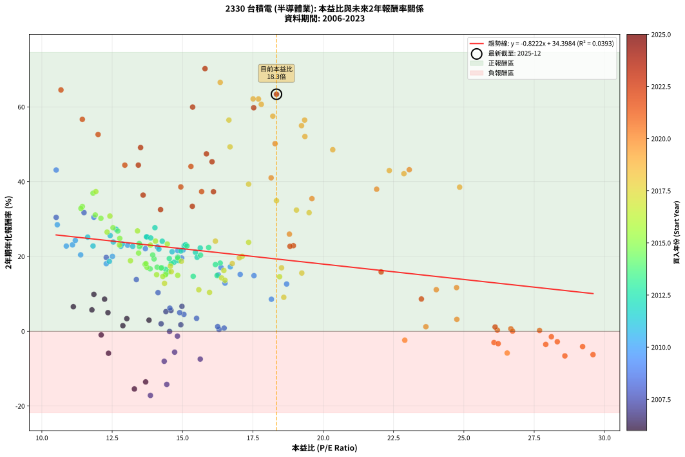
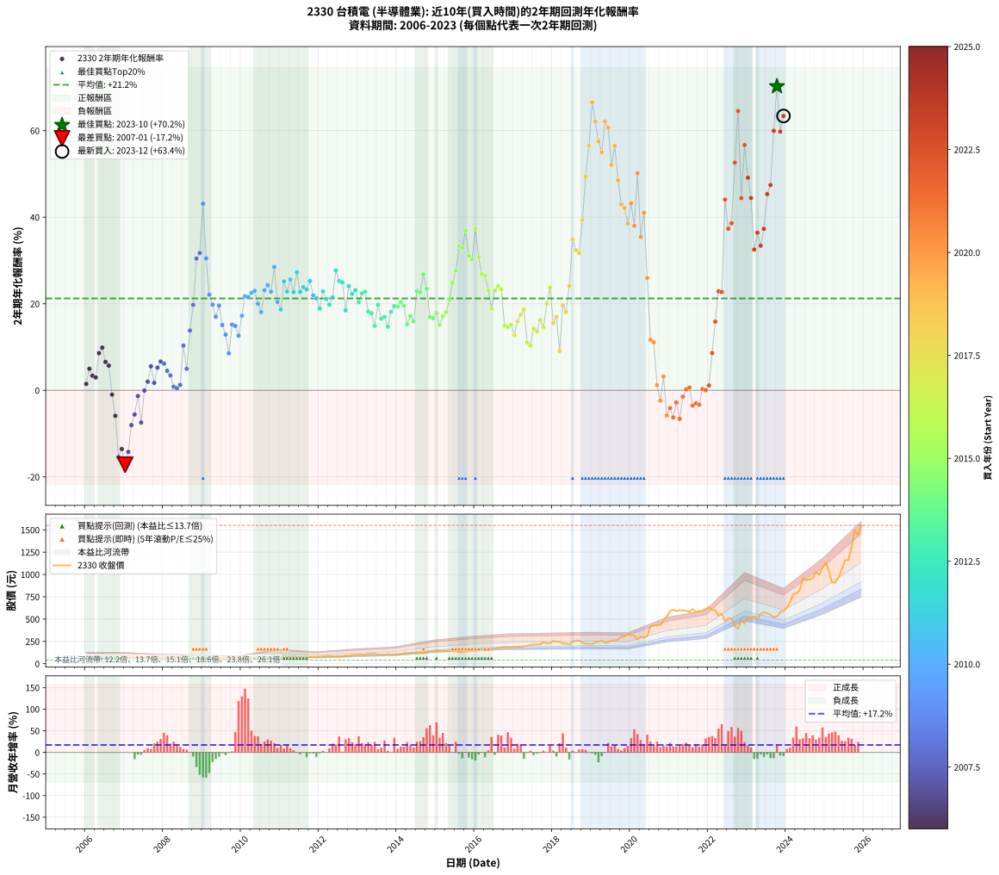

# 2330 台積電 - 本益比與未來報酬率分析

!!! info "報告資訊"
    - **股票代號**: 2330
    - **公司名稱**: 台積電
    - **產業別**: 半導體業
    - **分析期間**: 2006-2023 (216 個數據點)
    - **資料來源**: Type 12 (ShowMonthlyK_ChartFlow) 月收盤價與本益比
    - **報酬率口徑**: 含現金股利 (簡化: 年度合計，假設每年7/1入帳)
    - **報告生成時間**: 2026-01-07 18:26:13 CST

## 📈 視覺化圖表

### 圖表1: 本益比 vs 未來報酬率關係

*圖表1：2330 台積電 本益比與2年期未來報酬率關係 (2006-2023)*

### 圖表2: 歷年買入時點的2年期實際報酬率

*圖表2：2330 台積電 歷年買入時點的2年期實際報酬率 (2006-2023)*

## 📍 買點訊號說明

本報告提供兩種買點提示訊號（顯示於圖表2的股價子圖中）：

### ▲ 小綠色三角形（回測驗證）
- **計算方式**: 使用全部歷史資料計算本益比第25百分位數
- **用途**: 事後驗證，顯示歷史上哪些時點確實為低估區
- **限制**: 當下無法判斷，僅供回測參考
- **特性**: 後見之明（Look-Ahead Bias）

### ▲ 小橘色三角形（即時訊號）
- **計算方式**: 使用截至當月的過去5年資料計算本益比第25百分位數
- **用途**: 實際投資決策，當時即可判斷
- **優勢**: 可操作性強，符合實務需求
- **特性**: 無後見之明，滾動窗口計算

!!! tip "如何使用兩種訊號"
    - **綠色▲** 幫助理解歷史估值機會，驗證策略有效性
    - **橘色▲** 可作為實際買進參考，但仍需搭配基本面分析
    - 兩種訊號重疊時，表示即時判斷與事後驗證一致，信心度較高
    - 僅有綠色▲時，表示當時無法判斷（需要未來資料才能確認）
    - 僅有橘色▲時，表示即時判斷為買點，但事後可能不是最佳時機

## 📊 估值分析摘要

| 指標 | 數值 |
|:---:|:---:|
| **目前本益比** (2023-12) | **18.34 倍** |
| **歷史平均本益比** | 16.02 倍 |
| **估值水準** | 🟡 合理範圍 |
| **預期2年年化報酬率** | **+19.32%** |
| **歷史平均報酬率** | +21.22% |
| **相關係數 (R²)** | 0.0393 |
| **趨勢線斜率** | -0.8222 |

!!! abstract "核心洞察"
    目前本益比接近歷史平均，預期報酬率符合長期趨勢

    根據歷史數據回測，2330 台積電 在目前本益比 **18.3倍** 的估值水準下，
    預期未來2年年化報酬率約為 **+19.3%**。

    **重要提醒**: 本分析基於歷史數據統計，實際報酬率會受到公司基本面變化、產業趨勢、
    總體經濟環境等多重因素影響。R² = 0.04 表示本益比可解釋約 3.9% 的報酬率變異。

## 📈 歷史估值統計

### 最佳買點 (最高報酬率)

| 項目 | 數值 |
|:---:|:---:|
| 起始時間 | 2023-10 |
| 當時本益比 | 15.80 倍 |
| 起始價格 | 529.0 元 |
| 2年後價格 | 1500.0 元 |
| **2年年化報酬率** | **+70.23%** |

### 最差買點 (最低報酬率)

| 項目 | 數值 |
|:---:|:---:|
| 起始時間 | 2007-01 |
| 當時本益比 | 13.86 倍 |
| 起始價格 | 67.4 元 |
| 2年後價格 | 40.2 元 |
| **2年年化報酬率** | **-17.17%** |

## 🎯 投資啟示

### 本益比與報酬率關係

趨勢線方程式: **y = -0.8222x + 34.3984**

!!! warning "強負相關"
    本益比與未來報酬率呈現強負相關。在高本益比時期買入，未來報酬率顯著較低；
    在低本益比時期買入，未來報酬率顯著較高。**估值紀律至關重要**。

### 估值區間建議

基於歷史數據分析:

- **🟢 低估區** (P/E < 12.8): 預期報酬率較高，可考慮增加持股
- **🟡 合理區** (P/E 12.8-19.2): 預期報酬率符合長期趨勢，正常持有
- **🔴 高估區** (P/E > 19.2): 預期報酬率較低，可考慮減碼或觀望

!!! danger "風險提示"
    - 過去表現不代表未來結果
    - 本分析假設公司基本面無重大結構性變化
    - 產業環境劇變可能使歷史規律失效
    - 應結合公司財報、產業趨勢、總體經濟等多重因素綜合判斷

!!! success "長期投資觀點"
    歷史數據顯示，在合理或低估的估值水準買入並長期持有，
    往往能獲得較佳的投資報酬。**耐心等待好價格**是價值投資的核心原則。

## 📊 數據品質

- **資料來源**: GoodInfo.tw Type 12 (ShowMonthlyK_ChartFlow)
- **資料頻率**: 月度收盤價與本益比
- **回測期間**: 2006-2023
- **數據點數量**: 216 個 (每個點代表一次2年期回測)

### 計算方法說明

1. **2年期年化報酬率**:
   - 對每個歷史時點，計算其後2年的實際投資報酬率
   - 期末價值(不含股利): 期末價格
   - 期末價值(含現金股利): 期末價格 + 持有期間內的現金股利合計 (簡化: 年度合計，假設每年7/1入帳)
   - 公式: 年化報酬率 = [(期末價值/期初價格)^(1/年數) - 1] × 100%

2. **本益比 (P/E Ratio)**:
   - 使用當時的月收盤價與EPS計算
   - 資料來源: Type 12 月度河流圖本益比數據

3. **趨勢線 (Linear Regression)**:
   - 使用最小平方法擬合線性趨勢線
   - R²值衡量本益比對報酬率的解釋能力

---

*本報告由 Stock Analysis System v1.9.0 自動生成*
*數據更新時間: 2026-01-07 18:26:13 CST*

## 📋 月度回測明細表

（每一列對應時間線圖中的一個買入點；可用來對照 SVG 圖上的每個點。）

| 買入月份 | 賣出月份 | 回測期限_年 | 實際持有年數 | 買入本益比_倍 | 買入收盤價_元 | 賣出收盤價_元 | 現金股利合計_元 | 總報酬率_pct | 年化報酬率_pct |
| --- | --- | --- | --- | --- | --- | --- | --- | --- | --- |
| 2006-01 | 2008-01 | 2 | 1.999 | 12.88 | 63.50 | 59.90 | 5.50 | +2.99 | +1.49 |
| 2006-02 | 2008-02 | 2 | 1.999 | 12.35 | 60.90 | 61.60 | 5.50 | +10.18 | +4.97 |
| 2006-03 | 2008-03 | 2 | 2.001 | 13.02 | 64.20 | 63.10 | 5.50 | +6.85 | +3.37 |
| 2006-04 | 2008-04 | 2 | 2.001 | 13.81 | 68.10 | 66.70 | 5.50 | +6.02 | +2.96 |
| 2006-05 | 2008-05 | 2 | 2.001 | 12.23 | 60.30 | 65.60 | 5.50 | +17.91 | +8.58 |
| 2006-06 | 2008-06 | 2 | 2.001 | 11.85 | 58.40 | 65.00 | 5.50 | +20.72 | +9.86 |
| 2006-07 | 2008-07 | 2 | 2.001 | 11.12 | 54.80 | 56.20 | 6.03 | +13.55 | +6.55 |
| 2006-08 | 2008-08 | 2 | 2.001 | 11.78 | 58.10 | 58.90 | 6.03 | +11.75 | +5.71 |
| 2006-09 | 2008-09 | 2 | 2.001 | 12.11 | 59.70 | 52.50 | 6.03 | -1.97 | -0.99 |
| 2006-10 | 2008-10 | 2 | 2.001 | 12.37 | 61.00 | 48.00 | 6.03 | -11.43 | -5.89 |
| 2006-11 | 2008-11 | 2 | 2.001 | 13.29 | 65.50 | 40.80 | 6.03 | -28.51 | -15.44 |
| 2006-12 | 2008-12 | 2 | 2.001 | 13.69 | 67.50 | 44.40 | 6.03 | -25.30 | -13.56 |
| 2007-01 | 2009-01 | 2 | 2.001 | 13.86 | 67.40 | 40.20 | 6.03 | -31.42 | -17.17 |
| 2007-02 | 2009-02 | 2 | 2.001 | 14.44 | 69.30 | 44.95 | 6.03 | -26.44 | -14.23 |
| 2007-03 | 2009-03 | 2 | 2.001 | 14.35 | 67.90 | 51.40 | 6.03 | -15.43 | -8.03 |
| 2007-04 | 2009-04 | 2 | 2.001 | 14.72 | 68.70 | 55.20 | 6.03 | -10.88 | -5.59 |
| 2007-05 | 2009-05 | 2 | 2.001 | 14.82 | 68.20 | 60.40 | 6.03 | -2.60 | -1.31 |
| 2007-06 | 2009-06 | 2 | 2.001 | 15.63 | 70.90 | 54.70 | 6.03 | -14.35 | -7.45 |
| 2007-07 | 2009-07 | 2 | 2.001 | 14.54 | 65.00 | 58.90 | 6.03 | -0.12 | -0.06 |
| 2007-08 | 2009-08 | 2 | 2.001 | 14.24 | 62.70 | 59.20 | 6.03 | +4.03 | +1.99 |
| 2007-09 | 2009-09 | 2 | 2.001 | 14.59 | 63.30 | 64.50 | 6.03 | +11.41 | +5.55 |
| 2007-10 | 2009-10 | 2 | 2.001 | 14.94 | 63.80 | 60.00 | 6.03 | +3.49 | +1.73 |
| 2007-11 | 2009-11 | 2 | 2.001 | 14.41 | 60.60 | 61.10 | 6.03 | +10.77 | +5.24 |
| 2007-12 | 2009-12 | 2 | 2.001 | 14.98 | 62.00 | 64.50 | 6.03 | +13.75 | +6.65 |
| 2008-01 | 2010-01 | 2 | 2.001 | 14.55 | 59.90 | 61.50 | 6.03 | +12.73 | +6.17 |
| 2008-02 | 2010-03 | 2 | 2.081 | 15.05 | 61.60 | 61.50 | 6.03 | +9.62 | +4.51 |
| 2008-03 | 2010-03 | 2 | 1.999 | 15.50 | 63.10 | 61.50 | 6.03 | +7.01 | +3.45 |
| 2008-04 | 2010-04 | 2 | 1.999 | 16.48 | 66.70 | 61.80 | 6.03 | +1.69 | +0.84 |
| 2008-05 | 2010-05 | 2 | 1.999 | 16.30 | 65.60 | 60.20 | 6.03 | +0.95 | +0.48 |
| 2008-06 | 2010-06 | 2 | 1.999 | 16.25 | 65.00 | 60.60 | 6.03 | +2.50 | +1.24 |
| 2008-07 | 2010-07 | 2 | 1.999 | 14.13 | 56.20 | 62.40 | 6.00 | +21.71 | +10.33 |
| 2008-08 | 2010-08 | 2 | 1.999 | 14.90 | 58.90 | 58.90 | 6.00 | +10.19 | +4.97 |
| 2008-09 | 2010-09 | 2 | 1.999 | 13.36 | 52.50 | 62.00 | 6.00 | +29.52 | +13.82 |
| 2008-10 | 2010-10 | 2 | 1.999 | 12.29 | 48.00 | 62.80 | 6.00 | +43.33 | +19.74 |
| 2008-11 | 2010-11 | 2 | 1.999 | 10.51 | 40.80 | 63.40 | 6.00 | +70.10 | +30.45 |
| 2008-12 | 2010-12 | 2 | 1.999 | 11.50 | 44.40 | 71.00 | 6.00 | +73.42 | +31.72 |
| 2009-01 | 2011-01 | 2 | 1.999 | 10.51 | 40.20 | 76.30 | 6.00 | +104.73 | +43.12 |
| 2009-02 | 2011-02 | 2 | 1.999 | 11.85 | 44.95 | 70.50 | 6.00 | +70.19 | +30.48 |
| 2009-03 | 2011-03 | 2 | 1.999 | 13.68 | 51.40 | 70.60 | 6.00 | +49.03 | +22.09 |
| 2009-04 | 2011-04 | 2 | 1.999 | 14.83 | 55.20 | 73.20 | 6.00 | +43.48 | +19.80 |
| 2009-05 | 2011-05 | 2 | 1.999 | 16.37 | 60.40 | 76.70 | 6.00 | +36.92 | +17.03 |
| 2009-06 | 2011-06 | 2 | 1.999 | 14.97 | 54.70 | 72.20 | 6.00 | +42.96 | +19.58 |
| 2009-07 | 2011-07 | 2 | 1.999 | 16.27 | 58.90 | 72.00 | 6.00 | +32.43 | +15.09 |
| 2009-08 | 2011-08 | 2 | 1.999 | 16.51 | 59.20 | 69.40 | 6.00 | +27.36 | +12.87 |
| 2009-09 | 2011-09 | 2 | 1.999 | 18.16 | 64.50 | 70.00 | 6.00 | +17.83 | +8.56 |
| 2009-10 | 2011-10 | 2 | 1.999 | 17.05 | 60.00 | 73.60 | 6.00 | +32.67 | +15.19 |
| 2009-11 | 2011-11 | 2 | 1.999 | 17.54 | 61.10 | 74.60 | 6.00 | +31.91 | +14.87 |
| 2009-12 | 2011-12 | 2 | 1.999 | 18.70 | 64.50 | 75.80 | 6.00 | +26.82 | +12.62 |
| 2010-01 | 2012-01 | 2 | 1.999 | 16.70 | 61.50 | 78.50 | 6.00 | +37.40 | +17.23 |
| 2010-02 | 2012-02 | 2 | 1.999 | 15.02 | 58.80 | 81.10 | 6.00 | +48.13 | +21.72 |
| 2010-03 | 2012-03 | 2 | 2.001 | 14.83 | 61.50 | 84.90 | 6.00 | +47.80 | +21.56 |
| 2010-04 | 2012-04 | 2 | 2.001 | 14.11 | 61.80 | 86.80 | 6.00 | +50.16 | +22.52 |
| 2010-05 | 2012-05 | 2 | 2.001 | 13.05 | 60.20 | 85.10 | 6.00 | +51.33 | +23.00 |
| 2010-06 | 2012-06 | 2 | 2.001 | 12.51 | 60.60 | 81.30 | 6.00 | +44.06 | +20.01 |
| 2010-07 | 2012-07 | 2 | 2.001 | 12.29 | 62.40 | 81.00 | 6.00 | +39.42 | +18.06 |
| 2010-08 | 2012-08 | 2 | 2.001 | 11.09 | 58.90 | 83.30 | 6.00 | +51.61 | +23.11 |
| 2010-09 | 2012-09 | 2 | 2.001 | 11.19 | 62.00 | 89.80 | 6.00 | +54.51 | +24.29 |
| 2010-10 | 2012-10 | 2 | 2.001 | 10.87 | 62.80 | 88.70 | 6.00 | +50.79 | +22.78 |
| 2010-11 | 2012-11 | 2 | 2.001 | 10.55 | 63.40 | 98.70 | 6.00 | +65.14 | +28.48 |
| 2010-12 | 2012-12 | 2 | 2.001 | 11.38 | 71.00 | 97.00 | 6.00 | +45.07 | +20.43 |
| 2011-01 | 2013-01 | 2 | 2.001 | 12.40 | 76.30 | 101.50 | 6.00 | +40.89 | +18.68 |
| 2011-02 | 2013-02 | 2 | 2.001 | 11.63 | 70.50 | 104.50 | 6.00 | +56.74 | +25.18 |
| 2011-03 | 2013-03 | 2 | 2.001 | 11.82 | 70.60 | 100.50 | 6.00 | +50.85 | +22.80 |
| 2011-04 | 2013-04 | 2 | 2.001 | 12.43 | 73.20 | 109.50 | 6.00 | +57.79 | +25.59 |
| 2011-05 | 2013-05 | 2 | 2.001 | 13.23 | 76.70 | 109.50 | 6.00 | +50.59 | +22.70 |
| 2011-06 | 2013-06 | 2 | 2.001 | 12.64 | 72.20 | 111.00 | 6.00 | +62.05 | +27.28 |
| 2011-07 | 2013-07 | 2 | 2.001 | 12.81 | 72.00 | 102.50 | 6.00 | +50.69 | +22.74 |
| 2011-08 | 2013-08 | 2 | 2.001 | 12.54 | 69.40 | 100.50 | 6.00 | +53.46 | +23.86 |
| 2011-09 | 2013-09 | 2 | 2.001 | 12.86 | 70.00 | 100.50 | 6.00 | +52.14 | +23.33 |
| 2011-10 | 2013-10 | 2 | 2.001 | 13.74 | 73.60 | 109.50 | 6.00 | +56.93 | +25.25 |
| 2011-11 | 2013-11 | 2 | 2.001 | 14.16 | 74.60 | 105.00 | 6.00 | +48.79 | +21.96 |
| 2011-12 | 2013-12 | 2 | 2.001 | 14.63 | 75.80 | 105.50 | 6.00 | +47.10 | +21.27 |
| 2012-01 | 2014-01 | 2 | 2.001 | 14.86 | 78.50 | 105.00 | 6.00 | +41.40 | +18.90 |
| 2012-02 | 2014-03 | 2 | 2.081 | 15.06 | 81.10 | 118.50 | 6.00 | +53.51 | +22.87 |
| 2012-03 | 2014-03 | 2 | 1.999 | 15.46 | 84.90 | 118.50 | 6.00 | +46.64 | +21.11 |
| 2012-04 | 2014-04 | 2 | 1.999 | 15.52 | 86.80 | 118.50 | 6.00 | +43.43 | +19.78 |
| 2012-05 | 2014-05 | 2 | 1.999 | 14.94 | 85.10 | 119.50 | 6.00 | +47.47 | +21.45 |
| 2012-06 | 2014-06 | 2 | 1.999 | 14.02 | 81.30 | 126.50 | 6.00 | +62.98 | +27.68 |
| 2012-07 | 2014-07 | 2 | 1.999 | 13.72 | 81.00 | 121.00 | 6.00 | +56.79 | +25.24 |
| 2012-08 | 2014-08 | 2 | 1.999 | 13.87 | 83.30 | 124.00 | 6.00 | +56.06 | +24.94 |
| 2012-09 | 2014-09 | 2 | 1.999 | 14.70 | 89.80 | 120.00 | 6.00 | +40.31 | +18.47 |
| 2012-10 | 2014-10 | 2 | 1.999 | 14.28 | 88.70 | 130.50 | 6.00 | +53.89 | +24.07 |
| 2012-11 | 2014-11 | 2 | 1.999 | 15.63 | 98.70 | 141.50 | 6.00 | +49.44 | +22.26 |
| 2012-12 | 2014-12 | 2 | 1.999 | 15.11 | 97.00 | 141.00 | 6.00 | +51.55 | +23.12 |
| 2013-01 | 2015-01 | 2 | 1.999 | 15.64 | 101.50 | 141.00 | 6.00 | +44.83 | +20.36 |
| 2013-02 | 2015-02 | 2 | 1.999 | 15.93 | 104.50 | 150.50 | 6.00 | +49.76 | +22.39 |
| 2013-03 | 2015-03 | 2 | 1.999 | 15.16 | 100.50 | 145.50 | 6.00 | +50.75 | +22.80 |
| 2013-04 | 2015-04 | 2 | 1.999 | 16.34 | 109.50 | 147.00 | 6.00 | +39.73 | +18.22 |
| 2013-05 | 2015-05 | 2 | 1.999 | 16.17 | 109.50 | 146.00 | 6.00 | +38.81 | +17.83 |
| 2013-06 | 2015-06 | 2 | 1.999 | 16.23 | 111.00 | 140.50 | 6.00 | +31.98 | +14.89 |
| 2013-07 | 2015-07 | 2 | 1.999 | 14.83 | 102.50 | 139.50 | 7.50 | +43.41 | +19.77 |
| 2013-08 | 2015-08 | 2 | 1.999 | 14.40 | 100.50 | 129.00 | 7.50 | +35.82 | +16.55 |
| 2013-09 | 2015-09 | 2 | 1.999 | 14.26 | 100.50 | 130.00 | 7.50 | +36.82 | +16.98 |
| 2013-10 | 2015-10 | 2 | 1.999 | 15.38 | 109.50 | 136.50 | 7.50 | +31.51 | +14.69 |
| 2013-11 | 2015-11 | 2 | 1.999 | 14.60 | 105.00 | 139.00 | 7.50 | +39.52 | +18.13 |
| 2013-12 | 2015-12 | 2 | 1.999 | 14.53 | 105.50 | 143.00 | 7.50 | +42.65 | +19.45 |
| 2014-01 | 2016-01 | 2 | 1.999 | 13.99 | 105.00 | 142.00 | 7.50 | +42.38 | +19.34 |
| 2014-02 | 2016-02 | 2 | 1.999 | 13.94 | 108.00 | 149.00 | 7.50 | +44.91 | +20.39 |
| 2014-03 | 2016-03 | 2 | 2.001 | 14.83 | 118.50 | 162.00 | 7.50 | +43.04 | +19.58 |
| 2014-04 | 2016-04 | 2 | 2.001 | 14.39 | 118.50 | 150.00 | 7.50 | +32.91 | +15.28 |
| 2014-05 | 2016-05 | 2 | 2.001 | 14.10 | 119.50 | 156.50 | 7.50 | +37.24 | +17.14 |
| 2014-06 | 2016-06 | 2 | 2.001 | 14.51 | 126.50 | 162.50 | 7.50 | +34.39 | +15.91 |
| 2014-07 | 2016-07 | 2 | 2.001 | 13.50 | 121.00 | 172.50 | 10.50 | +51.24 | +22.96 |
| 2014-08 | 2016-08 | 2 | 2.001 | 13.47 | 124.00 | 176.00 | 10.50 | +50.40 | +22.62 |
| 2014-09 | 2016-09 | 2 | 2.001 | 12.70 | 120.00 | 182.50 | 10.50 | +60.83 | +26.80 |
| 2014-10 | 2016-10 | 2 | 2.001 | 13.46 | 130.50 | 188.50 | 10.50 | +52.49 | +23.47 |
| 2014-11 | 2016-11 | 2 | 2.001 | 14.24 | 141.50 | 183.00 | 10.50 | +36.75 | +16.93 |
| 2014-12 | 2016-12 | 2 | 2.001 | 13.85 | 141.00 | 181.50 | 10.50 | +36.17 | +16.68 |
| 2015-01 | 2017-01 | 2 | 2.001 | 13.67 | 141.00 | 185.50 | 10.50 | +39.01 | +17.89 |
| 2015-02 | 2017-02 | 2 | 2.001 | 14.40 | 150.50 | 189.00 | 10.50 | +32.56 | +15.12 |
| 2015-03 | 2017-03 | 2 | 2.001 | 13.74 | 145.50 | 189.00 | 10.50 | +37.11 | +17.08 |
| 2015-04 | 2017-04 | 2 | 2.001 | 13.70 | 147.00 | 194.50 | 10.50 | +39.46 | +18.08 |
| 2015-05 | 2017-05 | 2 | 2.001 | 13.44 | 146.00 | 203.00 | 10.50 | +46.23 | +20.91 |
| 2015-06 | 2017-06 | 2 | 2.001 | 12.77 | 140.50 | 208.50 | 10.50 | +55.87 | +24.83 |
| 2015-07 | 2017-07 | 2 | 2.001 | 12.53 | 139.50 | 214.50 | 13.00 | +63.08 | +27.68 |
| 2015-08 | 2017-08 | 2 | 2.001 | 11.44 | 129.00 | 216.50 | 13.00 | +77.91 | +33.36 |
| 2015-09 | 2017-09 | 2 | 2.001 | 11.39 | 130.00 | 216.50 | 13.00 | +76.54 | +32.84 |
| 2015-10 | 2017-10 | 2 | 2.001 | 11.82 | 136.50 | 243.00 | 13.00 | +87.55 | +36.92 |
| 2015-11 | 2017-11 | 2 | 2.001 | 11.90 | 139.00 | 226.00 | 13.00 | +71.94 | +31.10 |
| 2015-12 | 2017-12 | 2 | 2.001 | 12.10 | 143.00 | 229.50 | 13.00 | +69.58 | +30.20 |
| 2016-01 | 2018-01 | 2 | 2.001 | 11.92 | 142.00 | 255.00 | 13.00 | +88.73 | +37.35 |
| 2016-02 | 2018-03 | 2 | 2.081 | 12.42 | 149.00 | 247.50 | 13.00 | +74.83 | +30.80 |
| 2016-03 | 2018-03 | 2 | 1.999 | 13.40 | 162.00 | 247.50 | 13.00 | +60.80 | +26.83 |
| 2016-04 | 2018-04 | 2 | 1.999 | 12.32 | 150.00 | 227.00 | 13.00 | +60.00 | +26.51 |
| 2016-05 | 2018-05 | 2 | 1.999 | 12.76 | 156.50 | 224.00 | 13.00 | +51.44 | +23.08 |
| 2016-06 | 2018-06 | 2 | 1.999 | 13.15 | 162.50 | 216.50 | 13.00 | +41.23 | +18.85 |
| 2016-07 | 2018-07 | 2 | 1.999 | 13.86 | 172.50 | 246.00 | 15.00 | +51.30 | +23.02 |
| 2016-08 | 2018-08 | 2 | 1.999 | 14.04 | 176.00 | 256.00 | 15.00 | +53.98 | +24.11 |
| 2016-09 | 2018-09 | 2 | 1.999 | 14.46 | 182.50 | 262.50 | 15.00 | +52.05 | +23.33 |
| 2016-10 | 2018-10 | 2 | 1.999 | 14.83 | 188.50 | 234.00 | 15.00 | +32.10 | +14.94 |
| 2016-11 | 2018-11 | 2 | 1.999 | 14.30 | 183.00 | 225.50 | 15.00 | +31.42 | +14.65 |
| 2016-12 | 2018-12 | 2 | 1.999 | 14.08 | 181.50 | 225.50 | 15.00 | +32.51 | +15.12 |
| 2017-01 | 2019-01 | 2 | 1.999 | 14.36 | 185.50 | 221.00 | 15.00 | +27.22 | +12.80 |
| 2017-02 | 2019-02 | 2 | 1.999 | 14.60 | 189.00 | 239.00 | 15.00 | +34.39 | +15.94 |
| 2017-03 | 2019-03 | 2 | 1.999 | 14.57 | 189.00 | 245.50 | 15.00 | +37.83 | +17.41 |
| 2017-04 | 2019-04 | 2 | 1.999 | 14.96 | 194.50 | 259.00 | 15.00 | +40.87 | +18.70 |
| 2017-05 | 2019-05 | 2 | 1.999 | 15.58 | 203.00 | 235.50 | 15.00 | +23.40 | +11.09 |
| 2017-06 | 2019-06 | 2 | 1.999 | 15.96 | 208.50 | 239.00 | 15.00 | +21.82 | +10.38 |
| 2017-07 | 2019-07 | 2 | 1.999 | 16.39 | 214.50 | 259.50 | 20.50 | +30.54 | +14.26 |
| 2017-08 | 2019-08 | 2 | 1.999 | 16.51 | 216.50 | 259.00 | 20.50 | +29.10 | +13.63 |
| 2017-09 | 2019-09 | 2 | 1.999 | 16.47 | 216.50 | 272.00 | 20.50 | +35.10 | +16.25 |
| 2017-10 | 2019-10 | 2 | 1.999 | 18.45 | 243.00 | 298.50 | 20.50 | +31.28 | +14.59 |
| 2017-11 | 2019-11 | 2 | 1.999 | 17.12 | 226.00 | 305.00 | 20.50 | +44.03 | +20.03 |
| 2017-12 | 2019-12 | 2 | 1.999 | 17.35 | 229.50 | 331.00 | 20.50 | +53.16 | +23.78 |
| 2018-01 | 2020-01 | 2 | 1.999 | 19.24 | 255.00 | 320.00 | 20.50 | +33.53 | +15.57 |
| 2018-02 | 2020-02 | 2 | 1.999 | 18.52 | 246.00 | 316.00 | 20.50 | +36.79 | +16.97 |
| 2018-03 | 2020-03 | 2 | 2.001 | 18.60 | 247.50 | 274.00 | 20.50 | +18.99 | +9.08 |
| 2018-04 | 2020-04 | 2 | 2.001 | 17.02 | 227.00 | 304.50 | 20.50 | +43.17 | +19.64 |
| 2018-05 | 2020-05 | 2 | 2.001 | 16.77 | 224.00 | 292.00 | 20.50 | +39.51 | +18.10 |
| 2018-06 | 2020-06 | 2 | 2.001 | 16.17 | 216.50 | 313.00 | 20.50 | +54.04 | +24.10 |
| 2018-07 | 2020-07 | 2 | 2.001 | 18.34 | 246.00 | 425.50 | 22.50 | +82.11 | +34.92 |
| 2018-08 | 2020-08 | 2 | 2.001 | 19.05 | 256.00 | 426.50 | 22.50 | +75.39 | +32.41 |
| 2018-09 | 2020-09 | 2 | 2.001 | 19.50 | 262.50 | 433.00 | 22.50 | +73.52 | +31.70 |
| 2018-10 | 2020-10 | 2 | 2.001 | 17.35 | 234.00 | 432.00 | 22.50 | +94.23 | +39.34 |
| 2018-11 | 2020-11 | 2 | 2.001 | 16.69 | 225.50 | 480.50 | 22.50 | +123.06 | +49.31 |
| 2018-12 | 2020-12 | 2 | 2.001 | 16.65 | 225.50 | 530.00 | 22.50 | +145.01 | +56.48 |
| 2019-01 | 2021-01 | 2 | 2.001 | 16.34 | 221.00 | 591.00 | 22.50 | +177.60 | +66.56 |
| 2019-02 | 2021-02 | 2 | 2.001 | 17.70 | 239.00 | 606.00 | 22.50 | +162.97 | +62.11 |
| 2019-03 | 2021-03 | 2 | 2.001 | 18.21 | 245.50 | 587.00 | 22.50 | +148.27 | +57.52 |
| 2019-04 | 2021-04 | 2 | 2.001 | 19.23 | 259.00 | 600.00 | 22.50 | +140.35 | +54.98 |
| 2019-05 | 2021-05 | 2 | 2.001 | 17.51 | 235.50 | 597.00 | 22.50 | +163.06 | +62.14 |
| 2019-06 | 2021-06 | 2 | 2.001 | 17.80 | 239.00 | 595.00 | 22.50 | +158.37 | +60.69 |
| 2019-07 | 2021-07 | 2 | 2.001 | 19.35 | 259.50 | 580.00 | 20.50 | +131.41 | +52.08 |
| 2019-08 | 2021-08 | 2 | 2.001 | 19.34 | 259.00 | 614.00 | 20.50 | +144.98 | +56.47 |
| 2019-09 | 2021-09 | 2 | 2.001 | 20.34 | 272.00 | 580.00 | 20.50 | +120.77 | +48.54 |
| 2019-10 | 2021-10 | 2 | 2.001 | 22.35 | 298.50 | 590.00 | 20.50 | +104.52 | +42.98 |
| 2019-11 | 2021-11 | 2 | 2.001 | 22.87 | 305.00 | 596.00 | 20.50 | +102.13 | +42.14 |
| 2019-12 | 2021-12 | 2 | 2.001 | 24.85 | 331.00 | 615.00 | 20.50 | +91.99 | +38.53 |
| 2020-01 | 2022-01 | 2 | 2.001 | 23.06 | 320.00 | 636.00 | 20.50 | +105.16 | +43.20 |
| 2020-02 | 2022-03 | 2 | 2.081 | 21.90 | 316.00 | 597.00 | 20.50 | +95.41 | +37.98 |
| 2020-03 | 2022-03 | 2 | 1.999 | 18.29 | 274.00 | 597.00 | 20.50 | +125.36 | +50.16 |
| 2020-04 | 2022-04 | 2 | 1.999 | 19.60 | 304.50 | 538.00 | 20.50 | +83.42 | +35.46 |
| 2020-05 | 2022-05 | 2 | 1.999 | 18.15 | 292.00 | 560.00 | 20.50 | +98.80 | +41.03 |
| 2020-06 | 2022-06 | 2 | 1.999 | 18.80 | 313.00 | 476.00 | 20.50 | +58.63 | +25.97 |
| 2020-07 | 2022-07 | 2 | 1.999 | 24.74 | 425.50 | 509.00 | 21.50 | +24.68 | +11.67 |
| 2020-08 | 2022-08 | 2 | 1.999 | 24.02 | 426.50 | 505.00 | 21.50 | +23.45 | +11.11 |
| 2020-09 | 2022-09 | 2 | 1.999 | 23.65 | 433.00 | 422.00 | 21.50 | +2.42 | +1.21 |
| 2020-10 | 2022-10 | 2 | 1.999 | 22.90 | 432.00 | 390.00 | 21.50 | -4.75 | -2.40 |
| 2020-11 | 2022-11 | 2 | 1.999 | 24.75 | 480.50 | 490.00 | 21.50 | +6.45 | +3.18 |
| 2020-12 | 2022-12 | 2 | 1.999 | 26.54 | 530.00 | 448.50 | 21.50 | -11.32 | -5.83 |
| 2021-01 | 2023-01 | 2 | 1.999 | 29.22 | 591.00 | 522.00 | 21.50 | -8.04 | -4.11 |
| 2021-02 | 2023-02 | 2 | 1.999 | 29.59 | 606.00 | 511.00 | 21.50 | -12.13 | -6.26 |
| 2021-03 | 2023-03 | 2 | 1.999 | 28.32 | 587.00 | 533.00 | 21.50 | -5.54 | -2.81 |
| 2021-04 | 2023-04 | 2 | 1.999 | 28.59 | 600.00 | 502.00 | 21.50 | -12.75 | -6.60 |
| 2021-05 | 2023-05 | 2 | 1.999 | 28.11 | 597.00 | 558.00 | 21.50 | -2.93 | -1.48 |
| 2021-06 | 2023-06 | 2 | 1.999 | 27.69 | 595.00 | 576.00 | 21.50 | +0.42 | +0.21 |
| 2021-07 | 2023-07 | 2 | 1.999 | 26.67 | 580.00 | 565.00 | 22.50 | +1.29 | +0.64 |
| 2021-08 | 2023-08 | 2 | 1.999 | 27.91 | 614.00 | 549.00 | 22.50 | -6.92 | -3.53 |
| 2021-09 | 2023-09 | 2 | 1.999 | 26.07 | 580.00 | 523.00 | 22.50 | -5.95 | -3.02 |
| 2021-10 | 2023-10 | 2 | 1.999 | 26.22 | 590.00 | 529.00 | 22.50 | -6.53 | -3.32 |
| 2021-11 | 2023-11 | 2 | 1.999 | 26.19 | 596.00 | 577.00 | 22.50 | +0.59 | +0.29 |
| 2021-12 | 2023-12 | 2 | 1.999 | 26.73 | 615.00 | 593.00 | 22.50 | +0.08 | +0.04 |
| 2022-01 | 2024-01 | 2 | 1.999 | 26.11 | 636.00 | 628.00 | 22.50 | +2.28 | +1.13 |
| 2022-02 | 2024-02 | 2 | 1.999 | 23.49 | 604.00 | 690.00 | 22.50 | +17.96 | +8.62 |
| 2022-03 | 2024-03 | 2 | 2.001 | 22.06 | 597.00 | 779.00 | 22.50 | +34.25 | +15.86 |
| 2022-04 | 2024-04 | 2 | 2.001 | 18.94 | 538.00 | 790.00 | 22.50 | +51.02 | +22.87 |
| 2022-05 | 2024-05 | 2 | 2.001 | 18.82 | 560.00 | 821.00 | 22.50 | +50.62 | +22.71 |
| 2022-06 | 2024-06 | 2 | 2.001 | 15.30 | 476.00 | 966.00 | 22.50 | +107.67 | +44.07 |
| 2022-07 | 2024-07 | 2 | 2.001 | 15.68 | 509.00 | 934.00 | 26.50 | +88.70 | +37.34 |
| 2022-08 | 2024-08 | 2 | 2.001 | 14.94 | 505.00 | 944.00 | 26.50 | +92.18 | +38.60 |
| 2022-09 | 2024-09 | 2 | 2.001 | 12.00 | 422.00 | 957.00 | 26.50 | +133.06 | +52.62 |
| 2022-10 | 2024-10 | 2 | 2.001 | 10.68 | 390.00 | 1030.00 | 26.50 | +170.90 | +64.53 |
| 2022-11 | 2024-11 | 2 | 2.001 | 12.95 | 490.00 | 996.00 | 26.50 | +108.67 | +44.42 |
| 2022-12 | 2024-12 | 2 | 2.001 | 11.44 | 448.50 | 1075.00 | 26.50 | +145.60 | +56.67 |
| 2023-01 | 2025-01 | 2 | 2.001 | 13.51 | 522.00 | 1135.00 | 26.50 | +122.51 | +49.13 |
| 2023-02 | 2025-02 | 2 | 2.001 | 13.43 | 511.00 | 1040.00 | 26.50 | +108.71 | +44.43 |
| 2023-03 | 2025-03 | 2 | 2.001 | 14.22 | 533.00 | 910.00 | 26.50 | +75.70 | +32.53 |
| 2023-04 | 2025-04 | 2 | 2.001 | 13.60 | 502.00 | 908.00 | 26.50 | +86.16 | +36.41 |
| 2023-05 | 2025-05 | 2 | 2.001 | 15.35 | 558.00 | 967.00 | 26.50 | +78.05 | +33.41 |
| 2023-06 | 2025-06 | 2 | 2.001 | 16.10 | 576.00 | 1060.00 | 26.50 | +88.63 | +37.31 |
| 2023-07 | 2025-07 | 2 | 2.001 | 16.05 | 565.00 | 1160.00 | 34.00 | +111.33 | +45.33 |
| 2023-08 | 2025-08 | 2 | 2.001 | 15.85 | 549.00 | 1160.00 | 34.00 | +117.49 | +47.43 |
| 2023-09 | 2025-09 | 2 | 2.001 | 15.36 | 523.00 | 1305.00 | 34.00 | +156.02 | +59.96 |
| 2023-10 | 2025-10 | 2 | 2.001 | 15.80 | 529.00 | 1500.00 | 34.00 | +189.98 | +70.23 |
| 2023-11 | 2025-11 | 2 | 2.001 | 17.53 | 577.00 | 1440.00 | 34.00 | +155.46 | +59.78 |
| 2023-12 | 2025-12 | 2 | 2.001 | 18.34 | 593.00 | 1550.00 | 34.00 | +167.12 | +63.38 |
