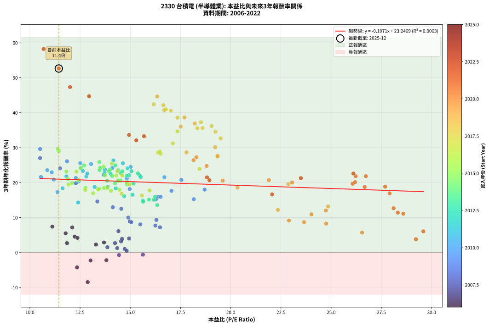
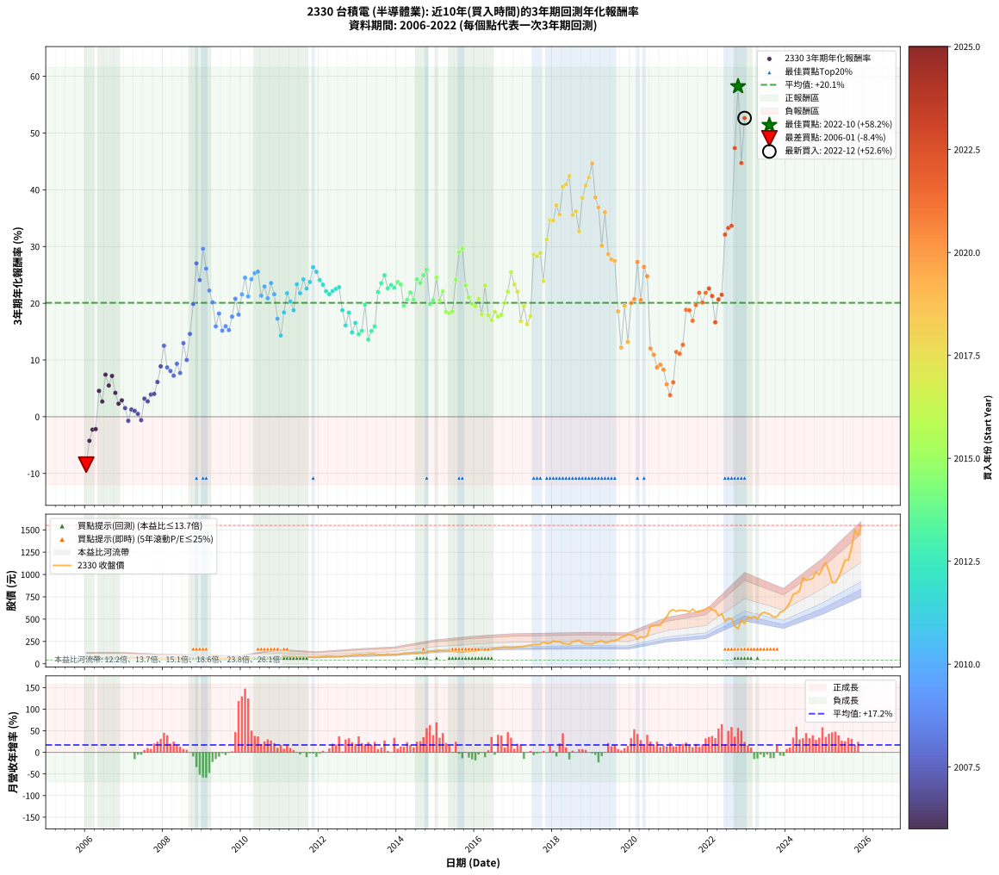

# 2330 台積電 - 本益比與未來報酬率分析

!!! info "報告資訊"
    - **股票代號**: 2330
    - **公司名稱**: 台積電
    - **產業別**: 半導體業
    - **分析期間**: 2005-2022 (205 個數據點)
    - **資料來源**: Type 12 (ShowMonthlyK_ChartFlow) 月收盤價與本益比
    - **報酬率口徑**: 含現金股利 (簡化: 年度合計，假設每年7/1入帳)
    - **報告生成時間**: 2025-12-23 11:54:52 CST

## 📈 視覺化圖表

### 圖表1: 本益比 vs 未來報酬率關係

*圖表1：2330 台積電 本益比與3年期未來報酬率關係 (2005-2022)*

### 圖表2: 歷年買入時點的3年期實際報酬率

*圖表2：2330 台積電 歷年買入時點的3年期實際報酬率 (2005-2022)*

## 📍 買點訊號說明

本報告提供兩種買點提示訊號（顯示於圖表2的股價子圖中）：

### ▲ 小綠色三角形（回測驗證）
- **計算方式**: 使用全部歷史資料計算本益比第25百分位數
- **用途**: 事後驗證，顯示歷史上哪些時點確實為低估區
- **限制**: 當下無法判斷，僅供回測參考
- **特性**: 後見之明（Look-Ahead Bias）

### ▲ 小橘色三角形（即時訊號）
- **計算方式**: 使用截至當月的過去5年資料計算本益比第25百分位數
- **用途**: 實際投資決策，當時即可判斷
- **優勢**: 可操作性強，符合實務需求
- **特性**: 無後見之明，滾動窗口計算

!!! tip "如何使用兩種訊號"
    - **綠色▲** 幫助理解歷史估值機會，驗證策略有效性
    - **橘色▲** 可作為實際買進參考，但仍需搭配基本面分析
    - 兩種訊號重疊時，表示即時判斷與事後驗證一致，信心度較高
    - 僅有綠色▲時，表示當時無法判斷（需要未來資料才能確認）
    - 僅有橘色▲時，表示即時判斷為買點，但事後可能不是最佳時機

## 📊 估值分析摘要

| 指標 | 數值 |
|:---:|:---:|
| **目前本益比** (2022-12) | **11.44 倍** |
| **歷史平均本益比** | 16.15 倍 |
| **估值水準** | 🟢 相對低估 |
| **預期3年年化報酬率** | **+21.39%** |
| **歷史平均報酬率** | +19.94% |
| **相關係數 (R²)** | 0.0148 |
| **趨勢線斜率** | -0.3085 |

!!! abstract "核心洞察"
    目前本益比顯著低於歷史平均，預期未來報酬率可能較高

    根據歷史數據回測，2330 台積電 在目前本益比 **11.4倍** 的估值水準下，
    預期未來3年年化報酬率約為 **+21.4%**。

    **重要提醒**: 本分析基於歷史數據統計，實際報酬率會受到公司基本面變化、產業趨勢、
    總體經濟環境等多重因素影響。R² = 0.01 表示本益比可解釋約 1.5% 的報酬率變異。

## 📈 歷史估值統計

### 最佳買點 (最高報酬率)

| 項目 | 數值 |
|:---:|:---:|
| 起始時間 | 2022-10 |
| 當時本益比 | 10.68 倍 |
| 起始價格 | 390.0 元 |
| 3年後價格 | 1500.0 元 |
| **3年年化報酬率** | **+58.23%** |

### 最差買點 (最低報酬率)

| 項目 | 數值 |
|:---:|:---:|
| 起始時間 | 2006-01 |
| 當時本益比 | 16.34 倍 |
| 起始價格 | 63.5 元 |
| 3年後價格 | 40.2 元 |
| **3年年化報酬率** | **-8.45%** |

## 🎯 投資啟示

### 本益比與報酬率關係

趨勢線方程式: **y = -0.3085x + 24.9212**

!!! note "負相關"
    本益比與未來報酬率呈現負相關。較低的本益比通常帶來較高的未來報酬率，
    但相關性不算非常強。**估值仍是重要參考指標之一**。

### 估值區間建議

基於歷史數據分析:

- **🟢 低估區** (P/E < 12.9): 預期報酬率較高，可考慮增加持股
- **🟡 合理區** (P/E 12.9-19.4): 預期報酬率符合長期趨勢，正常持有
- **🔴 高估區** (P/E > 19.4): 預期報酬率較低，可考慮減碼或觀望

!!! danger "風險提示"
    - 過去表現不代表未來結果
    - 本分析假設公司基本面無重大結構性變化
    - 產業環境劇變可能使歷史規律失效
    - 應結合公司財報、產業趨勢、總體經濟等多重因素綜合判斷

!!! success "長期投資觀點"
    歷史數據顯示，在合理或低估的估值水準買入並長期持有，
    往往能獲得較佳的投資報酬。**耐心等待好價格**是價值投資的核心原則。

## 📊 數據品質

- **資料來源**: GoodInfo.tw Type 12 (ShowMonthlyK_ChartFlow)
- **資料頻率**: 月度收盤價與本益比
- **回測期間**: 2005-2022
- **數據點數量**: 205 個 (每個點代表一次3年期回測)

### 計算方法說明

1. **3年期年化報酬率**:
   - 對每個歷史時點，計算其後3年的實際投資報酬率
   - 期末價值(不含股利): 期末價格
   - 期末價值(含現金股利): 期末價格 + 持有期間內的現金股利合計 (簡化: 年度合計，假設每年7/1入帳)
   - 公式: 年化報酬率 = [(期末價值/期初價格)^(1/年數) - 1] × 100%

2. **本益比 (P/E Ratio)**:
   - 使用當時的月收盤價與EPS計算
   - 資料來源: Type 12 月度河流圖本益比數據

3. **趨勢線 (Linear Regression)**:
   - 使用最小平方法擬合線性趨勢線
   - R²值衡量本益比對報酬率的解釋能力

---

*本報告由 Stock Analysis System v1.9.0 自動生成*
*數據更新時間: 2025-12-23 11:54:52 CST*

## 📋 月度回測明細表

（每一列對應時間線圖中的一個買入點；可用來對照 SVG 圖上的每個點。）

| 買入月份 | 賣出月份 | 回測期限_年 | 實際持有年數 | 買入本益比_倍 | 買入收盤價_元 | 賣出收盤價_元 | 現金股利合計_元 | 總報酬率_pct | 年化報酬率_pct |
| --- | --- | --- | --- | --- | --- | --- | --- | --- | --- |
| 2005-12 | 2008-12 | 3 | 3.001 | 16.49 | 62.50 | 44.40 | 8.52 | -15.32 | -5.39 |
| 2006-01 | 2009-01 | 3 | 3.001 | 16.34 | 63.50 | 40.20 | 8.52 | -23.27 | -8.45 |
| 2006-02 | 2009-02 | 3 | 3.001 | 15.30 | 60.90 | 44.95 | 8.52 | -12.19 | -4.24 |
| 2006-03 | 2009-03 | 3 | 3.001 | 15.75 | 64.20 | 51.40 | 8.52 | -6.66 | -2.27 |
| 2006-04 | 2009-04 | 3 | 3.001 | 16.33 | 68.10 | 55.20 | 8.52 | -6.43 | -2.19 |
| 2006-05 | 2009-05 | 3 | 3.001 | 14.14 | 60.30 | 60.40 | 8.52 | +14.30 | +4.56 |
| 2006-06 | 2009-06 | 3 | 3.001 | 13.39 | 58.40 | 54.70 | 8.52 | +8.26 | +2.68 |
| 2006-07 | 2009-07 | 3 | 3.001 | 12.30 | 54.80 | 58.90 | 9.03 | +23.95 | +7.42 |
| 2006-08 | 2009-08 | 3 | 3.001 | 12.77 | 58.10 | 59.20 | 9.03 | +17.43 | +5.50 |
| 2006-09 | 2009-09 | 3 | 3.001 | 12.85 | 59.70 | 64.50 | 9.03 | +23.16 | +7.19 |
| 2006-10 | 2009-10 | 3 | 3.001 | 12.87 | 61.00 | 60.00 | 9.03 | +13.16 | +4.20 |
| 2006-11 | 2009-11 | 3 | 3.001 | 13.55 | 65.50 | 61.10 | 9.03 | +7.06 | +2.30 |
| 2006-12 | 2009-12 | 3 | 3.001 | 13.69 | 67.50 | 64.50 | 9.03 | +8.93 | +2.89 |
| 2007-01 | 2010-01 | 3 | 3.001 | 13.86 | 67.40 | 61.50 | 9.03 | +4.64 | +1.52 |
| 2007-02 | 2010-02 | 3 | 3.001 | 14.44 | 69.30 | 58.80 | 9.03 | -2.13 | -0.71 |
| 2007-03 | 2010-03 | 3 | 3.001 | 14.35 | 67.90 | 61.50 | 9.03 | +3.87 | +1.27 |
| 2007-04 | 2010-04 | 3 | 3.001 | 14.72 | 68.70 | 61.80 | 9.03 | +3.09 | +1.02 |
| 2007-05 | 2010-05 | 3 | 3.001 | 14.82 | 68.20 | 60.20 | 9.03 | +1.50 | +0.50 |
| 2007-06 | 2010-06 | 3 | 3.001 | 15.63 | 70.90 | 60.60 | 9.03 | -1.80 | -0.60 |
| 2007-07 | 2010-07 | 3 | 3.001 | 14.54 | 65.00 | 62.40 | 9.03 | +9.88 | +3.19 |
| 2007-08 | 2010-08 | 3 | 3.001 | 14.24 | 62.70 | 58.90 | 9.03 | +8.33 | +2.70 |
| 2007-09 | 2010-09 | 3 | 3.001 | 14.59 | 63.30 | 62.00 | 9.03 | +12.20 | +3.91 |
| 2007-10 | 2010-10 | 3 | 3.001 | 14.94 | 63.80 | 62.80 | 9.03 | +12.58 | +4.03 |
| 2007-11 | 2010-11 | 3 | 3.001 | 14.41 | 60.60 | 63.40 | 9.03 | +19.51 | +6.12 |
| 2007-12 | 2010-12 | 3 | 3.001 | 14.98 | 62.00 | 71.00 | 9.03 | +29.07 | +8.88 |
| 2008-01 | 2011-01 | 3 | 3.001 | 14.55 | 59.90 | 76.30 | 9.03 | +42.45 | +12.51 |
| 2008-02 | 2011-03 | 3 | 3.080 | 15.05 | 61.60 | 70.60 | 9.03 | +29.26 | +8.69 |
| 2008-03 | 2011-03 | 3 | 2.998 | 15.50 | 63.10 | 70.60 | 9.03 | +26.19 | +8.07 |
| 2008-04 | 2011-04 | 3 | 2.998 | 16.48 | 66.70 | 73.20 | 9.03 | +23.28 | +7.23 |
| 2008-05 | 2011-05 | 3 | 2.998 | 16.30 | 65.60 | 76.70 | 9.03 | +30.68 | +9.34 |
| 2008-06 | 2011-06 | 3 | 2.998 | 16.25 | 65.00 | 72.20 | 9.03 | +24.96 | +7.72 |
| 2008-07 | 2011-07 | 3 | 2.998 | 14.13 | 56.20 | 72.00 | 9.00 | +44.13 | +12.97 |
| 2008-08 | 2011-08 | 3 | 2.998 | 14.90 | 58.90 | 69.40 | 9.00 | +33.11 | +10.01 |
| 2008-09 | 2011-09 | 3 | 2.998 | 13.36 | 52.50 | 70.00 | 9.00 | +50.48 | +14.60 |
| 2008-10 | 2011-10 | 3 | 2.998 | 12.29 | 48.00 | 73.60 | 9.00 | +72.08 | +19.85 |
| 2008-11 | 2011-11 | 3 | 2.998 | 10.51 | 40.80 | 74.60 | 9.00 | +104.90 | +27.03 |
| 2008-12 | 2011-12 | 3 | 2.998 | 11.50 | 44.40 | 75.80 | 9.00 | +90.99 | +24.09 |
| 2009-01 | 2012-01 | 3 | 2.998 | 10.51 | 40.20 | 78.50 | 9.00 | +117.66 | +29.62 |
| 2009-02 | 2012-02 | 3 | 2.998 | 11.85 | 44.95 | 81.10 | 9.00 | +100.44 | +26.11 |
| 2009-03 | 2012-03 | 3 | 3.001 | 13.68 | 51.40 | 84.90 | 9.00 | +82.68 | +22.24 |
| 2009-04 | 2012-04 | 3 | 3.001 | 14.83 | 55.20 | 86.80 | 9.00 | +73.55 | +20.17 |
| 2009-05 | 2012-05 | 3 | 3.001 | 16.37 | 60.40 | 85.10 | 9.00 | +55.79 | +15.92 |
| 2009-06 | 2012-06 | 3 | 3.001 | 14.97 | 54.70 | 81.30 | 9.00 | +65.08 | +18.18 |
| 2009-07 | 2012-07 | 3 | 3.001 | 16.27 | 58.90 | 81.00 | 9.00 | +52.80 | +15.18 |
| 2009-08 | 2012-08 | 3 | 3.001 | 16.51 | 59.20 | 83.30 | 9.00 | +55.91 | +15.95 |
| 2009-09 | 2012-09 | 3 | 3.001 | 18.16 | 64.50 | 89.80 | 9.00 | +53.18 | +15.27 |
| 2009-10 | 2012-10 | 3 | 3.001 | 17.05 | 60.00 | 88.70 | 9.00 | +62.83 | +17.64 |
| 2009-11 | 2012-11 | 3 | 3.001 | 17.54 | 61.10 | 98.70 | 9.00 | +76.27 | +20.79 |
| 2009-12 | 2012-12 | 3 | 3.001 | 18.70 | 64.50 | 97.00 | 9.00 | +64.34 | +18.00 |
| 2010-01 | 2013-01 | 3 | 3.001 | 16.70 | 61.50 | 101.50 | 9.00 | +79.67 | +21.56 |
| 2010-02 | 2013-02 | 3 | 3.001 | 15.02 | 58.80 | 104.50 | 9.00 | +93.03 | +24.50 |
| 2010-03 | 2013-03 | 3 | 3.001 | 14.83 | 61.50 | 100.50 | 9.00 | +78.05 | +21.20 |
| 2010-04 | 2013-04 | 3 | 3.001 | 14.11 | 61.80 | 109.50 | 9.00 | +91.75 | +24.23 |
| 2010-05 | 2013-05 | 3 | 3.001 | 13.05 | 60.20 | 109.50 | 9.00 | +96.84 | +25.32 |
| 2010-06 | 2013-06 | 3 | 3.001 | 12.51 | 60.60 | 111.00 | 9.00 | +98.02 | +25.57 |
| 2010-07 | 2013-07 | 3 | 3.001 | 12.29 | 62.40 | 102.50 | 9.00 | +78.68 | +21.34 |
| 2010-08 | 2013-08 | 3 | 3.001 | 11.09 | 58.90 | 100.50 | 9.00 | +85.91 | +22.95 |
| 2010-09 | 2013-09 | 3 | 3.001 | 11.19 | 62.00 | 100.50 | 9.00 | +76.61 | +20.87 |
| 2010-10 | 2013-10 | 3 | 3.001 | 10.87 | 62.80 | 109.50 | 9.00 | +88.69 | +23.57 |
| 2010-11 | 2013-11 | 3 | 3.001 | 10.55 | 63.40 | 105.00 | 9.00 | +79.81 | +21.60 |
| 2010-12 | 2013-12 | 3 | 3.001 | 11.38 | 71.00 | 105.50 | 9.00 | +61.27 | +17.26 |
| 2011-01 | 2014-01 | 3 | 3.001 | 12.40 | 76.30 | 105.00 | 9.00 | +49.41 | +14.32 |
| 2011-02 | 2014-02 | 3 | 3.001 | 11.63 | 70.50 | 108.00 | 9.00 | +65.96 | +18.39 |
| 2011-03 | 2014-03 | 3 | 3.001 | 11.82 | 70.60 | 118.50 | 9.00 | +80.59 | +21.77 |
| 2011-04 | 2014-04 | 3 | 3.001 | 12.43 | 73.20 | 118.50 | 9.00 | +74.18 | +20.31 |
| 2011-05 | 2014-05 | 3 | 3.001 | 13.23 | 76.70 | 119.50 | 9.00 | +67.53 | +18.76 |
| 2011-06 | 2014-06 | 3 | 3.001 | 12.64 | 72.20 | 126.50 | 9.00 | +87.67 | +23.34 |
| 2011-07 | 2014-07 | 3 | 3.001 | 12.81 | 72.00 | 121.00 | 9.00 | +80.55 | +21.76 |
| 2011-08 | 2014-08 | 3 | 3.001 | 12.54 | 69.40 | 124.00 | 9.00 | +91.64 | +24.21 |
| 2011-09 | 2014-09 | 3 | 3.001 | 12.86 | 70.00 | 120.00 | 9.00 | +84.28 | +22.60 |
| 2011-10 | 2014-10 | 3 | 3.001 | 13.74 | 73.60 | 130.50 | 9.00 | +89.54 | +23.75 |
| 2011-11 | 2014-11 | 3 | 3.001 | 14.16 | 74.60 | 141.50 | 9.00 | +101.74 | +26.35 |
| 2011-12 | 2014-12 | 3 | 3.001 | 14.63 | 75.80 | 141.00 | 9.00 | +97.89 | +25.54 |
| 2012-01 | 2015-01 | 3 | 3.001 | 14.86 | 78.50 | 141.00 | 9.00 | +91.08 | +24.08 |
| 2012-02 | 2015-03 | 3 | 3.080 | 15.06 | 81.10 | 145.50 | 9.00 | +90.50 | +23.28 |
| 2012-03 | 2015-03 | 3 | 2.998 | 15.46 | 84.90 | 145.50 | 9.00 | +81.98 | +22.10 |
| 2012-04 | 2015-04 | 3 | 2.998 | 15.52 | 86.80 | 147.00 | 9.00 | +79.72 | +21.60 |
| 2012-05 | 2015-05 | 3 | 2.998 | 14.94 | 85.10 | 146.00 | 9.00 | +82.14 | +22.14 |
| 2012-06 | 2015-06 | 3 | 2.998 | 14.02 | 81.30 | 140.50 | 9.00 | +83.89 | +22.53 |
| 2012-07 | 2015-07 | 3 | 2.998 | 13.72 | 81.00 | 139.50 | 10.50 | +85.19 | +22.82 |
| 2012-08 | 2015-08 | 3 | 2.998 | 13.87 | 83.30 | 129.00 | 10.50 | +67.47 | +18.77 |
| 2012-09 | 2015-09 | 3 | 2.998 | 14.70 | 89.80 | 130.00 | 10.50 | +56.46 | +16.10 |
| 2012-10 | 2015-10 | 3 | 2.998 | 14.28 | 88.70 | 136.50 | 10.50 | +65.73 | +18.35 |
| 2012-11 | 2015-11 | 3 | 2.998 | 15.63 | 98.70 | 139.00 | 10.50 | +51.47 | +14.85 |
| 2012-12 | 2015-12 | 3 | 2.998 | 15.11 | 97.00 | 143.00 | 10.50 | +58.25 | +16.54 |
| 2013-01 | 2016-01 | 3 | 2.998 | 15.64 | 101.50 | 142.00 | 10.50 | +50.25 | +14.54 |
| 2013-02 | 2016-02 | 3 | 2.998 | 15.93 | 104.50 | 149.00 | 10.50 | +52.63 | +15.15 |
| 2013-03 | 2016-03 | 3 | 3.001 | 15.16 | 100.50 | 162.00 | 10.50 | +71.64 | +19.73 |
| 2013-04 | 2016-04 | 3 | 3.001 | 16.34 | 109.50 | 150.00 | 10.50 | +46.58 | +13.59 |
| 2013-05 | 2016-05 | 3 | 3.001 | 16.17 | 109.50 | 156.50 | 10.50 | +52.51 | +15.10 |
| 2013-06 | 2016-06 | 3 | 3.001 | 16.23 | 111.00 | 162.50 | 10.50 | +55.86 | +15.94 |
| 2013-07 | 2016-07 | 3 | 3.001 | 14.83 | 102.50 | 172.50 | 13.50 | +81.46 | +21.97 |
| 2013-08 | 2016-08 | 3 | 3.001 | 14.40 | 100.50 | 176.00 | 13.50 | +88.56 | +23.54 |
| 2013-09 | 2016-09 | 3 | 3.001 | 14.26 | 100.50 | 182.50 | 13.50 | +95.02 | +24.93 |
| 2013-10 | 2016-10 | 3 | 3.001 | 15.38 | 109.50 | 188.50 | 13.50 | +84.47 | +22.64 |
| 2013-11 | 2016-11 | 3 | 3.001 | 14.60 | 105.00 | 183.00 | 13.50 | +87.14 | +23.23 |
| 2013-12 | 2016-12 | 3 | 3.001 | 14.53 | 105.50 | 181.50 | 13.50 | +84.83 | +22.72 |
| 2014-01 | 2017-01 | 3 | 3.001 | 13.99 | 105.00 | 185.50 | 13.50 | +89.52 | +23.75 |
| 2014-02 | 2017-02 | 3 | 3.001 | 13.94 | 108.00 | 189.00 | 13.50 | +87.50 | +23.30 |
| 2014-03 | 2017-03 | 3 | 3.001 | 14.83 | 118.50 | 189.00 | 13.50 | +70.89 | +19.55 |
| 2014-04 | 2017-04 | 3 | 3.001 | 14.39 | 118.50 | 194.50 | 13.50 | +75.53 | +20.62 |
| 2014-05 | 2017-05 | 3 | 3.001 | 14.10 | 119.50 | 203.00 | 13.50 | +81.17 | +21.90 |
| 2014-06 | 2017-06 | 3 | 3.001 | 14.51 | 126.50 | 208.50 | 13.50 | +75.49 | +20.62 |
| 2014-07 | 2017-07 | 3 | 3.001 | 13.50 | 121.00 | 214.50 | 17.50 | +91.74 | +24.23 |
| 2014-08 | 2017-08 | 3 | 3.001 | 13.47 | 124.00 | 216.50 | 17.50 | +88.71 | +23.57 |
| 2014-09 | 2017-09 | 3 | 3.001 | 12.70 | 120.00 | 216.50 | 17.50 | +95.00 | +24.93 |
| 2014-10 | 2017-10 | 3 | 3.001 | 13.46 | 130.50 | 243.00 | 17.50 | +99.62 | +25.90 |
| 2014-11 | 2017-11 | 3 | 3.001 | 14.24 | 141.50 | 226.00 | 17.50 | +72.08 | +19.83 |
| 2014-12 | 2017-12 | 3 | 3.001 | 13.85 | 141.00 | 229.50 | 17.50 | +75.18 | +20.54 |
| 2015-01 | 2018-01 | 3 | 3.001 | 13.67 | 141.00 | 255.00 | 17.50 | +93.26 | +24.55 |
| 2015-02 | 2018-02 | 3 | 3.001 | 14.40 | 150.50 | 246.00 | 17.50 | +75.08 | +20.52 |
| 2015-03 | 2018-03 | 3 | 3.001 | 13.74 | 145.50 | 247.50 | 17.50 | +82.13 | +22.12 |
| 2015-04 | 2018-04 | 3 | 3.001 | 13.70 | 147.00 | 227.00 | 17.50 | +66.33 | +18.48 |
| 2015-05 | 2018-05 | 3 | 3.001 | 13.44 | 146.00 | 224.00 | 17.50 | +65.41 | +18.26 |
| 2015-06 | 2018-06 | 3 | 3.001 | 12.77 | 140.50 | 216.50 | 17.50 | +66.55 | +18.53 |
| 2015-07 | 2018-07 | 3 | 3.001 | 12.53 | 139.50 | 246.00 | 21.00 | +91.40 | +24.15 |
| 2015-08 | 2018-08 | 3 | 3.001 | 11.44 | 129.00 | 256.00 | 21.00 | +114.73 | +29.00 |
| 2015-09 | 2018-09 | 3 | 3.001 | 11.39 | 130.00 | 262.50 | 21.00 | +118.08 | +29.67 |
| 2015-10 | 2018-10 | 3 | 3.001 | 11.82 | 136.50 | 234.00 | 21.00 | +86.81 | +23.15 |
| 2015-11 | 2018-11 | 3 | 3.001 | 11.90 | 139.00 | 225.50 | 21.00 | +77.34 | +21.04 |
| 2015-12 | 2018-12 | 3 | 3.001 | 12.10 | 143.00 | 225.50 | 21.00 | +72.38 | +19.90 |
| 2016-01 | 2019-01 | 3 | 3.001 | 11.92 | 142.00 | 221.00 | 21.00 | +70.42 | +19.44 |
| 2016-02 | 2019-03 | 3 | 3.080 | 12.42 | 149.00 | 245.50 | 21.00 | +78.86 | +20.78 |
| 2016-03 | 2019-03 | 3 | 2.998 | 13.40 | 162.00 | 245.50 | 21.00 | +64.51 | +18.06 |
| 2016-04 | 2019-04 | 3 | 2.998 | 12.32 | 150.00 | 259.00 | 21.00 | +86.67 | +23.15 |
| 2016-05 | 2019-05 | 3 | 2.998 | 12.76 | 156.50 | 235.50 | 21.00 | +63.90 | +17.92 |
| 2016-06 | 2019-06 | 3 | 2.998 | 13.15 | 162.50 | 239.00 | 21.00 | +60.00 | +16.97 |
| 2016-07 | 2019-07 | 3 | 2.998 | 13.86 | 172.50 | 259.50 | 27.50 | +66.38 | +18.51 |
| 2016-08 | 2019-08 | 3 | 2.998 | 14.04 | 176.00 | 259.00 | 27.50 | +62.78 | +17.65 |
| 2016-09 | 2019-09 | 3 | 2.998 | 14.46 | 182.50 | 272.00 | 27.50 | +64.11 | +17.97 |
| 2016-10 | 2019-10 | 3 | 2.998 | 14.83 | 188.50 | 298.50 | 27.50 | +72.94 | +20.05 |
| 2016-11 | 2019-11 | 3 | 2.998 | 14.30 | 183.00 | 305.00 | 27.50 | +81.69 | +22.04 |
| 2016-12 | 2019-12 | 3 | 2.998 | 14.08 | 181.50 | 331.00 | 27.50 | +97.52 | +25.49 |
| 2017-01 | 2020-01 | 3 | 2.998 | 14.36 | 185.50 | 320.00 | 27.50 | +87.33 | +23.29 |
| 2017-02 | 2020-02 | 3 | 2.998 | 14.60 | 189.00 | 316.00 | 27.50 | +81.75 | +22.05 |
| 2017-03 | 2020-03 | 3 | 3.001 | 14.57 | 189.00 | 274.00 | 27.50 | +59.52 | +16.84 |
| 2017-04 | 2020-04 | 3 | 3.001 | 14.96 | 194.50 | 304.50 | 27.50 | +70.69 | +19.51 |
| 2017-05 | 2020-05 | 3 | 3.001 | 15.58 | 203.00 | 292.00 | 27.50 | +57.39 | +16.32 |
| 2017-06 | 2020-06 | 3 | 3.001 | 15.96 | 208.50 | 313.00 | 27.50 | +63.31 | +17.76 |
| 2017-07 | 2020-07 | 3 | 3.001 | 16.39 | 214.50 | 425.50 | 30.50 | +112.59 | +28.57 |
| 2017-08 | 2020-08 | 3 | 3.001 | 16.51 | 216.50 | 426.50 | 30.50 | +111.09 | +28.27 |
| 2017-09 | 2020-09 | 3 | 3.001 | 16.47 | 216.50 | 433.00 | 30.50 | +114.09 | +28.88 |
| 2017-10 | 2020-10 | 3 | 3.001 | 18.45 | 243.00 | 432.00 | 30.50 | +90.33 | +23.92 |
| 2017-11 | 2020-11 | 3 | 3.001 | 17.12 | 226.00 | 480.50 | 30.50 | +126.11 | +31.24 |
| 2017-12 | 2020-12 | 3 | 3.001 | 17.35 | 229.50 | 530.00 | 30.50 | +144.23 | +34.66 |
| 2018-01 | 2021-01 | 3 | 3.001 | 19.24 | 255.00 | 591.00 | 30.50 | +143.73 | +34.57 |
| 2018-02 | 2021-02 | 3 | 3.001 | 18.52 | 246.00 | 606.00 | 30.50 | +158.74 | +37.27 |
| 2018-03 | 2021-03 | 3 | 3.001 | 18.60 | 247.50 | 587.00 | 30.50 | +149.49 | +35.62 |
| 2018-04 | 2021-04 | 3 | 3.001 | 17.02 | 227.00 | 600.00 | 30.50 | +177.75 | +40.56 |
| 2018-05 | 2021-05 | 3 | 3.001 | 16.77 | 224.00 | 597.00 | 30.50 | +180.13 | +40.96 |
| 2018-06 | 2021-06 | 3 | 3.001 | 16.17 | 216.50 | 595.00 | 30.50 | +188.91 | +42.41 |
| 2018-07 | 2021-07 | 3 | 3.001 | 18.34 | 246.00 | 580.00 | 33.00 | +149.19 | +35.56 |
| 2018-08 | 2021-08 | 3 | 3.001 | 19.05 | 256.00 | 614.00 | 33.00 | +152.73 | +36.20 |
| 2018-09 | 2021-09 | 3 | 3.001 | 19.50 | 262.50 | 580.00 | 33.00 | +133.52 | +32.66 |
| 2018-10 | 2021-10 | 3 | 3.001 | 17.35 | 234.00 | 590.00 | 33.00 | +166.24 | +38.59 |
| 2018-11 | 2021-11 | 3 | 3.001 | 16.69 | 225.50 | 596.00 | 33.00 | +178.94 | +40.76 |
| 2018-12 | 2021-12 | 3 | 3.001 | 16.65 | 225.50 | 615.00 | 33.00 | +187.36 | +42.16 |
| 2019-01 | 2022-01 | 3 | 3.001 | 16.34 | 221.00 | 636.00 | 33.00 | +202.71 | +44.65 |
| 2019-02 | 2022-02 | 3 | 3.001 | 17.70 | 239.00 | 604.00 | 33.00 | +166.53 | +38.64 |
| 2019-03 | 2022-03 | 3 | 3.001 | 18.21 | 245.50 | 597.00 | 33.00 | +156.62 | +36.90 |
| 2019-04 | 2022-04 | 3 | 3.001 | 19.23 | 259.00 | 538.00 | 33.00 | +120.46 | +30.14 |
| 2019-05 | 2022-05 | 3 | 3.001 | 17.51 | 235.50 | 560.00 | 33.00 | +151.80 | +36.04 |
| 2019-06 | 2022-06 | 3 | 3.001 | 17.80 | 239.00 | 476.00 | 33.00 | +112.97 | +28.65 |
| 2019-07 | 2022-07 | 3 | 3.001 | 19.35 | 259.50 | 509.00 | 31.50 | +108.29 | +27.70 |
| 2019-08 | 2022-08 | 3 | 3.001 | 19.34 | 259.00 | 505.00 | 31.50 | +107.14 | +27.47 |
| 2019-09 | 2022-09 | 3 | 3.001 | 20.34 | 272.00 | 422.00 | 31.50 | +66.73 | +18.57 |
| 2019-10 | 2022-10 | 3 | 3.001 | 22.35 | 298.50 | 390.00 | 31.50 | +41.21 | +12.19 |
| 2019-11 | 2022-11 | 3 | 3.001 | 22.87 | 305.00 | 490.00 | 31.50 | +70.98 | +19.57 |
| 2019-12 | 2022-12 | 3 | 3.001 | 24.85 | 331.00 | 448.50 | 31.50 | +45.02 | +13.19 |
| 2020-01 | 2023-01 | 3 | 3.001 | 23.06 | 320.00 | 522.00 | 31.50 | +72.97 | +20.03 |
| 2020-02 | 2023-03 | 3 | 3.080 | 21.90 | 316.00 | 533.00 | 31.50 | +78.64 | +20.73 |
| 2020-03 | 2023-03 | 3 | 2.998 | 18.29 | 274.00 | 533.00 | 31.50 | +106.02 | +27.27 |
| 2020-04 | 2023-04 | 3 | 2.998 | 19.60 | 304.50 | 502.00 | 31.50 | +75.21 | +20.57 |
| 2020-05 | 2023-05 | 3 | 2.998 | 18.15 | 292.00 | 558.00 | 31.50 | +101.88 | +26.41 |
| 2020-06 | 2023-06 | 3 | 2.998 | 18.80 | 313.00 | 576.00 | 31.50 | +94.09 | +24.76 |
| 2020-07 | 2023-07 | 3 | 2.998 | 24.74 | 425.50 | 565.00 | 33.00 | +40.54 | +12.02 |
| 2020-08 | 2023-08 | 3 | 2.998 | 24.02 | 426.50 | 549.00 | 33.00 | +36.46 | +10.93 |
| 2020-09 | 2023-09 | 3 | 2.998 | 23.65 | 433.00 | 523.00 | 33.00 | +28.41 | +8.70 |
| 2020-10 | 2023-10 | 3 | 2.998 | 22.90 | 432.00 | 529.00 | 33.00 | +30.09 | +9.17 |
| 2020-11 | 2023-11 | 3 | 2.998 | 24.75 | 480.50 | 577.00 | 33.00 | +26.95 | +8.29 |
| 2020-12 | 2023-12 | 3 | 2.998 | 26.54 | 530.00 | 593.00 | 33.00 | +18.11 | +5.71 |
| 2021-01 | 2024-01 | 3 | 2.998 | 29.22 | 591.00 | 628.00 | 33.00 | +11.84 | +3.80 |
| 2021-02 | 2024-02 | 3 | 2.998 | 29.59 | 606.00 | 690.00 | 33.00 | +19.31 | +6.07 |
| 2021-03 | 2024-03 | 3 | 3.001 | 28.32 | 587.00 | 779.00 | 33.00 | +38.33 | +11.42 |
| 2021-04 | 2024-04 | 3 | 3.001 | 28.59 | 600.00 | 790.00 | 33.00 | +37.17 | +11.11 |
| 2021-05 | 2024-05 | 3 | 3.001 | 28.11 | 597.00 | 821.00 | 33.00 | +43.05 | +12.67 |
| 2021-06 | 2024-06 | 3 | 3.001 | 27.69 | 595.00 | 966.00 | 33.00 | +67.90 | +18.85 |
| 2021-07 | 2024-07 | 3 | 3.001 | 26.67 | 580.00 | 934.00 | 37.50 | +67.50 | +18.76 |
| 2021-08 | 2024-08 | 3 | 3.001 | 27.91 | 614.00 | 944.00 | 37.50 | +59.85 | +16.92 |
| 2021-09 | 2024-09 | 3 | 3.001 | 26.07 | 580.00 | 957.00 | 37.50 | +71.47 | +19.69 |
| 2021-10 | 2024-10 | 3 | 3.001 | 26.22 | 590.00 | 1030.00 | 37.50 | +80.93 | +21.85 |
| 2021-11 | 2024-11 | 3 | 3.001 | 26.19 | 596.00 | 996.00 | 37.50 | +73.41 | +20.14 |
| 2021-12 | 2024-12 | 3 | 3.001 | 26.73 | 615.00 | 1075.00 | 37.50 | +80.89 | +21.84 |
| 2022-01 | 2025-01 | 3 | 3.001 | 26.11 | 636.00 | 1135.00 | 37.50 | +84.36 | +22.61 |
| 2022-02 | 2025-02 | 3 | 3.001 | 23.49 | 604.00 | 1040.00 | 37.50 | +78.39 | +21.28 |
| 2022-03 | 2025-03 | 3 | 3.001 | 22.06 | 597.00 | 910.00 | 37.50 | +58.71 | +16.64 |
| 2022-04 | 2025-04 | 3 | 3.001 | 18.94 | 538.00 | 908.00 | 37.50 | +75.74 | +20.67 |
| 2022-05 | 2025-05 | 3 | 3.001 | 18.82 | 560.00 | 967.00 | 37.50 | +79.38 | +21.50 |
| 2022-06 | 2025-06 | 3 | 3.001 | 15.30 | 476.00 | 1060.00 | 37.50 | +130.57 | +32.10 |
| 2022-07 | 2025-07 | 3 | 3.001 | 15.68 | 509.00 | 1160.00 | 45.50 | +136.84 | +33.29 |
| 2022-08 | 2025-08 | 3 | 3.001 | 14.94 | 505.00 | 1160.00 | 45.50 | +138.71 | +33.64 |
| 2022-09 | 2025-09 | 3 | 3.001 | 12.00 | 422.00 | 1305.00 | 45.50 | +220.02 | +47.35 |
| 2022-10 | 2025-10 | 3 | 3.001 | 10.68 | 390.00 | 1500.00 | 45.50 | +296.28 | +58.23 |
| 2022-11 | 2025-11 | 3 | 3.001 | 12.95 | 490.00 | 1440.00 | 45.50 | +203.16 | +44.72 |
| 2022-12 | 2025-12 | 3 | 3.001 | 11.44 | 448.50 | 1430.00 | 45.50 | +228.99 | +48.71 |
