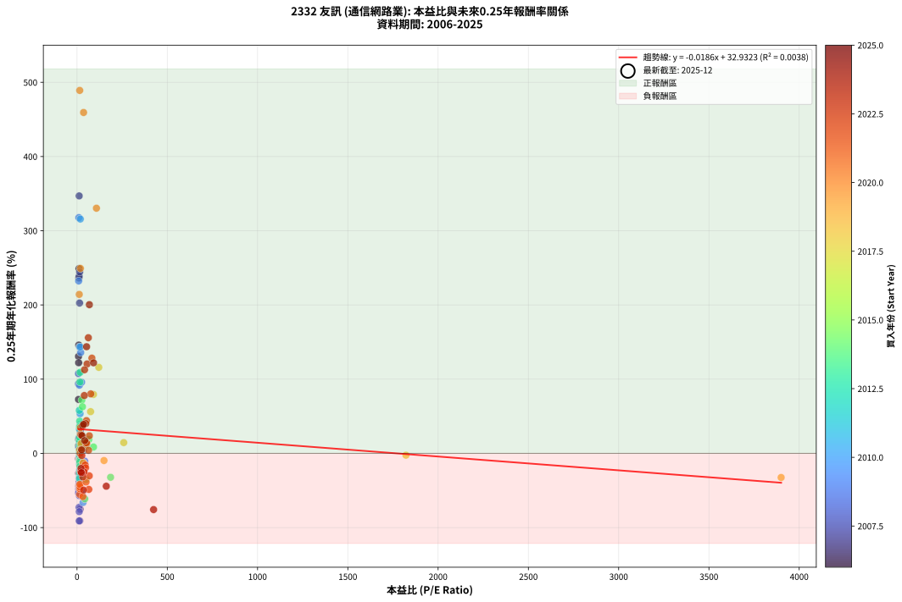
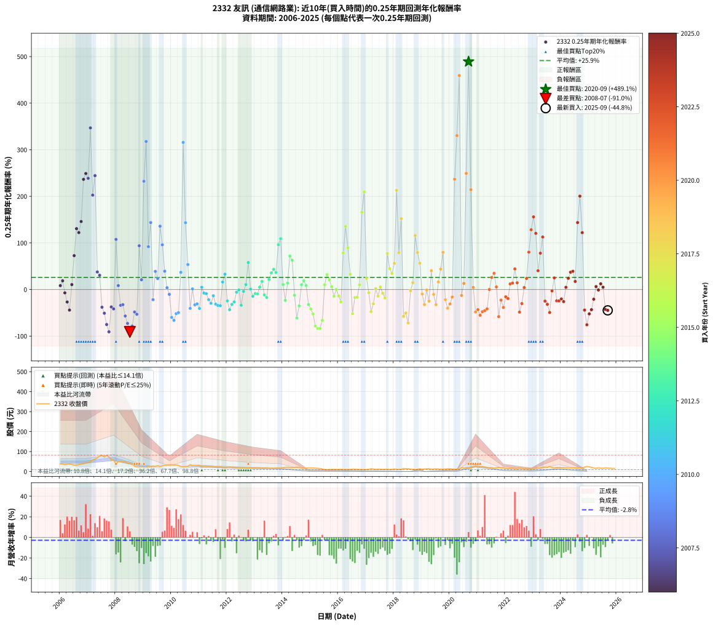

# 2332 友訊 - 本益比與未來報酬率分析

!!! info "報告資訊"
    - **股票代號**: 2332
    - **公司名稱**: 友訊
    - **產業別**: 通信網路業
    - **分析期間**: 2006-2025 (237 個數據點)
    - **資料來源**: Type 12 (ShowMonthlyK_ChartFlow) 月收盤價與本益比
    - **報酬率口徑**: 含現金股利 (簡化: 年度合計，假設每年7/1入帳)
    - **報告生成時間**: 2026-01-07 20:34:47 CST

## 📈 視覺化圖表

### 圖表1: 本益比 vs 未來報酬率關係

*圖表1：2332 友訊 本益比與0.25年期未來報酬率關係 (2006-2025)*

### 圖表2: 歷年買入時點的0.25年期實際報酬率

*圖表2：2332 友訊 歷年買入時點的0.25年期實際報酬率 (2006-2025)*

## 📍 買點訊號說明

本報告提供兩種買點提示訊號（顯示於圖表2的股價子圖中）：

### ▲ 小綠色三角形（回測驗證）
- **計算方式**: 使用全部歷史資料計算本益比第25百分位數
- **用途**: 事後驗證，顯示歷史上哪些時點確實為低估區
- **限制**: 當下無法判斷，僅供回測參考
- **特性**: 後見之明（Look-Ahead Bias）

### ▲ 小橘色三角形（即時訊號）
- **計算方式**: 使用截至當月的過去5年資料計算本益比第25百分位數
- **用途**: 實際投資決策，當時即可判斷
- **優勢**: 可操作性強，符合實務需求
- **特性**: 無後見之明，滾動窗口計算

!!! tip "如何使用兩種訊號"
    - **綠色▲** 幫助理解歷史估值機會，驗證策略有效性
    - **橘色▲** 可作為實際買進參考，但仍需搭配基本面分析
    - 兩種訊號重疊時，表示即時判斷與事後驗證一致，信心度較高
    - 僅有綠色▲時，表示當時無法判斷（需要未來資料才能確認）
    - 僅有橘色▲時，表示即時判斷為買點，但事後可能不是最佳時機

## 📊 估值分析摘要

| 指標 | 數值 |
|:---:|:---:|
| **目前本益比** (2025-09) | **nan 倍** |
| **歷史平均本益比** | 65.65 倍 |
| **估值水準** | 🟡 合理範圍 |
| **預期0.25年年化報酬率** | **+nan%** |
| **歷史平均報酬率** | +25.88% |
| **相關係數 (R²)** | 0.0038 |
| **趨勢線斜率** | -0.0186 |

!!! abstract "核心洞察"
    目前本益比接近歷史平均，預期報酬率符合長期趨勢

    根據歷史數據回測，2332 友訊 在目前本益比 **nan倍** 的估值水準下，
    預期未來0.25年年化報酬率約為 **+nan%**。

    **重要提醒**: 本分析基於歷史數據統計，實際報酬率會受到公司基本面變化、產業趨勢、
    總體經濟環境等多重因素影響。R² = 0.00 表示本益比可解釋約 0.4% 的報酬率變異。

## 📈 歷史估值統計

### 最佳買點 (最高報酬率)

| 項目 | 數值 |
|:---:|:---:|
| 起始時間 | 2020-09 |
| 當時本益比 | 15.00 倍 |
| 起始價格 | 18.4 元 |
| 0.25年後價格 | 28.7 元 |
| **0.25年年化報酬率** | **+489.08%** |

### 最差買點 (最低報酬率)

| 項目 | 數值 |
|:---:|:---:|
| 起始時間 | 2008-07 |
| 當時本益比 | 12.33 倍 |
| 起始價格 | 41.1 元 |
| 0.25年後價格 | 22.4 元 |
| **0.25年年化報酬率** | **-91.02%** |

## 🎯 投資啟示

### 本益比與報酬率關係

趨勢線方程式: **y = -0.0186x + 32.9323**

!!! note "負相關"
    本益比與未來報酬率呈現負相關。較低的本益比通常帶來較高的未來報酬率，
    但相關性不算非常強。**估值仍是重要參考指標之一**。

### 估值區間建議

基於歷史數據分析:

- **🟢 低估區** (P/E < 52.5): 預期報酬率較高，可考慮增加持股
- **🟡 合理區** (P/E 52.5-78.8): 預期報酬率符合長期趨勢，正常持有
- **🔴 高估區** (P/E > 78.8): 預期報酬率較低，可考慮減碼或觀望

!!! danger "風險提示"
    - 過去表現不代表未來結果
    - 本分析假設公司基本面無重大結構性變化
    - 產業環境劇變可能使歷史規律失效
    - 應結合公司財報、產業趨勢、總體經濟等多重因素綜合判斷

!!! success "長期投資觀點"
    歷史數據顯示，在合理或低估的估值水準買入並長期持有，
    往往能獲得較佳的投資報酬。**耐心等待好價格**是價值投資的核心原則。

## 📊 數據品質

- **資料來源**: GoodInfo.tw Type 12 (ShowMonthlyK_ChartFlow)
- **資料頻率**: 月度收盤價與本益比
- **回測期間**: 2006-2025
- **數據點數量**: 237 個 (每個點代表一次0.25年期回測)

### 計算方法說明

1. **0.25年期年化報酬率**:
   - 對每個歷史時點，計算其後0.25年的實際投資報酬率
   - 期末價值(不含股利): 期末價格
   - 期末價值(含現金股利): 期末價格 + 持有期間內的現金股利合計 (簡化: 年度合計，假設每年7/1入帳)
   - 公式: 年化報酬率 = [(期末價值/期初價格)^(1/年數) - 1] × 100%

2. **本益比 (P/E Ratio)**:
   - 使用當時的月收盤價與EPS計算
   - 資料來源: Type 12 月度河流圖本益比數據

3. **趨勢線 (Linear Regression)**:
   - 使用最小平方法擬合線性趨勢線
   - R²值衡量本益比對報酬率的解釋能力

---

*本報告由 Stock Analysis System v1.9.0 自動生成*
*數據更新時間: 2026-01-07 20:34:47 CST*

## 📋 月度回測明細表

（每一列對應時間線圖中的一個買入點；可用來對照 SVG 圖上的每個點。）

| 買入月份 | 賣出月份 | 回測期限_年 | 實際持有年數 | 買入本益比_倍 | 買入收盤價_元 | 賣出收盤價_元 | 現金股利合計_元 | 總報酬率_pct | 年化報酬率_pct |
| --- | --- | --- | --- | --- | --- | --- | --- | --- | --- |
| 2006-01 | 2006-05 | 0.25 | 0.329 | 9.97 | 37.80 | 38.80 | 0.00 | +2.65 | +8.27 |
| 2006-02 | 2006-05 | 0.25 | 0.246 | 9.82 | 37.20 | 38.80 | 0.00 | +4.30 | +18.64 |
| 2006-03 | 2006-07 | 0.25 | 0.334 | 9.04 | 34.25 | 32.20 | 1.20 | -2.48 | -7.25 |
| 2006-04 | 2006-07 | 0.25 | 0.249 | 9.53 | 36.10 | 32.20 | 1.20 | -7.48 | -26.80 |
| 2006-05 | 2006-08 | 0.25 | 0.252 | 10.24 | 38.80 | 32.30 | 1.20 | -13.66 | -44.18 |
| 2006-06 | 2006-09 | 0.25 | 0.252 | 9.31 | 35.30 | 35.00 | 1.20 | +2.55 | +10.51 |
| 2006-07 | 2006-10 | 0.25 | 0.252 | 8.50 | 32.20 | 36.95 | 0.00 | +14.75 | +72.68 |
| 2006-08 | 2006-12 | 0.25 | 0.334 | 8.52 | 32.30 | 42.70 | 0.00 | +32.20 | +130.64 |
| 2006-09 | 2006-12 | 0.25 | 0.249 | 9.23 | 35.00 | 42.70 | 0.00 | +22.00 | +122.14 |
| 2006-10 | 2007-01 | 0.25 | 0.252 | 9.75 | 36.95 | 46.35 | 0.00 | +25.44 | +145.92 |
| 2006-11 | 2007-03 | 0.25 | 0.329 | 10.29 | 39.00 | 58.10 | 0.00 | +48.97 | +236.44 |
| 2006-12 | 2007-03 | 0.25 | 0.246 | 11.27 | 42.70 | 58.10 | 0.00 | +36.07 | +248.98 |
| 2007-01 | 2007-05 | 0.25 | 0.329 | 11.90 | 46.35 | 69.20 | 0.00 | +49.30 | +238.68 |
| 2007-02 | 2007-05 | 0.25 | 0.246 | 11.97 | 47.85 | 69.20 | 0.00 | +44.62 | +346.93 |
| 2007-03 | 2007-07 | 0.25 | 0.334 | 14.17 | 58.10 | 81.80 | 2.30 | +44.75 | +202.60 |
| 2007-04 | 2007-07 | 0.25 | 0.249 | 14.70 | 61.80 | 81.80 | 2.30 | +36.08 | +244.40 |
| 2007-05 | 2007-08 | 0.25 | 0.252 | 16.07 | 69.20 | 72.70 | 2.30 | +8.38 | +37.65 |
| 2007-06 | 2007-09 | 0.25 | 0.252 | 17.69 | 78.00 | 81.10 | 2.30 | +6.92 | +30.44 |
| 2007-07 | 2007-10 | 0.25 | 0.252 | 18.12 | 81.80 | 72.50 | 0.00 | -11.37 | -38.07 |
| 2007-08 | 2007-12 | 0.25 | 0.334 | 15.75 | 72.70 | 57.30 | 0.00 | -21.18 | -50.97 |
| 2007-09 | 2007-12 | 0.25 | 0.249 | 17.18 | 81.10 | 57.30 | 0.00 | -29.35 | -75.20 |
| 2007-10 | 2008-01 | 0.25 | 0.252 | 15.03 | 72.50 | 39.65 | 0.00 | -45.31 | -90.89 |
| 2007-11 | 2008-03 | 0.25 | 0.331 | 11.87 | 58.50 | 50.10 | 0.00 | -14.36 | -37.37 |
| 2007-12 | 2008-03 | 0.25 | 0.249 | 11.39 | 57.30 | 50.10 | 0.00 | -12.57 | -41.66 |
| 2008-01 | 2008-05 | 0.25 | 0.331 | 8.28 | 39.65 | 50.50 | 0.00 | +27.36 | +107.54 |
| 2008-02 | 2008-05 | 0.25 | 0.249 | 10.89 | 49.50 | 50.50 | 0.00 | +2.02 | +8.36 |
| 2008-03 | 2008-07 | 0.25 | 0.334 | 11.64 | 50.10 | 41.10 | 2.50 | -12.97 | -34.03 |
| 2008-04 | 2008-07 | 0.25 | 0.249 | 11.85 | 48.10 | 41.10 | 2.50 | -9.36 | -32.58 |
| 2008-05 | 2008-08 | 0.25 | 0.252 | 13.23 | 50.50 | 38.35 | 2.50 | -19.11 | -56.91 |
| 2008-06 | 2008-09 | 0.25 | 0.252 | 11.47 | 41.00 | 27.05 | 2.50 | -27.93 | -72.75 |
| 2008-07 | 2008-10 | 0.25 | 0.252 | 12.33 | 41.10 | 22.40 | 0.00 | -45.50 | -91.02 |
| 2008-08 | 2008-12 | 0.25 | 0.334 | 12.41 | 38.35 | 22.95 | 0.00 | -40.16 | -78.50 |
| 2008-09 | 2008-12 | 0.25 | 0.249 | 9.50 | 27.05 | 22.95 | 0.00 | -15.16 | -48.30 |
| 2008-10 | 2009-01 | 0.25 | 0.252 | 8.60 | 22.40 | 18.50 | 0.00 | -17.41 | -53.21 |
| 2008-11 | 2009-03 | 0.25 | 0.329 | 8.19 | 19.35 | 24.05 | 0.00 | +24.29 | +93.84 |
| 2008-12 | 2009-03 | 0.25 | 0.246 | 10.83 | 22.95 | 24.05 | 0.00 | +4.79 | +20.92 |
| 2009-01 | 2009-05 | 0.25 | 0.329 | 9.21 | 18.50 | 27.45 | 0.00 | +48.38 | +232.36 |
| 2009-02 | 2009-05 | 0.25 | 0.246 | 10.17 | 19.30 | 27.45 | 0.00 | +42.23 | +317.70 |
| 2009-03 | 2009-07 | 0.25 | 0.334 | 13.45 | 24.05 | 29.40 | 0.50 | +24.32 | +91.91 |
| 2009-04 | 2009-07 | 0.25 | 0.249 | 14.28 | 23.95 | 29.40 | 0.50 | +24.84 | +143.66 |
| 2009-05 | 2009-08 | 0.25 | 0.252 | 17.53 | 27.45 | 25.30 | 0.50 | -6.01 | -21.82 |
| 2009-06 | 2009-09 | 0.25 | 0.252 | 18.35 | 26.70 | 28.50 | 0.50 | +8.61 | +38.83 |
| 2009-07 | 2009-10 | 0.25 | 0.252 | 21.87 | 29.40 | 31.00 | 0.00 | +5.44 | +23.42 |
| 2009-08 | 2009-12 | 0.25 | 0.334 | 20.51 | 25.30 | 33.70 | 0.00 | +33.20 | +135.92 |
| 2009-09 | 2009-12 | 0.25 | 0.249 | 25.39 | 28.50 | 33.70 | 0.00 | +18.25 | +95.95 |
| 2009-10 | 2010-01 | 0.25 | 0.252 | 30.64 | 31.00 | 33.70 | 0.00 | +8.71 | +39.31 |
| 2009-11 | 2010-03 | 0.25 | 0.329 | 35.97 | 32.40 | 32.80 | 0.00 | +1.23 | +3.81 |
| 2009-12 | 2010-03 | 0.25 | 0.246 | 42.66 | 33.70 | 32.80 | 0.00 | -2.67 | -10.40 |
| 2010-01 | 2010-05 | 0.25 | 0.329 | 38.22 | 33.70 | 24.95 | 0.00 | -25.96 | -59.95 |
| 2010-02 | 2010-05 | 0.25 | 0.246 | 33.49 | 32.60 | 24.95 | 0.00 | -23.47 | -66.22 |
| 2010-03 | 2010-07 | 0.25 | 0.334 | 30.80 | 32.80 | 24.70 | 1.00 | -21.65 | -51.82 |
| 2010-04 | 2010-07 | 0.25 | 0.249 | 26.37 | 30.50 | 24.70 | 1.00 | -15.74 | -49.71 |
| 2010-05 | 2010-08 | 0.25 | 0.252 | 19.99 | 24.95 | 26.00 | 1.00 | +8.22 | +36.82 |
| 2010-06 | 2010-09 | 0.25 | 0.252 | 18.32 | 24.55 | 34.15 | 1.00 | +43.18 | +315.75 |
| 2010-07 | 2010-10 | 0.25 | 0.252 | 17.25 | 24.70 | 30.90 | 0.00 | +25.10 | +143.30 |
| 2010-08 | 2010-12 | 0.25 | 0.334 | 17.07 | 26.00 | 30.00 | 0.00 | +15.38 | +53.48 |
| 2010-09 | 2010-12 | 0.25 | 0.249 | 21.15 | 34.15 | 30.00 | 0.00 | -12.15 | -40.55 |
| 2010-10 | 2011-01 | 0.25 | 0.252 | 18.11 | 30.90 | 31.00 | 0.00 | +0.32 | +1.29 |
| 2010-11 | 2011-03 | 0.25 | 0.329 | 17.38 | 31.25 | 27.40 | 0.00 | -12.32 | -32.98 |
| 2010-12 | 2011-03 | 0.25 | 0.246 | 15.87 | 30.00 | 27.40 | 0.00 | -8.67 | -30.78 |
| 2011-01 | 2011-05 | 0.25 | 0.329 | 16.67 | 31.00 | 26.10 | 0.00 | -15.81 | -40.77 |
| 2011-02 | 2011-05 | 0.25 | 0.246 | 14.11 | 25.80 | 26.10 | 0.00 | +1.16 | +4.80 |
| 2011-03 | 2011-07 | 0.25 | 0.334 | 15.24 | 27.40 | 25.35 | 1.32 | -2.65 | -7.71 |
| 2011-04 | 2011-07 | 0.25 | 0.249 | 15.45 | 27.30 | 25.35 | 1.32 | -2.29 | -8.88 |
| 2011-05 | 2011-08 | 0.25 | 0.252 | 15.04 | 26.10 | 23.20 | 1.32 | -6.03 | -21.89 |
| 2011-06 | 2011-09 | 0.25 | 0.252 | 15.40 | 26.25 | 22.70 | 1.32 | -8.48 | -29.65 |
| 2011-07 | 2011-10 | 0.25 | 0.252 | 15.14 | 25.35 | 24.45 | 0.00 | -3.55 | -13.37 |
| 2011-08 | 2011-12 | 0.25 | 0.334 | 14.12 | 23.20 | 20.45 | 0.00 | -11.85 | -31.46 |
| 2011-09 | 2011-12 | 0.25 | 0.249 | 14.08 | 22.70 | 20.45 | 0.00 | -9.91 | -34.23 |
| 2011-10 | 2012-01 | 0.25 | 0.252 | 15.46 | 24.45 | 21.95 | 0.00 | -10.22 | -34.83 |
| 2011-11 | 2012-03 | 0.25 | 0.331 | 13.48 | 20.90 | 21.95 | 0.00 | +5.02 | +15.95 |
| 2011-12 | 2012-03 | 0.25 | 0.249 | 13.45 | 20.45 | 21.95 | 0.00 | +7.33 | +32.86 |
| 2012-01 | 2012-05 | 0.25 | 0.331 | 14.67 | 21.95 | 20.00 | 0.00 | -8.88 | -24.48 |
| 2012-02 | 2012-05 | 0.25 | 0.249 | 15.64 | 23.05 | 20.00 | 0.00 | -13.23 | -43.43 |
| 2012-03 | 2012-07 | 0.25 | 0.334 | 15.14 | 21.95 | 18.20 | 1.10 | -12.07 | -31.97 |
| 2012-04 | 2012-07 | 0.25 | 0.249 | 14.61 | 20.85 | 18.20 | 1.10 | -7.43 | -26.66 |
| 2012-05 | 2012-08 | 0.25 | 0.252 | 14.25 | 20.00 | 18.60 | 1.10 | -1.50 | -5.82 |
| 2012-06 | 2012-09 | 0.25 | 0.252 | 13.80 | 19.05 | 17.90 | 1.10 | -0.26 | -1.04 |
| 2012-07 | 2012-10 | 0.25 | 0.252 | 13.42 | 18.20 | 16.40 | 0.00 | -9.89 | -33.86 |
| 2012-08 | 2012-12 | 0.25 | 0.334 | 13.95 | 18.60 | 18.35 | 0.00 | -1.34 | -3.97 |
| 2012-09 | 2012-12 | 0.25 | 0.249 | 13.66 | 17.90 | 18.35 | 0.00 | +2.51 | +10.48 |
| 2012-10 | 2013-01 | 0.25 | 0.252 | 12.75 | 16.40 | 18.40 | 0.00 | +12.20 | +57.91 |
| 2012-11 | 2013-03 | 0.25 | 0.329 | 13.93 | 17.60 | 17.65 | 0.00 | +0.28 | +0.87 |
| 2012-12 | 2013-03 | 0.25 | 0.246 | 14.80 | 18.35 | 17.65 | 0.00 | -3.81 | -14.60 |
| 2013-01 | 2013-05 | 0.25 | 0.329 | 15.02 | 18.40 | 17.85 | 0.00 | -2.99 | -8.82 |
| 2013-02 | 2013-05 | 0.25 | 0.246 | 15.12 | 18.30 | 17.85 | 0.00 | -2.46 | -9.61 |
| 2013-03 | 2013-07 | 0.25 | 0.334 | 14.77 | 17.65 | 16.95 | 1.00 | +1.70 | +5.18 |
| 2013-04 | 2013-07 | 0.25 | 0.249 | 14.62 | 17.25 | 16.95 | 1.00 | +4.06 | +17.31 |
| 2013-05 | 2013-08 | 0.25 | 0.252 | 15.32 | 17.85 | 16.30 | 1.00 | -3.08 | -11.68 |
| 2013-06 | 2013-09 | 0.25 | 0.252 | 15.96 | 18.35 | 16.50 | 1.00 | -4.63 | -17.16 |
| 2013-07 | 2013-10 | 0.25 | 0.252 | 14.93 | 16.95 | 17.80 | 0.00 | +5.01 | +21.44 |
| 2013-08 | 2013-12 | 0.25 | 0.334 | 14.55 | 16.30 | 18.05 | 0.00 | +10.74 | +35.71 |
| 2013-09 | 2013-12 | 0.25 | 0.249 | 14.93 | 16.50 | 18.05 | 0.00 | +9.39 | +43.39 |
| 2013-10 | 2014-01 | 0.25 | 0.252 | 16.33 | 17.80 | 19.25 | 0.00 | +8.15 | +36.47 |
| 2013-11 | 2014-03 | 0.25 | 0.329 | 16.14 | 17.35 | 21.65 | 0.00 | +24.78 | +96.19 |
| 2013-12 | 2014-03 | 0.25 | 0.246 | 17.03 | 18.05 | 21.65 | 0.00 | +19.94 | +109.18 |
| 2014-01 | 2014-05 | 0.25 | 0.329 | 19.64 | 19.25 | 19.90 | 0.00 | +3.38 | +10.64 |
| 2014-02 | 2014-05 | 0.25 | 0.246 | 23.61 | 21.25 | 19.90 | 0.00 | -6.35 | -23.39 |
| 2014-03 | 2014-07 | 0.25 | 0.334 | 26.40 | 21.65 | 21.60 | 1.00 | +4.39 | +13.72 |
| 2014-04 | 2014-07 | 0.25 | 0.249 | 26.69 | 19.75 | 21.60 | 1.00 | +14.43 | +71.78 |
| 2014-05 | 2014-08 | 0.25 | 0.252 | 30.15 | 19.90 | 21.50 | 1.00 | +13.07 | +62.83 |
| 2014-06 | 2014-09 | 0.25 | 0.252 | 34.14 | 19.80 | 18.15 | 1.00 | -3.28 | -12.41 |
| 2014-07 | 2014-10 | 0.25 | 0.252 | 43.20 | 21.60 | 17.00 | 0.00 | -21.30 | -61.36 |
| 2014-08 | 2014-12 | 0.25 | 0.334 | 51.19 | 21.50 | 18.60 | 0.00 | -13.49 | -35.19 |
| 2014-09 | 2014-12 | 0.25 | 0.249 | 53.38 | 18.15 | 18.60 | 0.00 | +2.48 | +10.33 |
| 2014-10 | 2015-01 | 0.25 | 0.252 | 65.38 | 17.00 | 17.75 | 0.00 | +4.41 | +18.70 |
| 2014-11 | 2015-03 | 0.25 | 0.329 | 91.39 | 16.45 | 16.90 | 0.00 | +2.74 | +8.56 |
| 2014-12 | 2015-03 | 0.25 | 0.246 | 186.00 | 18.60 | 16.90 | 0.00 | -9.14 | -32.23 |
| 2015-01 | 2015-05 | 0.25 | 0.329 |  | 17.75 | 14.85 | 0.00 | -16.34 | -41.90 |
| 2015-02 | 2015-05 | 0.25 | 0.246 |  | 17.85 | 14.85 | 0.00 | -16.81 | -52.61 |
| 2015-03 | 2015-07 | 0.25 | 0.334 |  | 16.90 | 10.10 | 0.00 | -40.24 | -78.59 |
| 2015-04 | 2015-07 | 0.25 | 0.249 |  | 15.90 | 10.10 | 0.00 | -36.48 | -83.82 |
| 2015-05 | 2015-08 | 0.25 | 0.252 |  | 14.85 | 9.39 | 0.00 | -36.77 | -83.79 |
| 2015-06 | 2015-09 | 0.25 | 0.252 |  | 12.90 | 9.82 | 0.00 | -23.88 | -66.14 |
| 2015-07 | 2015-10 | 0.25 | 0.252 |  | 10.10 | 10.35 | 0.00 | +2.48 | +10.19 |
| 2015-08 | 2015-12 | 0.25 | 0.334 |  | 9.39 | 10.30 | 0.00 | +9.69 | +31.91 |
| 2015-09 | 2015-12 | 0.25 | 0.249 |  | 9.82 | 10.30 | 0.00 | +4.89 | +21.11 |
| 2015-10 | 2016-01 | 0.25 | 0.252 |  | 10.35 | 10.50 | 0.00 | +1.45 | +5.88 |
| 2015-11 | 2016-03 | 0.25 | 0.331 |  | 10.85 | 10.30 | 0.00 | -5.07 | -14.53 |
| 2015-12 | 2016-03 | 0.25 | 0.249 |  | 10.30 | 10.30 | 0.00 | +0.00 | +0.00 |
| 2016-01 | 2016-05 | 0.25 | 0.331 |  | 10.50 | 10.00 | 0.00 | -4.76 | -13.69 |
| 2016-02 | 2016-05 | 0.25 | 0.249 |  | 10.80 | 10.00 | 0.00 | -7.41 | -26.57 |
| 2016-03 | 2016-07 | 0.25 | 0.334 |  | 10.30 | 12.20 | 0.30 | +21.36 | +78.53 |
| 2016-04 | 2016-07 | 0.25 | 0.249 |  | 10.10 | 12.20 | 0.30 | +23.76 | +135.30 |
| 2016-05 | 2016-08 | 0.25 | 0.252 |  | 10.00 | 11.45 | 0.30 | +17.50 | +89.70 |
| 2016-06 | 2016-09 | 0.25 | 0.252 |  | 10.75 | 11.25 | 0.30 | +7.44 | +32.97 |
| 2016-07 | 2016-10 | 0.25 | 0.252 |  | 12.20 | 10.15 | 0.00 | -16.80 | -51.83 |
| 2016-08 | 2016-12 | 0.25 | 0.334 |  | 11.45 | 10.75 | 0.00 | -6.11 | -17.21 |
| 2016-09 | 2016-12 | 0.25 | 0.249 |  | 11.25 | 10.75 | 0.00 | -4.44 | -16.68 |
| 2016-10 | 2017-01 | 0.25 | 0.252 |  | 10.15 | 10.40 | 0.00 | +2.46 | +10.14 |
| 2016-11 | 2017-03 | 0.25 | 0.329 |  | 10.30 | 14.20 | 0.00 | +37.86 | +165.74 |
| 2016-12 | 2017-03 | 0.25 | 0.246 |  | 10.75 | 14.20 | 0.00 | +32.09 | +209.44 |
| 2017-01 | 2017-05 | 0.25 | 0.329 |  | 10.40 | 11.15 | 0.00 | +7.21 | +23.61 |
| 2017-02 | 2017-05 | 0.25 | 0.246 |  | 11.35 | 11.15 | 0.00 | -1.76 | -6.96 |
| 2017-03 | 2017-07 | 0.25 | 0.334 |  | 14.20 | 11.15 | 0.30 | -19.37 | -47.50 |
| 2017-04 | 2017-07 | 0.25 | 0.249 |  | 12.55 | 11.15 | 0.30 | -8.76 | -30.80 |
| 2017-05 | 2017-08 | 0.25 | 0.252 |  | 11.15 | 10.90 | 0.30 | +0.45 | +1.79 |
| 2017-06 | 2017-09 | 0.25 | 0.252 |  | 11.90 | 11.15 | 0.30 | -3.78 | -14.19 |
| 2017-07 | 2017-10 | 0.25 | 0.252 |  | 11.15 | 11.30 | 0.00 | +1.35 | +5.45 |
| 2017-08 | 2017-12 | 0.25 | 0.334 |  | 10.90 | 10.60 | 0.00 | -2.75 | -8.02 |
| 2017-09 | 2017-12 | 0.25 | 0.249 |  | 11.15 | 10.60 | 0.00 | -4.93 | -18.38 |
| 2017-10 | 2018-01 | 0.25 | 0.252 |  | 11.30 | 13.05 | 0.00 | +15.49 | +77.12 |
| 2017-11 | 2018-03 | 0.25 | 0.329 |  | 10.10 | 11.40 | 0.00 | +12.87 | +44.56 |
| 2017-12 | 2018-03 | 0.25 | 0.246 |  | 10.60 | 11.40 | 0.00 | +7.55 | +34.35 |
| 2018-01 | 2018-05 | 0.25 | 0.329 |  | 13.05 | 15.10 | 0.00 | +15.71 | +55.91 |
| 2018-02 | 2018-05 | 0.25 | 0.246 |  | 11.40 | 15.10 | 0.00 | +32.46 | +212.90 |
| 2018-03 | 2018-07 | 0.25 | 0.334 |  | 11.40 | 13.85 | 0.00 | +21.49 | +79.11 |
| 2018-04 | 2018-07 | 0.25 | 0.249 |  | 11.00 | 13.85 | 0.00 | +25.91 | +152.12 |
| 2018-05 | 2018-08 | 0.25 | 0.252 |  | 15.10 | 12.15 | 0.00 | -19.54 | -57.81 |
| 2018-06 | 2018-09 | 0.25 | 0.252 |  | 13.90 | 11.65 | 0.00 | -16.19 | -50.39 |
| 2018-07 | 2018-10 | 0.25 | 0.252 |  | 13.85 | 10.05 | 0.00 | -27.44 | -72.01 |
| 2018-08 | 2018-12 | 0.25 | 0.334 | 1822.00 | 12.15 | 12.05 | 0.00 | -0.82 | -2.44 |
| 2018-09 | 2018-12 | 0.25 | 0.249 | 258.90 | 11.65 | 12.05 | 0.00 | +3.43 | +14.51 |
| 2018-10 | 2019-01 | 0.25 | 0.252 | 120.60 | 10.05 | 12.20 | 0.00 | +21.39 | +115.90 |
| 2018-11 | 2019-03 | 0.25 | 0.329 | 91.23 | 11.10 | 13.45 | 0.00 | +21.17 | +79.41 |
| 2018-12 | 2019-03 | 0.25 | 0.246 | 75.31 | 12.05 | 13.45 | 0.00 | +11.62 | +56.22 |
| 2019-01 | 2019-05 | 0.25 | 0.329 | 149.40 | 12.20 | 11.80 | 0.00 | -3.28 | -9.65 |
| 2019-02 | 2019-05 | 0.25 | 0.246 | 3900.00 | 13.00 | 11.80 | 0.00 | -9.23 | -32.50 |
| 2019-03 | 2019-07 | 0.25 | 0.334 |  | 13.45 | 13.20 | 0.20 | -0.37 | -1.11 |
| 2019-04 | 2019-07 | 0.25 | 0.249 |  | 14.40 | 13.20 | 0.20 | -6.94 | -25.09 |
| 2019-05 | 2019-08 | 0.25 | 0.252 |  | 11.80 | 12.65 | 0.20 | +8.90 | +40.27 |
| 2019-06 | 2019-09 | 0.25 | 0.252 |  | 12.70 | 12.15 | 0.20 | -2.76 | -10.50 |
| 2019-07 | 2019-10 | 0.25 | 0.252 |  | 13.20 | 11.95 | 0.00 | -9.47 | -32.63 |
| 2019-08 | 2019-12 | 0.25 | 0.334 |  | 12.65 | 13.30 | 0.00 | +5.14 | +16.18 |
| 2019-09 | 2019-12 | 0.25 | 0.249 |  | 12.15 | 13.30 | 0.00 | +9.47 | +43.76 |
| 2019-10 | 2020-01 | 0.25 | 0.252 |  | 11.95 | 13.85 | 0.00 | +15.90 | +79.64 |
| 2019-11 | 2020-03 | 0.25 | 0.331 |  | 12.70 | 11.70 | 0.00 | -7.87 | -21.93 |
| 2019-12 | 2020-03 | 0.25 | 0.249 |  | 13.30 | 11.70 | 0.00 | -12.03 | -40.22 |
| 2020-01 | 2020-05 | 0.25 | 0.331 |  | 13.85 | 12.25 | 0.00 | -11.55 | -30.97 |
| 2020-02 | 2020-05 | 0.25 | 0.249 |  | 12.80 | 12.25 | 0.00 | -4.30 | -16.16 |
| 2020-03 | 2020-07 | 0.25 | 0.334 |  | 11.70 | 17.55 | 0.00 | +50.00 | +236.66 |
| 2020-04 | 2020-07 | 0.25 | 0.249 | 107.60 | 12.20 | 17.55 | 0.00 | +43.85 | +330.37 |
| 2020-05 | 2020-08 | 0.25 | 0.252 | 36.39 | 12.25 | 18.90 | 0.00 | +54.29 | +459.34 |
| 2020-06 | 2020-09 | 0.25 | 0.252 | 34.11 | 19.10 | 18.45 | 0.00 | -3.40 | -12.84 |
| 2020-07 | 2020-10 | 0.25 | 0.252 | 22.40 | 17.55 | 18.10 | 0.00 | +3.13 | +13.03 |
| 2020-08 | 2020-12 | 0.25 | 0.334 | 18.77 | 18.90 | 28.70 | 0.00 | +51.85 | +249.26 |
| 2020-09 | 2020-12 | 0.25 | 0.249 | 15.00 | 18.45 | 28.70 | 0.00 | +55.56 | +489.08 |
| 2020-10 | 2021-01 | 0.25 | 0.252 | 12.45 | 18.10 | 24.15 | 0.00 | +33.43 | +214.20 |
| 2020-11 | 2021-03 | 0.25 | 0.329 | 14.34 | 24.05 | 24.40 | 0.00 | +1.46 | +4.50 |
| 2020-12 | 2021-03 | 0.25 | 0.246 | 15.11 | 28.70 | 24.40 | 0.00 | -14.98 | -48.25 |
| 2021-01 | 2021-05 | 0.25 | 0.329 | 13.62 | 24.15 | 20.05 | 0.00 | -16.98 | -43.24 |
| 2021-02 | 2021-05 | 0.25 | 0.246 | 14.85 | 24.45 | 20.05 | 0.00 | -18.00 | -55.30 |
| 2021-03 | 2021-07 | 0.25 | 0.334 | 16.05 | 24.40 | 19.35 | 0.30 | -19.47 | -47.70 |
| 2021-04 | 2021-07 | 0.25 | 0.249 | 16.40 | 22.85 | 19.35 | 0.30 | -14.00 | -45.42 |
| 2021-05 | 2021-08 | 0.25 | 0.252 | 15.83 | 20.05 | 17.20 | 0.30 | -12.72 | -41.73 |
| 2021-06 | 2021-09 | 0.25 | 0.252 | 16.71 | 19.05 | 18.75 | 0.30 | +0.00 | +0.00 |
| 2021-07 | 2021-10 | 0.25 | 0.252 | 19.10 | 19.35 | 20.50 | 0.00 | +5.94 | +25.76 |
| 2021-08 | 2021-12 | 0.25 | 0.334 | 19.40 | 17.20 | 19.00 | 0.00 | +10.47 | +34.71 |
| 2021-09 | 2021-12 | 0.25 | 0.249 | 24.67 | 18.75 | 19.00 | 0.00 | +1.33 | +5.46 |
| 2021-10 | 2022-01 | 0.25 | 0.252 | 32.37 | 20.50 | 16.45 | 0.00 | -19.76 | -58.26 |
| 2021-11 | 2022-03 | 0.25 | 0.329 | 36.22 | 18.35 | 16.85 | 0.00 | -8.17 | -22.86 |
| 2021-12 | 2022-03 | 0.25 | 0.246 | 50.00 | 19.00 | 16.85 | 0.00 | -11.32 | -38.58 |
| 2022-01 | 2022-05 | 0.25 | 0.329 | 45.28 | 16.45 | 15.55 | 0.00 | -5.47 | -15.74 |
| 2022-02 | 2022-05 | 0.25 | 0.246 | 47.31 | 16.40 | 15.55 | 0.00 | -5.18 | -19.43 |
| 2022-03 | 2022-07 | 0.25 | 0.334 | 51.06 | 16.85 | 17.20 | 0.30 | +3.86 | +12.00 |
| 2022-04 | 2022-07 | 0.25 | 0.249 | 54.10 | 16.95 | 17.20 | 0.30 | +3.24 | +13.67 |
| 2022-05 | 2022-08 | 0.25 | 0.252 | 52.42 | 15.55 | 16.75 | 0.30 | +9.65 | +44.14 |
| 2022-06 | 2022-09 | 0.25 | 0.252 | 51.79 | 14.50 | 14.70 | 0.30 | +3.45 | +14.41 |
| 2022-07 | 2022-10 | 0.25 | 0.252 | 65.32 | 17.20 | 14.55 | 0.00 | -15.41 | -48.54 |
| 2022-08 | 2022-12 | 0.25 | 0.334 | 67.91 | 16.75 | 14.85 | 0.00 | -11.34 | -30.26 |
| 2022-09 | 2022-12 | 0.25 | 0.249 | 63.91 | 14.70 | 14.85 | 0.00 | +1.02 | +4.16 |
| 2022-10 | 2023-01 | 0.25 | 0.252 | 68.20 | 14.55 | 15.35 | 0.00 | +5.50 | +23.68 |
| 2022-11 | 2023-03 | 0.25 | 0.329 | 76.27 | 15.00 | 18.20 | 0.00 | +21.33 | +80.14 |
| 2022-12 | 2023-03 | 0.25 | 0.246 | 82.50 | 14.85 | 18.20 | 0.00 | +22.56 | +128.31 |
| 2023-01 | 2023-05 | 0.25 | 0.329 | 62.87 | 15.35 | 20.90 | 0.00 | +36.16 | +155.85 |
| 2023-02 | 2023-05 | 0.25 | 0.246 | 55.78 | 17.20 | 20.90 | 0.00 | +21.51 | +120.50 |
| 2023-03 | 2023-07 | 0.25 | 0.334 | 48.86 | 18.20 | 20.15 | 0.23 | +11.95 | +40.21 |
| 2023-04 | 2023-07 | 0.25 | 0.249 | 40.42 | 17.65 | 20.15 | 0.23 | +15.44 | +77.94 |
| 2023-05 | 2023-08 | 0.25 | 0.252 | 41.73 | 20.90 | 25.05 | 0.23 | +20.93 | +112.67 |
| 2023-06 | 2023-09 | 0.25 | 0.252 | 38.67 | 21.85 | 20.10 | 0.23 | -6.98 | -24.97 |
| 2023-07 | 2023-10 | 0.25 | 0.252 | 32.03 | 20.15 | 18.30 | 0.00 | -9.18 | -31.77 |
| 2023-08 | 2023-12 | 0.25 | 0.334 | 36.13 | 25.05 | 19.95 | 0.00 | -20.36 | -49.42 |
| 2023-09 | 2023-12 | 0.25 | 0.249 | 26.53 | 20.10 | 19.95 | 0.00 | -0.75 | -2.96 |
| 2023-10 | 2024-01 | 0.25 | 0.252 | 22.27 | 18.30 | 19.35 | 0.00 | +5.74 | +24.79 |
| 2023-11 | 2024-03 | 0.25 | 0.331 | 23.03 | 20.40 | 18.60 | 0.00 | -8.82 | -24.33 |
| 2023-12 | 2024-03 | 0.25 | 0.249 | 21.00 | 19.95 | 18.60 | 0.00 | -6.77 | -24.51 |
| 2024-01 | 2024-05 | 0.25 | 0.331 | 22.09 | 19.35 | 17.95 | 0.00 | -7.24 | -20.28 |
| 2024-02 | 2024-05 | 0.25 | 0.249 | 24.14 | 19.35 | 17.95 | 0.00 | -7.24 | -26.02 |
| 2024-03 | 2024-07 | 0.25 | 0.334 | 25.57 | 18.60 | 18.35 | 0.54 | +1.54 | +4.67 |
| 2024-04 | 2024-07 | 0.25 | 0.249 | 27.40 | 17.90 | 18.35 | 0.54 | +5.51 | +24.01 |
| 2024-05 | 2024-08 | 0.25 | 0.252 | 30.99 | 17.95 | 18.90 | 0.54 | +8.28 | +37.13 |
| 2024-06 | 2024-09 | 0.25 | 0.252 | 36.24 | 18.30 | 19.35 | 0.54 | +8.67 | +39.09 |
| 2024-07 | 2024-10 | 0.25 | 0.252 | 42.59 | 18.35 | 19.10 | 0.00 | +4.09 | +17.24 |
| 2024-08 | 2024-12 | 0.25 | 0.334 | 52.99 | 18.90 | 25.45 | 0.00 | +34.66 | +143.72 |
| 2024-09 | 2024-12 | 0.25 | 0.249 | 68.50 | 19.35 | 25.45 | 0.00 | +31.52 | +200.37 |
| 2024-10 | 2025-01 | 0.25 | 0.252 | 91.68 | 19.10 | 23.35 | 0.00 | +22.25 | +122.03 |
| 2024-11 | 2025-03 | 0.25 | 0.329 | 162.10 | 21.75 | 17.95 | 0.00 | -17.47 | -44.26 |
| 2024-12 | 2025-03 | 0.25 | 0.246 | 424.20 | 25.45 | 17.95 | 0.00 | -29.47 | -75.75 |
| 2025-01 | 2025-05 | 0.25 | 0.329 |  | 23.35 | 18.30 | 0.00 | -21.63 | -52.37 |
| 2025-02 | 2025-05 | 0.25 | 0.246 |  | 21.05 | 18.30 | 0.00 | -13.06 | -43.34 |
| 2025-03 | 2025-07 | 0.25 | 0.334 |  | 17.95 | 16.50 | 0.10 | -7.52 | -20.87 |
| 2025-04 | 2025-07 | 0.25 | 0.249 |  | 16.35 | 16.50 | 0.10 | +1.53 | +6.28 |
| 2025-05 | 2025-08 | 0.25 | 0.252 |  | 18.30 | 18.15 | 0.10 | -0.27 | -1.08 |
| 2025-06 | 2025-09 | 0.25 | 0.252 |  | 17.05 | 17.45 | 0.10 | +2.93 | +12.16 |
| 2025-07 | 2025-10 | 0.25 | 0.252 |  | 16.50 | 16.70 | 0.00 | +1.21 | +4.90 |
| 2025-08 | 2025-12 | 0.25 | 0.334 |  | 18.15 | 15.05 | 0.00 | -17.08 | -42.92 |
| 2025-09 | 2025-12 | 0.25 | 0.249 |  | 17.45 | 15.05 | 0.00 | -13.75 | -44.78 |
