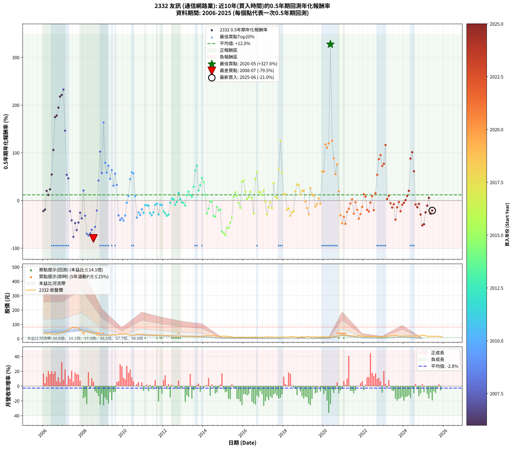

# 2332 友訊 - 本益比與未來報酬率分析

!!! info "報告資訊"
    - **股票代號**: 2332
    - **公司名稱**: 友訊
    - **產業別**: 通信網路業
    - **分析期間**: 2006-2025 (234 個數據點)
    - **資料來源**: Type 12 (ShowMonthlyK_ChartFlow) 月收盤價與本益比
    - **報酬率口徑**: 含現金股利 (簡化: 年度合計，假設每年7/1入帳)
    - **報告生成時間**: 2026-01-10 22:24:27 CST

## 📈 視覺化圖表

### 圖表1: 本益比 vs 未來報酬率關係

*圖表1：2332 友訊 本益比與0.5年期未來報酬率關係 (2006-2025)*

### 圖表2: 歷年買入時點的0.5年期實際報酬率

*圖表2：2332 友訊 歷年買入時點的0.5年期實際報酬率 (2006-2025)*

## 📍 買點訊號說明

本報告提供兩種買點提示訊號（顯示於圖表2的股價子圖中）：

### ▲ 小綠色三角形（回測驗證）
- **計算方式**: 使用全部歷史資料計算本益比第25百分位數
- **用途**: 事後驗證，顯示歷史上哪些時點確實為低估區
- **限制**: 當下無法判斷，僅供回測參考
- **特性**: 後見之明（Look-Ahead Bias）

### ▲ 小橘色三角形（即時訊號）
- **計算方式**: 使用截至當月的過去5年資料計算本益比第25百分位數
- **用途**: 實際投資決策，當時即可判斷
- **優勢**: 可操作性強，符合實務需求
- **特性**: 無後見之明，滾動窗口計算

!!! tip "如何使用兩種訊號"
    - **綠色▲** 幫助理解歷史估值機會，驗證策略有效性
    - **橘色▲** 可作為實際買進參考，但仍需搭配基本面分析
    - 兩種訊號重疊時，表示即時判斷與事後驗證一致，信心度較高
    - 僅有綠色▲時，表示當時無法判斷（需要未來資料才能確認）
    - 僅有橘色▲時，表示即時判斷為買點，但事後可能不是最佳時機

## 📊 估值分析摘要

| 指標 | 數值 |
|:---:|:---:|
| **目前本益比** (2025-06) | **nan 倍** |
| **歷史平均本益比** | 65.65 倍 |
| **估值水準** | 🟡 合理範圍 |
| **預期0.5年年化報酬率** | **+nan%** |
| **歷史平均報酬率** | +11.95% |
| **相關係數 (R²)** | 0.0007 |
| **趨勢線斜率** | -0.0050 |

!!! abstract "核心洞察"
    目前本益比接近歷史平均，預期報酬率符合長期趨勢

    根據歷史數據回測，2332 友訊 在目前本益比 **nan倍** 的估值水準下，
    預期未來0.5年年化報酬率約為 **+nan%**。

    **重要提醒**: 本分析基於歷史數據統計，實際報酬率會受到公司基本面變化、產業趨勢、
    總體經濟環境等多重因素影響。R² = 0.00 表示本益比可解釋約 0.1% 的報酬率變異。

## 📈 歷史估值統計

### 最佳買點 (最高報酬率)

| 項目 | 數值 |
|:---:|:---:|
| 起始時間 | 2020-05 |
| 當時本益比 | 36.39 倍 |
| 起始價格 | 12.2 元 |
| 0.5年後價格 | 28.7 元 |
| **0.5年年化報酬率** | **+327.63%** |

### 最差買點 (最低報酬率)

| 項目 | 數值 |
|:---:|:---:|
| 起始時間 | 2008-07 |
| 當時本益比 | 12.33 倍 |
| 起始價格 | 41.1 元 |
| 0.5年後價格 | 18.5 元 |
| **0.5年年化報酬率** | **-79.50%** |

## 🎯 投資啟示

### 本益比與報酬率關係

趨勢線方程式: **y = -0.0050x + 14.8269**

!!! note "負相關"
    本益比與未來報酬率呈現負相關。較低的本益比通常帶來較高的未來報酬率，
    但相關性不算非常強。**估值仍是重要參考指標之一**。

### 估值區間建議

基於歷史數據分析:

- **🟢 低估區** (P/E < 52.5): 預期報酬率較高，可考慮增加持股
- **🟡 合理區** (P/E 52.5-78.8): 預期報酬率符合長期趨勢，正常持有
- **🔴 高估區** (P/E > 78.8): 預期報酬率較低，可考慮減碼或觀望

!!! danger "風險提示"
    - 過去表現不代表未來結果
    - 本分析假設公司基本面無重大結構性變化
    - 產業環境劇變可能使歷史規律失效
    - 應結合公司財報、產業趨勢、總體經濟等多重因素綜合判斷

!!! success "長期投資觀點"
    歷史數據顯示，在合理或低估的估值水準買入並長期持有，
    往往能獲得較佳的投資報酬。**耐心等待好價格**是價值投資的核心原則。

## 📊 數據品質

- **資料來源**: GoodInfo.tw Type 12 (ShowMonthlyK_ChartFlow)
- **資料頻率**: 月度收盤價與本益比
- **回測期間**: 2006-2025
- **數據點數量**: 234 個 (每個點代表一次0.5年期回測)

### 計算方法說明

1. **0.5年期年化報酬率**:
   - 對每個歷史時點，計算其後0.5年的實際投資報酬率
   - 期末價值(不含股利): 期末價格
   - 期末價值(含現金股利): 期末價格 + 持有期間內的現金股利合計 (簡化: 年度合計，假設每年7/1入帳)
   - 公式: 年化報酬率 = [(期末價值/期初價格)^(1/年數) - 1] × 100%

2. **本益比 (P/E Ratio)**:
   - 使用當時的月收盤價與EPS計算
   - 資料來源: Type 12 月度河流圖本益比數據

3. **趨勢線 (Linear Regression)**:
   - 使用最小平方法擬合線性趨勢線
   - R²值衡量本益比對報酬率的解釋能力

---

*本報告由 Stock Analysis System v1.9.0 自動生成*
*數據更新時間: 2026-01-10 22:24:27 CST*

## 📋 月度回測明細表

（每一列對應時間線圖中的一個買入點；可用來對照 SVG 圖上的每個點。）

| 買入月份 | 賣出月份 | 回測期限_年 | 實際持有年數 | 買入本益比_倍 | 買入收盤價_元 | 賣出收盤價_元 | 現金股利合計_元 | 總報酬率_pct | 年化報酬率_pct |
| --- | --- | --- | --- | --- | --- | --- | --- | --- | --- |
| 2006-01 | 2006-07 | 0.5 | 0.496 | 9.97 | 37.80 | 32.20 | 1.20 | -11.64 | -22.10 |
| 2006-02 | 2006-08 | 0.5 | 0.498 | 9.82 | 37.20 | 32.30 | 1.20 | -9.95 | -18.96 |
| 2006-03 | 2006-10 | 0.5 | 0.586 | 9.04 | 34.25 | 36.95 | 1.20 | +11.39 | +20.21 |
| 2006-04 | 2006-10 | 0.5 | 0.501 | 9.53 | 36.10 | 36.95 | 1.20 | +5.68 | +11.65 |
| 2006-05 | 2006-12 | 0.5 | 0.586 | 10.24 | 38.80 | 42.70 | 1.20 | +13.14 | +23.46 |
| 2006-06 | 2006-12 | 0.5 | 0.501 | 9.31 | 35.30 | 42.70 | 1.20 | +24.36 | +54.52 |
| 2006-07 | 2007-01 | 0.5 | 0.504 | 8.50 | 32.20 | 46.35 | 0.00 | +43.94 | +106.07 |
| 2006-08 | 2007-03 | 0.5 | 0.580 | 8.52 | 32.30 | 58.10 | 0.00 | +79.88 | +174.97 |
| 2006-09 | 2007-03 | 0.5 | 0.496 | 9.23 | 35.00 | 58.10 | 0.00 | +66.00 | +178.08 |
| 2006-10 | 2007-05 | 0.5 | 0.580 | 9.75 | 36.95 | 69.20 | 0.00 | +87.28 | +194.76 |
| 2006-11 | 2007-05 | 0.5 | 0.496 | 10.29 | 39.00 | 69.20 | 0.00 | +77.44 | +218.09 |
| 2006-12 | 2007-07 | 0.5 | 0.580 | 11.27 | 42.70 | 81.80 | 2.30 | +96.96 | +221.48 |
| 2007-01 | 2007-07 | 0.5 | 0.496 | 11.90 | 46.35 | 81.80 | 2.30 | +81.45 | +232.77 |
| 2007-02 | 2007-08 | 0.5 | 0.498 | 11.97 | 47.85 | 72.70 | 2.30 | +56.74 | +146.43 |
| 2007-03 | 2007-10 | 0.5 | 0.586 | 14.17 | 58.10 | 72.50 | 2.30 | +28.74 | +53.91 |
| 2007-04 | 2007-10 | 0.5 | 0.501 | 14.70 | 61.80 | 72.50 | 2.30 | +21.04 | +46.38 |
| 2007-05 | 2007-12 | 0.5 | 0.586 | 16.07 | 69.20 | 57.30 | 2.30 | -13.87 | -22.50 |
| 2007-06 | 2007-12 | 0.5 | 0.501 | 17.69 | 78.00 | 57.30 | 2.30 | -23.59 | -41.55 |
| 2007-07 | 2008-01 | 0.5 | 0.504 | 18.12 | 81.80 | 39.65 | 0.00 | -51.53 | -76.25 |
| 2007-08 | 2008-03 | 0.5 | 0.583 | 15.75 | 72.70 | 50.10 | 0.00 | -31.09 | -47.19 |
| 2007-09 | 2008-03 | 0.5 | 0.498 | 17.18 | 81.10 | 50.10 | 0.00 | -38.22 | -61.96 |
| 2007-10 | 2008-05 | 0.5 | 0.583 | 15.03 | 72.50 | 50.50 | 0.00 | -30.34 | -46.21 |
| 2007-11 | 2008-05 | 0.5 | 0.498 | 11.87 | 58.50 | 50.50 | 0.00 | -13.68 | -25.56 |
| 2007-12 | 2008-07 | 0.5 | 0.583 | 11.39 | 57.30 | 41.10 | 2.50 | -23.91 | -37.41 |
| 2008-01 | 2008-07 | 0.5 | 0.498 | 8.28 | 39.65 | 41.10 | 2.50 | +9.96 | +21.00 |
| 2008-02 | 2008-08 | 0.5 | 0.501 | 10.89 | 49.50 | 38.35 | 2.50 | -17.47 | -31.84 |
| 2008-03 | 2008-10 | 0.5 | 0.586 | 11.64 | 50.10 | 22.40 | 2.50 | -50.30 | -69.68 |
| 2008-04 | 2008-10 | 0.5 | 0.501 | 11.85 | 48.10 | 22.40 | 2.50 | -48.23 | -73.13 |
| 2008-05 | 2008-12 | 0.5 | 0.586 | 13.23 | 50.50 | 22.95 | 2.50 | -49.60 | -68.95 |
| 2008-06 | 2008-12 | 0.5 | 0.501 | 11.47 | 41.00 | 22.95 | 2.50 | -37.93 | -61.39 |
| 2008-07 | 2009-01 | 0.5 | 0.504 | 12.33 | 41.10 | 18.50 | 0.00 | -54.99 | -79.50 |
| 2008-08 | 2009-03 | 0.5 | 0.580 | 12.41 | 38.35 | 24.05 | 0.00 | -37.29 | -55.24 |
| 2008-09 | 2009-03 | 0.5 | 0.496 | 9.50 | 27.05 | 24.05 | 0.00 | -11.09 | -21.12 |
| 2008-10 | 2009-05 | 0.5 | 0.580 | 8.60 | 22.40 | 27.45 | 0.00 | +22.54 | +41.95 |
| 2008-11 | 2009-05 | 0.5 | 0.496 | 8.19 | 19.35 | 27.45 | 0.00 | +41.86 | +102.51 |
| 2008-12 | 2009-07 | 0.5 | 0.580 | 10.83 | 22.95 | 29.40 | 0.50 | +30.28 | +57.74 |
| 2009-01 | 2009-07 | 0.5 | 0.496 | 9.21 | 18.50 | 29.40 | 0.50 | +61.62 | +163.48 |
| 2009-02 | 2009-08 | 0.5 | 0.498 | 10.17 | 19.30 | 25.30 | 0.50 | +33.68 | +79.06 |
| 2009-03 | 2009-10 | 0.5 | 0.586 | 13.45 | 24.05 | 31.00 | 0.50 | +30.98 | +58.50 |
| 2009-04 | 2009-10 | 0.5 | 0.501 | 14.28 | 23.95 | 31.00 | 0.50 | +31.52 | +72.79 |
| 2009-05 | 2009-12 | 0.5 | 0.586 | 17.53 | 27.45 | 33.70 | 0.50 | +24.59 | +45.54 |
| 2009-06 | 2009-12 | 0.5 | 0.501 | 18.35 | 26.70 | 33.70 | 0.50 | +28.09 | +63.90 |
| 2009-07 | 2010-01 | 0.5 | 0.504 | 21.87 | 29.40 | 33.70 | 0.00 | +14.63 | +31.12 |
| 2009-08 | 2010-03 | 0.5 | 0.580 | 20.51 | 25.30 | 32.80 | 0.00 | +29.64 | +56.41 |
| 2009-09 | 2010-03 | 0.5 | 0.496 | 25.39 | 28.50 | 32.80 | 0.00 | +15.09 | +32.79 |
| 2009-10 | 2010-05 | 0.5 | 0.580 | 30.64 | 31.00 | 24.95 | 0.00 | -19.52 | -31.21 |
| 2009-11 | 2010-05 | 0.5 | 0.496 | 35.97 | 32.40 | 24.95 | 0.00 | -22.99 | -40.98 |
| 2009-12 | 2010-07 | 0.5 | 0.580 | 42.66 | 33.70 | 24.70 | 1.00 | -23.74 | -37.31 |
| 2010-01 | 2010-07 | 0.5 | 0.496 | 38.22 | 33.70 | 24.70 | 1.00 | -23.74 | -42.12 |
| 2010-02 | 2010-08 | 0.5 | 0.498 | 33.49 | 32.60 | 26.00 | 1.00 | -17.18 | -31.49 |
| 2010-03 | 2010-10 | 0.5 | 0.586 | 30.80 | 32.80 | 30.90 | 1.00 | -2.74 | -4.64 |
| 2010-04 | 2010-10 | 0.5 | 0.501 | 26.37 | 30.50 | 30.90 | 1.00 | +4.59 | +9.37 |
| 2010-05 | 2010-12 | 0.5 | 0.586 | 19.99 | 24.95 | 30.00 | 1.00 | +24.25 | +44.86 |
| 2010-06 | 2010-12 | 0.5 | 0.501 | 18.32 | 24.55 | 30.00 | 1.00 | +26.27 | +59.30 |
| 2010-07 | 2011-01 | 0.5 | 0.504 | 17.25 | 24.70 | 31.00 | 0.00 | +25.51 | +56.98 |
| 2010-08 | 2011-03 | 0.5 | 0.580 | 17.07 | 26.00 | 27.40 | 0.00 | +5.38 | +9.46 |
| 2010-09 | 2011-03 | 0.5 | 0.496 | 21.15 | 34.15 | 27.40 | 0.00 | -19.77 | -35.88 |
| 2010-10 | 2011-05 | 0.5 | 0.580 | 18.11 | 30.90 | 26.10 | 0.00 | -15.53 | -25.24 |
| 2010-11 | 2011-05 | 0.5 | 0.496 | 17.38 | 31.25 | 26.10 | 0.00 | -16.48 | -30.47 |
| 2010-12 | 2011-07 | 0.5 | 0.580 | 15.87 | 30.00 | 25.35 | 1.32 | -11.08 | -18.32 |
| 2011-01 | 2011-07 | 0.5 | 0.496 | 16.67 | 31.00 | 25.35 | 1.32 | -13.95 | -26.16 |
| 2011-02 | 2011-08 | 0.5 | 0.498 | 14.11 | 25.80 | 23.20 | 1.32 | -4.94 | -9.67 |
| 2011-03 | 2011-10 | 0.5 | 0.586 | 15.24 | 27.40 | 24.45 | 1.32 | -5.93 | -9.91 |
| 2011-04 | 2011-10 | 0.5 | 0.501 | 15.45 | 27.30 | 24.45 | 1.32 | -5.59 | -10.84 |
| 2011-05 | 2011-12 | 0.5 | 0.586 | 15.04 | 26.10 | 20.45 | 1.32 | -16.57 | -26.60 |
| 2011-06 | 2011-12 | 0.5 | 0.501 | 15.40 | 26.25 | 20.45 | 1.32 | -17.05 | -31.14 |
| 2011-07 | 2012-01 | 0.5 | 0.504 | 15.14 | 25.35 | 21.95 | 0.00 | -13.41 | -24.86 |
| 2011-08 | 2012-03 | 0.5 | 0.583 | 14.12 | 23.20 | 21.95 | 0.00 | -5.39 | -9.06 |
| 2011-09 | 2012-03 | 0.5 | 0.498 | 14.08 | 22.70 | 21.95 | 0.00 | -3.30 | -6.52 |
| 2011-10 | 2012-05 | 0.5 | 0.583 | 15.46 | 24.45 | 20.00 | 0.00 | -18.20 | -29.14 |
| 2011-11 | 2012-05 | 0.5 | 0.498 | 13.48 | 20.90 | 20.00 | 0.00 | -4.31 | -8.45 |
| 2011-12 | 2012-07 | 0.5 | 0.583 | 13.45 | 20.45 | 18.20 | 1.10 | -5.62 | -9.45 |
| 2012-01 | 2012-07 | 0.5 | 0.498 | 14.67 | 21.95 | 18.20 | 1.10 | -12.07 | -22.76 |
| 2012-02 | 2012-08 | 0.5 | 0.501 | 15.64 | 23.05 | 18.60 | 1.10 | -14.53 | -26.91 |
| 2012-03 | 2012-10 | 0.5 | 0.586 | 15.14 | 21.95 | 16.40 | 1.10 | -20.27 | -32.07 |
| 2012-04 | 2012-10 | 0.5 | 0.501 | 14.61 | 20.85 | 16.40 | 1.10 | -16.07 | -29.50 |
| 2012-05 | 2012-12 | 0.5 | 0.586 | 14.25 | 20.00 | 18.35 | 1.10 | -2.75 | -4.65 |
| 2012-06 | 2012-12 | 0.5 | 0.501 | 13.80 | 19.05 | 18.35 | 1.10 | +2.10 | +4.23 |
| 2012-07 | 2013-01 | 0.5 | 0.504 | 13.42 | 18.20 | 18.40 | 0.00 | +1.10 | +2.19 |
| 2012-08 | 2013-03 | 0.5 | 0.580 | 13.95 | 18.60 | 17.65 | 0.00 | -5.11 | -8.64 |
| 2012-09 | 2013-03 | 0.5 | 0.496 | 13.66 | 17.90 | 17.65 | 0.00 | -1.40 | -2.80 |
| 2012-10 | 2013-05 | 0.5 | 0.580 | 12.75 | 16.40 | 17.85 | 0.00 | +8.84 | +15.72 |
| 2012-11 | 2013-05 | 0.5 | 0.496 | 13.93 | 17.60 | 17.85 | 0.00 | +1.42 | +2.89 |
| 2012-12 | 2013-07 | 0.5 | 0.580 | 14.80 | 18.35 | 16.95 | 1.00 | -2.18 | -3.73 |
| 2013-01 | 2013-07 | 0.5 | 0.496 | 15.02 | 18.40 | 16.95 | 1.00 | -2.45 | -4.87 |
| 2013-02 | 2013-08 | 0.5 | 0.498 | 15.12 | 18.30 | 16.30 | 1.00 | -5.46 | -10.66 |
| 2013-03 | 2013-10 | 0.5 | 0.586 | 14.77 | 17.65 | 17.80 | 1.00 | +6.52 | +11.38 |
| 2013-04 | 2013-10 | 0.5 | 0.501 | 14.62 | 17.25 | 17.80 | 1.00 | +8.99 | +18.74 |
| 2013-05 | 2013-12 | 0.5 | 0.586 | 15.32 | 17.85 | 18.05 | 1.00 | +6.72 | +11.74 |
| 2013-06 | 2013-12 | 0.5 | 0.501 | 15.96 | 18.35 | 18.05 | 1.00 | +3.81 | +7.76 |
| 2013-07 | 2014-01 | 0.5 | 0.504 | 14.93 | 16.95 | 19.25 | 0.00 | +13.57 | +28.73 |
| 2013-08 | 2014-03 | 0.5 | 0.580 | 14.55 | 16.30 | 21.65 | 0.00 | +32.82 | +63.07 |
| 2013-09 | 2014-03 | 0.5 | 0.496 | 14.93 | 16.50 | 21.65 | 0.00 | +31.21 | +73.01 |
| 2013-10 | 2014-05 | 0.5 | 0.580 | 16.33 | 17.80 | 19.90 | 0.00 | +11.80 | +21.18 |
| 2013-11 | 2014-05 | 0.5 | 0.496 | 16.14 | 17.35 | 19.90 | 0.00 | +14.70 | +31.88 |
| 2013-12 | 2014-07 | 0.5 | 0.580 | 17.03 | 18.05 | 21.60 | 1.00 | +25.21 | +47.30 |
| 2014-01 | 2014-07 | 0.5 | 0.496 | 19.64 | 19.25 | 21.60 | 1.00 | +17.40 | +38.23 |
| 2014-02 | 2014-08 | 0.5 | 0.498 | 23.61 | 21.25 | 21.50 | 1.00 | +5.88 | +12.15 |
| 2014-03 | 2014-10 | 0.5 | 0.586 | 26.40 | 21.65 | 17.00 | 1.00 | -16.86 | -27.03 |
| 2014-04 | 2014-10 | 0.5 | 0.501 | 26.69 | 19.75 | 17.00 | 1.00 | -8.86 | -16.90 |
| 2014-05 | 2014-12 | 0.5 | 0.586 | 30.15 | 19.90 | 18.60 | 1.00 | -1.51 | -2.56 |
| 2014-06 | 2014-12 | 0.5 | 0.501 | 34.14 | 19.80 | 18.60 | 1.00 | -1.01 | -2.01 |
| 2014-07 | 2015-01 | 0.5 | 0.504 | 43.20 | 21.60 | 17.75 | 0.00 | -17.82 | -32.27 |
| 2014-08 | 2015-03 | 0.5 | 0.580 | 51.19 | 21.50 | 16.90 | 0.00 | -21.40 | -33.95 |
| 2014-09 | 2015-03 | 0.5 | 0.496 | 53.38 | 18.15 | 16.90 | 0.00 | -6.89 | -13.41 |
| 2014-10 | 2015-05 | 0.5 | 0.580 | 65.38 | 17.00 | 14.85 | 0.00 | -12.65 | -20.78 |
| 2014-11 | 2015-05 | 0.5 | 0.496 | 91.39 | 16.45 | 14.85 | 0.00 | -9.73 | -18.66 |
| 2014-12 | 2015-07 | 0.5 | 0.580 | 186.00 | 18.60 | 10.10 | 0.00 | -45.70 | -65.08 |
| 2015-01 | 2015-07 | 0.5 | 0.496 |  | 17.75 | 10.10 | 0.00 | -43.10 | -67.95 |
| 2015-02 | 2015-08 | 0.5 | 0.498 |  | 17.85 | 9.39 | 0.00 | -47.39 | -72.45 |
| 2015-03 | 2015-10 | 0.5 | 0.586 |  | 16.90 | 10.35 | 0.00 | -38.76 | -56.69 |
| 2015-04 | 2015-10 | 0.5 | 0.501 |  | 15.90 | 10.35 | 0.00 | -34.91 | -57.55 |
| 2015-05 | 2015-12 | 0.5 | 0.586 |  | 14.85 | 10.30 | 0.00 | -30.64 | -46.44 |
| 2015-06 | 2015-12 | 0.5 | 0.501 |  | 12.90 | 10.30 | 0.00 | -20.16 | -36.19 |
| 2015-07 | 2016-01 | 0.5 | 0.504 |  | 10.10 | 10.50 | 0.00 | +3.96 | +8.01 |
| 2015-08 | 2016-03 | 0.5 | 0.583 |  | 9.39 | 10.30 | 0.00 | +9.69 | +17.19 |
| 2015-09 | 2016-03 | 0.5 | 0.498 |  | 9.82 | 10.30 | 0.00 | +4.89 | +10.05 |
| 2015-10 | 2016-05 | 0.5 | 0.583 |  | 10.35 | 10.00 | 0.00 | -3.38 | -5.73 |
| 2015-11 | 2016-05 | 0.5 | 0.498 |  | 10.85 | 10.00 | 0.00 | -7.83 | -15.10 |
| 2015-12 | 2016-07 | 0.5 | 0.583 |  | 10.30 | 12.20 | 0.30 | +21.36 | +39.37 |
| 2016-01 | 2016-07 | 0.5 | 0.498 |  | 10.50 | 12.20 | 0.30 | +19.05 | +41.89 |
| 2016-02 | 2016-08 | 0.5 | 0.501 |  | 10.80 | 11.45 | 0.30 | +8.80 | +18.33 |
| 2016-03 | 2016-10 | 0.5 | 0.586 |  | 10.30 | 10.15 | 0.30 | +1.46 | +2.50 |
| 2016-04 | 2016-10 | 0.5 | 0.501 |  | 10.10 | 10.15 | 0.30 | +3.47 | +7.04 |
| 2016-05 | 2016-12 | 0.5 | 0.586 |  | 10.00 | 10.75 | 0.30 | +10.50 | +18.58 |
| 2016-06 | 2016-12 | 0.5 | 0.501 |  | 10.75 | 10.75 | 0.30 | +2.79 | +5.65 |
| 2016-07 | 2017-01 | 0.5 | 0.504 |  | 12.20 | 10.40 | 0.00 | -14.75 | -27.16 |
| 2016-08 | 2017-03 | 0.5 | 0.580 |  | 11.45 | 14.20 | 0.00 | +24.02 | +44.90 |
| 2016-09 | 2017-03 | 0.5 | 0.496 |  | 11.25 | 14.20 | 0.00 | +26.22 | +59.99 |
| 2016-10 | 2017-05 | 0.5 | 0.580 |  | 10.15 | 11.15 | 0.00 | +9.85 | +17.57 |
| 2016-11 | 2017-05 | 0.5 | 0.496 |  | 10.30 | 11.15 | 0.00 | +8.25 | +17.35 |
| 2016-12 | 2017-07 | 0.5 | 0.580 |  | 10.75 | 11.15 | 0.30 | +6.51 | +11.48 |
| 2017-01 | 2017-07 | 0.5 | 0.496 |  | 10.40 | 11.15 | 0.30 | +10.10 | +21.42 |
| 2017-02 | 2017-08 | 0.5 | 0.498 |  | 11.35 | 10.90 | 0.30 | -1.32 | -2.63 |
| 2017-03 | 2017-10 | 0.5 | 0.586 |  | 14.20 | 11.30 | 0.30 | -18.31 | -29.19 |
| 2017-04 | 2017-10 | 0.5 | 0.501 |  | 12.55 | 11.30 | 0.30 | -7.57 | -14.54 |
| 2017-05 | 2017-12 | 0.5 | 0.586 |  | 11.15 | 10.60 | 0.30 | -2.24 | -3.80 |
| 2017-06 | 2017-12 | 0.5 | 0.501 |  | 11.90 | 10.60 | 0.30 | -8.40 | -16.07 |
| 2017-07 | 2018-01 | 0.5 | 0.504 |  | 11.15 | 13.05 | 0.00 | +17.04 | +36.66 |
| 2017-08 | 2018-03 | 0.5 | 0.580 |  | 10.90 | 11.40 | 0.00 | +4.59 | +8.03 |
| 2017-09 | 2018-03 | 0.5 | 0.496 |  | 11.15 | 11.40 | 0.00 | +2.24 | +4.58 |
| 2017-10 | 2018-05 | 0.5 | 0.580 |  | 11.30 | 15.10 | 0.00 | +33.63 | +64.78 |
| 2017-11 | 2018-05 | 0.5 | 0.496 |  | 10.10 | 15.10 | 0.00 | +49.50 | +125.14 |
| 2017-12 | 2018-07 | 0.5 | 0.580 |  | 10.60 | 13.85 | 0.00 | +30.66 | +58.53 |
| 2018-01 | 2018-07 | 0.5 | 0.496 |  | 13.05 | 13.85 | 0.00 | +6.13 | +12.76 |
| 2018-02 | 2018-08 | 0.5 | 0.498 |  | 11.40 | 12.15 | 0.00 | +6.58 | +13.64 |
| 2018-03 | 2018-10 | 0.5 | 0.586 |  | 11.40 | 10.05 | 0.00 | -11.84 | -19.36 |
| 2018-04 | 2018-10 | 0.5 | 0.501 |  | 11.00 | 10.05 | 0.00 | -8.64 | -16.50 |
| 2018-05 | 2018-12 | 0.5 | 0.586 |  | 15.10 | 12.05 | 0.00 | -20.20 | -31.96 |
| 2018-06 | 2018-12 | 0.5 | 0.501 |  | 13.90 | 12.05 | 0.00 | -13.31 | -24.80 |
| 2018-07 | 2019-01 | 0.5 | 0.504 |  | 13.85 | 12.20 | 0.00 | -11.91 | -22.26 |
| 2018-08 | 2019-03 | 0.5 | 0.580 | 1822.00 | 12.15 | 13.45 | 0.00 | +10.70 | +19.14 |
| 2018-09 | 2019-03 | 0.5 | 0.496 | 258.90 | 11.65 | 13.45 | 0.00 | +15.45 | +33.63 |
| 2018-10 | 2019-05 | 0.5 | 0.580 | 120.60 | 10.05 | 11.80 | 0.00 | +17.41 | +31.86 |
| 2018-11 | 2019-05 | 0.5 | 0.496 | 91.23 | 11.10 | 11.80 | 0.00 | +6.31 | +13.13 |
| 2018-12 | 2019-07 | 0.5 | 0.580 | 75.31 | 12.05 | 13.20 | 0.20 | +11.20 | +20.08 |
| 2019-01 | 2019-07 | 0.5 | 0.496 | 149.40 | 12.20 | 13.20 | 0.20 | +9.84 | +20.84 |
| 2019-02 | 2019-08 | 0.5 | 0.498 | 3900.00 | 13.00 | 12.65 | 0.20 | -1.15 | -2.30 |
| 2019-03 | 2019-10 | 0.5 | 0.586 |  | 13.45 | 11.95 | 0.20 | -9.67 | -15.93 |
| 2019-04 | 2019-10 | 0.5 | 0.501 |  | 14.40 | 11.95 | 0.20 | -15.63 | -28.76 |
| 2019-05 | 2019-12 | 0.5 | 0.586 |  | 11.80 | 13.30 | 0.20 | +14.41 | +25.82 |
| 2019-06 | 2019-12 | 0.5 | 0.501 |  | 12.70 | 13.30 | 0.20 | +6.30 | +12.97 |
| 2019-07 | 2020-01 | 0.5 | 0.504 |  | 13.20 | 13.85 | 0.00 | +4.92 | +10.01 |
| 2019-08 | 2020-03 | 0.5 | 0.583 |  | 12.65 | 11.70 | 0.00 | -7.51 | -12.53 |
| 2019-09 | 2020-03 | 0.5 | 0.498 |  | 12.15 | 11.70 | 0.00 | -3.70 | -7.29 |
| 2019-10 | 2020-05 | 0.5 | 0.583 |  | 11.95 | 12.25 | 0.00 | +2.51 | +4.34 |
| 2019-11 | 2020-05 | 0.5 | 0.498 |  | 12.70 | 12.25 | 0.00 | -3.54 | -6.98 |
| 2019-12 | 2020-07 | 0.5 | 0.583 |  | 13.30 | 17.55 | 0.00 | +31.95 | +60.88 |
| 2020-01 | 2020-07 | 0.5 | 0.498 |  | 13.85 | 17.55 | 0.00 | +26.71 | +60.83 |
| 2020-02 | 2020-08 | 0.5 | 0.501 |  | 12.80 | 18.90 | 0.00 | +47.66 | +117.68 |
| 2020-03 | 2020-10 | 0.5 | 0.586 |  | 11.70 | 18.10 | 0.00 | +54.70 | +110.58 |
| 2020-04 | 2020-10 | 0.5 | 0.501 | 107.60 | 12.20 | 18.10 | 0.00 | +48.36 | +119.75 |
| 2020-05 | 2020-12 | 0.5 | 0.586 | 36.39 | 12.25 | 28.70 | 0.00 | +134.29 | +327.63 |
| 2020-06 | 2020-12 | 0.5 | 0.501 | 34.11 | 19.10 | 28.70 | 0.00 | +50.26 | +125.41 |
| 2020-07 | 2021-01 | 0.5 | 0.504 | 22.40 | 17.55 | 24.15 | 0.00 | +37.61 | +88.46 |
| 2020-08 | 2021-03 | 0.5 | 0.580 | 18.77 | 18.90 | 24.40 | 0.00 | +29.10 | +55.28 |
| 2020-09 | 2021-03 | 0.5 | 0.496 | 15.00 | 18.45 | 24.40 | 0.00 | +32.25 | +75.78 |
| 2020-10 | 2021-05 | 0.5 | 0.580 | 12.45 | 18.10 | 20.05 | 0.00 | +10.77 | +19.28 |
| 2020-11 | 2021-05 | 0.5 | 0.496 | 14.34 | 24.05 | 20.05 | 0.00 | -16.63 | -30.72 |
| 2020-12 | 2021-07 | 0.5 | 0.580 | 15.11 | 28.70 | 19.35 | 0.30 | -31.53 | -47.93 |
| 2021-01 | 2021-07 | 0.5 | 0.496 | 13.62 | 24.15 | 19.35 | 0.30 | -18.63 | -34.04 |
| 2021-02 | 2021-08 | 0.5 | 0.498 | 14.85 | 24.45 | 17.20 | 0.30 | -28.43 | -48.89 |
| 2021-03 | 2021-10 | 0.5 | 0.586 | 16.05 | 24.40 | 20.50 | 0.30 | -14.75 | -23.85 |
| 2021-04 | 2021-10 | 0.5 | 0.501 | 16.40 | 22.85 | 20.50 | 0.30 | -8.97 | -17.11 |
| 2021-05 | 2021-12 | 0.5 | 0.586 | 15.83 | 20.05 | 19.00 | 0.30 | -3.74 | -6.30 |
| 2021-06 | 2021-12 | 0.5 | 0.501 | 16.71 | 19.05 | 19.00 | 0.30 | +1.31 | +2.64 |
| 2021-07 | 2022-01 | 0.5 | 0.504 | 19.10 | 19.35 | 16.45 | 0.00 | -14.99 | -27.55 |
| 2021-08 | 2022-03 | 0.5 | 0.580 | 19.40 | 17.20 | 16.85 | 0.00 | -2.03 | -3.48 |
| 2021-09 | 2022-03 | 0.5 | 0.496 | 24.67 | 18.75 | 16.85 | 0.00 | -10.13 | -19.39 |
| 2021-10 | 2022-05 | 0.5 | 0.580 | 32.37 | 20.50 | 15.55 | 0.00 | -24.15 | -37.88 |
| 2021-11 | 2022-05 | 0.5 | 0.496 | 36.22 | 18.35 | 15.55 | 0.00 | -15.26 | -28.40 |
| 2021-12 | 2022-07 | 0.5 | 0.580 | 50.00 | 19.00 | 17.20 | 0.30 | -7.89 | -13.21 |
| 2022-01 | 2022-07 | 0.5 | 0.496 | 45.28 | 16.45 | 17.20 | 0.30 | +6.38 | +13.30 |
| 2022-02 | 2022-08 | 0.5 | 0.498 | 47.31 | 16.40 | 16.75 | 0.30 | +3.96 | +8.11 |
| 2022-03 | 2022-10 | 0.5 | 0.586 | 51.06 | 16.85 | 14.55 | 0.30 | -11.87 | -19.40 |
| 2022-04 | 2022-10 | 0.5 | 0.501 | 54.10 | 16.95 | 14.55 | 0.30 | -12.39 | -23.20 |
| 2022-05 | 2022-12 | 0.5 | 0.586 | 52.42 | 15.55 | 14.85 | 0.30 | -2.57 | -4.35 |
| 2022-06 | 2022-12 | 0.5 | 0.501 | 51.79 | 14.50 | 14.85 | 0.30 | +4.48 | +9.15 |
| 2022-07 | 2023-01 | 0.5 | 0.504 | 65.32 | 17.20 | 15.35 | 0.00 | -10.76 | -20.22 |
| 2022-08 | 2023-03 | 0.5 | 0.580 | 67.91 | 16.75 | 18.20 | 0.00 | +8.66 | +15.38 |
| 2022-09 | 2023-03 | 0.5 | 0.496 | 63.91 | 14.70 | 18.20 | 0.00 | +23.81 | +53.88 |
| 2022-10 | 2023-05 | 0.5 | 0.580 | 68.20 | 14.55 | 20.90 | 0.00 | +43.64 | +86.63 |
| 2022-11 | 2023-05 | 0.5 | 0.496 | 76.27 | 15.00 | 20.90 | 0.00 | +39.33 | +95.30 |
| 2022-12 | 2023-07 | 0.5 | 0.580 | 82.50 | 14.85 | 20.15 | 0.23 | +37.21 | +72.45 |
| 2023-01 | 2023-07 | 0.5 | 0.496 | 62.87 | 15.35 | 20.15 | 0.23 | +32.74 | +77.09 |
| 2023-02 | 2023-08 | 0.5 | 0.498 | 55.78 | 17.20 | 25.05 | 0.23 | +46.95 | +116.51 |
| 2023-03 | 2023-10 | 0.5 | 0.586 | 48.86 | 18.20 | 18.30 | 0.23 | +1.79 | +3.07 |
| 2023-04 | 2023-10 | 0.5 | 0.501 | 40.42 | 17.65 | 18.30 | 0.23 | +4.96 | +10.14 |
| 2023-05 | 2023-12 | 0.5 | 0.586 | 41.73 | 20.90 | 19.95 | 0.23 | -3.47 | -5.85 |
| 2023-06 | 2023-12 | 0.5 | 0.501 | 38.67 | 21.85 | 19.95 | 0.23 | -7.67 | -14.72 |
| 2023-07 | 2024-01 | 0.5 | 0.504 | 32.03 | 20.15 | 19.35 | 0.00 | -3.97 | -7.73 |
| 2023-08 | 2024-03 | 0.5 | 0.583 | 36.13 | 25.05 | 18.60 | 0.00 | -25.75 | -39.98 |
| 2023-09 | 2024-03 | 0.5 | 0.498 | 26.53 | 20.10 | 18.60 | 0.00 | -7.46 | -14.41 |
| 2023-10 | 2024-05 | 0.5 | 0.583 | 22.27 | 18.30 | 17.95 | 0.00 | -1.91 | -3.26 |
| 2023-11 | 2024-05 | 0.5 | 0.498 | 23.03 | 20.40 | 17.95 | 0.00 | -12.01 | -22.65 |
| 2023-12 | 2024-07 | 0.5 | 0.583 | 21.00 | 19.95 | 18.35 | 0.54 | -5.33 | -8.97 |
| 2024-01 | 2024-07 | 0.5 | 0.498 | 22.09 | 19.35 | 18.35 | 0.54 | -2.40 | -4.75 |
| 2024-02 | 2024-08 | 0.5 | 0.501 | 24.14 | 19.35 | 18.90 | 0.54 | +0.44 | +0.89 |
| 2024-03 | 2024-10 | 0.5 | 0.586 | 25.57 | 18.60 | 19.10 | 0.54 | +5.57 | +9.69 |
| 2024-04 | 2024-10 | 0.5 | 0.501 | 27.40 | 17.90 | 19.10 | 0.54 | +9.70 | +20.29 |
| 2024-05 | 2024-12 | 0.5 | 0.586 | 30.99 | 17.95 | 25.45 | 0.54 | +44.77 | +88.03 |
| 2024-06 | 2024-12 | 0.5 | 0.501 | 36.24 | 18.30 | 25.45 | 0.54 | +42.00 | +101.35 |
| 2024-07 | 2025-01 | 0.5 | 0.504 | 42.59 | 18.35 | 23.35 | 0.00 | +27.25 | +61.34 |
| 2024-08 | 2025-03 | 0.5 | 0.580 | 52.99 | 18.90 | 17.95 | 0.00 | -5.03 | -8.50 |
| 2024-09 | 2025-03 | 0.5 | 0.496 | 68.50 | 19.35 | 17.95 | 0.00 | -7.24 | -14.06 |
| 2024-10 | 2025-05 | 0.5 | 0.580 | 91.68 | 19.10 | 18.30 | 0.00 | -4.19 | -7.11 |
| 2024-11 | 2025-05 | 0.5 | 0.496 | 162.10 | 21.75 | 18.30 | 0.00 | -15.86 | -29.43 |
| 2024-12 | 2025-07 | 0.5 | 0.580 | 424.20 | 25.45 | 16.50 | 0.10 | -34.77 | -52.11 |
| 2025-01 | 2025-07 | 0.5 | 0.496 |  | 23.35 | 16.50 | 0.10 | -28.91 | -49.77 |
| 2025-02 | 2025-08 | 0.5 | 0.498 |  | 21.05 | 18.15 | 0.10 | -13.30 | -24.91 |
| 2025-03 | 2025-10 | 0.5 | 0.586 |  | 17.95 | 16.70 | 0.10 | -6.41 | -10.69 |
| 2025-04 | 2025-10 | 0.5 | 0.501 |  | 16.35 | 16.70 | 0.10 | +2.75 | +5.57 |
| 2025-05 | 2025-12 | 0.5 | 0.586 |  | 18.30 | 15.05 | 0.10 | -17.21 | -27.56 |
| 2025-06 | 2025-12 | 0.5 | 0.501 |  | 17.05 | 15.05 | 0.10 | -11.14 | -21.01 |
