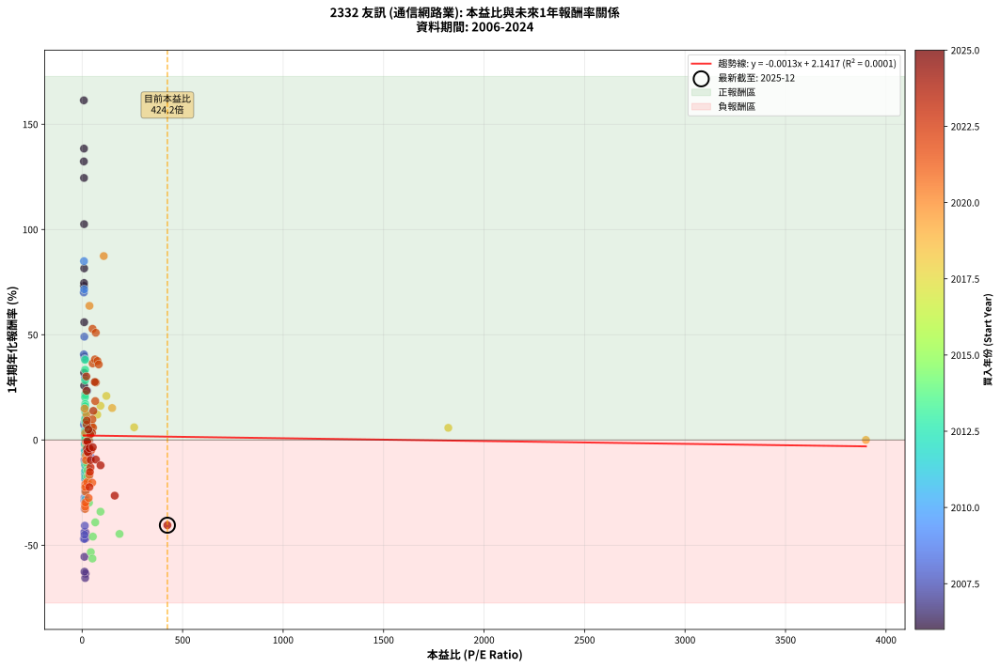
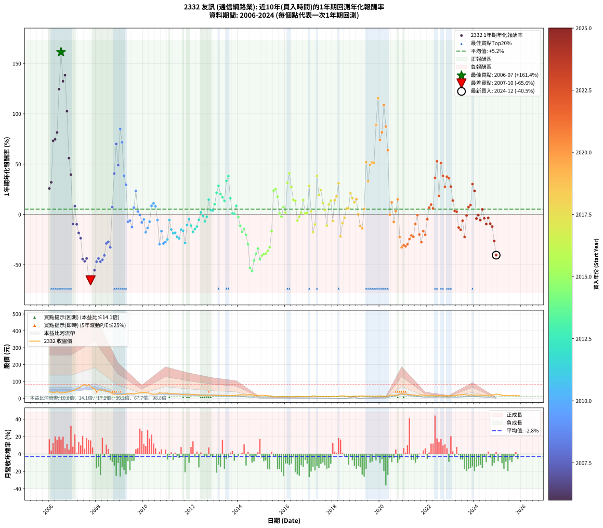

# 2332 友訊 - 本益比與未來報酬率分析

!!! info "報告資訊"
    - **股票代號**: 2332
    - **公司名稱**: 友訊
    - **產業別**: 通信網路業
    - **分析期間**: 2006-2024 (228 個數據點)
    - **資料來源**: Type 12 (ShowMonthlyK_ChartFlow) 月收盤價與本益比
    - **報酬率口徑**: 含現金股利 (簡化: 年度合計，假設每年7/1入帳)
    - **報告生成時間**: 2026-01-06 00:28:31 CST

## 📈 視覺化圖表

### 圖表1: 本益比 vs 未來報酬率關係

*圖表1：2332 友訊 本益比與1年期未來報酬率關係 (2006-2024)*

### 圖表2: 歷年買入時點的1年期實際報酬率

*圖表2：2332 友訊 歷年買入時點的1年期實際報酬率 (2006-2024)*

## 📍 買點訊號說明

本報告提供兩種買點提示訊號（顯示於圖表2的股價子圖中）：

### ▲ 小綠色三角形（回測驗證）
- **計算方式**: 使用全部歷史資料計算本益比第25百分位數
- **用途**: 事後驗證，顯示歷史上哪些時點確實為低估區
- **限制**: 當下無法判斷，僅供回測參考
- **特性**: 後見之明（Look-Ahead Bias）

### ▲ 小橘色三角形（即時訊號）
- **計算方式**: 使用截至當月的過去5年資料計算本益比第25百分位數
- **用途**: 實際投資決策，當時即可判斷
- **優勢**: 可操作性強，符合實務需求
- **特性**: 無後見之明，滾動窗口計算

!!! tip "如何使用兩種訊號"
    - **綠色▲** 幫助理解歷史估值機會，驗證策略有效性
    - **橘色▲** 可作為實際買進參考，但仍需搭配基本面分析
    - 兩種訊號重疊時，表示即時判斷與事後驗證一致，信心度較高
    - 僅有綠色▲時，表示當時無法判斷（需要未來資料才能確認）
    - 僅有橘色▲時，表示即時判斷為買點，但事後可能不是最佳時機

## 📊 估值分析摘要

| 指標 | 數值 |
|:---:|:---:|
| **目前本益比** (2024-12) | **424.20 倍** |
| **歷史平均本益比** | 65.65 倍 |
| **估值水準** | 🔴 相對高估 |
| **預期1年年化報酬率** | **+1.58%** |
| **歷史平均報酬率** | +5.19% |
| **相關係數 (R²)** | 0.0001 |
| **趨勢線斜率** | -0.0013 |

!!! abstract "核心洞察"
    目前本益比顯著高於歷史平均，預期未來報酬率可能較低

    根據歷史數據回測，2332 友訊 在目前本益比 **424.2倍** 的估值水準下，
    預期未來1年年化報酬率約為 **+1.6%**。

    **重要提醒**: 本分析基於歷史數據統計，實際報酬率會受到公司基本面變化、產業趨勢、
    總體經濟環境等多重因素影響。R² = 0.00 表示本益比可解釋約 0.0% 的報酬率變異。

## 📈 歷史估值統計

### 最佳買點 (最高報酬率)

| 項目 | 數值 |
|:---:|:---:|
| 起始時間 | 2006-07 |
| 當時本益比 | 8.50 倍 |
| 起始價格 | 32.2 元 |
| 1年後價格 | 81.8 元 |
| **1年年化報酬率** | **+161.35%** |

### 最差買點 (最低報酬率)

| 項目 | 數值 |
|:---:|:---:|
| 起始時間 | 2007-10 |
| 當時本益比 | 15.03 倍 |
| 起始價格 | 72.5 元 |
| 1年後價格 | 22.4 元 |
| **1年年化報酬率** | **-65.58%** |

## 🎯 投資啟示

### 本益比與報酬率關係

趨勢線方程式: **y = -0.0013x + 2.1417**

!!! note "負相關"
    本益比與未來報酬率呈現負相關。較低的本益比通常帶來較高的未來報酬率，
    但相關性不算非常強。**估值仍是重要參考指標之一**。

### 估值區間建議

基於歷史數據分析:

- **🟢 低估區** (P/E < 52.5): 預期報酬率較高，可考慮增加持股
- **🟡 合理區** (P/E 52.5-78.8): 預期報酬率符合長期趨勢，正常持有
- **🔴 高估區** (P/E > 78.8): 預期報酬率較低，可考慮減碼或觀望

!!! danger "風險提示"
    - 過去表現不代表未來結果
    - 本分析假設公司基本面無重大結構性變化
    - 產業環境劇變可能使歷史規律失效
    - 應結合公司財報、產業趨勢、總體經濟等多重因素綜合判斷

!!! success "長期投資觀點"
    歷史數據顯示，在合理或低估的估值水準買入並長期持有，
    往往能獲得較佳的投資報酬。**耐心等待好價格**是價值投資的核心原則。

## 📊 數據品質

- **資料來源**: GoodInfo.tw Type 12 (ShowMonthlyK_ChartFlow)
- **資料頻率**: 月度收盤價與本益比
- **回測期間**: 2006-2024
- **數據點數量**: 228 個 (每個點代表一次1年期回測)

### 計算方法說明

1. **1年期年化報酬率**:
   - 對每個歷史時點，計算其後1年的實際投資報酬率
   - 期末價值(不含股利): 期末價格
   - 期末價值(含現金股利): 期末價格 + 持有期間內的現金股利合計 (簡化: 年度合計，假設每年7/1入帳)
   - 公式: 年化報酬率 = [(期末價值/期初價格)^(1/年數) - 1] × 100%

2. **本益比 (P/E Ratio)**:
   - 使用當時的月收盤價與EPS計算
   - 資料來源: Type 12 月度河流圖本益比數據

3. **趨勢線 (Linear Regression)**:
   - 使用最小平方法擬合線性趨勢線
   - R²值衡量本益比對報酬率的解釋能力

---

*本報告由 Stock Analysis System v1.9.0 自動生成*
*數據更新時間: 2026-01-06 00:28:31 CST*

## 📋 月度回測明細表

（每一列對應時間線圖中的一個買入點；可用來對照 SVG 圖上的每個點。）

| 買入月份 | 賣出月份 | 回測期限_年 | 實際持有年數 | 買入本益比_倍 | 買入收盤價_元 | 賣出收盤價_元 | 現金股利合計_元 | 總報酬率_pct | 年化報酬率_pct |
| --- | --- | --- | --- | --- | --- | --- | --- | --- | --- |
| 2006-01 | 2007-01 | 1 | 0.999 | 9.97 | 37.80 | 46.35 | 1.20 | +25.79 | +25.81 |
| 2006-02 | 2007-02 | 1 | 0.999 | 9.82 | 37.20 | 47.85 | 1.20 | +31.85 | +31.88 |
| 2006-03 | 2007-03 | 1 | 0.999 | 9.04 | 34.25 | 58.10 | 1.20 | +73.14 | +73.20 |
| 2006-04 | 2007-04 | 1 | 0.999 | 9.53 | 36.10 | 61.80 | 1.20 | +74.52 | +74.58 |
| 2006-05 | 2007-05 | 1 | 0.999 | 10.24 | 38.80 | 69.20 | 1.20 | +81.44 | +81.52 |
| 2006-06 | 2007-06 | 1 | 0.999 | 9.31 | 35.30 | 78.00 | 1.20 | +124.36 | +124.49 |
| 2006-07 | 2007-07 | 1 | 0.999 | 8.50 | 32.20 | 81.80 | 2.30 | +161.18 | +161.35 |
| 2006-08 | 2007-08 | 1 | 0.999 | 8.52 | 32.30 | 72.70 | 2.30 | +132.20 | +132.33 |
| 2006-09 | 2007-09 | 1 | 0.999 | 9.23 | 35.00 | 81.10 | 2.30 | +138.29 | +138.43 |
| 2006-10 | 2007-10 | 1 | 0.999 | 9.75 | 36.95 | 72.50 | 2.30 | +102.44 | +102.53 |
| 2006-11 | 2007-11 | 1 | 0.999 | 10.29 | 39.00 | 58.50 | 2.30 | +55.90 | +55.94 |
| 2006-12 | 2007-12 | 1 | 0.999 | 11.27 | 42.70 | 57.30 | 2.30 | +39.58 | +39.61 |
| 2007-01 | 2008-01 | 1 | 0.999 | 11.90 | 46.35 | 39.65 | 2.30 | -9.49 | -9.50 |
| 2007-02 | 2008-02 | 1 | 0.999 | 11.97 | 47.85 | 49.50 | 2.30 | +8.25 | +8.26 |
| 2007-03 | 2008-03 | 1 | 1.002 | 14.17 | 58.10 | 50.10 | 2.30 | -9.81 | -9.79 |
| 2007-04 | 2008-04 | 1 | 1.002 | 14.70 | 61.80 | 48.10 | 2.30 | -18.45 | -18.41 |
| 2007-05 | 2008-05 | 1 | 1.002 | 16.07 | 69.20 | 50.50 | 2.30 | -23.70 | -23.66 |
| 2007-06 | 2008-06 | 1 | 1.002 | 17.69 | 78.00 | 41.00 | 2.30 | -44.49 | -44.42 |
| 2007-07 | 2008-07 | 1 | 1.002 | 18.12 | 81.80 | 41.10 | 2.50 | -46.70 | -46.63 |
| 2007-08 | 2008-08 | 1 | 1.002 | 15.75 | 72.70 | 38.35 | 2.50 | -43.81 | -43.74 |
| 2007-09 | 2008-09 | 1 | 1.002 | 17.18 | 81.10 | 27.05 | 2.50 | -63.56 | -63.49 |
| 2007-10 | 2008-10 | 1 | 1.002 | 15.03 | 72.50 | 22.40 | 2.50 | -65.66 | -65.58 |
| 2007-11 | 2008-11 | 1 | 1.002 | 11.87 | 58.50 | 19.35 | 2.50 | -62.65 | -62.57 |
| 2007-12 | 2008-12 | 1 | 1.002 | 11.39 | 57.30 | 22.95 | 2.50 | -55.58 | -55.51 |
| 2008-01 | 2009-01 | 1 | 1.002 | 8.28 | 39.65 | 18.50 | 2.50 | -47.04 | -46.97 |
| 2008-02 | 2009-03 | 1 | 1.081 | 10.89 | 49.50 | 24.05 | 2.50 | -46.36 | -43.79 |
| 2008-03 | 2009-03 | 1 | 0.999 | 11.64 | 50.10 | 24.05 | 2.50 | -47.01 | -47.03 |
| 2008-04 | 2009-04 | 1 | 0.999 | 11.85 | 48.10 | 23.95 | 2.50 | -45.01 | -45.03 |
| 2008-05 | 2009-05 | 1 | 0.999 | 13.23 | 50.50 | 27.45 | 2.50 | -40.69 | -40.71 |
| 2008-06 | 2009-06 | 1 | 0.999 | 11.47 | 41.00 | 26.70 | 2.50 | -28.78 | -28.80 |
| 2008-07 | 2009-07 | 1 | 0.999 | 12.33 | 41.10 | 29.40 | 0.50 | -27.25 | -27.27 |
| 2008-08 | 2009-08 | 1 | 0.999 | 12.41 | 38.35 | 25.30 | 0.50 | -32.72 | -32.74 |
| 2008-09 | 2009-09 | 1 | 0.999 | 9.50 | 27.05 | 28.50 | 0.50 | +7.21 | +7.21 |
| 2008-10 | 2009-10 | 1 | 0.999 | 8.60 | 22.40 | 31.00 | 0.50 | +40.63 | +40.66 |
| 2008-11 | 2009-11 | 1 | 0.999 | 8.19 | 19.35 | 32.40 | 0.50 | +70.03 | +70.09 |
| 2008-12 | 2009-12 | 1 | 0.999 | 10.83 | 22.95 | 33.70 | 0.50 | +49.02 | +49.06 |
| 2009-01 | 2010-01 | 1 | 0.999 | 9.21 | 18.50 | 33.70 | 0.50 | +84.86 | +84.94 |
| 2009-02 | 2010-02 | 1 | 0.999 | 10.17 | 19.30 | 32.60 | 0.50 | +71.50 | +71.57 |
| 2009-03 | 2010-03 | 1 | 0.999 | 13.45 | 24.05 | 32.80 | 0.50 | +38.46 | +38.49 |
| 2009-04 | 2010-04 | 1 | 0.999 | 14.28 | 23.95 | 30.50 | 0.50 | +29.44 | +29.46 |
| 2009-05 | 2010-05 | 1 | 0.999 | 17.53 | 27.45 | 24.95 | 0.50 | -7.29 | -7.29 |
| 2009-06 | 2010-06 | 1 | 0.999 | 18.35 | 26.70 | 24.55 | 0.50 | -6.18 | -6.18 |
| 2009-07 | 2010-07 | 1 | 0.999 | 21.87 | 29.40 | 24.70 | 1.00 | -12.59 | -12.59 |
| 2009-08 | 2010-08 | 1 | 0.999 | 20.51 | 25.30 | 26.00 | 1.00 | +6.72 | +6.72 |
| 2009-09 | 2010-09 | 1 | 0.999 | 25.39 | 28.50 | 34.15 | 1.00 | +23.33 | +23.35 |
| 2009-10 | 2010-10 | 1 | 0.999 | 30.64 | 31.00 | 30.90 | 1.00 | +2.90 | +2.91 |
| 2009-11 | 2010-11 | 1 | 0.999 | 35.97 | 32.40 | 31.25 | 1.00 | -0.46 | -0.46 |
| 2009-12 | 2010-12 | 1 | 0.999 | 42.66 | 33.70 | 30.00 | 1.00 | -8.01 | -8.02 |
| 2010-01 | 2011-01 | 1 | 0.999 | 38.22 | 33.70 | 31.00 | 1.00 | -5.04 | -5.05 |
| 2010-02 | 2011-02 | 1 | 0.999 | 33.49 | 32.60 | 25.80 | 1.00 | -17.79 | -17.80 |
| 2010-03 | 2011-03 | 1 | 0.999 | 30.80 | 32.80 | 27.40 | 1.00 | -13.41 | -13.42 |
| 2010-04 | 2011-04 | 1 | 0.999 | 26.37 | 30.50 | 27.30 | 1.00 | -7.21 | -7.22 |
| 2010-05 | 2011-05 | 1 | 0.999 | 19.99 | 24.95 | 26.10 | 1.00 | +8.62 | +8.62 |
| 2010-06 | 2011-06 | 1 | 0.999 | 18.32 | 24.55 | 26.25 | 1.00 | +11.00 | +11.01 |
| 2010-07 | 2011-07 | 1 | 0.999 | 17.25 | 24.70 | 25.35 | 1.32 | +8.00 | +8.00 |
| 2010-08 | 2011-08 | 1 | 0.999 | 17.07 | 26.00 | 23.20 | 1.32 | -5.67 | -5.68 |
| 2010-09 | 2011-09 | 1 | 0.999 | 21.15 | 34.15 | 22.70 | 1.32 | -29.65 | -29.67 |
| 2010-10 | 2011-10 | 1 | 0.999 | 18.11 | 30.90 | 24.45 | 1.32 | -16.59 | -16.60 |
| 2010-11 | 2011-11 | 1 | 0.999 | 17.38 | 31.25 | 20.90 | 1.32 | -28.88 | -28.90 |
| 2010-12 | 2011-12 | 1 | 0.999 | 15.87 | 30.00 | 20.45 | 1.32 | -27.42 | -27.43 |
| 2011-01 | 2012-01 | 1 | 0.999 | 16.67 | 31.00 | 21.95 | 1.32 | -24.92 | -24.93 |
| 2011-02 | 2012-02 | 1 | 0.999 | 14.11 | 25.80 | 23.05 | 1.32 | -5.52 | -5.53 |
| 2011-03 | 2012-03 | 1 | 1.002 | 15.24 | 27.40 | 21.95 | 1.32 | -15.05 | -15.03 |
| 2011-04 | 2012-04 | 1 | 1.002 | 15.45 | 27.30 | 20.85 | 1.32 | -18.77 | -18.74 |
| 2011-05 | 2012-05 | 1 | 1.002 | 15.04 | 26.10 | 20.00 | 1.32 | -18.30 | -18.26 |
| 2011-06 | 2012-06 | 1 | 1.002 | 15.40 | 26.25 | 19.05 | 1.32 | -22.38 | -22.34 |
| 2011-07 | 2012-07 | 1 | 1.002 | 15.14 | 25.35 | 18.20 | 1.10 | -23.87 | -23.82 |
| 2011-08 | 2012-08 | 1 | 1.002 | 14.12 | 23.20 | 18.60 | 1.10 | -15.09 | -15.06 |
| 2011-09 | 2012-09 | 1 | 1.002 | 14.08 | 22.70 | 17.90 | 1.10 | -16.30 | -16.27 |
| 2011-10 | 2012-10 | 1 | 1.002 | 15.46 | 24.45 | 16.40 | 1.10 | -28.43 | -28.38 |
| 2011-11 | 2012-11 | 1 | 1.002 | 13.48 | 20.90 | 17.60 | 1.10 | -10.53 | -10.51 |
| 2011-12 | 2012-12 | 1 | 1.002 | 13.45 | 20.45 | 18.35 | 1.10 | -4.89 | -4.88 |
| 2012-01 | 2013-01 | 1 | 1.002 | 14.67 | 21.95 | 18.40 | 1.10 | -11.16 | -11.14 |
| 2012-02 | 2013-03 | 1 | 1.081 | 15.64 | 23.05 | 17.65 | 1.10 | -18.66 | -17.38 |
| 2012-03 | 2013-03 | 1 | 0.999 | 15.14 | 21.95 | 17.65 | 1.10 | -14.58 | -14.59 |
| 2012-04 | 2013-04 | 1 | 0.999 | 14.61 | 20.85 | 17.25 | 1.10 | -11.99 | -12.00 |
| 2012-05 | 2013-05 | 1 | 0.999 | 14.25 | 20.00 | 17.85 | 1.10 | -5.25 | -5.25 |
| 2012-06 | 2013-06 | 1 | 0.999 | 13.80 | 19.05 | 18.35 | 1.10 | +2.10 | +2.10 |
| 2012-07 | 2013-07 | 1 | 0.999 | 13.42 | 18.20 | 16.95 | 1.00 | -1.37 | -1.37 |
| 2012-08 | 2013-08 | 1 | 0.999 | 13.95 | 18.60 | 16.30 | 1.00 | -6.99 | -6.99 |
| 2012-09 | 2013-09 | 1 | 0.999 | 13.66 | 17.90 | 16.50 | 1.00 | -2.23 | -2.24 |
| 2012-10 | 2013-10 | 1 | 0.999 | 12.75 | 16.40 | 17.80 | 1.00 | +14.63 | +14.64 |
| 2012-11 | 2013-11 | 1 | 0.999 | 13.93 | 17.60 | 17.35 | 1.00 | +4.26 | +4.26 |
| 2012-12 | 2013-12 | 1 | 0.999 | 14.80 | 18.35 | 18.05 | 1.00 | +3.81 | +3.82 |
| 2013-01 | 2014-01 | 1 | 0.999 | 15.02 | 18.40 | 19.25 | 1.00 | +10.05 | +10.06 |
| 2013-02 | 2014-02 | 1 | 0.999 | 15.12 | 18.30 | 21.25 | 1.00 | +21.58 | +21.60 |
| 2013-03 | 2014-03 | 1 | 0.999 | 14.77 | 17.65 | 21.65 | 1.00 | +28.33 | +28.35 |
| 2013-04 | 2014-04 | 1 | 0.999 | 14.62 | 17.25 | 19.75 | 1.00 | +20.29 | +20.31 |
| 2013-05 | 2014-05 | 1 | 0.999 | 15.32 | 17.85 | 19.90 | 1.00 | +17.09 | +17.10 |
| 2013-06 | 2014-06 | 1 | 0.999 | 15.96 | 18.35 | 19.80 | 1.00 | +13.35 | +13.36 |
| 2013-07 | 2014-07 | 1 | 0.999 | 14.93 | 16.95 | 21.60 | 1.00 | +33.33 | +33.36 |
| 2013-08 | 2014-08 | 1 | 0.999 | 14.55 | 16.30 | 21.50 | 1.00 | +38.04 | +38.07 |
| 2013-09 | 2014-09 | 1 | 0.999 | 14.93 | 16.50 | 18.15 | 1.00 | +16.06 | +16.07 |
| 2013-10 | 2014-10 | 1 | 0.999 | 16.33 | 17.80 | 17.00 | 1.00 | +1.12 | +1.12 |
| 2013-11 | 2014-11 | 1 | 0.999 | 16.14 | 17.35 | 16.45 | 1.00 | +0.58 | +0.58 |
| 2013-12 | 2014-12 | 1 | 0.999 | 17.03 | 18.05 | 18.60 | 1.00 | +8.59 | +8.59 |
| 2014-01 | 2015-01 | 1 | 0.999 | 19.64 | 19.25 | 17.75 | 1.00 | -2.60 | -2.60 |
| 2014-02 | 2015-02 | 1 | 0.999 | 23.61 | 21.25 | 17.85 | 1.00 | -11.29 | -11.30 |
| 2014-03 | 2015-03 | 1 | 0.999 | 26.40 | 21.65 | 16.90 | 1.00 | -17.32 | -17.33 |
| 2014-04 | 2015-04 | 1 | 0.999 | 26.69 | 19.75 | 15.90 | 1.00 | -14.43 | -14.44 |
| 2014-05 | 2015-05 | 1 | 0.999 | 30.15 | 19.90 | 14.85 | 1.00 | -20.35 | -20.36 |
| 2014-06 | 2015-06 | 1 | 0.999 | 34.14 | 19.80 | 12.90 | 1.00 | -29.80 | -29.81 |
| 2014-07 | 2015-07 | 1 | 0.999 | 43.20 | 21.60 | 10.10 | 0.00 | -53.24 | -53.27 |
| 2014-08 | 2015-08 | 1 | 0.999 | 51.19 | 21.50 | 9.39 | 0.00 | -56.33 | -56.35 |
| 2014-09 | 2015-09 | 1 | 0.999 | 53.38 | 18.15 | 9.82 | 0.00 | -45.90 | -45.92 |
| 2014-10 | 2015-10 | 1 | 0.999 | 65.38 | 17.00 | 10.35 | 0.00 | -39.12 | -39.14 |
| 2014-11 | 2015-11 | 1 | 0.999 | 91.39 | 16.45 | 10.85 | 0.00 | -34.04 | -34.06 |
| 2014-12 | 2015-12 | 1 | 0.999 | 186.00 | 18.60 | 10.30 | 0.00 | -44.62 | -44.65 |
| 2015-01 | 2016-01 | 1 | 0.999 |  | 17.75 | 10.50 | 0.00 | -40.85 | -40.87 |
| 2015-02 | 2016-02 | 1 | 0.999 |  | 17.85 | 10.80 | 0.00 | -39.50 | -39.52 |
| 2015-03 | 2016-03 | 1 | 1.002 |  | 16.90 | 10.30 | 0.00 | -39.05 | -38.99 |
| 2015-04 | 2016-04 | 1 | 1.002 |  | 15.90 | 10.10 | 0.00 | -36.48 | -36.42 |
| 2015-05 | 2016-05 | 1 | 1.002 |  | 14.85 | 10.00 | 0.00 | -32.66 | -32.61 |
| 2015-06 | 2016-06 | 1 | 1.002 |  | 12.90 | 10.75 | 0.00 | -16.67 | -16.64 |
| 2015-07 | 2016-07 | 1 | 1.002 |  | 10.10 | 12.20 | 0.30 | +23.76 | +23.71 |
| 2015-08 | 2016-08 | 1 | 1.002 |  | 9.39 | 11.45 | 0.30 | +25.13 | +25.08 |
| 2015-09 | 2016-09 | 1 | 1.002 |  | 9.82 | 11.25 | 0.30 | +17.62 | +17.58 |
| 2015-10 | 2016-10 | 1 | 1.002 |  | 10.35 | 10.15 | 0.30 | +0.97 | +0.96 |
| 2015-11 | 2016-11 | 1 | 1.002 |  | 10.85 | 10.30 | 0.30 | -2.30 | -2.30 |
| 2015-12 | 2016-12 | 1 | 1.002 |  | 10.30 | 10.75 | 0.30 | +7.28 | +7.27 |
| 2016-01 | 2017-01 | 1 | 1.002 |  | 10.50 | 10.40 | 0.30 | +1.90 | +1.90 |
| 2016-02 | 2017-03 | 1 | 1.081 |  | 10.80 | 14.20 | 0.30 | +34.26 | +31.31 |
| 2016-03 | 2017-03 | 1 | 0.999 |  | 10.30 | 14.20 | 0.30 | +40.78 | +40.81 |
| 2016-04 | 2017-04 | 1 | 0.999 |  | 10.10 | 12.55 | 0.30 | +27.23 | +27.25 |
| 2016-05 | 2017-05 | 1 | 0.999 |  | 10.00 | 11.15 | 0.30 | +14.50 | +14.51 |
| 2016-06 | 2017-06 | 1 | 0.999 |  | 10.75 | 11.90 | 0.30 | +13.49 | +13.50 |
| 2016-07 | 2017-07 | 1 | 0.999 |  | 12.20 | 11.15 | 0.30 | -6.15 | -6.15 |
| 2016-08 | 2017-08 | 1 | 0.999 |  | 11.45 | 10.90 | 0.30 | -2.18 | -2.18 |
| 2016-09 | 2017-09 | 1 | 0.999 |  | 11.25 | 11.15 | 0.30 | +1.78 | +1.78 |
| 2016-10 | 2017-10 | 1 | 0.999 |  | 10.15 | 11.30 | 0.30 | +14.29 | +14.30 |
| 2016-11 | 2017-11 | 1 | 0.999 |  | 10.30 | 10.10 | 0.30 | +0.97 | +0.97 |
| 2016-12 | 2017-12 | 1 | 0.999 |  | 10.75 | 10.60 | 0.30 | +1.40 | +1.40 |
| 2017-01 | 2018-01 | 1 | 0.999 |  | 10.40 | 13.05 | 0.30 | +28.37 | +28.39 |
| 2017-02 | 2018-02 | 1 | 0.999 |  | 11.35 | 11.40 | 0.30 | +3.08 | +3.09 |
| 2017-03 | 2018-03 | 1 | 0.999 |  | 14.20 | 11.40 | 0.30 | -17.61 | -17.62 |
| 2017-04 | 2018-04 | 1 | 0.999 |  | 12.55 | 11.00 | 0.30 | -9.96 | -9.97 |
| 2017-05 | 2018-05 | 1 | 0.999 |  | 11.15 | 15.10 | 0.30 | +38.12 | +38.15 |
| 2017-06 | 2018-06 | 1 | 0.999 |  | 11.90 | 13.90 | 0.30 | +19.33 | +19.34 |
| 2017-07 | 2018-07 | 1 | 0.999 |  | 11.15 | 13.85 | 0.00 | +24.22 | +24.23 |
| 2017-08 | 2018-08 | 1 | 0.999 |  | 10.90 | 12.15 | 0.00 | +11.47 | +11.48 |
| 2017-09 | 2018-09 | 1 | 0.999 |  | 11.15 | 11.65 | 0.00 | +4.48 | +4.49 |
| 2017-10 | 2018-10 | 1 | 0.999 |  | 11.30 | 10.05 | 0.00 | -11.06 | -11.07 |
| 2017-11 | 2018-11 | 1 | 0.999 |  | 10.10 | 11.10 | 0.00 | +9.90 | +9.91 |
| 2017-12 | 2018-12 | 1 | 0.999 |  | 10.60 | 12.05 | 0.00 | +13.68 | +13.69 |
| 2018-01 | 2019-01 | 1 | 0.999 |  | 13.05 | 12.20 | 0.00 | -6.51 | -6.52 |
| 2018-02 | 2019-02 | 1 | 0.999 |  | 11.40 | 13.00 | 0.00 | +14.04 | +14.05 |
| 2018-03 | 2019-03 | 1 | 0.999 |  | 11.40 | 13.45 | 0.00 | +17.98 | +18.00 |
| 2018-04 | 2019-04 | 1 | 0.999 |  | 11.00 | 14.40 | 0.00 | +30.91 | +30.93 |
| 2018-05 | 2019-05 | 1 | 0.999 |  | 15.10 | 11.80 | 0.00 | -21.85 | -21.87 |
| 2018-06 | 2019-06 | 1 | 0.999 |  | 13.90 | 12.70 | 0.00 | -8.63 | -8.64 |
| 2018-07 | 2019-07 | 1 | 0.999 |  | 13.85 | 13.20 | 0.20 | -3.25 | -3.25 |
| 2018-08 | 2019-08 | 1 | 0.999 | 1822.00 | 12.15 | 12.65 | 0.20 | +5.76 | +5.77 |
| 2018-09 | 2019-09 | 1 | 0.999 | 258.90 | 11.65 | 12.15 | 0.20 | +6.01 | +6.01 |
| 2018-10 | 2019-10 | 1 | 0.999 | 120.60 | 10.05 | 11.95 | 0.20 | +20.90 | +20.91 |
| 2018-11 | 2019-11 | 1 | 0.999 | 91.23 | 11.10 | 12.70 | 0.20 | +16.22 | +16.23 |
| 2018-12 | 2019-12 | 1 | 0.999 | 75.31 | 12.05 | 13.30 | 0.20 | +12.03 | +12.04 |
| 2019-01 | 2020-01 | 1 | 0.999 | 149.40 | 12.20 | 13.85 | 0.20 | +15.16 | +15.18 |
| 2019-02 | 2020-02 | 1 | 0.999 | 3900.00 | 13.00 | 12.80 | 0.20 | +0.00 | +0.00 |
| 2019-03 | 2020-03 | 1 | 1.002 |  | 13.45 | 11.70 | 0.20 | -11.52 | -11.50 |
| 2019-04 | 2020-04 | 1 | 1.002 |  | 14.40 | 12.20 | 0.20 | -13.89 | -13.86 |
| 2019-05 | 2020-05 | 1 | 1.002 |  | 11.80 | 12.25 | 0.20 | +5.51 | +5.50 |
| 2019-06 | 2020-06 | 1 | 1.002 |  | 12.70 | 19.10 | 0.20 | +51.97 | +51.84 |
| 2019-07 | 2020-07 | 1 | 1.002 |  | 13.20 | 17.55 | 0.00 | +32.95 | +32.88 |
| 2019-08 | 2020-08 | 1 | 1.002 |  | 12.65 | 18.90 | 0.00 | +49.41 | +49.28 |
| 2019-09 | 2020-09 | 1 | 1.002 |  | 12.15 | 18.45 | 0.00 | +51.85 | +51.72 |
| 2019-10 | 2020-10 | 1 | 1.002 |  | 11.95 | 18.10 | 0.00 | +51.46 | +51.34 |
| 2019-11 | 2020-11 | 1 | 1.002 |  | 12.70 | 24.05 | 0.00 | +89.37 | +89.12 |
| 2019-12 | 2020-12 | 1 | 1.002 |  | 13.30 | 28.70 | 0.00 | +115.79 | +115.45 |
| 2020-01 | 2021-01 | 1 | 1.002 |  | 13.85 | 24.15 | 0.00 | +74.37 | +74.17 |
| 2020-02 | 2021-03 | 1 | 1.081 |  | 12.80 | 24.40 | 0.00 | +90.62 | +81.58 |
| 2020-03 | 2021-03 | 1 | 0.999 |  | 11.70 | 24.40 | 0.00 | +108.55 | +108.65 |
| 2020-04 | 2021-04 | 1 | 0.999 | 107.60 | 12.20 | 22.85 | 0.00 | +87.30 | +87.38 |
| 2020-05 | 2021-05 | 1 | 0.999 | 36.39 | 12.25 | 20.05 | 0.00 | +63.67 | +63.73 |
| 2020-06 | 2021-06 | 1 | 0.999 | 34.11 | 19.10 | 19.05 | 0.00 | -0.26 | -0.26 |
| 2020-07 | 2021-07 | 1 | 0.999 | 22.40 | 17.55 | 19.35 | 0.30 | +11.97 | +11.97 |
| 2020-08 | 2021-08 | 1 | 0.999 | 18.77 | 18.90 | 17.20 | 0.30 | -7.41 | -7.41 |
| 2020-09 | 2021-09 | 1 | 0.999 | 15.00 | 18.45 | 18.75 | 0.30 | +3.25 | +3.25 |
| 2020-10 | 2021-10 | 1 | 0.999 | 12.45 | 18.10 | 20.50 | 0.30 | +14.92 | +14.93 |
| 2020-11 | 2021-11 | 1 | 0.999 | 14.34 | 24.05 | 18.35 | 0.30 | -22.45 | -22.47 |
| 2020-12 | 2021-12 | 1 | 0.999 | 15.11 | 28.70 | 19.00 | 0.30 | -32.75 | -32.77 |
| 2021-01 | 2022-01 | 1 | 0.999 | 13.62 | 24.15 | 16.45 | 0.30 | -30.64 | -30.66 |
| 2021-02 | 2022-02 | 1 | 0.999 | 14.85 | 24.45 | 16.40 | 0.30 | -31.70 | -31.72 |
| 2021-03 | 2022-03 | 1 | 0.999 | 16.05 | 24.40 | 16.85 | 0.30 | -29.71 | -29.73 |
| 2021-04 | 2022-04 | 1 | 0.999 | 16.40 | 22.85 | 16.95 | 0.30 | -24.51 | -24.52 |
| 2021-05 | 2022-05 | 1 | 0.999 | 15.83 | 20.05 | 15.55 | 0.30 | -20.95 | -20.96 |
| 2021-06 | 2022-06 | 1 | 0.999 | 16.71 | 19.05 | 14.50 | 0.30 | -22.31 | -22.32 |
| 2021-07 | 2022-07 | 1 | 0.999 | 19.10 | 19.35 | 17.20 | 0.30 | -9.56 | -9.57 |
| 2021-08 | 2022-08 | 1 | 0.999 | 19.40 | 17.20 | 16.75 | 0.30 | -0.87 | -0.87 |
| 2021-09 | 2022-09 | 1 | 0.999 | 24.67 | 18.75 | 14.70 | 0.30 | -20.00 | -20.01 |
| 2021-10 | 2022-10 | 1 | 0.999 | 32.37 | 20.50 | 14.55 | 0.30 | -27.56 | -27.58 |
| 2021-11 | 2022-11 | 1 | 0.999 | 36.22 | 18.35 | 15.00 | 0.30 | -16.62 | -16.63 |
| 2021-12 | 2022-12 | 1 | 0.999 | 50.00 | 19.00 | 14.85 | 0.30 | -20.26 | -20.28 |
| 2022-01 | 2023-01 | 1 | 0.999 | 45.28 | 16.45 | 15.35 | 0.30 | -4.86 | -4.87 |
| 2022-02 | 2023-02 | 1 | 0.999 | 47.31 | 16.40 | 17.20 | 0.30 | +6.71 | +6.71 |
| 2022-03 | 2023-03 | 1 | 0.999 | 51.06 | 16.85 | 18.20 | 0.30 | +9.79 | +9.80 |
| 2022-04 | 2023-04 | 1 | 0.999 | 54.10 | 16.95 | 17.65 | 0.30 | +5.90 | +5.90 |
| 2022-05 | 2023-05 | 1 | 0.999 | 52.42 | 15.55 | 20.90 | 0.30 | +36.33 | +36.36 |
| 2022-06 | 2023-06 | 1 | 0.999 | 51.79 | 14.50 | 21.85 | 0.30 | +52.76 | +52.80 |
| 2022-07 | 2023-07 | 1 | 0.999 | 65.32 | 17.20 | 20.15 | 0.23 | +18.46 | +18.47 |
| 2022-08 | 2023-08 | 1 | 0.999 | 67.91 | 16.75 | 25.05 | 0.23 | +50.90 | +50.94 |
| 2022-09 | 2023-09 | 1 | 0.999 | 63.91 | 14.70 | 20.10 | 0.23 | +38.27 | +38.30 |
| 2022-10 | 2023-10 | 1 | 0.999 | 68.20 | 14.55 | 18.30 | 0.23 | +27.32 | +27.34 |
| 2022-11 | 2023-11 | 1 | 0.999 | 76.27 | 15.00 | 20.40 | 0.23 | +37.50 | +37.53 |
| 2022-12 | 2023-12 | 1 | 0.999 | 82.50 | 14.85 | 19.95 | 0.23 | +35.86 | +35.89 |
| 2023-01 | 2024-01 | 1 | 0.999 | 62.87 | 15.35 | 19.35 | 0.23 | +27.52 | +27.55 |
| 2023-02 | 2024-02 | 1 | 0.999 | 55.78 | 17.20 | 19.35 | 0.23 | +13.81 | +13.82 |
| 2023-03 | 2024-03 | 1 | 1.002 | 48.86 | 18.20 | 18.60 | 0.23 | +3.43 | +3.43 |
| 2023-04 | 2024-04 | 1 | 1.002 | 40.42 | 17.65 | 17.90 | 0.23 | +2.69 | +2.69 |
| 2023-05 | 2024-05 | 1 | 1.002 | 41.73 | 20.90 | 17.95 | 0.23 | -13.04 | -13.01 |
| 2023-06 | 2024-06 | 1 | 1.002 | 38.67 | 21.85 | 18.30 | 0.23 | -15.22 | -15.19 |
| 2023-07 | 2024-07 | 1 | 1.002 | 32.03 | 20.15 | 18.35 | 0.54 | -6.27 | -6.26 |
| 2023-08 | 2024-08 | 1 | 1.002 | 36.13 | 25.05 | 18.90 | 0.54 | -22.41 | -22.37 |
| 2023-09 | 2024-09 | 1 | 1.002 | 26.53 | 20.10 | 19.35 | 0.54 | -1.06 | -1.06 |
| 2023-10 | 2024-10 | 1 | 1.002 | 22.27 | 18.30 | 19.10 | 0.54 | +7.30 | +7.29 |
| 2023-11 | 2024-11 | 1 | 1.002 | 23.03 | 20.40 | 21.75 | 0.54 | +9.25 | +9.23 |
| 2023-12 | 2024-12 | 1 | 1.002 | 21.00 | 19.95 | 25.45 | 0.54 | +30.26 | +30.19 |
| 2024-01 | 2025-01 | 1 | 1.002 | 22.09 | 19.35 | 23.35 | 0.54 | +23.44 | +23.39 |
| 2024-02 | 2025-03 | 1 | 1.081 | 24.14 | 19.35 | 17.95 | 0.54 | -4.47 | -4.14 |
| 2024-03 | 2025-03 | 1 | 0.999 | 25.57 | 18.60 | 17.95 | 0.54 | -0.61 | -0.61 |
| 2024-04 | 2025-04 | 1 | 0.999 | 27.40 | 17.90 | 16.35 | 0.54 | -5.66 | -5.67 |
| 2024-05 | 2025-05 | 1 | 0.999 | 30.99 | 17.95 | 18.30 | 0.54 | +4.94 | +4.94 |
| 2024-06 | 2025-06 | 1 | 0.999 | 36.24 | 18.30 | 17.05 | 0.54 | -3.90 | -3.90 |
| 2024-07 | 2025-07 | 1 | 0.999 | 42.59 | 18.35 | 16.50 | 0.10 | -9.54 | -9.54 |
| 2024-08 | 2025-08 | 1 | 0.999 | 52.99 | 18.90 | 18.15 | 0.10 | -3.44 | -3.44 |
| 2024-09 | 2025-09 | 1 | 0.999 | 68.50 | 19.35 | 17.45 | 0.10 | -9.30 | -9.31 |
| 2024-10 | 2025-10 | 1 | 0.999 | 91.68 | 19.10 | 16.70 | 0.10 | -12.04 | -12.05 |
| 2024-11 | 2025-11 | 1 | 0.999 | 162.10 | 21.75 | 15.90 | 0.10 | -26.44 | -26.45 |
| 2024-12 | 2025-12 | 1 | 0.999 | 424.20 | 25.45 | 15.05 | 0.10 | -40.47 | -40.49 |
