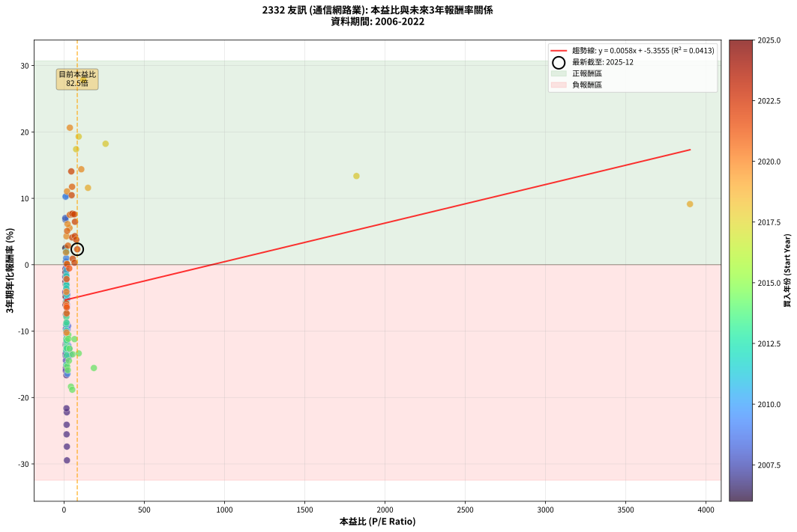
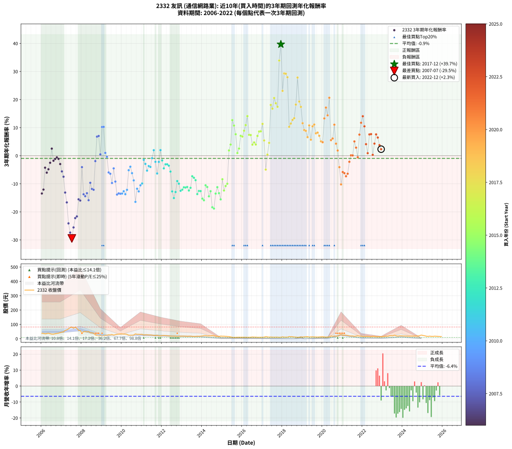

# 2332 友訊 - 本益比與未來報酬率分析

!!! info "報告資訊"
    - **股票代號**: 2332
    - **公司名稱**: 友訊
    - **產業別**: 通信網路業
    - **分析期間**: 2006-2022 (204 個數據點)
    - **資料來源**: Type 12 (ShowMonthlyK_ChartFlow) 月收盤價與本益比
    - **報酬率口徑**: 含現金股利 (簡化: 年度合計，假設每年7/1入帳)
    - **報告生成時間**: 2026-01-10 22:24:38 CST

## 📈 視覺化圖表

### 圖表1: 本益比 vs 未來報酬率關係

*圖表1：2332 友訊 本益比與3年期未來報酬率關係 (2006-2022)*

### 圖表2: 歷年買入時點的3年期實際報酬率

*圖表2：2332 友訊 歷年買入時點的3年期實際報酬率 (2006-2022)*

## 📍 買點訊號說明

本報告提供兩種買點提示訊號（顯示於圖表2的股價子圖中）：

### ▲ 小綠色三角形（回測驗證）
- **計算方式**: 使用全部歷史資料計算本益比第25百分位數
- **用途**: 事後驗證，顯示歷史上哪些時點確實為低估區
- **限制**: 當下無法判斷，僅供回測參考
- **特性**: 後見之明（Look-Ahead Bias）

### ▲ 小橘色三角形（即時訊號）
- **計算方式**: 使用截至當月的過去5年資料計算本益比第25百分位數
- **用途**: 實際投資決策，當時即可判斷
- **優勢**: 可操作性強，符合實務需求
- **特性**: 無後見之明，滾動窗口計算

!!! tip "如何使用兩種訊號"
    - **綠色▲** 幫助理解歷史估值機會，驗證策略有效性
    - **橘色▲** 可作為實際買進參考，但仍需搭配基本面分析
    - 兩種訊號重疊時，表示即時判斷與事後驗證一致，信心度較高
    - 僅有綠色▲時，表示當時無法判斷（需要未來資料才能確認）
    - 僅有橘色▲時，表示即時判斷為買點，但事後可能不是最佳時機

## 📊 估值分析摘要

| 指標 | 數值 |
|:---:|:---:|
| **目前本益比** (2022-12) | **82.50 倍** |
| **歷史平均本益比** | 66.44 倍 |
| **估值水準** | 🔴 相對高估 |
| **預期3年年化報酬率** | **-4.88%** |
| **歷史平均報酬率** | -0.95% |
| **相關係數 (R²)** | 0.0413 |
| **趨勢線斜率** | 0.0058 |

!!! abstract "核心洞察"
    目前本益比顯著高於歷史平均，預期未來報酬率可能較低

    根據歷史數據回測，2332 友訊 在目前本益比 **82.5倍** 的估值水準下，
    預期未來3年年化報酬率約為 **-4.9%**。

    **重要提醒**: 本分析基於歷史數據統計，實際報酬率會受到公司基本面變化、產業趨勢、
    總體經濟環境等多重因素影響。R² = 0.04 表示本益比可解釋約 4.1% 的報酬率變異。

## 📈 歷史估值統計

### 最佳買點 (最高報酬率)

| 項目 | 數值 |
|:---:|:---:|
| 起始時間 | 2017-12 |
| 當時本益比 | nan 倍 |
| 起始價格 | 10.6 元 |
| 3年後價格 | 28.7 元 |
| **3年年化報酬率** | **+39.69%** |

### 最差買點 (最低報酬率)

| 項目 | 數值 |
|:---:|:---:|
| 起始時間 | 2007-07 |
| 當時本益比 | 18.12 倍 |
| 起始價格 | 81.8 元 |
| 3年後價格 | 24.7 元 |
| **3年年化報酬率** | **-29.46%** |

## 🎯 投資啟示

### 本益比與報酬率關係

趨勢線方程式: **y = 0.0058x + -5.3555**

!!! info "弱相關或正相關"
    本益比與未來報酬率相關性較弱。這可能表示該股票的報酬率更多受到
    公司成長性、產業趨勢等因素影響，而非估值水準。**需綜合考量多項指標**。

### 估值區間建議

基於歷史數據分析:

- **🟢 低估區** (P/E < 53.2): 預期報酬率較高，可考慮增加持股
- **🟡 合理區** (P/E 53.2-79.7): 預期報酬率符合長期趨勢，正常持有
- **🔴 高估區** (P/E > 79.7): 預期報酬率較低，可考慮減碼或觀望

!!! danger "風險提示"
    - 過去表現不代表未來結果
    - 本分析假設公司基本面無重大結構性變化
    - 產業環境劇變可能使歷史規律失效
    - 應結合公司財報、產業趨勢、總體經濟等多重因素綜合判斷

!!! success "長期投資觀點"
    歷史數據顯示，在合理或低估的估值水準買入並長期持有，
    往往能獲得較佳的投資報酬。**耐心等待好價格**是價值投資的核心原則。

## 📊 數據品質

- **資料來源**: GoodInfo.tw Type 12 (ShowMonthlyK_ChartFlow)
- **資料頻率**: 月度收盤價與本益比
- **回測期間**: 2006-2022
- **數據點數量**: 204 個 (每個點代表一次3年期回測)

### 計算方法說明

1. **3年期年化報酬率**:
   - 對每個歷史時點，計算其後3年的實際投資報酬率
   - 期末價值(不含股利): 期末價格
   - 期末價值(含現金股利): 期末價格 + 持有期間內的現金股利合計 (簡化: 年度合計，假設每年7/1入帳)
   - 公式: 年化報酬率 = [(期末價值/期初價格)^(1/年數) - 1] × 100%

2. **本益比 (P/E Ratio)**:
   - 使用當時的月收盤價與EPS計算
   - 資料來源: Type 12 月度河流圖本益比數據

3. **趨勢線 (Linear Regression)**:
   - 使用最小平方法擬合線性趨勢線
   - R²值衡量本益比對報酬率的解釋能力

---

*本報告由 Stock Analysis System v1.9.0 自動生成*
*數據更新時間: 2026-01-10 22:24:38 CST*

## 📋 月度回測明細表

（每一列對應時間線圖中的一個買入點；可用來對照 SVG 圖上的每個點。）

| 買入月份 | 賣出月份 | 回測期限_年 | 實際持有年數 | 買入本益比_倍 | 買入收盤價_元 | 賣出收盤價_元 | 現金股利合計_元 | 總報酬率_pct | 年化報酬率_pct |
| --- | --- | --- | --- | --- | --- | --- | --- | --- | --- |
| 2006-01 | 2009-01 | 3 | 3.001 | 9.97 | 37.80 | 18.50 | 6.00 | -35.19 | -13.46 |
| 2006-02 | 2009-02 | 3 | 3.001 | 9.82 | 37.20 | 19.30 | 6.00 | -31.99 | -12.06 |
| 2006-03 | 2009-03 | 3 | 3.001 | 9.04 | 34.25 | 24.05 | 6.00 | -12.26 | -4.27 |
| 2006-04 | 2009-04 | 3 | 3.001 | 9.53 | 36.10 | 23.95 | 6.00 | -17.04 | -6.03 |
| 2006-05 | 2009-05 | 3 | 3.001 | 10.24 | 38.80 | 27.45 | 6.00 | -13.79 | -4.82 |
| 2006-06 | 2009-06 | 3 | 3.001 | 9.31 | 35.30 | 26.70 | 6.00 | -7.37 | -2.52 |
| 2006-07 | 2009-07 | 3 | 3.001 | 8.50 | 32.20 | 29.40 | 5.30 | +7.76 | +2.52 |
| 2006-08 | 2009-08 | 3 | 3.001 | 8.52 | 32.30 | 25.30 | 5.30 | -5.26 | -1.79 |
| 2006-09 | 2009-09 | 3 | 3.001 | 9.23 | 35.00 | 28.50 | 5.30 | -3.43 | -1.16 |
| 2006-10 | 2009-10 | 3 | 3.001 | 9.75 | 36.95 | 31.00 | 5.30 | -1.76 | -0.59 |
| 2006-11 | 2009-11 | 3 | 3.001 | 10.29 | 39.00 | 32.40 | 5.30 | -3.33 | -1.12 |
| 2006-12 | 2009-12 | 3 | 3.001 | 11.27 | 42.70 | 33.70 | 5.30 | -8.67 | -2.98 |
| 2007-01 | 2010-01 | 3 | 3.001 | 11.90 | 46.35 | 33.70 | 5.30 | -15.86 | -5.59 |
| 2007-02 | 2010-02 | 3 | 3.001 | 11.97 | 47.85 | 32.60 | 5.30 | -20.79 | -7.47 |
| 2007-03 | 2010-03 | 3 | 3.001 | 14.17 | 58.10 | 32.80 | 5.30 | -34.42 | -13.12 |
| 2007-04 | 2010-04 | 3 | 3.001 | 14.70 | 61.80 | 30.50 | 5.30 | -42.07 | -16.64 |
| 2007-05 | 2010-05 | 3 | 3.001 | 16.07 | 69.20 | 24.95 | 5.30 | -56.29 | -24.10 |
| 2007-06 | 2010-06 | 3 | 3.001 | 17.69 | 78.00 | 24.55 | 5.30 | -61.73 | -27.39 |
| 2007-07 | 2010-07 | 3 | 3.001 | 18.12 | 81.80 | 24.70 | 4.00 | -64.91 | -29.46 |
| 2007-08 | 2010-08 | 3 | 3.001 | 15.75 | 72.70 | 26.00 | 4.00 | -58.73 | -25.55 |
| 2007-09 | 2010-09 | 3 | 3.001 | 17.18 | 81.10 | 34.15 | 4.00 | -52.96 | -22.22 |
| 2007-10 | 2010-10 | 3 | 3.001 | 15.03 | 72.50 | 30.90 | 4.00 | -51.86 | -21.62 |
| 2007-11 | 2010-11 | 3 | 3.001 | 11.87 | 58.50 | 31.25 | 4.00 | -39.74 | -15.53 |
| 2007-12 | 2010-12 | 3 | 3.001 | 11.39 | 57.30 | 30.00 | 4.00 | -40.66 | -15.97 |
| 2008-01 | 2011-01 | 3 | 3.001 | 8.28 | 39.65 | 31.00 | 4.00 | -11.73 | -4.07 |
| 2008-02 | 2011-03 | 3 | 3.080 | 10.89 | 49.50 | 27.40 | 4.00 | -36.57 | -13.74 |
| 2008-03 | 2011-03 | 3 | 2.998 | 11.64 | 50.10 | 27.40 | 4.00 | -37.33 | -14.43 |
| 2008-04 | 2011-04 | 3 | 2.998 | 11.85 | 48.10 | 27.30 | 4.00 | -34.93 | -13.35 |
| 2008-05 | 2011-05 | 3 | 2.998 | 13.23 | 50.50 | 26.10 | 4.00 | -40.40 | -15.85 |
| 2008-06 | 2011-06 | 3 | 2.998 | 11.47 | 41.00 | 26.25 | 4.00 | -26.22 | -9.65 |
| 2008-07 | 2011-07 | 3 | 2.998 | 12.33 | 41.10 | 25.35 | 2.83 | -31.45 | -11.83 |
| 2008-08 | 2011-08 | 3 | 2.998 | 12.41 | 38.35 | 23.20 | 2.83 | -32.14 | -12.13 |
| 2008-09 | 2011-09 | 3 | 2.998 | 9.50 | 27.05 | 22.70 | 2.83 | -5.64 | -1.92 |
| 2008-10 | 2011-10 | 3 | 2.998 | 8.60 | 22.40 | 24.45 | 2.83 | +21.76 | +6.79 |
| 2008-11 | 2011-11 | 3 | 2.998 | 8.19 | 19.35 | 20.90 | 2.83 | +22.61 | +7.04 |
| 2008-12 | 2011-12 | 3 | 2.998 | 10.83 | 22.95 | 20.45 | 2.83 | +1.42 | +0.47 |
| 2009-01 | 2012-01 | 3 | 2.998 | 9.21 | 18.50 | 21.95 | 2.83 | +33.92 | +10.23 |
| 2009-02 | 2012-02 | 3 | 2.998 | 10.17 | 19.30 | 23.05 | 2.83 | +34.07 | +10.27 |
| 2009-03 | 2012-03 | 3 | 3.001 | 13.45 | 24.05 | 21.95 | 2.83 | +3.01 | +0.99 |
| 2009-04 | 2012-04 | 3 | 3.001 | 14.28 | 23.95 | 20.85 | 2.83 | -1.15 | -0.38 |
| 2009-05 | 2012-05 | 3 | 3.001 | 17.53 | 27.45 | 20.00 | 2.83 | -16.85 | -5.96 |
| 2009-06 | 2012-06 | 3 | 3.001 | 18.35 | 26.70 | 19.05 | 2.83 | -18.07 | -6.43 |
| 2009-07 | 2012-07 | 3 | 3.001 | 21.87 | 29.40 | 18.20 | 3.43 | -26.45 | -9.73 |
| 2009-08 | 2012-08 | 3 | 3.001 | 20.51 | 25.30 | 18.60 | 3.43 | -12.94 | -4.51 |
| 2009-09 | 2012-09 | 3 | 3.001 | 25.39 | 28.50 | 17.90 | 3.43 | -25.18 | -9.21 |
| 2009-10 | 2012-10 | 3 | 3.001 | 30.64 | 31.00 | 16.40 | 3.43 | -36.05 | -13.84 |
| 2009-11 | 2012-11 | 3 | 3.001 | 35.97 | 32.40 | 17.60 | 3.43 | -35.11 | -13.42 |
| 2009-12 | 2012-12 | 3 | 3.001 | 42.66 | 33.70 | 18.35 | 3.43 | -35.39 | -13.54 |
| 2010-01 | 2013-01 | 3 | 3.001 | 38.22 | 33.70 | 18.40 | 3.43 | -35.24 | -13.48 |
| 2010-02 | 2013-02 | 3 | 3.001 | 33.49 | 32.60 | 18.30 | 3.43 | -33.36 | -12.65 |
| 2010-03 | 2013-03 | 3 | 3.001 | 30.80 | 32.80 | 17.65 | 3.43 | -35.75 | -13.71 |
| 2010-04 | 2013-04 | 3 | 3.001 | 26.37 | 30.50 | 17.25 | 3.43 | -32.21 | -12.15 |
| 2010-05 | 2013-05 | 3 | 3.001 | 19.99 | 24.95 | 17.85 | 3.43 | -14.73 | -5.17 |
| 2010-06 | 2013-06 | 3 | 3.001 | 18.32 | 24.55 | 18.35 | 3.43 | -11.30 | -3.92 |
| 2010-07 | 2013-07 | 3 | 3.001 | 17.25 | 24.70 | 16.95 | 3.42 | -17.51 | -6.21 |
| 2010-08 | 2013-08 | 3 | 3.001 | 17.07 | 26.00 | 16.30 | 3.42 | -24.13 | -8.79 |
| 2010-09 | 2013-09 | 3 | 3.001 | 21.15 | 34.15 | 16.50 | 3.42 | -41.65 | -16.44 |
| 2010-10 | 2013-10 | 3 | 3.001 | 18.11 | 30.90 | 17.80 | 3.42 | -31.31 | -11.76 |
| 2010-11 | 2013-11 | 3 | 3.001 | 17.38 | 31.25 | 17.35 | 3.42 | -33.52 | -12.72 |
| 2010-12 | 2013-12 | 3 | 3.001 | 15.87 | 30.00 | 18.05 | 3.42 | -28.42 | -10.54 |
| 2011-01 | 2014-01 | 3 | 3.001 | 16.67 | 31.00 | 19.25 | 3.42 | -26.85 | -9.90 |
| 2011-02 | 2014-02 | 3 | 3.001 | 14.11 | 25.80 | 21.25 | 3.42 | -4.36 | -1.47 |
| 2011-03 | 2014-03 | 3 | 3.001 | 15.24 | 27.40 | 21.65 | 3.42 | -8.49 | -2.91 |
| 2011-04 | 2014-04 | 3 | 3.001 | 15.45 | 27.30 | 19.75 | 3.42 | -15.11 | -5.31 |
| 2011-05 | 2014-05 | 3 | 3.001 | 15.04 | 26.10 | 19.90 | 3.42 | -10.63 | -3.68 |
| 2011-06 | 2014-06 | 3 | 3.001 | 15.40 | 26.25 | 19.80 | 3.42 | -11.52 | -4.00 |
| 2011-07 | 2014-07 | 3 | 3.001 | 15.14 | 25.35 | 21.60 | 3.10 | -2.56 | -0.86 |
| 2011-08 | 2014-08 | 3 | 3.001 | 14.12 | 23.20 | 21.50 | 3.10 | +6.03 | +1.97 |
| 2011-09 | 2014-09 | 3 | 3.001 | 14.08 | 22.70 | 18.15 | 3.10 | -6.39 | -2.18 |
| 2011-10 | 2014-10 | 3 | 3.001 | 15.46 | 24.45 | 17.00 | 3.10 | -17.79 | -6.32 |
| 2011-11 | 2014-11 | 3 | 3.001 | 13.48 | 20.90 | 16.45 | 3.10 | -6.46 | -2.20 |
| 2011-12 | 2014-12 | 3 | 3.001 | 13.45 | 20.45 | 18.60 | 3.10 | +6.11 | +2.00 |
| 2012-01 | 2015-01 | 3 | 3.001 | 14.67 | 21.95 | 17.75 | 3.10 | -5.01 | -1.70 |
| 2012-02 | 2015-03 | 3 | 3.080 | 15.64 | 23.05 | 16.90 | 3.10 | -13.23 | -4.50 |
| 2012-03 | 2015-03 | 3 | 2.998 | 15.14 | 21.95 | 16.90 | 3.10 | -8.88 | -3.06 |
| 2012-04 | 2015-04 | 3 | 2.998 | 14.61 | 20.85 | 15.90 | 3.10 | -8.87 | -3.05 |
| 2012-05 | 2015-05 | 3 | 2.998 | 14.25 | 20.00 | 14.85 | 3.10 | -10.25 | -3.54 |
| 2012-06 | 2015-06 | 3 | 2.998 | 13.80 | 19.05 | 12.90 | 3.10 | -16.01 | -5.65 |
| 2012-07 | 2015-07 | 3 | 2.998 | 13.42 | 18.20 | 10.10 | 2.00 | -33.52 | -12.73 |
| 2012-08 | 2015-08 | 3 | 2.998 | 13.95 | 18.60 | 9.39 | 2.00 | -38.76 | -15.09 |
| 2012-09 | 2015-09 | 3 | 2.998 | 13.66 | 17.90 | 9.82 | 2.00 | -33.97 | -12.93 |
| 2012-10 | 2015-10 | 3 | 2.998 | 12.75 | 16.40 | 10.35 | 2.00 | -24.70 | -9.03 |
| 2012-11 | 2015-11 | 3 | 2.998 | 13.93 | 17.60 | 10.85 | 2.00 | -26.99 | -9.96 |
| 2012-12 | 2015-12 | 3 | 2.998 | 14.80 | 18.35 | 10.30 | 2.00 | -32.97 | -12.49 |
| 2013-01 | 2016-01 | 3 | 2.998 | 15.02 | 18.40 | 10.50 | 2.00 | -32.07 | -12.10 |
| 2013-02 | 2016-02 | 3 | 2.998 | 15.12 | 18.30 | 10.80 | 2.00 | -30.05 | -11.24 |
| 2013-03 | 2016-03 | 3 | 3.001 | 14.77 | 17.65 | 10.30 | 2.00 | -30.31 | -11.34 |
| 2013-04 | 2016-04 | 3 | 3.001 | 14.62 | 17.25 | 10.10 | 2.00 | -29.86 | -11.15 |
| 2013-05 | 2016-05 | 3 | 3.001 | 15.32 | 17.85 | 10.00 | 2.00 | -32.77 | -12.40 |
| 2013-06 | 2016-06 | 3 | 3.001 | 15.96 | 18.35 | 10.75 | 2.00 | -30.52 | -11.43 |
| 2013-07 | 2016-07 | 3 | 3.001 | 14.93 | 16.95 | 12.20 | 1.30 | -20.35 | -7.30 |
| 2013-08 | 2016-08 | 3 | 3.001 | 14.55 | 16.30 | 11.45 | 1.30 | -21.78 | -7.86 |
| 2013-09 | 2016-09 | 3 | 3.001 | 14.93 | 16.50 | 11.25 | 1.30 | -23.94 | -8.72 |
| 2013-10 | 2016-10 | 3 | 3.001 | 16.33 | 17.80 | 10.15 | 1.30 | -35.67 | -13.67 |
| 2013-11 | 2016-11 | 3 | 3.001 | 16.14 | 17.35 | 10.30 | 1.30 | -33.14 | -12.56 |
| 2013-12 | 2016-12 | 3 | 3.001 | 17.03 | 18.05 | 10.75 | 1.30 | -33.24 | -12.60 |
| 2014-01 | 2017-01 | 3 | 3.001 | 19.64 | 19.25 | 10.40 | 1.30 | -39.22 | -15.29 |
| 2014-02 | 2017-02 | 3 | 3.001 | 23.61 | 21.25 | 11.35 | 1.30 | -40.47 | -15.87 |
| 2014-03 | 2017-03 | 3 | 3.001 | 26.40 | 21.65 | 14.20 | 1.30 | -28.41 | -10.54 |
| 2014-04 | 2017-04 | 3 | 3.001 | 26.69 | 19.75 | 12.55 | 1.30 | -29.87 | -11.15 |
| 2014-05 | 2017-05 | 3 | 3.001 | 30.15 | 19.90 | 11.15 | 1.30 | -37.44 | -14.47 |
| 2014-06 | 2017-06 | 3 | 3.001 | 34.14 | 19.80 | 11.90 | 1.30 | -33.33 | -12.64 |
| 2014-07 | 2017-07 | 3 | 3.001 | 43.20 | 21.60 | 11.15 | 0.60 | -45.60 | -18.36 |
| 2014-08 | 2017-08 | 3 | 3.001 | 51.19 | 21.50 | 10.90 | 0.60 | -46.51 | -18.82 |
| 2014-09 | 2017-09 | 3 | 3.001 | 53.38 | 18.15 | 11.15 | 0.60 | -35.26 | -13.49 |
| 2014-10 | 2017-10 | 3 | 3.001 | 65.38 | 17.00 | 11.30 | 0.60 | -30.00 | -11.21 |
| 2014-11 | 2017-11 | 3 | 3.001 | 91.39 | 16.45 | 10.10 | 0.60 | -34.95 | -13.35 |
| 2014-12 | 2017-12 | 3 | 3.001 | 186.00 | 18.60 | 10.60 | 0.60 | -39.78 | -15.55 |
| 2015-01 | 2018-01 | 3 | 3.001 |  | 17.75 | 13.05 | 0.60 | -23.10 | -8.38 |
| 2015-02 | 2018-02 | 3 | 3.001 |  | 17.85 | 11.40 | 0.60 | -32.77 | -12.40 |
| 2015-03 | 2018-03 | 3 | 3.001 |  | 16.90 | 11.40 | 0.60 | -28.99 | -10.78 |
| 2015-04 | 2018-04 | 3 | 3.001 |  | 15.90 | 11.00 | 0.60 | -27.04 | -9.97 |
| 2015-05 | 2018-05 | 3 | 3.001 |  | 14.85 | 15.10 | 0.60 | +5.72 | +1.87 |
| 2015-06 | 2018-06 | 3 | 3.001 |  | 12.90 | 13.90 | 0.60 | +12.40 | +3.97 |
| 2015-07 | 2018-07 | 3 | 3.001 |  | 10.10 | 13.85 | 0.60 | +43.07 | +12.68 |
| 2015-08 | 2018-08 | 3 | 3.001 |  | 9.39 | 12.15 | 0.60 | +35.78 | +10.73 |
| 2015-09 | 2018-09 | 3 | 3.001 |  | 9.82 | 11.65 | 0.60 | +24.75 | +7.65 |
| 2015-10 | 2018-10 | 3 | 3.001 |  | 10.35 | 10.05 | 0.60 | +2.90 | +0.96 |
| 2015-11 | 2018-11 | 3 | 3.001 |  | 10.85 | 11.10 | 0.60 | +7.83 | +2.55 |
| 2015-12 | 2018-12 | 3 | 3.001 |  | 10.30 | 12.05 | 0.60 | +22.82 | +7.09 |
| 2016-01 | 2019-01 | 3 | 3.001 |  | 10.50 | 12.20 | 0.60 | +21.90 | +6.82 |
| 2016-02 | 2019-03 | 3 | 3.080 |  | 10.80 | 13.45 | 0.60 | +30.09 | +8.92 |
| 2016-03 | 2019-03 | 3 | 2.998 |  | 10.30 | 13.45 | 0.60 | +36.41 | +10.91 |
| 2016-04 | 2019-04 | 3 | 2.998 |  | 10.10 | 14.40 | 0.60 | +48.51 | +14.10 |
| 2016-05 | 2019-05 | 3 | 2.998 |  | 10.00 | 11.80 | 0.60 | +24.00 | +7.44 |
| 2016-06 | 2019-06 | 3 | 2.998 |  | 10.75 | 12.70 | 0.60 | +23.72 | +7.36 |
| 2016-07 | 2019-07 | 3 | 2.998 |  | 12.20 | 13.20 | 0.50 | +12.30 | +3.94 |
| 2016-08 | 2019-08 | 3 | 2.998 |  | 11.45 | 12.65 | 0.50 | +14.85 | +4.73 |
| 2016-09 | 2019-09 | 3 | 2.998 |  | 11.25 | 12.15 | 0.50 | +12.44 | +3.99 |
| 2016-10 | 2019-10 | 3 | 2.998 |  | 10.15 | 11.95 | 0.50 | +22.66 | +7.05 |
| 2016-11 | 2019-11 | 3 | 2.998 |  | 10.30 | 12.70 | 0.50 | +28.16 | +8.63 |
| 2016-12 | 2019-12 | 3 | 2.998 |  | 10.75 | 13.30 | 0.50 | +28.37 | +8.69 |
| 2017-01 | 2020-01 | 3 | 2.998 |  | 10.40 | 13.85 | 0.50 | +37.98 | +11.34 |
| 2017-02 | 2020-02 | 3 | 2.998 |  | 11.35 | 12.80 | 0.50 | +17.18 | +5.43 |
| 2017-03 | 2020-03 | 3 | 3.001 |  | 14.20 | 11.70 | 0.50 | -14.08 | -4.93 |
| 2017-04 | 2020-04 | 3 | 3.001 |  | 12.55 | 12.20 | 0.50 | +1.20 | +0.40 |
| 2017-05 | 2020-05 | 3 | 3.001 |  | 11.15 | 12.25 | 0.50 | +14.35 | +4.57 |
| 2017-06 | 2020-06 | 3 | 3.001 |  | 11.90 | 19.10 | 0.50 | +64.71 | +18.09 |
| 2017-07 | 2020-07 | 3 | 3.001 |  | 11.15 | 17.55 | 0.20 | +59.19 | +16.76 |
| 2017-08 | 2020-08 | 3 | 3.001 |  | 10.90 | 18.90 | 0.20 | +75.23 | +20.55 |
| 2017-09 | 2020-09 | 3 | 3.001 |  | 11.15 | 18.45 | 0.20 | +67.26 | +18.70 |
| 2017-10 | 2020-10 | 3 | 3.001 |  | 11.30 | 18.10 | 0.20 | +61.95 | +17.43 |
| 2017-11 | 2020-11 | 3 | 3.001 |  | 10.10 | 24.05 | 0.20 | +140.10 | +33.90 |
| 2017-12 | 2020-12 | 3 | 3.001 |  | 10.60 | 28.70 | 0.20 | +172.64 | +39.69 |
| 2018-01 | 2021-01 | 3 | 3.001 |  | 13.05 | 24.15 | 0.20 | +86.59 | +23.10 |
| 2018-02 | 2021-02 | 3 | 3.001 |  | 11.40 | 24.45 | 0.20 | +116.23 | +29.30 |
| 2018-03 | 2021-03 | 3 | 3.001 |  | 11.40 | 24.40 | 0.20 | +115.79 | +29.22 |
| 2018-04 | 2021-04 | 3 | 3.001 |  | 11.00 | 22.85 | 0.20 | +109.55 | +27.96 |
| 2018-05 | 2021-05 | 3 | 3.001 |  | 15.10 | 20.05 | 0.20 | +34.11 | +10.27 |
| 2018-06 | 2021-06 | 3 | 3.001 |  | 13.90 | 19.05 | 0.20 | +38.49 | +11.46 |
| 2018-07 | 2021-07 | 3 | 3.001 |  | 13.85 | 19.35 | 0.50 | +43.32 | +12.74 |
| 2018-08 | 2021-08 | 3 | 3.001 | 1822.00 | 12.15 | 17.20 | 0.50 | +45.68 | +13.36 |
| 2018-09 | 2021-09 | 3 | 3.001 | 258.90 | 11.65 | 18.75 | 0.50 | +65.24 | +18.22 |
| 2018-10 | 2021-10 | 3 | 3.001 | 120.60 | 10.05 | 20.50 | 0.50 | +108.96 | +27.84 |
| 2018-11 | 2021-11 | 3 | 3.001 | 91.23 | 11.10 | 18.35 | 0.50 | +69.82 | +19.30 |
| 2018-12 | 2021-12 | 3 | 3.001 | 75.31 | 12.05 | 19.00 | 0.50 | +61.83 | +17.40 |
| 2019-01 | 2022-01 | 3 | 3.001 | 149.40 | 12.20 | 16.45 | 0.50 | +38.93 | +11.58 |
| 2019-02 | 2022-02 | 3 | 3.001 | 3900.00 | 13.00 | 16.40 | 0.50 | +30.00 | +9.14 |
| 2019-03 | 2022-03 | 3 | 3.001 |  | 13.45 | 16.85 | 0.50 | +29.00 | +8.86 |
| 2019-04 | 2022-04 | 3 | 3.001 |  | 14.40 | 16.95 | 0.50 | +21.18 | +6.61 |
| 2019-05 | 2022-05 | 3 | 3.001 |  | 11.80 | 15.55 | 0.50 | +36.02 | +10.80 |
| 2019-06 | 2022-06 | 3 | 3.001 |  | 12.70 | 14.50 | 0.50 | +18.11 | +5.70 |
| 2019-07 | 2022-07 | 3 | 3.001 |  | 13.20 | 17.20 | 0.60 | +34.85 | +10.48 |
| 2019-08 | 2022-08 | 3 | 3.001 |  | 12.65 | 16.75 | 0.60 | +37.15 | +11.10 |
| 2019-09 | 2022-09 | 3 | 3.001 |  | 12.15 | 14.70 | 0.60 | +25.93 | +7.99 |
| 2019-10 | 2022-10 | 3 | 3.001 |  | 11.95 | 14.55 | 0.60 | +26.78 | +8.23 |
| 2019-11 | 2022-11 | 3 | 3.001 |  | 12.70 | 15.00 | 0.60 | +22.83 | +7.09 |
| 2019-12 | 2022-12 | 3 | 3.001 |  | 13.30 | 14.85 | 0.60 | +16.17 | +5.12 |
| 2020-01 | 2023-01 | 3 | 3.001 |  | 13.85 | 15.35 | 0.60 | +15.16 | +4.82 |
| 2020-02 | 2023-03 | 3 | 3.080 |  | 12.80 | 18.20 | 0.60 | +46.88 | +13.29 |
| 2020-03 | 2023-03 | 3 | 2.998 |  | 11.70 | 18.20 | 0.60 | +60.68 | +17.14 |
| 2020-04 | 2023-04 | 3 | 2.998 | 107.60 | 12.20 | 17.65 | 0.60 | +49.59 | +14.38 |
| 2020-05 | 2023-05 | 3 | 2.998 | 36.39 | 12.25 | 20.90 | 0.60 | +75.51 | +20.64 |
| 2020-06 | 2023-06 | 3 | 2.998 | 34.11 | 19.10 | 21.85 | 0.60 | +17.54 | +5.54 |
| 2020-07 | 2023-07 | 3 | 2.998 | 22.40 | 17.55 | 20.15 | 0.82 | +19.52 | +6.13 |
| 2020-08 | 2023-08 | 3 | 2.998 | 18.77 | 18.90 | 25.05 | 0.82 | +36.90 | +11.05 |
| 2020-09 | 2023-09 | 3 | 2.998 | 15.00 | 18.45 | 20.10 | 0.82 | +13.41 | +4.29 |
| 2020-10 | 2023-10 | 3 | 2.998 | 12.45 | 18.10 | 18.30 | 0.82 | +5.66 | +1.85 |
| 2020-11 | 2023-11 | 3 | 2.998 | 14.34 | 24.05 | 20.40 | 0.82 | -11.75 | -4.08 |
| 2020-12 | 2023-12 | 3 | 2.998 | 15.11 | 28.70 | 19.95 | 0.82 | -27.61 | -10.22 |
| 2021-01 | 2024-01 | 3 | 2.998 | 13.62 | 24.15 | 19.35 | 0.82 | -16.46 | -5.82 |
| 2021-02 | 2024-02 | 3 | 2.998 | 14.85 | 24.45 | 19.35 | 0.82 | -17.48 | -6.21 |
| 2021-03 | 2024-03 | 3 | 3.001 | 16.05 | 24.40 | 18.60 | 0.82 | -20.39 | -7.32 |
| 2021-04 | 2024-04 | 3 | 3.001 | 16.40 | 22.85 | 17.90 | 0.82 | -18.05 | -6.42 |
| 2021-05 | 2024-05 | 3 | 3.001 | 15.83 | 20.05 | 17.95 | 0.82 | -6.36 | -2.17 |
| 2021-06 | 2024-06 | 3 | 3.001 | 16.71 | 19.05 | 18.30 | 0.82 | +0.39 | +0.13 |
| 2021-07 | 2024-07 | 3 | 3.001 | 19.10 | 19.35 | 18.35 | 1.06 | +0.32 | +0.10 |
| 2021-08 | 2024-08 | 3 | 3.001 | 19.40 | 17.20 | 18.90 | 1.06 | +16.05 | +5.09 |
| 2021-09 | 2024-09 | 3 | 3.001 | 24.67 | 18.75 | 19.35 | 1.06 | +8.86 | +2.87 |
| 2021-10 | 2024-10 | 3 | 3.001 | 32.37 | 20.50 | 19.10 | 1.06 | -1.65 | -0.55 |
| 2021-11 | 2024-11 | 3 | 3.001 | 36.22 | 18.35 | 21.75 | 1.06 | +24.31 | +7.52 |
| 2021-12 | 2024-12 | 3 | 3.001 | 50.00 | 19.00 | 25.45 | 1.06 | +39.53 | +11.74 |
| 2022-01 | 2025-01 | 3 | 3.001 | 45.28 | 16.45 | 23.35 | 1.06 | +48.40 | +14.06 |
| 2022-02 | 2025-02 | 3 | 3.001 | 47.31 | 16.40 | 21.05 | 1.06 | +34.82 | +10.47 |
| 2022-03 | 2025-03 | 3 | 3.001 | 51.06 | 16.85 | 17.95 | 1.06 | +12.82 | +4.10 |
| 2022-04 | 2025-04 | 3 | 3.001 | 54.10 | 16.95 | 16.35 | 1.06 | +2.72 | +0.90 |
| 2022-05 | 2025-05 | 3 | 3.001 | 52.42 | 15.55 | 18.30 | 1.06 | +24.51 | +7.58 |
| 2022-06 | 2025-06 | 3 | 3.001 | 51.79 | 14.50 | 17.05 | 1.06 | +24.90 | +7.69 |
| 2022-07 | 2025-07 | 3 | 3.001 | 65.32 | 17.20 | 16.50 | 0.86 | +0.94 | +0.31 |
| 2022-08 | 2025-08 | 3 | 3.001 | 67.91 | 16.75 | 18.15 | 0.86 | +13.50 | +4.31 |
| 2022-09 | 2025-09 | 3 | 3.001 | 63.91 | 14.70 | 17.45 | 0.86 | +24.56 | +7.59 |
| 2022-10 | 2025-10 | 3 | 3.001 | 68.20 | 14.55 | 16.70 | 0.86 | +20.69 | +6.47 |
| 2022-11 | 2025-11 | 3 | 3.001 | 76.27 | 15.00 | 15.90 | 0.86 | +11.74 | +3.77 |
| 2022-12 | 2025-12 | 3 | 3.001 | 82.50 | 14.85 | 15.05 | 0.86 | +7.14 | +2.33 |
