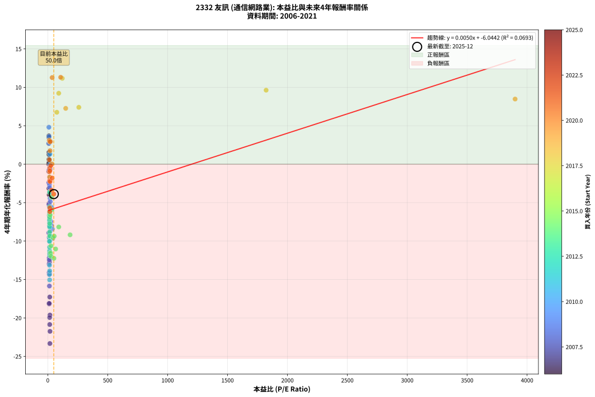
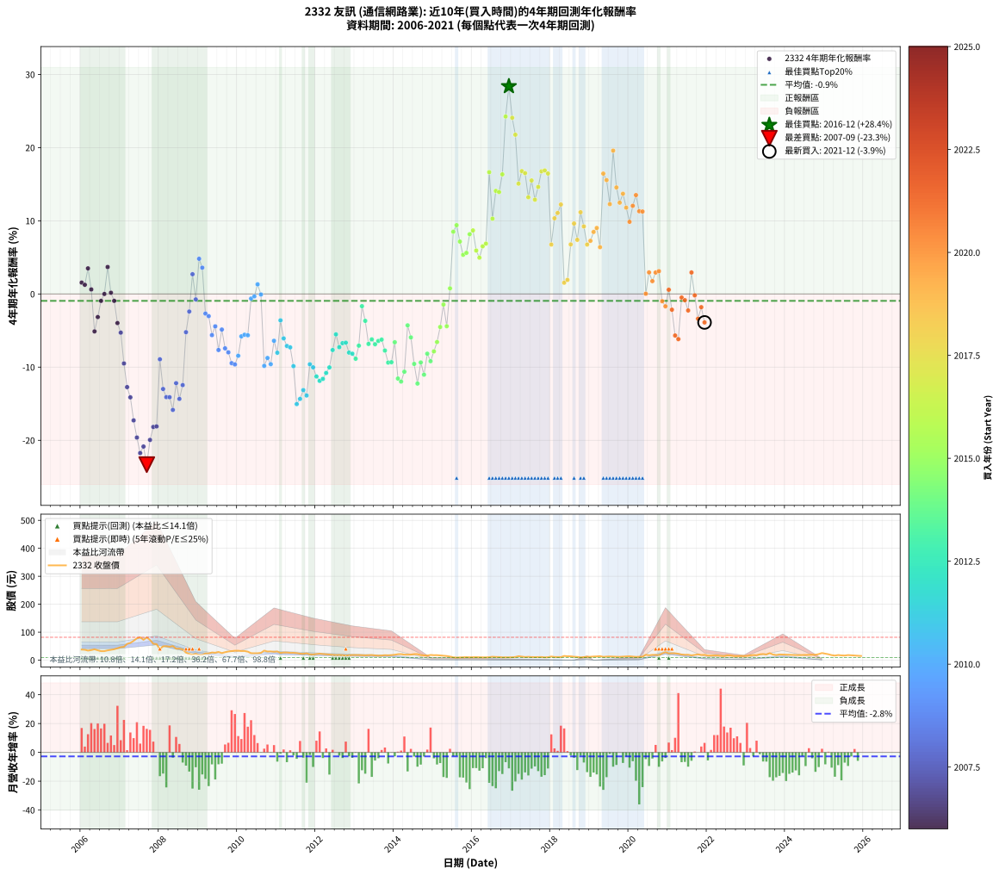

# 2332 友訊 - 本益比與未來報酬率分析

!!! info "報告資訊"
    - **股票代號**: 2332
    - **公司名稱**: 友訊
    - **產業別**: 通信網路業
    - **分析期間**: 2006-2021 (192 個數據點)
    - **資料來源**: Type 12 (ShowMonthlyK_ChartFlow) 月收盤價與本益比
    - **報酬率口徑**: 含現金股利 (簡化: 年度合計，假設每年7/1入帳)
    - **報告生成時間**: 2026-01-07 18:27:04 CST

## 📈 視覺化圖表

### 圖表1: 本益比 vs 未來報酬率關係

*圖表1：2332 友訊 本益比與4年期未來報酬率關係 (2006-2021)*

### 圖表2: 歷年買入時點的4年期實際報酬率

*圖表2：2332 友訊 歷年買入時點的4年期實際報酬率 (2006-2021)*

## 📍 買點訊號說明

本報告提供兩種買點提示訊號（顯示於圖表2的股價子圖中）：

### ▲ 小綠色三角形（回測驗證）
- **計算方式**: 使用全部歷史資料計算本益比第25百分位數
- **用途**: 事後驗證，顯示歷史上哪些時點確實為低估區
- **限制**: 當下無法判斷，僅供回測參考
- **特性**: 後見之明（Look-Ahead Bias）

### ▲ 小橘色三角形（即時訊號）
- **計算方式**: 使用截至當月的過去5年資料計算本益比第25百分位數
- **用途**: 實際投資決策，當時即可判斷
- **優勢**: 可操作性強，符合實務需求
- **特性**: 無後見之明，滾動窗口計算

!!! tip "如何使用兩種訊號"
    - **綠色▲** 幫助理解歷史估值機會，驗證策略有效性
    - **橘色▲** 可作為實際買進參考，但仍需搭配基本面分析
    - 兩種訊號重疊時，表示即時判斷與事後驗證一致，信心度較高
    - 僅有綠色▲時，表示當時無法判斷（需要未來資料才能確認）
    - 僅有橘色▲時，表示即時判斷為買點，但事後可能不是最佳時機

## 📊 估值分析摘要

| 指標 | 數值 |
|:---:|:---:|
| **目前本益比** (2021-12) | **50.00 倍** |
| **歷史平均本益比** | 66.97 倍 |
| **估值水準** | 🟢 相對低估 |
| **預期4年年化報酬率** | **-5.79%** |
| **歷史平均報酬率** | -0.94% |
| **相關係數 (R²)** | 0.0693 |
| **趨勢線斜率** | 0.0050 |

!!! abstract "核心洞察"
    目前本益比顯著低於歷史平均，預期未來報酬率可能較高

    根據歷史數據回測，2332 友訊 在目前本益比 **50.0倍** 的估值水準下，
    預期未來4年年化報酬率約為 **-5.8%**。

    **重要提醒**: 本分析基於歷史數據統計，實際報酬率會受到公司基本面變化、產業趨勢、
    總體經濟環境等多重因素影響。R² = 0.07 表示本益比可解釋約 6.9% 的報酬率變異。

## 📈 歷史估值統計

### 最佳買點 (最高報酬率)

| 項目 | 數值 |
|:---:|:---:|
| 起始時間 | 2016-12 |
| 當時本益比 | nan 倍 |
| 起始價格 | 10.8 元 |
| 4年後價格 | 28.7 元 |
| **4年年化報酬率** | **+28.38%** |

### 最差買點 (最低報酬率)

| 項目 | 數值 |
|:---:|:---:|
| 起始時間 | 2007-09 |
| 當時本益比 | 17.18 倍 |
| 起始價格 | 81.1 元 |
| 4年後價格 | 22.7 元 |
| **4年年化報酬率** | **-23.33%** |

## 🎯 投資啟示

### 本益比與報酬率關係

趨勢線方程式: **y = 0.0050x + -6.0442**

!!! info "弱相關或正相關"
    本益比與未來報酬率相關性較弱。這可能表示該股票的報酬率更多受到
    公司成長性、產業趨勢等因素影響，而非估值水準。**需綜合考量多項指標**。

### 估值區間建議

基於歷史數據分析:

- **🟢 低估區** (P/E < 53.6): 預期報酬率較高，可考慮增加持股
- **🟡 合理區** (P/E 53.6-80.4): 預期報酬率符合長期趨勢，正常持有
- **🔴 高估區** (P/E > 80.4): 預期報酬率較低，可考慮減碼或觀望

!!! danger "風險提示"
    - 過去表現不代表未來結果
    - 本分析假設公司基本面無重大結構性變化
    - 產業環境劇變可能使歷史規律失效
    - 應結合公司財報、產業趨勢、總體經濟等多重因素綜合判斷

!!! success "長期投資觀點"
    歷史數據顯示，在合理或低估的估值水準買入並長期持有，
    往往能獲得較佳的投資報酬。**耐心等待好價格**是價值投資的核心原則。

## 📊 數據品質

- **資料來源**: GoodInfo.tw Type 12 (ShowMonthlyK_ChartFlow)
- **資料頻率**: 月度收盤價與本益比
- **回測期間**: 2006-2021
- **數據點數量**: 192 個 (每個點代表一次4年期回測)

### 計算方法說明

1. **4年期年化報酬率**:
   - 對每個歷史時點，計算其後4年的實際投資報酬率
   - 期末價值(不含股利): 期末價格
   - 期末價值(含現金股利): 期末價格 + 持有期間內的現金股利合計 (簡化: 年度合計，假設每年7/1入帳)
   - 公式: 年化報酬率 = [(期末價值/期初價格)^(1/年數) - 1] × 100%

2. **本益比 (P/E Ratio)**:
   - 使用當時的月收盤價與EPS計算
   - 資料來源: Type 12 月度河流圖本益比數據

3. **趨勢線 (Linear Regression)**:
   - 使用最小平方法擬合線性趨勢線
   - R²值衡量本益比對報酬率的解釋能力

---

*本報告由 Stock Analysis System v1.9.0 自動生成*
*數據更新時間: 2026-01-07 18:27:04 CST*

## 📋 月度回測明細表

（每一列對應時間線圖中的一個買入點；可用來對照 SVG 圖上的每個點。）

| 買入月份 | 賣出月份 | 回測期限_年 | 實際持有年數 | 買入本益比_倍 | 買入收盤價_元 | 賣出收盤價_元 | 現金股利合計_元 | 總報酬率_pct | 年化報酬率_pct |
| --- | --- | --- | --- | --- | --- | --- | --- | --- | --- |
| 2006-01 | 2010-01 | 4 | 4.000 | 9.97 | 37.80 | 33.70 | 6.50 | +6.35 | +1.55 |
| 2006-02 | 2010-02 | 4 | 4.000 | 9.82 | 37.20 | 32.60 | 6.50 | +5.11 | +1.25 |
| 2006-03 | 2010-03 | 4 | 4.000 | 9.04 | 34.25 | 32.80 | 6.50 | +14.74 | +3.50 |
| 2006-04 | 2010-04 | 4 | 4.000 | 9.53 | 36.10 | 30.50 | 6.50 | +2.49 | +0.62 |
| 2006-05 | 2010-05 | 4 | 4.000 | 10.24 | 38.80 | 24.95 | 6.50 | -18.94 | -5.12 |
| 2006-06 | 2010-06 | 4 | 4.000 | 9.31 | 35.30 | 24.55 | 6.50 | -12.04 | -3.16 |
| 2006-07 | 2010-07 | 4 | 4.000 | 8.50 | 32.20 | 24.70 | 6.30 | -3.73 | -0.94 |
| 2006-08 | 2010-08 | 4 | 4.000 | 8.52 | 32.30 | 26.00 | 6.30 | +0.00 | +0.00 |
| 2006-09 | 2010-09 | 4 | 4.000 | 9.23 | 35.00 | 34.15 | 6.30 | +15.57 | +3.68 |
| 2006-10 | 2010-10 | 4 | 4.000 | 9.75 | 36.95 | 30.90 | 6.30 | +0.68 | +0.17 |
| 2006-11 | 2010-11 | 4 | 4.000 | 10.29 | 39.00 | 31.25 | 6.30 | -3.72 | -0.94 |
| 2006-12 | 2010-12 | 4 | 4.000 | 11.27 | 42.70 | 30.00 | 6.30 | -14.99 | -3.98 |
| 2007-01 | 2011-01 | 4 | 4.000 | 11.90 | 46.35 | 31.00 | 6.30 | -19.53 | -5.29 |
| 2007-02 | 2011-02 | 4 | 4.000 | 11.97 | 47.85 | 25.80 | 6.30 | -32.92 | -9.50 |
| 2007-03 | 2011-03 | 4 | 4.000 | 14.17 | 58.10 | 27.40 | 6.30 | -42.00 | -12.73 |
| 2007-04 | 2011-04 | 4 | 4.000 | 14.70 | 61.80 | 27.30 | 6.30 | -45.63 | -14.13 |
| 2007-05 | 2011-05 | 4 | 4.000 | 16.07 | 69.20 | 26.10 | 6.30 | -53.18 | -17.28 |
| 2007-06 | 2011-06 | 4 | 4.000 | 17.69 | 78.00 | 26.25 | 6.30 | -58.27 | -19.63 |
| 2007-07 | 2011-07 | 4 | 4.000 | 18.12 | 81.80 | 25.35 | 5.33 | -62.50 | -21.75 |
| 2007-08 | 2011-08 | 4 | 4.000 | 15.75 | 72.70 | 23.20 | 5.33 | -60.76 | -20.86 |
| 2007-09 | 2011-09 | 4 | 4.000 | 17.18 | 81.10 | 22.70 | 5.33 | -65.44 | -23.33 |
| 2007-10 | 2011-10 | 4 | 4.000 | 15.03 | 72.50 | 24.45 | 5.33 | -58.93 | -19.95 |
| 2007-11 | 2011-11 | 4 | 4.000 | 11.87 | 58.50 | 20.90 | 5.33 | -55.17 | -18.17 |
| 2007-12 | 2011-12 | 4 | 4.000 | 11.39 | 57.30 | 20.45 | 5.33 | -55.02 | -18.10 |
| 2008-01 | 2012-01 | 4 | 4.000 | 8.28 | 39.65 | 21.95 | 5.33 | -31.21 | -8.93 |
| 2008-02 | 2012-02 | 4 | 4.000 | 10.89 | 49.50 | 23.05 | 5.33 | -42.68 | -12.99 |
| 2008-03 | 2012-03 | 4 | 4.000 | 11.64 | 50.10 | 21.95 | 5.33 | -45.56 | -14.10 |
| 2008-04 | 2012-04 | 4 | 4.000 | 11.85 | 48.10 | 20.85 | 5.33 | -45.58 | -14.11 |
| 2008-05 | 2012-05 | 4 | 4.000 | 13.23 | 50.50 | 20.00 | 5.33 | -49.85 | -15.85 |
| 2008-06 | 2012-06 | 4 | 4.000 | 11.47 | 41.00 | 19.05 | 5.33 | -40.55 | -12.19 |
| 2008-07 | 2012-07 | 4 | 4.000 | 12.33 | 41.10 | 18.20 | 3.93 | -46.17 | -14.34 |
| 2008-08 | 2012-08 | 4 | 4.000 | 12.41 | 38.35 | 18.60 | 3.93 | -41.26 | -12.46 |
| 2008-09 | 2012-09 | 4 | 4.000 | 9.50 | 27.05 | 17.90 | 3.93 | -19.32 | -5.22 |
| 2008-10 | 2012-10 | 4 | 4.000 | 8.60 | 22.40 | 16.40 | 3.93 | -9.26 | -2.40 |
| 2008-11 | 2012-11 | 4 | 4.000 | 8.19 | 19.35 | 17.60 | 3.93 | +11.24 | +2.70 |
| 2008-12 | 2012-12 | 4 | 4.000 | 10.83 | 22.95 | 18.35 | 3.93 | -2.94 | -0.74 |
| 2009-01 | 2013-01 | 4 | 4.000 | 9.21 | 18.50 | 18.40 | 3.93 | +20.68 | +4.81 |
| 2009-02 | 2013-02 | 4 | 4.000 | 10.17 | 19.30 | 18.30 | 3.93 | +15.16 | +3.59 |
| 2009-03 | 2013-03 | 4 | 4.000 | 13.45 | 24.05 | 17.65 | 3.93 | -10.29 | -2.68 |
| 2009-04 | 2013-04 | 4 | 4.000 | 14.28 | 23.95 | 17.25 | 3.93 | -11.59 | -3.03 |
| 2009-05 | 2013-05 | 4 | 4.000 | 17.53 | 27.45 | 17.85 | 3.93 | -20.67 | -5.63 |
| 2009-06 | 2013-06 | 4 | 4.000 | 18.35 | 26.70 | 18.35 | 3.93 | -16.57 | -4.43 |
| 2009-07 | 2013-07 | 4 | 4.000 | 21.87 | 29.40 | 16.95 | 4.43 | -27.30 | -7.66 |
| 2009-08 | 2013-08 | 4 | 4.000 | 20.51 | 25.30 | 16.30 | 4.43 | -18.08 | -4.86 |
| 2009-09 | 2013-09 | 4 | 4.000 | 25.39 | 28.50 | 16.50 | 4.43 | -26.58 | -7.43 |
| 2009-10 | 2013-10 | 4 | 4.000 | 30.64 | 31.00 | 17.80 | 4.43 | -28.31 | -7.98 |
| 2009-11 | 2013-11 | 4 | 4.000 | 35.97 | 32.40 | 17.35 | 4.43 | -32.79 | -9.46 |
| 2009-12 | 2013-12 | 4 | 4.000 | 42.66 | 33.70 | 18.05 | 4.43 | -33.31 | -9.63 |
| 2010-01 | 2014-01 | 4 | 4.000 | 38.22 | 33.70 | 19.25 | 4.43 | -29.75 | -8.45 |
| 2010-02 | 2014-02 | 4 | 4.000 | 33.49 | 32.60 | 21.25 | 4.43 | -21.24 | -5.80 |
| 2010-03 | 2014-03 | 4 | 4.000 | 30.80 | 32.80 | 21.65 | 4.43 | -20.50 | -5.57 |
| 2010-04 | 2014-04 | 4 | 4.000 | 26.37 | 30.50 | 19.75 | 4.43 | -20.74 | -5.64 |
| 2010-05 | 2014-05 | 4 | 4.000 | 19.99 | 24.95 | 19.90 | 4.43 | -2.51 | -0.63 |
| 2010-06 | 2014-06 | 4 | 4.000 | 18.32 | 24.55 | 19.80 | 4.43 | -1.32 | -0.33 |
| 2010-07 | 2014-07 | 4 | 4.000 | 17.25 | 24.70 | 21.60 | 4.42 | +5.36 | +1.31 |
| 2010-08 | 2014-08 | 4 | 4.000 | 17.07 | 26.00 | 21.50 | 4.42 | -0.29 | -0.07 |
| 2010-09 | 2014-09 | 4 | 4.000 | 21.15 | 34.15 | 18.15 | 4.42 | -33.89 | -9.83 |
| 2010-10 | 2014-10 | 4 | 4.000 | 18.11 | 30.90 | 17.00 | 4.42 | -30.66 | -8.75 |
| 2010-11 | 2014-11 | 4 | 4.000 | 17.38 | 31.25 | 16.45 | 4.42 | -33.20 | -9.59 |
| 2010-12 | 2014-12 | 4 | 4.000 | 15.87 | 30.00 | 18.60 | 4.42 | -23.25 | -6.40 |
| 2011-01 | 2015-01 | 4 | 4.000 | 16.67 | 31.00 | 17.75 | 4.42 | -28.47 | -8.03 |
| 2011-02 | 2015-02 | 4 | 4.000 | 14.11 | 25.80 | 17.85 | 4.42 | -13.66 | -3.61 |
| 2011-03 | 2015-03 | 4 | 4.000 | 15.24 | 27.40 | 16.90 | 4.42 | -22.17 | -6.07 |
| 2011-04 | 2015-04 | 4 | 4.000 | 15.45 | 27.30 | 15.90 | 4.42 | -25.55 | -7.11 |
| 2011-05 | 2015-05 | 4 | 4.000 | 15.04 | 26.10 | 14.85 | 4.42 | -26.15 | -7.30 |
| 2011-06 | 2015-06 | 4 | 4.000 | 15.40 | 26.25 | 12.90 | 4.42 | -34.00 | -9.87 |
| 2011-07 | 2015-07 | 4 | 4.000 | 15.14 | 25.35 | 10.10 | 3.10 | -47.93 | -15.05 |
| 2011-08 | 2015-08 | 4 | 4.000 | 14.12 | 23.20 | 9.39 | 3.10 | -46.16 | -14.34 |
| 2011-09 | 2015-09 | 4 | 4.000 | 14.08 | 22.70 | 9.82 | 3.10 | -43.08 | -13.14 |
| 2011-10 | 2015-10 | 4 | 4.000 | 15.46 | 24.45 | 10.35 | 3.10 | -44.99 | -13.88 |
| 2011-11 | 2015-11 | 4 | 4.000 | 13.48 | 20.90 | 10.85 | 3.10 | -33.25 | -9.61 |
| 2011-12 | 2015-12 | 4 | 4.000 | 13.45 | 20.45 | 10.30 | 3.10 | -34.47 | -10.03 |
| 2012-01 | 2016-01 | 4 | 4.000 | 14.67 | 21.95 | 10.50 | 3.10 | -38.04 | -11.28 |
| 2012-02 | 2016-02 | 4 | 4.000 | 15.64 | 23.05 | 10.80 | 3.10 | -39.70 | -11.88 |
| 2012-03 | 2016-03 | 4 | 4.000 | 15.14 | 21.95 | 10.30 | 3.10 | -38.95 | -11.61 |
| 2012-04 | 2016-04 | 4 | 4.000 | 14.61 | 20.85 | 10.10 | 3.10 | -36.69 | -10.80 |
| 2012-05 | 2016-05 | 4 | 4.000 | 14.25 | 20.00 | 10.00 | 3.10 | -34.50 | -10.04 |
| 2012-06 | 2016-06 | 4 | 4.000 | 13.80 | 19.05 | 10.75 | 3.10 | -27.30 | -7.66 |
| 2012-07 | 2016-07 | 4 | 4.000 | 13.42 | 18.20 | 12.20 | 2.30 | -20.33 | -5.52 |
| 2012-08 | 2016-08 | 4 | 4.000 | 13.95 | 18.60 | 11.45 | 2.30 | -26.08 | -7.27 |
| 2012-09 | 2016-09 | 4 | 4.000 | 13.66 | 17.90 | 11.25 | 2.30 | -24.30 | -6.72 |
| 2012-10 | 2016-10 | 4 | 4.000 | 12.75 | 16.40 | 10.15 | 2.30 | -24.09 | -6.66 |
| 2012-11 | 2016-11 | 4 | 4.000 | 13.93 | 17.60 | 10.30 | 2.30 | -28.41 | -8.02 |
| 2012-12 | 2016-12 | 4 | 4.000 | 14.80 | 18.35 | 10.75 | 2.30 | -28.88 | -8.17 |
| 2013-01 | 2017-01 | 4 | 4.000 | 15.02 | 18.40 | 10.40 | 2.30 | -30.98 | -8.85 |
| 2013-02 | 2017-02 | 4 | 4.000 | 15.12 | 18.30 | 11.35 | 2.30 | -25.41 | -7.07 |
| 2013-03 | 2017-03 | 4 | 4.000 | 14.77 | 17.65 | 14.20 | 2.30 | -6.52 | -1.67 |
| 2013-04 | 2017-04 | 4 | 4.000 | 14.62 | 17.25 | 12.55 | 2.30 | -13.91 | -3.68 |
| 2013-05 | 2017-05 | 4 | 4.000 | 15.32 | 17.85 | 11.15 | 2.30 | -24.65 | -6.83 |
| 2013-06 | 2017-06 | 4 | 4.000 | 15.96 | 18.35 | 11.90 | 2.30 | -22.62 | -6.21 |
| 2013-07 | 2017-07 | 4 | 4.000 | 14.93 | 16.95 | 11.15 | 1.60 | -24.78 | -6.87 |
| 2013-08 | 2017-08 | 4 | 4.000 | 14.55 | 16.30 | 10.90 | 1.60 | -23.31 | -6.42 |
| 2013-09 | 2017-09 | 4 | 4.000 | 14.93 | 16.50 | 11.15 | 1.60 | -22.73 | -6.24 |
| 2013-10 | 2017-10 | 4 | 4.000 | 16.33 | 17.80 | 11.30 | 1.60 | -27.53 | -7.73 |
| 2013-11 | 2017-11 | 4 | 4.000 | 16.14 | 17.35 | 10.10 | 1.60 | -32.56 | -9.38 |
| 2013-12 | 2017-12 | 4 | 4.000 | 17.03 | 18.05 | 10.60 | 1.60 | -32.41 | -9.33 |
| 2014-01 | 2018-01 | 4 | 4.000 | 19.64 | 19.25 | 13.05 | 1.60 | -23.90 | -6.60 |
| 2014-02 | 2018-02 | 4 | 4.000 | 23.61 | 21.25 | 11.40 | 1.60 | -38.82 | -11.56 |
| 2014-03 | 2018-03 | 4 | 4.000 | 26.40 | 21.65 | 11.40 | 1.60 | -39.95 | -11.97 |
| 2014-04 | 2018-04 | 4 | 4.000 | 26.69 | 19.75 | 11.00 | 1.60 | -36.20 | -10.63 |
| 2014-05 | 2018-05 | 4 | 4.000 | 30.15 | 19.90 | 15.10 | 1.60 | -16.08 | -4.29 |
| 2014-06 | 2018-06 | 4 | 4.000 | 34.14 | 19.80 | 13.90 | 1.60 | -21.72 | -5.94 |
| 2014-07 | 2018-07 | 4 | 4.000 | 43.20 | 21.60 | 13.85 | 0.60 | -33.10 | -9.56 |
| 2014-08 | 2018-08 | 4 | 4.000 | 51.19 | 21.50 | 12.15 | 0.60 | -40.70 | -12.25 |
| 2014-09 | 2018-09 | 4 | 4.000 | 53.38 | 18.15 | 11.65 | 0.60 | -32.51 | -9.36 |
| 2014-10 | 2018-10 | 4 | 4.000 | 65.38 | 17.00 | 10.05 | 0.60 | -37.35 | -11.03 |
| 2014-11 | 2018-11 | 4 | 4.000 | 91.39 | 16.45 | 11.10 | 0.60 | -28.88 | -8.17 |
| 2014-12 | 2018-12 | 4 | 4.000 | 186.00 | 18.60 | 12.05 | 0.60 | -31.99 | -9.19 |
| 2015-01 | 2019-01 | 4 | 4.000 |  | 17.75 | 12.20 | 0.60 | -27.89 | -7.85 |
| 2015-02 | 2019-02 | 4 | 4.000 |  | 17.85 | 13.00 | 0.60 | -23.81 | -6.57 |
| 2015-03 | 2019-03 | 4 | 4.000 |  | 16.90 | 13.45 | 0.60 | -16.86 | -4.51 |
| 2015-04 | 2019-04 | 4 | 4.000 |  | 15.90 | 14.40 | 0.60 | -5.66 | -1.45 |
| 2015-05 | 2019-05 | 4 | 4.000 |  | 14.85 | 11.80 | 0.60 | -16.50 | -4.41 |
| 2015-06 | 2019-06 | 4 | 4.000 |  | 12.90 | 12.70 | 0.60 | +3.10 | +0.77 |
| 2015-07 | 2019-07 | 4 | 4.000 |  | 10.10 | 13.20 | 0.80 | +38.61 | +8.51 |
| 2015-08 | 2019-08 | 4 | 4.000 |  | 9.39 | 12.65 | 0.80 | +43.24 | +9.40 |
| 2015-09 | 2019-09 | 4 | 4.000 |  | 9.82 | 12.15 | 0.80 | +31.87 | +7.16 |
| 2015-10 | 2019-10 | 4 | 4.000 |  | 10.35 | 11.95 | 0.80 | +23.19 | +5.35 |
| 2015-11 | 2019-11 | 4 | 4.000 |  | 10.85 | 12.70 | 0.80 | +24.42 | +5.62 |
| 2015-12 | 2019-12 | 4 | 4.000 |  | 10.30 | 13.30 | 0.80 | +36.89 | +8.17 |
| 2016-01 | 2020-01 | 4 | 4.000 |  | 10.50 | 13.85 | 0.80 | +39.52 | +8.68 |
| 2016-02 | 2020-02 | 4 | 4.000 |  | 10.80 | 12.80 | 0.80 | +25.93 | +5.93 |
| 2016-03 | 2020-03 | 4 | 4.000 |  | 10.30 | 11.70 | 0.80 | +21.36 | +4.96 |
| 2016-04 | 2020-04 | 4 | 4.000 |  | 10.10 | 12.20 | 0.80 | +28.71 | +6.51 |
| 2016-05 | 2020-05 | 4 | 4.000 |  | 10.00 | 12.25 | 0.80 | +30.50 | +6.88 |
| 2016-06 | 2020-06 | 4 | 4.000 |  | 10.75 | 19.10 | 0.80 | +85.12 | +16.64 |
| 2016-07 | 2020-07 | 4 | 4.000 |  | 12.20 | 17.55 | 0.50 | +47.95 | +10.29 |
| 2016-08 | 2020-08 | 4 | 4.000 |  | 11.45 | 18.90 | 0.50 | +69.43 | +14.09 |
| 2016-09 | 2020-09 | 4 | 4.000 |  | 11.25 | 18.45 | 0.50 | +68.44 | +13.92 |
| 2016-10 | 2020-10 | 4 | 4.000 |  | 10.15 | 18.10 | 0.50 | +83.25 | +16.35 |
| 2016-11 | 2020-11 | 4 | 4.000 |  | 10.30 | 24.05 | 0.50 | +138.35 | +24.25 |
| 2016-12 | 2020-12 | 4 | 4.000 |  | 10.75 | 28.70 | 0.50 | +171.63 | +28.38 |
| 2017-01 | 2021-01 | 4 | 4.000 |  | 10.40 | 24.15 | 0.50 | +137.02 | +24.08 |
| 2017-02 | 2021-02 | 4 | 4.000 |  | 11.35 | 24.45 | 0.50 | +119.82 | +21.76 |
| 2017-03 | 2021-03 | 4 | 4.000 |  | 14.20 | 24.40 | 0.50 | +75.35 | +15.07 |
| 2017-04 | 2021-04 | 4 | 4.000 |  | 12.55 | 22.85 | 0.50 | +86.06 | +16.79 |
| 2017-05 | 2021-05 | 4 | 4.000 |  | 11.15 | 20.05 | 0.50 | +84.30 | +16.52 |
| 2017-06 | 2021-06 | 4 | 4.000 |  | 11.90 | 19.05 | 0.50 | +64.29 | +13.21 |
| 2017-07 | 2021-07 | 4 | 4.000 |  | 11.15 | 19.35 | 0.50 | +78.03 | +15.51 |
| 2017-08 | 2021-08 | 4 | 4.000 |  | 10.90 | 17.20 | 0.50 | +62.39 | +12.89 |
| 2017-09 | 2021-09 | 4 | 4.000 |  | 11.15 | 18.75 | 0.50 | +72.65 | +14.63 |
| 2017-10 | 2021-10 | 4 | 4.000 |  | 11.30 | 20.50 | 0.50 | +85.84 | +16.76 |
| 2017-11 | 2021-11 | 4 | 4.000 |  | 10.10 | 18.35 | 0.50 | +86.63 | +16.88 |
| 2017-12 | 2021-12 | 4 | 4.000 |  | 10.60 | 19.00 | 0.50 | +83.96 | +16.46 |
| 2018-01 | 2022-01 | 4 | 4.000 |  | 13.05 | 16.45 | 0.50 | +29.89 | +6.76 |
| 2018-02 | 2022-02 | 4 | 4.000 |  | 11.40 | 16.40 | 0.50 | +48.25 | +10.34 |
| 2018-03 | 2022-03 | 4 | 4.000 |  | 11.40 | 16.85 | 0.50 | +52.19 | +11.07 |
| 2018-04 | 2022-04 | 4 | 4.000 |  | 11.00 | 16.95 | 0.50 | +58.64 | +12.23 |
| 2018-05 | 2022-05 | 4 | 4.000 |  | 15.10 | 15.55 | 0.50 | +6.29 | +1.54 |
| 2018-06 | 2022-06 | 4 | 4.000 |  | 13.90 | 14.50 | 0.50 | +7.91 | +1.92 |
| 2018-07 | 2022-07 | 4 | 4.000 |  | 13.85 | 17.20 | 0.80 | +29.96 | +6.77 |
| 2018-08 | 2022-08 | 4 | 4.000 | 1822.00 | 12.15 | 16.75 | 0.80 | +44.44 | +9.63 |
| 2018-09 | 2022-09 | 4 | 4.000 | 258.90 | 11.65 | 14.70 | 0.80 | +33.05 | +7.40 |
| 2018-10 | 2022-10 | 4 | 4.000 | 120.60 | 10.05 | 14.55 | 0.80 | +52.74 | +11.17 |
| 2018-11 | 2022-11 | 4 | 4.000 | 91.23 | 11.10 | 15.00 | 0.80 | +42.34 | +9.23 |
| 2018-12 | 2022-12 | 4 | 4.000 | 75.31 | 12.05 | 14.85 | 0.80 | +29.88 | +6.75 |
| 2019-01 | 2023-01 | 4 | 4.000 | 149.40 | 12.20 | 15.35 | 0.80 | +32.38 | +7.26 |
| 2019-02 | 2023-02 | 4 | 4.000 | 3900.00 | 13.00 | 17.20 | 0.80 | +38.46 | +8.48 |
| 2019-03 | 2023-03 | 4 | 4.000 |  | 13.45 | 18.20 | 0.80 | +41.26 | +9.02 |
| 2019-04 | 2023-04 | 4 | 4.000 |  | 14.40 | 17.65 | 0.80 | +28.12 | +6.39 |
| 2019-05 | 2023-05 | 4 | 4.000 |  | 11.80 | 20.90 | 0.80 | +83.90 | +16.45 |
| 2019-06 | 2023-06 | 4 | 4.000 |  | 12.70 | 21.85 | 0.80 | +78.35 | +15.56 |
| 2019-07 | 2023-07 | 4 | 4.000 |  | 13.20 | 20.15 | 0.82 | +58.90 | +12.27 |
| 2019-08 | 2023-08 | 4 | 4.000 |  | 12.65 | 25.05 | 0.82 | +104.55 | +19.59 |
| 2019-09 | 2023-09 | 4 | 4.000 |  | 12.15 | 20.10 | 0.82 | +72.22 | +14.56 |
| 2019-10 | 2023-10 | 4 | 4.000 |  | 11.95 | 18.30 | 0.82 | +60.04 | +12.48 |
| 2019-11 | 2023-11 | 4 | 4.000 |  | 12.70 | 20.40 | 0.82 | +67.13 | +13.70 |
| 2019-12 | 2023-12 | 4 | 4.000 |  | 13.30 | 19.95 | 0.82 | +56.20 | +11.79 |
| 2020-01 | 2024-01 | 4 | 4.000 |  | 13.85 | 19.35 | 0.82 | +45.67 | +9.86 |
| 2020-02 | 2024-02 | 4 | 4.000 |  | 12.80 | 19.35 | 0.82 | +57.62 | +12.05 |
| 2020-03 | 2024-03 | 4 | 4.000 |  | 11.70 | 18.60 | 0.82 | +66.03 | +13.51 |
| 2020-04 | 2024-04 | 4 | 4.000 | 107.60 | 12.20 | 17.90 | 0.82 | +53.48 | +11.31 |
| 2020-05 | 2024-05 | 4 | 4.000 | 36.39 | 12.25 | 17.95 | 0.82 | +53.27 | +11.27 |
| 2020-06 | 2024-06 | 4 | 4.000 | 34.11 | 19.10 | 18.30 | 0.82 | +0.13 | +0.03 |
| 2020-07 | 2024-07 | 4 | 4.000 | 22.40 | 17.55 | 18.35 | 1.36 | +12.31 | +2.95 |
| 2020-08 | 2024-08 | 4 | 4.000 | 18.77 | 18.90 | 18.90 | 1.36 | +7.20 | +1.75 |
| 2020-09 | 2024-09 | 4 | 4.000 | 15.00 | 18.45 | 19.35 | 1.36 | +12.25 | +2.93 |
| 2020-10 | 2024-10 | 4 | 4.000 | 12.45 | 18.10 | 19.10 | 1.36 | +13.04 | +3.11 |
| 2020-11 | 2024-11 | 4 | 4.000 | 14.34 | 24.05 | 21.75 | 1.36 | -3.90 | -0.99 |
| 2020-12 | 2024-12 | 4 | 4.000 | 15.11 | 28.70 | 25.45 | 1.36 | -6.58 | -1.69 |
| 2021-01 | 2025-01 | 4 | 4.000 | 13.62 | 24.15 | 23.35 | 1.36 | +2.32 | +0.58 |
| 2021-02 | 2025-02 | 4 | 4.000 | 14.85 | 24.45 | 21.05 | 1.36 | -8.34 | -2.15 |
| 2021-03 | 2025-03 | 4 | 4.000 | 16.05 | 24.40 | 17.95 | 1.36 | -20.86 | -5.68 |
| 2021-04 | 2025-04 | 4 | 4.000 | 16.40 | 22.85 | 16.35 | 1.36 | -22.49 | -6.17 |
| 2021-05 | 2025-05 | 4 | 4.000 | 15.83 | 20.05 | 18.30 | 1.36 | -1.94 | -0.49 |
| 2021-06 | 2025-06 | 4 | 4.000 | 16.71 | 19.05 | 17.05 | 1.36 | -3.35 | -0.85 |
| 2021-07 | 2025-07 | 4 | 4.000 | 19.10 | 19.35 | 16.50 | 1.16 | -8.73 | -2.26 |
| 2021-08 | 2025-08 | 4 | 4.000 | 19.40 | 17.20 | 18.15 | 1.16 | +12.27 | +2.94 |
| 2021-09 | 2025-09 | 4 | 4.000 | 24.67 | 18.75 | 17.45 | 1.16 | -0.74 | -0.19 |
| 2021-10 | 2025-10 | 4 | 4.000 | 32.37 | 20.50 | 16.70 | 1.16 | -12.87 | -3.39 |
| 2021-11 | 2025-11 | 4 | 4.000 | 36.22 | 18.35 | 15.90 | 1.16 | -7.02 | -1.80 |
| 2021-12 | 2025-12 | 4 | 4.000 | 50.00 | 19.00 | 15.05 | 1.16 | -14.68 | -3.89 |
