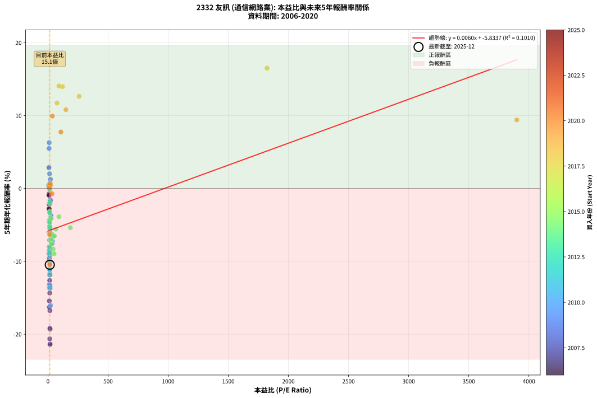
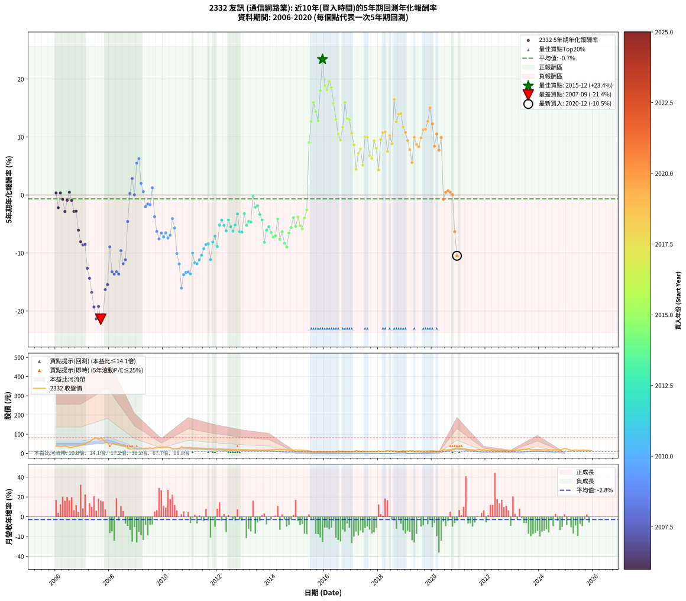

# 2332 友訊 - 本益比與未來報酬率分析

!!! info "報告資訊"
    - **股票代號**: 2332
    - **公司名稱**: 友訊
    - **產業別**: 通信網路業
    - **分析期間**: 2006-2020 (180 個數據點)
    - **資料來源**: Type 12 (ShowMonthlyK_ChartFlow) 月收盤價與本益比
    - **報酬率口徑**: 含現金股利 (簡化: 年度合計，假設每年7/1入帳)
    - **報告生成時間**: 2026-01-12 20:38:26 CST

## 📈 視覺化圖表

### 圖表1: 本益比 vs 未來報酬率關係

*圖表1：2332 友訊 本益比與5年期未來報酬率關係 (2006-2020)*

### 圖表2: 歷年買入時點的5年期實際報酬率

*圖表2：2332 友訊 歷年買入時點的5年期實際報酬率 (2006-2020)*

## 📍 買點訊號說明

本報告提供兩種買點提示訊號（顯示於圖表2的股價子圖中）：

### ▲ 小綠色三角形（回測驗證）
- **計算方式**: 使用全部歷史資料計算本益比第25百分位數
- **用途**: 事後驗證，顯示歷史上哪些時點確實為低估區
- **限制**: 當下無法判斷，僅供回測參考
- **特性**: 後見之明（Look-Ahead Bias）

### ▲ 小橘色三角形（即時訊號）
- **計算方式**: 使用截至當月的過去5年資料計算本益比第25百分位數
- **用途**: 實際投資決策，當時即可判斷
- **優勢**: 可操作性強，符合實務需求
- **特性**: 無後見之明，滾動窗口計算

!!! tip "如何使用兩種訊號"
    - **綠色▲** 幫助理解歷史估值機會，驗證策略有效性
    - **橘色▲** 可作為實際買進參考，但仍需搭配基本面分析
    - 兩種訊號重疊時，表示即時判斷與事後驗證一致，信心度較高
    - 僅有綠色▲時，表示當時無法判斷（需要未來資料才能確認）
    - 僅有橘色▲時，表示即時判斷為買點，但事後可能不是最佳時機

## 📊 估值分析摘要

| 指標 | 數值 |
|:---:|:---:|
| **目前本益比** (2020-12) | **15.11 倍** |
| **歷史平均本益比** | 71.23 倍 |
| **估值水準** | 🟢 相對低估 |
| **預期5年年化報酬率** | **-5.74%** |
| **歷史平均報酬率** | -0.66% |
| **相關係數 (R²)** | 0.1010 |
| **趨勢線斜率** | 0.0060 |

!!! abstract "核心洞察"
    目前本益比顯著低於歷史平均，預期未來報酬率可能較高

    根據歷史數據回測，2332 友訊 在目前本益比 **15.1倍** 的估值水準下，
    預期未來5年年化報酬率約為 **-5.7%**。

    **重要提醒**: 本分析基於歷史數據統計，實際報酬率會受到公司基本面變化、產業趨勢、
    總體經濟環境等多重因素影響。R² = 0.10 表示本益比可解釋約 10.1% 的報酬率變異。

## 📈 歷史估值統計

### 最佳買點 (最高報酬率)

| 項目 | 數值 |
|:---:|:---:|
| 起始時間 | 2015-12 |
| 當時本益比 | nan 倍 |
| 起始價格 | 10.3 元 |
| 5年後價格 | 28.7 元 |
| **5年年化報酬率** | **+23.41%** |

### 最差買點 (最低報酬率)

| 項目 | 數值 |
|:---:|:---:|
| 起始時間 | 2007-09 |
| 當時本益比 | 17.18 倍 |
| 起始價格 | 81.1 元 |
| 5年後價格 | 17.9 元 |
| **5年年化報酬率** | **-21.40%** |

## 🎯 投資啟示

### 本益比與報酬率關係

趨勢線方程式: **y = 0.0060x + -5.8337**

!!! info "弱相關或正相關"
    本益比與未來報酬率相關性較弱。這可能表示該股票的報酬率更多受到
    公司成長性、產業趨勢等因素影響，而非估值水準。**需綜合考量多項指標**。

### 估值區間建議

基於歷史數據分析:

- **🟢 低估區** (P/E < 57.0): 預期報酬率較高，可考慮增加持股
- **🟡 合理區** (P/E 57.0-85.5): 預期報酬率符合長期趨勢，正常持有
- **🔴 高估區** (P/E > 85.5): 預期報酬率較低，可考慮減碼或觀望

!!! danger "風險提示"
    - 過去表現不代表未來結果
    - 本分析假設公司基本面無重大結構性變化
    - 產業環境劇變可能使歷史規律失效
    - 應結合公司財報、產業趨勢、總體經濟等多重因素綜合判斷

!!! success "長期投資觀點"
    歷史數據顯示，在合理或低估的估值水準買入並長期持有，
    往往能獲得較佳的投資報酬。**耐心等待好價格**是價值投資的核心原則。

## 📊 數據品質

- **資料來源**: GoodInfo.tw Type 12 (ShowMonthlyK_ChartFlow)
- **資料頻率**: 月度收盤價與本益比
- **回測期間**: 2006-2020
- **數據點數量**: 180 個 (每個點代表一次5年期回測)

### 計算方法說明

1. **5年期年化報酬率**:
   - 對每個歷史時點，計算其後5年的實際投資報酬率
   - 期末價值(不含股利): 期末價格
   - 期末價值(含現金股利): 期末價格 + 持有期間內的現金股利合計 (簡化: 年度合計，假設每年7/1入帳)
   - 公式: 年化報酬率 = [(期末價值/期初價格)^(1/年數) - 1] × 100%

2. **本益比 (P/E Ratio)**:
   - 使用當時的月收盤價與EPS計算
   - 資料來源: Type 12 月度河流圖本益比數據

3. **趨勢線 (Linear Regression)**:
   - 使用最小平方法擬合線性趨勢線
   - R²值衡量本益比對報酬率的解釋能力

---

*本報告由 Stock Analysis System v1.9.0 自動生成*
*數據更新時間: 2026-01-12 20:38:26 CST*

## 📋 月度回測明細表

（每一列對應時間線圖中的一個買入點；可用來對照 SVG 圖上的每個點。）

| 買入月份 | 賣出月份 | 回測期限_年 | 實際持有年數 | 買入本益比_倍 | 買入收盤價_元 | 賣出收盤價_元 | 現金股利合計_元 | 總報酬率_pct | 年化報酬率_pct |
| --- | --- | --- | --- | --- | --- | --- | --- | --- | --- |
| 2006-01 | 2011-01 | 5 | 4.999 | 9.97 | 37.80 | 31.00 | 7.50 | +1.85 | +0.37 |
| 2006-02 | 2011-02 | 5 | 4.999 | 9.82 | 37.20 | 25.80 | 7.50 | -10.48 | -2.19 |
| 2006-03 | 2011-03 | 5 | 4.999 | 9.04 | 34.25 | 27.40 | 7.50 | +1.90 | +0.38 |
| 2006-04 | 2011-04 | 5 | 4.999 | 9.53 | 36.10 | 27.30 | 7.50 | -3.60 | -0.73 |
| 2006-05 | 2011-05 | 5 | 4.999 | 10.24 | 38.80 | 26.10 | 7.50 | -13.40 | -2.84 |
| 2006-06 | 2011-06 | 5 | 4.999 | 9.31 | 35.30 | 26.25 | 7.50 | -4.39 | -0.89 |
| 2006-07 | 2011-07 | 5 | 4.999 | 8.50 | 32.20 | 25.35 | 7.62 | +2.41 | +0.48 |
| 2006-08 | 2011-08 | 5 | 4.999 | 8.52 | 32.30 | 23.20 | 7.62 | -4.57 | -0.93 |
| 2006-09 | 2011-09 | 5 | 4.999 | 9.23 | 35.00 | 22.70 | 7.62 | -13.36 | -2.83 |
| 2006-10 | 2011-10 | 5 | 4.999 | 9.75 | 36.95 | 24.45 | 7.62 | -13.19 | -2.79 |
| 2006-11 | 2011-11 | 5 | 4.999 | 10.29 | 39.00 | 20.90 | 7.62 | -26.86 | -6.06 |
| 2006-12 | 2011-12 | 5 | 4.999 | 11.27 | 42.70 | 20.45 | 7.62 | -34.25 | -8.05 |
| 2007-01 | 2012-01 | 5 | 4.999 | 11.90 | 46.35 | 21.95 | 7.62 | -36.19 | -8.60 |
| 2007-02 | 2012-02 | 5 | 4.999 | 11.97 | 47.85 | 23.05 | 7.62 | -35.89 | -8.51 |
| 2007-03 | 2012-03 | 5 | 5.002 | 14.17 | 58.10 | 21.95 | 7.62 | -49.10 | -12.63 |
| 2007-04 | 2012-04 | 5 | 5.002 | 14.70 | 61.80 | 20.85 | 7.62 | -53.92 | -14.35 |
| 2007-05 | 2012-05 | 5 | 5.002 | 16.07 | 69.20 | 20.00 | 7.62 | -60.08 | -16.77 |
| 2007-06 | 2012-06 | 5 | 5.002 | 17.69 | 78.00 | 19.05 | 7.62 | -65.80 | -19.31 |
| 2007-07 | 2012-07 | 5 | 5.002 | 18.12 | 81.80 | 18.20 | 6.43 | -69.90 | -21.34 |
| 2007-08 | 2012-08 | 5 | 5.002 | 15.75 | 72.70 | 18.60 | 6.43 | -65.58 | -19.20 |
| 2007-09 | 2012-09 | 5 | 5.002 | 17.18 | 81.10 | 17.90 | 6.43 | -70.01 | -21.40 |
| 2007-10 | 2012-10 | 5 | 5.002 | 15.03 | 72.50 | 16.40 | 6.43 | -68.52 | -20.63 |
| 2007-11 | 2012-11 | 5 | 5.002 | 11.87 | 58.50 | 17.60 | 6.43 | -58.93 | -16.30 |
| 2007-12 | 2012-12 | 5 | 5.002 | 11.39 | 57.30 | 18.35 | 6.43 | -56.76 | -15.43 |
| 2008-01 | 2013-01 | 5 | 5.002 | 8.28 | 39.65 | 18.40 | 6.43 | -37.39 | -8.94 |
| 2008-02 | 2013-03 | 5 | 5.081 | 10.89 | 49.50 | 17.65 | 6.43 | -51.36 | -13.22 |
| 2008-03 | 2013-03 | 5 | 4.999 | 11.64 | 50.10 | 17.65 | 6.43 | -51.95 | -13.64 |
| 2008-04 | 2013-04 | 5 | 4.999 | 11.85 | 48.10 | 17.25 | 6.43 | -50.78 | -13.22 |
| 2008-05 | 2013-05 | 5 | 4.999 | 13.23 | 50.50 | 17.85 | 6.43 | -51.93 | -13.63 |
| 2008-06 | 2013-06 | 5 | 4.999 | 11.47 | 41.00 | 18.35 | 6.43 | -39.57 | -9.59 |
| 2008-07 | 2013-07 | 5 | 4.999 | 12.33 | 41.10 | 16.95 | 4.93 | -46.78 | -11.85 |
| 2008-08 | 2013-08 | 5 | 4.999 | 12.41 | 38.35 | 16.30 | 4.93 | -44.65 | -11.16 |
| 2008-09 | 2013-09 | 5 | 4.999 | 9.50 | 27.05 | 16.50 | 4.93 | -20.79 | -4.56 |
| 2008-10 | 2013-10 | 5 | 4.999 | 8.60 | 22.40 | 17.80 | 4.93 | +1.45 | +0.29 |
| 2008-11 | 2013-11 | 5 | 4.999 | 8.19 | 19.35 | 17.35 | 4.93 | +15.12 | +2.86 |
| 2008-12 | 2013-12 | 5 | 4.999 | 10.83 | 22.95 | 18.05 | 4.93 | +0.11 | +0.02 |
| 2009-01 | 2014-01 | 5 | 4.999 | 9.21 | 18.50 | 19.25 | 4.93 | +30.68 | +5.50 |
| 2009-02 | 2014-02 | 5 | 4.999 | 10.17 | 19.30 | 21.25 | 4.93 | +35.62 | +6.28 |
| 2009-03 | 2014-03 | 5 | 4.999 | 13.45 | 24.05 | 21.65 | 4.93 | +10.50 | +2.02 |
| 2009-04 | 2014-04 | 5 | 4.999 | 14.28 | 23.95 | 19.75 | 4.93 | +3.03 | +0.60 |
| 2009-05 | 2014-05 | 5 | 4.999 | 17.53 | 27.45 | 19.90 | 4.93 | -9.56 | -1.99 |
| 2009-06 | 2014-06 | 5 | 4.999 | 18.35 | 26.70 | 19.80 | 4.93 | -7.40 | -1.53 |
| 2009-07 | 2014-07 | 5 | 4.999 | 21.87 | 29.40 | 21.60 | 5.43 | -8.08 | -1.67 |
| 2009-08 | 2014-08 | 5 | 4.999 | 20.51 | 25.30 | 21.50 | 5.43 | +6.42 | +1.25 |
| 2009-09 | 2014-09 | 5 | 4.999 | 25.39 | 28.50 | 18.15 | 5.43 | -17.28 | -3.72 |
| 2009-10 | 2014-10 | 5 | 4.999 | 30.64 | 31.00 | 17.00 | 5.43 | -27.66 | -6.27 |
| 2009-11 | 2014-11 | 5 | 4.999 | 35.97 | 32.40 | 16.45 | 5.43 | -32.48 | -7.56 |
| 2009-12 | 2014-12 | 5 | 4.999 | 42.66 | 33.70 | 18.60 | 5.43 | -28.71 | -6.54 |
| 2010-01 | 2015-01 | 5 | 4.999 | 38.22 | 33.70 | 17.75 | 5.43 | -31.23 | -7.22 |
| 2010-02 | 2015-02 | 5 | 4.999 | 33.49 | 32.60 | 17.85 | 5.43 | -28.60 | -6.52 |
| 2010-03 | 2015-03 | 5 | 4.999 | 30.80 | 32.80 | 16.90 | 5.43 | -31.94 | -7.41 |
| 2010-04 | 2015-04 | 5 | 4.999 | 26.37 | 30.50 | 15.90 | 5.43 | -30.08 | -6.91 |
| 2010-05 | 2015-05 | 5 | 4.999 | 19.99 | 24.95 | 14.85 | 5.43 | -18.74 | -4.07 |
| 2010-06 | 2015-06 | 5 | 4.999 | 18.32 | 24.55 | 12.90 | 5.43 | -25.36 | -5.68 |
| 2010-07 | 2015-07 | 5 | 4.999 | 17.25 | 24.70 | 10.10 | 4.42 | -41.19 | -10.08 |
| 2010-08 | 2015-08 | 5 | 4.999 | 17.07 | 26.00 | 9.39 | 4.42 | -46.87 | -11.88 |
| 2010-09 | 2015-09 | 5 | 4.999 | 21.15 | 34.15 | 9.82 | 4.42 | -58.29 | -16.05 |
| 2010-10 | 2015-10 | 5 | 4.999 | 18.11 | 30.90 | 10.35 | 4.42 | -52.18 | -13.72 |
| 2010-11 | 2015-11 | 5 | 4.999 | 17.38 | 31.25 | 10.85 | 4.42 | -51.12 | -13.34 |
| 2010-12 | 2015-12 | 5 | 4.999 | 15.87 | 30.00 | 10.30 | 4.42 | -50.92 | -13.27 |
| 2011-01 | 2016-01 | 5 | 4.999 | 16.67 | 31.00 | 10.50 | 4.42 | -51.85 | -13.60 |
| 2011-02 | 2016-02 | 5 | 4.999 | 14.11 | 25.80 | 10.80 | 4.42 | -40.99 | -10.01 |
| 2011-03 | 2016-03 | 5 | 5.002 | 15.24 | 27.40 | 10.30 | 4.42 | -46.26 | -11.68 |
| 2011-04 | 2016-04 | 5 | 5.002 | 15.45 | 27.30 | 10.10 | 4.42 | -46.79 | -11.85 |
| 2011-05 | 2016-05 | 5 | 5.002 | 15.04 | 26.10 | 10.00 | 4.42 | -44.73 | -11.18 |
| 2011-06 | 2016-06 | 5 | 5.002 | 15.40 | 26.25 | 10.75 | 4.42 | -42.19 | -10.38 |
| 2011-07 | 2016-07 | 5 | 5.002 | 15.14 | 25.35 | 12.20 | 3.40 | -38.46 | -9.25 |
| 2011-08 | 2016-08 | 5 | 5.002 | 14.12 | 23.20 | 11.45 | 3.40 | -35.99 | -8.53 |
| 2011-09 | 2016-09 | 5 | 5.002 | 14.08 | 22.70 | 11.25 | 3.40 | -35.46 | -8.38 |
| 2011-10 | 2016-10 | 5 | 5.002 | 15.46 | 24.45 | 10.15 | 3.40 | -44.58 | -11.13 |
| 2011-11 | 2016-11 | 5 | 5.002 | 13.48 | 20.90 | 10.30 | 3.40 | -34.45 | -8.10 |
| 2011-12 | 2016-12 | 5 | 5.002 | 13.45 | 20.45 | 10.75 | 3.40 | -30.81 | -7.10 |
| 2012-01 | 2017-01 | 5 | 5.002 | 14.67 | 21.95 | 10.40 | 3.40 | -37.13 | -8.86 |
| 2012-02 | 2017-03 | 5 | 5.081 | 15.64 | 23.05 | 14.20 | 3.40 | -23.64 | -5.17 |
| 2012-03 | 2017-03 | 5 | 4.999 | 15.14 | 21.95 | 14.20 | 3.40 | -19.82 | -4.32 |
| 2012-04 | 2017-04 | 5 | 4.999 | 14.61 | 20.85 | 12.55 | 3.40 | -23.50 | -5.22 |
| 2012-05 | 2017-05 | 5 | 4.999 | 14.25 | 20.00 | 11.15 | 3.40 | -27.25 | -6.17 |
| 2012-06 | 2017-06 | 5 | 4.999 | 13.80 | 19.05 | 11.90 | 3.40 | -19.69 | -4.29 |
| 2012-07 | 2017-07 | 5 | 4.999 | 13.42 | 18.20 | 11.15 | 2.60 | -24.45 | -5.45 |
| 2012-08 | 2017-08 | 5 | 4.999 | 13.95 | 18.60 | 10.90 | 2.60 | -27.42 | -6.21 |
| 2012-09 | 2017-09 | 5 | 4.999 | 13.66 | 17.90 | 11.15 | 2.60 | -23.18 | -5.14 |
| 2012-10 | 2017-10 | 5 | 4.999 | 12.75 | 16.40 | 11.30 | 2.60 | -15.24 | -3.25 |
| 2012-11 | 2017-11 | 5 | 4.999 | 13.93 | 17.60 | 10.10 | 2.60 | -27.84 | -6.32 |
| 2012-12 | 2017-12 | 5 | 4.999 | 14.80 | 18.35 | 10.60 | 2.60 | -28.07 | -6.38 |
| 2013-01 | 2018-01 | 5 | 4.999 | 15.02 | 18.40 | 13.05 | 2.60 | -14.95 | -3.19 |
| 2013-02 | 2018-02 | 5 | 4.999 | 15.12 | 18.30 | 11.40 | 2.60 | -23.50 | -5.22 |
| 2013-03 | 2018-03 | 5 | 4.999 | 14.77 | 17.65 | 11.40 | 2.60 | -20.68 | -4.53 |
| 2013-04 | 2018-04 | 5 | 4.999 | 14.62 | 17.25 | 11.00 | 2.60 | -21.16 | -4.64 |
| 2013-05 | 2018-05 | 5 | 4.999 | 15.32 | 17.85 | 15.10 | 2.60 | -0.84 | -0.17 |
| 2013-06 | 2018-06 | 5 | 4.999 | 15.96 | 18.35 | 13.90 | 2.60 | -10.08 | -2.10 |
| 2013-07 | 2018-07 | 5 | 4.999 | 14.93 | 16.95 | 13.85 | 1.60 | -8.85 | -1.84 |
| 2013-08 | 2018-08 | 5 | 4.999 | 14.55 | 16.30 | 12.15 | 1.60 | -15.64 | -3.35 |
| 2013-09 | 2018-09 | 5 | 4.999 | 14.93 | 16.50 | 11.65 | 1.60 | -19.70 | -4.29 |
| 2013-10 | 2018-10 | 5 | 4.999 | 16.33 | 17.80 | 10.05 | 1.60 | -34.55 | -8.13 |
| 2013-11 | 2018-11 | 5 | 4.999 | 16.14 | 17.35 | 11.10 | 1.60 | -26.80 | -6.05 |
| 2013-12 | 2018-12 | 5 | 4.999 | 17.03 | 18.05 | 12.05 | 1.60 | -24.38 | -5.44 |
| 2014-01 | 2019-01 | 5 | 4.999 | 19.64 | 19.25 | 12.20 | 1.60 | -28.31 | -6.44 |
| 2014-02 | 2019-02 | 5 | 4.999 | 23.61 | 21.25 | 13.00 | 1.60 | -31.29 | -7.23 |
| 2014-03 | 2019-03 | 5 | 4.999 | 26.40 | 21.65 | 13.45 | 1.60 | -30.48 | -7.02 |
| 2014-04 | 2019-04 | 5 | 4.999 | 26.69 | 19.75 | 14.40 | 1.60 | -18.99 | -4.12 |
| 2014-05 | 2019-05 | 5 | 4.999 | 30.15 | 19.90 | 11.80 | 1.60 | -32.66 | -7.61 |
| 2014-06 | 2019-06 | 5 | 4.999 | 34.14 | 19.80 | 12.70 | 1.60 | -27.78 | -6.30 |
| 2014-07 | 2019-07 | 5 | 4.999 | 43.20 | 21.60 | 13.20 | 0.80 | -35.19 | -8.31 |
| 2014-08 | 2019-08 | 5 | 4.999 | 51.19 | 21.50 | 12.65 | 0.80 | -37.44 | -8.96 |
| 2014-09 | 2019-09 | 5 | 4.999 | 53.38 | 18.15 | 12.15 | 0.80 | -28.65 | -6.53 |
| 2014-10 | 2019-10 | 5 | 4.999 | 65.38 | 17.00 | 11.95 | 0.80 | -25.00 | -5.59 |
| 2014-11 | 2019-11 | 5 | 4.999 | 91.39 | 16.45 | 12.70 | 0.80 | -17.93 | -3.88 |
| 2014-12 | 2019-12 | 5 | 4.999 | 186.00 | 18.60 | 13.30 | 0.80 | -24.19 | -5.39 |
| 2015-01 | 2020-01 | 5 | 4.999 |  | 17.75 | 13.85 | 0.80 | -17.46 | -3.77 |
| 2015-02 | 2020-02 | 5 | 4.999 |  | 17.85 | 12.80 | 0.80 | -23.81 | -5.29 |
| 2015-03 | 2020-03 | 5 | 5.002 |  | 16.90 | 11.70 | 0.80 | -26.04 | -5.85 |
| 2015-04 | 2020-04 | 5 | 5.002 |  | 15.90 | 12.20 | 0.80 | -18.24 | -3.95 |
| 2015-05 | 2020-05 | 5 | 5.002 |  | 14.85 | 12.25 | 0.80 | -12.12 | -2.55 |
| 2015-06 | 2020-06 | 5 | 5.002 |  | 12.90 | 19.10 | 0.80 | +54.26 | +9.05 |
| 2015-07 | 2020-07 | 5 | 5.002 |  | 10.10 | 17.55 | 0.80 | +81.68 | +12.68 |
| 2015-08 | 2020-08 | 5 | 5.002 |  | 9.39 | 18.90 | 0.80 | +109.80 | +15.97 |
| 2015-09 | 2020-09 | 5 | 5.002 |  | 9.82 | 18.45 | 0.80 | +96.03 | +14.40 |
| 2015-10 | 2020-10 | 5 | 5.002 |  | 10.35 | 18.10 | 0.80 | +82.61 | +12.79 |
| 2015-11 | 2020-11 | 5 | 5.002 |  | 10.85 | 24.05 | 0.80 | +129.03 | +18.02 |
| 2015-12 | 2020-12 | 5 | 5.002 |  | 10.30 | 28.70 | 0.80 | +186.41 | +23.41 |
| 2016-01 | 2021-01 | 5 | 5.002 |  | 10.50 | 24.15 | 0.80 | +137.62 | +18.89 |
| 2016-02 | 2021-03 | 5 | 5.081 |  | 10.80 | 24.40 | 0.80 | +133.33 | +18.15 |
| 2016-03 | 2021-03 | 5 | 4.999 |  | 10.30 | 24.40 | 0.80 | +144.66 | +19.60 |
| 2016-04 | 2021-04 | 5 | 4.999 |  | 10.10 | 22.85 | 0.80 | +134.16 | +18.55 |
| 2016-05 | 2021-05 | 5 | 4.999 |  | 10.00 | 20.05 | 0.80 | +108.50 | +15.83 |
| 2016-06 | 2021-06 | 5 | 4.999 |  | 10.75 | 19.05 | 0.80 | +84.65 | +13.05 |
| 2016-07 | 2021-07 | 5 | 4.999 |  | 12.20 | 19.35 | 0.80 | +65.16 | +10.56 |
| 2016-08 | 2021-08 | 5 | 4.999 |  | 11.45 | 17.20 | 0.80 | +57.21 | +9.47 |
| 2016-09 | 2021-09 | 5 | 4.999 |  | 11.25 | 18.75 | 0.80 | +73.78 | +11.69 |
| 2016-10 | 2021-10 | 5 | 4.999 |  | 10.15 | 20.50 | 0.80 | +109.85 | +15.98 |
| 2016-11 | 2021-11 | 5 | 4.999 |  | 10.30 | 18.35 | 0.80 | +85.92 | +13.21 |
| 2016-12 | 2021-12 | 5 | 4.999 |  | 10.75 | 19.00 | 0.80 | +84.19 | +12.99 |
| 2017-01 | 2022-01 | 5 | 4.999 |  | 10.40 | 16.45 | 0.80 | +65.87 | +10.65 |
| 2017-02 | 2022-02 | 5 | 4.999 |  | 11.35 | 16.40 | 0.80 | +51.54 | +8.67 |
| 2017-03 | 2022-03 | 5 | 4.999 |  | 14.20 | 16.85 | 0.80 | +24.30 | +4.45 |
| 2017-04 | 2022-04 | 5 | 4.999 |  | 12.55 | 16.95 | 0.80 | +41.43 | +7.18 |
| 2017-05 | 2022-05 | 5 | 4.999 |  | 11.15 | 15.55 | 0.80 | +46.64 | +7.96 |
| 2017-06 | 2022-06 | 5 | 4.999 |  | 11.90 | 14.50 | 0.80 | +28.57 | +5.16 |
| 2017-07 | 2022-07 | 5 | 4.999 |  | 11.15 | 17.20 | 0.80 | +61.43 | +10.05 |
| 2017-08 | 2022-08 | 5 | 4.999 |  | 10.90 | 16.75 | 0.80 | +61.01 | +10.00 |
| 2017-09 | 2022-09 | 5 | 4.999 |  | 11.15 | 14.70 | 0.80 | +39.01 | +6.81 |
| 2017-10 | 2022-10 | 5 | 4.999 |  | 11.30 | 14.55 | 0.80 | +35.84 | +6.32 |
| 2017-11 | 2022-11 | 5 | 4.999 |  | 10.10 | 15.00 | 0.80 | +56.44 | +9.36 |
| 2017-12 | 2022-12 | 5 | 4.999 |  | 10.60 | 14.85 | 0.80 | +47.64 | +8.11 |
| 2018-01 | 2023-01 | 5 | 4.999 |  | 13.05 | 15.35 | 0.80 | +23.75 | +4.36 |
| 2018-02 | 2023-02 | 5 | 4.999 |  | 11.40 | 17.20 | 0.80 | +57.89 | +9.57 |
| 2018-03 | 2023-03 | 5 | 4.999 |  | 11.40 | 18.20 | 0.80 | +66.67 | +10.76 |
| 2018-04 | 2023-04 | 5 | 4.999 |  | 11.00 | 17.65 | 0.80 | +67.73 | +10.90 |
| 2018-05 | 2023-05 | 5 | 4.999 |  | 15.10 | 20.90 | 0.80 | +43.71 | +7.52 |
| 2018-06 | 2023-06 | 5 | 4.999 |  | 13.90 | 21.85 | 0.80 | +62.95 | +10.26 |
| 2018-07 | 2023-07 | 5 | 4.999 |  | 13.85 | 20.15 | 1.03 | +52.89 | +8.86 |
| 2018-08 | 2023-08 | 5 | 4.999 | 1822.00 | 12.15 | 25.05 | 1.03 | +114.61 | +16.50 |
| 2018-09 | 2023-09 | 5 | 4.999 | 258.90 | 11.65 | 20.10 | 1.03 | +81.33 | +12.64 |
| 2018-10 | 2023-10 | 5 | 4.999 | 120.60 | 10.05 | 18.30 | 1.03 | +92.29 | +13.97 |
| 2018-11 | 2023-11 | 5 | 4.999 | 91.23 | 11.10 | 20.40 | 1.03 | +93.02 | +14.06 |
| 2018-12 | 2023-12 | 5 | 4.999 | 75.31 | 12.05 | 19.95 | 1.03 | +74.07 | +11.72 |
| 2019-01 | 2024-01 | 5 | 4.999 | 149.40 | 12.20 | 19.35 | 1.03 | +67.01 | +10.80 |
| 2019-02 | 2024-02 | 5 | 4.999 | 3900.00 | 13.00 | 19.35 | 1.03 | +56.73 | +9.40 |
| 2019-03 | 2024-03 | 5 | 5.002 |  | 13.45 | 18.60 | 1.03 | +45.91 | +7.85 |
| 2019-04 | 2024-04 | 5 | 5.002 |  | 14.40 | 17.90 | 1.03 | +31.42 | +5.61 |
| 2019-05 | 2024-05 | 5 | 5.002 |  | 11.80 | 17.95 | 1.03 | +60.81 | +9.96 |
| 2019-06 | 2024-06 | 5 | 5.002 |  | 12.70 | 18.30 | 1.03 | +52.17 | +8.75 |
| 2019-07 | 2024-07 | 5 | 5.002 |  | 13.20 | 18.35 | 1.36 | +49.33 | +8.35 |
| 2019-08 | 2024-08 | 5 | 5.002 |  | 12.65 | 18.90 | 1.36 | +60.17 | +9.87 |
| 2019-09 | 2024-09 | 5 | 5.002 |  | 12.15 | 19.35 | 1.36 | +70.46 | +11.25 |
| 2019-10 | 2024-10 | 5 | 5.002 |  | 11.95 | 19.10 | 1.36 | +71.22 | +11.35 |
| 2019-11 | 2024-11 | 5 | 5.002 |  | 12.70 | 21.75 | 1.36 | +81.98 | +12.71 |
| 2019-12 | 2024-12 | 5 | 5.002 |  | 13.30 | 25.45 | 1.36 | +101.59 | +15.04 |
| 2020-01 | 2025-01 | 5 | 5.002 |  | 13.85 | 23.35 | 1.36 | +78.42 | +12.27 |
| 2020-02 | 2025-03 | 5 | 5.081 |  | 12.80 | 17.95 | 1.36 | +50.87 | +8.43 |
| 2020-03 | 2025-03 | 5 | 4.999 |  | 11.70 | 17.95 | 1.36 | +65.05 | +10.54 |
| 2020-04 | 2025-04 | 5 | 4.999 | 107.60 | 12.20 | 16.35 | 1.36 | +45.17 | +7.74 |
| 2020-05 | 2025-05 | 5 | 4.999 | 36.39 | 12.25 | 18.30 | 1.36 | +60.50 | +9.93 |
| 2020-06 | 2025-06 | 5 | 4.999 | 34.11 | 19.10 | 17.05 | 1.36 | -3.61 | -0.73 |
| 2020-07 | 2025-07 | 5 | 4.999 | 22.40 | 17.55 | 16.50 | 1.46 | +2.34 | +0.46 |
| 2020-08 | 2025-08 | 5 | 4.999 | 18.77 | 18.90 | 18.15 | 1.46 | +3.76 | +0.74 |
| 2020-09 | 2025-09 | 5 | 4.999 | 15.00 | 18.45 | 17.45 | 1.46 | +2.50 | +0.49 |
| 2020-10 | 2025-10 | 5 | 4.999 | 12.45 | 18.10 | 16.70 | 1.46 | +0.34 | +0.07 |
| 2020-11 | 2025-11 | 5 | 4.999 | 14.34 | 24.05 | 15.90 | 1.46 | -27.81 | -6.31 |
| 2020-12 | 2025-12 | 5 | 4.999 | 15.11 | 28.70 | 15.05 | 1.46 | -42.47 | -10.47 |
