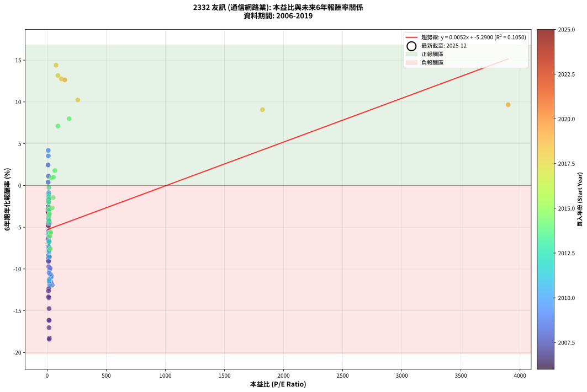
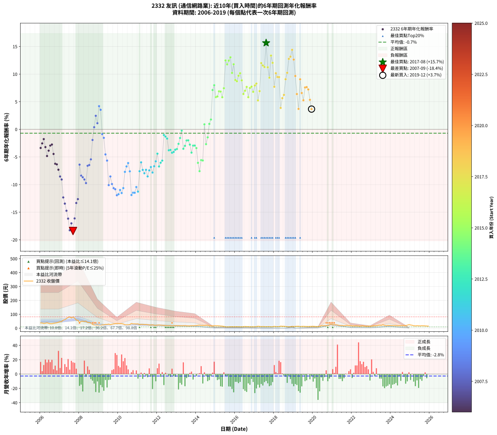

# 2332 友訊 - 本益比與未來報酬率分析

!!! info "報告資訊"
    - **股票代號**: 2332
    - **公司名稱**: 友訊
    - **產業別**: 通信網路業
    - **分析期間**: 2006-2019 (168 個數據點)
    - **資料來源**: Type 12 (ShowMonthlyK_ChartFlow) 月收盤價與本益比
    - **報酬率口徑**: 含現金股利 (簡化: 年度合計，假設每年7/1入帳)
    - **報告生成時間**: 2026-01-05 00:25:57 CST

## 📈 視覺化圖表

### 圖表1: 本益比 vs 未來報酬率關係

*圖表1：2332 友訊 本益比與6年期未來報酬率關係 (2006-2019)*

### 圖表2: 歷年買入時點的6年期實際報酬率

*圖表2：2332 友訊 歷年買入時點的6年期實際報酬率 (2006-2019)*

## 📍 買點訊號說明

本報告提供兩種買點提示訊號（顯示於圖表2的股價子圖中）：

### ▲ 小綠色三角形（回測驗證）
- **計算方式**: 使用全部歷史資料計算本益比第25百分位數
- **用途**: 事後驗證，顯示歷史上哪些時點確實為低估區
- **限制**: 當下無法判斷，僅供回測參考
- **特性**: 後見之明（Look-Ahead Bias）

### ▲ 小橘色三角形（即時訊號）
- **計算方式**: 使用截至當月的過去5年資料計算本益比第25百分位數
- **用途**: 實際投資決策，當時即可判斷
- **優勢**: 可操作性強，符合實務需求
- **特性**: 無後見之明，滾動窗口計算

!!! tip "如何使用兩種訊號"
    - **綠色▲** 幫助理解歷史估值機會，驗證策略有效性
    - **橘色▲** 可作為實際買進參考，但仍需搭配基本面分析
    - 兩種訊號重疊時，表示即時判斷與事後驗證一致，信心度較高
    - 僅有綠色▲時，表示當時無法判斷（需要未來資料才能確認）
    - 僅有橘色▲時，表示即時判斷為買點，但事後可能不是最佳時機

## 📊 估值分析摘要

| 指標 | 數值 |
|:---:|:---:|
| **目前本益比** (2019-12) | **nan 倍** |
| **歷史平均本益比** | 74.40 倍 |
| **估值水準** | 🟡 合理範圍 |
| **預期6年年化報酬率** | **+nan%** |
| **歷史平均報酬率** | -0.70% |
| **相關係數 (R²)** | 0.1050 |
| **趨勢線斜率** | 0.0052 |

!!! abstract "核心洞察"
    目前本益比接近歷史平均，預期報酬率符合長期趨勢

    根據歷史數據回測，2332 友訊 在目前本益比 **nan倍** 的估值水準下，
    預期未來6年年化報酬率約為 **+nan%**。

    **重要提醒**: 本分析基於歷史數據統計，實際報酬率會受到公司基本面變化、產業趨勢、
    總體經濟環境等多重因素影響。R² = 0.10 表示本益比可解釋約 10.5% 的報酬率變異。

## 📈 歷史估值統計

### 最佳買點 (最高報酬率)

| 項目 | 數值 |
|:---:|:---:|
| 起始時間 | 2017-08 |
| 當時本益比 | nan 倍 |
| 起始價格 | 10.9 元 |
| 6年後價格 | 25.1 元 |
| **6年年化報酬率** | **+15.65%** |

### 最差買點 (最低報酬率)

| 項目 | 數值 |
|:---:|:---:|
| 起始時間 | 2007-09 |
| 當時本益比 | 17.18 倍 |
| 起始價格 | 81.1 元 |
| 6年後價格 | 16.5 元 |
| **6年年化報酬率** | **-18.41%** |

## 🎯 投資啟示

### 本益比與報酬率關係

趨勢線方程式: **y = 0.0052x + -5.2900**

!!! info "弱相關或正相關"
    本益比與未來報酬率相關性較弱。這可能表示該股票的報酬率更多受到
    公司成長性、產業趨勢等因素影響，而非估值水準。**需綜合考量多項指標**。

### 估值區間建議

基於歷史數據分析:

- **🟢 低估區** (P/E < 59.5): 預期報酬率較高，可考慮增加持股
- **🟡 合理區** (P/E 59.5-89.3): 預期報酬率符合長期趨勢，正常持有
- **🔴 高估區** (P/E > 89.3): 預期報酬率較低，可考慮減碼或觀望

!!! danger "風險提示"
    - 過去表現不代表未來結果
    - 本分析假設公司基本面無重大結構性變化
    - 產業環境劇變可能使歷史規律失效
    - 應結合公司財報、產業趨勢、總體經濟等多重因素綜合判斷

!!! success "長期投資觀點"
    歷史數據顯示，在合理或低估的估值水準買入並長期持有，
    往往能獲得較佳的投資報酬。**耐心等待好價格**是價值投資的核心原則。

## 📊 數據品質

- **資料來源**: GoodInfo.tw Type 12 (ShowMonthlyK_ChartFlow)
- **資料頻率**: 月度收盤價與本益比
- **回測期間**: 2006-2019
- **數據點數量**: 168 個 (每個點代表一次6年期回測)

### 計算方法說明

1. **6年期年化報酬率**:
   - 對每個歷史時點，計算其後6年的實際投資報酬率
   - 期末價值(不含股利): 期末價格
   - 期末價值(含現金股利): 期末價格 + 持有期間內的現金股利合計 (簡化: 年度合計，假設每年7/1入帳)
   - 公式: 年化報酬率 = [(期末價值/期初價格)^(1/年數) - 1] × 100%

2. **本益比 (P/E Ratio)**:
   - 使用當時的月收盤價與EPS計算
   - 資料來源: Type 12 月度河流圖本益比數據

3. **趨勢線 (Linear Regression)**:
   - 使用最小平方法擬合線性趨勢線
   - R²值衡量本益比對報酬率的解釋能力

---

*本報告由 Stock Analysis System v1.9.0 自動生成*
*數據更新時間: 2026-01-05 00:25:57 CST*

## 📋 月度回測明細表

（每一列對應時間線圖中的一個買入點；可用來對照 SVG 圖上的每個點。）

| 買入月份 | 賣出月份 | 回測期限_年 | 實際持有年數 | 買入本益比_倍 | 買入收盤價_元 | 賣出收盤價_元 | 現金股利合計_元 | 總報酬率_pct | 年化報酬率_pct |
| --- | --- | --- | --- | --- | --- | --- | --- | --- | --- |
| 2006-01 | 2012-01 | 6 | 5.999 | 9.97 | 37.80 | 21.95 | 8.82 | -18.58 | -3.37 |
| 2006-02 | 2012-02 | 6 | 5.999 | 9.82 | 37.20 | 23.05 | 8.82 | -14.31 | -2.54 |
| 2006-03 | 2012-03 | 6 | 6.001 | 9.04 | 34.25 | 21.95 | 8.82 | -10.15 | -1.77 |
| 2006-04 | 2012-04 | 6 | 6.001 | 9.53 | 36.10 | 20.85 | 8.82 | -17.80 | -3.21 |
| 2006-05 | 2012-05 | 6 | 6.001 | 10.24 | 38.80 | 20.00 | 8.82 | -25.71 | -4.83 |
| 2006-06 | 2012-06 | 6 | 6.001 | 9.31 | 35.30 | 19.05 | 8.82 | -21.03 | -3.86 |
| 2006-07 | 2012-07 | 6 | 6.001 | 8.50 | 32.20 | 18.20 | 8.72 | -16.38 | -2.94 |
| 2006-08 | 2012-08 | 6 | 6.001 | 8.52 | 32.30 | 18.60 | 8.72 | -15.40 | -2.75 |
| 2006-09 | 2012-09 | 6 | 6.001 | 9.23 | 35.00 | 17.90 | 8.72 | -23.93 | -4.45 |
| 2006-10 | 2012-10 | 6 | 6.001 | 9.75 | 36.95 | 16.40 | 8.72 | -32.00 | -6.22 |
| 2006-11 | 2012-11 | 6 | 6.001 | 10.29 | 39.00 | 17.60 | 8.72 | -32.50 | -6.34 |
| 2006-12 | 2012-12 | 6 | 6.001 | 11.27 | 42.70 | 18.35 | 8.72 | -36.59 | -7.31 |
| 2007-01 | 2013-01 | 6 | 6.001 | 11.90 | 46.35 | 18.40 | 8.72 | -41.48 | -8.54 |
| 2007-02 | 2013-02 | 6 | 6.001 | 11.97 | 47.85 | 18.30 | 8.72 | -43.52 | -9.08 |
| 2007-03 | 2013-03 | 6 | 6.001 | 14.17 | 58.10 | 17.65 | 8.72 | -54.60 | -12.33 |
| 2007-04 | 2013-04 | 6 | 6.001 | 14.70 | 61.80 | 17.25 | 8.72 | -57.97 | -13.45 |
| 2007-05 | 2013-05 | 6 | 6.001 | 16.07 | 69.20 | 17.85 | 8.72 | -61.60 | -14.74 |
| 2007-06 | 2013-06 | 6 | 6.001 | 17.69 | 78.00 | 18.35 | 8.72 | -65.29 | -16.16 |
| 2007-07 | 2013-07 | 6 | 6.001 | 18.12 | 81.80 | 16.95 | 7.43 | -70.20 | -18.27 |
| 2007-08 | 2013-08 | 6 | 6.001 | 15.75 | 72.70 | 16.30 | 7.43 | -67.37 | -17.02 |
| 2007-09 | 2013-09 | 6 | 6.001 | 17.18 | 81.10 | 16.50 | 7.43 | -70.50 | -18.41 |
| 2007-10 | 2013-10 | 6 | 6.001 | 15.03 | 72.50 | 17.80 | 7.43 | -65.21 | -16.13 |
| 2007-11 | 2013-11 | 6 | 6.001 | 11.87 | 58.50 | 17.35 | 7.43 | -57.65 | -13.34 |
| 2007-12 | 2013-12 | 6 | 6.001 | 11.39 | 57.30 | 18.05 | 7.43 | -55.54 | -12.63 |
| 2008-01 | 2014-01 | 6 | 6.001 | 8.28 | 39.65 | 19.25 | 7.43 | -32.72 | -6.39 |
| 2008-02 | 2014-03 | 6 | 6.081 | 10.89 | 49.50 | 21.65 | 7.43 | -41.26 | -8.38 |
| 2008-03 | 2014-03 | 6 | 5.999 | 11.64 | 50.10 | 21.65 | 7.43 | -41.97 | -8.67 |
| 2008-04 | 2014-04 | 6 | 5.999 | 11.85 | 48.10 | 19.75 | 7.43 | -43.50 | -9.08 |
| 2008-05 | 2014-05 | 6 | 5.999 | 13.23 | 50.50 | 19.90 | 7.43 | -45.89 | -9.73 |
| 2008-06 | 2014-06 | 6 | 5.999 | 11.47 | 41.00 | 19.80 | 7.43 | -33.60 | -6.60 |
| 2008-07 | 2014-07 | 6 | 5.999 | 12.33 | 41.10 | 21.60 | 5.93 | -33.03 | -6.46 |
| 2008-08 | 2014-08 | 6 | 5.999 | 12.41 | 38.35 | 21.50 | 5.93 | -28.49 | -5.44 |
| 2008-09 | 2014-09 | 6 | 5.999 | 9.50 | 27.05 | 18.15 | 5.93 | -11.00 | -1.92 |
| 2008-10 | 2014-10 | 6 | 5.999 | 8.60 | 22.40 | 17.00 | 5.93 | +2.34 | +0.39 |
| 2008-11 | 2014-11 | 6 | 5.999 | 8.19 | 19.35 | 16.45 | 5.93 | +15.63 | +2.45 |
| 2008-12 | 2014-12 | 6 | 5.999 | 10.83 | 22.95 | 18.60 | 5.93 | +6.86 | +1.11 |
| 2009-01 | 2015-01 | 6 | 5.999 | 9.21 | 18.50 | 17.75 | 5.93 | +27.97 | +4.20 |
| 2009-02 | 2015-02 | 6 | 5.999 | 10.17 | 19.30 | 17.85 | 5.93 | +23.19 | +3.54 |
| 2009-03 | 2015-03 | 6 | 5.999 | 13.45 | 24.05 | 16.90 | 5.93 | -5.09 | -0.87 |
| 2009-04 | 2015-04 | 6 | 5.999 | 14.28 | 23.95 | 15.90 | 5.93 | -8.87 | -1.54 |
| 2009-05 | 2015-05 | 6 | 5.999 | 17.53 | 27.45 | 14.85 | 5.93 | -24.32 | -4.54 |
| 2009-06 | 2015-06 | 6 | 5.999 | 18.35 | 26.70 | 12.90 | 5.93 | -29.49 | -5.66 |
| 2009-07 | 2015-07 | 6 | 5.999 | 21.87 | 29.40 | 10.10 | 5.43 | -47.19 | -10.10 |
| 2009-08 | 2015-08 | 6 | 5.999 | 20.51 | 25.30 | 9.39 | 5.43 | -41.44 | -8.54 |
| 2009-09 | 2015-09 | 6 | 5.999 | 25.39 | 28.50 | 9.82 | 5.43 | -46.51 | -9.90 |
| 2009-10 | 2015-10 | 6 | 5.999 | 30.64 | 31.00 | 10.35 | 5.43 | -49.11 | -10.65 |
| 2009-11 | 2015-11 | 6 | 5.999 | 35.97 | 32.40 | 10.85 | 5.43 | -49.77 | -10.84 |
| 2009-12 | 2015-12 | 6 | 5.999 | 42.66 | 33.70 | 10.30 | 5.43 | -53.34 | -11.93 |
| 2010-01 | 2016-01 | 6 | 5.999 | 38.22 | 33.70 | 10.50 | 5.43 | -52.74 | -11.75 |
| 2010-02 | 2016-02 | 6 | 5.999 | 33.49 | 32.60 | 10.80 | 5.43 | -50.23 | -10.98 |
| 2010-03 | 2016-03 | 6 | 6.001 | 30.80 | 32.80 | 10.30 | 5.43 | -52.06 | -11.53 |
| 2010-04 | 2016-04 | 6 | 6.001 | 26.37 | 30.50 | 10.10 | 5.43 | -49.10 | -10.64 |
| 2010-05 | 2016-05 | 6 | 6.001 | 19.99 | 24.95 | 10.00 | 5.43 | -38.18 | -7.70 |
| 2010-06 | 2016-06 | 6 | 6.001 | 18.32 | 24.55 | 10.75 | 5.43 | -34.11 | -6.72 |
| 2010-07 | 2016-07 | 6 | 6.001 | 17.25 | 24.70 | 12.20 | 4.72 | -31.48 | -6.10 |
| 2010-08 | 2016-08 | 6 | 6.001 | 17.07 | 26.00 | 11.45 | 4.72 | -37.79 | -7.60 |
| 2010-09 | 2016-09 | 6 | 6.001 | 21.15 | 34.15 | 11.25 | 4.72 | -53.22 | -11.89 |
| 2010-10 | 2016-10 | 6 | 6.001 | 18.11 | 30.90 | 10.15 | 4.72 | -51.86 | -11.47 |
| 2010-11 | 2016-11 | 6 | 6.001 | 17.38 | 31.25 | 10.30 | 4.72 | -51.92 | -11.49 |
| 2010-12 | 2016-12 | 6 | 6.001 | 15.87 | 30.00 | 10.75 | 4.72 | -48.42 | -10.44 |
| 2011-01 | 2017-01 | 6 | 6.001 | 16.67 | 31.00 | 10.40 | 4.72 | -51.21 | -11.27 |
| 2011-02 | 2017-02 | 6 | 6.001 | 14.11 | 25.80 | 11.35 | 4.72 | -37.69 | -7.58 |
| 2011-03 | 2017-03 | 6 | 6.001 | 15.24 | 27.40 | 14.20 | 4.72 | -30.93 | -5.98 |
| 2011-04 | 2017-04 | 6 | 6.001 | 15.45 | 27.30 | 12.55 | 4.72 | -36.72 | -7.34 |
| 2011-05 | 2017-05 | 6 | 6.001 | 15.04 | 26.10 | 11.15 | 4.72 | -39.18 | -7.95 |
| 2011-06 | 2017-06 | 6 | 6.001 | 15.40 | 26.25 | 11.90 | 4.72 | -36.67 | -7.33 |
| 2011-07 | 2017-07 | 6 | 6.001 | 15.14 | 25.35 | 11.15 | 3.70 | -41.42 | -8.53 |
| 2011-08 | 2017-08 | 6 | 6.001 | 14.12 | 23.20 | 10.90 | 3.70 | -37.07 | -7.43 |
| 2011-09 | 2017-09 | 6 | 6.001 | 14.08 | 22.70 | 11.15 | 3.70 | -34.58 | -6.83 |
| 2011-10 | 2017-10 | 6 | 6.001 | 15.46 | 24.45 | 11.30 | 3.70 | -38.65 | -7.82 |
| 2011-11 | 2017-11 | 6 | 6.001 | 13.48 | 20.90 | 10.10 | 3.70 | -33.97 | -6.68 |
| 2011-12 | 2017-12 | 6 | 6.001 | 13.45 | 20.45 | 10.60 | 3.70 | -30.07 | -5.79 |
| 2012-01 | 2018-01 | 6 | 6.001 | 14.67 | 21.95 | 13.05 | 3.70 | -23.69 | -4.41 |
| 2012-02 | 2018-03 | 6 | 6.081 | 15.64 | 23.05 | 11.40 | 3.70 | -34.49 | -6.72 |
| 2012-03 | 2018-03 | 6 | 5.999 | 15.14 | 21.95 | 11.40 | 3.70 | -31.21 | -6.05 |
| 2012-04 | 2018-04 | 6 | 5.999 | 14.61 | 20.85 | 11.00 | 3.70 | -29.50 | -5.66 |
| 2012-05 | 2018-05 | 6 | 5.999 | 14.25 | 20.00 | 15.10 | 3.70 | -6.00 | -1.03 |
| 2012-06 | 2018-06 | 6 | 5.999 | 13.80 | 19.05 | 13.90 | 3.70 | -7.61 | -1.31 |
| 2012-07 | 2018-07 | 6 | 5.999 | 13.42 | 18.20 | 13.85 | 2.60 | -9.62 | -1.67 |
| 2012-08 | 2018-08 | 6 | 5.999 | 13.95 | 18.60 | 12.15 | 2.60 | -20.70 | -3.79 |
| 2012-09 | 2018-09 | 6 | 5.999 | 13.66 | 17.90 | 11.65 | 2.60 | -20.39 | -3.73 |
| 2012-10 | 2018-10 | 6 | 5.999 | 12.75 | 16.40 | 10.05 | 2.60 | -22.87 | -4.24 |
| 2012-11 | 2018-11 | 6 | 5.999 | 13.93 | 17.60 | 11.10 | 2.60 | -22.16 | -4.09 |
| 2012-12 | 2018-12 | 6 | 5.999 | 14.80 | 18.35 | 12.05 | 2.60 | -20.16 | -3.68 |
| 2013-01 | 2019-01 | 6 | 5.999 | 15.02 | 18.40 | 12.20 | 2.60 | -19.57 | -3.56 |
| 2013-02 | 2019-02 | 6 | 5.999 | 15.12 | 18.30 | 13.00 | 2.60 | -14.75 | -2.63 |
| 2013-03 | 2019-03 | 6 | 5.999 | 14.77 | 17.65 | 13.45 | 2.60 | -9.07 | -1.57 |
| 2013-04 | 2019-04 | 6 | 5.999 | 14.62 | 17.25 | 14.40 | 2.60 | -1.45 | -0.24 |
| 2013-05 | 2019-05 | 6 | 5.999 | 15.32 | 17.85 | 11.80 | 2.60 | -19.33 | -3.52 |
| 2013-06 | 2019-06 | 6 | 5.999 | 15.96 | 18.35 | 12.70 | 2.60 | -16.62 | -2.98 |
| 2013-07 | 2019-07 | 6 | 5.999 | 14.93 | 16.95 | 13.20 | 1.80 | -11.50 | -2.02 |
| 2013-08 | 2019-08 | 6 | 5.999 | 14.55 | 16.30 | 12.65 | 1.80 | -11.35 | -1.99 |
| 2013-09 | 2019-09 | 6 | 5.999 | 14.93 | 16.50 | 12.15 | 1.80 | -15.45 | -2.76 |
| 2013-10 | 2019-10 | 6 | 5.999 | 16.33 | 17.80 | 11.95 | 1.80 | -22.75 | -4.21 |
| 2013-11 | 2019-11 | 6 | 5.999 | 16.14 | 17.35 | 12.70 | 1.80 | -16.43 | -2.95 |
| 2013-12 | 2019-12 | 6 | 5.999 | 17.03 | 18.05 | 13.30 | 1.80 | -16.34 | -2.93 |
| 2014-01 | 2020-01 | 6 | 5.999 | 19.64 | 19.25 | 13.85 | 1.80 | -18.70 | -3.39 |
| 2014-02 | 2020-02 | 6 | 5.999 | 23.61 | 21.25 | 12.80 | 1.80 | -31.29 | -6.07 |
| 2014-03 | 2020-03 | 6 | 6.001 | 26.40 | 21.65 | 11.70 | 1.80 | -37.64 | -7.57 |
| 2014-04 | 2020-04 | 6 | 6.001 | 26.69 | 19.75 | 12.20 | 1.80 | -29.11 | -5.57 |
| 2014-05 | 2020-05 | 6 | 6.001 | 30.15 | 19.90 | 12.25 | 1.80 | -29.40 | -5.64 |
| 2014-06 | 2020-06 | 6 | 6.001 | 34.14 | 19.80 | 19.10 | 1.80 | +5.56 | +0.90 |
| 2014-07 | 2020-07 | 6 | 6.001 | 43.20 | 21.60 | 17.55 | 0.80 | -15.05 | -2.68 |
| 2014-08 | 2020-08 | 6 | 6.001 | 51.19 | 21.50 | 18.90 | 0.80 | -8.37 | -1.45 |
| 2014-09 | 2020-09 | 6 | 6.001 | 53.38 | 18.15 | 18.45 | 0.80 | +6.06 | +0.99 |
| 2014-10 | 2020-10 | 6 | 6.001 | 65.38 | 17.00 | 18.10 | 0.80 | +11.18 | +1.78 |
| 2014-11 | 2020-11 | 6 | 6.001 | 91.39 | 16.45 | 24.05 | 0.80 | +51.06 | +7.12 |
| 2014-12 | 2020-12 | 6 | 6.001 | 186.00 | 18.60 | 28.70 | 0.80 | +58.60 | +7.99 |
| 2015-01 | 2021-01 | 6 | 6.001 |  | 17.75 | 24.15 | 0.80 | +40.56 | +5.84 |
| 2015-02 | 2021-02 | 6 | 6.001 |  | 17.85 | 24.45 | 0.80 | +41.46 | +5.95 |
| 2015-03 | 2021-03 | 6 | 6.001 |  | 16.90 | 24.40 | 0.80 | +49.11 | +6.88 |
| 2015-04 | 2021-04 | 6 | 6.001 |  | 15.90 | 22.85 | 0.80 | +48.74 | +6.84 |
| 2015-05 | 2021-05 | 6 | 6.001 |  | 14.85 | 20.05 | 0.80 | +40.40 | +5.82 |
| 2015-06 | 2021-06 | 6 | 6.001 |  | 12.90 | 19.05 | 0.80 | +53.88 | +7.45 |
| 2015-07 | 2021-07 | 6 | 6.001 |  | 10.10 | 19.35 | 1.10 | +102.48 | +12.47 |
| 2015-08 | 2021-08 | 6 | 6.001 |  | 9.39 | 17.20 | 1.10 | +94.89 | +11.76 |
| 2015-09 | 2021-09 | 6 | 6.001 |  | 9.82 | 18.75 | 1.10 | +102.14 | +12.44 |
| 2015-10 | 2021-10 | 6 | 6.001 |  | 10.35 | 20.50 | 1.10 | +108.70 | +13.04 |
| 2015-11 | 2021-11 | 6 | 6.001 |  | 10.85 | 18.35 | 1.10 | +79.26 | +10.21 |
| 2015-12 | 2021-12 | 6 | 6.001 |  | 10.30 | 19.00 | 1.10 | +95.15 | +11.78 |
| 2016-01 | 2022-01 | 6 | 6.001 |  | 10.50 | 16.45 | 1.10 | +67.14 | +8.94 |
| 2016-02 | 2022-03 | 6 | 6.081 |  | 10.80 | 16.85 | 1.10 | +66.20 | +8.71 |
| 2016-03 | 2022-03 | 6 | 5.999 |  | 10.30 | 16.85 | 1.10 | +74.27 | +9.70 |
| 2016-04 | 2022-04 | 6 | 5.999 |  | 10.10 | 16.95 | 1.10 | +78.71 | +10.16 |
| 2016-05 | 2022-05 | 6 | 5.999 |  | 10.00 | 15.55 | 1.10 | +66.50 | +8.87 |
| 2016-06 | 2022-06 | 6 | 5.999 |  | 10.75 | 14.50 | 1.10 | +45.12 | +6.40 |
| 2016-07 | 2022-07 | 6 | 5.999 |  | 12.20 | 17.20 | 1.10 | +50.00 | +6.99 |
| 2016-08 | 2022-08 | 6 | 5.999 |  | 11.45 | 16.75 | 1.10 | +55.90 | +7.68 |
| 2016-09 | 2022-09 | 6 | 5.999 |  | 11.25 | 14.70 | 1.10 | +40.44 | +5.83 |
| 2016-10 | 2022-10 | 6 | 5.999 |  | 10.15 | 14.55 | 1.10 | +54.19 | +7.49 |
| 2016-11 | 2022-11 | 6 | 5.999 |  | 10.30 | 15.00 | 1.10 | +56.31 | +7.73 |
| 2016-12 | 2022-12 | 6 | 5.999 |  | 10.75 | 14.85 | 1.10 | +48.37 | +6.80 |
| 2017-01 | 2023-01 | 6 | 5.999 |  | 10.40 | 15.35 | 1.10 | +58.17 | +7.94 |
| 2017-02 | 2023-02 | 6 | 5.999 |  | 11.35 | 17.20 | 1.10 | +61.23 | +8.29 |
| 2017-03 | 2023-03 | 6 | 5.999 |  | 14.20 | 18.20 | 1.10 | +35.92 | +5.25 |
| 2017-04 | 2023-04 | 6 | 5.999 |  | 12.55 | 17.65 | 1.10 | +49.40 | +6.92 |
| 2017-05 | 2023-05 | 6 | 5.999 |  | 11.15 | 20.90 | 1.10 | +97.31 | +12.00 |
| 2017-06 | 2023-06 | 6 | 5.999 |  | 11.90 | 21.85 | 1.10 | +92.86 | +11.57 |
| 2017-07 | 2023-07 | 6 | 5.999 |  | 11.15 | 20.15 | 1.03 | +89.91 | +11.28 |
| 2017-08 | 2023-08 | 6 | 5.999 |  | 10.90 | 25.05 | 1.03 | +139.22 | +15.65 |
| 2017-09 | 2023-09 | 6 | 5.999 |  | 11.15 | 20.10 | 1.03 | +89.46 | +11.24 |
| 2017-10 | 2023-10 | 6 | 5.999 |  | 11.30 | 18.30 | 1.03 | +71.02 | +9.36 |
| 2017-11 | 2023-11 | 6 | 5.999 |  | 10.10 | 20.40 | 1.03 | +112.13 | +13.36 |
| 2017-12 | 2023-12 | 6 | 5.999 |  | 10.60 | 19.95 | 1.03 | +97.88 | +12.05 |
| 2018-01 | 2024-01 | 6 | 5.999 |  | 13.05 | 19.35 | 1.03 | +56.13 | +7.71 |
| 2018-02 | 2024-02 | 6 | 5.999 |  | 11.40 | 19.35 | 1.03 | +78.73 | +10.16 |
| 2018-03 | 2024-03 | 6 | 6.001 |  | 11.40 | 18.60 | 1.03 | +72.15 | +9.47 |
| 2018-04 | 2024-04 | 6 | 6.001 |  | 11.00 | 17.90 | 1.03 | +72.05 | +9.46 |
| 2018-05 | 2024-05 | 6 | 6.001 |  | 15.10 | 17.95 | 1.03 | +25.66 | +3.88 |
| 2018-06 | 2024-06 | 6 | 6.001 |  | 13.90 | 18.30 | 1.03 | +39.03 | +5.64 |
| 2018-07 | 2024-07 | 6 | 6.001 |  | 13.85 | 18.35 | 1.56 | +43.76 | +6.24 |
| 2018-08 | 2024-08 | 6 | 6.001 | 1822.00 | 12.15 | 18.90 | 1.56 | +68.40 | +9.07 |
| 2018-09 | 2024-09 | 6 | 6.001 | 258.90 | 11.65 | 19.35 | 1.56 | +79.49 | +10.24 |
| 2018-10 | 2024-10 | 6 | 6.001 | 120.60 | 10.05 | 19.10 | 1.56 | +105.58 | +12.76 |
| 2018-11 | 2024-11 | 6 | 6.001 | 91.23 | 11.10 | 21.75 | 1.56 | +110.01 | +13.16 |
| 2018-12 | 2024-12 | 6 | 6.001 | 75.31 | 12.05 | 25.45 | 1.56 | +124.16 | +14.40 |
| 2019-01 | 2025-01 | 6 | 6.001 | 149.40 | 12.20 | 23.35 | 1.56 | +104.19 | +12.63 |
| 2019-02 | 2025-02 | 6 | 6.001 | 3900.00 | 13.00 | 21.05 | 1.56 | +73.93 | +9.66 |
| 2019-03 | 2025-03 | 6 | 6.001 |  | 13.45 | 17.95 | 1.56 | +45.06 | +6.39 |
| 2019-04 | 2025-04 | 6 | 6.001 |  | 14.40 | 16.35 | 1.56 | +24.38 | +3.70 |
| 2019-05 | 2025-05 | 6 | 6.001 |  | 11.80 | 18.30 | 1.56 | +68.31 | +9.06 |
| 2019-06 | 2025-06 | 6 | 6.001 |  | 12.70 | 17.05 | 1.56 | +46.54 | +6.57 |
| 2019-07 | 2025-07 | 6 | 6.001 |  | 13.20 | 16.50 | 1.46 | +36.07 | +5.27 |
| 2019-08 | 2025-08 | 6 | 6.001 |  | 12.65 | 18.15 | 1.46 | +55.03 | +7.58 |
| 2019-09 | 2025-09 | 6 | 6.001 |  | 12.15 | 17.45 | 1.46 | +55.65 | +7.65 |
| 2019-10 | 2025-10 | 6 | 6.001 |  | 11.95 | 16.70 | 1.46 | +51.97 | +7.22 |
| 2019-11 | 2025-11 | 6 | 6.001 |  | 12.70 | 15.90 | 1.46 | +36.70 | +5.35 |
| 2019-12 | 2025-12 | 6 | 6.001 |  | 13.30 | 15.05 | 1.46 | +24.14 | +3.67 |
