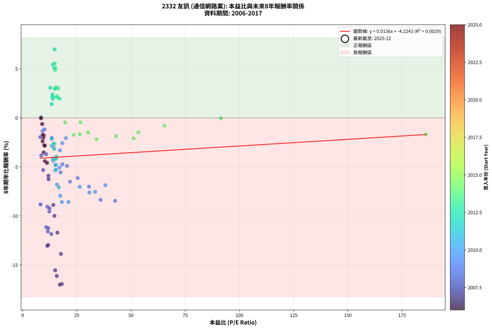
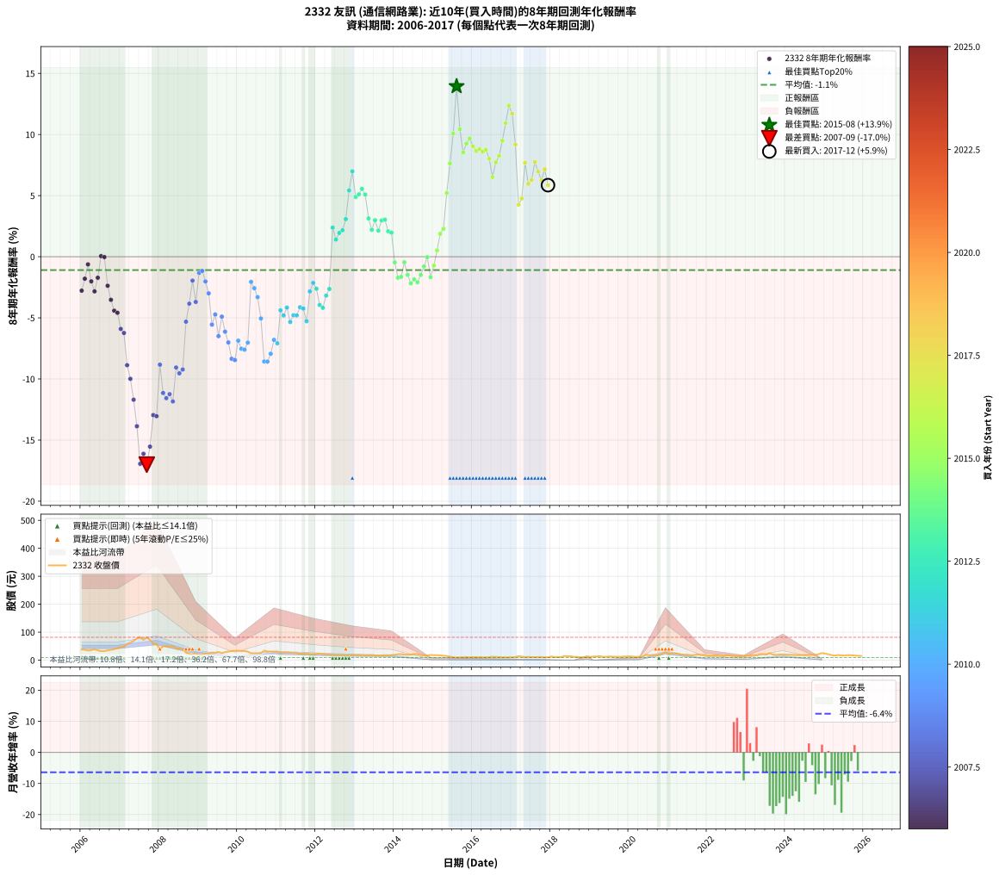

# 2332 友訊 - 本益比與未來報酬率分析

!!! info "報告資訊"
    - **股票代號**: 2332
    - **公司名稱**: 友訊
    - **產業別**: 通信網路業
    - **分析期間**: 2006-2017 (144 個數據點)
    - **資料來源**: Type 12 (ShowMonthlyK_ChartFlow) 月收盤價與本益比
    - **報酬率口徑**: 含現金股利 (簡化: 年度合計，假設每年7/1入帳)
    - **報告生成時間**: 2026-01-11 20:35:33 CST

## 📈 視覺化圖表

### 圖表1: 本益比 vs 未來報酬率關係

*圖表1：2332 友訊 本益比與8年期未來報酬率關係 (2006-2017)*

### 圖表2: 歷年買入時點的8年期實際報酬率

*圖表2：2332 友訊 歷年買入時點的8年期實際報酬率 (2006-2017)*

## 📍 買點訊號說明

本報告提供兩種買點提示訊號（顯示於圖表2的股價子圖中）：

### ▲ 小綠色三角形（回測驗證）
- **計算方式**: 使用全部歷史資料計算本益比第25百分位數
- **用途**: 事後驗證，顯示歷史上哪些時點確實為低估區
- **限制**: 當下無法判斷，僅供回測參考
- **特性**: 後見之明（Look-Ahead Bias）

### ▲ 小橘色三角形（即時訊號）
- **計算方式**: 使用截至當月的過去5年資料計算本益比第25百分位數
- **用途**: 實際投資決策，當時即可判斷
- **優勢**: 可操作性強，符合實務需求
- **特性**: 無後見之明，滾動窗口計算

!!! tip "如何使用兩種訊號"
    - **綠色▲** 幫助理解歷史估值機會，驗證策略有效性
    - **橘色▲** 可作為實際買進參考，但仍需搭配基本面分析
    - 兩種訊號重疊時，表示即時判斷與事後驗證一致，信心度較高
    - 僅有綠色▲時，表示當時無法判斷（需要未來資料才能確認）
    - 僅有橘色▲時，表示即時判斷為買點，但事後可能不是最佳時機

## 📊 估值分析摘要

| 指標 | 數值 |
|:---:|:---:|
| **目前本益比** (2017-12) | **nan 倍** |
| **歷史平均本益比** | 19.80 倍 |
| **估值水準** | 🟡 合理範圍 |
| **預期8年年化報酬率** | **+nan%** |
| **歷史平均報酬率** | -1.09% |
| **相關係數 (R²)** | 0.0029 |
| **趨勢線斜率** | 0.0136 |

!!! abstract "核心洞察"
    目前本益比接近歷史平均，預期報酬率符合長期趨勢

    根據歷史數據回測，2332 友訊 在目前本益比 **nan倍** 的估值水準下，
    預期未來8年年化報酬率約為 **+nan%**。

    **重要提醒**: 本分析基於歷史數據統計，實際報酬率會受到公司基本面變化、產業趨勢、
    總體經濟環境等多重因素影響。R² = 0.00 表示本益比可解釋約 0.3% 的報酬率變異。

## 📈 歷史估值統計

### 最佳買點 (最高報酬率)

| 項目 | 數值 |
|:---:|:---:|
| 起始時間 | 2015-08 |
| 當時本益比 | nan 倍 |
| 起始價格 | 9.4 元 |
| 8年後價格 | 25.1 元 |
| **8年年化報酬率** | **+13.94%** |

### 最差買點 (最低報酬率)

| 項目 | 數值 |
|:---:|:---:|
| 起始時間 | 2007-09 |
| 當時本益比 | 17.18 倍 |
| 起始價格 | 81.1 元 |
| 8年後價格 | 9.8 元 |
| **8年年化報酬率** | **-17.01%** |

## 🎯 投資啟示

### 本益比與報酬率關係

趨勢線方程式: **y = 0.0136x + -4.2243**

!!! info "弱相關或正相關"
    本益比與未來報酬率相關性較弱。這可能表示該股票的報酬率更多受到
    公司成長性、產業趨勢等因素影響，而非估值水準。**需綜合考量多項指標**。

### 估值區間建議

基於歷史數據分析:

- **🟢 低估區** (P/E < 15.8): 預期報酬率較高，可考慮增加持股
- **🟡 合理區** (P/E 15.8-23.8): 預期報酬率符合長期趨勢，正常持有
- **🔴 高估區** (P/E > 23.8): 預期報酬率較低，可考慮減碼或觀望

!!! danger "風險提示"
    - 過去表現不代表未來結果
    - 本分析假設公司基本面無重大結構性變化
    - 產業環境劇變可能使歷史規律失效
    - 應結合公司財報、產業趨勢、總體經濟等多重因素綜合判斷

!!! success "長期投資觀點"
    歷史數據顯示，在合理或低估的估值水準買入並長期持有，
    往往能獲得較佳的投資報酬。**耐心等待好價格**是價值投資的核心原則。

## 📊 數據品質

- **資料來源**: GoodInfo.tw Type 12 (ShowMonthlyK_ChartFlow)
- **資料頻率**: 月度收盤價與本益比
- **回測期間**: 2006-2017
- **數據點數量**: 144 個 (每個點代表一次8年期回測)

### 計算方法說明

1. **8年期年化報酬率**:
   - 對每個歷史時點，計算其後8年的實際投資報酬率
   - 期末價值(不含股利): 期末價格
   - 期末價值(含現金股利): 期末價格 + 持有期間內的現金股利合計 (簡化: 年度合計，假設每年7/1入帳)
   - 公式: 年化報酬率 = [(期末價值/期初價格)^(1/年數) - 1] × 100%

2. **本益比 (P/E Ratio)**:
   - 使用當時的月收盤價與EPS計算
   - 資料來源: Type 12 月度河流圖本益比數據

3. **趨勢線 (Linear Regression)**:
   - 使用最小平方法擬合線性趨勢線
   - R²值衡量本益比對報酬率的解釋能力

---

*本報告由 Stock Analysis System v1.9.0 自動生成*
*數據更新時間: 2026-01-11 20:35:33 CST*

## 📋 月度回測明細表

（每一列對應時間線圖中的一個買入點；可用來對照 SVG 圖上的每個點。）

| 買入月份 | 賣出月份 | 回測期限_年 | 實際持有年數 | 買入本益比_倍 | 買入收盤價_元 | 賣出收盤價_元 | 現金股利合計_元 | 總報酬率_pct | 年化報酬率_pct |
| --- | --- | --- | --- | --- | --- | --- | --- | --- | --- |
| 2006-01 | 2014-01 | 8 | 8.000 | 9.97 | 37.80 | 19.25 | 10.93 | -20.17 | -2.78 |
| 2006-02 | 2014-02 | 8 | 8.000 | 9.82 | 37.20 | 21.25 | 10.93 | -13.51 | -1.80 |
| 2006-03 | 2014-03 | 8 | 8.000 | 9.04 | 34.25 | 21.65 | 10.93 | -4.89 | -0.62 |
| 2006-04 | 2014-04 | 8 | 8.000 | 9.53 | 36.10 | 19.75 | 10.93 | -15.03 | -2.01 |
| 2006-05 | 2014-05 | 8 | 8.000 | 10.24 | 38.80 | 19.90 | 10.93 | -20.55 | -2.84 |
| 2006-06 | 2014-06 | 8 | 8.000 | 9.31 | 35.30 | 19.80 | 10.93 | -12.96 | -1.72 |
| 2006-07 | 2014-07 | 8 | 8.000 | 8.50 | 32.20 | 21.60 | 10.72 | +0.39 | +0.05 |
| 2006-08 | 2014-08 | 8 | 8.000 | 8.52 | 32.30 | 21.50 | 10.72 | -0.23 | -0.03 |
| 2006-09 | 2014-09 | 8 | 8.000 | 9.23 | 35.00 | 18.15 | 10.72 | -17.50 | -2.38 |
| 2006-10 | 2014-10 | 8 | 8.000 | 9.75 | 36.95 | 17.00 | 10.72 | -24.97 | -3.53 |
| 2006-11 | 2014-11 | 8 | 8.000 | 10.29 | 39.00 | 16.45 | 10.72 | -30.32 | -4.42 |
| 2006-12 | 2014-12 | 8 | 8.000 | 11.27 | 42.70 | 18.60 | 10.72 | -31.32 | -4.59 |
| 2007-01 | 2015-01 | 8 | 8.000 | 11.90 | 46.35 | 17.75 | 10.72 | -38.57 | -5.91 |
| 2007-02 | 2015-02 | 8 | 8.000 | 11.97 | 47.85 | 17.85 | 10.72 | -40.28 | -6.24 |
| 2007-03 | 2015-03 | 8 | 8.000 | 14.17 | 58.10 | 16.90 | 10.72 | -52.45 | -8.87 |
| 2007-04 | 2015-04 | 8 | 8.000 | 14.70 | 61.80 | 15.90 | 10.72 | -56.92 | -9.99 |
| 2007-05 | 2015-05 | 8 | 8.000 | 16.07 | 69.20 | 14.85 | 10.72 | -63.04 | -11.70 |
| 2007-06 | 2015-06 | 8 | 8.000 | 17.69 | 78.00 | 12.90 | 10.72 | -69.71 | -13.87 |
| 2007-07 | 2015-07 | 8 | 8.000 | 18.12 | 81.80 | 10.10 | 8.43 | -77.35 | -16.94 |
| 2007-08 | 2015-08 | 8 | 8.000 | 15.75 | 72.70 | 9.39 | 8.43 | -75.50 | -16.12 |
| 2007-09 | 2015-09 | 8 | 8.000 | 17.18 | 81.10 | 9.82 | 8.43 | -77.50 | -17.01 |
| 2007-10 | 2015-10 | 8 | 8.000 | 15.03 | 72.50 | 10.35 | 8.43 | -74.10 | -15.54 |
| 2007-11 | 2015-11 | 8 | 8.000 | 11.87 | 58.50 | 10.85 | 8.43 | -67.05 | -12.96 |
| 2007-12 | 2015-12 | 8 | 8.000 | 11.39 | 57.30 | 10.30 | 8.43 | -67.32 | -13.05 |
| 2008-01 | 2016-01 | 8 | 8.000 | 8.28 | 39.65 | 10.50 | 8.43 | -52.27 | -8.83 |
| 2008-02 | 2016-02 | 8 | 8.000 | 10.89 | 49.50 | 10.80 | 8.43 | -61.16 | -11.15 |
| 2008-03 | 2016-03 | 8 | 8.000 | 11.64 | 50.10 | 10.30 | 8.43 | -62.62 | -11.58 |
| 2008-04 | 2016-04 | 8 | 8.000 | 11.85 | 48.10 | 10.10 | 8.43 | -61.49 | -11.24 |
| 2008-05 | 2016-05 | 8 | 8.000 | 13.23 | 50.50 | 10.00 | 8.43 | -63.51 | -11.84 |
| 2008-06 | 2016-06 | 8 | 8.000 | 11.47 | 41.00 | 10.75 | 8.43 | -53.23 | -9.06 |
| 2008-07 | 2016-07 | 8 | 8.000 | 12.33 | 41.10 | 12.20 | 6.22 | -55.17 | -9.54 |
| 2008-08 | 2016-08 | 8 | 8.000 | 12.41 | 38.35 | 11.45 | 6.22 | -53.91 | -9.23 |
| 2008-09 | 2016-09 | 8 | 8.000 | 9.50 | 27.05 | 11.25 | 6.22 | -35.40 | -5.31 |
| 2008-10 | 2016-10 | 8 | 8.000 | 8.60 | 22.40 | 10.15 | 6.22 | -26.90 | -3.84 |
| 2008-11 | 2016-11 | 8 | 8.000 | 8.19 | 19.35 | 10.30 | 6.22 | -14.60 | -1.95 |
| 2008-12 | 2016-12 | 8 | 8.000 | 10.83 | 22.95 | 10.75 | 6.22 | -26.03 | -3.70 |
| 2009-01 | 2017-01 | 8 | 8.000 | 9.21 | 18.50 | 10.40 | 6.22 | -10.14 | -1.33 |
| 2009-02 | 2017-02 | 8 | 8.000 | 10.17 | 19.30 | 11.35 | 6.22 | -8.94 | -1.16 |
| 2009-03 | 2017-03 | 8 | 8.000 | 13.45 | 24.05 | 14.20 | 6.22 | -15.07 | -2.02 |
| 2009-04 | 2017-04 | 8 | 8.000 | 14.28 | 23.95 | 12.55 | 6.22 | -21.61 | -3.00 |
| 2009-05 | 2017-05 | 8 | 8.000 | 17.53 | 27.45 | 11.15 | 6.22 | -36.70 | -5.56 |
| 2009-06 | 2017-06 | 8 | 8.000 | 18.35 | 26.70 | 11.90 | 6.22 | -32.12 | -4.73 |
| 2009-07 | 2017-07 | 8 | 8.000 | 21.87 | 29.40 | 11.15 | 6.03 | -41.58 | -6.50 |
| 2009-08 | 2017-08 | 8 | 8.000 | 20.51 | 25.30 | 10.90 | 6.03 | -33.10 | -4.90 |
| 2009-09 | 2017-09 | 8 | 8.000 | 25.39 | 28.50 | 11.15 | 6.03 | -39.74 | -6.13 |
| 2009-10 | 2017-10 | 8 | 8.000 | 30.64 | 31.00 | 11.30 | 6.03 | -44.11 | -7.01 |
| 2009-11 | 2017-11 | 8 | 8.000 | 35.97 | 32.40 | 10.10 | 6.03 | -50.23 | -8.35 |
| 2009-12 | 2017-12 | 8 | 8.000 | 42.66 | 33.70 | 10.60 | 6.03 | -50.67 | -8.45 |
| 2010-01 | 2018-01 | 8 | 8.000 | 38.22 | 33.70 | 13.05 | 6.03 | -43.40 | -6.87 |
| 2010-02 | 2018-02 | 8 | 8.000 | 33.49 | 32.60 | 11.40 | 6.03 | -46.55 | -7.53 |
| 2010-03 | 2018-03 | 8 | 8.000 | 30.80 | 32.80 | 11.40 | 6.03 | -46.87 | -7.60 |
| 2010-04 | 2018-04 | 8 | 8.000 | 26.37 | 30.50 | 11.00 | 6.03 | -44.18 | -7.03 |
| 2010-05 | 2018-05 | 8 | 8.000 | 19.99 | 24.95 | 15.10 | 6.03 | -15.33 | -2.06 |
| 2010-06 | 2018-06 | 8 | 8.000 | 18.32 | 24.55 | 13.90 | 6.03 | -18.84 | -2.58 |
| 2010-07 | 2018-07 | 8 | 8.000 | 17.25 | 24.70 | 13.85 | 5.02 | -23.58 | -3.31 |
| 2010-08 | 2018-08 | 8 | 8.000 | 17.07 | 26.00 | 12.15 | 5.02 | -33.94 | -5.05 |
| 2010-09 | 2018-09 | 8 | 8.000 | 21.15 | 34.15 | 11.65 | 5.02 | -51.17 | -8.57 |
| 2010-10 | 2018-10 | 8 | 8.000 | 18.11 | 30.90 | 10.05 | 5.02 | -51.21 | -8.58 |
| 2010-11 | 2018-11 | 8 | 8.000 | 17.38 | 31.25 | 11.10 | 5.02 | -48.40 | -7.94 |
| 2010-12 | 2018-12 | 8 | 8.000 | 15.87 | 30.00 | 12.05 | 5.02 | -43.08 | -6.80 |
| 2011-01 | 2019-01 | 8 | 8.000 | 16.67 | 31.00 | 12.20 | 5.02 | -44.44 | -7.08 |
| 2011-02 | 2019-02 | 8 | 8.000 | 14.11 | 25.80 | 13.00 | 5.02 | -30.14 | -4.38 |
| 2011-03 | 2019-03 | 8 | 8.000 | 15.24 | 27.40 | 13.45 | 5.02 | -32.57 | -4.81 |
| 2011-04 | 2019-04 | 8 | 8.000 | 15.45 | 27.30 | 14.40 | 5.02 | -28.85 | -4.16 |
| 2011-05 | 2019-05 | 8 | 8.000 | 15.04 | 26.10 | 11.80 | 5.02 | -35.54 | -5.34 |
| 2011-06 | 2019-06 | 8 | 8.000 | 15.40 | 26.25 | 12.70 | 5.02 | -32.48 | -4.79 |
| 2011-07 | 2019-07 | 8 | 8.000 | 15.14 | 25.35 | 13.20 | 3.90 | -32.54 | -4.80 |
| 2011-08 | 2019-08 | 8 | 8.000 | 14.12 | 23.20 | 12.65 | 3.90 | -28.66 | -4.13 |
| 2011-09 | 2019-09 | 8 | 8.000 | 14.08 | 22.70 | 12.15 | 3.90 | -29.30 | -4.24 |
| 2011-10 | 2019-10 | 8 | 8.000 | 15.46 | 24.45 | 11.95 | 3.90 | -35.17 | -5.27 |
| 2011-11 | 2019-11 | 8 | 8.000 | 13.48 | 20.90 | 12.70 | 3.90 | -20.57 | -2.84 |
| 2011-12 | 2019-12 | 8 | 8.000 | 13.45 | 20.45 | 13.30 | 3.90 | -15.89 | -2.14 |
| 2012-01 | 2020-01 | 8 | 8.000 | 14.67 | 21.95 | 13.85 | 3.90 | -19.13 | -2.62 |
| 2012-02 | 2020-02 | 8 | 8.000 | 15.64 | 23.05 | 12.80 | 3.90 | -27.55 | -3.95 |
| 2012-03 | 2020-03 | 8 | 8.000 | 15.14 | 21.95 | 11.70 | 3.90 | -28.93 | -4.18 |
| 2012-04 | 2020-04 | 8 | 8.000 | 14.61 | 20.85 | 12.20 | 3.90 | -22.78 | -3.18 |
| 2012-05 | 2020-05 | 8 | 8.000 | 14.25 | 20.00 | 12.25 | 3.90 | -19.25 | -2.64 |
| 2012-06 | 2020-06 | 8 | 8.000 | 13.80 | 19.05 | 19.10 | 3.90 | +20.73 | +2.38 |
| 2012-07 | 2020-07 | 8 | 8.000 | 13.42 | 18.20 | 17.55 | 2.80 | +11.81 | +1.41 |
| 2012-08 | 2020-08 | 8 | 8.000 | 13.95 | 18.60 | 18.90 | 2.80 | +16.67 | +1.95 |
| 2012-09 | 2020-09 | 8 | 8.000 | 13.66 | 17.90 | 18.45 | 2.80 | +18.72 | +2.17 |
| 2012-10 | 2020-10 | 8 | 8.000 | 12.75 | 16.40 | 18.10 | 2.80 | +27.44 | +3.08 |
| 2012-11 | 2020-11 | 8 | 8.000 | 13.93 | 17.60 | 24.05 | 2.80 | +52.56 | +5.42 |
| 2012-12 | 2020-12 | 8 | 8.000 | 14.80 | 18.35 | 28.70 | 2.80 | +71.66 | +6.99 |
| 2013-01 | 2021-01 | 8 | 8.000 | 15.02 | 18.40 | 24.15 | 2.80 | +46.47 | +4.89 |
| 2013-02 | 2021-02 | 8 | 8.000 | 15.12 | 18.30 | 24.45 | 2.80 | +48.91 | +5.10 |
| 2013-03 | 2021-03 | 8 | 8.000 | 14.77 | 17.65 | 24.40 | 2.80 | +54.11 | +5.55 |
| 2013-04 | 2021-04 | 8 | 8.000 | 14.62 | 17.25 | 22.85 | 2.80 | +48.70 | +5.08 |
| 2013-05 | 2021-05 | 8 | 8.000 | 15.32 | 17.85 | 20.05 | 2.80 | +28.01 | +3.13 |
| 2013-06 | 2021-06 | 8 | 8.000 | 15.96 | 18.35 | 19.05 | 2.80 | +19.07 | +2.21 |
| 2013-07 | 2021-07 | 8 | 8.000 | 14.93 | 16.95 | 19.35 | 2.10 | +26.55 | +2.99 |
| 2013-08 | 2021-08 | 8 | 8.000 | 14.55 | 16.30 | 17.20 | 2.10 | +18.40 | +2.13 |
| 2013-09 | 2021-09 | 8 | 8.000 | 14.93 | 16.50 | 18.75 | 2.10 | +26.36 | +2.97 |
| 2013-10 | 2021-10 | 8 | 8.000 | 16.33 | 17.80 | 20.50 | 2.10 | +26.97 | +3.03 |
| 2013-11 | 2021-11 | 8 | 8.000 | 16.14 | 17.35 | 18.35 | 2.10 | +17.87 | +2.08 |
| 2013-12 | 2021-12 | 8 | 8.000 | 17.03 | 18.05 | 19.00 | 2.10 | +16.90 | +1.97 |
| 2014-01 | 2022-01 | 8 | 8.000 | 19.64 | 19.25 | 16.45 | 2.10 | -3.64 | -0.46 |
| 2014-02 | 2022-02 | 8 | 8.000 | 23.61 | 21.25 | 16.40 | 2.10 | -12.94 | -1.72 |
| 2014-03 | 2022-03 | 8 | 8.000 | 26.40 | 21.65 | 16.85 | 2.10 | -12.47 | -1.65 |
| 2014-04 | 2022-04 | 8 | 8.000 | 26.69 | 19.75 | 16.95 | 2.10 | -3.54 | -0.45 |
| 2014-05 | 2022-05 | 8 | 8.000 | 30.15 | 19.90 | 15.55 | 2.10 | -11.31 | -1.49 |
| 2014-06 | 2022-06 | 8 | 8.000 | 34.14 | 19.80 | 14.50 | 2.10 | -16.16 | -2.18 |
| 2014-07 | 2022-07 | 8 | 8.000 | 43.20 | 21.60 | 17.20 | 1.40 | -13.89 | -1.85 |
| 2014-08 | 2022-08 | 8 | 8.000 | 51.19 | 21.50 | 16.75 | 1.40 | -15.58 | -2.10 |
| 2014-09 | 2022-09 | 8 | 8.000 | 53.38 | 18.15 | 14.70 | 1.40 | -11.29 | -1.49 |
| 2014-10 | 2022-10 | 8 | 8.000 | 65.38 | 17.00 | 14.55 | 1.40 | -6.18 | -0.79 |
| 2014-11 | 2022-11 | 8 | 8.000 | 91.39 | 16.45 | 15.00 | 1.40 | -0.30 | -0.04 |
| 2014-12 | 2022-12 | 8 | 8.000 | 186.00 | 18.60 | 14.85 | 1.40 | -12.63 | -1.67 |
| 2015-01 | 2023-01 | 8 | 8.000 |  | 17.75 | 15.35 | 1.40 | -5.63 | -0.72 |
| 2015-02 | 2023-02 | 8 | 8.000 |  | 17.85 | 17.20 | 1.40 | +4.20 | +0.52 |
| 2015-03 | 2023-03 | 8 | 8.000 |  | 16.90 | 18.20 | 1.40 | +15.98 | +1.87 |
| 2015-04 | 2023-04 | 8 | 8.000 |  | 15.90 | 17.65 | 1.40 | +19.81 | +2.29 |
| 2015-05 | 2023-05 | 8 | 8.000 |  | 14.85 | 20.90 | 1.40 | +50.17 | +5.21 |
| 2015-06 | 2023-06 | 8 | 8.000 |  | 12.90 | 21.85 | 1.40 | +80.23 | +7.64 |
| 2015-07 | 2023-07 | 8 | 8.000 |  | 10.10 | 20.15 | 1.62 | +115.59 | +10.08 |
| 2015-08 | 2023-08 | 8 | 8.000 |  | 9.39 | 25.05 | 1.62 | +184.08 | +13.94 |
| 2015-09 | 2023-09 | 8 | 8.000 |  | 9.82 | 20.10 | 1.62 | +121.23 | +10.43 |
| 2015-10 | 2023-10 | 8 | 8.000 |  | 10.35 | 18.30 | 1.62 | +92.51 | +8.53 |
| 2015-11 | 2023-11 | 8 | 8.000 |  | 10.85 | 20.40 | 1.62 | +103.00 | +9.25 |
| 2015-12 | 2023-12 | 8 | 8.000 |  | 10.30 | 19.95 | 1.62 | +109.47 | +9.68 |
| 2016-01 | 2024-01 | 8 | 8.000 |  | 10.50 | 19.35 | 1.62 | +99.76 | +9.03 |
| 2016-02 | 2024-02 | 8 | 8.000 |  | 10.80 | 19.35 | 1.62 | +94.21 | +8.65 |
| 2016-03 | 2024-03 | 8 | 8.000 |  | 10.30 | 18.60 | 1.62 | +96.36 | +8.80 |
| 2016-04 | 2024-04 | 8 | 8.000 |  | 10.10 | 17.90 | 1.62 | +93.32 | +8.59 |
| 2016-05 | 2024-05 | 8 | 8.000 |  | 10.00 | 17.95 | 1.62 | +95.75 | +8.76 |
| 2016-06 | 2024-06 | 8 | 8.000 |  | 10.75 | 18.30 | 1.62 | +85.35 | +8.02 |
| 2016-07 | 2024-07 | 8 | 8.000 |  | 12.20 | 18.35 | 1.86 | +65.66 | +6.51 |
| 2016-08 | 2024-08 | 8 | 8.000 |  | 11.45 | 18.90 | 1.86 | +81.32 | +7.72 |
| 2016-09 | 2024-09 | 8 | 8.000 |  | 11.25 | 19.35 | 1.86 | +88.54 | +8.25 |
| 2016-10 | 2024-10 | 8 | 8.000 |  | 10.15 | 19.10 | 1.86 | +106.51 | +9.49 |
| 2016-11 | 2024-11 | 8 | 8.000 |  | 10.30 | 21.75 | 1.86 | +129.23 | +10.93 |
| 2016-12 | 2024-12 | 8 | 8.000 |  | 10.75 | 25.45 | 1.86 | +154.06 | +12.36 |
| 2017-01 | 2025-01 | 8 | 8.000 |  | 10.40 | 23.35 | 1.86 | +142.41 | +11.70 |
| 2017-02 | 2025-02 | 8 | 8.000 |  | 11.35 | 21.05 | 1.86 | +101.86 | +9.18 |
| 2017-03 | 2025-03 | 8 | 8.000 |  | 14.20 | 17.95 | 1.86 | +39.51 | +4.25 |
| 2017-04 | 2025-04 | 8 | 8.000 |  | 12.55 | 16.35 | 1.86 | +45.11 | +4.76 |
| 2017-05 | 2025-05 | 8 | 8.000 |  | 11.15 | 18.30 | 1.86 | +80.82 | +7.68 |
| 2017-06 | 2025-06 | 8 | 8.000 |  | 11.90 | 17.05 | 1.86 | +58.92 | +5.96 |
| 2017-07 | 2025-07 | 8 | 8.000 |  | 11.15 | 16.50 | 1.66 | +62.88 | +6.29 |
| 2017-08 | 2025-08 | 8 | 8.000 |  | 10.90 | 18.15 | 1.66 | +81.75 | +7.75 |
| 2017-09 | 2025-09 | 8 | 8.000 |  | 11.15 | 17.45 | 1.66 | +71.40 | +6.97 |
| 2017-10 | 2025-10 | 8 | 8.000 |  | 11.30 | 16.70 | 1.66 | +62.49 | +6.26 |
| 2017-11 | 2025-11 | 8 | 8.000 |  | 10.10 | 15.90 | 1.66 | +73.87 | +7.16 |
| 2017-12 | 2025-12 | 8 | 8.000 |  | 10.60 | 15.05 | 1.66 | +57.65 | +5.86 |
