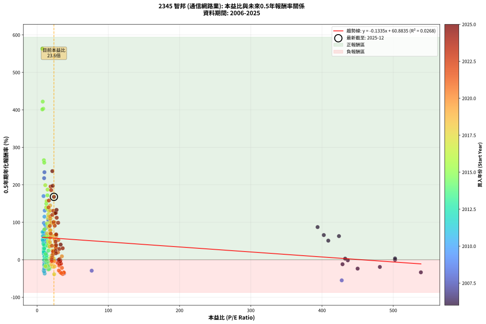
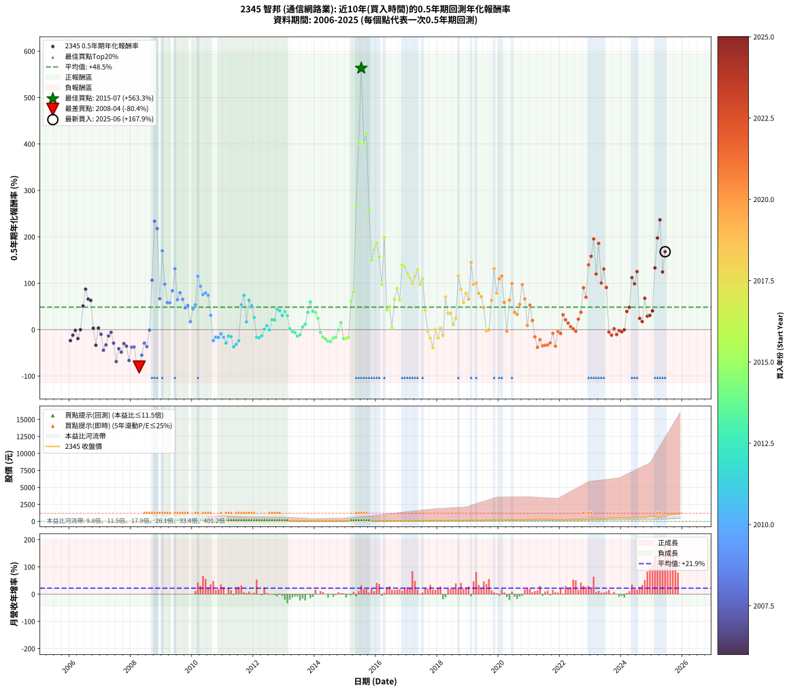

# 2345 智邦 - 本益比與未來報酬率分析

!!! info "報告資訊"
    - **股票代號**: 2345
    - **公司名稱**: 智邦
    - **產業別**: 通信網路業
    - **分析期間**: 2006-2025 (234 個數據點)
    - **資料來源**: Type 12 (ShowMonthlyK_ChartFlow) 月收盤價與本益比
    - **報酬率口徑**: 含現金股利 (簡化: 年度合計，假設每年7/1入帳)
    - **報告生成時間**: 2026-01-05 00:26:16 CST

## 📈 視覺化圖表

### 圖表1: 本益比 vs 未來報酬率關係

*圖表1：2345 智邦 本益比與0.5年期未來報酬率關係 (2006-2025)*

### 圖表2: 歷年買入時點的0.5年期實際報酬率

*圖表2：2345 智邦 歷年買入時點的0.5年期實際報酬率 (2006-2025)*

## 📍 買點訊號說明

本報告提供兩種買點提示訊號（顯示於圖表2的股價子圖中）：

### ▲ 小綠色三角形（回測驗證）
- **計算方式**: 使用全部歷史資料計算本益比第25百分位數
- **用途**: 事後驗證，顯示歷史上哪些時點確實為低估區
- **限制**: 當下無法判斷，僅供回測參考
- **特性**: 後見之明（Look-Ahead Bias）

### ▲ 小橘色三角形（即時訊號）
- **計算方式**: 使用截至當月的過去5年資料計算本益比第25百分位數
- **用途**: 實際投資決策，當時即可判斷
- **優勢**: 可操作性強，符合實務需求
- **特性**: 無後見之明，滾動窗口計算

!!! tip "如何使用兩種訊號"
    - **綠色▲** 幫助理解歷史估值機會，驗證策略有效性
    - **橘色▲** 可作為實際買進參考，但仍需搭配基本面分析
    - 兩種訊號重疊時，表示即時判斷與事後驗證一致，信心度較高
    - 僅有綠色▲時，表示當時無法判斷（需要未來資料才能確認）
    - 僅有橘色▲時，表示即時判斷為買點，但事後可能不是最佳時機

## 📊 估值分析摘要

| 指標 | 數值 |
|:---:|:---:|
| **目前本益比** (2025-06) | **23.64 倍** |
| **歷史平均本益比** | 43.96 倍 |
| **估值水準** | 🟢 相對低估 |
| **預期0.5年年化報酬率** | **+57.73%** |
| **歷史平均報酬率** | +48.46% |
| **相關係數 (R²)** | 0.0268 |
| **趨勢線斜率** | -0.1335 |

!!! abstract "核心洞察"
    目前本益比顯著低於歷史平均，預期未來報酬率可能較高

    根據歷史數據回測，2345 智邦 在目前本益比 **23.6倍** 的估值水準下，
    預期未來0.5年年化報酬率約為 **+57.7%**。

    **重要提醒**: 本分析基於歷史數據統計，實際報酬率會受到公司基本面變化、產業趨勢、
    總體經濟環境等多重因素影響。R² = 0.03 表示本益比可解釋約 2.7% 的報酬率變異。

## 📈 歷史估值統計

### 最佳買點 (最高報酬率)

| 項目 | 數值 |
|:---:|:---:|
| 起始時間 | 2015-07 |
| 當時本益比 | 7.32 倍 |
| 起始價格 | 13.1 元 |
| 0.5年後價格 | 33.9 元 |
| **0.5年年化報酬率** | **+563.30%** |

### 最差買點 (最低報酬率)

| 項目 | 數值 |
|:---:|:---:|
| 起始時間 | 2008-04 |
| 當時本益比 | nan 倍 |
| 起始價格 | 12.8 元 |
| 0.5年後價格 | 5.6 元 |
| **0.5年年化報酬率** | **-80.37%** |

## 🎯 投資啟示

### 本益比與報酬率關係

趨勢線方程式: **y = -0.1335x + 60.8835**

!!! note "負相關"
    本益比與未來報酬率呈現負相關。較低的本益比通常帶來較高的未來報酬率，
    但相關性不算非常強。**估值仍是重要參考指標之一**。

### 估值區間建議

基於歷史數據分析:

- **🟢 低估區** (P/E < 35.2): 預期報酬率較高，可考慮增加持股
- **🟡 合理區** (P/E 35.2-52.7): 預期報酬率符合長期趨勢，正常持有
- **🔴 高估區** (P/E > 52.7): 預期報酬率較低，可考慮減碼或觀望

!!! danger "風險提示"
    - 過去表現不代表未來結果
    - 本分析假設公司基本面無重大結構性變化
    - 產業環境劇變可能使歷史規律失效
    - 應結合公司財報、產業趨勢、總體經濟等多重因素綜合判斷

!!! success "長期投資觀點"
    歷史數據顯示，在合理或低估的估值水準買入並長期持有，
    往往能獲得較佳的投資報酬。**耐心等待好價格**是價值投資的核心原則。

## 📊 數據品質

- **資料來源**: GoodInfo.tw Type 12 (ShowMonthlyK_ChartFlow)
- **資料頻率**: 月度收盤價與本益比
- **回測期間**: 2006-2025
- **數據點數量**: 234 個 (每個點代表一次0.5年期回測)

### 計算方法說明

1. **0.5年期年化報酬率**:
   - 對每個歷史時點，計算其後0.5年的實際投資報酬率
   - 期末價值(不含股利): 期末價格
   - 期末價值(含現金股利): 期末價格 + 持有期間內的現金股利合計 (簡化: 年度合計，假設每年7/1入帳)
   - 公式: 年化報酬率 = [(期末價值/期初價格)^(1/年數) - 1] × 100%

2. **本益比 (P/E Ratio)**:
   - 使用當時的月收盤價與EPS計算
   - 資料來源: Type 12 月度河流圖本益比數據

3. **趨勢線 (Linear Regression)**:
   - 使用最小平方法擬合線性趨勢線
   - R²值衡量本益比對報酬率的解釋能力

---

*本報告由 Stock Analysis System v1.9.0 自動生成*
*數據更新時間: 2026-01-05 00:26:16 CST*

## 📋 月度回測明細表

（每一列對應時間線圖中的一個買入點；可用來對照 SVG 圖上的每個點。）

| 買入月份 | 賣出月份 | 回測期限_年 | 實際持有年數 | 買入本益比_倍 | 買入收盤價_元 | 賣出收盤價_元 | 現金股利合計_元 | 總報酬率_pct | 年化報酬率_pct |
| --- | --- | --- | --- | --- | --- | --- | --- | --- | --- |
| 2006-01 | 2006-07 | 0.5 | 0.496 | 450.00 | 18.00 | 15.75 | 0.00 | -12.50 | -23.62 |
| 2006-02 | 2006-08 | 0.5 | 0.498 | 428.80 | 17.15 | 16.10 | 0.00 | -6.12 | -11.91 |
| 2006-03 | 2006-10 | 0.5 | 0.586 | 436.20 | 17.45 | 17.30 | 0.00 | -0.86 | -1.46 |
| 2006-04 | 2006-10 | 0.5 | 0.501 | 481.20 | 19.25 | 17.30 | 0.00 | -10.13 | -19.20 |
| 2006-05 | 2006-12 | 0.5 | 0.586 | 502.50 | 20.10 | 20.10 | 0.00 | +0.00 | +0.00 |
| 2006-06 | 2006-12 | 0.5 | 0.501 | 408.80 | 16.35 | 20.10 | 0.00 | +22.94 | +51.00 |
| 2006-07 | 2007-01 | 0.5 | 0.504 | 393.80 | 15.75 | 21.60 | 0.00 | +37.14 | +87.20 |
| 2006-08 | 2007-03 | 0.5 | 0.580 | 402.50 | 16.10 | 21.60 | 0.00 | +34.16 | +65.92 |
| 2006-09 | 2007-03 | 0.5 | 0.496 | 423.80 | 16.95 | 21.60 | 0.00 | +27.43 | +63.10 |
| 2006-10 | 2007-05 | 0.5 | 0.580 | 432.50 | 17.30 | 17.60 | 0.00 | +1.73 | +3.01 |
| 2006-11 | 2007-05 | 0.5 | 0.496 | 538.80 | 21.55 | 17.60 | 0.00 | -18.33 | -33.54 |
| 2006-12 | 2007-07 | 0.5 | 0.580 | 502.50 | 20.10 | 20.50 | 0.00 | +1.99 | +3.45 |
| 2007-01 | 2007-07 | 0.5 | 0.496 |  | 21.60 | 20.50 | 0.00 | -5.09 | -10.01 |
| 2007-02 | 2007-08 | 0.5 | 0.498 |  | 21.70 | 16.20 | 0.00 | -25.35 | -44.38 |
| 2007-03 | 2007-10 | 0.5 | 0.586 |  | 21.60 | 17.10 | 0.00 | -20.83 | -32.88 |
| 2007-04 | 2007-10 | 0.5 | 0.501 |  | 18.40 | 17.10 | 0.00 | -7.07 | -13.61 |
| 2007-05 | 2007-12 | 0.5 | 0.586 |  | 17.60 | 17.00 | 0.00 | -3.41 | -5.75 |
| 2007-06 | 2007-12 | 0.5 | 0.501 |  | 20.20 | 17.00 | 0.00 | -15.84 | -29.12 |
| 2007-07 | 2008-01 | 0.5 | 0.504 |  | 20.50 | 11.40 | 0.00 | -44.39 | -68.80 |
| 2007-08 | 2008-03 | 0.5 | 0.583 |  | 16.20 | 11.90 | 0.00 | -26.54 | -41.08 |
| 2007-09 | 2008-03 | 0.5 | 0.498 |  | 16.55 | 11.90 | 0.00 | -28.10 | -48.42 |
| 2007-10 | 2008-05 | 0.5 | 0.583 |  | 17.10 | 13.90 | 0.00 | -18.71 | -29.90 |
| 2007-11 | 2008-05 | 0.5 | 0.498 |  | 17.30 | 13.90 | 0.00 | -19.65 | -35.54 |
| 2007-12 | 2008-07 | 0.5 | 0.583 |  | 17.00 | 9.00 | 0.00 | -47.06 | -66.40 |
| 2008-01 | 2008-07 | 0.5 | 0.498 |  | 11.40 | 9.00 | 0.00 | -21.05 | -37.77 |
| 2008-02 | 2008-08 | 0.5 | 0.501 |  | 12.65 | 10.00 | 0.00 | -20.95 | -37.45 |
| 2008-03 | 2008-10 | 0.5 | 0.586 |  | 11.90 | 5.64 | 0.00 | -52.61 | -72.04 |
| 2008-04 | 2008-10 | 0.5 | 0.501 |  | 12.75 | 5.64 | 0.00 | -55.76 | -80.37 |
| 2008-05 | 2008-12 | 0.5 | 0.586 | 427.70 | 13.90 | 8.71 | 0.00 | -37.34 | -54.97 |
| 2008-06 | 2008-12 | 0.5 | 0.501 | 76.67 | 10.35 | 8.71 | 0.00 | -15.85 | -29.13 |
| 2008-07 | 2009-01 | 0.5 | 0.504 | 37.89 | 9.00 | 7.16 | 0.00 | -20.44 | -36.49 |
| 2008-08 | 2009-03 | 0.5 | 0.580 | 29.41 | 10.00 | 9.94 | 0.00 | -0.60 | -1.03 |
| 2008-09 | 2009-03 | 0.5 | 0.496 | 15.68 | 6.94 | 9.94 | 0.00 | +43.23 | +106.47 |
| 2008-10 | 2009-05 | 0.5 | 0.580 | 10.35 | 5.64 | 11.35 | 0.00 | +101.24 | +233.63 |
| 2008-11 | 2009-05 | 0.5 | 0.496 | 9.88 | 6.40 | 11.35 | 0.00 | +77.34 | +217.76 |
| 2008-12 | 2009-07 | 0.5 | 0.580 | 11.61 | 8.71 | 11.05 | 0.66 | +34.45 | +66.54 |
| 2009-01 | 2009-07 | 0.5 | 0.496 | 9.06 | 7.16 | 11.05 | 0.66 | +63.56 | +169.90 |
| 2009-02 | 2009-08 | 0.5 | 0.498 | 9.57 | 7.94 | 10.50 | 0.66 | +40.57 | +98.05 |
| 2009-03 | 2009-10 | 0.5 | 0.586 | 11.43 | 9.94 | 12.35 | 0.66 | +30.90 | +58.33 |
| 2009-04 | 2009-10 | 0.5 | 0.501 | 11.37 | 10.35 | 12.35 | 0.66 | +25.71 | +57.88 |
| 2009-05 | 2009-12 | 0.5 | 0.586 | 11.95 | 11.35 | 15.55 | 0.66 | +42.83 | +83.75 |
| 2009-06 | 2009-12 | 0.5 | 0.501 | 10.76 | 10.65 | 15.55 | 0.66 | +52.22 | +131.30 |
| 2009-07 | 2010-01 | 0.5 | 0.504 | 10.73 | 11.05 | 14.20 | 0.00 | +28.51 | +64.52 |
| 2009-08 | 2010-03 | 0.5 | 0.580 | 9.81 | 10.50 | 14.75 | 0.00 | +40.48 | +79.60 |
| 2009-09 | 2010-03 | 0.5 | 0.496 | 10.36 | 11.50 | 14.75 | 0.00 | +28.26 | +65.25 |
| 2009-10 | 2010-05 | 0.5 | 0.580 | 10.74 | 12.35 | 15.45 | 0.00 | +25.10 | +47.09 |
| 2009-11 | 2010-05 | 0.5 | 0.496 | 10.55 | 12.55 | 15.45 | 0.00 | +23.11 | +52.12 |
| 2009-12 | 2010-07 | 0.5 | 0.580 | 12.64 | 15.55 | 15.95 | 1.10 | +9.62 | +17.15 |
| 2010-01 | 2010-07 | 0.5 | 0.496 | 10.96 | 14.20 | 15.95 | 1.10 | +20.04 | +44.57 |
| 2010-02 | 2010-08 | 0.5 | 0.498 | 10.28 | 14.00 | 16.25 | 1.10 | +23.90 | +53.74 |
| 2010-03 | 2010-10 | 0.5 | 0.586 | 10.33 | 14.75 | 22.00 | 1.10 | +56.58 | +114.97 |
| 2010-04 | 2010-10 | 0.5 | 0.501 | 11.12 | 16.60 | 22.00 | 1.10 | +39.13 | +93.32 |
| 2010-05 | 2010-12 | 0.5 | 0.586 | 9.91 | 15.45 | 20.40 | 1.10 | +39.13 | +75.71 |
| 2010-06 | 2010-12 | 0.5 | 0.501 | 9.88 | 16.05 | 20.40 | 1.10 | +33.93 | +79.16 |
| 2010-07 | 2011-01 | 0.5 | 0.504 | 9.43 | 15.95 | 21.10 | 0.00 | +32.29 | +74.27 |
| 2010-08 | 2011-03 | 0.5 | 0.580 | 9.25 | 16.25 | 19.00 | 0.00 | +16.92 | +30.91 |
| 2010-09 | 2011-03 | 0.5 | 0.496 | 11.91 | 21.70 | 19.00 | 0.00 | -12.44 | -23.52 |
| 2010-10 | 2011-05 | 0.5 | 0.580 | 11.65 | 22.00 | 19.85 | 0.00 | -9.77 | -16.24 |
| 2010-11 | 2011-05 | 0.5 | 0.496 | 11.13 | 21.75 | 19.85 | 0.00 | -8.74 | -16.84 |
| 2010-12 | 2011-07 | 0.5 | 0.580 | 10.10 | 20.40 | 17.90 | 1.41 | -5.32 | -8.99 |
| 2011-01 | 2011-07 | 0.5 | 0.496 | 10.60 | 21.10 | 17.90 | 1.41 | -8.46 | -16.35 |
| 2011-02 | 2011-08 | 0.5 | 0.498 | 9.26 | 18.15 | 13.90 | 1.41 | -15.63 | -28.89 |
| 2011-03 | 2011-10 | 0.5 | 0.586 | 9.84 | 19.00 | 16.00 | 1.41 | -8.35 | -13.82 |
| 2011-04 | 2011-10 | 0.5 | 0.501 | 9.95 | 18.90 | 16.00 | 1.41 | -7.86 | -15.08 |
| 2011-05 | 2011-12 | 0.5 | 0.586 | 10.61 | 19.85 | 13.75 | 1.41 | -23.61 | -36.85 |
| 2011-06 | 2011-12 | 0.5 | 0.501 | 9.97 | 18.35 | 13.75 | 1.41 | -17.36 | -31.66 |
| 2011-07 | 2012-01 | 0.5 | 0.504 | 9.89 | 17.90 | 15.60 | 0.00 | -12.85 | -23.89 |
| 2011-08 | 2012-03 | 0.5 | 0.583 | 7.81 | 13.90 | 17.85 | 0.00 | +28.42 | +53.56 |
| 2011-09 | 2012-03 | 0.5 | 0.498 | 7.74 | 13.55 | 17.85 | 0.00 | +31.73 | +73.87 |
| 2011-10 | 2012-05 | 0.5 | 0.583 | 9.30 | 16.00 | 17.50 | 0.00 | +9.38 | +16.61 |
| 2011-11 | 2012-05 | 0.5 | 0.498 | 8.11 | 13.70 | 17.50 | 0.00 | +27.74 | +63.44 |
| 2011-12 | 2012-07 | 0.5 | 0.583 | 8.28 | 13.75 | 16.05 | 1.47 | +27.45 | +51.57 |
| 2012-01 | 2012-07 | 0.5 | 0.498 | 9.40 | 15.60 | 16.05 | 1.47 | +12.33 | +26.29 |
| 2012-02 | 2012-08 | 0.5 | 0.501 | 11.22 | 18.60 | 15.50 | 1.47 | -8.74 | -16.69 |
| 2012-03 | 2012-10 | 0.5 | 0.586 | 10.77 | 17.85 | 14.50 | 1.47 | -10.51 | -17.26 |
| 2012-04 | 2012-10 | 0.5 | 0.501 | 10.35 | 17.15 | 14.50 | 1.47 | -6.86 | -13.22 |
| 2012-05 | 2012-12 | 0.5 | 0.586 | 10.57 | 17.50 | 16.15 | 1.47 | +0.71 | +1.21 |
| 2012-06 | 2012-12 | 0.5 | 0.501 | 10.21 | 16.90 | 16.15 | 1.47 | +4.28 | +8.73 |
| 2012-07 | 2013-01 | 0.5 | 0.504 | 9.70 | 16.05 | 16.00 | 0.00 | -0.31 | -0.62 |
| 2012-08 | 2013-03 | 0.5 | 0.580 | 9.38 | 15.50 | 17.35 | 0.00 | +11.94 | +21.44 |
| 2012-09 | 2013-03 | 0.5 | 0.496 | 9.56 | 15.80 | 17.35 | 0.00 | +9.81 | +20.79 |
| 2012-10 | 2013-05 | 0.5 | 0.580 | 8.78 | 14.50 | 17.90 | 0.00 | +23.45 | +43.75 |
| 2012-11 | 2013-05 | 0.5 | 0.496 | 9.15 | 15.10 | 17.90 | 0.00 | +18.54 | +40.95 |
| 2012-12 | 2013-07 | 0.5 | 0.580 | 9.79 | 16.15 | 17.35 | 1.49 | +16.68 | +30.45 |
| 2013-01 | 2013-07 | 0.5 | 0.496 | 9.99 | 16.00 | 17.35 | 1.49 | +17.78 | +39.12 |
| 2013-02 | 2013-08 | 0.5 | 0.498 | 10.15 | 15.75 | 16.45 | 1.49 | +13.93 | +29.92 |
| 2013-03 | 2013-10 | 0.5 | 0.586 | 11.55 | 17.35 | 16.05 | 1.49 | +1.12 | +1.92 |
| 2013-04 | 2013-10 | 0.5 | 0.501 | 12.32 | 17.90 | 16.05 | 1.49 | -1.99 | -3.93 |
| 2013-05 | 2013-12 | 0.5 | 0.586 | 12.75 | 17.90 | 15.75 | 1.49 | -3.66 | -6.17 |
| 2013-06 | 2013-12 | 0.5 | 0.501 | 13.73 | 18.60 | 15.75 | 1.49 | -7.29 | -14.02 |
| 2013-07 | 2014-01 | 0.5 | 0.504 | 13.29 | 17.35 | 16.35 | 0.00 | -5.76 | -11.12 |
| 2013-08 | 2014-03 | 0.5 | 0.580 | 13.09 | 16.45 | 17.00 | 0.00 | +3.34 | +5.83 |
| 2013-09 | 2014-03 | 0.5 | 0.496 | 13.33 | 16.10 | 17.00 | 0.00 | +5.59 | +11.60 |
| 2013-10 | 2014-05 | 0.5 | 0.580 | 13.86 | 16.05 | 19.30 | 0.00 | +20.25 | +37.40 |
| 2013-11 | 2014-05 | 0.5 | 0.496 | 13.79 | 15.30 | 19.30 | 0.00 | +26.14 | +59.79 |
| 2013-12 | 2014-07 | 0.5 | 0.580 | 14.86 | 15.75 | 18.20 | 0.91 | +21.35 | +39.57 |
| 2014-01 | 2014-07 | 0.5 | 0.496 | 15.24 | 16.35 | 18.20 | 0.91 | +16.90 | +37.04 |
| 2014-02 | 2014-08 | 0.5 | 0.498 | 15.81 | 17.15 | 18.20 | 0.91 | +11.45 | +24.29 |
| 2014-03 | 2014-10 | 0.5 | 0.586 | 15.49 | 17.00 | 15.50 | 0.91 | -3.45 | -5.82 |
| 2014-04 | 2014-10 | 0.5 | 0.501 | 16.17 | 17.95 | 15.50 | 0.91 | -8.56 | -16.36 |
| 2014-05 | 2014-12 | 0.5 | 0.586 | 17.19 | 19.30 | 16.00 | 0.91 | -12.37 | -20.17 |
| 2014-06 | 2014-12 | 0.5 | 0.501 | 17.18 | 19.50 | 16.00 | 0.91 | -13.27 | -24.73 |
| 2014-07 | 2015-01 | 0.5 | 0.504 | 15.86 | 18.20 | 15.65 | 0.00 | -14.01 | -25.89 |
| 2014-08 | 2015-03 | 0.5 | 0.580 | 15.69 | 18.20 | 16.25 | 0.00 | -10.71 | -17.74 |
| 2014-09 | 2015-03 | 0.5 | 0.496 | 15.14 | 17.75 | 16.25 | 0.00 | -8.45 | -16.32 |
| 2014-10 | 2015-05 | 0.5 | 0.580 | 13.08 | 15.50 | 15.45 | 0.00 | -0.32 | -0.56 |
| 2014-11 | 2015-05 | 0.5 | 0.496 | 12.03 | 14.40 | 15.45 | 0.00 | +7.29 | +15.26 |
| 2014-12 | 2015-07 | 0.5 | 0.580 | 13.22 | 16.00 | 13.05 | 1.07 | -11.72 | -19.33 |
| 2015-01 | 2015-07 | 0.5 | 0.496 | 12.12 | 15.65 | 13.05 | 1.07 | -9.74 | -18.69 |
| 2015-02 | 2015-08 | 0.5 | 0.498 | 11.83 | 16.25 | 13.75 | 1.07 | -8.77 | -16.82 |
| 2015-03 | 2015-10 | 0.5 | 0.586 | 11.17 | 16.25 | 20.40 | 1.07 | +32.15 | +60.94 |
| 2015-04 | 2015-10 | 0.5 | 0.501 | 10.38 | 15.95 | 20.40 | 1.07 | +34.64 | +81.06 |
| 2015-05 | 2015-12 | 0.5 | 0.586 | 9.55 | 15.45 | 31.95 | 1.07 | +113.75 | +265.67 |
| 2015-06 | 2015-12 | 0.5 | 0.501 | 8.65 | 14.70 | 31.95 | 1.07 | +124.66 | +403.05 |
| 2015-07 | 2016-01 | 0.5 | 0.504 | 7.32 | 13.05 | 33.85 | 0.00 | +159.39 | +563.30 |
| 2015-08 | 2016-03 | 0.5 | 0.583 | 7.38 | 13.75 | 35.20 | 0.00 | +156.00 | +401.24 |
| 2015-09 | 2016-03 | 0.5 | 0.498 | 7.94 | 15.45 | 35.20 | 0.00 | +127.83 | +422.02 |
| 2015-10 | 2016-05 | 0.5 | 0.583 | 10.07 | 20.40 | 43.00 | 0.00 | +110.78 | +259.18 |
| 2015-11 | 2016-05 | 0.5 | 0.498 | 12.92 | 27.25 | 43.00 | 0.00 | +57.80 | +149.78 |
| 2015-12 | 2016-07 | 0.5 | 0.583 | 14.59 | 31.95 | 55.30 | 1.96 | +79.23 | +171.98 |
| 2016-01 | 2016-07 | 0.5 | 0.498 | 14.72 | 33.85 | 55.30 | 1.96 | +69.17 | +187.21 |
| 2016-02 | 2016-08 | 0.5 | 0.501 | 13.42 | 32.35 | 49.90 | 1.96 | +60.32 | +156.52 |
| 2016-03 | 2016-10 | 0.5 | 0.586 | 13.97 | 35.20 | 50.40 | 1.96 | +48.76 | +96.96 |
| 2016-04 | 2016-10 | 0.5 | 0.501 | 11.50 | 30.25 | 50.40 | 1.96 | +73.10 | +198.97 |
| 2016-05 | 2016-12 | 0.5 | 0.586 | 15.69 | 43.00 | 50.90 | 1.96 | +22.94 | +42.26 |
| 2016-06 | 2016-12 | 0.5 | 0.501 | 15.16 | 43.20 | 50.90 | 1.96 | +22.37 | +49.62 |
| 2016-07 | 2017-01 | 0.5 | 0.504 | 18.68 | 55.30 | 56.50 | 0.00 | +2.17 | +4.35 |
| 2016-08 | 2017-03 | 0.5 | 0.580 | 16.25 | 49.90 | 66.90 | 0.00 | +34.07 | +65.72 |
| 2016-09 | 2017-03 | 0.5 | 0.496 | 15.35 | 48.80 | 66.90 | 0.00 | +37.09 | +89.00 |
| 2016-10 | 2017-05 | 0.5 | 0.580 | 15.32 | 50.40 | 67.10 | 0.00 | +33.13 | +63.73 |
| 2016-11 | 2017-05 | 0.5 | 0.496 | 12.79 | 43.50 | 67.10 | 0.00 | +54.25 | +139.80 |
| 2016-12 | 2017-07 | 0.5 | 0.580 | 14.50 | 50.90 | 80.50 | 3.10 | +64.24 | +135.09 |
| 2017-01 | 2017-07 | 0.5 | 0.496 | 15.66 | 56.50 | 80.50 | 3.10 | +47.96 | +120.47 |
| 2017-02 | 2017-08 | 0.5 | 0.498 | 15.25 | 56.50 | 79.00 | 3.10 | +45.31 | +111.68 |
| 2017-03 | 2017-10 | 0.5 | 0.586 | 17.59 | 66.90 | 97.20 | 3.10 | +49.92 | +99.60 |
| 2017-04 | 2017-10 | 0.5 | 0.501 | 17.56 | 68.50 | 97.20 | 3.10 | +46.42 | +114.05 |
| 2017-05 | 2017-12 | 0.5 | 0.586 | 16.79 | 67.10 | 106.00 | 3.10 | +62.59 | +129.24 |
| 2017-06 | 2017-12 | 0.5 | 0.501 | 18.95 | 77.60 | 106.00 | 3.10 | +40.59 | +97.38 |
| 2017-07 | 2018-01 | 0.5 | 0.504 | 19.20 | 80.50 | 117.00 | 0.00 | +45.34 | +110.06 |
| 2017-08 | 2018-03 | 0.5 | 0.580 | 18.41 | 79.00 | 96.60 | 0.00 | +22.28 | +41.41 |
| 2017-09 | 2018-03 | 0.5 | 0.496 | 22.43 | 98.40 | 96.60 | 0.00 | -1.83 | -3.66 |
| 2017-10 | 2018-05 | 0.5 | 0.580 | 21.67 | 97.20 | 86.30 | 0.00 | -11.21 | -18.53 |
| 2017-11 | 2018-05 | 0.5 | 0.496 | 24.00 | 110.00 | 86.30 | 0.00 | -21.55 | -38.72 |
| 2017-12 | 2018-07 | 0.5 | 0.580 | 22.65 | 106.00 | 102.00 | 4.13 | +0.12 | +0.21 |
| 2018-01 | 2018-07 | 0.5 | 0.496 | 24.71 | 117.00 | 102.00 | 4.13 | -9.29 | -17.86 |
| 2018-02 | 2018-08 | 0.5 | 0.498 | 23.39 | 112.00 | 109.50 | 4.13 | +1.46 | +2.94 |
| 2018-03 | 2018-10 | 0.5 | 0.586 | 19.95 | 96.60 | 85.20 | 4.13 | -7.52 | -12.50 |
| 2018-04 | 2018-10 | 0.5 | 0.501 | 13.97 | 68.40 | 85.20 | 4.13 | +30.60 | +70.38 |
| 2018-05 | 2018-12 | 0.5 | 0.586 | 17.43 | 86.30 | 98.60 | 4.13 | +19.04 | +34.64 |
| 2018-06 | 2018-12 | 0.5 | 0.501 | 17.62 | 88.20 | 98.60 | 4.13 | +16.48 | +35.58 |
| 2018-07 | 2019-01 | 0.5 | 0.504 | 20.16 | 102.00 | 107.50 | 0.00 | +5.39 | +10.99 |
| 2018-08 | 2019-03 | 0.5 | 0.580 | 21.41 | 109.50 | 124.50 | 0.00 | +13.70 | +24.76 |
| 2018-09 | 2019-03 | 0.5 | 0.496 | 16.45 | 85.00 | 124.50 | 0.00 | +46.47 | +116.01 |
| 2018-10 | 2019-05 | 0.5 | 0.580 | 16.32 | 85.20 | 122.50 | 0.00 | +43.78 | +86.94 |
| 2018-11 | 2019-05 | 0.5 | 0.496 | 18.48 | 97.50 | 122.50 | 0.00 | +25.64 | +58.50 |
| 2018-12 | 2019-07 | 0.5 | 0.580 | 18.50 | 98.60 | 134.00 | 4.00 | +39.96 | +78.46 |
| 2019-01 | 2019-07 | 0.5 | 0.496 | 19.10 | 107.50 | 134.00 | 4.00 | +28.37 | +65.53 |
| 2019-02 | 2019-08 | 0.5 | 0.498 | 18.31 | 108.50 | 165.50 | 4.00 | +56.22 | +144.79 |
| 2019-03 | 2019-10 | 0.5 | 0.586 | 20.00 | 124.50 | 181.50 | 4.00 | +48.99 | +97.50 |
| 2019-04 | 2019-10 | 0.5 | 0.501 | 20.08 | 131.00 | 181.50 | 4.00 | +41.60 | +100.22 |
| 2019-05 | 2019-12 | 0.5 | 0.586 | 17.96 | 122.50 | 168.00 | 4.00 | +40.41 | +78.47 |
| 2019-06 | 2019-12 | 0.5 | 0.501 | 18.47 | 131.50 | 168.00 | 4.00 | +30.80 | +70.89 |
| 2019-07 | 2020-01 | 0.5 | 0.504 | 18.06 | 134.00 | 163.00 | 0.00 | +21.64 | +47.53 |
| 2019-08 | 2020-03 | 0.5 | 0.583 | 21.45 | 165.50 | 163.00 | 0.00 | -1.51 | -2.58 |
| 2019-09 | 2020-03 | 0.5 | 0.498 | 20.40 | 163.50 | 163.00 | 0.00 | -0.31 | -0.61 |
| 2019-10 | 2020-05 | 0.5 | 0.583 | 21.83 | 181.50 | 241.50 | 0.00 | +33.06 | +63.19 |
| 2019-11 | 2020-05 | 0.5 | 0.498 | 18.46 | 159.00 | 241.50 | 0.00 | +51.89 | +131.36 |
| 2019-12 | 2020-07 | 0.5 | 0.583 | 18.86 | 168.00 | 229.50 | 6.19 | +40.29 | +78.70 |
| 2020-01 | 2020-07 | 0.5 | 0.498 | 18.27 | 163.00 | 229.50 | 6.19 | +44.60 | +109.61 |
| 2020-02 | 2020-08 | 0.5 | 0.501 | 18.30 | 163.50 | 234.00 | 6.19 | +46.91 | +115.47 |
| 2020-03 | 2020-10 | 0.5 | 0.586 | 18.21 | 163.00 | 207.50 | 6.19 | +31.10 | +58.75 |
| 2020-04 | 2020-10 | 0.5 | 0.501 | 24.27 | 217.50 | 207.50 | 6.19 | -1.75 | -3.47 |
| 2020-05 | 2020-12 | 0.5 | 0.586 | 26.90 | 241.50 | 316.00 | 6.19 | +33.41 | +63.56 |
| 2020-06 | 2020-12 | 0.5 | 0.501 | 25.36 | 228.00 | 316.00 | 6.19 | +41.31 | +99.41 |
| 2020-07 | 2021-01 | 0.5 | 0.504 | 25.49 | 229.50 | 269.50 | 0.00 | +17.43 | +37.57 |
| 2020-08 | 2021-03 | 0.5 | 0.580 | 25.95 | 234.00 | 276.00 | 0.00 | +17.95 | +32.90 |
| 2020-09 | 2021-03 | 0.5 | 0.496 | 24.64 | 222.50 | 276.00 | 0.00 | +24.04 | +54.47 |
| 2020-10 | 2021-05 | 0.5 | 0.580 | 22.95 | 207.50 | 307.50 | 0.00 | +48.19 | +96.93 |
| 2020-11 | 2021-05 | 0.5 | 0.496 | 26.39 | 239.00 | 307.50 | 0.00 | +28.66 | +66.29 |
| 2020-12 | 2021-07 | 0.5 | 0.580 | 34.84 | 316.00 | 326.00 | 6.50 | +5.22 | +9.16 |
| 2021-01 | 2021-07 | 0.5 | 0.496 | 29.89 | 269.50 | 326.00 | 6.50 | +23.38 | +52.79 |
| 2021-02 | 2021-08 | 0.5 | 0.498 | 29.28 | 262.50 | 280.50 | 6.50 | +9.33 | +19.61 |
| 2021-03 | 2021-10 | 0.5 | 0.586 | 30.97 | 276.00 | 243.50 | 6.50 | -9.42 | -15.54 |
| 2021-04 | 2021-10 | 0.5 | 0.501 | 35.89 | 318.00 | 243.50 | 6.50 | -21.38 | -38.14 |
| 2021-05 | 2021-12 | 0.5 | 0.586 | 34.91 | 307.50 | 260.00 | 6.50 | -13.33 | -21.67 |
| 2021-06 | 2021-12 | 0.5 | 0.501 | 37.75 | 330.50 | 260.00 | 6.50 | -19.37 | -34.92 |
| 2021-07 | 2022-01 | 0.5 | 0.504 | 37.46 | 326.00 | 265.00 | 0.00 | -18.71 | -33.72 |
| 2021-08 | 2022-03 | 0.5 | 0.580 | 32.43 | 280.50 | 222.50 | 0.00 | -20.68 | -32.91 |
| 2021-09 | 2022-03 | 0.5 | 0.496 | 30.59 | 263.00 | 222.50 | 0.00 | -15.40 | -28.64 |
| 2021-10 | 2022-05 | 0.5 | 0.580 | 28.50 | 243.50 | 232.00 | 0.00 | -4.72 | -8.00 |
| 2021-11 | 2022-05 | 0.5 | 0.496 | 33.97 | 288.50 | 232.00 | 0.00 | -19.58 | -35.59 |
| 2021-12 | 2022-07 | 0.5 | 0.580 | 30.81 | 260.00 | 248.00 | 6.00 | -2.31 | -3.94 |
| 2022-01 | 2022-07 | 0.5 | 0.496 | 29.59 | 265.00 | 248.00 | 6.00 | -4.15 | -8.20 |
| 2022-02 | 2022-08 | 0.5 | 0.498 | 26.60 | 252.00 | 283.50 | 6.00 | +14.88 | +32.10 |
| 2022-03 | 2022-10 | 0.5 | 0.586 | 22.27 | 222.50 | 243.00 | 6.00 | +11.91 | +21.17 |
| 2022-04 | 2022-10 | 0.5 | 0.501 | 22.18 | 233.00 | 243.00 | 6.00 | +6.87 | +14.17 |
| 2022-05 | 2022-12 | 0.5 | 0.586 | 21.05 | 232.00 | 234.50 | 6.00 | +3.66 | +6.33 |
| 2022-06 | 2022-12 | 0.5 | 0.501 | 20.67 | 238.50 | 234.50 | 6.00 | +0.84 | +1.68 |
| 2022-07 | 2023-01 | 0.5 | 0.504 | 20.57 | 248.00 | 243.50 | 0.00 | -1.81 | -3.57 |
| 2022-08 | 2023-03 | 0.5 | 0.580 | 22.55 | 283.50 | 319.00 | 0.00 | +12.52 | +22.54 |
| 2022-09 | 2023-03 | 0.5 | 0.496 | 20.82 | 272.50 | 319.00 | 0.00 | +17.06 | +37.43 |
| 2022-10 | 2023-05 | 0.5 | 0.580 | 17.86 | 243.00 | 353.00 | 0.00 | +45.27 | +90.28 |
| 2022-11 | 2023-05 | 0.5 | 0.496 | 19.22 | 271.50 | 353.00 | 0.00 | +30.02 | +69.85 |
| 2022-12 | 2023-07 | 0.5 | 0.580 | 16.02 | 234.50 | 382.00 | 7.50 | +66.10 | +139.70 |
| 2023-01 | 2023-07 | 0.5 | 0.496 | 16.51 | 243.50 | 382.00 | 7.50 | +59.96 | +158.04 |
| 2023-02 | 2023-08 | 0.5 | 0.498 | 19.04 | 283.00 | 478.00 | 7.50 | +71.55 | +195.40 |
| 2023-03 | 2023-10 | 0.5 | 0.586 | 21.30 | 319.00 | 498.50 | 7.50 | +58.62 | +119.77 |
| 2023-04 | 2023-10 | 0.5 | 0.501 | 19.81 | 299.00 | 498.50 | 7.50 | +69.23 | +185.77 |
| 2023-05 | 2023-12 | 0.5 | 0.586 | 23.22 | 353.00 | 523.00 | 7.50 | +50.28 | +100.42 |
| 2023-06 | 2023-12 | 0.5 | 0.501 | 22.79 | 349.00 | 523.00 | 7.50 | +52.01 | +130.66 |
| 2023-07 | 2024-01 | 0.5 | 0.504 | 24.76 | 382.00 | 529.00 | 0.00 | +38.48 | +90.84 |
| 2023-08 | 2024-03 | 0.5 | 0.583 | 30.76 | 478.00 | 463.00 | 0.00 | -3.14 | -5.32 |
| 2023-09 | 2024-03 | 0.5 | 0.498 | 31.50 | 493.00 | 463.00 | 0.00 | -6.09 | -11.84 |
| 2023-10 | 2024-05 | 0.5 | 0.583 | 31.62 | 498.50 | 504.00 | 0.00 | +1.10 | +1.90 |
| 2023-11 | 2024-05 | 0.5 | 0.498 | 33.57 | 533.00 | 504.00 | 0.00 | -5.44 | -10.62 |
| 2023-12 | 2024-07 | 0.5 | 0.583 | 32.71 | 523.00 | 507.00 | 10.00 | -1.15 | -1.96 |
| 2024-01 | 2024-07 | 0.5 | 0.498 | 32.16 | 529.00 | 507.00 | 10.00 | -2.27 | -4.50 |
| 2024-02 | 2024-08 | 0.5 | 0.501 | 30.70 | 519.00 | 508.00 | 10.00 | -0.19 | -0.39 |
| 2024-03 | 2024-10 | 0.5 | 0.586 | 26.66 | 463.00 | 552.00 | 10.00 | +21.38 | +39.20 |
| 2024-04 | 2024-10 | 0.5 | 0.501 | 25.89 | 461.50 | 552.00 | 10.00 | +21.78 | +48.17 |
| 2024-05 | 2024-12 | 0.5 | 0.586 | 27.57 | 504.00 | 773.00 | 10.00 | +55.36 | +112.11 |
| 2024-06 | 2024-12 | 0.5 | 0.501 | 29.62 | 555.00 | 773.00 | 10.00 | +41.08 | +98.76 |
| 2024-07 | 2025-01 | 0.5 | 0.504 | 26.41 | 507.00 | 763.00 | 0.00 | +50.49 | +125.10 |
| 2024-08 | 2025-03 | 0.5 | 0.580 | 25.84 | 508.00 | 576.00 | 0.00 | +13.39 | +24.16 |
| 2024-09 | 2025-03 | 0.5 | 0.496 | 26.45 | 532.00 | 576.00 | 0.00 | +8.27 | +17.39 |
| 2024-10 | 2025-05 | 0.5 | 0.580 | 26.83 | 552.00 | 745.00 | 0.00 | +34.96 | +67.63 |
| 2024-11 | 2025-05 | 0.5 | 0.496 | 31.24 | 657.00 | 745.00 | 0.00 | +13.39 | +28.87 |
| 2024-12 | 2025-07 | 0.5 | 0.580 | 35.97 | 773.00 | 892.00 | 11.00 | +16.82 | +30.71 |
| 2025-01 | 2025-07 | 0.5 | 0.496 | 33.09 | 763.00 | 892.00 | 11.00 | +18.35 | +40.49 |
| 2025-02 | 2025-08 | 0.5 | 0.498 | 27.33 | 673.00 | 1015.00 | 11.00 | +52.45 | +133.09 |
| 2025-03 | 2025-10 | 0.5 | 0.586 | 22.00 | 576.00 | 1080.00 | 11.00 | +89.41 | +197.48 |
| 2025-04 | 2025-10 | 0.5 | 0.501 | 21.40 | 594.00 | 1080.00 | 11.00 | +83.67 | +236.51 |
| 2025-05 | 2025-12 | 0.5 | 0.586 | 25.41 | 745.00 | 1185.00 | 11.00 | +60.54 | +124.32 |
| 2025-06 | 2025-12 | 0.5 | 0.501 | 23.64 | 730.00 | 1185.00 | 11.00 | +63.84 | +167.88 |
