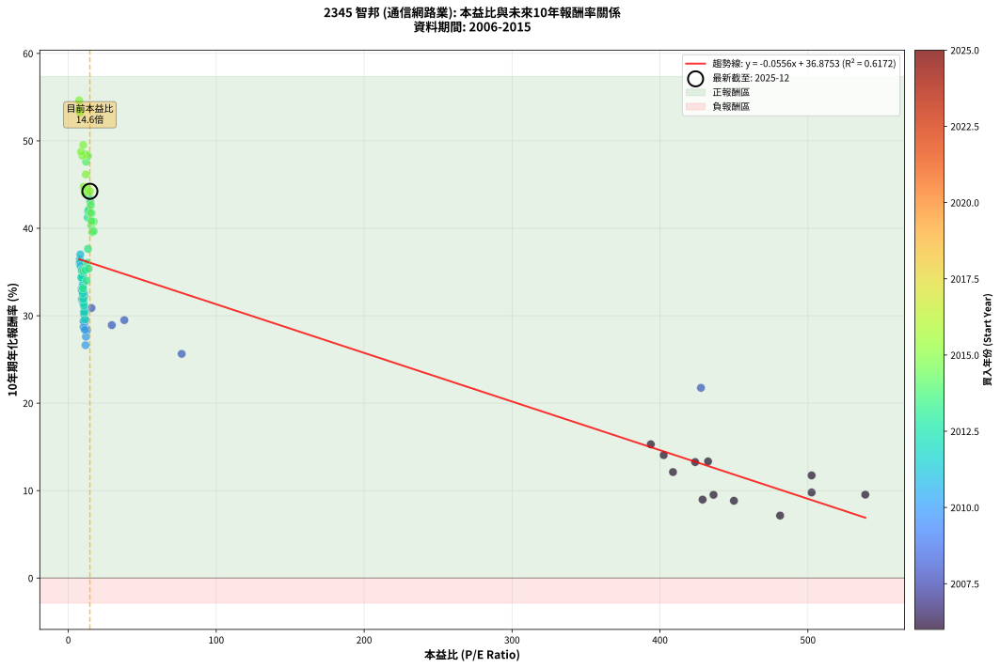
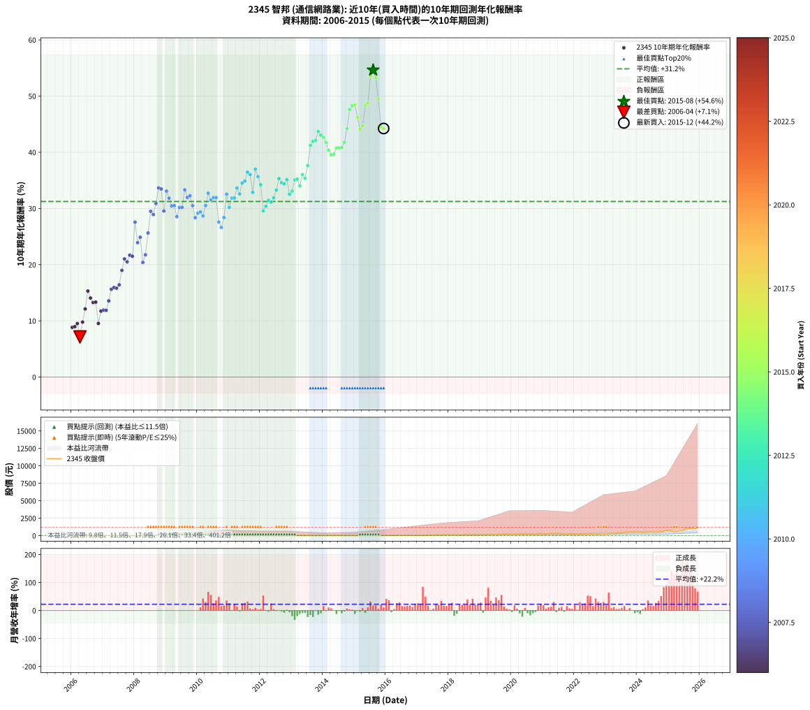

# 2345 智邦 - 本益比與未來報酬率分析

!!! info "報告資訊"
    - **股票代號**: 2345
    - **公司名稱**: 智邦
    - **產業別**: 通信網路業
    - **分析期間**: 2006-2015 (120 個數據點)
    - **資料來源**: Type 12 (ShowMonthlyK_ChartFlow) 月收盤價與本益比
    - **報酬率口徑**: 含現金股利 (簡化: 年度合計，假設每年7/1入帳)
    - **報告生成時間**: 2026-01-10 20:34:09 CST

## 📈 視覺化圖表

### 圖表1: 本益比 vs 未來報酬率關係

*圖表1：2345 智邦 本益比與10年期未來報酬率關係 (2006-2015)*

### 圖表2: 歷年買入時點的10年期實際報酬率

*圖表2：2345 智邦 歷年買入時點的10年期實際報酬率 (2006-2015)*

## 📍 買點訊號說明

本報告提供兩種買點提示訊號（顯示於圖表2的股價子圖中）：

### ▲ 小綠色三角形（回測驗證）
- **計算方式**: 使用全部歷史資料計算本益比第25百分位數
- **用途**: 事後驗證，顯示歷史上哪些時點確實為低估區
- **限制**: 當下無法判斷，僅供回測參考
- **特性**: 後見之明（Look-Ahead Bias）

### ▲ 小橘色三角形（即時訊號）
- **計算方式**: 使用截至當月的過去5年資料計算本益比第25百分位數
- **用途**: 實際投資決策，當時即可判斷
- **優勢**: 可操作性強，符合實務需求
- **特性**: 無後見之明，滾動窗口計算

!!! tip "如何使用兩種訊號"
    - **綠色▲** 幫助理解歷史估值機會，驗證策略有效性
    - **橘色▲** 可作為實際買進參考，但仍需搭配基本面分析
    - 兩種訊號重疊時，表示即時判斷與事後驗證一致，信心度較高
    - 僅有綠色▲時，表示當時無法判斷（需要未來資料才能確認）
    - 僅有橘色▲時，表示即時判斷為買點，但事後可能不是最佳時機

## 📊 估值分析摘要

| 指標 | 數值 |
|:---:|:---:|
| **目前本益比** (2015-12) | **14.59 倍** |
| **歷史平均本益比** | 66.97 倍 |
| **估值水準** | 🟢 相對低估 |
| **預期10年年化報酬率** | **+36.06%** |
| **歷史平均報酬率** | +31.24% |
| **相關係數 (R²)** | 0.6172 |
| **趨勢線斜率** | -0.0556 |

!!! abstract "核心洞察"
    目前本益比顯著低於歷史平均，預期未來報酬率可能較高

    根據歷史數據回測，2345 智邦 在目前本益比 **14.6倍** 的估值水準下，
    預期未來10年年化報酬率約為 **+36.1%**。

    **重要提醒**: 本分析基於歷史數據統計，實際報酬率會受到公司基本面變化、產業趨勢、
    總體經濟環境等多重因素影響。R² = 0.62 表示本益比可解釋約 61.7% 的報酬率變異。

## 📈 歷史估值統計

### 最佳買點 (最高報酬率)

| 項目 | 數值 |
|:---:|:---:|
| 起始時間 | 2015-08 |
| 當時本益比 | 7.38 倍 |
| 起始價格 | 13.8 元 |
| 10年後價格 | 1015.0 元 |
| **10年年化報酬率** | **+54.63%** |

### 最差買點 (最低報酬率)

| 項目 | 數值 |
|:---:|:---:|
| 起始時間 | 2006-04 |
| 當時本益比 | 481.20 倍 |
| 起始價格 | 19.2 元 |
| 10年後價格 | 30.2 元 |
| **10年年化報酬率** | **+7.14%** |

## 🎯 投資啟示

### 本益比與報酬率關係

趨勢線方程式: **y = -0.0556x + 36.8753**

!!! note "負相關"
    本益比與未來報酬率呈現負相關。較低的本益比通常帶來較高的未來報酬率，
    但相關性不算非常強。**估值仍是重要參考指標之一**。

### 估值區間建議

基於歷史數據分析:

- **🟢 低估區** (P/E < 53.6): 預期報酬率較高，可考慮增加持股
- **🟡 合理區** (P/E 53.6-80.4): 預期報酬率符合長期趨勢，正常持有
- **🔴 高估區** (P/E > 80.4): 預期報酬率較低，可考慮減碼或觀望

!!! danger "風險提示"
    - 過去表現不代表未來結果
    - 本分析假設公司基本面無重大結構性變化
    - 產業環境劇變可能使歷史規律失效
    - 應結合公司財報、產業趨勢、總體經濟等多重因素綜合判斷

!!! success "長期投資觀點"
    歷史數據顯示，在合理或低估的估值水準買入並長期持有，
    往往能獲得較佳的投資報酬。**耐心等待好價格**是價值投資的核心原則。

## 📊 數據品質

- **資料來源**: GoodInfo.tw Type 12 (ShowMonthlyK_ChartFlow)
- **資料頻率**: 月度收盤價與本益比
- **回測期間**: 2006-2015
- **數據點數量**: 120 個 (每個點代表一次10年期回測)

### 計算方法說明

1. **10年期年化報酬率**:
   - 對每個歷史時點，計算其後10年的實際投資報酬率
   - 期末價值(不含股利): 期末價格
   - 期末價值(含現金股利): 期末價格 + 持有期間內的現金股利合計 (簡化: 年度合計，假設每年7/1入帳)
   - 公式: 年化報酬率 = [(期末價值/期初價格)^(1/年數) - 1] × 100%

2. **本益比 (P/E Ratio)**:
   - 使用當時的月收盤價與EPS計算
   - 資料來源: Type 12 月度河流圖本益比數據

3. **趨勢線 (Linear Regression)**:
   - 使用最小平方法擬合線性趨勢線
   - R²值衡量本益比對報酬率的解釋能力

---

*本報告由 Stock Analysis System v1.9.0 自動生成*
*數據更新時間: 2026-01-10 20:34:09 CST*

## 📋 月度回測明細表

（每一列對應時間線圖中的一個買入點；可用來對照 SVG 圖上的每個點。）

| 買入月份 | 賣出月份 | 回測期限_年 | 實際持有年數 | 買入本益比_倍 | 買入收盤價_元 | 賣出收盤價_元 | 現金股利合計_元 | 總報酬率_pct | 年化報酬率_pct |
| --- | --- | --- | --- | --- | --- | --- | --- | --- | --- |
| 2006-01 | 2016-01 | 10 | 9.999 | 450.00 | 18.00 | 33.85 | 8.13 | +133.21 | +8.84 |
| 2006-02 | 2016-02 | 10 | 9.999 | 428.80 | 17.15 | 32.35 | 8.13 | +136.02 | +8.97 |
| 2006-03 | 2016-03 | 10 | 10.001 | 436.20 | 17.45 | 35.20 | 8.13 | +148.29 | +9.52 |
| 2006-04 | 2016-04 | 10 | 10.001 | 481.20 | 19.25 | 30.25 | 8.13 | +99.36 | +7.14 |
| 2006-05 | 2016-05 | 10 | 10.001 | 502.50 | 20.10 | 43.00 | 8.13 | +154.36 | +9.78 |
| 2006-06 | 2016-06 | 10 | 10.001 | 408.80 | 16.35 | 43.20 | 8.13 | +213.93 | +12.12 |
| 2006-07 | 2016-07 | 10 | 10.001 | 393.80 | 15.75 | 55.30 | 10.09 | +315.17 | +15.30 |
| 2006-08 | 2016-08 | 10 | 10.001 | 402.50 | 16.10 | 49.90 | 10.09 | +272.61 | +14.06 |
| 2006-09 | 2016-09 | 10 | 10.001 | 423.80 | 16.95 | 48.80 | 10.09 | +247.43 | +13.26 |
| 2006-10 | 2016-10 | 10 | 10.001 | 432.50 | 17.30 | 50.40 | 10.09 | +249.65 | +13.33 |
| 2006-11 | 2016-11 | 10 | 10.001 | 538.80 | 21.55 | 43.50 | 10.09 | +148.68 | +9.54 |
| 2006-12 | 2016-12 | 10 | 10.001 | 502.50 | 20.10 | 50.90 | 10.09 | +203.43 | +11.74 |
| 2007-01 | 2017-01 | 10 | 10.001 |  | 21.60 | 56.50 | 10.09 | +208.29 | +11.92 |
| 2007-02 | 2017-02 | 10 | 10.001 |  | 21.70 | 56.50 | 10.09 | +206.87 | +11.86 |
| 2007-03 | 2017-03 | 10 | 10.001 |  | 21.60 | 66.90 | 10.09 | +256.44 | +13.55 |
| 2007-04 | 2017-04 | 10 | 10.001 |  | 18.40 | 68.50 | 10.09 | +327.12 | +15.62 |
| 2007-05 | 2017-05 | 10 | 10.001 |  | 17.60 | 67.10 | 10.09 | +338.58 | +15.93 |
| 2007-06 | 2017-06 | 10 | 10.001 |  | 20.20 | 77.60 | 10.09 | +334.11 | +15.81 |
| 2007-07 | 2017-07 | 10 | 10.001 |  | 20.50 | 80.50 | 13.19 | +357.01 | +16.41 |
| 2007-08 | 2017-08 | 10 | 10.001 |  | 16.20 | 79.00 | 13.19 | +469.06 | +18.99 |
| 2007-09 | 2017-09 | 10 | 10.001 |  | 16.55 | 98.40 | 13.19 | +574.25 | +21.02 |
| 2007-10 | 2017-10 | 10 | 10.001 |  | 17.10 | 97.20 | 13.19 | +545.54 | +20.50 |
| 2007-11 | 2017-11 | 10 | 10.001 |  | 17.30 | 110.00 | 13.19 | +612.07 | +21.69 |
| 2007-12 | 2017-12 | 10 | 10.001 |  | 17.00 | 106.00 | 13.19 | +601.11 | +21.50 |
| 2008-01 | 2018-01 | 10 | 10.001 |  | 11.40 | 117.00 | 13.19 | +1042.00 | +27.57 |
| 2008-02 | 2018-03 | 10 | 10.081 |  | 12.65 | 96.60 | 13.19 | +767.89 | +23.91 |
| 2008-03 | 2018-03 | 10 | 9.999 |  | 11.90 | 96.60 | 13.19 | +822.59 | +24.89 |
| 2008-04 | 2018-04 | 10 | 9.999 |  | 12.75 | 68.40 | 13.19 | +539.91 | +20.40 |
| 2008-05 | 2018-05 | 10 | 9.999 | 427.70 | 13.90 | 86.30 | 13.19 | +615.74 | +21.76 |
| 2008-06 | 2018-06 | 10 | 9.999 | 76.67 | 10.35 | 88.20 | 13.19 | +879.59 | +25.64 |
| 2008-07 | 2018-07 | 10 | 9.999 | 37.89 | 9.00 | 102.00 | 17.32 | +1225.77 | +29.50 |
| 2008-08 | 2018-08 | 10 | 9.999 | 29.41 | 10.00 | 109.50 | 17.32 | +1168.19 | +28.92 |
| 2008-09 | 2018-09 | 10 | 9.999 | 15.68 | 6.94 | 85.00 | 17.32 | +1374.34 | +30.88 |
| 2008-10 | 2018-10 | 10 | 9.999 | 10.35 | 5.64 | 85.20 | 17.32 | +1717.71 | +33.65 |
| 2008-11 | 2018-11 | 10 | 9.999 | 9.88 | 6.40 | 97.50 | 17.32 | +1694.05 | +33.48 |
| 2008-12 | 2018-12 | 10 | 9.999 | 11.61 | 8.71 | 98.60 | 17.32 | +1230.87 | +29.55 |
| 2009-01 | 2019-01 | 10 | 9.999 | 9.06 | 7.16 | 107.50 | 17.32 | +1643.28 | +33.09 |
| 2009-02 | 2019-02 | 10 | 9.999 | 9.57 | 7.94 | 108.50 | 17.32 | +1484.62 | +31.83 |
| 2009-03 | 2019-03 | 10 | 9.999 | 11.43 | 9.94 | 124.50 | 17.32 | +1326.75 | +30.45 |
| 2009-04 | 2019-04 | 10 | 9.999 | 11.37 | 10.35 | 131.00 | 17.32 | +1333.03 | +30.51 |
| 2009-05 | 2019-05 | 10 | 9.999 | 11.95 | 11.35 | 122.50 | 17.32 | +1131.89 | +28.55 |
| 2009-06 | 2019-06 | 10 | 9.999 | 10.76 | 10.65 | 131.50 | 17.32 | +1297.36 | +30.18 |
| 2009-07 | 2019-07 | 10 | 9.999 | 10.73 | 11.05 | 134.00 | 20.66 | +1299.60 | +30.20 |
| 2009-08 | 2019-08 | 10 | 9.999 | 9.81 | 10.50 | 165.50 | 20.66 | +1672.91 | +33.32 |
| 2009-09 | 2019-09 | 10 | 9.999 | 10.36 | 11.50 | 163.50 | 20.66 | +1501.36 | +31.97 |
| 2009-10 | 2019-10 | 10 | 9.999 | 10.74 | 12.35 | 181.50 | 20.66 | +1536.89 | +32.26 |
| 2009-11 | 2019-11 | 10 | 9.999 | 10.55 | 12.55 | 159.00 | 20.66 | +1331.52 | +30.50 |
| 2009-12 | 2019-12 | 10 | 9.999 | 12.64 | 15.55 | 168.00 | 20.66 | +1113.22 | +28.35 |
| 2010-01 | 2020-01 | 10 | 9.999 | 10.96 | 14.20 | 163.00 | 20.66 | +1193.35 | +29.18 |
| 2010-02 | 2020-02 | 10 | 9.999 | 10.28 | 14.00 | 163.50 | 20.66 | +1215.40 | +29.40 |
| 2010-03 | 2020-03 | 10 | 10.001 | 10.33 | 14.75 | 163.00 | 20.66 | +1145.13 | +28.68 |
| 2010-04 | 2020-04 | 10 | 10.001 | 11.12 | 16.60 | 217.50 | 20.66 | +1334.67 | +30.51 |
| 2010-05 | 2020-05 | 10 | 10.001 | 9.91 | 15.45 | 241.50 | 20.66 | +1596.80 | +32.72 |
| 2010-06 | 2020-06 | 10 | 10.001 | 9.88 | 16.05 | 228.00 | 20.66 | +1449.26 | +31.52 |
| 2010-07 | 2020-07 | 10 | 10.001 | 9.43 | 15.95 | 229.50 | 25.75 | +1500.31 | +31.95 |
| 2010-08 | 2020-08 | 10 | 10.001 | 9.25 | 16.25 | 234.00 | 25.75 | +1498.46 | +31.93 |
| 2010-09 | 2020-09 | 10 | 10.001 | 11.91 | 21.70 | 222.50 | 25.75 | +1044.01 | +27.59 |
| 2010-10 | 2020-10 | 10 | 10.001 | 11.65 | 22.00 | 207.50 | 25.75 | +960.23 | +26.63 |
| 2010-11 | 2020-11 | 10 | 10.001 | 11.13 | 21.75 | 239.00 | 25.75 | +1117.24 | +28.39 |
| 2010-12 | 2020-12 | 10 | 10.001 | 10.10 | 20.40 | 316.00 | 25.75 | +1575.25 | +32.55 |
| 2011-01 | 2021-01 | 10 | 10.001 | 10.60 | 21.10 | 269.50 | 25.75 | +1299.29 | +30.19 |
| 2011-02 | 2021-02 | 10 | 10.001 | 9.26 | 18.15 | 262.50 | 25.75 | +1488.15 | +31.85 |
| 2011-03 | 2021-03 | 10 | 10.001 | 9.84 | 19.00 | 276.00 | 25.75 | +1488.16 | +31.85 |
| 2011-04 | 2021-04 | 10 | 10.001 | 9.95 | 18.90 | 318.00 | 25.75 | +1718.78 | +33.65 |
| 2011-05 | 2021-05 | 10 | 10.001 | 10.61 | 19.85 | 307.50 | 25.75 | +1578.84 | +32.58 |
| 2011-06 | 2021-06 | 10 | 10.001 | 9.97 | 18.35 | 330.50 | 25.75 | +1841.42 | +34.52 |
| 2011-07 | 2021-07 | 10 | 10.001 | 9.89 | 17.90 | 326.00 | 30.83 | +1893.47 | +34.88 |
| 2011-08 | 2021-08 | 10 | 10.001 | 7.81 | 13.90 | 280.50 | 30.83 | +2139.80 | +36.46 |
| 2011-09 | 2021-09 | 10 | 10.001 | 7.74 | 13.55 | 263.00 | 30.83 | +2068.50 | +36.02 |
| 2011-10 | 2021-10 | 10 | 10.001 | 9.30 | 16.00 | 243.50 | 30.83 | +1614.58 | +32.86 |
| 2011-11 | 2021-11 | 10 | 10.001 | 8.11 | 13.70 | 288.50 | 30.83 | +2230.89 | +37.00 |
| 2011-12 | 2021-12 | 10 | 10.001 | 8.28 | 13.75 | 260.00 | 30.83 | +2015.14 | +35.68 |
| 2012-01 | 2022-01 | 10 | 10.001 | 9.40 | 15.60 | 265.00 | 30.83 | +1796.36 | +34.21 |
| 2012-02 | 2022-03 | 10 | 10.081 | 11.22 | 18.60 | 222.50 | 30.83 | +1262.00 | +29.57 |
| 2012-03 | 2022-03 | 10 | 9.999 | 10.77 | 17.85 | 222.50 | 30.83 | +1319.23 | +30.38 |
| 2012-04 | 2022-04 | 10 | 9.999 | 10.35 | 17.15 | 233.00 | 30.83 | +1438.38 | +31.44 |
| 2012-05 | 2022-05 | 10 | 9.999 | 10.57 | 17.50 | 232.00 | 30.83 | +1401.90 | +31.12 |
| 2012-06 | 2022-06 | 10 | 9.999 | 10.21 | 16.90 | 238.50 | 30.83 | +1493.68 | +31.90 |
| 2012-07 | 2022-07 | 10 | 9.999 | 9.70 | 16.05 | 248.00 | 35.36 | +1665.46 | +33.26 |
| 2012-08 | 2022-08 | 10 | 9.999 | 9.38 | 15.50 | 283.50 | 35.36 | +1957.14 | +35.31 |
| 2012-09 | 2022-09 | 10 | 9.999 | 9.56 | 15.80 | 272.50 | 35.36 | +1848.46 | +34.58 |
| 2012-10 | 2022-10 | 10 | 9.999 | 8.78 | 14.50 | 243.00 | 35.36 | +1819.70 | +34.38 |
| 2012-11 | 2022-11 | 10 | 9.999 | 9.15 | 15.10 | 271.50 | 35.36 | +1932.17 | +35.15 |
| 2012-12 | 2022-12 | 10 | 9.999 | 9.79 | 16.15 | 234.50 | 35.36 | +1570.94 | +32.53 |
| 2013-01 | 2023-01 | 10 | 9.999 | 9.99 | 16.00 | 243.50 | 35.36 | +1642.86 | +33.09 |
| 2013-02 | 2023-02 | 10 | 9.999 | 10.15 | 15.75 | 283.00 | 35.36 | +1921.31 | +35.08 |
| 2013-03 | 2023-03 | 10 | 9.999 | 11.55 | 17.35 | 319.00 | 35.36 | +1942.40 | +35.22 |
| 2013-04 | 2023-04 | 10 | 9.999 | 12.32 | 17.90 | 299.00 | 35.36 | +1767.92 | +34.01 |
| 2013-05 | 2023-05 | 10 | 9.999 | 12.75 | 17.90 | 353.00 | 35.36 | +2069.59 | +36.04 |
| 2013-06 | 2023-06 | 10 | 9.999 | 13.73 | 18.60 | 349.00 | 35.36 | +1966.44 | +35.38 |
| 2013-07 | 2023-07 | 10 | 9.999 | 13.29 | 17.35 | 382.00 | 41.36 | +2340.13 | +37.64 |
| 2013-08 | 2023-08 | 10 | 9.999 | 13.09 | 16.45 | 478.00 | 41.36 | +3057.22 | +41.24 |
| 2013-09 | 2023-09 | 10 | 9.999 | 13.33 | 16.10 | 493.00 | 41.36 | +3219.02 | +41.95 |
| 2013-10 | 2023-10 | 10 | 9.999 | 13.86 | 16.05 | 498.50 | 41.36 | +3263.63 | +42.14 |
| 2013-11 | 2023-11 | 10 | 9.999 | 13.79 | 15.30 | 533.00 | 41.36 | +3654.01 | +43.70 |
| 2013-12 | 2023-12 | 10 | 9.999 | 14.86 | 15.75 | 523.00 | 41.36 | +3483.26 | +43.04 |
| 2014-01 | 2024-01 | 10 | 9.999 | 15.24 | 16.35 | 529.00 | 41.36 | +3388.46 | +42.65 |
| 2014-02 | 2024-02 | 10 | 9.999 | 15.81 | 17.15 | 519.00 | 41.36 | +3167.42 | +41.72 |
| 2014-03 | 2024-03 | 10 | 10.001 | 15.49 | 17.00 | 463.00 | 41.36 | +2866.84 | +40.35 |
| 2014-04 | 2024-04 | 10 | 10.001 | 16.17 | 17.95 | 461.50 | 41.36 | +2701.47 | +39.55 |
| 2014-05 | 2024-05 | 10 | 10.001 | 17.19 | 19.30 | 504.00 | 41.36 | +2725.72 | +39.67 |
| 2014-06 | 2024-06 | 10 | 10.001 | 17.18 | 19.50 | 555.00 | 41.36 | +2958.27 | +40.78 |
| 2014-07 | 2024-07 | 10 | 10.001 | 15.86 | 18.20 | 507.00 | 50.45 | +2962.89 | +40.80 |
| 2014-08 | 2024-08 | 10 | 10.001 | 15.69 | 18.20 | 508.00 | 50.45 | +2968.38 | +40.82 |
| 2014-09 | 2024-09 | 10 | 10.001 | 15.14 | 17.75 | 532.00 | 50.45 | +3181.39 | +41.77 |
| 2014-10 | 2024-10 | 10 | 10.001 | 13.08 | 15.50 | 552.00 | 50.45 | +3786.75 | +44.19 |
| 2014-11 | 2024-11 | 10 | 10.001 | 12.03 | 14.40 | 657.00 | 50.45 | +4812.82 | +47.61 |
| 2014-12 | 2024-12 | 10 | 10.001 | 13.22 | 16.00 | 773.00 | 50.45 | +5046.54 | +48.30 |
| 2015-01 | 2025-01 | 10 | 10.001 | 12.12 | 15.65 | 763.00 | 50.45 | +5097.74 | +48.44 |
| 2015-02 | 2025-02 | 10 | 10.001 | 11.83 | 16.25 | 673.00 | 50.45 | +4351.98 | +46.16 |
| 2015-03 | 2025-03 | 10 | 10.001 | 11.17 | 16.25 | 576.00 | 50.45 | +3755.05 | +44.07 |
| 2015-04 | 2025-04 | 10 | 10.001 | 10.38 | 15.95 | 594.00 | 50.45 | +3940.41 | +44.75 |
| 2015-05 | 2025-05 | 10 | 10.001 | 9.55 | 15.45 | 745.00 | 50.45 | +5048.52 | +48.30 |
| 2015-06 | 2025-06 | 10 | 10.001 | 8.65 | 14.70 | 730.00 | 50.45 | +5209.16 | +48.76 |
| 2015-07 | 2025-07 | 10 | 10.001 | 7.32 | 13.05 | 892.00 | 60.37 | +7197.86 | +53.57 |
| 2015-08 | 2025-08 | 10 | 10.001 | 7.38 | 13.75 | 1015.00 | 60.37 | +7720.88 | +54.63 |
| 2015-09 | 2025-09 | 10 | 10.001 | 7.94 | 15.45 | 1045.00 | 60.37 | +7054.50 | +53.26 |
| 2015-10 | 2025-10 | 10 | 10.001 | 10.07 | 20.40 | 1080.00 | 60.37 | +5490.05 | +49.53 |
| 2015-11 | 2025-11 | 10 | 10.001 | 12.92 | 27.25 | 1025.00 | 60.37 | +3883.01 | +44.54 |
| 2015-12 | 2025-12 | 10 | 10.001 | 14.59 | 31.95 | 1185.00 | 60.37 | +3797.87 | +44.23 |
