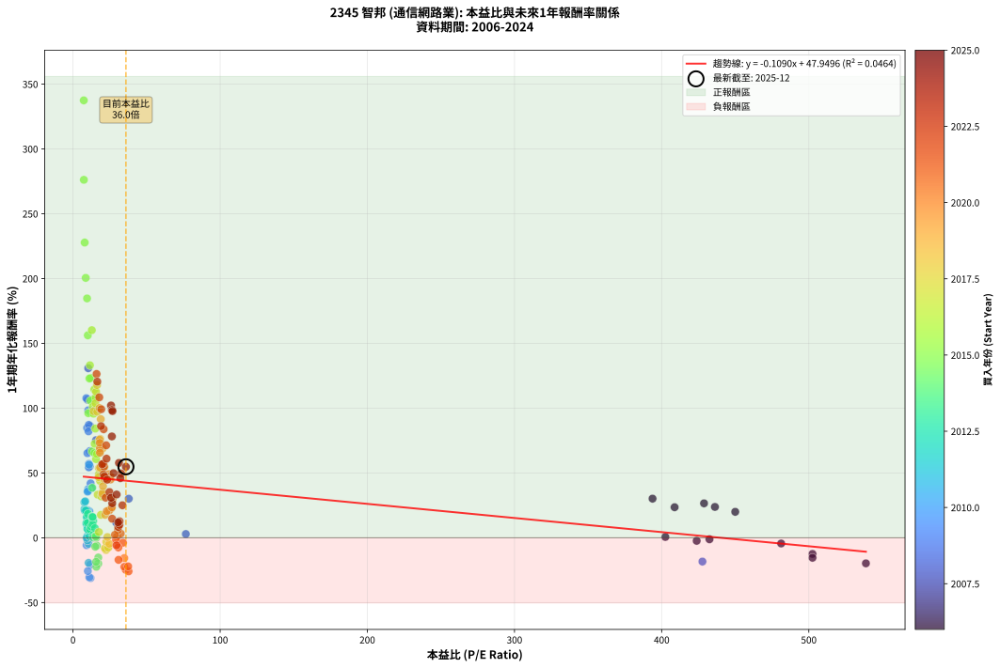
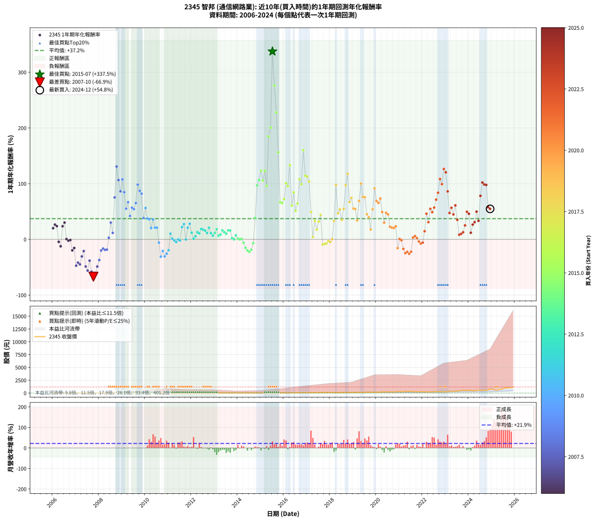

# 2345 智邦 - 本益比與未來報酬率分析

!!! info "報告資訊"
    - **股票代號**: 2345
    - **公司名稱**: 智邦
    - **產業別**: 通信網路業
    - **分析期間**: 2006-2024 (228 個數據點)
    - **資料來源**: Type 12 (ShowMonthlyK_ChartFlow) 月收盤價與本益比
    - **報酬率口徑**: 含現金股利 (簡化: 年度合計，假設每年7/1入帳)
    - **報告生成時間**: 2026-01-10 18:26:08 CST

## 📈 視覺化圖表

### 圖表1: 本益比 vs 未來報酬率關係

*圖表1：2345 智邦 本益比與1年期未來報酬率關係 (2006-2024)*

### 圖表2: 歷年買入時點的1年期實際報酬率

*圖表2：2345 智邦 歷年買入時點的1年期實際報酬率 (2006-2024)*

## 📍 買點訊號說明

本報告提供兩種買點提示訊號（顯示於圖表2的股價子圖中）：

### ▲ 小綠色三角形（回測驗證）
- **計算方式**: 使用全部歷史資料計算本益比第25百分位數
- **用途**: 事後驗證，顯示歷史上哪些時點確實為低估區
- **限制**: 當下無法判斷，僅供回測參考
- **特性**: 後見之明（Look-Ahead Bias）

### ▲ 小橘色三角形（即時訊號）
- **計算方式**: 使用截至當月的過去5年資料計算本益比第25百分位數
- **用途**: 實際投資決策，當時即可判斷
- **優勢**: 可操作性強，符合實務需求
- **特性**: 無後見之明，滾動窗口計算

!!! tip "如何使用兩種訊號"
    - **綠色▲** 幫助理解歷史估值機會，驗證策略有效性
    - **橘色▲** 可作為實際買進參考，但仍需搭配基本面分析
    - 兩種訊號重疊時，表示即時判斷與事後驗證一致，信心度較高
    - 僅有綠色▲時，表示當時無法判斷（需要未來資料才能確認）
    - 僅有橘色▲時，表示即時判斷為買點，但事後可能不是最佳時機

## 📊 估值分析摘要

| 指標 | 數值 |
|:---:|:---:|
| **目前本益比** (2024-12) | **35.97 倍** |
| **歷史平均本益比** | 44.48 倍 |
| **估值水準** | 🟡 合理範圍 |
| **預期1年年化報酬率** | **+44.03%** |
| **歷史平均報酬率** | +37.19% |
| **相關係數 (R²)** | 0.0464 |
| **趨勢線斜率** | -0.1090 |

!!! abstract "核心洞察"
    目前本益比接近歷史平均，預期報酬率符合長期趨勢

    根據歷史數據回測，2345 智邦 在目前本益比 **36.0倍** 的估值水準下，
    預期未來1年年化報酬率約為 **+44.0%**。

    **重要提醒**: 本分析基於歷史數據統計，實際報酬率會受到公司基本面變化、產業趨勢、
    總體經濟環境等多重因素影響。R² = 0.05 表示本益比可解釋約 4.6% 的報酬率變異。

## 📈 歷史估值統計

### 最佳買點 (最高報酬率)

| 項目 | 數值 |
|:---:|:---:|
| 起始時間 | 2015-07 |
| 當時本益比 | 7.32 倍 |
| 起始價格 | 13.1 元 |
| 1年後價格 | 55.3 元 |
| **1年年化報酬率** | **+337.47%** |

### 最差買點 (最低報酬率)

| 項目 | 數值 |
|:---:|:---:|
| 起始時間 | 2007-10 |
| 當時本益比 | nan 倍 |
| 起始價格 | 17.1 元 |
| 1年後價格 | 5.6 元 |
| **1年年化報酬率** | **-66.94%** |

## 🎯 投資啟示

### 本益比與報酬率關係

趨勢線方程式: **y = -0.1090x + 47.9496**

!!! note "負相關"
    本益比與未來報酬率呈現負相關。較低的本益比通常帶來較高的未來報酬率，
    但相關性不算非常強。**估值仍是重要參考指標之一**。

### 估值區間建議

基於歷史數據分析:

- **🟢 低估區** (P/E < 35.6): 預期報酬率較高，可考慮增加持股
- **🟡 合理區** (P/E 35.6-53.4): 預期報酬率符合長期趨勢，正常持有
- **🔴 高估區** (P/E > 53.4): 預期報酬率較低，可考慮減碼或觀望

!!! danger "風險提示"
    - 過去表現不代表未來結果
    - 本分析假設公司基本面無重大結構性變化
    - 產業環境劇變可能使歷史規律失效
    - 應結合公司財報、產業趨勢、總體經濟等多重因素綜合判斷

!!! success "長期投資觀點"
    歷史數據顯示，在合理或低估的估值水準買入並長期持有，
    往往能獲得較佳的投資報酬。**耐心等待好價格**是價值投資的核心原則。

## 📊 數據品質

- **資料來源**: GoodInfo.tw Type 12 (ShowMonthlyK_ChartFlow)
- **資料頻率**: 月度收盤價與本益比
- **回測期間**: 2006-2024
- **數據點數量**: 228 個 (每個點代表一次1年期回測)

### 計算方法說明

1. **1年期年化報酬率**:
   - 對每個歷史時點，計算其後1年的實際投資報酬率
   - 期末價值(不含股利): 期末價格
   - 期末價值(含現金股利): 期末價格 + 持有期間內的現金股利合計 (簡化: 年度合計，假設每年7/1入帳)
   - 公式: 年化報酬率 = [(期末價值/期初價格)^(1/年數) - 1] × 100%

2. **本益比 (P/E Ratio)**:
   - 使用當時的月收盤價與EPS計算
   - 資料來源: Type 12 月度河流圖本益比數據

3. **趨勢線 (Linear Regression)**:
   - 使用最小平方法擬合線性趨勢線
   - R²值衡量本益比對報酬率的解釋能力

---

*本報告由 Stock Analysis System v1.9.0 自動生成*
*數據更新時間: 2026-01-10 18:26:08 CST*

## 📋 月度回測明細表

（每一列對應時間線圖中的一個買入點；可用來對照 SVG 圖上的每個點。）

| 買入月份 | 賣出月份 | 回測期限_年 | 實際持有年數 | 買入本益比_倍 | 買入收盤價_元 | 賣出收盤價_元 | 現金股利合計_元 | 總報酬率_pct | 年化報酬率_pct |
| --- | --- | --- | --- | --- | --- | --- | --- | --- | --- |
| 2006-01 | 2007-01 | 1 | 0.999 | 450.00 | 18.00 | 21.60 | 0.00 | +20.00 | +20.01 |
| 2006-02 | 2007-02 | 1 | 0.999 | 428.80 | 17.15 | 21.70 | 0.00 | +26.53 | +26.55 |
| 2006-03 | 2007-03 | 1 | 0.999 | 436.20 | 17.45 | 21.60 | 0.00 | +23.78 | +23.80 |
| 2006-04 | 2007-04 | 1 | 0.999 | 481.20 | 19.25 | 18.40 | 0.00 | -4.42 | -4.42 |
| 2006-05 | 2007-05 | 1 | 0.999 | 502.50 | 20.10 | 17.60 | 0.00 | -12.44 | -12.45 |
| 2006-06 | 2007-06 | 1 | 0.999 | 408.80 | 16.35 | 20.20 | 0.00 | +23.55 | +23.57 |
| 2006-07 | 2007-07 | 1 | 0.999 | 393.80 | 15.75 | 20.50 | 0.00 | +30.16 | +30.18 |
| 2006-08 | 2007-08 | 1 | 0.999 | 402.50 | 16.10 | 16.20 | 0.00 | +0.62 | +0.62 |
| 2006-09 | 2007-09 | 1 | 0.999 | 423.80 | 16.95 | 16.55 | 0.00 | -2.36 | -2.36 |
| 2006-10 | 2007-10 | 1 | 0.999 | 432.50 | 17.30 | 17.10 | 0.00 | -1.16 | -1.16 |
| 2006-11 | 2007-11 | 1 | 0.999 | 538.80 | 21.55 | 17.30 | 0.00 | -19.72 | -19.73 |
| 2006-12 | 2007-12 | 1 | 0.999 | 502.50 | 20.10 | 17.00 | 0.00 | -15.42 | -15.43 |
| 2007-01 | 2008-01 | 1 | 0.999 |  | 21.60 | 11.40 | 0.00 | -47.22 | -47.25 |
| 2007-02 | 2008-02 | 1 | 0.999 |  | 21.70 | 12.65 | 0.00 | -41.71 | -41.73 |
| 2007-03 | 2008-03 | 1 | 1.002 |  | 21.60 | 11.90 | 0.00 | -44.91 | -44.84 |
| 2007-04 | 2008-04 | 1 | 1.002 |  | 18.40 | 12.75 | 0.00 | -30.71 | -30.65 |
| 2007-05 | 2008-05 | 1 | 1.002 |  | 17.60 | 13.90 | 0.00 | -21.02 | -20.98 |
| 2007-06 | 2008-06 | 1 | 1.002 |  | 20.20 | 10.35 | 0.00 | -48.76 | -48.69 |
| 2007-07 | 2008-07 | 1 | 1.002 |  | 20.50 | 9.00 | 0.00 | -56.10 | -56.02 |
| 2007-08 | 2008-08 | 1 | 1.002 |  | 16.20 | 10.00 | 0.00 | -38.27 | -38.21 |
| 2007-09 | 2008-09 | 1 | 1.002 |  | 16.55 | 6.94 | 0.00 | -58.07 | -57.99 |
| 2007-10 | 2008-10 | 1 | 1.002 |  | 17.10 | 5.64 | 0.00 | -67.02 | -66.94 |
| 2007-11 | 2008-11 | 1 | 1.002 |  | 17.30 | 6.40 | 0.00 | -63.01 | -62.93 |
| 2007-12 | 2008-12 | 1 | 1.002 |  | 17.00 | 8.71 | 0.00 | -48.76 | -48.69 |
| 2008-01 | 2009-01 | 1 | 1.002 |  | 11.40 | 7.16 | 0.00 | -37.19 | -37.13 |
| 2008-02 | 2009-03 | 1 | 1.081 |  | 12.65 | 9.94 | 0.00 | -21.42 | -19.98 |
| 2008-03 | 2009-03 | 1 | 0.999 |  | 11.90 | 9.94 | 0.00 | -16.47 | -16.48 |
| 2008-04 | 2009-04 | 1 | 0.999 |  | 12.75 | 10.35 | 0.00 | -18.82 | -18.84 |
| 2008-05 | 2009-05 | 1 | 0.999 | 427.70 | 13.90 | 11.35 | 0.00 | -18.35 | -18.36 |
| 2008-06 | 2009-06 | 1 | 0.999 | 76.67 | 10.35 | 10.65 | 0.00 | +2.90 | +2.90 |
| 2008-07 | 2009-07 | 1 | 0.999 | 37.89 | 9.00 | 11.05 | 0.66 | +30.12 | +30.15 |
| 2008-08 | 2009-08 | 1 | 0.999 | 29.41 | 10.00 | 10.50 | 0.66 | +11.61 | +11.62 |
| 2008-09 | 2009-09 | 1 | 0.999 | 15.68 | 6.94 | 11.50 | 0.66 | +75.23 | +75.30 |
| 2008-10 | 2009-10 | 1 | 0.999 | 10.35 | 5.64 | 12.35 | 0.66 | +130.69 | +130.82 |
| 2008-11 | 2009-11 | 1 | 0.999 | 9.88 | 6.40 | 12.55 | 0.66 | +106.42 | +106.52 |
| 2008-12 | 2009-12 | 1 | 0.999 | 11.61 | 8.71 | 15.55 | 0.66 | +86.12 | +86.20 |
| 2009-01 | 2010-01 | 1 | 0.999 | 9.06 | 7.16 | 14.20 | 0.66 | +107.56 | +107.66 |
| 2009-02 | 2010-02 | 1 | 0.999 | 9.57 | 7.94 | 14.00 | 0.66 | +84.65 | +84.72 |
| 2009-03 | 2010-03 | 1 | 0.999 | 11.43 | 9.94 | 14.75 | 0.66 | +55.04 | +55.09 |
| 2009-04 | 2010-04 | 1 | 0.999 | 11.37 | 10.35 | 16.60 | 0.66 | +66.77 | +66.83 |
| 2009-05 | 2010-05 | 1 | 0.999 | 11.95 | 11.35 | 15.45 | 0.66 | +41.95 | +41.98 |
| 2009-06 | 2010-06 | 1 | 0.999 | 10.76 | 10.65 | 16.05 | 0.66 | +56.91 | +56.96 |
| 2009-07 | 2010-07 | 1 | 0.999 | 10.73 | 11.05 | 15.95 | 1.10 | +54.26 | +54.31 |
| 2009-08 | 2010-08 | 1 | 0.999 | 9.81 | 10.50 | 16.25 | 1.10 | +65.20 | +65.26 |
| 2009-09 | 2010-09 | 1 | 0.999 | 10.36 | 11.50 | 21.70 | 1.10 | +98.23 | +98.32 |
| 2009-10 | 2010-10 | 1 | 0.999 | 10.74 | 12.35 | 22.00 | 1.10 | +87.01 | +87.09 |
| 2009-11 | 2010-11 | 1 | 0.999 | 10.55 | 12.55 | 21.75 | 1.10 | +82.04 | +82.11 |
| 2009-12 | 2010-12 | 1 | 0.999 | 12.64 | 15.55 | 20.40 | 1.10 | +38.24 | +38.27 |
| 2010-01 | 2011-01 | 1 | 0.999 | 10.96 | 14.20 | 21.10 | 1.10 | +56.31 | +56.36 |
| 2010-02 | 2011-02 | 1 | 0.999 | 10.28 | 14.00 | 18.15 | 1.10 | +37.47 | +37.50 |
| 2010-03 | 2011-03 | 1 | 0.999 | 10.33 | 14.75 | 19.00 | 1.10 | +36.24 | +36.27 |
| 2010-04 | 2011-04 | 1 | 0.999 | 11.12 | 16.60 | 18.90 | 1.10 | +20.46 | +20.47 |
| 2010-05 | 2011-05 | 1 | 0.999 | 9.91 | 15.45 | 19.85 | 1.10 | +35.57 | +35.60 |
| 2010-06 | 2011-06 | 1 | 0.999 | 9.88 | 16.05 | 18.35 | 1.10 | +21.16 | +21.17 |
| 2010-07 | 2011-07 | 1 | 0.999 | 9.43 | 15.95 | 17.90 | 1.41 | +21.09 | +21.11 |
| 2010-08 | 2011-08 | 1 | 0.999 | 9.25 | 16.25 | 13.90 | 1.41 | -5.76 | -5.76 |
| 2010-09 | 2011-09 | 1 | 0.999 | 11.91 | 21.70 | 13.55 | 1.41 | -31.04 | -31.06 |
| 2010-10 | 2011-10 | 1 | 0.999 | 11.65 | 22.00 | 16.00 | 1.41 | -20.85 | -20.86 |
| 2010-11 | 2011-11 | 1 | 0.999 | 11.13 | 21.75 | 13.70 | 1.41 | -30.51 | -30.53 |
| 2010-12 | 2011-12 | 1 | 0.999 | 10.10 | 20.40 | 13.75 | 1.41 | -25.67 | -25.68 |
| 2011-01 | 2012-01 | 1 | 0.999 | 10.60 | 21.10 | 15.60 | 1.41 | -19.36 | -19.38 |
| 2011-02 | 2012-02 | 1 | 0.999 | 9.26 | 18.15 | 18.60 | 1.41 | +10.27 | +10.28 |
| 2011-03 | 2012-03 | 1 | 1.002 | 9.84 | 19.00 | 17.85 | 1.41 | +1.39 | +1.39 |
| 2011-04 | 2012-04 | 1 | 1.002 | 9.95 | 18.90 | 17.15 | 1.41 | -1.78 | -1.77 |
| 2011-05 | 2012-05 | 1 | 1.002 | 10.61 | 19.85 | 17.50 | 1.41 | -4.72 | -4.71 |
| 2011-06 | 2012-06 | 1 | 1.002 | 9.97 | 18.35 | 16.90 | 1.41 | -0.20 | -0.20 |
| 2011-07 | 2012-07 | 1 | 1.002 | 9.89 | 17.90 | 16.05 | 1.47 | -2.10 | -2.10 |
| 2011-08 | 2012-08 | 1 | 1.002 | 7.81 | 13.90 | 15.50 | 1.47 | +22.12 | +22.07 |
| 2011-09 | 2012-09 | 1 | 1.002 | 7.74 | 13.55 | 15.80 | 1.47 | +27.48 | +27.42 |
| 2011-10 | 2012-10 | 1 | 1.002 | 9.30 | 16.00 | 14.50 | 1.47 | -0.16 | -0.16 |
| 2011-11 | 2012-11 | 1 | 1.002 | 8.11 | 13.70 | 15.10 | 1.47 | +20.98 | +20.93 |
| 2011-12 | 2012-12 | 1 | 1.002 | 8.28 | 13.75 | 16.15 | 1.47 | +28.17 | +28.11 |
| 2012-01 | 2013-01 | 1 | 1.002 | 9.40 | 15.60 | 16.00 | 1.47 | +12.01 | +11.99 |
| 2012-02 | 2013-03 | 1 | 1.081 | 11.22 | 18.60 | 17.35 | 1.47 | +1.20 | +1.11 |
| 2012-03 | 2013-03 | 1 | 0.999 | 10.77 | 17.85 | 17.35 | 1.47 | +5.46 | +5.46 |
| 2012-04 | 2013-04 | 1 | 0.999 | 10.35 | 17.15 | 17.90 | 1.47 | +12.97 | +12.98 |
| 2012-05 | 2013-05 | 1 | 0.999 | 10.57 | 17.50 | 17.90 | 1.47 | +10.71 | +10.72 |
| 2012-06 | 2013-06 | 1 | 0.999 | 10.21 | 16.90 | 18.60 | 1.47 | +18.78 | +18.80 |
| 2012-07 | 2013-07 | 1 | 0.999 | 9.70 | 16.05 | 17.35 | 1.49 | +17.41 | +17.42 |
| 2012-08 | 2013-08 | 1 | 0.999 | 9.38 | 15.50 | 16.45 | 1.49 | +15.77 | +15.78 |
| 2012-09 | 2013-09 | 1 | 0.999 | 9.56 | 15.80 | 16.10 | 1.49 | +11.35 | +11.36 |
| 2012-10 | 2013-10 | 1 | 0.999 | 8.78 | 14.50 | 16.05 | 1.49 | +20.99 | +21.01 |
| 2012-11 | 2013-11 | 1 | 0.999 | 9.15 | 15.10 | 15.30 | 1.49 | +11.22 | +11.23 |
| 2012-12 | 2013-12 | 1 | 0.999 | 9.79 | 16.15 | 15.75 | 1.49 | +6.77 | +6.78 |
| 2013-01 | 2014-01 | 1 | 0.999 | 9.99 | 16.00 | 16.35 | 1.49 | +11.53 | +11.53 |
| 2013-02 | 2014-02 | 1 | 0.999 | 10.15 | 15.75 | 17.15 | 1.49 | +18.37 | +18.39 |
| 2013-03 | 2014-03 | 1 | 0.999 | 11.55 | 17.35 | 17.00 | 1.49 | +6.59 | +6.60 |
| 2013-04 | 2014-04 | 1 | 0.999 | 12.32 | 17.90 | 17.95 | 1.49 | +8.63 | +8.63 |
| 2013-05 | 2014-05 | 1 | 0.999 | 12.75 | 17.90 | 19.30 | 1.49 | +16.17 | +16.18 |
| 2013-06 | 2014-06 | 1 | 0.999 | 13.73 | 18.60 | 19.50 | 1.49 | +12.87 | +12.88 |
| 2013-07 | 2014-07 | 1 | 0.999 | 13.29 | 17.35 | 18.20 | 0.91 | +10.16 | +10.17 |
| 2013-08 | 2014-08 | 1 | 0.999 | 13.09 | 16.45 | 18.20 | 0.91 | +16.19 | +16.20 |
| 2013-09 | 2014-09 | 1 | 0.999 | 13.33 | 16.10 | 17.75 | 0.91 | +15.92 | +15.93 |
| 2013-10 | 2014-10 | 1 | 0.999 | 13.86 | 16.05 | 15.50 | 0.91 | +2.26 | +2.26 |
| 2013-11 | 2014-11 | 1 | 0.999 | 13.79 | 15.30 | 14.40 | 0.91 | +0.08 | +0.09 |
| 2013-12 | 2014-12 | 1 | 0.999 | 14.86 | 15.75 | 16.00 | 0.91 | +7.38 | +7.39 |
| 2014-01 | 2015-01 | 1 | 0.999 | 15.24 | 16.35 | 15.65 | 0.91 | +1.30 | +1.30 |
| 2014-02 | 2015-02 | 1 | 0.999 | 15.81 | 17.15 | 16.25 | 0.91 | +0.08 | +0.08 |
| 2014-03 | 2015-03 | 1 | 0.999 | 15.49 | 17.00 | 16.25 | 0.91 | +0.96 | +0.96 |
| 2014-04 | 2015-04 | 1 | 0.999 | 16.17 | 17.95 | 15.95 | 0.91 | -6.06 | -6.06 |
| 2014-05 | 2015-05 | 1 | 0.999 | 17.19 | 19.30 | 15.45 | 0.91 | -15.22 | -15.23 |
| 2014-06 | 2015-06 | 1 | 0.999 | 17.18 | 19.50 | 14.70 | 0.91 | -19.93 | -19.95 |
| 2014-07 | 2015-07 | 1 | 0.999 | 15.86 | 18.20 | 13.05 | 1.07 | -22.39 | -22.40 |
| 2014-08 | 2015-08 | 1 | 0.999 | 15.69 | 18.20 | 13.75 | 1.07 | -18.54 | -18.56 |
| 2014-09 | 2015-09 | 1 | 0.999 | 15.14 | 17.75 | 15.45 | 1.07 | -6.90 | -6.91 |
| 2014-10 | 2015-10 | 1 | 0.999 | 13.08 | 15.50 | 20.40 | 1.07 | +38.55 | +38.58 |
| 2014-11 | 2015-11 | 1 | 0.999 | 12.03 | 14.40 | 27.25 | 1.07 | +96.70 | +96.79 |
| 2014-12 | 2015-12 | 1 | 0.999 | 13.22 | 16.00 | 31.95 | 1.07 | +106.41 | +106.51 |
| 2015-01 | 2016-01 | 1 | 0.999 | 12.12 | 15.65 | 33.85 | 1.07 | +123.16 | +123.29 |
| 2015-02 | 2016-02 | 1 | 0.999 | 11.83 | 16.25 | 32.35 | 1.07 | +105.69 | +105.79 |
| 2015-03 | 2016-03 | 1 | 1.002 | 11.17 | 16.25 | 35.20 | 1.07 | +123.23 | +122.86 |
| 2015-04 | 2016-04 | 1 | 1.002 | 10.38 | 15.95 | 30.25 | 1.07 | +96.39 | +96.12 |
| 2015-05 | 2016-05 | 1 | 1.002 | 9.55 | 15.45 | 43.00 | 1.07 | +185.28 | +184.66 |
| 2015-06 | 2016-06 | 1 | 1.002 | 8.65 | 14.70 | 43.20 | 1.07 | +201.19 | +200.51 |
| 2015-07 | 2016-07 | 1 | 1.002 | 7.32 | 13.05 | 55.30 | 1.96 | +338.80 | +337.47 |
| 2015-08 | 2016-08 | 1 | 1.002 | 7.38 | 13.75 | 49.90 | 1.96 | +277.19 | +276.16 |
| 2015-09 | 2016-09 | 1 | 1.002 | 7.94 | 15.45 | 48.80 | 1.96 | +228.56 | +227.76 |
| 2015-10 | 2016-10 | 1 | 1.002 | 10.07 | 20.40 | 50.40 | 1.96 | +156.68 | +156.19 |
| 2015-11 | 2016-11 | 1 | 1.002 | 12.92 | 27.25 | 43.50 | 1.96 | +66.84 | +66.66 |
| 2015-12 | 2016-12 | 1 | 1.002 | 14.59 | 31.95 | 50.90 | 1.96 | +65.46 | +65.28 |
| 2016-01 | 2017-01 | 1 | 1.002 | 14.72 | 33.85 | 56.50 | 1.96 | +72.71 | +72.52 |
| 2016-02 | 2017-03 | 1 | 1.081 | 13.42 | 32.35 | 66.90 | 1.96 | +112.87 | +101.09 |
| 2016-03 | 2017-03 | 1 | 0.999 | 13.97 | 35.20 | 66.90 | 1.96 | +95.63 | +95.72 |
| 2016-04 | 2017-04 | 1 | 0.999 | 11.50 | 30.25 | 68.50 | 1.96 | +132.94 | +133.07 |
| 2016-05 | 2017-05 | 1 | 0.999 | 15.69 | 43.00 | 67.10 | 1.96 | +60.61 | +60.66 |
| 2016-06 | 2017-06 | 1 | 0.999 | 15.16 | 43.20 | 77.60 | 1.96 | +84.17 | +84.25 |
| 2016-07 | 2017-07 | 1 | 0.999 | 18.68 | 55.30 | 80.50 | 3.10 | +51.17 | +51.21 |
| 2016-08 | 2017-08 | 1 | 0.999 | 16.25 | 49.90 | 79.00 | 3.10 | +64.53 | +64.58 |
| 2016-09 | 2017-09 | 1 | 0.999 | 15.35 | 48.80 | 98.40 | 3.10 | +107.99 | +108.09 |
| 2016-10 | 2017-10 | 1 | 0.999 | 15.32 | 50.40 | 97.20 | 3.10 | +99.00 | +99.10 |
| 2016-11 | 2017-11 | 1 | 0.999 | 12.79 | 43.50 | 110.00 | 3.10 | +160.00 | +160.17 |
| 2016-12 | 2017-12 | 1 | 0.999 | 14.50 | 50.90 | 106.00 | 3.10 | +114.34 | +114.45 |
| 2017-01 | 2018-01 | 1 | 0.999 | 15.66 | 56.50 | 117.00 | 3.10 | +112.56 | +112.67 |
| 2017-02 | 2018-02 | 1 | 0.999 | 15.25 | 56.50 | 112.00 | 3.10 | +103.71 | +103.81 |
| 2017-03 | 2018-03 | 1 | 0.999 | 17.59 | 66.90 | 96.60 | 3.10 | +49.03 | +49.07 |
| 2017-04 | 2018-04 | 1 | 0.999 | 17.56 | 68.50 | 68.40 | 3.10 | +4.38 | +4.38 |
| 2017-05 | 2018-05 | 1 | 0.999 | 16.79 | 67.10 | 86.30 | 3.10 | +33.23 | +33.26 |
| 2017-06 | 2018-06 | 1 | 0.999 | 18.95 | 77.60 | 88.20 | 3.10 | +17.65 | +17.67 |
| 2017-07 | 2018-07 | 1 | 0.999 | 19.20 | 80.50 | 102.00 | 4.13 | +31.84 | +31.86 |
| 2017-08 | 2018-08 | 1 | 0.999 | 18.41 | 79.00 | 109.50 | 4.13 | +43.84 | +43.87 |
| 2017-09 | 2018-09 | 1 | 0.999 | 22.43 | 98.40 | 85.00 | 4.13 | -9.42 | -9.43 |
| 2017-10 | 2018-10 | 1 | 0.999 | 21.67 | 97.20 | 85.20 | 4.13 | -8.10 | -8.10 |
| 2017-11 | 2018-11 | 1 | 0.999 | 24.00 | 110.00 | 97.50 | 4.13 | -7.61 | -7.61 |
| 2017-12 | 2018-12 | 1 | 0.999 | 22.65 | 106.00 | 98.60 | 4.13 | -3.08 | -3.09 |
| 2018-01 | 2019-01 | 1 | 0.999 | 24.71 | 117.00 | 107.50 | 4.13 | -4.59 | -4.59 |
| 2018-02 | 2019-02 | 1 | 0.999 | 23.39 | 112.00 | 108.50 | 4.13 | +0.56 | +0.56 |
| 2018-03 | 2019-03 | 1 | 0.999 | 19.95 | 96.60 | 124.50 | 4.13 | +33.16 | +33.18 |
| 2018-04 | 2019-04 | 1 | 0.999 | 13.97 | 68.40 | 131.00 | 4.13 | +97.56 | +97.65 |
| 2018-05 | 2019-05 | 1 | 0.999 | 17.43 | 86.30 | 122.50 | 4.13 | +46.73 | +46.77 |
| 2018-06 | 2019-06 | 1 | 0.999 | 17.62 | 88.20 | 131.50 | 4.13 | +53.78 | +53.82 |
| 2018-07 | 2019-07 | 1 | 0.999 | 20.16 | 102.00 | 134.00 | 4.00 | +35.29 | +35.32 |
| 2018-08 | 2019-08 | 1 | 0.999 | 21.41 | 109.50 | 165.50 | 4.00 | +54.79 | +54.84 |
| 2018-09 | 2019-09 | 1 | 0.999 | 16.45 | 85.00 | 163.50 | 4.00 | +97.06 | +97.15 |
| 2018-10 | 2019-10 | 1 | 0.999 | 16.32 | 85.20 | 181.50 | 4.00 | +117.72 | +117.84 |
| 2018-11 | 2019-11 | 1 | 0.999 | 18.48 | 97.50 | 159.00 | 4.00 | +67.18 | +67.24 |
| 2018-12 | 2019-12 | 1 | 0.999 | 18.50 | 98.60 | 168.00 | 4.00 | +74.44 | +74.51 |
| 2019-01 | 2020-01 | 1 | 0.999 | 19.10 | 107.50 | 163.00 | 4.00 | +55.35 | +55.39 |
| 2019-02 | 2020-02 | 1 | 0.999 | 18.31 | 108.50 | 163.50 | 4.00 | +54.38 | +54.42 |
| 2019-03 | 2020-03 | 1 | 1.002 | 20.00 | 124.50 | 163.00 | 4.00 | +34.13 | +34.05 |
| 2019-04 | 2020-04 | 1 | 1.002 | 20.08 | 131.00 | 217.50 | 4.00 | +69.08 | +68.90 |
| 2019-05 | 2020-05 | 1 | 1.002 | 17.96 | 122.50 | 241.50 | 4.00 | +100.41 | +100.12 |
| 2019-06 | 2020-06 | 1 | 1.002 | 18.47 | 131.50 | 228.00 | 4.00 | +76.42 | +76.22 |
| 2019-07 | 2020-07 | 1 | 1.002 | 18.06 | 134.00 | 229.50 | 6.19 | +75.89 | +75.68 |
| 2019-08 | 2020-08 | 1 | 1.002 | 21.45 | 165.50 | 234.00 | 6.19 | +45.13 | +45.02 |
| 2019-09 | 2020-09 | 1 | 1.002 | 20.40 | 163.50 | 222.50 | 6.19 | +39.87 | +39.78 |
| 2019-10 | 2020-10 | 1 | 1.002 | 21.83 | 181.50 | 207.50 | 6.19 | +17.74 | +17.70 |
| 2019-11 | 2020-11 | 1 | 1.002 | 18.46 | 159.00 | 239.00 | 6.19 | +54.21 | +54.07 |
| 2019-12 | 2020-12 | 1 | 1.002 | 18.86 | 168.00 | 316.00 | 6.19 | +91.78 | +91.52 |
| 2020-01 | 2021-01 | 1 | 1.002 | 18.27 | 163.00 | 269.50 | 6.19 | +69.13 | +68.95 |
| 2020-02 | 2021-03 | 1 | 1.081 | 18.30 | 163.50 | 276.00 | 6.19 | +72.59 | +65.64 |
| 2020-03 | 2021-03 | 1 | 0.999 | 18.21 | 163.00 | 276.00 | 6.19 | +73.12 | +73.19 |
| 2020-04 | 2021-04 | 1 | 0.999 | 24.27 | 217.50 | 318.00 | 6.19 | +49.05 | +49.09 |
| 2020-05 | 2021-05 | 1 | 0.999 | 26.90 | 241.50 | 307.50 | 6.19 | +29.89 | +29.92 |
| 2020-06 | 2021-06 | 1 | 0.999 | 25.36 | 228.00 | 330.50 | 6.19 | +47.67 | +47.71 |
| 2020-07 | 2021-07 | 1 | 0.999 | 25.49 | 229.50 | 326.00 | 6.50 | +44.88 | +44.92 |
| 2020-08 | 2021-08 | 1 | 0.999 | 25.95 | 234.00 | 280.50 | 6.50 | +22.65 | +22.67 |
| 2020-09 | 2021-09 | 1 | 0.999 | 24.64 | 222.50 | 263.00 | 6.50 | +21.12 | +21.14 |
| 2020-10 | 2021-10 | 1 | 0.999 | 22.95 | 207.50 | 243.50 | 6.50 | +20.48 | +20.50 |
| 2020-11 | 2021-11 | 1 | 0.999 | 26.39 | 239.00 | 288.50 | 6.50 | +23.43 | +23.45 |
| 2020-12 | 2021-12 | 1 | 0.999 | 34.84 | 316.00 | 260.00 | 6.50 | -15.67 | -15.68 |
| 2021-01 | 2022-01 | 1 | 0.999 | 29.89 | 269.50 | 265.00 | 6.50 | +0.74 | +0.74 |
| 2021-02 | 2022-02 | 1 | 0.999 | 29.28 | 262.50 | 252.00 | 6.50 | -1.53 | -1.53 |
| 2021-03 | 2022-03 | 1 | 0.999 | 30.97 | 276.00 | 222.50 | 6.50 | -17.03 | -17.04 |
| 2021-04 | 2022-04 | 1 | 0.999 | 35.89 | 318.00 | 233.00 | 6.50 | -24.69 | -24.70 |
| 2021-05 | 2022-05 | 1 | 0.999 | 34.91 | 307.50 | 232.00 | 6.50 | -22.44 | -22.45 |
| 2021-06 | 2022-06 | 1 | 0.999 | 37.75 | 330.50 | 238.50 | 6.50 | -25.87 | -25.89 |
| 2021-07 | 2022-07 | 1 | 0.999 | 37.46 | 326.00 | 248.00 | 6.00 | -22.09 | -22.10 |
| 2021-08 | 2022-08 | 1 | 0.999 | 32.43 | 280.50 | 283.50 | 6.00 | +3.21 | +3.21 |
| 2021-09 | 2022-09 | 1 | 0.999 | 30.59 | 263.00 | 272.50 | 6.00 | +5.89 | +5.90 |
| 2021-10 | 2022-10 | 1 | 0.999 | 28.50 | 243.50 | 243.00 | 6.00 | +2.26 | +2.26 |
| 2021-11 | 2022-11 | 1 | 0.999 | 33.97 | 288.50 | 271.50 | 6.00 | -3.81 | -3.82 |
| 2021-12 | 2022-12 | 1 | 0.999 | 30.81 | 260.00 | 234.50 | 6.00 | -7.50 | -7.51 |
| 2022-01 | 2023-01 | 1 | 0.999 | 29.59 | 265.00 | 243.50 | 6.00 | -5.85 | -5.85 |
| 2022-02 | 2023-02 | 1 | 0.999 | 26.60 | 252.00 | 283.00 | 6.00 | +14.68 | +14.69 |
| 2022-03 | 2023-03 | 1 | 0.999 | 22.27 | 222.50 | 319.00 | 6.00 | +46.07 | +46.10 |
| 2022-04 | 2023-04 | 1 | 0.999 | 22.18 | 233.00 | 299.00 | 6.00 | +30.90 | +30.93 |
| 2022-05 | 2023-05 | 1 | 0.999 | 21.05 | 232.00 | 353.00 | 6.00 | +54.74 | +54.79 |
| 2022-06 | 2023-06 | 1 | 0.999 | 20.67 | 238.50 | 349.00 | 6.00 | +48.85 | +48.89 |
| 2022-07 | 2023-07 | 1 | 0.999 | 20.57 | 248.00 | 382.00 | 7.50 | +57.06 | +57.11 |
| 2022-08 | 2023-08 | 1 | 0.999 | 22.55 | 283.50 | 478.00 | 7.50 | +71.25 | +71.32 |
| 2022-09 | 2023-09 | 1 | 0.999 | 20.82 | 272.50 | 493.00 | 7.50 | +83.67 | +83.75 |
| 2022-10 | 2023-10 | 1 | 0.999 | 17.86 | 243.00 | 498.50 | 7.50 | +108.23 | +108.34 |
| 2022-11 | 2023-11 | 1 | 0.999 | 19.22 | 271.50 | 533.00 | 7.50 | +99.08 | +99.17 |
| 2022-12 | 2023-12 | 1 | 0.999 | 16.02 | 234.50 | 523.00 | 7.50 | +126.23 | +126.35 |
| 2023-01 | 2024-01 | 1 | 0.999 | 16.51 | 243.50 | 529.00 | 7.50 | +120.33 | +120.45 |
| 2023-02 | 2024-02 | 1 | 0.999 | 19.04 | 283.00 | 519.00 | 7.50 | +86.04 | +86.12 |
| 2023-03 | 2024-03 | 1 | 1.002 | 21.30 | 319.00 | 463.00 | 7.50 | +47.49 | +47.37 |
| 2023-04 | 2024-04 | 1 | 1.002 | 19.81 | 299.00 | 461.50 | 7.50 | +56.86 | +56.71 |
| 2023-05 | 2024-05 | 1 | 1.002 | 23.22 | 353.00 | 504.00 | 7.50 | +44.90 | +44.79 |
| 2023-06 | 2024-06 | 1 | 1.002 | 22.79 | 349.00 | 555.00 | 7.50 | +61.17 | +61.02 |
| 2023-07 | 2024-07 | 1 | 1.002 | 24.76 | 382.00 | 507.00 | 10.00 | +35.34 | +35.26 |
| 2023-08 | 2024-08 | 1 | 1.002 | 30.76 | 478.00 | 508.00 | 10.00 | +8.37 | +8.35 |
| 2023-09 | 2024-09 | 1 | 1.002 | 31.50 | 493.00 | 532.00 | 10.00 | +9.94 | +9.92 |
| 2023-10 | 2024-10 | 1 | 1.002 | 31.62 | 498.50 | 552.00 | 10.00 | +12.74 | +12.71 |
| 2023-11 | 2024-11 | 1 | 1.002 | 33.57 | 533.00 | 657.00 | 10.00 | +25.14 | +25.08 |
| 2023-12 | 2024-12 | 1 | 1.002 | 32.71 | 523.00 | 773.00 | 10.00 | +49.71 | +49.59 |
| 2024-01 | 2025-01 | 1 | 1.002 | 32.16 | 529.00 | 763.00 | 10.00 | +46.12 | +46.01 |
| 2024-02 | 2025-03 | 1 | 1.081 | 30.70 | 519.00 | 576.00 | 10.00 | +12.91 | +11.88 |
| 2024-03 | 2025-03 | 1 | 0.999 | 26.66 | 463.00 | 576.00 | 10.00 | +26.57 | +26.59 |
| 2024-04 | 2025-04 | 1 | 0.999 | 25.89 | 461.50 | 594.00 | 10.00 | +30.88 | +30.90 |
| 2024-05 | 2025-05 | 1 | 0.999 | 27.57 | 504.00 | 745.00 | 10.00 | +49.80 | +49.84 |
| 2024-06 | 2025-06 | 1 | 0.999 | 29.62 | 555.00 | 730.00 | 10.00 | +33.33 | +33.36 |
| 2024-07 | 2025-07 | 1 | 0.999 | 26.41 | 507.00 | 892.00 | 11.00 | +78.11 | +78.18 |
| 2024-08 | 2025-08 | 1 | 0.999 | 25.84 | 508.00 | 1015.00 | 11.00 | +101.97 | +102.07 |
| 2024-09 | 2025-09 | 1 | 0.999 | 26.45 | 532.00 | 1045.00 | 11.00 | +98.50 | +98.59 |
| 2024-10 | 2025-10 | 1 | 0.999 | 26.83 | 552.00 | 1080.00 | 11.00 | +97.64 | +97.74 |
| 2024-11 | 2025-11 | 1 | 0.999 | 31.24 | 657.00 | 1025.00 | 11.00 | +57.69 | +57.74 |
| 2024-12 | 2025-12 | 1 | 0.999 | 35.97 | 773.00 | 1185.00 | 11.00 | +54.72 | +54.77 |
