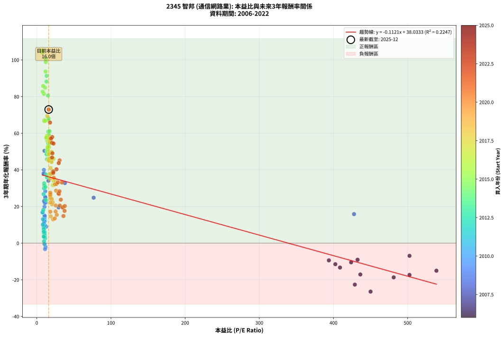
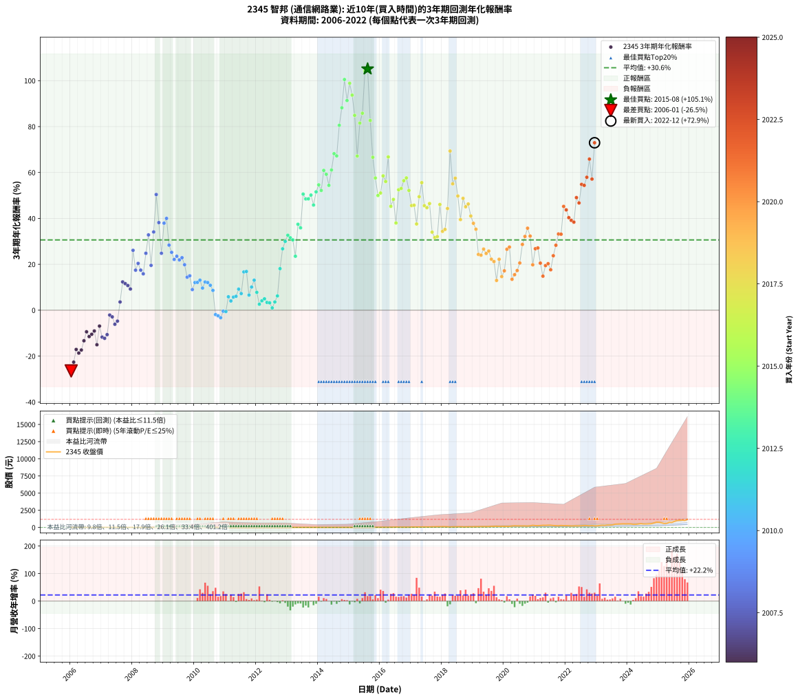

# 2345 智邦 - 本益比與未來報酬率分析

!!! info "報告資訊"
    - **股票代號**: 2345
    - **公司名稱**: 智邦
    - **產業別**: 通信網路業
    - **分析期間**: 2006-2022 (204 個數據點)
    - **資料來源**: Type 12 (ShowMonthlyK_ChartFlow) 月收盤價與本益比
    - **報酬率口徑**: 含現金股利 (簡化: 年度合計，假設每年7/1入帳)
    - **報告生成時間**: 2026-01-07 20:35:46 CST

## 📈 視覺化圖表

### 圖表1: 本益比 vs 未來報酬率關係

*圖表1：2345 智邦 本益比與3年期未來報酬率關係 (2006-2022)*

### 圖表2: 歷年買入時點的3年期實際報酬率

*圖表2：2345 智邦 歷年買入時點的3年期實際報酬率 (2006-2022)*

## 📍 買點訊號說明

本報告提供兩種買點提示訊號（顯示於圖表2的股價子圖中）：

### ▲ 小綠色三角形（回測驗證）
- **計算方式**: 使用全部歷史資料計算本益比第25百分位數
- **用途**: 事後驗證，顯示歷史上哪些時點確實為低估區
- **限制**: 當下無法判斷，僅供回測參考
- **特性**: 後見之明（Look-Ahead Bias）

### ▲ 小橘色三角形（即時訊號）
- **計算方式**: 使用截至當月的過去5年資料計算本益比第25百分位數
- **用途**: 實際投資決策，當時即可判斷
- **優勢**: 可操作性強，符合實務需求
- **特性**: 無後見之明，滾動窗口計算

!!! tip "如何使用兩種訊號"
    - **綠色▲** 幫助理解歷史估值機會，驗證策略有效性
    - **橘色▲** 可作為實際買進參考，但仍需搭配基本面分析
    - 兩種訊號重疊時，表示即時判斷與事後驗證一致，信心度較高
    - 僅有綠色▲時，表示當時無法判斷（需要未來資料才能確認）
    - 僅有橘色▲時，表示即時判斷為買點，但事後可能不是最佳時機

## 📊 估值分析摘要

| 指標 | 數值 |
|:---:|:---:|
| **目前本益比** (2022-12) | **16.02 倍** |
| **歷史平均本益比** | 46.68 倍 |
| **估值水準** | 🟢 相對低估 |
| **預期3年年化報酬率** | **+36.24%** |
| **歷史平均報酬率** | +30.61% |
| **相關係數 (R²)** | 0.2247 |
| **趨勢線斜率** | -0.1121 |

!!! abstract "核心洞察"
    目前本益比顯著低於歷史平均，預期未來報酬率可能較高

    根據歷史數據回測，2345 智邦 在目前本益比 **16.0倍** 的估值水準下，
    預期未來3年年化報酬率約為 **+36.2%**。

    **重要提醒**: 本分析基於歷史數據統計，實際報酬率會受到公司基本面變化、產業趨勢、
    總體經濟環境等多重因素影響。R² = 0.22 表示本益比可解釋約 22.5% 的報酬率變異。

## 📈 歷史估值統計

### 最佳買點 (最高報酬率)

| 項目 | 數值 |
|:---:|:---:|
| 起始時間 | 2015-08 |
| 當時本益比 | 7.38 倍 |
| 起始價格 | 13.8 元 |
| 3年後價格 | 109.5 元 |
| **3年年化報酬率** | **+105.10%** |

### 最差買點 (最低報酬率)

| 項目 | 數值 |
|:---:|:---:|
| 起始時間 | 2006-01 |
| 當時本益比 | 450.00 倍 |
| 起始價格 | 18.0 元 |
| 3年後價格 | 7.2 元 |
| **3年年化報酬率** | **-26.45%** |

## 🎯 投資啟示

### 本益比與報酬率關係

趨勢線方程式: **y = -0.1121x + 38.0333**

!!! note "負相關"
    本益比與未來報酬率呈現負相關。較低的本益比通常帶來較高的未來報酬率，
    但相關性不算非常強。**估值仍是重要參考指標之一**。

### 估值區間建議

基於歷史數據分析:

- **🟢 低估區** (P/E < 37.3): 預期報酬率較高，可考慮增加持股
- **🟡 合理區** (P/E 37.3-56.0): 預期報酬率符合長期趨勢，正常持有
- **🔴 高估區** (P/E > 56.0): 預期報酬率較低，可考慮減碼或觀望

!!! danger "風險提示"
    - 過去表現不代表未來結果
    - 本分析假設公司基本面無重大結構性變化
    - 產業環境劇變可能使歷史規律失效
    - 應結合公司財報、產業趨勢、總體經濟等多重因素綜合判斷

!!! success "長期投資觀點"
    歷史數據顯示，在合理或低估的估值水準買入並長期持有，
    往往能獲得較佳的投資報酬。**耐心等待好價格**是價值投資的核心原則。

## 📊 數據品質

- **資料來源**: GoodInfo.tw Type 12 (ShowMonthlyK_ChartFlow)
- **資料頻率**: 月度收盤價與本益比
- **回測期間**: 2006-2022
- **數據點數量**: 204 個 (每個點代表一次3年期回測)

### 計算方法說明

1. **3年期年化報酬率**:
   - 對每個歷史時點，計算其後3年的實際投資報酬率
   - 期末價值(不含股利): 期末價格
   - 期末價值(含現金股利): 期末價格 + 持有期間內的現金股利合計 (簡化: 年度合計，假設每年7/1入帳)
   - 公式: 年化報酬率 = [(期末價值/期初價格)^(1/年數) - 1] × 100%

2. **本益比 (P/E Ratio)**:
   - 使用當時的月收盤價與EPS計算
   - 資料來源: Type 12 月度河流圖本益比數據

3. **趨勢線 (Linear Regression)**:
   - 使用最小平方法擬合線性趨勢線
   - R²值衡量本益比對報酬率的解釋能力

---

*本報告由 Stock Analysis System v1.9.0 自動生成*
*數據更新時間: 2026-01-07 20:35:46 CST*

## 📋 月度回測明細表

（每一列對應時間線圖中的一個買入點；可用來對照 SVG 圖上的每個點。）

| 買入月份 | 賣出月份 | 回測期限_年 | 實際持有年數 | 買入本益比_倍 | 買入收盤價_元 | 賣出收盤價_元 | 現金股利合計_元 | 總報酬率_pct | 年化報酬率_pct |
| --- | --- | --- | --- | --- | --- | --- | --- | --- | --- |
| 2006-01 | 2009-01 | 3 | 3.001 | 450.00 | 18.00 | 7.16 | 0.00 | -60.22 | -26.45 |
| 2006-02 | 2009-02 | 3 | 3.001 | 428.80 | 17.15 | 7.94 | 0.00 | -53.70 | -22.64 |
| 2006-03 | 2009-03 | 3 | 3.001 | 436.20 | 17.45 | 9.94 | 0.00 | -43.04 | -17.10 |
| 2006-04 | 2009-04 | 3 | 3.001 | 481.20 | 19.25 | 10.35 | 0.00 | -46.23 | -18.68 |
| 2006-05 | 2009-05 | 3 | 3.001 | 502.50 | 20.10 | 11.35 | 0.00 | -43.53 | -17.34 |
| 2006-06 | 2009-06 | 3 | 3.001 | 408.80 | 16.35 | 10.65 | 0.00 | -34.86 | -13.31 |
| 2006-07 | 2009-07 | 3 | 3.001 | 393.80 | 15.75 | 11.05 | 0.66 | -25.64 | -9.40 |
| 2006-08 | 2009-08 | 3 | 3.001 | 402.50 | 16.10 | 10.50 | 0.66 | -30.68 | -11.49 |
| 2006-09 | 2009-09 | 3 | 3.001 | 423.80 | 16.95 | 11.50 | 0.66 | -28.25 | -10.48 |
| 2006-10 | 2009-10 | 3 | 3.001 | 432.50 | 17.30 | 12.35 | 0.66 | -24.79 | -9.06 |
| 2006-11 | 2009-11 | 3 | 3.001 | 538.80 | 21.55 | 12.55 | 0.66 | -38.70 | -15.05 |
| 2006-12 | 2009-12 | 3 | 3.001 | 502.50 | 20.10 | 15.55 | 0.66 | -19.35 | -6.92 |
| 2007-01 | 2010-01 | 3 | 3.001 |  | 21.60 | 14.20 | 0.66 | -31.20 | -11.72 |
| 2007-02 | 2010-02 | 3 | 3.001 |  | 21.70 | 14.00 | 0.66 | -32.44 | -12.25 |
| 2007-03 | 2010-03 | 3 | 3.001 |  | 21.60 | 14.75 | 0.66 | -28.65 | -10.64 |
| 2007-04 | 2010-04 | 3 | 3.001 |  | 18.40 | 16.60 | 0.66 | -6.19 | -2.11 |
| 2007-05 | 2010-05 | 3 | 3.001 |  | 17.60 | 15.45 | 0.66 | -8.46 | -2.90 |
| 2007-06 | 2010-06 | 3 | 3.001 |  | 20.20 | 16.05 | 0.66 | -17.27 | -6.12 |
| 2007-07 | 2010-07 | 3 | 3.001 |  | 20.50 | 15.95 | 1.76 | -13.62 | -4.76 |
| 2007-08 | 2010-08 | 3 | 3.001 |  | 16.20 | 16.25 | 1.76 | +11.15 | +3.59 |
| 2007-09 | 2010-09 | 3 | 3.001 |  | 16.55 | 21.70 | 1.76 | +41.73 | +12.33 |
| 2007-10 | 2010-10 | 3 | 3.001 |  | 17.10 | 22.00 | 1.76 | +38.93 | +11.58 |
| 2007-11 | 2010-11 | 3 | 3.001 |  | 17.30 | 21.75 | 1.76 | +35.88 | +10.76 |
| 2007-12 | 2010-12 | 3 | 3.001 |  | 17.00 | 20.40 | 1.76 | +30.34 | +9.23 |
| 2008-01 | 2011-01 | 3 | 3.001 |  | 11.40 | 21.10 | 1.76 | +100.50 | +26.09 |
| 2008-02 | 2011-03 | 3 | 3.080 |  | 12.65 | 19.00 | 1.76 | +64.09 | +17.44 |
| 2008-03 | 2011-03 | 3 | 2.998 |  | 11.90 | 19.00 | 1.76 | +74.43 | +20.39 |
| 2008-04 | 2011-04 | 3 | 2.998 |  | 12.75 | 18.90 | 1.76 | +62.02 | +17.46 |
| 2008-05 | 2011-05 | 3 | 2.998 | 427.70 | 13.90 | 19.85 | 1.76 | +55.45 | +15.85 |
| 2008-06 | 2011-06 | 3 | 2.998 | 76.67 | 10.35 | 18.35 | 1.76 | +94.27 | +24.80 |
| 2008-07 | 2011-07 | 3 | 2.998 | 37.89 | 9.00 | 17.90 | 3.17 | +134.12 | +32.81 |
| 2008-08 | 2011-08 | 3 | 2.998 | 29.41 | 10.00 | 13.90 | 3.17 | +70.71 | +19.53 |
| 2008-09 | 2011-09 | 3 | 2.998 | 15.68 | 6.94 | 13.55 | 3.17 | +140.94 | +34.09 |
| 2008-10 | 2011-10 | 3 | 2.998 | 10.35 | 5.64 | 16.00 | 3.17 | +239.91 | +50.40 |
| 2008-11 | 2011-11 | 3 | 2.998 | 9.88 | 6.40 | 13.70 | 3.17 | +163.61 | +38.17 |
| 2008-12 | 2011-12 | 3 | 2.998 | 11.61 | 8.71 | 13.75 | 3.17 | +94.27 | +24.80 |
| 2009-01 | 2012-01 | 3 | 2.998 | 9.06 | 7.16 | 15.60 | 3.17 | +162.16 | +37.92 |
| 2009-02 | 2012-02 | 3 | 2.998 | 9.57 | 7.94 | 18.60 | 3.17 | +174.19 | +40.00 |
| 2009-03 | 2012-03 | 3 | 3.001 | 11.43 | 9.94 | 17.85 | 3.17 | +111.48 | +28.35 |
| 2009-04 | 2012-04 | 3 | 3.001 | 11.37 | 10.35 | 17.15 | 3.17 | +96.34 | +25.21 |
| 2009-05 | 2012-05 | 3 | 3.001 | 11.95 | 11.35 | 17.50 | 3.17 | +82.12 | +22.11 |
| 2009-06 | 2012-06 | 3 | 3.001 | 10.76 | 10.65 | 16.90 | 3.17 | +88.46 | +23.51 |
| 2009-07 | 2012-07 | 3 | 3.001 | 10.73 | 11.05 | 16.05 | 3.98 | +81.30 | +21.93 |
| 2009-08 | 2012-08 | 3 | 3.001 | 9.81 | 10.50 | 15.50 | 3.98 | +85.56 | +22.88 |
| 2009-09 | 2012-09 | 3 | 3.001 | 10.36 | 11.50 | 15.80 | 3.98 | +72.03 | +19.82 |
| 2009-10 | 2012-10 | 3 | 3.001 | 10.74 | 12.35 | 14.50 | 3.98 | +49.67 | +14.38 |
| 2009-11 | 2012-11 | 3 | 3.001 | 10.55 | 12.55 | 15.10 | 3.98 | +52.06 | +14.99 |
| 2009-12 | 2012-12 | 3 | 3.001 | 12.64 | 15.55 | 16.15 | 3.98 | +29.48 | +8.99 |
| 2010-01 | 2013-01 | 3 | 3.001 | 10.96 | 14.20 | 16.00 | 3.98 | +40.73 | +12.06 |
| 2010-02 | 2013-02 | 3 | 3.001 | 10.28 | 14.00 | 15.75 | 3.98 | +40.96 | +12.12 |
| 2010-03 | 2013-03 | 3 | 3.001 | 10.33 | 14.75 | 17.35 | 3.98 | +44.64 | +13.09 |
| 2010-04 | 2013-04 | 3 | 3.001 | 11.12 | 16.60 | 17.90 | 3.98 | +31.83 | +9.65 |
| 2010-05 | 2013-05 | 3 | 3.001 | 9.91 | 15.45 | 17.90 | 3.98 | +41.64 | +12.30 |
| 2010-06 | 2013-06 | 3 | 3.001 | 9.88 | 16.05 | 18.60 | 3.98 | +40.71 | +12.05 |
| 2010-07 | 2013-07 | 3 | 3.001 | 9.43 | 15.95 | 17.35 | 4.38 | +36.25 | +10.86 |
| 2010-08 | 2013-08 | 3 | 3.001 | 9.25 | 16.25 | 16.45 | 4.38 | +28.20 | +8.63 |
| 2010-09 | 2013-09 | 3 | 3.001 | 11.91 | 21.70 | 16.10 | 4.38 | -5.61 | -1.91 |
| 2010-10 | 2013-10 | 3 | 3.001 | 11.65 | 22.00 | 16.05 | 4.38 | -7.13 | -2.43 |
| 2010-11 | 2013-11 | 3 | 3.001 | 11.13 | 21.75 | 15.30 | 4.38 | -9.51 | -3.27 |
| 2010-12 | 2013-12 | 3 | 3.001 | 10.10 | 20.40 | 15.75 | 4.38 | -1.31 | -0.44 |
| 2011-01 | 2014-01 | 3 | 3.001 | 10.60 | 21.10 | 16.35 | 4.38 | -1.74 | -0.58 |
| 2011-02 | 2014-02 | 3 | 3.001 | 9.26 | 18.15 | 17.15 | 4.38 | +18.63 | +5.86 |
| 2011-03 | 2014-03 | 3 | 3.001 | 9.84 | 19.00 | 17.00 | 4.38 | +12.54 | +4.01 |
| 2011-04 | 2014-04 | 3 | 3.001 | 9.95 | 18.90 | 17.95 | 4.38 | +18.16 | +5.72 |
| 2011-05 | 2014-05 | 3 | 3.001 | 10.61 | 19.85 | 19.30 | 4.38 | +19.30 | +6.06 |
| 2011-06 | 2014-06 | 3 | 3.001 | 9.97 | 18.35 | 19.50 | 4.38 | +30.15 | +9.18 |
| 2011-07 | 2014-07 | 3 | 3.001 | 9.89 | 17.90 | 18.20 | 3.88 | +23.36 | +7.25 |
| 2011-08 | 2014-08 | 3 | 3.001 | 7.81 | 13.90 | 18.20 | 3.88 | +58.86 | +16.68 |
| 2011-09 | 2014-09 | 3 | 3.001 | 7.74 | 13.55 | 17.75 | 3.88 | +59.64 | +16.87 |
| 2011-10 | 2014-10 | 3 | 3.001 | 9.30 | 16.00 | 15.50 | 3.88 | +21.13 | +6.60 |
| 2011-11 | 2014-11 | 3 | 3.001 | 8.11 | 13.70 | 14.40 | 3.88 | +33.44 | +10.09 |
| 2011-12 | 2014-12 | 3 | 3.001 | 8.28 | 13.75 | 16.00 | 3.88 | +44.59 | +13.07 |
| 2012-01 | 2015-01 | 3 | 3.001 | 9.40 | 15.60 | 15.65 | 3.88 | +25.20 | +7.78 |
| 2012-02 | 2015-03 | 3 | 3.080 | 11.22 | 18.60 | 16.25 | 3.88 | +8.23 | +2.60 |
| 2012-03 | 2015-03 | 3 | 2.998 | 10.77 | 17.85 | 16.25 | 3.88 | +12.78 | +4.09 |
| 2012-04 | 2015-04 | 3 | 2.998 | 10.35 | 17.15 | 15.95 | 3.88 | +15.63 | +4.96 |
| 2012-05 | 2015-05 | 3 | 2.998 | 10.57 | 17.50 | 15.45 | 3.88 | +10.46 | +3.37 |
| 2012-06 | 2015-06 | 3 | 2.998 | 10.21 | 16.90 | 14.70 | 3.88 | +9.95 | +3.21 |
| 2012-07 | 2015-07 | 3 | 2.998 | 9.70 | 16.05 | 13.05 | 3.48 | +3.00 | +0.99 |
| 2012-08 | 2015-08 | 3 | 2.998 | 9.38 | 15.50 | 13.75 | 3.48 | +11.17 | +3.60 |
| 2012-09 | 2015-09 | 3 | 2.998 | 9.56 | 15.80 | 15.45 | 3.48 | +19.82 | +6.22 |
| 2012-10 | 2015-10 | 3 | 2.998 | 8.78 | 14.50 | 20.40 | 3.48 | +64.70 | +18.11 |
| 2012-11 | 2015-11 | 3 | 2.998 | 9.15 | 15.10 | 27.25 | 3.48 | +103.52 | +26.75 |
| 2012-12 | 2015-12 | 3 | 2.998 | 9.79 | 16.15 | 31.95 | 3.48 | +119.39 | +29.96 |
| 2013-01 | 2016-01 | 3 | 2.998 | 9.99 | 16.00 | 33.85 | 3.48 | +133.33 | +32.66 |
| 2013-02 | 2016-02 | 3 | 2.998 | 10.15 | 15.75 | 32.35 | 3.48 | +127.50 | +31.55 |
| 2013-03 | 2016-03 | 3 | 3.001 | 11.55 | 17.35 | 35.20 | 3.48 | +122.95 | +30.63 |
| 2013-04 | 2016-04 | 3 | 3.001 | 12.32 | 17.90 | 30.25 | 3.48 | +88.45 | +23.51 |
| 2013-05 | 2016-05 | 3 | 3.001 | 12.75 | 17.90 | 43.00 | 3.48 | +159.68 | +37.44 |
| 2013-06 | 2016-06 | 3 | 3.001 | 13.73 | 18.60 | 43.20 | 3.48 | +150.98 | +35.89 |
| 2013-07 | 2016-07 | 3 | 3.001 | 13.29 | 17.35 | 55.30 | 3.95 | +241.50 | +50.58 |
| 2013-08 | 2016-08 | 3 | 3.001 | 13.09 | 16.45 | 49.90 | 3.95 | +227.36 | +48.47 |
| 2013-09 | 2016-09 | 3 | 3.001 | 13.33 | 16.10 | 48.80 | 3.95 | +227.65 | +48.51 |
| 2013-10 | 2016-10 | 3 | 3.001 | 13.86 | 16.05 | 50.40 | 3.95 | +238.64 | +50.15 |
| 2013-11 | 2016-11 | 3 | 3.001 | 13.79 | 15.30 | 43.50 | 3.95 | +210.14 | +45.82 |
| 2013-12 | 2016-12 | 3 | 3.001 | 14.86 | 15.75 | 50.90 | 3.95 | +248.26 | +51.56 |
| 2014-01 | 2017-01 | 3 | 3.001 | 15.24 | 16.35 | 56.50 | 3.95 | +269.73 | +54.62 |
| 2014-02 | 2017-02 | 3 | 3.001 | 15.81 | 17.15 | 56.50 | 3.95 | +252.48 | +52.17 |
| 2014-03 | 2017-03 | 3 | 3.001 | 15.49 | 17.00 | 66.90 | 3.95 | +316.77 | +60.91 |
| 2014-04 | 2017-04 | 3 | 3.001 | 16.17 | 17.95 | 68.50 | 3.95 | +303.63 | +59.20 |
| 2014-05 | 2017-05 | 3 | 3.001 | 17.19 | 19.30 | 67.10 | 3.95 | +268.14 | +54.39 |
| 2014-06 | 2017-06 | 3 | 3.001 | 17.18 | 19.50 | 77.60 | 3.95 | +318.21 | +61.10 |
| 2014-07 | 2017-07 | 3 | 3.001 | 15.86 | 18.20 | 80.50 | 6.14 | +376.02 | +68.20 |
| 2014-08 | 2017-08 | 3 | 3.001 | 15.69 | 18.20 | 79.00 | 6.14 | +367.78 | +67.22 |
| 2014-09 | 2017-09 | 3 | 3.001 | 15.14 | 17.75 | 98.40 | 6.14 | +488.94 | +80.56 |
| 2014-10 | 2017-10 | 3 | 3.001 | 13.08 | 15.50 | 97.20 | 6.14 | +566.68 | +88.18 |
| 2014-11 | 2017-11 | 3 | 3.001 | 12.03 | 14.40 | 110.00 | 6.14 | +706.50 | +100.51 |
| 2014-12 | 2017-12 | 3 | 3.001 | 13.22 | 16.00 | 106.00 | 6.14 | +600.85 | +91.34 |
| 2015-01 | 2018-01 | 3 | 3.001 | 12.12 | 15.65 | 117.00 | 6.14 | +686.81 | +98.86 |
| 2015-02 | 2018-02 | 3 | 3.001 | 11.83 | 16.25 | 112.00 | 6.14 | +626.99 | +93.69 |
| 2015-03 | 2018-03 | 3 | 3.001 | 11.17 | 16.25 | 96.60 | 6.14 | +532.22 | +84.88 |
| 2015-04 | 2018-04 | 3 | 3.001 | 10.38 | 15.95 | 68.40 | 6.14 | +367.31 | +67.17 |
| 2015-05 | 2018-05 | 3 | 3.001 | 9.55 | 15.45 | 86.30 | 6.14 | +498.29 | +81.51 |
| 2015-06 | 2018-06 | 3 | 3.001 | 8.65 | 14.70 | 88.20 | 6.14 | +541.74 | +85.81 |
| 2015-07 | 2018-07 | 3 | 3.001 | 7.32 | 13.05 | 102.00 | 9.19 | +752.05 | +104.21 |
| 2015-08 | 2018-08 | 3 | 3.001 | 7.38 | 13.75 | 109.50 | 9.19 | +763.21 | +105.10 |
| 2015-09 | 2018-09 | 3 | 3.001 | 7.94 | 15.45 | 85.00 | 9.19 | +509.66 | +82.66 |
| 2015-10 | 2018-10 | 3 | 3.001 | 10.07 | 20.40 | 85.20 | 9.19 | +362.71 | +66.62 |
| 2015-11 | 2018-11 | 3 | 3.001 | 12.92 | 27.25 | 97.50 | 9.19 | +291.53 | +57.60 |
| 2015-12 | 2018-12 | 3 | 3.001 | 14.59 | 31.95 | 98.60 | 9.19 | +237.38 | +49.97 |
| 2016-01 | 2019-01 | 3 | 3.001 | 14.72 | 33.85 | 107.50 | 9.19 | +244.73 | +51.05 |
| 2016-02 | 2019-03 | 3 | 3.080 | 13.42 | 32.35 | 124.50 | 9.19 | +313.27 | +58.51 |
| 2016-03 | 2019-03 | 3 | 2.998 | 13.97 | 35.20 | 124.50 | 9.19 | +279.81 | +56.07 |
| 2016-04 | 2019-04 | 3 | 2.998 | 11.50 | 30.25 | 131.00 | 9.19 | +363.44 | +66.78 |
| 2016-05 | 2019-05 | 3 | 2.998 | 15.69 | 43.00 | 122.50 | 9.19 | +206.26 | +45.26 |
| 2016-06 | 2019-06 | 3 | 2.998 | 15.16 | 43.20 | 131.50 | 9.19 | +225.68 | +48.27 |
| 2016-07 | 2019-07 | 3 | 2.998 | 18.68 | 55.30 | 134.00 | 11.23 | +162.62 | +38.00 |
| 2016-08 | 2019-08 | 3 | 2.998 | 16.25 | 49.90 | 165.50 | 11.23 | +254.16 | +52.47 |
| 2016-09 | 2019-09 | 3 | 2.998 | 15.35 | 48.80 | 163.50 | 11.23 | +258.05 | +53.03 |
| 2016-10 | 2019-10 | 3 | 2.998 | 15.32 | 50.40 | 181.50 | 11.23 | +282.39 | +56.42 |
| 2016-11 | 2019-11 | 3 | 2.998 | 12.79 | 43.50 | 159.00 | 11.23 | +291.33 | +57.63 |
| 2016-12 | 2019-12 | 3 | 2.998 | 14.50 | 50.90 | 168.00 | 11.23 | +252.12 | +52.18 |
| 2017-01 | 2020-01 | 3 | 2.998 | 15.66 | 56.50 | 163.00 | 11.23 | +208.37 | +45.59 |
| 2017-02 | 2020-02 | 3 | 2.998 | 15.25 | 56.50 | 163.50 | 11.23 | +209.25 | +45.73 |
| 2017-03 | 2020-03 | 3 | 3.001 | 17.59 | 66.90 | 163.00 | 11.23 | +160.43 | +37.57 |
| 2017-04 | 2020-04 | 3 | 3.001 | 17.56 | 68.50 | 217.50 | 11.23 | +233.91 | +49.45 |
| 2017-05 | 2020-05 | 3 | 3.001 | 16.79 | 67.10 | 241.50 | 11.23 | +276.64 | +55.57 |
| 2017-06 | 2020-06 | 3 | 3.001 | 18.95 | 77.60 | 228.00 | 11.23 | +208.28 | +45.53 |
| 2017-07 | 2020-07 | 3 | 3.001 | 19.20 | 80.50 | 229.50 | 14.32 | +202.88 | +44.67 |
| 2017-08 | 2020-08 | 3 | 3.001 | 18.41 | 79.00 | 234.00 | 14.32 | +214.33 | +46.47 |
| 2017-09 | 2020-09 | 3 | 3.001 | 22.43 | 98.40 | 222.50 | 14.32 | +140.67 | +34.00 |
| 2017-10 | 2020-10 | 3 | 3.001 | 21.67 | 97.20 | 207.50 | 14.32 | +128.21 | +31.65 |
| 2017-11 | 2020-11 | 3 | 3.001 | 24.00 | 110.00 | 239.00 | 14.32 | +130.29 | +32.05 |
| 2017-12 | 2020-12 | 3 | 3.001 | 22.65 | 106.00 | 316.00 | 14.32 | +211.62 | +46.05 |
| 2018-01 | 2021-01 | 3 | 3.001 | 24.71 | 117.00 | 269.50 | 14.32 | +142.58 | +34.36 |
| 2018-02 | 2021-02 | 3 | 3.001 | 23.39 | 112.00 | 262.50 | 14.32 | +147.16 | +35.20 |
| 2018-03 | 2021-03 | 3 | 3.001 | 19.95 | 96.60 | 276.00 | 14.32 | +200.54 | +44.30 |
| 2018-04 | 2021-04 | 3 | 3.001 | 13.97 | 68.40 | 318.00 | 14.32 | +385.85 | +69.35 |
| 2018-05 | 2021-05 | 3 | 3.001 | 17.43 | 86.30 | 307.50 | 14.32 | +272.91 | +55.06 |
| 2018-06 | 2021-06 | 3 | 3.001 | 17.62 | 88.20 | 330.50 | 14.32 | +290.95 | +57.52 |
| 2018-07 | 2021-07 | 3 | 3.001 | 20.16 | 102.00 | 326.00 | 16.68 | +235.96 | +49.76 |
| 2018-08 | 2021-08 | 3 | 3.001 | 21.41 | 109.50 | 280.50 | 16.68 | +171.40 | +39.48 |
| 2018-09 | 2021-09 | 3 | 3.001 | 16.45 | 85.00 | 263.00 | 16.68 | +229.04 | +48.72 |
| 2018-10 | 2021-10 | 3 | 3.001 | 16.32 | 85.20 | 243.50 | 16.68 | +205.38 | +45.07 |
| 2018-11 | 2021-11 | 3 | 3.001 | 18.48 | 97.50 | 288.50 | 16.68 | +213.01 | +46.27 |
| 2018-12 | 2021-12 | 3 | 3.001 | 18.50 | 98.60 | 260.00 | 16.68 | +180.61 | +41.04 |
| 2019-01 | 2022-01 | 3 | 3.001 | 19.10 | 107.50 | 265.00 | 16.68 | +162.03 | +37.85 |
| 2019-02 | 2022-02 | 3 | 3.001 | 18.31 | 108.50 | 252.00 | 16.68 | +147.64 | +35.28 |
| 2019-03 | 2022-03 | 3 | 3.001 | 20.00 | 124.50 | 222.50 | 16.68 | +92.12 | +24.31 |
| 2019-04 | 2022-04 | 3 | 3.001 | 20.08 | 131.00 | 233.00 | 16.68 | +90.60 | +23.98 |
| 2019-05 | 2022-05 | 3 | 3.001 | 17.96 | 122.50 | 232.00 | 16.68 | +103.01 | +26.61 |
| 2019-06 | 2022-06 | 3 | 3.001 | 18.47 | 131.50 | 238.50 | 16.68 | +94.06 | +24.73 |
| 2019-07 | 2022-07 | 3 | 3.001 | 18.06 | 134.00 | 248.00 | 18.68 | +99.02 | +25.78 |
| 2019-08 | 2022-08 | 3 | 3.001 | 21.45 | 165.50 | 283.50 | 18.68 | +82.59 | +22.22 |
| 2019-09 | 2022-09 | 3 | 3.001 | 20.40 | 163.50 | 272.50 | 18.68 | +78.09 | +21.21 |
| 2019-10 | 2022-10 | 3 | 3.001 | 21.83 | 181.50 | 243.00 | 18.68 | +44.18 | +12.97 |
| 2019-11 | 2022-11 | 3 | 3.001 | 18.46 | 159.00 | 271.50 | 18.68 | +82.51 | +22.20 |
| 2019-12 | 2022-12 | 3 | 3.001 | 18.86 | 168.00 | 234.50 | 18.68 | +50.71 | +14.65 |
| 2020-01 | 2023-01 | 3 | 3.001 | 18.27 | 163.00 | 243.50 | 18.68 | +60.85 | +17.16 |
| 2020-02 | 2023-03 | 3 | 3.080 | 18.30 | 163.50 | 319.00 | 18.68 | +106.54 | +26.55 |
| 2020-03 | 2023-03 | 3 | 2.998 | 18.21 | 163.00 | 319.00 | 18.68 | +107.17 | +27.50 |
| 2020-04 | 2023-04 | 3 | 2.998 | 24.27 | 217.50 | 299.00 | 18.68 | +46.06 | +13.47 |
| 2020-05 | 2023-05 | 3 | 2.998 | 26.90 | 241.50 | 353.00 | 18.68 | +53.91 | +15.47 |
| 2020-06 | 2023-06 | 3 | 2.998 | 25.36 | 228.00 | 349.00 | 18.68 | +61.27 | +17.28 |
| 2020-07 | 2023-07 | 3 | 2.998 | 25.49 | 229.50 | 382.00 | 20.00 | +75.16 | +20.56 |
| 2020-08 | 2023-08 | 3 | 2.998 | 25.95 | 234.00 | 478.00 | 20.00 | +112.82 | +28.65 |
| 2020-09 | 2023-09 | 3 | 2.998 | 24.64 | 222.50 | 493.00 | 20.00 | +130.56 | +32.13 |
| 2020-10 | 2023-10 | 3 | 2.998 | 22.95 | 207.50 | 498.50 | 20.00 | +149.88 | +35.73 |
| 2020-11 | 2023-11 | 3 | 2.998 | 26.39 | 239.00 | 533.00 | 20.00 | +131.38 | +32.29 |
| 2020-12 | 2023-12 | 3 | 2.998 | 34.84 | 316.00 | 523.00 | 20.00 | +71.83 | +19.79 |
| 2021-01 | 2024-01 | 3 | 2.998 | 29.89 | 269.50 | 529.00 | 20.00 | +103.71 | +26.79 |
| 2021-02 | 2024-02 | 3 | 2.998 | 29.28 | 262.50 | 519.00 | 20.00 | +105.33 | +27.12 |
| 2021-03 | 2024-03 | 3 | 3.001 | 30.97 | 276.00 | 463.00 | 20.00 | +75.00 | +20.50 |
| 2021-04 | 2024-04 | 3 | 3.001 | 35.89 | 318.00 | 461.50 | 20.00 | +51.41 | +14.83 |
| 2021-05 | 2024-05 | 3 | 3.001 | 34.91 | 307.50 | 504.00 | 20.00 | +70.40 | +19.44 |
| 2021-06 | 2024-06 | 3 | 3.001 | 37.75 | 330.50 | 555.00 | 20.00 | +73.98 | +20.27 |
| 2021-07 | 2024-07 | 3 | 3.001 | 37.46 | 326.00 | 507.00 | 23.49 | +62.73 | +17.62 |
| 2021-08 | 2024-08 | 3 | 3.001 | 32.43 | 280.50 | 508.00 | 23.49 | +89.48 | +23.74 |
| 2021-09 | 2024-09 | 3 | 3.001 | 30.59 | 263.00 | 532.00 | 23.49 | +111.21 | +28.30 |
| 2021-10 | 2024-10 | 3 | 3.001 | 28.50 | 243.50 | 552.00 | 23.49 | +136.34 | +33.19 |
| 2021-11 | 2024-11 | 3 | 3.001 | 33.97 | 288.50 | 657.00 | 23.49 | +135.87 | +33.11 |
| 2021-12 | 2024-12 | 3 | 3.001 | 30.81 | 260.00 | 773.00 | 23.49 | +206.34 | +45.22 |
| 2022-01 | 2025-01 | 3 | 3.001 | 29.59 | 265.00 | 763.00 | 23.49 | +196.79 | +43.70 |
| 2022-02 | 2025-02 | 3 | 3.001 | 26.60 | 252.00 | 673.00 | 23.49 | +176.39 | +40.33 |
| 2022-03 | 2025-03 | 3 | 3.001 | 22.27 | 222.50 | 576.00 | 23.49 | +169.44 | +39.14 |
| 2022-04 | 2025-04 | 3 | 3.001 | 22.18 | 233.00 | 594.00 | 23.49 | +165.02 | +38.38 |
| 2022-05 | 2025-05 | 3 | 3.001 | 21.05 | 232.00 | 745.00 | 23.49 | +231.25 | +49.05 |
| 2022-06 | 2025-06 | 3 | 3.001 | 20.67 | 238.50 | 730.00 | 23.49 | +215.93 | +46.72 |
| 2022-07 | 2025-07 | 3 | 3.001 | 20.57 | 248.00 | 892.00 | 28.50 | +271.17 | +54.82 |
| 2022-08 | 2025-08 | 3 | 3.001 | 22.55 | 283.50 | 1015.00 | 28.50 | +268.08 | +54.38 |
| 2022-09 | 2025-09 | 3 | 3.001 | 20.82 | 272.50 | 1045.00 | 28.50 | +293.94 | +57.92 |
| 2022-10 | 2025-10 | 3 | 3.001 | 17.86 | 243.00 | 1080.00 | 28.50 | +356.17 | +65.83 |
| 2022-11 | 2025-11 | 3 | 3.001 | 19.22 | 271.50 | 1025.00 | 28.50 | +288.03 | +57.12 |
| 2022-12 | 2025-12 | 3 | 3.001 | 16.02 | 234.50 | 1185.00 | 28.50 | +417.48 | +72.95 |
