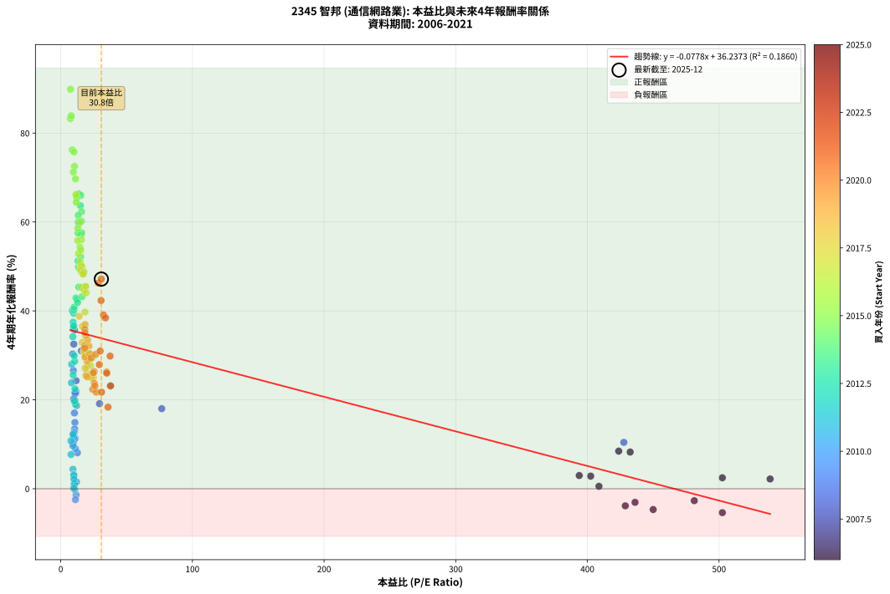
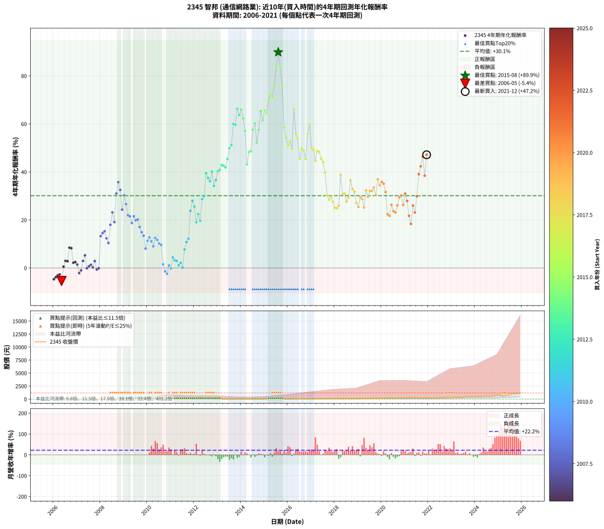

# 2345 智邦 - 本益比與未來報酬率分析

!!! info "報告資訊"
    - **股票代號**: 2345
    - **公司名稱**: 智邦
    - **產業別**: 通信網路業
    - **分析期間**: 2006-2021 (192 個數據點)
    - **資料來源**: Type 12 (ShowMonthlyK_ChartFlow) 月收盤價與本益比
    - **報酬率口徑**: 含現金股利 (簡化: 年度合計，假設每年7/1入帳)
    - **報告生成時間**: 2026-01-04 08:24:31 CST

## 📈 視覺化圖表

### 圖表1: 本益比 vs 未來報酬率關係

*圖表1：2345 智邦 本益比與4年期未來報酬率關係 (2006-2021)*

### 圖表2: 歷年買入時點的4年期實際報酬率

*圖表2：2345 智邦 歷年買入時點的4年期實際報酬率 (2006-2021)*

## 📍 買點訊號說明

本報告提供兩種買點提示訊號（顯示於圖表2的股價子圖中）：

### ▲ 小綠色三角形（回測驗證）
- **計算方式**: 使用全部歷史資料計算本益比第25百分位數
- **用途**: 事後驗證，顯示歷史上哪些時點確實為低估區
- **限制**: 當下無法判斷，僅供回測參考
- **特性**: 後見之明（Look-Ahead Bias）

### ▲ 小橘色三角形（即時訊號）
- **計算方式**: 使用截至當月的過去5年資料計算本益比第25百分位數
- **用途**: 實際投資決策，當時即可判斷
- **優勢**: 可操作性強，符合實務需求
- **特性**: 無後見之明，滾動窗口計算

!!! tip "如何使用兩種訊號"
    - **綠色▲** 幫助理解歷史估值機會，驗證策略有效性
    - **橘色▲** 可作為實際買進參考，但仍需搭配基本面分析
    - 兩種訊號重疊時，表示即時判斷與事後驗證一致，信心度較高
    - 僅有綠色▲時，表示當時無法判斷（需要未來資料才能確認）
    - 僅有橘色▲時，表示即時判斷為買點，但事後可能不是最佳時機

## 📊 估值分析摘要

| 指標 | 數值 |
|:---:|:---:|
| **目前本益比** (2021-12) | **30.81 倍** |
| **歷史平均本益比** | 48.39 倍 |
| **估值水準** | 🟢 相對低估 |
| **預期4年年化報酬率** | **+33.84%** |
| **歷史平均報酬率** | +30.11% |
| **相關係數 (R²)** | 0.1860 |
| **趨勢線斜率** | -0.0778 |

!!! abstract "核心洞察"
    目前本益比顯著低於歷史平均，預期未來報酬率可能較高

    根據歷史數據回測，2345 智邦 在目前本益比 **30.8倍** 的估值水準下，
    預期未來4年年化報酬率約為 **+33.8%**。

    **重要提醒**: 本分析基於歷史數據統計，實際報酬率會受到公司基本面變化、產業趨勢、
    總體經濟環境等多重因素影響。R² = 0.19 表示本益比可解釋約 18.6% 的報酬率變異。

## 📈 歷史估值統計

### 最佳買點 (最高報酬率)

| 項目 | 數值 |
|:---:|:---:|
| 起始時間 | 2015-08 |
| 當時本益比 | 7.38 倍 |
| 起始價格 | 13.8 元 |
| 4年後價格 | 165.5 元 |
| **4年年化報酬率** | **+89.87%** |

### 最差買點 (最低報酬率)

| 項目 | 數值 |
|:---:|:---:|
| 起始時間 | 2006-05 |
| 當時本益比 | 502.50 倍 |
| 起始價格 | 20.1 元 |
| 4年後價格 | 15.4 元 |
| **4年年化報酬率** | **-5.38%** |

## 🎯 投資啟示

### 本益比與報酬率關係

趨勢線方程式: **y = -0.0778x + 36.2373**

!!! note "負相關"
    本益比與未來報酬率呈現負相關。較低的本益比通常帶來較高的未來報酬率，
    但相關性不算非常強。**估值仍是重要參考指標之一**。

### 估值區間建議

基於歷史數據分析:

- **🟢 低估區** (P/E < 38.7): 預期報酬率較高，可考慮增加持股
- **🟡 合理區** (P/E 38.7-58.1): 預期報酬率符合長期趨勢，正常持有
- **🔴 高估區** (P/E > 58.1): 預期報酬率較低，可考慮減碼或觀望

!!! danger "風險提示"
    - 過去表現不代表未來結果
    - 本分析假設公司基本面無重大結構性變化
    - 產業環境劇變可能使歷史規律失效
    - 應結合公司財報、產業趨勢、總體經濟等多重因素綜合判斷

!!! success "長期投資觀點"
    歷史數據顯示，在合理或低估的估值水準買入並長期持有，
    往往能獲得較佳的投資報酬。**耐心等待好價格**是價值投資的核心原則。

## 📊 數據品質

- **資料來源**: GoodInfo.tw Type 12 (ShowMonthlyK_ChartFlow)
- **資料頻率**: 月度收盤價與本益比
- **回測期間**: 2006-2021
- **數據點數量**: 192 個 (每個點代表一次4年期回測)

### 計算方法說明

1. **4年期年化報酬率**:
   - 對每個歷史時點，計算其後4年的實際投資報酬率
   - 期末價值(不含股利): 期末價格
   - 期末價值(含現金股利): 期末價格 + 持有期間內的現金股利合計 (簡化: 年度合計，假設每年7/1入帳)
   - 公式: 年化報酬率 = [(期末價值/期初價格)^(1/年數) - 1] × 100%

2. **本益比 (P/E Ratio)**:
   - 使用當時的月收盤價與EPS計算
   - 資料來源: Type 12 月度河流圖本益比數據

3. **趨勢線 (Linear Regression)**:
   - 使用最小平方法擬合線性趨勢線
   - R²值衡量本益比對報酬率的解釋能力

---

*本報告由 Stock Analysis System v1.9.0 自動生成*
*數據更新時間: 2026-01-04 08:24:31 CST*

## 📋 月度回測明細表

（每一列對應時間線圖中的一個買入點；可用來對照 SVG 圖上的每個點。）

| 買入月份 | 賣出月份 | 回測期限_年 | 實際持有年數 | 買入本益比_倍 | 買入收盤價_元 | 賣出收盤價_元 | 現金股利合計_元 | 總報酬率_pct | 年化報酬率_pct |
| --- | --- | --- | --- | --- | --- | --- | --- | --- | --- |
| 2006-01 | 2010-01 | 4 | 4.000 | 450.00 | 18.00 | 14.20 | 0.66 | -17.44 | -4.68 |
| 2006-02 | 2010-02 | 4 | 4.000 | 428.80 | 17.15 | 14.00 | 0.66 | -14.51 | -3.84 |
| 2006-03 | 2010-03 | 4 | 4.000 | 436.20 | 17.45 | 14.75 | 0.66 | -11.68 | -3.06 |
| 2006-04 | 2010-04 | 4 | 4.000 | 481.20 | 19.25 | 16.60 | 0.66 | -10.33 | -2.69 |
| 2006-05 | 2010-05 | 4 | 4.000 | 502.50 | 20.10 | 15.45 | 0.66 | -19.85 | -5.38 |
| 2006-06 | 2010-06 | 4 | 4.000 | 408.80 | 16.35 | 16.05 | 0.66 | +2.21 | +0.55 |
| 2006-07 | 2010-07 | 4 | 4.000 | 393.80 | 15.75 | 15.95 | 1.76 | +12.43 | +2.97 |
| 2006-08 | 2010-08 | 4 | 4.000 | 402.50 | 16.10 | 16.25 | 1.76 | +11.84 | +2.84 |
| 2006-09 | 2010-09 | 4 | 4.000 | 423.80 | 16.95 | 21.70 | 1.76 | +38.39 | +8.46 |
| 2006-10 | 2010-10 | 4 | 4.000 | 432.50 | 17.30 | 22.00 | 1.76 | +37.32 | +8.25 |
| 2006-11 | 2010-11 | 4 | 4.000 | 538.80 | 21.55 | 21.75 | 1.76 | +9.08 | +2.20 |
| 2006-12 | 2010-12 | 4 | 4.000 | 502.50 | 20.10 | 20.40 | 1.76 | +10.23 | +2.47 |
| 2007-01 | 2011-01 | 4 | 4.000 |  | 21.60 | 21.10 | 1.76 | +5.82 | +1.42 |
| 2007-02 | 2011-02 | 4 | 4.000 |  | 21.70 | 18.15 | 1.76 | -8.26 | -2.13 |
| 2007-03 | 2011-03 | 4 | 4.000 |  | 21.60 | 19.00 | 1.76 | -3.90 | -0.99 |
| 2007-04 | 2011-04 | 4 | 4.000 |  | 18.40 | 18.90 | 1.76 | +12.27 | +2.93 |
| 2007-05 | 2011-05 | 4 | 4.000 |  | 17.60 | 19.85 | 1.76 | +22.77 | +5.26 |
| 2007-06 | 2011-06 | 4 | 4.000 |  | 20.20 | 18.35 | 1.76 | -0.46 | -0.12 |
| 2007-07 | 2011-07 | 4 | 4.000 |  | 20.50 | 17.90 | 3.17 | +2.79 | +0.69 |
| 2007-08 | 2011-08 | 4 | 4.000 |  | 16.20 | 13.90 | 3.17 | +5.38 | +1.32 |
| 2007-09 | 2011-09 | 4 | 4.000 |  | 16.55 | 13.55 | 3.17 | +1.03 | +0.26 |
| 2007-10 | 2011-10 | 4 | 4.000 |  | 17.10 | 16.00 | 3.17 | +12.11 | +2.90 |
| 2007-11 | 2011-11 | 4 | 4.000 |  | 17.30 | 13.70 | 3.17 | -2.48 | -0.63 |
| 2007-12 | 2011-12 | 4 | 4.000 |  | 17.00 | 13.75 | 3.17 | -0.46 | -0.12 |
| 2008-01 | 2012-01 | 4 | 4.000 |  | 11.40 | 15.60 | 3.17 | +64.66 | +13.28 |
| 2008-02 | 2012-02 | 4 | 4.000 |  | 12.65 | 18.60 | 3.17 | +72.10 | +14.54 |
| 2008-03 | 2012-03 | 4 | 4.000 |  | 11.90 | 17.85 | 3.17 | +76.65 | +15.29 |
| 2008-04 | 2012-04 | 4 | 4.000 |  | 12.75 | 17.15 | 3.17 | +59.38 | +12.36 |
| 2008-05 | 2012-05 | 4 | 4.000 | 427.70 | 13.90 | 17.50 | 3.17 | +48.71 | +10.43 |
| 2008-06 | 2012-06 | 4 | 4.000 | 76.67 | 10.35 | 16.90 | 3.17 | +93.92 | +18.01 |
| 2008-07 | 2012-07 | 4 | 4.000 | 37.89 | 9.00 | 16.05 | 4.65 | +129.94 | +23.14 |
| 2008-08 | 2012-08 | 4 | 4.000 | 29.41 | 10.00 | 15.50 | 4.65 | +101.45 | +19.14 |
| 2008-09 | 2012-09 | 4 | 4.000 | 15.68 | 6.94 | 15.80 | 4.65 | +194.60 | +31.01 |
| 2008-10 | 2012-10 | 4 | 4.000 | 10.35 | 5.64 | 14.50 | 4.65 | +239.45 | +35.74 |
| 2008-11 | 2012-11 | 4 | 4.000 | 9.88 | 6.40 | 15.10 | 4.65 | +208.52 | +32.53 |
| 2008-12 | 2012-12 | 4 | 4.000 | 11.61 | 8.71 | 16.15 | 4.65 | +138.75 | +24.30 |
| 2009-01 | 2013-01 | 4 | 4.000 | 9.06 | 7.16 | 16.00 | 4.65 | +188.34 | +30.31 |
| 2009-02 | 2013-02 | 4 | 4.000 | 9.57 | 7.94 | 15.75 | 4.65 | +156.86 | +26.60 |
| 2009-03 | 2013-03 | 4 | 4.000 | 11.43 | 9.94 | 17.35 | 4.65 | +121.28 | +21.96 |
| 2009-04 | 2013-04 | 4 | 4.000 | 11.37 | 10.35 | 17.90 | 4.65 | +117.83 | +21.49 |
| 2009-05 | 2013-05 | 4 | 4.000 | 11.95 | 11.35 | 17.90 | 4.65 | +98.63 | +18.72 |
| 2009-06 | 2013-06 | 4 | 4.000 | 10.76 | 10.65 | 18.60 | 4.65 | +118.26 | +21.55 |
| 2009-07 | 2013-07 | 4 | 4.000 | 10.73 | 11.05 | 17.35 | 5.48 | +106.59 | +19.89 |
| 2009-08 | 2013-08 | 4 | 4.000 | 9.81 | 10.50 | 16.45 | 5.48 | +108.84 | +20.21 |
| 2009-09 | 2013-09 | 4 | 4.000 | 10.36 | 11.50 | 16.10 | 5.48 | +87.63 | +17.04 |
| 2009-10 | 2013-10 | 4 | 4.000 | 10.74 | 12.35 | 16.05 | 5.48 | +74.32 | +14.90 |
| 2009-11 | 2013-11 | 4 | 4.000 | 10.55 | 12.55 | 15.30 | 5.48 | +65.56 | +13.43 |
| 2009-12 | 2013-12 | 4 | 4.000 | 12.64 | 15.55 | 15.75 | 5.48 | +36.51 | +8.09 |
| 2010-01 | 2014-01 | 4 | 4.000 | 10.96 | 14.20 | 16.35 | 5.48 | +53.72 | +11.35 |
| 2010-02 | 2014-02 | 4 | 4.000 | 10.28 | 14.00 | 17.15 | 5.48 | +61.63 | +12.75 |
| 2010-03 | 2014-03 | 4 | 4.000 | 10.33 | 14.75 | 17.00 | 5.48 | +52.39 | +11.11 |
| 2010-04 | 2014-04 | 4 | 4.000 | 11.12 | 16.60 | 17.95 | 5.48 | +41.13 | +9.00 |
| 2010-05 | 2014-05 | 4 | 4.000 | 9.91 | 15.45 | 19.30 | 5.48 | +60.38 | +12.53 |
| 2010-06 | 2014-06 | 4 | 4.000 | 9.88 | 16.05 | 19.50 | 5.48 | +55.63 | +11.69 |
| 2010-07 | 2014-07 | 4 | 4.000 | 9.43 | 15.95 | 18.20 | 5.29 | +47.30 | +10.17 |
| 2010-08 | 2014-08 | 4 | 4.000 | 9.25 | 16.25 | 18.20 | 5.29 | +44.58 | +9.66 |
| 2010-09 | 2014-09 | 4 | 4.000 | 11.91 | 21.70 | 17.75 | 5.29 | +6.20 | +1.51 |
| 2010-10 | 2014-10 | 4 | 4.000 | 11.65 | 22.00 | 15.50 | 5.29 | -5.48 | -1.40 |
| 2010-11 | 2014-11 | 4 | 4.000 | 11.13 | 21.75 | 14.40 | 5.29 | -9.45 | -2.45 |
| 2010-12 | 2014-12 | 4 | 4.000 | 10.10 | 20.40 | 16.00 | 5.29 | +4.39 | +1.08 |
| 2011-01 | 2015-01 | 4 | 4.000 | 10.60 | 21.10 | 15.65 | 5.29 | -0.73 | -0.18 |
| 2011-02 | 2015-02 | 4 | 4.000 | 9.26 | 18.15 | 16.25 | 5.29 | +18.71 | +4.38 |
| 2011-03 | 2015-03 | 4 | 4.000 | 9.84 | 19.00 | 16.25 | 5.29 | +13.39 | +3.19 |
| 2011-04 | 2015-04 | 4 | 4.000 | 9.95 | 18.90 | 15.95 | 5.29 | +12.41 | +2.97 |
| 2011-05 | 2015-05 | 4 | 4.000 | 10.61 | 19.85 | 15.45 | 5.29 | +4.51 | +1.11 |
| 2011-06 | 2015-06 | 4 | 4.000 | 9.97 | 18.35 | 14.70 | 5.29 | +8.96 | +2.17 |
| 2011-07 | 2015-07 | 4 | 4.000 | 9.89 | 17.90 | 13.05 | 4.96 | +0.59 | +0.15 |
| 2011-08 | 2015-08 | 4 | 4.000 | 7.81 | 13.90 | 13.75 | 4.96 | +34.58 | +7.71 |
| 2011-09 | 2015-09 | 4 | 4.000 | 7.74 | 13.55 | 15.45 | 4.96 | +50.60 | +10.78 |
| 2011-10 | 2015-10 | 4 | 4.000 | 9.30 | 16.00 | 20.40 | 4.96 | +58.47 | +12.20 |
| 2011-11 | 2015-11 | 4 | 4.000 | 8.11 | 13.70 | 27.25 | 4.96 | +135.08 | +23.82 |
| 2011-12 | 2015-12 | 4 | 4.000 | 8.28 | 13.75 | 31.95 | 4.96 | +168.41 | +28.00 |
| 2012-01 | 2016-01 | 4 | 4.000 | 9.40 | 15.60 | 33.85 | 4.96 | +148.76 | +25.59 |
| 2012-02 | 2016-02 | 4 | 4.000 | 11.22 | 18.60 | 32.35 | 4.96 | +100.57 | +19.01 |
| 2012-03 | 2016-03 | 4 | 4.000 | 10.77 | 17.85 | 35.20 | 4.96 | +124.96 | +22.47 |
| 2012-04 | 2016-04 | 4 | 4.000 | 10.35 | 17.15 | 30.25 | 4.96 | +105.28 | +19.70 |
| 2012-05 | 2016-05 | 4 | 4.000 | 10.57 | 17.50 | 43.00 | 4.96 | +174.03 | +28.66 |
| 2012-06 | 2016-06 | 4 | 4.000 | 10.21 | 16.90 | 43.20 | 4.96 | +184.95 | +29.92 |
| 2012-07 | 2016-07 | 4 | 4.000 | 9.70 | 16.05 | 55.30 | 5.45 | +278.47 | +39.48 |
| 2012-08 | 2016-08 | 4 | 4.000 | 9.38 | 15.50 | 49.90 | 5.45 | +257.06 | +37.46 |
| 2012-09 | 2016-09 | 4 | 4.000 | 9.56 | 15.80 | 48.80 | 5.45 | +243.32 | +36.12 |
| 2012-10 | 2016-10 | 4 | 4.000 | 8.78 | 14.50 | 50.40 | 5.45 | +285.14 | +40.09 |
| 2012-11 | 2016-11 | 4 | 4.000 | 9.15 | 15.10 | 43.50 | 5.45 | +224.14 | +34.18 |
| 2012-12 | 2016-12 | 4 | 4.000 | 9.79 | 16.15 | 50.90 | 5.45 | +248.89 | +36.67 |
| 2013-01 | 2017-01 | 4 | 4.000 | 9.99 | 16.00 | 56.50 | 5.45 | +287.16 | +40.27 |
| 2013-02 | 2017-02 | 4 | 4.000 | 10.15 | 15.75 | 56.50 | 5.45 | +293.30 | +40.83 |
| 2013-03 | 2017-03 | 4 | 4.000 | 11.55 | 17.35 | 66.90 | 5.45 | +316.97 | +42.90 |
| 2013-04 | 2017-04 | 4 | 4.000 | 12.32 | 17.90 | 68.50 | 5.45 | +313.10 | +42.57 |
| 2013-05 | 2017-05 | 4 | 4.000 | 12.75 | 17.90 | 67.10 | 5.45 | +305.28 | +41.89 |
| 2013-06 | 2017-06 | 4 | 4.000 | 13.73 | 18.60 | 77.60 | 5.45 | +346.48 | +45.36 |
| 2013-07 | 2017-07 | 4 | 4.000 | 13.29 | 17.35 | 80.50 | 7.05 | +404.61 | +49.88 |
| 2013-08 | 2017-08 | 4 | 4.000 | 13.09 | 16.45 | 79.00 | 7.05 | +423.09 | +51.23 |
| 2013-09 | 2017-09 | 4 | 4.000 | 13.33 | 16.10 | 98.40 | 7.05 | +554.96 | +59.98 |
| 2013-10 | 2017-10 | 4 | 4.000 | 13.86 | 16.05 | 97.20 | 7.05 | +549.53 | +59.64 |
| 2013-11 | 2017-11 | 4 | 4.000 | 13.79 | 15.30 | 110.00 | 7.05 | +665.03 | +66.31 |
| 2013-12 | 2017-12 | 4 | 4.000 | 14.86 | 15.75 | 106.00 | 7.05 | +617.77 | +63.68 |
| 2014-01 | 2018-01 | 4 | 4.000 | 15.24 | 16.35 | 117.00 | 7.05 | +658.71 | +65.97 |
| 2014-02 | 2018-02 | 4 | 4.000 | 15.81 | 17.15 | 112.00 | 7.05 | +594.16 | +62.32 |
| 2014-03 | 2018-03 | 4 | 4.000 | 15.49 | 17.00 | 96.60 | 7.05 | +509.70 | +57.14 |
| 2014-04 | 2018-04 | 4 | 4.000 | 16.17 | 17.95 | 68.40 | 7.05 | +320.33 | +43.18 |
| 2014-05 | 2018-05 | 4 | 4.000 | 17.19 | 19.30 | 86.30 | 7.05 | +383.67 | +48.30 |
| 2014-06 | 2018-06 | 4 | 4.000 | 17.18 | 19.50 | 88.20 | 7.05 | +388.46 | +48.66 |
| 2014-07 | 2018-07 | 4 | 4.000 | 15.86 | 18.20 | 102.00 | 10.27 | +516.85 | +57.60 |
| 2014-08 | 2018-08 | 4 | 4.000 | 15.69 | 18.20 | 109.50 | 10.27 | +558.06 | +60.16 |
| 2014-09 | 2018-09 | 4 | 4.000 | 15.14 | 17.75 | 85.00 | 10.27 | +436.72 | +52.21 |
| 2014-10 | 2018-10 | 4 | 4.000 | 13.08 | 15.50 | 85.20 | 10.27 | +515.92 | +57.54 |
| 2014-11 | 2018-11 | 4 | 4.000 | 12.03 | 14.40 | 97.50 | 10.27 | +648.38 | +65.40 |
| 2014-12 | 2018-12 | 4 | 4.000 | 13.22 | 16.00 | 98.60 | 10.27 | +580.42 | +61.51 |
| 2015-01 | 2019-01 | 4 | 4.000 | 12.12 | 15.65 | 107.50 | 10.27 | +652.50 | +65.63 |
| 2015-02 | 2019-02 | 4 | 4.000 | 11.83 | 16.25 | 108.50 | 10.27 | +630.87 | +64.42 |
| 2015-03 | 2019-03 | 4 | 4.000 | 11.17 | 16.25 | 124.50 | 10.27 | +729.34 | +69.70 |
| 2015-04 | 2019-04 | 4 | 4.000 | 10.38 | 15.95 | 131.00 | 10.27 | +785.69 | +72.51 |
| 2015-05 | 2019-05 | 4 | 4.000 | 9.55 | 15.45 | 122.50 | 10.27 | +759.33 | +71.21 |
| 2015-06 | 2019-06 | 4 | 4.000 | 8.65 | 14.70 | 131.50 | 10.27 | +864.40 | +76.22 |
| 2015-07 | 2019-07 | 4 | 4.000 | 7.32 | 13.05 | 134.00 | 13.19 | +1027.89 | +83.26 |
| 2015-08 | 2019-08 | 4 | 4.000 | 7.38 | 13.75 | 165.50 | 13.19 | +1199.56 | +89.87 |
| 2015-09 | 2019-09 | 4 | 4.000 | 7.94 | 15.45 | 163.50 | 13.19 | +1043.62 | +83.90 |
| 2015-10 | 2019-10 | 4 | 4.000 | 10.07 | 20.40 | 181.50 | 13.19 | +854.36 | +75.76 |
| 2015-11 | 2019-11 | 4 | 4.000 | 12.92 | 27.25 | 159.00 | 13.19 | +531.89 | +58.55 |
| 2015-12 | 2019-12 | 4 | 4.000 | 14.59 | 31.95 | 168.00 | 13.19 | +467.10 | +54.32 |
| 2016-01 | 2020-01 | 4 | 4.000 | 14.72 | 33.85 | 163.00 | 13.19 | +420.50 | +51.04 |
| 2016-02 | 2020-02 | 4 | 4.000 | 13.42 | 32.35 | 163.50 | 13.19 | +446.18 | +52.87 |
| 2016-03 | 2020-03 | 4 | 4.000 | 13.97 | 35.20 | 163.00 | 13.19 | +400.54 | +49.58 |
| 2016-04 | 2020-04 | 4 | 4.000 | 11.50 | 30.25 | 217.50 | 13.19 | +662.61 | +66.18 |
| 2016-05 | 2020-05 | 4 | 4.000 | 15.69 | 43.00 | 241.50 | 13.19 | +492.30 | +56.00 |
| 2016-06 | 2020-06 | 4 | 4.000 | 15.16 | 43.20 | 228.00 | 13.19 | +458.31 | +53.72 |
| 2016-07 | 2020-07 | 4 | 4.000 | 18.68 | 55.30 | 229.50 | 17.42 | +346.50 | +45.36 |
| 2016-08 | 2020-08 | 4 | 4.000 | 16.25 | 49.90 | 234.00 | 17.42 | +403.84 | +49.82 |
| 2016-09 | 2020-09 | 4 | 4.000 | 15.35 | 48.80 | 222.50 | 17.42 | +391.63 | +48.91 |
| 2016-10 | 2020-10 | 4 | 4.000 | 15.32 | 50.40 | 207.50 | 17.42 | +346.26 | +45.34 |
| 2016-11 | 2020-11 | 4 | 4.000 | 12.79 | 43.50 | 239.00 | 17.42 | +489.46 | +55.82 |
| 2016-12 | 2020-12 | 4 | 4.000 | 14.50 | 50.90 | 316.00 | 17.42 | +555.04 | +59.98 |
| 2017-01 | 2021-01 | 4 | 4.000 | 15.66 | 56.50 | 269.50 | 17.42 | +407.82 | +50.12 |
| 2017-02 | 2021-02 | 4 | 4.000 | 15.25 | 56.50 | 262.50 | 17.42 | +395.43 | +49.19 |
| 2017-03 | 2021-03 | 4 | 4.000 | 17.59 | 66.90 | 276.00 | 17.42 | +338.59 | +44.72 |
| 2017-04 | 2021-04 | 4 | 4.000 | 17.56 | 68.50 | 318.00 | 17.42 | +389.66 | +48.76 |
| 2017-05 | 2021-05 | 4 | 4.000 | 16.79 | 67.10 | 307.50 | 17.42 | +384.23 | +48.34 |
| 2017-06 | 2021-06 | 4 | 4.000 | 18.95 | 77.60 | 330.50 | 17.42 | +348.35 | +45.51 |
| 2017-07 | 2021-07 | 4 | 4.000 | 19.20 | 80.50 | 326.00 | 20.82 | +330.83 | +44.07 |
| 2017-08 | 2021-08 | 4 | 4.000 | 18.41 | 79.00 | 280.50 | 20.82 | +281.41 | +39.75 |
| 2017-09 | 2021-09 | 4 | 4.000 | 22.43 | 98.40 | 263.00 | 20.82 | +188.43 | +30.32 |
| 2017-10 | 2021-10 | 4 | 4.000 | 21.67 | 97.20 | 243.50 | 20.82 | +171.93 | +28.41 |
| 2017-11 | 2021-11 | 4 | 4.000 | 24.00 | 110.00 | 288.50 | 20.82 | +181.20 | +29.49 |
| 2017-12 | 2021-12 | 4 | 4.000 | 22.65 | 106.00 | 260.00 | 20.82 | +164.92 | +27.58 |
| 2018-01 | 2022-01 | 4 | 4.000 | 24.71 | 117.00 | 265.00 | 20.82 | +144.29 | +25.02 |
| 2018-02 | 2022-02 | 4 | 4.000 | 23.39 | 112.00 | 252.00 | 20.82 | +143.58 | +24.93 |
| 2018-03 | 2022-03 | 4 | 4.000 | 19.95 | 96.60 | 222.50 | 20.82 | +151.88 | +25.98 |
| 2018-04 | 2022-04 | 4 | 4.000 | 13.97 | 68.40 | 233.00 | 20.82 | +271.07 | +38.79 |
| 2018-05 | 2022-05 | 4 | 4.000 | 17.43 | 86.30 | 232.00 | 20.82 | +192.95 | +30.83 |
| 2018-06 | 2022-06 | 4 | 4.000 | 17.62 | 88.20 | 238.50 | 20.82 | +194.01 | +30.95 |
| 2018-07 | 2022-07 | 4 | 4.000 | 20.16 | 102.00 | 248.00 | 22.68 | +165.38 | +27.63 |
| 2018-08 | 2022-08 | 4 | 4.000 | 21.41 | 109.50 | 283.50 | 22.68 | +179.62 | +29.31 |
| 2018-09 | 2022-09 | 4 | 4.000 | 16.45 | 85.00 | 272.50 | 22.68 | +247.27 | +36.51 |
| 2018-10 | 2022-10 | 4 | 4.000 | 16.32 | 85.20 | 243.00 | 22.68 | +211.83 | +32.89 |
| 2018-11 | 2022-11 | 4 | 4.000 | 18.48 | 97.50 | 271.50 | 22.68 | +201.73 | +31.80 |
| 2018-12 | 2022-12 | 4 | 4.000 | 18.50 | 98.60 | 234.50 | 22.68 | +160.83 | +27.08 |
| 2019-01 | 2023-01 | 4 | 4.000 | 19.10 | 107.50 | 243.50 | 22.68 | +147.61 | +25.44 |
| 2019-02 | 2023-02 | 4 | 4.000 | 18.31 | 108.50 | 283.00 | 22.68 | +181.74 | +29.56 |
| 2019-03 | 2023-03 | 4 | 4.000 | 20.00 | 124.50 | 319.00 | 22.68 | +174.44 | +28.71 |
| 2019-04 | 2023-04 | 4 | 4.000 | 20.08 | 131.00 | 299.00 | 22.68 | +145.56 | +25.18 |
| 2019-05 | 2023-05 | 4 | 4.000 | 17.96 | 122.50 | 353.00 | 22.68 | +206.68 | +32.33 |
| 2019-06 | 2023-06 | 4 | 4.000 | 18.47 | 131.50 | 349.00 | 22.68 | +182.65 | +29.66 |
| 2019-07 | 2023-07 | 4 | 4.000 | 18.06 | 134.00 | 382.00 | 26.18 | +204.62 | +32.11 |
| 2019-08 | 2023-08 | 4 | 4.000 | 21.45 | 165.50 | 478.00 | 26.18 | +204.64 | +32.11 |
| 2019-09 | 2023-09 | 4 | 4.000 | 20.40 | 163.50 | 493.00 | 26.18 | +217.54 | +33.49 |
| 2019-10 | 2023-10 | 4 | 4.000 | 21.83 | 181.50 | 498.50 | 26.18 | +189.08 | +30.39 |
| 2019-11 | 2023-11 | 4 | 4.000 | 18.46 | 159.00 | 533.00 | 26.18 | +251.69 | +36.94 |
| 2019-12 | 2023-12 | 4 | 4.000 | 18.86 | 168.00 | 523.00 | 26.18 | +226.90 | +34.46 |
| 2020-01 | 2024-01 | 4 | 4.000 | 18.27 | 163.00 | 529.00 | 26.18 | +240.60 | +35.85 |
| 2020-02 | 2024-02 | 4 | 4.000 | 18.30 | 163.50 | 519.00 | 26.18 | +233.45 | +35.13 |
| 2020-03 | 2024-03 | 4 | 4.000 | 18.21 | 163.00 | 463.00 | 26.18 | +200.11 | +31.62 |
| 2020-04 | 2024-04 | 4 | 4.000 | 24.27 | 217.50 | 461.50 | 26.18 | +124.22 | +22.37 |
| 2020-05 | 2024-05 | 4 | 4.000 | 26.90 | 241.50 | 504.00 | 26.18 | +119.54 | +21.72 |
| 2020-06 | 2024-06 | 4 | 4.000 | 25.36 | 228.00 | 555.00 | 26.18 | +154.91 | +26.36 |
| 2020-07 | 2024-07 | 4 | 4.000 | 25.49 | 229.50 | 507.00 | 29.99 | +133.98 | +23.68 |
| 2020-08 | 2024-08 | 4 | 4.000 | 25.95 | 234.00 | 508.00 | 29.99 | +129.91 | +23.14 |
| 2020-09 | 2024-09 | 4 | 4.000 | 24.64 | 222.50 | 532.00 | 29.99 | +152.58 | +26.07 |
| 2020-10 | 2024-10 | 4 | 4.000 | 22.95 | 207.50 | 552.00 | 29.99 | +180.48 | +29.41 |
| 2020-11 | 2024-11 | 4 | 4.000 | 26.39 | 239.00 | 657.00 | 29.99 | +187.44 | +30.21 |
| 2020-12 | 2024-12 | 4 | 4.000 | 34.84 | 316.00 | 773.00 | 29.99 | +154.11 | +26.26 |
| 2021-01 | 2025-01 | 4 | 4.000 | 29.89 | 269.50 | 763.00 | 29.99 | +194.25 | +30.97 |
| 2021-02 | 2025-02 | 4 | 4.000 | 29.28 | 262.50 | 673.00 | 29.99 | +167.81 | +27.92 |
| 2021-03 | 2025-03 | 4 | 4.000 | 30.97 | 276.00 | 576.00 | 29.99 | +119.56 | +21.73 |
| 2021-04 | 2025-04 | 4 | 4.000 | 35.89 | 318.00 | 594.00 | 29.99 | +96.22 | +18.36 |
| 2021-05 | 2025-05 | 4 | 4.000 | 34.91 | 307.50 | 745.00 | 29.99 | +152.03 | +26.00 |
| 2021-06 | 2025-06 | 4 | 4.000 | 37.75 | 330.50 | 730.00 | 29.99 | +129.95 | +23.14 |
| 2021-07 | 2025-07 | 4 | 4.000 | 37.46 | 326.00 | 892.00 | 34.49 | +184.20 | +29.84 |
| 2021-08 | 2025-08 | 4 | 4.000 | 32.43 | 280.50 | 1015.00 | 34.49 | +274.15 | +39.08 |
| 2021-09 | 2025-09 | 4 | 4.000 | 30.59 | 263.00 | 1045.00 | 34.49 | +310.45 | +42.34 |
| 2021-10 | 2025-10 | 4 | 4.000 | 28.50 | 243.50 | 1080.00 | 34.49 | +357.70 | +46.27 |
| 2021-11 | 2025-11 | 4 | 4.000 | 33.97 | 288.50 | 1025.00 | 34.49 | +267.24 | +38.43 |
| 2021-12 | 2025-12 | 4 | 4.000 | 30.81 | 260.00 | 1185.00 | 34.49 | +369.04 | +47.16 |
