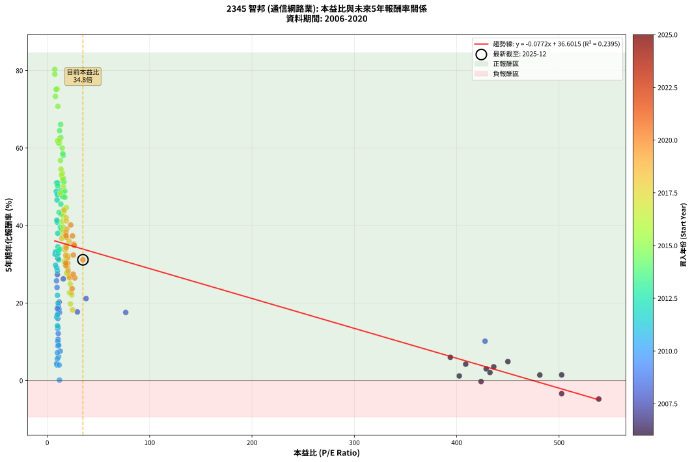
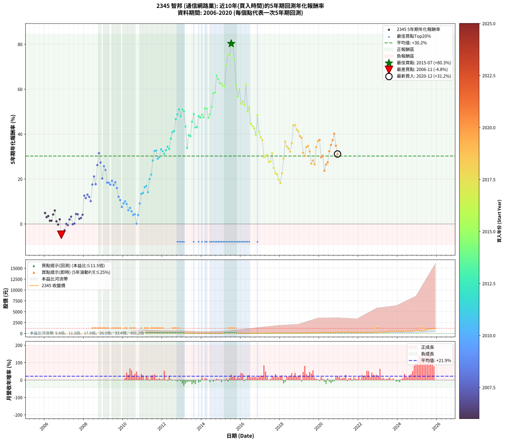

# 2345 智邦 - 本益比與未來報酬率分析

!!! info "報告資訊"
    - **股票代號**: 2345
    - **公司名稱**: 智邦
    - **產業別**: 通信網路業
    - **分析期間**: 2006-2020 (180 個數據點)
    - **資料來源**: Type 12 (ShowMonthlyK_ChartFlow) 月收盤價與本益比
    - **報酬率口徑**: 含現金股利 (簡化: 年度合計，假設每年7/1入帳)
    - **報告生成時間**: 2026-01-07 18:27:51 CST

## 📈 視覺化圖表

### 圖表1: 本益比 vs 未來報酬率關係

*圖表1：2345 智邦 本益比與5年期未來報酬率關係 (2006-2020)*

### 圖表2: 歷年買入時點的5年期實際報酬率

*圖表2：2345 智邦 歷年買入時點的5年期實際報酬率 (2006-2020)*

## 📍 買點訊號說明

本報告提供兩種買點提示訊號（顯示於圖表2的股價子圖中）：

### ▲ 小綠色三角形（回測驗證）
- **計算方式**: 使用全部歷史資料計算本益比第25百分位數
- **用途**: 事後驗證，顯示歷史上哪些時點確實為低估區
- **限制**: 當下無法判斷，僅供回測參考
- **特性**: 後見之明（Look-Ahead Bias）

### ▲ 小橘色三角形（即時訊號）
- **計算方式**: 使用截至當月的過去5年資料計算本益比第25百分位數
- **用途**: 實際投資決策，當時即可判斷
- **優勢**: 可操作性強，符合實務需求
- **特性**: 無後見之明，滾動窗口計算

!!! tip "如何使用兩種訊號"
    - **綠色▲** 幫助理解歷史估值機會，驗證策略有效性
    - **橘色▲** 可作為實際買進參考，但仍需搭配基本面分析
    - 兩種訊號重疊時，表示即時判斷與事後驗證一致，信心度較高
    - 僅有綠色▲時，表示當時無法判斷（需要未來資料才能確認）
    - 僅有橘色▲時，表示即時判斷為買點，但事後可能不是最佳時機

## 📊 估值分析摘要

| 指標 | 數值 |
|:---:|:---:|
| **目前本益比** (2020-12) | **34.84 倍** |
| **歷史平均本益比** | 49.54 倍 |
| **估值水準** | 🟢 相對低估 |
| **預期5年年化報酬率** | **+33.91%** |
| **歷史平均報酬率** | +30.25% |
| **相關係數 (R²)** | 0.2395 |
| **趨勢線斜率** | -0.0772 |

!!! abstract "核心洞察"
    目前本益比顯著低於歷史平均，預期未來報酬率可能較高

    根據歷史數據回測，2345 智邦 在目前本益比 **34.8倍** 的估值水準下，
    預期未來5年年化報酬率約為 **+33.9%**。

    **重要提醒**: 本分析基於歷史數據統計，實際報酬率會受到公司基本面變化、產業趨勢、
    總體經濟環境等多重因素影響。R² = 0.24 表示本益比可解釋約 23.9% 的報酬率變異。

## 📈 歷史估值統計

### 最佳買點 (最高報酬率)

| 項目 | 數值 |
|:---:|:---:|
| 起始時間 | 2015-07 |
| 當時本益比 | 7.32 倍 |
| 起始價格 | 13.1 元 |
| 5年後價格 | 229.5 元 |
| **5年年化報酬率** | **+80.29%** |

### 最差買點 (最低報酬率)

| 項目 | 數值 |
|:---:|:---:|
| 起始時間 | 2006-11 |
| 當時本益比 | 538.80 倍 |
| 起始價格 | 21.6 元 |
| 5年後價格 | 13.7 元 |
| **5年年化報酬率** | **-4.78%** |

## 🎯 投資啟示

### 本益比與報酬率關係

趨勢線方程式: **y = -0.0772x + 36.6015**

!!! note "負相關"
    本益比與未來報酬率呈現負相關。較低的本益比通常帶來較高的未來報酬率，
    但相關性不算非常強。**估值仍是重要參考指標之一**。

### 估值區間建議

基於歷史數據分析:

- **🟢 低估區** (P/E < 39.6): 預期報酬率較高，可考慮增加持股
- **🟡 合理區** (P/E 39.6-59.5): 預期報酬率符合長期趨勢，正常持有
- **🔴 高估區** (P/E > 59.5): 預期報酬率較低，可考慮減碼或觀望

!!! danger "風險提示"
    - 過去表現不代表未來結果
    - 本分析假設公司基本面無重大結構性變化
    - 產業環境劇變可能使歷史規律失效
    - 應結合公司財報、產業趨勢、總體經濟等多重因素綜合判斷

!!! success "長期投資觀點"
    歷史數據顯示，在合理或低估的估值水準買入並長期持有，
    往往能獲得較佳的投資報酬。**耐心等待好價格**是價值投資的核心原則。

## 📊 數據品質

- **資料來源**: GoodInfo.tw Type 12 (ShowMonthlyK_ChartFlow)
- **資料頻率**: 月度收盤價與本益比
- **回測期間**: 2006-2020
- **數據點數量**: 180 個 (每個點代表一次5年期回測)

### 計算方法說明

1. **5年期年化報酬率**:
   - 對每個歷史時點，計算其後5年的實際投資報酬率
   - 期末價值(不含股利): 期末價格
   - 期末價值(含現金股利): 期末價格 + 持有期間內的現金股利合計 (簡化: 年度合計，假設每年7/1入帳)
   - 公式: 年化報酬率 = [(期末價值/期初價格)^(1/年數) - 1] × 100%

2. **本益比 (P/E Ratio)**:
   - 使用當時的月收盤價與EPS計算
   - 資料來源: Type 12 月度河流圖本益比數據

3. **趨勢線 (Linear Regression)**:
   - 使用最小平方法擬合線性趨勢線
   - R²值衡量本益比對報酬率的解釋能力

---

*本報告由 Stock Analysis System v1.9.0 自動生成*
*數據更新時間: 2026-01-07 18:27:51 CST*

## 📋 月度回測明細表

（每一列對應時間線圖中的一個買入點；可用來對照 SVG 圖上的每個點。）

| 買入月份 | 賣出月份 | 回測期限_年 | 實際持有年數 | 買入本益比_倍 | 買入收盤價_元 | 賣出收盤價_元 | 現金股利合計_元 | 總報酬率_pct | 年化報酬率_pct |
| --- | --- | --- | --- | --- | --- | --- | --- | --- | --- |
| 2006-01 | 2011-01 | 5 | 4.999 | 450.00 | 18.00 | 21.10 | 1.76 | +26.98 | +4.89 |
| 2006-02 | 2011-02 | 5 | 4.999 | 428.80 | 17.15 | 18.15 | 1.76 | +16.08 | +3.03 |
| 2006-03 | 2011-03 | 5 | 4.999 | 436.20 | 17.45 | 19.00 | 1.76 | +18.95 | +3.53 |
| 2006-04 | 2011-04 | 5 | 4.999 | 481.20 | 19.25 | 18.90 | 1.76 | +7.31 | +1.42 |
| 2006-05 | 2011-05 | 5 | 4.999 | 502.50 | 20.10 | 19.85 | 1.76 | +7.50 | +1.46 |
| 2006-06 | 2011-06 | 5 | 4.999 | 408.80 | 16.35 | 18.35 | 1.76 | +22.98 | +4.22 |
| 2006-07 | 2011-07 | 5 | 4.999 | 393.80 | 15.75 | 17.90 | 3.17 | +33.78 | +5.99 |
| 2006-08 | 2011-08 | 5 | 4.999 | 402.50 | 16.10 | 13.90 | 3.17 | +6.03 | +1.18 |
| 2006-09 | 2011-09 | 5 | 4.999 | 423.80 | 16.95 | 13.55 | 3.17 | -1.35 | -0.27 |
| 2006-10 | 2011-10 | 5 | 4.999 | 432.50 | 17.30 | 16.00 | 3.17 | +10.82 | +2.08 |
| 2006-11 | 2011-11 | 5 | 4.999 | 538.80 | 21.55 | 13.70 | 3.17 | -21.71 | -4.78 |
| 2006-12 | 2011-12 | 5 | 4.999 | 502.50 | 20.10 | 13.75 | 3.17 | -15.82 | -3.39 |
| 2007-01 | 2012-01 | 5 | 4.999 |  | 21.60 | 15.60 | 3.17 | -13.10 | -2.77 |
| 2007-02 | 2012-02 | 5 | 4.999 |  | 21.70 | 18.60 | 3.17 | +0.33 | +0.07 |
| 2007-03 | 2012-03 | 5 | 5.002 |  | 21.60 | 17.85 | 3.17 | -2.68 | -0.54 |
| 2007-04 | 2012-04 | 5 | 5.002 |  | 18.40 | 17.15 | 3.17 | +10.44 | +2.01 |
| 2007-05 | 2012-05 | 5 | 5.002 |  | 17.60 | 17.50 | 3.17 | +17.45 | +3.27 |
| 2007-06 | 2012-06 | 5 | 5.002 |  | 20.20 | 16.90 | 3.17 | -0.64 | -0.13 |
| 2007-07 | 2012-07 | 5 | 5.002 |  | 20.50 | 16.05 | 4.65 | +0.95 | +0.19 |
| 2007-08 | 2012-08 | 5 | 5.002 |  | 16.20 | 15.50 | 4.65 | +24.35 | +4.45 |
| 2007-09 | 2012-09 | 5 | 5.002 |  | 16.55 | 15.80 | 4.65 | +23.53 | +4.32 |
| 2007-10 | 2012-10 | 5 | 5.002 |  | 17.10 | 14.50 | 4.65 | +11.96 | +2.28 |
| 2007-11 | 2012-11 | 5 | 5.002 |  | 17.30 | 15.10 | 4.65 | +14.13 | +2.68 |
| 2007-12 | 2012-12 | 5 | 5.002 |  | 17.00 | 16.15 | 4.65 | +22.32 | +4.11 |
| 2008-01 | 2013-01 | 5 | 5.002 |  | 11.40 | 16.00 | 4.65 | +81.10 | +12.61 |
| 2008-02 | 2013-03 | 5 | 5.081 |  | 12.65 | 17.35 | 4.65 | +73.87 | +11.50 |
| 2008-03 | 2013-03 | 5 | 4.999 |  | 11.90 | 17.35 | 4.65 | +84.83 | +13.07 |
| 2008-04 | 2013-04 | 5 | 4.999 |  | 12.75 | 17.90 | 4.65 | +76.82 | +12.08 |
| 2008-05 | 2013-05 | 5 | 4.999 | 427.70 | 13.90 | 17.90 | 4.65 | +62.19 | +10.16 |
| 2008-06 | 2013-06 | 5 | 4.999 | 76.67 | 10.35 | 18.60 | 4.65 | +124.59 | +17.57 |
| 2008-07 | 2013-07 | 5 | 4.999 | 37.89 | 9.00 | 17.35 | 6.14 | +160.99 | +21.15 |
| 2008-08 | 2013-08 | 5 | 4.999 | 29.41 | 10.00 | 16.45 | 6.14 | +125.89 | +17.70 |
| 2008-09 | 2013-09 | 5 | 4.999 | 15.68 | 6.94 | 16.10 | 6.14 | +220.45 | +26.23 |
| 2008-10 | 2013-10 | 5 | 4.999 | 10.35 | 5.64 | 16.05 | 6.14 | +293.42 | +31.52 |
| 2008-11 | 2013-11 | 5 | 4.999 | 9.88 | 6.40 | 15.30 | 6.14 | +234.98 | +27.36 |
| 2008-12 | 2013-12 | 5 | 4.999 | 11.61 | 8.71 | 15.75 | 6.14 | +151.31 | +20.24 |
| 2009-01 | 2014-01 | 5 | 4.999 | 9.06 | 7.16 | 16.35 | 6.14 | +214.09 | +25.73 |
| 2009-02 | 2014-02 | 5 | 4.999 | 9.57 | 7.94 | 17.15 | 6.14 | +193.31 | +24.02 |
| 2009-03 | 2014-03 | 5 | 4.999 | 11.43 | 9.94 | 17.00 | 6.14 | +132.79 | +18.41 |
| 2009-04 | 2014-04 | 5 | 4.999 | 11.37 | 10.35 | 17.95 | 6.14 | +132.74 | +18.41 |
| 2009-05 | 2014-05 | 5 | 4.999 | 11.95 | 11.35 | 19.30 | 6.14 | +124.13 | +17.52 |
| 2009-06 | 2014-06 | 5 | 4.999 | 10.76 | 10.65 | 19.50 | 6.14 | +140.74 | +19.21 |
| 2009-07 | 2014-07 | 5 | 4.999 | 10.73 | 11.05 | 18.20 | 6.39 | +122.54 | +17.35 |
| 2009-08 | 2014-08 | 5 | 4.999 | 9.81 | 10.50 | 18.20 | 6.39 | +134.20 | +18.56 |
| 2009-09 | 2014-09 | 5 | 4.999 | 10.36 | 11.50 | 17.75 | 6.39 | +109.92 | +15.99 |
| 2009-10 | 2014-10 | 5 | 4.999 | 10.74 | 12.35 | 15.50 | 6.39 | +77.26 | +12.13 |
| 2009-11 | 2014-11 | 5 | 4.999 | 10.55 | 12.55 | 14.40 | 6.39 | +65.67 | +10.62 |
| 2009-12 | 2014-12 | 5 | 4.999 | 12.64 | 15.55 | 16.00 | 6.39 | +43.99 | +7.57 |
| 2010-01 | 2015-01 | 5 | 4.999 | 10.96 | 14.20 | 15.65 | 6.39 | +55.22 | +9.19 |
| 2010-02 | 2015-02 | 5 | 4.999 | 10.28 | 14.00 | 16.25 | 6.39 | +61.72 | +10.09 |
| 2010-03 | 2015-03 | 5 | 4.999 | 10.33 | 14.75 | 16.25 | 6.39 | +53.50 | +8.95 |
| 2010-04 | 2015-04 | 5 | 4.999 | 11.12 | 16.60 | 15.95 | 6.39 | +34.58 | +6.12 |
| 2010-05 | 2015-05 | 5 | 4.999 | 9.91 | 15.45 | 15.45 | 6.39 | +41.37 | +7.17 |
| 2010-06 | 2015-06 | 5 | 4.999 | 9.88 | 16.05 | 14.70 | 6.39 | +31.41 | +5.62 |
| 2010-07 | 2015-07 | 5 | 4.999 | 9.43 | 15.95 | 13.05 | 6.37 | +21.76 | +4.02 |
| 2010-08 | 2015-08 | 5 | 4.999 | 9.25 | 16.25 | 13.75 | 6.37 | +23.82 | +4.37 |
| 2010-09 | 2015-09 | 5 | 4.999 | 11.91 | 21.70 | 15.45 | 6.37 | +0.55 | +0.11 |
| 2010-10 | 2015-10 | 5 | 4.999 | 11.65 | 22.00 | 20.40 | 6.37 | +21.68 | +4.00 |
| 2010-11 | 2015-11 | 5 | 4.999 | 11.13 | 21.75 | 27.25 | 6.37 | +54.57 | +9.10 |
| 2010-12 | 2015-12 | 5 | 4.999 | 10.10 | 20.40 | 31.95 | 6.37 | +87.84 | +13.44 |
| 2011-01 | 2016-01 | 5 | 4.999 | 10.60 | 21.10 | 33.85 | 6.37 | +90.62 | +13.77 |
| 2011-02 | 2016-02 | 5 | 4.999 | 9.26 | 18.15 | 32.35 | 6.37 | +113.33 | +16.36 |
| 2011-03 | 2016-03 | 5 | 5.002 | 9.84 | 19.00 | 35.20 | 6.37 | +118.79 | +16.94 |
| 2011-04 | 2016-04 | 5 | 5.002 | 9.95 | 18.90 | 30.25 | 6.37 | +93.76 | +14.14 |
| 2011-05 | 2016-05 | 5 | 5.002 | 10.61 | 19.85 | 43.00 | 6.37 | +148.72 | +19.98 |
| 2011-06 | 2016-06 | 5 | 5.002 | 9.97 | 18.35 | 43.20 | 6.37 | +170.14 | +21.98 |
| 2011-07 | 2016-07 | 5 | 5.002 | 9.89 | 17.90 | 55.30 | 6.92 | +247.59 | +28.28 |
| 2011-08 | 2016-08 | 5 | 5.002 | 7.81 | 13.90 | 49.90 | 6.92 | +308.77 | +32.51 |
| 2011-09 | 2016-09 | 5 | 5.002 | 7.74 | 13.55 | 48.80 | 6.92 | +311.21 | +32.67 |
| 2011-10 | 2016-10 | 5 | 5.002 | 9.30 | 16.00 | 50.40 | 6.92 | +258.24 | +29.06 |
| 2011-11 | 2016-11 | 5 | 5.002 | 8.11 | 13.70 | 43.50 | 6.92 | +268.02 | +29.76 |
| 2011-12 | 2016-12 | 5 | 5.002 | 8.28 | 13.75 | 50.90 | 6.92 | +320.50 | +33.26 |
| 2012-01 | 2017-01 | 5 | 5.002 | 9.40 | 15.60 | 56.50 | 6.92 | +306.53 | +32.36 |
| 2012-02 | 2017-03 | 5 | 5.081 | 11.22 | 18.60 | 66.90 | 6.92 | +296.88 | +31.16 |
| 2012-03 | 2017-03 | 5 | 4.999 | 10.77 | 17.85 | 66.90 | 6.92 | +313.55 | +32.84 |
| 2012-04 | 2017-04 | 5 | 4.999 | 10.35 | 17.15 | 68.50 | 6.92 | +339.76 | +34.48 |
| 2012-05 | 2017-05 | 5 | 4.999 | 10.57 | 17.50 | 67.10 | 6.92 | +322.97 | +33.44 |
| 2012-06 | 2017-06 | 5 | 4.999 | 10.21 | 16.90 | 77.60 | 6.92 | +400.11 | +37.99 |
| 2012-07 | 2017-07 | 5 | 4.999 | 9.70 | 16.05 | 80.50 | 8.54 | +454.79 | +40.88 |
| 2012-08 | 2017-08 | 5 | 4.999 | 9.38 | 15.50 | 79.00 | 8.54 | +464.79 | +41.38 |
| 2012-09 | 2017-09 | 5 | 4.999 | 9.56 | 15.80 | 98.40 | 8.54 | +576.85 | +46.60 |
| 2012-10 | 2017-10 | 5 | 4.999 | 8.78 | 14.50 | 97.20 | 8.54 | +629.26 | +48.80 |
| 2012-11 | 2017-11 | 5 | 4.999 | 9.15 | 15.10 | 110.00 | 8.54 | +685.05 | +51.01 |
| 2012-12 | 2017-12 | 5 | 4.999 | 9.79 | 16.15 | 106.00 | 8.54 | +609.24 | +47.97 |
| 2013-01 | 2018-01 | 5 | 4.999 | 9.99 | 16.00 | 117.00 | 8.54 | +684.64 | +50.99 |
| 2013-02 | 2018-02 | 5 | 4.999 | 10.15 | 15.75 | 112.00 | 8.54 | +665.35 | +50.24 |
| 2013-03 | 2018-03 | 5 | 4.999 | 11.55 | 17.35 | 96.60 | 8.54 | +506.01 | +43.39 |
| 2013-04 | 2018-04 | 5 | 4.999 | 12.32 | 17.90 | 68.40 | 8.54 | +329.85 | +33.87 |
| 2013-05 | 2018-05 | 5 | 4.999 | 12.75 | 17.90 | 86.30 | 8.54 | +429.85 | +39.59 |
| 2013-06 | 2018-06 | 5 | 4.999 | 13.73 | 18.60 | 88.20 | 8.54 | +420.12 | +39.07 |
| 2013-07 | 2018-07 | 5 | 4.999 | 13.29 | 17.35 | 102.00 | 11.18 | +552.33 | +45.52 |
| 2013-08 | 2018-08 | 5 | 4.999 | 13.09 | 16.45 | 109.50 | 11.18 | +633.62 | +48.98 |
| 2013-09 | 2018-09 | 5 | 4.999 | 13.33 | 16.10 | 85.00 | 11.18 | +497.39 | +42.98 |
| 2013-10 | 2018-10 | 5 | 4.999 | 13.86 | 16.05 | 85.20 | 11.18 | +500.50 | +43.13 |
| 2013-11 | 2018-11 | 5 | 4.999 | 13.79 | 15.30 | 97.50 | 11.18 | +610.33 | +48.02 |
| 2013-12 | 2018-12 | 5 | 4.999 | 14.86 | 15.75 | 98.60 | 11.18 | +597.02 | +47.46 |
| 2014-01 | 2019-01 | 5 | 4.999 | 15.24 | 16.35 | 107.50 | 11.18 | +625.87 | +48.66 |
| 2014-02 | 2019-02 | 5 | 4.999 | 15.81 | 17.15 | 108.50 | 11.18 | +597.84 | +47.49 |
| 2014-03 | 2019-03 | 5 | 4.999 | 15.49 | 17.00 | 124.50 | 11.18 | +698.12 | +51.51 |
| 2014-04 | 2019-04 | 5 | 4.999 | 16.17 | 17.95 | 131.00 | 11.18 | +692.09 | +51.28 |
| 2014-05 | 2019-05 | 5 | 4.999 | 17.19 | 19.30 | 122.50 | 11.18 | +592.64 | +47.27 |
| 2014-06 | 2019-06 | 5 | 4.999 | 17.18 | 19.50 | 131.50 | 11.18 | +631.69 | +48.90 |
| 2014-07 | 2019-07 | 5 | 4.999 | 15.86 | 18.20 | 134.00 | 14.27 | +714.64 | +52.13 |
| 2014-08 | 2019-08 | 5 | 4.999 | 15.69 | 18.20 | 165.50 | 14.27 | +887.72 | +58.11 |
| 2014-09 | 2019-09 | 5 | 4.999 | 15.14 | 17.75 | 163.50 | 14.27 | +901.49 | +58.55 |
| 2014-10 | 2019-10 | 5 | 4.999 | 13.08 | 15.50 | 181.50 | 14.27 | +1163.00 | +66.08 |
| 2014-11 | 2019-11 | 5 | 4.999 | 12.03 | 14.40 | 159.00 | 14.27 | +1103.23 | +64.47 |
| 2014-12 | 2019-12 | 5 | 4.999 | 13.22 | 16.00 | 168.00 | 14.27 | +1039.16 | +62.68 |
| 2015-01 | 2020-01 | 5 | 4.999 | 12.12 | 15.65 | 163.00 | 14.27 | +1032.68 | +62.50 |
| 2015-02 | 2020-02 | 5 | 4.999 | 11.83 | 16.25 | 163.50 | 14.27 | +993.94 | +61.37 |
| 2015-03 | 2020-03 | 5 | 5.002 | 11.17 | 16.25 | 163.00 | 14.27 | +990.86 | +61.24 |
| 2015-04 | 2020-04 | 5 | 5.002 | 10.38 | 15.95 | 217.50 | 14.27 | +1353.07 | +70.75 |
| 2015-05 | 2020-05 | 5 | 5.002 | 9.55 | 15.45 | 241.50 | 14.27 | +1555.44 | +75.26 |
| 2015-06 | 2020-06 | 5 | 5.002 | 8.65 | 14.70 | 228.00 | 14.27 | +1548.06 | +75.10 |
| 2015-07 | 2020-07 | 5 | 5.002 | 7.32 | 13.05 | 229.50 | 19.38 | +1807.13 | +80.29 |
| 2015-08 | 2020-08 | 5 | 5.002 | 7.38 | 13.75 | 234.00 | 19.38 | +1742.76 | +79.06 |
| 2015-09 | 2020-09 | 5 | 5.002 | 7.94 | 15.45 | 222.50 | 19.38 | +1465.57 | +73.32 |
| 2015-10 | 2020-10 | 5 | 5.002 | 10.07 | 20.40 | 207.50 | 19.38 | +1012.16 | +61.86 |
| 2015-11 | 2020-11 | 5 | 5.002 | 12.92 | 27.25 | 239.00 | 19.38 | +848.18 | +56.78 |
| 2015-12 | 2020-12 | 5 | 5.002 | 14.59 | 31.95 | 316.00 | 19.38 | +949.70 | +60.00 |
| 2016-01 | 2021-01 | 5 | 5.002 | 14.72 | 33.85 | 269.50 | 19.38 | +753.41 | +53.52 |
| 2016-02 | 2021-03 | 5 | 5.081 | 13.42 | 32.35 | 276.00 | 19.38 | +813.08 | +54.53 |
| 2016-03 | 2021-03 | 5 | 4.999 | 13.97 | 35.20 | 276.00 | 19.38 | +739.15 | +53.04 |
| 2016-04 | 2021-04 | 5 | 4.999 | 11.50 | 30.25 | 318.00 | 19.38 | +1015.31 | +62.00 |
| 2016-05 | 2021-05 | 5 | 4.999 | 15.69 | 43.00 | 307.50 | 19.38 | +660.19 | +50.04 |
| 2016-06 | 2021-06 | 5 | 4.999 | 15.16 | 43.20 | 330.50 | 19.38 | +709.91 | +51.95 |
| 2016-07 | 2021-07 | 5 | 4.999 | 18.68 | 55.30 | 326.00 | 23.91 | +532.75 | +44.63 |
| 2016-08 | 2021-08 | 5 | 4.999 | 16.25 | 49.90 | 280.50 | 23.91 | +510.05 | +43.58 |
| 2016-09 | 2021-09 | 5 | 4.999 | 15.35 | 48.80 | 263.00 | 23.91 | +487.94 | +42.52 |
| 2016-10 | 2021-10 | 5 | 4.999 | 15.32 | 50.40 | 243.50 | 23.91 | +430.58 | +39.63 |
| 2016-11 | 2021-11 | 5 | 4.999 | 12.79 | 43.50 | 288.50 | 23.91 | +618.19 | +48.34 |
| 2016-12 | 2021-12 | 5 | 4.999 | 14.50 | 50.90 | 260.00 | 23.91 | +457.79 | +41.03 |
| 2017-01 | 2022-01 | 5 | 4.999 | 15.66 | 56.50 | 265.00 | 23.91 | +411.35 | +38.60 |
| 2017-02 | 2022-02 | 5 | 4.999 | 15.25 | 56.50 | 252.00 | 23.91 | +388.34 | +37.33 |
| 2017-03 | 2022-03 | 5 | 4.999 | 17.59 | 66.90 | 222.50 | 23.91 | +268.33 | +29.80 |
| 2017-04 | 2022-04 | 5 | 4.999 | 17.56 | 68.50 | 233.00 | 23.91 | +275.06 | +30.27 |
| 2017-05 | 2022-05 | 5 | 4.999 | 16.79 | 67.10 | 232.00 | 23.91 | +281.39 | +30.70 |
| 2017-06 | 2022-06 | 5 | 4.999 | 18.95 | 77.60 | 238.50 | 23.91 | +238.16 | +27.60 |
| 2017-07 | 2022-07 | 5 | 4.999 | 19.20 | 80.50 | 248.00 | 26.81 | +241.38 | +27.84 |
| 2017-08 | 2022-08 | 5 | 4.999 | 18.41 | 79.00 | 283.50 | 26.81 | +292.80 | +31.48 |
| 2017-09 | 2022-09 | 5 | 4.999 | 22.43 | 98.40 | 272.50 | 26.81 | +204.18 | +24.92 |
| 2017-10 | 2022-10 | 5 | 4.999 | 21.67 | 97.20 | 243.00 | 26.81 | +177.59 | +22.66 |
| 2017-11 | 2022-11 | 5 | 4.999 | 24.00 | 110.00 | 271.50 | 26.81 | +171.19 | +22.09 |
| 2017-12 | 2022-12 | 5 | 4.999 | 22.65 | 106.00 | 234.50 | 26.81 | +146.52 | +19.78 |
| 2018-01 | 2023-01 | 5 | 4.999 | 24.71 | 117.00 | 243.50 | 26.81 | +131.04 | +18.24 |
| 2018-02 | 2023-02 | 5 | 4.999 | 23.39 | 112.00 | 283.00 | 26.81 | +176.62 | +22.57 |
| 2018-03 | 2023-03 | 5 | 4.999 | 19.95 | 96.60 | 319.00 | 26.81 | +257.99 | +29.06 |
| 2018-04 | 2023-04 | 5 | 4.999 | 13.97 | 68.40 | 299.00 | 26.81 | +376.34 | +36.65 |
| 2018-05 | 2023-05 | 5 | 4.999 | 17.43 | 86.30 | 353.00 | 26.81 | +340.11 | +34.50 |
| 2018-06 | 2023-06 | 5 | 4.999 | 17.62 | 88.20 | 349.00 | 26.81 | +326.09 | +33.63 |
| 2018-07 | 2023-07 | 5 | 4.999 | 20.16 | 102.00 | 382.00 | 30.18 | +304.10 | +32.23 |
| 2018-08 | 2023-08 | 5 | 4.999 | 21.41 | 109.50 | 478.00 | 30.18 | +364.09 | +35.94 |
| 2018-09 | 2023-09 | 5 | 4.999 | 16.45 | 85.00 | 493.00 | 30.18 | +515.51 | +43.84 |
| 2018-10 | 2023-10 | 5 | 4.999 | 16.32 | 85.20 | 498.50 | 30.18 | +520.52 | +44.07 |
| 2018-11 | 2023-11 | 5 | 4.999 | 18.48 | 97.50 | 533.00 | 30.18 | +477.62 | +42.02 |
| 2018-12 | 2023-12 | 5 | 4.999 | 18.50 | 98.60 | 523.00 | 30.18 | +461.04 | +41.19 |
| 2019-01 | 2024-01 | 5 | 4.999 | 19.10 | 107.50 | 529.00 | 30.18 | +420.17 | +39.07 |
| 2019-02 | 2024-02 | 5 | 4.999 | 18.31 | 108.50 | 519.00 | 30.18 | +406.16 | +38.32 |
| 2019-03 | 2024-03 | 5 | 5.002 | 20.00 | 124.50 | 463.00 | 30.18 | +296.13 | +31.68 |
| 2019-04 | 2024-04 | 5 | 5.002 | 20.08 | 131.00 | 461.50 | 30.18 | +275.33 | +30.27 |
| 2019-05 | 2024-05 | 5 | 5.002 | 17.96 | 122.50 | 504.00 | 30.18 | +336.07 | +34.23 |
| 2019-06 | 2024-06 | 5 | 5.002 | 18.47 | 131.50 | 555.00 | 30.18 | +345.01 | +34.78 |
| 2019-07 | 2024-07 | 5 | 5.002 | 18.06 | 134.00 | 507.00 | 36.18 | +305.36 | +32.29 |
| 2019-08 | 2024-08 | 5 | 5.002 | 21.45 | 165.50 | 508.00 | 36.18 | +228.81 | +26.87 |
| 2019-09 | 2024-09 | 5 | 5.002 | 20.40 | 163.50 | 532.00 | 36.18 | +247.51 | +28.28 |
| 2019-10 | 2024-10 | 5 | 5.002 | 21.83 | 181.50 | 552.00 | 36.18 | +224.07 | +26.50 |
| 2019-11 | 2024-11 | 5 | 5.002 | 18.46 | 159.00 | 657.00 | 36.18 | +335.96 | +34.23 |
| 2019-12 | 2024-12 | 5 | 5.002 | 18.86 | 168.00 | 773.00 | 36.18 | +381.66 | +36.93 |
| 2020-01 | 2025-01 | 5 | 5.002 | 18.27 | 163.00 | 763.00 | 36.18 | +390.30 | +37.42 |
| 2020-02 | 2025-03 | 5 | 5.081 | 18.30 | 163.50 | 576.00 | 36.18 | +274.42 | +29.67 |
| 2020-03 | 2025-03 | 5 | 4.999 | 18.21 | 163.00 | 576.00 | 36.18 | +275.57 | +30.30 |
| 2020-04 | 2025-04 | 5 | 4.999 | 24.27 | 217.50 | 594.00 | 36.18 | +189.74 | +23.71 |
| 2020-05 | 2025-05 | 5 | 4.999 | 26.90 | 241.50 | 745.00 | 36.18 | +223.47 | +26.47 |
| 2020-06 | 2025-06 | 5 | 4.999 | 25.36 | 228.00 | 730.00 | 36.18 | +236.04 | +27.44 |
| 2020-07 | 2025-07 | 5 | 4.999 | 25.49 | 229.50 | 892.00 | 40.99 | +306.53 | +32.38 |
| 2020-08 | 2025-08 | 5 | 4.999 | 25.95 | 234.00 | 1015.00 | 40.99 | +351.28 | +35.18 |
| 2020-09 | 2025-09 | 5 | 4.999 | 24.64 | 222.50 | 1045.00 | 40.99 | +388.09 | +37.32 |
| 2020-10 | 2025-10 | 5 | 4.999 | 22.95 | 207.50 | 1080.00 | 40.99 | +440.24 | +40.13 |
| 2020-11 | 2025-11 | 5 | 4.999 | 26.39 | 239.00 | 1025.00 | 40.99 | +346.02 | +34.86 |
| 2020-12 | 2025-12 | 5 | 4.999 | 34.84 | 316.00 | 1185.00 | 40.99 | +287.97 | +31.15 |
