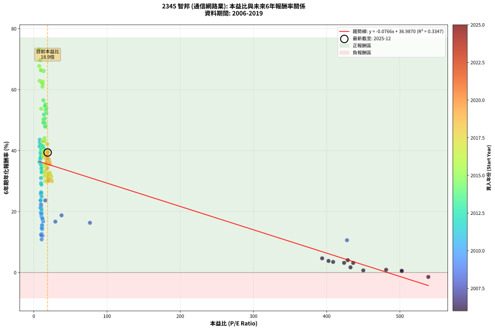

# 2345 智邦 - 本益比與未來報酬率分析

!!! info "報告資訊"
    - **股票代號**: 2345
    - **公司名稱**: 智邦
    - **產業別**: 通信網路業
    - **分析期間**: 2006-2019 (168 個數據點)
    - **資料來源**: Type 12 (ShowMonthlyK_ChartFlow) 月收盤價與本益比
    - **報酬率口徑**: 含現金股利 (簡化: 年度合計，假設每年7/1入帳)
    - **報告生成時間**: 2026-01-13 00:32:09 CST

## 📈 視覺化圖表

### 圖表1: 本益比 vs 未來報酬率關係

*圖表1：2345 智邦 本益比與6年期未來報酬率關係 (2006-2019)*

### 圖表2: 歷年買入時點的6年期實際報酬率

*圖表2：2345 智邦 歷年買入時點的6年期實際報酬率 (2006-2019)*

## 📍 買點訊號說明

本報告提供兩種買點提示訊號（顯示於圖表2的股價子圖中）：

### ▲ 小綠色三角形（回測驗證）
- **計算方式**: 使用全部歷史資料計算本益比第25百分位數
- **用途**: 事後驗證，顯示歷史上哪些時點確實為低估區
- **限制**: 當下無法判斷，僅供回測參考
- **特性**: 後見之明（Look-Ahead Bias）

### ▲ 小橘色三角形（即時訊號）
- **計算方式**: 使用截至當月的過去5年資料計算本益比第25百分位數
- **用途**: 實際投資決策，當時即可判斷
- **優勢**: 可操作性強，符合實務需求
- **特性**: 無後見之明，滾動窗口計算

!!! tip "如何使用兩種訊號"
    - **綠色▲** 幫助理解歷史估值機會，驗證策略有效性
    - **橘色▲** 可作為實際買進參考，但仍需搭配基本面分析
    - 兩種訊號重疊時，表示即時判斷與事後驗證一致，信心度較高
    - 僅有綠色▲時，表示當時無法判斷（需要未來資料才能確認）
    - 僅有橘色▲時，表示即時判斷為買點，但事後可能不是最佳時機

## 📊 估值分析摘要

| 指標 | 數值 |
|:---:|:---:|
| **目前本益比** (2019-12) | **18.86 倍** |
| **歷史平均本益比** | 51.54 倍 |
| **估值水準** | 🟢 相對低估 |
| **預期6年年化報酬率** | **+35.54%** |
| **歷史平均報酬率** | +30.37% |
| **相關係數 (R²)** | 0.3347 |
| **趨勢線斜率** | -0.0766 |

!!! abstract "核心洞察"
    目前本益比顯著低於歷史平均，預期未來報酬率可能較高

    根據歷史數據回測，2345 智邦 在目前本益比 **18.9倍** 的估值水準下，
    預期未來6年年化報酬率約為 **+35.5%**。

    **重要提醒**: 本分析基於歷史數據統計，實際報酬率會受到公司基本面變化、產業趨勢、
    總體經濟環境等多重因素影響。R² = 0.33 表示本益比可解釋約 33.5% 的報酬率變異。

## 📈 歷史估值統計

### 最佳買點 (最高報酬率)

| 項目 | 數值 |
|:---:|:---:|
| 起始時間 | 2015-07 |
| 當時本益比 | 7.32 倍 |
| 起始價格 | 13.1 元 |
| 6年後價格 | 326.0 元 |
| **6年年化報酬率** | **+73.14%** |

### 最差買點 (最低報酬率)

| 項目 | 數值 |
|:---:|:---:|
| 起始時間 | 2006-11 |
| 當時本益比 | 538.80 倍 |
| 起始價格 | 21.6 元 |
| 6年後價格 | 15.1 元 |
| **6年年化報酬率** | **-1.45%** |

## 🎯 投資啟示

### 本益比與報酬率關係

趨勢線方程式: **y = -0.0766x + 36.9870**

!!! note "負相關"
    本益比與未來報酬率呈現負相關。較低的本益比通常帶來較高的未來報酬率，
    但相關性不算非常強。**估值仍是重要參考指標之一**。

### 估值區間建議

基於歷史數據分析:

- **🟢 低估區** (P/E < 41.2): 預期報酬率較高，可考慮增加持股
- **🟡 合理區** (P/E 41.2-61.8): 預期報酬率符合長期趨勢，正常持有
- **🔴 高估區** (P/E > 61.8): 預期報酬率較低，可考慮減碼或觀望

!!! danger "風險提示"
    - 過去表現不代表未來結果
    - 本分析假設公司基本面無重大結構性變化
    - 產業環境劇變可能使歷史規律失效
    - 應結合公司財報、產業趨勢、總體經濟等多重因素綜合判斷

!!! success "長期投資觀點"
    歷史數據顯示，在合理或低估的估值水準買入並長期持有，
    往往能獲得較佳的投資報酬。**耐心等待好價格**是價值投資的核心原則。

## 📊 數據品質

- **資料來源**: GoodInfo.tw Type 12 (ShowMonthlyK_ChartFlow)
- **資料頻率**: 月度收盤價與本益比
- **回測期間**: 2006-2019
- **數據點數量**: 168 個 (每個點代表一次6年期回測)

### 計算方法說明

1. **6年期年化報酬率**:
   - 對每個歷史時點，計算其後6年的實際投資報酬率
   - 期末價值(不含股利): 期末價格
   - 期末價值(含現金股利): 期末價格 + 持有期間內的現金股利合計 (簡化: 年度合計，假設每年7/1入帳)
   - 公式: 年化報酬率 = [(期末價值/期初價格)^(1/年數) - 1] × 100%

2. **本益比 (P/E Ratio)**:
   - 使用當時的月收盤價與EPS計算
   - 資料來源: Type 12 月度河流圖本益比數據

3. **趨勢線 (Linear Regression)**:
   - 使用最小平方法擬合線性趨勢線
   - R²值衡量本益比對報酬率的解釋能力

---

*本報告由 Stock Analysis System v1.9.0 自動生成*
*數據更新時間: 2026-01-13 00:32:09 CST*

## 📋 月度回測明細表

（每一列對應時間線圖中的一個買入點；可用來對照 SVG 圖上的每個點。）

| 買入月份 | 賣出月份 | 回測期限_年 | 實際持有年數 | 買入本益比_倍 | 買入收盤價_元 | 賣出收盤價_元 | 現金股利合計_元 | 總報酬率_pct | 年化報酬率_pct |
| --- | --- | --- | --- | --- | --- | --- | --- | --- | --- |
| 2006-01 | 2012-01 | 6 | 5.999 | 450.00 | 18.00 | 15.60 | 3.17 | +4.28 | +0.70 |
| 2006-02 | 2012-02 | 6 | 5.999 | 428.80 | 17.15 | 18.60 | 3.17 | +26.94 | +4.06 |
| 2006-03 | 2012-03 | 6 | 6.001 | 436.20 | 17.45 | 17.85 | 3.17 | +20.46 | +3.15 |
| 2006-04 | 2012-04 | 6 | 6.001 | 481.20 | 19.25 | 17.15 | 3.17 | +5.56 | +0.91 |
| 2006-05 | 2012-05 | 6 | 6.001 | 502.50 | 20.10 | 17.50 | 3.17 | +2.84 | +0.47 |
| 2006-06 | 2012-06 | 6 | 6.001 | 408.80 | 16.35 | 16.90 | 3.17 | +22.76 | +3.48 |
| 2006-07 | 2012-07 | 6 | 6.001 | 393.80 | 15.75 | 16.05 | 4.65 | +31.40 | +4.65 |
| 2006-08 | 2012-08 | 6 | 6.001 | 402.50 | 16.10 | 15.50 | 4.65 | +25.12 | +3.81 |
| 2006-09 | 2012-09 | 6 | 6.001 | 423.80 | 16.95 | 15.80 | 4.65 | +20.62 | +3.17 |
| 2006-10 | 2012-10 | 6 | 6.001 | 432.50 | 17.30 | 14.50 | 4.65 | +10.66 | +1.70 |
| 2006-11 | 2012-11 | 6 | 6.001 | 538.80 | 21.55 | 15.10 | 4.65 | -8.38 | -1.45 |
| 2006-12 | 2012-12 | 6 | 6.001 | 502.50 | 20.10 | 16.15 | 4.65 | +3.46 | +0.57 |
| 2007-01 | 2013-01 | 6 | 6.001 |  | 21.60 | 16.00 | 4.65 | -4.42 | -0.75 |
| 2007-02 | 2013-02 | 6 | 6.001 |  | 21.70 | 15.75 | 4.65 | -6.01 | -1.03 |
| 2007-03 | 2013-03 | 6 | 6.001 |  | 21.60 | 17.35 | 4.65 | +1.83 | +0.30 |
| 2007-04 | 2013-04 | 6 | 6.001 |  | 18.40 | 17.90 | 4.65 | +22.53 | +3.44 |
| 2007-05 | 2013-05 | 6 | 6.001 |  | 17.60 | 17.90 | 4.65 | +28.10 | +4.21 |
| 2007-06 | 2013-06 | 6 | 6.001 |  | 20.20 | 18.60 | 4.65 | +15.07 | +2.37 |
| 2007-07 | 2013-07 | 6 | 6.001 |  | 20.50 | 17.35 | 6.14 | +14.58 | +2.29 |
| 2007-08 | 2013-08 | 6 | 6.001 |  | 16.20 | 16.45 | 6.14 | +39.44 | +5.70 |
| 2007-09 | 2013-09 | 6 | 6.001 |  | 16.55 | 16.10 | 6.14 | +34.37 | +5.05 |
| 2007-10 | 2013-10 | 6 | 6.001 |  | 17.10 | 16.05 | 6.14 | +29.76 | +4.44 |
| 2007-11 | 2013-11 | 6 | 6.001 |  | 17.30 | 15.30 | 6.14 | +23.92 | +3.64 |
| 2007-12 | 2013-12 | 6 | 6.001 |  | 17.00 | 15.75 | 6.14 | +28.76 | +4.30 |
| 2008-01 | 2014-01 | 6 | 6.001 |  | 11.40 | 16.35 | 6.14 | +97.27 | +11.99 |
| 2008-02 | 2014-03 | 6 | 6.081 |  | 12.65 | 17.00 | 6.14 | +82.92 | +10.44 |
| 2008-03 | 2014-03 | 6 | 5.999 |  | 11.90 | 17.00 | 6.14 | +94.45 | +11.72 |
| 2008-04 | 2014-04 | 6 | 5.999 |  | 12.75 | 17.95 | 6.14 | +88.93 | +11.19 |
| 2008-05 | 2014-05 | 6 | 5.999 | 427.70 | 13.90 | 19.30 | 6.14 | +83.01 | +10.60 |
| 2008-06 | 2014-06 | 6 | 5.999 | 76.67 | 10.35 | 19.50 | 6.14 | +147.72 | +16.33 |
| 2008-07 | 2014-07 | 6 | 5.999 | 37.89 | 9.00 | 18.20 | 7.05 | +180.58 | +18.77 |
| 2008-08 | 2014-08 | 6 | 5.999 | 29.41 | 10.00 | 18.20 | 7.05 | +152.52 | +16.70 |
| 2008-09 | 2014-09 | 6 | 5.999 | 15.68 | 6.94 | 17.75 | 7.05 | +257.38 | +23.65 |
| 2008-10 | 2014-10 | 6 | 5.999 | 10.35 | 5.64 | 15.50 | 7.05 | +299.86 | +25.99 |
| 2008-11 | 2014-11 | 6 | 5.999 | 9.88 | 6.40 | 14.40 | 7.05 | +235.19 | +22.34 |
| 2008-12 | 2014-12 | 6 | 5.999 | 11.61 | 8.71 | 16.00 | 7.05 | +164.66 | +17.62 |
| 2009-01 | 2015-01 | 6 | 5.999 | 9.06 | 7.16 | 15.65 | 7.05 | +217.07 | +21.21 |
| 2009-02 | 2015-02 | 6 | 5.999 | 9.57 | 7.94 | 16.25 | 7.05 | +193.48 | +19.66 |
| 2009-03 | 2015-03 | 6 | 5.999 | 11.43 | 9.94 | 16.25 | 7.05 | +134.43 | +15.26 |
| 2009-04 | 2015-04 | 6 | 5.999 | 11.37 | 10.35 | 15.95 | 7.05 | +122.24 | +14.24 |
| 2009-05 | 2015-05 | 6 | 5.999 | 11.95 | 11.35 | 15.45 | 7.05 | +98.26 | +12.09 |
| 2009-06 | 2015-06 | 6 | 5.999 | 10.76 | 10.65 | 14.70 | 7.05 | +104.24 | +12.64 |
| 2009-07 | 2015-07 | 6 | 5.999 | 10.73 | 11.05 | 13.05 | 7.47 | +85.67 | +10.87 |
| 2009-08 | 2015-08 | 6 | 5.999 | 9.81 | 10.50 | 13.75 | 7.47 | +102.06 | +12.44 |
| 2009-09 | 2015-09 | 6 | 5.999 | 10.36 | 11.50 | 15.45 | 7.47 | +99.27 | +12.18 |
| 2009-10 | 2015-10 | 6 | 5.999 | 10.74 | 12.35 | 20.40 | 7.47 | +125.64 | +14.53 |
| 2009-11 | 2015-11 | 6 | 5.999 | 10.55 | 12.55 | 27.25 | 7.47 | +176.62 | +18.49 |
| 2009-12 | 2015-12 | 6 | 5.999 | 12.64 | 15.55 | 31.95 | 7.47 | +153.48 | +16.77 |
| 2010-01 | 2016-01 | 6 | 5.999 | 10.96 | 14.20 | 33.85 | 7.47 | +190.96 | +19.49 |
| 2010-02 | 2016-02 | 6 | 5.999 | 10.28 | 14.00 | 32.35 | 7.47 | +184.40 | +19.03 |
| 2010-03 | 2016-03 | 6 | 6.001 | 10.33 | 14.75 | 35.20 | 7.47 | +189.26 | +19.36 |
| 2010-04 | 2016-04 | 6 | 6.001 | 11.12 | 16.60 | 30.25 | 7.47 | +127.20 | +14.65 |
| 2010-05 | 2016-05 | 6 | 6.001 | 9.91 | 15.45 | 43.00 | 7.47 | +226.64 | +21.80 |
| 2010-06 | 2016-06 | 6 | 6.001 | 9.88 | 16.05 | 43.20 | 7.47 | +215.68 | +21.11 |
| 2010-07 | 2016-07 | 6 | 6.001 | 9.43 | 15.95 | 55.30 | 8.33 | +298.95 | +25.93 |
| 2010-08 | 2016-08 | 6 | 6.001 | 9.25 | 16.25 | 49.90 | 8.33 | +258.36 | +23.70 |
| 2010-09 | 2016-09 | 6 | 6.001 | 11.91 | 21.70 | 48.80 | 8.33 | +163.29 | +17.50 |
| 2010-10 | 2016-10 | 6 | 6.001 | 11.65 | 22.00 | 50.40 | 8.33 | +166.97 | +17.78 |
| 2010-11 | 2016-11 | 6 | 6.001 | 11.13 | 21.75 | 43.50 | 8.33 | +138.31 | +15.57 |
| 2010-12 | 2016-12 | 6 | 6.001 | 10.10 | 20.40 | 50.90 | 8.33 | +190.36 | +19.44 |
| 2011-01 | 2017-01 | 6 | 6.001 | 10.60 | 21.10 | 56.50 | 8.33 | +207.27 | +20.57 |
| 2011-02 | 2017-02 | 6 | 6.001 | 9.26 | 18.15 | 56.50 | 8.33 | +257.21 | +23.63 |
| 2011-03 | 2017-03 | 6 | 6.001 | 9.84 | 19.00 | 66.90 | 8.33 | +295.96 | +25.77 |
| 2011-04 | 2017-04 | 6 | 6.001 | 9.95 | 18.90 | 68.50 | 8.33 | +306.52 | +26.33 |
| 2011-05 | 2017-05 | 6 | 6.001 | 10.61 | 19.85 | 67.10 | 8.33 | +280.02 | +24.91 |
| 2011-06 | 2017-06 | 6 | 6.001 | 9.97 | 18.35 | 77.60 | 8.33 | +368.30 | +29.34 |
| 2011-07 | 2017-07 | 6 | 6.001 | 9.89 | 17.90 | 80.50 | 10.02 | +405.68 | +31.00 |
| 2011-08 | 2017-08 | 6 | 6.001 | 7.81 | 13.90 | 79.00 | 10.02 | +540.41 | +36.26 |
| 2011-09 | 2017-09 | 6 | 6.001 | 7.74 | 13.55 | 98.40 | 10.02 | +700.13 | +41.41 |
| 2011-10 | 2017-10 | 6 | 6.001 | 9.30 | 16.00 | 97.20 | 10.02 | +570.11 | +37.30 |
| 2011-11 | 2017-11 | 6 | 6.001 | 8.11 | 13.70 | 110.00 | 10.02 | +776.04 | +43.57 |
| 2011-12 | 2017-12 | 6 | 6.001 | 8.28 | 13.75 | 106.00 | 10.02 | +743.76 | +42.67 |
| 2012-01 | 2018-01 | 6 | 6.001 | 9.40 | 15.60 | 117.00 | 10.02 | +714.21 | +41.83 |
| 2012-02 | 2018-03 | 6 | 6.081 | 11.22 | 18.60 | 96.60 | 10.02 | +473.21 | +33.26 |
| 2012-03 | 2018-03 | 6 | 5.999 | 10.77 | 17.85 | 96.60 | 10.02 | +497.29 | +34.71 |
| 2012-04 | 2018-04 | 6 | 5.999 | 10.35 | 17.15 | 68.40 | 10.02 | +357.24 | +28.84 |
| 2012-05 | 2018-05 | 6 | 5.999 | 10.57 | 17.50 | 86.30 | 10.02 | +450.38 | +32.88 |
| 2012-06 | 2018-06 | 6 | 5.999 | 10.21 | 16.90 | 88.20 | 10.02 | +481.17 | +34.09 |
| 2012-07 | 2018-07 | 6 | 5.999 | 9.70 | 16.05 | 102.00 | 12.67 | +614.48 | +38.79 |
| 2012-08 | 2018-08 | 6 | 5.999 | 9.38 | 15.50 | 109.50 | 12.67 | +688.22 | +41.08 |
| 2012-09 | 2018-09 | 6 | 5.999 | 9.56 | 15.80 | 85.00 | 12.67 | +518.19 | +35.48 |
| 2012-10 | 2018-10 | 6 | 5.999 | 8.78 | 14.50 | 85.20 | 12.67 | +574.99 | +37.48 |
| 2012-11 | 2018-11 | 6 | 5.999 | 9.15 | 15.10 | 97.50 | 12.67 | +629.63 | +39.28 |
| 2012-12 | 2018-12 | 6 | 5.999 | 9.79 | 16.15 | 98.60 | 12.67 | +589.00 | +37.95 |
| 2013-01 | 2019-01 | 6 | 5.999 | 9.99 | 16.00 | 107.50 | 12.67 | +651.09 | +39.95 |
| 2013-02 | 2019-02 | 6 | 5.999 | 10.15 | 15.75 | 108.50 | 12.67 | +669.36 | +40.51 |
| 2013-03 | 2019-03 | 6 | 5.999 | 11.55 | 17.35 | 124.50 | 12.67 | +690.63 | +41.15 |
| 2013-04 | 2019-04 | 6 | 5.999 | 12.32 | 17.90 | 131.00 | 12.67 | +702.65 | +41.51 |
| 2013-05 | 2019-05 | 6 | 5.999 | 12.75 | 17.90 | 122.50 | 12.67 | +655.16 | +40.08 |
| 2013-06 | 2019-06 | 6 | 5.999 | 13.73 | 18.60 | 131.50 | 12.67 | +675.13 | +40.69 |
| 2013-07 | 2019-07 | 6 | 5.999 | 13.29 | 17.35 | 134.00 | 15.18 | +759.82 | +43.14 |
| 2013-08 | 2019-08 | 6 | 5.999 | 13.09 | 16.45 | 165.50 | 15.18 | +998.35 | +49.11 |
| 2013-09 | 2019-09 | 6 | 5.999 | 13.33 | 16.10 | 163.50 | 15.18 | +1009.80 | +49.36 |
| 2013-10 | 2019-10 | 6 | 5.999 | 13.86 | 16.05 | 181.50 | 15.18 | +1125.41 | +51.85 |
| 2013-11 | 2019-11 | 6 | 5.999 | 13.79 | 15.30 | 159.00 | 15.18 | +1038.42 | +50.00 |
| 2013-12 | 2019-12 | 6 | 5.999 | 14.86 | 15.75 | 168.00 | 15.18 | +1063.03 | +50.54 |
| 2014-01 | 2020-01 | 6 | 5.999 | 15.24 | 16.35 | 163.00 | 15.18 | +989.77 | +48.91 |
| 2014-02 | 2020-02 | 6 | 5.999 | 15.81 | 17.15 | 163.50 | 15.18 | +941.85 | +47.80 |
| 2014-03 | 2020-03 | 6 | 6.001 | 15.49 | 17.00 | 163.00 | 15.18 | +948.11 | +47.92 |
| 2014-04 | 2020-04 | 6 | 6.001 | 16.17 | 17.95 | 217.50 | 15.18 | +1196.26 | +53.25 |
| 2014-05 | 2020-05 | 6 | 6.001 | 17.19 | 19.30 | 241.50 | 15.18 | +1229.94 | +53.91 |
| 2014-06 | 2020-06 | 6 | 6.001 | 17.18 | 19.50 | 228.00 | 15.18 | +1147.07 | +52.27 |
| 2014-07 | 2020-07 | 6 | 6.001 | 15.86 | 18.20 | 229.50 | 20.46 | +1273.38 | +54.73 |
| 2014-08 | 2020-08 | 6 | 6.001 | 15.69 | 18.20 | 234.00 | 20.46 | +1298.10 | +55.20 |
| 2014-09 | 2020-09 | 6 | 6.001 | 15.14 | 17.75 | 222.50 | 20.46 | +1268.76 | +54.65 |
| 2014-10 | 2020-10 | 6 | 6.001 | 13.08 | 15.50 | 207.50 | 20.46 | +1370.68 | +56.51 |
| 2014-11 | 2020-11 | 6 | 6.001 | 12.03 | 14.40 | 239.00 | 20.46 | +1701.77 | +61.90 |
| 2014-12 | 2020-12 | 6 | 6.001 | 13.22 | 16.00 | 316.00 | 20.46 | +2002.84 | +66.12 |
| 2015-01 | 2021-01 | 6 | 6.001 | 12.12 | 15.65 | 269.50 | 20.46 | +1752.75 | +62.65 |
| 2015-02 | 2021-02 | 6 | 6.001 | 11.83 | 16.25 | 262.50 | 20.46 | +1641.26 | +60.98 |
| 2015-03 | 2021-03 | 6 | 6.001 | 11.17 | 16.25 | 276.00 | 20.46 | +1724.34 | +62.23 |
| 2015-04 | 2021-04 | 6 | 6.001 | 10.38 | 15.95 | 318.00 | 20.46 | +2021.97 | +66.37 |
| 2015-05 | 2021-05 | 6 | 6.001 | 9.55 | 15.45 | 307.50 | 20.46 | +2022.69 | +66.38 |
| 2015-06 | 2021-06 | 6 | 6.001 | 8.65 | 14.70 | 330.50 | 20.46 | +2287.45 | +69.67 |
| 2015-07 | 2021-07 | 6 | 6.001 | 7.32 | 13.05 | 326.00 | 25.88 | +2596.37 | +73.14 |
| 2015-08 | 2021-08 | 6 | 6.001 | 7.38 | 13.75 | 280.50 | 25.88 | +2128.19 | +67.73 |
| 2015-09 | 2021-09 | 6 | 6.001 | 7.94 | 15.45 | 263.00 | 25.88 | +1769.75 | +62.90 |
| 2015-10 | 2021-10 | 6 | 6.001 | 10.07 | 20.40 | 243.50 | 25.88 | +1220.47 | +53.73 |
| 2015-11 | 2021-11 | 6 | 6.001 | 12.92 | 27.25 | 288.50 | 25.88 | +1053.67 | +50.31 |
| 2015-12 | 2021-12 | 6 | 6.001 | 14.59 | 31.95 | 260.00 | 25.88 | +794.76 | +44.07 |
| 2016-01 | 2022-01 | 6 | 6.001 | 14.72 | 33.85 | 265.00 | 25.88 | +759.31 | +43.11 |
| 2016-02 | 2022-03 | 6 | 6.081 | 13.42 | 32.35 | 222.50 | 25.88 | +667.78 | +39.82 |
| 2016-03 | 2022-03 | 6 | 5.999 | 13.97 | 35.20 | 222.50 | 25.88 | +605.61 | +38.50 |
| 2016-04 | 2022-04 | 6 | 5.999 | 11.50 | 30.25 | 233.00 | 25.88 | +755.79 | +43.03 |
| 2016-05 | 2022-05 | 6 | 5.999 | 15.69 | 43.00 | 232.00 | 25.88 | +499.71 | +34.80 |
| 2016-06 | 2022-06 | 6 | 5.999 | 15.16 | 43.20 | 238.50 | 25.88 | +511.98 | +35.25 |
| 2016-07 | 2022-07 | 6 | 5.999 | 18.68 | 55.30 | 248.00 | 29.91 | +402.55 | +30.89 |
| 2016-08 | 2022-08 | 6 | 5.999 | 16.25 | 49.90 | 283.50 | 29.91 | +528.08 | +35.84 |
| 2016-09 | 2022-09 | 6 | 5.999 | 15.35 | 48.80 | 272.50 | 29.91 | +519.70 | +35.54 |
| 2016-10 | 2022-10 | 6 | 5.999 | 15.32 | 50.40 | 243.00 | 29.91 | +441.49 | +32.52 |
| 2016-11 | 2022-11 | 6 | 5.999 | 12.79 | 43.50 | 271.50 | 29.91 | +592.90 | +38.08 |
| 2016-12 | 2022-12 | 6 | 5.999 | 14.50 | 50.90 | 234.50 | 29.91 | +419.47 | +31.61 |
| 2017-01 | 2023-01 | 6 | 5.999 | 15.66 | 56.50 | 243.50 | 29.91 | +383.92 | +30.06 |
| 2017-02 | 2023-02 | 6 | 5.999 | 15.25 | 56.50 | 283.00 | 29.91 | +453.83 | +33.02 |
| 2017-03 | 2023-03 | 6 | 5.999 | 17.59 | 66.90 | 319.00 | 29.91 | +421.54 | +31.70 |
| 2017-04 | 2023-04 | 6 | 5.999 | 17.56 | 68.50 | 299.00 | 29.91 | +380.16 | +29.89 |
| 2017-05 | 2023-05 | 6 | 5.999 | 16.79 | 67.10 | 353.00 | 29.91 | +470.66 | +33.69 |
| 2017-06 | 2023-06 | 6 | 5.999 | 18.95 | 77.60 | 349.00 | 29.91 | +388.29 | +30.26 |
| 2017-07 | 2023-07 | 6 | 5.999 | 19.20 | 80.50 | 382.00 | 34.31 | +417.16 | +31.51 |
| 2017-08 | 2023-08 | 6 | 5.999 | 18.41 | 79.00 | 478.00 | 34.31 | +548.50 | +36.57 |
| 2017-09 | 2023-09 | 6 | 5.999 | 22.43 | 98.40 | 493.00 | 34.31 | +435.89 | +32.29 |
| 2017-10 | 2023-10 | 6 | 5.999 | 21.67 | 97.20 | 498.50 | 34.31 | +448.16 | +32.79 |
| 2017-11 | 2023-11 | 6 | 5.999 | 24.00 | 110.00 | 533.00 | 34.31 | +415.74 | +31.45 |
| 2017-12 | 2023-12 | 6 | 5.999 | 22.65 | 106.00 | 523.00 | 34.31 | +425.77 | +31.87 |
| 2018-01 | 2024-01 | 6 | 5.999 | 24.71 | 117.00 | 529.00 | 34.31 | +381.46 | +29.95 |
| 2018-02 | 2024-02 | 6 | 5.999 | 23.39 | 112.00 | 519.00 | 34.31 | +394.03 | +30.51 |
| 2018-03 | 2024-03 | 6 | 6.001 | 19.95 | 96.60 | 463.00 | 34.31 | +414.82 | +31.40 |
| 2018-04 | 2024-04 | 6 | 6.001 | 13.97 | 68.40 | 461.50 | 34.31 | +624.87 | +39.11 |
| 2018-05 | 2024-05 | 6 | 6.001 | 17.43 | 86.30 | 504.00 | 34.31 | +523.77 | +35.67 |
| 2018-06 | 2024-06 | 6 | 6.001 | 17.62 | 88.20 | 555.00 | 34.31 | +568.16 | +37.23 |
| 2018-07 | 2024-07 | 6 | 6.001 | 20.16 | 102.00 | 507.00 | 40.18 | +436.45 | +32.30 |
| 2018-08 | 2024-08 | 6 | 6.001 | 21.41 | 109.50 | 508.00 | 40.18 | +400.62 | +30.79 |
| 2018-09 | 2024-09 | 6 | 6.001 | 16.45 | 85.00 | 532.00 | 40.18 | +573.15 | +37.40 |
| 2018-10 | 2024-10 | 6 | 6.001 | 16.32 | 85.20 | 552.00 | 40.18 | +595.05 | +38.13 |
| 2018-11 | 2024-11 | 6 | 6.001 | 18.48 | 97.50 | 657.00 | 40.18 | +615.06 | +38.79 |
| 2018-12 | 2024-12 | 6 | 6.001 | 18.50 | 98.60 | 773.00 | 40.18 | +724.73 | +42.13 |
| 2019-01 | 2025-01 | 6 | 6.001 | 19.10 | 107.50 | 763.00 | 40.18 | +647.14 | +39.81 |
| 2019-02 | 2025-02 | 6 | 6.001 | 18.31 | 108.50 | 673.00 | 40.18 | +557.31 | +36.86 |
| 2019-03 | 2025-03 | 6 | 6.001 | 20.00 | 124.50 | 576.00 | 40.18 | +394.92 | +30.54 |
| 2019-04 | 2025-04 | 6 | 6.001 | 20.08 | 131.00 | 594.00 | 40.18 | +384.11 | +30.06 |
| 2019-05 | 2025-05 | 6 | 6.001 | 17.96 | 122.50 | 745.00 | 40.18 | +540.96 | +36.28 |
| 2019-06 | 2025-06 | 6 | 6.001 | 18.47 | 131.50 | 730.00 | 40.18 | +485.69 | +34.25 |
| 2019-07 | 2025-07 | 6 | 6.001 | 18.06 | 134.00 | 892.00 | 47.18 | +600.88 | +38.33 |
| 2019-08 | 2025-08 | 6 | 6.001 | 21.45 | 165.50 | 1015.00 | 47.18 | +541.80 | +36.31 |
| 2019-09 | 2025-09 | 6 | 6.001 | 20.40 | 163.50 | 1045.00 | 47.18 | +568.00 | +37.22 |
| 2019-10 | 2025-10 | 6 | 6.001 | 21.83 | 181.50 | 1080.00 | 47.18 | +521.04 | +35.57 |
| 2019-11 | 2025-11 | 6 | 6.001 | 18.46 | 159.00 | 1025.00 | 47.18 | +574.33 | +37.44 |
| 2019-12 | 2025-12 | 6 | 6.001 | 18.86 | 168.00 | 1185.00 | 47.18 | +633.44 | +39.38 |
